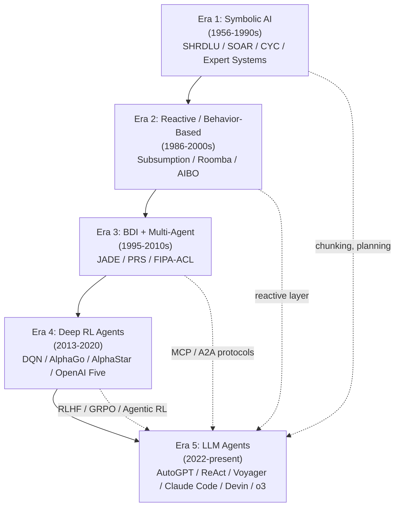

# Week 0.3 — Agent History and Foundational Narrative

## Exit Criteria

- [ ] Articulate the 4 agent eras + name 1 representative system per era
- [ ] Trace the lineage: symbolic AI (1956-1990s) → reactive (Brooks 1986) → BDI (1995-2010s) → DRL (2013-2020) → LLM agent (2022-present)
- [ ] Name 3 historical agent systems that influence current LLM-agent design (SHRDLU, SOAR, AutoGPT)
- [ ] Position LLM agents against the 2026 frontier: classic autonomous (AutoGPT) vs reasoning-orchestrated (Claude Code) vs RL-trained (o3 / Devin)
- [ ] Answer "what makes a system an agent vs a chatbot vs a tool-call?" with the 3-property definition
- [ ] Write 3 interview soundbites for "tell me about how agents evolved" — narrative + technical + 2026-frontier framing

## Why This Week Matters

Many interviews open with "tell me about your understanding of agents" — a softball question that exposes whether the candidate has DEPTH or just buzzword fluency. A candidate who can trace the lineage from symbolic AI through reactive robotics through BDI through reinforcement learning to LLM agents sounds like they've read the field, not just last week's blog posts. Without this narrative, you're tactical; with it, you're principled. This chapter is the speedrun — minimum content to answer the question well. It's a **reading + framing chapter**, not a lab — done in ~4 hours including the soundbite practice. Read BEFORE W0.5 (LLM Internals) and W1 (Vector Retrieval); the historical context makes every later chapter's "why does this exist?" easier to answer.

This chapter is the explicit cross-reference to **hello-agents Ch 1+2** ("Introduction to Agents" + "History of Agents") — the canonical Chinese-language narrative chapter on agent history. The structure below is curated for an interview-prep audience.

## Theory Primer — Four Eras of Agent Research

### Era 1 — Symbolic AI Agents (1956–1990s)

**Defining commitment:** Intelligence = symbol manipulation. Knowledge represented as logical formulae; reasoning = inference rules over a knowledge base.

**Landmark systems:**

- **SHRDLU** (Winograd 1968-1972) — blocks-world natural-language agent. First system to combine NLU + planning + spatial reasoning.
- **SOAR** (Newell, Laird, Rosenbloom 1983-) — unified cognitive architecture; production-rule system with chunking + impasse-driven learning.
- **CYC** (Lenat 1984-) — encyclopedic common-sense knowledge base; 30+ years of hand-curated facts.
- **Expert systems** (MYCIN 1976, XCON 1980) — rule-based decision-making in narrow domains (medical diagnosis, computer configuration).

**Failure mode:** Brittle. Symbol manipulation worked in toy domains but didn't generalize to real-world perception or robust language. The "AI winter" of the 1990s was largely caused by symbolic AI's promises outrunning its delivery.

**Why senior engineers still cite SOAR + SHRDLU:** they're the original "agent + tool" + "agent + plan" patterns. Modern LLM-agent loops (ReAct, Plan-and-Solve) are LLM-substrate re-implementations of SOAR's chunking + SHRDLU's domain-grounded action selection.

### Era 2 — Reactive + Behavior-Based Agents (1986–2000s)

**Defining commitment:** Brooks (1986) "Intelligence Without Representation" — agents don't need symbolic models; behavior emerges from simple reactive rules layered hierarchically. The world IS the model.

**Landmark systems:**

- **Subsumption architecture** (Brooks 1986) — robot control layered as parallel behaviors (avoid-obstacle / explore / map). Each layer can override lower layers.
- **iRobot's Roomba** (2002) — commercial proof that reactive behaviors scale.
- **Sony AIBO** (1999) — entertainment robot using behavior-based AI.

**Failure mode:** Reactive agents are great at NAVIGATION + SHORT-HORIZON tasks, terrible at LONG-HORIZON GOAL-DIRECTED behavior. You can't subsume your way to "write a research report."

**Why this matters for LLM agents:** Reactive behaviors are the FAST-PATH layer in modern hybrid agents. Cursor's tab-complete + Claude Code's bash-tool autocomplete are reactive primitives BELOW the LLM's reasoning. The architecture pattern lives on.

### Era 3 — BDI + Multi-Agent Systems (1995–2010s)

**Defining commitment:** Agents have explicit Beliefs, Desires, Intentions (BDI). Coordinate via Speech-Act-based protocols. Inspired by Bratman's philosophy of practical reasoning.

**Landmark systems:**

- **JADE** (Bellifemine 1998-) — FIPA-compliant Java agent framework. Standard ACL (Agent Communication Language).
- **Procedural Reasoning System (PRS)** (Georgeff 1995) — first BDI implementation.
- **Multi-agent simulations** in supply-chain, traffic, market-making.

**Failure mode:** BDI's commitment to explicit belief representation didn't scale to perception-heavy or language-rich domains. Multi-agent coordination overhead often exceeded single-agent efficiency.

**Why this matters for LLM agents:** Modern **MCP (Model Context Protocol)** + **A2A (Agent2Agent)** protocols inherit the agent-communication-language thesis from FIPA-ACL. The vocabulary (agent / message / capability / negotiation) traces directly back to BDI literature. Read W6.8 "Agent Communication Protocol Survey" to see the lineage applied to 2026.

### Era 4 — Deep RL Agents (2013–2020)

**Defining commitment:** Intelligence = learned policy through reward signals. No hand-coded rules; agent learns from experience.

**Landmark systems:**

- **DQN** (Mnih 2013) — Atari games from pixels.
- **AlphaGo** (Silver 2016) — Go champion via self-play + MCTS + value/policy networks.
- **AlphaStar** (DeepMind 2019) — StarCraft II grandmaster-level via population-based training.
- **OpenAI Five** (2018-2019) — Dota 2 5v5 via PPO + LSTM.

**Failure mode:** Sample efficiency. Deep RL agents need millions-to-billions of interactions; transfer between tasks is poor; reward specification is hard ("reward hacking").

**Why this matters for LLM agents:** Modern **Agentic RL** (W9.5 lab — SFT + GRPO on math + tool-use) inherits the policy-gradient training paradigm. RLHF / DPO / GRPO are descendants of PPO. The 2026 reality is HYBRID — LLM provides world knowledge + tool-use grammar; RL fine-tunes on task-specific reward signals.

### Era 5 — LLM Agents (2022–Present)

**Defining commitment:** Intelligence = next-token prediction conditioned on context + tool affordances. The LLM IS the policy.

**Landmark systems:**

- **AutoGPT** (Significant Gravitas 2023) — first viral autonomous LLM agent. Self-prompting loop + persistent memory + tool use. Brittle but proved the concept.
- **ReAct** (Yao 2022) — formalized the interleaved Reasoning + Action prompt pattern; the canonical LLM-agent loop.
- **Toolformer** (Schick 2023) — agent self-discovers which tools to use via in-context demonstrations.
- **Voyager** (Wang 2023) — Minecraft agent with skill library + curriculum learning; bridge between LLM agent + lifelong learning.
- **Claude Code** (Anthropic 2024-2025) — production coding agent with permissions + skills + parallel sub-agents.
- **Devin** (Cognition 2024) — autonomous software-engineering agent; SWE-bench leader.
- **o1 / o3** (OpenAI 2024-2025) — reasoning models with native CoT + tool use; agent capabilities baked into the base model.

**Why LLM agents won where Era 1-4 didn't:**

1. **Pre-trained world knowledge** — no need to hand-engineer the symbolic KB or RL the policy from scratch.
2. **Natural-language tool interface** — tools described as JSON schemas; agent invokes via structured output.
3. **In-context learning** — agent adapts to new tasks without weight updates.
4. **Composable with classic primitives** — LLM agent can wrap a SOAR-style planner, a Brooks-style reactive layer, an RL-trained sub-policy.

The 2026 frontier is **hybrid**: LLM agent at the orchestrator layer + Era 2-4 primitives as sub-components.

## The 3-Property Agent Definition

**Question often asked:** "What makes a system an agent vs a chatbot vs a function call?"

**3-property definition:**

1. **Goal-directedness** — system has a goal that requires multiple steps to achieve. A chatbot answers one question; an agent pursues a goal across many turns.
2. **Tool use** — system can take actions on the world via external tools (APIs, code, files, web). A pure-text generator is not an agent.
3. **Decision-making over a state space** — system chooses which action to take based on observed state; not a fixed script. A workflow with hardcoded branches is not an agent; a workflow where the LLM picks the branch is.

A function call has none of the three. A chatbot has #1 (kind of) but not #2 or #3. An n8n workflow has #2 but not #3. A ReAct agent has all three. Claude Code has all three plus parallelism + skills + sub-agents.

## Architecture Diagram — The Lineage

The lineage points are explicit: every Era contributes one or more primitives to the modern LLM-agent stack. **History is not "what we replaced" — it's "what we still use, in different forms."**

## Phase 1 — Read + Write (No Lab; ~3 hours)

### 1.1 Required reading

- **Russell & Norvig.** *Artificial Intelligence: A Modern Approach* — read Ch 2 ("Intelligent Agents") + skim Ch 25 ("Robotics"). The canonical academic taxonomy.
- **Stuart Russell.** *Human Compatible* (2019) — historical context for symbolic + reactive + RL agents from a senior researcher.
- **Brooks, R.** *Intelligence Without Representation* (1986). Short; foundational.
- **Yao et al. (2022).** *ReAct: Synergizing Reasoning and Acting in Language Models.* arXiv:2210.03629. The LLM-agent canonical paper.
- **Significant Gravitas.** *AutoGPT classic→Platform postmortem.* The lessons-learned blog from the team that started the autonomous-LLM-agent era.
- **hello-agents Ch 1 + Ch 2** — Datawhale's Chinese-language narrative. Read in parallel; cross-check with the English-language sources above.

### 1.2 Write your own narrative

Write a 500-word essay: "Agents from 1956 to 2026." Cover:
- One sentence per era + one representative system.
- Two lineage points (which Era's primitive lives on in modern LLM agents).
- The 3-property agent definition.
- One opinion: which Era's idea is currently UNDER-utilized in 2026 LLM-agent design.

This essay becomes your verbal answer to "tell me about your understanding of agents" — practice saying it out loud.

### 1.3 Build a 1-slide reference

Capture the 5-era timeline + 3-property definition on ONE slide / one mind-map / one cheat sheet. Pin it. Reference before every agent interview.

## Bad-Case Journal

*Provenance.* All pre-scoped — this is a narrative chapter; convert to observed entries after you've used the soundbites in real interviews.

**Entry 1 — Narrative is too academic; interviewer wants the SHIP-IT story.** *(pre-scoped)*
*Symptom:* You give the 5-era history; interviewer cuts in: "yes I know that — what does YOUR agent do?"
*Fix:* Open with 30 seconds of history + bridge into "and that's why I built X" — the history becomes the FRAMING for your current work, not the centerpiece.

**Entry 2 — Mixed up SOAR vs Soar 9 vs Soar++.** *(pre-scoped)*
*Symptom:* Confused the original Newell+Laird SOAR with later forks.
*Fix:* Stick with "SOAR (Newell et al. 1983-)" without versioning unless directly asked. Versioning matters only if the interviewer is academic + asks specifically.

**Entry 3 — Couldn't name any Era 3 (BDI / multi-agent) system.** *(pre-scoped)*
*Symptom:* "Multi-agent before LLMs? Uh..." Era 3 is the most-forgotten era because it's less famous than Era 1 + 4.
*Fix:* Memorize "JADE / FIPA-ACL / Procedural Reasoning System" as the Era 3 anchors. They feed directly into MCP/A2A protocol vocabulary in W6.8.

**Entry 4 — Over-claimed RL background.** *(pre-scoped)*
*Symptom:* Said "I work with RL" because GRPO was in W9.5 lab; interviewer drilled into PPO + reward hacking + sample efficiency; you couldn't keep up.
*Fix:* Position your RL exposure as "applied to agent fine-tuning" not "RL research." Senior signal is calibrated scope, not maximal claims.

## Interview Soundbites

**Soundbite 1 — "Tell me about your understanding of agents."**

"Five eras. Symbolic AI in the 1950s-1990s — SHRDLU, SOAR, expert systems — gave us planning + chunking + structured knowledge. Reactive / behavior-based in the 1980s-90s — Brooks' subsumption + Roomba — proved fast-path behaviors layer well below symbolic reasoning. BDI + multi-agent in the 1995-2010s — JADE, FIPA-ACL — gave us the agent-communication vocabulary that MCP and A2A inherit today. Deep RL in 2013-2020 — DQN, AlphaGo, AlphaStar — gave us the policy-gradient paradigm that GRPO + RLHF descend from. LLM agents since 2022 — AutoGPT, ReAct, Claude Code, Devin — won because pre-trained world knowledge + natural-language tool interface + in-context learning compose with all the prior eras' primitives. The 2026 frontier is hybrid: LLM at the orchestrator + Era 2-4 primitives as sub-components. My W4 ReAct lab is the LLM-orchestrator layer; my W9.5 lab adds RL fine-tuning on top."

**Soundbite 2 — "What makes a system an agent vs a chatbot vs a function call?"**

"Three properties. One: goal-directedness — pursues a goal across multiple steps, not just answers one question. A chatbot has this kind-of but loosely. Two: tool use — takes actions on the world via external APIs, code, files, web. Pure text generators don't qualify. Three: decision-making over a state space — chooses which action based on observed state, not a fixed script. A workflow with hardcoded branches is NOT an agent; a workflow where the LLM picks the branch IS. Function call has zero of the three; ReAct agent has all three; Claude Code has all three plus parallelism + skills + sub-agents. The 3-property definition is what I use to draw the line — and what most JDs are implicitly asking when they say 'agent.'"

**Soundbite 3 — "Which Era's idea is under-utilized in 2026 LLM-agent design?"**

"Era 2 — reactive / behavior-based — is the most under-utilized. Modern LLM agents try to do everything through the LLM's reasoning loop, which is expensive (1-5 seconds per step) and stochastic. Brooks' insight was that fast-path behaviors can layer BELOW symbolic reasoning and handle 80% of routine steps deterministically. Cursor's tab-complete + Claude Code's instant-bash-completion are exactly this pattern — but most production agents don't structure for it. I'd argue the next frontier is hybrid Era-2/Era-5: LLM reasons about novel situations + reactive primitives handle the recurring 80%. Cost reduction is large + latency improvement is large. My W6.9 Context Engineering chapter touches this with TodoLists as structured state — that's the reactive layer in disguise."

## References

- **Russell, S. & Norvig, P.** *Artificial Intelligence: A Modern Approach* (4th ed.). Ch 2 + 25. The academic canon.
- **Russell, S.** *Human Compatible* (2019). Senior-researcher historical context.
- **Brooks, R.** *Intelligence Without Representation.* Artificial Intelligence (1991). Era 2 foundational paper.
- **Newell, A., Laird, J., Rosenbloom, P.** *SOAR: An Architecture for General Intelligence.* Artificial Intelligence (1987). Era 1 cognitive-architecture canonical paper.
- **Bratman, M.** *Intentions, Plans, and Practical Reason* (1987). Philosophy of BDI.
- **Bellifemine, F. et al. (2007).** *Developing Multi-Agent Systems with JADE.* The Era 3 production reference.
- **Mnih et al. (2013).** *Playing Atari with Deep Reinforcement Learning.* arXiv:1312.5602. Era 4 inflection paper.
- **Yao et al. (2022).** *ReAct: Synergizing Reasoning and Acting in Language Models.* arXiv:2210.03629. Era 5 canonical paper.
- **hello-agents Ch 1 + 2** — Datawhale's *Introduction to Agents* + *History of Agents*. Chinese-language narrative chapter. https://github.com/datawhalechina/hello-agents

## Cross-References

- **Builds on:** none (foundational chapter)
- **Distinguish from:**
  - *[[Week 0.5 - LLM Internals Speedrun]]*: W0.5 covers the TRANSFORMER (tokenize + QKV + sampling); this chapter covers the AGENT HISTORY (symbolic → reactive → BDI → RL → LLM). Different abstraction layers; both foundational.
  - *[[Week 4 - ReAct From Scratch]]*: W4 is the LLM-agent IMPLEMENTATION; this chapter is the LLM-agent CONTEXT. Read this BEFORE W4 to know why ReAct's shape exists.
- **Connects to:** [[Week 4 - ReAct From Scratch]] (Era 5 ReAct lab), [[Week 5 - Pattern Zoo]] (Plan-and-Solve = Era 1 planning), [[Week 6.8 - Protocol Survey]] (MCP / A2A inherit Era 3 vocab), [[Week 9.5 - Agentic RL Fine-Tuning]] (Era 4 lineage)
- **Foreshadows:** [[Week 11 - System Design]] (when whiteboarding an agent system, citing era-specific primitives proves you've read the field, not just last week's blog posts)
