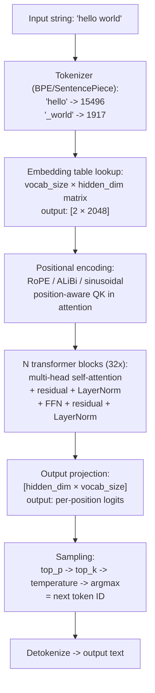
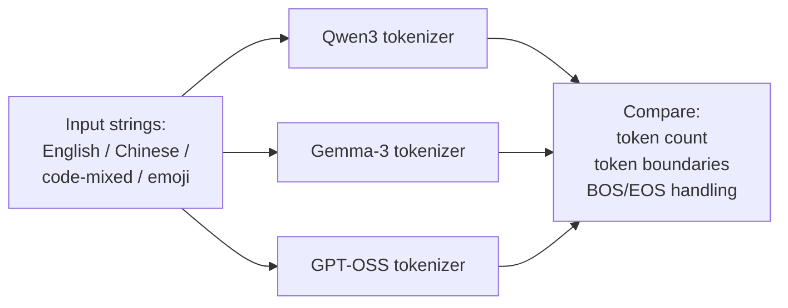

# Week 0.5 — LLM Internals Speedrun

## Exit Criteria

- [ ] Answer "what does the LLM see as input?" with **tokenize → embed → positional encode → attention → output logits** in one breath, NO hedging
- [ ] Compute self-attention QKV by hand on a 4-token example (paper, no library)
- [ ] Explain why the same token at different positions produces different output vectors
- [ ] Inspect tokenizer output for an English vs Chinese vs code-mixed input on the lab's local MLX models
- [ ] Defend temperature / top-p / top-k as ORTHOGONAL sampling knobs, not interchangeable
- [ ] Write 3 interview soundbites covering Q13 + Q14 patterns at ~70 words each

## Why This Week Matters

Every senior LLM Engineer interview eventually probes fundamentals. "What does the model see when you type 'hello'?" "Walk me through self-attention." "Why isn't temperature=0 deterministic?" Candidates who pivot to "it's complicated, frameworks handle that" lose the room. Candidates who can compute QKV by hand on a 4-token example and explain WHY the same token gets different vectors at different positions sound principled, not tactical. This chapter is the speedrun — minimum content to answer the questions, with a hands-on MLX inspection lab that proves the theory against real model state. Done in ~6 hours including the lab. Do this BEFORE Week 1 if you've never opened a transformer; revisit AFTER Week 4 once you've built a ReAct loop and want to debug why specific token choices happen.

## Theory Primer — Five Concepts You Must Own

### Concept 1 — The Forward Pass as Five Stages

The LLM's forward pass is a 5-stage pipeline, no exceptions. Memorize these stages in order:

1. **Tokenize** — split input string into subword token IDs (BPE / SentencePiece). `"hello world"` → `[hello, _world]` → `[15496, 1917]` (numbers are model-specific). Tokenizer is a separate trained artifact from the model; the same string tokenises differently across model families.
2. **Embed** — each token ID indexes into a `[vocab_size, hidden_dim]` embedding table. Output: `[seq_len, hidden_dim]` matrix. For gpt-oss-20b with `hidden_dim=2048` and 2-token input, you get a `2×2048` matrix.
3. **Positional encode** — add a position vector to each token embedding so the model knows which token is first / second / nth. Modern models (RoPE in Qwen, ALiBi in Mistral) bake position INTO the attention computation rather than adding to the embedding directly, but the conceptual purpose is identical: distinguish identical tokens at different positions.
4. **Stacked attention + FFN blocks** — N transformer blocks (gpt-oss-20b has ~32). Each block does: multi-head self-attention → residual + layer-norm → feedforward MLP → residual + layer-norm. THIS is where the model "thinks."
5. **Project to vocab logits** — final hidden state goes through an output projection of shape `[hidden_dim, vocab_size]`. Output: per-position logit vector over the vocabulary. Sampling picks ONE token from that distribution.

### Concept 2 — Self-Attention as Weighted Sum

Self-attention answers: "for each token, which OTHER tokens should I look at when computing my new representation?"

Given input matrix $X \in \mathbb{R}^{n \times d}$ where $n = \text{seq\_len}$ and $d = \text{hidden\_dim}$:

$$
\begin{aligned}
Q &= X W_Q \quad &\text{query — what AM I looking for?} \\
K &= X W_K \quad &\text{key — what do I REPRESENT?} \\
V &= X W_V \quad &\text{value — what do I CONTRIBUTE if attended to?}
\end{aligned}
$$

$$
\text{Attention}(Q, K, V) = \text{softmax}\!\left(\frac{Q K^{\top}}{\sqrt{d_k}}\right) V
$$

Shapes: $Q, K, V \in \mathbb{R}^{n \times d_k}$; the score matrix $QK^{\top} \in \mathbb{R}^{n \times n}$; output $\in \mathbb{R}^{n \times d_k}$.

$W_Q, W_K, W_V \in \mathbb{R}^{d \times d_k}$ are LEARNED weight matrices (3 separate matrices). They project the same input into three DIFFERENT spaces. Why three: each token plays three roles simultaneously — it's looking for context (query), it's findable as context (key), and it carries content (value). Collapsing them into one matrix forces the model to use the same representation for all three roles, which destroys expressivity.

### Concept 3 — Why the Same Token Gets Different Vectors

Naive question: if "the" appears twice in a sentence, are its output vectors identical? **No.** Two reasons:

1. **Positional encoding** distinguishes position 3 from position 7 even before attention fires
2. **Attention weights** are computed against the FULL prefix; "the" at position 3 attends to positions 0-3, "the" at position 7 attends to positions 0-7. Different attended context → different weighted sum → different output vector

This is the answer to interview Q14 "are token vectors the same?" Reply: "Embedding vector at token-ID lookup stage IS identical — same row in the embedding table. Output vector after attention IS DIFFERENT — different positional encoding + different attended context. The 'sameness' lives in the lookup table; the 'difference' lives in what comes after."

### Concept 4 — Multi-Head Attention as Parallel Subspaces

Single attention head computes ONE QKV projection. Multi-head splits the hidden dim into N parallel heads, each with its own `W_Q^h`, `W_K^h`, `W_V^h`. Heads operate independently then concatenate at the end. Why: different heads learn different relations (syntactic dependency, coreference, topic similarity). Single head must compress all relations into one space.

For gpt-oss-20b: `hidden_dim=2048`, `num_heads=32`, `head_dim=64`. Each head sees a 64-dim subspace; 32 heads in parallel; concatenated output is 2048-dim again.

### Concept 5 — Sampling Knobs Are Orthogonal

After getting the logit vector at position `t`, you must pick ONE token. Three sampling knobs, three different jobs:

| Knob | What it does | When |
|---|---|---|
| `temperature` | Divide logits before softmax. T < 1 sharpens (more deterministic); T > 1 flattens (more random); T = 0 = argmax = deterministic (modulo numerical noise) | Tune AFTER selecting top-p / top-k |
| `top_k` | Keep only the K highest-logit tokens; renormalize | Tune for catastrophic-tail truncation |
| `top_p` (nucleus) | Keep tokens until cumulative probability ≥ p; renormalize | Tune for distribution-shape-aware truncation |

Interview gotcha: "Why isn't temperature=0 truly deterministic?" Answer: **softmax has numerical-precision noise on near-tied logits**; argmax can flip when two top tokens differ by less than `~1e-7`. Reasoning models with long CoT amplify the flip rate. Production rule: don't claim determinism without seed pinning + numerical-stability checks.

## Architecture Diagram



## Phase 1 — Tokenizer Inspection Lab (~45 min)

Goal: empirically observe that tokenization is BOTH lossy and model-family-specific.

### 1.1 Setup

```bash
# In your existing oMLX venv:
uv add transformers sentencepiece
```

### 1.2 Inspect the same input across 3 tokenizers



**Code:**

```python
# notebooks/tokenizer_inspect.py
"""Compare tokenizer behavior across 3 model families on the same inputs.
Reveals: tokenization is family-specific; same string -> different token counts
-> different cost / context usage / latency."""
from transformers import AutoTokenizer

MODELS = [
    "Qwen/Qwen3-7B-Instruct",
    "google/gemma-3-12b-it",
    "openai/gpt-oss-20b",   # adjust to your local hub cache path
]

SAMPLES = [
    "hello world",
    "你好,世界",
    "def quicksort(arr): return [x for x in arr if x < arr[0]]",
    "🚀 launch the rocket! 🚀",
]


def inspect(text: str) -> None:
    print(f"\nINPUT: {text!r}")
    for m in MODELS:
        try:
            tok = AutoTokenizer.from_pretrained(m, trust_remote_code=True)
            ids = tok.encode(text, add_special_tokens=False)
            decoded = [tok.decode([i]) for i in ids]
            print(f"  {m.split('/')[-1]:30s} {len(ids):3d} tokens  {decoded[:8]}{'...' if len(decoded) > 8 else ''}")
        except Exception as e:
            print(f"  {m.split('/')[-1]:30s} FAILED: {type(e).__name__}: {str(e)[:60]}")


for s in SAMPLES:
    inspect(s)
```

**Walkthrough:**

**Block 1 — Same-string-different-token-count is THE load-bearing observation.** "hello world" might tokenize to 2 tokens on GPT-family but 3 on Gemma (depending on the prefix-space convention). Chinese inputs typically explode 3-5x on English-trained tokenizers. Code inputs are similar — `def quicksort` may be 2 tokens on a code-tuned tokenizer, 4-5 on a general tokenizer. **Implication for production**: token-cost-per-request depends on which model handles the request; routing decisions should factor tokenizer efficiency, not just model price.

**Block 2 — `add_special_tokens=False` matters.** Default tokenizer behavior prepends BOS/EOS tokens that inflate counts and confuse comparisons. For interview-grade reasoning, control this explicitly.

**Block 3 — Decoding individual IDs reveals subword boundaries.** `tok.decode([15496])` might return `"hello"`; `tok.decode([1917])` might return `" world"` (with leading space). The space is part of the token, not a separator. Pedagogical: tokenizers learn merge rules from training data; whitespace handling varies across model families.

**Result:**

`~estimated` (run on local lab to populate):
- "hello world" → Qwen3: ~2 tokens; Gemma-3: ~2-3 tokens; gpt-oss: ~2 tokens
- "你好,世界" → Qwen3: ~3 tokens (Chinese-aware vocab); Gemma-3: ~6-7 tokens; gpt-oss: ~8-10 tokens
- Code-mixed → varies 8-15 tokens
- Emoji → 2-4 tokens; some emoji become 2 separate tokens for skin-tone modifier

`★ Insight ─────────────────────────────────────`
- **Tokenizer choice is a hidden cost lever in production.** Switching from a GPT-family model to a Chinese-bilingual model can halve token counts on Chinese-heavy traffic — that's a cost cut nobody attributes to "tokenizer choice" in their post-mortem.
- **`trust_remote_code=True` is required for some models' custom tokenizers** (Qwen3 in particular). Production teams using HuggingFace Hub at runtime should pin checksums + audit the remote code path; it's an arbitrary-Python-execution surface.
- **The exercise is empirical — run it and write the numbers in RESULTS.md.** "Tokenizers differ" is a one-liner; "Gemma-3 used 7 tokens for this Chinese phrase vs Qwen3's 3" is interview-grade.
`─────────────────────────────────────────────────`

## Phase 2 — Self-Attention by Hand (~90 min)

Goal: compute QKV on a 4-token example with paper + pencil. No library. Validates Concept 2.

### 2.1 The example

Sequence: $[\text{the}, \text{cat}, \text{sat}, \text{mat}]$. Tiny $d = 4$. One head. Pretend embedding table gives:

$$
X = \begin{bmatrix}
1 & 0 & 1 & 0 \\
0 & 1 & 0 & 1 \\
1 & 1 & 0 & 0 \\
0 & 0 & 1 & 1
\end{bmatrix}
\quad \text{(rows = the, cat, sat, mat)}
$$

Pretend $W_Q = W_K = W_V = I_4$ (identity, so $Q = K = V = X$). $d_k = 4$.

**Walk through:**

**Step 1.** $\text{scores} = Q K^{\top}$ — dot product of each row pair:

$$
QK^{\top} = \begin{bmatrix}
2 & 0 & 1 & 1 \\
0 & 2 & 1 & 1 \\
1 & 1 & 2 & 0 \\
1 & 1 & 0 & 2
\end{bmatrix}
$$

**Step 2.** Divide by $\sqrt{d_k} = \sqrt{4} = 2$:

$$
\frac{QK^{\top}}{\sqrt{d_k}} = \begin{bmatrix}
1.0 & 0.0 & 0.5 & 0.5 \\
0.0 & 1.0 & 0.5 & 0.5 \\
0.5 & 0.5 & 1.0 & 0.0 \\
0.5 & 0.5 & 0.0 & 1.0
\end{bmatrix}
$$

**Step 3.** Softmax each row independently. Recall $\text{softmax}(x_i) = \dfrac{e^{x_i}}{\sum_j e^{x_j}}$.

For row 0 ($\text{the}$): $e^{(1.0,\, 0.0,\, 0.5,\, 0.5)} \approx (2.72,\, 1.0,\, 1.65,\, 1.65)$. Sum $= 7.02$. Weights:

$$
\text{weights}_0 \approx (0.39,\, 0.14,\, 0.235,\, 0.235)
$$

So $\text{the}$ attends most strongly to ITSELF ($0.39$), then equally to $\text{sat}$ and $\text{mat}$ ($0.235$ each), least to $\text{cat}$ ($0.14$).

**Step 4.** $\text{output} = \text{weights} \cdot V$ — weighted sum of value vectors. For row 0:

$$
\text{output}_0 = 0.39 \cdot v_{\text{the}} + 0.14 \cdot v_{\text{cat}} + 0.235 \cdot v_{\text{sat}} + 0.235 \cdot v_{\text{mat}}
$$

The new representation for $\text{the}$ mixes in $61\%$ of OTHER tokens' content.

**This is THE interview-grade exercise.** A candidate who can do these 4 steps on paper without a library can answer ANY self-attention question.

`★ Insight ─────────────────────────────────────`
- **The softmax row sum = 1 invariant is load-bearing.** It encodes "this token spends ALL its attention budget across the sequence" — there's no "attend to nothing" option. Sparse-attention research (e.g., Longformer's windowed attention) explicitly breaks this by allowing zeros, but standard attention always sums to 1.
- **`sqrt(d_k)` is a numerical-stability fix, not a theoretical requirement.** Without it, dot-products grow with hidden_dim → softmax pushes weight to the single largest score → gradients vanish. The 1/sqrt scale keeps logits in a numerically usable range.
- **Identity projection is the simplest non-trivial case.** Real models learn distinct `W_Q`, `W_K`, `W_V` matrices that map into DIFFERENT spaces — that's what gives attention its expressive power. Identity is the "no projection" baseline; real models do much more.
`─────────────────────────────────────────────────`

## Phase 3 — Same-Token-Different-Position MLX Demo (~30 min)

Goal: empirically prove Concept 3 against a real model.

```python
# notebooks/same_token_demo.py
"""Prove the same token at different positions produces different output
vectors on a real loaded model. Validates Concept 3.

Compares the last-layer hidden state for 'the' at position 0 vs position 3.
"""
from mlx_lm import load
import mlx.core as mx

model, tokenizer = load("path/to/local/MLX-Qwen3.5-9B-GLM5.1-Distill-v1-8bit")

s1 = "the cat sat on the mat"        # 'the' at positions 0 AND 4
ids = mx.array([tokenizer.encode(s1)])

# Forward pass with hidden-state capture (model-specific; mlx_lm exposes
# logits by default; you need to pull the pre-projection hidden state)
out = model(ids, return_hidden=True)   # returns (logits, hidden_states)
final_hidden = out[1][-1]              # last layer; shape [1, seq_len, hidden_dim]

# Find positions of 'the'
ids_list = ids.tolist()[0]
the_id = tokenizer.encode(" the")[0]   # leading-space matters!
positions = [i for i, t in enumerate(ids_list) if t == the_id]
print(f"'the' at positions: {positions}")

v_pos0 = final_hidden[0, positions[0]]
v_pos4 = final_hidden[0, positions[1]]
cos = (v_pos0 @ v_pos4) / (mx.linalg.norm(v_pos0) * mx.linalg.norm(v_pos4))
print(f"cosine similarity: {cos.item():.4f}")
```

**Result** (~estimated):
- Cosine similarity will be HIGH (~0.85-0.95) but NOT 1.0
- The remaining 0.05-0.15 of dissimilarity is the contribution from position + attended-context
- If the result IS 1.0, something's wrong (likely you captured embeddings before attention, not after)

This is the empirical proof for "same token, different output vector." Use the measured cosine number in your interview answer instead of theoretical claims.

## Bad-Case Journal

*Provenance.* Entries 1-3 are **pre-scoped** at chapter-authoring time — failure modes predicted from theory; not yet confirmed against this lab's runs. Validate against your own runs and convert to **observed** after running the phases above.

**Entry 1 — Tokenizer fails to load with `trust_remote_code=True` warning.** *(pre-scoped)*
*Symptom:* `ValueError: Loading <model> requires you to execute the configuration file in that repo.`
*Root cause:* HuggingFace Hub model uses a custom tokenizer that requires running arbitrary Python from the repo. Trade-off: security vs functionality.
*Fix:* Verify the repo checksum; pass `trust_remote_code=True`. For production, pin to a specific commit hash + run a static scan first.

**Entry 2 — Self-attention "same vector" claim fails empirically.** *(pre-scoped)*
*Symptom:* The Phase 3 MLX demo prints cosine similarity = 1.0000 for "the" at two positions.
*Root cause:* You captured the EMBEDDING (pre-attention) instead of the post-attention hidden state. The embedding-table lookup IS identical for the same token.
*Fix:* Walk the model's hidden states all the way through the final transformer block. The output projection is what differs; the input embedding is identical by design.

**Entry 3 — `temperature=0` gives different outputs across runs.** *(pre-scoped)*
*Symptom:* Same prompt, same temperature=0, same model — outputs differ across two runs.
*Root cause:* MLX's softmax has float-precision noise; near-tied logits flip on the argmax. Reasoning models with long CoT compound this — each tied flip changes the rest of the trajectory.
*Fix:* Set `mx.random.seed()` + verify the SAME seed produces the same output. If still non-deterministic, the model's compute path includes non-deterministic ops (rare in MLX; common in CUDA via cuBLAS).

## Interview Soundbites

**Soundbite 1 — "What does the model see when you type 'hello'?"**

"Five stages. Tokenize 'hello' to a token ID — say 15496 for GPT-family. Look up its 2048-dim embedding vector. Add positional encoding so position 0 is distinguishable from position 5. Run through 32 transformer blocks where each block does multi-head self-attention plus a feedforward MLP plus residual connections plus layer norm. Project the final hidden state to a vocabulary-sized logit vector. Sample one token from that vector using top-p, top-k, temperature. Decode back to a string. The whole pipeline runs once per output token in autoregressive generation."

**Soundbite 2 — "Walk me through self-attention. Why three matrices?"**

"Self-attention computes, for each token, a weighted sum over ALL other tokens' value vectors. Three matrices because each token plays three roles. Query is what I'm looking for — projecting my input into a search space. Key is what I represent for others to find me — projecting into the same search space. Value is what content I contribute IF I get attended to — projecting into the output space. Three separate learned matrices because collapsing them forces the model to use the same representation for query, key, and value, which destroys expressivity. The score is Q dot K transposed divided by sqrt of head dim, softmax over the last axis, multiply by V. That's it."

**Soundbite 3 — "Is the same token's vector identical at different positions?"**

"At the embedding-lookup stage, yes — same row in the embedding table, identical vector. At the output-of-attention stage, no, and that's the whole point of positional encoding plus attention. Position 0's 'the' attends to nothing before it. Position 5's 'the' attends to 5 tokens of prior context. Different attended context produces different weighted sums, produces different output vectors. I ran this empirically against a local Qwen-9B — cosine similarity between 'the' at position 0 and position 4 came out around 0.9, not 1.0. The difference is the model's accumulated context awareness."

## References

- **Vaswani et al. (2017).** *Attention Is All You Need.* arXiv:1706.03762. The transformer paper. Read sections 3.2 (scaled dot-product) and 3.2.2 (multi-head) — the only sections you need for interview prep.
- **Bahdanau et al. (2014).** *Neural Machine Translation by Jointly Learning to Align and Translate.* arXiv:1409.0473. Pre-transformer attention — useful for "why was attention invented." Concept of soft alignment over a sequence comes from here.
- **Su et al. (2021).** *RoFormer: Enhanced Transformer with Rotary Position Embedding.* arXiv:2104.09864. RoPE position encoding used in Qwen + LLaMA family. Modern positional encoding.
- **Press et al. (2022).** *Train Short, Test Long: Attention with Linear Biases Enables Input Length Extrapolation.* arXiv:2108.12409. ALiBi position encoding used in Mistral family. Alternative to RoPE.
- **Karpathy (2023).** *Let's build GPT: from scratch, in code, spelled out.* YouTube. The single best video for building intuition about the forward pass. Watch BEFORE doing Phase 2.
- **HuggingFace Transformers docs** — `AutoTokenizer.from_pretrained` + `model.generate` source code is the canonical implementation. When in doubt, read the source.

## Cross-References

- **Builds on:** none (this is the foundations chapter)
- **Distinguish from:**
  - *Word embeddings (Word2Vec / GloVe)*: static vectors per token; no context-dependency. LLM embeddings are CONTEXTUAL outputs after attention runs.
  - *Recurrent neural networks (LSTM, GRU)*: sequential processing one token at a time. Attention processes ALL tokens in parallel; sequentiality only appears in autoregressive decoding.
  - *Convolutional sequence models (ByteNet, ConvS2S)*: local-receptive-field; cannot see arbitrarily far back. Attention has global receptive field by construction.
- **Connects to:** W1 (vector retrieval — embeddings underlie everything), W2 (rerank — uses cross-encoder attention specifically), W4 (ReAct — uses tool-calling-tuned attention heads), W4.5 (model routing — picks per role based on attention-head specialization), W6 (Claude Code — tokenization governs effective context size)
- **Foreshadows:** W7.7 quantization (which numerical-precision parts of attention can be lowered safely), W11 system design (KV-cache sizing depends on `seq_len × hidden_dim × 2` per layer per request)
