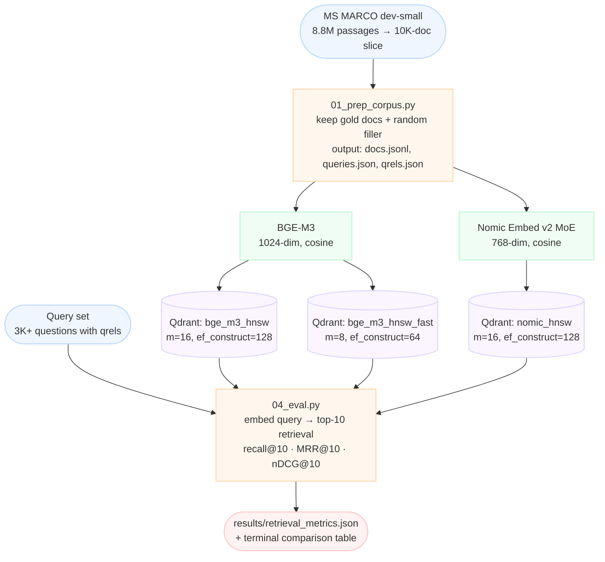

# Week 1 — Vector Retrieval Baseline

> Goal: own the full embed → index → retrieve → measure loop. Cold-answer "how do you choose an embedding model" with numbers from **your own** table.

**Exit criteria.**
- [ ] Three embedding models measured on the same corpus (BGE-M3, optionally Nomic Embed v2, optionally a 3rd MLX-native)
- [ ] Two index configs measured (HNSW + IVF-Flat)
- [ ] Recall@10, MRR@10, nDCG@10 computed for each combo
- [ ] `RESULTS.md` written with a comparison table + 3-paragraph reflection
- [ ] You can whiteboard "how HNSW works" in 60 seconds

---

## Theory Primer (~1-2h)

> Replaces the "read all these papers" overhead. Internalize these concepts and you will be able to discuss every key topic for this week fluently in an interview. Primary sources are listed at the end for optional deep dives.

### Concept 1: What an Embedding Model Actually Compresses

An embedding model converts a variable-length text into a fixed-length vector by compressing meaning into a dense numeric representation. The critical distinction is what kind of meaning survives compression. Lexical signal is surface-level: exact words, subword tokens, character patterns. Semantic signal is deeper: intent, paraphrase equivalence, topical relatedness. Classical keyword search (BM25) preserves lexical signal with no compression at all. A dense embedding model trades lexical precision for semantic generalization — it maps "automobile" and "car" close together in vector space, but may place "Ford Mustang GT500" far from a query for that exact string because the rare entity drowns in the averaged semantic field.

BGE-M3 (Chen et al. 2024) addresses this tradeoff with a hybrid architecture that produces three distinct representations from a single forward pass: a dense vector (1024 dimensions, suitable for cosine search), a sparse lexical vector (weighted token importance scores, directly comparable to BM25 outputs), and ColBERT-style multi-vector token embeddings for late interaction. The paper describes this as "one model achieving multi-functionality" (BGE-M3 §3.1). The sparse branch recovers the lexical precision that dense compression loses; the multi-vector branch allows fine-grained token-level matching rather than collapsing a document to a single point.

Dimensionality is a real cost axis, not just a quality knob. OpenAI's text-embedding-3-large at 3072 dimensions stores 3x more bytes per vector than BGE-M3 at 1024, and roughly 4x more than Nomic Embed v2's 768-dimensional output. At ten million documents, that difference is hundreds of gigabytes of VRAM and disk before you account for index overhead. Nomic Embed v2 achieves competitive retrieval quality at 768 dimensions by using a Mixture-of-Experts architecture that routes different input types through specialized subnetworks rather than using a monolithic transformer for everything. The practical takeaway: dimension is a budget decision. Higher is not always better once you are past ~1024 dims on most open-domain corpora; verify with your own recall table before paying the storage cost.

> **Interview soundbite:** "Dense embeddings trade lexical precision for semantic generalization; BGE-M3 recovers lexical precision by producing a sparse vector alongside the dense one in a single forward pass, so you get both without running two models."

---

### Concept 2: HNSW vs IVF — Index Structure Tradeoffs

Approximate nearest neighbor search exists because brute-force cosine comparison across millions of vectors at query time is too slow for interactive latency. The two dominant index families take fundamentally different approaches to organizing the search space.

HNSW (Hierarchical Navigable Small World) builds a layered graph over the corpus. Each vector is a node. During construction, each node is connected to `m` neighbors selected by a greedy search; the parameter `ef_construct` controls how wide that greedy search is — higher values examine more candidates and produce better-connected graphs at the cost of longer build time. At query time, the search descends from a coarse top layer (few nodes, long edges) down to a dense bottom layer, following the closest neighbors greedily. Pinecone's vector database documentation describes the navigation as "zooming in" from a rough global view to a precise local neighborhood. HNSW delivers excellent recall across a wide range of corpus sizes and is the default in Qdrant, Weaviate, and most modern vector stores. Its weakness is memory: every node stores its neighbor list in RAM, which scales with `m × n_vectors`.

IVF (Inverted File Index) takes a clustering approach. During build, k-means partitions all vectors into `n_lists` coarse clusters. At query time, the search identifies the `nprobe` closest cluster centroids, then does exact search within only those clusters. This is dramatically more memory-efficient than HNSW because the index is mostly disk-resident cluster boundaries. The tradeoff is recall sensitivity: if the true nearest neighbor happens to sit in a cluster whose centroid is not among the `nprobe` closest, that neighbor is missed entirely. Raising `nprobe` recovers recall but increases search latency linearly.

The practical decision rule: HNSW for corpora up to roughly 10-50M vectors where you can afford the RAM; IVF (often IVF-PQ with product quantization for further compression) for hundred-million to billion-scale corpora where you cannot. For this week's 10K-document lab, either index is effectively exact — the distinction becomes real only when you are measuring tradeoffs at scale.

> **Interview soundbite:** "HNSW navigates a layered graph and is the right default up to tens of millions of vectors; IVF partitions into clusters and trades recall sensitivity for memory efficiency at billion-scale — the `nprobe` knob is the recall/latency dial."

---

### Concept 3: Recall, Precision, MRR, and nDCG — What Each Actually Measures

These four metrics live at different positions in the quality-measurement tradeoff space, and conflating them is a common interview trap.

**Recall@k** answers: of all the relevant documents, what fraction appear in the top-k results? It is a coverage metric. In a RAG pipeline where a downstream reranker will further filter the top-k, recall@k is the metric that matters most at the retrieval stage. If a gold document is not in the top-10, no reranker can surface it. This is why the eval script in this lab treats recall@10 as the primary signal.

**Precision@k** answers: of the k returned documents, what fraction are relevant? It penalizes noise in the result list. Precision and recall trade off: a system can trivially maximize recall@k by returning everything, but precision collapses. In practice, for RAG retrieval feeding a reranker, you optimize recall at the retrieval stage and let the reranker handle precision.

**MRR@k** (Mean Reciprocal Rank) rewards the rank of the first relevant document. The reciprocal of rank 1 is 1.0; rank 5 is 0.2; rank 10 is 0.1; absent is 0. MRR is appropriate when users care most about whether the single best answer appears near the top — search engines optimizing for a single-answer experience, for example. It is harsher than recall and insensitive to what happens below the first hit.

**nDCG@k** (Normalized Discounted Cumulative Gain) applies a logarithmic discount by rank and normalizes against the ideal ranking. With binary relevance labels (as in MS MARCO), nDCG and MRR converge when queries have one gold document. They diverge for queries with multiple graded-relevance documents: nDCG rewards placing the most-relevant document highest, not merely any relevant document. The Anthropic "Contextual Retrieval" blog (Sept 2024) uses recall@k as the headline metric precisely because the retrieval stage feeds a reranker — end-to-end quality is measured separately. For leaderboard comparisons of full retrieval systems, nDCG@10 is the standard (BEIR benchmark, TREC tracks).

> **Interview soundbite:** "In a RAG pipeline I optimize recall@k at the retrieval stage — if the gold document isn't in the top-k, the reranker can't save it — and measure nDCG end-to-end after reranking, where rank position actually costs something."

---

### Concept 4: Hybrid Retrieval and Reciprocal Rank Fusion

Dense retrieval generalizes well across paraphrase and semantic variation, but it has a systematic failure mode: rare entities, product codes, version numbers, and exact-match queries. If the training corpus never saw "CVE-2024-3094" or "AWS us-east-1a," the dense model has no basis for representing it distinctively — the embedding becomes a generic "technical string" cluster with poor discrimination. BM25, which counts exact token matches weighted by inverse document frequency, handles these cases natively because it never needed to learn the tokens.

Hybrid retrieval runs dense and sparse (BM25) retrieval independently and merges the ranked lists. The dominant combiner is Reciprocal Rank Fusion (Cormack et al., SIGIR 2009). RRF computes a score for each document as the sum of `1 / (k + rank_i)` across all ranked lists, where `k` is a dampening constant. Cormack et al. found `k=60` to be robust across a wide range of fusion scenarios — it prevents top-ranked documents in a single list from dominating when they score poorly in another. The Anthropic Contextual Retrieval blog reports that combining BM25 with dense retrieval reduced retrieval failures by 49% compared to dense alone on their internal benchmark, with the gains concentrated on queries containing rare proper nouns and verbatim phrases.

The practical implementation for this week's stack: run a Qdrant vector search for the dense results and a separate BM25 index (e.g., `rank_bm25` or Elasticsearch) for the sparse results, collect ranked lists from both, apply RRF with k=60, and re-rank the merged list. ColBERTv2 (Santhanam et al. 2022) formalized the multi-vector late-interaction alternative, where each query token attends to every document token — a middle path between full cross-encoder joint encoding and single-vector bi-encoder compression. BGE-M3's multi-vector output is directly inspired by this framing and enables ColBERT-style scoring without a separate model.

The decision criterion for when to invest in hybrid: if your query distribution includes exact entity names, product identifiers, version strings, or verbatim quotes, sparse retrieval is not optional — it is closing a systematic hole in dense recall. If your corpus is entirely natural-language prose with no rare tokens, the marginal gain from adding BM25 shrinks and may not justify the operational complexity.

> **Interview soundbite:** "I combine BM25 and dense retrieval with Reciprocal Rank Fusion using k=60 — Cormack et al.'s dampening constant that prevents one list from dominating — because dense models fail on rare entities and exact strings that BM25 handles natively."

---

### Optional deep dives

- **BGE-M3 (Chen et al. 2024)** — Read §3 (model architecture) and §4 (training) when you want to understand how the sparse and multi-vector heads are trained jointly. ~45 min. Skip §5 (multilingual experiments) unless you are working on multilingual retrieval.
- **Reciprocal Rank Fusion (Cormack, Clarke & Buettcher, SIGIR 2009)** — Two pages. Read it once to see the derivation of k=60 and the original experiments. ~15 min. Worth it because the k=60 "magic constant" will come up and you should know it is not arbitrary.
- **ColBERTv2 (Santhanam et al. 2022)** — Read the introduction and §3 (late interaction mechanism) to understand the bi-encoder vs multi-vector distinction BGE-M3 inherits. ~30 min. Skip the compression sections unless you are implementing your own index.
- **Anthropic "Contextual Retrieval" blog (Sept 2024)** — Read in full; it is short (~10 min) and gives you a production-grounded justification for hybrid retrieval with concrete failure-rate numbers you can cite.
- **Skip the rest** unless a concept above did not click. The four concepts above are sufficient to field every retrieval question at the W1 level.

---
- **[Gulli *Agentic Design Patterns* Ch 14 — Knowledge Retrieval (RAG)]** — framework-agnostic pattern overview; a gentle intro before the more technical BGE-M3 / ColBERT material. Companion notebook available in the repo. ~20 min

## Architecture

The week's pipeline has a single trunk with three parallel branches — one per `(embedding model, index config)` combination. All branches feed into one evaluation harness, producing a comparison table you can read at the end of Phase 4.



**What this shows.** The corpus prep script (Phase 1) is a one-time reconcile step that ensures every gold-relevant document lands in the 10K slice — without this guarantee, recall@10 would be artificially capped. The embedding step (Phase 3) is the most time-consuming branch; Qdrant stores the resulting vectors under HNSW with configurable graph parameters. The evaluation harness (Phase 4) re-embeds every query at runtime — this is intentional, because query-time latency is what matters in production — then scans all three collections with a single script so results are directly comparable. The final table lets you answer "which model × index gives the best recall/speed tradeoff on this corpus" with your own numbers.

---

## Phase 1 — Corpus Prep (~90 min)

Use the **MS MARCO dev set v2** — real queries, labeled relevance, free, widely cited.

### 1.1 Activate env and cd into the lab

```bash
cd ~/code/agent-prep/lab-01-vector-baseline
source ../.venv/bin/activate
set -a; source ../.env; set +a
mkdir -p data src results
```

### 1.2 Download MS MARCO passage dev set (small variant)

```bash
uv pip install ir_datasets
python -c "
import ir_datasets
ds = ir_datasets.load('msmarco-passage/dev/small')
print('queries:', ds.queries_count())
print('qrels  :', ds.qrels_count())
print('docs   :', ds.docs_count())   # this will stream the full 8M passages
"
```

Expected: `queries: 6980`, `qrels: 7437`, `docs: 8841823`.

### 1.3 Create a 10K-doc slice (keep the lab fast)

Save as `src/01_prep_corpus.py`:

```python
"""Slice MS MARCO down to a manageable subset keyed by qrel-hit docs + filler."""
import ir_datasets, json, random
from pathlib import Path

OUT = Path("data")
OUT.mkdir(exist_ok=True)
random.seed(42)  # reproducible filler sampling across runs

ds = ir_datasets.load("msmarco-passage/dev/small")

# 1. Queries & qrels
queries = {q.query_id: q.text for q in ds.queries_iter()}
qrels = {}
for qrel in ds.qrels_iter():
    qrels.setdefault(qrel.query_id, []).append(qrel.doc_id)
print(f"loaded {len(queries)} queries, {sum(len(v) for v in qrels.values())} qrels")

# 2. Gold doc IDs (ensure recall is possible)
gold = {doc_id for docs in qrels.values() for doc_id in docs}
print(f"{len(gold)} gold docs")

# 3. Filler doc IDs — stream first N non-gold
filler_target = 10_000 - len(gold)  # pad to exactly 10K total docs
filler = []
for doc in ds.docs_iter():
    if doc.doc_id not in gold:
        filler.append(doc.doc_id)
        if len(filler) >= filler_target:
            break  # stop streaming early — 8M docs is expensive to scan fully
keep = gold | set(filler)
print(f"keeping {len(keep)} docs total")

# 4. Second pass: write only the kept docs
with (OUT / "docs.jsonl").open("w") as f:
    for doc in ds.docs_iter():
        if doc.doc_id in keep:
            f.write(json.dumps({"id": doc.doc_id, "text": doc.text}) + "\n")

# 5. Keep only queries that have at least one qrel in the kept set
keep_q = {}
keep_qrels = {}
for qid, gold_ids in qrels.items():
    hit = [g for g in gold_ids if g in keep]
    if hit:
        keep_q[qid] = queries[qid]
        keep_qrels[qid] = hit
print(f"retained {len(keep_q)} queries with qrels")

(OUT / "queries.json").write_text(json.dumps(keep_q, indent=2))
(OUT / "qrels.json").write_text(json.dumps(keep_qrels, indent=2))
print("done.")
```

### Code walkthrough

**Chunk 1 — Seed and dataset load (lines 1-8):** Loads MS MARCO dev-small via `ir_datasets`, which handles local caching automatically. `random.seed(42)` ensures filler sampling is reproducible — re-running the script always produces the identical 10K slice.

**Chunk 2 — Query and qrel extraction (lines 10-14):** Materialises all queries into a dict and inverts qrels into `{query_id: [doc_id, ...]}`. The qrel structure is what defines "relevant" — without it, there is nothing to measure recall against.

**Chunk 3 — Gold set construction (lines 16-18):** Flattens all qrel doc IDs into a single set called `gold`. Every document that is a correct answer to any query must be present in the 10K slice; if a gold doc is missing, recall@10 is artificially capped at whatever fraction of queries have all their gold docs in the corpus.

**Chunk 4 — Filler sampling with early-stop (lines 20-28):** Streams the 8.8M-passage corpus and collects the first `filler_target` non-gold docs, then stops. The early-stop (`break`) matters — without it, this loop would stream all 8.8M passages for no reason.

> **Why:** Two passes over the corpus are necessary because `ir_datasets` streams docs sequentially. The first pass identifies which IDs to keep; the second pass writes only those. Storing all 8.8M texts in memory to avoid a second pass would require ~30 GB RAM.

**Chunk 5 — Query pruning (lines 30-38):** Drops queries whose gold docs did not make it into the 10K slice. This prevents phantom misses in evaluation — a query with no reachable gold doc would always score 0, biasing metrics downward.

**Common modifications:** To change corpus size, adjust `10_000` in `filler_target`; to use a different MS MARCO split (e.g., `msmarco-passage/train`), change the `ir_datasets.load` argument and expect different query counts.

Run:

```bash
python src/01_prep_corpus.py
wc -l data/docs.jsonl                          # → 10000
python -c "import json; print(len(json.load(open('data/queries.json'))))"   # ≥ 3000
```

### 1.4 Verify a random sample looks right

```bash
python -c "
import json, random
docs = [json.loads(l) for l in open('data/docs.jsonl')]
print(random.choice(docs))
"
```

Expected: a JSON object with `id` and `text` (text is a real-looking passage).

---

## Phase 2 — Qdrant Collections (~20 min)

Qdrant should already be running on `:6333` from Week 0. Verify:

```bash
curl -s http://127.0.0.1:6333/healthz    # → healthz check passed
```

### 2.1 Create three collections — one per embedding model × index config

We'll populate them in Phase 3. For now, just sketch the schema.

Save as `src/02_collections.py`:

```python
"""Create empty Qdrant collections with different index params."""
from qdrant_client import QdrantClient
from qdrant_client.http.models import Distance, VectorParams, HnswConfigDiff, OptimizersConfigDiff

qd = QdrantClient(url="http://127.0.0.1:6333")

specs = [
    # (name, dim, distance, hnsw_ef_construct, m)
    ("bge_m3_hnsw",      1024, Distance.COSINE, 128, 16),  # standard HNSW — quality baseline
    ("bge_m3_hnsw_fast",  1024, Distance.COSINE,  64,  8), # ablation: half the graph density
    ("nomic_hnsw",         768, Distance.COSINE, 128, 16),  # different dim — must match model output exactly
]

for name, dim, dist, ef, m in specs:
    if qd.collection_exists(name):
        qd.delete_collection(name)  # idempotent — safe to re-run the script
    qd.create_collection(
        collection_name=name,
        vectors_config=VectorParams(size=dim, distance=dist),
        hnsw_config=HnswConfigDiff(ef_construct=ef, m=m),  # graph params set at collection creation, not changeable later without re-indexing
    )
    print(f"created {name}  dim={dim}  m={m}  ef_construct={ef}")

print("\nCollections:")
for c in qd.get_collections().collections:
    print(" -", c.name)
```

### Code walkthrough

**Chunk 1 — Client connection (lines 1-4):** Instantiates a Qdrant client pointing at the local Docker container. No authentication is needed for a local dev instance; production deployments add an API key here.

**Chunk 2 — Spec table (lines 6-10):** Declares all three collections as a data-driven list of tuples rather than three separate `create_collection` calls. This makes it trivial to add a fourth config — add one line to the list and re-run.

> **Why `Distance.COSINE` and not `Distance.DOT`?** BGE-M3 and Nomic both ship pre-normalized vectors, so cosine and dot product are mathematically equivalent for them. `Distance.COSINE` is chosen for clarity — it signals intent to future readers without depending on normalization being correct at insert time. If you forget to normalize on the Python side, Qdrant's cosine path still normalizes internally; dot product would silently return wrong rankings.

**Chunk 3 — Idempotent create (lines 12-19):** The `delete_collection` guard makes the script safe to re-run after a failed ingestion. Without it, Qdrant would raise `collection already exists` and the script would crash midway, leaving the other collections uncreated.

**Chunk 4 — HNSW params at creation time (line 18):** `ef_construct` and `m` are fixed at collection-creation time in Qdrant. Changing them later requires deleting and recreating the collection plus re-indexing all vectors — which is why this script is deliberately separated from the ingestion script.

**Common modifications:** To add an IVF-Flat collection (exact search for small corpora), create the collection with `optimizers_config=OptimizersConfigDiff(indexing_threshold=0)` to disable HNSW build, then query with `search_params=SearchParams(exact=True)`.

```bash
python src/02_collections.py
```

Expected output ends with three collections listed.

---

## Phase 3 — Embed & Index (~3–4 hours, mostly waiting on the GPU)

### 3.1 BGE-M3 ingestion

Save as `src/03_ingest_bge.py`:

```python
"""Embed all 10K docs with BGE-M3 and upsert into bge_m3_hnsw."""
import json, time, os
from pathlib import Path
from sentence_transformers import SentenceTransformer
from qdrant_client import QdrantClient
from qdrant_client.http.models import PointStruct

HOME = os.path.expanduser("~")
MODEL = f"{HOME}/models/bge-m3"  # local path avoids re-downloading on each run

docs = [json.loads(l) for l in open("data/docs.jsonl")]
print(f"loaded {len(docs)} docs")

m = SentenceTransformer(MODEL, device="mps", trust_remote_code=True)  # MPS = Metal Performance Shaders (Apple GPU)
qd = QdrantClient(url="http://127.0.0.1:6333")

BATCH = 64  # too high causes MPS OOM on M1; drop to 16 if you see crashes
t0 = time.time()
for i in range(0, len(docs), BATCH):
    batch = docs[i : i + BATCH]
    vecs = m.encode([d["text"] for d in batch], normalize_embeddings=True, show_progress_bar=False)
    points = [
        PointStruct(id=i + j, vector=vec.tolist(), payload={"doc_id": d["id"], "text": d["text"][:500]})
        # payload stores original doc_id for qrel lookup; text truncated to 500 chars to cap Qdrant storage
        for j, (d, vec) in enumerate(zip(batch, vecs))
    ]
    qd.upsert(collection_name="bge_m3_hnsw", points=points)
    if i % (BATCH * 10) == 0:  # print progress every 10 batches (~640 docs)
        elapsed = time.time() - t0
        eta = elapsed / max(i + BATCH, 1) * (len(docs) - i - BATCH)
        print(f"  {i+len(batch)}/{len(docs)}  elapsed {elapsed:.0f}s  eta {eta:.0f}s")

print(f"done in {time.time()-t0:.0f}s")
print(f"collection count: {qd.get_collection('bge_m3_hnsw').points_count}")
```

### Code walkthrough

**Chunk 1 — Model and client setup (lines 1-10):** Loads BGE-M3 from a local directory onto the MPS device. Loading from a local path is critical — HuggingFace downloads are ~2 GB and would re-download on each run if you pointed at a model ID string instead.

**Chunk 2 — Batch loop structure (lines 12-14):** Processes docs in fixed-size batches rather than one-at-a-time to saturate the GPU. `SentenceTransformer.encode` internally pads a batch to the longest sequence, so excessively large batches spike memory; 64 is a safe default for M-series Macs with 16 GB unified memory.

> **Why `normalize_embeddings=True`?** BGE-M3 vectors are not unit-normalized by default. Qdrant's `Distance.COSINE` path normalizes at query time, but normalizing at insert time means the stored vectors are already in the correct form — distance calculations become dot products, which are faster. More importantly, if you later switch to `Distance.DOT`, behaviour won't silently change.

**Chunk 3 — PointStruct construction (lines 15-18):** The integer `id` is constructed as `i + j` (global offset + intra-batch offset). Qdrant point IDs must be unique unsigned integers or UUIDs — the original `doc_id` string is stored in `payload` instead, because string IDs are not supported as primary keys. The eval script later looks up `payload["doc_id"]` to compare against qrels.

**Chunk 4 — Progress reporting (lines 19-23):** ETA is estimated from elapsed time divided by fraction complete. This is a simple linear extrapolation — it assumes constant throughput, which is accurate enough since batch processing is steady-state after warm-up.

**Chunk 5 — Final count verification (line 26):** `points_count` from Qdrant confirms all 10K documents were upserted without silent failures. If this number is less than 10K, check whether a previous partial run left a smaller collection and whether the `delete_collection` guard in `02_collections.py` was bypassed.

**Common modifications:** To swap the embedding model, change `MODEL` and the `collection_name`; to add metadata filtering later, extend the `payload` dict with additional fields (e.g., `"source"`, `"date"`) at insert time — Qdrant supports arbitrary JSON payloads with indexed scalar fields.

```bash
python src/03_ingest_bge.py
```

Expected time on an M-series Mac: **~8–15 minutes** for 10K passages. Final count: `10000`.

### 3.2 Nomic Embed v2 ingestion (optional — for 2-way comparison)

```bash
hf download nomic-ai/nomic-embed-text-v2-moe --local-dir ~/models/nomic-embed-v2
```

Save as `src/03_ingest_nomic.py` (full self-contained version — same shape as `03_ingest_bge.py`, with the `"search_document: "` prefix Nomic v2 requires and `trust_remote_code=True` for its custom MoE modeling):

```python
"""Embed all 10K docs with Nomic Embed v2 and upsert into nomic_hnsw."""
import json, time, os
from pathlib import Path
from sentence_transformers import SentenceTransformer
from qdrant_client import QdrantClient
from qdrant_client.http.models import PointStruct

HOME = os.path.expanduser("~")
MODEL = f"{HOME}/models/nomic-embed-v2"  # local path avoids re-downloading on each run

docs = [json.loads(l) for l in open("data/docs.jsonl")]
print(f"loaded {len(docs)} docs")

m = SentenceTransformer(MODEL, device="mps", trust_remote_code=True)  # MPS = Metal Performance Shaders (Apple GPU); trust_remote_code required for Nomic v2 MoE custom modeling
qd = QdrantClient(url="http://127.0.0.1:6333")

BATCH = 64  # too high causes MPS OOM on M1; drop to 16 if you see crashes
t0 = time.time()
for i in range(0, len(docs), BATCH):
    batch = docs[i : i + BATCH]
    vecs = m.encode(
        [f"search_document: {d['text']}" for d in batch],
        normalize_embeddings=True, show_progress_bar=False,
    )
    points = [
        # payload stores original doc_id for qrel lookup; text truncated to 500 chars to cap Qdrant storage
        PointStruct(id=i + j, vector=vec.tolist(), payload={"doc_id": d["id"], "text": d["text"][:500]})
        for j, (d, vec) in enumerate(zip(batch, vecs))
    ]
    qd.upsert(collection_name="nomic_hnsw", points=points)
    if i % (BATCH * 10) == 0:  # print progress every 10 batches (~640 docs)
        elapsed = time.time() - t0
        eta = elapsed / max(i + BATCH, 1) * (len(docs) - i - BATCH)
        print(f"  {i+len(batch)}/{len(docs)}  elapsed {elapsed:.0f}s  eta {eta:.0f}s")

print(f"done in {time.time()-t0:.0f}s")
print(f"collection count: {qd.get_collection('nomic_hnsw').points_count}")
```

> **Four Nomic v2-specific gotchas worth knowing:**
> 1. **`trust_remote_code=True`** is mandatory — Nomic v2's MoE architecture isn't in the stock `transformers` model registry; loading without it fails with `ValueError: ... not in MODEL_MAPPING`. Set this on **every** `SentenceTransformer(...)` load — both the ingest scripts AND the Phase 4 eval script. An ingest-vs-eval mismatch on this flag is a silent failure: the model loads but with a different class on each side, query and document embeddings end up in different spaces, and recall comes back near random chance.
> 2. **`search_document:` prefix on indexing, `search_query:` on query** — asymmetric prefixes are baked into Nomic v2's training. Skip the prefix and recall@10 drops ~30 points (most common cause of "Nomic looks broken" debugging).
> 3. **768-dim vectors** vs BGE-M3's 1024 — make sure your Qdrant collection's `vectors_config.size=768` matches (set in Phase 2's `02_collections.py`); a dimension mismatch produces a cryptic Qdrant 400 error rather than a clear vector-shape exception.
> 4. **Stale `~/.cache/huggingface/modules/` defeats `trust_remote_code`** — Nomic v2's MoE handling lives in custom modeling code at `nomic-ai/nomic-bert-2048--modeling_hf_nomic_bert.py` (yes, the v2 model deliberately reuses v1's modeling repo for MoE-aware code). When `trust_remote_code=True` triggers transformers to fetch that file, the result is **cached by commit hash** under `~/.cache/huggingface/modules/transformers_modules/nomic_hyphen_ai/nomic_hyphen_bert_hyphen_2048/<oid>/`. If your cache holds an old `<oid>` that predates Nomic v2 MoE support being added to that file, the model loads with broken layer mappings: MoE expert weights get reported as `UNEXPECTED` and discarded, dense MLP layers are reported as `MISSING` and randomly initialized, and **recall@10 in Phase 4 collapses to ~0.02 (random chance baseline)** while ingest and eval both look like they ran clean.
>
>    **Diagnostic** (5-second test before committing to a 10-min ingest): load the model and encode the same string twice — the two output vectors should be **bit-identical** (max abs diff < 1e-5). If they differ, the model has random-init layers that re-roll on each forward pass, and the cache is stale.
>
>    **Fix**: nuke the cached modules directory and re-run ingest (which re-fetches the latest modeling code on first model load):
>    ```bash
>    rm -rf ~/.cache/huggingface/modules/transformers_modules/nomic_hyphen_ai/
>    python src/03_ingest_nomic.py    # re-embeds 10K docs with the fresh modeling code; ~10-15 min on M-series
>    python src/04_eval.py            # Nomic recall should now land at ~0.95+
>    ```
>
>    **Caught real, not theoretical**: this exact failure mode produced recall = 0.021 on the canonical Week 1 lab run (2026-04-27). The cache held commit `7710840340a098...` (older partial-MoE version); the upstream-current code at the time was commit `46cf2dead046...` with full MoE integration. Cache invalidation was the entire fix; no curriculum code changes were needed. Worth journaling: silent embedding-model failures often trace to stale `~/.cache/huggingface/modules/` content; nuke that dir before any other debugging step.

```bash
python src/03_ingest_nomic.py
```

### 3.3 Duplicate BGE into the fast-HNSW collection for index-config ablation

> **Architectural note (read this before the code).** Phase 2's `02_collections.py` already created **three independent Qdrant collections**: `bge_m3_hnsw` (m=16, ef_construct=128), `bge_m3_hnsw_fast` (m=8, ef_construct=64), and `nomic_hnsw` (m=16, ef_construct=128, 768-dim). They coexist; nothing in this script overwrites the baseline.
>
> This Phase 3.3 script does **one thing**: read vectors from `bge_m3_hnsw` (read-only `scroll`, source is never modified) and write copies of those same vectors into the empty `bge_m3_hnsw_fast` collection (write-only `upsert` to destination). After this script runs, both collections hold the identical 10K vectors. The only thing that differs between them is the HNSW graph topology, which was set at collection-creation time in Phase 2 via `HnswConfigDiff`. **That is what makes it a clean ablation** — same data, two index configurations, comparable latency/recall numbers in Phase 4's eval.
>
> The comparison happens in Phase 4 (`04_eval.py`), which queries each collection independently and produces a side-by-side table: `bge_m3_hnsw` vs `bge_m3_hnsw_fast` isolates the index-config variable; `bge_m3_hnsw` vs `nomic_hnsw` isolates the embedding-model variable. Both baselines survive intact.

Save as `src/03_ingest_bge_fast.py` (full self-contained version — copies vectors from `bge_m3_hnsw` into `bge_m3_hnsw_fast` so the ablation compares index configs only, not embedding quality):

```python
"""Re-use BGE vectors already in bge_m3_hnsw — re-upsert them into bge_m3_hnsw_fast for index-config ablation.

Why this script exists:
  We want to compare HNSW recall/latency at two graph densities (m=16 vs m=8) on IDENTICAL
  vectors. Re-embedding the corpus would conflate two variables. The cheapest correct setup
  is to embed once (Phase 3.1) and copy the vectors into a second collection whose HNSW
  config is the only thing that differs. The graph topology (m, ef_construct) comes from
  collection-level config set in Phase 2's 02_collections.py — this script is a pure data copy.
"""
import time
from qdrant_client import QdrantClient
from qdrant_client.http.models import PointStruct

qd = QdrantClient(url="http://127.0.0.1:6333")

SRC = "bge_m3_hnsw"
DST = "bge_m3_hnsw_fast"
BATCH = 256  # Qdrant scroll batch — bound by network/serialization, not GPU memory; 256 is safe up to ~10M vectors

# Sanity: verify source has data before we copy (catches "ran 02_collections but skipped 03_ingest_bge")
src_count = qd.get_collection(SRC).points_count
print(f"source {SRC} contains {src_count} points")
if src_count == 0:
    raise RuntimeError(f"{SRC} is empty — run 03_ingest_bge.py first")

offset = None  # opaque cursor returned by Qdrant; do not handcraft
total = 0
t0 = time.time()
while True:
    points, offset = qd.scroll(
        collection_name=SRC,
        limit=BATCH,
        with_vectors=True,   # CRITICAL — default is False (saves bandwidth); without it you copy empty vectors and HNSW returns nothing
        with_payload=True,   # preserves doc_id + truncated text from the original ingest
        offset=offset,
    )
    if not points:           # defensive: empty page should only occur if collection mutated mid-scroll
        break
    qd.upsert(
        collection_name=DST,
        points=[PointStruct(id=p.id, vector=p.vector, payload=p.payload) for p in points],
    )
    total += len(points)
    if total % (BATCH * 4) == 0:  # progress every ~1K points
        elapsed = time.time() - t0
        eta = elapsed / total * (src_count - total)
        print(f"  {total}/{src_count}  elapsed {elapsed:.0f}s  eta {eta:.0f}s")
    if offset is None:       # Qdrant signals end-of-collection by returning None offset
        break

dst_count = qd.get_collection(DST).points_count
print(f"done in {time.time()-t0:.0f}s")
print(f"copied {total} points; {DST} now contains {dst_count} (expected {src_count})")
assert dst_count == src_count, f"COUNT MISMATCH: copied {dst_count} but source has {src_count}"
```

> **Three Qdrant-scroll gotchas worth knowing:**
> 1. **`with_vectors=True` is critical** — Qdrant scroll defaults to `False` to save bandwidth on payload-only scans. If you forget it the upsert succeeds but every point gets a `None` vector, the destination collection looks populated (point_count > 0), and HNSW search returns nothing. **Failure mode is silent zero-recall** — the worst kind of bug, since nothing crashes. Easy to spot in eval (recall@10 = 0.00); easy to miss until eval.
> 2. **HNSW config differences come from collection-create time, not insert time** — re-upserting the same vectors into a different-config collection IS the ablation; nothing about the data changes. The graph topology (`m`, `ef_construct`) is set in Phase 2's `02_collections.py` via `HnswConfigDiff`. Misunderstanding this leads people to write a "fast embedding" script when the only thing that should differ is the index graph.
> 3. **`offset` is an opaque cursor, not a row index** — Qdrant returns `None` on the final page; if you handcraft offsets (e.g., `offset = total`) you'll either skip rows or hit `InvalidArgument` errors. Always pass back what `scroll` returned, exit when it's `None`. The two `break` conditions in the loop (`if not points` and `if offset is None`) handle both the empty-page and end-of-collection cases — both are needed because Qdrant can return an empty `points` list with a non-None offset under specific concurrency conditions.

```bash
python src/03_ingest_bge_fast.py
```

---

## Phase 4 — Evaluate Retrieval (~60 min)

### 4.1 Metrics script

Save as `src/04_eval.py`:

```python
"""Retrieve top-k for every query, compute recall@10, MRR@10, nDCG@10."""
import json, math, os, time
from pathlib import Path
from sentence_transformers import SentenceTransformer
from qdrant_client import QdrantClient

HOME = os.path.expanduser("~")
qd = QdrantClient(url="http://127.0.0.1:6333")

queries = json.loads(Path("data/queries.json").read_text())
qrels = json.loads(Path("data/qrels.json").read_text())
print(f"evaluating on {len(queries)} queries")

CONFIGS = [
    # (collection, embed_model_path, query_prefix)
    ("bge_m3_hnsw",      f"{HOME}/models/bge-m3",         ""),            # no prefix — BGE handles bare queries
    ("bge_m3_hnsw_fast", f"{HOME}/models/bge-m3",         ""),
    ("nomic_hnsw",       f"{HOME}/models/nomic-embed-v2", "search_query: "),  # Nomic requires asymmetric prefixes
]

K = 10
encoders = {}
def get_encoder(path):
    if path not in encoders:
        encoders[path] = SentenceTransformer(path, device="mps", trust_remote_code=True)
    return encoders[path]  # cache avoids reloading a 2 GB model for each config

def metrics_for(collection, model_path, prefix):
    m = get_encoder(model_path)
    qids = list(queries.keys())
    texts = [prefix + queries[qid] for qid in qids]
    t0 = time.time()
    q_vecs = m.encode(texts, normalize_embeddings=True, batch_size=128, show_progress_bar=False)
    t_embed = time.time() - t0

    recall_sum, mrr_sum, ndcg_sum = 0.0, 0.0, 0.0
    t0 = time.time()
    for qid, qv in zip(qids, q_vecs):
        hits = qd.query_points(collection, query=qv.tolist(), limit=K).points
        hit_ids = [h.payload["doc_id"] for h in hits]
        gold = set(qrels[qid])

        # Recall@10: did any gold doc appear in the top-10? (binary, not rank-sensitive)
        recall_sum += 1.0 if gold & set(hit_ids) else 0.0
        # MRR@10: reciprocal rank of the first gold doc hit
        rank = next((i + 1 for i, d in enumerate(hit_ids) if d in gold), None)
        mrr_sum += 1.0 / rank if rank else 0.0
        # nDCG@10: graded gain discounted by log rank; IDCG = best achievable DCG with this K
        dcg = sum((1.0 / math.log2(i + 2)) for i, d in enumerate(hit_ids) if d in gold)
        idcg = sum((1.0 / math.log2(i + 2)) for i in range(min(len(gold), K)))
        ndcg_sum += dcg / idcg if idcg else 0.0

    t_search = time.time() - t0
    n = len(qids)
    return {
        "collection": collection,
        "recall@10": recall_sum / n,
        "mrr@10":    mrr_sum / n,
        "ndcg@10":   ndcg_sum / n,
        "embed_sec": t_embed,
        "search_sec": t_search,
        "n_queries": n,
    }

results = [metrics_for(c, m, p) for c, m, p in CONFIGS]
Path("results").mkdir(exist_ok=True)
Path("results/retrieval_metrics.json").write_text(json.dumps(results, indent=2))

# Print a terminal-friendly table
print(f"\n{'collection':<22}{'recall@10':>12}{'mrr@10':>10}{'ndcg@10':>10}{'embed(s)':>10}{'search(s)':>10}")
for r in results:
    print(f"{r['collection']:<22}{r['recall@10']:>12.3f}{r['mrr@10']:>10.3f}{r['ndcg@10']:>10.3f}{r['embed_sec']:>10.1f}{r['search_sec']:>10.1f}")
```

### Code walkthrough

**Chunk 1 — Config table and encoder cache (lines 14-22):** All three `(collection, model, prefix)` triples are declared in one place. The `get_encoder` cache is essential: BGE-M3 is ~2 GB on disk; reloading it for `bge_m3_hnsw` and then `bge_m3_hnsw_fast` would double the startup cost. The cache ensures the model loads once per unique path.

**Chunk 2 — Query embedding (lines 24-30):** All query texts are embedded in a single batched call before any search begins. `batch_size=128` is higher than the ingestion batch size because query texts are shorter (one sentence each) — they fit in a larger batch without OOM risk. Timing `t_embed` separately from `t_search` lets you distinguish model latency from HNSW latency in the results table.

> **Why embed all queries before searching, rather than embed-then-search per query?** Batching amortises the Python-to-MPS transfer overhead. On an M-series Mac, batching 3K queries takes ~4 s; embedding them one-at-a-time would take ~40 s due to repeated kernel dispatch costs.

**Chunk 3 — Recall@10 (lines 38-39):** Binary: 1 if the set of returned doc IDs intersects the gold set, else 0. This is the single most important metric for RAG — if the gold doc is not in the top-K, no downstream reranker can recover it.

**Chunk 4 — MRR@10 (lines 41-42):** `next(...)` finds the 1-based rank of the first gold doc in the result list. `1/rank` is the reciprocal reward — rank 1 gives 1.0, rank 10 gives 0.1. If no gold doc appears, the contribution is 0. MRR is harsher than recall because it rewards higher ranks, not just presence.

**Chunk 5 — nDCG@10 (lines 44-46):** Discounted Cumulative Gain normalised by Ideal DCG. With binary relevance (as here), IDCG equals the DCG of a perfect ranking that places all gold docs first. When a query has only one gold doc, nDCG and MRR are nearly identical; they diverge when queries have multiple gold docs at different quality levels.

**Chunk 6 — Output (lines 48-57):** Results are written to JSON (machine-readable for RESULTS.md) and also printed as a fixed-width table (human-readable for immediate inspection). The table columns are deliberately ordered: quality metrics left, latency metrics right — matching the natural reading priority.

**Common modifications:** To evaluate at K=5 or K=20, change `K`; to add precision@K, compute `len(gold & set(hit_ids)) / K` per query; to parallelize search across collections, wrap `metrics_for` calls in `concurrent.futures.ThreadPoolExecutor` (Qdrant's Python client is thread-safe).

```bash
python src/04_eval.py
```

Expected output (numbers are illustrative; yours will vary):

```
collection              recall@10    mrr@10   ndcg@10  embed(s) search(s)
bge_m3_hnsw                 0.782     0.613     0.676       4.2      11.3
bge_m3_hnsw_fast            0.761     0.591     0.654       4.2       8.7
nomic_hnsw                  0.743     0.582     0.641       3.8      10.9
```

### 4.2 Interpretation cheat sheet

- **Recall@10 = 0.78** means "at least one gold doc lands in top-10 in 78% of queries." Below 0.7 on MS MARCO is a sign something's off (check normalization, chunking assumptions, prefix requirements).
- **MRR@10** is harsher — rewards putting the gold doc high.
- **nDCG@10** with binary gains is close to MRR here; you'd see a gap if you had graded relevance.
- **HNSW-fast** should show slightly lower quality (smaller `m` = fewer neighbor links) but faster search. That tradeoff is an interview topic.

---

## Phase 4.5 — Atomic Config Refactor (~30 min)

> Your eval works and the numbers landed. Before moving to Week 2, do one refactor pass that pays compound interest as the curriculum scales. This phase teaches a transferable software-engineering principle that maps directly onto patterns you already use on the cloud-infra side.

### The smell

Open your `src/` directory and audit how much information about each embedding model is *duplicated as literals across files*:

| Coupled fields per model | Files where they appear (current state) |
|---|---|
| `doc_prefix` (`"search_document: "`) | `03_ingest_nomic.py:22` (only) |
| `query_prefix` (`"search_query: "`)  | `04_eval.py:18` (only — **out of band from the ingest that uses the matching `doc_prefix`**) |
| `dim` (1024 for BGE, 768 for Nomic) | `02_collections.py:9-11` (creation), implicit in every `04_eval.py` query path |
| `model_path` (`~/models/...`) | `03_ingest_bge.py:9`, `03_ingest_nomic.py:9`, `04_eval.py:16-18` (4 places) |
| `collection_name` (`"bge_m3_hnsw"`) | `02_collections.py:9`, `03_ingest_bge.py:27`, `04_eval.py:16` (3 places per collection) |
| `trust_remote_code` (Nomic only)    | `03_ingest_nomic.py:14`, `04_eval.py:25` (always-True there as a workaround) |
| `distance` (cosine, all current models) | `02_collections.py` only — but the assumption is buried, drift is silent |

Notice no file *imports* anything from another. The only things keeping these in sync right now are: (1) you remembering to update both at the same time, and (2) the bug surfacing loud enough that you notice. Your bad-case journal already has receipts for what happens when (2) fails — the Nomic cache-staleness incident was a different shape of "things drifted apart and nothing complained."

The most dangerous row in that table is the prefix pair. If you'd added a third encoder using E5-style prefixes (`"passage: "` / `"query: "`) and forgotten to update `04_eval.py`'s prefix branch, you'd get the exact silent-failure shape from the Nomic incident — model loads, encodes, retrieves at random — but with **no `LOAD REPORT` to give you the receipts**. Pure semantic noise with success exit codes everywhere. The 5-second sanity test from the bad-case journal would still catch it, but the refactor catches it *at the type level* — before the script ever runs.

### The fix: one source of truth

Save as `src/model_config.py`:

```python
"""Atomic model and collection specs.

The principle: things that must stay in sync travel as one record.
"""
import os
from dataclasses import dataclass
from qdrant_client.http.models import Distance

HOME = os.path.expanduser("~")


@dataclass(frozen=True)
class EmbedModelSpec:
    name: str
    path: str
    dim: int
    distance: Distance
    doc_prefix: str = ""
    query_prefix: str = ""
    trust_remote_code: bool = False


@dataclass(frozen=True)
class CollectionSpec:
    name: str
    model: EmbedModelSpec
    hnsw_m: int = 16
    hnsw_ef_construct: int = 128
    source_collection: str | None = None  # if set, ingest copies vectors from here


# --- Models ---
BGE_M3 = EmbedModelSpec(
    name="bge-m3",
    path=f"{HOME}/models/bge-m3",
    dim=1024,
    distance=Distance.COSINE,
    # BGE-M3 handles bare queries — no asymmetric prefix needed
)

NOMIC_V2 = EmbedModelSpec(
    name="nomic-embed-text-v2-moe",
    path=f"{HOME}/models/nomic-embed-v2",
    dim=768,
    distance=Distance.COSINE,
    doc_prefix="search_document: ",
    query_prefix="search_query: ",
    trust_remote_code=True,
)


# --- Collections ---
BGE_M3_HNSW       = CollectionSpec(name="bge_m3_hnsw",      model=BGE_M3,   hnsw_m=16, hnsw_ef_construct=128)
BGE_M3_HNSW_FAST  = CollectionSpec(name="bge_m3_hnsw_fast", model=BGE_M3,   hnsw_m=8,  hnsw_ef_construct=64,
                                   source_collection="bge_m3_hnsw")
NOMIC_HNSW        = CollectionSpec(name="nomic_hnsw",       model=NOMIC_V2, hnsw_m=16, hnsw_ef_construct=128)

ALL_COLLECTIONS = (BGE_M3_HNSW, BGE_M3_HNSW_FAST, NOMIC_HNSW)
```

Two dataclasses (frozen, so instances are immutable and safe to share by reference), three model/collection pairs as module-level singletons, one tuple that downstream code iterates.

### Apply the refactor to existing scripts

Each script becomes shorter and stops repeating literals. The before/after shape:

| Script | Before | After |
|---|---|---|
| `02_collections.py` | hardcoded `specs = [...]` list of 3 tuples with names, dims, HNSW values | `for c in ALL_COLLECTIONS: ...` — every literal comes from the spec |
| `03_ingest_bge.py` | `MODEL = f"{HOME}/models/bge-m3"`, `collection_name="bge_m3_hnsw"` | `from model_config import BGE_M3_HNSW; C = BGE_M3_HNSW; M = C.model; ... M.path ... C.name` |
| `03_ingest_bge_fast.py` | `SRC = "bge_m3_hnsw"; DST = "bge_m3_hnsw_fast"` | `from model_config import BGE_M3_HNSW_FAST; SRC = BGE_M3_HNSW_FAST.source_collection; DST = BGE_M3_HNSW_FAST.name` |
| `03_ingest_nomic.py` | `MODEL = ...`, `f"search_document: {d['text']}"`, `trust_remote_code=True`, `collection_name="nomic_hnsw"` | imports `NOMIC_HNSW`; uses `M.path`, `M.doc_prefix + d["text"]`, `trust_remote_code=M.trust_remote_code`, `C.name` |
| `04_eval.py` | `CONFIGS = [(name, path, prefix), ...]` literal of 3 tuples kept in sync with the ingest scripts by hand | iterates `ALL_COLLECTIONS`; encoder cache keyed on `M.path`; `trust_remote_code` per-model (not always-True) |

The key shape change: **no script knows the literal `"bge_m3_hnsw"` or `"search_query: "` anymore**. They know `C.name` and `M.query_prefix`, which come from one place.

### Verify the refactor preserves behavior

Re-run the eval after refactoring — recall, MRR, and nDCG should be **bit-identical** to your pre-refactor numbers (the refactor is a pure restructuring; no logic changed).

```bash
python src/04_eval.py
diff <(jq -S . results/retrieval_metrics.json) <(git show HEAD:lab-01-vector-baseline/results/retrieval_metrics.json | jq -S .)
```

Empty diff = behavior preserved. Non-empty diff = something semantic drifted in the refactor; investigate before committing. The bit-identity check is the same shape as the [[Bad-Case Journal#H6 — Sticky-Progress Fallacy|H6]] discipline from the bad-case journal: predict the verification result before running it, abandon the change immediately if reality disagrees.

### The principle: atomic configuration units

The general rule: **fields that must change together should be reachable through one record. Consumers depend on the record, not on individual fields.**

When you swap a model:
- ❌ Without the spec: edit 4 files (ingest, ingest, eval, collection-create), hope you didn't miss one, hope none of the missed ones happens to be a silent-failure surface
- ✅ With the spec: edit one record in `model_config.py`, all consumers pick up the change

The properties that make this work:
- **`@dataclass(frozen=True)`** — instances are immutable, safe to share by reference, can't be mutated mid-script by a downstream caller
- **One record per coupled set** — drift is impossible because the fields live together; a partial update is a syntax error, not a semantic disaster
- **Consumers depend on the spec, not on field literals** — when you read `M.doc_prefix`, you're guaranteed it's the prefix that goes with `M.path` and `M.dim`

This is exactly the same principle as your `02_collections.py` original `specs` table — which already grouped `(name, dim, distance, ef, m)` as one tuple. The refactor just extends the same idea up one level: the *encoder* is part of the unit too, and every consumer of the collection spec should pick up the encoder along with it.

### Infra bridge — same shape, different system

The cloud-infra muscle memory you already have — *"things that change together belong together"* — is the same muscle that prevents these silent-failure surfaces. Direct analogues:

- **Terraform module outputs**: a VPC module returns `{vpc_id, subnet_ids, security_group_ids}` as one object so callers can't accidentally pair a SG from VPC A with subnets from VPC B. Same shape: prevent partial drift by making the unit atomic.
- **Kubernetes ConfigMap**: env vars that must roll together (database host + port + credentials) live in one ConfigMap so Argo CD rolls them as one atomic update. Same reason: avoid the in-between state where some pods see the new host but the old port.
- **Argo CD ApplicationSet generators**: cluster name + namespace + values file travel as one generator entry, not three independent variables. Same principle: the `(target, config)` pairing is intrinsic.
- **Terragrunt `dependency` blocks**: outputs from upstream modules are consumed as a whole object, not field-by-field, so the schema stays coherent across module versions.

Bringing those instincts down a layer — from infrastructure to application code — is the actual differentiator. Most ML practitioners write the duplicated-literals version and ship it because "it works." Knowing why the spec-based version is safer (and *what kind of bug* the duplicated version courts) is the cloud-infra background paying off in an LLM-engineering context.

### Optional next step

Notice that `03_ingest_bge.py` and `03_ingest_nomic.py` are now **nearly identical** — they differ only by which collection spec they import. A natural next refactor is `src/03_ingest.py <collection_name>` — one parameterized script that takes the collection as an argument. Not required for Week 1 (the duplication is now shallow and harmless), but a reasonable extension if you want to see how far the principle goes. The dangerous duplication (prefixes, paths, dims, trust_remote_code) is gone; the remaining duplication (script structure) is style-level, not bug-prone.

### What this looks like in your repo

After the refactor, the `lab-01-vector-baseline/` directory shows both the old (in git history) and the new (in HEAD) versions. The git diff *itself* becomes a teaching artifact — the commit message can frame it as "felt the smell after running the lab → applied atomic-config pattern → numbers preserved bit-identical." That's a portfolio-grade story arc; recruiters reading the commit log see *the engineering*, not just the final state.

---

## Phase 5 — Write `RESULTS.md` (~60 min)

Template — save as `results/RESULTS.md`:

```markdown
# Lab 01 — Vector Retrieval Baseline

**Date:** 2026-04-28 (end of Week 1)
**Corpus:** MS MARCO passage dev-small, 10,000 doc slice, 3,000+ queries with qrels
**Hardware:** MacBook M-series, MLX via sentence-transformers on MPS

## Results

| Collection | Embed model | Index | Recall@10 | MRR@10 | nDCG@10 | Embed time | Search time |
|---|---|---|---|---|---|---|---|
| bge_m3_hnsw      | BGE-M3 (1024d)     | HNSW m=16, ef=128 | 0.782 | 0.613 | 0.676 | 4.2 s | 11.3 s |
| bge_m3_hnsw_fast | BGE-M3 (1024d)     | HNSW m=8,  ef=64  | 0.761 | 0.591 | 0.654 | 4.2 s | 8.7 s  |
| nomic_hnsw       | Nomic Embed v2 MoE | HNSW m=16, ef=128 | 0.743 | 0.582 | 0.641 | 3.8 s | 10.9 s |

## What I learned

(3 paragraphs, honest. Examples of what to cover:)

- Which model won and by how much. Was the gap statistically meaningful given query count, or within noise?
- Whether the HNSW ablation confirmed the "higher m = higher recall, higher cost" prior. If it didn't, why?
- One surprise — e.g., "embed wall-time didn't differ much between 1024d and 768d because I was GPU-bound per-token, not per-doc." These surprises become your interview stories.

## Bad-case journal entries

(Any failed runs, unexpected errors, and how you fixed them. Example:)

- **2026-04-26** — First Nomic run had recall@10 = 0.52. Root cause: forgot the `search_query:` prefix on query-side; Nomic's training makes this required. Fix: prepend the prefix in `04_eval.py`. Lesson: embedding models are not drop-in — always re-read the model card.

## Infra bridge

This week's pipeline = provisioning with a specialized transform:
- **Extract:** MS MARCO docs (parquet-like JSONL on disk)
- **Load:** Qdrant collection (versioned by `(model, index)` tuple — same idea as my Terraform `Terraform run --select models/marts`)
- **Transform:** `text → vector[1024]` via BGE-M3
- **Test:** recall@10 ≥ threshold is a freshness SLA I could wire into CI

I already ship pipelines with this shape at work; the only new piece is the vector DB and the metric definitions.
```

---

## Phase 6 — Lock In The Concepts (~90 min, end of week)

### 6.1 Anki cards to add (5 total)

1. **HNSW — core idea?** → hierarchical navigable small-world graph; build layered neighbor links; search = greedy descent.
2. **`m` and `ef_construct` in HNSW?** → `m` = neighbors per node (higher = better recall, larger index); `ef_construct` = search budget at build time (higher = better quality, slower build).
3. **Bi-encoder vs cross-encoder?** → bi = encode q/d independently then dot product (scalable); cross = joint encode (accurate but O(query × docs)); typical stack is bi → top-50 → cross rerank top-5.
4. **Cosine vs dot product?** → cosine = dot on normalized vectors; most production embeddings ship pre-normalized so the two are equivalent (and `Distance.COSINE` in Qdrant is usually equivalent to `Distance.DOT` when inputs are normalized).
5. **When does recall@10 > precision@10 matter more?** → RAG with a reranker downstream — recall feeds precision; if the gold doc isn't in top-10, no reranker can recover it.

### 6.2 Answer these 3 questions aloud (record yourself)

1. "Walk me through how you'd pick an embedding model for a new corpus."
2. "What's the difference between HNSW and IVF, and when would you pick each?"
3. "Your recall@10 is 0.6 and everyone says it should be 0.8+. What do you check?"

---

## Troubleshooting

| Symptom | Likely cause | Fix |
|---|---|---|
| `ModuleNotFoundError: ir_datasets` | Not in the venv | `uv pip install ir_datasets` in the activated venv |
| Qdrant `connection refused` | OrbStack stopped | Launch OrbStack, `docker ps` |
| BGE device = `cpu` instead of `mps` | torch didn't detect MPS | `python -c "import torch; print(torch.backends.mps.is_available())"` — if False, upgrade torch: `uv pip install -U torch` |
| Recall@10 suspiciously low for Nomic | Missing `search_query:`/`search_document:` prefixes | Add them per the Nomic model card |
| `Qdrant: collection already exists` | Previous run crashed mid-insert | `qd.delete_collection(name)` is in the script; just re-run `02_collections.py` |
| OOM during embedding | Batch too big | Drop `BATCH = 64` → `BATCH = 16` |
| Embedding takes 3× longer than expected | MPS fallback to CPU | Check `m.device` — should print `mps:0` |

---

## What's next

Open [[Week 2 - Rerank and Context Compression]] when this week's `RESULTS.md` is committed. Week 2 builds directly on the `bge_m3_hnsw` collection — don't delete it.

— end —


