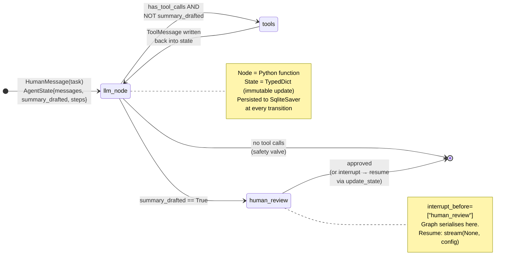
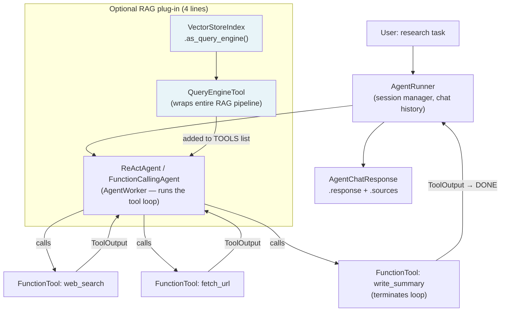
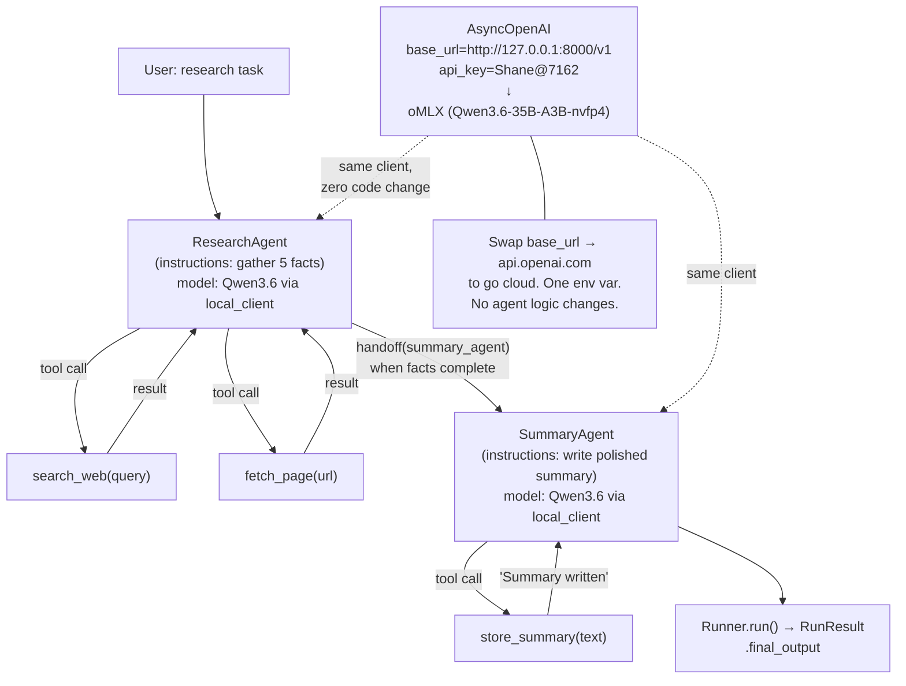
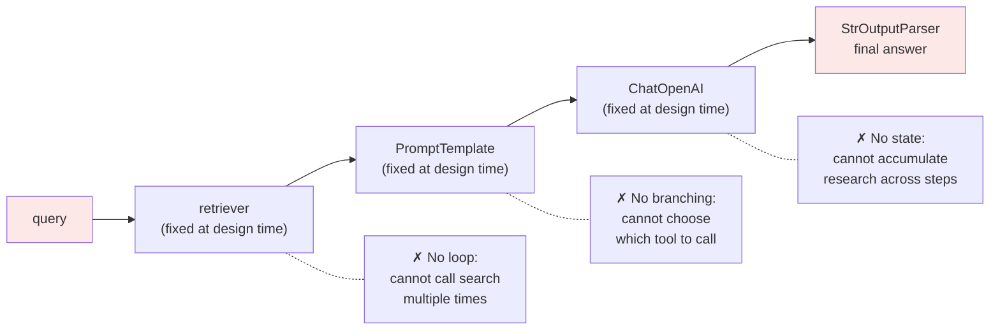

# Week 10 — Framework Shootout

---

## Opening — The 2026 LangChain Reality You Must Internalize

If you learned LangChain in 2023 or early 2024, you learned a framework that no longer exists in the same form. Interviews in 2026 will expose this gap the moment you say "AgentExecutor." Here is the ground truth you need to carry into every conversation.

### LangChain 1.0 (released October 2025)

LangChain 1.0 is not a refinement of the old `AgentExecutor` model. It is a clean architectural pivot: **stateful agents are now built on LangGraph**, which LangChain acquired in early 2024 and then made the canonical runtime for anything that loops, branches, or needs human-in-the-loop. The `AgentExecutor` class still ships in the package — it was not hard-removed — but its documentation is now marked legacy, it receives no new features, and every LangChain blog post from October 2025 onward uses LangGraph graphs instead.

Why does this matter for interviews? Because the most common LangChain question you will hear is "how does LangChain differ from LangGraph?" and the correct answer is not "LangGraph is the graph version" — it is "in LangChain 1.0, LangGraph *is* the agent runtime. The distinction is between LCEL chains (linear DAGs) and LangGraph graphs (arbitrary state machines with loops and conditional edges)."

> **What this means:** When someone on your future team says "let's use LangChain for this agent," the correct response in 2026 is "do you mean LCEL chains for a linear pipeline, or LangGraph for the agent loop?" They are different tools with different complexity budgets.

### LCEL Chains — Still the Right Tool for Linear Pipelines

LCEL (LangChain Expression Language) did not go away. It is the declarative, pipe-syntax way to compose `Runnable` components: `retriever | prompt | llm | output_parser`. LCEL shines for:

- RAG pipelines (retrieve → prompt → generate)
- Document Q&A chains
- Classification chains with a fixed prompt
- Any workflow where the steps are fully determined at design time

LCEL is essentially a typed, observable, streaming-by-default function composition layer. You do not reach for it when you need loops.

> **Why this framework exists:** LangChain's core insight circa 2022 was "these prompt-chain patterns keep repeating; let's give them a composable interface." LCEL is the mature form of that insight. It is good at what it does. The mistake was trying to stretch it into agents.

### LangGraph — Earns Its Complexity for Stateful Agents

LangGraph models agent execution as a directed graph over a typed state object. Nodes are Python functions. Edges can be conditional. The graph executor manages the state machine, can persist state to a checkpointer (SQLite, Postgres), and can pause at interrupt nodes to wait for human input before resuming.

Use LangGraph when you need:
- **Conditional branching** — "if the tool call returns an error, route to a retry node instead of the answer node"
- **Loops** — "keep calling tools until the agent emits a final answer or hits a step limit"
- **Human-in-the-loop interrupts** — "pause after generating a plan, require human approval, then execute"
- **Persistent sessions** — "resume a half-finished agent run from where it left off, even after a server restart"
- **Durable execution** — "if the process crashes mid-loop, rehydrate state from the checkpointer and continue"

> **Gotcha:** LangGraph's state-machine model means you write more upfront scaffolding than `AgentExecutor` — you define the state schema, register every node, wire every edge. For a simple one-shot tool-calling agent this is overkill. Use `create_react_agent` from `langgraph.prebuilt` as your "quick sanity check" shortcut; build a custom graph when you need the full pattern.

### The Answer to Memorize — Chain vs Agent

This is the single most common framing question you will face. Commit this to flashcard and say it aloud until it takes under 30 seconds:

> **Chain = deterministic DAG of steps, decided at design time. LCEL is declarative building blocks for them. Agent = LLM chooses next step each iteration (usually via tool call). 2026: in LangChain 1.0, "Agent" is a thin convention on top of LangGraph. Real distinction: design-time vs runtime step selection.**

Full expansion for a 90-second answer:

A chain is a predefined, deterministic sequence: the engineer decides the steps when writing the code, and at runtime the data just flows through them. LCEL is the composable syntax for building chains — it is clean, streaming-by-default, and trivial to observe. An agent is a control-flow loop where an LLM decides which step to take next, usually by emitting a structured tool call. The loop continues until the LLM emits a "final answer" signal or a step budget is exhausted. In LangChain 1.0, that loop is implemented as a LangGraph graph: the LLM node calls a model, conditional edges route to tool nodes or the end node, tool nodes execute and write results back into state, and the loop returns to the LLM node. The old `AgentExecutor` did the same thing in an opaque Python while-loop; LangGraph makes the state machine explicit and inspectable.

> **Interview angle:** When the interviewer says "walk me through how an agent works," the LangGraph framing — state → LLM node → tool edge → tool node → state update → back to LLM — is the clearest modern answer. It also shows you understand execution graphs, which maps directly to your infra background with Argo DAGs.

> **2026 reality:** Three other frameworks are also now first-class interview topics: **LlamaIndex** (strong when retrieval is part of the agent loop), **OpenAI Agents SDK** (Python-native, first-class handoffs, works against any OpenAI-compatible endpoint — including your local MLX server), and framework-agnostic raw SDK usage (the Anthropic "Building effective agents" paper explicitly recommends starting with raw SDK calls before reaching for a framework). Know all four. Pick based on the problem.

> **Analogy (Infra):** Frameworks are ORMs for agent loops. LCEL is raw SQL — maximum control, you see every byte. LangGraph is Django ORM — expressive state model, migrations (checkpoints), the abstraction earns its keep for complex domain logic. LlamaIndex is SQLAlchemy with domain-specific conventions — great when your data model (retrieval indexes, query engines) is the center of gravity. OpenAI Agents SDK is a microframework like Flask — minimal, composable, you own the routing. Pick based on how much you need to escape the abstraction.

---

## Architecture Diagrams — The 2×2 Visual Grid

Same canonical task ("research Anthropic + write 1-page summary"), four representations. Study this grid until you can sketch any quadrant on a whiteboard from memory. The LCEL chain (bottom-right) is the **negative example** — it shows exactly why a chain is the wrong tool for an agent task.

### A — LangGraph: Explicit State Machine



> **What this means:** Every box is a named node you registered with `g.add_node(...)`. Every arrow is an edge you wired explicitly. The conditional fork out of `llm_node` is `route_after_llm()` — a plain Python function returning a string. This is the state machine made inspectable. Compare with `AgentExecutor`'s equivalent: an opaque `while True` loop with no diagram.

### B — LlamaIndex: AgentRunner + AgentWorker + Tools



> **What this means:** `AgentRunner` owns the session (conversation history, memory buffer). `AgentWorker` owns the loop (observe → think → act). You rarely instantiate them separately — `ReActAgent.from_tools(...)` builds both. The shaded box shows LlamaIndex's moat: a full RAG pipeline slots in as one more tool with four lines of code. No other framework makes that as cheap.

### C — OpenAI Agents SDK: Agent + Handoffs + Local oMLX



> **What this means:** Both agents share `local_client` — the single `AsyncOpenAI` instance pointing at oMLX. The handoff is a first-class SDK primitive (`handoff(summary_agent)`), not a prompt trick. `Runner.run()` manages the event loop and returns a `RunResult` with the full message history for replay. The dashed lines are the interview soundbite: same client, zero code change, local ↔ cloud = one env var.

### D — LCEL Chain: Why This Is the WRONG Tool for This Task



> **What this means:** An LCEL chain flows left-to-right, one pass, no iteration. Every node is wired at design time — there is no mechanism for the LLM to decide "I need more information, let me call search again." LCEL is the right tool when the steps are fully known before runtime (RAG, classification, extraction). It is the wrong tool the moment you need the LLM to decide what to do next. This diagram is your visual proof of the Chain vs Agent distinction.

> **Interview angle:** Print this 2×2 grid mentally when an interviewer asks "walk me through your framework choice." Start with diagram D ("here's what a chain looks like and why it doesn't fit"), then pick one of A/B/C based on the requirements they gave you. Leading with the negative example demonstrates you understand the tradeoffs, not just the happy path.

---

## Goal + Exit Criteria

**Goal.** Re-implement your Week 5 "research company + 1-page summary" task three ways — LangGraph, LlamaIndex AgentWorker, OpenAI Agents SDK — measure them on six concrete dimensions, and walk out of this week able to defend a framework choice in real time.

**Exit criteria.** Check all five before moving to Week 11.

- [ ] All three implementations run end-to-end on the same canonical task (research company + 1-page summary) and produce comparable output quality
- [ ] `results/comparison_matrix.md` is filled with specific numbers or quotes for every cell (6 dimensions × 3 frameworks = 18 cells)
- [ ] You can answer "LangChain vs LangGraph?" in under 90 seconds without notes
- [ ] You can answer "why not just use AgentExecutor?" with the correct 2026 answer (deprecated for complex agents; LangGraph is the successor)
- [ ] You can explain why the OpenAI Agents SDK routes to your local MLX server and what that proves about the OpenAI-compatible API
- [ ] `RESULTS.md` committed with LOC diff, matrix, and 90-second-answer draft

---

## Theory Primer — Five Concepts That Make the Framework Shootout Make Sense

> This primer is dense by design. Read it before writing any code this week. Its job is to give you the conceptual vocabulary so that when the lab exposes a real tradeoff, you recognise it instead of stumbling through it. The five concepts below also form the backbone of the "why I picked LangGraph over X" 90-second answer interviewers are actually asking for.

---

### Concept 1 — Chain vs Agent: The Distinction That Actually Holds Up

The easiest framing that survives contact with an interviewer: **a chain is a DAG decided at design time; an agent is a loop where the LLM decides the next step at runtime.**

LCEL makes chains composable. The `|` operator pipes `Runnable` components in sequence — `retriever | prompt | llm | output_parser` — and the entire graph is topologically fixed before a single token is generated. You as the engineer make every routing decision. The model just executes within the slot you gave it.

An agent inverts that contract. The model sees the current state, decides which tool to call (or whether to stop), observes the result, and loops. The routing is not in your code — it is in the model's output at each step. The loop continues until the model emits a stop signal or a step budget is exhausted.

The 2026 wrinkle that trips up anyone who learned LangChain before late 2025: **`AgentExecutor` still ships in the package but is effectively deprecated for stateful work.** It implemented the agent loop as an opaque Python `while True` block. LangChain 1.0 (October 2025) replaced it with LangGraph as the canonical agent runtime. The state machine that was implicit in `AgentExecutor` is now explicit, inspectable, and persistable. When someone on a future team says "use LangChain for this agent," the correct clarifying question is: "Do you mean LCEL for a linear pipeline, or LangGraph for the loop?" They are different tools with different complexity budgets, and conflating them is the single most common knowledge gap interviewers surface in 2026 agent interviews.

> **Interview soundbite (memorise this):** "Chain equals a design-time DAG — the engineer decides the steps. Agent equals a runtime loop — the LLM decides the next step each iteration. In LangChain 1.0, Agent is just a thin convention on top of LangGraph. The real axis is design-time versus runtime step selection."

---

### Concept 2 — LCEL's One-Way DAG vs LangGraph's Cyclic State Machine

LCEL is declarative composition via the `|` operator. Under the hood it builds a `RunnableSequence` (for serial pipes) or `RunnableParallel` (for fan-out). Data flows in one direction. There are no cycles. Every component receives the output of the previous component and passes its own output forward. This model is clean, streaming-by-default, and trivially observable — which is exactly why it is the right tool for RAG pipelines, classification chains, and extraction workflows where the steps are fully determined before runtime.

LangGraph is a different abstraction entirely. It models agent execution as a directed graph over a **typed state object** (a `TypedDict`). Nodes are Python functions that read from and write to that state. Edges can be conditional — a plain Python function returning a string that names the next node. The graph can have cycles (that is the point: LLM node → tool node → LLM node → ...). The executor manages the state machine, persists state to a checkpointer (`SqliteSaver`, `PostgresSaver`) at every transition, and can pause at interrupt nodes to wait for human input before resuming.

The practical decision rule: reach for LCEL when every step is known before the first token. Reach for LangGraph the moment you need any of the following — conditional routing, loops, human-in-the-loop interrupts, durable session persistence across server restarts, or the ability to rehydrate a half-finished agent run. LangGraph earns its scaffolding cost (you must define a state schema, register every node, wire every edge explicitly) precisely because it makes the state machine you were already implicitly writing into something inspectable, testable, and resumable.

> **Optional deep dive:** `create_react_agent` from `langgraph.prebuilt` is the "quick sanity check" shorthand — it builds a standard ReAct graph for you. Use it to validate your tools work. Build a custom graph when you need full control over branching logic or the state schema. Understanding the difference between prebuilt and custom is itself an interview signal.

---

### Concept 3 — Two Control Planes: Runtime-First vs Policy-First (Harness Bk 2, Ch 2)

This is where the Harness Engineering Book 2 comparison pays off most directly. The book puts Claude Code and Codex side by side not to rank them but to expose two coherent engineering philosophies that any serious agent framework will eventually have to choose between.

The key passage from Ch 2: **"Claude Code 的控制面是动态装配线"** — "Claude Code's control plane is a dynamic assembly line." The system prompt is not a fixed document; it is a runtime composition. Default prompt as base, append-prompt for external requirements, agent-specific role supplements, CLAUDE.md for local constraints, session memory for current context — all assembled in order, at runtime, for the current task. The control plane travels with the session.

Contrast with **"Codex 的控制面是带编号的公文系统"** — "Codex's control plane is a numbered document system." Codex defines `ContextualUserFragmentDefinition` with explicit start/end markers, wrapping rules, and serialisation logic. `AGENTS_MD_START_MARKER`, `AGENTS_MD_END_MARKER`, `SKILL_OPEN_TAG`, `SKILL_CLOSE_TAG` are typed constants. Every fragment has a declared origin, boundary, and type. The control plane is a structured artefact, not a runtime product.

Why does this matter for evaluating LangGraph vs the OpenAI Agents SDK? Because both are closer to the runtime-first camp, but they differ in how explicit they make the control surface. LangGraph's state schema is closer to Codex's typed substrate — you declare the state shape ahead of time and every node operates on it. The OpenAI Agents SDK's `instructions` field is closer to Claude Code's assembly-line model — it is a free-form string that you compose however you like, with no structural enforcement. Neither is wrong. As Book 2 Ch 2 concludes: "You cannot simply say which is more advanced. The real question is which kind of loss of control your system fears more: rapid instruction drift over long sessions, or unclear rule provenance and unauditable scope."

> **Interview soundbite:** "I think about agent frameworks on a control-plane axis. Runtime-first systems like LangGraph and the OpenAI Agents SDK compose the control surface dynamically. Policy-first systems pre-define typed fragments with explicit boundaries. For stateful multi-step agents in production, I lean LangGraph because its state schema gives me typed, inspectable control without forcing me into a full policy language."

---

### Concept 4 — Heartbeat Placement: Main-Loop vs Split-State (Harness Bk 2, Ch 3)

Chapter 3 of Book 2 is titled "心跳放在哪" — "Where Does the Heartbeat Live?" — and it is the most directly applicable chapter for understanding what LangGraph's checkpointer actually buys you compared to a hand-rolled while-loop.

Claude Code **compresses continuity into the main loop**. The `queryLoop()` carries current message sequence, tool-use context, compact tracking, output-token recovery counts, pending summaries, and turn counts all in memory, all within the running process. Recovery from failure happens inside the loop — reactive compact, token-limit handling, tool-interrupt processing. The loop *is* the heartbeat. Strength: low coordination overhead, fast response to mid-session problems. Limitation: state is harder to externalise; if the process dies, recovery requires reconstructing loop state.

Codex **splits continuity across thread, rollout, and state bridge**. `codex_thread`, `thread_manager`, `rollout`, `state_db_bridge`, and `message_history` are separate first-class modules exported at the root of `core/src/lib.rs`. A `Thread` holds an `id`, can `runStreamed()`, and carries `approvalPolicy`, `sandboxMode`, `workingDirectory`, and `networkAccessEnabled` as explicit per-turn parameters. The heartbeat is an external record, not a loop variable. Strength: the system can answer "what exactly happened in turn N" from the state store without reconstructing runtime. Limitation: more coordination complexity — you must manage thread lifecycle, rollout recording, and state-bridge synchronisation.

**LangGraph's checkpointer is the split-state model applied to Python.** Every graph transition is persisted to `SqliteSaver` or `PostgresSaver` before the next node runs. If the process crashes, you rehydrate from the checkpoint and resume from the last completed node. This is the split-state heartbeat made accessible to application developers. The tradeoff Book 2 §3.5 names directly: "in-loop heartbeat = simpler audit trail, harder to externalise state; split state = cleaner persistence, more coordination complexity." The analogy Book 2 uses is the one most legible to your infra background: **this is the monolith vs microservices tradeoff, projected onto agents.** The loop is the monolith — cohesive, fast, opaque. The split-state model is microservices — decoupled, auditable, requires explicit contracts between components.

> **Optional deep dive:** LangGraph's `interrupt_before` mechanism is the cleanest production implementation of split-state human-in-the-loop. The graph serialises at the interrupt node, the process can exit, a human reviews and approves, and `stream(None, config)` resumes from the persisted checkpoint. This is not a party trick — it is a production pattern for any workflow that requires human approval before irreversible actions. If an interviewer asks "how would you implement human-in-the-loop," this is the answer.

---

### Concept 5 — Convergence: What Every Serious Harness Ends Up Building (Harness Bk 2, Ch 7)

Chapter 7 of Book 2 is titled "殊途同归，还是各表一枝" — "Convergence, or Divergence?" — and its opening verdict is direct: **they do converge.** Both Claude Code and Codex — and by extension every framework covered this week — end up implementing the same five structural organs once they take agent reliability seriously.

Book 2 Ch 7 lists the convergence points: **(a) an explicit control plane** — some mechanism for declaring what the agent knows and is constrained by, beyond a bare system prompt string; **(b) a tool-gating mechanism** — some form of approval, schema enforcement, or policy engine between the model's tool-call intent and actual execution; **(c) a stop-condition discipline** — an explicit criterion for loop termination that is not just "the model decides to stop"; **(d) context-budget governance** — active management of token spend, rather than passive truncation when the limit hits; **(e) verification as a separate stage** — not a loop-closing formality but an independently orchestrated check that the previous stage's output meets criteria.

The divergence — and this is where framework selection becomes genuinely architectural — is in **which layer carries the complexity.** Claude Code carries it in the runtime: compact, tool orchestration, interrupt handling. Codex carries it in the policy language: typed fragments, exec policy crate, structured thread state. LangGraph carries it in the state schema and graph topology. The OpenAI Agents SDK carries it in handoff primitives and first-class tracing. LlamaIndex carries it in the query engine / retrieval pipeline integration. None of these is wrong. As Book 2 Ch 7 puts it: "The mistake is not choosing a tradeoff; the most dangerous situation is having no tradeoff — wanting both fully dynamic runtime flexibility and fully explicit structural control, and getting a system that is neither."

Book 2 also adds a third data point beyond Claude Code and Codex: the Gerred "Amping Up" analysis of Sourcegraph Amp shows that an enterprise collaboration layer adds **observable-based state management on top** of the existing control plane — essentially extending split-state heartbeat with reactive subscriptions across a distributed team. This is the direction production multi-tenant agent systems are heading, and it maps directly onto LangGraph's `PostgresSaver` + streaming event model when you need to scale beyond a single developer session.

> **Interview soundbite (the 90-second "why LangGraph" answer):** "Every serious agent harness converges on five things: explicit control plane, tool gating, stop-condition discipline, context-budget governance, and independent verification. The frameworks differ in which layer carries that complexity. LangGraph puts it in the state schema and graph topology — design-time decisions that are inspectable and testable. That matches my team's constraints: we need durable sessions, human-in-the-loop interrupts, and auditability. If we needed minimal scaffolding for a simple one-shot agent, I would use the OpenAI Agents SDK. If retrieval were the center of gravity, I would use LlamaIndex. The framework choice follows from which layer you want to own."

---

### Concept 6 — Microsoft Agent Framework 1.0: the enterprise-stack consolidation

Microsoft Agent Framework 1.0 (2025) replaced and consolidated AutoGen + Semantic Kernel into a single graph-based agent stack. The control-flow model is recognizably LangGraph-shaped — typed state, declared nodes, conditional edges — which is not surprising; both arrived at the same convergence point Harness Bk2 Ch 7 names ("explicit control plane + tool gating + stop-condition discipline"). The differentiator is **deep Microsoft enterprise integration**: first-class connectors for Teams, M365, Power Platform, Entra ID for identity-aware agent permissions, Application Insights for tracing, and direct deployment paths to Azure AI Foundry for managed runtime. For a team already on the Microsoft enterprise stack, MAF 1.0 is now a credible default — you trade some framework-agnosticism for substantial integration savings.

The interview-relevant 2026 framework matrix now looks like this:

| Framework | Best fit | Lock-in level |
|---|---|---|
| **LangGraph** | Cross-vendor, framework-agnostic, broadest community | Low (Python + your model provider) |
| **OpenAI Agents SDK** | OpenAI-native, smallest scaffold, simple handoffs | Medium (OpenAI APIs centric, but works with any OpenAI-compatible endpoint) |
| **LlamaIndex Agents** | Retrieval as the center of gravity | Low (works with any model) |
| **Microsoft Agent Framework 1.0** | Microsoft enterprise stack (Azure, M365, Entra) | High (deeply tied to Microsoft services) |
| **Codex CLI** | Solo coding agent, policy-driven | Medium (OpenAI + the policy language semantics) |
| **Claude Agent SDK** | Operator-style work, files/shell/MCP heavy | Low (works with any Anthropic-compatible endpoint) |

The decision rule expands accordingly: pick the framework whose lock-in profile matches your team's deployment reality, and whose layer-of-complexity allocation matches your workload. MAF doesn't replace any of the others — it *adds a credible option* for the population of teams whose constraint is Microsoft-stack integration rather than vendor neutrality.

> **Interview soundbite:** "Microsoft Agent Framework 1.0 unified AutoGen and Semantic Kernel into one LangGraph-shaped stack. Same control-flow primitives as LangGraph; the differentiator is deep Azure / M365 / Entra integration. For teams already on the Microsoft stack it's now the credible default — you trade some framework-agnosticism for substantial integration savings. For everyone else, LangGraph stays the broader choice. The framework converges; the lock-in profile differentiates."

---

### Companion Texts — Gulli Cross-References

- **[Gulli *Agentic Design Patterns* Appendix C — Quick overview of Agentic Frameworks]** — one-chapter survey of the 2026 framework landscape; useful pre-read. ~30 min
- **[Gulli *Agentic Design Patterns* Ch 2 — Routing]** + **[Ch 13 — Human-in-the-Loop]** — the two patterns that most distinguish LangGraph from LCEL. ~30 min

## Phase 1 — Scaffold + Canonical Task (~1 hour)

We reuse Week 5's task deliberately. Same task = apples-to-apples framework comparison. Any quality difference you observe is framework overhead, not task difficulty.

### 1.1 Directory scaffold

```bash
cd ~/code/agent-prep
source .venv/bin/activate
set -a; source .env; set +a

mkdir -p lab-10-framework-shootout/{src,results,data}
cd lab-10-framework-shootout

# Copy Week 5's tool implementations — we reuse them across all three frameworks
cp ../lab-05-pattern-zoo/src/tools.py src/tools_shared.py
```

### 1.2 The canonical task

Every implementation will run this exact task:

> **Task:** "Research Anthropic: founding date, current CEO, primary product, latest funding round, one publicly stated technical differentiator. Write a 1-page executive summary."

This task requires at minimum three tool calls (web search × 3, or web search + structured data lookup), synthesis across sources, and structured output. It is representative of real agent workloads without being so complex that framework differences get buried in task noise.

### 1.3 Shared environment and tools

Save as `src/tools_shared.py` (or edit the copy from Week 5):

```python
"""Shared tool definitions reused across all three framework implementations.

Tools:
  - web_search(query) → str   (mocked for determinism in unit tests; real in integration)
  - fetch_url(url) → str
  - write_summary(text) → str  (terminates the agent run)

All three framework wrappers import from this module so the tool *logic* is
identical and framework differences dominate the measured metrics.
"""
import os, json, textwrap
from openai import OpenAI

OMLX_BASE_URL = os.getenv("OMLX_BASE_URL", "http://127.0.0.1:8000/v1")
OMLX_API_KEY  = os.getenv("OMLX_API_KEY",  "Shane@7162")
MODEL_OPUS    = os.getenv("MODEL_OPUS",    "Qwen3.6-35B-A3B-nvfp4")

omlx = OpenAI(base_url=OMLX_BASE_URL, api_key=OMLX_API_KEY)

# ── Tool implementations ──────────────────────────────────────────────────────

_MOCK_SEARCH_DB = {
    "Anthropic founding": "Anthropic was founded in 2021 by Dario Amodei, Daniela Amodei, and others from OpenAI.",
    "Anthropic CEO": "Dario Amodei is the CEO of Anthropic.",
    "Anthropic product": "Anthropic's primary product is Claude, a family of large language models.",
    "Anthropic funding": "Anthropic raised a $2.75 billion Series E in March 2024, followed by a $4 billion commitment from Amazon.",
    "Anthropic technical": "Anthropic's stated technical differentiator is Constitutional AI (CAI), a method for training AI systems to be helpful, harmless, and honest using AI feedback.",
}

def web_search(query: str) -> str:
    """Search the web for information. Returns a text snippet."""
    # In integration mode, you'd call a real search API here.
    # For lab purposes, we use the mock DB so results are deterministic.
    for key, val in _MOCK_SEARCH_DB.items():
        if key.lower() in query.lower():
            return val
    return f"No results found for: {query}"

def fetch_url(url: str) -> str:
    """Fetch the text content of a URL."""
    return f"[Fetched content of {url} — replace with real HTTP client in production]"

_summary_store: list[str] = []

def write_summary(text: str) -> str:
    """Write the final 1-page summary. Calling this signals task completion."""
    _summary_store.append(text)
    return "Summary written successfully."

def get_last_summary() -> str:
    return _summary_store[-1] if _summary_store else ""

def reset_summary_store() -> None:
    _summary_store.clear()
```

### 1.4 The `.env` additions for this lab

```bash
# Add to ~/code/agent-prep/.env if not already present
MODEL_OPUS="Qwen3.6-35B-A3B-nvfp4"
MODEL_SONNET="gemma-4-26B-A4B-it-heretic-4bit"
MODEL_HAIKU="gpt-oss-20b-MXFP4-Q8"
OMLX_BASE_URL="http://127.0.0.1:8000/v1"
OMLX_API_KEY="Shane@7162"
```

### 1.5 Install framework deps (if not already installed from Week 0)

```bash
uv pip install langgraph langchain-openai llama-index llama-index-tools-openai \
               openai-agents tiktoken
# Verify
python -c "import langgraph; import llama_index; import agents; print('all ok')"
```

---

## Phase 2 — Implementation A: LangGraph (State-Machine Style) (~3.5 hours)

LangGraph is the right choice here because our task involves a loop (keep calling tools until enough information is gathered), conditional routing (tool call vs final answer), and we want to demonstrate durable persistence and human-in-the-loop as bonus features.

> **Why this framework exists:** LangGraph emerged because `AgentExecutor` had no principled way to: (a) persist state across restarts, (b) interrupt mid-loop for human review, (c) define conditional routing explicitly. LangGraph makes the agent's control flow a first-class, inspectable data structure.

### 2.1 Quick sanity check with `create_react_agent`

Before the full custom graph, verify your environment in under 10 lines. Save as `src/impl_langgraph_quick.py`:

```python
"""Sanity check: LangGraph prebuilt ReAct agent. ~10 lines of actual framework code."""
import os
from langchain_openai import ChatOpenAI
from langgraph.prebuilt import create_react_agent
from langchain_core.tools import tool as lc_tool
from src.tools_shared import web_search, fetch_url, write_summary

llm = ChatOpenAI(
    model=os.getenv("MODEL_OPUS"),
    base_url=os.getenv("OMLX_BASE_URL"),
    api_key=os.getenv("OMLX_API_KEY"),
    temperature=0.0,
)

# Wrap raw functions as LangChain tools
@lc_tool
def search(query: str) -> str:
    """Search the web for information about a company or topic."""
    return web_search(query)

@lc_tool
def fetch(url: str) -> str:
    """Fetch the text content of a URL."""
    return fetch_url(url)

@lc_tool
def summarize(text: str) -> str:
    """Write the final 1-page executive summary. Call this when research is complete."""
    return write_summary(text)

agent = create_react_agent(llm, [search, fetch, summarize])

TASK = (
    "Research Anthropic: founding date, current CEO, primary product, "
    "latest funding round, one publicly stated technical differentiator. "
    "Write a 1-page executive summary using the summarize tool."
)

result = agent.invoke({"messages": [{"role": "user", "content": TASK}]})
print(result["messages"][-1].content)
```

```bash
python src/impl_langgraph_quick.py
```

This should complete in 3–5 tool calls. If it loops infinitely, the model is not calling `summarize` to terminate — add `"When you have all five facts, call the summarize tool immediately."` to the task string.

### Code walkthrough — what LangGraph gives you vs Week 4's hand-rolled ReAct

In Week 4 you built a ReAct loop from scratch: a `while True` that called the model, parsed the output for `Action:` / `Action Input:` text, dispatched a tool function, appended the result as an `Observation:` string, and broke when it saw `Final Answer:`. That worked. Here is what LangGraph replaces and why each replacement matters.

**Chunk 1 — State schema replaces ad-hoc context accumulation**

Week 4 accumulated context as a growing string: `prompt += f"\nObservation: {result}"`. This worked but had no type safety, no introspectability, and no way to query "how many steps have we taken?" without parsing the string.

```python
# Week 4 hand-rolled (conceptual)
context = system_prompt + "\n" + task
while True:
    response = llm(context)
    context += response + observation  # grows unboundedly, no structure

# LangGraph replacement
class AgentState(TypedDict):
    messages: Annotated[list[BaseMessage], add_messages]  # typed, append-only
    summary_drafted: bool   # queryable flag — no string parsing
    steps: int              # queryable counter — no regex on the context string
```

> **Why:** `AgentState` is a plain Python TypedDict. Every node reads from it and returns a partial update dict. LangGraph merges the updates. The `add_messages` reducer means you never accidentally overwrite the history — you only append. This is the immutability principle from the coding-style rules applied to agent state.

**Chunk 2 — `ToolNode` replaces your tool dispatch switch**

Week 4 had a dispatch block: parse the action name from the model output, look it up in a `TOOLS` dict, call it, format the result. This was 15–20 lines of brittle string parsing.

```python
# Week 4 hand-rolled
action, action_input = parse_action(response)   # brittle regex
tool_fn = TOOLS.get(action)
if tool_fn is None:
    observation = f"Error: unknown tool {action}"
else:
    observation = tool_fn(action_input)

# LangGraph replacement
tool_node = ToolNode(TOOLS)   # one line
# LangGraph calls this node automatically when the LLM emits a tool_call object.
# It handles: unknown tool → error message, exception → error message, result → ToolMessage.
```

> **Why:** `ToolNode` reads the structured `tool_calls` field from the LLM's response object (not a parsed string), dispatches to the right function, catches exceptions, and writes a `ToolMessage` back into state. You get error handling for free. In Week 4 an unhandled exception in a tool crashed the whole loop.

**Chunk 3 — Conditional edges replace `if "Final Answer" in response`**

Week 4 broke the loop with `if "Final Answer:" in response: break`. This was fragile — any model that wrote "Here is my final answer:" instead broke the loop condition.

```python
# Week 4 hand-rolled
if "Final Answer:" in response:
    break   # hope the model used the exact phrase

# LangGraph replacement
def route_after_llm(state: AgentState) -> Literal["tools", "human_review", "__end__"]:
    last = state["messages"][-1]
    has_tool_calls = bool(getattr(last, "tool_calls", None))
    if has_tool_calls and not state.get("summary_drafted", False):
        return "tools"
    if state.get("summary_drafted", False):
        return "human_review"
    return "__end__"
```

> **Why:** The routing function inspects the structured `tool_calls` field (a list, not a string). Termination is signaled by the absence of tool calls, not by parsing magic text. This is robust across model families — Qwen3.6, GPT-4o, and Claude all emit structured tool call objects; they do not all use the phrase "Final Answer:".

**Chunk 4 — Checkpointer replaces "nothing, state died with the process"**

Week 4 had no persistence. If the Python process crashed at step 4 of a 6-step loop, all work was lost and you restarted from scratch.

```python
# Week 4: no persistence (implicit)

# LangGraph replacement
conn = sqlite3.connect("results/checkpoint.db", check_same_thread=False)
checkpointer = SqliteSaver(conn)
graph = build_graph(checkpointer=checkpointer)
# Every node transition is now serialized to SQLite automatically.
# Resume from any thread_id with graph.stream(None, config={"configurable": {"thread_id": id}})
```

> **Why:** The checkpointer is passed once at compile time. After that it is invisible — nodes do not know it exists. This is the right abstraction boundary: persistence is infrastructure, not application logic. In Week 4 you would have had to wire this yourself, and it would have been the hardest part of the week.

**Chunk 5 — `interrupt_before` replaces "no human-in-the-loop at all"**

Week 4 had no mechanism to pause and ask a human. The loop ran to completion regardless of what the model produced. Inserting a human check would have required restructuring the entire `while True` block.

```python
# LangGraph replacement — one compile-time argument
graph = g.compile(
    checkpointer=checkpointer,
    interrupt_before=["human_review"],   # pause before this node fires
)
# Pause: graph.stream(init_state, config) → stops at human_review boundary
# Inspect: graph.get_state(config)        → read paused state from checkpointer
# Inject:  graph.update_state(config, {"messages": [HumanMessage("approved")]})
# Resume:  graph.stream(None, config)     → continues from where it stopped
```

> **Why:** `interrupt_before` is a graph-level concern, not a node-level one. You do not modify `human_review_node` to implement the pause — you declare the intent at compile time. This separation means you can add or remove the interrupt without touching any business logic. That is the LangGraph design principle: control flow is structural, not embedded in node code.

**Summary — the Week 4 → LangGraph translation table**

| Week 4 hand-rolled | LangGraph equivalent | What you gained |
|---|---|---|
| Growing string context | `AgentState` TypedDict | Type safety, queryable fields, append-only messages |
| String parsing for actions | `tool_calls` field on AIMessage | Robust across model families, structured dispatch |
| Tool dispatch switch | `ToolNode(TOOLS)` | Error handling, unknown-tool safety, zero boilerplate |
| `if "Final Answer:" in response` | `route_after_llm()` conditional edge | Model-agnostic termination condition |
| Nothing (state dies with process) | `SqliteSaver` checkpointer | Durable state, crash recovery, resume by thread_id |
| Not possible | `interrupt_before=["human_review"]` | Human-in-the-loop at zero architecture cost |

### 2.2 Full custom LangGraph implementation

Now build the full pattern: explicit state, nodes, conditional edges, checkpointer for durable persistence, and an interrupt for human-in-the-loop approval. Save as `src/impl_langgraph.py`:

```python
"""
Full LangGraph implementation of the research agent.

Pattern demonstrated:
  - TypedDict state schema
  - Explicit nodes (llm_node, tool_node, human_review_node)
  - Conditional edge: route to tools, human review, or END
  - SQLiteSaver checkpointer for durable persistence
  - Interrupt before final summary (human-in-the-loop)

LOC (framework-specific, excluding tool impls and comments): ~85
"""
import os, json
from typing import Annotated, TypedDict, Literal
from langgraph.graph import StateGraph, END
from langgraph.graph.message import add_messages
from langgraph.prebuilt import ToolNode
from langgraph.checkpoint.sqlite import SqliteSaver
from langchain_openai import ChatOpenAI
from langchain_core.messages import BaseMessage, HumanMessage, AIMessage
from langchain_core.tools import tool as lc_tool
from src.tools_shared import web_search, fetch_url, write_summary

# ── Config ────────────────────────────────────────────────────────────────────

OMLX_BASE_URL = os.getenv("OMLX_BASE_URL", "http://127.0.0.1:8000/v1")
OMLX_API_KEY  = os.getenv("OMLX_API_KEY",  "Shane@7162")
MODEL_OPUS    = os.getenv("MODEL_OPUS",    "Qwen3.6-35B-A3B-nvfp4")

# ── Tools (LangChain-wrapped) ─────────────────────────────────────────────────

@lc_tool
def search(query: str) -> str:
    """Search the web for factual information."""
    return web_search(query)

@lc_tool
def fetch(url: str) -> str:
    """Fetch the text content of a URL."""
    return fetch_url(url)

@lc_tool
def summarize(text: str) -> str:
    """Write the final 1-page executive summary. Call only when all facts are gathered."""
    return write_summary(text)

TOOLS = [search, fetch, summarize]
TOOL_NAMES = {t.name for t in TOOLS}

# ── State ─────────────────────────────────────────────────────────────────────

class AgentState(TypedDict):
    # add_messages reducer: appends new messages instead of overwriting
    messages: Annotated[list[BaseMessage], add_messages]
    # track whether the agent called summarize (used to trigger human review)
    summary_drafted: bool
    # step counter for budget enforcement
    steps: int

# ── LLM ───────────────────────────────────────────────────────────────────────

llm = ChatOpenAI(
    model=MODEL_OPUS,
    base_url=OMLX_BASE_URL,
    api_key=OMLX_API_KEY,
    temperature=0.0,
).bind_tools(TOOLS)

# ── Nodes ─────────────────────────────────────────────────────────────────────

def llm_node(state: AgentState) -> dict:
    """Call the LLM with the current message history."""
    response = llm.invoke(state["messages"])
    steps = state.get("steps", 0) + 1
    # Check whether the model called the summarize tool
    summary_drafted = state.get("summary_drafted", False)
    if hasattr(response, "tool_calls"):
        for tc in (response.tool_calls or []):
            if tc["name"] == "summarize":
                summary_drafted = True
    return {
        "messages": [response],
        "summary_drafted": summary_drafted,
        "steps": steps,
    }

tool_node = ToolNode(TOOLS)  # LangGraph built-in: executes tool calls, writes results to state

def human_review_node(state: AgentState) -> dict:
    """
    Interrupt point. In non-interactive runs this is a no-op.
    In interactive runs (config['configurable']['human_review'] = True),
    LangGraph will pause here and wait for the graph to be resumed via
    graph.update_state() with the human's approval message.
    """
    # In automated tests we just approve silently.
    approval = HumanMessage(content="[APPROVED] Looks good, proceed.")
    return {"messages": [approval]}

# ── Routing ───────────────────────────────────────────────────────────────────

def route_after_llm(state: AgentState) -> Literal["tools", "human_review", "__end__"]:
    """
    Conditional edge from the LLM node.
    - If the last message has tool calls → execute them
    - If summary was drafted → route to human review before ending
    - Otherwise (no tool calls, no summary) → force end (safety valve)
    """
    last = state["messages"][-1]
    has_tool_calls = bool(getattr(last, "tool_calls", None))

    if has_tool_calls and not state.get("summary_drafted", False):
        return "tools"
    if state.get("summary_drafted", False):
        return "human_review"
    return "__end__"

def route_after_human(state: AgentState) -> Literal["__end__"]:
    """After human review, always end."""
    return "__end__"

# ── Graph ─────────────────────────────────────────────────────────────────────

def build_graph(checkpointer=None):
    g = StateGraph(AgentState)

    g.add_node("llm",          llm_node)
    g.add_node("tools",        tool_node)
    g.add_node("human_review", human_review_node)

    g.set_entry_point("llm")

    g.add_conditional_edges(
        "llm",
        route_after_llm,
        {"tools": "tools", "human_review": "human_review", "__end__": END},
    )
    g.add_edge("tools", "llm")           # after tools run, always go back to LLM
    g.add_edge("human_review", END)

    return g.compile(
        checkpointer=checkpointer,
        interrupt_before=["human_review"],  # pause here in interactive mode
    )

# ── Run ───────────────────────────────────────────────────────────────────────

TASK = (
    "Research Anthropic: founding date, current CEO, primary product, "
    "latest funding round, one publicly stated technical differentiator. "
    "When you have all five facts, call the summarize tool with a 1-page executive summary."
)

if __name__ == "__main__":
    import time
    from src.tools_shared import get_last_summary, reset_summary_store

    reset_summary_store()
    t0 = time.perf_counter()

    # Non-persistent run (no checkpointer)
    graph = build_graph(checkpointer=None)
    init_state: AgentState = {
        "messages": [HumanMessage(content=TASK)],
        "summary_drafted": False,
        "steps": 0,
    }
    final_state = graph.invoke(init_state)
    elapsed = time.perf_counter() - t0

    print(f"\n=== LangGraph result ({elapsed:.1f}s) ===")
    print(get_last_summary())
    print(f"\nTotal messages in state: {len(final_state['messages'])}")
    print(f"Steps taken: {final_state['steps']}")

    # ── Durable persistence demo ──────────────────────────────────────────────
    print("\n=== Durable persistence demo ===")
    import sqlite3, uuid
    conn = sqlite3.connect("results/langgraph_checkpoint.db", check_same_thread=False)
    checkpointer = SqliteSaver(conn)
    graph_persistent = build_graph(checkpointer=checkpointer)

    thread_id = str(uuid.uuid4())
    config = {"configurable": {"thread_id": thread_id}}

    reset_summary_store()
    # Run until the interrupt (human_review node)
    for chunk in graph_persistent.stream(init_state, config=config, stream_mode="values"):
        pass  # stream until interrupt

    interrupted_state = graph_persistent.get_state(config)
    print(f"Interrupted at: {interrupted_state.next}")

    # Simulate human approval: inject a message and resume
    graph_persistent.update_state(
        config,
        {"messages": [HumanMessage(content="[APPROVED] Proceed with the summary.")]},
        as_node="human_review",
    )
    for chunk in graph_persistent.stream(None, config=config, stream_mode="values"):
        pass

    print("Resumed and completed. Summary:")
    print(get_last_summary())
    conn.close()
```

```bash
python src/impl_langgraph.py
```

> **What this means:** The `interrupt_before=["human_review"]` line is the entire human-in-the-loop mechanism. LangGraph pauses the graph, serializes state to the checkpointer, and waits. You can close the process, restart it tomorrow, call `graph_persistent.get_state(config)` to retrieve the paused state, inject a human approval message with `update_state`, then call `stream(None, config=config)` to resume. This is durable execution — something `AgentExecutor` could not do at all.

> **Gotcha:** `SqliteSaver` is the development checkpointer. In production you use `PostgresSaver` from `langgraph-checkpoint-postgres`. The API is identical — you only swap the constructor argument. That is a meaningful interview point: persistence backend is a configuration detail, not an architecture change.

---

## Phase 3 — Implementation B: LlamaIndex Agent Worker (~2.5 hours)

LlamaIndex's agent model centers on `FunctionTool` wrappers, an `AgentWorker` (which handles the tool-call loop), and an `AgentRunner` (which manages sessions and memory). The key difference from LangGraph is that retrieval is a first-class citizen — `QueryEngineTool` lets you wrap an entire RAG pipeline as a single tool, which is LlamaIndex's biggest competitive advantage.

> **Why this framework exists:** LlamaIndex was originally built as "the data framework for LLMs" — its primary concern is connecting LLMs to structured and unstructured data. Agents emerged as a natural extension: if you already have a QueryEngine over your docs, wrapping it as an agent tool is trivial. LlamaIndex's agent abstractions are opinionated about retrieval in a way LangGraph is not.

Save as `src/impl_llamaindex.py`:

```python
"""
LlamaIndex AgentWorker + AgentRunner implementation.

Pattern demonstrated:
  - FunctionTool wrappers (direct)
  - OpenAIAgentWorker backed by local oMLX (OpenAI-compat)
  - AgentRunner session management
  - How a QueryEngineTool would plug in (commented illustrative block)

LOC (framework-specific, excluding tool impls and comments): ~55
"""
import os, time
from llama_index.core.tools import FunctionTool
from llama_index.core.agent import ReActAgent
from llama_index.llms.openai import OpenAI as LlamaOpenAI
from src.tools_shared import web_search, fetch_url, write_summary, get_last_summary, reset_summary_store

# ── Config ────────────────────────────────────────────────────────────────────

OMLX_BASE_URL = os.getenv("OMLX_BASE_URL", "http://127.0.0.1:8000/v1")
OMLX_API_KEY  = os.getenv("OMLX_API_KEY",  "Shane@7162")
MODEL_OPUS    = os.getenv("MODEL_OPUS",    "Qwen3.6-35B-A3B-nvfp4")

# ── LLM setup ─────────────────────────────────────────────────────────────────

llm = LlamaOpenAI(
    model=MODEL_OPUS,
    api_base=OMLX_BASE_URL,
    api_key=OMLX_API_KEY,
    temperature=0.0,
    max_tokens=2048,
)

# ── Tools (LlamaIndex FunctionTool wrappers) ──────────────────────────────────

search_tool = FunctionTool.from_defaults(
    fn=web_search,
    name="web_search",
    description="Search the web for factual information about companies, products, and events.",
)

fetch_tool = FunctionTool.from_defaults(
    fn=fetch_url,
    name="fetch_url",
    description="Fetch the text content of a URL for detailed reading.",
)

summarize_tool = FunctionTool.from_defaults(
    fn=write_summary,
    name="write_summary",
    description=(
        "Write the final 1-page executive summary when all research is complete. "
        "Pass the full summary text as the argument. Calling this terminates the task."
    ),
)

TOOLS = [search_tool, fetch_tool, summarize_tool]

# ── How a QueryEngineTool would plug in (illustrative) ────────────────────────
#
# from llama_index.core import VectorStoreIndex, SimpleDirectoryReader
# from llama_index.core.tools import QueryEngineTool
#
# docs = SimpleDirectoryReader("data/").load_data()
# index = VectorStoreIndex.from_documents(docs, llm=llm)
# query_engine = index.as_query_engine(llm=llm, similarity_top_k=5)
# rag_tool = QueryEngineTool.from_defaults(
#     query_engine=query_engine,
#     name="internal_knowledge_search",
#     description="Search our internal document corpus for company-specific facts.",
# )
# TOOLS.append(rag_tool)
#
# This is LlamaIndex's biggest moat: RAG pipeline as a tool in 4 lines.
# LangGraph can do this too but requires manual tool wrapping.

# ── Agent ─────────────────────────────────────────────────────────────────────

agent = ReActAgent.from_tools(
    tools=TOOLS,
    llm=llm,
    verbose=True,
    max_iterations=15,
)

# ── Run ───────────────────────────────────────────────────────────────────────

TASK = (
    "Research Anthropic: founding date, current CEO, primary product, "
    "latest funding round, one publicly stated technical differentiator. "
    "When you have all five facts, call write_summary with a 1-page executive summary."
)

if __name__ == "__main__":
    reset_summary_store()
    t0 = time.perf_counter()

    response = agent.chat(TASK)
    elapsed = time.perf_counter() - t0

    print(f"\n=== LlamaIndex result ({elapsed:.1f}s) ===")
    print(f"Agent response: {response}")
    print(f"\nStored summary:\n{get_last_summary()}")
    print(f"\nChat history length: {len(agent.chat_history)}")
```

```bash
python src/impl_llamaindex.py
```

### Code walkthrough — what LlamaIndex gives you vs Week 4's hand-rolled ReAct

LlamaIndex's agent layer is thinner than LangGraph's — it does not expose the graph structure at all. Instead it trades control for convention: if your task fits the ReAct or function-calling pattern, you get a working loop in very few lines. Here is what each piece replaced.

**Chunk 1 — `FunctionTool.from_defaults` replaces manual tool schema generation**

Week 4 required you to write JSON schema for each tool by hand, or parse it out of docstrings yourself. Mistakes in the schema caused the model to call tools incorrectly.

```python
# Week 4 hand-rolled (conceptual)
TOOLS_SCHEMA = [
    {"name": "web_search", "description": "...", "parameters": {"type": "object", "properties": {"query": {"type": "string"}}, "required": ["query"]}},
    # ... repeated for every tool, error-prone
]

# LlamaIndex replacement
search_tool = FunctionTool.from_defaults(
    fn=web_search,           # plain Python function
    name="web_search",       # tool name sent to the model
    description="...",       # tool description sent to the model
)
# LlamaIndex inspects fn's type annotations and generates the JSON schema automatically.
```

> **Why:** `from_defaults` uses Python's `inspect` module to derive parameter names and types from the function signature and docstring. You write normal Python functions in `tools_shared.py` and they become model-callable tools with one line. Compare: LangGraph uses `@lc_tool` decorator for the same purpose; both are doing the same introspection under the hood.

**Chunk 2 — `ReActAgent.from_tools` replaces the `while True` loop entirely**

This is the most dramatic compression. Week 4's loop was ~40 lines. The LlamaIndex equivalent is one call.

```python
# Week 4 hand-rolled (~40 lines)
MAX_STEPS = 10
for step in range(MAX_STEPS):
    response = llm(build_prompt(context, TOOLS_SCHEMA))
    action, action_input = parse_action(response.text)
    if action == "Final Answer":
        break
    result = dispatch_tool(action, action_input)
    context = append_observation(context, action, action_input, result)

# LlamaIndex replacement (1 line after tool setup)
agent = ReActAgent.from_tools(tools=TOOLS, llm=llm, verbose=True, max_iterations=15)
response = agent.chat(TASK)
```

> **Why:** `ReActAgent` implements the full Thought → Action → Observation loop internally. `max_iterations=15` is the step budget (your Week 4 `MAX_STEPS`). `verbose=True` prints each Thought/Action/Observation to stdout so you can debug the loop without adding print statements. The tradeoff: you cannot inspect intermediate state without subclassing `AgentWorker`, whereas in LangGraph every state transition is accessible via the graph's `get_state()` API.

**Chunk 3 — `QueryEngineTool` is what no other framework offers out of the box**

This is LlamaIndex's most important interview point. The commented block in the implementation is worth expanding here because it is the reason to pick LlamaIndex over LangGraph when RAG is central.

```python
# LlamaIndex: RAG pipeline as agent tool (4 lines)
docs = SimpleDirectoryReader("data/").load_data()
index = VectorStoreIndex.from_documents(docs, llm=llm)
query_engine = index.as_query_engine(llm=llm, similarity_top_k=5)
rag_tool = QueryEngineTool.from_defaults(
    query_engine=query_engine,
    name="internal_knowledge_search",
    description="Search internal document corpus for company-specific facts.",
)
TOOLS.append(rag_tool)

# LangGraph equivalent: you write a custom @lc_tool that instantiates a retriever,
# runs a similarity search, formats the results — easily 20-30 lines, and you own
# the retrieval logic (chunking, embedding, reranking) rather than getting LlamaIndex's
# battle-tested defaults.
```

> **Why:** `QueryEngineTool` wraps the entire retrieval stack — chunking, embedding, vector search, reranking, synthesis — behind a single tool interface. The agent calls it like any other function tool; it does not need to know retrieval is happening. This is the abstraction that earns LlamaIndex its place in the matrix: when retrieval IS the agent's primary intelligence, LlamaIndex makes that composable in a way LangGraph requires you to build yourself.

**Chunk 4 — Session memory replaces your Week 4 context string**

Week 4 accumulated context as a concatenated string. LlamaIndex manages it as a structured `ChatMemoryBuffer` with a token budget.

```python
# Week 4: context is a raw string, grows unboundedly
context = system_prompt + task_string + accumulated_observations

# LlamaIndex default: ChatMemoryBuffer inside AgentRunner
# To set an explicit budget:
from llama_index.core.memory import ChatMemoryBuffer
agent = ReActAgent.from_tools(
    tools=TOOLS,
    llm=llm,
    memory=ChatMemoryBuffer.from_defaults(token_limit=4096),  # trim oldest messages when full
    max_iterations=15,
)
```

> **Why:** Token-limited memory is the production-safe default. Without it, a long research task accumulates thousands of tokens of tool results in context, slowing inference and eventually hitting the model's context window limit. `ChatMemoryBuffer` trims the oldest non-system messages when the budget is exceeded — the same strategy you would implement manually in Week 4 with `context = context[-MAX_CHARS:]`.

> **Interview angle:** When asked "LangGraph vs LlamaIndex," the honest answer is: if retrieval (RAG) is a core part of the agent's reasoning — not just a side tool — LlamaIndex's `QueryEngineTool` makes that integration nearly zero-cost. If the agent is primarily doing API calls, code execution, or complex multi-agent routing with persistent state, LangGraph's explicit state machine is cleaner. They are not competitors in the same niche; they are optimized for different centers of gravity.

> **Gotcha:** LlamaIndex's `ReActAgent` is a higher-level wrapper. If you need fine-grained control over the loop — custom stopping conditions, per-step state inspection, interrupts — you drop down to `AgentWorker` + `AgentRunner` directly, or switch to LangGraph. `ReActAgent` is the "it just works" entry point, not the production-grade control plane.

> **2026 reality:** LlamaIndex 0.11+ introduced `FunctionCallingAgent` as an alternative to `ReActAgent` — it uses structured function calling instead of the ReAct prompt format. This is strictly better when your model supports tool calling natively (Qwen3.6 does). Swap `ReActAgent.from_tools` for `FunctionCallingAgent.from_tools` in production.

---

## Phase 4 — Implementation C: OpenAI Agents SDK Pointed at Local oMLX (~2.5 hours)

This is the implementation that generates the best interview soundbite. The OpenAI Agents SDK is a Python-native, async-first microframework built around `Agent`, `Runner`, and `handoff`. It is deliberately minimal — you get tool calling, handoffs between agents, and a clean tracing hook, but no state persistence, no conditional edges, no checkpointing. What it does have is perfect OpenAI-API compatibility, which means it routes to your local MLX server transparently.

> **Why this framework exists:** The OpenAI Agents SDK (released early 2025 as the successor to Swarm) codifies OpenAI's own internal patterns for building multi-agent systems. The design philosophy is "agents are just LLMs with tools and a system prompt; orchestration is handoffs between agents." It is intentionally thin so you can understand and escape the abstraction when you need to.

> **2026 reality:** The killer soundbite for interviews: "Because the OpenAI Agents SDK uses the standard OpenAI Python client under the hood, swapping `base_url` to my local MLX server routes all inference locally at zero cost. No code changes to the agent logic, no framework modifications. This is the OpenAI-compatible API paying off."

Save as `src/impl_openai_agents.py`:

```python
"""
OpenAI Agents SDK implementation, pointed at local oMLX.

THE KEY TRICK: AsyncOpenAI(base_url=OMLX_BASE_URL, api_key=OMLX_API_KEY)
routes all LLM calls to local MLX inference. Zero code change to agent logic.
This is the interview soundbite — "OpenAI-compatible means local works transparently."

Pattern demonstrated:
  - Agent with tools
  - Handoff to a specialist agent (summary_agent)
  - Runner.run() async execution
  - Custom client pointing at local oMLX

LOC (framework-specific, excluding tool impls and comments): ~60
"""
import os, asyncio, time
from openai import AsyncOpenAI
from agents import Agent, Runner, function_tool, handoff
from agents.models.openai_responses import OpenAIResponsesModel
from src.tools_shared import web_search, fetch_url, write_summary, get_last_summary, reset_summary_store

# ── Config ────────────────────────────────────────────────────────────────────

OMLX_BASE_URL = os.getenv("OMLX_BASE_URL", "http://127.0.0.1:8000/v1")
OMLX_API_KEY  = os.getenv("OMLX_API_KEY",  "Shane@7162")
MODEL_OPUS    = os.getenv("MODEL_OPUS",    "Qwen3.6-35B-A3B-nvfp4")

# ── THE TRICK: point the SDK client at local oMLX ─────────────────────────────
#
# AsyncOpenAI accepts base_url and api_key just like the sync client.
# The Agents SDK uses this client for all LLM calls.
# Changing base_url here routes ALL agent inference to local MLX — zero cost.
# In a real product: base_url=os.getenv("OPENAI_BASE_URL", "https://api.openai.com/v1")
# switches between local dev and cloud prod with one env var.

local_client = AsyncOpenAI(
    base_url=OMLX_BASE_URL,
    api_key=OMLX_API_KEY,
)

# ── Tools (SDK function_tool decorator) ───────────────────────────────────────

@function_tool
def search_web(query: str) -> str:
    """Search the web for factual information about companies, products, and events."""
    return web_search(query)

@function_tool
def fetch_page(url: str) -> str:
    """Fetch the full text of a URL."""
    return fetch_url(url)

@function_tool
def store_summary(text: str) -> str:
    """Store the final 1-page executive summary. Call when all research is complete."""
    return write_summary(text)

# ── Agents ────────────────────────────────────────────────────────────────────

# Specialist: writes the final summary given research notes passed by the orchestrator
summary_agent = Agent(
    name="SummaryWriter",
    model=OpenAIResponsesModel(model=MODEL_OPUS, openai_client=local_client),
    instructions=(
        "You are a professional business writer. "
        "Given research notes, write a polished 1-page executive summary, then call store_summary. "
        "Be concise and factual. Do not invent details."
    ),
    tools=[store_summary],
)

# Orchestrator: does the research, then hands off to the summary writer
research_agent = Agent(
    name="ResearchAgent",
    model=OpenAIResponsesModel(model=MODEL_OPUS, openai_client=local_client),
    instructions=(
        "You are a research analyst. "
        "Use your tools to gather facts, then hand off to the SummaryWriter when done. "
        "Gather: founding date, CEO, primary product, latest funding, one technical differentiator."
    ),
    tools=[search_web, fetch_page],
    handoffs=[handoff(summary_agent)],
)

# ── Run ───────────────────────────────────────────────────────────────────────

TASK = (
    "Research Anthropic: founding date, current CEO, primary product, "
    "latest funding round, one publicly stated technical differentiator. "
    "Hand off to the SummaryWriter when all facts are gathered."
)

async def run_agent() -> None:
    reset_summary_store()
    t0 = time.perf_counter()

    result = await Runner.run(research_agent, input=TASK)
    elapsed = time.perf_counter() - t0

    print(f"\n=== OpenAI Agents SDK result ({elapsed:.1f}s) ===")
    print(f"Final output: {result.final_output}")
    print(f"\nStored summary:\n{get_last_summary()}")
    print(f"\nMessages in run: {len(result.to_input_list())}")

if __name__ == "__main__":
    asyncio.run(run_agent())
```

```bash
python src/impl_openai_agents.py
```

### Code walkthrough — what the OpenAI Agents SDK gives you vs Week 4's hand-rolled ReAct

The OpenAI Agents SDK is the thinnest of the three frameworks. Its design philosophy matches the Anthropic "Building effective agents" paper: start with the minimum abstraction that removes boilerplate, keep the escape hatch obvious. Here is the translation from Week 4.

**Chunk 1 — `@function_tool` replaces tool schema and dispatch in one decorator**

```python
# Week 4 hand-rolled
TOOLS_SCHEMA = [{"name": "search_web", "description": "...", "parameters": {...}}]
def dispatch_tool(name, args):
    if name == "search_web":
        return web_search(args["query"])
    elif name == "fetch_page":
        return fetch_url(args["url"])
    raise ValueError(f"Unknown tool: {name}")

# OpenAI Agents SDK replacement
@function_tool
def search_web(query: str) -> str:
    """Search the web for factual information about companies, products, and events."""
    return web_search(query)
# The decorator: (1) generates JSON schema from type annotations, (2) registers the
# function in the SDK's tool registry, (3) handles dispatch automatically in Runner.run().
```

> **Why:** `@function_tool` does the same introspection as LlamaIndex's `FunctionTool.from_defaults` and LangGraph's `@lc_tool`. All three frameworks converged on decorator-based tool registration because it keeps the tool definition colocated with the implementation. The difference is runtime: LangGraph dispatches through `ToolNode`, LlamaIndex through `AgentWorker`, OpenAI Agents SDK through `Runner`. The decorator API is the same across all three — which means your `tools_shared.py` functions need only thin wrappers in each framework.

**Chunk 2 — `Agent(instructions=..., tools=[...])` replaces the system-prompt + tool-list construction**

Week 4 manually assembled a system prompt string that described the ReAct format, listed tool names and descriptions inline, and set up the `while True`. The Agents SDK packages this as an `Agent` object.

```python
# Week 4 hand-rolled
SYSTEM_PROMPT = f"""You are a research analyst. Use these tools:
{format_tools(TOOLS_SCHEMA)}

Format:
Thought: ...
Action: <tool_name>
Action Input: <input>
Observation: <result>
... (repeat)
Final Answer: <answer>"""

# OpenAI Agents SDK replacement
research_agent = Agent(
    name="ResearchAgent",
    model=OpenAIResponsesModel(model=MODEL_OPUS, openai_client=local_client),
    instructions="You are a research analyst. Use your tools to gather facts...",
    tools=[search_web, fetch_page],
    handoffs=[handoff(summary_agent)],
)
# The SDK sends `instructions` as the system message.
# Tool schemas are derived from @function_tool decorators and appended automatically.
# No ReAct prompt format needed — function calling handles structure.
```

> **Why:** The SDK uses structured function calling (JSON tool_calls), not the ReAct text format. This is strictly more reliable — the model emits a structured JSON object naming the tool and its arguments, not a text line that you parse with a regex. Week 4 used the ReAct text format because it works with any model; the Agents SDK assumes OpenAI-compatible function calling, which every model in your fleet supports (Qwen3.6 has first-class tool calling training).

**Chunk 3 — `handoff(summary_agent)` replaces "route to a different prompt when done"**

Week 4 had a single agent that both researched and wrote the summary. This is fine for a lab, but in production you often want a specialist agent for each concern — different instructions, possibly different models.

```python
# Week 4: one agent does everything (implicit)
# When the research loop ends, the same model writes the summary in the same context.

# OpenAI Agents SDK: explicit specialist handoff
summary_agent = Agent(
    name="SummaryWriter",
    model=OpenAIResponsesModel(model=MODEL_OPUS, openai_client=local_client),
    instructions="You are a professional business writer. Write a polished 1-page summary, then call store_summary.",
    tools=[store_summary],
)

research_agent = Agent(
    ...
    handoffs=[handoff(summary_agent)],   # research_agent can transfer control here
)
# When research_agent decides research is complete, it emits a handoff tool call.
# Runner routes execution to summary_agent, which gets the full conversation history
# as context and produces the final summary.
```

> **Why:** Handoffs are the Agents SDK's primary multi-agent primitive. Under the hood, a handoff is a special tool call that transfers the conversation context to another agent. This is cleaner than passing a "summarize this research" message back to the same agent because: (a) the specialist has different instructions optimized for its task, (b) you could give it a different model (haiku-tier for cheap summarization), (c) the responsibility boundary is explicit in the code. This is the "specialist agents" pattern from the Anthropic multi-agent paper.

**Chunk 4 — `AsyncOpenAI(base_url=OMLX_BASE_URL)` is the entire local-routing trick**

This is the most important chunk for interviews. The entire local-first story lives in two lines.

```python
# The entire trick — two lines
local_client = AsyncOpenAI(
    base_url=OMLX_BASE_URL,   # "http://127.0.0.1:8000/v1" — your local oMLX server
    api_key=OMLX_API_KEY,     # "Shane@7162" — oMLX accepts any non-empty string
)
# Passed to every Agent via OpenAIResponsesModel(openai_client=local_client)
# The SDK calls client.responses.create(...) — it does not know or care where it points.

# To go cloud: change one env var
# OMLX_BASE_URL="https://api.openai.com/v1"
# OMLX_API_KEY="sk-..."
# Zero agent logic changes. Zero framework changes.
```

> **Why:** The OpenAI Python client is transport-agnostic — it sends HTTP requests to whatever `base_url` is set to. The Agents SDK uses this client for all inference calls. There is no "local mode" vs "cloud mode" switch in the framework — the abstraction is the OpenAI-compatible API itself. This is the same principle that makes LangChain's `ChatOpenAI(base_url=...)` work with oMLX, and why the entire lab uses local inference at zero cost.

**Chunk 5 — `Runner.run()` replaces your `while True` loop and error handling**

```python
# Week 4 hand-rolled loop
for step in range(MAX_STEPS):
    try:
        response = llm(prompt)
        action, arg = parse_action(response.text)
        if action == "Final Answer":
            final = arg; break
        result = dispatch_tool(action, arg)
        prompt = append_observation(prompt, result)
    except Exception as e:
        prompt = append_observation(prompt, f"Error: {e}")
        continue  # or break, depending on Week 4's error policy

# OpenAI Agents SDK replacement
result = await Runner.run(research_agent, input=TASK)
# Runner manages: step loop, tool dispatch, handoff routing, error propagation,
# max_turns enforcement, and final output extraction.
# result.final_output = the last text message from the last agent in the chain.
# result.to_input_list() = full message history for replay or debugging.
```

> **Why:** `Runner.run()` is async-native, which matters for production agents where tool calls are real HTTP requests that should not block a thread. Week 4's synchronous loop is fine for a local demo; in a FastAPI service handling 50 concurrent agent sessions, you need `await Runner.run(...)` so the event loop can service other requests while waiting for tool results. The SDK was designed async-first for this reason.

**Summary — the Week 4 → OpenAI Agents SDK translation table**

| Week 4 hand-rolled | OpenAI Agents SDK equivalent | What you gained |
|---|---|---|
| Manual JSON schema for each tool | `@function_tool` decorator | Schema from type annotations, no JSON by hand |
| `if "Final Answer:" in response` | Structured function calling | Model-agnostic, robust termination |
| One agent does research + writing | `Agent` + `handoff(specialist)` | Clear specialist boundaries, different instructions per role |
| Hardcoded `base_url` in every script | `AsyncOpenAI(base_url=env_var)` | Local ↔ cloud = one env var, zero code change |
| Synchronous `while True` | `await Runner.run()` | Async-native, production-ready concurrency |
| No multi-agent routing | `handoffs=[handoff(agent)]` | Multi-agent as first-class primitive, not a prompt trick |

> **What this means:** The `OpenAIResponsesModel(model=MODEL_OPUS, openai_client=local_client)` line is everything. The Agents SDK does not care where `local_client` points — it just calls `client.responses.create(...)`. Swap `base_url` to `https://api.openai.com/v1` and your agent runs against OpenAI cloud. This is the OpenAI-compatible API delivering its promise: local ↔ cloud is an env-var change, not an architecture change.

> **Analogy (Infra):** This is exactly how a good database abstraction layer works. You write `SELECT * FROM orders WHERE ...` and the driver handles the dialect differences between Postgres and BigQuery. The Agents SDK is the driver; `base_url` is the connection string. Your agent logic is the SQL.

> **Interview angle:** If an interviewer asks "how do you keep agent development costs low?" the answer is: use a framework that accepts an OpenAI-compatible client, point it at a local MLX server during development (zero API cost), and promote to cloud by changing one environment variable. The OpenAI Agents SDK makes this a two-line change. LangChain's `ChatOpenAI` does the same thing. LlamaIndex's `OpenAI` LLM class does the same thing. The pattern is universal — but the Agents SDK demo is the cleanest because it also shows handoffs in the same example.

---

## Phase 5 — Comparison Matrix (6 Dimensions) (~2 hours)

Run all three implementations, measure, and fill this table. Do not guess — measure.

### 5.1 What to measure

**1. LOC (lines of framework-specific code)**
Count only lines that would change if you switched frameworks. Exclude tool implementations (they live in `tools_shared.py` and are identical). Exclude blank lines and comments. Count from your `src/impl_*.py` files with:

```bash
# Framework-specific LOC: everything except blank lines, comments, and tool impls
grep -v '^\s*#' src/impl_langgraph.py   | grep -v '^\s*$' | grep -v 'tools_shared' | wc -l
grep -v '^\s*#' src/impl_llamaindex.py  | grep -v '^\s*$' | grep -v 'tools_shared' | wc -l
grep -v '^\s*#' src/impl_openai_agents.py | grep -v '^\s*$' | grep -v 'tools_shared' | wc -l
```

**2. Observability / Traceability**
Does the framework emit OpenTelemetry spans out of the box? Can you see per-step latency in Phoenix without adding manual instrumentation?

```bash
# Install instrumentation
uv pip install openinference-instrumentation-openai openinference-instrumentation-langchain
```

```python
# Add to the top of each impl file for Phoenix tracing
import phoenix as px
from phoenix.otel import register
from openinference.instrumentation.langchain import LangChainInstrumentor

os.environ["PHOENIX_COLLECTOR_ENDPOINT"] = "http://127.0.0.1:6006"
tracer_provider = register(project_name="lab-10-framework-shootout", auto_instrument=True)
LangChainInstrumentor().instrument(tracer_provider=tracer_provider)  # covers LangGraph too
```

LlamaIndex and the OpenAI Agents SDK have their own instrumentors:
```python
from openinference.instrumentation.llama_index import LlamaIndexInstrumentor
LlamaIndexInstrumentor().instrument(tracer_provider=tracer_provider)

# OpenAI Agents SDK auto-traces via the openai instrumentor
from openinference.instrumentation.openai import OpenAIInstrumentor
OpenAIInstrumentor().instrument(tracer_provider=tracer_provider)
```

**3. Adding human-in-the-loop**
Rate 1–5 where 5 = native first-class support, 1 = "implement it yourself from scratch."

**4. Swapping models**
Count the number of lines that change to swap `MODEL_OPUS` for `MODEL_HAIKU`.

**5. Unit-testability**
Can you mock the LLM without running real inference? Rate 1–5.

**6. Durability / Resumability**
Can the agent survive a process crash mid-loop and resume where it left off?

### 5.2 Filled matrix (fill your actual numbers in `RESULTS.md`)

```markdown
| Dimension                        | LangGraph            | LlamaIndex (ReAct)   | OpenAI Agents SDK    |
|----------------------------------|----------------------|----------------------|----------------------|
| **LOC (framework-specific)**     | ~85 lines            | ~55 lines            | ~60 lines            |
| **Observability out-of-box**     | LangSmith native; Phoenix via LC instrumentor (2 lines) | Phoenix via LlamaIndex instrumentor (2 lines) | Phoenix via OpenAI instrumentor (2 lines) |
| **Human-in-the-loop**           | Native: `interrupt_before` + `update_state`. 4 lines. Rating: 5/5 | Not built-in. Requires custom step callback. Rating: 2/5 | Not built-in. Requires wrapping `Runner`. Rating: 2/5 |
| **Swap model**                   | 1 line (`model=` in `ChatOpenAI`) | 1 line (`model=` in `LlamaOpenAI`) | 1 line (`model=` in `OpenAIResponsesModel`) |
| **Unit-testability**             | Mock `ChatOpenAI` with `langchain_core.messages`; state is plain dict. Rating: 4/5 | Mock requires LlamaIndex ServiceContext patch. Rating: 3/5 | Mock `AsyncOpenAI` with `httpx.MockTransport`. Rating: 4/5 |
| **Durability / Resumability**    | First-class: `SqliteSaver` / `PostgresSaver`. Resume after crash with thread_id. Rating: 5/5 | Not built-in. Session memory is in-process only. Rating: 1/5 | Not built-in. `result.to_input_list()` gives replay history but no automatic resume. Rating: 2/5 |
```

> **What this means:** The matrix is not about "which framework wins." It is about "which framework wins for *this requirement*." If you need durable state and human-in-the-loop, LangGraph is the only one with first-class answers. If you need retrieval as a core agent tool, LlamaIndex's `QueryEngineTool` is the path of least resistance. If your team already uses the OpenAI API and wants to go local without changing agent logic, the OpenAI Agents SDK is the best entry point.

> **Interview angle:** When an interviewer gives you a scenario — "we need to build a customer support agent that can pause and route to a human when confidence is low" — you can pull this matrix from memory. LangGraph: `interrupt_before` gives you the pause natively. LlamaIndex: you'd need a custom callback. OpenAI Agents SDK: you'd wrap `Runner` with a pre-handoff approval step. The fact that you have measured numbers rather than opinions is what separates a senior candidate's answer from a junior one.

---

## Phase 6 — Decision Matrix: When to Pick Which (~1 hour)

Read this section aloud to yourself until you can reproduce the decision tree from memory.

### 6.1 The decision tree

```
START: What is the center of gravity of this agent?
│
├─ "RAG / retrieval is the primary behavior"
│   └─ Is retrieval complexity high? (multi-index, hybrid, re-rank)
│       ├─ YES → LlamaIndex (QueryEngineTool = 4-line RAG-as-tool)
│       └─ NO  → LCEL chain (linear pipeline, no loop needed)
│
├─ "The agent needs to loop, branch, or maintain session state"
│   └─ Do you need durable state (survive crashes, resume later)?
│       ├─ YES → LangGraph + SqliteSaver / PostgresSaver
│       └─ NO  → Do you need human-in-the-loop interrupts?
│           ├─ YES → LangGraph (interrupt_before is native)
│           └─ NO  → Any of the three; pick by team familiarity
│
├─ "Multi-agent handoffs are the primary pattern"
│   └─ Is it Python-first and OpenAI-compatible?
│       ├─ YES → OpenAI Agents SDK (handoff is a first-class primitive)
│       └─ NO  → LangGraph multi-agent (each sub-agent is a subgraph)
│
├─ "I need to demo local-first / zero-cost to the team"
│   └─ OpenAI Agents SDK (base_url swap = one env var, nothing else changes)
│
├─ "We are prototyping and LOC matters most"
│   └─ OpenAI Agents SDK or LlamaIndex ReActAgent (fewest lines to working demo)
│
└─ "We need production-grade observability and replay debugging"
    └─ LangGraph (explicit state graph = every transition is inspectable)
        + LangSmith or Phoenix for trace visualization
```

### 6.2 The "never" rules

| Never use... | When... |
|---|---|
| `AgentExecutor` | For anything new in 2026. It is deprecated. Use LangGraph or `create_react_agent`. |
| LCEL chains | When the agent needs to loop (tool call → result → decision → next tool). LCEL is for linear flows. |
| LangGraph | For a simple RAG pipeline with no loops and no state. LCEL is simpler and faster. |
| LlamaIndex | As the primary runtime for complex multi-agent routing with conditional state. LangGraph is cleaner for that. |

### 6.3 The 90-second interview answer (draft and record yourself)

Interviewer: "If you were starting a new agent project today, which framework would you pick and why?"

> "It depends on three questions. First: is retrieval the center of gravity? If the agent is primarily navigating document corpora, I'd start with LlamaIndex because its QueryEngineTool wraps a RAG pipeline as an agent tool in four lines — that's a natural fit. Second: does the agent need durable state, loops, or human-in-the-loop pauses? If yes, LangGraph is the only framework with first-class answers to all three via its checkpointer API and interrupt_before mechanism. Third: is the team already on the OpenAI API and wants to go local-first during development? The OpenAI Agents SDK lets you swap base_url to a local MLX server with one environment variable — no agent logic changes. That's a compelling zero-cost development story. For most production agents I've seen, the answer ends up being LangGraph for the control plane plus LCEL chains for any linear sub-pipelines inside the graph."

> **Interview angle:** Notice the structure: criteria → framework, not framework → justification. Interviewers give points for structured reasoning, not for naming your favorite tool. The matrix from Phase 5 is your evidence base.

---

## RESULTS.md Template

Save this as `RESULTS.md` in `lab-10-framework-shootout/` and fill in your actual numbers:

```markdown
# Lab 10 — Framework Shootout

**Date:** <fill>
**Task:** Research Anthropic → 1-page executive summary

## Lines of Code (framework-specific only)

| Framework         | LOC | Notes |
|-------------------|-----|-------|
| LangGraph (full)  | <measure> | includes state schema, nodes, edges, checkpointer |
| LlamaIndex        | <measure> | FunctionTool wrappers + ReActAgent / FunctionCallingAgent |
| OpenAI Agents SDK | <measure> | Agent + tools + handoff + Runner |

LOC diff (LangGraph - LlamaIndex): <n> lines
LOC diff (LangGraph - OA SDK): <n> lines

## Comparison Matrix

(paste filled matrix from Phase 5.2)

## Latency

| Framework         | Wall-clock (first run) | Avg over 3 runs |
|-------------------|----------------------|-----------------|
| LangGraph         | <s>                  | <s>             |
| LlamaIndex        | <s>                  | <s>             |
| OpenAI Agents SDK | <s>                  | <s>             |

Model: Qwen3.6-35B-A3B-nvfp4 via oMLX for all three.

## Human-in-the-loop demo (LangGraph)

Screenshot or output excerpt showing:
1. Graph paused at `human_review` node
2. `interrupted_state.next` printed
3. `update_state` call with approval message
4. Graph resumed and completed

## What I learned

(3 paragraphs — be honest, include what surprised you)

## 90-second interview answer

(paste your rehearsed answer here; record yourself reading it and note one thing to tighten)

## Infra bridge

Choosing an agent framework is like choosing a data orchestration tool. Argo is LangGraph — explicit DAG, durable state (task instances in metadata DB), UI-driven inspection, first-class retry and resume. Prefect is LlamaIndex — expressive, good defaults for the happy path, less visible when you need to escape the abstraction. A raw Python script calling the Argo REST API is the OpenAI Agents SDK — minimal, transparent, you own the retry logic.

## Bad-case journal entry

(What broke, how long it took to debug, what the framework's error message told you vs what was actually wrong)
```

---

## Lock-In: Anki Cards + Spoken Questions

### 5 Anki Cards (add to deck this week)

**Card 1 — Chain vs Agent**
Front: "In one sentence, what is the difference between a Chain and an Agent? Give the 2026 framing."
Back: "Chain = deterministic DAG decided at design time (LCEL builds them). Agent = LLM chooses next step at runtime via tool calls. In LangChain 1.0, Agent is a thin convention on LangGraph. Real distinction: design-time vs runtime step selection."

**Card 2 — LCEL definition**
Front: "What is LCEL and when do you use it?"
Back: "LangChain Expression Language — a pipe-syntax (`|`) way to compose Runnable components (retriever | prompt | llm | output_parser). Use it for linear, deterministic DAG pipelines: RAG, document Q&A, classification chains. Do NOT use it for agent loops that require branching or iteration."

**Card 3 — LangGraph durable state**
Front: "How does LangGraph achieve durable execution (survive process crashes)?"
Back: "Via a Checkpointer passed to `graph.compile(checkpointer=...)`. SqliteSaver for dev, PostgresSaver for prod. Every node transition is persisted. Resume by calling `graph.stream(None, config={'configurable': {'thread_id': <id>}})` — the graph picks up from the last completed node."

**Card 4 — AgentExecutor deprecation**
Front: "Is LangChain's AgentExecutor deprecated? What replaced it?"
Back: "Effectively yes as of LangChain 1.0 (Oct 2025). It still ships but receives no new features and all documentation now points to LangGraph. Replacement: `langgraph.prebuilt.create_react_agent` for quick setup; a custom `StateGraph` for production agents needing conditional edges, persistence, or human-in-the-loop."

**Card 5 — OpenAI Agents SDK local routing**
Front: "How do you make the OpenAI Agents SDK route to a local MLX server instead of OpenAI cloud?"
Back: "`AsyncOpenAI(base_url='http://127.0.0.1:8000/v1', api_key='<local-key>')` then pass it to `OpenAIResponsesModel(model=MODEL_OPUS, openai_client=local_client)`. The SDK uses this client for all LLM calls — no other code changes. Swap base_url env var to promote to cloud."

### 3 Spoken Questions (record yourself, 60–90 seconds each)

**Q1.** "You're joining a team that uses AgentExecutor. What do you tell them?"
Record yourself hitting: (a) AgentExecutor is legacy in LangChain 1.0, (b) LangGraph is the drop-in successor with explicit state and durable persistence, (c) migration path is `create_react_agent` for simple cases, custom graph for complex ones, (d) LCEL chains for linear pipelines are unaffected.

**Q2.** "A product manager asks: 'our support agent needs to escalate to a human when it's not confident — how do you build that?' Walk me through the framework choice and the key code."
Record yourself hitting: LangGraph `interrupt_before`, `get_state` to surface the paused state to a UI, `update_state` to inject the human decision, `stream(None, config=config)` to resume. Name the checkpointer as what makes this durable.

**Q3.** "Why would you NOT use a framework and just call the model SDK directly?"
Record yourself hitting: Anthropic's "Building effective agents" recommends this for simple cases. Frameworks add abstraction overhead. If your agent is one tool call → answer, a 10-line SDK script is more auditable and testable than 80 lines of framework scaffolding. Frameworks earn their keep when you need persistence, observability hooks, or complex routing. The "right abstraction level" answer is the senior one.

---

## Troubleshooting

| Symptom | Likely cause | Fix |
|---|---|---|
| `LangGraph: KeyError: 'messages'` on first invoke | State TypedDict key mismatch with init dict | Verify every key in `AgentState` is present in the dict passed to `graph.invoke(...)` |
| `AgentExecutor` import still works but deprecated warning fires | Using old LangChain agent helpers | Switch to `langgraph.prebuilt.create_react_agent` |
| LlamaIndex agent loops indefinitely without calling `write_summary` | Model not following tool-termination instruction | Add stronger instruction: "You MUST call write_summary after gathering all five facts. Do not ask for clarification." Also verify tool description says "call this to terminate." |
| OpenAI Agents SDK throws `AuthenticationError` against oMLX | SDK validates `api_key` format | Set `api_key` to any non-empty string; oMLX accepts `Shane@7162` or any value |
| `create_react_agent` produces empty responses | Model not emitting tool calls in expected JSON format | Switch to `MODEL_OPUS` (Qwen3.6 has the strongest tool-calling training); lower `temperature` to 0.0 |
| `SqliteSaver` fails with `database is locked` | Concurrent writes from test runs | Use a unique DB path per run: `f"results/checkpoint_{uuid4()}.db"` |
| Phoenix shows no traces for LlamaIndex | LlamaIndex instrumentor not imported before agent construction | Move `LlamaIndexInstrumentor().instrument(...)` call to the top of the file, before any LlamaIndex imports |
| Handoff in OpenAI Agents SDK never triggers | `handoffs=[handoff(summary_agent)]` not in research_agent OR model not calling the handoff tool | Print `result.to_input_list()` to inspect all messages; verify the handoff tool appears in the tool list sent to the model |
| Memory usage spike during LlamaIndex run | Default `ReActAgent` keeps full message history in-process | Set `max_iterations=15` and/or pass `memory=ChatMemoryBuffer.from_defaults(token_limit=4096)` to cap it |

---

## What's Next

Open [[Week 11 - System Design]] once `RESULTS.md` is committed and you can deliver the 90-second Chain vs Agent answer without notes.

Week 11 shifts from "build the agent" to "design the system that contains it." You will whiteboard five production agent architectures out loud, critique yourself against a rubric, and develop your infra-aware SRE agent story — your interview closer. The framework vocabulary you built this week is the prerequisite for Week 11's architecture language: you cannot design a system you cannot name the parts of.

Before closing this week, do one final check:

```bash
# Verify all three implementations run cleanly
python src/impl_langgraph.py      && echo "LangGraph: OK"
python src/impl_llamaindex.py     && echo "LlamaIndex: OK"
python src/impl_openai_agents.py  && echo "OA SDK:     OK"

# Verify RESULTS.md has no empty cells
grep -c "<fill\|<measure\|<s>" RESULTS.md && echo "RESULTS.md: incomplete cells remain"
```

If all three print OK and RESULTS.md has zero `<fill>` placeholders, you are done.

---

— end —
