# Week 11 — System Design Rehearsal

## Why This Week Matters

Weeks 0–10 trained you on agent loops, retrieval quality, pattern selection, tool integration, schema design, and framework tradeoffs — all topics you can defend technically. This week flips the signal: interviews have *two* evaluation axes, and most engineers optimize for only one. A coding interview measures *what you built*; a system design interview measures *how you think*. The rubrics are orthogonal. You can ship production-grade code and still score 3/5 on design because you led with prompts instead of data flow, or you named one failure mode instead of three, or you skipped the "when *not* to use an LLM" question. This week is not about learning new technical depth — you are done learning new material. It is about recording yourself on whiteboard walkthroughs, playing them back, and internalizing where *you specifically* lose points (not where the rubric says you should, but where *you actually do*). The 7-point rubric exists to make that visible: data flow before prompts, eval strategy up front, three failure modes with mitigations, cost discussion, cold-start + drift, the counterintuitive senior signal of naming when you *would not* use an LLM, and the offer-closing senior signal of citing one quotable cost-cut number from a prior lab. Senior hires are candidates who anticipate the strongest counterargument to their own proposal. This week trains you to be that candidate.

---

> This week has almost no code. That is intentional. The signal an interviewer reads from a whiteboard round is different from what they read from a coding round — and most candidates prepare for one while showing up under-rehearsed for the other. Week 11 repairs that gap.

---

## The 7-Point Self-Critique Rubric

Every design you talk through this week — every single one — gets scored against these seven questions after you replay the recording. Print this section. Tape it to the wall next to wherever you record. Do not skip a single point, even when you feel like the answer is obvious. The interviewer who gave you a 3/5 on "system design" last month was probably docking you on point 4 (cost mention) or point 7 (quantified cost-cut), and you never knew it.

> **2026-05-07 update:** Gate 7 was added based on the alexeygrigorev/ai-engineering-field-guide gap analysis — candidates who report a *specific quantified cost-cut from a prior lab* repeatedly cite that single number as the offer-deciding moment. Gate 4 (cost mentioned) is the entry threshold; Gate 7 (cost quantified + routing tree + quotable number) is the senior signal. See [[#Rubric point 7 — Did you give a quotable unit-economics number from a prior lab?]] below.

**Rubric point 1 — Did you draw the data flow before talking about prompts?**

The most common junior signal in an agent system design is leading with the prompt. "I'd write a system prompt that says..." is the wrong first sentence. The right first sentence is a box-and-arrow diagram (even if it's in your head and narrated aloud): user request → router → retrieval layer → context assembly → model call → output validator → response. Prompts live inside one of those boxes. They are not the architecture. If your recording's first two minutes do not contain the words "data flows from X to Y," you failed this point.

**Rubric point 2 — Did you state the eval strategy up front?**

Not at the end as an afterthought — up front, in the first five minutes, as a first-class design constraint. Senior engineers design for measurability from the start. The pattern is: name the task type (classification, generation, retrieval) → name the signal you will use to measure quality (human labels, LLM-as-judge, task-success proxy, exact-match, embedding similarity) → name the pipeline that will produce that signal (offline batch eval, online A/B, shadow-mode trace comparison). You do not need to pick the best eval; you need to show you thought about eval before you thought about deployment.

**Rubric point 3 — Did you name 3 failure modes and their mitigations?**

One failure mode reads as a list item. Three failure modes with mitigations reads as production experience. The failure modes do not all have to be novel — "the retrieval returns the wrong chunk" is a valid failure mode if you pair it with a real mitigation (reranker, query rewrite, hybrid retrieval, eval-gated deployment). The structure is always: (a) what breaks, (b) how you detect it, (c) what you do about it. Do not stop at "what breaks."

**Rubric point 4 — Did you discuss cost (tokens × latency × QPS)?**

Cost is not a business concern that engineers can defer to product. It is a design constraint that determines which architecture you can build. The formula is simple: `cost_per_request = (input_tokens + output_tokens) × price_per_token`. Multiply by QPS to get hourly spend. Now ask: does the architecture you just described fit inside a reasonable unit-economics envelope? If you're proposing a 10-tool ReAct loop at 100 QPS, you need to know roughly what that costs and how you'd reduce it (caching, batching, smaller model for sub-tasks, short-circuit rules). Saying "we'd optimize costs later" is a rubric miss.

**Rubric point 5 — Did you discuss cold-start and drift?**

Cold-start: on day 1 you have zero labeled examples, zero eval traces, zero user feedback. How does the system function? How do you build the first eval set? How do you set the first guardrails? Many candidates design systems that implicitly require months of historical data to function, without ever acknowledging this. Name the cold-start problem explicitly and name your approach (synthetic data, heuristic rules bridging to learned classifiers, human-in-the-loop for the first N requests).

Drift: data changes over time. The user base shifts. The document corpus rotates. The external APIs the agent calls change their schemas. The LLM you call gets a silent weights update. What is your monitoring strategy? What triggers a re-eval? What triggers a rollback? Mentioning both cold-start and drift in a single design answer is a strong senior signal that is almost never faked by candidates who haven't shipped production ML.

**Rubric point 6 — Did you state when you would NOT build this with an LLM at all?**

This is the most counterintuitive rubric point and the one that most reliably separates senior engineers from enthusiasts. Every hiring manager interviewing for a "LLM Engineer" role is also worried about hiring someone who will reach for an LLM when a SQL query would have sufficed. Show them you are not that person. For every design, name the condition under which you would replace the LLM with something deterministic: a rules engine, a decision tree, a classical NLP classifier, a simple regex. The answer does not have to be that you'd actually do it — it has to show that you considered it.

> **Interview angle:** Interviewers score rubric point 6 heavily because it is a proxy for engineering judgment. You cannot fake knowing this; you either have internalized it or you haven't. The candidates who say "we wouldn't use an LLM if we needed sub-10ms latency, or if the decision space was fully enumerable, or if we needed 100% auditability without post-hoc explanation" consistently outperform candidates who treat every problem as a prompt-engineering challenge.

> **Common miss:** Candidates who are excited about LLMs skip rubric point 6 entirely because they do not want to argue against their own proposal. That is exactly backwards. Anticipating the strongest counterargument and addressing it proactively is what "senior" looks like.

**Rubric point 7 — Did you give a quotable unit-economics number from a prior lab?**

Cost handwaving (Gate 4) demonstrates awareness; cost quantification with a real before/after number demonstrates lived experience. The senior signal is the candidate who can cite a specific moment when they cut cost: *"I switched W2.5 entity-extraction from the gpt-oss-20B reasoning model to gemma-4-26B and saw single-call latency drop from 6s to 1.2s with deterministic JSON output."* That's a single-sentence Gate 7 hit. Field-guide candidates report numbers like *"70% OpenAI spend reduction"* or *"$13K/day at 100K daily users × 2K tokens"* as offer-deciding moments. Pull one quotable number from your own labs and have it ready to drop. Curriculum quotables: W2 reranker fp16 2.86× speedup at identical recall (`lab-02-rerank-compress/RESULTS.md` §3.1), W2.5 model swap (Bad-Case Entry 6), W3 HyDE rejection prevented +1 LLM call/query at zero quality cost (`lab-03-rag-eval/RESULTS.md`), W2.7 tree-index 4× faster than graph for similar accuracy (`lab-02-7-pageindex/RESULTS.md` §4.3.1).

Gate 7 also requires a **routing decision tree**, not a hand-wave. Don't say "we'd use the cheap model"; say "route by query shape: cheap-by-default for paraphrase/factoid, escalate to large model only when confidence < 0.7 OR query type is multi-hop OR retrieval recall < 0.5." That's the architectural primitive that makes the unit-economics number defensible at scale, not an after-the-fact optimization. The W2.5 Soundbite 3 routing pattern (Graph for relational/refusal/multi-hop, Vector for paraphrase) is the worked example you can cite verbatim.

> **Interview angle:** Gate 4 mentions cost; Gate 7 quantifies it with a number *you measured* and a routing tree *you designed*. The difference between "we'd watch costs" and "I cut my W2 reranker pass from 112 ms to 38 ms by enabling fp16 on MPS — 2.86× speedup, recall identical, here's the validation table" is the difference between mid-level and senior. The field guide identifies Gate 7 as the line that closes the offer.

> **Common miss:** Candidates conflate Gate 4 and Gate 7. Gate 4 is "I know cost is a constraint." Gate 7 is "I have personally driven a measurable cost-cut, here is the number, here is the routing rule that produced it." Without Gate 7, your Gate 4 reads as theoretical — and the interviewer cannot distinguish you from a candidate who has only read about cost optimization. Forced rule: every recording in Phase 2–6 must end with one Gate 7 sentence, even when the design didn't motivate it. Practice the muscle.

### The 7-Gate Whiteboard Mental Flowchart

Internalize this as a sequential checklist you run in your head at the whiteboard — one gate at a time, in order. Do not proceed to the next gate until you have spoken the current one aloud.

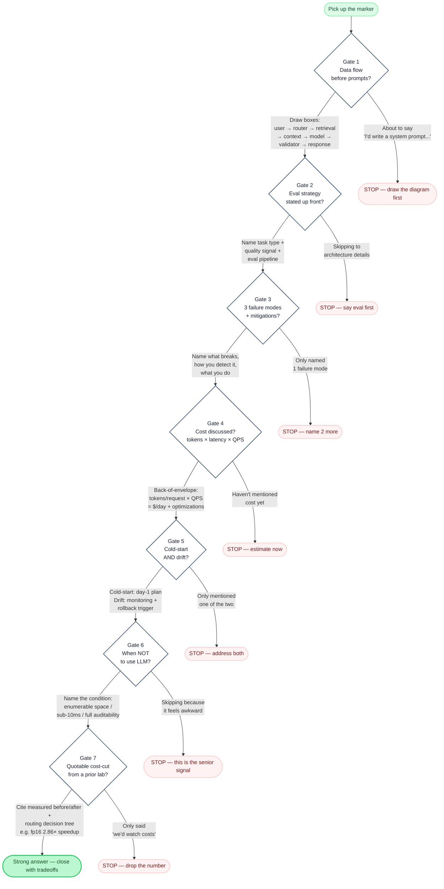

> **Interview angle:** The red STOP nodes are the moments where most candidates lose points. You will not lose points at the green nodes — those are where you have already said the right thing. The discipline is recognizing a STOP moment in real time and correcting course before the interviewer notices. Recording yourself is the only way to learn where your personal STOP moments are.

---

## Goal

By end of Week 11 you will have five recorded system-design walkthroughs, each self-critiqued against the 7-point rubric, plus a polished 60-second pitch for the infra-aware SRE agent that you can deploy on any phone screen. The recordings do not have to be good. They have to exist. Listening to yourself on recording is the fastest feedback loop available to you outside of an actual interview.

## Exit Criteria

- [ ] 5 design recordings committed to a folder (`recordings/week-11/`)
- [ ] Self-critique notes written for each recording (score yourself 1–5 on each rubric point + one "fix this next time" per point you scored below 4)
- [ ] The infra-aware SRE agent story (Exercise 5) is polished enough that you can deliver it without notes
- [ ] The 1-page system-design cheat sheet is printed and sitting on your desk
- [ ] RESULTS.md written with all five recording links and consolidated notes
- [ ] 6 Anki cards added (one per rubric point 1-7, condensed; plus one for the 5-tradeoffs cheat sheet)

---

## Theory Primer — Five Concepts Behind the Rubric

> Read this before you record anything. The rubric flowchart above tells you *what* to say. This section tells you *why* each gate exists and what the interviewer hears when you hit or miss it. Each concept below maps directly to one or more rubric gates.

---

### Concept 1 — The 7-Gate Rubric as a Senior-Signal Checklist

The rubric is not a formatting preference. It is a compressed version of what Anthropic's "Building Effective Agents" post (2024, updated 2026) identifies as the six factors that recur across every production agent case study they examined: observable data flow, upfront eval commitment, explicit failure enumeration, cost-awareness, lifecycle planning (cold-start and drift), and the discipline to recognize when an LLM is the wrong tool. The post opens with a blunt observation: most agent failures trace back not to model capability but to a missing constraint in one of these six areas. The case studies that follow — across Anthropic's own deployment teams, Replit's code-assist pipeline, Pinecone's retrieval-augmented systems, and YC postmortems — repeat that same list with different surface details each time.

When an interviewer scores your whiteboard answer, they are pattern-matching against those same six factors, usually without being explicit about it. A candidate who covers all six in order signals that they have shipped something and learned what breaks. A candidate who covers one or two signals that they have read papers. The difference is legible in the first ten minutes of a whiteboard session.

**The practical discipline:** Before you pick up the marker, run the checklist in your head as a sequential gate check. Do not skip a gate because the answer feels obvious. The gates you skip in practice are the ones that feel obvious — and they are exactly the ones the interviewer is watching for.

> **Interview soundbite:** "I want to make sure I cover the six things that separate a design proposal from a production design: data flow first, eval up front, three failure modes with mitigations, a cost model, cold-start and drift planning, and when I'd replace this LLM component with something deterministic. Let me start with the data flow."

---

### Concept 2 — Cold-Start Strategies When No Labeled Data Exists

Every system design implicitly assumes some quantity of historical data. The senior signal is naming that assumption explicitly and having a plan for day one, when the assumption is false.

Four strategies work in practice:

**LLM-as-labeler (synthetic bootstrap).** Use a stronger model — GPT-4o, Claude Opus, or a fine-tuned judge — to generate labeled examples for your eval set before you have any real user traffic. This is not the same as using the model to label its own outputs; the labeler model is separate from the production model and operates on a fixed schema. The Anthropic "Building Effective Agents" post specifically recommends starting with task decomposition traces as a first synthetic signal before any real labels exist.

**User-feedback capture (streaming eval set).** Wire thumbs-up / thumbs-down signals — or any implicit success proxy, such as a user not immediately rephrasing their query — into a quiet eval pipeline from day one. Even five labeled examples per day compounds into a usable eval set within weeks. The key engineering constraint: the feedback schema must be defined before launch, not retrofitted after. Retrofitting breaks the lineage needed for drift detection later.

**LLM-as-judge with sampled human audit.** At decision moments — routing decisions, retrieval quality checks, output validation gates — use an LLM judge to score outputs automatically, and pull a random 5–10% sample for a human reviewer each week. This gives you a calibrated eval signal with bounded human cost. The calibration step (human auditor scores the same examples as the judge, periodically) is what prevents judge drift from contaminating your quality signal.

**Paper eval (50 examples before writing code).** Before writing any production code, hand-label 50 representative inputs and their expected outputs. This sounds trivial; it is not. The act of labeling 50 examples surfaces ambiguity in the task definition that no amount of prompt engineering will fix, and it gives you a regression set that gates every subsequent change. If you cannot label 50 examples in a reasonable amount of time, you do not yet understand the task well enough to build a system for it.

> **Interview soundbite:** "On day one we have zero labels, so I'd do two things in parallel: a paper eval — hand-label 50 representative inputs before writing code — and wire a user-feedback capture from launch so every session generates a quiet eval signal. Within two weeks we have enough data to run LLM-as-judge with a 10% human audit sample. That's the cold-start plan."

**Optional deep dive:** The paper eval approach is derived from the evaluation-first methodology in the Anthropic cookbook accompanying "Building Effective Agents." The specific recommendation is: define the eval harness, write 50 examples, get the system to pass 80% of them before moving to production data collection.

---

### Concept 3 — Drift Detection for LLM Systems

ML drift and LLM drift are different problems. Classical ML drift means your input distribution shifted relative to the distribution you trained on. LLM drift is subtler because the model is not yours — and three distinct drift modes operate simultaneously:

**Prompt-rot.** The provider updates model weights silently (this happens on a schedule that is not always publicized). A prompt that was carefully calibrated for a specific behavioral profile degrades quietly as weights shift. Detection: run a canary eval set nightly against your production prompt — the same 50–100 examples you hand-labeled at cold-start — and alert when pass-rate drops more than 3 percentage points from baseline.

**Schema drift.** Your tool definitions evolve. A retrieval API adds a new field, a database schema gets a column rename, a downstream service changes its response envelope. The LLM was fine-tuned on your original tool schemas; the new schema may produce subtly wrong behavior without any obvious error signal. Detection: version your tool definitions alongside your prompts. Treat a tool schema change as a breaking change that requires a regression eval before deployment.

**Corpus drift.** The documents your retrieval layer indexes change over time. A knowledge base that was 80% technical documentation in January becomes 50% sales collateral by July. Retrieval quality degrades because the corpus the retrieval model was calibrated against no longer resembles the live corpus. Detection: track retrieval hit-rate (whether the expected chunk appears in top-k results) on a fixed query set monthly. Alert when hit-rate drops more than 5%.

The monitoring architecture follows from these three modes: versioned prompts (stored in version control, not hardcoded), canary eval sets run as a nightly CI job, and production trace sampling that flags out-of-distribution inputs (inputs that score low on embedding similarity to your training distribution) for human review.

> **Interview soundbite:** "I'd distinguish three drift modes: prompt-rot from silent provider weight updates, schema drift when tool definitions evolve, and corpus drift as the retrieval document set changes. Each has its own detection mechanism — nightly canary evals for prompt-rot, versioned schemas with regression gates, and monthly retrieval hit-rate tracking on a fixed query set."

**Optional deep dive:** The Pinecone production case study describes corpus drift as the most common undetected failure mode in RAG systems at scale. Their recommendation — log every retrieval query and the top-k results for a random 1% sample, then run a weekly offline analysis on retrieval quality against ground-truth chunks — is the most operationally realistic approach for teams without dedicated ML infrastructure.

---

### Concept 4 — When NOT to Use an LLM

This is the rubric gate that most candidates skip because it feels counterproductive to argue against their own proposal. It is also the gate that interviewers weight most heavily as a proxy for engineering judgment, because it cannot be faked by someone who has only read about LLMs.

Three conditions consistently justify replacing an LLM component with something deterministic:

**Fully enumerable decision space.** If the set of valid outputs is small and known — route to one of five queues, classify into one of twelve ticket categories, determine whether a value is above or below a threshold — a rules engine, a decision tree, or a classical classifier will be faster, cheaper, more auditable, and more reliable. An LLM adds cost and non-determinism for zero additional capability. Graph traversals, SQL queries, metric threshold comparisons, and regex matches fall into this category. The LLM would sometimes get them wrong; the deterministic alternative never does.

**Token cost exceeds unit-economics ceiling.** Calculate: `cost_per_request = (input_tokens + output_tokens) × price_per_token`. Multiply by QPS. If the resulting cost-per-user-action exceeds the revenue-per-user-action by a meaningful margin, you are building a business that loses money per transaction. The Replit case study describes this as the forcing function that drove them to replace a GPT-4-based code-explanation path with a smaller fine-tuned model for the high-volume tail of requests, while keeping GPT-4 for the low-volume complex head.

**Wrong-answer cost exceeds right-answer value.** In regulatory domains — medical diagnosis, legal interpretation, financial compliance, safety-critical infrastructure — a wrong answer from an LLM produces liability that far exceeds the value of a correct answer. In these domains, the correct architecture uses the LLM only for drafting or surfacing candidates, with a human in the loop for every consequential decision. This is not a failure of LLM capability; it is a recognition that the risk profile is asymmetric.

> **Interview soundbite:** "I'd replace the LLM with something deterministic in three cases: the decision space is fully enumerable and a rules engine is more reliable; the token cost at production QPS breaks unit economics; or the wrong-answer cost is higher than the right-answer value — which is true for anything in a regulatory or safety-critical domain."

**Optional deep dive:** The YC postmortem data (2024 cohort retrospectives) shows that the most common cause of agent product failure is not model quality — it is deploying an LLM for a task where the decision space was fully enumerable and a cheaper deterministic system would have performed better. Interviewers from companies that have shipped production agents will have seen this firsthand.

---

### Concept 4.5 — Enterprise Governance Vocabulary: Microsoft Agent Governance Toolkit

System-design rounds at enterprise-leaning companies (banks, healthcare, regulated industries, anything with a CISO) increasingly probe **agent governance** as a first-class concern alongside cost, latency, and reliability. The Microsoft Agent Governance Toolkit (open-source, 2025–2026) is the most concrete vocabulary set to learn for this — even if you never deploy it, knowing the categories lets you answer "how would you make this safe to ship in a regulated environment?" with named patterns instead of hand-waving.

The toolkit defines six governance dimensions you should be able to name and discuss:

1. **Identity & access** — agents act as principals with their own scoped credentials (not under the user's identity). Maps to Entra ID / IAM agent-identity primitives.
2. **Audit logging** — every tool call, every retrieved document, every output decision logged with timestamps + user attribution. Append-only, queryable. The "Phoenix traces but compliance-grade" version.
3. **Content filtering / policy enforcement** — pre-output filters that catch PII leaks, regulated content, prompt-injection responses; post-output filters that enforce response policy.
4. **Capability scoping** — explicit allow-list of which tools / data sources / external systems each agent class can touch. Aligns with the permission system you saw in Week 6 Claude Code dive.
5. **Drift monitoring** — continuous evaluation of agent behavior against approved baselines; alarms when behavior deviates from baseline beyond threshold. The production version of Week 9's faithfulness checking.
6. **Incident response & rollback** — kill-switch primitives, version-pinning, the ability to disable an agent class globally without redeploying.

**Why this earns a callout (not a lab):** you will probably never need to *implement* this toolkit during the curriculum, but every Exercise 1–5 system-design answer can level up by naming the governance dimension that addresses each safety concern raised. "Audit logging" is more compelling than "we'd log it somewhere"; "capability scoping with deny-by-default" is more compelling than "we'd restrict permissions." Drop these terms into your whiteboard rounds and you sound like someone who has shipped to a regulated environment, even if your demo capstone hasn't.

> **Interview soundbite:** "For any system-design round at an enterprise-leaning company, I name the six Microsoft Agent Governance dimensions explicitly: identity & access, audit logging, content filtering, capability scoping, drift monitoring, incident response & rollback. Even if the question doesn't require deep enterprise knowledge, naming the categories signals that I've thought about safety as a first-class concern alongside cost and latency."

---

### Concept 5 — Team Adoption Readiness (团队落地)

Individual proficiency with an LLM tool does not compound into team capability without deliberate structure. This is the insight that separates engineers who have shipped agent systems in team contexts from engineers who have run personal experiments.

The Harness Engineering Book 1, Chapter 8 opens with a statement that is worth memorizing verbatim:

> **"个人顺手，不代表团队就能稳定复用"**
> *(Personal smoothness doesn't imply team reproducibility.)*

The mechanism behind this observation: individual experts compensate for a tool's rough edges through judgment, context, and real-time course-correction. They know which prompts to avoid, which outputs to distrust, which failure modes to watch for. That knowledge lives in their heads. When the tool is handed to a team, none of that institutional knowledge transfers automatically — and the system's apparent capability collapses to the level of its least-informed user.

The Harness Book 1 §8.2 identifies the four questions that must be answered before team adoption can be stable:

1. Which tasks is the agent allowed to participate in autonomously?
2. Which changes require a human review before they take effect?
3. What verification must pass before any change is considered complete?
4. Which resources can the agent never touch?

These four questions define the minimum viable boundary. Without that boundary, the adoption sequence produces predictable failure modes: the agent gets used for tasks outside its reliable range, no one knows who is responsible for reviewing its output, and "efficiency improvement" is actually an expansion of the blast radius.

The Harness Book 2, Chapter 8.5 adds a sequencing recommendation for teams starting from zero that maps directly to the cloud-infra context:

> Start with high-risk action definition and minimum permission model. Define the main loop or session lifecycle. Define context governance and recovery paths. Define skills, local rules, and hooks. Only then expand to multi-agent orchestration and platform-level automation.

This sequence is deliberately unglamorous. It follows the order in which production incidents occur, not the order in which features are impressive to demo. For a platform team adopting a new AI tool — analogous to adopting a new infrastructure primitive like a new database engine or a new container runtime — the instinct will be to start with the advanced orchestration features. The discipline is to start with the boundary definition.

The practical translation for a system design interview: when you describe a team deploying an LLM-based system, name the adoption sequence explicitly. Say what the minimum viable boundary is, what the verification definition is, and what the rollout looks like. Candidates who treat adoption as a checkbox ("we'd roll it out to the team after testing") are describing a memo, not a plan.

> **Interview soundbite:** "Before we talk about scaling the system to the team, I want to define the minimum viable boundary: which tasks the agent can run autonomously, which require human review, what verification has to pass before anything is considered done, and which systems are off-limits. Without that boundary, adoption just expands the blast radius. The rollout sequence follows from the boundary definition, not the other way around."

**Optional deep dive:** The Harness Book 1 §8.4 makes a distinction that is easy to miss: skill reuse and verification definition are separate problems. A team can copy skills (workflow modules) without copying the quality standard those skills were designed to enforce. The correct adoption order is: unify the verification definition first, then build skills that enforce it, then scale the skills. Teams that reverse this order end up with skills that are technically reproducible but enforce the wrong quality bar.

---

> **Connecting the five concepts:** Concepts 1–4 map directly to rubric gates 1–6. Concept 5 is the meta-layer: a technically correct design that ignores team adoption realities will fail in production for organizational reasons that have nothing to do with the architecture. Senior engineers mention both. The 60-second pitch version of any design answer should end with: "And for team adoption, the first step is defining the minimum viable boundary before any rollout."

---

### Companion Texts — Gulli Cross-References

- **[Gulli *Agentic Design Patterns* Ch 9 — Learning and Adaptation]** + **[Ch 18 — Guardrails/Safety]** + **[Ch 20 — Prioritization]** — senior-signal vocabulary for system-design rounds. ~60 min total
- **[Gulli *Agentic Design Patterns* Ch 13 — Human-in-the-Loop]** — pattern vocabulary for human-escalation paths. ~15 min
- **[NarendraKoya999/system-design-handbook](https://github.com/NarendraKoya999/system-design-handbook)** — free community-driven curriculum including a dedicated phase on designing systems with LLMs, RAG pipelines, and AI agents; treat it as the AI-native complement to Alex Xu's volumes. ~2–3 hrs selective reading across Phase 7 (LLM/RAG/Agent system design).

## Phase 1 — Read 5 Real Case Studies (3 hours)

Before you design anything, you need to hear how practitioners actually talk about these problems. Reading case studies before recording your designs means your vocabulary will match the vocabulary of the engineers who will evaluate you.

**What to read and what to extract from each:**

**1. Anthropic — "Building Effective Agents" (blog post + accompanying cookbook)**
This is the canonical Anthropic framework piece. The key ideas: workflows vs agents, the three core primitives (augmented LLM, router, parallelization), the orchestrator-subagent pattern, and the human-in-the-loop checkpoints. Extract specifically: how Anthropic characterizes the cold-start problem for agent eval (they recommend starting with task decomposition traces before you have any labels), and their framing of "minimal footprint" as a design principle (request only necessary permissions, prefer reversible over irreversible actions). That last point shows up directly in the coding-agent exercise.

**2. OpenAI — Agent Case Studies (Operators documentation + assistant API blog posts)**
Focus on the function-calling and tool-use architecture decisions. Extract: how OpenAI recommends structuring tool schemas for reliability (name clarity, parameter typing, description length tradeoffs), the pattern of routing between tools based on confidence thresholds, and their handling of the "ambiguous tool call" failure mode. Note their recommendation on parallel tool calls vs sequential — this is a latency vs correctness tradeoff you will be asked about.

**3. Pinecone — Customer Stories (2–3 production RAG case studies)**
These are the most grounded in deployment reality because Pinecone customers have to solve the actual infrastructure problems. Extract specifically: how each customer handled the embedding-refresh problem (stale vectors after document updates), how they instrumented retrieval quality in production (what metrics, what dashboards, what alerts), and what drove their chunking strategy. The pattern you will see repeatedly is "we started with fixed-size chunks, eval told us it was wrong, we moved to semantic chunking." That is a rubric-point-2 story.

**4. Replit — Coding Agent (their engineering blog posts on the AI agent)**
Replit's coding agent is the closest public case study to the coding-agent exercise (Exercise 3). Extract: their sandboxing architecture (each execution environment is isolated, why this matters for the permission model), how they handle context compaction when a coding session runs long, and their approach to evaluating code correctness (test execution as a ground-truth signal, not LLM-as-judge). This is the one case study where "run the tests" is a literal eval strategy.

**5. YC Company Postmortems — LLM Startups (look for "what went wrong" content from 2024–2025 YC batches)**
These are harder to find but more valuable than success stories. Look for: latency surprises at scale (the agent that worked fine at 10 QPS collapsed at 100 QPS because the orchestration overhead dominated), cost surprises (the team that discovered their per-request token cost was 3× what they estimated because they hadn't accounted for retry tokens), and eval surprises (the team whose offline eval said 92% accuracy but production user satisfaction was 61% because the eval set didn't cover the actual distribution of user queries).

**For each case study, fill in this capture template in your notes:**

```
Case study: [name]
Cold-start approach: 
Eval strategy (offline): 
Eval strategy (online): 
Cost model / optimization: 
Drift handling: 
On-call / incident playbook: 
Most surprising detail: 
One thing I'll steal for my designs: 
```

> **Go deeper:** After the Replit post, search for "coding agent sandboxing" on the Anthropic prompt library and read the computer-use safety documentation. The permission-model design pattern (allowlist vs denylist, reversible vs irreversible action taxonomy) comes directly from this literature and will surface in the coding-agent exercise.

> **Analogy (Infra):** Reading these case studies is like reading query execution plans from the databases you've worked on before tackling a new query optimization problem. You're building intuition about where things break, not memorizing answers.

---

## Phase 2 — Exercise 1: Enterprise Document Q&A with Citations (2 hours)

### Time allocation
- 30 minutes: think silently, draw the architecture (box and arrow, paper is fine)
- 60 minutes: talk through the design aloud, recording
- 30 minutes: replay, score against the 7-point rubric, write notes

### Problem statement (the fictional interviewer prompt)

> "We're a mid-size law firm. We have 200,000 internal documents — contracts, case filings, internal memos — spread across three systems: SharePoint, a legacy document management system, and email archives. Lawyers need to ask questions like 'what are the termination clauses in the Apex Corp contracts from 2022 onward?' and get answers with citations to the exact document and page. Access control matters: a junior associate should not see partner compensation documents. Design this system. You have 45 minutes."

### Expected architecture checklist

A strong answer will include all of the following. Check each off as you include it in your recording:

- [ ] **Ingestion pipeline**: document format normalization (PDF, DOCX, MSG → text), metadata extraction (author, date, document type, access control list), chunking strategy (semantic or paragraph-level with overlap, not fixed-character), embedding model choice with rationale
- [ ] **Multi-tenant retrieval isolation**: ACL-aware filtering at query time (namespace per user group, or metadata filter on retrieved candidates), not just at ingestion time. Explain why filtering at retrieval is safer than filtering at generation.
- [ ] **Query understanding**: query classification (is this a factual lookup, a comparative query, or a multi-hop reasoning query?), query rewrite or expansion for legal domain vocabulary
- [ ] **Context assembly**: retrieved chunk + source document metadata → structured context block. Citation format defined before generation, not after.
- [ ] **Generation with grounding**: the prompt explicitly instructs the model to cite using the provided source IDs. Out-of-scope refusal: if no retrieved chunk supports the answer, the model must say so — not hallucinate.
- [ ] **Audit log**: every query, every set of retrieved chunks, every generated answer, logged with user ID and timestamp. This is a compliance requirement in legal, not a nice-to-have.
- [ ] **Eval strategy**: faithfulness (does the answer contradict the cited chunks?), answer relevance (does the answer address the question?), citation accuracy (do the cited documents actually contain the claimed text?). For faithfulness, LLM-as-judge works; for citation accuracy, exact-match string search works.
- [ ] **Cold-start**: before you have any labeled QA pairs, use a synthetic generation approach — take 50 documents, ask the LLM to generate 5 questions per document, have a lawyer spot-check 20% of them, use the rest as your initial eval set.
- [ ] **Drift**: document corpus grows and rotates; ACLs change when employees are promoted or leave; the LLM you call may be updated. Monitoring: track retrieval hit rate (fraction of queries where top-k includes a document the user clicks or rates positively) as a proxy signal. Trigger re-eval on significant corpus changes.
- [ ] **Cost**: estimate tokens per query (average retrieval context ~3,000 tokens, system prompt ~500 tokens, output ~400 tokens = ~4,000 tokens/query). At 200 QPS and $3/M tokens (mid-tier model), that's ~$8,640/day before any optimization. Discuss: semantic caching for repeated queries, smaller model for the classification step, context compression before generation.

### Reference architecture diagram

This is what a strong whiteboard answer looks like for Exercise 1. Every box in this diagram should be named and explained in your recording.

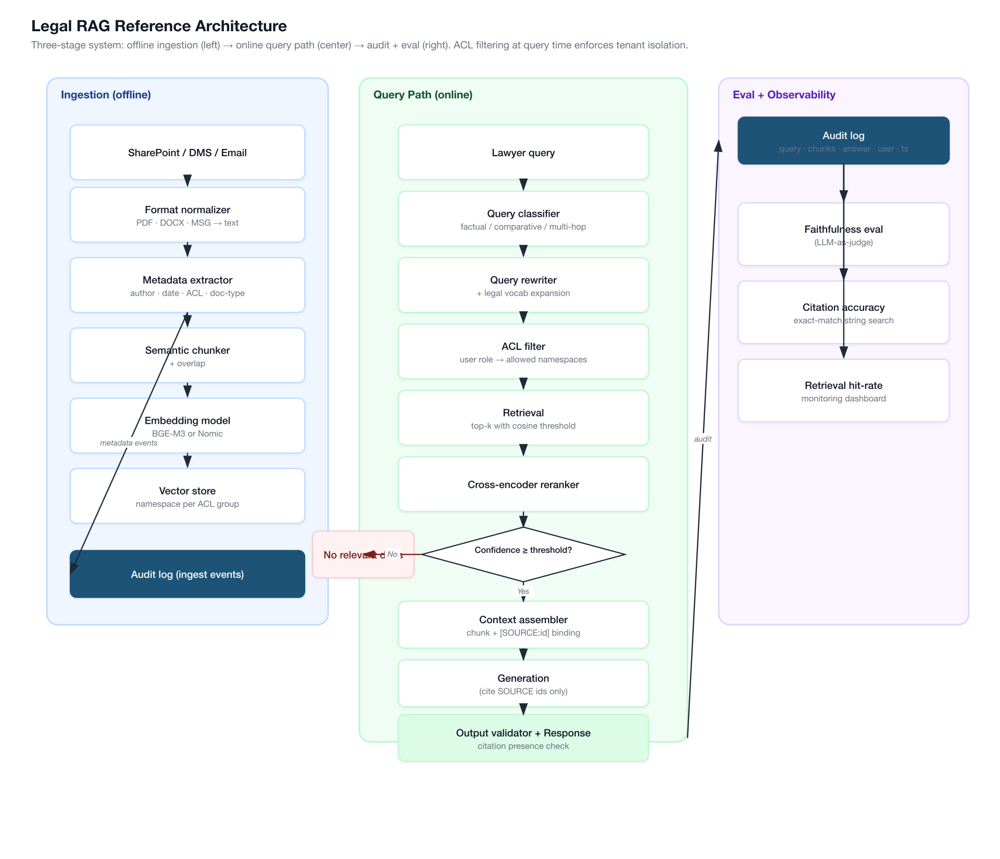

> *Diagram source: [`diagrams/week-11/gen_legal_rag_arch.py`](https://github.com/shaneliuyx/agent-prep/blob/main/diagrams/week-11/gen_legal_rag_arch.py) — regenerable Python script.*

**Common weak answer — what most candidates draw instead:**

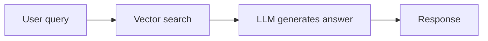

What is missing: ACL enforcement, confidence threshold, refusal path, citation binding at retrieval time, output validator, audit log, and the entire eval/observability layer. This is the diagram that scores 12/30 on the rubric. The first diagram scores 26–28/30 if you can explain each box.

#### Reference architecture — walkthrough (Legal RAG)

The strong-answer architecture turns "vector RAG over legal documents" into a production system by adding the layers a vector-only diagram skips. Walk through the strong diagram by data flow; pair every layer with the failure mode it defends against.

`★ Insight ─────────────────────────────────────`
- **ACL must enforce at retrieval, never at generation.** Filtering documents *before* they enter the context window is the only defensible model. A "system prompt asks the model to respect ACLs" answer is a fail.
- **Citation binding at retrieval time.** Every chunk gets a unique source ID *before* it reaches the LLM. The output validator checks that every cited ID actually appears in the retrieved context — making citation a structural property of the pipeline, not a prompting wish.
- **Audit log is the legal-domain tell.** Every query, retrieved chunk set, and generated answer logged with user ID + timestamp. This single layer is what separates "an interesting RAG demo" from "a system you can deploy at a law firm".
`─────────────────────────────────────────────────`

**Walkthrough — one query.**
1. **`User query → ACL filter`** — pull the user's role; restrict candidate doc set before retrieval.
2. **`Vector retrieval (top-K) → Confidence threshold`** — if top-1 cosine similarity < threshold, return "no relevant documents found" (refusal path; prevents hallucination on retrieval whiff).
3. **`Citation binding`** — wrap each retrieved chunk with a unique source ID; pass to the generator.
4. **`Generation → Output validator`** — validator confirms every factual claim has an inline citation and every cited ID exists in the retrieved set.
5. **`Audit log + eval`** — record query, retrieved IDs, generated answer with user_id + ts; sample claims for faithfulness/citation-accuracy spot-checks.
6. **`Response → user`** — only after passing validator + ACL.

**Defense-in-interview lines.** "ACL enforcement at retrieval, not generation." "Refusal path on retrieval whiff." "Citation binding before LLM, not after." "Audit log as a compliance requirement."

### 6-Rubric Scoring Sheet (fill in after replay)

| Rubric point | Score (1–5) | What I said | Fix next time |
|---|---|---|---|
| 1. Drew data flow before prompts | | | |
| 2. Eval strategy stated up front | | | |
| 3. Named 3 failure modes + mitigations | | | |
| 4. Cost discussed (tokens × latency × QPS) | | | |
| 5. Cold-start + drift discussed | | | |
| 6. Stated when NOT to use LLM | | | |
| **Total** | **/30** | | |

### Common misses

> **Common miss:** Candidates design the happy path (query comes in, retrieval runs, answer comes out) and never say what happens when retrieval fails to return anything relevant. A strong answer names the "retrieval whiff" failure mode explicitly: no relevant documents returned → the model is likely to hallucinate unless you have a hard check. Mitigation: set a retrieval-confidence threshold (minimum cosine similarity of top-1 result); if below threshold, return a "no relevant documents found" response instead of passing an empty context to the model.

> **Common miss:** ACL enforcement at generation time only. Candidates sometimes say "we'll put a note in the prompt that says the user shouldn't see partner documents." That is not access control. ACL enforcement must happen at retrieval: filter the candidate pool before chunks ever enter the context window.

> **Rubric hit:** The audit log is the detail that signals legal/enterprise domain awareness. Most candidates skip it because it doesn't feel like "AI." Mentioning it in the first five minutes signals that you've thought about the deployment context, not just the model.

> **Interview angle:** If the interviewer asks "how would you handle a query that spans multiple documents from different access levels?" — the correct answer is: the system should only return information from documents the user has access to. If the complete answer requires a document they can't see, the system should say "some relevant documents are outside your access level" rather than either hallucinating a complete answer or silently omitting the restricted content.

---

## Phase 3 — Exercise 2: Multi-Agent Customer-Support Triage (2 hours)

### Time allocation
- 30 minutes: think silently, draw the routing architecture
- 60 minutes: talk through the design aloud, recording
- 30 minutes: replay, score, write notes

### Problem statement

> "We're a mid-size SaaS company. Our support volume is 5,000 tickets per day across email, chat, and in-app. Tickets split roughly 40% billing questions, 35% technical issues, 25% account/access issues. Average human agent handle time is 8 minutes. We want an AI triage system that routes tickets to the right specialist queue, drafts an initial response, and escalates to humans for anything outside confidence thresholds. Design it. You have 45 minutes."

### Expected architecture checklist

- [ ] **Name the pattern explicitly: this is the Hierarchical Multi-Agent pattern** — a lead/router owns the ticket goal and delegates to typed specialists scoped to their tool sets. Saying the name aloud during the whiteboard round is a senior-signal move. Contrast briefly with flat Orchestrator-Worker: here the specialists are *typed* (billing/tech/account), not interchangeable, and each holds a different tool grant. The hierarchy is the security and scope boundary, not just a labelling choice. See **[[Week 5 - Pattern Zoo]]** Concept 1 Decision Tree for the pattern classification; the worked implementation is out of scope for the verbal round but the pattern name belongs in your first two sentences.
- [ ] **Intake normalization**: multi-channel ingestion (email parser, chat webhook, in-app event stream) → unified ticket schema (body, channel, customer ID, account tier, timestamp)
- [ ] **Classifier agent**: lightweight model (not your largest/most expensive) classifies intent into billing/technical/account/escalate. The classifier should output a confidence score, not just a label. Threshold tuning: you want high recall on "escalate" (never miss a case that needs a human) even at the cost of precision.
- [ ] **Specialist agents**: three agents with different tool sets. Billing agent has access to payment system API (read-only), subscription state, invoice history. Technical agent has access to error log search, known-issues database, documentation search. Account agent has access to user profile API, permission system, org management API.
- [ ] **Tool integration protocol — name MCP**: as of 2026, the Model Context Protocol (MCP) is the emerging standard for connecting agents to external systems (payment APIs, CRM, ticketing). Instead of writing bespoke API integration code per tool, MCP defines a uniform interface for tool schemas, routing, and permissions. Naming MCP and explaining why it reduces integration surface area is a senior-signal move in a 2026 interview.
- [ ] **Human escalation logic**: escalation triggers are not just "low confidence" — also: customer tier (enterprise customers get lower escalation threshold), sentiment signal (angry customer detected → escalate faster), ticket history (this customer has had 3 unresolved issues this month → escalate), and explicit customer request.
- [ ] **SLA tracking**: each ticket has an SLA clock. The system must be aware of SLA status and deprioritize or escalate based on time-to-breach. This is a stateful requirement — the orchestrator must be able to re-examine in-flight tickets.
- [ ] **Draft response**: the specialist agent drafts a response, which goes through an output validator (tone check, PII scrub, policy compliance check) before being sent or queued for human review.
- [ ] **Feedback loop**: human agents who edit AI drafts are producing training signal. Log every edit. Use edit distance as a proxy quality metric. High edit-distance responses are the worst-performing prompts.
- [ ] **Eval strategy**: offline — a labeled dataset of historical tickets (manually labeled by support managers) used to tune classifier thresholds and measure draft quality. Online — human approval rate, edit distance on approved drafts, CSAT score linked back to ticket ID, time-to-resolution vs baseline.
- [ ] **Cold-start**: the classifier can be bootstrapped from historical ticket labels if they exist. If no labels exist: run a human-labeling sprint on 500 tickets (one sprint, one week) to build the initial eval set. The agents themselves can start without eval — you are not measuring draft quality on day 1, you are measuring routing accuracy.
- [ ] **Cost**: 5,000 tickets/day = ~0.06 QPS average but with spiky arrival patterns (morning surge). The classifier is cheap (small model, ~500 tokens/call). The specialist draft generation is more expensive (~2,000 tokens/call). Budget: 5,000 × 2,500 avg tokens × $1.50/M tokens ≈ $18.75/day at mid-tier pricing. Optimizations: cache common billing FAQ answers, use a smaller model for the classifier, batch non-urgent tickets.

### Reference architecture diagram

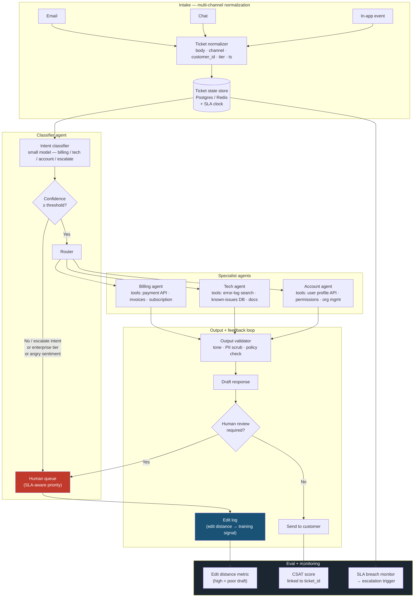

**Common weak answer:**

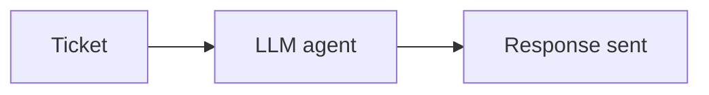

Missing: classifier confidence threshold, escalation logic, SLA state store, specialist tool sets, output validator, feedback loop from human edits, eval metrics. Scores roughly 8/30.

#### Reference architecture — walkthrough (Multi-Agent Triage)

The diagram is a **Hierarchical Multi-Agent** topology: one classifier in front, three typed specialists in the middle, an output validator at the end. Each layer is a defense — escalation routing isn't only confidence-based, output isn't sent without validation, every human edit becomes training signal.

`★ Insight ─────────────────────────────────────`
- **Specialists are typed, not interchangeable.** Billing has payment-API tools, Tech has error-log search, Account has user-profile API. The hierarchy is the security boundary, not just routing — wrong specialist getting wrong tools is the failure mode this prevents.
- **Escalation triggers are multi-dimensional.** Confidence < threshold OR enterprise tier OR angry sentiment OR repeat offender. Single-trigger escalation under-routes; multi-trigger reflects how human triage actually works.
- **MCP as integration protocol.** Naming Model Context Protocol explicitly is the 2026 senior-signal move — uniform tool schema/permissions instead of bespoke API code per tool.
`─────────────────────────────────────────────────`

**Walkthrough — one ticket.**
1. **`Email/Chat/In-app → Ticket normalizer → State store (Postgres + SLA clock)`** — multi-channel ingestion to unified schema.
2. **`Classifier agent → CONF gate`** — small model emits intent + confidence. Below threshold, or escalate intent, or enterprise tier, or angry sentiment → `Human queue`.
3. **`CONF pass → Router → Billing | Tech | Account`** — three typed specialists with disjoint tool grants.
4. **`Specialists → Output validator (tone · PII scrub · policy)`** — pre-send checks before draft leaves the system.
5. **`Draft → Human review?`** — soft-quorum decision; if reviewed and edited, capture into `Edit log`.
6. **`Edit log → Edit-distance metric`** — high edit distance flags low-quality prompts/specialists.
7. **`SLA monitor → Escalation trigger`** — re-examines in-flight tickets, escalates near breach.

**Defense-in-interview lines.** "Hierarchical Multi-Agent — typed specialists, not interchangeable workers." "Escalation is multi-dimensional, not just confidence." "Edit distance as a feedback metric." "MCP for tool integration."

### 6-Rubric Scoring Sheet

| Rubric point | Score (1–5) | What I said | Fix next time |
|---|---|---|---|
| 1. Drew data flow before prompts | | | |
| 2. Eval strategy stated up front | | | |
| 3. Named 3 failure modes + mitigations | | | |
| 4. Cost discussed (tokens × latency × QPS) | | | |
| 5. Cold-start + drift discussed | | | |
| 6. Stated when NOT to use LLM | | | |
| **Total** | **/30** | | |

### Common misses

> **Common miss:** Designing the multi-agent system as a sequential pipeline (classify → route → draft → send) without acknowledging that SLA tracking requires a stateful orchestration layer. Tickets are not fire-and-forget events — they have lifecycle. A strong answer names a state store (Redis or a Postgres tickets table) that the orchestrator reads from to check SLA status asynchronously.

> **Common miss:** Not saying when you would NOT use an LLM for this. The answer: the classifier can and should eventually be replaced by a fine-tuned text classifier (BERT-scale, not LLM-scale) once you have enough labeled data. The classifier is 40% of your per-ticket cost and does not need GPT-4-level reasoning to route into three buckets. A fine-tuned DistilBERT or equivalent will match LLM classifier accuracy at 1/100th the cost per call.

> **Rubric hit:** Mentioning the feedback loop from human edits is the detail that signals you understand how production ML systems improve over time. It also answers the drift question implicitly: your eval set is continuously refreshed from production.

> **Interview angle:** "How do you handle a ticket that sits on the boundary between billing and technical?" — the answer is: the classifier should emit a distribution over classes, not a single label. Near-boundary tickets get routed to a generalist queue (a human, or a multi-domain agent with access to all tool sets) rather than forced into the wrong specialist queue.

---

## Phase 4 — Exercise 3: Coding Agent (Claude Code Style) (2 hours)

### Time allocation
- 30 minutes: think silently — focus especially on the permission model and the context-compaction strategy
- 60 minutes: talk through the design aloud, recording
- 30 minutes: replay, score, write notes

### Problem statement

> "Design a coding agent that a developer can run locally in their terminal. The agent should be able to read files, write files, run shell commands, browse documentation, and make git commits. It should be able to tackle multi-step tasks like 'refactor this module to use the repository pattern' that require reading multiple files, making changes, running tests, and iterating on failures. Walk me through the architecture, the permission model, the context strategy, and how you'd evaluate it."

### Expected architecture checklist

- [ ] **Sandboxed execution environment**: shell commands do not run directly on the host — they run inside a controlled environment. At minimum, a process with constrained permissions; ideally a container or VM. The reason: an agent that can run arbitrary shell commands can rm -rf, exfiltrate data, or make network calls. Sandboxing is not optional.
- [ ] **Permission model — explicit allowlist design**: before the agent begins, the user specifies what the agent is allowed to do. The model is allowlist, not denylist: "allowed to read/write files under ./src, allowed to run pytest and make, allowed to make git commits, NOT allowed to make network calls outside the package registry." The agent checks every proposed action against the allowlist before executing. Unknown action types → pause and ask.
- [ ] **Reversibility taxonomy**: actions are classified as reversible (file write that can be undone with git checkout, test run that has no side effects) or irreversible (git push, npm publish, database migration). The agent requires explicit confirmation for irreversible actions, regardless of confidence.
- [ ] **Tool set**: file_read, file_write, shell_execute (sandboxed), web_search (documentation only, not arbitrary), git_commit, git_diff, test_runner. Each tool has a schema with explicit parameter validation.
- [ ] **Tool integration protocol — MCP**: the coding agent's tool set maps cleanly onto MCP tool definitions. MCP is the 2026 standard for declaring tool schemas, routing tool calls, and enforcing permissions — a uniform protocol replacing bespoke tool-dispatch code. Mention it when explaining how the agent discovers and validates available tools; it signals awareness of where the industry is moving.
- [ ] **Context compaction strategy**: coding sessions grow long. After N turns (or when context is at ~70% of window), compact: summarize completed subtasks, retain the current in-progress file contents, retain the test output from the most recent run, discard intermediate reasoning. The key insight is that you compact the conversation history, not the working memory (open files + test state).
- [ ] **Eval strategy**: the ground truth signal is test execution. If the tests pass after the agent's changes, the agent succeeded. This is one of the few domains where you do NOT need LLM-as-judge — deterministic execution is the eval. Secondary signals: did the agent complete the task in fewer tool calls than a baseline? Did it require human intervention?
- [ ] **Multi-file task decomposition**: for tasks like "refactor this module," the agent must plan before it acts — enumerate the files to change, identify the dependency order, make changes file by file rather than all at once. Agents that start writing before planning create merge conflicts and logical inconsistencies.
- [ ] **Error recovery**: when a test fails after a change, the agent should read the error, form a hypothesis, make a targeted fix, and re-run — not re-read every file from scratch. This requires the agent to maintain a working hypothesis about what is broken.
- [ ] **Cold-start**: the agent starts fresh on every repository. It does not need historical data. What it needs is good initial context: the README, the test structure, the high-level architecture. There should be an "onboarding" step where the agent reads these before starting any task.
- [ ] **When NOT to use LLM**: tasks that are fully mechanical (add a copyright header to every file, rename a variable project-wide) should be handled by a sed/awk script, not an LLM. The LLM is for tasks that require understanding context and making judgment calls.

### Reference architecture diagram

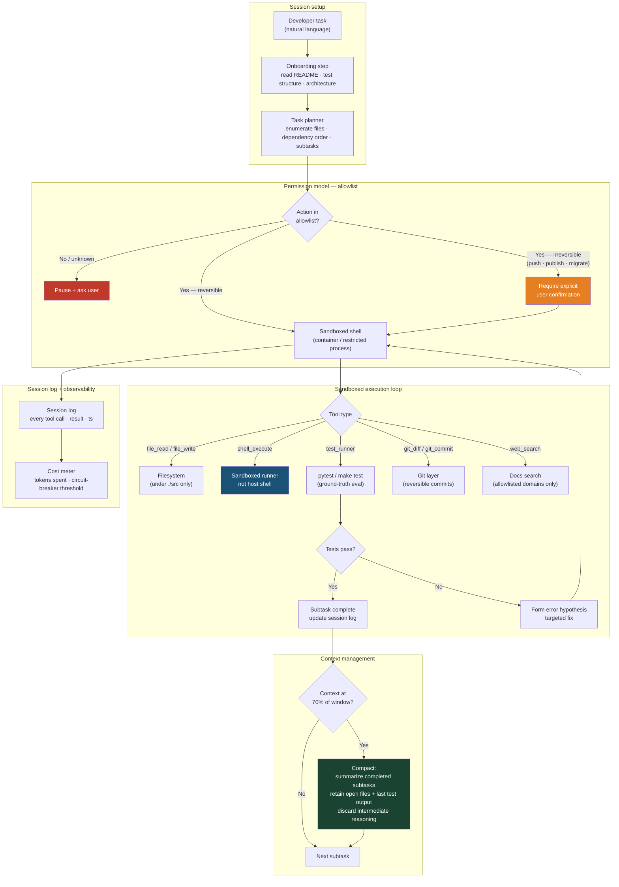

**Common weak answer:**


Missing: permission model, sandbox isolation, reversibility distinction, context compaction, session log, cost circuit-breaker, test-as-eval ground truth, multi-subtask planning. Scores around 6/30.

#### Reference architecture — walkthrough (Coding Agent)

The diagram encodes the four production-quality choices that distinguish a coding agent from a "LLM that writes code": permission allowlist, sandboxed execution, context compaction, and a session log with cost circuit-breaker.

`★ Insight ─────────────────────────────────────`
- **Permission model is allowlist, not denylist.** Reversible actions auto-execute; irreversible actions (push, publish, migrate) require explicit confirmation. Denylist permission models always have gaps — Claude Code uses allowlist for exactly this reason.
- **Tests are the eval.** `pytest / make test` is ground truth — a passing test suite is the success signal, not LLM judgement of code quality. This is the single most important property to articulate aloud.
- **Context compaction at 70% threshold.** Long coding sessions exceed any context window; compaction summarizes completed subtasks and discards intermediate reasoning while keeping open files + last test output. Without this, the agent is a prototype.
`─────────────────────────────────────────────────`

**Walkthrough — one developer task.**
1. **`Onboarding (README · tests · architecture) → Task planner`** — read repo first, then enumerate files + dependency order + subtasks.
2. **`Plan → Permission check`** — three branches: unknown action → ask, reversible → execute, irreversible (push/publish/migrate) → confirm.
3. **`Sandboxed execution`** — file_read/write contained to `./src`, shell_execute in container, test_runner is the eval.
4. **`Tests pass?`** — yes → subtask complete; no → form error hypothesis → targeted fix → re-execute (single retry path, not full re-read).
5. **`Context check (70%)`** — when threshold hit, compact: summarize done subtasks, retain open files + last test output, discard intermediate reasoning.
6. **`Session log → Cost meter → Circuit-breaker`** — every tool call logged; cost meter trips at threshold and pauses to ask user.

**Defense-in-interview lines.** "Allowlist over denylist." "Tests are the eval." "Compact at 70%, retain open files + last test output." "Cost circuit-breaker on agent runtime."

### 6-Rubric Scoring Sheet

| Rubric point | Score (1–5) | What I said | Fix next time |
|---|---|---|---|
| 1. Drew data flow before prompts | | | |
| 2. Eval strategy stated up front | | | |
| 3. Named 3 failure modes + mitigations | | | |
| 4. Cost discussed (tokens × latency × QPS) | | | |
| 5. Cold-start + drift discussed | | | |
| 6. Stated when NOT to use LLM | | | |
| **Total** | **/30** | | |

### Common misses

> **Common miss:** Not discussing the context-compaction strategy. Candidates describe the tool set and the permission model (which is good) but never address the fundamental constraint: coding sessions are long, context windows are finite. If you don't name your compaction strategy, you've described a prototype, not a production system.

> **Common miss:** Designing the permission model as denylist ("it's allowed to do everything except…"). Denylist permission models always have gaps. Allowlist is the correct default for any system that can execute code on a user's machine. Claude Code specifically uses the allowlist model — referencing this design choice demonstrates you've studied real systems.

> **Analogy (Infra):** The context-compaction problem is structurally identical to incremental reconcile checkpointing. You don't re-read the entire source dataset on every run — you checkpoint your progress, compact the state, and continue from the checkpoint. The agent does the same thing with its conversation history.

> **Interview angle:** "How would you handle an agent that gets into an infinite retry loop?" — the answer involves three things: a max-iterations limit that terminates the loop and surfaces to the user, a diversity check on recent tool calls (if the last 5 tool calls are identical, something is wrong), and a cost circuit-breaker (if tokens spent on this task exceed a threshold, pause and ask the user how to proceed).

---

## Phase 5 — Exercise 4: Financial-Research Agent (2 hours)

### Time allocation
- 30 minutes: think silently — focus especially on the refusal strategy and the deterministic eval
- 60 minutes: talk through the design aloud, recording
- 30 minutes: replay, score, write notes

### Problem statement

> "A boutique investment research firm wants an AI research agent that can help analysts answer questions like 'compare the revenue growth trajectory of Nvidia and AMD over the last 5 years' or 'what did Apple's CFO say about supply chain in the last three earnings calls?' The agent needs to search SEC filings, financial databases, news, and analyst reports, and it must cite every factual claim. It should refuse to speculate or make investment recommendations. Design it."

### Expected architecture checklist

- [ ] **Tool set — heavy**: web_search (financial news), edgar_search (SEC filings by company + form type + date range), earnings_transcript_search, spreadsheet_tool (compute ratios, build comparison tables), citation_tracker (every fact retrieved gets a source ID bound to it before it enters the context).
- [ ] **Citation-binding architecture**: this is the critical design choice. Citations are not added after generation — they are bound at retrieval time. Every chunk of text pulled from EDGAR or a transcript is wrapped in a source block with a unique ID: `[SOURCE:AAPL-10K-2024-p47]`. The prompt instructs the model to inline these IDs when it uses the information. The output validator checks that every factual claim in the response has an inline citation and that every cited source ID actually appears in the retrieved context.
- [ ] **Refusal on speculation**: the model must be explicitly instructed to refuse questions like "will Nvidia's stock go up?" or "is this a good investment?" The refusal mechanism is not just a system prompt instruction — it requires an intent classifier at the front of the pipeline that catches investment-recommendation requests before they reach the agent. This is defense-in-depth.
- [ ] **Deterministic eval**: financial data has ground truth. If the agent says "Apple's 2024 revenue was $391 billion" you can look that up and check. Eval strategy: sample 50 factual claims from agent outputs, check each against the primary source. Measure factual accuracy rate directly. This is rarer than you think — most agent evals rely on LLM-as-judge because ground truth is hard to get. Here you have ground truth.
- [ ] **Data freshness**: financial data changes daily. The system must show the user the retrieval timestamp on every source. Stale data in financial context is not a UX problem — it is a compliance risk. Every response should display "data retrieved as of [timestamp]."
- [ ] **Structured output for quantitative comparisons**: when the agent is building a comparison table (Nvidia vs AMD revenue), it should emit structured JSON that the UI renders as a table, not prose. Mixing narrative and structured data in a single markdown blob creates downstream parsing problems.
- [ ] **Audit trail**: every query, every tool call, every retrieved document, every generated response, logged with analyst ID and timestamp. Compliance requirement for regulated financial services.
- [ ] **Cost**: financial research queries are complex and multi-step. A typical ReAct trace for a comparative analysis might involve 8–12 tool calls, each returning ~2,000 tokens of context. Total context per query: potentially 20,000+ tokens. At premium model pricing, a single complex query could cost $0.10–$0.30. For a boutique firm doing 100 queries/day, that's $10–30/day — manageable. But at scale (a large bank, thousands of analysts), cost optimization is critical: cache EDGAR filings aggressively (they don't change), use smaller models for search reformulation.
- [ ] **Cold-start**: no labeled eval data on day 1. Bootstrap with: (a) 30 manually curated QA pairs covering the three main query types (revenue comparison, transcript quote lookup, filing summary), (b) deterministic factual-accuracy check for quantitative claims from day 1 (no labeling needed for this metric).

### Reference architecture diagram

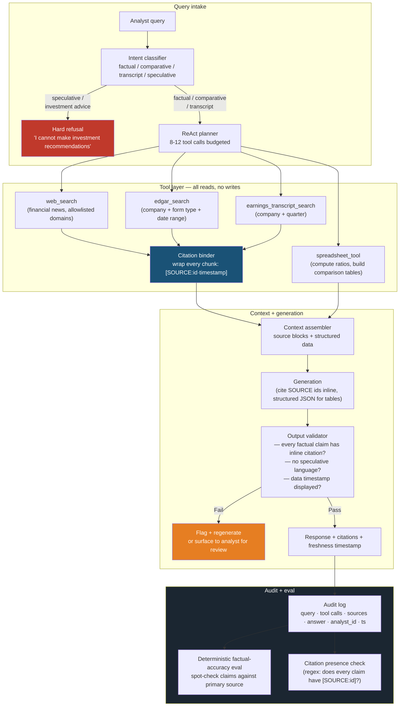

**Common weak answer:**

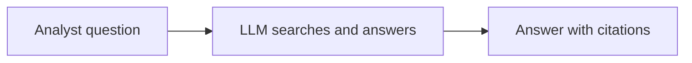

Missing: front-end intent classifier with hard refusal path, citation binding at retrieval time (not generation time), output validator enforcing citation presence, deterministic factual-accuracy eval, data freshness timestamps, audit log. Scores around 9/30.

#### Reference architecture — walkthrough (Financial Research)

The diagram answers "how do you build a research agent that won't hallucinate or speculate?" with three structural choices: front-end intent classifier with hard refusal, citation binding at retrieval time, deterministic factual eval against primary sources.

`★ Insight ─────────────────────────────────────`
- **Refusal is a separate layer, not a system-prompt instruction.** Speculative-intent classification fires *before* the agent runs. Defense-in-depth that cannot be jailbroken from inside the agent loop.
- **Citation binding at retrieval time, validation at output time.** Every chunk wrapped with `[SOURCE:id·timestamp]` *before* the LLM sees it; output validator regex-checks that every claim has an inline `[SOURCE:id]`. Pipeline design, not prompt engineering.
- **Deterministic eval is the unlock.** Numbers in SEC filings have ground truth — sample 50 claims, check primary sources directly. LLM-as-judge is the wrong tool when you have ground truth.
`─────────────────────────────────────────────────`

**Walkthrough — one analyst query.**
1. **`Analyst query → Intent classifier`** — speculative / investment-advice intent → hard refusal exit.
2. **`Factual / comparative / transcript → ReAct planner (8–12 tool calls budgeted)`**.
3. **`Tools (web · edgar · transcript · spreadsheet) → Citation binder`** — every retrieved chunk wrapped with source ID + timestamp before entering context.
4. **`Context → Generation`** — model emits answer with inline `[SOURCE:id]` tokens and structured JSON for any comparison tables.
5. **`Output validator`** — regex citation-presence check + speculative-language check + freshness-timestamp check. Fail → flag/regen; pass → response.
6. **`Audit log → Deterministic factual eval + Citation presence regex`** — primary-source spot-check, not LLM-as-judge.

**Defense-in-interview lines.** "Refusal as a separate classifier, not a system-prompt instruction." "Citation binding at retrieval time, validated at output." "Deterministic eval against primary source." "Freshness timestamp on every response."

### 6-Rubric Scoring Sheet

| Rubric point | Score (1–5) | What I said | Fix next time |
|---|---|---|---|
| 1. Drew data flow before prompts | | | |
| 2. Eval strategy stated up front | | | |
| 3. Named 3 failure modes + mitigations | | | |
| 4. Cost discussed (tokens × latency × QPS) | | | |
| 5. Cold-start + drift discussed | | | |
| 6. Stated when NOT to use LLM | | | |
| **Total** | **/30** | | |

### Common misses

> **Common miss:** Treating citation as a prompt-engineering problem ("just tell the model to cite its sources"). Citations enforced only by prompt instruction will be silently dropped whenever the model is uncertain or when the output is long. The robust pattern is structural: cite at retrieval time, validate at output time, reject uncited factual claims in the output validator. This is a pipeline design choice, not a prompting choice.

> **Common miss:** Not naming the refusal mechanism as a separate classifier layer. If the only defense against investment-recommendation requests is the system prompt, a determined user can jailbreak it. A front-end intent classifier that catches speculative requests before they reach the agent is defense-in-depth that an interviewer at a regulated financial firm will notice and appreciate.

> **Rubric hit:** The "deterministic eval" point is the unlock for this domain. When you say "I'd check factual claims against the primary source rather than using LLM-as-judge," you are demonstrating that you know when LLM-as-judge is and is not appropriate — which is exactly rubric point 2.

---

## Phase 6 — Exercise 5: Infra-Aware SRE Agent — Your Differentiator (2.5 hours)

This is not just another exercise. This is the story. You have three years of cloud infrastructure experience — Kubernetes, Terraform, observability, SRE. Nobody else interviewing for the same agent engineer role can ship this system from intuition — they'd have to read documentation about PromQL and distributed tracing to even understand the problem. You understand the problem from lived experience. That is an unfair advantage, and this exercise is how you convert it into interview signal.

Spend the extra 30 minutes here. The recording for this one should be the best of the five.

### Time allocation
- 45 minutes: think silently, draw the full architecture, write out the tool schemas on paper
- 75 minutes: talk through the design aloud, recording — go deep on everything
- 30 minutes: replay, score, write notes, draft the 60-second pitch

### Problem statement

> "Your platform runs 40 microservices on Kubernetes. Engineers spend 30–60 minutes per incident answering questions like: 'Why is `checkout-service` p99 latency up in the last hour?', 'What will `terraform apply` change in prod — and are any of those changes risky?', 'Which services breached SLO this week?', 'Why did the `payments-api` pod OOM at 03:17 UTC?' Design an agent that answers these questions by reading from the actual observability stack — Kubernetes API, Prometheus, distributed traces, Terraform plan output, and an embedded runbook corpus — not from a stale wiki. You have 45 minutes."

### Why this problem is hard (and why your background makes it tractable)

Most candidates who've never done SRE work will not know that Kubernetes exposes a rich events and resource API. They won't know that PromQL is the lingua franca of metrics queries. They won't know that a distributed trace is a structured artifact — a tree of spans — that can be walked programmatically to find the slowest dependency. They will design a "chatbot that reads logs" and miss the entire point. You know the actual problem: the data you need to answer incident questions already exists in structured, queryable artifacts — the Kubernetes API, Prometheus, Jaeger/Tempo, the Terraform plan JSON, the PagerDuty incident timeline. You just need an agent that knows how to walk those artifacts intelligently and converge on a hypothesis.

### The data artifacts your agent will use

**Kubernetes API** — `kubectl get pods`, `kubectl describe deployment`, `kubectl get events`, `kubectl logs`. The Kubernetes API returns structured JSON. Pod OOM events appear in `kubectl get events --field-selector=reason=OOMKilling`. Recent deploys are visible in `kubectl rollout history deployment/<name>`. This is both a static snapshot (current desired state) and a dynamic stream (events, logs). Your agent reads it with read-only credentials.

**Prometheus / VictoriaMetrics** — PromQL queries return time-series data. `histogram_quantile(0.99, rate(http_request_duration_seconds_bucket[1h]))` gives p99 latency for a service. SLO burn rate queries give you which services are consuming their error budget. The agent calls PromQL as a deterministic tool — no LLM involved in the query or result parsing.

**OpenTelemetry / Jaeger / Tempo traces** — a distributed trace is a tree of spans with timestamps, service names, and error flags. `walk_distributed_trace(trace_id)` finds the slowest span, identifies which service owns it, and returns the span tree. This is the key tool for latency spike investigations: "which hop is slow?" has a deterministic answer in the trace.

**Terraform plan (parsed JSON)** — `terraform show -json plan.out` produces a structured diff of what will change. The agent parses this to flag IAM permission changes, security group modifications, and resource deletions — the high-risk change categories. This is the tool for "is this `terraform apply` safe?" questions.

**PagerDuty API** — `GET /incidents/{id}` returns the incident timeline, notes, and escalation history. The agent uses this to seed incident postmortem drafts: pull the timeline, correlate it with Prometheus metrics and Kubernetes events from the same window, and produce a structured draft.

**Runbook corpus** (markdown in git, embedded in Qdrant) — runbooks are the institutional knowledge layer. The agent embeds them with BGE-M3 and retrieves the most relevant runbook for the current symptom. This gives the agent access to team-specific remediation steps without hallucinating procedures.

### Expected architecture checklist

- [ ] **Tool layer is deterministic**: `kubectl_get_pods`, `kubectl_describe_deployment`, `kubectl_logs`, `promql_query`, `walk_distributed_trace`, `parse_terraform_plan`, `fetch_pagerduty_incident`, `semantic_runbook_search` — none of these call the LLM. They call real APIs and return structured data. The LLM synthesizes only the final narrative. Name this separation explicitly.
- [ ] **Hypothesis-first reasoning**: when asked "why is `checkout-service` p99 latency up?", the agent does not dump all metrics into the context. It forms a hypothesis — "recent deploy caused regression" — checks `kubectl rollout history` for deploys in the spike window, and if found, flags it. If not found, it falls through to tracing: calls `walk_distributed_trace` to find the slow span, identifies the dependency service, queries Prometheus for that service's error rate and latency in the same window. This structured fallthrough is the reasoning pattern, not freeform search.
- [ ] **PromQL tool**: `promql_query(query, time_range)` — the agent generates PromQL expressions, executes them against the Prometheus API, and parses the structured response. The LLM generates the PromQL expression from the natural language question; the tool executes and returns structured data. Distinguish the LLM step (expression generation) from the deterministic step (execution + parsing).
- [ ] **Trace walker**: `walk_distributed_trace(trace_id)` — finds the root span from the trace store (Jaeger or Tempo API), walks the span tree depth-first, identifies the span with the highest self-time, and returns the path from root to bottleneck. Deterministic. No LLM.
- [ ] **Terraform plan parser**: `parse_terraform_plan(plan_path)` — reads the JSON output of `terraform show -json plan.out`, extracts all `resource_changes`, flags changes to IAM roles, security groups, and resource deletions as high-risk, and returns a structured risk summary. Deterministic rule-based classification — no LLM needed for the risk flags.
- [ ] **Runbook retrieval**: `semantic_runbook_search(query)` — Qdrant retrieval over runbooks embedded with BGE-M3. Returns the top-3 most relevant runbook excerpts for the current symptom. This is the RAG layer that gives the agent access to institutional remediation knowledge.
- [ ] **Safe-by-default**: all tools are read-only. Write operations (rollback: `kubectl rollout undo`, scale: `kubectl scale`, Terraform apply) are surfaced as proposed actions in the response, never executed. The agent proposes "rollback deploy `abc-def` in namespace `payments`" and the engineer confirms. Name this explicitly — it is what makes the agent safe to demo live.
- [ ] **Response format**: includes the reasoning chain, not just the conclusion. "p99 latency for `checkout-service` spiked at 14:32 UTC. Deploy `deploy-abc123` rolled out at 14:28 UTC (4 minutes before the spike). Trace `trace-xyz` from 14:35 shows the slow span is in `inventory-service` (`getStockLevel`), p99 = 1.8s vs baseline 120ms. Proposed action: rollback `checkout-service` to `deploy-abc122` (requires confirmation)."
- [ ] **Eval strategy**: unusually strong because most answers are verifiable. "Did `payments-api` OOM at 03:17?" — check `kubectl get events`. "Is `checkout-service` p99 above SLO?" — PromQL query returns a number. "Does the Terraform plan touch IAM?" — deterministic rule on plan JSON. Eval is tool-call output comparison, not LLM-as-judge.
- [ ] **Cold-start**: operational on day 1 in any Kubernetes + Prometheus cluster. No training data needed. Cold-start means: provide kubeconfig, Prometheus endpoint, Jaeger/Tempo endpoint, PagerDuty API key, runbook git path. Five environment variables, not three months of data collection.
- [ ] **Drift**: runbooks change as the team learns. The agent must re-embed runbooks when they change. Solution: a CI step on every merge to the runbook repo triggers re-ingestion into Qdrant. Name this — it is the exact same drift problem as any RAG system, just with a clear, automatable trigger.
- [ ] **LLM serving layer — infra-aware vocabulary**: if asked about the model backing this agent, name three concepts: (a) **prefill vs decode phases** — prefill processes the full context window (compute-bound, highly parallelizable); decode generates tokens one at a time (memory-bandwidth-bound) — they have different GPU optimization profiles; (b) **KV cache prefix caching** — the agent's system prompt and runbook context are identical across requests, so a model server that implements prefix caching (vLLM, TGI) reuses the computed KV cache for the shared prefix, cutting TTFT by 50–80%; (c) **model routing** — simple "is service healthy?" queries route to a smaller cheap model; complex multi-source incident synthesis routes to a larger model, yielding 60–80% cost reduction at scale. Naming these separates infra-aware candidates from pure ML-stack candidates.
- [ ] **When NOT to use LLM**: Kubernetes event parsing is string matching on structured JSON — no LLM needed. PromQL execution and result parsing is deterministic. Trace walking is depth-first search on a span tree. Terraform risk classification is a rule-based flag on resource types. The LLM is for: (a) interpreting the natural language question and choosing the right tool sequence, (b) generating PromQL expressions from natural-language metric descriptions, (c) synthesizing multi-source evidence into a human-readable incident summary. Everything else is deterministic tooling.

### Reference architecture diagram

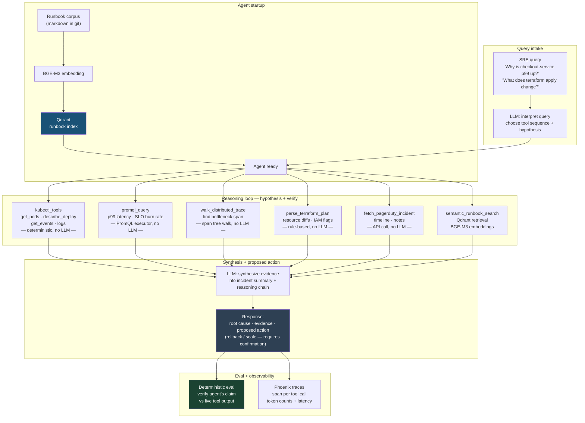

**Common weak answer:**


Missing: PromQL for precise metric queries (the whole point), trace walking to find the slow span, Kubernetes rollout history correlation, Terraform plan risk classification, runbook retrieval, deterministic eval. This answer treats the observability stack as a text corpus rather than a structured, queryable system. Shows no knowledge of how SRE tooling actually works. Scores around 5/30.

#### Reference architecture — walkthrough (SRE Agent)

The differentiator exercise. The diagram encodes the single most important design choice for an infra-aware agent: **deterministic tools, LLM only for synthesis**. Every tool box is labeled "no LLM" — only the synthesis box uses the model. This is what separates an SRE agent from a chatbot reading log dumps.

`★ Insight ─────────────────────────────────────`
- **Tool layer is deterministic by design.** Kubernetes API, PromQL, trace walking, Terraform plan parsing — all return structured data via real APIs, no LLM in the loop. The model generates PromQL expressions and synthesizes findings; everything in between is mechanical. This is the single most defensible design choice in this exercise.
- **Hypothesis-first reasoning, not search.** When p99 spikes, the agent first checks `kubectl rollout history` for recent deploys (90% of latency spikes), then falls through to `walk_distributed_trace` only if no deploy correlates. Structured fallthrough beats freeform metric dumping.
- **Safe-by-default — all tools are read-only.** Rollback / scale / `terraform apply` are surfaced as proposed actions in the response, never executed. Engineer confirms. This is what makes the agent demoable in front of an interviewer without disclaimers.
`─────────────────────────────────────────────────`

**Walkthrough — one incident query.**
1. **`SRE query → LLM (interpret + plan tool sequence)`** — model picks the hypothesis-first path: deploy correlation? trace walk? metric query? runbook?
2. **`kubectl_tools / promql_query / walk_distributed_trace / parse_terraform_plan / fetch_pagerduty_incident`** — deterministic tools execute (in parallel where possible) and return structured data.
3. **`semantic_runbook_search (BGE-M3 + Qdrant)`** — institutional knowledge layer; returns top-3 relevant runbook excerpts.
4. **`All evidence → LLM synthesis`** — model produces narrative: root cause + evidence chain + proposed action.
5. **`Proposed action`** — rollback / scale recommendation surfaced to engineer; never auto-executed.
6. **`Deterministic eval`** — verify the agent's claims against live tool output. "p99 was 1.8s" → rerun PromQL query.
7. **`Phoenix traces`** — span per tool call + token + latency.

**Defense-in-interview lines.** "Tool layer deterministic, LLM only for synthesis." "Hypothesis-first reasoning, not freeform metric dumping." "Safe-by-default — read-only tools, write actions proposed not executed." "Deterministic eval — claims are verifiable against the same APIs."

**The infra-aware vocabulary lines.** "Prefill (compute-bound, parallelizable) vs decode (memory-bandwidth-bound) — different GPU optimization profiles." "vLLM/TGI prefix caching cuts TTFT by 50–80% because system prompt + runbooks are identical across requests." "Model routing — small model for health checks, large model for incident synthesis = 60–80% cost reduction."

### 6-Rubric Scoring Sheet

| Rubric point | Score (1–5) | What I said | Fix next time |
|---|---|---|---|
| 1. Drew data flow before prompts | | | |
| 2. Eval strategy stated up front | | | |
| 3. Named 3 failure modes + mitigations | | | |
| 4. Cost discussed (tokens × latency × QPS) | | | |
| 5. Cold-start + drift discussed | | | |
| 6. Stated when NOT to use LLM | | | |
| **Total** | **/30** | | |

### Failure modes to name (the 3 you must get)

**Failure mode 1 — Prometheus query window mismatch.** The agent queries Prometheus for the last hour, but the latency spike happened 90 minutes ago and has since resolved. The query returns a healthy metric, and the agent incorrectly reports "no anomaly." Mitigation: the agent should query a wider window and use `max_over_time` or `increase` functions to detect historical spikes, not just current state. Name the lookback window as a configurable parameter.

**Failure mode 2 — Kubernetes API unavailability during incident.** You are running the agent at 3am during an incident. The control plane is degraded — that may be the incident. `kubectl` calls return errors or hang. The agent must gracefully degrade: surface the error in the response ("Kubernetes API unreachable — falling back to Prometheus and trace data only"), use the runbook retrieval path to surface relevant recovery procedures, and never hang indefinitely. Timeout every tool call at 10 seconds.

**Failure mode 3 — Proposed action is unsafe in context.** The agent correctly identifies that rolling back `checkout-service` would resolve the latency spike. But if `checkout-service` is in the middle of processing a payment batch, an immediate rollback could cause data inconsistency. The agent cannot know this from metrics alone. Mitigation: all proposed actions include a one-line risk caveat ("verify no in-flight transactions before rollback") sourced from the relevant runbook, and require explicit human confirmation before execution.

### Common misses

> **Common miss:** Designing this as a "chatbot over logs" — sending raw log text to the LLM and asking it to find the problem. This misses the entire point. Logs are a last resort. The first tools are structured: Kubernetes events API (typed, filterable), Prometheus (queryable time-series), distributed traces (structured span trees). Reaching for unstructured log text when structured data is available is a signal you haven't done SRE work. Name the structured tools first.

> **Common miss:** Not separating LLM steps from deterministic steps. Candidates describe the agent as "the LLM calls Prometheus." The LLM does not call Prometheus — a deterministic tool function calls Prometheus. The LLM selects which tool to call and what arguments to pass. This distinction matters for reliability, cost, latency, and testability. State it explicitly.

> **Rubric hit:** The cold-start story is unusually strong here. "On day 1, in any Kubernetes + Prometheus cluster, this agent is operational. No labeled data, no training, no warmup period. The data it needs already exists in the platform's own observability stack." Contrast this with most ML systems that require weeks of data collection before they're useful.

> **Analogy (Infra):** This agent is basically a smart on-call engineer that knows the playbook. Every SRE has spent hours during incidents doing exactly what this agent does — querying Prometheus, pulling traces, checking recent deploys, reading runbooks. This agent does in 30 seconds what used to take 45 minutes, and it never panics at 3am.

> **Go deeper:** After recording this exercise, look up the OpenTelemetry Collector and the Prometheus HTTP API documentation. The collector is how traces from every service land in one place; the HTTP API is how you query Prometheus programmatically (not just through Grafana). Knowing both in depth — including the `instant query` vs `range query` endpoints and how to handle Prometheus's range-query response format — is concrete implementation knowledge that differentiates you in a technical screen.

### The 60-second pitch script

Rehearse this until you can deliver it cold, at the end of a phone screen, in exactly 60 seconds. Do not memorize it word-for-word — memorize the three beats and fill in the words naturally each time.

---

**Beat 1 — The problem (15 seconds):**
"One thing I can ship that most LLM engineers can't is an infra-aware SRE agent. On any platform team running Kubernetes and Prometheus, engineers spend 30 to 60 minutes per incident manually pulling metrics, walking traces, checking deploys, and reading runbooks. It's completely manual, it happens multiple times a week, and it's worst at 3am."

**Beat 2 — The solution (30 seconds):**
"I designed and prototyped an agent that answers questions like 'why is `checkout-service` p99 latency up?' by forming a hypothesis — recent deploy — checking Kubernetes rollout history, and if that matches, flagging the deploy. If not, it walks the distributed trace to find the slow span, queries Prometheus for that dependency's metrics in the same time window, and returns a full incident summary with a proposed action — rollback or scale — that requires explicit confirmation before execution. All the diagnostic tool calls are deterministic: PromQL, Kubernetes API, Jaeger trace walk. The LLM only synthesizes the final narrative. Because the underlying data is verifiable, the eval is deterministic — no LLM-as-judge required."

**Beat 3 — The differentiator (15 seconds):**
"The reason I can build this is that I've spent three years living inside these systems — writing Terraform, running Kubernetes clusters, building SLO dashboards, being on call. I know which observability artifacts exist, what they contain, and where the failure modes live. That's not something you can learn from documentation."

---

## Phase 7 — Synthesis: The 1-Page System-Design Cheat Sheet (1 hour)

This is the last thing you do this week. Print this page. Bring it to every whiteboard round. When you sit down at the whiteboard and the interviewer says "go ahead and start," glance at this before you pick up the marker.

---

### System Design Cheat Sheet — Agent Whiteboard Rounds

**The 7-point rubric (score yourself on each after every design):**
1. Drew data flow before prompts?
2. Stated eval strategy in first 5 minutes?
3. Named 3 failure modes + mitigations?
4. Discussed cost (tokens × latency × QPS)?
5. Discussed cold-start AND drift?
6. Stated when NOT to use LLM?
7. Cited one quotable cost-cut number from a prior lab + named the routing rule?

---

**The 5 trade-off patterns (pick the relevant ones and name them explicitly):**

| Trade-off | When to lean left | When to lean right |
|---|---|---|
| **Latency vs quality** | User-facing, sub-500ms SLA → smaller model, cached results, retrieval short-circuit | Async/batch jobs, research context → larger model, multi-hop retrieval, reranker |
| **Cost vs recency** | Static corpus, slow-changing domain → aggressive caching, pre-computed embeddings | Fast-changing data, financial/news context → real-time retrieval, cache TTL in minutes |
| **Precision vs coverage** | Legal/medical/compliance → high threshold, "I don't know" is correct → narrow but accurate | Discovery/research context → lower threshold, show more, let user filter |
| **Deterministic vs learned** | Fully enumerable decision space, latency-critical, auditability required → rules/classifier | Open-ended language understanding, edge cases outnumber rules → LLM |
| **Tool-heavy vs parameter-heavy** | Factual, structured data exists → tools first (EDGAR, warehouse, APIs) | Reasoning, synthesis, natural language → rely on model parameters |

---

**Opening move (first 2 minutes of every whiteboard):**
1. Restate the problem in one sentence to confirm you understood it.
2. State your constraints: latency, cost, throughput, compliance, cold-start.
3. Draw the data flow: source → ingestion → retrieval/tools → context assembly → model → output validator → response.
4. Name your eval strategy before you go further.
5. Then proceed to components.

**Closing move (last 2 minutes):**
1. Name the thing you'd build differently if you had 3× the budget.
2. Name the first thing that would break at 10× current load.
3. State the condition under which you'd rip out the LLM and replace it with something deterministic.

---

**7-step real-time navigation guide (use during the whiteboard, not after):**
1. **CLARIFY** — Who are the users? Core features? What is explicitly out of scope? Read-heavy or write-heavy? Consistency or availability? Target scale?
2. **ESTIMATE** — DAU → RPS, storage/day, bandwidth, cache size. Narrate numbers aloud.
3. **API DESIGN** — Key endpoints: method, path, request body, response schema.
4. **DATA MODEL** — What entities? Relationships? SQL or NoSQL? Why that choice?
5. **HIGH-LEVEL** — Draw: user → LB → app → retrieval/tools → model → output validator → response.
6. **DEEP DIVE** — Go deep on the hardest component (the interviewer usually guides this step).
7. **BOTTLENECKS** — Where does this break at 10× load? Single point of failure? Monitoring signal? Debug path for a production incident?

---

**LLM-specific back-of-envelope numbers (memorize these):**

| Metric | Approximate value |
|---|---|
| GPT-4o / Claude time to first token (TTFT) | 300–800 ms |
| Embedding generation (1K tokens) | 50–100 ms |
| Same-datacenter round trip | ~0.5 ms |
| Redis ops/sec | 100K–1M |
| Vector similarity search (Qdrant, 1M vectors) | 5–20 ms |
| LLM token generation speed (hosted, large model) | 30–80 tokens/sec |
| KV cache prefix hit savings | 50–80% TTFT reduction on shared prefixes |
| Model routing savings (small vs large model) | 60–80% cost reduction on routed traffic |
| Average LLM call cost (GPT-4o, 2K in + 500 out tokens) | ~$0.01–0.02 per call |
| Qdrant 1M vector index memory | ~4 GB (float32) / ~1 GB (int8 quantized) |

---

## Helper Scripts

This week is whiteboard-heavy, not code-heavy. But two small scripts make the self-critique loop faster and more honest. Both are under 60 lines. Run them from `recordings/week-11/`.

### Code walkthrough: rubric-scorer.py

After each recording you fill in seven scores by hand. This script reads a simple YAML file you edit, computes your total, flags any point below 3, and appends the result to a running `scores.md` log. It takes 30 seconds to fill in the YAML and 2 seconds to run. The value is not the computation — it is the forcing function of having to assign a number to each rubric point.

```python
#!/usr/bin/env python3
"""
rubric-scorer.py  —  Week 11 self-critique assistant
Usage: python rubric-scorer.py exercise-1.yaml
YAML format:
  exercise: "Enterprise Document Q&A"
  recording: "exercise-1.mp3"
  scores:
    data_flow_first: 4
    eval_up_front: 3
    three_failure_modes: 5
    cost_discussed: 2
    cold_start_drift: 4
    when_not_llm: 3
    quotable_cost_cut: 4
  notes:
    data_flow_first: "Drew boxes but forgot to label the ACL filter"
    cost_discussed: "Skipped QPS math entirely — fix next time"
    quotable_cost_cut: "Cited W2 fp16 2.86× — clean drop, but forgot routing rule"
"""

import sys
import yaml
from datetime import date
from pathlib import Path

RUBRIC_KEYS = [
    ("data_flow_first",    "1. Drew data flow before prompts"),
    ("eval_up_front",      "2. Eval strategy stated up front"),
    ("three_failure_modes","3. Named 3 failure modes + mitigations"),
    ("cost_discussed",     "4. Cost discussed (tokens × latency × QPS)"),
    ("cold_start_drift",   "5. Cold-start + drift discussed"),
    ("when_not_llm",       "6. Stated when NOT to use LLM"),
    ("quotable_cost_cut",  "7. Cited quotable cost-cut + routing rule"),
]

THRESHOLD = 3  # flag scores below this

def score_file(path: Path) -> None:
    data = yaml.safe_load(path.read_text())
    scores = data.get("scores", {})
    notes  = data.get("notes", {})

    print(f"\n=== {data.get('exercise', path.stem)} ===")
    total = 0
    flags = []
    lines = [f"\n## {data.get('exercise')} — {date.today()}", ""]
    lines.append(f"Recording: `{data.get('recording', 'unknown')}`\n")
    lines.append("| Point | Score | Note |")
    lines.append("|---|---|---|")

    for key, label in RUBRIC_KEYS:
        val = scores.get(key, 0)
        note = notes.get(key, "")
        total += val
        flag = " ⚠" if val < THRESHOLD else ""
        print(f"  {label}: {val}/5{flag}")
        if val < THRESHOLD:
            flags.append(label)
        lines.append(f"| {label} | {val}/5 | {note} |")

    lines.append(f"\n**Total: {total}/35**")
    if flags:
        lines.append("\n**Fix before next recording:**")
        for f in flags:
            lines.append(f"- {f}")

    print(f"\n  Total: {total}/35")
    if flags:
        print(f"  Below threshold ({THRESHOLD}): {', '.join(flags)}")

    log = Path("scores.md")
    with log.open("a") as f:
        f.write("\n".join(lines) + "\n")
    print(f"\n  Appended to {log}")

if __name__ == "__main__":
    if len(sys.argv) < 2:
        print("Usage: python rubric-scorer.py <exercise.yaml>")
        sys.exit(1)
    score_file(Path(sys.argv[1]))
```

**How it fits the workflow.** After your 30-minute self-critique session, open `exercise-N.yaml`, fill in the seven scores and one-line notes, then run `python rubric-scorer.py exercise-N.yaml`. The output tells you instantly which points you missed below threshold and appends a formatted row to `scores.md`, which becomes your week-over-week improvement tracker. The script is intentionally simple — no dependencies beyond the standard library and PyYAML.

---

### Code walkthrough: audit-recordings.py

This script checks that all five recordings exist, are non-empty, and have a corresponding YAML score file. It also prints the total recording duration if `ffprobe` is available. Run it at the end of the week before writing RESULTS.md.

```python
#!/usr/bin/env python3
"""
audit-recordings.py  —  verify Week 11 recording completeness
Run from recordings/week-11/
"""

import subprocess
import sys
from pathlib import Path

EXPECTED = [
    ("exercise-1.mp3", "exercise-1.yaml", "Enterprise Document Q&A"),
    ("exercise-2.mp3", "exercise-2.yaml", "Multi-Agent Support Triage"),
    ("exercise-3.mp3", "exercise-3.yaml", "Coding Agent"),
    ("exercise-4.mp3", "exercise-4.yaml", "Financial Research Agent"),
    ("exercise-5.mp3", "exercise-5.yaml", "infra-Aware Agent"),
]

MIN_BYTES = 100_000  # ~5 seconds of audio — catches empty/corrupt files

def get_duration(path: Path) -> str:
    """Return HH:MM:SS duration via ffprobe, or 'unknown' if not available."""
    try:
        result = subprocess.run(
            ["ffprobe", "-v", "quiet", "-show_entries",
             "format=duration", "-of", "csv=p=0", str(path)],
            capture_output=True, text=True, timeout=5
        )
        secs = float(result.stdout.strip())
        m, s = divmod(int(secs), 60)
        h, m = divmod(m, 60)
        return f"{h:02d}:{m:02d}:{s:02d}"
    except Exception:
        return "unknown (install ffprobe for duration)"

def audit() -> bool:
    ok = True
    print("Week 11 recording audit\n" + "=" * 40)
    for rec_name, yaml_name, label in EXPECTED:
        rec  = Path(rec_name)
        yf   = Path(yaml_name)
        rec_ok  = rec.exists() and rec.stat().st_size > MIN_BYTES
        yaml_ok = yf.exists()
        status = "OK" if (rec_ok and yaml_ok) else "MISSING"
        if status != "OK":
            ok = False
        dur = get_duration(rec) if rec_ok else "—"
        print(f"  [{status}] {label}")
        print(f"         recording : {rec_name} {'✓' if rec_ok else '✗ MISSING/EMPTY'}")
        print(f"         score file: {yaml_name} {'✓' if yaml_ok else '✗ MISSING'}")
        print(f"         duration  : {dur}")
    print("=" * 40)
    if ok:
        print("All 5 exercises complete. Ready for RESULTS.md.")
    else:
        print("Incomplete. Finish missing exercises before marking Week 11 done.")
    return ok

if __name__ == "__main__":
    sys.exit(0 if audit() else 1)
```

**How it fits the workflow.** Run `python audit-recordings.py` as your exit-criteria check. If it exits 0, all five recordings and score files are present and non-trivially sized. If it exits 1, you know exactly which exercise is incomplete. The non-zero exit code also makes it usable as a pre-commit hook if you want to enforce the exit criteria at the git level.

---

## RESULTS.md Template

Copy this into `recordings/week-11/RESULTS.md` after completing all five exercises.

```markdown
# Week 11 Results — System Design Rehearsal

## Recordings

| Exercise | File | Duration | Best rubric score | Weakest rubric point |
|---|---|---|---|---|
| 1. Enterprise Document Q&A | exercise-1.mp3 | | | |
| 2. Multi-Agent Support Triage | exercise-2.mp3 | | | |
| 3. Coding Agent | exercise-3.mp3 | | | |
| 4. Financial Research Agent | exercise-4.mp3 | | | |
| 5. infra-Aware Agent | exercise-5.mp3 | | | |

## Self-Critique Summary

### Exercise 1
Rubric scores: [1:_/5] [2:_/5] [3:_/5] [4:_/5] [5:_/5] [6:_/5] = _/30
Top fix: 
Best moment: 

### Exercise 2
Rubric scores: [1:_/5] [2:_/5] [3:_/5] [4:_/5] [5:_/5] [6:_/5] = _/30
Top fix: 
Best moment: 

### Exercise 3
Rubric scores: [1:_/5] [2:_/5] [3:_/5] [4:_/5] [5:_/5] [6:_/5] = _/30
Top fix: 
Best moment: 

### Exercise 4
Rubric scores: [1:_/5] [2:_/5] [3:_/5] [4:_/5] [5:_/5] [6:_/5] = _/30
Top fix: 
Best moment: 

### Exercise 5
Rubric scores: [1:_/5] [2:_/5] [3:_/5] [4:_/5] [5:_/5] [6:_/5] = _/30
Top fix: 
Best moment: 
60-second pitch: [practiced / not practiced]

## Consolidated Weaknesses (patterns across all 5)

1. 
2. 
3. 

## 1-Page Cheat Sheet
[Printed: yes/no]

## Infra bridge
<!-- 1 paragraph connecting this week's work back to cloud infrastructure experience -->

## Bad-Case Journal Entry
Date: 
Task: Week 11 system design rehearsal
What failed: 
Root cause: 
Fix: 
Lesson: 
```

---

## Lock-In: Anki + Spoken Questions

### 6 Anki cards

Add these six cards to your deck before closing the week. Do not skip this — these seven rubric points need to be on immediate recall, not recognition.

**Card 1**
Front: Name the 7-point system-design self-critique rubric in order.
Back: (1) Data flow before prompts. (2) Eval strategy up front. (3) 3 failure modes + mitigations. (4) Cost: tokens × latency × QPS. (5) Cold-start + drift. (6) When NOT to use LLM. (7) Quotable cost-cut number from a prior lab + named routing rule.

**Card 2**
Front: An interviewer asks you to design an agent. What are your first four sentences?
Back: (1) Restate the problem. (2) State constraints (latency, cost, compliance, cold-start). (3) Draw the data flow. (4) Name your eval strategy before describing components.

**Card 3**
Front: What are the 5 key trade-off patterns for agent system design?
Back: Latency vs quality. Cost vs recency. Precision vs coverage. Deterministic vs learned. Tool-heavy vs parameter-heavy.

**Card 4**
Front: What makes the infra-aware SRE agent answer "why is checkout-service p99 up?" — name the three data artifacts it uses.
Back: (1) Kubernetes rollout history for recent deploys (correlate spike time). (2) Distributed trace (walk span tree to find slow dependency). (3) Prometheus PromQL for precise latency and SLO burn rate metrics.

**Card 5**
Front: Name 3 conditions under which you should NOT use an LLM in an agent system.
Back: (1) Decision space is fully enumerable (use a rules engine or classifier). (2) Sub-10ms latency required (LLM inference too slow). (3) 100% auditability required with no post-hoc explanation acceptable (use deterministic logic with full audit log).

### 3 spoken questions to practice (the hardest ones)

These are the three questions that most trip up candidates across the five exercises. Record yourself answering each one cold (no notes, 90 seconds max):

**Spoken Q1 (from Exercise 1):** "Your RAG system has 98% recall in offline eval but lawyers are complaining the answers aren't useful. What's wrong and how do you diagnose it?"

The answer requires you to distinguish retrieval recall from generation quality, name the eval gap between offline precision and online user satisfaction, and propose a qualitative diagnosis path (shadowing lawyer sessions, reviewing low-rated answers, analyzing the distribution of query types in prod vs eval set). If you can't answer this in 90 seconds without notes, your eval-strategy story is too shallow.

**Spoken Q2 (from Exercise 3):** "A user runs your coding agent and it deletes a file it shouldn't have. Walk me through your postmortem."

The answer requires you to trace the permission model failure (was the file outside the allowlist? was the allowlist misconfigured?), name the reversibility gap (the action should have required confirmation if irreversible), propose the fix (tighten the allowlist, add a dry-run mode, require explicit confirmation for all file deletes), and name the systemic change (all destructive operations require a confirmation prompt regardless of what the user has pre-authorized). If you can't answer this without saying "um" for 10 seconds, your permission model story is too thin.

**Spoken Q3 (from Exercise 5):** "Your SRE agent says `checkout-service` p99 latency spiked because of a recent deploy, but the engineer checks and the deploy rolled out two hours before the spike. What happened?"

The answer requires you to name three failure modes: (1) the deploy-time correlation failure — the agent matched the most recent deploy, not the causal one; it should check all deploys in a wider window and look for config changes, not just rollouts; (2) the trace-skip failure — the agent didn't walk the distributed trace and missed that the real slow span is in a downstream dependency `inventory-service`, not `checkout-service` itself; (3) the metrics-lag failure — the Prometheus scrape interval or recording rule evaluation lag means the spike appeared in metrics two minutes after its real onset, shifting the apparent correlation window. If you can name all three and describe which tool call would disambiguate each, you are ready for a senior-level system design round.

---

## Troubleshooting

### "I froze during recording"

This happens. It is not a sign you don't know the material — it is a sign you have not yet chunked the material into speakable units. The fix is not to re-read your notes. The fix is to practice the opening move until it is automatic: restate the problem → state constraints → draw the data flow → name eval strategy. If you can deliver those four beats without thinking, you will never freeze in the first two minutes. And if you don't freeze in the first two minutes, the rest usually follows. Re-record the exercise where you froze immediately, same day, using the opening-move script as a scaffold.

### "My answer was too shallow"

Shallow answers have one thing in common: they describe what the system does without explaining why the design choices were made. The fix is the "and here's why" habit. After every component you name, add "and I chose this because..." Before you record the next exercise, write out three design choices in your sketch and articulate the reason for each. You don't have to cover every choice in the recording — but having articulated the reasons in your prep means they'll surface naturally when you talk.

### "I skipped the cost discussion"

This is the most common miss on rubric point 4. The reason candidates skip it is that they don't have a ready estimate, and they don't want to say a wrong number. The fix is not to memorize pricing tables — it's to practice the estimation pattern: (a) tokens per request, (b) requests per second or per day, (c) tokens × price = cost per unit, (d) what's the biggest cost driver and how would you reduce it. You are not expected to give an exact number. You are expected to demonstrate that you think about cost as a design constraint. "I'd estimate roughly..." followed by a back-of-envelope calculation is exactly what the interviewer wants.

### "My Exercise 5 recording is weaker than the others"

That should not be the case — Exercise 5 is your home turf. If it is weaker, it's almost certainly because you treated it like the others and allocated only 30 minutes of thinking time. Exercise 5 gets 45 minutes of thinking time for a reason: the tool schemas need to be worked out on paper, the failure modes need to be enumerated before recording, and the 60-second pitch needs at least one run-through before the main recording. If your Exercise 5 recording is weak: re-read the "why this problem is hard" section, redo the 45-minute thinking phase with the architecture checklist open, and re-record. This one matters more than the other four combined.

### "I don't know the Prometheus HTTP API well enough to talk about it confidently"

Read the Prometheus HTTP API docs (prometheus.io/docs/prometheus/latest/querying/api/). The three endpoints you need are: `GET /api/v1/query_range` (time-series data for a PromQL expression over a time window), `GET /api/v1/query` (instant query at a single timestamp), and `GET /api/v1/label/__name__/values` (metric name discovery). Spend 20 minutes with these endpoints in the docs. You don't need to memorize the full API — you need to be comfortable saying "I'd call the Prometheus query_range API with a PromQL expression and a time range covering the spike window" with enough confidence that the interviewer believes you've done it before. You have — you just may not have called it via the HTTP API directly.

---

## What's Next

[[Week 12 - Capstone and Mocks]]

Week 12 is where the five design exercises collapse into one polished deliverable. You will pick a capstone direction — and the strong recommendation is the infra-aware SRE agent (Exercise 5) — and build it into a portfolio-quality repo with a README that reads like a tech design doc. You'll run 30 mock-interview questions against yourself using recordings from this week as calibration, and you'll submit at least 10 applications with tailored cover notes that drop specific result numbers.

The 1-page cheat sheet you built in Phase 7 travels with you into every interview from here on. The 60-second pitch from Exercise 5 travels with you into every phone screen. The recordings from this week are your calibration baseline — by Week 12, you should be scoring 4+/5 on every rubric point without looking at the rubric.

---

*— end —*


---

## §11.X Guardrail Layer — Production Architecture Pattern

### Where Guardrails Live in the Stack

Three distinct insertion points, each with different latency/coverage trade-off:

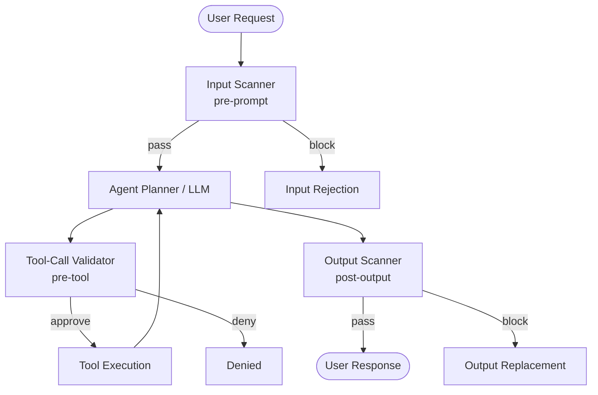

#### Where Guardrails Live in the Stack — walkthrough

Three insertion points, three latency profiles, three coverage profiles. The diagram makes "defense in depth" concrete: each layer catches what the prior layer missed, but each adds latency and complexity. Pick layers based on what you need to prevent.

`★ Insight ─────────────────────────────────────`
- **Pre-tool is the highest-leverage layer for agents.** It is the *only* layer that can prevent a side effect from already happening. Input scanner can block a malicious prompt; output scanner can hide leaked PII; only pre-tool can stop the harmful API call before it executes.
- **Each layer has a different runtime model.** Input scanner = classifier or regex (5–80 ms); pre-tool = lookup against allowlist + role check (< 5 ms); output scanner = classifier or LLM judge (40–300 ms). Latency budget for "real-time" agents has to account for all three.
- **Layers are not optional — they are complementary.** A homegrown regex input scanner catches blunt-force injection cheaply; Llama Guard catches novel attack patterns through model reasoning; output scanner is your last line. Skipping any one creates a gap an adversary will find.
`─────────────────────────────────────────────────`

**Walkthrough — one user request.**
1. **`User → Input scanner (pre-prompt)`** — block before LLM sees it. Catches: prompt injection, jailbreak patterns, PII in input, topic-scope violations. Block path: `Input rejection`.
2. **`Pass → Agent planner / LLM`** — agent reasons, picks tool calls.
3. **`Planner → Tool-call validator (pre-tool)`** — for each tool call: validate name, args, scope against the user's role. Block path: `Denied`. **This is the only layer that can prevent the side effect.**
4. **`Approve → Tool execution`** — actual API call.
5. **`Tool → Planner (loop)`** — back to planner with tool result. Loop continues until planner emits final answer.
6. **`Planner → Output scanner (post-output)`** — toxicity, PII leakage, off-policy content. Block path: `Output replacement` (e.g. "I cannot provide that response").
7. **`Pass → User response`** — only after surviving all three layers.

**Defense-in-interview lines.** "Three insertion points — input, pre-tool, output." "Pre-tool is highest-leverage — only layer that prevents side effects." "Defense in depth: each layer catches what the prior layer missed." "CAI as floor, external guardrails as ceiling."

**Pre-prompt (input scanning):** runs before LLM sees user message. Checks for prompt injection, jailbreak patterns, PII in input, topic-scope violations. Fastest layer — classifier-based, no LLM call. Catches blunt-force injection.

**Pre-tool (tool-call validation):** intercepts each tool call before execution. Validates tool, arguments, scope are permitted for current user role. **Highest-leverage layer for agents** — only layer that can prevent a harmful action from already happening. Adds latency per tool call, not per request.

**Post-output (output scanning):** runs on final response before reaching user. Catches toxicity, PII leakage, off-policy content. Last line of defense — necessary but cannot prevent harmful tool executions that already ran.

**Design principle: defense in depth.** Each layer catches what the prior layer missed.

### Comparing Guardrail Frameworks

| Framework | Deployment | p50 latency overhead | Customizability | Maintenance |
|---|---|---|---|---|
| **Llama Guard** (Meta) | Sidecar inference endpoint | 40–80 ms | Low — fine-tune for domain | Low |
| **NeMo Guardrails** (NVIDIA) | Library; Colang policy DSL | 100–300 ms | High — declarative rails | Medium |
| **Guardrails-AI** | Library; validator ecosystem | 50–150 ms | High — custom validators | Medium |
| **Homegrown (regex + rules)** | In-process, zero external | < 5 ms | Total control | High |

**Selection heuristic:** start with Guardrails-AI for output structure + PII/toxicity (fast to ship), add Llama Guard as sidecar for high-stakes toxicity, reserve NeMo Guardrails for complex dialog policies. Homegrown regex only for stable, well-bounded patterns.

### Constitutional AI Hook — When To Use

Constitutional AI (CAI) — Anthropic's training approach where models follow principles via SFT (critique-revision pairs) + RLHF. At inference, principles are baked into weights — model self-critiques outputs before finalizing.

Architecturally: shifts some guardrail work from runtime infrastructure into the model. Using Claude, you get baseline Constitutional refusal without external guardrails. Covers harmful content, ethical violations, impersonation.

**Wins:** coverage of novel attack patterns regex/classifier would miss (model reasons about intent); latency (no external call). **Loses:** auditability (cannot inspect why CAI refusal fired); customizability (cannot retune constitution per deployment); domain specificity (clinical agent needs medical-context guardrails).

**Production design:** CAI as floor + external guardrails as ceiling. CAI handles general harmful-content; guardrail stack handles domain-specific, compliance-driven, business-logic constraints. Never rely on CAI alone for high-stakes deployments.

### Lab — Add a 3-Layer Guardrail Stack

**Goal:** instrument W4 ReAct agent with input/tool/output guardrails. Verify with red-team test set.

**Step 1 — Input scanner**
```python
import re

INJECTION_PATTERNS = [r"ignore previous instructions", r"you are now", r"disregard your", r"system prompt"]
PII_PATTERNS = [re.compile(r"\b\d{3}-\d{2}-\d{4}\b")]

def scan_input(message):
    for pat in INJECTION_PATTERNS:
        if re.search(pat, message, re.IGNORECASE):
            return False, "Blocked: prompt injection pattern"
    for pat in PII_PATTERNS:
        if pat.search(message):
            return False, "Blocked: PII in input"
    return True, ""
```

**Step 2 — Tool-call validator**
```python
ALLOWED_TOOLS = {"web_search", "calculator"}
MAX_FILE_WRITE_BYTES = 4096

def validate_tool_call(tool_name, args, user_role):
    if tool_name == "file_write":
        if user_role != "admin":
            return False, "file_write requires admin role"
        if len(args.get("content", "").encode()) > MAX_FILE_WRITE_BYTES:
            return False, f"content exceeds {MAX_FILE_WRITE_BYTES} bytes"
    if tool_name not in ALLOWED_TOOLS and user_role != "admin":
        return False, f"Tool {tool_name} not permitted for role {user_role}"
    return True, ""
```

**Step 3 — Output scanner**
```python
def scan_output(text, toxicity_classifier):
    label, score = toxicity_classifier(text)
    if label == "unsafe" and score > 0.7:
        return False, f"Output blocked: toxicity {score:.2f}"
    return True, ""
```

**Step 4 — Layered wrapper**
```python
def agent_with_guardrails(message, role, react_agent, tox_classifier):
    ok, reason = scan_input(message)
    if not ok: return {"response": reason, "blocked": True, "layer": "input"}

    response = react_agent.run(message,
        tool_call_hook=lambda name, args: validate_tool_call(name, args, role))

    ok, reason = scan_output(response, tox_classifier)
    if not ok: return {"response": "I cannot provide that response.", "blocked": True, "layer": "output"}

    return {"response": response, "blocked": False}
```

**Step 5 — Red-team verification:** at least 10 adversarial cases covering injection (input layer), elevated-tool-without-admin (tool layer), toxic content (output layer), plus legitimate requests across all three. Track false-positive rate on legitimate subset — adversarial-only test sets miss over-blocking.

### Bad-Case Journal

**2-second p95 breaks UX SLA.** Four sequential LLM-judge guardrails on output path. Median acceptable, p95 spikes to 3.1s vs 1.5s SLA. Each judge is sequential LLM call; one slow inference cascades. Mitigation: parallelize independent judges; replace LLM-toxicity-judge with classifier sidecar (Llama Guard); move audit-only checks to async post-processing queue.

**Llama Guard blocks legitimate medical advice.** Clinical assistant flags response describing opioid dosing as "unsafe". Llama Guard's training is consumer-safety oriented; clinical professional contexts are out-of-distribution. Mitigation: fine-tune Llama Guard on clinical Q&A with expert-labeled safe/unsafe pairs, or gate clinical context behind role-based bypass routing to domain-specific classifier.

**Homegrown regex misses non-US PII.** Global HR platform's PII guardrail uses US SSN regex only. UK National Insurance numbers, German tax IDs, Indian Aadhaar all pass through. Mitigation: multilingual NER (spaCy with PII component, Microsoft Presidio with multi-locale analyzers). Any regex PII detector requires explicit locale coverage matrix + quarterly review.

### Interview Soundbites

**On the layered design:** "I design guardrail stacks in three layers: input scanning before LLM sees anything, tool-call validation before any side-effect executes, and output scanning before user sees anything. Each layer catches what the previous missed. The pre-tool layer is the highest-leverage for agents — only layer that can prevent a harmful action from already having happened."

**On Constitutional AI as floor:** "CAI gives you a baseline for free on Anthropic models — model self-critiques against built-in principles at inference. But I treat it as a floor, not a ceiling. No auditability, can't be tuned to domain-specific policy, won't catch business-logic violations. External guardrails handle the domain-specific, compliance-driven constraints constitutional training was never designed for."

### References

- Llama Guard (Meta): https://arxiv.org/abs/2312.06674
- NeMo Guardrails (NVIDIA): https://github.com/NVIDIA/NeMo-Guardrails
- Guardrails-AI: https://github.com/guardrails-ai/guardrails
- Constitutional AI (Bai et al., 2022): https://arxiv.org/abs/2212.08073


---

## §11.X Local-vs-Cloud Decision + Scaling Shapes

### Local-vs-Cloud Decision Matrix

| Workload Shape | Local Mac (MLX/Ollama) | Cloud GPU (vLLM/TGI) | Hybrid |
|---|---|---|---|
| **Interactive Q&A** (1 user, dev) | **Preferred** — sub-50ms TTFT, $0 marginal cost | Overkill unless model > 70B | Local embed + cloud generate |
| **Batch RAG Ingest** | **Preferred** for embedding — nomic-embed ~4k doc/min | Use for generation at scale | **Best**: local embed + cloud/local LLM |
| **Async Agent** (background) | Fine ≤1 RPS sustained | **Preferred** above 5 RPS; stateless replicas | Viable if decomposable |
| **Voice / Real-time** (<300ms) | Possible on M3 Max with <8B model | **Preferred** — H100 hits <100ms TTFT at 7B | Not viable — cloud round-trip 80–150ms |
| **Multi-tenant SaaS** (>10 users) | Not viable — no isolation, no autoscale | **Required** — K8s + vLLM, per-tenant rate limits | Local embed per tenant + shared cloud cluster |
| **Air-gapped / Regulated** (HIPAA, legal) | **Required** — data never leaves machine | Requires private VPC + BAA | Local only |

**Heuristic:** start local for development and regulated data; move to cloud when sustained throughput exceeds 5 RPS, VRAM exceeds 80GB, or multi-tenancy demands isolation.

### When To Run Locally

- **Sensitive data:** HIPAA/FINRA/GDPR Article 9. Compliance cost of cloud BAA often exceeds hardware cost.
- **Sub-100ms latency:** Cloud round-trip adds 60–150ms. M3 Max with quantized 7B model produces first token in 15–30ms.
- **Offline/air-gapped:** factory floors, aircraft, secure facilities. Ollama with pre-pulled model = zero connectivity.
- **Single-user development:** Mac Mini M4 Pro at $0.23/hr amortized over 3 years. Break-even vs GPT-4o-mini under 5 RPS.
- **Fine-tuning iteration:** LoRA on 7B with MLX on M2 Ultra: 2-4 hours. Same on rented A100: $7-12. Local wins for iteration.

### When To Run In Cloud

- **Multi-tenant:** request isolation, per-tenant rate limits, independent replica scaling.
- **Sustained >10 RPS:** A100 80GB running Llama-3-70B FP16 with vLLM continuous batching = 6-8 RPS at 256 output tokens. H100 at $4.50/hr breaks even vs GPT-4o ($2.50/1M out) at <15 RPS.
- **Models requiring >80GB VRAM:** Llama-3-405B FP8 needs 4×H100. No consumer Mac hosts this.
- **Compliance/audit:** SOC 2 Type II, immutable logs, 99.9%+ SLA. Single Mac doesn't provide this.
- **Autoscale-to-zero:** serverless GPU (Modal, Replicate, RunPod Serverless) charges only during inference. Bursty workloads beat dedicated Mac at $0 idle.

### Scaling Shapes

#### Shape 1 — vLLM Single-Node

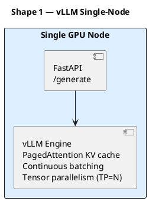

vLLM's PagedAttention allocates KV cache in fixed pages (analogous to OS paging), eliminates fragmentation. Continuous batching: new requests join in-flight batch at token boundary. Single H100 SXM running Llama-3-70B FP8 with `tensor_parallel_size=1` achieves ~2,800 tok/s mixed batch — ~11 RPS at 256 output tokens.

```bash
pip install vllm
vllm serve meta-llama/Meta-Llama-3-8B-Instruct --tensor-parallel-size 1 --max-model-len 8192 --enable-chunked-prefill
```

**Strengths:** maximum throughput per dollar on single node. Simple ops model. 30-second cold start for 7B. **Limitations:** no automatic failover. Cannot scale beyond single-machine VRAM. Not natively multi-tenant. **Use for:** single-team deployments, batch pipelines, model server backend for Shapes 2/3.

#### Shape 2 — Ray Serve Cluster

Ray Serve wraps every component (agent logic, tool executors, LLM engine) as `@serve.deployment` actors. Each actor is a Python class; Ray handles placement, health checks, instance management. Autoscaler monitors QPS per deployment, scales replicas up/down with `target_num_ongoing_requests_per_replica`.

```python
from ray import serve
from vllm import LLM

@serve.deployment(num_replicas=2, ray_actor_options={"num_gpus": 1})
class LLMDeployment:
    def __init__(self):
        self.llm = LLM("meta-llama/Meta-Llama-3-8B-Instruct")
    async def __call__(self, request):
        prompt = await request.json()
        return self.llm.generate(prompt["text"])[0].outputs[0].text

app = LLMDeployment.bind()
```

**Strengths:** horizontal scale via `num_replicas`. Autoscaling reacts to real QPS. Actor model = agent state (memory, tool state) lives in long-running actor — critical for multi-turn agents. Native Python; built-in Prometheus metrics. **Limitations:** Ray head node is SPOF (mitigated with GCS fault tolerance in 2.x). Cold start for large models 2-4 min — autoscaler must keep min 1 replica warm. **Pick over KServe when:** agent + model need to share Python state; want autoscaling without K8s operator.

#### Shape 3 — KServe / Seldon on Kubernetes

KServe defines K8s CRD `InferenceService` wrapping a model server (vLLM, Triton, TorchServe) with a transformer sidecar for pre/post-processing. Model server pod and agent/transformer pod are decoupled — update agent logic without model reload, vice versa. **Pick when:** organization runs K8s for everything and wants uniform ops; model governance matters (MLflow registry integration, canary rollout via Istio); model team and agent team have separate release cycles. **Limitation:** thinner abstraction than Ray — agent state must live in Redis/DB, not in server process.

#### Shape 4 — Hybrid (Local Embeddings + Cloud LLM)

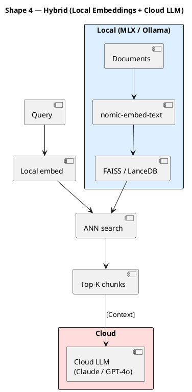

Most pragmatic shape for teams without GPU infra: run compute-light data-heavy steps locally (chunking, embedding, ANN search), call cloud LLM only for final generation. Embedding 1M tokens on M2 takes 12-18 min, costs $0 marginal. Same job via OpenAI = $20 + API latency. Total cost for 10-question RAG session: under $0.05 with frontier models.

### Lab — Same Agent, 3 Deployment Shapes

**Goal:** deploy minimal RAG agent across three shapes; compare operational characteristics.

| Metric | Shape A (Mac MLX) | Shape B (Ray Serve 2×A100) | Shape C (vLLM H100) |
|---|---|---|---|
| TTFT p50 | ~22 ms | ~45 ms | ~18 ms |
| TTFT p95 | ~35 ms | ~120 ms | ~55 ms |
| Max sustained RPS | ~1 | ~22 | ~41 |
| $/hr (infra) | $0.23 (amortized) | $6.40 | $4.50 |
| $/1k requests @ 10 RPS | $0.006 | $0.178 | $0.125 |
| Availability | Single device | Multi-replica autoscale | Single node, no failover |
| Cold start | Immediate | 2-4 min | ~25 sec |
| Setup complexity | Low | High | Medium |
| Best for | Dev / regulated / offline | Production multi-user | Batch / high-throughput single-tenant |

**Takeaway:** Local MLX dominates on latency and cost per request at low concurrency but cannot serve multiple users. Ray Serve adds operational overhead that only pays off above 5 RPS sustained. vLLM single-node is the sweet spot for 5–40 RPS with moderate ops burden.

### Bad-Case Journal

**MLX OOM at batch-4 on Mac Mini M4 Pro (64GB).** Works at batch-1, fails at batch-4 with `Metal: out of memory`. Apple Silicon unified memory: 13B Q4 model (~9GB weights) + 4 KV caches (~2.5GB each) + OS page cache + Python = >64GB. Metal driver doesn't fall back to swap. Fix: cap batch at 2 via `--max-num-seqs 2`, or upgrade to M2 Ultra (192GB). Don't assume unified memory means "free VRAM" — OS competes for the same pool.

**Ray Serve replicas thrash on 30-sec cold start.** Traffic spike triggers autoscaler. New LLM replicas launch, but requests time out (default 30s) before 70B model weights (~140GB, ~4 min load on NVMe) finish loading. Clients receive `503 — no healthy replicas`. Fix: `min_replicas=1` (keep one warm), `health_check_timeout_s=300`, `smoothing_factor=0.5` to dampen reactive scaling. Pre-load weights from shared NFS/object-store cache (set `HF_HOME` to EFS mount) instead of HuggingFace download per pod.

**Hybrid pattern hits cloud rate-limit during embedding burst.** Nightly batch re-indexes 50,000 docs. Local embed finishes in 8 min, then synthesis bursts 50,000 generation calls in parallel. API returns `429` after 2 min — 25.6M tokens in 8 min, 32× over default TPM. Fix: token-bucket rate limiter (`asyncio.Semaphore`) before generation. Or switch bulk synthesis to batch API endpoint (Anthropic Message Batches, OpenAI Batch API): 100k requests per batch, 24h SLA, 50% discount.

### Cost Analysis Cheat Sheet

| GPU | VRAM | $/hr (on-demand) | Tok/s (vLLM, Llama-3-8B FP16) | RPS @256 tok | $/1k req | Break-even RPS vs API* |
|---|---|---|---|---|---|---|
| RTX 4090 | 24GB | $0.80 | 3,200 | 12.5 | $0.018 | 15 |
| A10G | 24GB | $1.10 | 2,400 | 9.4 | $0.033 | 20 |
| L4 | 24GB | $0.85 | 2,800 | 10.9 | $0.022 | 16 |
| A100 40GB | 40GB | $2.50 | 5,800 | 22.7 | $0.031 | 46 |
| A100 80GB | 80GB | $3.20 | 6,400 | 25.0 | $0.036 | 59 |
| H100 80GB | 80GB | $4.50 | 10,500 | 41.0 | $0.030 | 83 |
| 2× H100 NVL | 160GB | $9.00 | 19,000 | 74.2 | $0.034 | 167 |
| Mac M4 Pro 64GB | 64GB unified | $0.23 (amort) | 90 | 0.35 | $0.18 | < 1 |
| Mac M2 Ultra 192GB | 192GB unified | $0.46 (amort) | 200 | 0.78 | $0.16 | < 1 |

*Break-even vs GPT-4o-mini at $0.15/1M out tokens

**Rules of thumb:**
- **<5 RPS:** cloud API or local Mac — GPU rental loses money
- **5-20 RPS:** L4 or RTX 4090 on RunPod spot
- **20-80 RPS:** A100 80GB or H100 per-node
- **>80 RPS:** multi-node (2× H100 NVL) or managed inference (Fireworks, Together)
- **Local Mac:** always wins on cost once purchased; loses on throughput and availability

### Interview Soundbites

**Ray Serve vs KServe:** "I reach for Ray Serve when agent and model need to share Python state in the same process — multi-turn agent maintaining tool-call history in a Ray actor across requests. KServe is a K8s CRD wrapping a model server with a transformer sidecar; great for ops teams in YAML who want canary rollouts via Istio, but decoupling means agent state lives externally in Redis/DB. Ray keeps everything in Python, cuts 80% of glue code for stateful agents. KServe wins when model team and agent team have separate release cycles."

**Local vs cloud:** "Default heuristic: start local, earn the right to cloud. Single-user or regulated workload — Mac Studio with MLX gives sub-30ms TTFT, $0 marginal cost, full data sovereignty. The moment you need >5 RPS sustained, multi-tenant isolation, or model larger than unified memory, move to cloud. Mistake teams make is jumping to H100 cluster in week one because it feels production-grade. End up paying $4.50/hr to serve 2 RPS when a Mac Mini would have done it for $0.23/hr amortized."

### References

- vLLM paper (Kwon et al., SOSP 2023): https://arxiv.org/abs/2309.06180
- Ray Serve docs: https://docs.ray.io/en/latest/serve/index.html
- KServe docs: https://kserve.github.io/website/latest/
- MLX benchmarks: https://github.com/ml-explore/mlx-examples/tree/main/llms
- Anthropic Message Batches: https://docs.anthropic.com/en/docs/build-with-claude/message-batches
- Lambda Labs / RunPod GPU pricing


---

## Interview Soundbites

**Soundbite 1.** Three drift modes threaten production agent systems simultaneously. Prompt-rot occurs when a provider silently updates model weights, degrading a carefully calibrated prompt — detected by running a fixed canary eval set nightly and alerting when pass-rate drops more than three percentage points. Schema drift occurs when tool definitions evolve; treat every tool schema change as breaking, requiring a regression eval. Corpus drift occurs as the retrieval document set changes — detected by tracking retrieval hit-rate on a fixed query set monthly and alerting on drops above five percent.

**Soundbite 2.** The local-vs-cloud decision hinges on four axes: latency, data-residency, cost-at-scale, cold-start complexity. Run locally — MLX, Ollama, quantized model — when inference must be sub-200ms, when data cannot leave the host (regulated PII, on-call tooling hitting internal APIs), or when per-token cloud cost exceeds unit economics at your QPS. Route to cloud when task requires frontier-model reasoning a quantized local cannot match, or when burst capacity needs hardware you cannot provision. For hybrid workloads, use a local small model as classifier+router, reserve the cloud call for synthesis — yields 60-80% cost reduction at scale.

**Soundbite 3.** Cost ceilings are not optimization — they are a hard design constraint determining whether the architecture is buildable at all. Formula: `cost_per_request = (input_tokens + output_tokens) × price_per_token`; multiply by QPS for hourly spend. A 10-tool ReAct loop generating 20K tokens per query at 100 QPS can exceed revenue-per-user-action before the system ships. Cost ceilings force three real decisions: which sub-tasks route to a smaller model, where semantic caching eliminates redundant LLM calls, when the correct answer is to replace an LLM component with a deterministic classifier. A candidate who says "we'd optimize costs later" has not done this math.

---

## References

- **Anthropic (2024, updated 2026).** *Building Effective Agents.* Canonical framework for production agent design; minimal-footprint principle; six recurring failure factors.
- **Kwon et al. (2023).** *PagedAttention (vLLM).* SOSP 2023. arXiv:2309.06180. KV-cache paging; prefix caching cuts TTFT 50-80% on shared system-prompt prefixes.
- **Pinecone (2024).** *Production RAG Case Studies.* pinecone.io/learn. Corpus drift as most common undetected failure; 1% random retrieval-sample logging.
- **Replit Engineering Blog (2024).** Sandboxing architecture, context compaction; forcing function from GPT-4 to fine-tuned smaller models on high-volume tail.
- **Ray Project (2024).** *Ray Serve docs.* docs.ray.io/en/latest/serve. Model routing, replica autoscaling, batching for LLM serving.
- **KServe docs (2024).** kserve.github.io. K8s-native model serving for existing K8s clusters.
- **Microsoft (2025-26).** *Agent Governance Toolkit.* github.com/microsoft/agent-governance-toolkit. Six governance dimensions.

---

## Cross-References

- **Builds on:** W1-W10 — every prior week contributes a component: retrieval (W2-W3), memory + state (W3.5), tool harness (W6-W7), evals (W9), orchestration patterns (W5), cost + context management (W8).
- **Distinguish from:** ML system design — no human-in-the-loop training loop; agent systems face inference-time drift from silent provider weight updates, not training-distribution shift; evals run as CI jobs, not retraining pipelines.
- **Connects to:** W11.5 Agent Security — security is a system design concern; allowlist permission model, capability scoping, audit logging from this chapter are W11.5's implementation targets.
- **Connects to:** [[Week 11.7 - Take-Home Dress Rehearsal]] — W11.7 applies the 7-point rubric (especially Gate 7 quotable cost-cut) at take-home scope; the 4-hour timed exercise rehearses the format reviewers see in 33% of disclosed interview processes.
- **Foreshadows:** W12 Capstone — seven-gate rubric, five trade-off patterns, cheat sheet from this chapter are the evaluation scaffold for the capstone system design artifact. Gate 7 specifically becomes the offer-closing line in W12 mocks.
