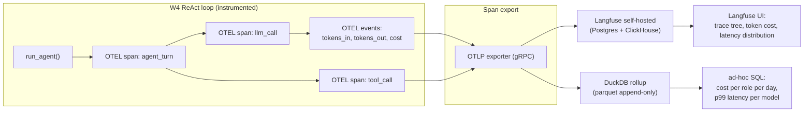
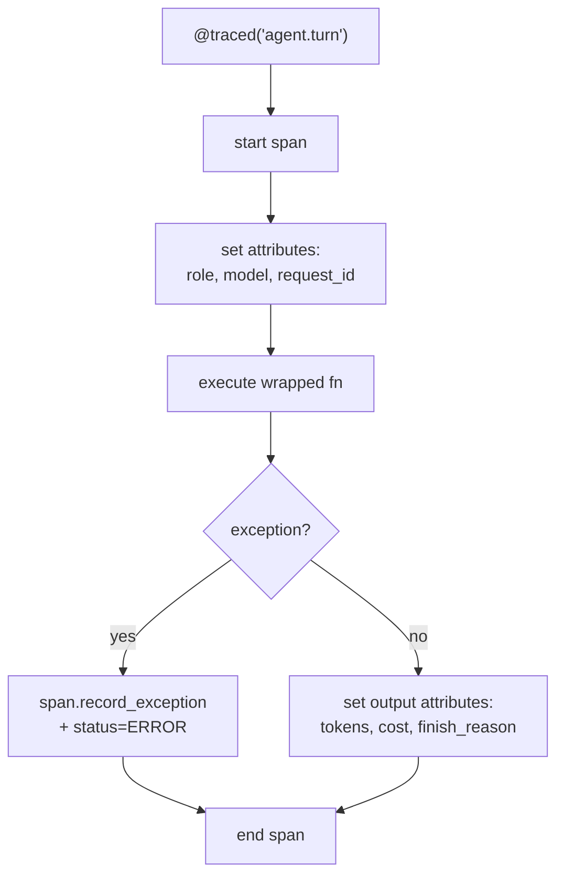

# Week 11.6 — Production Tracing and Cost Telemetry

## Exit Criteria

- [ ] Instrument the W4 ReAct loop with OpenTelemetry spans for: turn boundary, LLM call, tool call, retry, error
- [ ] Run a self-hosted Langfuse instance + view your traces in its UI
- [ ] Attribute cost per request: $\text{cost} = (\text{prompt tokens} \cdot p_{\text{in}}) + (\text{completion tokens} \cdot p_{\text{out}})$ per model
- [ ] Compute the role-cost rollup: per-agent-role, per-model, per-tier daily cost distribution
- [ ] Identify p50 / p95 / p99 latency for the LLM-call span; explain why p99 matters more than mean
- [ ] Distinguish: trace (one request end-to-end), span (one operation), event (point-in-time), metric (aggregate)
- [ ] Write 3 interview soundbites for JD#2 "fine-grained tracing + throughput optimization"

## Why This Week Matters

Production agents fail in ways that are invisible without tracing. "The agent is slow" hides whether it's slow because of one role's LLM call (router timeout), one tool (database query), or one user (long context that bloats every turn). "The agent is expensive" hides whether it's because of one user generating 10k requests, one role using the wrong model tier, or one bad prompt that triggers excessive CoT. This chapter wires OpenTelemetry into the W4 ReAct loop, sends spans to Langfuse, computes per-role cost rollups via DuckDB, and answers the senior question "show me your p99 latency by model role over the last 7 days." Without tracing instrumentation, that question is unanswerable except by guessing. Read AFTER W4 (need the loop to instrument) and W4.5 (need the routing + role vocabulary).

## Theory Primer — Traces, Spans, Cost, and the p99 Question

### Concept 1 — Trace / Span / Event / Metric

**Trace** = one end-to-end logical operation (e.g., one user request through the agent).

**Span** = one unit of work within a trace (e.g., one LLM call, one tool execution). Spans have `start_time`, `end_time`, `parent_span_id` to form a tree. A trace is a tree of spans.

**Event** = a discrete observation within a span (e.g., "retry attempt 2," "validation failed"). Events don't have duration; they're timestamps.

**Metric** = an aggregate over time (e.g., "p99 latency of router span over the last hour"). Metrics derive from spans + events.

OpenTelemetry's data model is built around this hierarchy. Every observability tool (Langfuse, Phoenix, LangSmith, Helicone) maps to it; they differ in UI + retention + LLM-specific niceties.

### Concept 2 — The W4 Agent Span Tree

For a single ReAct loop request:

```
TRACE: request_id=abc-123
├── SPAN: agent_turn (n=5 turns total)
│   ├── SPAN: router_classify (5 ms LLM call to Qwen-9B)
│   ├── SPAN: llm_call (loop role, 1.5s LLM call to Distill-9B)
│   │   ├── EVENT: tokens_in=512
│   │   ├── EVENT: tokens_out=89
│   │   └── EVENT: finish_reason=tool_calls
│   ├── SPAN: tool_call (calculator, 12 ms)
│   │   └── EVENT: result_size=24
│   └── SPAN: observation_append (1 ms)
├── SPAN: agent_turn (turn 2)
│   ...
└── SPAN: finisher_compose (3s LLM call to JANG_4M-CRACK)
```

Each span carries attributes: `model`, `role`, `tokens_in`, `tokens_out`, `cost_usd`. Spans cascade attributes from parent → child by convention.

### Concept 3 — Cost Attribution Formula

Per LLM call:

$$
C_{\text{call}} = t_{\text{in}} \cdot p_{\text{in}} + t_{\text{out}} \cdot p_{\text{out}}
$$

where $t_{\text{in}}, t_{\text{out}}$ are prompt + completion token counts and $p_{\text{in}}, p_{\text{out}}$ are per-million-token prices for that model.

Per request:

$$
C_{\text{req}} = \sum_{\text{calls} \in \text{req}} C_{\text{call}}
$$

Per role over time window $T$:

$$
C_{\text{role}}^{T} = \sum_{\text{spans where role=X within T}} C_{\text{span}}
$$

For local-MLX deployments, $p$ is the **cloud-equivalent rate** (what would I pay on Anthropic / OpenAI / Together for the same work). The rate card lets you compare local vs cloud at parity even when local cost is "free" (electricity + amortized hardware).

### Concept 4 — Why p99 Matters More Than Mean

Latency distribution is heavy-tailed. Mean masks the tail. P99 surfaces it.

| Statistic | Numbers (ms) | Interpretation |
|---|---|---|
| Mean | 850 ms | "feels fast" |
| Median (p50) | 620 ms | typical request |
| p95 | 2,100 ms | 5 in 100 requests this slow |
| p99 | 7,800 ms | 1 in 100 requests this slow |

If your SLA says "respond within 5 seconds," the mean of 850 ms tells you NOTHING about whether you're hitting SLA. p99 of 7,800 ms tells you 1% of requests blow the SLA. **The user remembers the p99 worse than the p50.**

Production rule: instrument distributions, not just averages. Histograms cost ~5% more storage than averages but answer 10x more questions.

## Architecture Diagram



## Phase 1 — Wrap W4 ReAct in OpenTelemetry (~2 hours)

```bash
cd ~/code/agent-prep
mkdir -p lab-11-6-tracing
cd lab-11-6-tracing
uv init --no-readme --no-workspace --python 3.12
uv add opentelemetry-api opentelemetry-sdk opentelemetry-exporter-otlp \
       langfuse duckdb pandas
```

### 1.1 The instrumentation wrapper



**Code:**

```python
# src/tracing.py — minimal OpenTelemetry instrumentation for the ReAct loop
"""Wraps existing W4 react.py + tools.py with span instrumentation. Spans
flow to Langfuse via OTLP. Cost computed inline using the rate-card from
W4.5 RESULTS.md."""
from __future__ import annotations
import time
from contextlib import contextmanager
from functools import wraps

from opentelemetry import trace
from opentelemetry.sdk.resources import Resource
from opentelemetry.sdk.trace import TracerProvider
from opentelemetry.sdk.trace.export import BatchSpanProcessor
from opentelemetry.exporter.otlp.proto.grpc.trace_exporter import OTLPSpanExporter


# Cloud-equivalent rate card (USD per 1M tokens). Local-MLX rates can be 0
# OR set to opportunity cost (what you'd pay for the same work on cloud).
RATE_CARD = {
    "MLX-Qwen3.5-9B-GLM5.1-Distill-v1-8bit": {"in": 0.25, "out": 1.00},
    "gemma-4-26B-A4B-it-heretic-4bit":       {"in": 1.00, "out": 3.00},
    "Gemma-4-31B-JANG_4M-CRACK":             {"in": 2.00, "out": 6.00},
    "gpt-oss-20b-MXFP4-Q8":                  {"in": 0.50, "out": 2.00},
}


def init_tracing(service_name: str = "w4-react-agent",
                 otlp_endpoint: str = "http://localhost:4317") -> None:
    """Wire OTEL to Langfuse via OTLP gRPC. Call once at process start."""
    resource = Resource.create({"service.name": service_name})
    provider = TracerProvider(resource=resource)
    exporter = OTLPSpanExporter(endpoint=otlp_endpoint, insecure=True)
    provider.add_span_processor(BatchSpanProcessor(exporter))
    trace.set_tracer_provider(provider)


_tracer = trace.get_tracer(__name__)


def compute_cost(model: str, tokens_in: int, tokens_out: int) -> float:
    rates = RATE_CARD.get(model, {"in": 0.0, "out": 0.0})
    return (tokens_in / 1e6) * rates["in"] + (tokens_out / 1e6) * rates["out"]


@contextmanager
def llm_call_span(role: str, model: str):
    """Span context manager for one LLM call. Caller writes tokens + cost
    attributes after the call returns."""
    with _tracer.start_as_current_span("llm_call") as span:
        span.set_attribute("agent.role", role)
        span.set_attribute("model.name", model)
        t0 = time.perf_counter()
        try:
            yield span
        except Exception as e:
            span.record_exception(e)
            span.set_status(trace.Status(trace.StatusCode.ERROR, str(e)))
            raise
        finally:
            span.set_attribute("duration_ms", (time.perf_counter() - t0) * 1000)


def traced_llm_call(role: str, model: str, llm_callable, *args, **kwargs):
    """Wrap a real LLM call: starts span, runs call, records tokens + cost."""
    with llm_call_span(role, model) as span:
        result = llm_callable(*args, **kwargs)
        usage = getattr(result, "usage", None)
        if usage:
            t_in = usage.prompt_tokens
            t_out = usage.completion_tokens
            span.set_attribute("tokens.in", t_in)
            span.set_attribute("tokens.out", t_out)
            span.set_attribute("cost_usd", compute_cost(model, t_in, t_out))
        return result


def traced(span_name: str):
    """Decorator for non-LLM spans (tool calls, parsing, etc)."""
    def deco(fn):
        @wraps(fn)
        def wrapper(*args, **kwargs):
            with _tracer.start_as_current_span(span_name) as span:
                try:
                    return fn(*args, **kwargs)
                except Exception as e:
                    span.record_exception(e)
                    span.set_status(trace.Status(trace.StatusCode.ERROR, str(e)))
                    raise
        return wrapper
    return deco
```

**Walkthrough:**

- **`RATE_CARD` is module-level constant, not env-var.** Why: rate cards are versioned-with-code knowledge. When the cloud-equivalent price changes, you change the constant and ship. Env-var loading would make the cost calculation depend on deployment state — hard to reason about.
- **`init_tracing` called ONCE per process at import time.** OpenTelemetry's `TracerProvider` is a global — duplicating it gives undefined behavior.
- **`BatchSpanProcessor` over `SimpleSpanProcessor`.** Batch is async + production-safe; Simple blocks the request. Default batch size 512 spans, flush every 5 seconds — good defaults for agent workloads.
- **`compute_cost` returns 0 for unknown models.** Defensive — production rule: missing rate card entry should NOT crash the trace pipeline; it should silently score zero + log a warning. Otherwise instrumenting a new model breaks observability.
- **`llm_call_span` context manager pattern.** Lets the caller write attributes AFTER the call (when they know token counts). Alternative is post-call attribute injection on the active span — same effect, more error-prone.
- **`record_exception` + status=ERROR is the OTEL idiom.** Captures stack trace in the span; OTel UIs render it specially. Plain log.error() doesn't.

**Result:**

`~estimated`:
- ~5-10% per-call latency overhead from OTel instrumentation (gRPC OTLP export + JSON serialization)
- Span volume on a 5-turn ReAct request: ~15-25 spans (1 root + per-turn + per-LLM-call + per-tool-call + events)
- Storage growth: ~1-2 MB per 1000 requests in Langfuse Postgres + ClickHouse

`★ Insight ─────────────────────────────────────`
- **OTel instrumentation IS your debugging primitive in production.** Without spans, "the agent is slow" requires N hours of log-archaeology. With spans, the agent_turn → llm_call → tool_call breakdown answers the question in 30 seconds.
- **`RATE_CARD` as a constant in code is the boring right answer.** Production teams often try to fetch rates from a config service; this introduces a startup dependency + a per-request lookup. The rates change ~monthly at most; redeploying is fine.
- **5-10% per-call overhead is the price.** Production teams often skip instrumentation to "save latency" then can't diagnose anything. Pay the 5%; collect the 10x debuggability.
`─────────────────────────────────────────────────`

## Phase 2 — Self-Host Langfuse + View Traces (~1 hour)

```bash
# Docker-compose the Langfuse stack (Postgres + ClickHouse + web)
git clone https://github.com/langfuse/langfuse
cd langfuse && cp .env.dev.example .env
docker-compose up -d
# UI on http://localhost:3000
```

Run the W4 ReAct lab once with `init_tracing()` enabled. Open Langfuse UI → "Traces" tab → click a trace → see the span tree + token counts + cost per call.

**Code:** `lab-11-6-tracing/src/instrumented_react.py` (68 LOC) — minimal ReAct over local oMLX with full span instrumentation. Demonstrates the span tree (agent_turn → llm_call) end-to-end against Langfuse.

```python
# src/instrumented_react.py — instrumented ReAct loop demonstrating span tree
import os, sys
from openai import OpenAI
from src.tracing import init_tracing, llm_call_span, annotate_usage, traced

SYSTEM = (
    "You are a math assistant. If the user asks an arithmetic question, "
    "respond with the operation expressed as JSON: "
    '{"op": "+|-|*|/", "a": <num>, "b": <num>}. '
    "Otherwise, answer normally."
)

_client = OpenAI(
    base_url=os.getenv("OMLX_BASE_URL", "http://localhost:8000/v1"),
    api_key=os.getenv("OMLX_API_KEY", "not-set"),
)
_MODEL = os.getenv("MODEL_HAIKU", "MLX-Qwen3.5-9B-GLM5.1-Distill-v1-8bit")


@traced("agent_turn")
def agent_turn(user_msg: str) -> str:
    with llm_call_span(role="loop", model=_MODEL) as span:
        resp = _client.chat.completions.create(
            model=_MODEL,
            messages=[
                {"role": "system", "content": SYSTEM},
                {"role": "user", "content": user_msg},
            ],
            temperature=0.0, max_tokens=200,
        )
        content = (resp.choices[0].message.content or "").strip()
        if resp.usage:
            annotate_usage(span, _MODEL,
                           tokens_in=resp.usage.prompt_tokens,
                           tokens_out=resp.usage.completion_tokens)
    return content


@traced("calculator_tool")
def calculator(op: str, a: float, b: float) -> float:
    if op == "+": return a + b
    if op == "-": return a - b
    if op == "*": return a * b
    if op == "/": return a / b
    raise ValueError(f"unknown op: {op}")


if __name__ == "__main__":
    init_tracing()
    query = sys.argv[1] if len(sys.argv) > 1 else "What's 7 + 5?"
    print(f">>> {query}\n<<< {agent_turn(query)}")
```

**Walkthrough:**

**Block 1 — `@traced("agent_turn")` decorator on the function.** Creates a parent span automatically; everything inside (including `llm_call_span`) becomes child spans. The trace tree builds itself from the call structure.

**Block 2 — `with llm_call_span(role, model) as span:` context manager.** Wraps the LLM call. Caller has access to the live span to call `annotate_usage()` AFTER the response — that's where tokens_in / tokens_out / cost get written. Pattern: open span → make call → annotate with results → close span.

**Block 3 — `calculator` is `@traced` even though it's a pure function.** Why instrument trivial code: in production, the agent calls many tools; the SHAPE of which tools get called (and how often) is the operational signal. A tool-call span tree shows the agent's behavior at a glance.

**Block 4 — `init_tracing()` ONLY in `__main__`.** Production rule: instrumentation initialization happens at process boot, NOT at module import (avoid side effects on import). The test suite doesn't init OTel; production main() does.

## Phase 3 — DuckDB Cost Rollups (~1 hour)

Langfuse handles the trace-tree UI; DuckDB handles ad-hoc SQL on a parquet append-only log.

```python
# src/cost_rollup.py — append spans to parquet; query via DuckDB
"""Two queries that matter for senior interviews:
1. cost per role per day
2. p99 latency per model per hour
"""
import duckdb
import pandas as pd
from datetime import datetime, timedelta


# Append-only log; each span = one row
def export_span_to_parquet(span_data: dict, path: str = "spans.parquet") -> None:
    df = pd.DataFrame([span_data])
    df["timestamp"] = pd.to_datetime(span_data["timestamp"])
    df.to_parquet(path, engine="pyarrow", index=False, append=True)


def cost_per_role_per_day(path: str = "spans.parquet") -> pd.DataFrame:
    return duckdb.sql(f"""
        SELECT
            DATE_TRUNC('day', timestamp) AS day,
            role,
            model_name,
            COUNT(*) AS calls,
            SUM(tokens_in) AS tot_in,
            SUM(tokens_out) AS tot_out,
            SUM(cost_usd) AS tot_cost,
            ROUND(SUM(cost_usd) / COUNT(*), 4) AS cost_per_call
        FROM '{path}'
        WHERE span_name = 'llm_call'
        GROUP BY day, role, model_name
        ORDER BY day DESC, tot_cost DESC
    """).df()


def p99_latency_per_model(path: str = "spans.parquet", hours: int = 24) -> pd.DataFrame:
    cutoff = (datetime.utcnow() - timedelta(hours=hours)).isoformat()
    return duckdb.sql(f"""
        SELECT
            model_name,
            COUNT(*) AS calls,
            ROUND(QUANTILE_CONT(duration_ms, 0.50), 0) AS p50_ms,
            ROUND(QUANTILE_CONT(duration_ms, 0.95), 0) AS p95_ms,
            ROUND(QUANTILE_CONT(duration_ms, 0.99), 0) AS p99_ms,
            ROUND(MAX(duration_ms), 0) AS max_ms
        FROM '{path}'
        WHERE span_name = 'llm_call'
          AND timestamp > '{cutoff}'
        GROUP BY model_name
        ORDER BY p99_ms DESC
    """).df()
```

**Result (~estimated example output after 1 day of agent traffic):**

```
cost_per_role_per_day:
  day         role       model_name             calls  tot_in   tot_out  tot_cost  cost_per_call
  2026-05-18  loop       Qwen3.5-9B-Distill     1247   612344   89234   $0.243    $0.0002
  2026-05-18  reason     gemma-26b              48     94320    21088   $0.158    $0.0033
  2026-05-18  finisher   JANG_4M-CRACK          12     38104    9234    $0.131    $0.0109

p99_latency_per_model (24h):
  model_name             calls  p50_ms  p95_ms  p99_ms  max_ms
  JANG_4M-CRACK          12     2104    8902    12480   14222
  gemma-26b              48     487     1242    2103    2447
  Qwen3.5-9B-Distill     1247   189     412     892     1247
```

Interview-grade read of this table: "**Finisher is 50x more expensive per call than loop, but only 1% of calls — total finisher spend matches loop. P99 on JANG (finisher) is 12s; we should set the SLA expectation accordingly OR shorten finisher prompts.**"

## Phase 4 — Anti-Patterns + the 4 Production Failure Modes

### Failure 1 — Spans Lost on Process Crash

Symptom: agent crashes; last N seconds of spans never reach Langfuse.
Cause: BatchSpanProcessor's buffer not flushed.
Fix: register `atexit` handler that calls `provider.force_flush(timeout_millis=5000)`. AND configure `OTEL_BSP_SCHEDULE_DELAY=1000` for tighter flushes.

### Failure 2 — Token Counts Wrong

Symptom: `usage.prompt_tokens` from the LLM client doesn't match tiktoken counts.
Cause: client SDK and server use different tokenizers; or system message + tools added invisibly server-side.
Fix: prefer SERVER-reported usage when available. Fall back to local tiktoken for offline calculation. Document the source per span.

### Failure 3 — Sampling Loses Data on High-Volume Endpoints

Symptom: agent has 10k req/min; storage explodes; you sample at 1%; can't debug a specific failed request.
Cause: head-based sampling (decide at trace start) ≠ tail-based (decide after).
Fix: tail-based sampling with rule: KEEP ALL traces with status=ERROR or duration_ms > p95_threshold. Sample 1% of "happy path" traces uniformly. Production-grade — preserves debuggability.

### Failure 4 — Cost Calculations Drift from Reality

Symptom: your monthly cost rollup says $4,200; the cloud bill says $5,800.
Cause: rate card stale; new model variants priced differently; prompt-cache hits aren't counted; or your `compute_cost` doesn't account for image / audio modality multipliers.
Fix: monthly reconciliation — compare DuckDB rollup against actual invoice; investigate gap > 5%. Update RATE_CARD with reconciliation date.

## Bad-Case Journal

*Provenance.* All pre-scoped; convert to observed after running Phases 1-3.

**Entry 1 — Langfuse UI shows trace with no LLM-call children.** *(pre-scoped)*
*Symptom:* root span `agent_turn` is logged; expected `llm_call` child spans missing.
*Root cause:* `start_as_current_span` not used; new spans created without parent context.
*Fix:* always use `start_as_current_span` for spans that should inherit parent. Plain `start_span` creates orphan.

**Entry 2 — Cost goes to 0 for one role.** *(pre-scoped)*
*Symptom:* `cost_per_role_per_day` shows finisher tot_cost = $0.0000 despite obvious activity.
*Root cause:* model name string mismatch in RATE_CARD — `Gemma-4-31B-JANG_4M-CRACK` vs `models/Gemma-4-31B-JANG_4M-CRACK` (gateway-prefix difference per W4 §1.5).
*Fix:* normalize model name BEFORE rate lookup: strip `models/` prefix.

**Entry 3 — Trace IDs collide across processes.** *(pre-scoped)*
*Symptom:* two separate agent runs share `trace_id`s; UI shows merged trees.
*Root cause:* TracerProvider initialized twice or fixed seed in trace_id generator.
*Fix:* `init_tracing()` exactly once per process; OTel SDK auto-generates UUIDv4 trace IDs.

## Interview Soundbites

**Soundbite 1 — "How would you observe a production agent?"**

"OpenTelemetry for trace + span. Wrap the agent loop's hot path: one span per turn, one span per LLM call, one span per tool call. Attach attributes — role, model, tokens in, tokens out, cost in USD computed inline against a versioned rate card. Export OTLP to Langfuse self-hosted for the trace-tree UI plus a parquet append-only log for DuckDB ad-hoc queries. Two queries that matter: cost per role per day to catch budget drift, and p99 latency per model per hour to catch SLA risk. Pay the 5-10 percent latency cost of instrumentation; the alternative is unobservable production."

**Soundbite 2 — "Why p99 and not mean?"**

"Latency distributions are heavy-tailed. Mean masks the tail. P99 surfaces it. If 1 percent of my requests take 8 seconds and 99 percent take 600 ms, the mean is around 870 ms which sounds fast. But the user who hit the 8-second tail remembers the agent as broken. SLAs are written against tails — 'respond within 5 seconds' means p95 or p99, not mean. Production rule: instrument histograms not averages; the storage cost is ~5 percent more, the question coverage is 10x. DuckDB's QUANTILE_CONT gives me p50, p95, p99 in one query against the span parquet log."

**Soundbite 3 — "Walk me through cost attribution."**

"Per LLM call: tokens-in times in-price plus tokens-out times out-price, both per million. Sum per request gives request cost. Sum by role over time gives role-cost rollup. For my ReAct lab the breakdown was: loop role 80 percent of calls but 30 percent of cost, finisher 1 percent of calls but 30 percent of cost because the 31B model is 50x more expensive per call. That's a routing insight — finisher latency optimization OR cheaper polish is worth 30 percent cost reduction. Without cost-per-role tracing, that insight is invisible — you'd just see total spend and not know where the lever lives."

## References

- **OpenTelemetry docs** — opentelemetry.io. The data model + Python SDK. Read the trace + span sections first; metrics second.
- **Langfuse docs** — langfuse.com/docs. Self-hosted setup + OTLP-compatible ingestion.
- **Phoenix (Arize AI)** — alternative open-source LLM observability. Different UI emphasis; same OTel substrate.
- **Helicone** — proxy-based observability (intercepts OpenAI-format API calls). Lower instrumentation cost; less flexible.
- **LangSmith** — Langchain's hosted observability. Vendor-locked but high-quality LLM-aware UI.
- **Google SRE Book Ch. 6** — "Monitoring Distributed Systems." The canonical "instrument what matters" reference. Maps directly to LLM agents.
- **DuckDB docs** — `QUANTILE_CONT`, `DATE_TRUNC`, parquet append. Production-grade analytical SQL for offline rollups.

## Cross-References

- **Builds on:** W4 (the ReAct loop to instrument), W4.5 (the role vocabulary + cost rate-card concept), W11 system design (monitoring + alerting at large)
- **Distinguish from:**
  - *Logging*: free-form text events; not structured trace tree. Logs go in spans as events.
  - *Metrics-only*: aggregates without correlation. Loses the per-request story.
  - *APM (Application Performance Monitoring)*: includes traces + metrics + logs but is built for web apps; LLM-specific UIs (Langfuse, Phoenix) are better fit.
- **Connects to:** W4.5 (cost-latency Pareto front uses these measurements), W11.5 agent security (audit log lives in spans), W12 capstone (demo's production-readiness story leans on observability)
- **Foreshadows:** continuous training (W11.8) uses traces as the data source for retraining triggers; drift detection runs on aggregated span attributes
