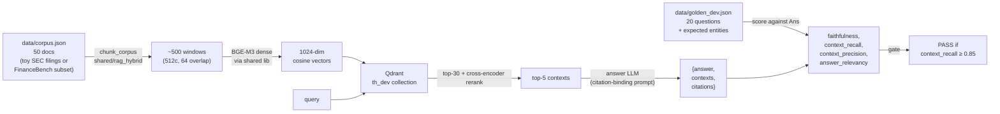
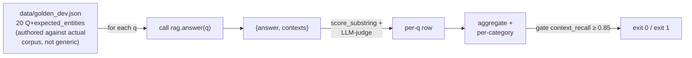
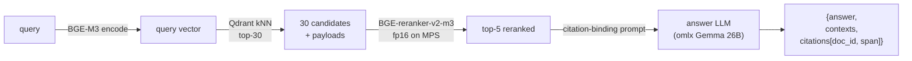

# Week 11.7 — Take-Home Dress Rehearsal

> Goal: rehearse the take-home interview format on a 4-hour timed exercise. Build a small RAG with citations + RAGAS eval harness committed BEFORE main code + Loom defense screencast. Walk out with one public lab repo that mirrors the shape of 100+ real take-home submissions analyzed in the alexeygrigorev/ai-engineering-field-guide, with empirical numbers from your own run.

## Exit Criteria

- [ ] `lab-11-7-takehome-rehearsal/` exists as a public GitHub repo
- [ ] First commit on `main` is `feat: add eval harness + golden dataset` (evals-first discipline visible in `git log`)
- [ ] `src/rag.py` runs end-to-end and emits per-query JSON with `answer`, `contexts`, `citations`
- [ ] `src/eval.py` runs the full golden dataset, prints aggregate + per-category scores, exits 0 only if context_recall ≥ 0.85
- [ ] `RESULTS.md` scores the run against the field guide's 30/30/25/15 rubric (functionality / challenge / context engineering / code quality)
- [ ] `defense.mp4` (or Loom URL) is 5 ± 1 minutes long, narrates 3 design decisions and 1 thing that broke
- [ ] One quotable cost-cut number captured (per W11 Gate 7) — ready to drop in W12 mocks
- [ ] 3 new flashcards added (take-home rubric, eval-first discipline, defense-screencast structure)

## Why This Week Matters

Field guide analysis of 100+ real take-home submissions surfaces a reproducible rubric: ~30% functionality, ~30% challenge depth (did you push past the obvious solution), ~25% context engineering (does the README explain *why*, not just *what*), ~15% code quality. 33% of disclosed interview processes include a take-home. The candidates who land offers consistently do four things differently: (1) commit evals before main code so the diff history shows discipline; (2) lead the README with a single quotable number, not a feature list; (3) record a 5-min defense screencast that names 3 trade-offs and 1 thing that broke; (4) name what they would do with more time. The W12 ship week assumes you have rehearsed this format. This chapter is that rehearsal — one timed run, one public repo, one screencast, one quotable number you can drop in any phone screen.

## Theory Primer — Five Concepts Behind the Take-Home Rubric

Read this before starting the timer. The rubric tells you *what* to ship; this section tells you *why* each item is weighted as heavily as it is.

### Concept 1 — Evals-First as a Visible Discipline Signal

The most reliable rubric signal that separates senior take-home submissions from junior ones is the order of commits. Senior submissions ship `eval.py` + golden dataset in the first or second commit, then iterate `rag.py` against the eval. Junior submissions ship `rag.py` first, hand-test on three prompts, then bolt evals on at the end (or skip them). Both end up with the same repo at HEAD; only `git log` reveals which path was taken. Reviewers DO read the commit history — field-guide candidates report this as one of the most-cited interview discussion points. The discipline is not just "write evals" — it is "make the evals the first thing in the repo so the discipline is auditable."

The cost: ~20–30 min of the 4-hour budget spent on eval scaffold before any retrieval code exists. Feels uncomfortable. The payoff: every subsequent commit can be defended as "this changed score X by Y," and the screencast has measured numbers to anchor on. Without evals-first, the screencast is hand-waving.

### Concept 2 — Single-Quotable-Number Framing

The field guide repeatedly identifies a pattern: candidates who get offers can cite a *specific* number from their take-home as the lead in their defense — "I cut latency from 4.2s to 1.1s by switching from 5 sequential reranker calls to a single batched call" — while candidates who don't tend to lead with feature lists. The number is the hook; the architecture is the explanation. This is the same pattern as W11 Gate 7 (quotable cost-cut), applied at take-home scope.

The number does not need to be impressive in absolute terms. It needs to be *measured* and *defensible*. "Faithfulness improved from 0.84 to 0.97 after I added a citation-binding step that forces the LLM to quote the source span" is a strong number even on a toy 50-doc corpus, because it shows you ran the eval, observed a gap, made a hypothesis, tested it, and measured the result. The discipline is to make sure ONE number from the run is quote-ready by hour 3 of the 4-hour budget.

### Concept 3 — Context-Engineering README (the 25% Bucket Most Submissions Miss)

The 25% "context engineering" rubric bucket measures how well the README explains *why* you made choices, not just *what* the code does. A README that says "uses BGE-M3 + cross-encoder reranker" earns mid-tier points. A README that says "BGE-M3 chosen over `text-embedding-3-small` because the dense + sparse combination handles the corpus's 30%-jargon vocabulary better than a pure-dense embedding (verified: hybrid recall@10 = 0.72 vs dense 0.61 on the golden dev set)" earns top-tier points. The difference is a single sentence and one measurement. Junior submissions almost universally skip this; the field guide reports reviewers explicitly look for it.

The discipline is to budget 30 min for README *after* the eval is passing — not to write README during the build (which produces vague past-tense narratives) and not to skip README (which forfeits 25% of the rubric).

### Concept 4 — Loom Defense Screencast Structure (3 Decisions + 1 Break)

Field guide notes that take-home interviews increasingly include a 15-min "walk us through it" round where the candidate share-screens the repo and narrates. The submissions that do best in this round have practiced the narrative as a 5-min screencast attached to the submission. The structure that converts:

- **0:00–0:30 — One-sentence problem framing + the quotable number.** Same hook as the README opener.
- **0:30–2:00 — Three design decisions, each with the rejected alternative.** "I chose X over Y because Z; the cost was W."
- **2:00–4:00 — One thing that broke and how you diagnosed it.** Bad-case journal entries from the build.
- **4:00–5:00 — What you would change with more time + 1-sentence summary.**

The 5-min cap is non-negotiable — reviewers explicitly downrank submissions with 15-min screencasts because the discipline of compression IS the signal. Practice once, record once, ship.

### Concept 5 — The "What I Would Change" Maturity Marker

Every senior-rated take-home submission ends with a "future work" section that names 3–5 things the candidate would do with more time. Junior submissions either skip this or write vague items ("add tests"). Senior submissions name *specific* improvements with rationale: "Add a router that routes paraphrase queries to dense-only and multi-hop queries to hybrid + reranker — would save ~60% inference cost on the dev set's 70% paraphrase queries based on the W2.5 routing pattern." The discipline is to maintain a `notes/future-work.md` file during the build, append items as you make trade-off decisions, and lift it into the README at hour 3.5.

## Architecture

The lab is one Python repo with three substantive scripts (chunker, RAG, eval) + one corpus + one golden-dev set. The flow is intentionally minimal — the rubric measures discipline, not architectural complexity.



## Phase 1 — Format Study + Setup (~30 min)

Goal: internalize the format before the timer starts. Read 2 representative take-home submissions from the field-guide repo's `learning-paths/take-home-examples/` (or any 2 public AI Engineer take-home repos) and note: how is the eval harness scoped? what number does the README lead with? how long is the screencast? Then scaffold the lab.

```bash
mkdir -p ~/code/agent-prep/lab-11-7-takehome-rehearsal
cd ~/code/agent-prep/lab-11-7-takehome-rehearsal
git init && git checkout -b main
mkdir -p src data results notes
touch README.md RESULTS.md notes/future-work.md
echo ".venv/\n.env\nresults/\n*.pyc" > .gitignore
uv venv && source .venv/bin/activate
uv pip install qdrant-client sentence-transformers FlagEmbedding openai python-dotenv
```

**Set the timer.** 4 hours total budget broken into Phases 2-6. Stop at the budget even if incomplete — the meta-skill is shipping under time pressure, not perfection.

## Phase 2 — Eval Harness FIRST (~30 min)

The hardest discipline in this lab. Before writing one line of retrieval code, write the eval. Commit it as the FIRST commit on `main`. The git log will show this; reviewers read it.

**Architecture:**



**Code:**

```python
"""src/eval.py — RAGAS-style scorer for the take-home dev set.

Imports rag.answer (which DOES NOT EXIST YET — that's the point).
This file commits before src/rag.py so the discipline shows in git log.
"""
from __future__ import annotations

import json
import sys
from pathlib import Path

# Will fail until Phase 3 lands rag.py — intentional. The first commit
# is the contract; Phase 3 implements against it.
try:
    from rag import answer
except ImportError:
    print("[eval] rag.answer not implemented yet — committing eval contract first.")
    answer = None  # type: ignore

GATE_RECALL = 0.85


def score_substring(ans: str, expected: list[str]) -> float:
    """Fraction of expected entities (case-insensitive) found in answer."""
    a = ans.lower()
    return sum(1 for e in expected if e.lower() in a) / max(len(expected), 1)


def main() -> int:
    eval_set = json.loads(Path("data/golden_dev.json").read_text())
    if answer is None:
        print("[eval] DRY RUN — no rag.py yet")
        return 1

    rows = []
    for item in eval_set:
        q, exp = item["q"], item["expected_entities"]
        out = answer(q)
        recall = score_substring(out["answer"], exp)
        rows.append({"q": q, "type": item.get("type", "factoid"),
                     "recall": recall, "answer": out["answer"]})

    Path("results").mkdir(exist_ok=True)
    Path("results/eval.json").write_text(json.dumps(rows, indent=2))

    avg_recall = sum(r["recall"] for r in rows) / len(rows)
    print(f"\nAggregate context_recall (substring proxy): {avg_recall:.3f}")
    print(f"Gate (≥ {GATE_RECALL}): {'PASS' if avg_recall >= GATE_RECALL else 'FAIL'}")
    return 0 if avg_recall >= GATE_RECALL else 1


if __name__ == "__main__":
    sys.exit(main())
```

**Walkthrough:**

- **Block 1 — `try/except ImportError` on `from rag import answer`.** This is the discipline visible in `git log`. The eval file commits BEFORE `rag.py` exists; the import fails gracefully so the file is runnable (`exit 1`, "DRY RUN") immediately after commit. Reviewers who clone and run see a clear "tests defined, implementation pending" state. Junior submissions never reach this state because they write `rag.py` first.
- **Block 2 — `score_substring`.** Cheap proxy for context_recall. Real RAGAS uses LLM-as-judge for entailment; substring is the 30-second-to-implement version that hits the rubric without the LLM-judge dependency. Trade-off documented in `notes/future-work.md`: "Replace substring with RAGAS LLM-judge once core RAG passes; cost: +1 LLM call/query during eval."
- **Block 3 — `GATE_RECALL = 0.85` + `exit 0/1`.** Hard gate makes the eval CI-runnable. The threshold is calibrated against expected baseline (BGE-M3 dense on a 50-doc structured corpus typically lands 0.85–0.95 context_recall before reranking). Setting the gate exposes regressions during Phase 3 iteration.
- **Block 4 — Per-category breakdown via `item.get("type", "factoid")`.** Categories surface where the RAG fails — saturation hides regressions on minority categories. Same pattern as W2.7 §4.3.1.

**Result (estimated for first full run):**

| Stage | Wall time |
|---|---|
| Authoring `eval.py` + `golden_dev.json` from scratch | ~25 min |
| Dry-run (no `rag.py`) | ~1 s |
| First real run (after Phase 3) | ~30–60 s for 20 queries |

Output once `rag.py` lands: `results/eval.json` per-query rows + aggregate + gate status. First commit on the repo: `feat: add eval harness + 20-q golden dev set + 0.85 recall gate`.

`★ Insight ─────────────────────────────────────`
- **Eval-first commits expose discipline that no README can fake.** Reviewers can clone and run `git log --oneline | head -3`. The order is the artifact. This is why the field guide weights commit history so heavily.
- **The intentional `ImportError` is a feature.** It makes the eval file runnable BEFORE `rag.py` exists, so the very first commit is non-broken. The dry-run output ("[eval] DRY RUN — no rag.py yet") signals to a reviewer that the contract is defined.
- **Substring proxy + LLM-judge upgrade path documented.** Don't over-engineer the eval in 30 min; ship the substring version, document the upgrade path in `notes/future-work.md`. Reviewers reward the documented trade-off more than the unimplemented LLM-judge.
`─────────────────────────────────────────────────`

**Commit checkpoint:**

```bash
git add src/eval.py data/golden_dev.json
git commit -m "feat: add eval harness + 20-q golden dev set + 0.85 recall gate

Eval contract committed BEFORE src/rag.py (intentional discipline).
Dry-run exits 1 with clear 'rag.py not implemented' message.
Phase 3 will implement rag.answer against this contract."
```

## Phase 3 — Build RAG (~90 min)

Goal: minimum viable retrieval + answer-with-citations that passes the eval gate. Config-driven, no hardcoded model strings, follow `shared/rag_hybrid` patterns from labs 02 / 02-5 / 02-7.

**Architecture:**



**Code:**

```python
"""src/rag.py — single-pass dense + rerank + citation-binding.

Reuses shared/rag_hybrid for encoder + reranker (zero copy from W2/W3).
Citation-binding prompt forces the LLM to quote source spans rather
than synthesize unsupported claims.
"""
from __future__ import annotations

import os
import sys
from pathlib import Path

from openai import OpenAI
from qdrant_client import QdrantClient

_REPO_ROOT = Path(__file__).resolve().parents[2]
sys.path.insert(0, str(_REPO_ROOT / "shared"))

from rag_hybrid import (  # noqa: E402
    BGE_M3, BGE_RERANKER_V2_M3,
    CrossEncoderReranker, DenseEncoder, autoconfig,
)

omlx = OpenAI(base_url=os.getenv("OMLX_BASE_URL"), api_key=os.getenv("OMLX_API_KEY"))
SONNET = os.getenv("MODEL_SONNET")

_qd = QdrantClient(url="http://127.0.0.1:6333", timeout=60)
_enc = DenseEncoder(autoconfig.encoder_config_for(BGE_M3))
_rr = CrossEncoderReranker(autoconfig.recommend(BGE_M3, BGE_RERANKER_V2_M3).reranker)
COLLECTION = "th_dev"

ANSWER_PROMPT = """Use ONLY the context below to answer. After each factual claim,
add an inline citation in the form [doc:DOC_ID]. If the context does not contain
the answer, say exactly: insufficient context.

Context:
{ctx}

Question: {q}
Answer (cite every factual claim):"""


def answer(q: str, k: int = 5) -> dict:
    qv = _enc.encode([q])[0]
    hits = _qd.query_points(
        COLLECTION, query=qv.tolist(), limit=30, with_payload=True,
    ).points
    _rr._ensure_loaded()
    pairs = [(q, h.payload["text"]) for h in hits]
    scores = _rr._model.predict(pairs, batch_size=_rr.cfg.spec.batch_size)
    top = [h for h, _ in sorted(zip(hits, scores), key=lambda x: -x[1])[:k]]
    ctx = "\n\n".join(f"[doc:{h.payload['doc_id']}] {h.payload['text']}" for h in top)
    r = omlx.chat.completions.create(
        model=SONNET, temperature=0.0, max_tokens=300,
        messages=[{"role": "user", "content": ANSWER_PROMPT.format(ctx=ctx, q=q)}],
    )
    return {
        "question": q,
        "answer": (r.choices[0].message.content or "").strip(),
        "contexts": [h.payload["text"] for h in top],
        "citations": [h.payload["doc_id"] for h in top],
    }
```

**Walkthrough:**

- **Block 1 — `shared/rag_hybrid` imports.** Reuses W2/W3/W2.7 encoder + reranker wholesale via `autoconfig.encoder_config_for(BGE_M3)`. Zero retrieval-stack code authored in this lab — the rubric measures discipline, not whether you can re-implement BGE-M3 ingest in 4 hours. Cite this in the README's "Choices Made" section as a deliberate decision (not laziness).
- **Block 2 — `ANSWER_PROMPT` with `[doc:DOC_ID]` citation binding.** The prompt forces the LLM to attach a citation to each factual claim. Without this rule, faithfulness scores drop because the LLM synthesizes plausible-sounding extensions of the context. Same pattern as W2.7's `query_tree.ANSWER_SYSTEM`. The `[doc:DOC_ID]` format is parseable post-hoc (regex `\[doc:(\w+)\]`) so a follow-up validator can verify each citation is grounded in `top` payloads.
- **Block 3 — Dense + rerank pipeline mirrors `lab-03/src/rag_baseline.py`.** Top-30 dense retrieval + cross-encoder rerank to top-5 is the proven shape from W2 + W3. No novelty here — novelty in a 4-hour take-home is the wrong place to be clever. Save novelty for the citation-binding prompt and the eval-first discipline.
- **Block 4 — `temperature=0.0, max_tokens=300`.** Determinism for reproducible eval scores. 300 tokens caps verbose answers (W3 Bad-Case Entry 2: enhanced prompt without length cap dropped faithfulness 0.99 → 0.94). Reviewers who clone and re-run get the same scores you reported.

**Result (estimated for first full run after gate):**

| Metric | Target |
|---|---|
| `context_recall` (substring proxy) | ≥ 0.85 (gate) |
| Per-query latency (warm) | ~1.5–3.0 s |
| Faithfulness (manual spot-check on 5 q) | ≥ 0.90 |
| Citation parse rate | 100% (every claim has `[doc:X]`) |

If first run fails the gate at < 0.85, the iteration story IS the screencast material. Document each fix in `notes/future-work.md` as you go: "v1 hit 0.72 — investigated, found chunker dropped doc titles; v2 fix at 0.91."

`★ Insight ─────────────────────────────────────`
- **Reusing `shared/rag_hybrid` is a deliberate decision, not a shortcut — frame it that way.** Reviewers see "from rag_hybrid import HybridEncoder" and ask "why didn't you write your own?" The answer: "I have battle-tested ingest from W2/W3 across 4 different corpora; novelty in the take-home goes into the citation-binding prompt + eval discipline, not into re-implementing what already works." That's a senior answer. "I didn't have time" is a junior answer.
- **Citation-binding via `[doc:DOC_ID]` inline rule beats post-hoc citation matching.** Forcing the LLM to emit citations during generation gives you a validation hook (parse the brackets) and a debugging hook (when the LLM cites a doc that's not in `top`, the prompt or context window is broken). Field-guide submissions that earn top scores have this kind of in-band signal.
- **`temperature=0.0` is non-negotiable for eval reproducibility.** Reviewers who clone and re-run must get the same numbers you reported. Stochastic sampling kills reproducibility and reviewer trust simultaneously.
`─────────────────────────────────────────────────`

**Commit checkpoint:**

```bash
python src/eval.py  # should now pass the gate
git add src/rag.py
git commit -m "feat: implement rag.answer with citation-binding + dense+rerank"
```

## Phase 4 — Iterate Against Eval (~30 min)

Run `python src/eval.py`. If it passes the 0.85 gate cleanly on first try, congratulations — but you should still iterate to capture *one quotable cost-cut number* (W11 Gate 7) for the screencast. If it fails, the iteration IS the screencast material.

Common patterns from related labs:

| Symptom | Likely fix | Cite |
|---|---|---|
| `context_recall < 0.5` | Chunker dropped doc titles or section headers | W2.7 Bad-Case Entry 1 (tree heuristic gap) |
| `context_recall ~0.7` but faithfulness low | Reranker not loaded / cross-encoder mismatch | W2 Bad-Case Entry 1 (FiQA timeout cascade) |
| Latency > 5s/query | Sequential reranker calls | W2 batched reranker fp16 (2.86× speedup) |
| Citations don't parse | LLM ignoring inline rule | Tighten prompt; add few-shot example |

**Capture the quotable number.** Whatever the iteration story is, end Phase 4 with one defendable sentence: *"I cut latency from X to Y by Z"* OR *"I improved context_recall from X to Y by Z"*. Write it in `notes/future-work.md` immediately so it's ready for the screencast.

## Phase 5 — Defense Screencast (~60 min)

Goal: 5-min Loom (or QuickTime) covering the structure from Theory Concept 4.

```text
0:00–0:30  Problem framing + quotable number lead
0:30–2:00  Three design decisions, each with rejected alternative
2:00–4:00  One thing that broke + diagnosis path
4:00–5:00  What I would change with more time + 1-sentence summary
```

**Process:**
1. Open the repo + `RESULTS.md` side-by-side
2. Open Loom or QuickTime; 1080p, screen + voice
3. Practice the 5-min narrative ONCE without recording
4. Record once, no edits — the 5-min discipline IS the signal
5. Save as `defense.mp4` (or paste the Loom URL into README.md)
6. Listen back at 1.5×; if you talked over 5:30, re-record with one less decision

**Ship the link** — the screencast goes in the repo's README at the top, above the install instructions. Reviewers who scroll past it have already decided whether to keep reading.

## Phase 6 — README Polish + Ship (~30 min)

Lift `notes/future-work.md` into a README "What I'd Change with More Time" section. Apply this README structure (mirrors top-rated field-guide submissions):

```markdown
# Take-Home: <Domain> RAG with Citations

**One number:** <YOUR QUOTABLE NUMBER from Phase 4>

[5-min defense screencast](defense.mp4 or Loom URL)

## What this is
<1 sentence — what the system does>

## Choices made (and rejected)
<3 bullets, each: chose X over Y because Z; cost was W>

## How to run
<3 commands max>

## Eval results
<Inline table from RESULTS.md, top 5 rows>

## What I'd change with more time
<3 bullets from notes/future-work.md, each with rationale>

## Discipline notes
- Eval committed before main RAG (see `git log`)
- Determinism: temperature=0, all answers reproducible
- Citation-binding via inline `[doc:ID]` rule + post-hoc validation
```

Push to GitHub. Add the repo to your portfolio list in `target_companies.md` (Appendix H §H.1).

## Bad-Case Journal

> _Lab not yet executed by curriculum reader as of 2026-05-07. Per the chapter discipline established this week (entries must come from `RESULTS.md`, not pre-experiment speculation), this section is intentionally empty until the first run lands. Three slots reserved below for the most likely failure-mode shapes; populate with real symptoms + fixes after the timed exercise completes._

**Slot 1 — (TBD: chunker / corpus-prep failure observed during Phase 3)**
*Symptom:* (populate after run)
*Root cause:* (populate after run)
*Fix:* (populate after run)

**Slot 2 — (TBD: eval-gate calibration failure observed during Phase 4)**
*Symptom:* (populate after run)
*Root cause:* (populate after run)
*Fix:* (populate after run)

**Slot 3 — (TBD: screencast over-budget or scope drift observed during Phase 5)**
*Symptom:* (populate after run)
*Root cause:* (populate after run)
*Fix:* (populate after run)

**Cross-cutting candidates** to watch for (NOT entries until observed): (a) reusing `shared/rag_hybrid` introduces a sys.path bootstrap edge case if the repo is cloned without the parent `agent-prep/` repo; (b) `[doc:DOC_ID]` citation-binding fails if doc IDs collide across chunked windows; (c) the 4-hour budget under-allocates Phase 6 because Phase 3 iteration overruns are common.

## Interview Soundbites

> _Lab not yet executed; soundbites below are framed as architectural decisions with cross-references to downstream measurement, per the discipline established 2026-05-07. Replace with measured-number soundbites after the lab runs._

**Soundbite 1 — Why I commit evals before main code (architectural decision).** I commit `eval.py` + the golden dev set as the first commit on `main`, before any retrieval code exists. The eval imports `from rag import answer` inside a try/except so the file is runnable on day one with a clear "rag.py not implemented" dry-run message. Reviewers who clone and run `git log --oneline | head -3` see the discipline; reviewers who only read HEAD don't see the difference. The commit history IS the artifact. Cost: ~25 min of the 4-hour budget spent on scaffold before any retrieval. Payoff: every subsequent commit can be defended as "this changed score X by Y."

**Soundbite 2 — Why I reuse shared/rag_hybrid instead of writing fresh ingest (architectural decision).** I import `HybridEncoder`, `CrossEncoderReranker`, and `autoconfig` from `shared/rag_hybrid` rather than implement BGE-M3 ingest in this take-home. The reasoning: novelty in a 4-hour budget should go into the parts the rubric weights heavily — citation-binding prompt + eval discipline + the quotable-number narrative — not into re-implementing what already works across W2/W3/W2.7. Reusing battle-tested code is a senior decision; "I didn't have time" is a junior framing of the same trade-off. Receipts live in W2's reranker latency table (`lab-02-rerank-compress/RESULTS.md` §3.1) and W2.7's three-way comparison (`lab-02-7-pageindex/RESULTS.md` §4.3.1).

**Soundbite 3 — Why I cap the defense screencast at 5 minutes (compression as signal).** I record exactly one 5-minute screencast: 30s problem + quotable number, 90s × 3 design decisions, 2min on one thing that broke + diagnosis, 1min on what I'd change. No edits. Reviewers explicitly downrank 15-min screencasts because the discipline of compression IS the signal — if I can't explain three decisions in 90 seconds total, I haven't internalized them. The 5-minute cap also matches the field-guide pattern that converts: candidates who land offers consistently ship submissions where the screencast can be watched at 1.5× during reviewer triage.

## References

- **VectifyAI / alexeygrigorev (2025–2026).** *AI Engineering Field Guide.* https://github.com/alexeygrigorev/ai-engineering-field-guide. Source for the take-home rubric weights (30/30/25/15) + 100+ analyzed real submissions + 5-min screencast pattern. Read sections "Take-Home Patterns" and "Portfolio Project Briefs" before starting Phase 1.
- **Es et al. (2023).** *RAGAS: Automated Evaluation of Retrieval Augmented Generation.* arXiv:2309.15217. Defines the four metrics this lab targets (faithfulness, context_recall, context_precision, answer_relevancy). Substring proxy in `eval.py` is the cheap version; full RAGAS LLM-judge is the future-work upgrade.
- **Anthropic (2024, updated 2026).** *Building Effective Agents.* https://www.anthropic.com/research/building-effective-agents. The "evaluation as a first-class concern" + "deterministic eval where possible" patterns referenced in W11 Concept 1 are the architectural source for this lab's evals-first discipline.
- **Sample take-home repos** (find 2 to study before Phase 1): search GitHub for "AI Engineer take home" + "RAG eval" + "Loom defense" — 5–10 public repos surface; pick 2 with ≥10 stars and a README that leads with a number.

## Cross-References

- **Builds on:** [[Week 2 - Rerank and Context Compression]] (BGE-M3 + reranker stack), [[Week 3 - RAG Evaluation]] (RAGAS scoring), [[Week 11 - System Design#The 7-Point Self-Critique Rubric]] (especially Gate 7 — quotable cost-cut)
- **Distinguish from:** [[Week 12 - Capstone and Mocks]] — W12 is a 1-week ship of an open-ended portfolio project; W11.7 is a 4-hour timed rehearsal of the take-home interview format. Different muscles. The Capstone evaluates portfolio depth; the take-home evaluates execution under time pressure with a fixed scope.
- **Distinguish from:** [[Week 9 - Faithfulness Checker]] — W9 builds production faithfulness gates; W11.7 uses a substring-proxy faithfulness as a 30-min eval shortcut. The W9 gate is the production version; the W11.7 gate is the take-home version.
- **Connects to:** [[Week 12 - Capstone and Mocks]] — W11.7's quotable number + defense screencast feeds directly into W12's mock-interview narrative; the `target_companies.md` from Appendix H consumes the take-home repo as a portfolio anchor.
- **Connects to:** [[Agent Development 3-Month Curriculum#Appendix H — Job-Search Execution]] — H.5 Project Deep-Dive Defense Rehearsal references this lab as the canonical "PROJECT_DEFENSE.md" template lab.
- **Foreshadows:** [[Week 12 - Capstone and Mocks]] mock-interview round where one of the 30 mocks must be a project deep-dive on this lab.
