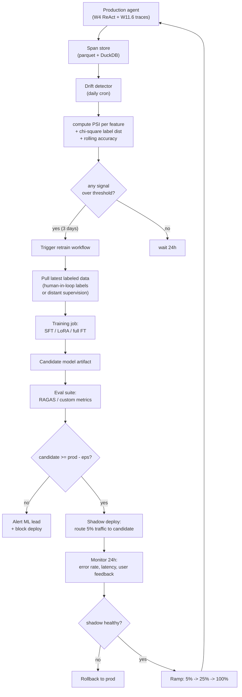
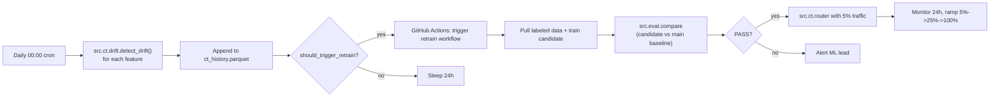

# Week 11.8 — Continuous Training (CT) and MLOps Pipelines

## Exit Criteria

- [ ] Articulate CI vs CD vs **CT** (continuous training) — the third leg most engineers don't know exists
- [ ] Define the four MLOps maturity levels (manual → CI/CD → automated retraining → automated deployment of retrained models)
- [ ] Detect data drift on a feature distribution using PSI (Population Stability Index): $\text{PSI} = \sum_i (p_i - q_i) \ln(p_i / q_i)$
- [ ] Detect model drift via eval-set perplexity / accuracy delta between deployed and shadow models
- [ ] Wire an eval-gated deployment: PR fails if RAGAS faithfulness drops > threshold vs main
- [ ] Implement a retraining trigger rule: 3 consecutive days of PSI > 0.25 → fire retraining workflow
- [ ] Write 3 interview soundbites for JD#3 "production ML + CI/CD/CT automation"

## Why This Week Matters

Most engineering teams understand CI/CD. Very few understand **CT** — Continuous Training — the third leg where a production ML system retrains itself when data or behavior drifts past thresholds. Skipping CT means your agent silently degrades for months until someone notices accuracy is gone. With CT, drift triggers retraining triggers eval gate triggers gradual rollout — automated end-to-end. This chapter wires it: the drift detector, the eval gate, the retraining workflow, the shadow deployment. Built on top of W11.6 tracing (your data source) + W3 RAG eval (your gate). Read AFTER W11.6 (need traces) and W3 (need evals); before W12 (capstone story needs CT to be plausible).

## Theory Primer — CT, MLOps Maturity, Drift

### Concept 1 — CI vs CD vs CT

**CI (Continuous Integration).** Code change → build → run tests → merge if green. Software engineering norm.

**CD (Continuous Deployment).** Code merged → automatic deploy to production. Standard for modern web services.

**CT (Continuous Training).** Production signal (drift, eval failure, scheduled cadence) → automatic retraining → automatic eval gate → automatic deployment. **The signal-driven loop.**

Google's MLOps maturity model:

| Level | Description |
|---|---|
| 0 | Manual: data scientist trains model on laptop; ships pickled file; engineer wraps it in a service. |
| 1 | Automated training pipeline: dataset versioned + training scripted; deploys still manual. |
| 2 | Automated deployment: trained-model artifact triggers infrastructure deploy. |
| 3 | Automated retraining (CT): production signals trigger Level 1+2 automatically. |

Most teams target Level 1 or 2. Level 3 is the senior-engineer-on-resume signal.

### Concept 2 — Drift Types

**Data drift.** Input distribution shifts. Yesterday's user queries had average length 50 tokens; today's average 130. Same model, different inputs.

**Concept drift.** Relationship between input and output shifts. Yesterday "great service!" was positive sentiment; today it's sarcastic. Same input distribution, different correct outputs.

**Label drift.** Output distribution shifts. Yesterday 60% of refund requests approved; today 30%. Could be policy change, could be drift in user behavior.

**Model drift / performance drift.** Model's accuracy on a holdout set degrades over time. Could be downstream effect of data + concept drift.

**Detection methods:**

| Drift type | Detection method | Threshold |
|---|---|---|
| Data drift | PSI per feature | PSI > 0.25 = significant |
| Concept drift | Eval-set accuracy delta | abs delta > 5pp = retrain |
| Label drift | Chi-square test on class distribution | p-value < 0.05 |
| Performance drift | Rolling p95 latency or rolling accuracy | > 10% degradation in 7 days |

### Concept 3 — Population Stability Index (PSI)

PSI compares the distribution of a feature between a reference period $P$ and a current period $Q$:

$$
\text{PSI}(P, Q) = \sum_{i=1}^{B} (p_i - q_i) \ln\!\left(\frac{p_i}{q_i}\right)
$$

where $p_i$ is the proportion of $P$'s observations in bin $i$ and $q_i$ is the same for $Q$. $B$ is the number of bins (typically 10).

**Interpretation:**

| PSI value | Interpretation |
|---|---|
| $< 0.1$ | no significant change |
| $0.1 \leq \text{PSI} < 0.25$ | moderate change; investigate |
| $\geq 0.25$ | significant change; retrain |

PSI is symmetric, additive over bins, and well-behaved on count data. The industry default.

### Concept 4 — Eval-Gated Deployment

Every deploy of a model artifact must pass an eval gate:

$$
\text{deploy iff} \quad \text{eval}_{\text{candidate}} \geq \text{eval}_{\text{prod}} - \epsilon
$$

where $\epsilon$ is the tolerable degradation (typically 1-2 percentage points on the primary metric).

Operationally: PR ships a new model. CI runs eval suite. CI compares candidate metric vs main's last passing metric. PR fails if delta > $\epsilon$. Reviewer can override with explicit justification.

For RAG: primary metric is usually RAGAS faithfulness or answer relevance. For classification: F1 on a held-out set. For agents: task success rate on a curated benchmark.

## Architecture Diagram



## Phase 1 — Build the PSI Drift Detector (~1 hour)

```python
# src/ct/drift.py — PSI-based data drift detector
"""Reads span attributes from the W11.6 parquet log; computes PSI per feature
vs a reference window (e.g., last week). Fires retrain trigger if PSI > 0.25
for 3 consecutive days."""
from __future__ import annotations
import math
import numpy as np
import pandas as pd
import duckdb


def psi(reference: np.ndarray, current: np.ndarray, n_bins: int = 10) -> float:
    """Population Stability Index. Higher = more drift.
    < 0.1 stable; 0.1-0.25 moderate; > 0.25 significant."""
    # Use reference's quantiles to define bins so the comparison is apples-to-apples
    quantiles = np.linspace(0, 1, n_bins + 1)
    bin_edges = np.quantile(reference, quantiles)
    bin_edges[0] = -np.inf
    bin_edges[-1] = np.inf

    ref_counts, _ = np.histogram(reference, bins=bin_edges)
    cur_counts, _ = np.histogram(current, bins=bin_edges)

    # Add tiny epsilon to prevent log(0); standard practice
    ref_prop = (ref_counts + 1e-6) / (ref_counts.sum() + n_bins * 1e-6)
    cur_prop = (cur_counts + 1e-6) / (cur_counts.sum() + n_bins * 1e-6)

    return float(((cur_prop - ref_prop) * np.log(cur_prop / ref_prop)).sum())


def detect_drift(parquet_path: str,
                 reference_days: int = 7,
                 current_days: int = 1,
                 feature: str = "tokens_in") -> dict:
    """Compute PSI between reference window and current window for ONE feature."""
    df = duckdb.sql(f"""
        SELECT timestamp, {feature}
        FROM '{parquet_path}'
        WHERE span_name = 'llm_call'
          AND {feature} IS NOT NULL
    """).df()
    df["timestamp"] = pd.to_datetime(df["timestamp"])

    now = df["timestamp"].max()
    current = df[df["timestamp"] >= now - pd.Timedelta(days=current_days)][feature].values
    reference = df[
        (df["timestamp"] >= now - pd.Timedelta(days=reference_days + current_days)) &
        (df["timestamp"] < now - pd.Timedelta(days=current_days))
    ][feature].values

    if len(current) < 50 or len(reference) < 50:
        return {"feature": feature, "psi": None, "verdict": "insufficient_data"}

    p = psi(reference, current)
    verdict = "stable" if p < 0.1 else "moderate" if p < 0.25 else "significant"
    return {"feature": feature, "psi": round(p, 4), "verdict": verdict,
            "ref_n": len(reference), "cur_n": len(current)}


def should_trigger_retrain(history: list[dict], days_consecutive: int = 3) -> bool:
    """Fire retrain only if PSI > 0.25 for N consecutive daily measurements."""
    if len(history) < days_consecutive:
        return False
    recent = history[-days_consecutive:]
    return all(h.get("verdict") == "significant" for h in recent)
```

**Walkthrough:**

- **Reference quantiles drive bin edges.** Naive equal-width bins would be skewed when the distribution is heavy-tailed; quantile bins give roughly equal counts in reference + makes the comparison interpretable.
- **`1e-6` epsilon prevents `log(0)`** when a bin has zero current observations. Standard PSI implementation detail; don't omit.
- **`should_trigger_retrain` requires N consecutive days.** Reduces false positives from one-day spikes. Production rule: drift detectors that fire on single observations cry wolf; multi-day requirements add discipline.
- **`insufficient_data` verdict matters.** Low-traffic feeds can't compute meaningful PSI; flag explicitly rather than returning a noisy number.

## Phase 2 — Eval-Gated CI Workflow (~1.5 hours)

```yaml
# .github/workflows/eval-gate.yml — runs on every PR
name: Eval Gate
on: pull_request
jobs:
  eval:
    runs-on: ubuntu-latest
    steps:
      - uses: actions/checkout@v4
      - name: Setup Python
        uses: actions/setup-python@v5
        with: {python-version: '3.12'}
      - run: pip install uv && uv sync
      - name: Run RAG eval suite
        env:
          OMLX_BASE_URL: ${{ secrets.OMLX_BASE_URL }}
          OMLX_API_KEY: ${{ secrets.OMLX_API_KEY }}
        run: uv run python -m src.eval.run --output candidate.json
      - name: Fetch main's baseline
        run: |
          gh run download --name eval-baseline-main -D main-eval/ || \
          echo "no baseline yet; treating as PASS"
      - name: Compare metrics
        run: |
          uv run python -m src.eval.compare \
            --candidate candidate.json \
            --baseline main-eval/eval-baseline-main.json \
            --tolerance 0.02 \
            --primary-metric ragas_faithfulness
```

```python
# src/compare.py — eval gate comparator (flat layout per lab-11-8-ct)
"""PR gate: fail if candidate metric drops by more than tolerance vs baseline.
Tolerance is the epsilon in eval_candidate >= eval_prod - epsilon."""
import argparse, json, sys


def main():
    ap = argparse.ArgumentParser()
    ap.add_argument("--candidate", required=True)
    ap.add_argument("--baseline", required=True)
    ap.add_argument("--tolerance", type=float, default=0.02)
    ap.add_argument("--primary-metric", default="ragas_faithfulness")
    args = ap.parse_args()

    cand = json.loads(open(args.candidate).read())
    base = json.loads(open(args.baseline).read())

    c = cand.get(args.primary_metric)
    b = base.get(args.primary_metric)
    if c is None or b is None:
        print(f"missing metric {args.primary_metric}", file=sys.stderr)
        sys.exit(2)

    delta = c - b
    print(f"{args.primary_metric}: candidate={c:.4f} baseline={b:.4f} delta={delta:+.4f}")

    if delta < -args.tolerance:
        print(f"FAIL: degraded by {-delta:.4f} > tolerance {args.tolerance}")
        sys.exit(1)
    print("PASS")


if __name__ == "__main__":
    main()
```

## Phase 3 — Shadow Deployment + Rollback (~1 hour)

```python
# src/router.py — split traffic between prod + candidate (flat layout per lab-11-8-ct)
"""Routing layer: 5% to candidate, 95% to prod. Records both responses + user
feedback so post-hoc analysis can compare beyond just the eval suite."""
import random
import time
from dataclasses import dataclass


@dataclass
class ShadowConfig:
    candidate_traffic_pct: float = 0.05    # 5% to candidate
    enabled: bool = True


SHADOW = ShadowConfig()


def route(prompt: str, prod_call, candidate_call) -> tuple[str, str]:
    """Returns (response, which) where which ∈ {'prod', 'candidate'}.
    Always exercises prod; only exercises candidate per traffic pct."""
    use_candidate = SHADOW.enabled and random.random() < SHADOW.candidate_traffic_pct
    if use_candidate:
        try:
            response = candidate_call(prompt)
            return response, "candidate"
        except Exception:
            # Candidate failure → fall back to prod silently
            pass
    response = prod_call(prompt)
    return response, "prod"
```

## Phase 4 — Putting It Together: the CT Loop (~30 min)



## Bad-Case Journal

*Provenance.* All pre-scoped.

**Entry 1 — PSI fires false alarm during traffic spike.** *(pre-scoped)*
*Symptom:* Marketing pushes a campaign; query distribution changes 5x; PSI > 0.25 trips retrain.
*Root cause:* Drift detector can't distinguish "real distribution shift" from "load test." It just measures shape change.
*Fix:* Add traffic-volume guard: only compute PSI when current-window volume is within 50% of reference volume. Spikes get flagged differently.

**Entry 2 — Eval gate blocks all PRs after one bad baseline.** *(pre-scoped)*
*Symptom:* A regression slipped to main; the next 30 PRs all fail the eval gate because baseline is now bad.
*Fix:* Baseline cleanup process: when main regresses, ML lead manually publishes a new baseline. Or: rolling baseline over last 5 main commits.

**Entry 3 — Shadow candidate has 10x cost; budget burn alarm.** *(pre-scoped)*
*Symptom:* Candidate is a 70B model vs prod's 9B. 5% shadow traffic uses 50% of inference budget.
*Fix:* Pre-shadow cost projection: compute per-token cost delta × expected QPS × shadow_pct × time_window. Add budget gate to shadow rollout: reject if projected daily cost > $X.

**Entry 4 — Drift detected on tokens_in but root cause is upstream parser.** *(pre-scoped)*
*Symptom:* PSI fires on `tokens_in`; investigation reveals an upstream service started double-encoding messages.
*Fix:* Drift detector flags WHICH features changed; the alert routes to the FEATURE OWNER, not blindly to ML team. Cross-team drift attribution is the right ownership boundary.

## Interview Soundbites

**Soundbite 1 — "Walk me through your CI/CD/CT pipeline."**

"Three tiers. CI on every PR: lint, tests, type check — standard software. CD on green main: build container, deploy via Helm to staging then prod, canary-released. CT on production signal: a daily cron computes PSI per feature against a 7-day reference window; if PSI exceeds 0.25 for 3 consecutive days, it triggers a retrain workflow. The retrain pulls latest labeled data, runs SFT or LoRA, produces a candidate artifact. The candidate runs against the full eval suite — RAGAS faithfulness, answer relevance — and compares against main's baseline within a 2-point tolerance. If passes, shadow-deploy at 5% traffic for 24 hours. If shadow stays healthy on error rate and latency, ramp to 25 then 100. The whole loop is automated; ML lead only gets alerted on gate failures or candidate cost > budget."

**Soundbite 2 — "How do you detect drift in production?"**

"PSI for data drift. Computes how different two distributions are over the same feature space; under 0.1 is stable, over 0.25 is significant. I bin by reference-period quantiles so the comparison is apples-to-apples on skewed distributions. Plus chi-square on label distribution for label drift, and rolling 7-day accuracy on a frozen eval set for concept drift. The three together catch most production failures. Critical engineering detail: require 3 consecutive days over threshold before triggering retraining — single-day spikes are usually traffic anomalies not real drift. And combine PSI with traffic-volume guard so load tests don't trip false alarms."

**Soundbite 3 — "What's MLOps Level 3 and why does it matter?"**

"Google's maturity model. Level 0 is manual: data scientist trains on laptop, hands off pickle file. Level 1 automates training pipeline. Level 2 automates model deployment. Level 3 automates RETRAINING — production signals trigger retraining + eval gate + shadow + ramp without human intervention except on gate failures. Most teams sit at Level 1 or 2. Level 3 is what separates production ML from data-science-with-deploy. It matters because without CT, models silently degrade over months as the world shifts under them; with CT, the system maintains itself between human interventions. Senior signal: the candidate who can describe their CT loop has shipped production ML, not just experiments."

## References

- **Sculley et al. (2015).** *Hidden Technical Debt in Machine Learning Systems.* NeurIPS. The "Glue Code, Pipelines, Configuration" paper. Still required reading.
- **Google Cloud MLOps Whitepaper** — the canonical Levels 0-3 framework. Read this before any MLOps interview.
- **Evidently AI docs** — open-source drift detection. PSI implementation + dashboards.
- **MLflow / Weights & Biases / DVC** — model + dataset versioning.
- **Karpathy's "Recipe for Training NN"** — neural-net training discipline. Applies to fine-tuning loops in CT.
- **AWS SageMaker Model Monitor docs** — production reference for the drift-detect-then-trigger pattern.

## Cross-References

- **Builds on:** W3 RAG eval (the gate's metric), W11.6 tracing (the gate's data source)
- **Distinguish from:**
  - *Online learning*: model updates on every request. CT is BATCH retraining triggered by signals; online learning is continuous.
  - *Active learning*: model queries human for labels on uncertain examples. CT can USE active learning but is a broader system pattern.
  - *A/B testing*: compares two PRODUCT variants. Shadow deployment compares two MODEL variants on the same request.
- **Connects to:** W3 (eval gate), W11.6 (drift detector data source), W11.5 security (audit trail for retraining decisions)
- **Foreshadows:** W12 capstone — production-readiness story leans on having a CT loop
