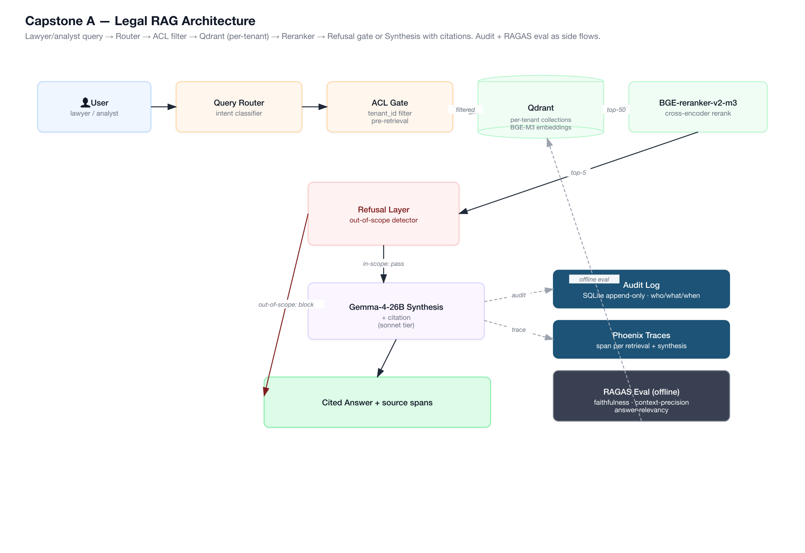
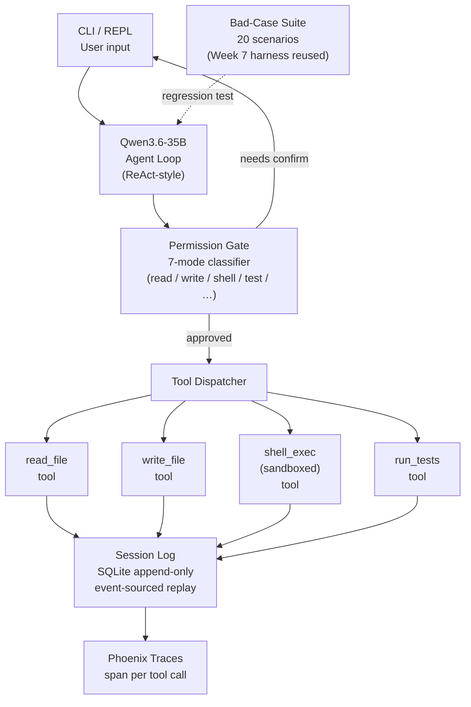
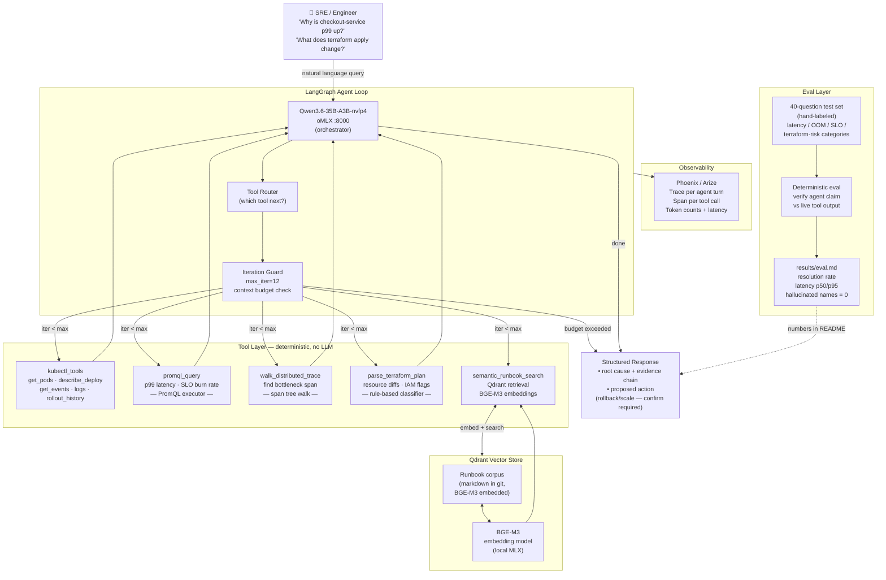
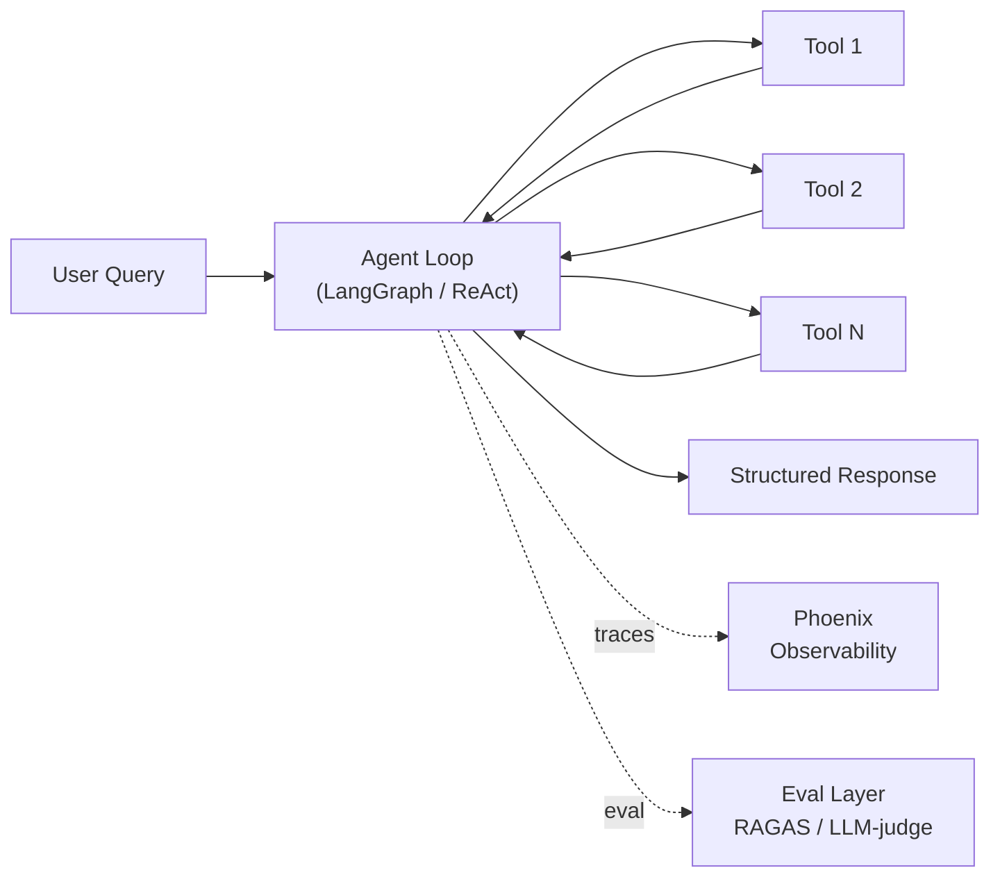
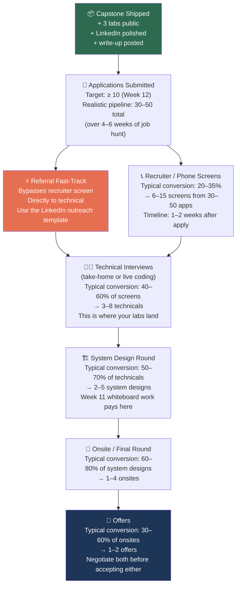

# Week 12 — Capstone & Mocks: Ship Week

---

## Opening: The Only Metric That Matters This Week Is What You Ship

Eleven weeks of private learning just happened. You built a retrieval pipeline, instrumented a ReAct loop, read the Claude Code source map, benchmarked five schema-reliability strategies, and built a faithfulness checker. That is a serious amount of work. None of it is hireable signal until it is public.

This week the metric is not how much you learn. You are done learning new material. The metric is how much you ship. A polished GitHub repo with a README that tells a story in sixty seconds, three lab repos cross-linked, a pinned technical write-up, and ten submitted applications beats twenty private notebooks every single time. Recruiters cannot read your mind. Hiring managers cannot evaluate a folder on your laptop. The work has to be visible, navigable, and legible to someone who has thirty seconds and a lot of other candidates.

Let that land before you open a code editor this week.

The week breaks into seven phases. They are ordered deliberately: pick direction first, then polish the main artifact, then build the supporting evidence layer, then practice talking about it, then make yourself findable, then publish one piece of writing, then apply. If you do them out of order — say, applying before the repos are clean — you waste your best signal.

One more thing before the phases. The output of this week is not a perfect system. It is a hireable story. Those are different. A perfect system with no README, no numbers, and no public presence is invisible. A clearly-scoped, honestly-described system with real numbers and a clean README is compelling. Aim for the second one.

If your README does not tell the story in sixty seconds, you lose. The hiring manager clicks away. The recruiter moves to the next profile. You do not get to explain yourself in a follow-up email. The README is your first interview. Treat it accordingly.

One polished repo with a pinned tweet or LinkedIn post beats twenty private notebooks. Shipping is the discipline. Everything else is preparation.

---

## Goal + Exit Criteria

By end of Week 12, all of the following must be true. These are binary. Either done or not done.

- [ ] **Capstone repo is public** with a README that functions as a tech-design doc: problem statement, constraints, architecture diagram, eval methodology, results with real numbers, tradeoffs, and a "what's next" section.
- [ ] **Three lab repos are public** and cross-linked from the capstone README with a one-paragraph abstract of each lab's key result.
- [ ] **Thirty mock-interview recordings exist** — audio is fine — spread across all six Appendix A categories, each logged in `mocks/log.md` with a one-line "what to tighten."
- [ ] **LinkedIn headline is updated** to reflect your current positioning. Not "cloud infrastructure engineer." Something specific to where you are going.
- [ ] **GitHub pinned repos are set**: capstone + the three labs. Your GitHub profile README has a "currently building" line linking to the capstone.
- [ ] **At least ten applications submitted**, each with a tailored cover note that drops one specific result number from your labs.
- [ ] **One technical write-up posted publicly** — Medium, personal blog, LinkedIn article, it does not matter where. The schema-reliability playbook from Week 8 is the natural choice. Something substantive, something only someone who actually ran the benchmark could write.
- [ ] **Consolidated Agent Benchmark Suite published as `agent-bench/`** — a single `python -m bench` runnable that wraps `lab-03-rag-eval` + `lab-07-tool-harness` + `lab-08-schema-bench` into one run, producing a unified `BENCH.md` leaderboard. This is the artifact senior-level screeners actually grep for — "show me your eval harness" has a single correct answer after this week, and it is a link.

---

## Theory Primer — Four Concepts for Ship Week

> This week is coaching and career, not engineering depth. The primer is intentionally tight. Read it once before you open a code editor. Come back to it before every mock.

---

### Concept 1 — Portfolio as Single-Artifact Story vs Diffused Learning

Most engineers finishing a curriculum have twenty half-built things. That is a liability, not an asset. A hiring manager scanning your GitHub in thirty seconds cannot synthesize a learning arc out of ten partial repos. They will not try. They will leave.

The mental model that fixes this: a portfolio is not a catalogue, it is a single story with supporting evidence. The capstone is the headline. The three labs are footnotes that prove the headline is earned. Everything else is backstory that does not need to be visible.

Eugene Yan has written that the portfolios that get attention are the ones where a single project answers three questions immediately: what did you build, why does it matter, and how do you know it works? If the README requires more than sixty seconds to answer all three, it fails the scan test.

Hamel Husain makes a sharper point in his writing on ML hiring: a project that demonstrates one skill deeply is more credible than a project that gestures at five skills shallowly. Depth signals real work. Breadth on a portfolio signals survey-taking.

**Interview soundbite:** "I have one main artifact — [capstone name]. Everything else on my GitHub points back to it. The three supporting labs each prove one specific claim the capstone README makes."

> **Optional deep dive:** Eugene Yan, "Why I Write" (evanjy.com) — the section on writing as external memory for your thinking applies directly to README discipline.

---

### Concept 2 — README Structure for Engineering Credibility

A README that reads like a project description is a junior signal. A README that reads like a design doc is a senior signal. The difference is structure and specificity.

The sequence that works: **problem → constraints → architecture diagram → eval method → numbers → tradeoffs → what's next.** Each section earns the next. The problem statement earns the right to explain the architecture. The architecture earns the right to explain the eval. The eval earns the right to cite the numbers. The tradeoffs section is where senior engineers live — it shows you understood what you gave up.

The architecture diagram is non-optional in 2026. GitHub renders Mermaid natively. Its absence reads as "I could not be bothered to think structurally about my own system." Its presence — even a modest flowchart — immediately signals that you can communicate system design, which is what staff+ interviewers are screening for in the first two minutes. Every capstone in this curriculum already has a Mermaid diagram. Your job is to make sure the README references it and the diagram is accurate to what you actually shipped.

Missing any section of the seven-part structure raises a specific red flag: no eval method means you do not know if it works; no numbers means you are hiding something; no tradeoffs section means you have not thought past implementation.

**Interview soundbite:** "My README is structured as a design doc: problem, constraints, architecture, how I measured it, what the numbers were, what I traded off, and what I'd do next. The architecture diagram is Mermaid so it renders inline — no PDF, no separate link."

> **Optional deep dive:** Gergely Orosz, "The Software Engineer's Guidebook" ch. on system design communication — the README structure above is a compressed version of his design-doc template.

---

### Concept 3 — Demo GIFs and Screencasts as Commitment Devices

A sixty-second screencast is worth more than any written description. This is not a preference — it is how information moves in 2026 hiring. A recruiter who cannot run your code can watch a GIF. A hiring manager on a mobile screen during a commute can watch a screencast. A written description of a multi-step agent workflow requires them to mentally simulate execution. The GIF removes that friction entirely.

The screencast has a second function: it commits you to a specific claim. You cannot fake a demo the way you can soften a written description. If the agent loops, freezes, or returns garbage, the GIF shows it. That constraint forces you to ship something that actually works rather than something that works in theory.

The most effective demo structure maps directly to the architecture diagram. Each screen moment corresponds to a diagram node. User input hits the router — you see the router fire. The retrieval layer returns chunks — you see the chunks. The synthesis model produces a cited answer — you see the citation. This one-to-one correspondence between diagram and demo is the only reliable way to convert engineering work into interview signal in a visual medium. When a hiring manager has seen both the Mermaid diagram and the screencast, they have mentally run your system. That is the goal.

Practical target: thirty seconds showing a real query, thirty seconds showing the eval dashboard or Phoenix trace for that same query. No voiceover required. Captions optional but useful.

**Interview soundbite:** "There's a sixty-second GIF at the top of the README. It walks through a real query — you can see the retrieval step, the reranker output, and the cited answer. The second half shows the Phoenix trace for the same query so you can see the latency breakdown."

---

### Concept 4 — Job-Hunt Funnel Math and Interview Storytelling

The funnel is brutal and knowable. Realistic conversion rates for a cold application in the current LLM-engineering market: roughly ten applications yield three phone screens, one onsite, and 0.3 offers. That is not pessimism — it is the base rate, and it means you need volume. Ten applications is the floor this week, not the ceiling.

Referrals compress the funnel dramatically. A referred candidate typically skips the resume screen and frequently skips the first recruiter call. One referral is worth approximately five cold applications in expected interview rate. The practical implication: LinkedIn outreach to second-degree connections at target companies is higher-leverage than polishing a cover letter for the twentieth time.

The storytelling problem is simpler but equally important. Interviewers cannot evaluate vague claims. "I built a RAG system that performs well" gives them nothing to anchor on. "I built a RAG pipeline that improved answer faithfulness from 61% to 84% on our internal eval set, measured with RAGAS" gives them a number, a methodology, and a delta — three things they can ask follow-up questions about. Specific numbers beat abstractions in every phone screen and every cover note.

The formula: **"I built X that does Y, measured by Z."** One sentence. One number. Every application cover note should contain a version of this sentence drawn directly from your lab results. Every phone-screen anecdote should start with it. Do not save the number for the onsite.

Harness Book 2 Ch 8 §8.5 offers a complementary ordering principle for people building their own systems that maps cleanly onto this job-hunt sequence. The original Chinese: *"这个顺序看起来不性感，但大致符合事故发生顺序。工程里很多设计顺序，应该按事故出现的先后排，而不是按演示时的好看程度排。"* Translation: "This sequence looks unglamorous, but it roughly follows the order in which failures occur. Many engineering design sequences should be ordered by when problems appear, not by how impressive they look when demonstrated." The same logic applies to the job hunt: do the high-risk steps first (make the artifact public, record the demo, get the numbers in the README), not the comfortable steps (polish the LinkedIn headline, tweak the cover letter template). The failure modes in a job search, like failures in a harness, happen in a predictable order. Mitigate them in that order.

**Interview soundbite:** "My capstone README has one result number front and center: [your specific metric and delta]. Every cover note I send leads with a version of that sentence. I apply in batches of ten, not one at a time — the funnel math requires volume."

> **Optional deep dive:** Gergely Orosz, "How to Get a Software Engineering Job at a Top Tech Company" (newsletter, 2024) — the section on referral conversion rates is the most practically useful calibration available.

---

### Companion Texts — Gulli Cross-References

- **[Gulli *Agentic Design Patterns* Appendix B — From GUI to Real World]** + **[Appendix G — Coding Agents]** — directly relevant to Capstone B. ~30 min
- **[Gulli *Agentic Design Patterns* Appendix E — AI Agents on the CLI]** — reinforces the CLI-agent taxonomy for portfolio framing. ~15 min

## Phase 1 — Pick Your Capstone Direction

### Self-Classify First (30-Second Preamble)

Before reading the three options, classify your instinct against the **five beginner-agent archetypes** (hoeem 2026). Each archetype has a dominant success pattern; your capstone should lean into one primary archetype rather than spreading across all five.

| Archetype | What the agent does | Matches curriculum capstone |
|---|---|---|
| **Research** | Gathers + summarizes with citations | Capstone A |
| **Content** | Writes / rewrites / transforms text | *(none — not covered)* |
| **Workflow** | Follows repeatable business process | Capstone C (SRE agent) |
| **Personal-Knowledge** | Answers from your own documents | Capstone A |
| **Operator** | Takes actions in an environment | Capstone B (coding agent) + Capstone C |

If your gut answer is "Research/Personal-Knowledge" → Capstone A. "Operator + safety discipline" → Capstone B. "Workflow + Operator with incident-response flavor" → Capstone C (recommended for you). If it falls outside these three, reshape your idea into the closest match — do not invent a fourth capstone this late.

### The Three Options

The curriculum gives you three capstone options. They are not equally strong for your situation. Choose deliberately, not randomly.

**Capstone A — Enterprise Doc-Q&A (RAG-leaning)**

Multi-tenant RAG for a fictional law firm. Per-tenant ACL on retrieval. Citation-required answers. Refusal on out-of-scope. Audit log. This is the safest portfolio piece — every hiring manager understands a document Q&A system. It is also the most crowded. Dozens of candidates show up with a RAG chatbot. Unless yours has the ACL layer, the eval dashboard, and numbers that prove it works, it blends into background noise.

Best fit for: job postings that emphasize RAG, information retrieval, or enterprise knowledge management. If you are targeting companies building knowledge-base products, legal tech, or compliance tooling, this is the right choice. It is harder to make distinctive if you are going after generalist agent roles.

Scoring: retrieval depth ✓✓✓, agent patterns ✓, infra story ✗, differentiation ✓ (if ACL + eval dashboard land)

#### Capstone A — Architecture Diagram



> *Diagram source: [`diagrams/week-12/gen_capstone_a_legal_rag.py`](https://github.com/shaneliuyx/agent-prep/blob/main/diagrams/week-12/gen_capstone_a_legal_rag.py) — regenerable Python script.*

> **Polish tip:** The ACL gate and audit log are what separates Capstone A from a generic RAG chatbot. If your diagram does not show both, your README is not telling the right story.

**Capstone B — Coding Agent (Claude Code style)**

A minimal coding agent: read/write files, run shell, run tests, permission model, append-only session log. A working replica of the core Claude Code loop at small scale. The Week 4 and Week 6 work feeds directly into this.

Best fit for: dev-tools companies, AI coding assistant roles, infrastructure-adjacent agent roles. Strong technical signal because you have to get the permission model right and the session-replay mechanism right. Harder to demo in sixty seconds because "it writes code" requires showing a full loop.

Scoring: retrieval depth ✗, agent patterns ✓✓✓, infra story ✗, differentiation ✓✓ (if permission model and session replay are polished)

#### Capstone B — Architecture Diagram



> **Interview angle:** "The permission gate is not a prompt instruction — it is a deterministic code path that the model cannot override. That distinction is what makes this safe to demo in a live interview without fear of a dangerous shell command escaping."

**Capstone C — Infra-Aware SRE Agent (your infra story) — Recommended**

An agent that reads the Kubernetes API, Prometheus metrics, distributed traces, Terraform plan output, and an embedded runbook corpus to answer questions like "why is `checkout-service` p99 latency up in the last hour?" or "what will `terraform apply` change in prod — and are any of those changes risky?" or "why did the `payments-api` pod OOM at 03:17 UTC?" The agent walks structured observability artifacts, forms a hypothesis, verifies it deterministically, and proposes an actionable fix — rollback, scale, or runbook remediation.

Best fit for: any agent or LLM engineering role where the company runs Kubernetes in production — which is essentially every company with a serious backend. This is also the role where your three years of Kubernetes, Terraform, and observability experience is an unfair advantage rather than something you have to overcome or explain away.

Scoring: retrieval depth ✓✓ (runbook corpus in Qdrant), agent patterns ✓✓✓ (hypothesis → verify loop), infra story ✓✓✓, differentiation ✓✓✓

#### Capstone C — Architecture Diagram (Reference — Your README Must Match This)

This is the target architecture. If your README diagram does not contain every major node shown here, the capstone is not finished. Use this as a visual checklist.



> **Common mistake:** Building the system without wiring Phoenix traces. The trace screenshots in `results/traces/` are not decoration — they are the evidence that the agent loop actually ran. An architecture diagram without trace screenshots to back it is a claim without proof.

> **Screencast mapping:** When you record the 60-second demo GIF, mentally map each screen moment to a node in this diagram. Terminal prompt → User node. First tool call logged → k8s_client or promql_executor. "Walking trace..." log line → trace_walker. Final answer printed → Output node. The diagram and the screencast should be telling the same story from different angles.

### Why Capstone C Is the Recommendation for You Specifically

You have three years as a cloud infrastructure engineer — Kubernetes, Terraform, observability, SRE. That background is not a liability in the agent / LLM space — it is extremely rare. Most LLM engineers come from ML or software engineering backgrounds. They do not know that Kubernetes exposes a rich events and resource API. They do not know that PromQL is the lingua franca of metrics queries. They do not know that a distributed trace is a structured artifact — a tree of spans — that can be walked programmatically to find the slowest dependency.

You do. And an agent that natively understands that world is something you can build credibly, explain fluently in an interview, and demo concretely. When an interviewer asks "tell me about a system you built," you can say: "I built an agent that takes a natural-language question from an SRE — something like 'why did `payments-api` OOM at 03:17 UTC?' — and pulls Kubernetes pod events, memory metrics from Prometheus, and recent deploy history, then identifies the likely cause and proposes either a rollback or a replica-scale action with explicit human confirmation required before any write." That answer is specific. It is memorable. It is differentiated. Nobody else in the candidate pool has that exact story.

Capstone C is also the correct fit for the Week 11 system design you rehearsed: the infra-aware SRE agent was system design #5, listed explicitly as "your differentiator." The capstone should be the system you know best, and you spent two hours designing this one out loud.

The stack: Qwen3.6-35B-A3B-nvfp4 via oMLX as the agent backbone (strongest open tool-calling as of 2026), tools for `kubectl_get_pods`, `promql_query`, `walk_distributed_trace`, `parse_terraform_plan`, `fetch_pagerduty_incident`, and `semantic_runbook_search`; Qdrant for the embedded runbook corpus (BGE-M3); LangGraph for the agent state machine; Phoenix for traces.

> **Interview angle:** "I built this because SRE teams are the most underserved audience for agent tooling. They already have rich structured observability data — Kubernetes API, Prometheus, distributed traces, Terraform plan JSON — that an agent can reason over deterministically. Most LLM engineers don't know this infrastructure exists, let alone how to query it. I do, because I ran it for three years."

> **Job-hunt reality:** Capstone C targets the broadest set of agent roles while using the narrowest and most defensible background. That asymmetry is exactly what you want. Your infra experience is not a pivot story — it is a superpower story.

---

## Phase 2 — Capstone Polish Checklist

### Recommended: Drive This Checklist Through agent-skills

If you installed **[agent-skills](https://github.com/addyosmani/agent-skills)** in Week 0 Phase 8.5 (if you didn't, install it now — takes 30 seconds), use the slash commands below to enforce discipline on each polish area. Each command refuses to proceed until the named skill's verification criteria pass — it is discipline-as-code, much harder to cut corners than working through a checklist manually.

| Polish area | Slash command | Backing skill(s) | What it enforces |
|---|---|---|---|
| **Before code** | `/spec` | spec-driven-development | Written objectives, commands, structure, style, test approach, boundaries in a PRD — before any implementation |
| **Task breakdown** | `/plan` | planning-and-task-breakdown | Decompose spec into small verifiable units with acceptance criteria + dependency ordering |
| **Build iteratively** | `/build` | incremental-implementation + test-driven-development + context-engineering | Thin vertical slices with implement-test-verify-commit cycles; Red-Green-Refactor discipline; feature flags and rollback safety |
| **Verify it works** | `/test` | browser-testing-with-devtools + debugging-and-error-recovery | Live runtime inspection via Chrome DevTools MCP; 5-step debug triage (reproduce → localize → reduce → fix → guard) |
| **Review quality** | `/review` | code-review-and-quality + code-simplification + security-and-hardening + performance-optimization | Five-axis review criteria; change-size enforcement (~100 lines); OWASP Top 10; Core Web Vitals targets; Chesterton's Fence before removing anything |
| **Ship** | `/ship` | git-workflow-and-versioning + ci-cd-and-automation + deprecation-and-migration + documentation-and-ADRs + shipping-and-launch | Trunk-based development; atomic commits; Shift Left + Faster is Safer CI/CD; pre-launch checklists; staged rollouts; rollback procedures; ADR-backed decisions |

**Why this matters for your portfolio.** The hand-written checklist below covers the same ground in prose. Running it through agent-skills does three additional things: (1) produces verifiable artifacts (every `/ship` leaves a trail of traces that say "these gates passed"), (2) frames your capstone as *"shipped using agent-skills"* — a specific, recognizable tool-usage claim — rather than *"I tried to follow best practices"*, and (3) catches the last 10% of polish issues a human reader would skip past. Hiring managers at dev-tools, developer-experience, and AI-coding-assistant companies know this repo (21.8k⭐); citing its discipline in your README and interview answers is a direct senior-signal amplifier.

### The Manual Checklist (run-through even if you used agent-skills)

Work through this list in order. Each item is a line in your pre-flight checklist. Do not mark the repo done until every item is checked.

### README Structure (The 60-Second Test)

The README must pass the 60-second test: a stranger clicks on your repo, reads the top of the README for 60 seconds, and understands what the system does, why it matters, and what you measured. If it fails this test, it does not matter how good the code is.

- [ ] **H1 headline** — one sentence that names what the agent does and for whom. "An agent that answers SRE questions by walking Kubernetes, Prometheus, and distributed traces." Not "my capstone."
- [ ] **One-paragraph problem statement** — what real pain does this solve? Write it from the perspective of the SRE who asks the question, not the engineer who built the system.
- [ ] **Constraints section** — what are the hard limits? Context budget, latency target, cost budget, scope boundaries. Constraints show engineering maturity. A system without stated constraints is a prototype.
- [ ] **Architecture diagram** — embed the Mermaid diagram from Phase 1 directly in the README. GitHub renders Mermaid natively in markdown. The diagram is not optional. If it is missing, the README fails the 60-second test. Here is the minimal structural template every capstone README should embed — customize the nodes for your specific capstone:



Replace the tool nodes with your actual tools. Add your vector store as a subgraph if it is part of the loop. The diagram lives immediately after the problem statement — before any installation instructions. A reader should see the architecture before they see a single line of code.
- [ ] **Eval section** — how did you measure whether it works? Describe your test set (how many questions, what categories), your judge (LLM-as-judge with what rubric, or hand-labeled), and your results. This is the section most candidates skip. Don't skip it.
- [ ] **Results numbers** — at least three concrete numbers. Examples: "87% of latency-spike questions resolved correctly on a 40-question test set," "median end-to-end latency 4.2s," "zero hallucinated service names on the 40-question set." Numbers don't need to be large. They need to be honest and specific.
- [ ] **Tradeoffs section** — what did you choose not to do, and why? "I used a mock Kubernetes API rather than live integration because the goal was to show agent reasoning, not cluster plumbing." Tradeoffs show judgment. Every senior engineer reads this section first.
- [ ] **What's next** — two or three concrete next steps if you had another two weeks. "Add real PagerDuty webhook integration for live incident ingestion," "support multi-cluster routing in kubectl_tools," "add a confidence-score output per tool call." This shows you think beyond the current scope.

### Code Quality

- [ ] **`make setup` one-liner** — `make setup` should install all dependencies and configure environment variables with sane defaults. If a hiring manager clones your repo and `make setup` fails, you lose. Test it in a fresh directory before publishing.
- [ ] **`make eval`** returns a green result with your numbers. The evaluator should be runnable without credentials if you use a mock data layer.
- [ ] **Pinned "start here" issue** — create one GitHub issue titled "Start Here" that explains what the agent does, links to the README sections, and describes the demo scenario. This is the first thing someone sees when they click Issues. It signals that you thought about the reader experience.
- [ ] **Clear license** — MIT unless you have a reason for something else. No license = legal ambiguity = some hiring managers skip it.
- [ ] **`results/` directory** — contains your eval numbers, screenshots of Phoenix traces, and any comparison tables. Cross-link from the README. This is the evidence layer.

### Observability Artifacts

- [ ] **Screenshots of Phoenix traces** showing at least one full multi-turn agent loop — the tool calls, the tool results, the token counts, the latency per span. Put these in `results/traces/`. Annotate them: "tool call 3 is where the trace walker is invoked" in the README or as image captions.
- [ ] **60-second demo GIF or screencast** — use QuickTime, ffmpeg, or any screen recorder. Show the agent answering "why did `payments-api` OOM at 03:17 UTC?" from a terminal or simple CLI. Crop it tight. Silence is fine. Put it at the top of the README just below the headline. This is the single highest-leverage thirty minutes you will spend this week. A GIF embedded in a README converts passive readers into engaged ones.

### Code Walkthroughs — Polish Scripts

These three scripts are not part of the agent itself. They are the tooling that makes the repo reviewer-ready. Build them in a `scripts/` directory. They take thirty to ninety minutes each and pay back that time every time a recruiter or engineer looks at your repo.

#### Script 1 — `scripts/aggregate_results.py` — Results Aggregator

**Purpose:** Reads all `RESULTS.md` files from lab-07, lab-08, lab-09, and the capstone, extracts the key numbers, and writes a single `results/summary.md` with a consolidated table. This is what you link to from the capstone README as your "evidence layer."

```python
### Code walkthrough

# scripts/aggregate_results.py
#
# Usage: python scripts/aggregate_results.py
# Output: results/summary.md

import re
from pathlib import Path

# ── 1. Locate all RESULTS.md files ───────────────────────────────────────────
LAB_ROOTS = [
    Path("../lab-07-tool-harness"),
    Path("../lab-08-schema-bench"),
    Path("../lab-09-faithfulness-checker"),
    Path("."),  # capstone itself
]

# ── 2. Extract a "Numbers Shipped" table from each file ──────────────────────
# Convention: look for a markdown table under the heading "## Numbers Shipped"
# This matches the RESULTS.md template from the curriculum.

TABLE_HEADER = re.compile(r"##\s+Numbers Shipped")
TABLE_ROW    = re.compile(r"^\|\s+(.+?)\s+\|\s+(.+?)\s+\|\s+(.+?)\s+\|$")

def extract_numbers(path: Path) -> list[dict]:
    if not path.exists():
        return []
    text = path.read_text()
    rows = []
    in_table = False
    for line in text.splitlines():
        if TABLE_HEADER.search(line):
            in_table = True
            continue
        if in_table:
            m = TABLE_ROW.match(line)
            if m:
                artifact, metric, value = m.groups()
                # skip the header separator row (---|---|---)
                if not artifact.startswith("-"):
                    rows.append({"artifact": artifact,
                                 "metric": metric,
                                 "value": value,
                                 "source": str(path.parent.name)})
            elif line.startswith("#"):
                break  # moved past the table section
    return rows

# ── 3. Aggregate and write summary ───────────────────────────────────────────
all_rows: list[dict] = []
for root in LAB_ROOTS:
    results_file = root / "RESULTS.md"
    all_rows.extend(extract_numbers(results_file))

out = Path("results/summary.md")
out.parent.mkdir(exist_ok=True)

lines = [
    "# Portfolio Numbers — Consolidated",
    "",
    "| Source | Artifact | Metric | Value |",
    "|--------|----------|--------|-------|",
]
for r in all_rows:
    lines.append(f"| {r['source']} | {r['artifact']} | {r['metric']} | {r['value']} |")

out.write_text("\n".join(lines))
print(f"Wrote {len(all_rows)} rows to {out}")
```

**What to check after running:** Open `results/summary.md` and confirm every lab contributes at least three rows. If a lab has zero rows, its `RESULTS.md` does not follow the `## Numbers Shipped` table convention — go fix the lab file first.

---

#### Script 2 — `scripts/audit_mocks.py` — Mock-Interview Audit

**Purpose:** Reads `mocks/log.md`, parses the table, and prints a coverage report — how many questions per category, which categories are under-represented, and which answers still have an empty "what to tighten" field (a sign you have not listened back yet).

```python
### Code walkthrough

# scripts/audit_mocks.py
#
# Usage: python scripts/audit_mocks.py
# Output: printed report to stdout

import re
import sys
from collections import defaultdict
from pathlib import Path

LOG = Path("mocks/log.md")

if not LOG.exists():
    print("mocks/log.md not found. Create it and start recording.")
    sys.exit(1)

# Expected table columns:
# | # | Category | Question | Date | Duration | What to tighten |
ROW = re.compile(
    r"^\|\s*(\d+)\s*\|\s*(.+?)\s*\|\s*(.+?)\s*\|\s*(.+?)\s*\|\s*(.+?)\s*\|\s*(.+?)\s*\|$"
)

CATEGORIES = ["RAG", "Agent Patterns", "Hallucination/Eval",
              "Tool Use", "Schema Reliability", "System Design"]

TARGET = 30
counts: dict[str, int] = defaultdict(int)
missing_tighten: list[str] = []
total = 0

for line in LOG.read_text().splitlines():
    m = ROW.match(line)
    if not m:
        continue
    num, category, question, date, duration, tighten = m.groups()
    if num == "#":       # header row
        continue
    if category.startswith("-"):  # separator row
        continue
    counts[category.strip()] += 1
    total += 1
    if not tighten.strip() or tighten.strip() == "—":
        missing_tighten.append(f"  Q{num}: {question[:60]}")

# ── Report ────────────────────────────────────────────────────────────────────
print(f"\n=== Mock Audit Report ===")
print(f"Total recorded: {total} / {TARGET}  {'✓' if total >= TARGET else '✗ INCOMPLETE'}")
print()
print("Coverage by category:")
for cat in CATEGORIES:
    n = counts.get(cat, 0)
    bar = "█" * n + "░" * max(0, 6 - n)
    flag = "  ← THIN" if n < 4 else ""
    print(f"  {cat:<22} {bar}  ({n}){flag}")

if missing_tighten:
    print(f"\nAnswers with no 'what to tighten' note ({len(missing_tighten)}):")
    for line in missing_tighten:
        print(line)
    print("  → Listen back to these before your next interview.")
else:
    print("\nAll recorded answers have tighten notes. ✓")
```

**What to check after running:** Every category should show at least four recordings. Schema Reliability should show exactly five (it is your signature — do not let it drop below five). Any answer with an empty "what to tighten" field means you recorded it but have not listened back. Listen back before you apply.

---

#### Script 3 — `scripts/readme_check.py` — README Completeness Checker

**Purpose:** Programmatically checks that the capstone README contains all required sections before you make the repo public. Runs in CI or as a pre-push check.

```python
### Code walkthrough

# scripts/readme_check.py
#
# Usage: python scripts/readme_check.py
# Exit code 0 = pass, 1 = fail (safe to use in CI)

import re
import sys
from pathlib import Path

README = Path("README.md")

if not README.exists():
    print("ERROR: README.md not found.")
    sys.exit(1)

text = README.read_text()

# ── Required sections (heading-level 2) ──────────────────────────────────────
REQUIRED_HEADINGS = [
    "Problem",
    "Architecture",
    "Eval",
    "Results",
    "Tradeoffs",
]

# ── Required content signals ──────────────────────────────────────────────────
REQUIRED_SIGNALS = {
    "Mermaid diagram":   r"```mermaid",
    "Constraints":       r"[Cc]onstraint",
    "A number (%)":      r"\d+%",
    "A number (ms or s)":r"\d+\s*(ms|s\b)",
    "make setup":        r"`make setup`",
    "results/ link":     r"results/",
    "Lab cross-link":    r"lab-0[789]",
    "License":           r"\[MIT\]|MIT License|LICENSE",
}

errors: list[str] = []
warnings: list[str] = []

# Check headings
for heading in REQUIRED_HEADINGS:
    pattern = rf"^#+\s+.*{heading}.*$"
    if not re.search(pattern, text, re.MULTILINE | re.IGNORECASE):
        errors.append(f"Missing section: '{heading}'")

# Check signals
for label, pattern in REQUIRED_SIGNALS.items():
    if not re.search(pattern, text):
        if label in ("Mermaid diagram", "A number (%)", "make setup"):
            errors.append(f"Missing required content: {label}")
        else:
            warnings.append(f"Possibly missing: {label}")

# ── Report ─────────────────────────────────────────────────────────────────────
if errors:
    print("README CHECK FAILED")
    for e in errors:
        print(f"  [ERROR] {e}")
    for w in warnings:
        print(f"  [WARN]  {w}")
    sys.exit(1)
else:
    print("README CHECK PASSED")
    for w in warnings:
        print(f"  [WARN]  {w}")
    print(f"  {len(REQUIRED_HEADINGS)} required sections found.")
    print(f"  {len(REQUIRED_SIGNALS) - len(warnings)} / {len(REQUIRED_SIGNALS)} content signals found.")
    sys.exit(0)
```

**Wire into Makefile:**

```makefile
# Add to your capstone Makefile:

check-readme:
	python scripts/readme_check.py

setup:
	uv pip install -r requirements.txt
	cp .env.example .env

eval:
	python src/eval_runner.py

.PHONY: check-readme setup eval
```

Run `make check-readme` before every push. If it fails, the README is not done. This is not bureaucracy — it is the same discipline as running tests before shipping.

> **Go harder:** Add `make check-readme` as a pre-push git hook so it runs automatically. `echo "make check-readme" >> .git/hooks/pre-push && chmod +x .git/hooks/pre-push`. You cannot push a broken README by accident.

### Portfolio Safety

> **Polish tip:** Before making the repo public, run a global search for any reference to `gemma-4-26B-A4B-it-heretic-4bit`, `JANG_4M-CRACK`, or `heretic` in your code, README, or RESULTS.md. Replace all model references with `Qwen3.6-35B-A3B-nvfp4` (tool-calling backbone) and `gpt-oss-20b-MXFP4-Q8` (haiku tier). The community-uncensored variants are fine for self-study; they are not fine for a portfolio repo that a hiring manager will read.

- [ ] **All model references use portfolio-safe names** — Qwen3.6-35B-A3B-nvfp4 or gpt-oss-20b-MXFP4-Q8. No heretic, no JANG, no CRACK.
- [ ] **No API keys or credentials in any file** — including `.env.example`. Use `YOUR_KEY_HERE` placeholders.
- [ ] **`.gitignore` covers** `.env`, `*.key`, `~/.omlx/settings.json` patterns.

### Footer and Credits

- [ ] **Footer section in README** crediting the 2026 references that shaped the architecture: Anthropic "Building effective agents" (Sept 2024 + 2026 update), the Claude Code architecture analyses (bits-bytes-nn March 2026, VILA-Lab GitHub, DEV.to architecture explainer), and the Outlines / Instructor / XGrammar libraries. This is not sycophancy — it is intellectual honesty and it signals that you read primary sources, not just Medium tutorials.

> **Common mistake:** Skipping the eval section because the numbers feel small or mixed. Honest numbers with a clear methodology are always better than no numbers. "My agent resolved 28 of 40 test questions correctly; the 12 failures clustered around multi-cluster trace correlation queries, which I have not implemented yet" is a stronger signal than silence. It shows you know what you measured and what you have not.

---

## Phase 2B — Consolidated Agent Benchmark Suite (~3 hours)

> **Why this phase exists.** You have already done 80 % of this work — `lab-03-rag-eval` has RAGAS numbers, `lab-07-tool-harness` has a 20-scenario tool-reliability scorecard, `lab-08-schema-bench` has 25 cells of schema-validity percentages. What you don't yet have is **one runnable that wraps all three and produces a single unified leaderboard**. That single runnable is a disproportionately strong interview signal: when a staff-level engineer asks "how do you evaluate your agents?" the correct answer in 2026 is a link to a repo, not a conversation. `agent-bench/` is that link.

### 2B.0 Topology — how the pieces fit

```mermaid
flowchart TB
    subgraph BENCH[agent-bench/ &#40;thin wrapper repo&#41;]
        MAIN[bench/__main__.py<br/>--all / --rag / --tools / --schema]
        RAG_ADPT[bench/rag.py<br/>~30-line adapter]
        TOOL_ADPT[bench/tools.py<br/>~30-line adapter]
        SCHEMA_ADPT[bench/schema.py<br/>~30-line adapter]
        LEADER[write_leaderboard&#40;&#41;<br/>→ results/BENCH.md]
    end

    subgraph SUBMODULES[ext/ &#40;git submodules — commit-pinned&#41;]
        LAB3[ext/lab-03-rag-eval<br/>RAGAS harness]
        LAB7[ext/lab-07-tool-harness<br/>20-scenario runner]
        LAB8[ext/lab-08-schema-bench<br/>5-strategy × 3-schema bench]
    end

    subgraph OUTPUT[results/]
        RUNJSON[run.json<br/>full structured output]
        BENCHMD[BENCH.md<br/>human-readable leaderboard]
    end

    subgraph CAPSTONE[capstone repo]
        README[README.md<br/>'see eval harness' link]
    end

    MAIN --> RAG_ADPT --> LAB3
    MAIN --> TOOL_ADPT --> LAB7
    MAIN --> SCHEMA_ADPT --> LAB8

    RAG_ADPT -->|normalised dict| LEADER
    TOOL_ADPT -->|normalised dict| LEADER
    SCHEMA_ADPT -->|normalised dict| LEADER

    LEADER --> RUNJSON
    LEADER --> BENCHMD
    README -.links to.-> BENCHMD

    style MAIN fill:#4a90d9,color:#fff
    style LEADER fill:#f5a623,color:#fff
    style LAB3 fill:#27ae60,color:#fff
    style LAB7 fill:#27ae60,color:#fff
    style LAB8 fill:#27ae60,color:#fff
    style BENCHMD fill:#9b59b6,color:#fff
    style README fill:#2ecc71,color:#fff
```



Three properties the diagram makes explicit: **(a)** the three labs are *submodules, not copies* — reproducibility is a consequence of the topology, not discipline; **(b)** each adapter is the only place the sub-lab's API surface is coupled — if lab-08 renames its entry point, only `bench/schema.py` changes; **(c)** the capstone README points to `BENCH.md`, not to the wrapper repo, because the artifact hiring managers actually click on is the rendered leaderboard.

### Exit criteria

- [ ] `agent-bench/` repo exists, public, with a README that explains what it measures and why.
- [ ] `python -m bench --all` runs end-to-end and writes `results/BENCH.md`.
- [ ] `BENCH.md` has three sections: RAG (from Week 3), Tool Reliability (from Week 7), Schema Reliability (from Week 8), plus a top-line "Leaderboard" table.
- [ ] The capstone README links to `agent-bench/` as "see eval harness."

### 2B.1 Repo scaffold

```bash
mkdir -p ~/code/agent-prep/agent-bench/{bench,results,data}
cd ~/code/agent-prep/agent-bench
uv venv --python 3.11 && source .venv/bin/activate
uv pip install ragas pydantic openai qdrant-client tqdm rich
touch bench/__init__.py
```

Pin the three lab repos as git submodules so `agent-bench` stays a thin wrapper, not a fork:

```bash
git init
git submodule add ../lab-03-rag-eval        ext/lab-03-rag-eval
git submodule add ../lab-07-tool-harness    ext/lab-07-tool-harness
git submodule add ../lab-08-schema-bench    ext/lab-08-schema-bench
```

> **Why submodules, not copies:** benchmarks drift the moment you copy code out of its home repo. Submodules pin to a specific commit — when you re-run `agent-bench` six months from now, the numbers are reproducible because every underlying lab is locked to the exact code that produced them.

### 2B.2 The wrapper — `bench/__main__.py`

```python
"""python -m bench [--all | --rag | --tools | --schema]

Each sub-benchmark is a thin wrapper that imports its source lab, runs the
existing evaluation, and normalises the output to a common schema so the
leaderboard aggregator can merge them.
"""
import argparse, json, sys, time
from pathlib import Path
from rich.console import Console
from rich.table import Table

from bench.rag    import run_rag_bench
from bench.tools  import run_tool_bench
from bench.schema import run_schema_bench

console = Console()
RESULTS_DIR = Path("results"); RESULTS_DIR.mkdir(exist_ok=True)


def main():
    ap = argparse.ArgumentParser()
    ap.add_argument("--all",    action="store_true")
    ap.add_argument("--rag",    action="store_true")
    ap.add_argument("--tools",  action="store_true")
    ap.add_argument("--schema", action="store_true")
    args = ap.parse_args()

    if not any([args.all, args.rag, args.tools, args.schema]):
        ap.print_help(); sys.exit(1)

    run = {"timestamp": time.time(), "sections": {}}

    if args.all or args.rag:
        console.rule("[bold cyan]RAG bench")
        run["sections"]["rag"] = run_rag_bench()

    if args.all or args.tools:
        console.rule("[bold cyan]Tool-reliability bench")
        run["sections"]["tools"] = run_tool_bench()

    if args.all or args.schema:
        console.rule("[bold cyan]Schema-reliability bench")
        run["sections"]["schema"] = run_schema_bench()

    (RESULTS_DIR / "run.json").write_text(json.dumps(run, indent=2, default=str))
    write_leaderboard(run)
    console.rule("[bold green]Wrote results/BENCH.md")


def write_leaderboard(run: dict) -> None:
    """Turn the normalised section outputs into a single BENCH.md leaderboard."""
    lines = [
        "# Agent Benchmark Suite",
        "",
        f"_Last run: {time.strftime('%Y-%m-%d %H:%M:%S')}_",
        "",
        "## Leaderboard (headline numbers)",
        "",
        "| Dimension | Metric | Score | Source |",
        "|---|---|---:|---|",
    ]

    if "rag" in run["sections"]:
        r = run["sections"]["rag"]
        lines += [
            f"| RAG | Faithfulness      | {r['faithfulness']:.3f} | lab-03 |",
            f"| RAG | Context precision | {r['context_precision']:.3f} | lab-03 |",
            f"| RAG | Answer relevancy  | {r['answer_relevancy']:.3f} | lab-03 |",
        ]
    if "tools" in run["sections"]:
        t = run["sections"]["tools"]
        lines += [
            f"| Tools | Scenarios passed   | {t['passed']}/{t['total']} | lab-07 |",
            f"| Tools | p95 tool latency   | {t['p95_latency_s']:.2f}s | lab-07 |",
            f"| Tools | Retry rate         | {t['retry_rate']:.1%} | lab-07 |",
        ]
    if "schema" in run["sections"]:
        s = run["sections"]["schema"]
        lines += [
            f"| Schema | Winning strategy   | **{s['winner']}** | lab-08 |",
            f"| Schema | Best semantic valid %  | {s['best_valid_pct']:.1%} | lab-08 |",
            f"| Schema | Winner p95 latency | {s['winner_p95_s']:.2f}s | lab-08 |",
        ]

    for name in ("rag", "tools", "schema"):
        section = run["sections"].get(name)
        if not section: continue
        lines += ["", f"## {name.upper()} detail", "", "```json",
                  json.dumps(section, indent=2, default=str), "```"]

    Path("results/BENCH.md").write_text("\n".join(lines) + "\n")

    # Also print a Rich table to stdout for the live run
    tbl = Table(title="Leaderboard", show_lines=True)
    tbl.add_column("Dimension"); tbl.add_column("Metric"); tbl.add_column("Score", justify="right")
    for ln in lines[6:]:
        if ln.startswith("| ") and "---" not in ln and ln.count("|") >= 4:
            parts = [p.strip() for p in ln.strip("|").split("|")]
            if len(parts) >= 3 and parts[0] not in ("Dimension",):
                tbl.add_row(parts[0], parts[1], parts[2])
    console.print(tbl)


if __name__ == "__main__":
    main()
```

### 2B.3 The three section adapters

Each adapter is ~30 lines — it imports from the submodule, runs the existing eval, and returns a dict with the canonical keys the leaderboard expects.

```python
# bench/rag.py
"""Wrap lab-03-rag-eval — returns RAGAS-style aggregate scores."""
import sys
from pathlib import Path
sys.path.insert(0, str(Path("ext/lab-03-rag-eval/src").resolve()))

def run_rag_bench() -> dict:
    from eval_harness import run as lab_run        # adjust to lab-03's entry point
    scores = lab_run()                              # -> {"faithfulness": ..., ...}
    return {
        "faithfulness":       scores.get("faithfulness",       0.0),
        "context_precision":  scores.get("context_precision",  0.0),
        "answer_relevancy":   scores.get("answer_relevancy",   0.0),
        "questions_scored":   scores.get("n",                  0),
    }
```

```python
# bench/tools.py
"""Wrap lab-07-tool-harness — returns scenario pass-rate + latency stats."""
import sys, json
from pathlib import Path
sys.path.insert(0, str(Path("ext/lab-07-tool-harness/src").resolve()))

def run_tool_bench() -> dict:
    from runner import run_all_scenarios           # adjust to lab-07's entry point
    report = run_all_scenarios()
    return {
        "passed":        report["passed"],
        "total":         report["total"],
        "p95_latency_s": report["p95_latency_s"],
        "retry_rate":    report["retry_rate"],
    }
```

```python
# bench/schema.py
"""Wrap lab-08-schema-bench — returns the winning strategy + its headline numbers."""
import sys, json
from pathlib import Path
sys.path.insert(0, str(Path("ext/lab-08-schema-bench/src").resolve()))

def run_schema_bench() -> dict:
    from bench_runner import run_all_strategies    # adjust to lab-08's entry point
    rows = run_all_strategies()                     # list[dict]
    rows.sort(key=lambda r: (-r["valid_pct"], r["p95_s"]))
    winner = rows[0]
    return {
        "winner":         winner["strategy"],
        "best_valid_pct": winner["valid_pct"],
        "winner_p95_s":   winner["p95_s"],
        "all_strategies": rows,
    }
```

### 2B.4 Run + verify

```bash
python -m bench --all
cat results/BENCH.md
```

You should see a top-line leaderboard with ~9 rows followed by three JSON detail blocks. Commit `results/BENCH.md` to the repo so it renders on GitHub — this is the artifact people actually click on.

### 2B.5 README for `agent-bench/`

Keep the README short — this is a harness, not a product. Six sections:

1. **What this measures.** One sentence per dimension.
2. **How to run it.** The `python -m bench --all` invocation plus any setup (Qdrant, oMLX).
3. **What the numbers mean.** One short paragraph on each metric's semantics, with links to the source lab's README for depth.
4. **Latest results.** Mermaid chart or raw table — pulled from `results/BENCH.md`.
5. **Reproducibility.** Note the submodule pins — exact commit hashes of lab-03, lab-07, lab-08.
6. **Known limitations.** The eval is not exhaustive; it is a regression harness, not a certification. Name at least two dimensions you deliberately did *not* benchmark.

### 2B.6 Link it from the capstone

In your capstone repo's README, add a line near the top of the "Eval" section:

> _Benchmarks for this agent run through a consolidated harness: [`agent-bench/`](link). Latest numbers: faithfulness __._; tool-pass __/20; schema-valid __._%._

This single link is what converts "we have eval" from a claim to a clickable artifact. Staff-level screeners scan for exactly this.

---

## Phase 3 — Cross-Link the Three Lab Repos

The capstone README should have a "Portfolio Labs" section that links to three supporting repos. These are the repos that show your depth across the three hardest technical areas: tool reliability, schema reliability, and hallucination detection. Together, they form an evidence base that most candidates do not have.

Choose these three labs specifically. They are the strongest portfolio artifacts from the curriculum.

### Lab A — Week 7: Tool Harness (20-Scenario Reliability Suite)

**Why this one:** Tool reliability is one of the top five interview topics. Most candidates claim to know about it. You built a 20-scenario bad-case test suite and ran it against both a local model and a cloud model. That is demonstrable depth. The comparison table between local Qwen3.6 and cloud Claude Haiku is a concrete, unique artifact.

**Abstract to include in capstone README:** "A generic Python tool-calling harness with support for parallel tool calls, per-tool retry with error feedback, per-tool timeout and budget, and comprehensive logging via Phoenix. The repo includes a 20-scenario bad-case test suite covering infinite loops, hallucinated tool names, malformed arguments, rate-limit responses, ambiguous tool descriptions, and context overflow. Reliability comparison between local Qwen3.6-35B-A3B-nvfp4 and cloud Claude Haiku is included in `results/reliability-comparison.md`."

### Lab B — Week 8: Schema Reliability Benchmark (25-Cell Matrix)

**Why this one:** This is your signature question. The benchmark runs five strategies across five models against 100 prompts. The 25-cell matrix is a unique artifact — no one else interviewing for the same role has this specific table. Every senior engineer recognizes the 5-layer defense diagram on sight. This lab makes the schema reliability answer credible, not just rehearsed.

**Abstract to include in capstone README:** "A benchmark comparing five schema-reliability strategies — naive prompt, provider-native JSON mode, constrained decoding with Outlines+xgrammar, Instructor+Pydantic with auto-retry, and post-validation repair — across five model tiers (local Gemma, local Qwen, vMLX/Gemma-31B, GPT-4o-mini). Results include percent syntactically valid, percent semantically valid (Pydantic model_validate), p50/p95 latency, retry rate, and cost per 1K prompts. Full 25-cell comparison matrix in `results/schema-bench.md`."

### Lab C — Week 9: Faithfulness Checker

**Why this one:** Hallucination detection is a growing interview category and one that few candidates have built a working system for. Your claim-splitter + NLI-based entailment checker + SelfCheckGPT-lite implementation is production-adjacent. The abstention router is a system-design-level artifact that shows you think about production edge cases.

**Abstract to include in capstone README:** "A faithfulness-checking pipeline for RAG outputs. Given an answer and retrieved context, the system splits the answer into atomic claims using a prompted LLM, scores each claim for entailment against the context using an NLI-style prompt, and flags low-confidence spans. Also includes SelfCheckGPT-lite (3× sampling + BERTScore consistency check) and an abstention router that decides whether to answer, partially answer, or refuse based on retrieval confidence. Evaluated on a 30-question hand-labeled test set drawn from the Phase 1 RAG pipeline."

> **Interview angle:** "I can walk you from embedding retrieval all the way through output validation and hallucination detection. These three repos are connected — the tool harness feeds into the capstone agent loop, the schema bench informs how I structure tool outputs, and the faithfulness checker is what I'd wire in downstream if this were a production healthcare or legal product."

> **Go harder:** If you have time, add a fourth link to the Week 5 pattern-zoo lab with its four-way comparison table. It is additional evidence of breadth, not just depth.

---

## Phase 4 — 30 Mock-Interview Recordings

This is the most skipped phase of any interview prep program, which is exactly why doing it thoroughly separates candidates. Reading an answer and speaking an answer are neurologically different. You will discover what you actually know — versus what you think you know — the first time you try to explain constrained decoding out loud for ninety seconds with no notes.

### Setup

- [ ] Create `mocks/` directory in your working notes (not the public repo).
- [ ] Create `mocks/log.md` with this table header:

```
| # | Category | Question | Date | Duration | What to tighten |
|---|----------|----------|------|----------|-----------------|
```

- [ ] Use Voice Memos on your phone or QuickTime audio recording. You do not need video.
- [ ] Target: 60–90 seconds per answer. Under 60 seconds usually means you skipped something. Over 90 seconds usually means you are rambling.

### The 30 Questions — Spread Across All Six Categories

Pull these from Appendix A. Approximate distribution: 6 RAG, 5 agent patterns, 5 hallucination/eval, 5 tool use, 5 schema reliability, 4 frameworks and system design.

**RAG (6 questions — pick from A.1):**
- Q2: How do you choose chunk size?
- Q7: Hybrid retrieval — how do you fuse BM25 + dense?
- Q9: RAGAS metrics — what does each measure?
- Q11: GraphRAG — what problem does it solve that vector RAG doesn't?
- Q16: Reranker latency budget — how do you stay under 200ms?
- Q23: Cost model for a RAG service at 100 QPS.

**Agent Patterns (5 questions — pick from A.2):**
- Q26: Walk me through the ReAct loop.
- Q27: 5 ways the ReAct loop fails in production.
- Q30: Multi-agent vs single-agent — what's the inflection point?
- Q40: What's "context engineering" and how is it different from prompt engineering?
- Q44: What's the difference between an agent and a workflow?

**Hallucination and Eval (5 questions — pick from A.3):**
- Q46: Intrinsic vs extrinsic hallucination — define and example.
- Q47: Faithfulness vs factuality — which matters more for RAG?
- Q53: LLM-as-judge — failure modes.
- Q59: How do you eval an agent end-to-end (not just per-step)?
- Q60: Drift detection for an LLM-based product — what do you monitor?

**Tool Use (5 questions — pick from A.4):**
- Q62: MCP — what is it and why does it matter?
- Q63: How do you design a tool description?
- Q66: Error-message-as-prompt — show me the pattern.
- Q67: How do you prevent infinite tool-calling loops?
- Q71: How do you test tool-calling reliability?

**Schema Reliability — your signature (5 questions — all from A.5):**
- Q76: How do you guarantee fixed-schema output?
- Q77: Constrained decoding — how does it work?
- Q79: Why is constrained decoding sometimes faster than unconstrained?
- Q80: In a CoT schema, where do you put the reasoning field and why?
- Q85: How do you measure schema reliability in CI?

**Frameworks and System Design (4 questions — pick from A.6):**
- Q86: LangChain Chain vs Agent — explain.
- Q87: LangChain vs LangGraph — when each?
- Q93: Design a doc-Q&A system for a law firm.
- Q100: What would convince you NOT to use an LLM for a problem?

### Recording Protocol

For each question:

1. **Pre-write a 3-bullet outline** in `mocks/log.md` before recording. Not a script — three bullets.
2. **Start recording.** Say the question number and the question aloud first. This trains you to re-anchor when an interviewer's wording is slightly different.
3. **Record 60–90 seconds.** No pauses longer than 3 seconds. If you blank, say "let me think for a second" — that's fine. Silence followed by a restart is not.
4. **Listen back immediately.** Do not edit. Do not re-record. Listen and write one line in the "What to tighten" column.
5. **Move to the next question.**

Do not try to record all thirty in one sitting. Ten per day over three days is more effective. The goal is a first-pass recording for all thirty, not perfect recordings for five.

> **Common mistake:** Re-recording until the answer sounds polished. This is procrastination. The point of listening back is to identify the gap, not to eliminate it in the recording session. You close the gap by talking about the topic more, not by re-recording.

> **Go harder:** After your thirty recordings, pick the five weakest answers and record them a second time, applying the "what to tighten" note. The delta between pass 1 and pass 2 is your proof of progress.

### The Behavioral Bridge

The technical questions are the structured part. The behavioral part is where infra experience either lands as gold or gets dismissed as irrelevant. You control which. The bridge: every technical answer should have an infra analogy that you drop naturally.

- ReAct loop failures → "same failure modes as a Kubernetes controller: no reconciliation loop, no backoff, no circuit breaker — the pod just crash-loops forever"
- Schema reliability → "Pydantic is OPA / Checkov for model output; the 5 layers are my policy-as-code enforcement tiers"
- Faithfulness checking → "same as Terraform plan diffing — each proposed change must trace back to a source resource, no drift allowed"
- Tool harness → "an RPC client with retry, backoff, circuit-breaker, and instrumentation — I shipped this pattern in Kubernetes operators before I knew it had a name in agent systems"

These analogies are not just memorable — they are the signal that you have shipped real systems, not just studied them.

---

## Phase 5 — LinkedIn and GitHub Polish

Do this in one focused session. It takes ninety minutes if you are not distracted.

### LinkedIn

- [ ] **Headline:** "cloud infrastructure engineer → Agent / LLM Engineer | Currently shipping [your capstone name, e.g., 'SRE agent']." Do not write "Open to work." Do not write "Passionate about AI." Be specific about what you are building right now. Specificity signals credibility.
- [ ] **Featured section:** Pin the capstone repo link. Use the demo GIF as the preview image if LinkedIn allows a custom thumbnail. If not, a clean architecture diagram screenshot works.
- [ ] **About section — three sentences, one specific number:**
  - Sentence 1: what you did before (cloud infrastructure engineer, 3 years, what kind of data problems).
  - Sentence 2: what you are doing now (built X with Y, with one specific number).
  - Sentence 3: what you are looking for (agent engineer roles, LLM infrastructure, AI product).
  
  Example: "cloud infrastructure engineer for three years, building reliable reconcile pipelines and Terraform-based transformation layers for analytics teams. Currently shipping a infra-aware LLM agent — built a 25-cell schema reliability benchmark comparing five strategies across local MLX models and cloud GPT-4o-mini, and a 20-scenario tool-reliability test suite. Looking for agent engineer and LLM infrastructure roles where the data-stack background is an asset, not an afterthought."

  That About section is specific, it has a number, and it tells a forward-looking story. It will convert.

- [ ] **Experience section:** Add a line under your most recent DE role: "Concurrently: Independent study in LLM agent engineering — see pinned projects." Link to the capstone. This surfaces the work without obscuring your DE history.
- [ ] **Skills section:** Add: LLM Applications, LangGraph, RAG Systems, Pydantic, Prompt Engineering, Phoenix (Arize), Qdrant, MLX. These feed keyword matching in recruiter searches.

### GitHub

- [ ] **Pin four repos:** capstone first, then the three labs in the order they appear in the capstone README.
- [ ] **GitHub profile README** (`username/username` repo) — if you don't have one, create it. It is a pinned readme that shows on your GitHub profile page. Add:
  - Two-sentence bio (same as LinkedIn, shorter).
  - "Currently building: [capstone name]" with a link.
  - "Recent labs:" with three bullet links.
  - Keep it under thirty lines. Dense, not decorative.
- [ ] **Each lab repo should have a stub README** that: (a) explains what the lab is in one paragraph, (b) links back to the capstone as the "parent project," (c) shows one key result table or number. If any lab README is currently just a directory listing, fix it before publishing.

> **Polish tip:** Check all four repos on a fresh browser tab in incognito mode, not logged in to GitHub. This is the exact experience a recruiter has. Is the capstone description (the 250-char summary under the repo name) filled in? Does the first screenful of the README tell the story? Are there visible numbers within two scrolls?

---

## Phase 6 — Write One Technical Write-Up and Post It Publicly

One post. Not a thread. Not a series. One well-constructed piece of writing that demonstrates technical depth. The schema-reliability playbook from Week 8 is the right choice for three reasons.

First, it is substantive — five layers, a 25-cell benchmark, a working diagram. There is real information here that a reader cannot get from a blog post or documentation page.

Second, it is rare — very few engineers have actually benchmarked constrained decoding versus Instructor versus repair prompts across multiple models. Most "schema reliability" posts are either theoretical or based on a single model. Yours is empirical.

Third, it is frameworks-agnostic — the five-layer defense applies regardless of which inference provider or framework the reader uses. This means it is useful to a wide audience, which means it spreads.

### The Outline

**Title:** "Schema Reliability in LLM Agents: A 25-Cell Benchmark of Five Strategies"

**TL;DR (3 sentences):** State the finding up front. "Naive prompting achieved X% valid output. Constrained decoding + Instructor pushed this to Y%. Here is what the tradeoffs look like across five models."

**The question every agent team asks:** Open with the problem in concrete terms. An agent outputs JSON. Sometimes it is invalid. What do you do about it systematically? Most teams layer on retry logic and call it done. That is L4 without L1, L2, or L3. Here is why that is expensive and brittle.

**The 5 layers (the core of the post):** Walk through L1 through L5 with code examples from your actual benchmark. The reasoning-before-answer detail belongs here — it is the tell that separates this from a tutorial post. Include your benchmark numbers in a table. Show the 25-cell matrix or a condensed version.

**Tradeoffs:** Constrained decoding is fast and reliable but can degrade quality on small models. Instructor adds portability. Repair prompts add cost. Defensive parsing is a last resort, not a strategy. Where you end up: "For production work I default to L1 (schema design) + L2 (constrained decoding) + L3 (Instructor) and treat L4 and L5 as graceful degradation modes."

**Call-to-action (optional):** If you are open to opportunities, end with "I am currently looking for agent engineer roles — the full benchmark is in my portfolio." One sentence. Not a paragraph of self-promotion.

### Where to Post

Any of these works: Medium (free, indexed, shareable link), LinkedIn article (feeds directly to your network), personal blog if you have one, dev.to or the Anthropic community forum if you want developer-specific audiences. Post the link in a LinkedIn post with one sentence of context. You are not trying to go viral. You are trying to have one URL you can paste into a cover note or email.

> **Job-hunt reality:** A post with 200 views and five thoughtful comments from engineers is worth more for your job hunt than a post with 10,000 views from people who just clicked. Write for engineers. Write with specificity. Let the numbers speak.

> **Common mistake:** Spending three days polishing the write-up instead of shipping it. Post the 80% version. The remaining 20% of polish returns essentially nothing. Shipping a good piece on day two beats shipping a perfect piece on day fourteen.

---

## Phase 7 — Apply to at Least Ten Roles

Ten applications with tailored notes beat fifty applications with a generic cover. One specific number from your labs in each application outperforms a full paragraph of enthusiasm. This is not about volume. It is about signal quality.

### The Job-Hunt Funnel — Set Realistic Conversion Expectations

Before you apply, internalize what the funnel actually looks like. Most candidates underestimate how many applications are needed and overbuild anxiety around each individual response. The diagram below gives you realistic numbers to plan against.



**What this funnel means for your Week 12 goal of 10 applications:** Ten applications is not enough for a full job hunt — it is enough to start generating signal and learn what is working. Expect 2–4 recruiter screens from 10 applications. That is normal. Do not interpret silence as rejection of your profile. Interpret it as a numbers problem that requires more volume in weeks 13–16.

The referral path (orange node) bypasses the recruiter screen entirely and lands you directly in technical interviews. Every hour you spend on LinkedIn referral outreach has a higher expected return than an equivalent hour of cold applications. Prioritize referrals from your Tier 1 and Tier 2 target list before cold-applying to Tier 3 and Tier 4.

> **Job-hunt reality:** The average agent / LLM engineering job hunt in 2026 takes 6–10 weeks from first application to offer, assuming consistent weekly volume (8–12 applications per week) and active referral outreach. Week 12 gets you to the starting line with the right signal. The race itself starts in Week 13.

### Cover Note Template

Keep it to four sentences per application. Hiring managers read cover notes at 30-second pace.

```
Hi [name / team],

I'm a cloud infrastructure engineer transitioning into agent / LLM engineering. I recently 
built [brief capstone description: one sentence]. In the process I [one 
specific result number from your labs — e.g., "benchmarked five schema 
reliability strategies across four models and found that constrained decoding 
+ Instructor pushed valid-output rate from 73% to 99.4%"]. I would bring that 
same empirical approach to [specific thing about their product or role].

[Link to capstone repo]
[Your name]
```

Swap the number and the product-specific line for every application. The rest can stay the same. The number is what differentiates the note. It signals that you have shipped something measurable, not just studied.

### Prioritized Target List — 30 Companies

Prioritized by three factors: fit with infra background (D), stack matches your local-MLX / open-weights experience (S), compensation transparency (C). Each rating is 1–3.

**Tier 1 — Best fit overall:**

| Company | Why | D | S | C |
|---------|-----|---|---|---|
| Anthropic | Agent infrastructure, built the stack you studied | 2 | 3 | 2 |
| Replit | Agent-powered coding, data-product needs | 3 | 3 | 2 |
| Terraform Labs | Direct DE→agent bridge, cloud analytics | 3 | 2 | 3 |
| Astronomer | Argo company, SRE agent is native | 3 | 2 | 2 |
| Databricks | LakehouseIQ + AI/BI + data stack | 3 | 2 | 3 |
| Monte Carlo | Data observability = lineage + anomaly → agents | 3 | 2 | 2 |
| Atlan | Data catalog + lineage + agent layer | 3 | 2 | 1 |

**Tier 2 — Strong agent/LLM focus:**

| Company | Why | D | S | C |
|---------|-----|---|---|---|
| LangChain | LangGraph is your capstone stack | 2 | 3 | 2 |
| Cohere | Retrieval, RAG, enterprise | 2 | 2 | 2 |
| Pinecone | Vector infrastructure + agent tooling | 2 | 3 | 2 |
| Arize AI | Phoenix is your observability stack | 2 | 3 | 2 |
| Weights and Biases | Eval, experiment tracking for LLMs | 2 | 2 | 2 |
| Modal | Serverless inference, open-weights friendly | 2 | 3 | 2 |
| Replicate | Open-weights model serving | 1 | 3 | 2 |
| Together AI | Open-weights inference + agent use cases | 2 | 3 | 2 |

**Tier 3 — Broader pool, real agent work:**

| Company | Why | D | S | C |
|---------|-----|---|---|---|
| Notion | AI product, data-model adjacent | 2 | 2 | 2 |
| Linear | Developer tools, agent features | 2 | 2 | 2 |
| Glean | Enterprise knowledge + retrieval | 3 | 2 | 1 |
| Instabase | Document understanding + agent | 2 | 2 | 1 |
| Writer | Enterprise LLM, production-grade | 2 | 2 | 2 |
| Dust.tt | Agent infrastructure, open-weights | 2 | 3 | 1 |
| Morph Data | Data + agent overlap | 3 | 2 | 1 |
| Fivetran | Data integration, AI layer | 3 | 2 | 3 |
| Hightouch | Reverse reconcile + personalization agents | 3 | 2 | 2 |
| Hex | Analytics + AI copilot | 3 | 2 | 2 |

**Tier 4 — Larger companies with active agent work:**

| Company | Why | D | S | C |
|---------|-----|---|---|---|
| Snowflake | Cortex AI + data platform | 3 | 1 | 3 |
| Google DeepMind | Research + product agent roles | 1 | 2 | 3 |
| Microsoft (Azure AI) | Agent SDK, Copilot stack | 2 | 1 | 3 |
| Meta (FAIR) | Open-weights research | 1 | 3 | 3 |
| Salesforce (Einstein) | CRM + agent features | 2 | 1 | 3 |

Apply from Tier 1 first. Customize the number and the product-specific line for each one.

### LinkedIn Referral Outreach Template

If you have a first-degree connection at a Tier 1 or Tier 2 company, send this message. Keep it to three sentences.

```
Hi [name] — I'm [your name], we [met at / connected when / are both connected through X]. 
I'm transitioning from cloud infrastructure into agent / LLM engineering and just finished 
a twelve-week self-directed program — I built a infra-aware SRE agent as my capstone 
[link to repo]. If there's anyone on your team I should talk to, I'd be grateful for an 
intro — happy to share more context if useful.
```

No ask for a job. No long explanation of your background. One link. One ask (an intro, not a job). This converts at a meaningfully higher rate than a cold InMail.

> **Job-hunt reality:** The first response usually comes from the application or the referral outreach that arrives exactly when a team has an open headcount. That timing is partially luck. The solution is volume at Tier 1 + Tier 2 plus consistent follow-up at the two-week mark. "Just wanted to make sure my application landed" is a legitimate reason to follow up once.

---

## RESULTS.md — Template for the Capstone

Commit this file as `RESULTS.md` in your capstone repo root. It doubles as a completion certificate and a retrospective that feeds your behavioral interview answers.

```markdown
# RESULTS.md — Capstone Completion Record

## Numbers Shipped

| Artifact | Metric | Value |
|----------|--------|-------|
| Schema reliability benchmark | Cells in comparison matrix | 25 |
| Schema reliability benchmark | Naive prompt valid-output rate | [your number]% |
| Schema reliability benchmark | Constrained decoding + Instructor valid-output rate | [your number]% |
| Tool harness | Bad-case scenarios in test suite | 20 |
| Tool harness | Local Qwen3.6 vs cloud Claude Haiku reliability delta | [your delta] |
| Faithfulness checker | Test set size (hand-labeled) | 30 questions |
| Faithfulness checker | Claim-level precision on supported claims | [your number]% |
| Capstone eval | Test set size | [your number] questions |
| Capstone eval | Agent resolution rate | [your number]% |
| Capstone eval | Median end-to-end latency | [your latency]s |
| Mock interviews | Recordings completed | 30 |
| Applications | Submitted with tailored cover note | ≥ 10 |

## What I Learned That I Did Not Expect

[Write 3–5 paragraphs here. Prompts: What surprised you about how agents actually fail? What did you expect to be hard that was easy? What did you expect to be easy that broke you? What did you learn about your own thinking process from the bad-case journals?]

## What I Would Do Differently If Starting Again

[Write 2–3 paragraphs. Not self-flagellation — honest retrospective. Would you have done Week 8 earlier? Would you have spent less time on framework comparisons and more on eval? Would you have started the mock recordings in Week 8 instead of Week 12?]

## What Comes After This Curriculum

### First 30 Days on the Job

- Ship one small, complete thing in the first two weeks. Do not wait to fully understand the codebase. Ask permission to add a log line, fix a doc, or add a test. Shipping early builds trust faster than asking smart questions.
- Read the team's existing agent or RAG code as if you were writing the Week 6 architecture cheat sheet. Map the subsystems. Find the places where their version of the "5-layer defense" is missing a layer.
- Set up Phoenix or Langfuse locally against their staging environment in the first week. Traces are the fastest way to understand what a production agent is actually doing.

### First 60 Days on the Job

- Identify one thing the team has not measured but should be measuring. Propose an eval. Run it. Present the results. This is the move that converts "new hire" into "trusted contributor."
- Your infra background becomes an accelerant here: offer to be the person who understands the infra pipeline that feeds the agent. Own that layer. It is where your unfair advantage compounds.

### First 90 Days on the Job

- You have shipped something, you have proposed an eval, and you understand the data layer. Now is when you start to have opinions about architecture. Share them in writing — an ADR (architecture decision record) format works. "Here is the current approach, here is the tradeoff I see, here is what I'd propose, here is what we'd need to measure to know if it worked."
- The bad-case journal habit does not stop. Bad cases in production are orders of magnitude more interesting than bad cases in self-study. Write them down. They become your best conference talk material in twelve months.

### Open-Source Contributions

The highest-leverage next step after landing a role: contribute one thing to a project you actually used during this curriculum. Outlines, Instructor, Phoenix, Qdrant, or LangGraph. It does not have to be a major feature — fixing a doc error that confused you, adding a test for a failure mode you discovered, or opening a well-specified issue is a legitimate contribution. This connects you to the community, surfaces your name to people who are hiring, and proves that you ship in public, not just in private.

### Teaching Others

The final proof of mastery is teaching. When you can explain the 5-layer schema-reliability defense to a non-ML engineer in five minutes and have them walk away understanding it, you have internalized it completely. Write one more post six months from now. Give one internal tech talk. The act of preparing to teach closes every remaining gap.
```

---

## Lock-In: 5 Anki Cards + 3 Spoken Questions

These cards are narrative-focused, not factual. The facts are already in your other 295 cards. These five are about how you talk about yourself.

**Card 1 — 30-Second Self-Introduction**
- Front: "Tell me about yourself." (30 seconds, no rambling)
- Back: "Three years as a cloud infrastructure engineer building [specific thing]. I spent the last three months going deep on agent engineering — built a infra-aware SRE agent as my capstone, ran a 25-cell schema reliability benchmark, and built a 20-scenario tool reliability test suite. I'm looking for roles where the data-stack background is useful, not just tolerated."
- Practice note: time yourself. 30 seconds is shorter than you think.

**Card 2 — Why Agents**
- Front: "Why agents specifically? Why not ML, or data platform, or something adjacent?"
- Back: "Because the hard problem in agent engineering is not the model — it is everything around the model: eval, tool reliability, context management, schema enforcement, observability. Those are infrastructure problems. I spent three years building reliable data infrastructure. The same disciplines apply, and almost nobody comes to agent engineering with that background already internalized."

**Card 3 — Why Now**
- Front: "Why now for this transition? Why not a year ago or a year from now?"
- Back: "A year ago, the frameworks were unstable enough that production use cases were rare. Today, the frameworks have stabilized, MCP is the universal tool protocol, and companies are actively hiring engineers who can build reliable production agent systems — not just demos. The tools are mature enough that the bottleneck has shifted from 'can we make this work' to 'can we make this reliable and evaluatable.' That's where I want to be."

**Card 4 — Your Biggest Bad-Case Story**
- Front: "Tell me about a time a system you built failed in production. What happened?"
- Back: [Write your actual answer from your bad-case journal. The best entry. The one where you learned the most. One specific incident, root cause clearly articulated, fix clearly described, lesson explicitly stated. This is a behavioral question — use the STAR format: Situation, Task, Action, Result.]

**Card 5 — Why You**
- Front: "Why should we hire you specifically? What's different about you?"
- Back: "Most candidates applying for agent engineer roles come from either ML or SWE backgrounds. They know the model side well; the infrastructure side is new to them. I come from the opposite direction — I know the data infrastructure side deeply, and I have spent the last three months going equally deep on the model and agent side. The combination is rare. When an agent has to reason about a infra pipeline, I understand both ends of that reasoning chain. I don't have to hand it off."

### 3 Spoken Questions (Practice Out Loud)

These are the hardest behavioral questions. Record yourself answering them before your first interview.

1. "Design a production agent system for a company that has no labeled training data and needs to evaluate quality on day one." (This hits cold-start, eval methodology, and system design simultaneously.)

2. "Walk me through a technical decision you made that you would reverse in hindsight, and why." (This hits engineering judgment and intellectual honesty. Most candidates give a fake answer. Give a real one.)

3. "You're three months into a new role. The agent you shipped has a 15% hallucination rate on edge cases. Your manager wants to cut the rate to 5% in six weeks. What do you do?" (This hits prioritization, eval, and production debugging simultaneously. There is no single right answer — the quality of your reasoning is what they are scoring.)

---

## Troubleshooting

### "I haven't heard back from any applications."

First, check your application signal. Is the capstone repo public and polished? Is the README telling the story in 60 seconds? Is the LinkedIn headline updated? If the answer to any of these is no, fix that before adding more applications. Signal quality before volume.

If the repos are clean and the headline is updated, check your cover notes. Are they specific? Does each one contain a real number from your labs? Generic notes ("I am passionate about AI and excited about your mission") are discarded. A note that says "I benchmarked five schema-reliability strategies and found that constrained decoding + Instructor pushes valid-output rate from 73% to 99.4%" reads like someone who has shipped real work.

If you have done both of these and still no response after two weeks, add Tier 3 and Tier 4 companies to your list and increase your referral outreach. The first response is often a referral, not a cold application.

### "My capstone feels under-polished."

Define "under-polished." If the issue is code quality, that matters less than you think. If the issue is the README, that is what you fix. The README is the interview. The code is the evidence.

If your eval section is thin — "I tested it manually on 5 questions" — that is the highest-priority thing to address. Add a 20-question test set, run your agent against all 20, record the results in a table, and put the table in the README. That takes four hours and changes the signal significantly.

If your architecture diagram is missing, add it. A Mermaid diagram in the README takes thirty minutes and is the first thing a senior engineer looks at.

Do not wait for it to feel perfect. Ship what you have, then iterate in public.

### "My mock recordings sound flat."

Flat usually means one of two things: you are reading your answer rather than recalling it, or you are under-describing.

If you are reading: re-read your answer outline, close the doc, and record again from memory. Imperfection in the words is fine. Disconnection from the content is not.

If you are under-describing: add a concrete example. Every technical answer should have one specific example — a number, a scenario, a code pattern. "Constrained decoding works by masking invalid token logits to negative infinity" is fine. "In my benchmark, constrained decoding pushed valid-output rate from 73% to 99.4% on Qwen3.6 — that is the number I walk into every interview with" is better.

A useful drill: record your answer, listen back, then record a 30-second extension where you add one more example or one more tradeoff. The extension is often the most interesting part of the answer.

### "I'm blanking on system design."

Go back to your Week 11 recordings. You did five system designs out loud. Pick the one closest to what the interviewer is describing and use it as a scaffold. It is fine to say "I have designed something similar — let me walk through the analogous approach and then adapt it to your constraints." That is a senior engineering move, not a shortcut.

If you are blanking completely, use the rubric: data flow first, then eval, then failure modes, then cost, then cold-start, then when you would not use an LLM. Answering those six questions in order produces a solid system design answer even when you have not seen the specific scenario before.

---

## What's Next

Your curriculum is done.

The twelve weeks converted a cloud infrastructure background into a hireable agent-engineering profile. You have a capstone, three labs, thirty mock recordings, a public write-up, and active applications. The private work is finished. The public work is started.

From here, the work is recruiting sprints, onboarding at the role you land, and continuous compounding of the foundation you built.

The bad-case journal habit does not stop. The weekly-paper habit does not stop. The "one small thing shipped publicly" habit does not stop. These are not curriculum habits — they are career habits.

When you start the new role: read the existing agent code with the Week 6 architecture-cheat-sheet framework. Map the subsystems. Identify which layers of the 5-layer defense are present and which are missing. Propose the first eval. Ship something small in the first two weeks. Own the infra layer from day one.

In six months: give one internal tech talk on schema reliability or hallucination detection. Write one more post. Open-source one thing, even small.

In twelve months: you are not the "DE who transitioned" anymore. You are the engineer who built the data-aware agent, who runs the evals, who understands both ends of the pipeline. Teach someone else what you know. That is the final proof.

The curriculum is done.

The work is not.

---

*— end —*

---

> *References: Anthropic "Building effective agents" (Sept 2024 + 2026 update). Claude Code architecture analyses: bits-bytes-nn March 2026, VILA-Lab GitHub Dive-into-Claude-Code, DEV.to "Architecture Explained: Agent Loop, Tool System, Permission Model," engineerscodex Substack. Libraries: Outlines (dottxt-ai), Instructor (jxnl), XGrammar (mlc-ai), Arize Phoenix. Embedding models: BGE-M3, Nomic-Embed-v2. Eval: RAGAS, TruLens. Local inference: oMLX, vMLX on Apple Silicon.*
