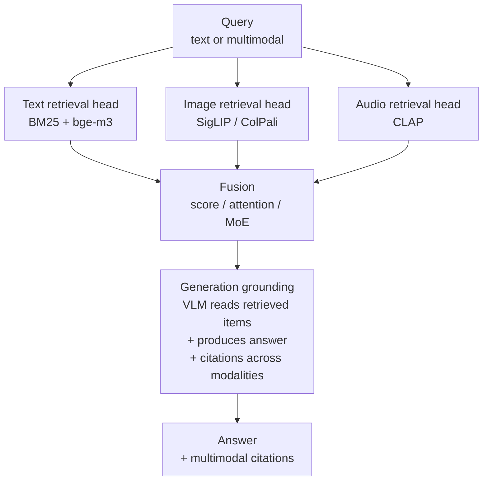
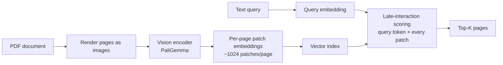

## Exit Criteria

1. Name the three vision-language fundamental architectures: CLIP (contrastive shared-space), BLIP-2 (Q-Former bridge), LLaVA (visual instruction tuning). State when each is the right substrate.
2. Articulate the ColPali thesis: vision-native document RAG using late-interaction visual patch embeddings, NOT OCR-then-text-embed. Why ColPali wins on diagram/chart/table documents.
3. Design a multimodal RAG pipeline with explicit cross-modal retrieval head (CLIP / SigLIP / CLAP), fusion strategy (score-fusion / attention-fusion / MoE), and generation grounding across modalities.
4. State the three 2025 multimodal RAG surveys (Abootorabi et al. / Mei et al. / Zhao et al.) and their shared sub-problem taxonomy.
5. Identify omni-model architectures (thinker-talker pattern, any-to-any streaming) and when they replace separate vision/audio/text stacks.
6. Defend a multimodal agent design choice in interview format: when does multimodal beat text-only RAG by enough to justify 5-10× embedding cost?
7. Cite ONE concrete production deployment shape per modality combination (text+image, text+audio, image+video) — e.g., trip planning, medical triage, e-commerce search, field service diagnosis.

---

## 1. Why This Week Matters (~150 words — REQUIRED)

Curriculum's existing chapters cover text-RAG (W2/W2.5/W2.7/W3) + computer use (W7.5) + voice (W8.5) — but the bridge between them is MISSING. Production multimodal workloads in 2026 — trip planning ("find me a quiet vegan brunch with natural light"), medical triage ("what injury matches this photo + these notes"), e-commerce ("outfits similar to this selfie, in my size"), field service ("diagnose this engine sound + photo of the part") — all need cross-modal retrieval + fusion + grounded generation. This chapter teaches the architecture decisions: which VLM substrate (CLIP / BLIP-2 / LLaVA / VLM-as-encoder), which retrieval head per modality, which fusion strategy (score / attention / MoE), and when omni-models replace the multi-stack approach. Engineers targeting Agent/LLM roles at consumer-product companies (Airbnb, Doordash, Etsy, telemedicine) need this chapter. Heaviest topic gap in current curriculum relative to Phase 12 of `rohitg00/ai-engineering-from-scratch` (25 lessons vs 2 current chapters); this SPEC covers the load-bearing concepts without trying to be all 25.

---

## 2. Theory Primer (~1000 words — REQUIRED — SPEC)

### 2.1 The vision-language fundamentals — three substrate choices

Three architectural patterns underlie almost every production vision-language system. Engineers who know which one to pick for which workload move 10× faster than engineers who reach for "the latest model" without understanding the trade-off.

**CLIP (Radford et al. 2021).** Contrastive pre-training. One text encoder + one image encoder; trained on 400M+ image-text pairs to map matching pairs close in a shared embedding space. Output: cosine similarity between text query + image embedding. Strength: BEST text→image retrieval at scale; cheap to embed; fast at query time. Weakness: NO generation (CLIP doesn't write captions); limited to CLIP-trained pairs (concepts not in training data don't match well). Production-current variant: **SigLIP / SigLIP 2** (Google, 2024-2025) — sigmoid loss + better scaling; default substrate for text+image retrieval.

**BLIP-2 (Li et al. 2023).** Q-Former bridge. Image encoder + a small "query transformer" + a frozen LLM. The Q-Former learns to map image features into the LLM's token embedding space. Strength: generation (the LLM can write captions / answer visual questions); decoupled training (image encoder + LLM frozen, only Q-Former trains). Weakness: more expensive than CLIP at inference; capacity capped by the LLM's frozen weights. Production use: visual-question-answering, image captioning, low-latency VQA.

**LLaVA (Liu et al. 2023, with iterations through 2025).** Visual instruction tuning. Image encoder (typically CLIP-ViT) → projector → LLM, with end-to-end instruction-tuning data. Strength: BEST chat-style VQA + reasoning over images; production-grade open-weights via LLaVA-OneVision and Qwen-VL family. Weakness: heavier than CLIP, generation has latency. **LLaVA-OneVision (2024)** handles single-image / multi-image / video uniformly — the production default for chat-with-images agents.

### 2.2 ColPali — vision-native document RAG

The ColPali thesis (Faysse et al. 2024): document RAG should be VISION-NATIVE, not OCR-then-text-embed. Traditional pipeline: OCR the PDF → chunk text → embed text → retrieve text chunks. ColPali pipeline: render PDF pages as images → embed image patches via vision-language model (PaliGemma) → retrieve via LATE-INTERACTION patch-level scoring (ColBERT-style applied to image patches, not text tokens).

**Why ColPali wins on diagram/chart/table documents:** OCR-then-text loses everything that's NOT text — chart axes, table layout, diagram relationships, image content. ColPali's patch-embed preserves visual structure; late-interaction means the query text gets compared to EACH page patch, picking up "the chart in the bottom-right shows trend X" matches that pure-text RAG never produces.

**When ColPali doesn't win:** pure-text documents (research papers without diagrams) — OCR+text-embed is faster + cheaper + equally accurate. Production rule: ColPali for documents with significant non-text content (PDFs of scanned forms, financial reports with charts, technical manuals with diagrams); text RAG for prose-dominant content.

### 2.3 Multimodal RAG — the production pipeline

Three 2025 surveys (Abootorabi et al. / Mei et al. / Zhao et al.) converged on a shared sub-problem taxonomy. Production multimodal RAG pipelines have four explicit stages:

1. **Per-modality retrieval heads.** Each modality needs embeddings in a compatible space. Three patterns:
   - **Shared embedding space** — CLIP/SigLIP for text+image, CLAP for text+audio. Direct cosine across modalities works; limited to trained pairs.
   - **Per-modality encoder + translation** — separate encoders + a small translator module mapping between spaces. More flexible, more complexity.
   - **VLM-as-encoder** — use VLM hidden states as retrieval representation. Higher quality, more expensive.

2. **Fusion** — you retrieved 10 results: 5 images + 3 text passages + 2 audio clips. How do you merge?
   - **Score fusion** — each modality has its own retriever + scores; normalize within-modality then sum. Simple, often sufficient.
   - **Attention-based fusion** — concatenate all retrieved items, let a small attention network weight them. Needs training data.
   - **MoE fusion** — gating network routes to modality-specific experts. Different query types route differently (visual question weights images higher).

3. **Generation grounding** — cite sources across modalities. "From the chart in [doc.pdf:p3:image], the trend is X" — citations must reference both document position AND modality. UI affordance: when grounding cites an image, render the image thumbnail next to the answer.

4. **Multimodal evaluation** — recall@K + grounded-citation-precision + cross-modal-coherence (does the answer integrate retrieved-image and retrieved-text consistently?). Existing eval frameworks (RAGAS, Phoenix) need extension for cross-modal.

### 2.4 Omni-models — when one model replaces the stack

Omni-models (Qwen2.5-Omni, GPT-4o, InternVL3, MiO, Janus-Pro 2024-2025) accept any-to-any input/output streaming: text+image+audio+video in, text+audio out. The "thinker-talker" pattern decouples reasoning (slow, deeper layers) from speech generation (fast, streaming-friendly).

**When omni replaces the stack:** real-time multimodal interaction (voice assistant with visual context) where stack-composition latency (separate ASR + VLM + LLM + TTS) exceeds 500ms target. Omni-models do the whole pipeline in one forward pass.

**When stack still wins:** independent control over each stage (custom ASR model, custom VLM with proprietary fine-tune, custom TTS voice). Omni-model is a black box; can't swap one component.

### 2.5 Distinguish-from box

**Multimodal RAG vs computer-use agents (W7.5)** — W7.5's agent ACTS in a visual environment (clicks pixels, reads screens). Multimodal RAG RETRIEVES across modalities + grounds an answer. Different consumption pattern.

**Multimodal RAG vs voice agents (W8.5)** — W8.5 covers voice as input/output channel. Multimodal RAG covers retrieval + reasoning across modalities. Voice agents can use multimodal RAG as a backend.

**ColPali vs OCR-then-text RAG** — same goal (document Q&A), different substrate. ColPali wins on visual-content-heavy docs; text RAG wins on prose-dominant.

**Cross-modal retrieval vs translation** — cross-modal retrieval finds matching content across modalities. Translation transforms content from one modality to another (image → caption, audio → transcript). Different operations.

### 2.6 Papers + references — pointer list

- **Radford et al. (2021).** CLIP. arXiv:2103.00020. Contrastive shared-space substrate.
- **Li et al. (2023).** BLIP-2. arXiv:2301.12597. Q-Former bridge to frozen LLM.
- **Liu et al. (2023).** LLaVA. arXiv:2304.08485. Visual instruction tuning.
- **Faysse et al. (2024).** ColPali. arXiv:2407.01449. Vision-native document RAG.
- **Abootorabi et al. (2025), Mei et al. (2025), Zhao et al. (2025).** Three multimodal RAG surveys; converged sub-problem taxonomy.
- **Qwen2.5-Omni, GPT-4o, InternVL3, MiO, Janus-Pro (2024-2025).** Production omni-models.
- **Phase 12 lessons 01-05, 23, 24** (`rohitg00/ai-engineering-from-scratch`) — source lessons.

---

## 3. System Architecture (REQUIRED — Mermaid)

### 3.1 Multimodal RAG pipeline (4 stages)

### 3.2 ColPali — vision-native document RAG

---

## 4. Lab Phases (REQUIRED — SPEC)

### Phase 1 — CLIP text+image retrieval baseline (~1.5 hours)

Goal: `code/clip_retrieve.py` — embed 100 images via SigLIP, embed a text query, retrieve top-5. Verify cross-modal cosine works.

Verification: text query "red sports car" retrieves 5 images all containing red sports cars from a test set with 20 labeled positives.

### Phase 2 — BLIP-2 / LLaVA generation (~1.5 hours)

Goal: `code/vqa.py` — given an image + question, produce an answer. Compare BLIP-2 (Q-Former) vs LLaVA-OneVision on 20 VQA test questions.

Verification: accuracy on a labeled VQA set; latency comparison (BLIP-2 faster, LLaVA more accurate).

### Phase 3 — ColPali document RAG (~2 hours)

Goal: `code/colpali_rag.py` — render 5-page PDF with chart-heavy content as images; embed via PaliGemma; query "what does the bottom-right chart on page 3 show?"; verify retrieval returns page 3 image patch matches.

Verification: compare ColPali vs OCR-then-text RAG on the same 5-page PDF with 10 visual-content questions. Expect ColPali to win significantly (>2× accuracy on chart-referencing queries).

### Phase 4 — Multimodal RAG with score fusion (~2 hours)

Goal: `code/multimodal_rag.py` — combine text retrieval (BM25 + bge-m3) + image retrieval (SigLIP) + audio retrieval (CLAP). Score-fusion across modalities. Generate answer with cross-modal citations.

Verification: on a 10-query test set (queries mix text, image, audio context), measure retrieval@10 + answer accuracy + citation precision.

### Phase 5 — Production deployment shape exercise (~1 hour)

Goal: pick 3 production deployment shapes (trip planning OR medical triage OR e-commerce search OR field service diagnosis). For each, design the multimodal RAG pipeline: which modalities, which fusion, which generation grounding shape. Defend in `outputs/multimodal_deployments.md`.

### Phase 6 — Omni-model comparison (~1 hour)

Goal: run the same VQA + audio-VQA tasks via (a) the stack (CLIP/SigLIP + LLaVA + Whisper + TTS) and (b) Qwen2.5-Omni or local-equivalent omni-model. Compare latency + accuracy + flexibility.

Verification: latency comparison clear; identify which deployment shape needs the stack (custom-component control) vs omni-model (real-time integrated).

---

## 5. Bad-Case Journal (3-5 entries — SPEC)

Candidate failure surfaces:

- **Phase 1 — CLIP misses out-of-distribution concepts.** Likely surface: query "modular flatpack assembly" doesn't retrieve relevant images because CLIP wasn't trained on that vocabulary. Fix: domain-specific fine-tune OR use VLM-as-encoder for OOD coverage.
- **Phase 3 — ColPali index size blows up.** Likely surface: 100-page PDF × 1024 patches/page × 768-dim embedding = ~78MB per document. 1000 docs = 78GB index. Fix: dimensionality reduction (PCA / matryoshka) before storage; cluster patches for compression.
- **Phase 4 — Score fusion picks wrong modality for ambiguous queries.** Likely surface: query "show me how to fix this" gets equal scores from image and text retrievers; fusion picks top text + top image but they conflict. Fix: MoE fusion with explicit modality routing; OR ask user to disambiguate.
- **Phase 4 — Citation grounding hallucinates source positions.** Likely surface: VLM cites "[doc.pdf:p3:image]" but the answer content came from a different page's text retrieval. Fix: generation prompt explicitly enumerates retrieved sources by ID; post-hoc citation validator checks each cited ID was in the retrieval set.
- **Phase 6 — Omni-model latency advantage disappears under retrieval-augmentation.** Likely surface: omni-model is fast end-to-end but slow when given long retrieved context (it processes the whole context in one forward pass). Fix: stack still wins for retrieval-heavy workloads; omni for retrieval-free real-time interaction.

---

## 6. Interview Soundbites (2-3 entries — SPEC)

- **Planned Soundbite 1 — "When would you use ColPali vs OCR-then-text RAG?"** Anchors: §2.2 thesis + Phase 3 measurement. 70 words: ColPali for visual-content-heavy docs (charts, tables, diagrams); text RAG for prose-dominant. ColPali preserves visual structure that OCR loses; cost is larger index + more expensive query-time scoring. Production rule: switch to ColPali when >30% of your retrieval target is in non-text content.
- **Planned Soundbite 2 — "How would you architect multimodal RAG for [domain]?"** Anchors: §2.3 four-stage pipeline + Phase 5 deployment shapes. 70 words naming retrieval heads per modality + fusion choice + generation grounding shape, anchored to one production-deployment example.
- **Planned Soundbite 3 — "Stack vs omni-model — when does omni win?"** Anchors: §2.4 thinker-talker pattern + Phase 6 measurement. 70 words: omni wins on real-time multimodal interaction (latency <500ms target); stack wins on custom-component control or retrieval-augmented contexts.

---

## 7. References

### Papers + canonical writing

- **Radford et al. (2021).** *Learning Transferable Visual Models From Natural Language Supervision.* arXiv:2103.00020. CLIP — contrastive shared-space substrate.
- **Li et al. (2023).** *BLIP-2: Bootstrapping Language-Image Pre-training with Frozen Image Encoders and Large Language Models.* arXiv:2301.12597. Q-Former bridge.
- **Liu et al. (2023).** *Visual Instruction Tuning.* arXiv:2304.08485. LLaVA.
- **Faysse et al. (2024).** *ColPali: Efficient Document Retrieval with Vision Language Models.* arXiv:2407.01449. Vision-native document RAG with late-interaction.
- **Abootorabi et al. (2025), Mei et al. (2025), Zhao et al. (2025).** Three multimodal RAG surveys; converged taxonomy.

### Production blog posts

- **Anthropic / Google / OpenAI omni-model release notes (2024-2026).** GPT-4o, Qwen2.5-Omni, InternVL3 — production omni-model documentation.

### Source lessons

- **`rohitg00/ai-engineering-from-scratch` — Phase 12 lessons.** https://github.com/rohitg00/ai-engineering-from-scratch/tree/main/phases/12-multimodal-ai. Reference lessons 01-05 (vision transformer, CLIP, BLIP-2, Flamingo, LLaVA), 23 (ColPali), 24 (multimodal RAG cross-modal), 20 (omni models).

### Canonical reference implementations

- **OpenCLIP** — https://github.com/mlfoundations/open_clip. Open-weights CLIP variants; SigLIP available.
- **LLaVA-OneVision** — https://github.com/LLaVA-VL/LLaVA-NeXT. Production-grade VLM.
- **ColPali implementation** — https://github.com/illuin-tech/colpali. Reference impl.
- **Qwen2.5-Omni** — Alibaba's open-weights omni-model.

---

## 8. Cross-References

- **Builds on:** [[Week 2 - Rerank and Context Compression]] (RAG fundamentals — multimodal extends); [[Week 2.7 - Structure-Aware RAG]] (document structure — ColPali is the vision-native extension); [[Week 3 - Embeddings and Vector Search]] (single-modality embeddings — multimodal extends to shared spaces).
- **Distinguish from:** [[Week 7.5 - Computer Use and Browser Agents]] (computer use ACTS in visual environment; multimodal RAG RETRIEVES + grounds — different consumption patterns); [[Week 8.5 - Voice AI]] (voice as input/output channel; this chapter as cross-modal retrieval + generation).
- **Connects to:** [[Week 11.6 - Production Tracing and Cost Telemetry]] (multimodal queries cost more — per-modality token + image-token + audio-token tracking matters); [[Week 12 - Capstone]] (multimodal capstone projects pick from this chapter's deployment shapes).
- **Foreshadows:** future production chapters on agent-side multimodal grounding (an agent that REASONS with multimodal evidence — combines this chapter's retrieval with W4's reasoning loop).

---

## What's Next

After W12.5: [[Week 12 - Capstone]] (capstone project may use multimodal RAG as a component); future supplemental chapters on agent-side multimodal reasoning + multimodal evals.
