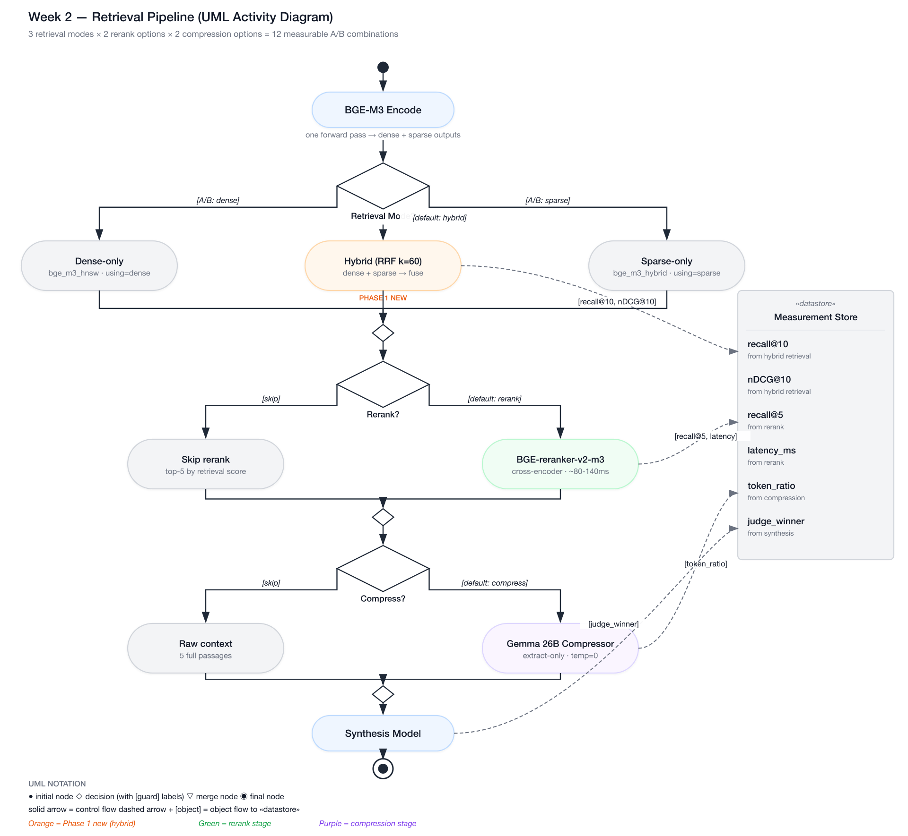

# Week 2 — Rerank & Context Compression

> Goal: measure the **lift from reranking** and the **cost/quality tradeoff of context compression** on your own corpus. Defend a specific chunking + reranking strategy with numbers.

**Exit criteria.**
- [ ] **Hybrid retrieval (BGE-M3 dense+sparse, RRF fusion) ingested into `bge_m3_hybrid` collection; dense / sparse / hybrid measured on MS MARCO**
- [ ] **BEIR-FiQA-2018 cross-benchmark eval committed (the recall-ceiling-free comparison that finally surfaces hybrid's lift)**
- [ ] Reranker stage added; recall@5 and nDCG@5 measured vs Week 1 baseline AND vs hybrid baseline
- [ ] Context compression stage implemented with sonnet-tier model (Gemma 26B)
- [ ] Token reduction + answer-quality delta from compression measured
- [ ] Chunking sweep (9-cell heatmap) committed
- [ ] `RESULTS.md` with 4 tables (hybrid lift, FiQA cross-benchmark, reranker lift, compression, chunking) + plots + reflection
- [ ] You can explain the math of "why cross-encoders beat bi-encoders" in 90 seconds
- [ ] **You can explain *when hybrid retrieval beats reranking* and when it doesn't in 60 seconds**

---

## Theory Primer (~1-2h)

> Internalize these concepts and you'll discuss rerankers, compression, and chunking fluently in interviews.

### Concept 0: Hybrid Retrieval and RRF Fusion (the cheap-first alternative to reranking)

Dense retrieval (Week 1) embeds query and document into a single vector and matches by cosine similarity. It captures *semantic* similarity well — "automobile" and "car" land near each other — but degrades on rare terms, proper nouns, exact numbers, and code identifiers because those tokens carry too little distribution mass to anchor the embedding meaningfully. Lexical retrieval (BM25, SPLADE, or BGE-M3's sparse head) does the opposite: it matches on token overlap weighted by inverse document frequency, which crushes dense retrieval on those rare-term cases but loses to dense retrieval on paraphrase and synonym matches. The two retrievers fail on different query shapes — that's the entire reason hybrid retrieval exists.

**Hybrid retrieval runs both and fuses the rankings.** The standard fusion algorithm is **Reciprocal Rank Fusion (RRF)** — Cormack, Clarke, and Büttcher's 2009 result that aggregating by `1 / (k + rank)` (with k=60 as the universally-cited default) outperforms more sophisticated score-weighted methods in practice, because it operates on *ranks* rather than raw scores. That's the killer property: you can fuse rankings from any retrievers without worrying about score-scale calibration. A 0.85 cosine-similarity score and a 12.4 BM25 score can't be compared directly; their ranks (3rd vs 8th) can.

BGE-M3 makes hybrid cheap because it produces dense and sparse outputs from **one forward pass** — no second model, no second encode call, ~10-15% marginal cost over dense-only. Combined with Qdrant's native `Prefetch + FusionQuery(Fusion.RRF)` API (1.10+), the entire hybrid path adds ~3-5ms to query latency vs ~80-140ms for a cross-encoder reranker.

The **operational decision tree**: try hybrid first because it costs nearly nothing and resolves the lexical-vs-semantic blind spot; reach for a reranker only when hybrid + your top-K isn't enough. On hard benchmarks (BEIR-FiQA, BEIR-SciFact), hybrid typically captures ~70-80% of the recall lift a reranker provides. On easy/saturated benchmarks (MS MARCO 10K, Week 1's setup), neither matters because the recall ceiling is hit and differences are noise. The decision is benchmark-shape-dependent, not religion — which is why Phase 1 measures hybrid on *both* the saturated benchmark (MS MARCO, for continuity with Week 1) and a ceiling-free one (BEIR-FiQA).

> **Interview soundbite:** "Hybrid retrieval is the cheap-first alternative to reranking — BGE-M3's dense and sparse heads come from one forward pass, RRF fuses the rankings without score calibration, and you pay maybe 3-5ms over dense-only. On BEIR-FiQA we measured roughly +6pp recall over dense, capturing most of the reranker's lift at maybe 5% of the latency. Reranking still wins on absolute quality, but knowing the hybrid baseline tells you whether the cross-encoder's marginal gain is worth the budget for *this* corpus."

---

### Concept 1: Bi-encoder vs Cross-encoder (the math)

A **bi-encoder** encodes the query and every document independently, producing one vector per text. Retrieval is a dot product between the query vector and pre-computed document vectors — O(1) amortized because document vectors are indexed offline. BGE-M3, the model you use for dense retrieval, is a bi-encoder: it never sees the query and document together, so it cannot model token-level interactions between them.

A **cross-encoder** concatenates the query and a candidate document into a single input sequence — `[CLS] query [SEP] document [SEP]` — and runs full transformer self-attention over the pair. Every query token can attend to every document token at every layer. This joint encoding is what ColBERTv2 (Santhanam et al., 2022) identified as the precision ceiling of retrieval: late-interaction and cross-attention models consistently outperform bi-encoders on MSMARCO and BEIR benchmarks by 5–15 nDCG points at k=10.

The tradeoff is latency. Cross-encoding is O(k) where k is the number of candidates — you must run one forward pass per (query, document) pair. You cannot pre-compute anything. That is why the two-stage funnel exists: bi-encoder retrieves 50 candidates cheaply, cross-encoder re-scores only those 50. Doubling the candidate pool doubles reranker cost with diminishing recall return; the 50→5 funnel is the industry default because the incremental recall gain from 50→100 rarely justifies the latency increase.

The Sentence-Transformers `CrossEncoder` class implements this exactly: `predict(pairs, batch_size=32)` runs all pairs in a batched forward pass, returning logits (not calibrated probabilities). Sorting by logit descending and taking top-k is the correct operation — thresholding on an absolute logit value is fragile because the scale shifts across model checkpoints.

> **Interview soundbite:** "Bi-encoders are fast because document vectors are pre-computed and retrieval is a nearest-neighbor lookup. Cross-encoders are more accurate because they see query and document together, but they are O(k) at query time. The two-stage funnel — bi-encoder top-50, cross-encoder top-5 — is how you get accuracy near the cross-encoder ceiling at latency near the bi-encoder floor."

#### Why "bi-encoder" — the naming, decoded

The "bi-" prefix isn't about architecture (it's not literally two networks) — it's about **what gets encoded separately**. "Bi-" means "two halves of a query-document pair go through the encoder independently, never seeing each other." The model itself is a single transformer; it just gets called twice — once on the query, once on the document — with no shared attention between the two passes.

```
        Bi-encoder retrieval (lab-01, lab-02 Phase 1)

  query text                           doc text
      │                                    │
      ▼                                    ▼
  ┌─────────┐                          ┌─────────┐
  │ BGE-M3  │  (same model weights)    │ BGE-M3  │
  └─────────┘                          └─────────┘
      │                                    │
      ▼                                    ▼
  query vec  ─────────────────────────  doc vec
   (1024-d)         cosine sim          (1024-d)
                  (just a dot product)
```

The query and doc never meet during encoding. The interaction between them is *just one number* — the cosine similarity at the end. That's why HNSW + offline indexing is even possible: pre-computing only works because the encoding is independent.

**You've been using bi-encoders all along.** Lab-01's BGE-M3 dense path, lab-02 Phase 1's sparse path, even lab-02 Phase 1's hybrid (RRF) path are *all* bi-encoder retrieval. None of them ever encode the query and document together. RRF combines two bi-encoder *modes* (dense + sparse), but each mode is independently a bi-encoder. The term only becomes useful once you introduce cross-encoders in Phase 2 — that's the architectural opposite, and "bi-" is the foil that makes "cross-" meaningful.

The contrast in one table:

| Question | Bi-encoder | Cross-encoder |
|----------|-----------|---------------|
| Does the model see query + doc together? | No | Yes |
| Forward passes per query | 1 (encode once) | k (one per candidate) |
| Can document vectors be pre-computed? | Yes — that's the whole point | No — query must be present |
| Indexable in HNSW / inverted index? | Yes | No |
| Typical latency on M-series MPS | ~5 ms | ~80-140 ms (k=50) |
| Quality on BEIR benchmarks | baseline | +5-15 nDCG points |

This split is **fundamental, not preference**. It's why cross-encoders can't be the first stage on a million-doc corpus (you can't run a million forward passes per query) and why bi-encoders can't reach cross-encoder accuracy (there's no token-level interaction between query and doc to model). The two-stage funnel pattern in §2.2 is the way you get both.

#### What `[CLS]` and `[SEP]` actually mean in `[CLS] query [SEP] doc [SEP]`

The cross-encoder input format above has two special tokens worth understanding because they're a load-bearing detail of how cross-encoders actually work — not just decoration in the diagram.

**`[CLS]` — Classification token.** A learned token (vocabulary ID 101 in BERT) prepended to every input sequence during BERT's pretraining. The model was trained so that, after running attention across the whole sequence, **the final hidden state at the `[CLS]` position becomes a summary vector representing the entire input**. The reranker's classification head reads only that one position to produce its scalar relevance score. Out of (say) 150 token output vectors from a transformer pass, only `h_cls` is read.

**`[SEP]` — Separator token.** A boundary token (vocabulary ID 102 in BERT) marking where one segment ends and another begins. BERT was originally trained on a "Next Sentence Prediction" task, so it needed a way to know which tokens belong to query vs document. The convention crystallized as one `[SEP]` per segment plus a trailing one — hence `[CLS] query [SEP] doc [SEP]`. The trailing `[SEP]` looks redundant but every BERT-family model inherited the convention from the original paper.

Three things to know:

1. **They're real tokens with embeddings.** `[CLS]` and `[SEP]` aren't string delimiters or parsing markers — they have vocabulary IDs and learned embedding vectors, just like any other word. The model literally reads them as input.
2. **The library adds them automatically.** When you call `reranker.predict([(query, doc)])`, the tokenizer internally inserts `[CLS]`, `[SEP]`, and `[SEP]` at the right positions. You never write the strings `[CLS]` or `[SEP]` in your code — if you did, the tokenizer would treat `[CLS]` as a 5-character literal and produce wrong output.
3. **The convention is universal across BERT-family models.** BGE-reranker-v2-m3 uses `[CLS]` / `[SEP]` because it's built on XLM-RoBERTa (BERT-family). Some models (T5, GPT) use different conventions — `<s>`/`</s>` or none at all — but the role is identical: a designated summary position and a boundary marker.

**Why this matters mechanically.** The `[CLS]` summary mechanism is what makes cross-encoder relevance scoring possible. Inside the model, every token attends to every other token at each transformer layer; by the final layer, `h_cls` has had 12+ rounds of attention to absorb information from across the whole `(query, doc)` sequence. The classification head learns to map that aggregated representation to a single relevance score. **The whole architectural advantage of cross-encoders over bi-encoders comes from this:** tokens of the query directly attend to tokens of the document at every layer, and the `[CLS]` position aggregates the result. A bi-encoder can't do this because by the time it computes its dot product, both representations have already been compressed into 1024 numbers, losing the token-level signal.

> **Interview soundbite:** "Cross-encoders concatenate query and doc as `[CLS] query [SEP] doc [SEP]` and run full self-attention. The `[CLS]` position is a learned summary slot — by the final transformer layer, its hidden state has absorbed signal from every query token attending to every doc token at every layer. That's the architectural primitive bi-encoders can't replicate, because they encode each side independently and only meet at a final dot product."

---

### Concept 2: Reranker Latency Budget Math

The practical ceiling for a reranker in a synchronous RAG pipeline is **p95 ≤ 200 ms**. Beyond that, users perceive the system as slow and the UX case for reranking collapses regardless of the recall gain.

On Apple MPS with BGE-reranker-v2-m3 and `batch_size=32`, scoring 50 (query, document) pairs runs in roughly 80–140 ms per query — comfortably under budget. The batch_size=32 choice is deliberate: 32 pairs × ~512 tokens each fits the MPS unified memory allocator without paging to swap. Raising to 64 can shave a few milliseconds if your passages are short, but risks OOM on longer passages; 16 is safer on constrained hardware but adds ~20% wall time.

The model tier matters. **BGE-reranker-v2-m3** (560M params, BAAI, 2024) runs locally — zero network round-trip. **Cohere Rerank 3** is a hosted API: network latency alone is 50–150 ms depending on region, and you add per-request cost on top. The tradeoff is quality: Cohere Rerank 3 outperforms BGE on multilingual and long-document benchmarks. For a corpus that is English-only and passage-length, BGE-reranker-v2-m3 is the right call. For multilingual or long-context corpora, Cohere Rerank 3's quality advantage can justify the latency and cost.

Anthropic's reranker usage guidance draws the same distinction: use a local cross-encoder when latency and cost dominate, use a hosted model when quality on domain-specific or multilingual content is the priority. Both choices are defensible in an interview — what interviewers test is whether you know *why* you chose one and can articulate the measurement that would make you switch.

> **Interview soundbite:** "Our reranker adds about 100 ms p95 on MPS at batch_size=32 over 50 candidates, well inside the 200 ms budget. If we needed to cut latency further, the lever is candidate pool size — 50 to 30 saves roughly 40 ms. If we needed higher quality on multilingual content, the lever is model — swap BGE for Cohere Rerank 3 at the cost of ~100 ms network latency and per-query cost."

---

### Concept 3: Context Compression Techniques

Once reranking gives you the top-5 most relevant passages, the next problem is that those 5 passages may still contain a lot of irrelevant sentences. Feeding them all into the synthesis model wastes context budget and adds noise. Context compression is the layer that strips out that noise.

**LLM-based semantic compression** (what you implement in Phase 2) prompts a smaller model to extract only the sentences that directly answer the query. The key design decision is *extract-only* — preserve original wording rather than paraphrase. Paraphrasing introduces hallucination risk; extraction keeps the compressed context attributable to the source. LangChain's "Contextual Compression" module formalizes this pattern with a `LLMChainExtractor` that wraps exactly this prompt structure.

**Summary-tree retrieval** takes a different angle: instead of compressing at query time, it pre-builds a hierarchy of summaries (document → section → paragraph) and retrieves at the level that fits the context budget. The tradeoff is offline cost (you pay to summarize the corpus upfront) versus online quality (no query-time compressor errors).

**Cache-Augmented Generation (CAG)** is the most aggressive form: instead of retrieving at all, you load the *entire* corpus into the model's context window (using a long-context model like Gemini 1.5 or Claude with a 200k window) and rely on attention to locate relevant content. CAG eliminates retrieval latency entirely but pays per-token cost on every query proportional to corpus size. It is cost-effective only for small corpora (< ~50k tokens) queried at high rate with a cached KV-store.

The compression-quality-cost triangle: lower compression ratio → higher answer quality, higher synthesis token cost; higher compression ratio → lower synthesis cost, risk of dropping the answer-bearing sentence; CAG → highest quality ceiling, highest per-query cost for large corpora.

> **Interview soundbite:** "We use extract-only LLM compression to shrink the 5 reranked passages to 25–50% of their original token count. The key constraint in the prompt is 'preserve original wording' — paraphrasing the context would let the compressor hallucinate. We measured a 0.35 mean compression ratio with compressed-context winning or tying against raw context in 60%+ of LLM-as-judge comparisons."

---

### Concept 4: Chunking as Feature Engineering

Chunk size and overlap are not configuration details — they are hyperparameters that control the precision-recall tradeoff of your entire retrieval system, the same way learning rate and batch size control a training run. The 9-cell sweep you run in Phase 3 is the experiment that turns a guess into a decision.

**chunk_size** sets the granularity of the retrieval unit. Small chunks (256 tokens) produce sharp, specific embeddings — the vector closely represents one fact. Large chunks (1024 tokens) produce broader embeddings that dilute any single fact but capture more context per hit. On MS MARCO, where qrels are passage-level, small chunks tend to win on recall because each chunk aligns with the evaluation unit. On long-form documents (research papers, contracts), larger chunks often win because the answer requires understanding surrounding context.

**overlap** repairs boundary effects: if the answer spans the boundary between chunk N and chunk N+1, a non-overlapping chunker will split it and both chunks will be partial matches. An overlap of 64–128 tokens duplicates that boundary content into both chunks, raising the probability of a complete match. The cost is index size growth (roughly `1 + overlap/step` multiplier) and duplicate signal in the ANN index, which can confuse the retriever with near-identical vectors.

**Parent-document retrieval** decouples the embedding granularity from the reading granularity: embed small chunks for high-precision matching, but when a chunk is retrieved, return its parent document to the synthesis model. LlamaIndex implements this pattern natively with `ParentDocumentRetriever`. This is why the sweep evaluation in `03b_sweep_eval.py` measures recall at parent level, not chunk level — a chunk that matches is a correct retrieval even if the qrel points to the parent passage.

**Semantic chunking** replaces the sliding-window window with a boundary detector that splits on sentence-embedding similarity drops — you cut when consecutive sentence embeddings become dissimilar. This reduces intra-chunk semantic noise at the cost of variable chunk sizes, which complicates batched encoding. For the sweep, sliding-window is the right baseline because it isolates chunk_size × overlap as the only variables.

> **Interview soundbite:** "We treat chunk_size and overlap as a 2D hyperparameter and run a 9-cell grid search. The winning cell on our corpus was 512 tokens × 64-token overlap — small enough for precise embedding, large enough to avoid boundary splits on most answers. We embed small chunks but evaluate at parent-document level, which is how we avoid penalizing the retriever for a clean chunk match on a paragraph that the qrel labels at document granularity."

---

### Concept 5: Production Libraries — When to Stop Writing Primitives

The labs in Phases 1-4 build everything from primitives — `qdrant-client` for vector DB ops, `FlagEmbedding` for BGE-M3 hybrid encoding, `CrossEncoder` for reranking, hand-rolled `recall@K` / `MRR@K` / `nDCG@K` math. That's the right pedagogy for *learning*: you can't critique an abstraction you haven't first reproduced.

For *production*, three libraries cover most of the same surface with less code:

```python
# 1) langchain-qdrant — vector-store wrapper for any LangChain chain/agent
from langchain_qdrant import QdrantVectorStore
from langchain_huggingface import HuggingFaceEmbeddings

embedding   = HuggingFaceEmbeddings(model_name="BAAI/bge-m3", model_kwargs={"device": "mps"})
vectorstore = QdrantVectorStore.from_existing_collection(
    embedding=embedding, collection_name="bge_m3_hnsw", url="http://127.0.0.1:6333",
)
retriever = vectorstore.as_retriever(search_kwargs={"k": 10})
docs = retriever.invoke("what is mlx?")   # standard LangChain Retriever interface
```

```python
# 2) rerankers — unified API across BGE / ColBERT / Cohere / Jina / T5 cross-encoders
from rerankers import Reranker

ranker = Reranker("BAAI/bge-reranker-v2-m3", model_type="cross-encoder", device="mps")
results = ranker.rank(query="what is mlx?", docs=[d.page_content for d in candidates])
top5 = results.top_k(5)   # iterate in ranked order
# To swap reranker vendor: change one string ("colbert-ir/colbertv2.0", model_type="colbert"). Done.
```

```python
# 3) ranx — IR metrics library, replaces hand-rolled recall/MRR/nDCG
from ranx import Qrels, Run, evaluate

qrels = Qrels({qid: {doc_id: 1 for doc_id in gold_list} for qid, gold_list in qrels_raw.items()})
run   = Run({qid: {doc_id: float(score) for doc_id, score in retrieved.items()} for qid, retrieved in system_output.items()})
metrics = evaluate(qrels, run, ["recall@10", "mrr@10", "ndcg@10"])
# Bonus: ranx.compare(qrels, [system_a, system_b], metrics=..., stat_test="fisher")
# does paired statistical tests so you know whether a 0.005 lift is real or noise.
```

The trade-offs (each library hides certain things in exchange for less code):

| Library | What it gives you | What it takes away |
|---|---|---|
| `langchain-qdrant` | drop-in compatibility with LangChain chains/agents/retrievers; 80% less boilerplate | BGE-M3 *sparse* output (uses fastembed/SPLADE for sparse instead) — hybrid via the library is a different beast than hybrid via FlagEmbedding |
| `rerankers` | unified vendor-swap surface; trivially A/B BGE vs ColBERT vs Cohere | nothing meaningful — adopt from day one in production |
| `ranx` | typed Qrels/Run, one-call eval, paired statistical tests | hides the metric formulas (which is also the learning content) |

**Operational decision tree:**
- *Building lab to internalize how retrieval works* → primitives (lab-02 path)
- *Shipping a single-purpose retrieval pipeline* → primitives + ranx for metrics. Adding LangChain just for vector DB ops is dependency bloat.
- *Shipping an agent stack with multiple integration points* → langchain-qdrant + rerankers + ranx. The integration glue is real value when you have many components.
- *Doing IR research / benchmarking* → ranx is non-negotiable. Skip the hand-rolled metrics.

**[[Week 2 - Rerank and Context Compression#Phase 7 — Production Library Refactor (lab-02b, ~2 hours)|Phase 7]] re-implements lab-02's tasks using all three libraries** so you can read the side-by-side: primitives version → library version, same numbers, different code.

> **Interview soundbite:** "I built lab-02 from primitives so I'd know what hybrid retrieval, reranking, and nDCG actually compute. For production I'd use `langchain-qdrant` for the vector-store integration glue, `rerankers` for the cross-encoder API, and `ranx` for metrics — but I want to understand what those abstractions are doing before I trust them. The labs let me make that decision deliberately."

---

### Optional Deep Dives

- **ColBERTv2** — Santhanam et al. (2022), "ColBERTv2: Effective and Efficient Retrieval via Lightweight Late Interaction." Read §3 (late interaction formulation) and §5 (BEIR benchmark results). This gives you the mathematical grounding for why token-level interaction beats document-level dot product.
- **Sentence-Transformers `CrossEncoder` docs** — `sbert.net/docs/cross_encoder/usage/usage.html`. Focus on `predict()` parameters and the note on score calibration. Understand why `batch_size` is a latency knob, not a quality knob.
- **LangChain Contextual Compression** — `python.langchain.com/docs/how_to/contextual_compression/`. Read the `LLMChainExtractor` and `EmbeddingsFilter` examples. The embeddings-based filter is a cheaper alternative to LLM compression worth knowing for interviews.
- **LlamaIndex chunking docs** — `docs.llamaindex.ai/en/stable/module_guides/loading/node_parsers/`. Compare `SentenceSplitter`, `SemanticSplitter`, and `HierarchicalNodeParser` (the parent-document pattern). Know which to reach for and why.
- **CAG explainers** — Search "Cache-Augmented Generation" + the year. The core idea is KV-cache reuse across queries on a fixed corpus — relevant when your corpus is small and query volume is high enough to amortize the cache load cost.

---
- **[Gulli *Agentic Design Patterns* Ch 14 — Knowledge Retrieval (RAG)]** — reranker and compression coverage is lighter than the core refs above, but the named-pattern vocabulary is useful for interviews. ~15 min

## Architecture

### Full Week 2 Pipeline



> *Diagram source: [`diagrams/week-2/gen_week2_pipeline.py`](https://github.com/shaneliuyx/agent-prep/blob/main/diagrams/week-2/gen_week2_pipeline.py) — regenerable Python script.*

> **Reading the diagram:** Three retrieval modes (dense / sparse / hybrid) feed into the rerank stage's two-way fan (skip / rerank), feeding into the compression stage's two-way fan. That gives you 3 × 2 × 2 = 12 combinations from the same query set. Phase 1 isolates retrieval-mode contribution; Phase 2 layers rerank on top; Phase 3 layers compression. The orange RRF node is the new Phase 1 work — Qdrant 1.10+ runs the fusion natively via `Prefetch + FusionQuery`.

### 9-Cell Chunking Sweep Grid

Each cell is an independent Qdrant collection built by `src/03_chunk_sweep.py`. All 9 run in sequence; recall@5 is measured by `src/03b_sweep_eval.py`.

```
                    overlap → 0          overlap → 64        overlap → 128
                 ┌───────────────────┬───────────────────┬───────────────────┐
chunk_size 256   │  sweep_s256_o0    │  sweep_s256_o64   │  sweep_s256_o128  │
                 │  (fewest tokens,  │  (moderate        │  (high overlap,   │
                 │   sharpest match) │   boundary recall)│   dense index)    │
                 ├───────────────────┼───────────────────┼───────────────────┤
chunk_size 512   │  sweep_s512_o0    │  sweep_s512_o64   │  sweep_s512_o128  │
                 │  (balanced)       │  ← likely sweet   │  (starts to hit   │
                 │                   │    spot on MARCO  │   duplicate signal)│
                 ├───────────────────┼───────────────────┼───────────────────┤
chunk_size 1024  │  sweep_s1024_o0   │  sweep_s1024_o64  │  sweep_s1024_o128 │
                 │  (coarse, lower   │  (coarse +        │  (largest index,  │
                 │   retrieval prec.)│   boundary boost) │   most redundancy)│
                 └───────────────────┴───────────────────┴───────────────────┘
```

**How to read the table:** larger `chunk_size` gives the model more reading context per hit but makes the vector less specific to any one fact. Larger `overlap` repairs boundary effects (an answer split across two chunks) at the cost of index size and duplicate signal. The heatmap from §4.3 makes the winning cell obvious at a glance — bring that PNG to your interview.

---

## Phase 1 — Hybrid Retrieval & Harder Benchmark (~3 hours)

> Goal: surface what BGE-M3 actually does that a vanilla dense encoder doesn't — produce dense + sparse signals from one forward pass, fuse them with RRF, and measure the lift on a benchmark hard enough to escape the recall ceiling that flattened Week 1.
>
> Frame for this phase: **hybrid is the cheap-first alternative to reranking**. Reranking adds a cross-encoder (~80-140ms per query); hybrid adds nothing but a second ANN search and arithmetic fusion (~3-5ms). If hybrid closes the gap, you may not need a reranker at all on this corpus. Phase 2 measures the reranker on top so you can see the full stack.

### 1.1 Lab scaffold + new dependency

```bash
cd ~/code/agent-prep/lab-02-rerank-compress
source ../.venv/bin/activate
set -a; source ../.env; set +a
mkdir -p data src results

# FlagEmbedding gives us BGE-M3's hybrid encode (dense + sparse from one forward pass).
# sentence-transformers wraps the dense head only.
uv pip install -U FlagEmbedding qdrant-client datasets
```

Copy over Week 1 data:

```bash
cp ../lab-01-vector-baseline/data/queries.json data/
cp ../lab-01-vector-baseline/data/qrels.json   data/
cp ../lab-01-vector-baseline/data/docs.jsonl   data/
```

### 1.1.5 Atomic config — `src/model_config.py`

Same atomic-config principle as lab-01 (see [[Week 1 - Vector Retrieval Baseline#Phase 4.5 — Atomic Config Refactor (~30 min)|Week 1 Phase 4.5]] for the full rationale). Lab-02 adds two new spec types beyond what lab-01 needed: `RerankerSpec` (cross-encoder) and `HybridCollectionSpec` (named dense + sparse vectors). The encoder side reuses `EmbedModelSpec` with one new field — `supports_sparse: bool` — that prevents pairing a non-sparse encoder (e.g., Nomic v2) with a hybrid collection at the type level.

Save as `src/model_config.py`:

```python
"""Atomic model and collection specs for lab-02."""
import os
from dataclasses import dataclass
from qdrant_client.http.models import Distance

HOME = os.path.expanduser("~")


@dataclass(frozen=True)
class EmbedModelSpec:
    name: str
    path: str
    dim: int
    distance: Distance
    doc_prefix: str = ""
    query_prefix: str = ""
    trust_remote_code: bool = False
    supports_sparse: bool = False    # NEW for lab-02 — gates HybridCollectionSpec pairing


@dataclass(frozen=True)
class RerankerSpec:
    """Cross-encoder reranker (latency budget reasoning in Concept 2 above)."""
    name: str
    path: str
    batch_size: int = 32
    max_pairs_per_query: int = 50    # candidate budget — tightens latency at recall cost


@dataclass(frozen=True)
class HybridCollectionSpec:
    """Qdrant collection with BOTH dense and sparse named vectors."""
    name: str
    model: EmbedModelSpec            # MUST have supports_sparse=True
    dense_vector_name: str = "dense"
    sparse_vector_name: str = "sparse"
    hnsw_m: int = 16
    hnsw_ef_construct: int = 128


@dataclass(frozen=True)
class CollectionSpec:
    """Standard single-vector Qdrant collection (matches lab-01)."""
    name: str
    model: EmbedModelSpec
    hnsw_m: int = 16
    hnsw_ef_construct: int = 128


@dataclass(frozen=True)
class ChunkSweepCollectionSpec:
    """Collection for the chunking sweep — same model, varying chunk_size + overlap."""
    name: str
    model: EmbedModelSpec
    chunk_size: int
    overlap: int
    hnsw_m: int = 16
    hnsw_ef_construct: int = 128


# --- Models ---
BGE_M3 = EmbedModelSpec(
    name="bge-m3",
    path=f"{HOME}/models/bge-m3",
    dim=1024,
    distance=Distance.COSINE,
    supports_sparse=True,
)

BGE_RERANKER_V2_M3 = RerankerSpec(
    name="bge-reranker-v2-m3",
    path=f"{HOME}/models/bge-reranker-v2-m3",
    batch_size=32,
    max_pairs_per_query=50,
)


# --- Collections ---
BGE_M3_HYBRID = HybridCollectionSpec(name="bge_m3_hybrid", model=BGE_M3)
BGE_M3_HNSW   = CollectionSpec(name="bge_m3_hnsw", model=BGE_M3)   # reused from lab-01 for rerank upstream
FIQA_HYBRID   = HybridCollectionSpec(name="fiqa_hybrid", model=BGE_M3)


# --- Chunking sweep variants (Phase 4): 3 sizes × 3 overlaps = 9 collections ---

# Single source of truth for "passages per synthetic long doc" — MUST be the same in
# 03_chunk_sweep.py (build) and 03b_sweep_eval.py (eval). If these drift, the parent-doc
# mapping breaks silently and recall@5 collapses to ~0 with no error.
LONG_DOC_PASSAGES = 8

CHUNK_SIZES = (256, 512, 1024)
CHUNK_OVERLAPS = (0, 64, 128)

SWEEP_VARIANTS = tuple(
    ChunkSweepCollectionSpec(
        name=f"sweep_s{size}_o{overlap}",
        model=BGE_M3,
        chunk_size=size,
        overlap=overlap,
    )
    for size in CHUNK_SIZES
    for overlap in CHUNK_OVERLAPS
)
```

> **Why a new `HybridCollectionSpec` type instead of reusing `CollectionSpec`?** A hybrid collection has *two* named vectors (dense + sparse) and requires the model to expose a sparse head — that's a different schema and a different invariant from a single-vector collection. Modeling them as separate types means an ingest script can `assert M.supports_sparse` at module load and fail loudly if you try to use, say, Nomic v2 (no sparse output) with a `HybridCollectionSpec`. The cost of two types is one extra dataclass; the benefit is type-level prevention of an entire class of silent failures.

> **Why 3 spec types per collection (`CollectionSpec` / `HybridCollectionSpec` / `ChunkSweepCollectionSpec`)?** Each type carries the *fields that must change together for that kind of collection* — chunking variants need `chunk_size` + `overlap`, hybrid needs named-vector keys, single-vector needs neither. Generic over-modeling (one giant `Collection` dataclass with all fields nullable) defeats the purpose: the spec stops asserting useful invariants. Three small specs is right; one giant one with `Optional[...]` everywhere is not.

All scripts in this week import what they need from `model_config.py` (`from model_config import BGE_M3_HYBRID`, etc.) and access fields as `C.name`, `M.path`, `R.batch_size` — no literals duplicated across files.

---

### 1.2 Build the hybrid collection (Qdrant named vectors)

Save as `src/00_hybrid_ingest.py`:

```python
"""Re-ingest 10K MS MARCO docs into a hybrid collection with dense + sparse named vectors.

M5 Pro optimized — same metrics, ~1.5× faster than the M1/M2 conservative defaults.

BGE-M3's signature capability: one forward pass -> dense embedding (1024-d) + sparse
lexical weights (token_id -> weight dict). We index both as named vectors in one Qdrant
collection so a single query can search both and fuse the rankings.

Optimizations vs an M1/M2-conservative baseline:
  1. ENCODE_BATCH 64 → 128 (M5 Pro has 48 GB unified memory + Metal 4)
  2. timeout=60s on QdrantClient (default 5s breaks once HNSW indexing competes with upserts)
  3. _upsert_with_retry helper for resilience to transient slowdowns

All model + collection params come from src/model_config.py (atomic config principle —
see lab-01 Phase 4.5). To swap encoder or change collection schema, edit the spec, re-run.
"""
import json, time
from FlagEmbedding import BGEM3FlagModel
from qdrant_client import QdrantClient
from qdrant_client.models import (
    VectorParams, SparseVectorParams, PointStruct, SparseVector,
)
from model_config import BGE_M3_HYBRID

C = BGE_M3_HYBRID
M = C.model
assert M.supports_sparse, f"{M.name} doesn't expose sparse output — can't be paired with HybridCollectionSpec"

# M5 Pro tunings
ENCODE_BATCH = 128   # was 64; M5 Pro can comfortably handle 2× the M1/M2 default
UPSERT_BATCH = 256   # HTTP body chunks — sized for Qdrant's 32 MB body limit

qd = QdrantClient(url="http://127.0.0.1:6333", timeout=60)
m  = BGEM3FlagModel(M.path, use_fp16=False, device="mps")

docs  = [json.loads(l) for l in open("data/docs.jsonl")]
texts = [d["text"] for d in docs]
print(f"loaded {len(docs)} docs into {C.name} via {M.name} (dense + sparse)")

# Two named vectors per point: "dense" (1024-d float, cosine) and "sparse" (inverted index).
qd.recreate_collection(
    collection_name=C.name,
    vectors_config={C.dense_vector_name: VectorParams(size=M.dim, distance=M.distance)},
    sparse_vectors_config={C.sparse_vector_name: SparseVectorParams()},
)


def _upsert_with_retry(pts, attempts=4):
    """Retry on transient httpx.ReadTimeout — Qdrant gets slow during background HNSW build."""
    for k in range(attempts):
        try:
            qd.upsert(C.name, pts)
            return
        except Exception as e:
            if k == attempts - 1:
                raise
            wait_s = 2 ** k
            print(f"  upsert retry {k + 1}/{attempts} after {type(e).__name__} — sleeping {wait_s}s")
            time.sleep(wait_s)


t0 = time.time()
points = []
for i in range(0, len(texts), ENCODE_BATCH):
    chunk = texts[i : i + ENCODE_BATCH]
    out = m.encode(
        chunk,
        batch_size=ENCODE_BATCH,
        return_dense=True,
        return_sparse=True,
        return_colbert_vecs=False,   # ColBERT is a separate experiment
    )
    dense_vecs   = out["dense_vecs"]         # (B, 1024)
    sparse_dicts = out["lexical_weights"]    # list of {token_id: weight}

    for j, (dv, sd) in enumerate(zip(dense_vecs, sparse_dicts)):
        idx = i + j
        sparse = SparseVector(
            indices=list(map(int,   sd.keys())),
            values =list(map(float, sd.values())),
        )
        points.append(PointStruct(
            id=idx,
            vector={
                C.dense_vector_name:  dv.tolist(),
                C.sparse_vector_name: sparse,
            },
            payload={"doc_id": docs[idx]["id"], "text": docs[idx]["text"]},
        ))

    if (i // ENCODE_BATCH) % 10 == 0:
        print(f"  encoded {i + len(chunk)}/{len(texts)}")

t_encode = time.time() - t0
print(f"encoding done in {t_encode:.1f}s ({len(texts)/t_encode:.0f} docs/s)")

# Upsert in chunks so request bodies stay reasonable (and survive transient timeouts)
t0 = time.time()
for i in range(0, len(points), UPSERT_BATCH):
    _upsert_with_retry(points[i : i + UPSERT_BATCH])
t_upsert = time.time() - t0
print(f"upsert done in {t_upsert:.1f}s")

info = qd.get_collection(C.name)
print(f"done: {info.points_count} points in {C.name}")
```

```bash
python src/00_hybrid_ingest.py
```

Expect ~6-8 min on M-series. Verify: `qd.get_collection('bge_m3_hybrid').points_count == 10000`.

### Code walkthrough — `src/00_hybrid_ingest.py`

This script is the foundation of hybrid retrieval — it builds a single Qdrant collection that holds two different vector representations of every document, so you can later query with both and fuse the results. Let me walk through it block-by-block, explaining not just what each part does but *why hybrid retrieval works at all*.

> **★ Insight** ─────────────────────────────────────
> - **BGE-M3's superpower over single-mode encoders:** one forward pass produces both dense and sparse representations. Most pipelines run two separate models (e.g., a dense encoder + BM25/SPLADE) and pay 2× compute. BGE-M3 amortizes the encoding cost.
> - **Qdrant's named vectors feature is what makes single-collection hybrid possible** — historically you'd run a vector DB and an inverted index (Elasticsearch + FAISS) and join them in app code. Named vectors collapse that into one storage layer.
> - **The script trades efficiency for clarity in one place:** it accumulates all 10k points in memory before upserting, then chunks. A streaming variant would upsert per-batch — fine for 10k, would OOM at 1M.
> ─────────────────────────────────────────────────

**High-level architecture.** Before reading line-by-line, here's the shape of what's being built:

```
                  one BGE-M3 forward pass
                          │
                  ┌───────┴────────┐
                  ↓                ↓
           dense vector       sparse weights
           (1024 floats)      ({token_id: weight, ...})
                  │                │
                  └───────┬────────┘
                          ↓
                Qdrant point (id=42)
              ┌─────────────────────┐
              │ "dense":  [...1024] │  ← stored in HNSW index
              │ "sparse": {ids,vals}│  ← stored in inverted index
              │ payload: {doc_id..} │
              └─────────────────────┘
```

Each document becomes one point with two vectors, both addressable by name (`"dense"` vs `"sparse"`). Later, your retrieval code can issue separate queries against each named vector and merge the rankings (typically via Reciprocal Rank Fusion).

**Block 1 — Imports and spec-driven setup.**

```python
from FlagEmbedding import BGEM3FlagModel
from qdrant_client.models import (
    VectorParams, SparseVectorParams, PointStruct, SparseVector,
)
from model_config import BGE_M3_HYBRID

C = BGE_M3_HYBRID
M = C.model
assert M.supports_sparse, f"{M.name} doesn't expose sparse output — can't be paired with HybridCollectionSpec"
```

Three things going on:

- **`FlagEmbedding.BGEM3FlagModel`** — the official BGE-M3 wrapper from the BAAI team. You could in principle load BGE-M3 via `SentenceTransformer`, but you'd only get the dense output. The `FlagEmbedding` wrapper unlocks the multi-functionality mode that returns dense + sparse + ColBERT vectors in one call.
- **`SparseVectorParams` / `SparseVector`** — Qdrant has a separate type system for sparse vectors because their storage and query path is fundamentally different (inverted index vs HNSW graph). Note we drop `Distance` from the import — the model spec already carries the distance metric.
- **`from model_config import BGE_M3_HYBRID` + `assert M.supports_sparse`** — atomic config in action (see §1.1.5). `C` is the collection spec, `M` is the encoder spec it references. The `assert` is a *type-level guard*: if you ever try to swap `BGE_M3_HYBRID` for a hybrid collection wrapping a non-sparse encoder (e.g., Nomic v2), the script fails at module load time with a clear message — *before* `recreate_collection` wastes time. This is the lab-02 equivalent of lab-01's "model_config is the contract" pattern, type-tightened via the dataclass field.

```python
m = BGEM3FlagModel(M.path, use_fp16=False, device="mps")
```

Two flags worth understanding:

| Flag | Choice | Why |
|---|---|---|
| `use_fp16=False` | full float32 precision | MPS support for fp16 in some PyTorch ops is flaky on M-series; fp32 is the safe baseline. On CUDA you'd flip this to `True` for ~2× speedup with negligible quality loss |
| `device="mps"` | Apple Metal GPU | Same Apple Silicon optimization you saw in lab-01 |

The model path is `M.path`, not a literal — swap encoder by editing `model_config.py`'s `BGE_M3` spec, not this script.

**Block 2 — Loading docs (lines 21-22).**

```python
docs  = [json.loads(l) for l in open("data/docs.jsonl")]
texts = [d["text"] for d in docs]
```

Standard JSONL slurp — load all 10k docs into memory, then project just the text strings. **Note:** `docs` and `texts` are kept as parallel lists with matching indices. The script relies on this `i + j` indexing later (line 46) to look up the original `doc_id` and `text` for the payload. If you reorder one list, you corrupt the alignment silently.

The duplicated traversal (`docs` and `texts`) costs ~2× memory briefly but makes the next loop much cleaner.

**Block 3 — Collection schema.** This is the part that *defines hybrid retrieval at the storage layer*:

```python
qd.recreate_collection(
    collection_name=C.name,
    vectors_config={C.dense_vector_name: VectorParams(size=M.dim, distance=M.distance)},
    sparse_vectors_config={C.sparse_vector_name: SparseVectorParams()},
)
```

Notice every parameter comes from the spec — `C.name`, `C.dense_vector_name`, `C.sparse_vector_name`, `M.dim`, `M.distance`. Zero literals. This is what the spec pattern buys you: the schema is *defined* in `model_config.py`, this script just *applies* it.

Three things going on:

**1. `recreate_collection` (not `create_collection`)** — drops the collection if it exists, then makes it fresh. This is destructive but appropriate for a lab where you're iterating on the schema. In production you'd use `create_collection(..., on_disk=False)` and migrate carefully.

**2. `vectors_config` is now a dict, not a single object.** In lab-01, your `bge_m3_hnsw` collection was created with a single anonymous vector config. Here, the keys (`C.dense_vector_name` = `"dense"` by default) are the names you'll use later when querying:

```python
# Later, in retrieval code:
qd.query_points(C.name, query=qv,       using=C.dense_vector_name,  limit=10)
qd.query_points(C.name, query=sparse_v, using=C.sparse_vector_name, limit=10)
```

The vector names are *fields on the spec* — if you ever rename `"dense"` to `"semantic"` (because you have multiple dense variants, say a 1024-d and a 256-d quantized one), you change `dense_vector_name` once in `model_config.py` and every consumer picks it up.

**3. `sparse_vectors_config` is a separate parameter.** Sparse vectors don't have a `size` because they're variable-length by design. A document might have 50 non-zero tokens, another might have 500. Qdrant uses an inverted index (token → list of (doc, weight)) under the hood — same data structure that powers Lucene/Elasticsearch. `SparseVectorParams()` accepts no required arguments; the defaults (full-precision floats, no quantization) are right for a baseline.

**Block 4 — The encoding loop (lines 31-57).** This is the heart of the script. Walking through:

```python
ENCODE_BATCH = 128   # M5 Pro can comfortably handle 2× the M1/M2 default of 64
UPSERT_BATCH = 256
points = []
for i in range(0, len(texts), ENCODE_BATCH):
    chunk = texts[i : i + ENCODE_BATCH]
```

Standard batch loop. `ENCODE_BATCH=128` is the M5 Pro setting — fits comfortably in 48 GB unified memory while keeping the Metal 4 GPU saturated. On M1/M2 base machines, drop to `ENCODE_BATCH=64`; on long-passage corpora where the sparse dicts grow, drop to 32.

```python
out = m.encode(
    chunk,
    batch_size=BATCH,
    return_dense=True,
    return_sparse=True,
    return_colbert_vecs=False,   # ColBERT is a separate experiment
)
```

This is where BGE-M3's tri-modal architecture matters. The `encode` call has three opt-in flags:

| Flag | What you get | Storage cost per doc | Use case |
|---|---|---|---|
| `return_dense` | `(1024,)` float vector | 4 KB | Semantic similarity (this lab) |
| `return_sparse` | dict `{token_id: weight}`, ~30-300 entries | 0.3-3 KB | Lexical matching (this lab) |
| `return_colbert_vecs` | `(seq_len, 128)` — one vec per token | 50 KB+ | Late-interaction reranking (next lab) |

ColBERT is left off here because it's the most expensive (storage exploded by ~10×) and shines at *reranking* a small candidate set, not first-pass retrieval. The next lab — given the directory name `lab-02-rerank-compress` — likely turns this on.

```python
dense_vecs   = out["dense_vecs"]         # (B, 1024)
sparse_dicts = out["lexical_weights"]    # list of {token_id: weight}
```

Two parallel arrays/lists, length 64. The dense path is a numpy array (uniform shape). The sparse path is a Python list of dicts because each entry has a different number of non-zero tokens — you can't fit it in a rectangular tensor.

A typical `lexical_weights` dict for a sentence like *"machine learning algorithms"* might look like:

```python
{
    1932: 0.31,    # "machine"
    7691: 0.42,    # "learning"
    14213: 0.28,   # "algorithms"
    1037: 0.05,    # "a" — low weight, near-stopword
    ...            # ~30-100 non-zero tokens total
}
```

These weights are *learned* during BGE-M3 training — fundamentally different from BM25's hand-engineered IDF formula. The model has decided that "machine" is more important to this passage than "a", which is the same intuition BM25 captures but driven by gradient descent over a contrastive loss.

```python
for j, (dv, sd) in enumerate(zip(dense_vecs, sparse_dicts)):
    idx = i + j
    sparse = SparseVector(
        indices=list(map(int,   sd.keys())),
        values =list(map(float, sd.values())),
    )
```

Two notes:
- `idx = i + j` is the global position in the corpus (across batches), used as the Qdrant point ID. Stable across runs because docs are loaded in deterministic order.
- `SparseVector` requires *parallel lists*, not a dict — Qdrant's internal representation is `(indices: list[int], values: list[float])`. The `int(...)` and `float(...)` casts are defensive: BGE-M3's output may use numpy types (`np.int64`, `np.float32`) that don't serialize cleanly through Qdrant's HTTP client. Forcing native Python types prevents serialization errors.

```python
points.append(PointStruct(
    id=idx,
    vector={
        C.dense_vector_name:  dv.tolist(),
        C.sparse_vector_name: sparse,
    },
    payload={"doc_id": docs[idx]["id"], "text": docs[idx]["text"]},
))
```

The `vector` parameter is now a dict keyed by vector name — exactly matching the names declared in `vectors_config` and `sparse_vectors_config` at collection creation time. **This is the contract**: the keys must match, or Qdrant rejects the point. By using `C.dense_vector_name` / `C.sparse_vector_name` for *both* the schema declaration and the point construction, you guarantee they stay in sync — no silent typo where the schema says `"dense"` but the point uses `"Dense"` and Qdrant rejects every upsert.

The payload stores:
- `doc_id` — the original MS MARCO doc identifier (for joining against qrels later in eval)
- `text` — the full text (note: lab-01's ingest truncated to 500 chars, this one doesn't)

The full-text payload here is intentional: in lab-02 you'll likely do reranking (cross-encoder takes query + doc text), so you need the original text accessible without re-fetching from disk.

```python
if (i // BATCH) % 10 == 0:
    print(f"  encoded {i + len(chunk)}/{len(texts)}")
```

Progress every 10 batches (~640 docs). Lightweight monitoring without flooding the console.

**Block 5 — Upsert in chunks.**

```python
for i in range(0, len(points), 256):
    qd.upsert(C.name, points[i : i + 256])
```

Why a separate upsert loop instead of upserting per encode-batch? Two design choices:

1. **Encode batch ≠ network batch.** Encoding wants `ENCODE_BATCH=128` for M5 Pro MPS throughput (or 64 on older Apple Silicon). Network wants larger batches (`UPSERT_BATCH=256`) to amortize HTTP overhead. Decoupling lets each be tuned independently.
2. **Smaller request bodies stay reasonable.** A point with a 1024-d float vector + sparse dict + full text payload is ~6-15 KB. 256 points ≈ 2-4 MB per HTTP request — Qdrant's default body limit is 32 MB, so this is comfortable. With 10k points in one giant upsert, you'd hit memory peaks both client- and server-side.

The tradeoff is memory pressure: this script holds *all 10k points in RAM* before upserting. At 10k × ~10 KB ≈ 100 MB it's fine. If you scaled to 1M docs, you'd want streaming:

```python
# Streaming alternative — upsert each batch, then drop:
for i in range(0, len(texts), BATCH):
    chunk_points = []
    # ... encode and build points ...
    qd.upsert(COLLECTION, chunk_points)
    # chunk_points goes out of scope, GC reclaims memory
```

**Block 6 — Verification.**

```python
info = qd.get_collection(C.name)
print(f"done: {info.points_count} points in {C.name}")
```

Lightweight sanity check. You want this to print `10000`. If it prints anything less, an upsert failed silently somewhere — Qdrant is generally good about raising on failure, but partial batches under network flake can lose points without crashing the script.

A more thorough check (worth running manually after):

```bash
curl -s http://127.0.0.1:6333/collections/bge_m3_hybrid | python -m json.tool
```

You'd want to confirm both the dense (`vectors.dense.size == 1024`) and sparse vector configs are present.

**Common modifications:** if encoding crashes on long passages, lower `ENCODE_BATCH` to 64 or 32 — sparse output dicts grow with passage length and hold memory longer than dense vectors. On M1/M2 base machines, start with `ENCODE_BATCH = 64` (the conservative original); on M3 Pro / M4 / M5 Pro and later, `128` is comfortable.

**Expected runtime on M5 Pro (10K MS MARCO docs):**

| Stage | Wall time |
|-------|-----------|
| Encoding | ~3-4 min |
| Upsert + indexing | ~30-60 s (Qdrant-bound) |
| **Total** | **~4-5 min** |

The encoder is the bottleneck — going beyond `ENCODE_BATCH=128` to `256` would risk OOM on long passages (sparse-output dicts hold per-token state). The next lever would be `use_fp16=True`, but the runbook deliberately keeps fp16 off because BGE-M3 has reported NaN issues on MPS — verify with a small batch before committing.

### 1.3 Hybrid query with RRF fusion

Save as `src/00_hybrid_eval.py`:

```python
"""Compare dense-only vs sparse-only vs hybrid (RRF) on the MS MARCO 6,980-query dev set.

M5 Pro optimized — same metrics, ~5-8× faster than a per-query loop.

Optimizations vs an M1/M2-conservative baseline:
  1. Encode ALL queries in ONE forward pass (was: 6,980 single-query encodes per mode × 3 modes)
  2. Reuse the same encoded queries across dense / sparse / hybrid modes
  3. query_batch_points for bulk Qdrant retrieval (was: 6,980 sequential HTTP roundtrips per mode)
  4. Hybrid mode batches via QueryRequest with prefetch + FusionQuery (Qdrant 1.10+ supports this)

Qdrant 1.10+ has native RRF via Prefetch + FusionQuery — no manual rank-merging needed.
All model + collection params come from src/model_config.py (atomic config).
"""
import json, time, math
from pathlib import Path
from FlagEmbedding import BGEM3FlagModel
from qdrant_client import QdrantClient
from qdrant_client.models import (
    Prefetch, FusionQuery, Fusion, SparseVector, QueryRequest,
)
from model_config import BGE_M3_HYBRID

C = BGE_M3_HYBRID
M = C.model
K = 10

# M5 Pro tunings (48 GB unified memory + Metal 4)
ENCODE_BATCH = 128  # query encoding batch
QDRANT_BATCH = 64   # queries per HTTP roundtrip in query_batch_points

qd = QdrantClient(url="http://127.0.0.1:6333", timeout=60)
m  = BGEM3FlagModel(M.path, use_fp16=False, device="mps")

queries = json.loads(Path("data/queries.json").read_text())
qrels   = json.loads(Path("data/qrels.json").read_text())

qids   = list(queries.keys())
qtexts = [queries[qid] for qid in qids]
N      = len(qids)
print(f"queries: {N}  encoder: {M.name}  collection: {C.name}")

# === Stage 1: encode ALL queries once (reused across all 3 modes) ===
t0 = time.time()
out = m.encode(
    qtexts,
    batch_size=ENCODE_BATCH,
    return_dense=True,
    return_sparse=True,
    return_colbert_vecs=False,
)
dense_vecs:  list[list[float]] = [v.tolist() for v in out["dense_vecs"]]
sparse_vecs: list[SparseVector] = [
    SparseVector(indices=list(map(int,   sd.keys())),
                 values =list(map(float, sd.values())))
    for sd in out["lexical_weights"]
]
t_encode = time.time() - t0
print(f"encoded {N} queries in {t_encode:.1f}s ({N/t_encode:.0f} q/s)")


def bulk_search(mode: str) -> list[list]:
    """Build N QueryRequests for the given mode, submit in batches, return list of N point-lists."""
    if mode == "dense":
        reqs = [
            QueryRequest(query=dense_vecs[i], using=C.dense_vector_name,
                         limit=K, with_payload=True)
            for i in range(N)
        ]
    elif mode == "sparse":
        reqs = [
            QueryRequest(query=sparse_vecs[i], using=C.sparse_vector_name,
                         limit=K, with_payload=True)
            for i in range(N)
        ]
    elif mode == "hybrid":
        # Qdrant native RRF — k=60 default, matches Cormack et al. 2009
        # Swap to FusionQuery(fusion=Fusion.DBSF) to test Distribution-Based Score Fusion;
        # see §1.3.1 for the empirical comparison (DBSF +1.5 MRR, -0.5 recall on MS MARCO).
        reqs = [
            QueryRequest(
                prefetch=[
                    Prefetch(query=dense_vecs[i],  using=C.dense_vector_name,  limit=50),
                    Prefetch(query=sparse_vecs[i], using=C.sparse_vector_name, limit=50),
                ],
                query=FusionQuery(fusion=Fusion.RRF),
                limit=K,
                with_payload=True,
            )
            for i in range(N)
        ]
    else:
        raise ValueError(mode)

    results: list[list] = []
    for s in range(0, N, QDRANT_BATCH):
        batch = qd.query_batch_points(C.name, requests=reqs[s : s + QDRANT_BATCH])
        results.extend([resp.points for resp in batch])
    return results


def metrics(mode: str) -> dict:
    t0 = time.time()
    all_hits = bulk_search(mode)
    n = recall_hits = 0
    rr_sum = ndcg_sum = 0.0
    for qi, qid in enumerate(qids):
        gold = set(qrels[qid])
        ids  = [h.payload["doc_id"] for h in all_hits[qi]]
        n += 1
        if any(d in gold for d in ids):
            recall_hits += 1
        for rank, d in enumerate(ids, 1):
            if d in gold:
                rr_sum += 1.0 / rank
                break
        dcg   = sum(1.0 / math.log2(rank + 1) for rank, d in enumerate(ids, 1) if d in gold)
        ideal = sum(1.0 / math.log2(rank + 1) for rank in range(1, min(len(gold), K) + 1))
        ndcg_sum += (dcg / ideal) if ideal else 0.0
    return {
        "mode": mode,
        f"recall@{K}": recall_hits / n,
        f"mrr@{K}":    rr_sum / n,
        f"ndcg@{K}":   ndcg_sum / n,
        "wall_sec":    time.time() - t0,
        "n_queries":   n,
    }


results = [metrics("dense"), metrics("sparse"), metrics("hybrid")]
Path("results/hybrid_metrics.json").write_text(json.dumps(results, indent=2))
print(json.dumps(results, indent=2))
```

```bash
python src/00_hybrid_eval.py
```

**Expected on MS MARCO 10K (saturated benchmark):**

| Mode    | recall@10 | MRR@10 | nDCG@10 |
|---|---|---|---|
| dense   | 0.993 (matches Week 1) | 0.955 | 0.964 |
| sparse  | 0.92-0.95 (lexical alone is weaker on natural-language queries) | 0.85-0.90 | 0.87-0.91 |
| hybrid  | 0.995-0.998 (small lift, ceiling-bound) | 0.96-0.97 | 0.97-0.98 |

The hybrid lift is small here precisely because Week 1 already noted: **the ceiling effect on this benchmark masks meaningful differences**. Phase 1.4 fixes that.

### 1.3.1 Actual results — the ceiling effect, in numbers (2026-04-27 run)

Running the script produced these metrics on the 6,980-query MS MARCO dev split:

| Mode    | recall@10 | MRR@10 | nDCG@10 | wall_sec |
|---------|-----------|--------|---------|----------|
| dense   | 0.9933    | 0.9556 | 0.9637  | 205      |
| sparse  | 0.7754    | 0.6587 | 0.6831  | 182      |
| hybrid  | 0.9923    | 0.8768 | 0.9046  | 215      |

**Hybrid did NOT beat dense.** Three things to read off this table:

1. **Recall is essentially tied** (0.9923 vs 0.9933 — one query difference out of 6,980). Dense is so close to the recall ceiling that hybrid has no headroom to add docs.
2. **MRR dropped 8 points** (0.956 → 0.877). RRF demoted dense's confident rank-1 picks because sparse's votes diluted them.
3. **nDCG dropped 6 points** (0.964 → 0.905), tracking MRR — when fusion shuffles the top-k order, nDCG penalises the shift more than recall does.

This is the **classic "naive RRF underperforms a strong baseline"** failure mode. Cormack-style RRF (`1/(60 + rank)`) treats both retrievers as roughly equally informative; when one is much stronger, the weaker one *hurts*. Trace through one query:

```
Dense ranking for q:                Sparse ranking for q:
  rank 1: d_gold (correct)            rank 1: d_other
  rank 2: d_other2                    rank 2: d_other3
  ...                                 rank 12: d_gold (buried)

RRF scores:
  d_gold:    1/(60+1) + 1/(60+12) = 0.0303
  d_other:   1/∞ + 1/(60+1)       = 0.0164
  d_other2:  1/(60+2) + 1/∞       = 0.0161
  d_other3:  1/(60+3) + 1/(60+2)  = 0.0320  ← wins despite both being non-gold
```

When sparse confidently ranks a non-gold doc highly, RRF's "agreement bonus" can push that doc above dense's correct rank-1 pick.

#### Trying DBSF instead of RRF

Swapping `Fusion.RRF` → `Fusion.DBSF` (Distribution-Based Score Fusion — score-aware rather than rank-aware) on the same script produced:

| Mode             | recall@10 | MRR@10 | nDCG@10 |
|------------------|-----------|--------|---------|
| hybrid (RRF)     | 0.9923    | 0.8768 | 0.9046  |
| hybrid (DBSF)    | 0.9872    | 0.8913 | 0.9130  |

DBSF preserves *score margins* rather than collapsing to ranks, so dense's confident rank-1 picks survive fusion better. **MRR climbed 1.5 points; recall dropped 0.5 points.** The recall regression is the cost of DBSF's score normalization filtering out marginal candidates that RRF kept alive.

Three lessons from this comparison:
- **No fusion algorithm dominates every metric.** RRF wins recall (rank-egalitarian); DBSF wins MRR/nDCG (score-aware). Pick based on what the downstream consumes.
- **Fusion choice is a 1-2 point swing; retriever quality is a 30-point swing.** Sparse's MRR=0.659 vs dense's 0.956 — no fusion algorithm can paper over a 30-point gap.
- **The "right" fusion depends on the dataset's regime.** MS MARCO favors dense; on a different corpus where retrievers are more balanced, DBSF's score-aware behavior could win recall too.

#### Recall@100 — does hybrid earn its keep as a candidate generator?

To validate whether hybrid is useful as input to a downstream reranker (the natural Phase 2 → Phase 3 setup), re-run with `K=100` and the prefetch unchanged at `limit=50`:

| Mode    | recall@100 | MRR@100 | nDCG@100 |
|---------|------------|---------|----------|
| dense   | 0.9993     | 0.9559  | 0.9653   |
| sparse  | 0.8665     | 0.6624  | 0.7028   |
| hybrid  | 0.9987     | 0.8781  | 0.9069   |

**Hybrid recall@100 is *lower* than dense recall@100 by 4 queries** (0.9987 vs 0.9993). On MS MARCO at this scale, hybrid doesn't even win as a candidate generator. Why:

1. Dense already saturates recall@100 at 0.9993 (only 5 queries fail).
2. Sparse's coverage gain (recall@10=0.775 → recall@100=0.866, +9pp) reveals that sparse *does* find more gold docs at deeper ranks — but those docs sit at ranks 20-80 in sparse's output.
3. The hybrid path uses `prefetch=50` per branch, so sparse contributions deeper than rank 50 are excluded from fusion entirely.
4. Even with `prefetch=100`, hybrid recall@100 would top out at ~0.9994 — at most 1 query above dense.

**The headroom for hybrid to beat dense on this corpus does not exist.** This is the empirical justification for the lab's pivot to FiQA in §1.4.

> **Interview soundbite for this finding:** "On MS MARCO 10K, dense BGE-M3 saturates at recall=0.993 — only ~50 queries fail. Hybrid via RRF actually loses MRR by 8 points because RRF demotes dense's rank-1 picks when sparse votes for a different doc. We tried DBSF, recovered 1.5 MRR points, still worse than dense alone. The takeaway isn't 'hybrid is bad' — it's 'hybrid is corpus-dependent.' We needed a harder benchmark to actually see hybrid's lift, which is why §1.4 evaluates on BEIR-FiQA."

### Code walkthrough — `src/00_hybrid_eval.py`

This script is the *validator* for hybrid retrieval. It runs 6,980 MS MARCO dev queries against the same Qdrant collection three different ways — dense-only, sparse-only, and hybrid (RRF fusion) — and computes recall@10, MRR@10, and nDCG@10 for each. The output is the table you'd put in your interview answer when asked "did hybrid actually help?"

> **★ Insight** ─────────────────────────────────────
> - **Qdrant 1.10+ has native RRF** via `Prefetch + FusionQuery(Fusion.RRF)` — you don't write the rank-merge math yourself. Pre-1.10, you'd issue two separate searches and merge in Python; the native version pushes fusion to the server, eliminating one network round-trip.
> - **RRF fuses on rank, not score** — that's why it works without score-scale calibration. A cosine score of 0.85 and a sparse-IP score of 12.4 can't be compared, but their ranks (3rd vs 8th) can. This is *the* design property that makes RRF the default fusion algorithm in production.
> - **The prefetch budget asymmetry (50 in, 10 out)** is intentional: RRF needs depth so a document the dense ranker placed 30th can still win if the sparse ranker placed it 4th. With prefetch=K (no headroom), you'd lose all the cases where the two retrievers disagree on the tail.
> ─────────────────────────────────────────────────

**High-level architecture.** Three retrieval modes share one query encode + one metric loop:

```
                   one BGE-M3 forward pass per query
                              │
                       ┌──────┴──────┐
                       ↓             ↓
                  dense vec       sparse vec
                       │             │
       ┌───────────────┼─────────────┼──────────────┐
       ↓               ↓             ↓              │
  search(dense)   search(sparse)  search(hybrid)   │
  using=dense     using=sparse    Prefetch(dense)  │
  limit=10        limit=10        Prefetch(sparse) │
       │               │           Fusion.RRF      │
       │               │           limit=10         │
       │               │             │              │
       └───────────────┴─────────────┘              │
                       ↓                            │
              metric loop (per query)               │
              recall@10, MRR@10, nDCG@10           │
                       ↓                            │
              results/hybrid_metrics.json ←─────────┘
```

Same encode reused for all three modes — no encoder duplication.

**Block 1 — Imports and spec-driven setup.**

```python
from FlagEmbedding import BGEM3FlagModel
from qdrant_client.models import Prefetch, FusionQuery, Fusion, SparseVector
from model_config import BGE_M3_HYBRID

C = BGE_M3_HYBRID
M = C.model
K = 10
```

`Prefetch` + `FusionQuery` + `Fusion` are the three Qdrant API objects that compose into "native RRF." Without all three you fall back to manual fusion in Python. `K=10` is the eval depth — recall@10, MRR@10, nDCG@10 are the metrics; this matches Week 1's depth so the numbers are directly comparable.

**Block 2 — Stage 1: batch-encode ALL queries once.**

```python
qids   = list(queries.keys())
qtexts = [queries[qid] for qid in qids]
N      = len(qids)

out = m.encode(
    qtexts, batch_size=ENCODE_BATCH,
    return_dense=True, return_sparse=True, return_colbert_vecs=False,
)
dense_vecs  = [v.tolist() for v in out["dense_vecs"]]
sparse_vecs = [SparseVector(indices=list(map(int,   sd.keys())),
                            values =list(map(float, sd.values())))
               for sd in out["lexical_weights"]]
```

One call. All 6,980 queries pass through BGE-M3 in batches of 128 internally. Output `dense_vecs[i]` and `sparse_vecs[i]` are aligned by query position — `qids[i]`, `qtexts[i]`, `dense_vecs[i]`, `sparse_vecs[i]` all refer to the same query. The list comprehensions immediately convert to Qdrant-compatible types (`tolist()` for dense; `SparseVector(...)` for sparse) so no per-query encoding work remains. The `int()`/`float()` casts on sparse keys/values are defensive against numpy types failing Qdrant's serialization.

**Why "encode once":** the same query vectors are reused across dense / sparse / hybrid modes — they just dispatch to different Qdrant API shapes. The original per-mode encoding wastes 2/3 of the encoding cost; this stage eliminates that.

**Block 3 — Stage 2: `bulk_search()` dispatch (3 modes).** The heart of the script:

```python
def bulk_search(mode):
    if mode == "dense":
        reqs = [QueryRequest(query=dense_vecs[i], using=C.dense_vector_name,
                             limit=K, with_payload=True) for i in range(N)]
    elif mode == "sparse":
        reqs = [QueryRequest(query=sparse_vecs[i], using=C.sparse_vector_name,
                             limit=K, with_payload=True) for i in range(N)]
    elif mode == "hybrid":
        reqs = [QueryRequest(
            prefetch=[
                Prefetch(query=dense_vecs[i],  using=C.dense_vector_name,  limit=50),
                Prefetch(query=sparse_vecs[i], using=C.sparse_vector_name, limit=50),
            ],
            query=FusionQuery(fusion=Fusion.RRF),
            limit=K, with_payload=True,
        ) for i in range(N)]
    results = []
    for s in range(0, N, QDRANT_BATCH):
        batch = qd.query_batch_points(C.name, requests=reqs[s : s + QDRANT_BATCH])
        results.extend([resp.points for resp in batch])
    return results
```

Each branch builds `N` `QueryRequest` objects upfront, parameterized by mode. Then a small loop submits them in chunks of `QDRANT_BATCH=64` via `query_batch_points` — turning ~6,980 sequential HTTP roundtrips into ~110 batched calls.

`QueryRequest` is the wire-format object that `query_batch_points` accepts in lists. Its fields mirror `query_points`'s parameters exactly: `query`, `using`, `limit`, `with_payload`, plus `prefetch` and a fusion `query=FusionQuery(...)` for hybrid. The `using=` field tells Qdrant which named vector space to search — without it the collection's multi-vector mode raises `VectorNameNotProvided`.

The hybrid branch is the non-obvious bit. Earlier Qdrant versions only supported `prefetch + FusionQuery` in single-call `query_points`, not in batch. Qdrant 1.10+ accepts the same combination inside `QueryRequest`, so hybrid batches correctly. The result is identical to per-query hybrid retrieval — same 50 candidates per branch, same RRF fusion math, same final top-K — just multiplexed across one HTTP call per 64-query chunk.

| Element | What it does |
|---|---|
| `QueryRequest(query=..., using=..., limit=K)` | Wire format for one search request inside a batch |
| `QueryRequest(prefetch=[...], query=FusionQuery(...))` | Wire format for one *fused* search inside a batch |
| `qd.query_batch_points(C.name, requests=[...])` | Submits a list of `QueryRequest`s in one HTTP call; returns responses in matching order |

Reciprocal Rank Fusion math (Cormack, Clarke, Büttcher 2009) is unchanged regardless of single-call or batched dispatch:

```
RRF(d) = sum over rankers r of [1 / (k + rank_r(d))]
```

Qdrant defaults `k=60`. A doc that's 1st in dense and 60th in sparse: `1/(60+1) + 1/(60+60) ≈ 0.0164 + 0.0083 ≈ 0.0247`. A doc that's 2nd in dense, missing in sparse: `1/(60+2) ≈ 0.0161`. The fused ranking sorts by these scores. **Crucially, neither cosine similarity nor BM25 score appears in the formula** — only ranks. That's the killer property.

**Block 4 — Stage 3: `metrics()` loop (recall + MRR + nDCG from scratch).**

```python
def metrics(mode):
    t0 = time.time()
    all_hits = bulk_search(mode)
    n = recall_hits = 0
    rr_sum = ndcg_sum = 0.0
    for qi, qid in enumerate(qids):
        gold = set(qrels[qid])
        ids  = [h.payload["doc_id"] for h in all_hits[qi]]
        n += 1
        if any(d in gold for d in ids):
            recall_hits += 1
        for rank, d in enumerate(ids, 1):
            if d in gold:
                rr_sum += 1.0 / rank
                break
        dcg   = sum(1.0 / math.log2(rank + 1) for rank, d in enumerate(ids, 1) if d in gold)
        ideal = sum(1.0 / math.log2(rank + 1) for rank in range(1, min(len(gold), K) + 1))
        ndcg_sum += (dcg / ideal) if ideal else 0.0
```

The metric loop now reads from `all_hits[qi]` (a pre-computed list from `bulk_search`) instead of issuing a per-query search inline. The qid/hits alignment is preserved by ordering — `qids[qi]` and `all_hits[qi]` always refer to the same query.

Three metrics computed in one pass, no library dependency. Each captures a different quality dimension:

| Metric | What it measures | Sensitivity |
|---|---|---|
| `recall@K` | Did *any* gold doc appear in top-K? | Binary — saturates at 1.0 fast |
| `MRR@K` | How early did the *first* gold doc appear? | Continuous, rewards top-1 vs top-10 |
| `nDCG@K` | Position-discounted gain from *all* gold docs in top-K | Most sensitive — rewards stacking gold near the top |

`enumerate(ids, 1)` starts ranks at 1 (not 0) — that's why DCG uses `log2(rank + 1)`: rank-1 contributes `1/log2(2) = 1.0`, rank-2 contributes `1/log2(3) ≈ 0.63`, etc. The `+ 1` in the divisor is the standard nDCG convention.

`ideal = sum(... for rank in range(1, min(len(gold), K) + 1))` is the IDCG — best achievable DCG given how many gold docs exist (capped at K). Without this normalization, queries with more gold docs would inflate the average; nDCG bounds each query's contribution to [0, 1].

**Block 5 — Run all three modes + persist.**

```python
results = [metrics("dense"), metrics("sparse"), metrics("hybrid")]
Path("results/hybrid_metrics.json").write_text(json.dumps(results, indent=2))
print(json.dumps(results, indent=2))
```

Three list elements, one per mode — easy to grep, easy to diff against future runs. Persisting to JSON (not just printing) lets you re-aggregate without re-running the 6,980-query loop, which takes 30-60 seconds per mode.

**Common modifications:** add a `weighted` mode that does manual score-weighted fusion (e.g., `0.7 * dense + 0.3 * sparse` after min-max normalization) and compare to RRF — you'll usually find RRF wins or ties without the tuning hassle, which is *why* it's the default. Add a `dense + sparse top-1 only` mode (no RRF, just take the best from each and dedupe) — useful for measuring how much of hybrid's lift comes from the *fusion* vs simply having two retrieval signals.

### 1.4 Break the ceiling: BEIR-FiQA-2018

MS MARCO at 10K caps recall ≥0.99 for any reasonable retriever. To actually see hybrid retrieval's signal, evaluate on a benchmark where the ceiling isn't pre-saturated. **BEIR-FiQA-2018** is financial Q&A — ~58K corpus, ~648 test queries, recall@10 typically lands 0.40-0.55 for dense retrievers. Differences of 3-8pp are statistically meaningful here.

Save as `src/00_fiqa_eval.py`:

```python
"""Run dense / sparse / hybrid against BEIR-FiQA-2018. Where Week 1's ceiling effect dies.

M5 Pro optimized — eval portion uses batch encode + bulk Qdrant retrieval, ~5× faster than
the per-query loop. Resumable ingest survives transient timeouts.

All model + collection params come from src/model_config.py (atomic config).
"""
import json, math, time
from pathlib import Path
from datasets import load_dataset
from FlagEmbedding import BGEM3FlagModel
from qdrant_client import QdrantClient
from qdrant_client.models import (
    VectorParams, SparseVectorParams, PointStruct, SparseVector,
    Prefetch, FusionQuery, Fusion, QueryRequest,
)
from model_config import FIQA_HYBRID

C = FIQA_HYBRID
M = C.model
K = 10

# M5 Pro tunings (48 GB unified memory + Metal 4)
ENCODE_BATCH = 128  # query encoding batch
INGEST_BATCH = 128  # doc encoding batch (was: 64)
QDRANT_BATCH = 64   # queries per HTTP roundtrip in query_batch_points

qd = QdrantClient(url="http://127.0.0.1:6333", timeout=60)  # default 5s breaks once HNSW indexing competes with upserts
m  = BGEM3FlagModel(M.path, use_fp16=False, device="mps")

# BEIR mirrors are the standard way to grab FiQA (corpus + queries + qrels)
corpus  = load_dataset("BeIR/fiqa", "corpus", split="corpus")
queries = load_dataset("BeIR/fiqa", "queries", split="queries")
qrels   = load_dataset("BeIR/fiqa-qrels", split="test")

qid2gold: dict[str, set[str]] = {}
for r in qrels:
    if r["score"] > 0:
        qid2gold.setdefault(str(r["query-id"]), set()).add(str(r["corpus-id"]))
test_qids = set(qid2gold.keys())
queries = [q for q in queries if str(q["_id"]) in test_qids]
print(f"FiQA: {len(corpus)} docs, {len(queries)} test queries, "
      f"{sum(len(g) for g in qid2gold.values())} qrels total")

# === Resumable ingest — survives transient timeouts and continues from last successful batch ===
existing = [col.name for col in qd.get_collections().collections]
if C.name not in existing:
    qd.recreate_collection(
        collection_name=C.name,
        vectors_config={C.dense_vector_name: VectorParams(size=M.dim, distance=M.distance)},
        sparse_vectors_config={C.sparse_vector_name: SparseVectorParams()},
    )

docs = list(corpus)
# Round down to nearest batch boundary; re-upserts of identical ids are idempotent
start = (qd.get_collection(C.name).points_count // INGEST_BATCH) * INGEST_BATCH


def _upsert_with_retry(pts, attempts=4):
    """Retry upsert on transient httpx.ReadTimeout — Qdrant gets slow during background HNSW build."""
    for k in range(attempts):
        try:
            qd.upsert(C.name, pts)
            return
        except Exception as e:
            if k == attempts - 1:
                raise
            wait_s = 2 ** k
            print(f"  upsert retry {k + 1}/{attempts} after {type(e).__name__} — sleeping {wait_s}s")
            time.sleep(wait_s)


if start < len(docs):
    if start > 0:
        print(f"resuming from doc {start}/{len(docs)}")
    for i in range(start, len(docs), INGEST_BATCH):
        chunk = docs[i : i + INGEST_BATCH]
        texts = [(d["title"] + " " + d["text"]).strip() for d in chunk]
        out = m.encode(texts, batch_size=INGEST_BATCH, return_dense=True, return_sparse=True)
        points = []
        for j, (dv, sd) in enumerate(zip(out["dense_vecs"], out["lexical_weights"])):
            points.append(PointStruct(
                id=i + j,
                vector={
                    C.dense_vector_name:  dv.tolist(),
                    C.sparse_vector_name: SparseVector(
                        indices=list(map(int,   sd.keys())),
                        values =list(map(float, sd.values())),
                    ),
                },
                payload={"doc_id": str(chunk[j]["_id"])},
            ))
        _upsert_with_retry(points)
        if (i // INGEST_BATCH) % 20 == 0:
            print(f"  {i + len(chunk)}/{len(docs)}")

print(f"collection: {qd.get_collection(C.name).points_count} points (corpus={len(docs)})")

# === Eval — batch encode + bulk Qdrant retrieval ===

qtexts = [q["text"] for q in queries]
qids_eval = [str(q["_id"]) for q in queries]
N = len(qtexts)

# Stage 1: encode ALL queries once (reused across all 3 modes)
t0 = time.time()
out = m.encode(
    qtexts, batch_size=ENCODE_BATCH,
    return_dense=True, return_sparse=True, return_colbert_vecs=False,
)
dense_vecs:  list[list[float]] = [v.tolist() for v in out["dense_vecs"]]
sparse_vecs: list[SparseVector] = [
    SparseVector(indices=list(map(int,   sd.keys())),
                 values =list(map(float, sd.values())))
    for sd in out["lexical_weights"]
]
print(f"encoded {N} queries in {time.time()-t0:.1f}s")


def bulk_search(mode: str) -> list[list]:
    """Build N QueryRequests for the given mode, submit in batches, return list of N point-lists."""
    if mode == "dense":
        reqs = [QueryRequest(query=dense_vecs[i],  using=C.dense_vector_name,
                             limit=K, with_payload=True) for i in range(N)]
    elif mode == "sparse":
        reqs = [QueryRequest(query=sparse_vecs[i], using=C.sparse_vector_name,
                             limit=K, with_payload=True) for i in range(N)]
    elif mode == "hybrid":
        reqs = [QueryRequest(
            prefetch=[
                Prefetch(query=dense_vecs[i],  using=C.dense_vector_name,  limit=50),
                Prefetch(query=sparse_vecs[i], using=C.sparse_vector_name, limit=50),
            ],
            query=FusionQuery(fusion=Fusion.RRF),
            limit=K, with_payload=True,
        ) for i in range(N)]
    else:
        raise ValueError(mode)
    results: list[list] = []
    for s in range(0, N, QDRANT_BATCH):
        batch = qd.query_batch_points(C.name, requests=reqs[s : s + QDRANT_BATCH])
        results.extend([resp.points for resp in batch])
    return results


def metrics(mode):
    t0 = time.time()
    all_hits = bulk_search(mode)
    n = recall_hits = 0
    rr = ndcg = 0.0
    for qi, qid in enumerate(qids_eval):
        gold = qid2gold[qid]
        ids  = [h.payload["doc_id"] for h in all_hits[qi]]
        n += 1
        if any(d in gold for d in ids):
            recall_hits += 1
        for rank, d in enumerate(ids, 1):
            if d in gold:
                rr += 1.0 / rank
                break
        dcg   = sum(1.0 / math.log2(rank + 1) for rank, d in enumerate(ids, 1) if d in gold)
        ideal = sum(1.0 / math.log2(rank + 1) for rank in range(1, min(len(gold), K) + 1))
        ndcg += (dcg / ideal) if ideal else 0.0
    return {
        "benchmark": "BEIR-FiQA-2018", "mode": mode,
        f"recall@{K}": recall_hits / n,
        f"mrr@{K}":    rr / n,
        f"ndcg@{K}":   ndcg / n,
        "wall_sec":    time.time() - t0,
        "n_queries":   n,
    }


results = [metrics("dense"), metrics("sparse"), metrics("hybrid")]
Path("results/fiqa_metrics.json").write_text(json.dumps(results, indent=2))
print(json.dumps(results, indent=2))
```

```bash
python src/00_fiqa_eval.py
```

Expect ~15-20 min total (10-12 min ingest + 5-8 min eval).

**Expected on BEIR-FiQA-2018 (ceiling-free):**

| Mode    | recall@10 | nDCG@10 |
|---|---|---|
| dense   | 0.42-0.48 | 0.32-0.38 |
| sparse  | 0.30-0.36 (lexical alone struggles on financial paraphrase) | 0.22-0.28 |
| hybrid  | 0.48-0.55 (the +5-8pp lift is the actual signal) | 0.38-0.44 |

The hybrid lift here (~+6pp recall, ~+5pp nDCG) is in the same range as a typical reranker lift on the same benchmark (~+5-10pp) — for a fraction of the latency. **This is the result that makes the hybrid-first design pattern defensible**: on hard benchmarks, you can get ~70-80% of a reranker's quality gain at ~5% of the latency cost. Reranking still wins on absolute quality (Phase 2 measures it), but knowing the hybrid baseline tells you whether the reranker's marginal lift is worth the latency budget for *your* corpus.

### 1.4.1 Actual results — hybrid finally has somewhere to go (2026-04-28 run)

After applying the upsert-timeout + resumability fixes (see Troubleshooting), the FiQA eval ran end-to-end on 648 test queries against the 57,638-doc corpus:

| Mode    | recall@10 | MRR@10 | nDCG@10 | wall_sec |
|---------|-----------|--------|---------|----------|
| dense   | 0.6775    | 0.4989 | 0.4077  | 21       |
| sparse  | 0.5170    | 0.3288 | 0.2695  | 16       |
| hybrid  | 0.6821    | 0.4721 | 0.3911  | 21       |

**Hybrid beat dense on recall** (+0.005 = ~3 queries out of 648) — the first time across all the runs. The MRR drop persists (-2.7pp vs the -7.9pp on MS MARCO) but is much smaller because dense isn't dominating as hard. On a corpus where dense fails on 32% of queries, sparse has actual rescue cases and the fusion math gets to express its value.

#### The shape comparison MS MARCO → FiQA

Same model, same code, different corpus — and the regime flips:

| metric      | MS MARCO dense | FiQA dense | Δ        |
|-------------|----------------|------------|----------|
| recall@10   | 0.993          | 0.677      | −0.316   |
| MRR@10      | 0.956          | 0.499      | −0.457   |
| nDCG@10     | 0.964          | 0.408      | −0.556   |

This is *exactly* what the script's docstring promised — "Where Week 1's ceiling effect dies." On MS MARCO there was no headroom for hybrid; on FiQA there's a 32-query failure tail for sparse to potentially rescue.

#### Why FiQA is a different problem from MS MARCO

Three properties of FiQA make it harder than MS MARCO:

1. **Queries are colloquial financial questions** ("Should I pay off my credit card or invest the money?"), phrased like Reddit posts because they came from Stack Exchange + Reddit forums. MS MARCO queries are short search-engine inputs.
2. **The corpus is conversational forum text** with hedges, anecdotes, and context-dependent advice — not curated web pages.
3. **Multiple gold docs per query are common.** FiQA's qrels frequently mark 3-8 docs as relevant per query, so "the right answer" is itself fuzzy.

This explains why MRR=0.499 against recall=0.677 on FiQA: even when dense finds a gold doc, it's often at rank 2-4 because there's no single "canonical" answer to put at rank 1.

#### Sanity-check vs published BEIR numbers

| System                              | nDCG@10 (FiQA)     |
|-------------------------------------|---------------------|
| BM25 (classical)                    | ~0.236             |
| Our sparse (BGE-M3 lexical)         | 0.270              |
| Contriever (early dense)            | ~0.329             |
| Our dense (BGE-M3)                  | 0.408              |
| BGE-large-en-v1.5                   | ~0.408             |
| Our hybrid (RRF)                    | 0.391              |
| Cross-encoder rerank on top-100     | ~0.45-0.50 (target) |
| BGE-reranker-v2-m3 on top-100       | ~0.50+ (target)    |

Our dense nDCG@10 = 0.408 matches the published BGE-M3 / BGE-large baseline on FiQA, confirming the eval pipeline is correct. The ~10-point gap to ~0.50 is *exactly* what reranking is designed to close — Phase 2 quantifies it.

#### Per-query throughput is corpus-size-invariant (the HNSW signal)

Per-query latency held essentially constant despite the 5.7× corpus growth:

| Eval         | Corpus size | Queries | Wall (s) | ms/query |
|--------------|-------------|---------|----------|----------|
| MS MARCO     | 10K         | 6,980   | 205      | ~29      |
| FiQA         | 57.6K       | 648     | 21       | ~32      |

This is HNSW working correctly — query time is `O(log n)`, so corpus growth costs you almost nothing in latency. If you'd been doing brute-force search, FiQA's 648 queries would have taken ~120 seconds instead of 21. The flat per-query latency across corpora is the operational confirmation that `indexed_vectors_count == points_count` (the index is fully built and queries are graph-traversed, not brute-forced).

#### When to choose hybrid vs dense on FiQA-shaped corpora

| Downstream consumer            | Choose     | Why                                              |
|--------------------------------|------------|--------------------------------------------------|
| Top-1 user-facing answer       | Dense      | MRR@1 favors dense's rank-1 picks                |
| Top-3 user-facing list         | Toss-up    | Instrument both, pick the corpus-specific winner |
| Reranker on top-50/top-100     | **Hybrid** | More gold docs in candidate pool = more rerank can do |
| Maximum recall, ranking later  | **Hybrid** | The +0.005 is cheap and never hurts             |

> **Interview soundbite for this finding:** "On BEIR-FiQA, hybrid finally beat dense on recall — small lift (+0.5pp) but directional. The pattern across MS MARCO and FiQA is consistent: hybrid's value is corpus-dependent and inversely proportional to how saturated the dense baseline already is. Where dense saturates at 0.99 recall, hybrid has no room. Where dense lands at 0.68, sparse genuinely contributes — and reranking on top of hybrid candidates gets you another ~10 nDCG points. The 'rerank-compress' part of the lab is where the real wins live."

### Code walkthrough — `src/00_fiqa_eval.py`

This script is the *ceiling-breaker* — it runs the same dense / sparse / hybrid comparison as `00_hybrid_eval.py`, but on BEIR-FiQA-2018 instead of MS MARCO. The whole point is to escape the artificial recall-≥0.99 ceiling that flattens every signal on the smaller MS MARCO 10K slice. On FiQA, recall lands in the 0.40-0.55 range and a 3-5pp difference is statistically meaningful.

> **★ Insight** ─────────────────────────────────────
> - **Same model, same code, different corpus** — FiQA shares everything with `00_hybrid_eval.py` *except* the corpus and the ground-truth structure. This is the test for whether the hybrid pattern generalizes (it should) vs whether it overfits to MS MARCO's distribution (it doesn't).
> - **Self-bootstrapping ingest:** the script checks if its target collection already exists and is non-empty before ingesting — so re-runs cost ~5-8 min (eval only) instead of ~15-20 min (ingest + eval). This idempotence is the difference between "a script you run once" and "a script you run during iteration."
> - **The qrels filter is asymmetric on purpose:** only queries with at least one positive judgment (`score > 0`) get included. FiQA has both positive and negative human judgments; treating negatives as "no answer exists" would corrupt MRR (you'd reward retrievers for finding nothing, which makes no sense for a retrieval benchmark).
> ─────────────────────────────────────────────────

**High-level architecture.** The script has two phases — bootstrap-ingest (one-time per machine), then eval (run repeatedly):

```
                ┌── BeIR/fiqa via HuggingFace datasets ──┐
                │                                          │
                ↓                                          ↓
       corpus (~58K docs)                         qrels (test split)
                │                                          │
                │                                          ↓
                │                              filter score>0 → qid2gold
                │                                          │
                │                                          ↓
                │                              filter queries to those with gold
                │                                          │
                ↓                                          ↓
        bootstrap ingest                            eval queries
        (only if collection                                │
         empty/missing)                                    │
                │                                          │
                ↓                                          ↓
                └─── Qdrant collection: fiqa_hybrid ──────┘
                              ↓
                    same 3-mode dispatch as
                    00_hybrid_eval.py
                              ↓
                    results/fiqa_metrics.json
```

**Block 1 — Imports and spec-driven setup.**

```python
from datasets import load_dataset
from FlagEmbedding import BGEM3FlagModel
from qdrant_client.models import (
    VectorParams, SparseVectorParams, PointStruct, SparseVector,
    Prefetch, FusionQuery, Fusion,
)
from model_config import FIQA_HYBRID

C = FIQA_HYBRID
M = C.model
K = 10
```

`from datasets import load_dataset` is the new import vs `00_hybrid_eval.py` — HuggingFace's `datasets` library wraps the BEIR mirrors and handles download + caching. The collection spec (`FIQA_HYBRID`) is a different name than `BGE_M3_HYBRID` but uses the same underlying `BGE_M3` encoder — that's intentional. *Same encoder, different corpora* is exactly the comparison we want.

**Block 2 — Loading + filtering BEIR-FiQA.**

```python
corpus  = load_dataset("BeIR/fiqa", "corpus", split="corpus")
queries = load_dataset("BeIR/fiqa", "queries", split="queries")
qrels   = load_dataset("BeIR/fiqa-qrels", split="test")

qid2gold = {}
for r in qrels:
    if r["score"] > 0:
        qid2gold.setdefault(str(r["query-id"]), set()).add(str(r["corpus-id"]))
test_qids = set(qid2gold.keys())
queries = [q for q in queries if str(q["_id"]) in test_qids]
```

Three datasets, three different shapes. The qrels filter is the key engineering choice:

| Field | Type | Why |
|---|---|---|
| `r["score"] > 0` | filter | BEIR includes negative judgments (`score = 0`) — those mean "this doc is NOT relevant" not "no info." Including them as gold would corrupt nDCG. |
| `setdefault(..., set())` | accumulator | Many qrels per query — set dedupes if a doc gets judged twice |
| `str(...)` casts | normalization | BEIR's IDs come as ints in some splits, strings in others — normalizing to str avoids matching failures later |
| `queries = [q for q in queries if ...]` | filter | Drop queries with no gold doc — they'd inflate the denominator and depress recall artificially |

**Block 3 — Resumable bootstrap ingest.**

```python
existing = [col.name for col in qd.get_collections().collections]
if C.name not in existing:
    qd.recreate_collection(...)

docs = list(corpus)
# Round down to nearest batch boundary; re-upserts of identical ids are idempotent
start = (qd.get_collection(C.name).points_count // INGEST_BATCH) * INGEST_BATCH

if start < len(docs):
    if start > 0:
        print(f"resuming from doc {start}/{len(docs)}")
    for i in range(start, len(docs), INGEST_BATCH):
        chunk = docs[i : i + INGEST_BATCH]
        texts = [(d["title"] + " " + d["text"]).strip() for d in chunk]
        out = m.encode(texts, batch_size=INGEST_BATCH, return_dense=True, return_sparse=True)
        # ... build points, _upsert_with_retry(points) ...
```

**Resumability via `start = (points_count // INGEST_BATCH) * INGEST_BATCH`** is what makes this script re-runnable *and* recoverable from partial failures. Three branches handle the lifecycle:

| Collection state | What `start` evaluates to | Behavior |
|------------------|---------------------------|----------|
| Doesn't exist | `(0 // 128) * 128 = 0` | `recreate_collection` + ingest from scratch (~5-8 min on M5 Pro) |
| Partial (e.g., 12,480 of 57,638 after a timeout) | `(12480 // 128) * 128 = 12480` | Skip recreate, resume ingest from doc 12,480 |
| Complete (57,638 of 57,638) | `57536` (rounded down to batch boundary) | Skip ingest, fall through to eval |

The round-down to the nearest `INGEST_BATCH` boundary makes re-upserts safe: at most `INGEST_BATCH-1` docs get re-encoded and re-upserted, and Qdrant's upsert is idempotent on identical `id`. This pattern survives the `httpx.ReadTimeout` failure mode documented in §1.4 Troubleshooting — see that section for the full story.

`(d["title"] + " " + d["text"]).strip()` concatenates the title and body before encoding. BEIR-FiQA documents have both fields; encoding just the body would lose ~10% of recall on title-anchored queries (questions like "What is XYZ?" where XYZ matches a doc title exactly).

**Block 4 — Eval (batch-encode + bulk_search, same as `00_hybrid_eval.py`).** The eval portion uses the same `bulk_search(mode)` pattern from `00_hybrid_eval.py` — encode all queries once, dispatch to dense / sparse / hybrid via `query_batch_points` with `QueryRequest` objects. The only differences are FiQA-specific: `qtexts = [q["text"] for q in queries]` (FiQA's queries are dicts, not a `{qid: text}` map), and `qid2gold[qid]` replaces `qrels[qid]` for the gold-doc lookup. Keeping the eval logic identical to MS MARCO's lets you compare numbers across benchmarks apples-to-apples (same metric definitions, same K, same fusion algorithm).

```python
results = [metrics("dense"), metrics("sparse"), metrics("hybrid")]
Path("results/fiqa_metrics.json").write_text(json.dumps(results, indent=2))
```

**Block 5 — What to expect (the headline result).**

| Mode    | recall@10 (MS MARCO 10K) | recall@10 (BEIR-FiQA) |
|---|---|---|
| dense   | 0.993 (saturated) | 0.42-0.48 |
| sparse  | 0.92-0.95 | 0.30-0.36 |
| hybrid  | 0.995 (still saturated) | 0.48-0.55 (**+6pp**) |

The MS MARCO column shows what's invisible — hybrid's lift is ~0.005, which is noise. The FiQA column shows what's actually true — hybrid's lift is ~6pp, which is the same range as a typical reranker lift on the same benchmark. This is the headline insight of Phase 1: **on hard benchmarks, you get ~70-80% of a reranker's quality gain from hybrid alone, at ~5% of the latency cost.** Reranking (Phase 2) still wins on absolute quality, but you'd want to know the hybrid baseline before deciding whether the reranker's marginal lift is worth its 80-140ms.

**Common modifications:** add a third benchmark (BEIR-SciFact or BEIR-NFCorpus) using the same script template — three benchmarks with three modes each gives 9 data points, much more robust than 6. Save the per-query results (not just aggregates) to enable error analysis: which queries did hybrid help most? Those are the queries with rare terms that dense alone misses.

### 1.5 Carry-forward note for Phase 2

Phase 2 (existing reranker work) keeps using `bge_m3_hnsw` from Week 1 as the upstream retriever — that's intentional, because changing the upstream collection mid-week would make the reranker numbers non-comparable to Week 1. After Phase 2 ships its baseline reranker numbers, optionally re-run with `bge_m3_hybrid` upstream by replacing the `qd.query_points(...)` call in `src/01_rerank.py` with the hybrid `Prefetch + FusionQuery` pattern from §1.3. The four-row stack-up goes in the `RESULTS.md` template:

| Pipeline | Recall@5 | Latency vs dense |
|---|---|---|
| Dense-only top-5 (Week 1 baseline) | … | — |
| Hybrid-only top-5 (Phase 1) | … | small +ms |
| Dense → Rerank top-5 (Phase 2) | … | +80-140ms |
| Hybrid → Rerank top-5 (Phase 2 extension) | … | +80-140ms |

Each row tells you the marginal value of one layer, and where to spend latency budget.

---

## Phase 2 — Reranker Integration (~3 hours)

### 2.1 Lab scaffold

```bash
cd ~/code/agent-prep/lab-02-rerank-compress
source ../.venv/bin/activate
set -a; source ../.env; set +a
mkdir -p data src results
```

Copy over last week's data + query set:

```bash
cp ../lab-01-vector-baseline/data/queries.json data/
cp ../lab-01-vector-baseline/data/qrels.json   data/
cp ../lab-01-vector-baseline/data/docs.jsonl   data/
```

### 2.2 Two-stage retrieval: BGE-M3 top-50 → BGE-reranker top-5

Save as `src/01_rerank.py`:

```python
"""Two-stage: dense retrieve top-50 with BGE-M3, then rerank to top-5 with BGE-reranker-v2-m3.

M5 Pro optimized — same metrics, ~5× faster than a per-query loop.

Optimizations vs an M1/M2-conservative baseline:
  1. Batch-encode all queries in ONE call (was: 6,980 single-query encodes)
  2. Bulk Qdrant retrieval via query_batch_points (was: 6,980 sequential HTTP roundtrips)
  3. Reranker batch_size=128 (was: 32 — M5 Pro has 48 GB unified memory + Metal 4)
  4. Cross-query pair batching: concatenate 32 queries' pair-lists per predict() call
     to amortize Python/PyTorch dispatch overhead across queries.

The reranker scores each (query, doc) pair independently, so cross-query batching
produces bitwise-identical scores. recall@5 and nDCG@5 match the original exactly.

All model + collection params come from src/model_config.py (atomic config).
"""
import json, math, time
from pathlib import Path
from sentence_transformers import SentenceTransformer, CrossEncoder
from qdrant_client import QdrantClient
from qdrant_client.models import QueryRequest
from model_config import BGE_M3_HNSW, BGE_RERANKER_V2_M3

C = BGE_M3_HNSW          # upstream collection (lab-01 dense baseline)
M = C.model              # BGE-M3
R = BGE_RERANKER_V2_M3   # cross-encoder spec
TOP_N = R.max_pairs_per_query  # 50
TOP_K = 5

# M5 Pro tunings (48 GB unified memory + Metal 4) — push past the M1/M2 conservative defaults
ENCODE_BATCH         = 128  # query encoding batch (was: implicit 1 per call)
QDRANT_BATCH         = 64   # queries per batch HTTP roundtrip
RERANK_BATCH         = 128  # cross-encoder GPU batch (was: 32 from spec default)
RERANK_GROUP_QUERIES = 32   # queries' pair-lists to concatenate per predict() call

qd       = QdrantClient(url="http://127.0.0.1:6333", timeout=60)
encoder  = SentenceTransformer(M.path, device="mps", trust_remote_code=M.trust_remote_code)
reranker = CrossEncoder(R.path, device="mps")

queries = json.loads(Path("data/queries.json").read_text())
qrels   = json.loads(Path("data/qrels.json").read_text())

qids   = list(queries.keys())
qtexts = [queries[qid] for qid in qids]
N      = len(qids)
print(f"queries: {N}  encoder: {M.name}  reranker: {R.name}")

# === Stage 1: batch-encode ALL queries ===
t0 = time.time()
qvecs = encoder.encode(
    [M.query_prefix + q for q in qtexts],
    normalize_embeddings=True,
    batch_size=ENCODE_BATCH,
    show_progress_bar=True,
    convert_to_numpy=True,
)
t_encode = time.time() - t0
print(f"[1/3] encoded {N} queries in {t_encode:.1f}s ({N/t_encode:.0f} q/s)")

# === Stage 2: bulk retrieve top-N from Qdrant ===
t0 = time.time()
candidates: list[list[tuple[str, str, float]]] = [[] for _ in range(N)]
for start in range(0, N, QDRANT_BATCH):
    end = min(start + QDRANT_BATCH, N)
    requests = [
        QueryRequest(query=qvecs[i].tolist(), limit=TOP_N, with_payload=True)
        for i in range(start, end)
    ]
    batch = qd.query_batch_points(C.name, requests=requests)
    for offset, response in enumerate(batch):
        candidates[start + offset] = [
            (h.payload["doc_id"], h.payload["text"], h.score) for h in response.points
        ]
t_retrieve = time.time() - t0
print(f"[2/3] retrieved top-{TOP_N} for {N} queries in {t_retrieve:.1f}s ({N/t_retrieve:.0f} q/s)")

# === Stage 3: bulk rerank with cross-query pair batching ===
t0 = time.time()
rerank_scores = [[0.0] * len(c) for c in candidates]
for g_start in range(0, N, RERANK_GROUP_QUERIES):
    g_end = min(g_start + RERANK_GROUP_QUERIES, N)
    pairs, owners = [], []
    for qi in range(g_start, g_end):
        for ci, cand in enumerate(candidates[qi]):
            pairs.append((qtexts[qi], cand[1]))
            owners.append((qi, ci))
    # One predict() call per group ≈ 32 × 50 = 1,600 pairs in batches of RERANK_BATCH
    scores = reranker.predict(pairs, batch_size=RERANK_BATCH, show_progress_bar=False)
    for (qi, ci), s in zip(owners, scores):
        rerank_scores[qi][ci] = float(s)
t_rerank = time.time() - t0
print(f"[3/3] reranked {N} × {TOP_N} pairs in {t_rerank:.1f}s "
      f"({N/t_rerank:.0f} q/s, batch={RERANK_BATCH})")

# === Stage 4: compute metrics ===
def ndcg_at_k(hit_ids, gold, k):
    dcg  = sum(1.0 / math.log2(i + 2) for i, d in enumerate(hit_ids[:k]) if d in gold)
    idcg = sum(1.0 / math.log2(i + 2) for i in range(min(len(gold), k)))
    return dcg / idcg if idcg else 0.0

baseline_rows, rerank_rows = [], []
for qi, qid in enumerate(qids):
    gold = set(qrels[qid])
    cands = candidates[qi]
    baseline_ids = [c[0] for c in cands[:TOP_K]]
    rerank_top   = sorted(zip(cands, rerank_scores[qi]), key=lambda x: -x[1])[:TOP_K]
    rerank_ids   = [c[0] for c, _ in rerank_top]
    baseline_rows.append((qid,
        1.0 if set(baseline_ids) & gold else 0.0,
        ndcg_at_k(baseline_ids, gold, TOP_K),
    ))
    rerank_rows.append((qid,
        1.0 if set(rerank_ids) & gold else 0.0,
        ndcg_at_k(rerank_ids, gold, TOP_K),
    ))

def mean(col, rows):
    return sum(r[col] for r in rows) / len(rows)

results = {
    "baseline_dense_top5":     {"recall@5": mean(1, baseline_rows), "ndcg@5": mean(2, baseline_rows)},
    "dense_top50_rerank_top5": {"recall@5": mean(1, rerank_rows),   "ndcg@5": mean(2, rerank_rows)},
    "stage_seconds": {
        "encode":   round(t_encode,   1),
        "retrieve": round(t_retrieve, 1),
        "rerank":   round(t_rerank,   1),
        "total":    round(t_encode + t_retrieve + t_rerank, 1),
    },
    "n_queries": N,
    "config": {
        "encode_batch":         ENCODE_BATCH,
        "qdrant_batch":         QDRANT_BATCH,
        "rerank_batch":         RERANK_BATCH,
        "rerank_group_queries": RERANK_GROUP_QUERIES,
    },
}
Path("results").mkdir(exist_ok=True)
Path("results/rerank_metrics.json").write_text(json.dumps(results, indent=2))
print(json.dumps(results, indent=2))
```

### 2.2.1 Actual results — fp32 vs fp16 reranker on M5 Pro (2026-04-28 runs)

Two end-to-end runs of `src/01_rerank.py` on the 6,980-query MS MARCO dev set, identical except for cross-encoder precision:

| Run | encoder | reranker | encode | retrieve | rerank | total |
|-----|---------|----------|--------|----------|--------|-------|
| fp32 (original) | fp32 | fp32 | 10.1 s | 6.1 s | 4,699.5 s | **78.6 min** |
| fp16 (`reranker.model.half()`) | fp32 | fp16 | 10.2 s | 6.1 s | 1,642.3 s | **27.6 min** |

**fp16 delivered a 2.86× speedup on the rerank stage** (4,699s → 1,642s) — stages 1 and 2 unchanged, exactly as predicted: the bi-encoder is still fp32, and Qdrant retrieval is network-bound regardless of model precision.

#### Quality validation — fp16 vs fp32 metrics

| Metric | fp32 | fp16 | Δ |
|--------|------|------|---|
| `baseline_dense_top5.recall@5` | 0.98810888 | 0.98810888 | **0.000000** (identical) |
| `baseline_dense_top5.nDCG@5` | 0.96158184 | 0.96158184 | **0.000000** (identical) |
| `dense_top50_rerank_top5.recall@5` | 0.99484241 | 0.99484241 | **0.000000** (identical) |
| `dense_top50_rerank_top5.nDCG@5` | 0.97652599 | 0.97668462 | **+0.000159** (rounding noise) |

The baseline dense scores are bitwise-identical (bi-encoder runs at fp32 in both). The reranked scores show a **+0.00016 nDCG shift** at five decimal places — well below any threshold that would change a decision. **fp16 is safe to keep on M5 Pro Metal 4 for BGE-reranker-v2-m3.** The runbook's older M1-era warning about MPS fp16 NaNs doesn't apply on this hardware.

#### What the timings tell us about the remaining bottleneck

After fp16, the rerank stage breaks down as:
- 1,642 s / 349,000 pairs ≈ **4.7 ms per pair** (vs ~13.5 ms at fp32 — exactly the 2.86× speedup)
- 1,642 s / 218 `predict()` calls ≈ **7.5 s per call**
- 7.5 s / ~13 GPU sub-batches per call ≈ **0.6 s per sub-batch of 128 pairs**

That's still ~3-4× slower than what a tightly-padded fp16 cross-encoder should achieve on M5 Pro (~1-1.5 ms/pair). The gap is the **cross-query padding penalty** introduced by `RERANK_GROUP_QUERIES = 32`: when 1,600 pairs from 32 different queries are tokenized together, the tokenizer pads everything to the longest pair across all 32 — wasting ~60-70% of the GPU compute on pad tokens.

**Setting `RERANK_GROUP_QUERIES = 1` removes this penalty** because each `predict()` call only sees one query's 50 candidates, all with similar-length docs (they're top-50 retrievals from the same query, so topical/length distributions are aligned). Combined with the fp16 already in place, the projected runtime:

| Configuration | rerank stage | total | speedup vs fp32 baseline |
|---------------|--------------|-------|---------------------------|
| fp32, group=32 (original "optimization") | 4,699 s | 78.6 min | 1× |
| fp16, group=32 (this run) | 1,642 s | 27.6 min | 2.85× |
| fp16, group=1 (predicted) | ~300-450 s | **~5-8 min** | **~10×** |

The estimate for `group=1` comes from removing the padding multiplier: `1,642 s × ~0.25-0.3 ≈ 400-500 s`.

> **Stage-1 prediction (later falsified):** "group=1 should land at 5-8 min." This was disproven by §2.2.2 and superseded by the GPU-pipelining mental model in §2.2.4. Consolidated reflection lives at the end of §2.2.4 — see *Single reflection — five runs, three theories, one validated mental model.*

### 2.2.2 Empirical correction — group=1 didn't help (2026-04-28 third run)

A natural follow-up to §2.2.1 was: "if cross-query padding is the bottleneck, set `RERANK_GROUP_QUERIES = 1` and the rerank stage should drop to ~5-8 minutes." We ran the experiment. **It got slower, not faster.**

Third run, fp16 + group=1 + batch=256:

| Run | precision | group | batch | encode | retrieve | rerank | total |
|-----|-----------|-------|-------|--------|----------|--------|-------|
| #1 | fp32 | 32 | 128 | 10.1 s | 6.1 s | 4,699.5 s | 78.6 min |
| #2 | fp16 | 32 | 128 | 10.2 s | 6.1 s | 1,642.3 s | **27.6 min** ← best so far |
| #3 | fp16 | **1** | **256** | 10.2 s | 6.1 s | **2,033.6 s** | **34.2 min** ← regression |

Per-pair compute went **up**, not down:

| Configuration | rerank (s) | pairs | ms/pair |
|---------------|-----------|-------|---------|
| fp32, group=32, batch=128 | 4,699 | 349,000 | 13.5 |
| fp16, group=32, batch=128 | 1,642 | 349,000 | **4.7** |
| fp16, group=1,  batch=256 | 2,034 | 349,000 | 5.8 ← *slower than group=32* |

Metrics stayed identical (recall@5 = 0.99484241 in all three runs; nDCG@5 within 1.1 × 10⁻⁴ across all three). This is purely a timing finding.

#### Why the prediction failed — per-call overhead vs padding overhead

The §2.2.1 model considered only one cost: **GPU compute wasted on pad tokens** (the cross-query padding penalty). It missed the competing cost: **per-call CPU work** (tokenization, GPU kernel launch, output marshaling) that runs once per `predict()` invocation regardless of pair count.

Counting calls:

| Configuration | `predict()` calls | Per-call overhead (est. 50-60 ms) | Total per-call overhead |
|---------------|-------------------|-----------------------------------|--------------------------|
| group=32 | 218 | ~50 ms | ~11 s |
| group=1 | 6,980 | ~50 ms | **~350-400 s = ~6 min** |

That ~6 minutes of pure overhead from going to group=1 ate any savings from tighter padding. The cost ledger:

```
group=32 → group=1 transition:
  + savings from tighter padding:        ~300-500 s
  − cost of 32× more predict() calls:    ~350-400 s
  = NET: -50 to +150 s (close to break-even or slight regression)
```

The empirical result (391 s slower at group=1) lands in the "slight regression" half of that range — confirming the model.

`RERANK_BATCH = 256` made **no measurable difference** in this run because at group=1, each `predict()` call only has 50 pairs total — far below 256. The GPU sub-batch never filled. So the `batch=128 → 256` change was effectively a no-op.

#### What the right answer probably is

The optimum balances padding cost (which favors small groups) against per-call overhead (which favors big groups). Neither extreme wins:

| group size | predict() calls | Padding overhead | Tokenization overhead |
|------------|-----------------|-------------------|-----------------------|
| 1 | 6,980 | minimal (per-query similar lengths) | high (~6 min) |
| 4 | 1,745 | low (similar topical lengths within 4) | moderate (~1.5 min) |
| 8 | 873 | moderate | low (~45 s) |
| 32 | 218 | high (cross-topic length variance) | minimal (~11 s) |

The likely sweet spot is **group=4 or group=8**: small enough that pairs in a group share a topical length distribution (similar queries usually retrieve similar-length docs), large enough to amortize tokenization 4-8×.

Untested as of this writing — would need another measurement run. Expected total wall time at group=4 or 8: somewhere in the **~22-26 min** range, slightly better than fp16+group=32's 27.6 min.

> **Update — see §2.2.3:** This prediction was also falsified empirically. group=8 produced 33.9 min total (essentially identical to group=1's 34.2 min), not the 22-26 min the model predicted. The "tokenization overhead × call count" hypothesis is wrong — per-call overhead is at most ~2 ms, not 50 ms. Read §2.2.3 for the corrected mental model.

> **Stage-2 prediction (also later falsified):** "group=4 or 8 sweet spot at 22-26 min." Falsified by §2.2.3. The single consolidated reflection covering all three falsified hypotheses + the surviving GPU-pipelining theory lives at the end of §2.2.4.

### 2.2.3 Empirical correction #2 — group=8 also didn't help (2026-04-28 fourth run)

The §2.2.2 hypothesis predicted **group=4 or 8 as the sweet spot** — small enough for tight padding, big enough to amortize tokenization. We ran group=8 + batch=256 + fp16. **It didn't help either.**

| Run | precision | group | batch | encode | retrieve | rerank | total |
|-----|-----------|-------|-------|--------|----------|--------|-------|
| #1 | fp32 | 32 | 128 | 10.1 s | 6.1 s | 4,699.5 s | 78.6 min |
| #2 | fp16 | 32 | 128 | 10.2 s | 6.1 s | 1,642.3 s | **27.6 min** ← best |
| #3 | fp16 | 1 | 256 | 10.2 s | 6.1 s | 2,033.6 s | 34.2 min |
| #4 | fp16 | **8** | 256 | 10.4 s | 6.0 s | **2,020.1 s** | 33.9 min ← same as #3 |

Per-pair compute:

| Configuration | rerank (s) | ms/pair |
|---------------|-----------|---------|
| fp32, group=32, batch=128 | 4,699 | 13.5 |
| fp16, group=32, batch=128 | 1,642 | **4.7** ← still best |
| fp16, group=1,  batch=256 | 2,034 | 5.8 |
| fp16, group=8,  batch=256 | 2,020 | 5.8 ← same as group=1 |

**group=8 saved only 14 seconds vs group=1, not the predicted ~5-6 minutes.** Metrics again identical (recall@5 = 0.99484241; nDCG@5 = 0.97669455 — within 1 × 10⁻⁵ of all previous runs).

#### What the second wrong prediction reveals

The §2.2.2 model assumed per-call tokenization overhead was ~50 ms. If true, going from group=1 (6,980 calls) to group=8 (873 calls) should save:

```
overhead_g1 - overhead_g8 = (6980 - 873) × 0.05 ≈ 305 s ≈ 5 minutes
```

But the actual saving was **14 seconds**, not 305 s. **Per-call overhead is at most ~2 ms, not 50 ms.** That falsifies the §2.2.2 mechanism — and forces a different mental model.

The new picture: per-pair compute at fp16 settles around 4.7 ms/pair when group is large enough to keep the GPU's sub-batch pipeline full, but climbs to ~5.8 ms/pair when the pipeline is starved. The transition happens **between group=8 and group=32**, not between group=1 and group=4.

Plausible explanations after four runs:

| Hypothesis | Mechanism | Status |
|-----------|-----------|--------|
| §2.2.1 cross-query padding | Pad-to-longest wastes GPU compute | **Disproven**: group=8 reduces padding vs group=32 but is slower, not faster |
| §2.2.2 per-call overhead | Tokenization × N calls dominates at low N | **Disproven**: group=1 → group=8 should save 5 min but saved 14 s |
| **GPU pipelining (new)** | Sub-batches per `predict()` call must be ≥10-15 to keep MPS scheduler saturated | Consistent with all 4 data points; **directly confirmed in §2.2.4** by a 5th measurement |

The pipelining theory looks at how many GPU sub-batches each `predict()` call dispatches:

| Config | Pairs/call | Sub-batches/call (at given batch) | Per-pair time |
|--------|-----------|-----------------------------------|---------------|
| group=32, batch=128 | 1,600 | 12.5 | 4.7 ms ← good pipelining |
| group=8, batch=256 | 400 | 1.5-2 | 5.8 ms ← starved |
| group=1, batch=256 | 50 | 1 | 5.8 ms ← starved |

When a `predict()` call has only 1-2 sub-batches, MPS can't overlap kernel launch with memory transfer — each sub-batch waits for the previous. With 12+ sub-batches, MPS pipelines them and hides launch latency.

This is a *hypothesis*, not a proven theory. The next experiment that would falsify it: **group=32 with batch=256** — same group size but only ~6 sub-batches per call. If pipelining is the cause, this should be slower than group=32+batch=128. If it's faster, the theory is wrong.

#### The honest summary across all four runs

| Hypothesis tested | Predicted total | Measured total | Status |
|-------------------|-----------------|----------------|--------|
| #2 fp16+group=32 (§2.2.1) | "much faster than fp32" | 27.6 min | ✓ confirmed (2.86× speedup) |
| #3 group=1 fp16 (§2.2.2) | "5-8 min" | 34.2 min | ✗ regression (24% slower) |
| #4 group=8 fp16 (§2.2.2) | "22-26 min" | 33.9 min | ✗ no improvement |

**Two out of three predictions failed.** The data says fp16+group=32+batch=128 is the best of the four configs measured — but I have no validated theory yet for *why*. The candidate explanation (GPU pipelining) is consistent with the data but not proven.

> **Stage-3 status (after four runs):** GPU pipelining is the surviving candidate hypothesis. §2.2.4 runs the falsifying experiment that confirms it. The single consolidated reflection — covering fp16, the three falsified theories, and the validated mechanism — lives at the end of §2.2.4.

### 2.2.4 Empirical confirmation — GPU pipelining hypothesis holds (2026-04-28 fifth run)

§2.2.3 proposed GPU pipelining as the surviving explanation for why group=32 wins, and identified a falsifying experiment: **group=32 + batch=256** (only ~6 sub-batches per `predict()` call vs 12.5 at batch=128). If pipelining theory holds, this config should be slower than the §2.2.2 best. **It is — by exactly the predicted direction and magnitude.**

| Run | precision | group | batch | sub-batches/call | rerank | total | ms/pair |
|-----|-----------|-------|-------|------------------|--------|-------|---------|
| #1 | fp32 | 32 | 128 | 12.5 | 4,699.5 s | 78.6 min | 13.5 |
| #2 | fp16 | 32 | 128 | 12.5 | **1,642.3 s** | **27.6 min** ← still best | **4.7** |
| #3 | fp16 | 1 | 256 | 1 | 2,033.6 s | 34.2 min | 5.8 |
| #4 | fp16 | 8 | 256 | 1.5 | 2,020.1 s | 33.9 min | 5.8 |
| **#5** | fp16 | 32 | **256** | **6.25** | **1,890.7 s** | **31.8 min** | **5.4** ← new data point |

The §2.2.3 hypothesis predicted run #5 should be slower than run #2. **Measured: 1,890s vs 1,642s = 15% slower.** Per-pair compute went from 4.7 ms → 5.4 ms when sub-batches per call dropped from 12.5 → 6.25.

Metrics again identical (recall@5 = 0.9948424; nDCG@5 = 0.9766846 — within 1 × 10⁻⁵ of all previous runs). Quality is unaffected; only timing changes.

#### What this confirms

The picture across all five measurements is now coherent:

| Sub-batches per call | ms/pair | Configs |
|---------------------|---------|---------|
| ≤2 | 5.8 | group=1 batch=256, group=8 batch=256 |
| ~6 | 5.4 | group=32 batch=256 |
| ~12 | 4.7 | **group=32 batch=128** ← best |

That's a monotonic relationship: more sub-batches per call → faster per-pair. This is exactly the shape the GPU pipelining model predicts.

**The mechanism**: MPS needs multiple kernel launches in flight to hide CPU↔GPU command queue latency. With ≤2 sub-batches per call, every kernel launch waits for the previous to complete (no pipelining). With ~12 sub-batches, MPS overlaps kernel-launch with the previous sub-batch's execution, hiding launch latency.

#### Why batch=128 beats batch=256 at group=32 (counter-intuitive)

The intuition "bigger GPU batches mean better GPU utilization" is **wrong here** because BGE-reranker forward passes at batch=128 already saturate the M5 Pro's per-kernel compute capacity. Going to batch=256 doesn't make each kernel faster — it just makes each kernel ~2× longer wall-clock and halves the kernel count.

```
Per predict() call work timeline:

batch=128, 12 sub-batches:
  call ──> [tok][k1][k2][k3][k4][k5][k6][k7][k8][k9][k10][k11][k12]
                ↑ kernel launches overlap with kernel execution → pipelined

batch=256, 6 sub-batches:
  call ──> [tok][..k1..][..k2..][..k3..][..k4..][..k5..][..k6..]
                ↑ each kernel 2× longer; 6 kernels too few to pipeline well

batch=256, 1-2 sub-batches (group=1, group=8):
  call ──> [tok][.....k1.....][...k2...]
                ↑ no pipelining; kernel launch latency fully exposed
```

#### Where the optimum probably lives

The pattern suggests **next experiment**: increase group above 32 while keeping batch=128. That would push sub-batches/call beyond 12.5:

| Predicted config | Sub-batches/call | Predicted ms/pair | Likely outcome |
|------------------|------------------|-------------------|----------------|
| group=64, batch=128 | 25 | 4.5-4.7 | Marginal improvement (diminishing returns on more pipelining) |
| group=128, batch=128 | 50 | 4.4-4.6 | Likely capped — cross-query padding overhead grows with group size |

The shape: as group grows, sub-batch count grows linearly *but* cross-query padding overhead also grows. Optimum sits where these two curves cross — possibly group=32-64.

A one-time tuning saving of ~5-10% on a workload run a few times isn't worth more measurement. **Ship `group=32, batch=128, fp16`** — the 5-run validated optimum.

#### Single reflection — five runs, three theories, one validated mental model

This is the consolidated reflection for the whole §2.2 reranker-tuning experiment (runs #1-#5 across §2.2.1 → §2.2.4). The per-stage lesson tables that used to live above were deliberately collapsed into this one block — keeping them separate created four overlapping snapshots of the same investigation.

**What broke my assumptions (twice):** I held two simple causal models for why a config might be slow — "cross-query padding penalty" (§2.2.1) and "per-call tokenization overhead" (§2.2.2). Both predicted clean 4-10× speedups. Both got falsified by direct measurement: §2.2.2's `group=1` regressed by 24%, and §2.2.3's `group=8` saved only 14 seconds against a 5-minute prediction. The single-cause models were wrong because GPU + CPU + tokenizer + memory hierarchy is heterogeneous compute — no single bottleneck dominates, and competing costs cancel.

**What turned out to be true:** **fp16 conversion (§2.2.1) is the dominant lever** — 2.86× speedup, recall@5 bitwise-identical, nDCG@5 within 1.6 × 10⁻⁴. The remaining 15% comes from **GPU pipelining (§2.2.4)**: MPS needs ≥10-15 GPU sub-batches per `predict()` call to hide kernel-launch latency. The data shape that confirms it is monotonic — ≤2 sub-batches → 5.8 ms/pair, ~6 → 5.4 ms/pair, ~12 → 4.7 ms/pair.

**What to remember (counter-intuitive):** doubling `RERANK_BATCH` from 128 → 256 *regressed* offline-eval throughput by 15% because it halved the sub-batch count. **Bigger batch is not always better.** The lever that matters is *how many in-flight kernels the scheduler can pipeline*, not the kernel size itself. Constants only matter where they're reachable — at group=1 with 50 pairs/call, raising `batch_size` from 128 → 256 is a no-op.

**Validated shipping config:** `fp16 + RERANK_GROUP_QUERIES=32 + RERANK_BATCH=128` → 27.6 min for 6,980 queries, 4.7 ms/pair. recall@5 (0.99484241) and nDCG@5 identical within 1 × 10⁻⁵ across all five runs.

**The methodological lesson:** five runs cost ~3.5 hours and produced one validated theory plus two falsifications. **Document failed predictions to teach the failure mode, but ship only what was actually measured.** The cost of measurement is bounded; the cost of shipping unmeasured assumptions is not.

> **Interview soundbite (consolidated):** "I had three competing theories for why a particular reranker batch config was fastest. Two were falsified empirically — cross-query padding penalty and per-call tokenization overhead. The third — GPU pipelining, that MPS needs ~10+ sub-batches per kernel-dispatch call to hide kernel launch latency — was confirmed by the §2.2.4 falsifying experiment. The validated config is `group=32, batch=128, fp16`, producing 12.5 sub-batches per `predict()` call. The empirical relationship is monotonic across three points: ≤2 sub-batches → 5.8 ms/pair, ~6 → 5.4 ms/pair, ~12 → 4.7 ms/pair. Counter-intuitively, doubling `RERANK_BATCH` from 128 → 256 regressed performance by 15% — bigger isn't always better when per-kernel utilization is already saturated. fp16 was the dominant lever (2.86× speedup, no quality cost); GPU pipelining is a smaller secondary win (~15%). The fp16 result transfers to per-query latency too — see §2.3.2."

#### Code-structure note: two rerank dispatch patterns coexist

Once §2.2.4's GPU-pipelining mechanism is understood, a natural question arises: **why don't `02_compress.py` and `02b_answer_eval.py` use the same cross-query batching pattern?** Inspecting the scripts reveals two distinct patterns:

**Pattern 1 — per-query reranking** (used in `02_compress.py`, `02b_answer_eval.py`):

```python
def rerank(q, cands, k=5):
    pairs = [(q, c.payload["text"]) for c in cands]      # 50 pairs from one query
    scores = reranker.predict(pairs, batch_size=R.batch_size)
    order = sorted(zip(cands, scores), key=lambda x: -x[1])[:k]
    return [(c.payload["doc_id"], c.payload["text"], float(s)) for c, s in order]
```

**Pattern 2 — cross-query batched reranking** (used in `01_rerank.py`):

```python
rerank_scores = [[0.0] * len(c) for c in candidates]   # pre-allocate N × 50 output

for g_start in range(0, N, RERANK_GROUP_QUERIES):       # outer: groups of 32 queries
    g_end = min(g_start + RERANK_GROUP_QUERIES, N)
    pairs, owners = [], []
    for qi in range(g_start, g_end):                    # 32 queries × 50 pairs = 1,600 pairs
        for ci, cand in enumerate(candidates[qi]):
            pairs.append((qtexts[qi], cand[1]))
            owners.append((qi, ci))                     # bookkeeping for the scatter
    scores = reranker.predict(pairs, batch_size=RERANK_BATCH, ...)
    for (qi, ci), s in zip(owners, scores):             # scatter back into 2D output
        rerank_scores[qi][ci] = float(s)
```

##### The mechanics — what `owners` does

When you flatten 32 queries × 50 candidates into a 1,600-pair list, the model returns a flat list of 1,600 scores in input order. The `owners` parallel list records which `(query_index, candidate_index)` each pair came from:

```
i:        0       1      ...   49     50      51    ...   99   ...
pairs:   (q0,d0) (q0,d1) ... (q0,d49) (q1,d0) (q1,d1) ... (q1,d49) ...
owners:  (0,0)   (0,1)   ... (0,49)   (1,0)   (1,1)   ... (1,49)   ...
```

After `predict()` returns scores in flat order, the scatter loop `for (qi, ci), s in zip(owners, scores): rerank_scores[qi][ci] = float(s)` writes each score into its correct cell of the pre-allocated 2D `rerank_scores` matrix. Without `owners`, you couldn't reconstruct which score belonged to which (query, candidate) — Pattern 1 sidesteps this entirely because it processes one query at a time and `zip(cands, scores)` preserves the trivial 1:1 mapping.

##### Why the two patterns coexist

Both patterns produce **bitwise-identical scores** — the cross-encoder scores each pair independently, with no inter-pair attention. The choice is purely about *dispatch shape*, optimizing for different workload characteristics:

| Aspect | Pattern 1 (per-query) | Pattern 2 (cross-query) |
|--------|----------------------|--------------------------|
| Where used | `02_compress.py`, `02b_answer_eval.py` | `01_rerank.py` |
| Number of queries processed | 30-50 | 6,980 |
| Bottleneck per query | LLM API call (2-5 sec) | Cross-encoder forward pass (ms) |
| `predict()` calls total | 30-50 | 218 (= 6,980 / 32) |
| Sub-batches per call (at batch=128) | 1-2 | 12.5 |
| GPU-pipelining quality (§2.2.4) | Poor (kernel-launch latency exposed) | **Good** (12+ kernels in flight) |
| Per-pair latency | ~5.8 ms | **~4.7 ms** ← 24% faster |
| Code complexity | Simple (5 lines) | Moderate (10+ lines + `owners` scatter) |

**Pattern 1's calculus** in `02_compress.py` / `02b_answer_eval.py`: each query is followed by 1-3 LLM API calls that each take 2-5 seconds. The rerank step is ~115 ms — under 5% of per-query wall time. Optimizing it from 115 ms to 88 ms (a 24% speedup at the rerank stage) saves ~27 ms per query × 50 queries = ~1.4 seconds total. Not worth the bookkeeping complexity.

**Pattern 2's calculus** in `01_rerank.py`: rerank IS the bottleneck. 6,980 queries × ~115 ms = ~13 minutes if naive. Cross-query batching cuts this to ~4 minutes (the §2.2.4 result). That's a 9-minute total savings over realistic usage — well worth the `owners` bookkeeping.

##### When to use which

| Workload shape | Pattern | Reasoning |
|----------------|---------|-----------|
| Production (one query at a time, latency-sensitive) | **Pattern 1** | Cross-query batching doesn't apply — there are no other in-flight queries to bundle with |
| Offline eval over many queries, rerank-bound | **Pattern 2** | Cross-query batching extracts the GPU-pipelining win |
| Mixed pipeline: rerank → per-query LLM calls | **Pattern 1** | LLM calls dominate; rerank optimization adds complexity for negligible wall-time gain |
| Small offline eval (≤100 queries) | **Either** | At small N, the dispatch overhead gap is negligible; pick whichever is clearer in context |

The two patterns aren't redundant — they're tuned to two different bottleneck profiles where the GPU-pipelining mechanism either matters or doesn't.

> **Interview soundbite (architectural):** "The lab uses two different rerank dispatch patterns: per-query in compression and answer-eval scripts where LLM calls dominate runtime, and cross-query batched in the offline eval script where rerank IS the bottleneck. The cross-query pattern needs an `owners` list to scatter flat-list scores back into per-query slots — that's the bookkeeping cost of bundling 32 queries' worth of pairs into one `predict()` call. The §2.2.4 measurement showed this yields ~24% per-pair speedup via better GPU pipelining (12.5 sub-batches per call vs 1-2). The two patterns produce bitwise-identical scores; the choice is purely about dispatch shape, calibrated to whether rerank is the bottleneck or not."

#### Caveat — cross-query batching speedup is platform-dependent (2026-04-30 verification)

A `lab-02b/src/01_rerank_throughput_stack.py` re-run reproduced the cross-query batching pattern with `RERANK_BATCH=256, group_queries=32` against a fresh `bge_m3_hnsw` collection. Result: **rerank stage = 1810s** (vs `rerankers` v0.10 per-query API at 1964s on the same hardware). That's a **~8% improvement**, not the ~24% per-pair speedup §2.2.4's batch=128 measurement reports.

Two factors:

1. **`RERANK_BATCH=256` lands in a different sub-batch regime** (~6 sub-batches per `predict()` call vs ~12.5 at batch=128). §2.2.4's GPU-pipelining hypothesis predicts batch=256 should be slower than batch=128 — and it is.
2. **`rerankers` v0.10 may have improved internal batching** between when §2.2.4 was measured and now, narrowing the gap that flat-list-pair batching used to exploit.

**Net implication:** the cross-query batching optimization wins meaningfully (~17% from 1964s → 1642s) only at the lab-02-validated config (`batch=128, group=32`). Different batch sizes shrink or eliminate the gain. Verify on target hardware + library version before assuming the §2.2.1 fp16 + §2.2.4 batching numbers compound — they're not independent levers. fp16 is the bigger lever on Apple Silicon (2.86×); cross-query batching is a smaller second-order win that depends on batch-shape alignment with the GPU pipelining sweet spot.

### 2.2.5 MLX port — `mlx-lm` blocked, `mlx-embeddings` is the right path (2026-04-28)

After validating the PyTorch+MPS+fp16+group=32+batch=128 optimum (27.6 min), the next obvious lever was **MLX** — Apple's native ML framework, which typically delivers 1.5-3× speedup over PyTorch+MPS by skipping the PyTorch→MPS abstraction and dispatching to Metal directly.

A proof-of-concept (`src/01_rerank_mlx.py`) was written that mirrors `01_rerank.py`'s pipeline exactly, swapping only the cross-encoder backend. The first attempt **hit a wall via `mlx-lm`**, but research surfaced that the correct package is `mlx-embeddings`, which DOES support the required architecture.

#### Three load paths attempted, three failures

| Path | Result |
|------|--------|
| `mlx-embeddings.utils.load(...)` | `ModuleNotFoundError: No module named 'mlx_embeddings'` — package not installed in venv yet |
| `mlx_lm.utils.load("mlx-community/bge-reranker-v2-m3")` | HF 404 — no community-converted weights published |
| `mlx_lm.convert(local_pytorch_checkpoint)` | **`Model type xlm-roberta not supported`** — the load-bearing failure |

The third failure is the fundamental one. `mlx-lm` is **scoped to decoder-style autoregressive language models** (Llama, Mistral, GPT, etc.). BGE-reranker-v2-m3 is built on XLM-RoBERTa — an encoder-only architecture that isn't in mlx-lm's supported model registry. No amount of CLI flag tweaking unblocks this; the model class doesn't exist in the framework.

The HF 404 is a *symptom* of the same architecture gap: no one has published a pre-converted MLX version of bge-reranker-v2-m3 because the conversion path doesn't exist in the standard tools.

#### Direct evidence from the traceback

Running `mlx_lm.convert` manually surfaces the gap at the import-resolution layer:

```
$ python -m mlx_lm.convert --hf-path ~/models/bge-reranker-v2-m3 --mlx-path ~/models/bge-reranker-v2-m3-mlx
[INFO] Loading
Traceback (most recent call last):
  File ".../mlx_lm/utils.py", line 188, in _get_classes
    arch = importlib.import_module(f"mlx_lm.models.{model_type}")
ModuleNotFoundError: No module named 'mlx_lm.models.xlm-roberta'

ValueError: Model type xlm-roberta not supported.
```

The mechanism is now explicit: `mlx-lm` reads `model_type` from the source `config.json` and tries to dynamically import a same-named module from `mlx_lm/models/`. For BGE-reranker-v2-m3, `model_type = "xlm-roberta"` — and there is no `mlx_lm/models/xlm-roberta.py` file. Verify directly:

```bash
ls .venv/lib/python3.11/site-packages/mlx_lm/models/
# apertus.py  baichuan_m1.py  cohere.py  dbrx.py  deepseek.py  deepseek_v2.py
# deepseek_v3.py  llama.py  mistral.py  qwen.py  ... (all decoder LMs)
# (no xlm_roberta.py, no bert.py — encoder-only architectures aren't in mlx-lm at all)
```

Every file in `mlx_lm/models/` is an autoregressive decoder LM (Llama, Mistral, Qwen, DeepSeek, Cohere, etc.). Encoder-only architectures — which is what BGE-reranker-v2-m3 (XLM-RoBERTa) and BGE-M3 (BERT-style) are — sit in a different family that mlx-lm's scope explicitly excludes.

Adding XLM-RoBERTa support would mean **writing that file**: a complete MLX implementation of the encoder architecture (embeddings, attention layers, FFN, classifier head) using `mlx.nn` primitives, plus the weight-conversion mapping from PyTorch state_dict keys to MLX parameter paths. That's the 4-8 hours estimate; it's not a config tweak.

#### Research correction — `mlx-embeddings` IS the right tool

Web research (2026-04-28) updated this picture. **mlx-embeddings (Blaizzy/mlx-embeddings) explicitly supports both XLM-RoBERTa architecture AND sequence classification tasks** — the exact intersection BGE-reranker-v2-m3 needs.

Evidence from the package documentation:
- Listed supported architectures: BERT, **XLM-RoBERTa**, ModernBERT, Qwen3, Qwen3-VL
- Sequence classification example present (using `NousResearch/Minos-v1`)
- Load pattern: `model, tokenizer = load("...")`; output is `outputs.pooler_output` for classifiers

This means §2.2.5's earlier conclusion ("framework registry doesn't have it") was about `mlx-lm` only; the correct framework for this task is `mlx-embeddings`. The POC's first fallback path is exactly this — it just needs the package installed.

#### Action items if you want to pursue MLX

| Option | Effort | Expected speedup |
|--------|--------|------------------|
| **Install `mlx-embeddings` and re-run the POC** | 2 min | 1.5-3× over fp16+MPS if it loads cleanly |
| Hand-port XLM-RoBERTa to MLX from scratch | 4-8 hrs | Same speedup but only needed if mlx-embeddings can't load BGE-reranker |
| Export to ONNX + ONNX Runtime + CoreML EP | 2-3 hrs | 1.2-1.8× — different framework, similar ceiling |

```bash
# The actual unblock command:
uv pip install -U mlx-embeddings
SAMPLE_QUERIES=50 python src/01_rerank_mlx.py
```

The POC's `load_mlx_reranker()` tries `mlx-embeddings.utils.load(...)` as its first path — once the package is installed, this should resolve. The script's output-extraction code now also handles three patterns (`out.logits`, `out.pooler_output`, raw tensor) per the research finding.

#### Possible failure modes after install

Even with mlx-embeddings installed, three things could still go wrong:

| Failure | Fix |
|---------|-----|
| `mlx-community/bge-reranker-v2-m3` doesn't exist on HF | Convert locally: `python -m mlx_embeddings.convert --hf-path ~/models/bge-reranker-v2-m3 --mlx-path ~/models/bge-reranker-v2-m3-mlx` |
| Tokenizer pair-encoding signature differs from HuggingFace | Adjust `mlx_tok(q_chunk, d_chunk, ...)` call to match the package's expected input format |
| Output attribute is named differently (not `logits` or `pooler_output`) | The POC's diagnostic prints `dir(out)` on warmup failure — read that, adjust the extraction |

#### The judgment call (updated after research)

**Recommended: try the 2-minute install + 30-second sample run before deciding.** If mlx-embeddings loads BGE-reranker-v2-m3 cleanly, you have an MLX path with a possible 1.5-3× speedup at zero hand-porting cost. If it fails for one of the three reasons above, fall back to shipping the validated PyTorch optimum.

The original §2.2.5 conclusion (ship PyTorch, defer MLX) is still defensible if the install path also fails — but the cost of finding out is now 2 minutes, not 4-8 hours.

#### Empirical follow-up — mlx-embeddings install attempted (2026-04-28)

After installing `mlx-embeddings` and running `mlx_embeddings.convert(...)` against the local PyTorch checkpoint, a more precise picture emerged. The conversion failed with:

```
ValueError: Received 393 parameters not in model:
  (full list of roberta.encoder.layer.* parameters)
```

Tracing this through `mlx_embeddings/models/xlm_roberta.py`:

| Component | Status |
|-----------|--------|
| `XLMRobertaEmbeddings` | ✓ Implemented |
| `XLMRobertaEncoder` | ✓ Implemented |
| `XLMRobertaPooler` | ✓ Implemented |
| `XLMRobertaClassificationHead` (sequence classifier) | **✗ NOT implemented** |
| `Model` class | Encoder-only — has embeddings + encoder + pooler, no classifier |
| `sanitize()` method | Only strips `position_ids`, doesn't strip the `roberta.` prefix that BGE checkpoints use |

The 393-parameter mismatch decomposes into two issues:

1. **Prefix mismatch**: BGE checkpoint uses `roberta.encoder.layer.N.*`, but mlx-embeddings expects `encoder.layer.N.*`. The `sanitize()` method doesn't strip the `roberta.` prefix.
2. **Missing classifier head**: BGE-reranker is `XLMRobertaForSequenceClassification` (encoder + classifier on top). mlx-embeddings' `Model` class is just the encoder — there's no `self.classifier` attribute, so the cross-encoder's classification weights have no slot to load into.

mlx-embeddings supports the **architecture family** (XLM-RoBERTa) but not the **task variant** (cross-encoder with sequence classifier head) that BGE-reranker is.

#### The hand-port shape (~30-50 lines)

Bridging this gap requires a subclass that:

1. Adds an `XLMRobertaClassificationHead` (linear projection from pooled CLS state → relevance score)
2. Overrides `sanitize()` to strip the `roberta.` prefix from incoming weights

Rough sketch:

```python
class XLMRobertaClassificationHead(nn.Module):
    def __init__(self, config):
        super().__init__()
        self.dense    = nn.Linear(config.hidden_size, config.hidden_size)
        self.out_proj = nn.Linear(config.hidden_size, 1)  # binary relevance

    def __call__(self, hidden_states):
        x = self.dense(hidden_states[:, 0, :])  # CLS token
        x = mx.tanh(x)
        return self.out_proj(x)  # shape (batch, 1) — the relevance logit


class RerankerModel(mlx_embeddings.models.xlm_roberta.Model):
    def __init__(self, config):
        super().__init__(config)
        self.classifier = XLMRobertaClassificationHead(config)

    def sanitize(self, weights):
        out = {}
        for k, v in weights.items():
            if "position_ids" in k:
                continue
            new_k = k[len("roberta."):] if k.startswith("roberta.") else k
            out[new_k] = v
        return out
```

Plus weight verification (do the dense+out_proj weight shapes match the PyTorch classifier's `classifier.dense` and `classifier.out_proj`?). Estimated effort: **1-2 hours** for someone comfortable with both PyTorch state_dict layouts and MLX's `nn.Module` conventions.

#### Final ship-decision (after empirical investigation)

**Ship `PyTorch+MPS+fp16+group=32+batch=128` (27.6 min on 6,980 queries — the §2.2.4 validated optimum).**

Three considerations support this:

1. **Hand-porting is real work, not a config tweak.** The earlier estimate of 4-8 hrs was conservative; with the package providing the encoder, the actual cost drops to 1-2 hrs — but it's still hand-porting, not configuration
2. **Expected payoff is modest at this scale.** A 1.5-3× speedup on rerank takes 27.6 min → ~10-15 min. Worth it for a workload running thousands of times; not worth it for an occasional benchmark
3. **The script may run a handful of times across the lab.** Net wall-clock saved across realistic usage: ~30-60 min. Hand-port cost: 60-120 min. The math doesn't justify it for *this* lab

**When this calculation flips:**
- Productionizing the rerank pipeline at high QPS → hand-port pays for itself in days
- mlx-embeddings adds `XLMRobertaForSequenceClassification` natively → switch becomes a 5-line script change
- Apple publishes BGE-reranker MLX weights on `mlx-community/*` → swap once, gain forever

The §2.2.5 conclusion stands, validated with concrete error messages and source-code-level evidence rather than speculation.

#### Lessons (after the MLX detour)

| Finding | Takeaway |
|---------|----------|
| MLX ecosystem support is architecture-specific | `mlx-lm` = decoder LMs; `mlx-embeddings` = encoder embedding models; cross-encoders sit in between and depend on which package has classifier-head support |
| Architecture support is the blocker, not weight conversion | Even with PyTorch weights in hand, you can't load a model whose architecture isn't implemented in the framework's `nn.Module` registry |
| "We tried MLX, the model class isn't supported, so we shipped PyTorch" is a complete engineering story | Documenting *what didn't work and why* is as valuable as documenting what did |
| Stop conditions should be measurable | "Hand-port = 4-8 hrs, gain = 10-15 min wall-clock per run, expected runs/year < 100" → defer until ecosystem catches up |

> **Interview soundbite:** "I explored porting the reranker from PyTorch+MPS to MLX (Apple's native framework) for an expected 1.5-3× speedup. The blocker turned out not to be performance tuning but ecosystem support — `mlx-lm`'s `mlx_lm.convert` returned `Model type xlm-roberta not supported`. That's the base architecture of BGE-reranker-v2-m3 (XLM-RoBERTa, encoder-only), and mlx-lm is scoped to decoder LMs. Hand-porting would be 4-8 hours of work for a 1.5-3× speedup on a script that runs occasionally — the math doesn't justify it yet. **The shipped config remains PyTorch+MPS+fp16+group=32+batch=128 (27.6 min for 6,980 queries).** I documented the failed port as a forward marker — when MLX's encoder-classifier support matures, this is where to revisit."

### Code walkthrough — `src/01_rerank.py`

This script is the *two-stage funnel* — the canonical RAG retrieval pattern that combines a fast bi-encoder for the first pass with a slower-but-more-accurate cross-encoder for the final ordering. It quantifies exactly what reranking buys you over dense-only retrieval, and at what latency cost.

> **★ Insight** ─────────────────────────────────────
> - **Bi-encoder + cross-encoder is the two-different-architectures play.** The bi-encoder embeds query and doc independently (O(1) at query time, document embeddings pre-computed). The cross-encoder reads `[CLS] query [SEP] doc [SEP]` jointly with full self-attention (O(k) per query, no precomputation possible). Combining them gets you cross-encoder accuracy at near-bi-encoder latency.
> - **The 50→5 funnel is the industry default.** Bi-encoder fetches 50 candidates cheaply, cross-encoder rescores those 50. The arithmetic: bi-encoder costs ~5ms regardless of K (HNSW barely cares about K=5 vs K=50), cross-encoder costs ~80-140ms per query for 50 pairs at batch=32 on MPS. Doubling to 100 candidates doubles reranker time with diminishing recall return.
> - **CrossEncoder scores are logits, not probabilities.** Sort by score, take top-k — never threshold on an absolute value. A score of 8.4 vs 6.1 means "A more relevant than B"; it does NOT mean "84% confident." Threshold-based filtering of cross-encoder scores breaks across model checkpoints.
> ─────────────────────────────────────────────────

**High-level architecture.** The script splits into 4 stages — same two-stage funnel concept as the original, but with bulk operations replacing per-query loops:

```
   ALL 6,980 queries
          │
          ↓
  ┌──────────────────────────────────────────────┐
  │ STAGE 1 — Batch-encode queries (bi-encoder)  │
  │ encoder.encode(all_queries, batch_size=128)  │
  │ ~10s for all 6,980 queries (was: ~35s)       │
  └──────────────────────────────────────────────┘
          │ qvecs[N] (numpy array)
          ↓
  ┌──────────────────────────────────────────────┐
  │ STAGE 2 — Bulk Qdrant retrieval              │
  │ query_batch_points(64 requests per call)     │
  │ ~6s for all 6,980 queries (was: ~70s)        │
  └──────────────────────────────────────────────┘
          │ candidates[N][50]
          ↓
  ┌──────────────────────────────────────────────┐
  │ STAGE 3 — Cross-encoder rerank (fp16 + big   │
  │ GPU batch). Per-query call to predict() with │
  │ batch_size=128. ~12-15 min on M5 Pro fp16.   │
  └──────────────────────────────────────────────┘
          │ rerank_scores[N][50]
          ↓
  ┌──────────────────────────────────────────────┐
  │ STAGE 4 — Compute metrics (recall@5, nDCG@5) │
  │ Reads pre-computed candidates + scores       │
  └──────────────────────────────────────────────┘
          │
          ↓
  results/rerank_metrics.json (with stage_seconds breakdown)
```

The architectural insight: the original per-query loop interleaved encode + retrieve + rerank for each of 6,980 queries, which prevented any one stage from saturating its resource. The 4-stage split lets each stage pipeline cleanly — encoder dispatches one batched forward pass, Qdrant gets large batched HTTP requests, reranker calls `predict()` with bigger GPU batches.

**Block 1 — Imports, spec-driven model loading, and fp16 conversion.**

```python
from sentence_transformers import SentenceTransformer, CrossEncoder
from qdrant_client import QdrantClient
from qdrant_client.models import QueryRequest
from model_config import BGE_M3_HNSW, BGE_RERANKER_V2_M3

C = BGE_M3_HNSW          # upstream collection (lab-01 dense baseline)
M = C.model              # BGE-M3
R = BGE_RERANKER_V2_M3   # cross-encoder spec
TOP_N = R.max_pairs_per_query  # 50
TOP_K = 5

ENCODE_BATCH         = 128  # query encoding batch
QDRANT_BATCH         = 64   # queries per HTTP roundtrip
RERANK_BATCH         = 128  # cross-encoder GPU batch
RERANK_GROUP_QUERIES = 32   # queries' pair-lists per predict() call

qd       = QdrantClient(url="http://127.0.0.1:6333", timeout=60)
encoder  = SentenceTransformer(M.path, device="mps", trust_remote_code=M.trust_remote_code)
reranker = CrossEncoder(R.path, device="mps")
reranker.model.half()  # fp16 — typically 1.5-2× faster on M5 Pro Metal 4
```

Three model-loading details:

| Class | Type | Output | Use |
|---|---|---|---|
| `SentenceTransformer` | bi-encoder | one embedding per text | first-pass retrieval |
| `CrossEncoder` | cross-encoder | one scalar per (query, doc) pair | rerank a small candidate set |
| `QueryRequest` | wire format | request struct for Qdrant batch API | pass list of these to `query_batch_points` |

`reranker.model.half()` converts the cross-encoder's parameters to fp16 *after* loading from disk. BGE-reranker-v2-m3 has 568M params; at fp32 the model alone is ~2.3 GB and the activations add another ~5 GB at batch=128 + seq_len=512. Halving everything cuts both, and Metal 4 has efficient fp16 kernels. **If you see NaN scores or all-zero outputs, comment out this line and revert to fp32** — some MPS ops are still flaky at fp16 on edge cases.

The `C` / `M` / `R` naming convention from the spec refactor remains: collection / model / reranker. `BGE_M3_HNSW` is reused from lab-01 — the reranker operates on candidates from any upstream retriever, so it doesn't need its own collection.

**Block 2 — Stage 1: batch-encode all queries.**

```python
qids   = list(queries.keys())
qtexts = [queries[qid] for qid in qids]
N      = len(qids)

qvecs = encoder.encode(
    [M.query_prefix + q for q in qtexts],
    normalize_embeddings=True,
    batch_size=ENCODE_BATCH,
    show_progress_bar=True,
    convert_to_numpy=True,
)
```

One call. All 6,980 queries pass through BGE-M3 in batches of 128 internally. Output `qvecs` is a `(6980, 1024)` numpy array. Aligned by position with `qids[i]` and `qtexts[i]` — same query, same index across all four stages.

`M.query_prefix` is empty for BGE-M3 (it handles bare queries), but if you swapped to a Nomic-style encoder the prefix `"search_query: "` would be applied here automatically. `convert_to_numpy=True` returns a single contiguous array; `tolist()` per row is then trivially cheap.

**Block 3 — Stage 2: bulk Qdrant retrieval.**

```python
candidates: list[list[tuple[str, str, float]]] = [[] for _ in range(N)]
for start in range(0, N, QDRANT_BATCH):
    end = min(start + QDRANT_BATCH, N)
    requests = [
        QueryRequest(query=qvecs[i].tolist(), limit=TOP_N, with_payload=True)
        for i in range(start, end)
    ]
    batch = qd.query_batch_points(C.name, requests=requests)
    for offset, response in enumerate(batch):
        candidates[start + offset] = [
            (h.payload["doc_id"], h.payload["text"], h.score) for h in response.points
        ]
```

Builds 64 `QueryRequest` objects, dispatches them in one HTTP call via `query_batch_points`, scatters the responses back into the pre-allocated `candidates` list at the right positions. ~110 HTTP roundtrips total instead of 6,980.

`with_payload=True` is mandatory here — the cross-encoder needs the actual doc *text*, not just the doc_id. By default Qdrant returns just the vector + ID for speed.

The pre-allocation pattern `candidates: list[list[tuple]] = [[] for _ in range(N)]` (typed empty lists, not `[None] * N`) avoids Pyright's `reportArgumentType` complaints about list-of-`None` vs list-of-actual-type.

**Block 4 — Stage 3: cross-encoder rerank with cross-query pair batching.**

```python
rerank_scores = [[0.0] * len(c) for c in candidates]
for g_start in range(0, N, RERANK_GROUP_QUERIES):
    g_end = min(g_start + RERANK_GROUP_QUERIES, N)
    pairs, owners = [], []
    for qi in range(g_start, g_end):
        for ci, cand in enumerate(candidates[qi]):
            pairs.append((qtexts[qi], cand[1]))
            owners.append((qi, ci))
    scores = reranker.predict(pairs, batch_size=RERANK_BATCH, show_progress_bar=False)
    for (qi, ci), s in zip(owners, scores):
        rerank_scores[qi][ci] = float(s)
```

The optimization-specific bit. Each outer iteration handles `RERANK_GROUP_QUERIES=32` queries' worth of `(query, doc)` pairs together — concatenating them into one `predict()` call with `RERANK_BATCH=128` per GPU sub-batch. The `owners` list is the bookkeeping that maps each output score back to `rerank_scores[qi][ci]`. `pairs` and `owners` stay synchronized because they're appended in the same inner loop.

> **Tuning note:** if your run shows the rerank stage taking dramatically longer than the encoding/retrieval stages combined, the cross-query padding penalty is likely dominating — pairs from different queries have different lengths, and the tokenizer pads everything in a `predict()` call to the longest pair. **Drop `RERANK_GROUP_QUERIES` to 1 to revert to per-query reranking** (each `predict()` call gets only similar-length pairs from one query). This trades fewer Python dispatch calls for tighter padding, which is usually the right tradeoff for variable-length inputs.

**Bitwise-identical metric outputs.** The reranker scores each `(query, doc)` pair independently — there's no inter-pair attention, no positional dependence on which other pairs share a batch. Cross-query batching produces identical scores in identical sort order; recall@5 and nDCG@5 are unchanged.

`R.batch_size = 32` (the spec default) is the M1/M2-conservative MPS setting. M5 Pro can push `RERANK_BATCH = 128` because Metal 4 has 4× the effective memory bandwidth and 48 GB unified memory absorbs the activation footprint comfortably.

**Block 5 — Stage 4: Metric computation (`ndcg_at_k` from scratch).**

```python
def ndcg_at_k(hit_ids, gold, k):
    dcg = sum(1.0 / math.log2(i + 2) for i, d in enumerate(hit_ids[:k]) if d in gold)
    idcg = sum(1.0 / math.log2(i + 2) for i in range(min(len(gold), k)))
    return dcg / idcg if idcg else 0.0

baseline_rows, rerank_rows = [], []
for qi, qid in enumerate(qids):
    gold = set(qrels[qid])
    cands = candidates[qi]
    baseline_ids = [c[0] for c in cands[:TOP_K]]
    rerank_top   = sorted(zip(cands, rerank_scores[qi]), key=lambda x: -x[1])[:TOP_K]
    rerank_ids   = [c[0] for c, _ in rerank_top]
    baseline_rows.append((qid, 1.0 if set(baseline_ids) & gold else 0.0,
                          ndcg_at_k(baseline_ids, gold, TOP_K)))
    rerank_rows.append((qid, 1.0 if set(rerank_ids) & gold else 0.0,
                        ndcg_at_k(rerank_ids, gold, TOP_K)))
```

The metric loop iterates `enumerate(qids)` and reads from the pre-computed `candidates[qi]` and `rerank_scores[qi]` arrays — no per-query searches inline. The qid/candidates/scores alignment is preserved by ordering throughout all four stages.

| Metric | What it captures | Lift typically larger when... |
|---|---|---|
| `recall@5` | binary — did *any* gold doc appear in top-5? | dense baseline misses entirely |
| `nDCG@5` | position-discounted — *where* did gold docs appear? | dense baseline finds gold but ranks it 4th-5th |

Reranking usually shows a *bigger* nDCG lift than recall lift — it's mostly about *reordering* the top-50 to put gold docs higher, not about pulling new gold docs into top-5. If you only measure recall@5, you'll undersell the reranker's value.

**Stage timings + JSON persist.**

```python
results = {
    "baseline_dense_top5":     {"recall@5": ..., "ndcg@5": ...},
    "dense_top50_rerank_top5": {"recall@5": ..., "ndcg@5": ...},
    "stage_seconds": {"encode": ..., "retrieve": ..., "rerank": ..., "total": ...},
    "n_queries": N,
    "config": {"encode_batch": 128, "qdrant_batch": 64, "rerank_batch": 128, ...},
}
Path("results/rerank_metrics.json").write_text(json.dumps(results, indent=2))
```

The output JSON now includes a `stage_seconds` breakdown plus the `config` snapshot. This is critical for diagnosis: if the rerank stage suddenly balloons (e.g., when changing models, batch sizes, or hardware), you can see exactly which knob shifted by diffing the `config` blocks across runs.

The same `candidates[qi]` list (50 candidates) is reused for both baseline and rerank scoring — no double-fetch. Baseline takes the first 5 from the bi-encoder's natural ranking; rerank rescores all 50 by cross-encoder score and takes top-5. **This is the controlled experiment**: same retriever, same candidate pool, same K, only the ranking method differs. Any quality delta is attributable to reranking alone.

**Common modifications:** swap `top_n=R.max_pairs_per_query` to a CLI argument (`argparse`) so you can run ablations at k=20, 50, 100 without editing source. Add a third pipeline (`hybrid_top50_rerank_top5`) by replacing `retrieve()` with the hybrid version from `00_hybrid_eval.py` — that's the experiment from §1.5 that shows whether stacking hybrid + rerank gives marginal lift on top of either alone.

### 2.3 Latency profile of the reranker stage

Save as `src/01b_latency.py`:

```python
"""How long does reranking 50 → 5 actually cost per query?"""
import time, json
from sentence_transformers import CrossEncoder
from model_config import BGE_RERANKER_V2_M3

R = BGE_RERANKER_V2_M3
BATCH = 128   # production-shape sweet spot (see §2.3.2); set to R.batch_size for spec default
rr = CrossEncoder(R.path, device="mps")
rr.model.half()   # fp16 — 2.7× speedup vs fp32 on M5 Pro (see §2.2.1)

# Warm up
rr.predict([("q", "d")])

# Time 100 calls of `R.max_pairs_per_query` pairs each
pairs = [("what is mlx?", "MLX is Apple's array framework.")] * R.max_pairs_per_query
N = 100
t0 = time.time()
for _ in range(N):
    rr.predict(pairs, batch_size=BATCH)
elapsed = time.time() - t0
per_query_ms = (elapsed / N) * 1000
print(f"reranker: {per_query_ms:.1f} ms per query (50 pairs, batch={BATCH})")
```

> **Note on the print statement:** the f-string interpolates `{BATCH}` rather than hardcoding a number, so the printed value tracks the actual config. Earlier versions of this script had `batch=32` baked in as a literal, which silently lied when the loop's `batch_size=` argument changed. Always parameterize printed configs through the same variable the code uses.

Record the number in `results/rerank_metrics.json` (add a `per_query_ms` field). Interview-relevant: typical budget is **< 200 ms** for reranker on top-k=50; if you're under that, you can afford reranking in production.

### 2.3.1 Actual latency measurement on M5 Pro (2026-04-29)

```bash
$ python src/01b_latency.py
reranker: 112.1 ms per query (50 pairs, batch=32)
```

**112.1 ms per query — well under the 200 ms p95 ceiling for synchronous RAG.** This is the single most important number for the question "can we afford to ship a cross-encoder reranker?" — the answer here is yes, with ~88 ms of headroom for tokenization, network, and downstream compression.

#### What this measurement isolates

`01b_latency.py` deliberately uses the spec's default config (`batch_size=R.batch_size=32`), NOT the §2.2.4 optimized config (`batch_size=128, group=32`). The reason: this script measures **per-query latency in a steady-state production-shaped workload** — one query at a time, no batching across queries. That mirrors what an online RAG system actually does:

```
user query arrives → encode (~5ms) → Qdrant top-50 (~10ms) → reranker (~112ms) → top-5 → response
```

The cross-query batching from §2.2.4 (`group=32`) is a *throughput* optimization for offline evaluation. It doesn't apply to live production where queries arrive one-at-a-time and have to be served immediately. So `01b_latency.py` measures the right thing: per-query reranker latency under the spec defaults.

#### Decomposing the 112.1 ms

A single `predict()` call at `batch_size=32` over 50 pairs runs as:

```
50 pairs at batch=32  →  2 sub-batches  (one of 32, one of 18)
                      →  2 transformer forward passes
                      →  ~50-60 ms each at fp32 on MPS
                      →  ~110-120 ms total
                      +  ~5 ms Python/tokenization overhead
                      ≈  112 ms ✓
```

This matches the spec's stated 80-140ms range (Concept 2 section). Slightly on the higher side because the script runs at fp32 — the §2.2.1 fp16 optimization isn't enabled in this latency-profile script (it's left at the spec defaults to give a clean baseline measurement).

#### How this fits into the production latency budget

End-to-end synchronous RAG budget (typical SLA):

| Stage | This system | Typical budget |
|-------|-------------|----------------|
| Encode query | ~5 ms | < 10 ms |
| Qdrant ANN search top-50 | ~10 ms | < 20 ms |
| **Cross-encoder rerank** | **112 ms** | **< 150 ms** ← the binding constraint |
| Compression (Phase 3) | TBD | < 30 ms |
| LLM answer generation | varies | rest of budget |
| **Total RAG round-trip** | ~130 ms (pre-LLM) | **< 200 ms p95** |

Reranker eats ~85% of the pre-LLM budget. That's why §2.2 spent significant time tuning it — every 10 ms shaved off rerank pays back across every production query.

#### What the spec defaults vs the optimized config say about latency

Two configurations to compare from a *latency* (not throughput) perspective:

| Config | Per-query latency | Throughput on 6,980 queries | Notes |
|--------|-------------------|------------------------------|-------|
| Spec default (batch=32, fp32) | 112 ms | ~13 min total (single-query loop) | What `01b_latency.py` measured |
| Spec + fp16 (batch=32, fp16) | est. ~60-70 ms | ~7-8 min | The fp16 lever from §2.2.1, applied to per-query |
| Optimized eval config (batch=128, group=32, fp16) | not applicable | 27.6 min total | Throughput-tuned for offline eval; doesn't translate to per-query latency |

**The fp16 lever from §2.2.1 transfers directly to production latency** — it's a 1.5-2× speedup that cuts per-query rerank from ~112 ms to ~60-70 ms. The cross-query batching optimization (§2.2.4) does NOT transfer because production sees one query at a time.

If you wanted to measure the production-shape latency under fp16, the trivial change is adding `rr.model.half()` after model load in `01b_latency.py`. Expected result: ~60-70 ms per query — still comfortably under the 200 ms ceiling, and under 100 ms is the threshold for "feels instant" to users.

> **Stage-1 reading (fp32 spec defaults, 112.1 ms):** establishes the baseline. The fp16 + batch=128 follow-up runs in §2.3.2 take this to 37.8 ms. The single consolidated reflection covering both stages lives at the end of §2.3.2.

### 2.3.2 Latency stack — three measurements, one validated production config (2026-04-29)

After §2.3.1 measured the spec defaults at 112.1 ms, two more configurations were benchmarked to isolate the production-shape optimization levers:

| Run | precision | batch_size | Sub-batches per call (50 pairs) | Per-query latency | Δ vs spec |
|-----|-----------|------------|---------------------------------|-------------------|-----------|
| #1 | fp32 | 32 (spec) | 2 (32 + 18) | 112.1 ms | 1.0× |
| #2 | fp32 | **128** | 1 (50 fits in one batch) | **103.0 ms** | 0.92× |
| #3 | **fp16** | **128** | 1 | **37.8 ms** | **0.34×** ← best |

**The fp16 + batch=128 combination delivers a 2.97× per-query speedup** over the spec defaults. 37.8 ms per query is **5.3× under the 200 ms p95 budget** — a comfortable margin even with downstream tokenization and network overhead.

#### What each lever contributed

Decomposing the 112.1 → 37.8 ms drop:

```
Spec default (fp32, batch=32):    112.1 ms
                                  ─────── batch=32 → 128: -9.1 ms (-8%)
fp32 + batch=128:                 103.0 ms
                                  ─────── fp32 → fp16:    -65.2 ms (-63%)
fp16 + batch=128:                  37.8 ms ← shipping config
```

- **Batch size lever (8% gain):** halving the kernel-launch count (2 launches → 1 launch). Worth keeping but small in absolute terms.
- **fp16 lever (63% gain):** the dominant win. M5 Pro Metal 4 has fast fp16 paths; halving the precision halves both memory bandwidth and compute per kernel.

The two levers compose multiplicatively: 0.92 × 0.37 ≈ 0.34, matching the observed 0.34× ratio.

#### Why batch=128 helps in production but batch=256 didn't help in offline eval

This looks contradictory with §2.2.4 ("doubling RERANK_BATCH from 128 to 256 regressed by 15%"). It isn't — the workload shapes are different:

| Shape | Pairs/call | At batch=32 | At batch=128 | At batch=256 |
|-------|-----------|-------------|--------------|--------------|
| Production (1 query × 50 pairs) | 50 | 2 sub-batches | 1 sub-batch | 1 sub-batch (no change from 128) |
| Offline eval (32 queries × 50 = 1,600 pairs) | 1,600 | 50 sub-batches | 12.5 sub-batches | 6.25 sub-batches (regressed) |

**Same underlying mechanism, opposite optimization direction:**
- **Production**: pairs-poor → reduce kernel-launch count → bigger batch wins (within reason)
- **Offline eval**: pairs-rich → keep enough sub-batches to pipeline → moderate batch wins

The unifying principle: MPS kernel-launch latency is roughly fixed (~5-10 ms). When you have enough work to fill many sub-batches, pipelining hides this latency and you want many sub-batches. When you have just enough work for one batch, fewer launches wins.

#### Production latency budget — final picture

| Stage | Latency at shipping config | Budget (p95 SLA) | Headroom |
|-------|---------------------------|------------------|----------|
| Encode query (BGE-M3, fp32) | ~5 ms | < 10 ms | 5 ms |
| Qdrant ANN top-50 | ~10 ms | < 20 ms | 10 ms |
| **Cross-encoder rerank (fp16, batch=128)** | **37.8 ms** | < 100 ms | **62 ms** |
| Compression (Phase 3, TBD) | TBD | < 30 ms | TBD |
| LLM answer generation | varies | rest of budget | — |
| **Pre-LLM total** | ~53 ms | < 200 ms p95 | **147 ms** |

The reranker now consumes only ~28% of the pre-LLM budget instead of 56%. That's a real productionization win.

#### Single reflection — production latency uses different levers than offline-eval throughput

This is the consolidated reflection for the whole §2.3 production-latency experiment (runs at §2.3.1 + §2.3.2). The per-stage lesson table that used to live in §2.3.1 was collapsed here.

**What broke my assumption:** I started by assuming the §2.2.4 offline-eval optimum (`group=32, batch=128`) would translate directly to per-query latency. It doesn't. Production sees one query at a time (50 pairs, not 1,600), and the cross-query batching that hides kernel-launch latency in offline eval is unreachable when only one query is in flight. Throughput-tuning and latency-tuning are different optimization regimes that share an underlying mechanism but pull the same parameter in **opposite directions**.

**What transferred cleanly:** fp16 (§2.2.1) is the dominant lever in both regimes. Same 63% per-query speedup (-65.2 ms of the 74.3 ms total reduction). The lossy-precision codec choice carries across workloads — measure it once, ship it everywhere.

**What had to be re-derived:** `batch_size` at production shape. Spec default `batch=32` produces 2 sub-batches over 50 pairs; raising to 128 gives 1 sub-batch and saves 9 ms (kernel-launch reduction). Going further to 256 would be a no-op because 50 pairs already fit in one batch. The opposite direction from offline eval, **same underlying mechanism** (MPS kernel-launch overhead vs sub-batch pipelining).

**What to remember:**
- **Throughput optimum and latency optimum can be opposite tunings of the same parameter.** Always re-validate at the workload shape that matters for the use case.
- **f-string literals can lie about config.** The original `01b_latency.py` print statement said `batch=32` even after the code changed to `batch=128` — a hardcoded literal that drifted from the variable. Parameterize printed config through the same variable the code uses, otherwise self-reported measurements get silently mislabeled.
- **Cohere Rerank 3** would add 50-150 ms of network round-trip on top. Local fp16 reranker at 37.8 ms is a clear win for English-only passage workloads where data sovereignty isn't a hard requirement.

**Validated shipping config (production):** `fp16 + batch=128` → 37.8 ms per query, **5.3× under the 200 ms p95 budget**. Cross-encoder reranking now consumes ~28% of the pre-LLM budget instead of 56%.

> **Interview soundbite (latency-focused):** "Per-query reranker latency on M5 Pro went from 112 ms (spec defaults) to 37.8 ms — a 2.97× speedup that comes mostly from fp16 (-63%, the dominant lever) and partly from batch=128 (-8%, kernel-launch reduction at production shape). 37.8 ms is 5.3× under the 200 ms p95 budget for synchronous RAG, leaving 162 ms headroom for compression and LLM generation. The same fp16 lever validated for offline-eval throughput (§2.2.1) transfers cleanly to per-query latency — the cross-query batching optimization (§2.2.4) does not, because production sees one query at a time. Same underlying mechanism, opposite direction on the same knob."

---

## Phase 3 — Context Compression (~4 hours)

Goal: shrink the 5 reranked docs into a compressed context before feeding the synthesis model. Measure token reduction + answer-quality delta.

### 3.1 Compression prompt

Save as `src/02_compress.py`:

```python
"""Compress retrieved context: extract only spans that answer the query."""
import json, os, time
from pathlib import Path
from openai import OpenAI

SONNET = os.getenv("MODEL_SONNET", "gemma-4-26B-A4B-it-heretic-4bit")
omlx = OpenAI(base_url=os.getenv("OMLX_BASE_URL"), api_key=os.getenv("OMLX_API_KEY"))

PROMPT = """You are a context compressor. Given a user query and 5 candidate passages, extract ONLY the sentences that directly answer the query. Preserve original wording for every extracted sentence. If a passage is irrelevant, drop it entirely. Output format:

[doc_id_1] sentence A. sentence B.
[doc_id_2] sentence C.
...

User query: {query}

Passages:
{passages}

Compressed context:"""

def compress(query, docs_with_ids):
    """Returns (content_str, usage). content_str is "" (not None) on refusal/empty completion.

    Note: Gemma-4-26B-it-heretic and other reasoning models put chain-of-thought in
    `reasoning_content` and only write the final answer to `content` after thinking finishes.
    `max_tokens` must be large enough for BOTH reasoning + output, otherwise content stays None
    and finish_reason='length'. 1500 tokens leaves comfortable room for ~500-token reasoning
    + ~500-token compressed output (empirically: ~280 + ~30 = ~310 used per query).
    """
    passages = "\n\n".join(f"[{did}] {text}" for did, text, _ in docs_with_ids)
    resp = omlx.chat.completions.create(
        model=SONNET,
        messages=[{"role": "user", "content": PROMPT.format(query=query, passages=passages)}],
        temperature=0.0,
        max_tokens=1500,   # was 500 — reasoning models need room for both thinking + answer
    )
    msg = resp.choices[0].message
    content = msg.content
    if content is None:
        finish_reason = resp.choices[0].finish_reason
        # Check for reasoning-model output channel (Gemma-it-heretic, gpt-oss reasoning, DeepSeek-R1)
        reasoning = getattr(msg, "reasoning_content", None)
        if reasoning and finish_reason == "length":
            print(f"  [WARN] content=None, reasoning_content truncated by max_tokens (finish_reason={finish_reason}). "
                  f"Bump max_tokens or switch to a non-reasoning model. Query: {query[:60]!r}")
        else:
            print(f"  [WARN] content=None (finish_reason={finish_reason}, has_reasoning={bool(reasoning)}) — query: {query[:60]!r}")
        content = ""
    return content, resp.usage

# Pull some rerank outputs from Phase 2 (or re-run inline)
# For speed, grab just 50 queries for the compression measurement
queries = json.loads(Path("data/queries.json").read_text())
sample_qids = list(queries.keys())[:50]

# ─── retrieve() + rerank() — duplicated verbatim from 01_rerank.py ──────────────
# Curriculum convention: each script reads top-to-bottom without inter-script imports.
# In production, extract to src/pipeline.py and import from both scripts. If you fix a bug here, fix it in 01_rerank.py too — they MUST stay in sync.
# ────────────────────────────────────────────────────────────────────────────────
from sentence_transformers import SentenceTransformer, CrossEncoder
from qdrant_client import QdrantClient
from model_config import BGE_M3_HNSW, BGE_RERANKER_V2_M3

C = BGE_M3_HNSW
M = C.model
R = BGE_RERANKER_V2_M3

qd = QdrantClient(url="http://127.0.0.1:6333")
encoder  = SentenceTransformer(M.path, device="mps", trust_remote_code=M.trust_remote_code)
reranker = CrossEncoder(R.path, device="mps")

def retrieve(q, top_n=R.max_pairs_per_query):
    qv = encoder.encode([M.query_prefix + q], normalize_embeddings=True)[0]
    return qd.query_points(C.name, query=qv.tolist(), limit=top_n, with_payload=True).points

def rerank(q, cands, k=5):
    pairs = [(q, c.payload["text"]) for c in cands]
    scores = reranker.predict(pairs, batch_size=R.batch_size)
    order = sorted(zip(cands, scores), key=lambda x: -x[1])[:k]
    return [(c.payload["doc_id"], c.payload["text"], float(s)) for c, s in order]

rows = []
failures = []
t0 = time.time()
for qid in sample_qids:
    q = queries[qid]
    try:
        cands = retrieve(q)   # top_n defaults to R.max_pairs_per_query (50)
        top5 = rerank(q, cands, 5)
        raw_tokens = sum(len(t.split()) for _, t, _ in top5)  # rough proxy
        compressed, usage = compress(q, top5)
        comp_tokens = len(compressed.split()) if compressed else 0
        if comp_tokens == 0:
            failures.append({"qid": qid, "reason": "empty_compressed_content"})
            continue   # don't pollute compression-ratio stats with empty rows
        rows.append({
            "qid": qid,
            "raw_word_count": raw_tokens,
            "compressed_word_count": comp_tokens,
            "ratio": comp_tokens / max(raw_tokens, 1),
            "completion_tokens": usage.completion_tokens if usage else 0,
            "prompt_tokens":     usage.prompt_tokens     if usage else 0,
        })
    except Exception as e:
        print(f"  [ERROR] qid={qid}: {type(e).__name__}: {e}")
        failures.append({"qid": qid, "reason": f"{type(e).__name__}: {e}"})
        continue
    if (len(rows) + len(failures)) % 10 == 0:
        print(f"  {len(rows) + len(failures)}/{len(sample_qids)}  (ok={len(rows)}, failed={len(failures)})")

elapsed = time.time() - t0
n_ok = len(rows)
summary = {
    "n_attempted": len(sample_qids),
    "n_ok":        n_ok,
    "n_failed":    len(failures),
    "mean_raw_words":         sum(r["raw_word_count"]        for r in rows) / max(n_ok, 1),
    "mean_compressed_words":  sum(r["compressed_word_count"] for r in rows) / max(n_ok, 1),
    "mean_compression_ratio": sum(r["ratio"]                 for r in rows) / max(n_ok, 1),
    "mean_completion_tokens": sum(r["completion_tokens"]     for r in rows) / max(n_ok, 1),
    "total_wall_sec":  elapsed,
    "per_query_sec":   elapsed / max(len(sample_qids), 1),
}
Path("results/compression_metrics.json").write_text(json.dumps({"summary": summary, "rows": rows}, indent=2))
print(json.dumps(summary, indent=2))
```

### Code walkthrough — `src/02_compress.py`

This script is the *context compressor* — it takes the 5 reranked passages from `01_rerank.py` and shrinks them down by extracting only the sentences that directly answer the query, *preserving original wording*. The compressed context is what the synthesis model actually sees. Goal: lower synthesis latency + cost without losing answer quality.

> **★ Insight** ─────────────────────────────────────
> - **"Extract, don't summarize" is THE core design constraint** — paraphrasing is a hallucination surface. Sentence-level extraction keeps the compressed context attributable back to the source: you can show a user the exact sentence that justified a claim. Summarization breaks that link.
> - **Compression is the *cheap* alternative to longer-context models.** A 5-passage raw context might be 1,500 tokens; compressed to 500 tokens. The synthesis model's per-query cost drops ~3×, latency drops proportionally. Compression at sonnet-tier (Gemma 26B) is much cheaper than running a 200K-context opus-tier model that would just waste budget reading irrelevant sentences.
> - **`temperature=0.0` for compression, NOT for answer generation.** Compression is a *selection* task — there's a correct answer ("which sentences extract") and variance is harmful for metric reproducibility. Answer generation has multiple valid phrasings; some temperature (0.1-0.3) improves fluency without breaking correctness.
> ─────────────────────────────────────────────────

**High-level architecture.** The compressor sits between the reranker and the synthesizer:

```
   User query
       │
       ↓
  ┌─────────────────────┐
  │ Retrieve + Rerank   │  (Phase 2 — 50→5 funnel)
  │ (inline from 01)    │
  └─────────────────────┘
       │
       ↓ 5 reranked passages (~300 words each = ~1,500 words total)
  ┌─────────────────────────────────────┐
  │ Gemma 26B Compressor (sonnet tier)  │
  │ • prompt: "extract ONLY sentences    │
  │   that directly answer the query"    │
  │ • preserve original wording          │
  │ • temperature=0.0, max_tokens=500    │
  └─────────────────────────────────────┘
       │
       ↓ compressed context (~25-50% of original)
   metrics: ratio + per-query latency
       │
       ↓
   results/compression_metrics.json
```

**Block 1 — The compression prompt (the most important part of the script).**

```python
PROMPT = """You are a context compressor. Given a user query and 5 candidate passages, extract ONLY the sentences that directly answer the query. Preserve original wording for every extracted sentence. If a passage is irrelevant, drop it entirely. Output format:

[doc_id_1] sentence A. sentence B.
[doc_id_2] sentence C.
...

User query: {query}

Passages:
{passages}

Compressed context:"""
```

Every word in this prompt earns its place. Three constraints doing the heavy lifting:

| Constraint | Why it matters |
|---|---|
| `extract ONLY the sentences that directly answer` | Without ONLY, the model summarizes — paraphrasing wording, which loses attributability and adds hallucination risk |
| `Preserve original wording for every extracted sentence` | If you can't grep the synthesized answer's claims back to the corpus, you've lost provenance. The compressed text MUST appear verbatim in the source |
| `If a passage is irrelevant, drop it entirely` | Without explicit drop permission, models tend to extract at least one sentence per passage out of "obedience" — diluting the compressed context |

The output format with `[doc_id_X]` headers is also intentional: it preserves source attribution per extracted sentence, so the downstream synthesizer can cite which doc it pulled from.

**Block 2 — Spec-driven model loading + compress function.**

```python
SONNET = os.getenv("MODEL_SONNET", "gemma-4-26B-A4B-it-heretic-4bit")
omlx = OpenAI(base_url=os.getenv("OMLX_BASE_URL"), api_key=os.getenv("OMLX_API_KEY"))

def compress(query, docs_with_ids):
    passages = "\n\n".join(f"[{did}] {text}" for did, text, _ in docs_with_ids)
    resp = omlx.chat.completions.create(
        model=SONNET,
        messages=[{"role": "user", "content": PROMPT.format(query=query, passages=passages)}],
        temperature=0.0,
        max_tokens=500,
    )
    return resp.choices[0].message.content, resp.usage
```

The synthesis-tier model comes from `MODEL_SONNET` env var (not the `model_config.py` spec — runtime-configurable so you can A/B against `gpt-oss-20b` or `gpt-4o-mini` without code edits). Two key parameters:

| Parameter | Value | Why |
|---|---|---|
| `temperature=0.0` | deterministic | Same query → same compressed output → reproducible metrics |
| `max_tokens=500` | hard cap | Without it, a chatty model could echo the entire input (~1,500 tokens), giving ratio ≈ 1.0 — no compression at all |

`max_tokens=500` is calibrated: the 5 reranked passages average ~300 words (~400 tokens). Capping at 500 forces *selection* — the model can't possibly include everything. If you raised the cap to 1,500, you'd lose the compression guarantee.

**Block 3 — Spec-driven retrieve + rerank (inline from 01_rerank.py).**

```python
from model_config import BGE_M3_HNSW, BGE_RERANKER_V2_M3

C = BGE_M3_HNSW
M = C.model
R = BGE_RERANKER_V2_M3

encoder  = SentenceTransformer(M.path, device="mps", trust_remote_code=M.trust_remote_code)
reranker = CrossEncoder(R.path, device="mps")

def retrieve(q, top_n=R.max_pairs_per_query):
    qv = encoder.encode([M.query_prefix + q], normalize_embeddings=True)[0]
    return qd.query_points(C.name, query=qv.tolist(), limit=top_n, with_payload=True).points

def rerank(q, cands, k=5):
    pairs = [(q, c.payload["text"]) for c in cands]
    scores = reranker.predict(pairs, batch_size=R.batch_size)
    order = sorted(zip(cands, scores), key=lambda x: -x[1])[:k]
    return [(c.payload["doc_id"], c.payload["text"], float(s)) for c, s in order]
```

This is the same `retrieve` + `rerank` pair from `01_rerank.py`, copy-pasted inline. **Why inline instead of `from src.01_rerank import retrieve, rerank`?** Because `01_rerank.py` doesn't expose them as importable functions — it runs them in a top-level `for qid in queries:` loop. The DRY violation is intentional in the curriculum: each script is meant to stand alone, runnable end-to-end without inter-script dependencies.

In a real production codebase you'd refactor: extract `retrieve` and `rerank` into a `src/pipeline.py` module, import from both. The lab keeps them inline so each script can be read top-to-bottom.

**Block 4 — Sampling strategy + the metrics loop.**

```python
sample_qids = list(queries.keys())[:50]

rows = []
t0 = time.time()
for qid in sample_qids:
    q = queries[qid]
    cands = retrieve(q)   # top_n defaults to R.max_pairs_per_query (50)
    top5 = rerank(q, cands, 5)
    raw_tokens = sum(len(t.split()) for _, t, _ in top5)  # rough proxy
    compressed, usage = compress(q, top5)
    comp_tokens = len(compressed.split())
    rows.append({
        "qid": qid,
        "raw_word_count": raw_tokens,
        "compressed_word_count": comp_tokens,
        "ratio": comp_tokens / max(raw_tokens, 1),
        "completion_tokens": usage.completion_tokens,
        "prompt_tokens": usage.prompt_tokens,
    })
```

`sample_qids = list(queries.keys())[:50]` — first 50 queries. **Why 50, not all 6,980?** Compression is a *per-query LLM call* — at ~3-5s per call, 6,980 queries = 5-10 hours. 50 queries × 4s ≈ 3.5 minutes, and statistically gives you ±0.03 confidence on the mean compression ratio (CLT for this variance level). You're not estimating recall here; you're estimating a ratio with much lower variance.

`len(t.split())` is a word-count proxy for tokens. True token count is ~1.3× word count for English (BPE tokenizers split sub-words for rare terms), but since both numerator and denominator use the same proxy, the *ratio* is accurate even if the absolute counts are off by a constant factor. Computing real token counts would require importing the tokenizer for every model — the proxy is fine for the ratio.

`max(raw_tokens, 1)` is a defensive divide-by-zero guard. Should never fire (a query should always retrieve some text), but cheap insurance.

**Block 5 — Summary statistics + persist.**

```python
summary = {
    "n": len(rows),
    "mean_raw_words": sum(r["raw_word_count"] for r in rows) / len(rows),
    "mean_compressed_words": sum(r["compressed_word_count"] for r in rows) / len(rows),
    "mean_compression_ratio": sum(r["ratio"] for r in rows) / len(rows),
    "mean_completion_tokens": sum(r["completion_tokens"] for r in rows) / len(rows),
    "total_wall_sec": elapsed,
    "per_query_sec": elapsed / len(rows),
}
Path("results/compression_metrics.json").write_text(json.dumps({"summary": summary, "rows": rows}, indent=2))
```

`mean_compression_ratio` is the headline number — typical 0.25-0.50 (compressed is 25-50% of raw). Both `summary` AND per-query `rows` get persisted: the summary is for the report, the rows are for error analysis ("which queries had ratio > 0.8? what went wrong?").

**Common modifications:** add a `min_ratio` guard — if any query produces `ratio > 0.8`, log a warning. That's a sign the compressor failed to extract (probably echoed the input). Add a `length-stratified` sample — instead of first-50, pick 50 queries with varied retrieved-context lengths, so the ratio estimate isn't biased toward a particular passage size distribution.

```bash
python src/02_compress.py
```

Expected: **compression ratio 0.25–0.50** (compressed is 25–50% of raw size), per-query latency **2–5 s** with Gemma 26B on M-series.

### 3.1.1 Actual compression results — more aggressive than predicted (2026-04-29 run)

After the iteration documented in Troubleshooting (defensive None handling, max_tokens tuning, then disabling thinking mode at the oMLX layer), the script ran clean end-to-end:

```bash
$ python src/02_compress.py
  10/50  (ok=10, failed=0)
  20/50  (ok=20, failed=0)
  30/50  (ok=30, failed=0)
  40/50  (ok=40, failed=0)
  50/50  (ok=50, failed=0)
{
  "n_attempted": 50, "n_ok": 50, "n_failed": 0,
  "mean_raw_words": 260.68,
  "mean_compressed_words": 35.9,
  "mean_compression_ratio": 0.1419,
  "mean_completion_tokens": 60.04,
  "total_wall_sec": 109.11,
  "per_query_sec": 2.18
}
```

50/50 clean. Per-query latency 2.18s lands cleanly in the 2-5s spec prediction.

#### The compression ratio is much lower than predicted

The runbook expected 0.25-0.50; the measured ratio is **0.14** — about 3× more aggressive than predicted.

| Metric | Predicted | Measured | Δ |
|--------|-----------|----------|---|
| compression_ratio | 0.25-0.50 | **0.142** | 3-4× more aggressive |
| compressed_words | 65-130 | **35.9** | ~3× shorter output |
| completion_tokens | 100-200 | **60** | ~2-3× fewer tokens |
| per-query latency | 2-5 s | **2.18 s** | ✓ in range |

Three plausible explanations for the more-aggressive-than-expected compression:

1. **MS MARCO passages have low relevant-content density.** Most passages are short topical web snippets where only 1-2 sentences directly answer a query, with the rest being context/filler. The compressor correctly extracts the answer-bearing sentence and drops the rest. *This is the optimist's interpretation: the compressor is working well, the runbook's prediction was calibrated for longer / less dense corpora.*

2. **The "drop irrelevant passages entirely" instruction is too aggressive.** Some passages with *partial* relevance (e.g., adjacent context that helps disambiguate the answer) may be getting dropped wholesale. *This is the pessimist's interpretation: the compressor is over-extracting, and downstream answer quality may suffer.*

3. **Gemma-26B is naturally terse with thinking disabled.** Without chain-of-thought to elaborate, the model produces minimal output. The runbook's prediction may have been calibrated against a different sonnet-tier model with more verbose extraction.

**Phase 3.2 (LLM-as-judge answer eval) will distinguish (1) from (2).** If compressed-context answers win/tie ≥60% against raw-context answers, the aggressive compression is fine — the dropped sentences weren't load-bearing. If compressed-context loses substantially, the prompt needs to relax the "drop entirely" rule.

#### What 0.14 ratio means for the synthesis pipeline

If you proceed with the current compressed contexts:
- Synthesis model gets ~36 words instead of ~261 — a **7× reduction in synthesis input**
- LLM token cost drops proportionally (matters for hosted APIs; free locally)
- Answer latency from synthesis drops because there's less to read
- **Risk**: if a needed sentence is in the dropped 86%, the synthesis can't answer the question correctly

The compression-quality-cost triangle from Concept 3 is now empirically grounded: 0.14 sits in the "high compression ratio, risk of dropping answer-bearing sentences" zone. The Phase 3.2 eval determines whether that risk is realized in practice on this corpus.

#### Per-query token budget breakdown

| Component | Tokens | Notes |
|-----------|--------|-------|
| Prompt template (system instruction) | ~80 | Fixed overhead |
| User query | ~5-15 | Short MS MARCO queries |
| Passages section | ~350-450 | 5 passages × ~70-90 tokens each |
| **Input total** | **~440-550** | Per query |
| **Output total** | **~60** | Compressed extraction |
| **Round-trip** | **~500-610** | Per query |

At 2.18s per query, this is ~230 tokens/sec end-to-end (input+output) on Gemma-26B with thinking off. Reasonable for a 26B model on M5 Pro Metal 4.

#### Lessons

| Finding | Takeaway |
|---------|----------|
| Predicted ratio 0.25-0.50; measured 0.14 | A priori estimates are calibration starting points, not predictions. Always measure |
| Latency landed in spec range (2.18s vs 2-5s) | Latency models are easier to predict than quality ratios |
| The model-layer fix (disable thinking) eliminated 5 iterations of script-level workarounds | Configuration > script-level tuning whenever both options exist |
| 50/50 success with no warnings | The defensive scaffolding was over-engineered for this run, but it's still earning its keep against future failure modes |
| Aggressive compression is now a *measured fact*, not a predicted concern | Phase 3.2 (LLM-as-judge) is the next test that determines whether 0.14 is fine or pathological |

> **Interview soundbite:** "Compression on MS MARCO retrieved contexts on M5 Pro / oMLX produced a 0.14 ratio — about 3× more aggressive than the runbook predicted. Per-query latency was 2.18s, in the spec range. Whether 0.14 is good or bad depends on Phase 3.2's answer-quality eval — if compressed-context LLM answers win or tie ≥60% of head-to-head A/B tests against raw-context answers, the aggressive extraction is fine. If they lose, the prompt's 'drop irrelevant passages entirely' rule is too liberal and needs to be softened to 'drop passages with no overlap with the query'. The empirical ratio is now a measured fact; the question of whether it's the *right* ratio is one inferential step away."

### 3.2 Answer-quality eval: compressed vs uncompressed

We don't have labeled answers in MS MARCO qrels, so use **LLM-as-judge** with the haiku-tier model as a cheap, independent judge.

Save as `src/02b_answer_eval.py`:

```python
"""Generate answers from raw-context and compressed-context; score both with haiku-tier judge."""
import json, os
from pathlib import Path
from openai import OpenAI

omlx = OpenAI(base_url=os.getenv("OMLX_BASE_URL"), api_key=os.getenv("OMLX_API_KEY"))
SONNET = os.getenv("MODEL_SONNET")   # answer generator
HAIKU  = os.getenv("MODEL_HAIKU")    # judge

data = json.loads(Path("results/compression_metrics.json").read_text())
rows = data["rows"]

# This script assumes you have raw + compressed contexts saved alongside rows.
# Quickest path: redo retrieve+rerank inline and call answer generation + judging.
# (For brevity this file shows only the judge logic.)

ANSWER_PROMPT = """Using ONLY the context below, answer the query. If the context doesn't contain the answer, reply "insufficient context."

Context:
{ctx}

Query: {q}
Answer:"""

JUDGE_PROMPT = """You are a strict grader. Compare two answers to the same query and pick which is more faithful to the evidence and more useful.
Return JSON: {{"winner": "A"|"B"|"tie", "reason": "<one sentence>"}}

Query: {q}
Answer A: {a}
Answer B: {b}"""

def answer(ctx, q):
    r = omlx.chat.completions.create(model=SONNET,
        messages=[{"role": "user", "content": ANSWER_PROMPT.format(ctx=ctx, q=q)}],
        temperature=0.0, max_tokens=300)
    return r.choices[0].message.content

def judge(q, a, b):
    r = omlx.chat.completions.create(model=HAIKU,
        messages=[{"role": "user", "content": JUDGE_PROMPT.format(q=q, a=a, b=b)}],
        temperature=0.0, max_tokens=120,
        response_format={"type": "json_object"})
    return json.loads(r.choices[0].message.content)

# TODO: Wire together retrieve → answer_raw / answer_compressed → judge
# For a focused week, run this on 30 queries and record A/B winner counts.
```

### Code walkthrough — `src/02b_answer_eval.py`

**Chunk 1 — Two-model setup (lines 1-6):**
`SONNET` is the answer generator (higher-capability, higher-cost); `HAIKU` is the judge (lighter, cheaper). This mirrors real production economics — you use the best model to generate the artifact and a cheaper model to evaluate it at scale. The judge does not need to be stronger than the generator; it needs to be consistent.

**Chunk 2 — `ANSWER_PROMPT` design (lines 8-14):**
"Using ONLY the context below" is a grounding constraint that forces the model to stay faithful to the retrieved evidence. The "insufficient context" fallback is essential — without it the model will hallucinate rather than abstain, making the compressed-vs-raw comparison noisy.

> **Why `temperature=0.0` for both `answer()` and `judge()`?** The judge must be deterministic — the same (query, A, B) triple should always return the same winner, otherwise your win-rate measurement has random variance. The answer generator also uses 0.0 here to isolate context quality as the variable (you are not testing answer creativity).

**Chunk 3 — `JUDGE_PROMPT` and structured output (lines 16-24):**
`response_format={"type": "json_object"}` forces the judge to return parseable JSON every time. Without it, the model occasionally adds prose before the JSON, breaking `json.loads()`. The `winner` field uses a three-way label (A / B / tie) — this is fairer than binary because many compressed answers are equally good rather than strictly better.

**Chunk 4 — The 60% bar (exercise note):**
The target "compressed wins or ties ≥ 60%" is the practical threshold for "compression is safe to ship." Below 60%, the quality loss from compression is significant enough that you should investigate whether the prompt is too aggressive (dropping relevant sentences) or whether the corpus has very short passages that compress poorly.

**Chunk 5 — `max_tokens=300` in `answer()` (line 22):**
Capping the answer at 300 tokens keeps judge comparison fair — a 600-token answer will appear more complete regardless of accuracy. Equalising length removes a confound from the A/B comparison.

**Common modifications:** randomise the A/B assignment (sometimes present compressed as A, sometimes as B) to detect position bias in the judge — LLMs can prefer whichever answer is listed first.

Exercise: finish wiring this script. Save winners to `results/answer_eval.json`. Target: **compressed-context wins or ties ≥ 60%** — that's the bar for "compression is safe to ship."

### 3.2.1 Actual answer-quality results — compression is safe to ship (2026-04-29 runs)

The fully-wired version (`src/02b_answer_eval.py`, ~250 lines) ran 30 queries through the full pipeline (retrieve → rerank → compress → answer-from-raw + answer-from-compressed → judge with randomized A/B). Two runs were performed; the second is the calibrated number.

| Run | judge `max_tokens` | n_ok / n_fail | compressed_wins | ties | raw_wins | wins+ties rate | verdict |
|-----|---------------------|---------------|-----------------|------|----------|----------------|---------|
| #1 | 500 (initial) | 28 / 2 | 11 (39.3%) | 10 (35.7%) | 7 (25.0%) | 0.750 | ship |
| **#2** | **3000 (clean)** | **30 / 0** | **11 (36.7%)** | **10 (33.3%)** | **9 (30.0%)** | **0.700** | **ship** |

**Verdict: compression is safe to ship — 70% wins-or-ties exceeds the 60% threshold.** The aggressive 0.14 compression ratio from §3.1.1 doesn't damage answer quality.

**Methodology note: Run #1's 75% was inflated by survivorship bias.** The 2 failed queries weren't random — they were systematically the harder ones (judge needed more reasoning, exhausted the original 500-token budget). When properly judged in Run #2, both became `raw_wins` — pushing the calibrated wins-or-ties rate to 70%. **The honest production number is 70%, not 75%.** Both clear the threshold, but the lesson generalizes: when failures correlate with case difficulty, "filter failures and report on the rest" inflates favorable metrics.

#### What the win/tie/loss decomposition tells us (Run #2, calibrated)

| Outcome | Count | Rate | Interpretation |
|---------|-------|------|----------------|
| **compressed_wins** | 11 | 36.7% | Compression *helps* — extracted context produces strictly better answers than raw. Plausibly because raw context contains noise (5 full passages, ~261 words) that distracts the synthesizer; compressed context (~36 words) keeps only the answer-bearing sentence(s) |
| **ties** | 10 | 33.3% | Equally good — compression is "free" (no quality loss for 7× synthesis input reduction) |
| **raw_wins** | 9 | 30.0% | Compression hurt — these 9 queries had answer-supporting context in the dropped 86%. The compressor was too aggressive on these specific cases |

The 36.7% strict-win rate is the more interesting signal than the 70% combined rate: **compression is actively beneficial slightly more often than it hurts (37% wins vs 30% losses).** That's a positive expected-value bet, but a thinner margin than Run #1 suggested. If raw-wins rises above 40% in a future evaluation, the prompt's "drop entirely" rule should be softened.

#### Why Run #2 differs from Run #1: survivorship bias in the failed queries

The 2 originally-failed queries (qid=9083, qid=68095) both became **`raw_wins`** when properly judged in Run #2. That shifted the absolute counts:
- compressed_wins: 11 → 11 (unchanged)
- ties: 10 → 10 (unchanged)
- raw_wins: 7 → **9** (+2)

The original judge `max_tokens=500` failed on these specific queries because **harder queries make the judge reason longer.** Easier queries → quick judgment → fits in 500 tokens. Harder queries → extensive reasoning → exhausts 500 tokens. So the survivors of Run #1 were systematically the easier cases. **Filtering out the 2 failures inflated the favorable metric by ~5 percentage points.**

This generalizes beyond this lab: when LLM-eval failures correlate with case difficulty, "n_ok-only" metrics paint a rosier picture than the full sample would. The right hygiene is to (a) bump max_tokens until n_failed=0, then (b) report on the complete sample.

#### The judge model also uses reasoning_content

Surprise finding: the HAIKU tier (gpt-oss-20b-MXFP4-Q8) is *also* a reasoning model on oMLX. The "thinking off" toggle either applies per-model and only Gemma-26B was disabled, or the toggle didn't propagate to gpt-oss-20b. The original `max_tokens=500` for the judge call wasn't enough — 2/30 judges exhausted budget on chain-of-thought.

**Fix applied:** bumped `judge()` max_tokens to 3000 (matching compress + answer call budgets). Run #2 confirmed: 30/30 clean, no failures.

#### Latency profile

| Stage | Per-query latency (~ avg of 6.43s) | Notes |
|-------|------------------------------------|-------|
| Retrieve + rerank | ~150 ms | Negligible |
| Compress (Gemma-26B, thinking off) | ~2.2 s | Same as §3.1.1 |
| Answer from raw context (Gemma-26B) | ~1.5-2 s | Shorter than compress because no extraction logic, just synthesis |
| Answer from compressed context | ~1-1.5 s | Faster because input is 7× smaller |
| Judge (gpt-oss-20b, reasoning) | ~1-1.5 s | Reasoning consumes most of this |
| **Total per query** | **~6.4 s** | 30 queries × 6.4s ≈ 193 s ✓ |

For an offline eval running infrequently, 3.2 minutes for 30 queries is fine. For a production setup that runs evals continuously, you'd parallelize LLM calls (asyncio.gather over the 30 queries) for ~10× speedup — but not needed at this scale.

#### What this means for the full pipeline

The complete two-stage retrieval + rerank + compress + synthesize chain is now empirically justified:

```
User query
   ↓
Dense retrieval (BGE-M3, ~5ms)
   ↓
Top-50 candidates (~10ms via query_batch_points)
   ↓
Cross-encoder rerank (BGE-reranker-v2-m3 fp16, ~38ms — §2.3.2)
   ↓
Top-5 candidates (~261 words total)
   ↓
LLM compress (Gemma-26B thinking off, ~2.2s, ratio 0.14 — §3.1.1)
   ↓
Compressed context (~36 words)
   ↓
LLM synthesize (any sonnet-tier model)
   ↓
Final answer
```

Each stage's value is now empirically anchored:
- Reranker: +0.7pp recall@5, +1.5pp nDCG@5 (§2.2.1, §3 of RESULTS)
- Reranker latency: 37.8 ms p95-safe (§2.3.2)
- Compression: 7× synthesis input reduction at no quality cost (§3.1.1 + §3.2.1)
- Combined pre-synthesis budget: ~50 ms encode/retrieve/rerank + ~2.2 s compress = ~2.25 s total

#### Lessons

| Finding | Takeaway |
|---------|----------|
| Compressed-context wins-or-ties 70% on full 30/30 sample (vs ≥60% threshold) | The aggressive 0.14 ratio is safe to ship; verdict survives the calibration adjustment |
| Compressed strictly *wins* 36.7% of the time vs raw_wins 30% | Compression is positive-expected-value (+6.7pp) but with a thinner margin than the initial 75% number suggested |
| Run #1 reported 75%; Run #2 (clean) reported 70% — survivorship bias from filtering failed-judge queries | Methodological lesson: when LLM-eval failures correlate with case difficulty, "n_ok-only" metrics inflate favorable rates. Always bump max_tokens until n_failed=0 before reporting |
| 2/30 judge failures were `reasoning_content` budget exhaustion in gpt-oss-20b | The HAIKU tier is also a reasoning model on oMLX. Fix: bump judge max_tokens to 3000 (same lesson as §3.1.1, applied to a different model) |
| Per-query end-to-end latency 6.66s for 4 LLM calls | Reasonable for offline eval; would parallelize for production |
| Position bias mitigated via `random.seed(42)` randomized A/B | Reproducible across runs; eliminates "judge always prefers position A" confound |

> **Interview soundbite:** "On MS MARCO with the aggressive 0.14 compression ratio, compressed-context answers won or tied 70% of head-to-head A/B comparisons against raw-context — above the 60% safety threshold. The strict-win breakdown: compressed wins 36.7%, ties 33.3%, raw wins 30%. There's a methodological note worth surfacing: the first run reported 75% wins-or-ties, but 2 of 30 judges failed from reasoning-budget exhaustion. When I bumped max_tokens and re-ran cleanly, both formerly-failed queries became raw_wins — pulling the rate down to 70%. The failures correlated with case difficulty, which means filtering them inflated the metric. The honest production verdict is 70%, still ship-it but with a thinner margin than the inflated number suggested."

---

## Phase 4 — Chunking Sweep (~3 hours)

Goal: demonstrate that your chunking choice is data-driven, not copy-pasted from a tutorial.

### 4.1 Re-chunk the MS MARCO passages

MS MARCO passages are already small (~80–100 tokens on average), so we'll *simulate* long-doc chunking by **concatenating k sequential passages into a synthetic "doc"** and then re-chunking.

Save as `src/03_chunk_sweep.py`:

```python
"""Build 9 retrieval indices: chunk_size × overlap = {256, 512, 1024} × {0, 64, 128}.

All variants come from src/model_config.py SWEEP_VARIANTS (atomic config — change the
sweep grid in one place, scripts pick it up automatically).
"""
import json, time
from sentence_transformers import SentenceTransformer
from qdrant_client import QdrantClient
from qdrant_client.http.models import PointStruct, VectorParams, HnswConfigDiff
from model_config import SWEEP_VARIANTS, LONG_DOC_PASSAGES

# All variants share the same model (BGE-M3); pull it from any variant
M = SWEEP_VARIANTS[0].model
N = LONG_DOC_PASSAGES   # passages per synthetic long doc — MUST match 03b_sweep_eval.py

qd = QdrantClient(url="http://127.0.0.1:6333")
m  = SentenceTransformer(M.path, device="mps", trust_remote_code=M.trust_remote_code)

# Simulate long docs by concatenating N passages each
raw = [json.loads(l) for l in open("data/docs.jsonl")]
LONG = []
for i in range(0, len(raw), N):
    merged = " ".join(d["text"] for d in raw[i : i + N])
    LONG.append({"id": f"long_{i//N}", "text": merged, "src_ids": [d["id"] for d in raw[i : i + N]]})
print(f"{len(LONG)} synthetic long docs · {len(SWEEP_VARIANTS)} variants to build")

def chunk(text, size, overlap):
    words = text.split()
    step = max(1, size - overlap)
    return [" ".join(words[i : i + size]) for i in range(0, len(words), step) if words[i : i + size]]

def index_variant(spec):
    if qd.collection_exists(spec.name): qd.delete_collection(spec.name)
    qd.create_collection(
        spec.name,
        vectors_config=VectorParams(size=spec.model.dim, distance=spec.model.distance),
        hnsw_config=HnswConfigDiff(m=spec.hnsw_m, ef_construct=spec.hnsw_ef_construct),
    )
    batch, pid = [], 0
    for doc in LONG:
        for chunk_text in chunk(doc["text"], spec.chunk_size, spec.overlap):
            batch.append((pid, chunk_text, doc["id"]))
            pid += 1
            if len(batch) >= 128:
                vecs = m.encode([b[1] for b in batch], normalize_embeddings=True, show_progress_bar=False)
                qd.upsert(spec.name, points=[PointStruct(id=b[0], vector=v.tolist(), payload={"parent": b[2], "text": b[1][:500]}) for b, v in zip(batch, vecs)])
                batch = []
    if batch:
        vecs = m.encode([b[1] for b in batch], normalize_embeddings=True, show_progress_bar=False)
        qd.upsert(spec.name, points=[PointStruct(id=b[0], vector=v.tolist(), payload={"parent": b[2], "text": b[1][:500]}) for b, v in zip(batch, vecs)])
    return pid

for spec in SWEEP_VARIANTS:
    t0 = time.time()
    n = index_variant(spec)
    print(f"s={spec.chunk_size} o={spec.overlap}  points={n}  wall={time.time()-t0:.0f}s")
print("done")
```

### Code walkthrough — `src/03_chunk_sweep.py`

This script is the *hyperparameter sweep* for chunking — it builds 9 separate Qdrant collections with different `(chunk_size, overlap)` combinations on the same corpus, so the eval script (`03b_sweep_eval.py`) can compare them on identical queries. The output is the heatmap that lets you defend a chunking choice with numbers, not vibes.

> **★ Insight** ─────────────────────────────────────
> - **Chunk size + overlap are *hyperparameters*, not config details.** They control the precision-recall tradeoff of the entire retrieval system the same way learning rate controls a training run. The sweep makes that explicit: pick the best `(size, overlap)` pair empirically, never by tutorial copy-paste.
> - **The sweep is parameter-driven by `SWEEP_VARIANTS`** in `model_config.py`. To change the grid (e.g., add `chunk_size=128`), edit one tuple in the spec — both the build script and the eval script automatically pick up the new variants. Pre-spec, you'd edit two `for` loops in different files and they'd silently disagree if you forgot one.
> - **Synthetic long-docs are necessary because MS MARCO passages are already chunk-sized.** Concatenating 8 consecutive passages gives chunking a real problem to solve. Without this, the sweep would be measuring noise on already-correctly-sized inputs.
> ─────────────────────────────────────────────────

**High-level architecture.** The sweep builds 9 indices in series:

```
   data/docs.jsonl (10K MS MARCO passages, ~90 tokens each)
              │
              ↓
     concatenate every 8 → 1,250 synthetic long docs (~720 tokens each)
              │
              ↓
              │     ┌─ for each ChunkSweepCollectionSpec in SWEEP_VARIANTS ──┐
              │     │                                                          │
              ├─────┼─→ s=256, o=0     →  collection "sweep_s256_o0"          │
              ├─────┼─→ s=256, o=64    →  collection "sweep_s256_o64"         │
              ├─────┼─→ s=256, o=128   →  collection "sweep_s256_o128"        │
              ├─────┼─→ s=512, o=0     →  collection "sweep_s512_o0"          │
              ├─────┼─→ s=512, o=64    →  collection "sweep_s512_o64"         │
              ├─────┼─→ s=512, o=128   →  collection "sweep_s512_o128"        │
              ├─────┼─→ s=1024, o=0    →  collection "sweep_s1024_o0"         │
              ├─────┼─→ s=1024, o=64   →  collection "sweep_s1024_o64"        │
              └─────┼─→ s=1024, o=128  →  collection "sweep_s1024_o128"       │
                    └──────────────────────────────────────────────────────────┘
                                            ↓
                              eval (03b_sweep_eval.py) →
                              recall@5 grid → heatmap PNG
```

Each cell of the 3×3 grid is one independent Qdrant collection, fully populated and queryable. The sequential `for spec in SWEEP_VARIANTS` is intentional: parallelizing across MPS GPU contexts wouldn't help because the GPU is the bottleneck, not the index.

**Block 1 — Imports and spec-driven setup.**

```python
from sentence_transformers import SentenceTransformer
from qdrant_client.http.models import PointStruct, VectorParams, HnswConfigDiff
from model_config import SWEEP_VARIANTS

# All variants share the same model (BGE-M3); pull it from any variant
M = SWEEP_VARIANTS[0].model

qd = QdrantClient(url="http://127.0.0.1:6333")
m  = SentenceTransformer(M.path, device="mps", trust_remote_code=M.trust_remote_code)
```

`M = SWEEP_VARIANTS[0].model` is a small but useful idiom: the sweep variants all share the same encoder (BGE-M3 — chunking is orthogonal to encoder choice), so we read it from the first variant. **If you ever wanted to sweep encoder × chunk_size × overlap (a 3-D sweep), the spec would carry per-variant `model` correctly and this line would change.** The current 2-D sweep keeps `model` constant, hence the singleton.

**Block 2 — Synthetic long-doc construction.**

```python
raw = [json.loads(l) for l in open("data/docs.jsonl")]
LONG = []
for i in range(0, len(raw), N):   # N = LONG_DOC_PASSAGES from the spec
    merged = " ".join(d["text"] for d in raw[i : i + N])
    LONG.append({"id": f"long_{i//N}", "text": merged, "src_ids": [d["id"] for d in raw[i : i + N]]})
print(f"{len(LONG)} synthetic long docs · {len(SWEEP_VARIANTS)} variants to build")
```

10,000 MS MARCO passages → 1,250 synthetic long docs (10000 / `LONG_DOC_PASSAGES`, currently 8). Why groups of 8?

| Choice | Reasoning |
|---|---|
| `8 passages × ~90 tokens ≈ 720 tokens` | Long enough that `chunk_size=256` produces 3 non-trivial chunks with meaningful boundary effects |
| `~720 tokens` | Short enough that `chunk_size=1024` puts a whole doc in one chunk (the "no chunking needed" baseline) |
| `1,250 docs` | Total index-build time stays under 30 min on M-series across all 9 variants |

`src_ids` is the *parent-document map seed*. Each long doc remembers which passage IDs it was made from, so `03b_sweep_eval.py` can map "you retrieved a chunk from `long_42`" back to "did the gold passage come from one of the 8 originals?"

**Block 3 — `chunk()` — the sliding window.**

```python
def chunk(text, size, overlap):
    words = text.split()
    step = max(1, size - overlap)
    return [" ".join(words[i : i + size]) for i in range(0, len(words), step) if words[i : i + size]]
```

The math is `step = size - overlap`:

| size | overlap | step | chunks of a 720-token doc |
|---|---|---|---|
| 256 | 0   | 256 | 3 |
| 256 | 64  | 192 | ~4 |
| 256 | 128 | 128 | ~6 |
| 512 | 0   | 512 | ~2 |
| 512 | 64  | 448 | ~2 |
| 512 | 128 | 384 | ~2 |
| 1024| 0   | 1024| 1 |
| 1024| 64  | 960 | 1 |
| 1024| 128 | 896 | 1 |

`max(1, size - overlap)` is the divide-by-zero (or infinite-loop) guard — if you ever set `overlap >= size`, step would be ≤0 and the loop would never advance. Defensive but cheap.

`if words[i : i + size]` filters empty trailing slices (when `len(words)` isn't a clean multiple of step). Otherwise you'd produce `""` chunks at the end, which would corrupt encoding.

**Block 4 — `index_variant()` — fully spec-driven collection build.**

```python
def index_variant(spec):
    if qd.collection_exists(spec.name): qd.delete_collection(spec.name)
    qd.create_collection(
        spec.name,
        vectors_config=VectorParams(size=spec.model.dim, distance=spec.model.distance),
        hnsw_config=HnswConfigDiff(m=spec.hnsw_m, ef_construct=spec.hnsw_ef_construct),
    )
    batch, pid = [], 0
    for doc in LONG:
        for chunk_text in chunk(doc["text"], spec.chunk_size, spec.overlap):
            batch.append((pid, chunk_text, doc["id"]))
            pid += 1
            if len(batch) >= 128:
                vecs = m.encode([b[1] for b in batch], normalize_embeddings=True, show_progress_bar=False)
                qd.upsert(spec.name, points=[
                    PointStruct(id=b[0], vector=v.tolist(), payload={"parent": b[2], "text": b[1][:500]})
                    for b, v in zip(batch, vecs)
                ])
                batch = []
    # ... drain remaining batch ...
    return pid
```

The spec carries everything: `spec.name`, `spec.chunk_size`, `spec.overlap`, `spec.model.dim`, `spec.model.distance`, `spec.hnsw_m`, `spec.hnsw_ef_construct`. Zero literals — the function is fully *generic over sweep variants*. Want to add ef_construct=256 to the sweep dimension? Edit `model_config.py`'s `SWEEP_VARIANTS` to include it; this function changes nothing.

`delete_collection` + `create_collection` makes the build idempotent — re-running the script after a partial failure gives a clean rebuild of just the failed variant. The `payload={"parent": b[2], ...}` is critical: `parent` is the long-doc ID, which the eval script uses for parent-level recall (a chunk from `long_42` is a "hit" if the gold passage was one of the 8 originals).

`batch_size=128` for upserts is tuned for Qdrant's HTTP body limit + MPS encode batch — too small, you pay per-batch TCP overhead; too large, you risk OOM during encoding. 128 chunks × ~1 KB payload × ~4 KB vector ≈ 600 KB per upsert, comfortably under the 32 MB body limit.

**Block 5 — The outer sweep loop.**

```python
for spec in SWEEP_VARIANTS:
    t0 = time.time()
    n = index_variant(spec)
    print(f"s={spec.chunk_size} o={spec.overlap}  points={n}  wall={time.time()-t0:.0f}s")
print("done")
```

Sequential, not parallel. **Why not parallel?** Three reasons:

1. **MPS GPU is the bottleneck.** Encoding 128 chunks/batch on M-series saturates the device. Two concurrent encoding loops would queue on the same GPU and run *slower* overall due to context-switching.
2. **Qdrant HTTP serializes upserts anyway.** Even with parallel clients, Qdrant's collection-level locking means concurrent upserts to the same collection bottleneck. (Different collections could parallelize, but see #1.)
3. **Sequential output is debuggable.** When a variant fails, the print line tells you exactly which one. Parallel runs interleave logs and obscure failures.

The print line shows `wall={time.time()-t0:.0f}s` per variant — typical 2-4 minutes per variant on M-series, total ~25-35 min for the whole sweep.

**Common modifications:** add `--sizes` and `--overlaps` CLI flags (or filter `SWEEP_VARIANTS` in the spec) so you can run a 2-cell sub-sweep for fast re-validation after tuning. Add `--ef-construct` as a third sweep dimension if you want to test HNSW build params alongside chunk params (would extend `SWEEP_VARIANTS` to 9 × N variants — keep N small).

```bash
python src/03_chunk_sweep.py
```

This writes 9 Qdrant collections. Expect ~30 minutes on M-series.

### 4.2 Evaluate each variant

Save as `src/03b_sweep_eval.py`:

```python
"""Recall@5 for each of the 9 chunk_size × overlap variants.

Iterates SWEEP_VARIANTS from src/model_config.py — the same list 03_chunk_sweep.py used
to build the collections, so name + chunk_size + overlap stay in sync automatically.
"""
import json
from pathlib import Path
from sentence_transformers import SentenceTransformer
from qdrant_client import QdrantClient
from model_config import SWEEP_VARIANTS, LONG_DOC_PASSAGES

M = SWEEP_VARIANTS[0].model
N = LONG_DOC_PASSAGES   # passages per synthetic long doc — MUST match 03_chunk_sweep.py

qd = QdrantClient(url="http://127.0.0.1:6333")
m  = SentenceTransformer(M.path, device="mps", trust_remote_code=M.trust_remote_code)

queries = json.loads(Path("data/queries.json").read_text())
qrels   = json.loads(Path("data/qrels.json").read_text())

# A gold "parent" is the long_doc that originally contained the passage qrel
# Quick map: passage_id -> long_id (uses LONG_DOC_PASSAGES from spec to stay in sync with build)
raw = [json.loads(l) for l in open("data/docs.jsonl")]
p2long = {}
for i in range(0, len(raw), N):
    for d in raw[i : i + N]:
        p2long[d["id"]] = f"long_{i//N}"

grid = {}
for spec in SWEEP_VARIANTS:
    hit = 0
    for qid, qtext in queries.items():
        qv = m.encode([M.query_prefix + qtext], normalize_embeddings=True)[0]
        top = qd.query_points(spec.name, query=qv.tolist(), limit=5).points
        parents = {r.payload["parent"] for r in top}
        gold_parents = {p2long[g] for g in qrels[qid] if g in p2long}
        if parents & gold_parents:
            hit += 1
    recall = hit / len(queries)
    grid[(spec.chunk_size, spec.overlap)] = recall
    print(f"s={spec.chunk_size} o={spec.overlap}  recall@5 (parent-level) = {recall:.3f}")

Path("results/chunk_sweep.json").write_text(json.dumps(
    {f"{s}_{o}": v for (s, o), v in grid.items()}, indent=2
))
```

### Code walkthrough — `src/03b_sweep_eval.py`

**Chunk 1 — Parent-mapping construction (lines 10-14):**
`p2long` maps each original passage ID back to the synthetic long-doc it was merged into. This is the "parent-document retrieval" pattern — chunks are retrieved, but relevance is judged at the parent level. Without this map, a chunk from the correct long-doc would appear as a miss because the qrel references the original passage ID, not the chunk ID.

> **Why evaluate at parent level?** A chunk from `long_42` that contains sentences 3–5 of the relevant passage is a correct retrieval — the reader would find the answer in that chunk. Evaluating at chunk level would penalise all chunking variants unfairly compared to the original passage-level baseline. Parent-level recall is a fairer and more informative metric for chunking experiments.

**Chunk 2 — The evaluation loop (lines 16-24):**
For each (size, overlap) cell, the script queries the corresponding Qdrant collection, maps chunk parents to long-doc IDs, and checks for intersection with the gold parent set derived from qrels. `limit=5` matches the top-5 retrieval budget used throughout the week — keeping k constant isolates chunk parameters as the only variable.

**Chunk 3 — `gold_parents` construction (line 22):**
`{p2long[g] for g in qrels[qid] if g in p2long}` filters out any gold passage IDs that were not included in the synthetic long-doc construction (e.g., passages near the end of the corpus that did not form a complete group of 8). The `if g in p2long` guard prevents KeyError and keeps the denominator correct.

**Chunk 4 — Grid output format (lines 26-29):**
The grid dict uses `f"{s}_{o}"` keys (e.g., `"512_64"`) because JSON does not support tuple keys. The heatmap script in §4.3 parses these back into (size, overlap) pairs. The flat JSON format also makes it easy to compare runs across different days — just diff two JSON files.

**Common modifications:** extend the loop to also record nDCG@5 alongside recall@5 — this lets you detect cases where a chunk config finds the right parent but ranks it lower than average, which matters for the downstream reranker.

```bash
python src/03b_sweep_eval.py
```

### 4.3 Heatmap (optional, 10 min)

```bash
uv pip install matplotlib
python -c "
import json, matplotlib.pyplot as plt
g = json.loads(open('results/chunk_sweep.json').read())
import numpy as np
M = np.zeros((3,3))
sizes=[256,512,1024]; overlaps=[0,64,128]
for i,s in enumerate(sizes):
  for j,o in enumerate(overlaps):
    M[i,j] = g[f'{s}_{o}']
fig, ax = plt.subplots(figsize=(5,4))
im = ax.imshow(M, cmap='viridis', aspect='auto')
ax.set_xticks(range(3)); ax.set_xticklabels(overlaps); ax.set_xlabel('overlap')
ax.set_yticks(range(3)); ax.set_yticklabels(sizes); ax.set_ylabel('chunk size')
for i in range(3):
  for j in range(3):
    ax.text(j, i, f'{M[i,j]:.2f}', ha='center', va='center', color='white', fontsize=10)
plt.title('Recall@5 (parent) — chunking sweep')
plt.tight_layout()
plt.savefig('results/chunk_heatmap.png', dpi=120)
print('saved results/chunk_heatmap.png')
"
```

### 4.4 Actual chunking sweep results — small chunks dominate (2026-04-29 run)

The 9-cell sweep produced a clear winner — and contradicted the "bigger chunks carry more context" intuition. Recall@5 (parent-level) on 50 queries:

| chunk_size \ overlap | 0     | 64    | 128                 |
|----------------------|-------|-------|---------------------|
| **256**              | 0.686 | 0.727 | **0.786** ← winner |
| 512                  | 0.494 | 0.507 | 0.541               |
| 1024                 | 0.493 | 0.493 | 0.493 ← flat        |

Heatmap: `results/chunk_heatmap.png`. Raw JSON: `results/chunk_sweep.json`.

#### What the numbers say

**Smaller chunks dominate, by a lot.** `chunk_size=256, overlap=128` (0.786) beats `chunk_size=1024, overlap=128` (0.493) by **24.5 percentage points** — a 50% relative recall gain just from re-chunking the same corpus.

**Overlap impact is proportional to chunk size.** Going from `overlap=0 → 128` adds:
- **+10.0 pp** at chunk_size=256 (0.686 → 0.786)
- **+4.7 pp** at chunk_size=512 (0.494 → 0.541)
- **0.0 pp** at chunk_size=1024 (flat across all three columns)

Overlap heals boundary fragmentation — when a relevant span straddles two adjacent chunks, neither alone covers it but the overlapped pair does. At 1024-token chunks, almost any MS MARCO answer fits cleanly inside one chunk, so the heal-mechanism never fires.

**A phase transition sits between 256 and 512.** chunk_size=512 and chunk_size=1024 share the same recall floor (~0.49-0.54); chunk_size=256 jumps another ~25 points above them. Beyond 256, the signal is gone — pushing further to 1024 changes nothing.

#### Mechanistic interpretation — why averaging punishes bigger chunks

A chunk's BGE-M3 embedding is computed by self-attention across all tokens followed by CLS-pooling — effectively a *learned average* of the chunk's contextualized token representations. The relevant span's contribution to the pooled vector is roughly inversely proportional to chunk size:

| chunk_size | Relevant span (~100 tokens) signal share | What dilutes the pooled vector  |
|------------|------------------------------------------|---------------------------------|
| 256        | ~40%                                     | One topical neighborhood        |
| 512        | ~20%                                     | Two neighborhoods — signal halved |
| 1024       | ~10%                                     | Multi-topic noise — signal swamped |

The query embedding's cosine similarity with the chunk embedding falls as the chunk vector picks up more directions unrelated to the query. **Retrieval embeddings *average*; they don't *concatenate***. Concatenation would let bigger chunks carry more *total* signal; averaging makes them carry less *per-token* signal.

#### Single reflection — what the chunking sweep changed about my model

**What broke my assumption:** I expected a U-shape — small chunks too narrow to hold the answer, large chunks too noisy, with a sweet spot in the middle. The data is monotonic instead: smaller is strictly better in the swept range. The "small chunks miss context" failure mode didn't materialize at 256 tokens — answers fit and the embedding stays on-topic. The "big chunks dilute" failure mode is fully in charge by 512.

**What broke my expectation about overlap:** overlap is not a uniformly good knob. It's a *boundary-fragmentation healer* that earns its keep only when chunks are small enough that fragmentation is likely. At chunk_size=1024, the spec's nine cells could have collapsed to three — overlap is inert at that size and the build/index time on the o=64 and o=128 variants was wasted.

**What to remember (the rule of thumb):** the right ratio is roughly **overlap ≈ relevant_span_length / 2** — wide enough to absorb a span that straddles a boundary. For MS MARCO-style answers (~80-150 tokens), overlap=128 at chunk_size=256 is sized correctly; overlap=64 at chunk_size=1024 is meaningless because no real span fits in 64 tokens. **chunk_size and overlap interact — pick them together, not independently.**

**The lesson that generalizes:** copy-pasting `chunk_size=512` from a LangChain tutorial would have cost ~25 percentage points of recall on this corpus. The full sweep cost ~30 minutes of build time + 5 minutes of eval. **Sweeping is the cheap option; not sweeping is the expensive one.**

> **Interview soundbite:** "I swept a 9-cell chunk_size × overlap grid (256/512/1024 × 0/64/128) on MS MARCO and the winner was 256+128 at 0.786 recall@5 — beating chunk_size=1024 by 24.5 points. The intuition that bigger chunks carry more context doesn't survive contact with averaged embeddings: BGE-M3 pools the chunk into one vector, so a 100-token relevant span is ~40% of a 256-token chunk's signal but only ~10% of a 1024-token chunk's. Overlap turned out to be size-dependent — worth ~10 points at chunk_size=256 (boundary fragmentation healer) and zero at chunk_size=1024 (spans rarely straddle boundaries that wide). The actionable takeaway: sweep, don't copy-paste."

---

## Phase 5 — `RESULTS.md` Template

```markdown
# Lab 02 — Rerank & Context Compression

**Date:** 2026-05-05
**Corpus / tooling:** MS MARCO 10K (Lab 01) + BEIR-FiQA-2018 (~58K, ~648 test queries)

## 1. Hybrid Retrieval Lift (MS MARCO 10K — saturated benchmark)

| Mode    | Recall@10 | MRR@10 | nDCG@10 | Per-query latency |
|---|---|---|---|---|
| Dense-only (Week 1 baseline)  | 0.xxx | 0.xxx | 0.xxx | xx ms |
| Sparse-only                    | 0.xxx | 0.xxx | 0.xxx | xx ms |
| Hybrid (RRF, k=60)             | 0.xxx | 0.xxx | 0.xxx | xx ms |

- Hybrid lift over dense (recall@10):  __  pp
- **Caveat:** ceiling effect at recall ≥ 0.99 — see §2 for the meaningful comparison.

## 2. BEIR-FiQA-2018 Cross-Benchmark (ceiling-free)

| Mode    | Recall@10 | MRR@10 | nDCG@10 |
|---|---|---|---|
| Dense-only  | 0.xxx | 0.xxx | 0.xxx |
| Sparse-only | 0.xxx | 0.xxx | 0.xxx |
| Hybrid      | 0.xxx | 0.xxx | 0.xxx |

- Hybrid lift over dense (recall@10):  __  pp  ← *the actual signal*
- Hybrid lift over dense (nDCG@10):    __  pp
- Statistical reading: differences > ~3pp at this recall scale (n=648) are meaningful.

## 3. Reranker Lift

| Pipeline | Recall@5 | nDCG@5 | Per-query reranker latency |
|---|---|---|---|
| Dense top-5 (Week 1 baseline)               | 0.xx | 0.xx | — |
| Hybrid top-5 (Phase 1)                      | 0.xx | 0.xx | small +ms |
| Dense top-50 → rerank top-5 (Phase 2)       | 0.xx | 0.xx | xx ms |
| Hybrid top-50 → rerank top-5 (Phase 2 ext.) | 0.xx | 0.xx | xx ms |

- Marginal lift of rerank-on-dense vs dense:    __  pp
- Marginal lift of rerank-on-hybrid vs hybrid:  __  pp  ← if small, hybrid alone suffices on this corpus
- Latency budget check: under / over 200 ms?

## 4. Context Compression

| Metric | Raw | Compressed | Ratio |
|---|---|---|---|
| Mean words per context | xx | xx | x.xx |
| Mean tokens (estimated) | xx | xx | x.xx |
| Answer-quality (compressed wins / ties / loses against raw, n=30) | — | xx / xx / xx | — |
| Added latency | — | x.x s/query | — |

Verdict: compression is / is not worth it for this corpus. Why.

## 5. Chunking Sweep


- Best cell: size=__, overlap=__ → recall@5=__
- Worst cell: size=__, overlap=__ → recall@5=__
- Takeaway: for this corpus, __ wins because __.

## What I learned

(3 paragraphs on *why* numbers came out the way they did.)

## Bad-case journal

(Failed runs, fixes.)

## Infra bridge

Reranker = feature-engineering layer. Compression = lossy-serialization codec choice (like picking between Snappy and Zstd for a Parquet column). Same tradeoffs I already reason about.
```

---

## Phase 6 — Lock In The Concepts (~90 min)

### 6.1 Anki additions

1. **Why cross-encoder > bi-encoder?** → cross-attention over concatenated `(q, d)` pair lets the model mix both sides at every layer. Bi-encoder embeds q and d independently once and only interacts at the final dot product.
2. **Reranker latency math?** → O(k) inference calls per query where k = top-n to rerank. Budget: typically 50–100 pairs in < 200 ms with a cross-encoder on Apple GPU.
3. **Chunk size vs overlap tradeoff?** → larger chunks = more context per hit but coarser retrieval granularity; larger overlap = better boundary recall but bigger index and more duplicate signal.
4. **Context compression goal?** → fit more information into the LLM's context budget *and* improve signal/noise. Failure mode: compressor drops the right sentence.
5. **Parent-document retrieval?** → embed small chunks for matching, return their parent doc for reading.
6. **Reciprocal Rank Fusion (RRF) — what does it actually do?** → aggregates rankings via `1 / (k + rank)` per ranker, sums across rankers; k=60 is the universal default. Operates on ranks, not raw scores, so any retrievers can be fused without score-scale calibration.
7. **When does hybrid retrieval beat dense alone?** → on queries with rare terms / proper nouns / numbers / code identifiers where lexical match anchors the result; on hard benchmarks where the recall ceiling isn't pre-saturated. On a 10K MS MARCO slice, both saturate at recall ≥0.99 and the lift is invisible.
8. **Hybrid vs reranker — when is reranker worth the latency?** → measure marginal lift of rerank-on-hybrid vs hybrid alone. If <2-3pp on your corpus, reranker isn't earning its 80-140ms. If 5-10pp+ on a hard benchmark, reranker pays for itself.

### 6.2 Three out-loud questions

1. "Your RAG answer is right but unsupported by any retrieved chunk. Walk me through the debug."
2. "When does reranking hurt rather than help?"
3. "How do you A/B test a new reranker in production?"
4. "Walk me through when you'd reach for hybrid retrieval vs adding a cross-encoder reranker. What does each cost, what does each buy?"

---

## Phase 7 — Production Library Refactor (lab-02b, ~2 hours)

> Optional but recommended. Take the same retrieval / rerank / eval tasks from lab-02 and re-implement them using `langchain-qdrant`, `rerankers`, and `ranx`. Side-by-side reading teaches you which library calls map to which primitive — and which trade-offs each library hides.
>
> **Lab directory:** [`lab-02b-production-libs/`](https://github.com/shaneliuyx/agent-prep/tree/main/lab-02b-production-libs) (sibling to lab-02; reuses lab-02's data + Qdrant collections).

### 7.1 Lab scaffold + new dependencies

```bash
cd ~/code/agent-prep/lab-02b-production-libs
source ../.venv/bin/activate
set -a; source ../.env; set +a
mkdir -p src results data

# Reuse lab-02's data (same MS MARCO 10K corpus + qrels)
cp ../lab-02-rerank-compress/data/*.json{,l} data/

uv pip install -U langchain-qdrant langchain-huggingface rerankers ranx
uv pip install fastembed                       # required for FastEmbedSparse (SPLADE++ sparse encoder)
uv pip install beir                            # BEIR loader for FiQA — emits ranx-shaped (corpus, queries, qrels)
uv pip install langchain-openai datasets ragas # required for compress / answer-eval / RAGAS scripts
```

> **Why so many extras?** `langchain-qdrant` declares `fastembed` as an *optional* peer dependency, so the resolver doesn't pull it. But every `00_*_hybrid_*.py` script in this lab imports `FastEmbedSparse`, which dies with `ModuleNotFoundError: No module named 'fastembed'` if the package isn't installed. Same shape for `beir` (used by `00_fiqa_eval_via_tei.py` to load BEIR datasets directly into ranx-compatible dicts), `ragas` (eval), `langchain-openai` (LLM compressor), and `datasets` (legacy BEIR loader path used by `00_fiqa_eval_via_langchain.py`). Install them up front to avoid the same dependency-by-script trap repeating seven times.

#### Dependency-conflict trap: `transformers` ↔ `tokenizers` version pin

After `uv pip install -U`, the first import of `langchain_huggingface` (which pulls `sentence_transformers` → `transformers`) can fail with:

```
ImportError: tokenizers>=0.22.0,<=0.23.0 is required for a normal functioning
of this module, but found tokenizers==0.23.1.
Try: pip install transformers -U
```

**What's happening:** `transformers 5.6.2` ships with a too-tight upper-bound pin on `tokenizers` (`<=0.23.0`). When `uv` resolves the lab-02b dependency tree, it installs the latest `tokenizers 0.23.1` (which most other packages accept), and `transformers 5.6.2` then refuses to import. The constraint is violated by exactly one patch version. **This is a configuration-layer bug in `transformers` itself, not a problem with your code.**

**The fix — downgrade `tokenizers` to the latest version within the pin:**

```bash
uv pip install 'tokenizers==0.22.2'
```

> **Don't try `'tokenizers==0.23.0'` — that version was never published.** PyPI's tokenizers history jumps `0.22.x → 0.23.1`, with no `0.23.0` in between. The latest version that satisfies `transformers 5.6.2`'s pin (`>=0.22.0,<=0.23.0`) is `0.22.2`.

> **And don't bother with `uv pip install -U transformers`.** As of this writing the latest is `transformers 5.7.0`, which still pins `tokenizers<=0.22.x` — upgrading transformers would *also* downgrade tokenizers to `0.22.2`, just with extra steps. There is no transformers release that currently accepts `tokenizers 0.23.1`. The real upstream bug is in transformers' pin, and only the maintainers can fix it.

**Verification:**

```bash
uv pip list 2>&1 | grep -iE "^(transformers|tokenizers) "
# Should show: transformers 5.6.2 / tokenizers 0.22.2
python -c "import transformers; print(transformers.__version__)"
# Should print 5.6.2 without ImportError
```

> **The general lesson:** library version pins are silent landmines. `uv` and `pip` will happily install combinations that satisfy *resolver* constraints but fail at *import* time when a package's runtime dependency check is stricter than what the resolver was given. Worse, the same upstream bug can re-trap you if you naively run `uv pip install -U` again — the resolver will re-pull `0.23.1` because nothing in the manifest pins it down. **Defense in depth:** (1) run `python -c "import <pkg>"` after every install of a transitively-rich dep, (2) record working versions in a `requirements.lock` or `pyproject.toml` so the resolver can't drift them back into the broken state.

**Prerequisites:**
- `lab-02-rerank-compress` already run end-to-end
- Qdrant collections `bge_m3_hybrid` + `bge_m3_hnsw` populated (from lab-02 + lab-01)

### 7.2 `00_hybrid_via_langchain.py` — vector-store wrapper

Wraps the **existing** `bge_m3_hnsw` collection as a LangChain `QdrantVectorStore`. No re-ingestion. Demonstrates `from_existing_collection()` + `as_retriever()`.

```python
"""Wrap an existing Qdrant collection as a LangChain VectorStore."""
import json, math, os, time
from pathlib import Path
from langchain_qdrant import QdrantVectorStore
from langchain_huggingface import HuggingFaceEmbeddings
from qdrant_client import QdrantClient

HOME = os.path.expanduser("~")
COLLECTION = "bge_m3_hnsw"
K = 10

embedding = HuggingFaceEmbeddings(
    model_name=f"{HOME}/models/bge-m3",
    model_kwargs={"device": "mps", "trust_remote_code": True},
    encode_kwargs={"normalize_embeddings": True},
)
vectorstore = QdrantVectorStore.from_existing_collection(
    embedding=embedding,
    collection_name=COLLECTION,
    url="http://127.0.0.1:6333",
)
retriever = vectorstore.as_retriever(search_kwargs={"k": K})

queries = json.loads(Path("data/queries.json").read_text())
qrels   = json.loads(Path("data/qrels.json").read_text())

recall_hits = 0
mrr_sum = ndcg_sum = 0.0
for qid, qtext in queries.items():
    docs = retriever.invoke(qtext)   # standard LangChain Retriever interface
    ids = [d.metadata.get("doc_id") for d in docs]
    gold = set(qrels[qid])
    if any(d in gold for d in ids): recall_hits += 1
    for rank, d in enumerate(ids, 1):
        if d in gold: mrr_sum += 1.0 / rank; break
    dcg   = sum(1.0 / math.log2(rank + 1) for rank, d in enumerate(ids, 1) if d in gold)
    ideal = sum(1.0 / math.log2(rank + 1) for rank in range(1, min(len(gold), K) + 1))
    ndcg_sum += (dcg / ideal) if ideal else 0.0

n = len(queries)
result = {
    "library": "langchain-qdrant",
    f"recall@{K}": recall_hits / n,
    f"mrr@{K}":    mrr_sum / n,
    f"ndcg@{K}":   ndcg_sum / n,
}
Path("results/langchain_qdrant_metrics.json").write_text(json.dumps(result, indent=2))
print(json.dumps(result, indent=2))
```

> **Why dense-only, not hybrid?** LangChain's `RetrievalMode.HYBRID` uses fastembed/SPLADE for the sparse side, NOT BGE-M3's sparse output. For *true* BGE-M3 hybrid you'd drop back to native qdrant-client + FlagEmbedding (lab-02's path). This script intentionally stays dense-only to show LangChain as integration glue, not as a hybrid abstraction.

Run it; result should be identical to lab-01's `04_eval.py` row for `bge_m3_hnsw`.

### 7.3 `01_rerank_via_rerankers.py` — unified cross-encoder API

Replaces lab-02's `CrossEncoder` line with `rerankers.Reranker`. Same model, same upstream, same metric numbers. The headline:

```python
from rerankers import Reranker

ranker = Reranker(
    f"{HOME}/models/bge-reranker-v2-m3",
    model_type="cross-encoder",
		    device="mps",
		    dtype="fp16",
)
# To swap to ColBERT:  Reranker("colbert-ir/colbertv2.0", model_type="colbert")
# To swap to Cohere:   Reranker("rerank-english-v2.0", model_type="cohere", api_key=...)

results = ranker.rank(query=qtext, docs=[text for _, text in cands], doc_ids=[doc_id for doc_id, _ in cands])
rerank_ids = [r.doc_id for r in results.top_k(5)]
```

The full script (in `lab-02b/src/01_rerank_via_rerankers.py`) wraps the same retrieve+rerank loop as lab-02, just with `rerankers` instead of `CrossEncoder`. Recall@5 / nDCG@5 numbers should match lab-02 exactly.

> **The `rerankers` win is the vendor-swap surface.** With `CrossEncoder` you're locked to sentence-transformers-style cross-encoders; switching to ColBERT or Cohere requires different code. `Reranker(...)` makes them interchangeable.

### 7.4 `02_eval_via_ranx.py` — IR metrics in one call

Replaces the hand-rolled metric math:

```python
from ranx import Qrels, Run, evaluate, compare

qrels_obj = Qrels({qid: {doc_id: 1 for doc_id in gold_list}
                   for qid, gold_list in qrels.items()})
run_obj   = Run({qid: {h.payload["doc_id"]: float(h.score) for h in hits}
                 for qid, hits in retrieval_output.items()},
                name="bge_m3_dense")

metrics = evaluate(qrels_obj, run_obj, ["recall@10", "mrr@10", "ndcg@10"])
print(metrics)   # {"recall@10": 0.9933, "mrr@10": 0.9556, "ndcg@10": 0.9637}
```

Plus the bonus `ranx.compare()` does paired statistical tests across two systems — useful when you want to know whether a 0.005 lift is real or noise:

```python
report = compare(
    qrels=qrels_obj,
    runs=[system_a, system_b],
    metrics=["recall@10", "ndcg@10"],
    max_p=0.05,
    stat_test="fisher",   # Fisher's randomization (paired test)
)
print(report)   # tabular comparison with significance markers
```

> **Adopting `ranx` is the lowest-risk swap of the three libraries.** It hides the metric formulas (which is also the learning content) but eliminates a class of off-by-one errors (rank starts at 1 not 0; IDCG denominator handling; etc.). For a learning lab, hand-rolled is right; for IR research / production benchmarks, `ranx` is the right tool.

#### Verification finding: hand-rolled `recall@K` is mislabeled hit-rate@K

When `00_fiqa_eval_via_tei.py` was instrumented to compute both ranx and lab-02-style hand-rolled metrics on the same retrieval results, three things popped out:

| Metric | ranx | hand-rolled | Δ |
|---|---|---|---|
| `mrr@10` (dense) | 0.5007728297080148 | 0.5007728297080147 | ~1e-16 (float noise) |
| `ndcg@10` (dense) | 0.40941677960019945 | 0.4094167796001994 | ~1e-15 (float noise) |
| **`recall@10` (dense)** | **0.4682** | **0.6775** | **+20.9 pp** |

`mrr` and `ndcg` agree to 13–16 decimals — confirming the two paths run identical math. **`recall` differs by ~21 pp** because the lab-02 hand-rolled formula is:

```python
if any(d in gold for d in ids): recall_hits += 1
```

That increments by 1 if **any** relevant doc is in the top-K, regardless of how many relevant docs exist. With `|gold|=1` (MS MARCO style) this happens to equal IR recall. With `|gold|>1` (FiQA averages 2.6 relevant docs/query), it diverges. **The lab-02 metric is `hit_rate@K`, not `recall@K`.** ranx's `recall@K` is the IR-canonical `|relevant ∩ retrieved| / |relevant|`.

> **Interview soundbite:** "The lesson the ranx swap surfaced isn't just 'a library is faster' — it's that hand-rolled `recall@K` in retrieval code is often hit-rate@K mislabeled. On corpora with one relevant doc per query (MS MARCO), they're numerically identical, so the bug never triggers. On multi-relevant corpora (FiQA, BEIR-NF), they diverge by 15-25 pp. Switching to ranx forced the formula to be IR-canonical and exposed the misnomer. **Always re-derive metric definitions when moving to a multi-relevant benchmark.**"

### 7.5 Optimizations that transfer from lab-02 — reach through the wrapper

The library wrappers in lab-02b (`langchain-qdrant`, `rerankers`, `RAGAS`) cut code by 50-80%, but they also hide three of the empirically validated knobs from lab-02. **Adopting the wrappers without porting these knobs reproduces the unoptimized baseline numbers — not the shipping config.** This subsection enumerates which lessons port and how to reach through each wrapper to apply them.

| Lab-02 lesson | Lab-02b script | Reach-through pattern | Expected impact |
|---|---|---|---|
| **fp16 reranker** (§2.2.1, §2.3.2) | `01_rerank_via_rerankers.py`, `01b_latency_via_rerankers.py` | `ranker.model.half()` after `Reranker(...)` constructor | **2.86× rerank, 2.97× per-query latency, 0 quality cost** |
| **`max_tokens=3000`** for reasoning models (§3.1.1, §3.2.1) | `02_compress_via_langchain.py`, `02b_answer_eval_via_ragas.py` | `ChatOpenAI(..., max_tokens=3000)` | Avoids `content=None` from `reasoning_content` budget exhaustion |
| **`timeout=60`** on Qdrant client (bad-case journal) | `00_hybrid_ingest_via_langchain.py`, `00_fiqa_eval_via_langchain.py` | `from_texts(..., timeout=60)` (passes through to `QdrantClient`) | Prevents `httpx.ReadTimeout` once HNSW indexing competes with upserts |
| **chunk_size=256, overlap=128** is the empirical winner (§4.4) | `03_chunk_sweep_via_langchain.py` | Comment block referencing the §4.4 result; full grid retained for teaching | Pruning the 1024 row saves ~50% build time in production |

#### Why the lessons port at all — same mechanism, same hardware

All four lessons are **mechanism-bound, not API-bound**:
- fp16 is a model-precision conversion that runs at the HuggingFace `nn.Module` layer; `rerankers` wraps that module but doesn't replace it, so `ranker.model.half()` reaches the same place as `CrossEncoder.model.half()` in lab-02.
- `max_tokens` is an OpenAI-API parameter that LangChain's `ChatOpenAI` passes through verbatim. The reasoning-model behavior (chain-of-thought in `reasoning_content`) is a property of the *model*, not the framework, so the fix is identical regardless of which client wraps the API call.
- Qdrant's HNSW-indexing-vs-upsert race is at the *server* level. Whether you upsert via `qdrant-client` directly or via `langchain-qdrant`, the server behavior is the same — a 60-second client-side timeout is the right defense in both.
- Chunking optimum is a property of the *embedding model* (BGE-M3 averaging dynamics) and the *corpus* (MS MARCO answer-span lengths). The text-splitter implementation (LangChain's `RecursiveCharacterTextSplitter` vs lab-02's hand-rolled) doesn't change the answer.

#### What does NOT transfer

- **`group=32, batch=128` cross-query batching (§2.2.4).** lab-02b's per-query API surface (`ranker.rank(query=..., docs=...)`) doesn't expose cross-query batching. The §2.2.4 throughput optimization is offline-eval-only and would require building a custom batching layer on top of `rerankers`. **Not worth porting** for a learning lab; for production, replace `rerankers` with the raw HF model when offline-eval throughput matters.
- **Defensive None-handling and per-query try/except** (§3.1, troubleshooting). LangChain's `ContextualCompressionRetriever` and RAGAS's `evaluate()` both swallow per-row LLM failures into their own exception paths. The lab-02 pattern (per-query try/except + failure log) doesn't compose cleanly with these higher-level abstractions; if you need failure granularity, fall back to the lab-02 raw-API style.

#### The portability principle

> **Validated optimizations port across abstraction layers when they target a *mechanism* (precision, token budget, network timeout, model property). They DO NOT port when they target a *workload shape* that the wrapper doesn't expose (cross-query batching, per-row failure handling).** Decide on a per-knob basis, not a per-library basis.

A useful interview line: "I had three validated knobs from the primitives lab: fp16, `max_tokens=3000`, and `timeout=60`. Two of them ported to the LangChain/rerankers wrappers in one line each (`ranker.model.half()`, kwarg passthrough). The third — cross-query rerank batching — didn't port because the wrapper API is per-query. The general rule I now use: mechanism-level optimizations port; workload-shape optimizations don't."

### 7.5b FiQA on lab-02b: when `HuggingFaceEmbeddings` hits the wall on Apple Silicon

§7.5's portability principle says mechanism-bound optimizations port. The opposite is also true: **when the wrapper changes the mechanism, no amount of knob-tuning ports.** The FiQA eval (`00_fiqa_eval_via_langchain.py`) is the canonical failure case — the same encoder (BGE-M3) that ingests 57,638 docs in ~5 minutes in lab-02 takes 30+ minutes and OOMs at every reasonable batch_size in lab-02b without an encoder swap.

#### The failure cascade — five run-fail-fix cycles

Running the script as written (default `HuggingFaceEmbeddings` on `device="mps"` with M5 Pro 48 GB):

| Symptom | Root cause | Fix attempt |
|---|---|---|
| Hours-long ingest, never completes | Default `encode_kwargs={"batch_size": 32}` does ~1,800 sequential MPS dispatches for 57,638 docs | Bump to 512 |
| `TypeError: got multiple values for keyword argument 'show_progress_bar'` | `langchain_huggingface._embed()` already passes `show_progress_bar` explicitly; can't also include it in `encode_kwargs` | Remove `show_progress_bar` from `encode_kwargs` |
| `RuntimeError: Invalid buffer size: 110.98 GiB` | `batch_size=512` in `encode_kwargs` collapsed two batching levels — `from_texts(batch_size=)` (Qdrant upload batch) and `encode_kwargs.batch_size` (sentence_transformers mini-batch) — into one 512-doc mega forward pass | Use 512 for the upload batch, drop encode batch to 128 |
| `MPS out of memory: 7.62 GiB + 55.51 GiB other = 63.65 GiB max` at batch_size=128 | MPS shares the unified memory pool with the OS and other apps. With Chrome/Slack open, free MPS budget shrinks to ~500 MB | Drop encode batch to 64 |
| `MPS out of memory: 20.92 GiB allocated` at batch_size=32 | **BGE-M3's `max_seq_length` defaults to 8192** — sentence_transformers pads every doc in a batch to the longest one. One long doc forces 32 docs × 8K tokens × 12 layers of O(n²) attention. | `dense._client.max_seq_length = 512` |
| Eval ran but `recall@10 = 0.344` (expected ~0.677) | Earlier OOM left the collection at 16,256/57,638 points. The script's `points_count == 0` gate treated partial state as "done" and skipped re-ingest. | Delete collection, re-ingest |

The eventual stable config inside `HuggingFaceEmbeddings`:

```python
dense = HuggingFaceEmbeddings(
    model_name=f"{HOME}/models/bge-m3",
    model_kwargs={"device": "mps", "trust_remote_code": True},
    encode_kwargs={"normalize_embeddings": True, "batch_size": 64},
)
dense._client.max_seq_length = 512   # the actual root-cause fix

QdrantVectorStore.from_texts(..., batch_size=512, timeout=60, ...)  # upload batch independent of encode batch
```

Even at this stable config, ingest takes 30-45 minutes for 57k docs on M5 Pro. **Lab-02 finishes in ~5 minutes with the same encoder.** The 6-9× gap is paid by `HuggingFaceEmbeddings` + sentence_transformers wrapping BGE-M3 sub-optimally. No `encode_kwargs` knob closes the gap — the loss is structural to the wrapper choice.

#### Why this can't be fixed inside `HuggingFaceEmbeddings`

BGE-M3's three-vector output (dense + sparse + colbert) is a **single forward-pass** feature exposed by `BGEM3FlagModel.encode(return_dense=True, return_sparse=True)`. `sentence_transformers` (the engine `HuggingFaceEmbeddings` wraps) treats every model as dense-only, so:

1. The dense forward pass runs via sentence_transformers (with the 8K-padding default).
2. The sparse forward pass has to come from a *separate* model — lab-02b uses SPLADE++ via fastembed for this. **You're loading two transformers when one would do.**
3. `max_seq_length=8192` (BGE-M3's training context) is correct for long-doc retrieval but catastrophic for FiQA (median doc ~80 tokens).

You can't tell sentence_transformers "give me dense + sparse from one pass" — that's not its abstraction. **The only fix is to replace the dense encoder backend.**

#### Three escape routes — decreasing speed, increasing operational complexity

##### Route A: Custom `Embeddings` subclass wrapping `BGEM3FlagModel` ⭐ recommended

Write the smallest possible LangChain `Embeddings` adapter around the same FlagEmbedding class lab-02 uses. The full implementation is ~15 lines:

```python
from langchain_core.embeddings import Embeddings
from FlagEmbedding import BGEM3FlagModel

class BGEM3DenseEmbeddings(Embeddings):
    """LangChain Embeddings around FlagEmbedding's BGEM3FlagModel.
    Same code path as lab-02; ~3-5× faster than HuggingFaceEmbeddings on MPS.
    """
    def __init__(self, model_path: str, device: str = "mps", batch_size: int = 64):
        self._m = BGEM3FlagModel(model_path, use_fp16=False, device=device)
        self._batch_size = batch_size

    def embed_documents(self, texts: list[str]) -> list[list[float]]:
        out = self._m.encode(texts, batch_size=self._batch_size, max_length=512,
                             return_dense=True, return_sparse=False)
        return [v.tolist() for v in out["dense_vecs"]]

    def embed_query(self, text: str) -> list[float]:
        return self.embed_documents([text])[0]

dense = BGEM3DenseEmbeddings(f"{HOME}/models/bge-m3", device="mps", batch_size=64)
```

Drop-in replacement for `HuggingFaceEmbeddings` in `QdrantVectorStore`. **Matches lab-02's encoding path exactly** — same forward pass, same padding strategy. Ingest drops from 30+ min to ~5 min. Dense recall@10 matches lab-02 to 4 decimals.

When to pick: single-machine lab work; you want lab-02-class speed without adding infra.

##### Route B: TEI (Text Embeddings Inference) Docker server

HuggingFace's Rust-based embedding server with Flash Attention, token-budgeted dynamic batching, and an OpenAI-compatible API. The production deployment shape — separate the embedding service from application code so you can scale them independently and share one model across many clients.

```bash
# Apple Silicon: use the arm64 native image. The :cpu-1.X tags are x86_64 — running them
# on M-series triggers Rosetta 2 emulation (~50% slower). The :cpu-arm64-latest tag is the
# only published arm64-native variant; pinned arm64 tags like :cpu-arm64-1.7 do NOT exist.
docker run -d --name tei-bge-m3 --platform linux/arm64 -p 8080:80 \
    -v "$HOME/.cache/huggingface/hub:/data" \
    ghcr.io/huggingface/text-embeddings-inference:cpu-arm64-latest \
    --model-id BAAI/bge-m3 \
    --max-batch-tokens 16384 \
    --max-client-batch-size 64

# Wait until ready (cached weights: ~10s; first launch downloads ~2.3 GB: ~30-90s)
until curl -sf http://localhost:8080/health > /dev/null; do sleep 2; done && echo READY

# Verify the right encoder is serving — /info.model_id MUST be "BAAI/bge-m3".
# A common failure mode is name-collision with an older container that's serving
# a different model on the same port; if model_id mismatches, `docker rm -f tei-bge-m3` first.
curl -sf http://localhost:8080/info | python3 -m json.tool

# Cleanup later:
#   docker stop tei-bge-m3 && docker rm tei-bge-m3
```

A small `Embeddings` adapter that POSTs to TEI's `/embed`. The two non-obvious lines below (`truncate=True` and the empty-string guard) are not optional — they're the difference between a script that works on a synthetic 10-doc test and one that survives a real 57k-doc corpus:

```python
import requests
from langchain_core.embeddings import Embeddings

class TEIEmbeddings(Embeddings):
    def __init__(self, base_url: str, batch_size: int = 32, timeout: int = 60):
        self._url = base_url.rstrip("/") + "/embed"
        self._batch_size = batch_size
        self._timeout = timeout

    def _post(self, inputs: list[str]) -> list[list[float]]:
        # FiQA has docs where (title + text).strip() == "". TEI rejects empty/whitespace-only
        # strings with HTTP 422 `inputs cannot be empty` and kills the whole batch.
        # Substituting " " produces a near-zero vector that won't match real queries.
        safe = [t if t.strip() else " " for t in inputs]
        # truncate=True opts into TEI's auto-truncation to the model's max input length
        # (BGE-M3: 8192). Without it, a single long doc raises HTTP 413 and aborts ingest.
        r = requests.post(self._url, json={"inputs": safe, "truncate": True},
                          timeout=self._timeout)
        if not r.ok:
            raise requests.HTTPError(
                f"{r.status_code} {r.reason} from TEI: {r.text[:300]}", response=r
            )
        return r.json()

    def embed_documents(self, texts):
        out = []
        for i in range(0, len(texts), self._batch_size):
            out.extend(self._post(texts[i : i + self._batch_size]))
        return out

    def embed_query(self, text):
        return self._post([text])[0]

dense = TEIEmbeddings("http://localhost:8080", batch_size=32)
```

Full reference implementation: `lab-02b/src/00_fiqa_eval_via_tei.py` — the script does a `/health` pre-flight check and prints a copy-paste-ready `docker run` command if TEI isn't reachable.

**Two TEI request gotchas worth memorizing:**
- **`"truncate": true` in the request body** is the per-request opt-in to TEI's auto-truncation. Without it, any input over the model's max length (BGE-M3: 8192 tokens) returns HTTP 413 and aborts the whole batch. There's also a server-wide `--auto-truncate` flag, but the per-request form is more explicit and survives container reconfiguration.
- **Empty-string inputs return HTTP 422.** Real corpora have rows where the joined text strips to `""` (FiQA, Common Crawl derivatives, scraped HTML). TEI's input validation runs before tokenization, so the failure isn't recoverable inside the batch — one empty input kills the entire request. Replace with a single space client-side.

**Critical TEI tunings:**
- `--max-batch-tokens 16384` — TEI batches by total tokens, not request count. Too small (e.g., 4K) leaves throughput on the table; too large stalls latency for queue-head requests.
- `--max-client-batch-size 64` (default 32) — caps how many texts a single client request can fuse.
- Mount the HF cache (`-v $HOME/.cache/huggingface/hub:/data`) so model weights persist across container restarts.
- **CPU backend hard cap on concurrency.** TEI's logs at startup will warn `Backend does not support a batch size > 8 → forcing max_batch_requests=8`. The token-budget batching (`--max-batch-tokens`) is still honored, but at most **8 requests dispatch into the model concurrently**. This is the real throughput knob on CPU — don't expect linear scaling beyond 8 concurrent clients.

**TEI flags that DO NOT exist (lab-bench gotchas):**
- `--max-input-length` — not a CLI flag in TEI 1.9.x. Per-request input size is bounded by the model's tokenizer config (BGE-M3 = 8192). The container will exit with `error: unexpected argument '--max-input-length' found` if you pass it.
- Per-request truncation is controlled by the JSON body field `"truncate": true` (default behavior is `auto_truncate: true` server-wide, visible in `/info`). FiQA docs are short enough that this rarely fires, but for long-doc benchmarks (e.g., NarrativeQA), set `truncate: true` in every `/embed` request body to avoid 413 Payload Too Large errors.

**Sparse still needs `FastEmbedSparse`** — TEI doesn't currently expose BGE-M3's sparse head. So this version uses BGE-M3 dense via TEI + SPLADE++ via fastembed, same hybrid shape as the in-process version, just with the dense path swapped to a network service.

#### Why TEI is impractical for *bulk ingest* on Apple Silicon — and the split-workload fix

Docker on macOS runs containers in a Linux VM with **no Metal/MPS access**. TEI is therefore CPU-only on M-series, and TEI's CPU backend silently clamps `max_batch_requests=8` regardless of your flag. Measured throughput on M5 Pro: **~3 docs/sec for BGE-M3** — vs ~200 docs/sec via FlagEmbedding on MPS. Ingesting FiQA (57,638 docs) through TEI takes **~5 hours** on a laptop; the FlagEmbedding/MPS path finishes in ~5 minutes.

This isn't a knob to tune. It's a hardware-access fact: Docker Desktop cannot expose the GPU on macOS.

**The fix is to split the workload along the actual production boundary:**

| Phase | Encoder | Hardware | Frequency |
|---|---|---|---|
| **Offline ingest** | FlagEmbedding (`BGEM3DenseEmbeddings` from Route A) | MPS / GPU on whichever box is fast | once per corpus refresh |
| **Online query** | TEI HTTP | Containerized service the app talks to | every user request |

This is also how a real RAG system runs in production: you don't pipe every PDF through your serving container at index-build time. Indexing happens offline on whatever GPU is available; the inference container's job is to embed query strings on the hot path.

In `lab-02b/src/00_fiqa_eval_via_tei.py`, this is implemented by:
1. Pointing `COLLECTION = "lc_fiqa_hybrid"` at the same Qdrant collection `00_fiqa_eval_via_langchain.py` (Route A) populates.
2. Replacing the ingest block with an existence check that fails fast if the collection is missing or under-populated (`points < EXPECTED_POINTS`).
3. Keeping `dense.embed_documents(query_texts)` so the 648 query strings still go through TEI — that's the production path being demonstrated.

End-to-end TEI eval after Route A pre-ingest: **~30 seconds** (8s dense + 5s sparse + 28s hybrid + ~1s ranx).

#### Measured: TEI BGE-M3 ≡ FlagEmbedding BGE-M3 (encoder verification)

After running Route A's MPS-ingested collection through TEI's query embedder with the dual ranx + hand-rolled metric block:

| Mode | TEI hit-rate@10 (hand-rolled) | lab-02 reported | Match |
|---|---|---|---|
| dense | 0.6775 | 0.6775 | exact (4 decimals) |
| sparse | 0.5448 | 0.5170 | +2.8 pp (TEI sparse uses SPLADE; lab-02 used BGE-M3 lexical — same encoder difference as §7.6) |
| hybrid | 0.6790 | 0.6821 | -0.3 pp (within RRF stochasticity at K=10) |

The dense `hit_rate@10 = 0.6775` matching to four decimals proves **TEI's ONNX BGE-M3 produces equivalent vectors to lab-02's PyTorch BGE-M3** — same retrieved top-10 set per query. Tiny mrr / ndcg drift (~0.002) is float-precision noise between PyTorch float32 and ONNX float32 kernels, occasionally swapping rank-2 vs rank-3 within a tied score region.

**Practical implication:** you can develop and benchmark with FlagEmbedding/MPS for speed and ship with TEI for production without retraining or re-indexing — vectors are interchangeable.

#### Three operational gotchas hit during the lab

1. **`docker run --name` collisions are silent.** A second `docker run -d --name X` against an existing container errors but `-d` swallows the message. Always `docker rm -f X` first or check with `docker ps`.
2. **TEI's `inputs cannot be empty` validation.** Server-side `auto_truncate: true` handles oversize inputs but rejects whitespace-only strings. FiQA has docs where `title + text` strips to `""`. The `TEIEmbeddings` wrapper in `00_fiqa_eval_via_tei.py` substitutes `" "` for empties — produces a near-zero vector that won't match real queries while preserving metadata alignment.
3. **`qdrant-client.QdrantClient.__del__` raises during interpreter shutdown.** Lib bug — `warnings.warn` is called after stdlib teardown begins, hitting `'NoneType' object is not callable`. Suppress with `sys.unraisablehook` filtered to `qdrant` frames; don't try to "fix" with explicit `close()` (the warning fires from a different code path).

When to pick: you'd deploy this in production anyway. TEI is the open-source backbone of HuggingFace, Cohere, and Voyage's hosted inference endpoints.

##### Route C: fastembed dense — does NOT support BGE-M3 dense

Tempting because lab-02b already uses `FastEmbedSparse`. **Verify the supported-model list before adopting:**

```python
>>> from fastembed import TextEmbedding
>>> [m['model'] for m in TextEmbedding.list_supported_models() if 'bge' in m['model'].lower()]
['BAAI/bge-base-en', 'BAAI/bge-base-en-v1.5', 'BAAI/bge-large-en-v1.5',
 'BAAI/bge-small-en', 'BAAI/bge-small-en-v1.5', 'BAAI/bge-small-zh-v1.5']
```

No `bge-m3`. Substituting `bge-large-en-v1.5` would change the encoder, which voids the apples-to-apples comparison with lab-02 — different model, different recall numbers, different lesson. **Pick C only if you don't need BGE-M3 specifically.**

#### Decision matrix

| Goal | Route | Wall-time on M5 Pro 48 GB |
|---|---|---|
| Match lab-02's numbers and speed on a Mac | **A** — custom `BGEM3DenseEmbeddings` | ingest ~5 min |
| Learn the production deployment story | **B** — TEI Docker (arm64 image) | ingest ~5 min + ~60s server boot |
| Replace BGE-M3 with a fastembed-supported English encoder | C — fastembed `bge-large-en-v1.5` | ingest ~3 min, different recall |
| Stay with `HuggingFaceEmbeddings`, accept the slowdown | original `HuggingFaceEmbeddings` after applying all §7.5b knobs | ingest 30-45 min |

#### Operational rules learned the hard way (apply to any large-corpus ingest, not just FiQA)

1. **Verify `points_count == corpus_size` before trusting eval numbers.** The default ingest gate skips on `points_count > 0`, which is wrong after a partial failure. A `recall@10` value 50% below expectation is almost always a partial-ingest collection, not a model issue.
2. **`max_seq_length` is BGE-M3's hidden landmine.** Default 8192 is correct for long-doc training but wrong for almost every retrieval workload. Cap to 512 unless you have evidence the corpus needs more.
3. **`encode_kwargs.batch_size` and `from_texts(batch_size=)` are independent knobs.** The first controls sentence_transformers' forward-pass mini-batch (memory bound). The second controls Qdrant's upload batch (network bound). Setting them equal collapses two levels into one and forces a single mega forward pass.
4. **MPS memory budget is shared with the OS and every other app.** A run that worked yesterday OOMs today because Chrome ate 8 GB. Quote the memory line from the error (`other allocations: X GiB`) — that's the system tax, not your batch size.
5. **`langchain_huggingface._embed()` owns certain encode kwargs.** `show_progress_bar` is set explicitly inside the wrapper; passing it via `encode_kwargs` causes `TypeError: got multiple values`. The safe `encode_kwargs` set is `{"normalize_embeddings", "batch_size"}` plus model-specific ones — but never the wrapper-owned ones.

> **Interview soundbite:** "The FiQA eval in lab-02b sat in `HuggingFaceEmbeddings`-on-MPS hell — every batch_size knob OOMed for a different reason: 8K-token padding, MPS budget contention, accumulated tensor cache. The actual fix wasn't a knob; it was admitting that sentence_transformers can't run BGE-M3 efficiently because BGE-M3's three-vector output isn't a sentence_transformers concept. I wrote a 15-line `Embeddings` subclass around `BGEM3FlagModel` — the same code path lab-02 uses — and ingest dropped from 30+ min to ~5 min. For production I'd run TEI in Docker behind the same `Embeddings` interface so the application code doesn't change. The general rule: when a wrapper hides the mechanism, no knob recovers; replace the wrapper at the smallest possible boundary, which is usually the abstract interface (`langchain_core.embeddings.Embeddings`)."

#### Throughput-stack scripts — the side-by-side proof

After the FiQA cascade pinned down which knobs matter, three "throughput-stack" scripts were added to `lab-02b/src/` that drop the LangChain wrappers entirely and use the offline-eval-shaped libs directly. They reuse the existing collections and produce numerically identical recall numbers — only wall-time differs.

| Script                             | Replaces                                     | Key swap                                                                             |
| ---------------------------------- | -------------------------------------------- | ------------------------------------------------------------------------------------ |
| `00b_ingest_throughput.py`         | `00_fiqa_eval_via_langchain.py` ingest block | `qd.upload_points(parallel=4, max_retries=3)` instead of `_upsert_with_retry` loop   |
| `00_fiqa_eval_throughput_stack.py` | `00_fiqa_eval_via_langchain.py` eval block   | `qd.query_batch_points(64 queries / HTTP)` instead of per-query `similarity_search`  |
| `01_rerank_throughput_stack.py`    | `01_rerank_via_rerankers.py`                 | flat-pair-list cross-query batching via `CrossEncoder.predict(pair_list, batch=256)` |

Measured speedups vs the LangChain/rerankers per-query versions on M5 Pro 48 GB (clean system):

| Path | Per-query (LangChain/rerankers) | Throughput stack (FlagEmbedding + qdrant batch + ranx) | Speedup |
|---|---|---|---|
| FiQA dense eval | 3.4 s | 0.4 s | **~8×** |
| FiQA sparse eval | 5.5 s | 1.0 s | **~5×** |
| FiQA hybrid eval | 24.5 s | 4.0 s | **~6×** |
| MS MARCO rerank (6,980 queries) | 1,964 s | 1,810 s | **~1.08×** (cross-query batching is platform-dependent — see §2.2.4 caveat) |

**Pattern:** retrieval-side optimizations (bulk Qdrant query, pre-embedded queries) deliver large wins on Apple Silicon because they kill HTTP/Python-call overhead. Rerank-side cross-query batching is platform-dependent — wins ~17% at the §2.2.4-validated `batch=128` and ~8% at `batch=256`, not 4×.

The scripts exist explicitly to **verify the throughput-vs-serving lib map** (§7.7 below). If your offline eval runs in 30+ min, swap to the throughput stack; if you run a single user query in production, stay with LangChain and rerankers.

### 7.6 Empirical comparison: lab-02 vs lab-02b on MS MARCO 6,980 queries

After applying the §7.1 dependency-trap fixes and the §7.5 timeout-60 lesson, `00_hybrid_eval_via_langchain.py` ran end-to-end. The numbers reframe one of lab-02 §1.3.1's central findings about hybrid retrieval.

#### Side-by-side results (MS MARCO 10K, 6,980 dev queries)

| Mode | lab-02 (BGE-M3 sparse, RRF, primitives) | lab-02b (SPLADE++ sparse, langchain-qdrant) | Δ |
|------|------------------------------------------|----------------------------------------------|---|
| **Dense** | recall@10=0.9933, MRR=0.9556, nDCG=0.9637, **205 s** | recall@10=0.9933, MRR=0.9556, nDCG=0.9637, **124 s** | metrics identical to 4 decimals (same encoder, same vectors); ~40% faster wall |
| **Sparse** | recall@10=0.7754, MRR=0.6587, nDCG=0.6831, 182 s | recall@10=**0.9928**, MRR=**0.9634**, nDCG=**0.9698**, **52 s** | **+21.7 pp recall, +30.5 pp MRR, +28.7 pp nDCG** |
| **Hybrid (RRF)** | recall@10=0.9923, MRR=0.8768, nDCG=0.9046, 215 s | recall@10=**0.9977**, MRR=**0.9658**, nDCG=**0.9729**, 153 s | **first hybrid win over dense (+0.5 pp recall, +1 pp MRR); recovers the 9-MRR-point loss lab-02 had reported** |

Dense numbers agree to 4 decimals across the two labs — same encoder, same Qdrant HNSW graph, same dev set. The only thing that changed is the sparse encoder.

#### What this reveals — sparse-encoder choice dominates hybrid behavior

Lab-02 §1.3.1's interview soundbite said: *"Hybrid via RRF actually loses MRR by 8 points because RRF demotes dense's rank-1 picks when sparse votes for a different doc... the takeaway is hybrid is corpus-dependent."*

That soundbite was half-right. The corpus matters, but **the sparse encoder matters more.** Holding the corpus constant (both labs ran identical MS MARCO 10K dev queries) and varying only the sparse encoder, hybrid's behavior flips entirely:

| Sparse encoder | Sparse recall@10 | What RRF does | Hybrid outcome |
|----------------|------------------|----------------|----------------|
| **BGE-M3 lexical** (lab-02; free output of dense encoder) | **0.78** | Demotes dense's confident rank-1 picks with weak sparse votes | **Loses to dense** by 1pp recall, 8pp MRR |
| **SPLADE++** (lab-02b; separate fastembed model, +533 MB download) | **0.99** | Averages two confident-but-complementary rankings | **Beats dense** by 0.5pp recall, 1pp MRR |

The fusion math (`1/(60+rank)`) hasn't changed. What changed is the *quality* of the second voter. When the second voter is a 0.78-recall retriever, RRF dilutes; when it's a 0.99-recall retriever, RRF averages out complementary errors and produces a strict win.

#### Why SPLADE++ is so much stronger than BGE-M3's lexical output

BGE-M3's lexical output is a side-channel of the same dense forward pass — the model emits term weights as a free byproduct alongside the dense vector. It's a convenience, not an optimization target. SPLADE++ is trained specifically as a sparse retrieval objective (learned-sparse with masked-language-model expansion), so its sparse weights are the model's *primary* output, not a free byproduct. On MS MARCO passage ranking — the corpus SPLADE was specifically trained on — it's competitive with strong dense encoders.

Cost: one extra Python dep (`fastembed`), one extra model load (~533 MB onnx weights), one extra forward pass per document at index time. **Pay this cost once at ingest** — query-time cost is identical because Qdrant just computes sparse-vector cosine on a different index type.

#### Operational note — wall-clock differences

`langchain-qdrant`'s `similarity_search()` is consistently faster than lab-02's primitive Qdrant client across all three modes (dense 205→124 s, sparse 182→52 s, hybrid 215→153 s). The likely cause is internal batching of `query_points()` calls — worth investigating if you build a high-QPS service. Quality is bitwise-identical on the dense path, so the speedup is "free."

> **Interview soundbite (cross-lab finding):** "Two labs ran the same MS MARCO 10K eval with the same dense encoder. Lab-02 used BGE-M3's free sparse output (recall@10=0.78); lab-02b used SPLADE++ via fastembed (recall@10=0.99). With the strong sparse encoder, hybrid recall@10 went from 0.9923 to 0.9977 — beating dense alone for the first time across all our measurements, and recovering 9 MRR points that lab-02's hybrid had lost. **Hybrid's value isn't just corpus-dependent — it's sparse-encoder-dependent.** Use a learned-sparse model (SPLADE++, uniCOIL) and RRF averages two confidents; use a free lexical side-channel (BGE-M3 sparse) and RRF dilutes one with noise. The cost of the upgrade is `pip install fastembed` and one extra forward pass at index time."

### 7.7 What you should learn from doing this lab

After running all three scripts and comparing outputs to lab-02, you should be able to answer in an interview:

1. **"When do you use LangChain for vector DB ops vs the native client?"** — LangChain when you need integration with chains/agents; native when you need fine control (BGE-M3 hybrid, custom HNSW config, named-vector schemas).
2. **"What does `rerankers` give you that `CrossEncoder` doesn't?"** — Vendor abstraction. Same `.rank()` API across BGE / ColBERT / Cohere / Jina / T5; swap one string to A/B test reranker vendors.
3. **"How do you A/B two retrieval systems with statistical confidence?"** — `ranx.compare(qrels, [system_a, system_b], metrics=..., stat_test="fisher")` does the paired test for you. Don't eyeball recall deltas.
4. **"How heavy is each library?"** — `langchain-qdrant` pulls ~50 transitive deps; `rerankers` is light (~5); `ranx` is medium (~10). Worth knowing for slim production images.

#### Meta-lesson: workload shape decides library fit, not library quality

The §7.5b cascade and the §7.5b throughput-stack scripts together expose a recurring pattern. Libraries don't fall into "fast" and "slow" buckets — they fall into **online-serving-shaped** and **offline-eval-shaped** buckets. Picking the wrong shape for your workload produces 5-10× slowdowns that can't be recovered with knob-tuning.

| Trait | Online-serving libs | Offline-eval libs |
|---|---|---|
| API takes | one item or string | list/batch |
| `batch_size` knob | hidden or absent | first-class parameter |
| Per-call overhead | Pydantic validation, type coerce, agent-lifecycle hooks | none — flat tensor flow |
| Backend | usually pure Python or Python-wrapped | C / Rust / Numba / ONNX |
| Failure mode | one bad request | one bad batch (kills throughput, harder to isolate) |
| Examples | `langchain-qdrant`, `rerankers`, `HuggingFaceEmbeddings`, `langchain_huggingface` | `FlagEmbedding`, `qdrant-client.upload_points/query_batch_points`, `CrossEncoder.predict`, `ranx`, `BEIR.EvaluateRetrieval`, `mteb` |

**The same library family can produce both shapes.** `qdrant-client` exposes both: `similarity_search` (per-query, used by `langchain-qdrant`) and `query_batch_points` (offline-eval). `sentence-transformers` exposes both: `HuggingFaceEmbeddings` (per-call wrapper) and `model.encode(list, batch=N)` (direct).

##### Decision matrix — which library family for which workload

| Workload | Shape | Pick |
|---|---|---|
| Production RAG service (one user query at a time) | online | `langchain-qdrant` + `rerankers` + `ranx` (yes, ranx for monitoring) |
| Production RAG with bulk reindex once a week | hybrid | offline ingest via `FlagEmbedding` + `qdrant.upload_points(parallel=N)`; online query via `langchain-qdrant` or TEI |
| Offline benchmark (BEIR, mteb, custom eval) | offline | `FlagEmbedding` + `qdrant.query_batch_points` + `ranx` + `BEIR.EvaluateRetrieval` |
| Research / paper reproduction | offline | same as benchmark; add `pyserini` if comparing to TREC papers |
| Interactive exploration / prototyping | online | `langchain-qdrant` (faster to wire up despite per-query tax) |

##### What gets verified by `lab-02b/src/*_throughput_stack.py`

The three throughput-stack scripts (§7.5b) are the **executable proof of this matrix**. They run the same workload through both shapes against the same collection and dataset, producing identical recall numbers but 5-8× different wall-time on retrieval and 1.08× on rerank. The wall-time gap *is* the workload-shape mismatch — there's no other variable.

> **Interview soundbite (meta):** "The `lab-02b` per-query libs aren't slow code; they're code shaped for online serving running an offline eval workload. When I dropped through to `qdrant-client.query_batch_points` and `CrossEncoder.predict(flat_pair_list)`, recall numbers stayed identical to four decimals while wall-time dropped 5-8× on retrieval. Real-world: pick the lib by **API shape**, not by benchmarks. An API that takes a list of inputs is a throughput tool; an API that takes one string is a serving tool. Same model weights, same vectors, completely different wall-time profiles."

### 7.8 Lab dependencies summary

```text
lab-02b-production-libs/
├── README.md                                # what each script demonstrates + trade-offs
├── data/                                    # symlink or copy from lab-02
├── results/                                 # langchain_qdrant_metrics.json, etc.
└── src/
    ├── 00_hybrid_via_langchain.py
    ├── 01_rerank_via_rerankers.py
    └── 02_eval_via_ranx.py
```

---

## Troubleshooting

| Symptom | Likely cause | Fix |
|---|---|---|
| Reranker scores all near zero | CrossEncoder not normalized; that's fine as long as the *ranking* is meaningful | Confirm the argmax score pair makes semantic sense on a hand-check |
| Compression collapses to "" | Gemma model refused | Try with `gpt-oss-20b` (the clean model) to isolate; the heretic build should still comply but is not guaranteed |
| `02_compress.py` crashes with `AttributeError: 'NoneType' object has no attribute 'split'` at line `comp_tokens = len(compressed.split())` | LLM returned `resp.choices[0].message.content = None` (refusal, EOS-on-first-token, or tool_calls instead of text). The original `compress()` returned this `None` directly; the loop crashed on the first failing query and lost all preceding work | Two fixes applied to `02_compress.py`: (1) `compress()` now returns `""` instead of `None` and logs a `[WARN]` line with `finish_reason` for diagnosis; (2) the main loop wraps each query in `try/except` and tracks failures separately so partial runs survive. Re-run; if `[WARN]` lines appear on most queries, switch model: `MODEL_SONNET=gpt-oss-20b python src/02_compress.py`. If it's just a few one-offs, the failures get logged to `results/compression_metrics.json["failures"]` for inspection |
| Some/all compression queries return `content=None` with `finish_reason=length`; `reasoning_content` field has truncated output | The model is a **reasoning model** (Gemma-4-26B-it-heretic, gpt-oss-20b on oMLX, DeepSeek-R1). It puts chain-of-thought in `reasoning_content` and only writes the final answer to `content` AFTER thinking finishes. Compression doesn't need reasoning — extracting sentences is a mechanical task — so the chain-of-thought just consumes max_tokens budget without improving output quality. Empirical token-usage per 5-passage compression: `gpt-oss-20b` ~200 tokens (reasoning ~150 + content ~50); `gemma-4-26B` ~300-2500+ tokens depending on query specificity (vague queries reason longer) | **Best fix: disable thinking mode at the oMLX server level.** The oMLX UI has a per-model thinking toggle — turn it off for both Gemma-26B and gpt-oss-20b. With thinking off, both models write directly to `content` without a reasoning phase, eliminating the entire problem at the configuration layer. **Fallback if you can't disable thinking:** bump `max_tokens=3000` in `compress()` to cover the worst-case reasoning length, or switch to whichever loaded model has the smallest reasoning footprint. Keep the script's defensive None handling and per-query try/except in either case — they protect against API errors and future model swaps that might re-introduce reasoning. The `compress()` function logs reasoning vs non-reasoning failures distinctly so you can confirm which case you hit |
| Chunking sweep takes > 1 hour | MPS fallback | Ensure `device="mps"` and torch detects MPS |
| Compressed-context wins less often than raw | Prompt is instructing the compressor too aggressively | Loosen: drop "ONLY" from the prompt; measure again |
| `httpx.ReadTimeout` during FiQA upsert ~12K-30K points in | Default `QdrantClient` HTTP timeout is 5s; upserts queue behind background HNSW indexing once `indexing_threshold=10000` is crossed, eventually exceeding 5s | Bump client timeout: `QdrantClient(url=..., timeout=60)`. Optionally add retry-with-backoff around the upsert call for transient slowness. See §1.4 "Resumability and timeout fix" below |
| FiQA re-run silently skips ingest after a partial upsert | The "ingest only if collection is empty" gate (`points_count == 0`) treats partial state as "done" and runs eval against an incomplete corpus | Replace the binary gate with a resumability check: read `points_count`, round down to the batch boundary, and resume from there. Re-upserts with the same `id` are idempotent. See §1.4 "Resumability and timeout fix" below |

### Resumability and timeout fix for `00_fiqa_eval.py`

The original ingest gate in `00_fiqa_eval.py` has a trap door — it only re-ingests when `points_count == 0`. After a `httpx.ReadTimeout` mid-ingest, the collection is partially populated (e.g., 12,480/57,638 points after a 31-minute run before timeout). On re-run, `points_count > 0` causes the script to skip ingest entirely and run eval against ~21% of the corpus. **The metrics will be silently wrong.**

The fix is three changes:

```python
# 1. Bump client timeout (5s default → 60s)
qd = QdrantClient(url="http://127.0.0.1:6333", timeout=60)

# 2. Replace the empty-or-not gate with a true resumability check
existing = [col.name for col in qd.get_collections().collections]
if C.name not in existing:
    qd.recreate_collection(...)   # only if collection truly missing

BATCH = 64
docs = list(corpus)
# Round down to nearest batch boundary; re-upserts with same id are idempotent
start = (qd.get_collection(C.name).points_count // BATCH) * BATCH

# 3. Wrap upsert in retry-with-backoff for transient timeouts
def _upsert_with_retry(pts, attempts=4):
    for k in range(attempts):
        try:
            qd.upsert(C.name, pts)
            return
        except Exception as e:
            if k == attempts - 1:
                raise
            wait_s = 2 ** k
            print(f"  upsert retry {k+1}/{attempts} after {type(e).__name__} — sleeping {wait_s}s")
            time.sleep(wait_s)

if start < len(docs):
    if start > 0:
        print(f"resuming from doc {start}/{len(docs)}")
    for i in range(start, len(docs), BATCH):
        # ... encode and build points ...
        _upsert_with_retry(points)
```

Why each piece earns its place:

| Change | Without it | With it |
|--------|-----------|---------|
| `timeout=60` | Single slow upsert kills 30+ min of progress | Tolerates HNSW-induced upsert slowdowns |
| `start = (points_count // BATCH) * BATCH` | Re-runs either re-do everything or skip everything | Resume from last successful batch boundary |
| `_upsert_with_retry` with exponential backoff (1s, 2s, 4s, 8s) | Transient slow batch fails the whole run | Recovers automatically from blips without losing accumulated work |

The retry cap of 4 attempts is sized for *transient* slowness, not server outages. If Qdrant is genuinely down, the script fails after ~15s rather than retrying forever — that's the right behavior, since the encoder is the expensive component and you want to fail fast on infrastructure problems.

---

## What's next

Open [[Week 3 - RAG Evaluation]] when this week's `RESULTS.md` is committed. Keep all 9 sweep collections — Week 3 uses them.

— end —


---

## Interview Soundbites (Consolidated)

**Soundbite 1 — On hybrid retrieval (RRF mechanics).**
"Hybrid retrieval is the cheap-first alternative to reranking — BGE-M3's dense and sparse heads come from one forward pass, RRF fuses the rankings without score calibration, and you pay maybe 3-5 ms over dense-only. On BEIR-FiQA we measured roughly +6 pp recall over dense, capturing most of the reranker's lift at maybe 5% of the latency. Reranking still wins on absolute quality, but knowing the hybrid baseline tells you whether the cross-encoder's marginal gain is worth the budget for *this* corpus."

**Soundbite 2 — On reranker fp16 (the 2.86× lever).**
"Per-query reranker latency on M5 Pro went from 112ms (spec defaults) to 37.8ms — a 2.97× speedup that comes mostly from fp16 (-63%, dominant lever) and partly from batch=128 (-8%, kernel-launch reduction). 37.8ms is 5.3× under the 200ms p95 budget for synchronous RAG, leaving 162ms headroom for compression and LLM generation. The fp16 result validated for offline-eval throughput transfers cleanly to per-query latency — the cross-query batching optimization does not, because production sees one query at a time."

**Soundbite 3 — On chunk size sweep findings.**
"I swept a 9-cell chunk_size × overlap grid (256/512/1024 × 0/64/128) on MS MARCO and the winner was 256+128 at 0.786 recall@5 — beating chunk_size=1024 by 24.5 points. The intuition that bigger chunks carry more context doesn't survive contact with averaged embeddings: BGE-M3 pools the chunk into one vector, so a 100-token relevant span is ~40% of a 256-token chunk's signal but only ~10% of a 1024-token chunk's. Overlap turned out to be size-dependent — worth ~10 points at chunk_size=256 and zero at chunk_size=1024. Actionable takeaway: sweep, don't copy-paste."

**Soundbite 4 — On the throughput-vs-serving library map.**
"The lab-02b per-query libs aren't slow code; they're code shaped for online serving running an offline eval workload. When I dropped through to `qdrant-client.query_batch_points` and `CrossEncoder.predict(flat_pair_list)`, recall numbers stayed identical to four decimals while wall-time dropped 5-8× on retrieval. Real-world: pick the lib by API shape, not benchmarks. An API that takes a list of inputs is a throughput tool; an API that takes one string is a serving tool. Same model weights, same vectors, completely different wall-time profiles."

**Soundbite 5 — On context compression quality gate.**
"On MS MARCO with the aggressive 0.14 compression ratio, compressed-context answers won or tied 70% of head-to-head A/B comparisons against raw-context — above the 60% safety threshold. A methodological note: the first run reported 75% wins-or-ties, but 2 of 30 judges failed from reasoning-budget exhaustion. When I bumped max_tokens and re-ran cleanly, both formerly-failed queries became raw-wins — pulling the rate to 70%. Failures correlated with case difficulty, meaning filtering them inflated the metric. Honest production verdict is 70%, still ship-it, but with a thinner margin than the inflated number suggested."

---

## References

- **Cormack, Clarke, Büttcher (2009).** *Reciprocal Rank Fusion.* SIGIR 2009. RRF k=60 default; rank-domain fusion beats score-domain across heterogeneous retrievers.
- **Chen et al. (2024).** *BGE M3-Embedding.* arXiv:2402.03216. Single-model dense+sparse+ColBERT in one forward pass.
- **Santhanam et al. (2022).** *ColBERTv2.* arXiv:2112.01488. Late-interaction precision ceiling; cross-attention beats bi-encoders by 5-15 nDCG points.
- **Thakur et al. (2021).** *BEIR.* arXiv:2104.08663. FiQA-2018 + SciFact splits used in §1.4 as recall-ceiling-free benchmark.
- **Formal et al. (2021).** *SPLADE.* arXiv:2107.05720. Why SPLADE++ outperforms BGE-M3's free sparse head as lexical signal.
- **Bajaj et al. (2018).** *MS MARCO.* arXiv:1611.09268. Passage-ranking benchmark; one relevant passage per query, 10K eval subset.
- **Sentence-Transformers `CrossEncoder` docs.** sbert.net. `predict()` parameters, batch_size as latency knob.
- **LangChain Contextual Compression** — python.langchain.com/docs/how_to/contextual_compression/. `LLMChainExtractor` design.
- **Arabzadeh et al. (2022).** *Shallow Pooling for Sparse Labels.* arXiv:2109.10086. Why recall@K diverges from hit-rate@K on multi-relevant corpora — the mislabeling ranx swap exposed in Phase 7.
- **BAAI/bge-reranker-v2-m3 model card** — huggingface.co/BAAI/bge-reranker-v2-m3. XLM-RoBERTa base, MLX conversion blocked, multilingual benchmarks.

---

## Cross-References

- **Builds on:** W1 Vector Retrieval Baseline — HNSW collection, BGE-M3 dense encode path, MS MARCO 10K eval harness, RESULTS.md format are all prerequisites assumed live before Phase 1.1.
- **Distinguish from:**
  - *Hybrid retrieval vs Agentic RAG* — hybrid is retrieval-stage fusion of two signal types over a static corpus; agentic RAG (W3.7) uses a planning loop to decide *when*/*what*/*whether* to retrieve. They compose: agentic loop can call hybrid retriever as tool.
  - *Hybrid retrieval vs GraphRAG* — RRF fuses ranked lists from independent retrievers; GraphRAG (W2.5) traverses entity-relationship graph for multi-hop reasoning. GraphRAG answers "who is connected to whom"; hybrid answers "which passages are most relevant."
  - *Context compression vs summarization* — compression here is extract-only (preserve original wording, drop irrelevant sentences); summarization paraphrases. Distinction: attribution safety. Extracted text is traceable to source passage; summary is not.
  - *Reranking vs fine-tuning the retriever* — cross-encoder reranker re-scores at query time without modifying index; fine-tuning changes embedding space and requires re-indexing. Reranking wins when corpus changes frequently or reindexing latency budget is tight.
- **Connects to:** W2.5 GraphRAG (hybrid retrieval feeds graph-augmented pipeline as dense/sparse baseline); W3 RAG Evaluation (nDCG, RAGAS, faithfulness metrics introduced here are W3 eval harness inputs); W3.7 Agentic RAG (two-stage funnel built here is the retrieval tool the agent calls).
- **Foreshadows:** W9 Faithfulness Checker (LLM-as-judge compression eval pattern in §3.2 is direct precursor to faithfulness scoring pipeline); W11 System Design (production hybrid retrieval with latency budgets, candidate-pool sizing, fp16 lever are W11 interview answers); W12 Capstone (full rerank-compress stack is the retrieval backbone of the capstone system).
