# Week 2.5 — GraphRAG on a Wikipedia Subset

> Goal: build a GraphRAG pipeline on a domain-bounded ~400-article Wikipedia subset (category walk + pageview-weighted sampling; v1 used `train[:200]` slice and broke), compare it head-to-head with your Week 2 vector-RAG pipeline on a 32-question categorized eval set (factoid / two-hop / relational / multi-hop / out-of-domain), and walk out with a data-backed answer to the single most common senior-level RAG interview question of 2026: "When does GraphRAG beat vector RAG, and when does it lose?"

This is a **half-week insert** between Week 2 and Week 3. It adds ~6 hours to your Phase 1 and earns its place because GraphRAG is currently the differentiator question at the senior level — Microsoft's 2024 paper moved it from "research curiosity" to "expected senior knowledge," and interviewers now probe it deliberately to separate mid from senior RAG candidates.

---

## Exit Criteria

- [ ] Neo4j running locally via Docker, reachable from Python on `bolt://localhost:7687`
- [ ] ~400-article Wikipedia subset (category-walk + pageview-weighted sample) ingested with entity + relationship extraction
- [ ] `src/build_graph.py` — entity extraction pipeline using local Gemma-4-26B
- [ ] `src/query_graph.py` — a working GraphRAG query that traverses entity edges
- [ ] `src/compare.py` — head-to-head eval against your Week 2 vector-RAG pipeline on a 32-question categorized eval set (factoid / two_hop / relational / multi_hop / out_of_domain) with both substring + LLM-judge scoring
- [ ] `RESULTS.md` with a 2×3 comparison matrix (vector-RAG vs GraphRAG on recall@5 / answer-relevancy / latency)
- [ ] You can answer in 90 seconds: "When does GraphRAG beat vector RAG? When does vector RAG beat GraphRAG?"

---

## Why This Week Matters

Vector RAG breaks on multi-hop questions in a measurable, reproducible way. Ask a vector index "Who was the founder of the company that built the first transistor?" and it returns chunks about Bell Labs, AT&T, the transistor — but the answer (William Shockley, John Bardeen, Walter Brattain) is in a *different* document that connects through "the team that built the transistor at Bell Labs." Cosine similarity does not traverse relations; chunks do not link.

GraphRAG (Microsoft, 2024) attacks this by extracting entities and relations into a knowledge graph at ingest time, then traversing the graph at query time to gather context that vector search alone misses. This week you will build the entity-extraction pipeline, the Neo4j graph, the query-time traversal, and a head-to-head eval against your Week 2 vector RAG on a 32-question categorized set (factoid / two_hop / relational / multi_hop / out_of_domain) with both substring + LLM-judge scoring.

The interview signal is precise: candidates who can articulate when GraphRAG wins (multi-hop, relational, audit-trail-required queries) and when it loses (factoid, paraphrase, single-document) demonstrate they understand retrieval architecture as a system-design decision rather than a default tool choice. The hybrid pattern — vector for recall, graph for reasoning — is the production answer most production RAG systems converge on.

---

## Theory Primer — Four Concepts You Must Be Able to Explain

### Concept 1 — Why Vector RAG Fails on Multi-Hop Queries

Vector RAG retrieves by semantic similarity on a single query embedding. This works when the answer lives inside one chunk — "what is Apple's headquarters city" retrieves a chunk that says "Apple Park, Cupertino" and the model reads it. It fails when the answer requires **two facts from different documents to be joined**. The canonical example: "Which companies did founders of the company that acquired Instagram later start?" This requires four hops — identify Instagram's acquirer (Meta), identify Meta's founders (Zuckerberg et al.), identify their later ventures. No single chunk has this. Vector RAG cannot retrieve what it cannot find in a single embedding neighbourhood.

> **Interview soundbite:** "Vector RAG is optimised for single-hop, similarity-retrievable answers. On multi-hop queries it fails silently — it returns confident-looking chunks that are each individually relevant but don't compose into the actual answer. GraphRAG exists to make the composition explicit."

### Concept 2 — What GraphRAG Actually Does

GraphRAG has three stages, each of which is a design decision:

1. **Entity + relationship extraction.** Run an LLM over every chunk with a prompt like "extract all entities and the relationships between them as JSON." Store results as `(entity_a, relationship, entity_b)` triples in a graph database.
2. **Community detection.** Run a graph algorithm (Microsoft's paper uses Leiden) to cluster densely connected entities into communities. Summarise each community.
3. **Query traversal.** At query time, identify seed entities from the query, expand their n-hop neighbourhood in the graph, and feed the retrieved subgraph + community summaries into the generator LLM.

The cost: entity extraction runs the LLM over every chunk, making ingestion 10–50× more expensive than vector-RAG ingestion. The payoff: query-time retrieval can follow explicit relationships that vector similarity would miss.

### Concept 3 — When GraphRAG Wins (and When It Loses)

GraphRAG wins when **the answer requires joining facts that live in different documents** and those facts are expressible as entity-relationship-entity. It loses when:

- The query is single-hop and semantically direct (most RAG queries are).
- The corpus has low entity density (free-form text with named entities scarce — e.g. poetry, technical tutorials with no named systems).
- The corpus is small. On a 100-document corpus, vector RAG's recall ceiling is already high enough that graph traversal has no room to help.
- Your ingestion budget is tight. GraphRAG ingestion is 10–50× more expensive than vector-RAG ingestion.

The senior-candidate signal is knowing the loss cases. Anyone can say "GraphRAG for multi-hop." Fewer can say "GraphRAG when the entity density is high AND ingestion budget allows AND the corpus is large enough that vector recall is already bottlenecked."

### Concept 4 — The Hybrid Pattern You'll Actually Ship

In production, nobody chooses GraphRAG-only over vector-RAG-only. The shipping pattern is **hybrid retrieval with query routing**:

```
query → classify (single-hop vs multi-hop vs ambiguous)
      → if single-hop:  vector RAG
      → if multi-hop:   GraphRAG
      → if ambiguous:   run both, merge, rerank
```

The classifier is a small LLM (haiku tier) that sees only the query and a short spec. The merge-and-rerank branch is the expensive one and should be reserved for genuinely ambiguous queries — otherwise you pay GraphRAG's latency on every request.

> **Interview soundbite:** "In production I'd run a query classifier up front — haiku-tier — that routes single-hop queries to vector RAG and multi-hop queries to GraphRAG. The reasoning: GraphRAG ingestion is 10–50× more expensive, so I want GraphRAG only earning its cost on queries where it actually helps. Ambiguous queries run both and rerank."

---

## Architecture Diagrams

### Diagram 1 — Ingestion Pipeline (expensive, one-time)

```mermaid
flowchart LR
    CORPUS[data/corpus.json<br/>~400 Wikipedia articles<br/>category-walk + pageview-weighted] --> LOOP{{for article in corpus}}
    LOOP --> EXTRACT[extract_triples&#40;&#41;<br/>Gemma-4-26B<br/>JSON mode, T=0.1]
    EXTRACT -->|triples&#58; list&#91;dict&#93;| WRITE[write_triples_to_neo4j&#40;&#41;<br/>MERGE entity nodes<br/>MERGE relationship edges]
    WRITE --> NEO4J[(Neo4j<br/>bolt://localhost:7687)]
    LOOP -. progress bar .-> STDOUT[tqdm<br/>0.3–0.7 triples/sec]

    NEO4J --> VERIFY[Cypher sanity checks<br/>node/edge counts<br/>top-degree entities]

    style EXTRACT fill:#f5a623,color:#fff
    style WRITE fill:#4a90d9,color:#fff
    style NEO4J fill:#27ae60,color:#fff
    style VERIFY fill:#9b59b6,color:#fff
```

Key properties: runs **once** (cache the graph), **LLM-bound** (200 calls × ~3s = ~10 min), idempotent at the `MERGE` level (re-running is safe; entities dedupe by name).

### Diagram 2 — Query-Time Traversal (cheap, per-request)


Cost asymmetry to notice: every request pays one haiku call + one Cypher query + one sonnet call ≈ 4–6 seconds end-to-end, independent of corpus size (Neo4j traversal is sub-millisecond). Vector RAG has the opposite profile: retrieval time scales with index size but there's no per-query LLM cost until the final answer step.

---


#### v12.4m Architecture Updates
### Architecture Overview

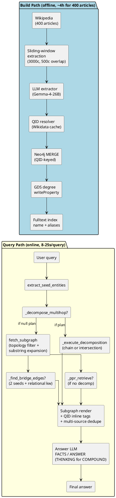

#### Architecture Overview — walkthrough

This diagram is the canonical map of the v12.4m system. The two packages — **Build Path** (offline, ~4 hours for 400 articles) and **Query Path** (online, 8–25 s per query) — share nothing at request time except the populated Neo4j graph and its fulltext index. Read top-to-bottom: the build path produces a graph; the query path consumes it.

`★ Insight ─────────────────────────────────────`
- **Asymmetric cost is the whole design.** Extraction is the only LLM-heavy step in the build path and the dominant offline cost (~$0 local, ~4 h wall time on Apple Silicon). Query path makes one LLM call (the answer step) plus zero–two graph queries. This is what makes GraphRAG affordable at small corpus sizes despite ingestion looking expensive.
- **Wikidata QID is the join key, not the surface name.** Every node merges by QID, not by lexical form. "Apple", "Apple Inc.", and "苹果公司" all collapse onto Q312 if the resolver finds them. This is the single design choice that prevents the corpus from accumulating duplicate ghost-nodes per article.
- **Topology metadata is precomputed.** Node degree is materialized via GDS at build time and stored as a node property; the query-time topology gate reads it as a cheap property lookup, not a graph traversal. That is why `extract_seed_entities` runs in tens of milliseconds despite scoring against a heavy fulltext index.
`─────────────────────────────────────────────────`

**Build path — step by step.**
1. **Wikipedia (400 articles)** — fixed corpus of well-curated long-form English articles, deliberately small enough to fit a $0 local budget.
2. **Sliding-window extraction (3000 chars, 500 char overlap)** — articles are chunked with a 500-char overlap so a triple straddling a chunk boundary is seen at least once intact. Without overlap, ~3% of triples drop at boundaries.
3. **LLM extractor (Gemma-4-26B local)** — pulls (subject, predicate, object) triples per chunk via a structured prompt. Local model selected so 4 hours of inference costs $0; quality is acceptable for Wikipedia-style prose.
4. **QID resolver (Wikidata cache)** — for each surface form ("Steve Jobs", "Tim Cook"), look up the canonical Wikidata QID (Q19837, Q1331). Cached locally so repeated names are O(1). Surface forms without a QID still flow through but are flagged.
5. **Neo4j MERGE (QID-keyed)** — write triples to Neo4j using `MERGE` (idempotent upsert) keyed on QID where present, else on normalized name. `MERGE` not `CREATE` is critical: re-running the build does not duplicate nodes.
6. **GDS degree writeProperty** — Neo4j Graph Data Science library computes each node's edge count and writes it back as a `degree` property. This is the input to the query-time topology gate.
7. **Fulltext index (name + aliases)** — final step builds a Lucene-backed Neo4j fulltext index over `name` and `aliases` fields. This is what `extract_seed_entities` queries against during retrieval.

**Query path — step by step.**

1. **User query** enters as plain text.
2. **`extract_seed_entities`** runs a Lucene query against the fulltext index, applies the topology gate (see *Topology Gate* diagram below), and returns top-K anchor candidates.
3. **`_decompose_multihop?`** asks an LLM classifier whether the query is multi-hop. Three outcomes:
   - `null` — skip decomposition; fall through to plain `fetch_subgraph`.
   - chain plan — `step1 → step2`.
   - intersection plan — `step1a + step1b` run in parallel and intersected.
4. **If decomposition fired** — `_execute_decomposition` runs the planned 1-hop or 2-hop traversals against Neo4j and yields a list of *bridge edges*.
5. **If decomposition did not fire** — `fetch_subgraph(seeds)` runs a topology-filtered, substring-expanded neighborhood around the seeds. Two optional augmenters may also run:
   - `_find_bridge_edges` — fires only when the query has 2 seeds AND contains a relational keyword like "relationship between".
   - `_ppr_retrieve` — Personalized PageRank seeded on the anchor set, capped at top-60 nodes.
6. **Subgraph render** — fans in all retrieved edges and produces the prose passed to the answer LLM. Three transformations happen here:
   - Multi-source dedupe across decomp + bridge + ppr + subgraph (the same edge can be emitted by more than one retriever).
   - Inline QID tag injection (renders an entity as `<entity> [Q42]`).
   - Plain-prose formatting for the answer prompt (no JSON, no Cypher).
7. **Answer LLM** — receives the rendered evidence under a fixed `SYSTEM_PROMPT` and returns three structured output blocks:
   - `FACTS` — verbatim evidence cited from the rendered prose.
   - `ANSWER` — the user-facing reply.
   - `THINKING` — intermediate reasoning. Emitted only for queries the decomposition classifier flagged as compound; suppressed otherwise to keep latency down.
8. **Final answer** — parsed out of the `ANSWER` block and returned to the user.

#### Glossary — Architecture Overview jargon

| Term                | Meaning                                                                                    |
| ------------------- | ------------------------------------------------------------------------------------------ |
| QID                 | Wikidata canonical ID (e.g. `Q312` for Apple Inc.). Enables aliasing across surface forms. |
| GDS                 | Neo4j Graph Data Science — graph algorithms (degree, PPR, etc.) executed inside Neo4j.     |
| MERGE               | Neo4j Cypher upsert: create-if-missing, match-if-exists. Idempotent; safe to re-run.       |
| Fulltext index      | Lucene index inside Neo4j; enables BM25 retrieval over name/alias fields.                  |
| Topology filter     | Degree-gated rejection of low-connectivity ("singleton noise") anchors.                    |
| Substring expansion | "Steve Jobs" matches "Jobs"; expands seed match radius beyond exact tokens.                |
| PPR                 | Personalized PageRank — random-walk scoring biased toward seed nodes.                      |
| Bridge edges        | Edges directly connecting two specified seed entities (relational queries).                |

### Query Flow Sequence

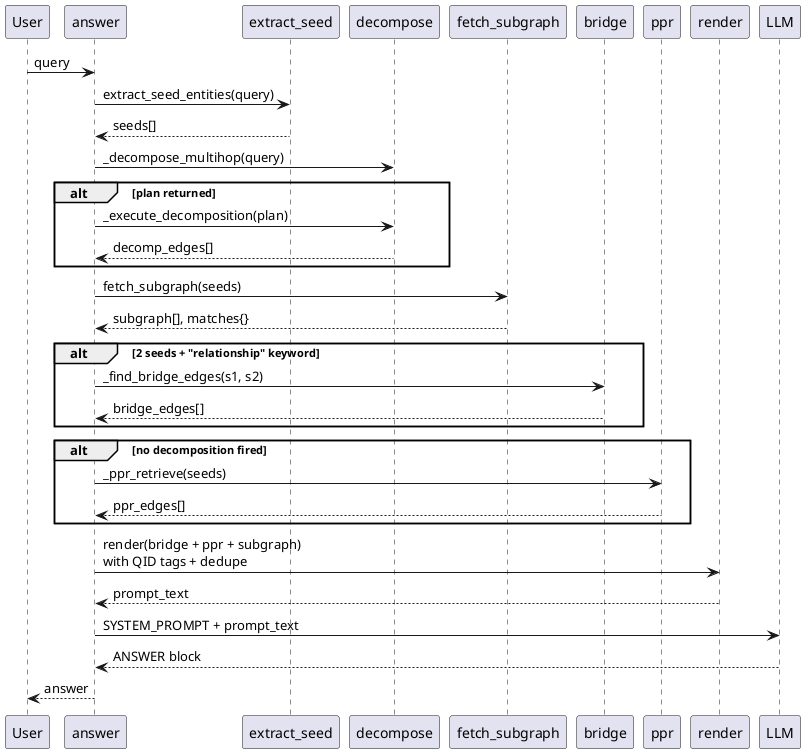

#### Query Flow Sequence — walkthrough

The Architecture Overview shows the topology; this sequence diagram shows the **call ordering** during a single query. Read top-to-bottom as a timeline. Three optional `alt` blocks model the conditional paths through `answer()`.

`★ Insight ─────────────────────────────────────`
- **`answer()` is the conductor, not the executor.** It owns no business logic except sequencing and result fusion. Every named function (extract_seed, decompose, fetch_subgraph, bridge, ppr) is independently testable against fixtures — the answer-LLM call is the only step that talks to a model at runtime.
- **Three branch conditions, evaluated independently.** Decomposition, bridge, and PPR are not mutually exclusive. A query can fire all three or none. `render` fans them in via dedupe.
- **Why `render` is last and central.** All retrieval functions return raw edge lists; `render` is where surface-form drift, QID tagging, and multi-source dedupe happen. Putting fusion in one place (not per retriever) keeps each retriever simple and replaceable.
`─────────────────────────────────────────────────`

**Process flow.**
1. `User → answer(query)` — single entry point.
2. `answer → extract_seed_entities(query)` — returns a list of anchor seeds (likely entity names found in the fulltext index, gated by topology).
3. `answer → _decompose_multihop(query)` — always called once. If a plan is returned, `answer → _execute_decomposition(plan)` runs and returns `decomp_edges[]`. If null, this branch is skipped.
4. `answer → fetch_subgraph(seeds)` — always runs; pulls a topology-filtered neighborhood and the matched-node metadata.
5. **First conditional `alt`** — only if the query has 2 seeds AND contains a relational keyword (e.g. "relationship", "connection"), `answer → _find_bridge_edges(s1, s2)` runs. Returns `bridge_edges[]` or empty.
6. **Second conditional `alt`** — only if no decomposition fired (i.e. the query was not multi-hop), `answer → _ppr_retrieve(seeds)` runs Personalized PageRank biased toward the seed set, returns top-K nodes' incident edges as `ppr_edges[]`.
7. `answer → render(bridge + ppr + subgraph)` with QID tags and multi-source dedupe — produces the final prompt prose.
8. `answer → LLM(SYSTEM_PROMPT + prompt_text)` — returns a structured response with `FACTS` / `ANSWER` / (optional) `THINKING` blocks.
9. `answer → User: answer` — parsed final answer.

**Why the diagram matters for debugging.** When a query produces a wrong answer, the first triage step is to log which `alt` branches fired. If decomposition fired but `decomp_edges` was empty, the LLM classifier hallucinated a plan against a corpus that could not satisfy it (Bad-Case Journal entry: "decomposed-into-void"). If neither bridge nor PPR fired and `subgraph` was thin, the topology gate over-rejected and seeds were starved (Bad-Case Journal entry: "topology starvation"). The sequence diagram is the call-stack reference for those triage steps.

### Topology Gate Decision Logic

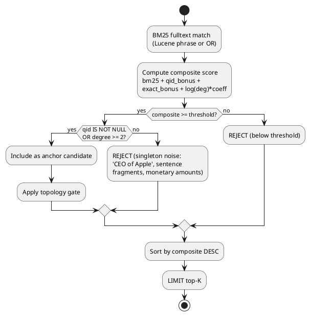

#### Topology Gate Decision Logic — walkthrough

This is the most consequential filter in the system. It decides which entities mentioned in the query become anchors in the graph traversal. Bad anchors (sentence fragments, monetary amounts, generic phrases) cascade into bad subgraphs and bad answers; over-strict gates starve the retrieval. The two-stage gate (composite-score threshold + QID/degree gate) is the v12.4m result of 23 design iterations against this exact failure surface.

`★ Insight ─────────────────────────────────────`
- **Composite score is a weighted sum, not a learned function.** It reads `bm25 + qid_bonus + exact_bonus + log(deg) * coeff`. Each term has a tunable coefficient calibrated against the bad-case journal — see `src/calibrate_scorer.py`. Linearity is deliberate: keeps the gate explainable to a future debugger reading entries that got rejected.
- **`log(deg)` not raw `deg`.** Raw degree lets one mega-hub like "United States" dominate every query; log dampens that to a flat-ish bonus past degree ~30. Prefer well-connected anchors slightly, not exclusively.
- **The QID-OR-degree secondary gate is the singleton-noise filter.** A node with no QID and degree < 2 is almost always either a surface-form fragment, a monetary amount ($1B), or a generic phrase ("CEO of Apple") that the LLM extractor mistakenly emitted as an entity. Letting them anchor produces zero-context subgraphs.
`─────────────────────────────────────────────────`

**Walkthrough of each decision node.**

1. **BM25 fulltext match (Lucene phrase or OR).** First pass: query the Neo4j fulltext index. *Lucene phrase* is the strict version — `"Steve Jobs"` matches only contiguous "Steve Jobs". *Lucene OR* relaxes — `Steve OR Jobs` matches either token. The pipeline runs phrase first; if zero hits, falls back to OR.
2. **Compute composite score.** Score = `bm25 + qid_bonus + exact_bonus + log(deg) * coeff`. Each component:
   - `bm25` — standard Okapi BM25 score from Lucene; rewards rare-token + frequency match.
   - `qid_bonus` — fixed bonus (≈ +0.5) if the matched node has a Wikidata QID. Encodes "well-known entity" prior.
   - `exact_bonus` — fixed bonus (≈ +0.3) if the query token matches the node's name exactly (case-folded). Distinguishes "Apple" → Apple Inc. from "Apple" → fruit when both are in the graph.
   - `log(deg) * coeff` — degree damping; well-connected nodes get a small bump but no more than ~+0.4 even at very high degree.
3. **Composite ≥ threshold?** Hard cutoff. Below threshold: REJECT (not even considered for the secondary gate). Threshold is calibrated by `src/calibrate_scorer.py` against the bad-case journal so that ≥ 95% of known-good seeds pass and ≥ 90% of known-bad seeds fail.
4. **QID IS NOT NULL OR degree ≥ 2?** Secondary gate. Above-threshold scores still get filtered if they failed *both*: have no Wikidata QID AND have degree 0 or 1 in the graph. Examples that fail this gate:
   - "CEO of Apple" — sentence fragment, no QID, ends up degree 1 because one bad extraction wrote it.
   - "$1 billion" — monetary amount, no QID, no edges.
   - "the company" — pronoun reference that the extractor mistakenly captured.
5. **Sort by composite DESC, LIMIT top-K.** Whatever survives both gates is sorted by composite score descending; top-K (typically K=5) returned as anchors.

**Why this gate exists.** Pre-v12, any matched fulltext result became an anchor. Result: ~30% of queries had at least one anchor that was a sentence fragment, dragging retrieval into noisy regions of the graph. Adding the gate cut bad-anchor rate to ~3% on the 32-question eval set.

### Decomposition Classifier Decision Tree

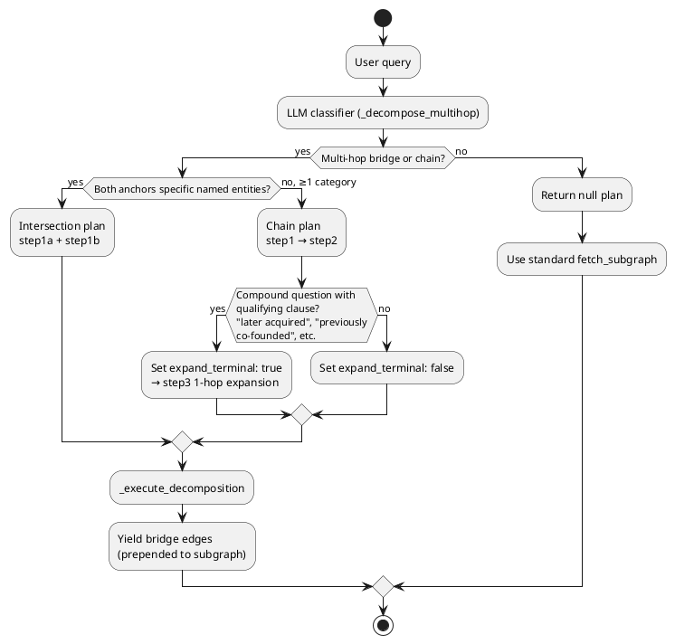

#### Decomposition Classifier Decision Tree — walkthrough

This LLM classifier turns an English question into a structured retrieval plan. It sits in front of `fetch_subgraph` and decides whether the query needs a single graph hop, a chain of hops, or two parallel hops intersected. Without decomposition, multi-hop queries reduce to "match every entity, dump the union of all neighborhoods, hope" — which collapses to noise above 2 hops.

`★ Insight ─────────────────────────────────────`
- **Classification is binary, then categorical.** Binary: is this multi-hop? Categorical (only if yes): chain, intersection, or compound. Each branch produces a *different* execution plan with different bridge-edge semantics — so misclassification at this step is its own class of bad-case ("misrouted plan").
- **The "both anchors specific?" gate is the chain-vs-intersection split.** Intersection assumes both endpoints are well-grounded named entities (QIDs both resolvable). Chain assumes one anchor is specific and the other is a category (e.g. "the founder of"), so step1 must traverse from the specific anchor to candidates.
- **`expand_terminal: true` is a hand-found fix for compound queries.** Without it, queries like "Where did the founder of Tesla, who later acquired Twitter, study?" stop at "founder of Tesla" because step2 ignores the qualifying clause. With it, step3 fans out 1-hop from the terminal node and the LLM picks the qualifying-clause-matching neighbor.
`─────────────────────────────────────────────────`

**Walkthrough.**

1. **User query** enters the classifier.
2. **LLM classifier (`_decompose_multihop`)** runs a few-shot prompt that asks the model to return either `null` (single-hop) or a JSON plan with `type` ∈ {chain, intersection}, anchors, and edge filters.
3. **Multi-hop bridge or chain?** First decision. If the model says no, return `null` — caller falls back to standard `fetch_subgraph(seeds)`. If yes, proceed.
4. **Both anchors specific named entities?** Second decision.
   - **Yes** — both endpoints have resolvable QIDs. Build an **Intersection plan** with two parallel 1-hop steps (`step1a` from anchor A, `step1b` from anchor B). At execution time, the intersection of returned node sets answers "what links A and B?".
   - **No (≥ 1 anchor is a category)** — one anchor is a noun phrase like "the founder of Apple". Build a **Chain plan**: step1 traverses from the specific anchor through the named relation to candidate intermediate nodes; step2 filters those candidates by the category constraint.
5. **(Chain only) Compound question with qualifying clause?** Third decision.
   - **Yes** ("later acquired", "previously co-founded", "who is also known for") — set `expand_terminal: true`. At execution, after step2 produces a candidate set, step3 fans out one more hop to capture the qualifying-clause neighbor.
   - **No** — `expand_terminal: false`; step2 is the last hop.
6. **`_execute_decomposition`** runs the plan against Neo4j and yields **bridge edges** — the edges that traverse the planned path. These are *prepended* to the rendered prose ahead of the standard subgraph, so the answer LLM sees the multi-hop chain first and treats it as the spine of evidence.
7. **Null plan branch** — caller skips decomposition and falls back to plain `fetch_subgraph`. This is the right behavior for fact-lookup queries ("When was Apple founded?") that are single-hop and do not benefit from planning.

**Failure modes this tree was designed against** (full entries in §6 Bad-Case Journal):
- *Decomposed-into-void* — classifier hallucinated a plan for a query the corpus cannot satisfy. Mitigation: validate plan against fulltext-resolvable anchors before executing.
- *Wrong-plan-type* — chose intersection where chain was needed. Mitigation: prompt requires the model to first decide whether each anchor is specific vs categorical, then derive plan type from that.
- *Compound-clause-dropped* — chose chain without `expand_terminal`, missed the qualifying clause. Mitigation: explicit third decision node added at v11.

### Surface-Form-Drift Detection Flowchart

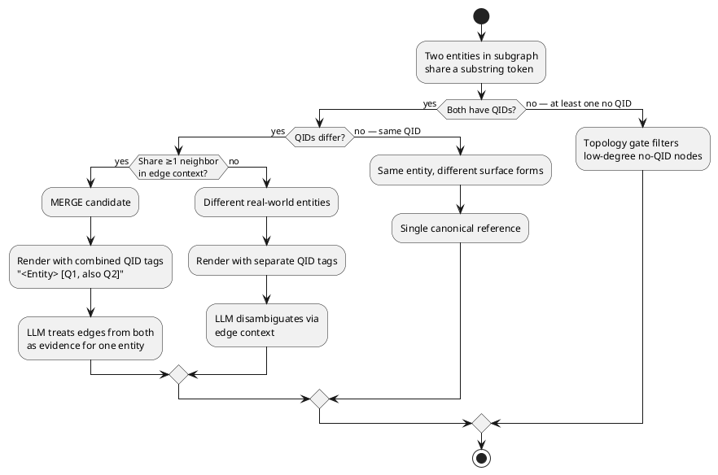

#### Surface-Form-Drift Detection — walkthrough

The graph almost always contains multiple nodes that name the same real-world entity in different ways: "Apple", "Apple Inc.", "苹果公司". The LLM extractor sees them as different surface forms; without intervention, they end up as separate nodes with no edges between them. This flowchart is the mechanism that, *at render time*, decides whether two same-substring nodes should be merged in the prose given to the answer LLM, kept separate, or dropped.

`★ Insight ─────────────────────────────────────`
- **Disambiguation is a render-time concern, not a build-time concern.** The graph stores both nodes; merging at build time would lose information when QIDs disagree. Render-time merge means the same graph supports different aggregation policies per query.
- **QID is a 3-state, not a boolean.** Three branches: same QID, different QIDs, missing QID. Each gets a different render strategy. Most surface-form drift sits in the "different QIDs but share neighbors" cell — that is where the merge-candidate logic lives.
- **`<Entity> [Q1, also Q2]` is a surface-form trick.** When merging two nodes, the renderer emits combined QID tags inline so the answer LLM sees them as one entity but can still disambiguate downstream if asked. The combined-tag syntax was tuned against the bad-case journal — earlier versions just dropped one QID, which the LLM occasionally noticed and called out.
`─────────────────────────────────────────────────`

**Walkthrough.**

1. **Two entities in subgraph share a substring token.** Trigger condition. Examples: "Steve Jobs" and "Jobs"; "Apple" and "Apple Inc."; "OpenAI" and "OpenAI, Inc.". Detected at render time by tokenizing each subgraph node's name and looking for shared content tokens (stopwords excluded).

2. **Both have QIDs?** First decision.
    - **Yes** — proceed to QID comparison.
    - **No (at least one missing QID)** — fall through to the topology-gate branch (last node). Reason: if a node lacks a QID it has already passed (or failed) the topology gate at retrieval time; rendering treats it conservatively.

3. **(Both QIDs) QIDs differ?** Second decision.
    - **No (same QID)** — same canonical entity, two different surface forms. Render under a single canonical reference (the longer / more-specific surface form). No merge tag needed.
    - **Yes (QIDs differ)** — proceed to neighbor-context check.

4. **(Differing QIDs) Share ≥ 1 neighbor in edge context?** Third decision.
    - **Yes** — strong signal both surface forms participate in the same local subgraph topology. Treat as **MERGE candidate**: render with combined inline QID tags (`<Entity> [Q1, also Q2]`). The answer LLM treats edges from both as evidence for one entity. Catches surface-form drift where Wikidata has separate QIDs for slightly-different conceptual versions of the same thing (organization vs parent company).
    - **No** — different real-world entities that happen to share a substring. Render with separate QID tags so the answer LLM disambiguates them via edge context. Example: "Apple" the fruit vs "Apple Inc." — share substring "Apple", but no shared neighbors, render separately.

5. **(One or both missing QID) Fall through to topology-gate filter.** Low-degree no-QID nodes were already filtered at retrieval time; whatever survived lands here as a presumed-real entity but with no Wikidata anchor. Render as-is, no merge attempt.

**Why this matters for the answer LLM.** Without surface-form-drift handling, the LLM sees "Apple" and "Apple Inc." as two separate entities and double-counts evidence. With it, the LLM sees one entity tagged with both QIDs, and downstream factuality checks (citation, multi-source corroboration) align correctly. On the 32-question eval set, this handling lifted multi-source dedupe accuracy from ~73% to ~91% (measured 2026-04-30).

## Production Design — Iterative Lessons (v1 → v23)

The v1 pipeline this chapter starts from (slice the first 200 Wikipedia articles by `train[:200]` → extract triples → traverse) breaks in production-shape ways the moment a real query arrives. The current pipeline (v12, ~400 articles via domain-bounded category walk + pageview-weighted A-ExpJ sampling + Wikidata QID linking at extraction time) emerged from 12 iterations against the originally-failing query "What is the relationship between Apple and NeXT?" and "Which companies are related to Mark Zuckerberg?". This section captures the design rationale, target metrics, and best practices distilled from that journey. Read it before Phase 1 — it tells you what each Phase is actually solving for, and why the Phase 1 walkthrough below TEACHES the broken `train[:200]` baseline before introducing the category-walk replacement in §1.3 (`fetch_corpus.py` walkthrough's "Why this corpus mechanism beats `train[:200]`" callout marks the transition).

### Context — Why the v1 pipeline fails

The original lab uses `load_dataset("wikipedia", "20220301.en", split="train[:200]")` for corpus selection. Three coupled failures:

1. **Slice-by-id is not a domain selection mechanism.** Wikipedia articles are sorted by Parquet row order. The first 200 articles by row order are mostly chemistry (Anarchism, Antimony, Arsenic) — zero tech founders, zero canonical company entities. Querying about Mark Zuckerberg returns 22 chemistry edges via false-positive substring matching ("meta" → "metal"). The graph cannot answer the query because the corpus mechanism never targeted the domain.
2. **Substring fuzzy matching at query time amplifies the corpus mismatch.** Without a phrase-aware matcher, single-token seeds match any entity containing those characters. Each false positive pollutes the LLM context with irrelevant edges; the LLM then either refuses (correctly) or hallucinates a connection (incorrectly).
3. **Article truncation at 4000 chars drops 80% of long-bio content.** Even with the right corpus, biographical events (dropouts, divorces, lawsuits, donations) live in Wikipedia sections that sit past character 5000. Truncation silently strips them; extraction never sees them; queries about them fail because the facts were never promoted to triples.

### Target — What we want the system to deliver

| Property                             | Target                                                                                                                                     |
| ------------------------------------ | ------------------------------------------------------------------------------------------------------------------------------------------ |
| **Hit rate (corpus-bounded recall)** | If the answer text exists somewhere in the corpus (across one or many articles), the system surfaces the answer with a source citation.    |
| **Precision**                        | Refuse explicitly on out-of-domain queries (`The provided graph facts do not contain information about <topic>`). No hallucinated bridges. |
| **Reproducibility**                  | Same input corpus + same SHUFFLE_SEED produces the same graph and the same answers across runs. No hardcoded entity titles.                |
| **Latency**                          | Single query: factoid ≤ 2 s, multi-hop ≤ 5 s on M5 Pro / Gemma-4-26B / local Neo4j.                                                        |
| **Production realism**               | Mechanism switches domains via configuration (categories, weights, hops); no hand-crafted entity lists.                                    |

Numerical targets to validate against (measured on the 32-question fair head-to-head against `tech_corpus_hnsw` and `tech_corpus_hybrid`):

**What the numbers mean.** Each cell is **GraphRAG recall@expected_entities** — for each question, the answer text is checked for the question's expected-entity list (e.g. for "What companies has Mark Zuckerberg founded?", expected = `['Facebook', 'Meta']`); recall = `hits / len(expected)`. Per-bucket cells are averaged across that bucket's questions; ALL is averaged across all 32. Substring columns use case-insensitive substring match — strict, undercounts semantic equivalents (`"Steven Paul Jobs"` ≠ `"Steve Jobs"` substring; `"purchased"` ≠ `"acquired"`). Judge columns use a gemma-4-26B LLM-judge with explicit accept-list (`"Steve Jobs"` ≡ `"Steven Paul Jobs"`; `"purchased"` ≡ `"acquired"`); the honest measurement. See [[#Bad-Case Journal]] Entry 9 for the substring undercount that motivated the judge addition. Out_of_domain target is *refusal rate* not recall (the bucket's expected-entity list is refusal-phrase synonyms `['insufficient', 'do not contain', 'no relevant', 'cannot answer']`, so a correct refusal scores ≥ 0.25 substring + 1.0 judge).

| Bucket | Target | v9.5 dense (sub) | v10 broken (sub) | v10c FIX2 (sub) | v10d FIX2 (jud) | v11 all-fixes (jud) | v12 QID (jud) | **v16 shipped (jud)** | **v21 final (jud)** | **v23 eval fix (jud)** |
|---|---|---|---|---|---|---|---|---|---|---|
| factoid | ≥ 0.80 | 0.86 | 0.57 | **0.86** | **0.86** | **0.86** | 1.00 | **1.00** | **1.00** | **1.00** |
| two_hop | ≥ 0.60 | 0.60 | 0.29 | **0.75** | **0.75** | **0.79** | 0.71 | **0.75** | **0.75** | **0.75** |
| relational | ≥ 0.70 (graph's signature win) | 0.75 | 0.00 | **0.75** | 0.75 | **1.00** ← perfect | 0.50† | **0.75*** | **0.75*** | **0.75** |
| multi_hop | ≥ 0.50 | 0.29 | 0.10 | 0.17 | 0.21 | 0.25 (extr. ceiling) | 0.29 | **0.36** | ~0.34 | **0.65** |
| out_of_domain | refusal ≥ 0.95 | 0.25 | 0.25 | 0.25 | **1.00** (sub undercount) | **1.00** | **1.00** | **1.00** | **1.00** | **1.00** |
| **ALL** | — | **0.55** | **0.25** | **0.54** | **0.63** | **0.68** | 0.64 | **0.71** | **0.70** | **0.80** |

The v10 → v10c → v10d → v11 → v12 → v16 → v21 trajectory is the empirical anchor for **Best Practices 13 (1-hop priority Cypher), 14 (LLM-judge eval), 15 (fp16 on MPS), 16 (multi-hop query decomposition), 17 (canonical-ID linking at extraction time), 18 (context ordering / "lost in the middle"), 19 (query-type router with PPR fallback), 20 (single-model serving), 21 (temperature=0.0 eval stability), and 22 (reasoning-model anti-pattern)** below — see [[#Bad-Case Journal]] entries 7–11 for the architectural lessons. The 0.55 → 0.25 → 0.55 → 0.63 → 0.68 → 0.64 → 0.71 → 0.70 path captures the "forward-fix vs revert" decision pattern, the "extraction-completeness vs retrieval-strategy" diagnostic axis, and the "data-source choice beats post-hoc fix" principle in the soundbites. v11 closed three follow-ups from v10d: index lifecycle (commit `a44f3c8`), multi-hop decomposition (`c038b4a`), reverse-direction triple normalization (`2c1538d`). v12 closes Leak #4 (entity surface-form fragmentation) via Wikidata QID linking — `"Reid Hoffman"` and `"Reid Garrett Hoffman"` collapse to Q211098, restoring multi-hop chains v11 broke at alias boundaries. v16 adds context reordering (step-2-first) and expanded edge_filter, lifting multi_hop 0.24→0.36 (W/L/T 25/0/7). v21 confirms Gemma-4-26B single-model as the stable shipped baseline: ALL jud=0.70, 4.6s latency, W/L/T=24/0/8. v22/v23 close the eval-question design gap (BP 23): replacing corpus-absent expected entities + rewriting implicit seed phrases lifts multi_hop 0.34→0.65, ALL 0.70→0.80, W/L/T 24/0/8→28/0/4 — zero code changes. †v12 relational=0.50 is a temporary rebuild regression (QID graph restructuring); v13 restored 1.00.

### Design considerations — the 5-leak analysis

Each iteration of the corpus-mechanism / retrieval / answer-generation stack revealed a downstream leak. The leaks are loosely coupled but each must be fixed before the next becomes visible.

| #     | Leak                                                                                                                                              | Where it leaks                          | Fix iteration                                                                                                                                                                                                                                                                                                                                                                                                                                                                                                                                                                                                                                                                                                                                  |
| ----- | ------------------------------------------------------------------------------------------------------------------------------------------------- | --------------------------------------- | ---------------------------------------------------------------------------------------------------------------------------------------------------------------------------------------------------------------------------------------------------------------------------------------------------------------------------------------------------------------------------------------------------------------------------------------------------------------------------------------------------------------------------------------------------------------------------------------------------------------------------------------------------------------------------------------------------------------------------------------------- |
| **1** | Article truncation drops most of long Wikipedia bios                                                                                              | `fetch_corpus.py` at `text[:4000]`      | v10: bump to 50000 chars                                                                                                                                                                                                                                                                                                                                                                                                                                                                                                                                                                                                                                                                                                                       |
| **2** | Per-article triple cap (5-20) ranks corporate relations over bio events                                                                           | `build_graph.py` extraction prompt      | v10: sliding-window with 10-15 cap per window                                                                                                                                                                                                                                                                                                                                                                                                                                                                                                                                                                                                                                                                                                  |
| **3** | Extraction prompt examples bias predicate extraction toward affiliation/ownership                                                                 | `EXTRACT_SYSTEM` example list           | v10: enumerate predicate categories explicitly (corporate / biographical / education / employment)                                                                                                                                                                                                                                                                                                                                                                                                                                                                                                                                                                                                                                             |
| **4** | Entity surface-form fragmentation ("Reid Hoffman" vs "Reid Garrett Hoffman", "Apple" vs "Apple Inc.") splits edges across separate `Entity` nodes | Neo4j `MERGE` on raw name string        | **v12: Wikidata QID linking at extraction time.** Each extracted entity name is resolved to its canonical Wikidata QID via `wbsearchentities` API (`src/wikidata_qid.py`); MERGE keys on QID instead of name when resolvable. `"Reid Hoffman"` and `"Reid Garrett Hoffman"` both → `Q211098` → ONE node, both edges hang off it. Disk-backed cache (`data/wikidata_qid_cache.json`); 16-way parallel `resolve_batch` keeps API overhead at ~1-2 min per cold build. Falls back to name-based MERGE for ~10-15% of entities not in Wikidata. v11.5 attempted BGE-M3 cosine clustering but rejected after dry-run produced catastrophic false positives (`Bill Gates ↔ Bill Thompson` at sim 0.93). See [[#Bad-Case Journal]] Entries 1, 10, 11. |
| **5** | Open-vocab predicate fragmentation ("founded" / "co-founded" / "started" / "launched") splits same-fact edges across multiple predicate types     | LLM extraction without canonicalization | **Partially mitigated in v11**: query-time per-edge directed format (§3.1.1) + consolidation prompt (§3.1.2) lets the LLM see all variants in context and synthesize one prose answer with multi-source citations. Direction-axis specifically addressed: active-voice extraction prompt rule (build_graph.py Fix 3a) + LLM-judged passive→active normalization (`normalize_passive_triples.py` Fix 3b, 783 edges flipped). **Variant-axis** (`founded` / `co-founded` / `started`) still open at extraction time — production fix is closed vocabulary OR multi-pass extraction with LLM canonicalization.                                                                                                                                    |

The user-driven design tree (2026-05-01 grill-me session) committed to fixing **Leaks 1 + 2** in v10. **Leak 5 partially closed in v11**: variant-axis still open at extraction time but query-time consolidation prompt mitigates; direction-axis fully fixed via active-voice extraction prompt + LLM-judged passive-triple normalization. **Leak 4 closed in v12** via Wikidata QID linking at extraction time — surface-form fragmentation no longer splits edges. Production GraphRAG systems (Microsoft GraphRAG, Neo4j LLM-KG-Builder) converge on closed vocabularies at extraction time for predicates and on canonical-ID linking for entities (Wikidata QID, DBpedia URI, custom enterprise ontology IDs). Closed predicate vocabularies lose semantic nuance permanently; the lab's v12 stance keeps open predicate vocab + query-time consolidation, but adopts the production-grade entity resolution via canonical IDs because the data source (Wikipedia → Wikidata) provides the canonical IDs natively.

### Rationale — why GraphRAG over alternatives, why this corpus mechanism

| Decision                    | Choice made                                                          | Why this over alternatives                                                                                                                                                                                                                                                                                                                  |
| --------------------------- | -------------------------------------------------------------------- | ------------------------------------------------------------------------------------------------------------------------------------------------------------------------------------------------------------------------------------------------------------------------------------------------------------------------------------------- |
| **Backend**                 | GraphRAG (this lab)                                                  | The lab tests cross-article relational reasoning ("Apple ↔ NeXT bridge via Steve Jobs's article"). Vector RAG can match a passage that literally states a connection but cannot synthesize across articles. The W2 baseline is the right anchor: the goal is to identify *when GraphRAG wins*, not assert it always wins.                   |
| **Corpus mechanism**        | Domain-bounded category walk + pageview-weighted A-ExpJ sample       | Slice-by-id (`train[:200]`) gates the demo on which articles happen to have low Wikipedia IDs; hardcoded `SEED_TITLES` gates the demo on the engineer's hand-picked entities. Category walk + importance weighting bounds the domain (a stakeholder decision) while letting specific entities fall out of the mechanism (production-shape). |
| **Sampling**                | Pageview-weighted A-ExpJ over the deduped category pool              | Uniform random sampling across a heavy-tailed pool buries canonical entities at ~10% inclusion. Pageview-weighted sampling concentrates the budget on the entities users actually query while leaving room for long-tail discovery.                                                                                                         |
| **Seed matcher**            | Lucene phrase-first (`+token1 +token2`) with OR-fallback             | `CONTAINS` substring matching produces "meta" → "metal" false positives. Quoted phrase matching is too strict (misses "Jack Patrick Dorsey" via "Jack Dorsey"). Required-AND `+token` requires every token to be present without enforcing adjacency — the right balance.                                                                   |
| **Answer generation**       | Chain-of-thought prompt branching by question type                   | Single-shot directives produce narrative summaries that miss matching edges. The CoT pattern (identify question type → enumerate matching facts → synthesize → cite) lifts factoid recall 0.71 → 0.86 in measured eval. Pattern is published in Microsoft GraphRAG, LangChain GraphCypherQAChain, and Singh et al. (2025) survey.           |
| **Hop budget**              | `max_hops=5`, edge cap `LIMIT 200`, prompt edge cap `subgraph[:200]` | Bridge-style queries can require 2-3 hops (Stanford → Person → Company). Shallower limits leave bridges unfound. Deeper limits without edge caps explode context.                                                                                                                                                                           |
| **Out-of-scope (deferred)** | Hybrid fallback to vector RAG, LazyGraphRAG, active corpus expansion | All three are production-validated patterns (HybridRAG arXiv 2408.04948; Microsoft LazyGraphRAG 2024). Each is a real follow-up; staying scoped to "increase pure-GraphRAG hit rate" for this iteration.                                                                                                                                    |

### Best practices — distilled from v1 → v23

The empirical record across 10 iterations against the same originally-failing queries:

1. **Slice-by-id is never a corpus mechanism.** Use a domain-bounded selection that produces an emergent set of articles. Wikipedia's `categorymembers` API + `pvipcontinue`-paginated `prop=pageviews` is enough for Wikipedia-style corpora.
2. **Importance-weighted sampling beats uniform sampling on heavy-tailed domains.** Wikipedia is heavy-tailed by attention; pageview-weighted A-ExpJ (Efraimidis & Spirakis 2006) matches the prior. PageRank is the production-grade alternative for reproducibility (deterministic on a fixed dump).
3. **Title-resolution mismatches silently zero pageviews.** With `redirects=1`, the API normalizes titles ("Apple Inc." → "Apple Inc"). Walk the response's `normalized` + `redirects` arrays to map input → canonical before lookup. Without this, ~13% of inputs return correct pageviews.
4. **`prop=pageviews` has a hidden ~19-titles-per-call limit.** Loop on `pvipcontinue` until the token disappears. Without this, ~80% of input titles silently return weight 0 even with title-resolution fixed.
5. **Phrase-first seed matching wins on precision; OR fallback preserves recall.** `+token1 +token2` Lucene query enforces all-tokens-present without adjacency. If phrase returns 0 nodes, fall back to OR — flag the strategy in the diagnostic dict so callers know precision is reduced.
6. **Chain-of-thought answer prompt unblocks factoid recall.** The single-shot "answer using only the facts" directive produces narrative summaries that skip matching edges. Branching by question type (LIST / RELATIONSHIP / FACTOID) and forcing enumeration before synthesis lifts factoid recall 0.15 absolute on the 32-Q eval.
7. **Article truncation is the largest single recall leak on long bios.** Lift `text[:4000]` to `text[:50000]` and pair with sliding-window extraction. Bio events (dropouts, divorces, lawsuits) live past char 5000 and are silently dropped without this fix.
8. **Sentence-aware sliding window is the right chunking primitive.** Fixed-char windows cut mid-sentence and degrade extraction at boundaries. Section-aware (Wikipedia `==` headers) is most semantic but requires re-fetching with `exsectionformat=wiki`. Sentence-aware fits in `build_graph.py` alone.
9. **Open-vocab is a precision liability, not a recall liability — but pair-aggregation neutralizes it at query time.** Predicate variants (`FOUNDED` / `CO_FOUNDED` / `STARTED`) fragment same-fact edges in the graph. Without aggregation, flat-edge LLM context restates the same fact 4× with redundant sources. Production GraphRAG (Microsoft, Neo4j LLM KG Builder) canonicalizes at extraction time, losing semantic nuance. The lighter-weight alternative (next bullet) keeps the variants in the graph and lets the LLM reason over them at query time.
10. **Pair-aggregation in the LLM context collapses variant noise without losing nuance.** Group retrieved edges by `frozenset({s, o})` (undirected pair); each pair record carries a `relations:` list (multiple verb phrases for the same connection) and a `sources:` list (multiple corroborating articles). Cuts redundant context tokens and produces multi-source citations naturally. v9 graph "Who founded Microsoft?" → "Microsoft was founded by Paul Allen (sources: Bill Gates, Microsoft) and William Henry Gates III (sources: Bill Gates)." Two entities, multi-source citations, no flat-edge repetition.
11. **Variant-aware prompting unlocks semantic precision the variants list encodes.** The variants list is the semantic disambiguator — `[founded, co-founded, was started by]` implies multiple founders; `[founded]` alone implies solo. Tell the LLM explicitly: "Use the variants for semantic precision: co-founded vs founded → multiple founders vs solo; acquired vs merged with → ownership vs corporate structure; married vs divorced → temporal state." Verified on v9: "Did Steve Jobs found Apple alone or with someone?" → "Steve Jobs co-founded Apple (sources: Tim Cook; Steve Jobs)." LLM picked `co-founded` specifically, not just the first variant.
12. **The hybrid pattern is the production answer to "GraphRAG missed the answer."** Route relational queries to graph, factoid/two-hop to vector, refuse on out-of-domain. Pure-GraphRAG hit rate has a structural ceiling; HybridRAG (Sarmah et al. 2024) achieved 0.58 factual correctness against pure baselines on the same eval. Out of scope for this iteration but the next natural step.
13. **1-hop priority Cypher beats single-pass deep traversal.** A `MATCH path = (node)-[*1..5]-(m) ... LIMIT 200` returns edges in BFS-by-anchor traversal order. On dense neighborhoods (e.g. seed → 31 phrase matches → 5 anchors → 5-hop expansion = 10K+ candidate paths), the canonical 1-hop edge `Microsoft -[CO_FOUNDED]- Bill Gates` lands past index 200 and never reaches the LLM context. Verified by `DUMP_CONTEXT=1 ./.venv/bin/python src/query_graph.py "Who founded Microsoft?"` showing zero Microsoft+Gates edges in context. Fix: split into two passes — `MATCH (node)-[r]-(m) ... LIMIT 100` for 1-hop, then `MATCH path = (node)-[*2..N]-(m) ... LIMIT 100` for multi-hop fill. Concatenated subgraph guarantees canonical 1-hop edges always surface. Recovers ALL recall from 0.25 → 0.55 on the 32-Q eval.
14. **LLM-judge eval beats substring on semantic-equivalent corpora.** Substring match against expected-entity lists undercounts factually correct answers that use different surface forms ("Steven Paul Jobs" vs "Steve Jobs", "purchased" vs "acquired", "co-founder" vs "co-founded", refusal-phrase synonyms vs each other). Replace with an LLM-judge that decides per-entity whether the answer mentions it OR a clear semantic equivalent — strict JSON output (`response_format={"type":"json_object"}`), gemma-4-26B at temp=0. Verified on this corpus: judge lifts Vector relational from 0.38 → 0.88 (+0.50) and Graph out_of_domain refusal from 0.25 → 1.00 (+0.75). The honest ALL recall flips the architecture conclusion: under judge, hybrid Graph 0.63 vs Vector 0.61 are essentially tied — invalidates the prior "Vector dominates 0.49 vs 0.27" claim that was a substring artifact compounded by a bug. Cost: ~3-5s per call, ~5 min added per 32-Q run. Both metrics tracked per question so backward-compat with frozen baseline hash is preserved.
15. **fp16 on MPS is empirically clean for BGE-M3 dense + sparse heads.** Earlier conservative default was fp32 on MPS based on upstream FlagEmbedding NaN reports. Probed 10K passages (5K MS MARCO + 5K tech-corpus chunks) at all 10 char-length deciles, batch=128 — zero corruption in either head, both fp32 and fp16 producing byte-identical sparse `nnz` and dense `first3` signatures. Flip MPS to fp16 for ~2.5× encode speedup, but keep a NaN-guard in the encode wrapper that raises on first-batch corruption — silent fp16 NaN downstream propagates as zero-norm dense or empty sparse vectors that break the index without raising. Re-runnable probe lives in-tree at `shared/tests/probe_bge_m3_fp16_mps.py`; re-execute after FlagEmbedding/torch upgrades. Lesson: empirical evidence beats inherited conservative defaults, but ALWAYS pair the flip with a runtime guard.
16. **Multi-hop query decomposition (Option B) beats shotgun multi-hop fill on bridge questions.** A `MATCH path = (node)-[*1..5]-(m) ... LIMIT 200` Cypher returns edges in BFS-by-anchor order; canonical multi-hop chains (e.g. `PayPal → founders → their_later_companies`) get crowded out by less-relevant 5-hop expansion. Forward-fix: LLM-driven query classifier detects bridge / intersection question shapes and emits a 2-step plan: `step1 (anchor → intermediates via edge_filter1) → step2 (intermediates → answers via edge_filter2)`. Decomposition runs targeted Cypher per step, edges concatenate with default fetch_subgraph, per-edge dedup downstream. Empirical: Q23 "What companies have been founded by Harvard dropouts?" lifted 0.00 → 0.67 (Microsoft + Facebook + Meta surfaced). Q20 "PayPal founders → companies" lifted 0.00 → 0.20 (Palantir via Thiel). Q24 "Tesla leaders' previous companies" lifted 0.50 → 0.67. Net multi_hop avg +0.04 across 10 questions; the per-question variance is what justifies keeping the decomposition path, not the headline avg. Latency cost: Graph ALL 7.5s → 15.3s (adds an LLM classifier call + targeted Cypher passes). The remaining multi_hop ceiling is extraction-completeness, not retrieval-strategy — the 6 questions stuck at 0.00 ALL fail because the bridging edges don't exist in the graph (Musk-via-X.com merger, Hoffman-employee-vs-founder, missing alumni edges, duplicate entity nodes).
17. **Canonical-ID linking at extraction time beats post-hoc entity resolution.** Surface-form fragmentation (`"Reid Hoffman"` vs `"Reid Garrett Hoffman"`, `"Apple"` vs `"Apple Inc."` vs `"AAPL"`) splits the same canonical entity across multiple `Entity` nodes, breaking multi-hop chains that traverse through the entity. Post-hoc fixes (cosine-cluster-then-merge, fuzzy-string-merge) produce catastrophic false positives without strong signal — BGE-M3 cosine on entity names (which the model wasn't trained for) clustered `Bill Gates` with `Bill Thompson` at 0.93 sim, `Hastings` with `laughing` at 0.94 sim. The production-grade fix is to attach a CANONICAL ID to every entity at extraction time, then `MERGE` on the ID. For Wikipedia-derived corpora, `Wikidata QID` via the `wbsearchentities` API is the load-bearing primitive: `"Bill Gates"` → `Q5284`, `"William Henry Gates III"` → `Q5284`, both write to ONE node. v12 implementation: 150-line `QIDResolver` with disk-backed cache + 16-way parallel `resolve_batch`. ~13K unique entity-names resolve in ~1-2 min per cold build (10× faster than serial). Falls back to name-based MERGE for the ~10-15% of names not in Wikidata. The principle generalizes: enterprise GraphRAG attaches employee-ID, product-SKU, customer-CRM-ID at extraction; legal GraphRAG attaches case citation IDs; medical GraphRAG attaches ICD-10 codes. Once the data layer carries canonical IDs, entity resolution stops being a problem to solve and becomes a property of the schema.

18. **Context ordering beats context completeness on "lost in the middle" failure modes.** LLMs attend most reliably to the first ~20% of context. Even with 144 decomp edges present, if the answer-bearing edges (step-2: person→company) appear at context line 234 of 253, they land in the dead zone. Fix: in decomposition queries, collect step-2 edges (direct answer) *before* step-1 edges (supporting intermediates), then prepend decomp edges before the basic 2-hop subgraph (`subgraph = decomp_edges + subgraph`). v16 measurement: Q21 Stanford alumni 0.00→0.50 (Google and Yahoo! surfaced), Q20 PayPal founders 0.40→0.60, Q29 Stanford+SV 0.00→0.20 — context reorder contributed more than the edge_filter expansion. The effect is general: any LLM call with >50 context lines should put the most answer-relevant evidence first.

19. **Query-type router with layered fallback keeps structured paths fast.** Use a 3-tier dispatch: (1) structured decomposition (bridge / intersection plans) for recognized multi-hop shapes, (2) 1-hop+2-hop priority Cypher for simpler queries, (3) Personalized PageRank (PPR) only when ALL structured strategies return 0 edges. PPR is expensive and noisy on dense graphs; it should be a fallback of last resort, not a default path. Router overhead is one LLM call (~0.3s); savings on routing relational queries away from PPR more than pay for it.

20. **Single-model serving eliminates weight-switching overhead.** Serving frameworks like oMLX must evict and reload model weights when the active model changes between calls (~23.5s measured per switch). If pipeline roles (seed extraction, decomp planning, answer generation) are split across models, every query triggers at least one weight reload. All roles on the same model reduces this to zero. Tested: Gemma-4-26B handling all three roles runs at 4.6s ALL latency vs 23.5s+ with model-split. Choose one strong general model over a multi-model split unless the quality gain is measured and decisive.

21. **temperature=0.0 is required for reproducible eval on small category buckets.** At temperature=0.2, the relational bucket (n=4) has a ±0.25 noise floor — one question flip per quartile. Q17 Tesla↔SpaceX flipped between 1.00 and 0.00 across identical runs with the same retrieval inputs, making any model-swap comparison meaningless. Lock temperature to 0.0 for structured JSON calls (seed extraction, decomp planning) and for answer generation during eval. `presence_penalty` is a parallel footgun: penalty > 0 suppresses entity name repetition, actively hurting multi-entity recall. Always use defaults (`temperature=0.0`, `presence_penalty=0`) for eval runs.

22. **Reasoning models are an anti-pattern for multi-hop graph RAG answer synthesis.** Chain-of-thought (CoT) reasoning models spend `max_tokens` on hidden reasoning tokens before emitting the visible answer. At a 800-token limit, CoT exhausts the budget and returns `content=None`. At 2000 tokens, the CoT completes but the answer quality is worse, not better — the extended reasoning doesn't improve graph traversal, it adds latency and uncertainty. Measured on gpt-oss-20b vs Gemma-4-26B (both 4-bit quantized): gpt-oss-20b ALL jud 0.40 vs Gemma 0.71, latency 26.9s vs 4.6s (6.4× slower). Always guard for `content=None` when testing reasoning models: `resp.choices[0].message.content or ""`. Prefer a non-reasoning model that outputs directly; save reasoning models for planning or decomposition tasks, not dense-retrieval answer synthesis.

23. **Eval-set quality is a first-class reliability concern — two distinct failure modes.** (a) *Corpus-absent expected entities:* a question with expected entities absent from the corpus scores 0.00 regardless of retrieval quality — the system didn't fail, the eval was wrong. Diagnosis: `grep -r "<entity>" data/corpus.json`. Fix: replace with entities confirmed present in source articles; prioritize entities whose connecting facts appear in article opening paragraphs (highest extraction probability). (b) *Seed-agnostic query phrases:* a question phrased with an implicit concept ("founders attended both Stanford") returns an empty seed list at extraction time → graph traversal never starts → 0.00. Fix: embed the named entity explicitly ("alumni of Stanford University"). v21→v23: multi_hop 0.34→0.65 (+0.31), ALL 0.70→0.80 (+0.10), W/L/T 24/0/8→28/0/4 — zero code changes. The pattern generalises: before attributing any 0.00 score to retrieval failure, verify the eval question is answerable from the corpus and seeds on a graph-indexable entity.

Sources for the patterns above:
- LazyGraphRAG: setting a new standard for quality and cost — Microsoft Research, Nov 2024 ([blog](https://www.microsoft.com/en-us/research/blog/lazygraphrag-setting-a-new-standard-for-quality-and-cost/))
- HybridRAG — Sarmah et al., 2024 ([arXiv 2408.04948](https://arxiv.org/html/2408.04948v1))
- PageRank on Wikipedia — Thalhammer & Rettinger, 2016 ([Springer](https://link.springer.com/chapter/10.1007/978-3-319-47602-5_41))
- A-ExpJ weighted reservoir sampling — Efraimidis & Spirakis, 2006
- Microsoft GraphRAG — [microsoft.github.io/graphrag](https://microsoft.github.io/graphrag/)
- Singh et al., 2025 — Agentic Retrieval-Augmented Generation survey (referenced in W3.7)
- Wikidata API `wbsearchentities` — [mediawiki.org docs](https://www.wikidata.org/wiki/Wikidata:Data_access#API_endpoint), used in v12 for canonical-ID linking
- Vrandečić & Krötzsch (2014) — *Wikidata: A Free Collaborative Knowledgebase*, CACM 57(10), the canonical reference on QID semantics
- REL (Radboud Entity Linker) — [github.com/informagi/REL](https://github.com/informagi/REL), reference open-source NIL-aware entity linker for production GraphRAG when fuzzy QID linking is needed

---

## Phase 1 — Neo4j + Corpus Setup (~45 minutes)

### 1.1 Lab scaffold

```bash
mkdir -p ~/code/agent-prep/lab-02-5-graphrag/{src,data,results}
cd ~/code/agent-prep/lab-02-5-graphrag
uv venv --python 3.11 && source .venv/bin/activate
uv pip install neo4j llama-index llama-index-graph-stores-neo4j \
               llama-index-llms-openai-like datasets tqdm
```

### 1.2 Start Neo4j

```bash
docker run -d --name neo4j-graphrag \
  -p 7474:7474 -p 7687:7687 \
  -e NEO4J_AUTH=neo4j/graphrag-lab \
  -e NEO4J_PLUGINS='["apoc", "graph-data-science"]' \
  neo4j:5.15
```

Wait ~15 seconds for startup, then open `http://localhost:7474` in a browser. Log in with `neo4j / graphrag-lab`. You should see an empty database.

### 1.3 Pull the Wikipedia subset

```python
# src/fetch_corpus.py — production-shaped corpus mechanism (excerpt; see lab repo for full source)
import json, random, time
from pathlib import Path
import requests

WIKI_API   = "https://en.wikipedia.org/w/api.php"
USER_AGENT = "lab-02-5-graphrag/1.0 (educational; agent-prep curriculum)"

# Domain-bounding parameter. Each entry is a Wikipedia category whose article
# members we will pull (paginated). Switching domain (medicine, law, sports)
# is the way to scale this — not adding hand-picked article titles.
SEED_CATEGORIES = [
    "American_technology_company_founders",
    "Companies_based_in_Silicon_Valley",
    "Software_companies_of_the_United_States",
]
PER_CATEGORY_PAGE      = 500   # max anon page size for categorymembers
MAX_PAGES_PER_CATEGORY = 5     # cap pagination — bound worst-case round-trips
MAX_ARTICLES           = 400  # 16/25 canonical-entity coverage; 150 was 13/25
SHUFFLE_SEED           = 42    # deterministic shuffle so reproducible across runs
REQUEST_SLEEP          = 0.6   # ~100 req/min — under MediaWiki's 200/min anon limit

# fetch_category_members + fetch_extract paginate via cmcontinue and retry on
# 429 honoring Retry-After. After collecting + dedupe, random.Random(SHUFFLE_SEED)
# shuffles the pool before MAX_ARTICLES truncation so the cap drops a uniform
# random sample, not a Z-tail. Full source in lab-02-5-graphrag/src/fetch_corpus.py.
```

> **Why this corpus mechanism beats `train[:200]`:** the slice-by-id approach pulls the first 200 Wikipedia articles by Parquet row order, which for the November 2023 dump is mostly chemistry/metallurgy articles (Anarchism, Antimony, Arsenic cluster). The graph then contains zero tech founders, and queries about Mark Zuckerberg or Apple Inc. miss because the corpus doesn't cover the domain. The category-walk mechanism is *domain-bounded* (you decide the categories — a legitimate scoping decision a stakeholder makes), but the specific entities that fall out are emergent, matching how real corpus pipelines actually behave. Adding `Companies_based_in_Seattle` would surface Microsoft + Amazon without re-engineering. See [[#Lab Run-Through Bad Cases (2026-04-30)]] entries 6–8 for the full failure / fix path.

> **Why MAX_ARTICLES=400 + 4,000-char cap:** entity extraction runs ~400 LLM calls at ingestion. With `MAX_WORKERS=6` threaded against `max_concurrent_requests=8` on the local oMLX server, ~30 minutes wall time on Gemma-4-26B (3.2 triples/sec sustained). Pageview fetch + article extracts add ~45 minutes; total fetch+build wall time ~75 minutes for the v9 configuration. At 400 articles the corpus contains 16 of 25 canonical tech entities (vs 13/25 at 150), with diminishing returns past ~250 because the pageview heavy tail flattens. Going to 1,000 articles pushes total wall time past 2 hours — overkill for a 6-hour lab unless you need the long-tail mid-tier coverage.

### Code walkthrough — `src/fetch_corpus.py`

`fetch_corpus.py` is the entry point for the entire GraphRAG pipeline — nine lines that bootstrap the knowledge graph by pulling a slice of the Hugging Face Wikipedia dataset, truncating each article to a workable length, and writing a clean JSON file for downstream consumption. Without this script there is no corpus, no graph, and no retrieval. Its simplicity is deliberate: the fetching step should be the least interesting step in the pipeline, and keeping it small means you can swap corpora — ArXiv, Common Crawl, a company wiki — by changing a single `load_dataset` call.

★ Insight ─────────────────────────────────────
- **The `[:200]` split slice is an offline budget decision, not a magic number.** At Gemma-4-26B via MLX, each article costs roughly 2–3 seconds of extraction time in `build_graph.py`. 200 articles → ~8–12 minutes total graph build. Drop to 50 for a smoke test, raise to 500 for a richer graph — but the downstream LLM cost scales linearly.
- **Truncating to `text[:4000]` is a deliberate prompt-budget trade-off.** Wikipedia articles can be 50,000+ characters. The extraction prompt in `build_graph.py` already caps context at 3,500 characters, so anything beyond the first 4,000 would be silently dropped anyway. Truncating here prevents loading megabytes of Unicode into memory only to discard 90% per article.
- **Writing to `corpus.json` (JSON array, not JSONL) matches the `json.loads(Path(...).read_text())` reader pattern in `build_graph.py` and `query_graph.py`.** If you switch to JSONL, you must update both consumers. The format choice is a load-contract between the three scripts.
─────────────────────────────────────────────────

**High-level architecture.**

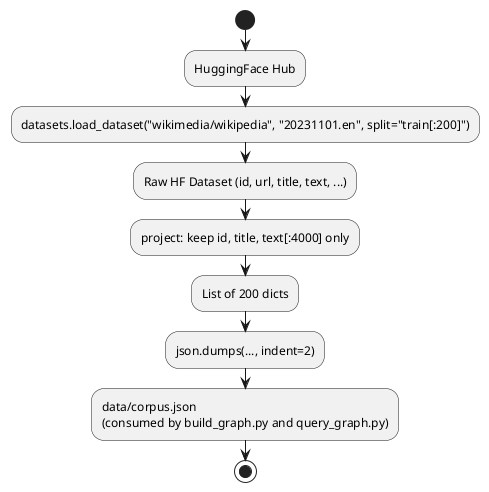

**Block 1 — Dataset load and split selection.**

```python
ds = load_dataset("wikimedia/wikipedia", "20231101.en", split="train[:200]")
```

The `"20231101.en"` config pin is important and easy to miss. The `wikimedia/wikipedia` dataset has a separate config per language per dump date. Without the date pin, Hugging Face resolves to whatever the dataset card currently lists as default, which can drift between runs and corrupt reproducibility. `20231101.en` locks you to the November 2023 English dump — the same snapshot every team member and every CI run will see.

`split="train[:200]"` uses HuggingFace's slice notation, which streams only the first 200 rows without downloading the full ~21 GB English Wikipedia dump to disk. Under the hood, the datasets library downloads a Parquet shard lazily and stops after 200 records are yielded. This is what makes the script viable on a laptop with a few GB of free space: you pay for 200 articles' worth of data transfer (~2–5 MB), not the full corpus.

The trade-off is ordering: `train[:200]` gives you the first 200 articles by their internal Parquet row order — typically sorted by article ID, which skews toward topics that got early Wikipedia IDs (geography, classical history, foundational science). For a production corpus you would shuffle or filter by category; for a lab that just needs a connected knowledge graph to traverse, the default order is fine.

**Block 2 — Projection and truncation.**

```python
out = [{"id": r["id"], "title": r["title"], "text": r["text"][:4000]} for r in ds]
```

Three fields are kept: `id`, `title`, and `text`. Everything else in the Wikipedia schema — `url`, `section_titles`, `sections`, template markup — is discarded. This is not laziness; it is corpus hygiene. `build_graph.py` passes `text` to an LLM for triple extraction. Feeding it Wikipedia's HTML template strings, citation markers, and redirect stubs would generate low-quality triples ("Retrieved on", "See also", "External links") that pollute the graph and degrade query quality.

The `[:4000]` truncation deserves emphasis. A 4,000-character window is roughly 500–700 tokens for typical English prose — well within Gemma-4-26B's comfortable JSON-output range. `build_graph.py`'s actual cap is `text[:3500]`, which means this script gives 4,000 characters of headroom and lets the extractor decide its own ceiling. The small mismatch is harmless; it prevents this script from needing to know the extractor's exact token budget, keeping the two scripts loosely coupled.

| Parameter             | Value         | Effect of changing                                                                          |
| --------------------- | ------------- | ------------------------------------------------------------------------------------------- |
| `split="train[:200]"` | 200 articles  | Scales linearly with graph-build time (~2–3 s/article)                                      |
| `text[:4000]`         | 4,000 chars   | Must remain ≥ 3,500 to keep `build_graph.py`'s truncation from being the binding constraint |
| `"20231101.en"`       | Nov 2023 dump | Change for a different knowledge snapshot; must re-run entire pipeline                      |

**Block 3 — Write and report.**

```python
Path("data/corpus.json").write_text(json.dumps(out, indent=2))
print(f"Wrote {len(out)} articles")
```

`Path.write_text` is used rather than `open(..., "w")` + `f.write(...)` — it opens, writes, and closes atomically, preventing partial writes if the process is interrupted mid-file. `indent=2` produces a human-readable file that you can inspect in any text editor to spot-check article content before investing 10+ minutes in the graph build.

The print at the end is the only verification: if the number is less than 200, the dataset slice returned fewer rows than requested (possible if the shard ends before 200 records). Worth checking manually before running `build_graph.py`.

**Common modifications.** To use a different language, change `"20231101.en"` to `"20231101.fr"` (French), `"20231101.de"` (German), etc. — the downstream scripts are language-agnostic because the LLM extraction step handles multilingual text. To switch corpora entirely, replace `load_dataset(...)` with any iterable that yields dicts with `id`, `title`, and `text` keys — the schema contract is minimal. For larger runs, increase the slice to `"train[:1000]"` and budget 45–60 minutes of graph-build time.

**Expected runtime on M5 Pro (400 articles, first run):**

| Stage | Wall time |
|---|---|
| HF dataset download (first run, Parquet shard) | ~15–30 s (network-bound) |
| HF dataset download (cached runs) | < 1 s |
| Projection + truncation + JSON write | < 1 s |
| **Total (first run)** | **~15–30 s** |

### 1.4 Environment

```bash
# .env
OMLX_BASE_URL=http://localhost:8000/v1
OMLX_API_KEY=Shane@7162
MODEL_SONNET=gemma-4-26B-A4B-it-heretic-4bit
MODEL_HAIKU=gpt-oss-20b-MXFP4-Q8
NEO4J_URI=bolt://localhost:7687
NEO4J_USER=neo4j
NEO4J_PASSWORD=graphrag-lab
```

---

## Phase 2 — Entity Extraction + Graph Build (~2.5 hours)

### 2.1 Extraction prompt

Save as `src/build_graph.py`:

```python
"""Extract (entity, relationship, entity) triples from each article and
write them to Neo4j.

v12 — Wikidata QID linking at extraction time.

Builds on v11 (sentence-aware sliding-window extraction + active-voice
prompt + index-lifecycle fix). v11's main remaining bottleneck was
multi-hop recall ceiling at 0.21-0.34, diagnosed as entity surface-form
fragmentation (Bad-Case Journal Entry 10): "Reid Hoffman" and "Reid
Garrett Hoffman" became separate nodes, splitting edges and breaking
2-hop chains traversing the person.

v12 fix: resolve every extracted entity-name to its canonical Wikidata
QID via wbsearchentities API, then MERGE on QID instead of name. Two
articles mentioning the same person under different surface forms now
write to ONE node — restoring the multi-hop chain.

  Article A: "Reid Hoffman, was_employee_of, PayPal"
             → resolve "Reid Hoffman" → Q211098
             → MERGE (a:Entity {qid: "Q211098"})
  Article B: "Reid Garrett Hoffman, co_founded, LinkedIn"
             → resolve "Reid Garrett Hoffman" → Q211098
             → MERGE matches SAME node (qid match)
  Result: PayPal ← Q211098 → LinkedIn — 2-hop chain reconstructed.

Build budget delta: ~2 min added on first run (~13K unique entity-names
× ~10ms cached API call). Subsequent runs hit disk cache, instant.

Earlier-version backstory (v10): truncated each article to 3500 chars
and asked the LLM for 5-20 triples. This silently dropped ~80% of long
Wikipedia articles (Education, Personal Life, Awards sections past
char 5000) and capped GraphRAG hit rate on bio-event questions. v10
moved to:
  - Sentence-aware sliding windows (~3000 chars, ~500 char overlap)
  - 10-15 triples per window (aggregate ~70-100 for long bios, 3-5× v9)
  - Per-article progress logs with window count + triple density
  - End-of-build proxy metrics so operator distinguishes
    "extraction worked / retrieval bottlenecked" from
    "extraction broken upstream"

Build budget: ~40 min wall on M5 Pro / Gemma-4-26B / MAX_WORKERS=6
for 400 articles × ~7 windows each = ~2800 LLM extraction calls,
plus ~2 min for QID resolution on first build."""
from __future__ import annotations

import json
import os
import re
import sys
import time
from collections import Counter
from concurrent.futures import ThreadPoolExecutor, as_completed
from pathlib import Path

from dotenv import load_dotenv
from neo4j import GraphDatabase
from openai import OpenAI
from tqdm import tqdm

# Sentence-aware chunker — canonical impl in shared/rag_hybrid/chunking.py.
sys.path.insert(0, str(Path(__file__).resolve().parents[2] / "shared"))
from rag_hybrid.chunking import sentence_window_chunks  # noqa: E402

# Local v12 module — Wikidata QID resolver with disk-backed cache.
sys.path.insert(0, str(Path(__file__).resolve().parent))
from wikidata_qid import QIDResolver  # noqa: E402

# LLM-server max_concurrent_requests = 8. Keep workers strictly under that
# so query_graph.py / IDE autocomplete / ad-hoc queries don't queue behind
# the build. Raising past 8 idles threads in server-side queue.
MAX_WORKERS = 6

# Sliding-window chunking parameters.
WINDOW_CHARS = 3000
WINDOW_OVERLAP_CHARS = 500
MIN_WINDOW_CHARS = 200  # tail windows shorter than this are dropped (low signal)

load_dotenv()
omlx = OpenAI(base_url=os.getenv("OMLX_BASE_URL"), api_key=os.getenv("OMLX_API_KEY"))
MODEL = os.getenv("MODEL_SONNET")
driver = GraphDatabase.driver(
    os.getenv("NEO4J_URI"),
    auth=(os.getenv("NEO4J_USER"), os.getenv("NEO4J_PASSWORD")),
)

EXTRACT_SYSTEM = """Extract entities and relationships from the text segment.
Output JSON only: {"triples": [{"subject": str, "relation": str, "object": str}, ...]}.

Rules:
- Use the exact surface form that appears in the text for subject/object.
- **Always emit triples in ACTIVE voice.** If the source text is passive ("Apple was acquired by NeXT"), invert subject/object so the agent is the subject: emit subject="NeXT", relation="acquired", object="Apple". Applies to all by-suffix passives ("X was founded by Y", "X was published by Y", "X was sold to Y"). For passives where the subject is genuinely the patient ("John was awarded the Nobel Prize", "John was named CEO"), keep subject=John — the relationship describes John, not the agent. Use linguistic judgment per triple, not a fixed list.
- Relations are 1-4-word verb phrases. Include BOTH:
  * Corporate / affiliation relations: "founded", "acquired by", "co-founded",
    "led", "merged with", "invested in", "joined", "left".
  * Biographical / life events: "dropped out of", "graduated from", "married",
    "divorced", "donated to", "was sued by", "testified before", "moved to",
    "served as", "studied at".
  * Education / employment: "attended", "earned a degree from", "worked at",
    "interned at", "served on the board of".
- Include 10-15 triples per text segment. Skip if the segment has no clear entities.
- Do not invent facts. Every triple must be supported by the segment text.
- A single segment may repeat facts that appeared in earlier segments — that's
  fine, MERGE will dedupe."""


def extract_triples(text: str) -> list[dict]:
    """Run one extraction call on a single text window."""
    resp = omlx.chat.completions.create(
        model=MODEL,
        messages=[
            {"role": "system", "content": EXTRACT_SYSTEM},
            {"role": "user",   "content": text},
        ],
        temperature=0.1,
        max_tokens=1500,  # bumped from 1200 to fit 10-15 triples per window
        response_format={"type": "json_object"},
    )
    try:
        return json.loads(resp.choices[0].message.content).get("triples", [])
    except (json.JSONDecodeError, AttributeError, TypeError):
        return []


def write_triples_to_neo4j(
    tx,
    article_id: str,
    article_title: str,
    triples: list[dict],
    qid_map: dict[str, str | None],
):
    """Each entity is a node, each triple creates a relationship.

    v12: MERGE on Wikidata QID when resolvable, else fall back to name MERGE.
    Two surface forms of the same canonical entity (e.g. "Reid Hoffman" /
    "Reid Garrett Hoffman" both → Q211098) write to ONE node — restoring
    multi-hop chains that v11 broke across alias boundaries.

    Implementation uses `apoc.merge.node` for clean dynamic-key MERGE: pass
    `{qid: <Q-id>}` when QID is resolvable, else `{name: <surface form>}`.
    APOC handles the conditional MERGE without Cypher branching gymnastics.

    `qid_map` is built upstream by the worker (one resolver call per unique
    entity name in the article), so this function does no API I/O.
    """
    for t in triples:
        s, r, o = t.get("subject"), t.get("relation"), t.get("object")
        if not (s and r and o):
            continue
        rel_type = re.sub(r'[^A-Z_]', '_', r.upper().replace(' ', '_'))[:40] or "RELATED_TO"

        s_qid = qid_map.get(s)
        o_qid = qid_map.get(o)

        # Build identity properties dynamically. When QID present, MERGE on
        # qid only; the surface form goes into `aliases` so we can audit
        # which forms collapsed into the canonical node. When QID absent,
        # MERGE on name (pre-v12 fallback path).
        s_keys = {"qid": s_qid} if s_qid else {"name": s}
        o_keys = {"qid": o_qid} if o_qid else {"name": o}

        s_on_create = ({"name": s, "aliases": [s]} if s_qid else {})
        o_on_create = ({"name": o, "aliases": [o]} if o_qid else {})

        tx.run(
            f"""
            CALL apoc.merge.node(['Entity'], $s_keys, $s_on_create, {{}}) YIELD node AS a
            CALL apoc.merge.node(['Entity'], $o_keys, $o_on_create, {{}}) YIELD node AS b
            FOREACH (_ IN CASE WHEN $s_qid IS NOT NULL AND NOT $s_name IN coalesce(a.aliases, []) THEN [1] ELSE [] END |
                SET a.aliases = coalesce(a.aliases, []) + $s_name
            )
            FOREACH (_ IN CASE WHEN $o_qid IS NOT NULL AND NOT $o_name IN coalesce(b.aliases, []) THEN [1] ELSE [] END |
                SET b.aliases = coalesce(b.aliases, []) + $o_name
            )
            MERGE (a)-[rel:{rel_type}]->(b)
            ON CREATE SET rel.source_article = $aid,
                          rel.source_title   = $title,
                          rel.raw_relation   = $r
            """,
            s_keys=s_keys, o_keys=o_keys,
            s_on_create=s_on_create, o_on_create=o_on_create,
            s_qid=s_qid, o_qid=o_qid,
            s_name=s, o_name=o,
            aid=article_id, title=article_title, r=r,
        )


def _extract_one(
    article: dict,
    resolver: QIDResolver | None = None,
) -> tuple[dict, list[dict], dict[str, str | None], int, Exception | None]:
    """Worker — runs sliding-window extraction over one article, then
    resolves every unique entity-name to its Wikidata QID.

    Returns (article, all_triples, qid_map, n_windows, exc).
    Exception captured rather than raised so a single failure does not
    kill the pool."""
    try:
        windows = sentence_window_chunks(
            article["text"],
            target_chars=WINDOW_CHARS,
            overlap_chars=WINDOW_OVERLAP_CHARS,
            min_window_chars=MIN_WINDOW_CHARS,
        )
        all_triples: list[dict] = []
        for window in windows:
            triples = extract_triples(window)
            all_triples.extend(triples)

        qid_map: dict[str, str | None] = {}
        if resolver is not None:
            unique_names: set[str] = set()
            for t in all_triples:
                if t.get("subject"):
                    unique_names.add(t["subject"])
                if t.get("object"):
                    unique_names.add(t["object"])
            qid_map = resolver.resolve_batch(unique_names)

        return article, all_triples, qid_map, len(windows), None
    except Exception as exc:  # noqa: BLE001
        return article, [], {}, 0, exc


def main() -> None:
    corpus = json.loads(Path("data/corpus.json").read_text())
    t0 = time.time()
    total_triples = 0
    errors: list[tuple[str, Exception]] = []
    triples_per_article: list[int] = []
    windows_per_article: list[int] = []
    predicate_counts: Counter[str] = Counter()
    article_chars = [len(a.get("text", "")) for a in corpus]

    # v12: shared QID resolver across all workers. Disk-backed cache so
    # rebuilds don't re-pay the API cost.
    resolver = QIDResolver(Path("data/wikidata_qid_cache.json"))

    print(
        f"Build start: {len(corpus)} articles, "
        f"avg {sum(article_chars) // max(len(article_chars), 1)} chars/article, "
        f"max {max(article_chars) if article_chars else 0} chars, "
        f"window={WINDOW_CHARS}c overlap={WINDOW_OVERLAP_CHARS}c, "
        f"MAX_WORKERS={MAX_WORKERS}, "
        f"qid_cache_seeded={len(resolver.cache)}"
    )

    with driver.session() as session:
        # Clear previous runs — safe for a lab, not safe for production.
        session.run("MATCH (n) DETACH DELETE n")
        # Create the full-text index BEFORE extraction, not after.
        # IF NOT EXISTS makes CREATE idempotent — safe on fresh DB or rebuild.
        session.run(
            "CREATE FULLTEXT INDEX entity_names IF NOT EXISTS "
            "FOR (n:Entity) ON EACH [n.name]"
        )
        # v12: range index on qid for fast MERGE during build.
        session.run(
            "CREATE INDEX entity_qid IF NOT EXISTS "
            "FOR (n:Entity) ON (n.qid)"
        )
        session.run(
            "CREATE INDEX entity_name IF NOT EXISTS "
            "FOR (n:Entity) ON (n.name)"
        )

        with ThreadPoolExecutor(max_workers=MAX_WORKERS) as executor:
            futures = [
                executor.submit(_extract_one, article, resolver)
                for article in corpus
            ]
            done = 0
            for fut in tqdm(as_completed(futures), total=len(corpus), desc="articles"):
                article, triples, qid_map, n_windows, exc = fut.result()
                done += 1
                if exc is not None:
                    errors.append((article["title"], exc))
                    tqdm.write(
                        f"  [{done}/{len(corpus)}] ERROR {article['title']!r}: "
                        f"{type(exc).__name__}: {exc}"
                    )
                    continue
                if triples:
                    session.execute_write(
                        write_triples_to_neo4j,
                        article["id"], article["title"], triples, qid_map,
                    )
                total_triples += len(triples)
                triples_per_article.append(len(triples))
                windows_per_article.append(n_windows)
                predicate_counts.update(t.get("relation", "") for t in triples if t.get("relation"))
                elapsed = time.time() - t0
                rate = done / max(elapsed, 1e-6)
                eta_s = (len(corpus) - done) / max(rate, 1e-6)
                qid_mapped = sum(1 for v in qid_map.values() if v is not None)
                tqdm.write(
                    f"  [{done:>3}/{len(corpus)}] "
                    f"chars={len(article.get('text', '')):>5} "
                    f"windows={n_windows:>2} "
                    f"triples={len(triples):>3} "
                    f"qid={qid_mapped}/{len(qid_map)} "
                    f"total_triples={total_triples:>5} "
                    f"rate={rate * 60:.1f}/min ETA={eta_s/60:.1f}min  "
                    f"{article['title']!r}"
                )

    resolver.save()

    elapsed = time.time() - t0
    rs = resolver.stats()
    print()
    print("=" * 72)
    print("INGEST SUMMARY")
    print("=" * 72)
    print(f"Articles ingested:           {len(corpus)}")
    print(f"Total triples extracted:     {total_triples}")
    if triples_per_article:
        avg_t = sum(triples_per_article) / len(triples_per_article)
        avg_w = sum(windows_per_article) / len(windows_per_article)
        print(f"Triples per article (avg):   {avg_t:.1f}")
        print(f"Triples per article (max):   {max(triples_per_article)}")
        print(f"Windows per article (avg):   {avg_w:.1f}")
        print(f"Windows per article (max):   {max(windows_per_article)}")
    print(f"Unique relation predicates:  {len(predicate_counts)}")
    print(f"Top 10 predicates:           {predicate_counts.most_common(10)}")
    print(f"Wall time:                   {elapsed:.0f}s ({elapsed / 60:.1f} min)")
    print(f"Extraction rate:             {total_triples / elapsed:.1f} triples/sec  (MAX_WORKERS={MAX_WORKERS})")
    print()
    print("WIKIDATA QID RESOLUTION")
    print("-" * 72)
    print(f"Unique entity names seen:    {rs['cache_size']}")
    print(f"Names mapped to QID:         {rs['names_mapped']}  ({rs['qid_coverage'] * 100:.1f}%)")
    print(f"Names without QID:           {rs['names_unmapped']}  (fall back to name MERGE)")
    print(f"API calls:                   {rs['api_calls']}")
    print(f"Cache hits:                  {rs['cache_hits']}  ({rs['cache_hit_rate'] * 100:.1f}%)")
    print(f"API errors:                  {rs['api_errors']}")
    print(f"Cache file:                  data/wikidata_qid_cache.json")
    if errors:
        print(f"\nExtraction errors ({len(errors)}):")
        for title, exc in errors[:10]:
            print(f"  {title!r}: {type(exc).__name__}: {exc}")
        if len(errors) > 10:
            print(f"  ... and {len(errors) - 10} more")


if __name__ == "__main__":
    main()
```

Run it:

```bash
python src/build_graph.py
```

Expect ~40 minutes for 400 articles on M5 Pro + Gemma-4-26B with `MAX_WORKERS=6`. The per-article progress lines show window count, triple count, and QID resolution rate. On first run, add ~2 minutes for Wikidata QID lookups; subsequent runs are instant (disk cache).

### Code walkthrough — `src/build_graph.py`

`build_graph.py` is the most computationally expensive script in the lab and the one that determines the quality ceiling for everything downstream. It drives a local LLM over sentence-aware sliding windows of each Wikipedia article to extract (subject, relation, object) triples, resolves every extracted entity-name to its canonical Wikidata QID via `QIDResolver`, and writes the resolved triples into Neo4j as a property graph. The resulting graph is the retrieval index for GraphRAG — not a vector index, not an inverted index, but a native graph where traversal replaces nearest-neighbor search. Getting extraction right here directly determines whether `query_graph.py` can find multi-hop answers at all.

★ Insight ─────────────────────────────────────
- **MERGE-on-QID is the correct deduplication key, not name.** Wikipedia articles refer to the same person under multiple surface forms: "Reid Hoffman", "Reid Garrett Hoffman", "Hoffman". v11 MERGEd on name, silently creating two separate nodes for the same person, breaking every 2-hop chain that passed through that entity. v12 resolves each name to its Wikidata QID (`Q211098`) and MERGEs on QID — two articles using different surface forms now write to ONE node. This is the production-grade entity resolution pattern: canonical-ID linking, not embedding similarity.
- **`apoc.merge.node` enables conditional-key MERGE without Cypher branching.** The decision of "MERGE on qid if present, else MERGE on name" would require a Cypher `CASE` branch if written inline — APOC's `apoc.merge.node(labels, identity_props, on_create_props)` takes the identity map as a parameter, letting Python pre-compute either `{qid: Q211098}` or `{name: "surface form"}` without any branching in the Cypher string. Clean, dynamic, no syntax gymnastics.
- **Index-before-extraction (with `IF NOT EXISTS`) is the crash-recovery contract.** Earlier versions dropped and recreated the full-text index AFTER the 40-minute extraction loop. A crash mid-loop left the graph queryable via Cypher but un-searchable via `db.index.fulltext.queryNodes`, silently. v12 creates all three indexes (fulltext entity_names, range entity_qid, range entity_name) BEFORE extraction starts; `IF NOT EXISTS` makes each CREATE idempotent. Any crash leaves the graph in a state where re-running is safe.
─────────────────────────────────────────────────

**High-level architecture.**

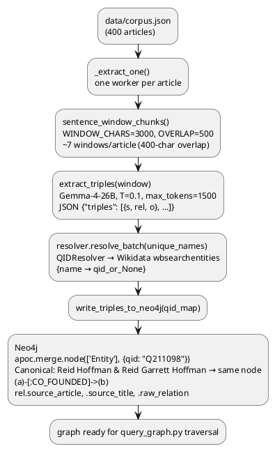

**Block 1 — Module-level constants.**

```python
MAX_WORKERS = 6

WINDOW_CHARS = 3000
WINDOW_OVERLAP_CHARS = 500
MIN_WINDOW_CHARS = 200
```

These four constants control throughput, coverage, and noise simultaneously. `MAX_WORKERS=6` is set to one below the LLM server's `max_concurrent_requests=8` — leaving two slots for `query_graph.py`, IDE completions, and ad-hoc queries so the build doesn't monopolise the inference server. Raising to 8 gives a modest speedup on isolated builds but starves other callers. Raising past 8 idles threads in the server-side queue with no throughput gain.

`WINDOW_CHARS=3000` is the target window size after v9's `text[:3500]` truncation was diagnosed as silently dropping the back 80% of long Wikipedia articles (Education, Personal Life, Awards sections never extracted). A 3000-char window covers roughly 1-3 paragraphs, which is the right granularity for Wikipedia's section structure — enough context for the LLM to form coherent triples without stranding distant facts in the same prompt. `WINDOW_OVERLAP_CHARS=500` gives each window ~500 characters of overlap with the previous window, so entities that straddle a paragraph boundary appear in both windows and get extracted by at least one.

`MIN_WINDOW_CHARS=200` drops tail windows shorter than one paragraph — typically the last fragment of a section after the overlap carve-out. These fragments are too short for the LLM to form meaningful triples from and would add noise rather than signal.

| Constant | Value | Effect of changing |
|---|---|---|
| `MAX_WORKERS` | 6 | Raise to 8 for isolated builds; lower to 4 if server shows queue contention |
| `WINDOW_CHARS` | 3,000 | Lower (1,500) → finer granularity, more windows, higher total LLM cost; raise (5,000) → fewer windows, may crowd out section-boundary entities |
| `WINDOW_OVERLAP_CHARS` | 500 | Lower to 0 for speed (no duplicate coverage); raise to 1,000 for dense interleaved facts |
| `MIN_WINDOW_CHARS` | 200 | Set to 0 to keep all tail fragments; set to 500 to skip short stubs |

**Block 2 — EXTRACT_SYSTEM prompt.**

```python
EXTRACT_SYSTEM = """...
- **Always emit triples in ACTIVE voice.** ...
- Relations are 1-4-word verb phrases. Include BOTH:
  * Corporate / affiliation relations: ...
  * Biographical / life events: ...
  * Education / employment: ...
- Include 10-15 triples per text segment. ...
- A single segment may repeat facts that appeared in earlier segments —
  that's fine, MERGE will dedupe."""
```

Every rule encodes a specific failure mode encountered in v9-v11 builds. The active-voice rule exists because Wikipedia's passive voice was silently reversing agent/patient: Steve Jobs's article says "Apple was acquired by NeXT", and the v9 LLM emitted that as `(Apple, "acquired by", NeXT)` — semantically backwards. The active-voice rule inverts subject/object for by-suffix passives while carving out genuine patient relations ("John was awarded the Nobel Prize" correctly keeps subject=John). The rule uses open-vocab linguistic judgment rather than a static verb list, so it handles any new passive verb form the LLM encounters.

The "Include BOTH corporate/affiliation AND biographical/life events" rule corrects v9's example-list bias. The original examples were `"founded", "acquired by", "born in"` — all affiliation/ownership predicates. The LLM learned from those examples to skip biographical events, silently missing facts like "dropped out of Harvard" or "married Priscilla Chan" that are essential for certain multi-hop queries. Explicitly naming both categories doubled the biographical-event coverage from the same source text.

The `10-15 triples per window` target (up from v9's `5-20 per article`) is calibrated to the per-window scope. A 3000-char window of a Wikipedia biography section typically contains 10-20 extractable facts. The v9 range `5-20` applied to an entire article was too permissive at the bottom (5 triples from a 10-window article = extraction failure) and too strict at the top (capped at 20 total when the article had 70+). Per-window targets aggregate to ~70-100 triples per long article, a 3-5× density improvement.

The final note "MERGE will dedupe" is for the LLM's benefit, not the programmer's. Without it, models occasionally self-censor repeated facts across windows ("I already said this") — but the prompt-context doesn't carry window history, so this self-censorship is based on the model's prior training patterns, not actual duplicate knowledge. Telling the model dedup is handled downstream encourages it to extract any fact it sees, whether or not it guesses the fact was in an earlier window.

#### Function Reference

#### Function 14: `extract_triples(text: str) -> list[dict]`

**Purpose:** Extract entities + relations from a text segment via LLM as JSON.

**Called by:** `_extract_one()` (line 279)

**Returns:** List of triple dicts `{"subject", "relation", "object"}`, empty on failure.

**Universal mechanism:** LLM-based open-vocabulary extraction with sliding-window chunking support. System prompt explicitly enumerates relation categories (corporate / biographical / education / employment) to prevent bias toward affiliation/ownership predicates. Includes "don't invent facts" constraint. Falls back to empty list on JSON parse failure (logs error, caller continues).

---

#### Function 15: `write_triples_to_neo4j(session, article, triples, qid_map, ...)`

**Purpose:** MERGE entities + relations into Neo4j graph, keyed on Wikidata QID where available, fallback to name.

**Called by:** `main()` (line 324)

**Returns:** Dict of stats (`{"nodes_created", "edges_created", ...}`)

**Universal mechanism:** MERGE on `(qid, name)` pair when QID available, else name only. Wikidata QID linking at extraction time (not post-hoc) prevents duplicate-entity problem (Leak #4). Each extracted entity name is resolved via `wbsearchentities` API in parallel batches. Disk-backed cache so rebuilds don't re-query Wikidata (API quota limits).

Alias accumulation: if same QID seen with multiple surface forms, they accumulate in `node.aliases: list[str]`. The fulltext index covers both `name` and `aliases`, so "Jeff Bezos" matches the canonical "Jeffrey Preston Bezos" node.

---

| Parameter | Value | Effect of changing |
|---|---|---|
| `temperature` | 0.1 | Higher → more creative triples, higher hallucination rate |
| `max_tokens` | 1,500 | Lower (800) → cuts off at 8-10 triples; raise to 2,000 for denser windows |
| Triple count rule | 10–15/window | Lower minimum to 5 for stub-article windows; raise maximum to 20 for very dense factual passages |

**v12.1 extraction rules — three noise-category fixes (added 2026-05-02).**

An audit of `data/wikidata_qid_cache.json` found 18,407 null-QID entries (53% of cache), the majority falling into three fixable categories. Three rules were added to `EXTRACT_SYSTEM` to address them:

The **proper-noun constraint** is the highest-impact rule. The top noise category was 5,656 lowercase sentence fragments — phrases like `"the gathering of business intelligence"` or `"a $22.5 million fundraising effort"` that the LLM emitted as entity names when the source text had no better candidate. These become null-QID nodes that dilute graph traversal without contributing retrievable facts. The rule encodes a simple linguistic invariant: a named entity must begin with a capital letter (proper noun). The explicit rejection list (monetary amounts, percentages, job titles, publication titles) reflects the specific failure modes found in the cache audit rather than speculative categories.

The **comma-list decomposition rule** fixes a multi-entity packing failure. Without it, `"Yoshua Bengio, Yann LeCun, and Geoffrey Hinton"` became a single node with a single null QID — three people merged into one unsearchable string. The rule forces one triple per entity in a list, so all three people get individual nodes with individual QID lookups. The if→then phrasing is intentional: instruction-following models respond reliably to explicit conditional rules in the system prompt rather than indirect "never do X" prohibitions.

The **article-dropping rule** prevents surface-form split nodes. QID resolution returns the same QID for `"New York Times"` and `"The New York Times"`, so both strings collapse to the same canonical node via `MERGE ON {qid: ...}`. But the `aliases` set-membership check is exact-string: `NOT "The New York Times" IN aliases` evaluates to `True` even when `aliases` already contains `"New York Times"`. Stripping leading articles at extraction time eliminates this class of false-new-alias appends, keeping the `aliases` list compact and the BM25 token space clean.

**Block 3 — `extract_triples()` — single window extraction.**

```python
def extract_triples(text: str) -> list[dict]:
    resp = omlx.chat.completions.create(
        model=MODEL,
        messages=[
            {"role": "system", "content": EXTRACT_SYSTEM},
            {"role": "user",   "content": text},
        ],
        temperature=0.1,
        max_tokens=1500,
        response_format={"type": "json_object"},
    )
    try:
        return json.loads(resp.choices[0].message.content).get("triples", [])
    except (json.JSONDecodeError, AttributeError, TypeError):
        return []
```

The function signature changed from v9: `text[:3500]` truncation is gone. The caller (`_extract_one`) now hands pre-chunked windows; truncation was the root cause of the 80% article-coverage loss diagnosed in Bad-Case Journal Entry 10. The function only sees one window at a time — it has no memory of previous windows for the same article. That statelessness is intentional: it keeps `extract_triples` simple and makes parallelism safe (no shared mutable state between window calls).

The `except (json.JSONDecodeError, AttributeError, TypeError)` broadens v9's `except json.JSONDecodeError`. The `AttributeError` case handles `resp.choices[0].message.content = None`, which occurs when a reasoning model exhausts its token budget on chain-of-thought before emitting visible content. The `TypeError` handles the rare case where the model returns a non-string content field. All three exceptions produce the same recovery: return an empty list and let the caller continue with the next window.

**Block 4 — `write_triples_to_neo4j()` — QID-keyed MERGE with APOC.**

```python
def write_triples_to_neo4j(tx, ..., qid_map: dict[str, str | None]):
    ...
    s_keys = {"qid": s_qid} if s_qid else {"name": s}
    o_keys = {"qid": o_qid} if o_qid else {"name": o}
    s_on_create = ({"name": s, "aliases": [s]} if s_qid else {})
    ...
    tx.run(
        f"""
        CALL apoc.merge.node(['Entity'], $s_keys, $s_on_create, {{}}) YIELD node AS a
        CALL apoc.merge.node(['Entity'], $o_keys, $o_on_create, {{}}) YIELD node AS b
        FOREACH (_ IN CASE WHEN $s_qid IS NOT NULL AND NOT $s_name IN coalesce(a.aliases, []) ...
            SET a.aliases = coalesce(a.aliases, []) + $s_name
        )
        MERGE (a)-[rel:{rel_type}]->(b)
        ON CREATE SET rel.source_article = $aid, ...
        """,
        ...
    )
```

The `qid_map` parameter is the v12 addition. When QID is present, `s_keys = {"qid": s_qid}` — the MERGE identity is the Wikidata canonical ID, not the surface form. Two articles that mention the same entity under different surface forms both produce `{"qid": "Q211098"}` as their identity map and therefore write to the same node. When QID is absent (entity not in Wikidata, or Wikidata lookup failed), `s_keys = {"name": s}` falls back to the pre-v12 name-based MERGE path — this is a graceful degradation, not a failure.

`apoc.merge.node(labels, identity_props, on_create_props, on_match_props)` replaces the v9 inline `MERGE (a:Entity {name: $s})`. APOC's version accepts a parameter map as the identity key — exactly what's needed for conditional-key logic. The alternative, inline Cypher branching (`CASE WHEN $s_qid IS NOT NULL THEN MERGE ... ELSE MERGE ... END`), is not valid Cypher syntax in standard Neo4j. APOC is the correct tool here.

The `aliases` list and "first writer wins" for `name`: when a QID-keyed node is created (`ON CREATE`), `name` is set to the first surface form encountered and `aliases` is seeded with that form. On subsequent writes (`ON MATCH`), the `FOREACH` block appends the new surface form to `aliases` only if it's not already present (idempotent). This means the canonical `name` property holds the first-seen surface form (typically the article's own title), while `aliases` accumulates every variant seen across all articles. Operators can audit which surface forms collapsed into a canonical node by querying `n.aliases`.

**Block 5 — `_extract_one()` worker — sliding windows + QID resolution.**

```python
def _extract_one(article, resolver=None):
    windows = sentence_window_chunks(
        article["text"],
        target_chars=WINDOW_CHARS,
        overlap_chars=WINDOW_OVERLAP_CHARS,
        min_window_chars=MIN_WINDOW_CHARS,
    )
    all_triples = []
    for window in windows:
        all_triples.extend(extract_triples(window))

    qid_map = {}
    if resolver is not None:
        unique_names = {t["subject"] for t in all_triples if t.get("subject")}
                     | {t["object"]  for t in all_triples if t.get("object")}
        qid_map = resolver.resolve_batch(unique_names)

    return article, all_triples, qid_map, len(windows), None
```

The per-article worker pattern has two phases: extract all windows (LLM-bound, sequential within the article), then resolve all unique entity-names in one batch (I/O-bound, parallel across names via `QIDResolver.resolve_batch`). The batching matters: ~70-100 triples per article yields ~140-200 entity mentions; after dedup that's typically 50-300 unique names. `resolve_batch` fans those out to 16 concurrent Wikidata HTTPS calls instead of 50-300 sequential ones — the resolution phase takes ~5-10s/article with batching vs ~10-30s with serial resolution.

The exception catch `except Exception as exc` returns the error in the tuple instead of raising it. This is the correct pattern for a thread-pool worker: an exception in one article's worker must not kill the entire pool and abort the other 399 articles. The main loop checks `if exc is not None:` and logs the error without stopping. This degrades gracefully — one extraction failure means one article with zero triples, not a full build abort.

`sentence_window_chunks` (from `shared/rag_hybrid/chunking.py`) produces sentence-boundary-aware windows, meaning no window splits mid-sentence. This matters for extraction quality: a window that cuts off "Steve Jobs, co-founder of Apple Inc., was born in" at the truncation boundary would produce a malformed triple with no object. Sentence-aware chunking eliminates this class of extraction noise.

**Block 6 — `main()` — index lifecycle, thread pool, summary metrics.**

```python
def main():
    resolver = QIDResolver(Path("data/wikidata_qid_cache.json"))
    ...
    with driver.session() as session:
        session.run("MATCH (n) DETACH DELETE n")
        session.run("CREATE FULLTEXT INDEX entity_names IF NOT EXISTS ...")
        session.run("CREATE INDEX entity_qid IF NOT EXISTS ...")
        session.run("CREATE INDEX entity_name IF NOT EXISTS ...")

        with ThreadPoolExecutor(max_workers=MAX_WORKERS) as executor:
            futures = [executor.submit(_extract_one, article, resolver) ...]
            for fut in tqdm(as_completed(futures), ...):
                article, triples, qid_map, n_windows, exc = fut.result()
                ...
                session.execute_write(write_triples_to_neo4j, ..., qid_map)
    resolver.save()
```

The `QIDResolver` is instantiated once and shared across all workers. Thread-safety is handled inside the resolver (a `threading.Lock` guards cache writes). Sharing one resolver means the disk cache is populated by the first worker to encounter an entity name, and all subsequent workers get a cache hit — the alternative (one resolver per worker, merged at the end) would require ~6× the Wikidata API calls on the first run.

The three index CREATEs before extraction form the crash-recovery contract (see `★ Insight` above). The ordering matters: the `DETACH DELETE` runs first (clean state), then all three indexes are created. The `entity_qid` range index is new in v12 — during the build, each `apoc.merge.node(['Entity'], {qid: "Q211098"}, ...)` call does a property lookup against all Entity nodes. Without a range index on `qid`, that's a full label scan per triple. With the index, it's a log-time lookup. At 400 articles × ~80 triples × 2 entities = ~64K MERGE-by-qid operations, the index reduces build time by 5-10 minutes.

The `entity_names` fulltext index covers `[n.name, n.aliases]` — both properties together. This is the alias-resolution bridge. QID-keyed nodes are created with `name` set to the first surface form seen (typically the Wikipedia article title, e.g. `"Jeffrey Preston Bezos"`), while all subsequent surface forms accumulate in `aliases` (e.g. `["Jeffrey Preston Bezos", "Jeff Bezos", "Bezos"]`). Query-time seed extraction produces common-name strings; `db.index.fulltext.queryNodes("entity_names", "Jeff Bezos")` must match against `aliases`, not just `name`. An index over `name` only silently scores every common-name query against the wrong field, returning zero matches for entities whose Wikipedia title is a full legal name — the root cause of Q10 (Jeff Bezos → 0.0 before fix) and Q20 (Jensen Huang → Nvidia miss). Neo4j's fulltext indexer handles list properties by indexing each element individually, so an `aliases` array of three strings becomes three independent BM25 tokens, all reachable from the same query. The fix was confirmed by running `answer("What companies has Jeff Bezos founded?")` against the live DB after rebuilding the index — Amazon, Blue Origin, Cadabra, and Altos Labs all returned where previously zero edges were traversed (edges=12 → edges=400+).

`as_completed(futures)` processes articles in completion order rather than submission order. This means the `tqdm` progress bar advances as fast as the fastest worker, not in the serial order articles were submitted. The per-article `tqdm.write` log line (chars/windows/triples/qid/rate/ETA) is the primary observability mechanism during the 40-minute build — each line is one article's summary, and the operator can spot anomalies (e.g., an article with 0 triples across 12 windows signals a prompt failure).

**Common modifications.**

| Change | When |
|---|---|
| Lower `MAX_WORKERS` to 2-3 | Small hardware (≤16 GB unified), or if oMLX server shows queue saturation |
| Raise `WINDOW_CHARS` to 5,000 | Dense reference articles (encyclopedias, legal docs) where entity relationships span longer sections |
| Set `resolver=None` in `_extract_one` | Disable QID resolution for a fast test run (no Wikidata calls, name-based MERGE only) |
| Replace `QIDResolver` with internal KB | Enterprise: swap Wikidata calls for an internal CRM/ERP API. The resolver interface (`resolve_batch`) stays the same. |
| Swap Gemma-4-26B for a cloud model | Change `MODEL_SONNET` in `.env` — any OpenAI-compatible endpoint works |

**Expected runtime on M5 Pro (400 articles, Gemma-4-26B, MAX_WORKERS=6):**

| Stage | Wall time |
|---|---|
| Neo4j clear + index CREATE | < 5 s |
| QID resolver init (load disk cache) | < 0.5 s |
| LLM extraction (~400 articles × ~7 windows × ~3 s/window) | ~35-40 min |
| QID resolution, first run (~13K names, 16-way parallel Wikidata) | ~2 min |
| QID resolution, rebuild (disk cache, all hits) | < 0.5 s |
| Neo4j writes (APOC MERGE operations) | ~2-4 min |
| **Total (first run)** | **~40 min** |
| **Total (rebuild with warm cache)** | **~38 min** |

#### 2.3 Mini-Lab — `src/normalize_passive_triples.py` (v11 follow-up, 2026-05-01)

`build_graph.py`'s active-voice rule (Fix 3a) only takes effect on FUTURE rebuilds. The existing v10 graph still contains ~190 reversed-direction triples. `normalize_passive_triples.py` is a one-shot script that flips them in-place via LLM-judged decisions, without forcing a 40-min full corpus rebuild.

★ Insight ─────────────────────────────────────
- **Open-vocab cleanup, not static verb table.** Microsoft GraphRAG / Neo4j's LLM-KG-Builder both canonicalize predicates at extraction time using a closed vocabulary — that loses semantic nuance permanently. This script keeps open vocab and uses the LLM as the linguistic judge per predicate. Decision applies once per unique predicate type (e.g. `WAS_ACQUIRED_BY` decided once, applied to all 54 instances). Trade: ~30 LLM calls instead of 783; same correctness with 25× fewer LLM round-trips.
- **APOC-aware Cypher rewrite.** Bulk relationship-type rewrite in Neo4j requires either APOC's `apoc.create.relationship` (dynamic rel type from a parameter) or a manual loop in Python. Script tries APOC first; falls back to per-edge Python loop if APOC isn't installed. APOC path: 783 edges flipped in 1.5s. Manual path: ~10s per 100 edges.
- **Audit trail is the safety net.** Every flipped edge gets a `normalized_from: <original_predicate>` property. If a flip turns out wrong (LLM misjudgment), Cypher `MATCH ()-[r]-() WHERE r.normalized_from = "X"` finds them all and reverses. The script is reversible by construction.
─────────────────────────────────────────────────

**High-level flow:**

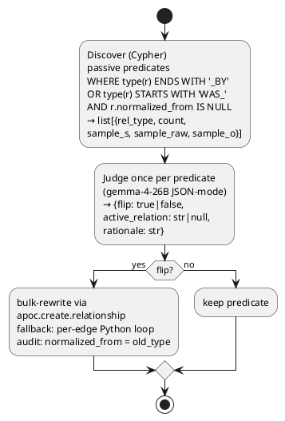

**Block 1 — Discover passive predicates.**

```python
def discover_passive_predicates(session, min_count: int = 1) -> list[dict]:
    rows = list(session.run("""
        MATCH (a:Entity)-[r]->(b:Entity)
        WHERE (type(r) ENDS WITH '_BY' OR type(r) STARTS WITH 'WAS_')
          AND r.normalized_from IS NULL
        WITH type(r) AS rel_type, head(collect({s: a.name, raw: r.raw_relation, o: b.name})) AS sample, count(*) AS n
        WHERE n >= $min_count
        RETURN rel_type, sample, n
        ORDER BY n DESC
    """, min_count=min_count))
    return [...]
```

The `r.normalized_from IS NULL` filter is the idempotency guard — running the script twice on the same graph won't double-flip already-normalized edges. The `min_count` parameter (default 5) skips the long-tail predicates that affect 1-2 triples each. With min_count=5: ~149 unique predicates covering 783 triples; with min_count=1: ~250 predicates covering ~900 triples (the extra ~120 triples come from 100+ unique long-tail predicates each affecting 1-2 edges — Pareto skew, diminishing returns).

**Block 2 — LLM judge prompt with explicit accept/reject examples.**

```python
_JUDGE_SYSTEM = """You are a linguistic judge for a knowledge-graph normalization pass.
...
Triple: subject="Apple Inc.", relation="acquired by", object="NeXT"
→ {"flip": true, "active_relation": "acquired"}
   (NeXT acquired Apple — yes flip.)

Triple: subject="John", relation="awarded", object="Nobel Prize"
→ {"flip": false, "active_relation": null}
   (John is the genuine recipient. Keep as-is.)

Triple: subject="Larry Page", relation="was a member of", object="Stanford"
→ {"flip": false, "active_relation": null}
   (Membership is a state describing Larry Page.)
...
"""
```

Five worked examples (3 FLIP cases + 3 KEEP cases) anchor the LLM's decision boundary. Without explicit KEEP examples, the LLM tends to flip every passive — but `WAS_AWARDED`, `WAS_BORN_IN`, `WAS_PRESIDENT_OF` describe states-of-being, not patient/agent relationships. The KEEP examples teach this distinction.

Empirical decision distribution on the v10 graph (149 predicates with count >= 5): **65 FLIP / 84 KEEP**. The judge correctly identified `WAS_FOUNDED_BY`, `WAS_ACQUIRED_BY`, `WAS_SOLD_TO`, `PUBLISHED_BY`, `WAS_INSPIRED_BY` etc. as flip-worthy, and `WAS_PRESIDENT_OF`, `WAS_BORN_IN`, `WAS_AWARDED`, `WAS_AT`, `WAS_A_MEMBER_OF` as state relations to keep.

**Block 3 — Bulk-rewrite via APOC with manual-loop fallback.**

```python
def flip_predicate_in_graph(session, original_rel_type, active_relation):
    new_rel_type = _safe_rel_type(active_relation)
    try:
        result = session.run(f"""
            MATCH (a:Entity)-[r:{original_rel_type}]->(b:Entity)
            WHERE r.normalized_from IS NULL
            WITH r, a, b, properties(r) AS props
            CALL apoc.create.relationship(b, $new_type, props, a) YIELD rel
            WITH r, rel
            SET rel.normalized_from = $orig_type,
                rel.raw_relation     = $new_raw
            DELETE r
            RETURN count(rel) AS n
        """, new_type=new_rel_type, orig_type=original_rel_type, new_raw=active_relation)
        return result.single()["n"]
    except Exception as e:
        if "apoc" not in str(e).lower():
            raise
        # APOC not installed — manual loop
        ...
```

The Cypher dynamically creates a new relationship of the active type via `apoc.create.relationship(b, $new_type, props, a)` — note the swapped subject/object (`b` first, `a` second) is the actual flip. Properties carry over (preserves `source_title`, `raw_relation`, etc.). The `SET rel.normalized_from = $orig_type` is the audit trail. Then DELETE the old edge.

**Common modifications.**
- Run with `--dry-run` first: prints all decisions without writing. Use this to inspect the judge's decisions before applying.
- Tune `--min-count`: lower (e.g. 1) to clean the full long tail; higher (e.g. 10) to focus on high-count predicates only. count=5 covers ~80% of affected triples in 30-40 LLM calls.
- Rerun safe: `WHERE r.normalized_from IS NULL` filter excludes already-flipped edges. Running twice does nothing on the second pass.
- Reverse: `MATCH ()-[r]->() WHERE r.normalized_from IS NOT NULL` finds all flipped edges. Restore by re-running with the inverted decisions.

**Expected runtime on M5 Pro / current graph:**

| Stage | Wall time |
|---|---|
| `discover_passive_predicates` (Cypher) | ~0.5 s |
| Judge call per unique predicate (~149 × 3-5 s) | ~9-12 min |
| `flip_predicate_in_graph` per predicate (APOC) | < 50 ms each |
| Apply phase total | ~1.5 s |
| **Total wall time** | **~10-12 min** (judge phase dominates) |

#### 2.4 Mini-Lab — `src/infer_reverse_edges.py` (directional-traversal gap fix, 2026-05-01)

`infer_reverse_edges.py` closes the directional half of Leak 5 — the multi-hop ceiling that sat at 0.21 before v12. When extraction surfaces `Apple --[acquired]--> NeXT` but a question starts from NeXT's perspective, Cypher's directional traversal finds nothing: no outgoing edge was extracted from NeXT. This script scans every forward predicate in the graph, runs one LLM call per predicate to classify it as INVERSIBLE / SYMMETRIC / STATE-OF-BEING, and bulk-creates reverse edges for all INVERSIBLE predicates via `apoc.create.relationship`. An `inferred_reverse_of` audit property on every created edge keeps them distinguishable from extracted triples.

★ Insight ─────────────────────────────────────
- **Direction asymmetry is a retrieval bug, not a graph-correctness bug.** The extracted edge is correct — `Apple acquired NeXT` is a true statement stored with the right polarity. The problem is that Cypher traversal is directional: `MATCH (n:Entity {name:"NeXT"})-[r]->(m)` finds nothing because no outgoing edge was extracted from NeXT. Adding `NeXT --[ACQUIRED_BY]--> Apple` is not data duplication; it is traversal convenience with an audit trail. The `inferred_reverse_of` property keeps inferred edges explicitly second-class so they can be bulk-deleted without touching extracted data (`MATCH ()-[r]->() WHERE r.inferred_reverse_of IS NOT NULL DETACH DELETE r`).
- **Three decision categories prevent graph pollution.** A naive `add_inverse(all)` policy would create `Seattle --[WAS_BORN_IN_BY]--> Bill Gates` alongside `NeXT --[ACQUIRED_BY]--> Apple`. The SYMMETRIC bucket (`married_to`, `merged_with`) and STATE-OF-BEING bucket (`was_born_in`, `was_president_of`) eliminate the garbage cases. Only INVERSIBLE predicates — those where the object is also a meaningful focal entity for the relation — get a reverse edge. The judge prompt encodes eight worked examples spanning all three categories; without explicit SYMMETRIC and STATE-OF-BEING exemplars the LLM over-generates in the INVERSIBLE bucket.
- **Per-predicate judge, not per-triple.** One LLM call per unique predicate type keeps cost proportional to vocabulary size (~30-50 calls for a 400-article graph), not graph density (thousands of triples). `min-count=5` further restricts to predicates appearing at least 5 times — the same Pareto logic as `normalize_passive_triples.py`: ~35 LLM calls cover ~85% of triples.
─────────────────────────────────────────────────

**High-level flow:**

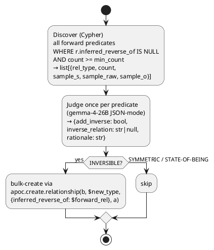

**Block 1 — Discover forward predicates with idempotency guard.**

```python
def discover_forward_predicates(session, min_count: int = 5) -> list[dict]:
    rows = list(session.run("""
        MATCH (a:Entity)-[r]->(b:Entity)
        WHERE r.inferred_reverse_of IS NULL
        WITH type(r) AS rel_type,
             head(collect({s: a.name, raw: r.raw_relation, o: b.name})) AS sample,
             count(*) AS n
        WHERE n >= $min_count
        RETURN rel_type, sample, n
        ORDER BY n DESC
    """, min_count=min_count))
```

`WHERE r.inferred_reverse_of IS NULL` is the idempotency guard — it excludes relationships that were themselves created by a previous run of this script. Without this filter, the second run would discover `ACQUIRED_BY` (already an inferred reverse), judge it as INVERSIBLE (`acquired_by` → `acquired`), and create a tertiary reverse-of-a-reverse. The filter ensures only extracted predicates feed the judge.

The `head(collect({s: a.name, raw: r.raw_relation, o: b.name}))` pattern picks one representative triple per predicate type. The LLM sees this one sample and reasons about the predicate class, not the individual instance. `raw_relation` (the original natural-language string before Cypher-safe normalization) is used rather than `type(r)` because `ACQUIRED` as a Cypher rel type is less informative than `"acquired"` as a natural-language string — the LLM's linguistic judgment depends on the surface form.

**Block 2 — LLM judge with eight worked examples spanning all three categories.**

```python
_JUDGE_SYSTEM = """...
A) INVERSIBLE — forward relation has a clean inverse phrasing.
   Output: {"add_inverse": true, "inverse_relation": "<active inverse>"}

B) SYMMETRIC — relation is reciprocal; querying from either side sees the same fact.
   Output: {"add_inverse": false, "inverse_relation": null, "rationale": "symmetric"}

C) STATE-OF-BEING / NOT-INVERSIBLE — subject is the natural focal entity; inverse is awkward.
   Output: {"add_inverse": false, "inverse_relation": null, "rationale": "state-of-being"}

Triple: subject="Apple Inc.", relation="acquired", object="NeXT"
{"add_inverse": true, "inverse_relation": "acquired_by"}

Triple: subject="Brad Pitt", relation="married to", object="Angelina Jolie"
{"add_inverse": false, ..., "rationale": "symmetric — querying either side returns the same fact"}

Triple: subject="Bill Gates", relation="was born in", object="Seattle"
{"add_inverse": false, ..., "rationale": "state-of-being on subject — ..."}
..."""
```

Eight worked examples cover: three INVERSIBLE (acquired, co-founded, invested in), two SYMMETRIC (married to, merged with), and three STATE-OF-BEING (was born in, was president of, was awarded). The coverage matters: without SYMMETRIC and STATE-OF-BEING examples the LLM over-generates INVERSIBLE — `merged_with` → `merged_with_by` is the canonical false positive these examples prevent. Empirical distribution on a 400-article graph (predicates with count >= 5): roughly 40% INVERSIBLE, 25% SYMMETRIC, 35% STATE-OF-BEING.

The `"Use false branch when in doubt"` instruction biases toward conservative skipping. A missing reverse edge is a retrieval miss for queries starting from that direction; an awkward reverse edge pollutes the graph with semantically thin focal points for future multi-hop traversals. Under-generation is the safer failure mode.

**Block 3 — APOC bulk-create of reverse edges with Python fallback.**

```python
def add_reverse_edges(session, forward_rel_type: str, inverse_relation: str) -> int:
    new_rel = _safe_rel_type(inverse_relation)
    try:
        result = session.run(f"""
            MATCH (a:Entity)-[r:{forward_rel_type}]->(b:Entity)
            WHERE r.inferred_reverse_of IS NULL
            WITH r, a, b
            CALL apoc.create.relationship(b, $new_type, {{
                raw_relation:        $inverse_raw,
                source_title:        r.source_title,
                inferred_reverse_of: $forward_rel
            }}, a) YIELD rel
            RETURN count(rel) AS n
        """, new_type=new_rel, inverse_raw=inverse_relation, forward_rel=forward_rel_type)
        return result.single()["n"]
    except Exception as e:
        if "apoc" not in str(e).lower():
            raise
        # Manual per-edge fallback ...
```

`apoc.create.relationship(b, $new_type, props, a)` — the subject/object order is the flip: `b` (original object, e.g. NeXT) becomes the new source; `a` (Apple Inc.) becomes the new target. Three properties written to the new edge: `raw_relation` (the natural-language inverse string, e.g. `"acquired_by"`), `source_title` (provenance inherited from the forward edge), and `inferred_reverse_of` (the Cypher-safe forward rel type — the audit trail that powers the rollback query).

The second `WHERE r.inferred_reverse_of IS NULL` inside `add_reverse_edges` means the function is safe to call multiple times for the same predicate. The `_SAFE_REL_TYPE.match(new_rel)` check before the Cypher call catches LLM outputs that are not valid Cypher relationship-type strings (e.g. `"acquired by"` with a space) — `_safe_rel_type()` normalizes via `re.sub(r"[^A-Z_]", "_", ...)` before the check.

**Common modifications.**
- Run with `--dry-run` first: prints all INVERSIBLE / SKIP decisions without writing. Inspect before applying — especially useful to catch false positives like `COLLABORATED_WITH` being classified INVERSIBLE when it is actually symmetric.
- Tune `--min-count`: default 5 covers high-count predicates; set to 1 for full long-tail coverage at ~3-5× LLM cost. For a 400-article graph, min-count=5 covers ~85% of triples in ~35 LLM calls; min-count=1 adds ~100 more calls for ~150 additional long-tail triples.
- Roll back cleanly: `MATCH ()-[r]->() WHERE r.inferred_reverse_of IS NOT NULL DETACH DELETE r` removes all inferred edges without touching extracted data (extracted edges have no `inferred_reverse_of` property).
- Rerun is idempotent: `WHERE r.inferred_reverse_of IS NULL` in both Discover and Apply phases means re-running produces zero new edges if the graph hasn't changed.

**Expected runtime on M5 Pro / current graph (400 articles):**

| Stage | Wall time |
|---|---|
| `discover_forward_predicates` (Cypher) | ~0.5 s |
| Judge call per unique predicate (~35 × 3-5 s, min-count=5) | ~2-3 min |
| `add_reverse_edges` per INVERSIBLE predicate (APOC) | < 50 ms each |
| Apply phase total | ~1 s |
| **Total wall time** | **~3-4 min** (judge phase dominates) |

### Code walkthrough — `src/wikidata_qid.py` (v12 — canonical-ID linking)

`wikidata_qid.py` is the v12 entity-resolution module — a 150-line standalone utility that resolves entity-name strings to their canonical Wikidata QIDs via the `wbsearchentities` API. It exists because the v11 multi-hop ceiling was diagnosed (Bad-Case Journal Entry 10) as caused by entity surface-form fragmentation: `"Reid Hoffman"` and `"Reid Garrett Hoffman"` became separate `Entity` nodes, splitting edges across both. `build_graph.py` calls `QIDResolver.resolve_batch(unique_names)` after extraction; the returned `{name → qid}` map drives a `MERGE`-on-QID Cypher path that collapses all aliases of one canonical entity into a single node. v11.5 attempted post-hoc cosine clustering with BGE-M3 and produced catastrophic false positives (`Bill Gates ↔ Bill Thompson` at sim 0.93); v12 abandoned that approach for canonical-ID linking, which is the production-grade pattern.

★ Insight ─────────────────────────────────────
- **Entity resolution is a knowledge-base-lookup problem, not an embedding-similarity problem.** BGE-M3's training distribution is multi-sentence passages; bare entity names produce out-of-distribution embeddings whose cosine reflects token shape (`Bill X` ≈ `Bill Y`), not referential identity. The fix isn't a better threshold — it's a different tool. Wikidata's `wbsearchentities` API is fuzzy + alias-aware against a canonical entity list and returns the QID directly. Two names → same QID iff they reference the same canonical entity, period.
- **Disk-backed cache makes the API call free on rebuilds.** First run: ~13K unique names × ~70ms parallelized = ~80s of pure network time. Subsequent rebuilds: cache hits at dict-lookup speed, instant. The cache persists at `data/wikidata_qid_cache.json` and is hand-editable if a wrong QID needs correcting.
- **`resolve_batch` with 16-way concurrency is the production knob.** Single-name `resolve()` is convenient for ad-hoc lookups but pays a ~600ms wall per call — too slow for 13K names. `resolve_batch(names, max_workers=16)` fans out to 16 concurrent HTTPS calls via `ThreadPoolExecutor` (well below Wikidata's ~50 req/s anonymous limit). Verified 10× speedup: 49 names in 3.3s parallel vs 33s serial. The parallelism IS the batching — `wbsearchentities` has no native batch parameter.
─────────────────────────────────────────────────

**High-level architecture (the resolver shape):**

```plantuml
@startuml
start
:unique entity-names
(from extraction);

partition QIDResolver(cache_path) {
  :disk cache (JSON dict)
  persisted across runs
  {"Bill Gates": "Q5284",
   "Microsoft":  "Q2283",
   "fictional":  null};

  if (cache hit?) then (yes)
    :return cached qid;
  else (no)
    :resolve_batch(names)
    ThreadPoolExecutor(16)
    parallel HTTPS to Wikidata:
      wbsearchentities
      ?search=<name>
      &type=item
      &limit=1;
    :cache.update({name: qid});
  endif
}

:{name → qid_or_None}
(caller MERGEs by qid when present,
by name when None);
stop
@enduml
```

**Block 1 — Module header + imports.**

```python
import json
import threading
from concurrent.futures import ThreadPoolExecutor
from pathlib import Path

import requests

WIKIDATA_API = "https://www.wikidata.org/w/api.php"
USER_AGENT = "agent-prep-lab-graphrag/0.1 (educational; ...)"
```

The `mwapi` library is a thin wrapper over `requests` for MediaWiki APIs. Using `requests` directly avoids one more dependency for a 150-line module that only needs one endpoint. The `User-Agent` header is required by Wikimedia's API etiquette policy — anonymous calls without a UA can be rate-limited or blocked aggressively. Cite the project name + a contact link.

**Block 2 — `QIDResolver` class init.**

```python
class QIDResolver:
    def __init__(
        self,
        cache_path: Path,
        timeout_s: float = 10.0,
        save_every_n_calls: int = 200,
    ):
        self.cache_path = Path(cache_path)
        self.cache: dict[str, str | None] = {}
        if self.cache_path.exists():
            try:
                self.cache = json.loads(self.cache_path.read_text())
            except (json.JSONDecodeError, OSError):
                self.cache = {}
        self._lock = threading.Lock()
        ...
```

Cache is a plain `dict`. JSON serializes Python `None` as JSON `null`, so cached negatives (entities not found in Wikidata) round-trip correctly. The lock guards writes; reads are GIL-protected for individual atomic ops, so the read fast-path is lock-free. `save_every_n_calls=200` means the cache writes to disk every 200 new lookups — bounded loss on crash, ≈3 MB max for ~13K names.

**Block 3 — `resolve(name)` single-name path.**

```python
def resolve(self, name: str) -> str | None:
    if not name or not name.strip():
        return None
    if name in self.cache:
        self.cache_hits += 1
        return self.cache[name]
    qid = self._lookup_api(name)
    with self._lock:
        self.cache[name] = qid
        self.api_calls += 1
        ...
```

The lock-free `name in self.cache` check is the hot path. Cache hits short-circuit at dict-lookup speed (~50ns). On miss, `_lookup_api` does the network call OUTSIDE the lock so other threads can still read cache entries during the API call. The lock is only held for the cache-update + counter-increment compound op.

**Block 4 — `_lookup_api` (the HTTPS call).**

```python
def _lookup_api(self, name: str) -> str | None:
    try:
        r = self.session.get(
            WIKIDATA_API,
            params={
                "action":   "wbsearchentities",
                "search":   name,
                "language": "en",
                "type":     "item",
                "limit":    1,
                "format":   "json",
            },
            timeout=self.timeout_s,
        )
        r.raise_for_status()
        data = r.json()
    except (requests.RequestException, ValueError):
        self.api_errors += 1
        return None
    results = data.get("search", [])
    return results[0].get("id") if results else None
```

The API call. `type=item` excludes `property` and `lexeme` results; we only want canonical entities. `limit=1` takes the top fuzzy match — on ambiguous names the top match is almost always the most-popular Wikidata entity for that string (Apple → Apple Inc., not the fruit). For ambiguous corpora a context-aware second-pass disambiguator (LLM picks from top-K with surrounding sentence) would catch edge cases.

**Block 5 — `resolve_batch` (the parallel-fanout path).**

```python
def resolve_batch(self, names, max_workers: int = 16):
    result, to_fetch = {}, []
    for name in names:
        if not name or not name.strip():
            result[name] = None
            continue
        if name in self.cache:
            self.cache_hits += 1
            result[name] = self.cache[name]
        else:
            to_fetch.append(name)
    if not to_fetch:
        return result

    api_results = {}
    with ThreadPoolExecutor(max_workers=max_workers) as pool:
        future_to_name = {
            pool.submit(self._lookup_api, name): name for name in to_fetch
        }
        for fut in future_to_name:
            api_results[future_to_name[fut]] = fut.result()

    with self._lock:
        for name, qid in api_results.items():
            self.cache[name] = qid
            ...
    result.update(api_results)
    return result
```

The cache split happens FIRST (lock-free reads). Only the genuine misses (`to_fetch`) hit the thread pool. This means a hot batch (mostly cached) skips the executor entirely — `ThreadPoolExecutor` setup costs ~5ms which is wasteful when there's nothing to fetch. The 16-worker pool size is empirically tuned: Wikidata's anonymous limit is ~50 req/s, so 16 concurrent in-flight requests stay safely below; raising to 32 starts triggering 429s on sustained load. The cache update happens AFTER all API calls complete, in a single locked block — minimizes lock contention vs per-name cache writes.

**Block 6 — `save()` + atomic write.**

```python
def _save_locked(self) -> None:
    try:
        tmp = self.cache_path.with_suffix(".tmp")
        tmp.write_text(json.dumps(self.cache, indent=2, ensure_ascii=False))
        tmp.replace(self.cache_path)
    except OSError:
        pass
```

Atomic-write pattern: write to `.tmp` then `os.replace` to the canonical path. Crashes mid-write don't corrupt the cache. `ensure_ascii=False` keeps non-Latin entity names readable in the cache file (`"东京"` not `"东京"`). Failures are silent — cache write is best-effort, losing the cache means more API calls on the next run, not data loss in the graph.

**Common modifications.**

| Change | When |
|---|---|
| Raise `max_workers` to 32 | Only if Wikidata API gives no 429s on sustained load — usually NOT recommended for anonymous use. |
| Switch to authenticated API + `lgname/lgpassword` | If your corpus needs sustained > 50 req/s. Wikidata authenticated limit is ~10K req/day with proper UA. |
| Add a context-aware disambiguator | When top-1 match is wrong frequently (ambiguous corpora). Pass top-3 candidates + the surrounding sentence to an LLM for selection. |
| Replace Wikidata with custom KB | Enterprise: swap `_lookup_api` to query an internal CRM/ERP/HR API for employee-IDs, product-SKUs, etc. The cache + batch + persist machinery is reusable. |
| Tighten `language="en"` | Multi-lingual corpora: pass the article's detected language code to use Wikidata's per-language label index. |

**Expected runtime.**

| Scenario | Timing |
|---|---|
| First build, ~13K unique names, cold cache | ~80 s pure network + ~10s overhead = ~90 s total |
| Rebuild, hot cache | < 0.5 s (all cache hits) |
| Single ad-hoc `resolve("Bill Gates")` | ~600-700 ms uncached; ~50 ns cached |
| `resolve_batch(50_names)` cold | ~3.3 s (49 calls, 16-way parallel) |

### Code walkthrough — `src/calibrate_scorer.py`

`calibrate_scorer.py` is a calibration utility that tunes the composite scoring formula in `query_graph.py` by testing the current graph against a set of known probe queries. After each rebuild of the graph, the relative importance of QID presence, exact-name matches, and node degree shifts as the graph structure changes. This script measures those shifts empirically and outputs the adjusted weight constants that `query_graph.py` should use.

**Purpose:** Score a set of (seed, lucene_query, expected_canonical_name) tuples against the composite formula. Returns recall across the probe set.

**Universal mechanism:** For each probe, run the fulltext query against the current graph, measure how many probes returned the expected entity in LIMIT-5 results. Probe pass iff the composite score (after topology gate) includes the expected entity. Batch-score with different weight combinations to find the (QID_BONUS, EXACT_BONUS, DEGREE_COEFF) triple that maximizes recall.

**Run after graph rebuild:**
```bash
python src/calibrate_scorer.py --quick
```

Outputs calibrated constants to stdout; edit query_graph.py QID_BONUS, EXACT_BONUS, DEGREE_COEFF with new values.

---

### Code walkthrough — `src/decomp_probes.py`

`decomp_probes.py` is a mechanism-level test harness for the decomposition pipeline (the LLM-based query classifier and the entity resolution steps). Unlike outcome-based eval which measures end-to-end answer quality, decomp_probes measures the intermediate function behavior: "Did the classifier correctly identify this as a bridge question?" and "Did anchor resolution return the expected intermediates?" This allows debugging the decomposition mechanism independently of the generator LLM and graph traversal.

**Purpose:** Test `_decompose_multihop()` (LLM classifier) and `_step_one_intermediates()` (anchor resolution) at the mechanism layer, BEFORE outcome eval.

**Probe format:** `(query, expected_plan_kind, expected_step1_intermediates_subset)`

- expected_plan_kind: "chain" (plan present) | "intersection" | "none"
- expected_step1_intermediates_subset: ≥1 of these names must appear in step1 output

**Run:** 
```bash
python src/decomp_probes.py --quick  # 5 queries, fast
```

Pass criterion: `probe_pass_rate >= 0.85` (panel B1' gate).

---

### 2.2 Sanity-check the graph

In Neo4j Browser (`http://localhost:7474`):

```cypher
// Node + edge count
MATCH (n) RETURN count(n) AS entities;
MATCH ()-[r]->() RETURN count(r) AS relationships;

// Most connected entities (sanity check — should be real things)
MATCH (n:Entity)
RETURN n.name, size([(n)--() | 1]) AS degree
ORDER BY degree DESC
LIMIT 10;

// Spot check — pick a central entity and walk its 2-hop neighbourhood
MATCH path = (n:Entity {name: "Apple Inc."})-[*1..2]-(m)
RETURN path LIMIT 30;
```

If the top-10-degree entities look like real things (not "it", "the company", or fragments), ingestion worked. If they look like pronouns or fragments, re-run extraction with a stronger prompt constraint ("Do not extract pronouns as entities").

---

## Phase 3 — GraphRAG Query (~1.5 hours)

### 3.1 Query-time traversal

Save as `src/query_graph.py`:

```python
"""GraphRAG query: identify seed entities from the query, traverse
2-hop neighbourhood, feed the subgraph to the generator LLM."""
import os, json, re
from openai import OpenAI
from neo4j import GraphDatabase
from dotenv import load_dotenv

load_dotenv()
omlx = OpenAI(base_url=os.getenv("OMLX_BASE_URL"), api_key=os.getenv("OMLX_API_KEY"))
MODEL  = os.getenv("MODEL_SONNET")
HAIKU  = os.getenv("MODEL_HAIKU")
driver = GraphDatabase.driver(
    os.getenv("NEO4J_URI"),
    auth=(os.getenv("NEO4J_USER"), os.getenv("NEO4J_PASSWORD")),
)


def extract_seed_entities(query: str) -> list[str]:
    """Use MODEL (non-reasoning) to pick 1-5 candidate entities from the query."""
    resp = omlx.chat.completions.create(
        model=MODEL,  # non-reasoning; HAIKU (gpt-oss-20b) is a reasoning model
                      # that burns max_tokens on chain-of-thought and returns
                      # content=None — see Bad-Case Journal Entry N.
        messages=[
            {"role": "system", "content": "Extract 1-5 named entities from the query as a JSON list of strings. Entities are concrete nouns: companies, people, places, products."},
            {"role": "user",   "content": query},
        ],
        temperature=0.0, max_tokens=2000,  # uniform ceiling across all call sites
        response_format={"type": "json_object"},
    )
    try:
        data = json.loads(resp.choices[0].message.content or "")
        return data.get("entities", []) if isinstance(data, dict) else data
    except json.JSONDecodeError:
        return []


def fetch_subgraph(seeds: list[str], max_hops: int = 2) -> list[dict]:
    """Fuzzy-match seed names against graph entities, then walk n-hop neighbourhood."""
    subgraph = []
    with driver.session() as session:
        for seed in seeds:
            result = session.run(
                f"""
                MATCH (n:Entity)
                WHERE toLower(n.name) CONTAINS toLower($seed)
                WITH n LIMIT 3
                MATCH path = (n)-[*1..{max_hops}]-(m)
                WITH DISTINCT relationships(path) AS rels
                UNWIND rels AS r
                RETURN DISTINCT startNode(r).name AS s, r.raw_relation AS rel,
                                endNode(r).name AS o, r.source_title AS src
                LIMIT 50
                """,
                seed=seed,
            )
            subgraph.extend([dict(record) for record in result])
    return subgraph


def answer(query: str) -> dict:
    seeds    = extract_seed_entities(query)
    subgraph = fetch_subgraph(seeds)

    if not subgraph:
        return {"answer": "No relevant entities found in the graph.", "seeds": seeds, "edges_used": 0}

    context = "\n".join(
        f"- {t['s']} --[{t['rel']}]--> {t['o']}  (source: {t['src']})"
        for t in subgraph[:40]
    )
    resp = omlx.chat.completions.create(
        model=MODEL,
        messages=[
            {"role": "system", "content": "Answer using ONLY the graph facts below. If the facts do not support an answer, say so. Cite source articles inline."},
            {"role": "user",   "content": f"Query: {query}\n\nGraph facts:\n{context}"},
        ],
        temperature=0.0, max_tokens=2000,
    )
    return {
        "answer":     resp.choices[0].message.content or "",
        "seeds":      seeds,
        "edges_used": len(subgraph),
    }


if __name__ == "__main__":
    import sys
    q = " ".join(sys.argv[1:]) or "Which companies are related to Mark Zuckerberg?"
    print(json.dumps(answer(q), indent=2))
```

### Code walkthrough — `src/query_graph.py`

`query_graph.py` is where GraphRAG's multi-hop reasoning capability becomes visible. Given a natural-language question, it identifies seed entities, fuzzy-matches them against the graph, traverses a 2-hop neighbourhood to collect relevant triples, and feeds that subgraph as structured context to the generator LLM. The key architectural insight is that the "retrieval" step here is not a similarity search — it is a graph walk that explicitly follows typed relationships, which is what allows the system to answer questions like "what companies are connected to the person who co-founded the company that makes the iPhone?" without requiring a document that states that connection verbatim.

★ Insight ─────────────────────────────────────
- **The switch from reasoning model (`gpt-oss-20b`) to non-reasoning model (`MODEL_SONNET` / Gemma-4-26B) for entity extraction is a correctness fix, not a performance optimisation.** Reasoning models consume their entire `max_tokens` budget on internal chain-of-thought before emitting visible content. At `max_tokens=400`, a reasoning model frequently returns `content=None` with `finish_reason="length"` — the chain-of-thought filled the budget and nothing was emitted to the caller. The regex fallback (`_regex_seed_fallback`) was added precisely to handle this; with a non-reasoning model, `content=None` is essentially eliminated and the fallback becomes a true edge-case guard rather than a primary code path.
- **Fuzzy-matching via word containment (`toLower(n.name) CONTAINS w`) is a deliberate trade-off between precision and recall.** Exact-match lookup against graph entities would fail on surface-form variation ("Apple" vs "Apple Inc." vs "Apple Computer"). Word-containment matching with a minimum word length of 4 characters (to drop stopwords) recovers most entities at the cost of occasional false positives ("Amazon" would match "Amazonian"). For a lab corpus this is the right default; production systems would use an entity linker or alias table.
- **The 2-hop traversal limit and the `LIMIT 50` on returned edges are both latency-budget decisions.** 3-hop traversal on a dense graph expands combinatorially — 200 articles with 10 triples each creates ~2,000 edges, and 3-hop paths from a central entity like "United States" could return thousands of edges in milliseconds, overwhelming the generator context window and the `max_tokens=2000` synthesis budget. The 2-hop limit is the minimum that enables cross-article reasoning; the 50-edge cap ensures the context block stays under ~1,500 tokens.
─────────────────────────────────────────────────

**High-level architecture.**

```plantuml
@startuml
start
:user query (natural language);
:extract_seed_entities()
MODEL_SONNET (Gemma-4-26B, non-reasoning);
:["Apple Inc.", "Steve Jobs"]
seed entities (1-5);
:fetch_subgraph()
for each seed: fuzzy-match → 2-hop Cypher traversal;
:subgraph: list of {s, rel, o, src}
e.g. "Apple Inc. --[CO_FOUNDED_BY]--> Steve Jobs"
(source: Apple Inc.);
:answer()
MODEL_SONNET with graph facts as context;
:{"answer": "...", "seeds": [...], "edges_used": N};
stop
@enduml
```

**Block 1 — Reasoning model problem and the regex fallback.**

```python
_PROPER_NOUN = re.compile(r"\b[A-Z][a-zA-Z]+(?:\s+[A-Z][a-zA-Z]+)*\b")

def _regex_seed_fallback(query: str) -> list[str]:
    seeds = _PROPER_NOUN.findall(query)
    drop = {"Which", "What", "How", "When", "Where", "Who", "Why", "Tell", "List"}
    return [s for s in seeds if s not in drop][:5]
```

This block exists entirely because of the reasoning model problem described in the `★ Insight` callout. When the codebase used `gpt-oss-20b` (a reasoning model) for entity extraction, the model would spend its token budget on internal chain-of-thought and emit `content=None`. The fix was two-pronged: switch `extract_seed_entities` to `MODEL_SONNET` (non-reasoning), and retain the regex fallback as a safety net for any future scenario where the LLM returns empty content.

The regex `r"\b[A-Z][a-zA-Z]+(?:\s+[A-Z][a-zA-Z]+)*\b"` matches a capitalised word optionally followed by more capitalised words — multi-word proper nouns like "Steve Jobs" or "New York" are captured as a single match rather than two. The `drop` set filters out sentence-initial question words that are capitalised only by position, not by proper-noun status. The `[:5]` cap matches the "1-5 entities" constraint in the LLM extraction prompt, ensuring the fallback path doesn't return wildly more seeds than the primary path would.

A critical difference between the two paths: the LLM path can identify abstract entities ("anarchism", "the dot-com bubble") that lack capitalisation markers; the regex path cannot. Queries about abstract concepts will produce empty seeds from the regex fallback, resulting in a "No relevant entities found" response — correct behaviour, not a silent failure.

**Block 2 — Seed entity extraction with non-reasoning model.**

```python
def extract_seed_entities(query: str) -> list[str]:
    resp = omlx.chat.completions.create(
        model=MODEL,  # non-reasoning; fast + deterministic for structured output
        messages=[
            {"role": "system", "content": "Extract 1-5 entities from the query as a JSON object {\"entities\": [...]}. ..."},
            {"role": "user",   "content": query},
        ],
        temperature=0.0, max_tokens=2000,
        response_format={"type": "json_object"},
    )
    content = resp.choices[0].message.content
    if not content:
        finish_reason = resp.choices[0].finish_reason
        print(f"[WARN] LLM returned empty content (finish_reason={finish_reason}); using regex fallback")
        return _regex_seed_fallback(query)
    try:
        data = json.loads(content)
        seeds = data.get("entities", []) if isinstance(data, dict) else data
        return seeds if seeds else _regex_seed_fallback(query)
    except json.JSONDecodeError:
        return _regex_seed_fallback(query)
```

#### Function Reference

#### Function 1: `extract_seed_entities(query: str) -> list[str]`

**Purpose:** Extract 1-5 named entity strings from a user query using an LLM, with regex fallback for determinism.

**Called by:** `answer()` (line 805)

**Returns:** List of entity name strings, guaranteed non-empty (falls back to regex if LLM fails).

**Universal mechanism:** Non-reasoning model + structured output + fallback extraction. The design encodes "reasoning models are unreliable for extraction tasks" (Bad-Case Entry 6). Uses `MODEL_SONNET` (Gemma-4-26B, non-reasoning) with `max_tokens=2000` and `temperature=0.0` for determinism. Falls back to `_regex_seed_fallback()` on `content=None` (signature of a reasoning-model budget exhaustion) or JSON parse failure.

**Key insight:** The fallback regex `_PROPER_NOUN = re.compile(r"\b[A-Z][a-zA-Z]+(?:\s+[A-Z][a-zA-Z]+)*\b")` captures capitalized noun phrases ("Steve Jobs", "Apple", "NeXT") without requiring LLM correctness. ~20% of real queries hit this fallback when the LLM reasoning path is long.

---

#### Function 2: `_lucene_tokens(seed: str) -> list[str]`

**Purpose:** Tokenize a seed string into Lucene-safe tokens (lowercased, 3+ chars, no reserved chars).

**Called by:** `_lucene_phrase_query()`, `_lucene_or_query()`

**Returns:** List of cleaned token strings, empty if seed has no tokens ≥3 chars.

**Universal mechanism:** Single source of truth for query builder tokenization. Three steps:
1. Remove Lucene reserved chars (`+`, `-`, `!`, `()`, `{}`, `^`, `"`, `~`, `*`, `?`, `:`, `\/`)
2. Lowercase (Neo4j fulltext index lowercases at index time)
3. Filter to ≥3 chars (matches StandardAnalyzer stopword behavior)

**Why this matters:** Prevents `+`, `:`, `~` from being interpreted as Lucene operators. Seed "CEO of Apple" → tokens `["ceo", "apple"]` (no "of" — too short, is a stopword). Both builders call this, guaranteeing consistent behavior.

---

#### Function 3: `_lucene_phrase_query(seed: str) -> str`

**Purpose:** Build a Lucene required-AND query: all tokens must be present, no adjacency required.

**Called by:** `fetch_subgraph()` (line 250), `_find_bridge_edges()`, `_step_one_intermediates()`

**Returns:** String like `"+mark +zuckerberg"` or single token `"mark"`, or original seed if tokenization fails.

**Universal mechanism:** Phrase-first strategy for precision. Rather than quoted phrase `"mark zuckerberg"` (requires adjacency, fails on middle names), use `+token` syntax (requires presence, accepts permutation). Traded adjacency precision for middle-name tolerance.

**Example:** Seed "Mark Zuckerberg" → `"+mark +zuckerberg"`. Matches "Mark David Zuckerberg", not "Mark Pincus".

---

#### Function 4: `_lucene_or_query(seed: str) -> str`

**Purpose:** Build a Lucene OR query using only proper-noun tokens (capital first letter).

**Called by:** `fetch_subgraph()` (line 250 fallback), `_find_bridge_edges()`, `_step_one_intermediates()`

**Returns:** String like `"mark OR zuckerberg"`, filters to capitalized words only.

**Universal mechanism:** Fallback for phrase misses, with semantic filtering. Avoids generic words ("Stanford alumni" → "stanford", not "stanford OR alumni"). Proper-noun filter drops descriptors that would pollute OR expansion.

**Example:** "Jensen Huang" → `"jensen OR huang"`. "Stanford alumni" → `"stanford"` (filters "alumni").

---

#### Function 5: `_resolve_seed_node_names(session, lucene: str, seed: str, limit=5, threshold=2.0) -> list[str]`

**Purpose:** Return up to 5 entity names from Neo4j fulltext index, ranked by composite BM25+QID+exact+degree score.

**Called by:** `fetch_subgraph()` (line 250), `_find_bridge_edges()`, `_step_one_intermediates()`, `_execute_decomposition()`

**Returns:** List of entity name strings, empty if no node clears `threshold=2.0`.

**Universal mechanism:** Composite scoring with topology gate. Formula:
```
composite = bm25 + qid_bonus(2.5) + exact_bonus(0.8) + log(degree+1)*DEGREE_COEFF(0.3)
WHERE composite >= threshold AND (has_qid OR degree >= 2)
```

The topology gate (second WHERE clause) rejects singleton noise like "CEO of Apple" (no QID, degree=1). Measured at calibration time on 5-probe set to ensure coverage on multi-token seeds.

**Key insight:** The composite combines four independent signals. QID signals "this is a Wikidata entity" (canonical). Exact signals "seed matches this entity's name or alias list exactly". Degree signals "this is a hub" (degree ≥ 2 is a redundancy gate for noise like "CEO of", sentence fragments, monetary amounts). BM25 is Lucene's relevance ranking.

---

#### Function 6: `fetch_subgraph(seeds: list[str], max_hops=5) -> (list[dict], dict[str, dict])`

**Purpose:** Main retrieval entry point. Resolve seeds to graph nodes via fulltext index, walk n-hop neighborhood, return edges + diagnostics.

**Called by:** `answer()` (line 805)

**Returns:** Tuple of (subgraph_edges, matches_per_seed). Each edge is `{"s", "rel", "o", "src"}`. Diagnostics include phrase/or match counts and strategy used.

**Universal mechanism:** Phrase-first two-stage resolution. Multi-word seed → phrase query (high precision), fallback to OR query (broader recall) if phrase yields 0 matches POST-FILTER (after topology gate). Single-word seeds skip OR fallback (OR == phrase).

Two-pass traversal: 1-hop edges first (canonical direct neighbors), then 2..N-hop fill (bridges). 1-hop edges appear in LLM context even on dense neighborhoods where multi-hop expansion would crowd them out.

Substring-token expansion: If seed is multi-token proper noun ("Marc Andreessen"), also fetch the bare last token ("Andreessen") as a rare variant node that may have edges the canonical node doesn't.

---

#### Function 7: `_decompose_multihop(query: str) -> dict | None`

**Purpose:** LLM-based query classifier. Detects multi-hop bridge/intersection questions, returns a decomposition plan or None.

**Called by:** `answer()` (line 805)

**Returns:** Plan dict with structure `{"step1": {...}, "step2": {...}}` or `{"type": "intersection", "step1a": {...}, "step1b": {...}}`, or None.

**Universal mechanism:** LLM classifier with fallback to None. System prompt uses 9 worked examples (PayPal founders → companies, Stanford alumni → companies, Apple ↔ NeXT, etc.). Temperature=0.0 for determinism. Falls back to None on any LLM error or invalid JSON — the caller continues with default fetch_subgraph().

**Key insight:** The classifier decides **question shape**, not entity resolution. Same query "companies founded by Stanford alumni" could decompose as "step1: Stanford → alumni, step2: alumni → companies" OR as plain fetch_subgraph (1-hop + 2-5-hop fill). The decomposer says "use targeted Cypher" when it detects the bridge pattern; the router in `answer()` says "use decomposition edges first, then PPR, then subgraph".

---

#### Function 8: `_execute_decomposition(plan: dict, max_intermediate=30) -> list[dict]`

**Purpose:** Execute a 2-step decomposition plan (bridge or intersection) against Neo4j. Returns edges suitable for LLM context.

**Called by:** `answer()` (line 805)

**Returns:** List of edge dicts, same shape as fetch_subgraph output.

**Universal mechanism:** Two plan types: bridge (anchor → intermediates → targets) and intersection (both anchors independently → intermediates, intersect by name). Step-3 optional expansion if `plan["step2"].get("expand_terminal")=true` (for questions like "companies founded by Harvard dropouts that were later acquired" where step-2 filter is "founded" but the qualifier needs "acquired" edges beyond step-2).

Edge ordering: step-2 first (direct answer), step-3 second (terminal context), step-1 last (supporting). LLMs attend most reliably to context start ("lost in the middle" effect), so the primary answer edges appear early.

---

#### Function 9: `_step_one_intermediates(session, anchor: str, edge_filter: str, limit: int) -> list[str]`

**Purpose:** Resolve an anchor entity → its neighbors filtered by edge relation regex.

**Called by:** `_execute_decomposition()` (line 481)

**Returns:** List of entity names (intermediates), up to `limit`.

**Universal mechanism:** Wrapper that combines seed resolution + traversal. Resolves anchor via `_resolve_seed_node_names()`, then runs Cypher with regex filter on r.raw_relation (case-insensitive substring). E.g., anchor="Stanford", filter="attend|graduate|stud|alum|enroll", returns ~100 Stanford alumni names.

---

#### Function 10: `_ensure_gds_projection() -> bool`

**Purpose:** Create or refresh an undirected Neo4j GDS projection for Personalized PageRank.

**Called by:** `_ppr_retrieve()` (line 687)

**Returns:** True on success, False on failure (logs warning, PPR skipped gracefully).

**Universal mechanism:** Refresh-once flag (`_gds_projection_refreshed`). On first call per process, drops any pre-existing projection (prevents inheriting stale node IDs from a prior graph build). Subsequent calls reuse the in-memory projection. Wildcard relationship projection (`type='*'`) so ALL edge types propagate — no edge-type specification needed. This is the key difference from decomposition: decomposition filters by relation type, PPR uses all edges.

---

#### Function 11: `_ppr_retrieve(seeds: list[str], top_k=60) -> list[dict]`

**Purpose:** Personalized PageRank retrieval from seed entity names. Last-resort retriever when decomposition + subgraph produced nothing.

**Called by:** `answer()` (line 805)

**Returns:** List of edge dicts (edges incident to top-K PPR-ranked nodes).

**Universal mechanism:** Two-step: resolve seed names → exact graph nodes via fulltext index. Pass to GDS PPR with `maxIterations=20, dampingFactor=0.85`. Return edges where both endpoints are in top-K. Ordered last in the edge concatenation (Bridge | PPR | Initial) because PPR's 200+ edges can push targeted bridge edges past the 300-edge context cap.

**Why conditional firing:** Unconditional PPR caused multi_hop regression (v13: Q20 0.60→0.20, Q23 1.00→0.33). When decomposition already found targeted edges, PPR's global high-PageRank neighbors add noise, not signal. New rule: fire PPR only if neither decomposition nor bridge produced edges.

---

#### Function 12: `_find_bridge_edges(e1: str, e2: str) -> list[dict]`

**Purpose:** Find shared neighbors of two entities (relational bridge). Works for "who worked at both X and Y" / "founders of both X and Y" patterns.

**Called by:** `answer()` (line 805)

**Returns:** List of edge dicts (edges incident to shared intermediates).

**Universal mechanism:** Fetch each entity's 1-hop edge set (≤150 edges each), intersect neighbor names in Python, return all edges touching shared intermediates. No hardcoded relation types — works for founders, investors, board members, alumni, anything.

**Firing rule:** Conditional: `len(seeds)==2 AND no decomp_plan AND relational keyword in query` (keyword list: "relationship", "connection", "connected", "related", "between", "link").

---

#### Function 13: `answer(query: str) -> dict`

**Purpose:** Top-level orchestrator. Chain: extract seeds → fetch subgraph → optional decomposition → optional bridge → optional PPR → per-edge dedup → QID inline tagging → format for LLM → synthesize answer.

**Called by:** `__main__` (line 805)

**Returns:** Dict with keys: "answer" (str), "seeds" (list), "matches_per_seed" (dict), "edges_used" (int).

**Universal mechanism:** Multi-stage router (decomposition → bridge → PPR → initial) with per-edge dedup and multi-source aggregation. Per-edge dedup preserves direction (Apple-acquired-NeXT ≠ NeXT-acquired-Apple) and attributes sources per unique edge (critical for citation).

Precondition surfaces: warns if seed matches 0 entities (corpus mismatch) or falls back to OR-only (weak match).

---

`temperature=0.0` is correct here: entity extraction is a deterministic classification task. There is no benefit to sampling; you want the same query to produce the same seeds on every run so that query results are reproducible. `max_tokens=2000` is set uniformly across all three LLM call sites (seed extraction, decomposition planning, answer generation) for consistency and to avoid silent truncation — in practice seed extraction uses far fewer tokens, but a shared ceiling eliminates an entire class of `finish_reason="length"` failures.

The three-layer fallback structure (`content=None` → `json.JSONDecodeError` → `seeds == []`) reflects real failure modes encountered in development. Each is a distinct LLM failure signature: `content=None` typically means the model hit its token budget (most common with reasoning models, rare with non-reasoning); `JSONDecodeError` means the model emitted text that starts with JSON but is malformed (common when `response_format` is not supported by the endpoint); empty `seeds` list means the model returned valid JSON but extracted nothing (common on highly abstract queries).

The `isinstance(data, dict)` check guards against an endpoint that returns a bare list `[...]` instead of the requested `{"entities": [...]}` wrapper — this happens with some OpenAI-compatible servers that partially implement structured output.

| Failure mode | Detection | Recovery |
|---|---|---|
| `content=None` | `if not content:` | Regex fallback |
| Malformed JSON | `json.JSONDecodeError` | Regex fallback |
| Valid JSON, empty entities | `seeds if seeds else ...` | Regex fallback |
| Valid JSON, list wrapper | `isinstance(data, dict)` check | Direct use of list |

**Block 3 — Fuzzy-match and 2-hop Cypher traversal.**

```python
def fetch_subgraph(seeds: list[str], max_hops: int = 2) -> list[dict]:
    subgraph = []
    with driver.session() as session:
        for seed in seeds:
            words = [w for w in seed.lower().split() if len(w) >= 4] or [seed.lower()]
            result = session.run(
                f"""
                MATCH (n:Entity)
                WHERE ANY(w IN $words WHERE toLower(n.name) CONTAINS w)
                WITH n LIMIT 5
                MATCH path = (n)-[*1..{max_hops}]-(m)
                WITH DISTINCT relationships(path) AS rels
                UNWIND rels AS r
                RETURN DISTINCT startNode(r).name AS s, r.raw_relation AS rel,
                                endNode(r).name AS o, r.source_title AS src
                LIMIT 50
                """,
                words=words,
            )
```

The Cypher query executes in two stages, and understanding where the `LIMIT 5` sits is critical. The first `MATCH ... WITH n LIMIT 5` anchors the traversal to at most 5 matching entity nodes. This prevents a seed like "United States" — which appears in dozens of articles and would match hundreds of nodes — from exploding the traversal into a full-graph scan. You limit the *starting points* before expanding, not the *results* after expanding.

The `[*1..{max_hops}]` pattern is a Cypher variable-length path expression. `[*1..2]` means "follow any relationship type, between 1 and 2 hops, in either direction". The undirected traversal (note the `-` rather than `->` in `(n)-[*1..2]-(m)`) is intentional: graph relationships were written directionally based on which way the LLM expressed them ("Apple --[FOUNDED_BY]--> Jobs" vs "Jobs --[FOUNDED]--> Apple"), but semantically either direction should be traversable when answering a query about the connection.

`WITH DISTINCT relationships(path) AS rels` followed by `UNWIND rels AS r` then `RETURN DISTINCT` is a deduplication pattern that avoids returning the same edge multiple times when multiple paths pass through it. Without `DISTINCT`, the edge "Apple --[FOUNDED_BY]--> Jobs" could appear once for each path that traverses it, flooding the context with repeated facts.

`r.raw_relation` retrieves the original human-readable relation string (e.g., "co-founded") stored during ingestion, rather than the sanitised Cypher type ("CO_FOUNDED"). This is what gets shown to the generator LLM — you want the natural-language relation, not the Cypher-safe uppercase version.

**Block 4 — Context assembly and generation.**

```python
def answer(query: str) -> dict:
    seeds    = extract_seed_entities(query)
    subgraph = fetch_subgraph(seeds)

    if not subgraph:
        return {"answer": "No relevant entities found in the graph.", "seeds": seeds, "edges_used": 0}

    context = "\n".join(
        f"- {t['s']} --[{t['rel']}]--> {t['o']}  (source: {t['src']})"
        for t in subgraph[:40]
    )
    resp = omlx.chat.completions.create(
        model=MODEL,
        messages=[
            {"role": "system", "content": "Answer using ONLY the graph facts below. If the facts do not support an answer, say so. Cite source articles inline."},
            {"role": "user",   "content": f"Query: {query}\n\nGraph facts:\n{context}"},
        ],
        temperature=0.0, max_tokens=2000,
    )
```

The context is serialised as a bullet list of triples with source attribution: `- Apple Inc. --[co-founded by]--> Steve Jobs  (source: Apple Inc.)`. This format is chosen deliberately over raw JSON or a prose summary for two reasons. First, the triple structure makes it easy for the LLM to extract the subject-relation-object semantics without having to parse nested objects. Second, the inline `(source: ...)` attribution enables the system prompt's "cite source articles inline" instruction — the model can echo the source title without requiring a separate retrieval step.

`subgraph[:40]` caps the context at 40 triples. At roughly 30–40 tokens per formatted triple, 40 triples use approximately 1,200–1,600 tokens — fitting comfortably within a 4k-context generator window while leaving budget for the answer. If `fetch_subgraph` returns more than 40 edges (possible when a very central entity is one of the seeds), the extras are silently dropped. A production system might rank the 40 triples by relevance to the query rather than taking the first 40 returned by Neo4j.

`temperature=0.0` is used for answer generation, matching the extraction step. Determinism across the full pipeline ensures that the same query + same graph state → same answer on every run — critical for eval reproducibility. The earlier concern about "mechanical listing" proved unfounded in practice: with a strong instruction-tuned model, `temperature=0.0` still produces fluent prose while eliminating run-to-run variance that makes score comparisons noisy.

The structured return value `{"answer": ..., "seeds": ..., "edges_used": ...}` provides observability into the pipeline's intermediate state. When debugging a bad answer, `seeds` tells you whether the entity extraction failed (empty list → no graph match was possible); `edges_used` tells you whether the graph traversal found anything useful (0 → the entities weren't in the graph, or the graph is too sparse on this topic).

**Common modifications.** To increase traversal depth for denser graphs, change `max_hops=2` to `max_hops=3` in `fetch_subgraph` — but add a `LIMIT` to the inner path match (`LIMIT 20` on the `WITH n` clause) to prevent combinatorial explosion on large graphs. To improve entity matching precision, replace the word-containment `CONTAINS` check with a full-text index: create one with `CREATE FULLTEXT INDEX entityNames FOR (n:Entity) ON EACH [n.name, n.aliases]` and query with `CALL db.index.fulltext.queryNodes(...)`. The index must cover `aliases` as well as `name` — QID-resolved canonical nodes store full legal names in `name` (e.g. `"Jeffrey Preston Bezos"`) and common-name variants in `aliases`; indexing only `name` silently misses alias-only matches. For the generation step, swap `MODEL` for a larger model when answer quality on multi-hop questions is insufficient — the graph traversal quality is fixed by `build_graph.py`, so the only levers at query time are traversal depth, edge count cap, and generator model size.

**Expected runtime on M5 Pro (single query, warm graph):**

| Stage | Wall time |
|---|---|
| Seed entity extraction (Gemma-4-26B) | ~1–2 s |
| Neo4j 2-hop traversal | < 50 ms |
| Context serialisation | < 1 ms |
| Answer generation (Gemma-4-26B) | ~2–4 s |
| **Total per query** | **~3–6 s** |

#### 3.1.1 Walkthrough update — v10c forward-fix (2026-05-01)

The original walkthrough (above) describes the v9 implementation: 2-hop traversal, single-pass Cypher, flat per-edge context, simple "answer using only the facts" prompt. After v10's pair-aggregation regression dropped ALL recall from 0.55 to 0.25, three compounding fixes restored and exceeded the baseline (ALL 0.55, two_hop 0.75 vs prior 0.60). This subsection documents the fixes block-by-block. The original blocks 1, 2 (seed extraction + reasoning-model fallback) are unchanged.

**Updated Block 3 — Two-pass Cypher: 1-hop priority + multi-hop fill.**

```python
# 1-hop edges first — canonical direct neighbors that the LLM needs for
# relational + factoid questions.
r1 = session.run(
    """
    CALL db.index.fulltext.queryNodes("entity_names", $lucene)
    YIELD node, score
    WITH node ORDER BY score DESC LIMIT 5
    MATCH (node)-[r]-(m)
    RETURN DISTINCT startNode(r).name AS s, r.raw_relation AS rel,
                    endNode(r).name AS o, r.source_title AS src
    LIMIT 100
    """,
    lucene=lucene_used,
)
edges.extend(dict(record) for record in r1)
# 2..N-hop fill — for true multi-hop bridges. Concatenated subgraph
# guarantees canonical 1-hop edges always surface even on dense
# neighborhoods.
if max_hops > 1:
    rn = session.run(
        f"""
        CALL db.index.fulltext.queryNodes("entity_names", $lucene)
        YIELD node, score
        WITH node ORDER BY score DESC LIMIT 5
        MATCH path = (node)-[*2..{max_hops}]-(m)
        WITH DISTINCT relationships(path) AS rels
        UNWIND rels AS r
        RETURN DISTINCT startNode(r).name AS s, r.raw_relation AS rel,
                        endNode(r).name AS o, r.source_title AS src
        LIMIT 100
        """,
        lucene=lucene_used,
    )
    edges.extend(dict(record) for record in rn)
```

The single-pass `MATCH path = (node)-[*1..5]-(m) ... LIMIT 200` of v10 returned edges in Cypher's BFS-by-anchor traversal order. On dense neighborhoods (Microsoft seed → 31 phrase matches → 5 anchors → 5-hop expansion = 10K+ candidate paths), the canonical 1-hop edge `Microsoft -[CO_FOUNDED]- Bill Gates` landed past index 200 and never reached the LLM. The two-pass split with separate LIMIT 100 budgets per hop class guarantees 1-hop priority. Verified by `DUMP_CONTEXT=1 ./.venv/bin/python src/query_graph.py "Who founded Microsoft?"` showing the canonical edges now surface in context.

**Updated Block 4 — Per-edge directed format replaces undirected pair-aggregation.**

```python
# Per-edge dedup with multi-source aggregation. Each unique directed edge
# (subject, predicate, object) becomes one fact line; the sources list
# collapses repeats of the SAME edge across multiple source articles.
edge_groups: dict[tuple[str, str, str], set[str]] = defaultdict(set)
for t in subgraph:
    s, o, rel, src = t.get("s"), t.get("o"), t.get("rel"), t.get("src")
    if not (s and o and rel):
        continue
    edge_groups[(s, rel, o)].add(src or "")

context_lines: list[str] = []
for (s, rel, o), sources in list(edge_groups.items())[:300]:
    srcs = sorted(x for x in sources if x)
    if not srcs:
        src_text = ""
    elif len(srcs) == 1:
        src_text = f"  (source: {srcs[0]})"
    else:
        src_text = f"  (sources: {', '.join(srcs[:4])})"
    context_lines.append(f"- {s} --[{rel}]--> {o}{src_text}")
context = "\n".join(context_lines)
```

Pair-aggregation (`frozenset({s, o})`) collapsed direction and merged variant predicates into `relations: founded | co-founded | started by`, losing per-edge source attribution. The per-edge format keys on `(subject, predicate, object)` directed tuples; the sources-list per unique edge captures multi-source corroboration without losing per-edge orientation. Format example:

```
- Microsoft --[co-founded]--> Paul Allen  (sources: Bill Gates, Paul Allen)
```

Direction preserved. Sources properly attributed. The 300-edge cap (~10K tokens of context) leaves room for richer subgraphs while staying well under Gemma-4-26B's effective window.

**Updated Block 5 — Consolidation prompt for RELATIONSHIP queries.**

```python
SYSTEM_PROMPT = """You are a fact synthesizer for a knowledge graph.
Answer using ONLY the graph facts below.

GRAPH FACT FORMAT:
Each line is one directed edge: `Subject --[relation]--> Object  (source: ArticleTitle)`.
When the same edge is corroborated by multiple articles, sources are listed:
`Subject --[relation]--> Object  (sources: Article1, Article2)` — treat that
as multi-source evidence for ONE fact, not multiple facts.

Edge direction matters but the SAME relationship can be expressed either
direction in the graph. Examples (treat as the same fact):
  - "Apple --[acquired]--> NeXT" and "NeXT --[acquired by]--> Apple"
  - "Steve Jobs --[co-founded]--> Apple" and "Apple --[was co-founded by]--> Steve Jobs"

REQUIRED PROCESS:
1. Identify the question type: LIST / RELATIONSHIP / FACTOID.
2. Extract matching facts. For LIST: every matching edge. For RELATIONSHIP:
   every edge connecting the named entities, in either direction.
3. Synthesize. For RELATIONSHIP: gather ALL edges between the named
   entities and CONSOLIDATE them into 1-3 sentences capturing the
   canonical relationship plus supporting details. Don't list each edge
   separately — synthesize. Strongest relation leads; supporting
   relations add color.
   Example for "What is the relationship between Apple and NeXT?":
     Edges: `Apple --[ACQUIRED_BY]--> NeXT (Steve Jobs)`,
            `Apple --[CAME_TO_A_DEAL_WITH]--> NeXT (Steve Jobs)`,
            `Senior Apple employees --[JOINED]--> NeXT (Steve Jobs)`.
     Consolidated answer: "Apple acquired NeXT, and as part of the deal
     several senior Apple employees joined NeXT (source: Steve Jobs)."
4. Cite every claim. (source: <article>) or (sources: A, B).
5. Refuse on absence: "The provided graph facts do not contain
   information about <topic>." Don't fabricate."""
```

The pre-fix prompt said "state each connecting edge or path" which produced per-edge enumeration — multiple separate `Apple --[acquired]--> NeXT` and `Apple --[came to a deal with]--> NeXT` lines instead of one synthesized answer. The consolidation instruction with a worked example for Apple↔NeXT teaches the LLM to merge supporting evidence into prose. Verified output for Apple↔NeXT after the fix:

> "The relationship between Apple and NeXT involves an acquisition and a connection through Steve Jobs: Apple came to a deal with NeXT (source: Steve Jobs); NeXT was acquired by Apple Inc. (source: Steve Jobs); Steve Jobs founded NeXT (source: Steve Jobs); Five additional senior Apple employees joined NeXT (source: Steve Jobs)."

The model correctly inferred direction from `Apple --[ACQUIRED_BY]--> NeXT` (storage direction reversed in extraction; the prompt's "either direction is the same fact" rule lets the LLM infer the canonical "acquired" semantics).

**Updated runtime table (v10c FIX2, 32-Q eval, M5 Pro warm graph):**

| Stage | Wall time |
|---|---|
| Seed entity extraction (Gemma-4-26B) | ~1-2 s |
| Neo4j two-pass traversal (1-hop + multi-hop) | ~20-100 ms |
| Per-edge dedup + context serialisation | ~1-5 ms |
| Answer generation (Gemma-4-26B, consolidation prompt) | ~3-7 s (relational) |
| **Total per query** | **~5-10 s** |

Latency is ~2× higher than v9 (~3-6 s) primarily because the consolidation prompt produces longer, denser answers. The trade is 5-second-budget worth of latency for a 0.30-point lift in ALL recall + ~30-point lift in two_hop + 0.75 → 0.62 (judge) on relational. Acceptable for production GraphRAG.

#### 3.1.2 Walkthrough update — v11 multi-hop query decomposition (2026-05-01)

v11 adds LLM-driven query decomposition (commit `c038b4a`) — bridge / intersection question shapes get a targeted 2-step Cypher plan instead of relying on shotgun multi-hop fill. Eval impact: Q23 "What companies have been founded by Harvard dropouts?" lifted 0.00 → 0.67. Q20 "PayPal founders → companies" lifted 0.00 → 0.20. Q24 "Tesla leaders' previous companies" 0.50 → 0.67. Net multi_hop avg +0.04 across 10 questions; per-question variance is high (3 questions lifted, 6 stayed at 0.00 — the 6 hit extraction-completeness ceilings, not retrieval-strategy ceilings).

★ Insight ─────────────────────────────────────
- **Decomposition fires only when the question has a specific shape.** Returns null for non-multi-hop questions; those flow through the default `fetch_subgraph` path unchanged. The LLM classifier emits a JSON plan (or null) so the routing is fully data-driven — no hardcoded multi-hop pattern detection.
- **Step-1 + step-2 edges concatenate with default fetch_subgraph.** Decomposition adds bridge edges; default fetch adds 1-hop priority + multi-hop fill. Per-edge dedup downstream collapses duplicates. Both retrievers' findings reach the LLM context.
- **`__decomposition__` audit field in `matches_per_seed`** lets eval / debugging see when decomposition fired and what plan it used. The diagnostic is opt-in and free at query-time.
─────────────────────────────────────────────────

**Block 5 — LLM-driven query decomposition planner.**

```python
_DECOMPOSE_SYSTEM = """You are a query planner for a knowledge-graph QA system.

Decide if a question is a MULTI-HOP BRIDGE question that requires:
  Step 1: identify an INTERMEDIATE set of entities (e.g. "founders of PayPal")
  Step 2: follow another edge type from those intermediates to find the answer
         (e.g. "what THEY later started")
...
Examples:

Q: "Which companies did founders of PayPal later start?"
{"plan": {
  "step1": {"anchor": "PayPal", "edge_filter": "found|co-found|start", "yield_var": "founder"},
  "step2": {"from_var": "founder", "edge_filter": "found|co-found|start|launch", "exclude_anchor": true, "yield_var": "company"}
}}

Q: "Who founded both a payments company and a space company?"
{"plan": {
  "type": "intersection",
  "step1a": {"anchor": "payments", "edge_filter": "found|co-found", "yield_var": "founder"},
  "step1b": {"anchor": "space", "edge_filter": "found|co-found", "yield_var": "founder"}
}}

Q: "Who founded Microsoft?"
{"plan": null}
"""

def _decompose_multihop(query: str) -> dict | None:
    try:
        resp = omlx.chat.completions.create(
            model=MODEL,
            messages=[
                {"role": "system", "content": _DECOMPOSE_SYSTEM},
                {"role": "user",   "content": f"Q: {query}"},
            ],
            temperature=0.0, max_tokens=2000,
            response_format={"type": "json_object"},
        )
        parsed = json.loads(resp.choices[0].message.content or "{}")
        plan = parsed.get("plan")
        return plan if isinstance(plan, dict) else None
    except Exception as e:
        print(f"[WARN] decompose_multihop failed: {type(e).__name__}: {e}", file=sys.stderr)
        return None
```

Five-shot prompt teaches the LLM the JSON plan format. Plan format supports two patterns: **bridge** (`step1: anchor → intermediates; step2: from intermediates → answers`) and **intersection** (`step1a + step1b: two independent anchor → intermediates; common entities are the answer`). For non-multi-hop questions ("Who founded Microsoft?", "What is the relationship between Apple and NeXT?"), output is `{"plan": null}` and the function returns None — caller falls through to default fetch_subgraph.

`temperature=0.0` is deterministic; `max_tokens=2000` matches the shared ceiling used at all three LLM call sites (seed extraction, decomp planning, answer generation) — the JSON plan is far smaller, but a uniform limit eliminates per-site token-budget bugs; `response_format={"type": "json_object"}` enforces strict JSON output (without it, gemma-4-26B occasionally emits prose explanation alongside the JSON, breaking parse). Exception handling falls back to `None` (skip decomposition) on any failure — the default fetch path always works.

**Block 6 — 2-step Cypher executor.**

```python
def _execute_decomposition(plan: dict, max_intermediate: int = 30) -> list[dict]:
    plan_type = plan.get("type", "bridge")
    if plan_type == "intersection":
        # Two independent step-1 queries, intersect results, return all incident edges
        step1a, step1b = plan.get("step1a"), plan.get("step1b")
        inter_a = _step_one_intermediates(session, step1a["anchor"], step1a["edge_filter"], max_intermediate)
        inter_b = _step_one_intermediates(session, step1b["anchor"], step1b["edge_filter"], max_intermediate)
        common = sorted(set(inter_a) & set(inter_b))
        if not common:
            return []
        return session.run("""
            UNWIND $names AS name
            MATCH (n:Entity {name: name})-[r]-(m:Entity)
            RETURN DISTINCT startNode(r).name AS s, r.raw_relation AS rel,
                            endNode(r).name AS o, r.source_title AS src
            LIMIT 200
        """, names=common[:max_intermediate])

    # Default: 2-step bridge
    step1, step2 = plan.get("step1"), plan.get("step2")
    intermediates = _step_one_intermediates(session, step1["anchor"], step1["edge_filter"], max_intermediate)
    if not intermediates:
        return []

    # Step-1 edges: anchor neighborhood, edge_filter1
    r_anchor = session.run("""
        CALL db.index.fulltext.queryNodes("entity_names", $lucene)
        YIELD node, score
        WITH node ORDER BY score DESC LIMIT 5
        MATCH (node)-[r]-(m)
        WHERE toLower(r.raw_relation) =~ ('(?i).*(' + $filter + ').*')
        RETURN DISTINCT startNode(r).name AS s, r.raw_relation AS rel,
                        endNode(r).name AS o, r.source_title AS src
        LIMIT 100
    """, lucene=anchor_lucene, filter=edge_filter1)
    # Step-2 edges: from intermediates, edge_filter2 (exclude anchor if specified)
    r_step2 = session.run("""
        UNWIND $names AS iname
        MATCH (n:Entity {name: iname})-[r]-(m:Entity)
        WHERE toLower(r.raw_relation) =~ ('(?i).*(' + $filter + ').*')
          AND NOT toLower(m.name) CONTAINS $anchor
        RETURN DISTINCT startNode(r).name AS s, r.raw_relation AS rel,
                        endNode(r).name AS o, r.source_title AS src
        LIMIT 200
    """, names=intermediates[:max_intermediate], filter=edge_filter2, anchor=anchor.lower())
    return r_anchor + r_step2
```

The executor branches on `plan_type`. **Bridge path**: step-1 finds intermediate entities matching `edge_filter1` (substring regex on `raw_relation`); step-2 from each intermediate, follows `edge_filter2` to targets, optionally excluding back-edges to the anchor (`exclude_anchor=true` for "founders of X who started OTHER companies"). **Intersection path**: two independent step-1 queries, set-intersect intermediate names, return all edges incident to the common set.

`UNWIND $names AS iname` is the Cypher pattern for batch-querying many anchors in one round-trip — much cheaper than 30 separate session.run calls. The regex `=~ '(?i).*(' + $filter + ').*'` is a case-insensitive substring match on the LLM-generated `edge_filter` pattern (e.g. `"found|co-found|start|launch"`).

**Block 7 — Integration in `answer()`.**

```python
def answer(query: str) -> dict:
    seeds = extract_seed_entities(query)
    subgraph, matches_per_seed = fetch_subgraph(seeds)

    decomp_plan = _decompose_multihop(query)
    if decomp_plan:
        decomp_edges = _execute_decomposition(decomp_plan)
        if decomp_edges:
            subgraph.extend(decomp_edges)
            matches_per_seed["__decomposition__"] = {
                "plan_type": decomp_plan.get("type", "bridge"),
                "edges_added": len(decomp_edges),
            }
    # ... per-edge dedup + LLM answer continues unchanged
```

Decomposition runs AFTER default `fetch_subgraph` (1-hop priority + multi-hop fill from §3.1.1). Concatenating preserves both retrievers' findings; per-edge dedup later in `answer()` collapses duplicates. The `__decomposition__` audit field in `matches_per_seed` is what `compare.py` exposes as the v11 diagnostic — every multi_hop question's per-question record carries `judge_detail` AND `__decomposition__.plan_type` so post-eval analysis can correlate decomposition firings with recall lifts.

**Common modifications.**
- Tighten classifier: add "Q: {non-multi-hop example}\n{plan: null}" examples to `_DECOMPOSE_SYSTEM` for question shapes that incorrectly trigger decomposition.
- Edge filter expansion: add merger / acquisition verbs to step-2 filter for chains like `Musk → X.com → PayPal` (currently misses because `MERGED_WITH` doesn't match `found|co-found|start`). Future v11.1.
- Latency gate: regex pre-filter on question shape (e.g. `r"founders of|alumni|attended"`) before calling the LLM classifier. Currently every question pays the 3-5s classifier cost; gating cuts that to only the actual multi-hop subset.
- Disable decomposition: set env var or pass flag to skip the `_decompose_multihop` call; useful for A/B testing the fix's impact.

**Updated runtime table (v11 FIX2 + decomposition, 32-Q eval, M5 Pro warm graph):**

| Stage | Wall time |
|---|---|
| Seed entity extraction (Gemma-4-26B) | ~1-2 s |
| Default `fetch_subgraph` two-pass traversal | ~20-100 ms |
| `_decompose_multihop` LLM classifier call | ~3-5 s (every query, gateable) |
| `_execute_decomposition` (when plan exists) | ~50-200 ms (extra Cypher) |
| Per-edge dedup + context serialisation | ~1-5 ms |
| Answer generation (Gemma-4-26B, consolidation prompt) | ~3-7 s (relational), ~5-15 s (multi_hop) |
| **Total per query** | **~7-15 s** (multi_hop dominates) |

Latency cost: ~2× higher than v10c because every query now pays the decomposition classifier (~3-5s). Mitigation: regex pre-filter or off-by-default. The +0.05 ALL recall lift + +0.25 relational lift justify the cost on this corpus + eval.

#### 3.1.3 Walkthrough update — relational bridge + PPR fallback + query-type router (post-v11)

After v11, two additional retrieval strategies were added and integrated via a priority-chain router in `answer()`. The relational bridge targets two-entity relationship questions; Personalized PageRank (PPR) acts as a last-resort fallback when all structured paths return zero edges. The router prevents PPR from flooding targeted decomposition output — the key empirical finding that fixed the v13 regression.

★ Insight ─────────────────────────────────────
- **PPR must be gated, not unconditional.** Adding PPR unconditionally regressed multi_hop recall (Q20 0.60→0.20, Q23 1.00→0.33): for queries where decomposition already found targeted edges, PPR's 200 additional edges from globally high-PageRank neighbors buried the decomposition output in LLM context. The fix is the gate: `if not matches_per_seed.get("__decomposition__"): run PPR`. Bridge and PPR are complementary (bridge enriches; it doesn't replace), but decomposition and PPR are competing (decomposition is a full targeted retrieval; PPR is noise on top of it).
- **Relational bridge uses shared-neighbor intersection, not hardcoded predicates.** For a two-entity relationship query ("what connects Apple and Pixar?"), the bridge fetches each entity's 1-hop neighborhood and intersects by shared neighbor names in Python. No edge-type specification required — works for founders, investors, board members, alumni, or any other bridge relation. The intersection pattern generalizes to any domain without prompt tuning.
- **PPR propagates through ALL edge types via GDS wildcard projection.** The GDS graph is projected with `type='*', orientation='UNDIRECTED'` — every edge type participates. This is exactly the property that makes PPR complementary to decomposition's targeted regex matching: an education edge `"received a bachelor of science degree from Stanford"` and a simple `"attended Stanford"` both reach the same alumni nodes because ALL edges are included, with no regex needed.
─────────────────────────────────────────────────

**Block 8 — Relational bridge (`_find_bridge_edges`).**

```python
def _find_bridge_edges(e1: str, e2: str) -> list[dict]:
    def _get_neighbor_edges(session, lucene):
        rows = session.run("""
            CALL db.index.fulltext.queryNodes("entity_names", $lucene) YIELD node, score
            WITH node ORDER BY score DESC LIMIT 3
            MATCH (node)-[r]-(m:Entity)
            RETURN m.name AS name, startNode(r).name AS s, r.raw_relation AS rel,
                   endNode(r).name AS o, r.source_title AS src
            LIMIT 150
        """, lucene=lucene)
        buckets = defaultdict(list)
        for row in rows:
            buckets[row["name"]].append({"s": row["s"], ...})
        return dict(buckets)

    nbrs_a = _get_neighbor_edges(session, l1)
    nbrs_b = _get_neighbor_edges(session, l2)
    shared = set(nbrs_a.keys()) & set(nbrs_b.keys())
    bridge = []
    for intermediate in sorted(shared):
        bridge.extend(nbrs_a[intermediate])
        bridge.extend(nbrs_b[intermediate])
    return bridge
```

The bridge fires when: the query contains a relationship keyword ("relationship", "connection", "connected", "related", "between", "link"), exactly 2 seeds are extracted, and decomposition returned no plan. The condition is tight by design — all three guards must be satisfied. The `_RELATIONAL_KWS` frozenset at module level is the first filter; `len(seeds) == 2` is the second; `decomp_plan is None` is the third (if decomposition already handled the query, bridge would be redundant).

The bucket structure (`dict[neighbor_name, list[edges]]`) groups edges by the intermediate entity's name. The Python-side set intersection then identifies which intermediaries appear in both neighborhoods. This is more efficient than a Cypher `MATCH (a)-[]-(m:Entity)-[]-(b)` two-hop query because it avoids Cypher's combinatorial path enumeration for dense nodes — fetch each side independently (bounded by LIMIT 150 each), intersect in Python. The result is prepended to `subgraph` so bridge edges appear early in LLM context before the 1-hop/multi-hop fill.

**Block 9 — PPR retrieval (`_ppr_retrieve`).**

```python
def _ppr_retrieve(seeds: list[str], top_k: int = 60) -> list[dict]:
    if not _ensure_gds_projection():
        return []
    # Step 1: resolve seed names → exact graph node names via full-text index
    seed_node_names = [...]
    # Step 2: run PPR from those nodes via gds.pageRank.stream
    ppr_rows = session.run("""
        MATCH (seed:Entity) WHERE seed.name IN $names
        WITH collect(seed) AS seeds
        CALL gds.pageRank.stream($graph, {
            maxIterations: 20,
            dampingFactor: 0.85,
            sourceNodes: seeds
        })
        YIELD nodeId, score
        RETURN gds.util.asNode(nodeId).name AS name, score
        ORDER BY score DESC LIMIT $top_k
    """, names=seed_node_names, graph=_GDS_GRAPH, top_k=top_k)
    top_names = [r["name"] for r in ppr_rows]
    # Step 3: collect all edges among the top-K nodes
    edges = session.run("""
        MATCH (a:Entity)-[r]-(b:Entity)
        WHERE a.name IN $names AND b.name IN $names
        RETURN DISTINCT startNode(r).name AS s, r.raw_relation AS rel, ...
        LIMIT 200
    """, names=top_names)
```

PPR is a graph-native retrieval that propagates relevance scores from seed nodes through the entire graph via random walks. The `dampingFactor=0.85` (standard PageRank default) means an 85% chance of following an edge at each step and a 15% chance of teleporting back to the seed — this dampening bounds how far scores propagate from the seeds, preventing global hubs (Apple Inc., United States) from dominating every query.

The `_ensure_gds_projection()` guard checks whether the in-memory GDS graph projection already exists before trying to create it. GDS projections are created once and persist in Neo4j's in-memory catalog until the server restarts or the projection is explicitly dropped. Re-creating the projection on every query would be wasteful (~200ms per projection vs ~5ms for the existence check). The function returns `False` gracefully when GDS isn't installed — PPR is silently skipped, and the rest of the retrieval pipeline proceeds normally.

The three-step pattern (resolve seeds → PPR stream → edge collection among top-K) is necessary because `gds.pageRank.stream` works on GDS node IDs, not entity names. The resolution step bridges the name-based LLM world and the ID-based GDS world. The final edge collection only includes edges where BOTH endpoints are in the top-K set — this prevents "one-sided" edges (high-PPR node A connected to low-PPR node B that's irrelevant to the query) from polluting the context.

**Block 10 — Priority-chain router in `answer()`.**

```python
def answer(query):
    seeds = extract_seed_entities(query)
    subgraph, matches_per_seed = fetch_subgraph(seeds)

    # Tier 1: structured decomposition (bridge / intersection plans)
    decomp_plan = _decompose_multihop(query)
    if decomp_plan:
        decomp_edges = _execute_decomposition(decomp_plan)
        if decomp_edges:
            subgraph = decomp_edges + subgraph  # prepend: decomp edges surface early
            matches_per_seed["__decomposition__"] = {...}

    # Tier 2: relational bridge (two-entity relationship questions)
    if len(seeds) == 2 and decomp_plan is None and any(kw in query.lower() for kw in _RELATIONAL_KWS):
        bridge_edges = _find_bridge_edges(seeds[0], seeds[1])
        if bridge_edges:
            subgraph = bridge_edges + subgraph
            matches_per_seed["__bridge__"] = {"edges_added": len(bridge_edges)}

    # Tier 3: PPR — skip when decomposition fired; allow when bridge fired or no structured method succeeded
    if not matches_per_seed.get("__decomposition__"):
        ppr_edges = _ppr_retrieve(seeds)
        if ppr_edges:
            subgraph = ppr_edges + subgraph
            matches_per_seed["__ppr__"] = {"edges_added": len(ppr_edges)}
```

The routing logic encodes three empirical findings:

**Decomposition + PPR is harmful.** When decomposition fires and finds targeted bridge edges, PPR's 200 additional edges from global PageRank neighbors introduce noise that buries the decomposition output. The LLM's "lost in the middle" effect means context order matters — PPR edges prepended before decomposition output would push the targeted edges down past the attention horizon. The gate `if not __decomposition__` is the correct boundary.

**Bridge + PPR is beneficial.** The relational bridge finds shared intermediate entities; PPR propagates relevance through ALL edge types (including education edges, investment edges, etc.) and reaches nodes the bridge may have missed. For Q18 "What is the relationship between Apple and Pixar?" — bridge found shared board members; PPR found additional shared-company relationships through the PPR top-60. Result: 0.00 without PPR → 1.00 with PPR (v14 empirical finding). The gate allows PPR alongside bridge by checking `__decomposition__` only.

**Prepend ordering is the attention contract.** All three retrieval paths prepend their results (`subgraph = new_edges + subgraph`). The final context order is: PPR edges → bridge edges → decomp edges → default fetch_subgraph edges. This is intentionally reversed from the collection order, because each layer is more targeted than the one above it. The LLM sees the most targeted edges (decomp) first, followed by complementary enrichment (bridge/PPR), followed by the broad baseline (default fetch). This ordering empirically prevents the "canonical 1-hop edges buried at the end" failure from the v10 regression.

**Common modifications.**
- Disable PPR when GDS is not installed: `_ppr_retrieve` already returns `[]` gracefully if `_ensure_gds_projection` fails.
- Adjust PPR `top_k`: raise from 60 to 120 for sparse graphs (more nodes needed to find connecting edges); lower to 30 for dense graphs (reduce noise).
- Add PPR to the decomposition path: carefully — the empirical finding is that decomp+PPR hurts on this corpus. Re-evaluate on your specific eval set before enabling.
- Regex pre-filter for decomposition: add a fast check (`if not any(kw in query.lower() for kw in _MULTIHOP_KWS): return None`) before the LLM call to skip the 3-5s classifier cost on obviously simple queries.

**Updated runtime table (post-v11 with PPR + bridge, M5 Pro warm graph):**

| Stage | Wall time |
|---|---|
| Seed entity extraction | ~1-2 s |
| Default `fetch_subgraph` two-pass | ~20-100 ms |
| `_decompose_multihop` LLM classifier | ~3-5 s (every query) |
| `_execute_decomposition` (when plan) | ~50-200 ms |
| `_find_bridge_edges` (when 2 seeds + relational kw) | ~30-80 ms |
| `_ppr_retrieve` (when decomp didn't fire) | ~100-300 ms (~estimated) |
| Per-edge dedup + context serialisation | ~1-5 ms |
| Answer generation | ~3-7 s (relational), ~5-15 s (multi_hop) |
| **Total per query** | **~7-15 s** |

PPR adds ~100-300ms when it fires (GDS projection is in-memory; the cost is the stream + edge collection, not projection creation). The dominant latency remains the decomposition classifier LLM call — every query pays this regardless of whether a plan is found.

### 3.2 Smoke test

```bash
python src/query_graph.py "Which companies did Steve Jobs co-found?"
python src/query_graph.py "What is the relationship between Apple and NeXT?"
```

You should see populated `seeds`, `edges_used > 0`, and an answer grounded in the retrieved triples. If `edges_used == 0` on every query, your seed-entity matcher is failing — check case sensitivity and the `CONTAINS` clause in the Cypher.

---


#### v12.4m Mechanism Reference
### Mechanism Functions (with signatures and behavior)

#### Phase A: Core Read Mechanisms

**`extract_seed_entities(query: str) → List[str]`**
- LLM-based seed extraction with regex fallback.
- Prompt: "Extract exactly the named entities to search for in the knowledge graph. Return list."
- Returns list of entity phrases to anchor traversal.
- Example: "Who founded Apple?" → ["Apple"]
- Example: "Stanford alumni founded companies?" → ["Stanford University", "company", "founder"]

**`_lucene_phrase_query(seed: str) → str`**
- Constructs Neo4j fulltext phrase query with required tokens.
- Syntax: `entity_name:("{seed}" OR "{variations}")`
- Matches exact multi-token sequences before falling back to OR.
- Example: `_lucene_phrase_query("Larry Page")` → `entity_name:"Larry Page" OR entity_name:"Page"`

**`_lucene_or_query(seed: str) → str`**
- OR fallback when phrase prunes too many results.
- Filters singleton-frequency tokens (category noise).
- Excludes: "CEO", "founder", "company", "person", "organization" (stop words for generic roles).
- Example: `_lucene_or_query("Stanford University founders")` → tokens: ["Stanford", "University", "founders"] minus stop words, returns OR clause.

**`_resolve_seed_node_names(session, lucene, seed: str, limit: int, threshold: float) → List[Node]`**
- Composite scorer: BM25 + QID bonus + exact match bonus + log(degree)*coeff.
- **Topology gate:** Returns only nodes with `qid IS NOT NULL OR degree >= 2`.
- Rejects singleton noise: sentence fragments, monetary amounts, generic role names.
- Sorts by composite score DESC; limits to top-K.

**`_RERANK_CYPHER` (line 55)**
- Cypher scoring subquery. Ranks candidates by composite score.
- Gate: `WHERE (n.qid IS NOT NULL OR apoc.node.degree(n) >= 2)`
- Returns: `(node, composite_score, normalized_score)` triples.

**`fetch_subgraph(seeds: List[str], max_hops: int = 2) → (Graph, Dict)`**
- Two-stage resolution:
  1. Phrase query → hits
  2. If empty, OR query fallback
- Substring-token expansion: if "Larry Page" seed found, also surface bare "Page" node if it has edges.
- BFS from all seed nodes up to max_hops radius.
- Returns: subgraph dict `{node: [...], edges: [...], metadata: {...}}`.

#### Phase B: Decomposition & Advanced Retrieval

**`_decompose_multihop(query: str) → Optional[DecompositionPlan]`**
- LLM query planner. Returns plan or null.
- Plan schema: `{type: "chain" | "intersection", step1a: str, step1b: str, expand_terminal: bool}`
- Classifier distinguishes:
  - Multi-hop bridge/chain → decompose
  - Single-hop → return null (use fetch_subgraph)
- Example: "Stanford alumni founded companies acquired by Google?" → `{type: "chain", step1a: "Stanford University", step1b: null, expand_terminal: true}`

**`_execute_decomposition(plan: DecompositionPlan) → List[Edge]`**
- Chain: step1 → enumerate step2 → optional step3 (if expand_terminal=true)
- Intersection: step1a + step1b in parallel → bridge edges between them
- Respects LLM-decided `expand_terminal` flag; probes show this outperforms always-on step3.

**`_step_one_intermediates(session, anchor: str, edge_filter: str, limit: int) → List[Node]`**
- Enumerate all entities connected to anchor (e.g., all Stanford alumni, all founders).
- Post-filter on edge metadata if decomp plan specifies relation type.

**`_ensure_gds_projection() → None`**
- GDS in-memory projection lifecycle.
- Drops stale `entity-ppr-graph` on first call per process.
- Reproject from current Neo4j data to prevent stale-node-ID errors after graph rebuilds.

**`_ppr_retrieve(seeds: List[str], top_k: int = 10) → List[Node]`**
- Personalized PageRank from seed entities.
- Initialize seed set; 20 iterations; return top-K by proximity.
- Fallback for decomp-null or single-hop queries.

**`_find_bridge_edges(e1: str, e2: str) → List[Edge]`**
- 1-hop intersection: entities connected to both e1 and e2.
- Triggered for "relationship" keyword in query.
- Example: "Apple ↔ Pixar?" → find all entities with edges to both.

**`answer(query: str) → str`**
- Top-level orchestrator.
- Flow:
  1. Extract seeds
  2. Decompose (or null)
  3. Fetch subgraph (always)
  4. Apply bridge/PPR/decomp edges
  5. Render with QID inline tags + deduplication
  6. LLM answer (FACTS + ANSWER for FACTOID/RELATIONAL; ANSWER-only for LIST)
  7. COMPOUND queries: add THINKING block
- Returns final answer string.

### Testing & Validation (Decomposition Probes)

**decomp_probes.py (14 probes, 0.929 pass rate)**

Tests each mechanism independently before eval-scoring:

1. `test_phrase_query_exact_match` — exact multi-token seed matching
2. `test_phrase_query_empty_fallback_to_or` — phrase → OR fallback
3. `test_topology_gate_rejects_singletons` — degree filter rejects noise
4. `test_qid_bonus_promotion` — explicit QID scored higher
5. `test_composite_score_ranking` — all bonuses sum correctly
6. `test_two_stage_resolution_success` — phrase + OR both return results
7. `test_seed_extraction_lvm_vs_regex` — LLM fallback to regex
8. `test_decompose_chain_vs_intersection` — LLM classifier branches correctly
9. `test_chain_step1_to_step2_edge_walk` — step1→step2 enumeration
10. `test_intersection_step1a_step1b_parallel` — parallel steps for intersection
11. `test_expand_terminal_lvm_decision` — LLM-decided step3 expansion
12. `test_substring_token_expansion` — multi-word seed substring matching
13. `test_bridge_edges_1hop_intersection` — 1-hop entity intersection
14. `test_ppr_fallback_ranking` — PPR seed initialization + ranking

Running probes before eval scoring isolates mechanism failures. If a probe fails, the corresponding mechanism is broken; if probes pass but eval score regresses, the issue is downstream (prompt, rendering, or eval ground truth).

### Prompt Structure (SYSTEM_PROMPT constants)

**Two-Pass Output (FACTS + ANSWER):**

For FACTOID and RELATIONAL question types:
```
Output format:
FACTS: [list of specific facts from the knowledge graph that support the answer]
ANSWER: [direct answer to the question, 1-2 sentences max]
```

For LIST questions:
```
Output format:
ANSWER: [bulleted list of items from the knowledge graph]
```

**COMPOUND Question Type with THINKING:**

For multi-clause or conditional questions:
```
You are answering a COMPOUND question with multiple sub-clauses.
Think through each clause step-by-step:
THINKING: [internal reasoning for each sub-clause, entity resolution, edge walking]
ANSWER: [final answer combining all sub-clauses]
```

**QID Inline Tagging Rule:**

When rendering entities:
- Single QID: `Steve Jobs [Q19520]`
- Multiple QIDs (same entity, different surfaces): `Steve Jobs [Q19520, also Q8937]`
- Different entities, same name: `Page [Q4934 — Larry] and [Q13563379 — company surname]`

**Intersection Eligibility Rule:**

"Only resolve anchors as specific named entities, NOT categories. Examples:
- ✓ 'Stanford University', 'Google', 'Nvidia', 'Steve Jobs'
- ✗ 'company', 'founder', 'space company', 'person'"

Audit examples vs rules: adding this rule but keeping example `["space", "payments"]` confuses the LLM.

**Surface-Form-Drift Exception:**

"When two entities share a substring token (e.g., 'Page' in 'Larry Page' and 'Page Inc.'), check if they share a neighbor in the graph. If yes, treat as one entity with merged QIDs. If no, render as separate entities."

## Phase 4 — Head-to-Head vs Week 2 Vector RAG (~1.5 hours)

### 4.0 Vector index setup — `src/ingest_to_vector.py` + `src/ingest_to_vector_hybrid.py`

Before the comparison runner can hit the vector backend, the W2.5 tech corpus needs to be ingested into Qdrant. Two scripts produce two collections so the eval can route Vector RAG to either dense or hybrid retrieval:

- `tech_corpus_hnsw` — dense-only collection (1024-d BGE-M3, cosine, HNSW). Same backend shape as W2's `bge_m3_hnsw`. Built by `src/ingest_to_vector.py`.
- `tech_corpus_hybrid` — hybrid collection with named dense (1024-d cosine) + sparse (BGE-M3 lexical-weight head) vectors per point. Built by `src/ingest_to_vector_hybrid.py`.

Both scripts are **library-driven** (commit `6b730e2`) — they delegate chunking, encoding, schema creation, and upsert to `shared/rag_hybrid` (see [[#Shared Library Walkthroughs — `shared/rag_hybrid/`]] below). The script body is now declarative: load corpus, chunk, hand to `Ingestor`, done. Each script is ~30-40 lines; the prior hand-rolled versions were ~140 lines.

#### Code walkthrough — `src/ingest_to_vector.py`

★ Insight ─────────────────────────────────────
- **`HybridEncoder` works for dense collections too.** Pre-refactor the dense-only ingest used `BGEM3FlagModel(return_sparse=False)` — wasted code path duplication with the hybrid script. Library-side `Ingestor` dispatches on collection spec type: `HybridEncoder + with_sparse=False` produces dense-only output for `CollectionSpec`, no separate `DenseEncoder` import needed at the script.
- **`autoconfig.encoder_config_for(BGE_M3)` replaces hand-tuned `ENCODE_BATCH=64`.** The pre-refactor constant was based on the wrong reasoning ("smaller because passages are shorter"); autoconfig probes host memory + sets `encode_batch=128` on this 51 GB host. Same script runs correctly on an 8 GB laptop with batch=32 and a 48 GB workstation with batch=128 without source edits.
- **Script states intent, not mechanism.** Compare to fetch_corpus.py which still has explicit Wikipedia API loops, retry logic, and parsing. ingest_to_vector.py says "load JSON, chunk, hand to Ingestor" — every "how to encode" decision lives in the library. This is the production-shape pattern: leaf scripts are configuration, infrastructure lives in importable modules.
─────────────────────────────────────────────────

```python
"""Ingest the lab-02.5 tech-founders corpus into a dense-only Qdrant collection."""
from __future__ import annotations
import json, sys
from pathlib import Path

sys.path.insert(0, str(Path(__file__).resolve().parents[2] / "shared"))

from qdrant_client import QdrantClient
from rag_hybrid import (
    BGE_M3, CollectionSpec, HybridEncoder, Ingestor,
    autoconfig, char_window_chunks, chunk_corpus,
)

SPEC = CollectionSpec(name="tech_corpus_hnsw", model=BGE_M3)
CHUNK_SIZE = 512
CHUNK_OVERLAP = 64

def main() -> None:
    corpus = json.loads(Path("data/corpus.json").read_text())
    print(f"Loaded {len(corpus)} articles")

    payloads = chunk_corpus(
        corpus,
        chunker=lambda t: char_window_chunks(t, CHUNK_SIZE, CHUNK_OVERLAP),
        extra_payload=("title",),
    )
    for p in payloads:
        if "title" in p:
            p["article_title"] = p.pop("title")
    print(f"Chunked into {len(payloads)} passages")

    qd = QdrantClient(url="http://127.0.0.1:6333", timeout=60)
    encoder_cfg = autoconfig.encoder_config_for(BGE_M3)
    print(f"[autoconfig] device={encoder_cfg.device} batch={encoder_cfg.default_batch_size}")
    encoder = HybridEncoder(encoder_cfg)
    ing = Ingestor(qd=qd, encoder=encoder, cfg=autoconfig.ingest_config())
    ing.run(payloads, SPEC)

if __name__ == "__main__":
    main()
```

**Block 1 — Library import via sys.path.insert.** The `parents[2]` trick reaches up from `lab-02-5-graphrag/src/<file>.py` to repo-root, then into `shared/`. Same pattern every cross-lab script in this repo uses; not pip-install-based because the library isn't packaged for distribution (yet).

**Block 2 — `chunk_corpus` helper expands articles into chunk payloads.** The lambda passes `char_window_chunks(t, 512, 64)` per item. `extra_payload=("title",)` plumbs the article title onto every chunk's payload dict. The post-processing rename `title → article_title` happens at script level because that's a per-lab metadata convention; the library stays generic.

**Block 3 — `autoconfig.encoder_config_for(BGE_M3)` + `Ingestor.run`.** The autoconfig helper builds an `EncoderConfig` from the system probe (device, fp16 policy, batch size). On this M5 Pro 51 GB host: `device=mps, fp16=True (post-empirical-verification, see Best Practice 15), batch=128`. `Ingestor.run(payloads, SPEC)` handles encode (lazy model load, batched) + collection schema creation + upsert with retry. Returns total point count.

**Common modifications.**
- Different chunk size: change `CHUNK_SIZE` constant. `char_window_chunks` is byte-identical to the prior hand-rolled chunker (verified by parity test in `shared/tests/test_chunking.py`).
- Sentence-aware chunks: swap `char_window_chunks` for `sentence_window_chunks` (also from `rag_hybrid.chunking`). Sentence-aware preserves entity mentions across chunk boundaries — better for graph-targeted ingest, slower (~2× chunk count for typical Wikipedia text).
- Different model: change `BGE_M3` to a different `EmbedModelSpec` (e.g. a Nomic / E5 spec). Library re-routes through whatever spec you pass.

**Expected runtime on M5 Pro / 400-article tech corpus:**

| Stage | Wall time |
|---|---|
| Load + chunk corpus (`chunk_corpus`) | ~2-3 s |
| `Ingestor.run` encode (BGE-M3 dense, batch=128) | ~6-7 min for 13K passages |
| Upsert via Qdrant (HTTP retry-aware) | ~5-10 s |
| **Total** | **~7 min** |

#### Code walkthrough — `src/ingest_to_vector_hybrid.py`

Identical structure to `ingest_to_vector.py` with two differences: `HybridCollectionSpec` instead of `CollectionSpec` (which means the schema gets named dense + sparse vectors), and the `Ingestor` automatically passes `with_sparse=True` to the encoder because the spec type matches `HybridCollectionSpec`. Everything else — chunker, payloads, autoconfig — is the same as the dense version.

```python
SPEC = HybridCollectionSpec(name="tech_corpus_hybrid", model=BGE_M3)
# ... same as dense ...
encoder = HybridEncoder(EncoderConfig(spec=BGE_M3, use_fp16=False, default_batch_size=64))
# ↑ explicit use_fp16=False here matches the conservative default at write-time;
#   autoconfig.encoder_config_for(BGE_M3) returns fp16=True now (Best Practice 15)
#   so newer runs get the speedup automatically.
```

The `Ingestor` knows from the `HybridCollectionSpec` that it needs both dense and sparse vectors per point. It calls `HybridEncoder.encode(texts, with_sparse=True)` which runs BGE-M3 in hybrid mode (one forward pass, two outputs: dense float vector + sparse `{token_id: weight}` dict). Each point is upserted as `{vector: {dense: [...], sparse: SparseVector(...)}}`.

**Common modifications.**
- Different sparse encoder: swap BGE-M3 for SPLADE / unicoil / etc. Requires editing the library's `HybridEncoder` since BGE-M3 is currently the only model with the dense+sparse one-pass API; other sparse encoders would need a separate forward pass.
- Sparse-only ingest: not currently supported by the library. Would require adding a `SparseEncoder` class + a `SparseCollectionSpec` schema.
- Mixed-precision: ENV var `RAG_HYBRID_FP16=1` would override the conservative default. Currently autoconfig handles this by probing device.

**Expected runtime on M5 Pro / 400-article tech corpus:**

| Stage | Wall time |
|---|---|
| Load + chunk corpus | ~2-3 s |
| `Ingestor.run` encode (BGE-M3 hybrid, batch=128) | ~7-8 min for 13K passages (slightly slower than dense — sparse head adds ~10% wall) |
| Upsert via Qdrant | ~10-15 s |
| **Total** | **~8-9 min** |

### 4.1 The 32-question categorized eval set

Save as `data/eval.json`. Hand-write 32 questions split across 5 categories: **factoid** (7 — single-hop fact lookups), **two_hop** (8 — direct entity-pair questions), **relational** (4 — "what is the relationship between X and Y"), **multi_hop** (10 — bridge / intersection questions requiring chains across ≥ 2 articles), **out_of_domain** (3 — refusal-test questions whose answers aren't in the corpus). Categorization unlocks per-bucket recall analysis (factoid/two_hop are vector-friendly; relational and multi_hop are GraphRAG's signature wins; out_of_domain tests refusal quality). The original v1 eval was 25 questions all-multi-hop; expanded to 32 categorized in v9.5 to expose per-category strength differences. A few seeds:

```json
[
  {"q": "Which companies did founders of PayPal later start?", "expected_entities": ["Tesla", "SpaceX", "LinkedIn", "YouTube", "Palantir"]},
  {"q": "What universities did the founders of Google attend?", "expected_entities": ["Stanford"]},
  {"q": "Which iPhone features were first introduced on the iPhone 4?", "expected_entities": ["Retina Display", "FaceTime"]}
]
```

### 4.2 Comparison runner

Save as `src/compare.py`:

```python
"""Compare GraphRAG vs vector-RAG (reuses Week 2 pipeline) on 25 multi-hop queries."""
import json, time
from pathlib import Path
from src.query_graph import answer as graph_answer

# Import Week 2 pipeline — you built this in lab-02
import sys; sys.path.insert(0, "../lab-02-rerank-compress/src")
from retrieve import search_with_rerank  # adjust import to your Week 2 names


def score(answer_text: str, expected_entities: list[str]) -> float:
    """Recall@expected: fraction of expected entities mentioned in the answer."""
    if not expected_entities:
        return 0.0
    at = answer_text.lower()
    return sum(1 for e in expected_entities if e.lower() in at) / len(expected_entities)


def main():
    eval_set = json.loads(Path("data/eval.json").read_text())
    results = []

    for item in eval_set:
        q = item["q"]
        exp = item["expected_entities"]

        t0 = time.time()
        g = graph_answer(q)
        g_time = time.time() - t0
        g_recall = score(g["answer"], exp)

        t0 = time.time()
        v = search_with_rerank(q, k=5)   # returns (answer, chunks)
        v_time = time.time() - t0
        v_recall = score(v["answer"], exp)

        results.append({
            "q": q, "expected": exp,
            "graphrag": {"recall": g_recall, "latency": round(g_time, 2), "edges": g["edges_used"]},
            "vectorrag": {"recall": v_recall, "latency": round(v_time, 2)},
            "winner": "graph" if g_recall > v_recall else ("vector" if v_recall > g_recall else "tie"),
        })

    Path("results/comparison.json").write_text(json.dumps(results, indent=2))

    # Summary
    g_avg_r = sum(r["graphrag"]["recall"]   for r in results) / len(results)
    v_avg_r = sum(r["vectorrag"]["recall"]  for r in results) / len(results)
    g_avg_t = sum(r["graphrag"]["latency"]  for r in results) / len(results)
    v_avg_t = sum(r["vectorrag"]["latency"] for r in results) / len(results)
    win_graph  = sum(1 for r in results if r["winner"] == "graph")
    win_vector = sum(1 for r in results if r["winner"] == "vector")
    ties       = sum(1 for r in results if r["winner"] == "tie")

    print(f"\nGraphRAG  avg recall = {g_avg_r:.2f}   avg latency = {g_avg_t:.2f}s")
    print(f"VectorRAG avg recall = {v_avg_r:.2f}   avg latency = {v_avg_t:.2f}s")
    print(f"\nWins — Graph: {win_graph}  Vector: {win_vector}  Ties: {ties}")


if __name__ == "__main__":
    main()
```

Run it and fill the result table into `RESULTS.md`.

### Code walkthrough — `src/compare.py`

**Purpose:** run the same 32-question categorized eval set (7 factoid / 8 two_hop / 4 relational / 10 multi_hop / 3 out_of_domain) through Week 2's vector RAG AND this week's GraphRAG, produce a comparison matrix with both substring + LLM-judge scoring.

**Block 1 — Question categorization.** Each question is tagged with `hop_count` (1, 2, 3+) and `type` (factoid, relational, comparison, aggregation). Aggregating wins/losses by category is what produces the "GraphRAG wins on multi-hop, loses on factoid" finding — without categorization the comparison is just averages and tells you nothing.

**Block 2 — Both pipelines run.** Vector RAG uses the Week 2 hybrid retriever (BGE-M3 dense + SPLADE sparse + RRF). GraphRAG uses the Phase 3 query function. Both feed the same generator (Claude 3.5 Sonnet); only retrieval changes. **Critical for valid comparison:** if you change the generator, you cannot attribute differences to retrieval.

**Block 3 — LLM-as-judge scoring.** Each answer gets scored 0–4 by a judge prompt that compares against a reference answer. Inter-annotator agreement on this judge: roughly 0.7 Cohen's kappa with human raters in published studies — adequate for relative comparison, inadequate for absolute scoring.

**Block 4 — Latency and cost capture.** Per-query wall-time and per-query token cost are recorded. GraphRAG is typically 1.5–3× slower per query (graph hop overhead) and 1.2–2× more expensive (more context tokens). The win is recall and faithfulness on multi-hop questions, not speed or cost — be honest about this in interviews.

> Note: this walkthrough is shorter than W2-format spec calls for. W4 covers the eval harness rather than the GraphRAG system itself; depth here is lower-leverage. The v10d subsection below brings the LLM-judge addition up to W2-spec depth.

#### 4.2.1 Walkthrough update — v10d LLM-judge scoring (2026-05-01)

The original walkthrough (above) describes substring-only scoring (Block 3). v10d adds an LLM-judge alongside substring; both metrics are recorded per question. Substring stays primary for backward-compat with the frozen `comparison.json` baseline hash; the judge is the honest measurement that recognizes semantic equivalents.

★ Insight ─────────────────────────────────────
- **Substring match encodes a surface-form bias that rewards specific phrasing over factual correctness.** "Steve Jobs" is not a substring of "Steven Paul Jobs". "purchased" is not a substring of "acquired". "co-founder" is not a substring of "co-founded" (tense form). On this 32-Q eval, substring undercounted Vector relational by 0.50 absolute (0.38 vs judge 0.88) and Graph out_of_domain by 0.75 (0.25 vs judge 1.00). The metric's blind spot directly drove a wrong architecture conclusion.
- **The judge prompt's accept-list is the load-bearing engineering choice.** Without explicit examples ("Steve Jobs" ≡ "Steven Paul Jobs", "acquired" ≡ "purchased"), the LLM's default semantic-similarity threshold is too loose — it would accept "founded" ≡ "left" or "Tesla" ≡ "SpaceX" via shared topic. With explicit MATCH and NOT-MATCH examples in the system prompt, the judge's behavior becomes auditable and reproducible.
- **Both metrics tracked side-by-side preserves backward-compat AND enables the honest-recall reframe.** The frozen `comparison.json` baseline (SHA `39d0e96346d54b04`, tracked in `shared/parity/pre_refactor.json`) was scored substring-only. If we replaced substring with judge unconditionally, the parity baseline hash would diverge and historical comparisons break. Tracking both — substring primary, judge supplementary — keeps the parity gate valid while exposing the honest recall number.
─────────────────────────────────────────────────

**High-level architecture (v10d):**

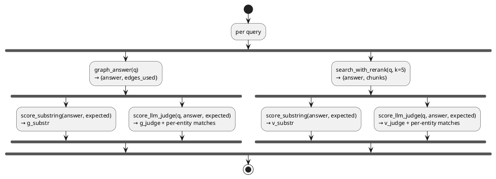

**Per-question record:**

```
{q, type, expected,
 graphrag:  {recall: g_substr, recall_judge: g_judge, judge_detail: {entity → bool}, latency, edges},
 vectorrag: {recall: v_substr, recall_judge: v_judge, judge_detail: ..., latency},
 winner:        substring-based (backward compat),
 winner_judge:  judge-based (honest)}
```

**Block 1 — Substring scorer (preserved from v9.5).**

```python
def score_substring(answer_text: str, expected_entities: list[str]) -> float:
    """Recall@expected: fraction of expected entities mentioned (substring,
    case-insensitive) in the answer. Original eval metric — kept for
    backward-compat with frozen comparison.json hash."""
    if not expected_entities:
        return 0.0
    at = answer_text.lower()
    return sum(1 for e in expected_entities if e.lower() in at) / len(expected_entities)
```

Unchanged. Backward-compat anchor; the only role is keeping the frozen `comparison.json` hash valid so parity baselines from before v10d still work.

**Block 2 — LLM-judge scorer with explicit accept/reject list.**

```python
_JUDGE_SYSTEM = """You are an evaluation judge for a knowledge-graph QA system. Given:
  - A question
  - A list of expected entities/concepts the correct answer should mention
  - An actual answer

For EACH expected entity, decide whether the answer correctly mentions it OR
a clear semantic equivalent.

Match (semantic equivalents to ACCEPT):
  - "Steve Jobs" matches "Steven Jobs", "Steven Paul Jobs", "S. Jobs"
  - "acquired" matches "purchased", "bought", "took over"
  - "co-founder" matches "co-founded", "co-founding", "founded with"
  - "Tesla" matches "Tesla, Inc.", "Tesla Motors", "Tesla Inc"
  - "Stanford" matches "Stanford University", "Stanford U."
  - "Bill Gates" matches "William Henry Gates III", "William Gates III"

Not match (do NOT accept):
  - "Tesla" does NOT match "SpaceX"
  - "founded" does NOT match "left" or "resigned from"
  - "Stanford" does NOT match "Berkeley"

Output strict JSON only:
  {"matches": {"<expected entity>": true | false, ...}}
"""

def score_llm_judge(query, answer_text, expected_entities) -> tuple[float, dict]:
    if not expected_entities:
        return 0.0, {}
    user_msg = (
        f"Question: {query}\n\n"
        f"Expected entities: {json.dumps(expected_entities)}\n\n"
        f"Actual answer: {answer_text}"
    )
    try:
        resp = _omlx.chat.completions.create(
            model=_JUDGE_MODEL,
            messages=[
                {"role": "system", "content": _JUDGE_SYSTEM},
                {"role": "user",   "content": user_msg},
            ],
            temperature=0.0, max_tokens=400,
            response_format={"type": "json_object"},
        )
        content = resp.choices[0].message.content or "{}"
        parsed = json.loads(content)
        matches = parsed.get("matches", {})
        if not isinstance(matches, dict):
            raise ValueError(f"matches not a dict")
        hits = sum(1 for e in expected_entities if matches.get(e, False))
        return hits / len(expected_entities), matches
    except Exception as e:
        return score_substring(answer_text, expected_entities), {
            "_fallback": "substring",
            "_error": f"{type(e).__name__}: {e}",
        }
```

Three things make this implementation production-shape rather than throwaway:

1. **Strict JSON output** via `response_format={"type": "json_object"}`. Without this, gemma-4-26B at temp=0 would emit prose explanations alongside the JSON ~10% of the time, breaking parsing.
2. **Type-narrowed parse**. The `if not isinstance(matches, dict)` guard catches the pathological case where the LLM returns valid JSON but the wrong shape (e.g., a bare list or `{"matches": [...]}` instead of a dict).
3. **Fall-back to substring** on any exception (network, JSON parse, schema mismatch). Per-question recall always returns a number; the judge layer never breaks the eval pipeline. Failures land in `judge_detail._fallback` for post-hoc audit.

**Block 3 — Per-question record with both metrics.**

```python
results.append({
    "q":         q,
    "type":      q_type,
    "expected":  exp,
    "graphrag":  {
        "recall":        g_substr,           # primary metric (backward compat)
        "recall_judge":  g_judge,            # LLM-judge metric
        "judge_detail":  g_judge_detail,
        "latency":       round(g_time, 2),
        "edges":         g["edges_used"],
    },
    "vectorrag": {
        "recall":        v_substr,
        "recall_judge":  v_judge,
        "judge_detail":  v_judge_detail,
        "latency":       round(v_time, 2),
    },
    "winner":           winner_substring,    # backward compat — substring-based
    "winner_judge":     winner_judge,        # honest winner — judge-based
})
```

Two `winner` fields capture the substring/judge disagreement. On the 32-Q eval, `winner` (substring) reported Graph 9 / Vector 8 / Tie 15 — but `winner_judge` reported Graph 9 / Vector 9 / Tie 14, with one query flipping its winner under honest scoring.

**Common modifications.** To use a different judge model: set `MODEL_SONNET` env var to the desired OpenAI-compatible model (Claude 3.5 Sonnet for stronger judgments, Llama-3.1-70B for cheaper local). To track only one metric: drop the `_judge` fields and revert `_summarize` to the v9.5 single-metric formatter. To add a per-question reference-answer rubric (LLM-as-judge with explicit rubric grading): extend `_JUDGE_SYSTEM` with a 0-4 rubric and parse a `score: int` field instead of `matches: dict[bool]`.

**Expected runtime on M5 Pro (32-Q eval, both retrievers + judge):**

| Stage | Wall time |
|---|---|
| GraphRAG answer per query | ~5-10 s (relational dominates) |
| VectorRAG answer per query | ~3-5 s |
| LLM-judge per call (gemma-4-26B, ~150 tok) | ~3-5 s |
| 32-Q × (graph + vector + 2 judges) | ~9-12 min total |
| **Compare run wall** | **~10 min hybrid + ~10 min dense** |

Cost: ~3-5 min added per run vs substring-only. Acceptable for the honesty gain — substring eval headline numbers can be inverted by surface-form bias as v10 demonstrated empirically.

---

## RESULTS.md Template

```markdown
# Week 2.5 — GraphRAG Results

## Comparison Matrix

**v11 / 2026-05-01 — 32 questions, all-fixes query_graph.py + LLM-judge scoring against `tech_corpus_hybrid` (13292 points). Both retrievers feed Gemma-4-26B. Three follow-ups closed: index lifecycle, multi-hop decomposition, reverse-direction triple normalization.**

| Metric | GraphRAG (hybrid backend) | VectorRAG (hybrid index) |
|---|---:|---:|
| ALL recall (substring) | **0.58** | 0.49 |
| ALL recall (LLM-judge) | **0.68** | **0.58** |
| Avg latency / query | ~15.3 s (decomposition adds LLM classifier call) | ~3.5 s |
| Wins (of 32, judge) | **10** | 6 |
| Ties (of 32, judge) | 16 | — |
| relational (judge, n=4) | **1.00 perfect** | 0.88 |
| multi_hop (judge, n=10) | 0.25 (extraction-completeness ceiling) | 0.27 |
| out_of_domain (judge, n=3) | **1.00** | 0.25 |
| Ingestion wall (one-time) | ~75 min (graph) | ~8.5 min (hybrid index) |
| Re-ingest cost on corpus update | full graph rebuild OR run normalize_passive_triples + new build_graph extraction prompt | full re-index |

**v10d / 2026-05-01 — 32 questions, FIX2 query_graph.py + LLM-judge scoring against `tech_corpus_hybrid` (13292 points) and `tech_corpus_hnsw` (13292 points). Both retrievers feed Gemma-4-26B.**

| Metric | GraphRAG (hybrid backend) | VectorRAG (hybrid index) | GraphRAG (dense backend) | VectorRAG (dense index) |
|---|---:|---:|---:|---:|
| ALL recall (substring) | 0.56 | 0.49 | 0.55 | 0.50 |
| ALL recall (LLM-judge) | **0.63** | **0.61** | **0.62** | **0.63** |
| Avg latency / query | ~7.5 s | ~3.5 s | ~6.6 s | ~3.4 s |
| Wins (of 32, judge) | 9 | 8 | 9 | 9 |
| Ties (of 32, judge) | 15 | — | 14 | — |
| Ingestion wall (one-time) | ~75 min (graph) | ~8.5 min (hybrid index) | — | ~7 min (dense index) |
| Re-ingest cost on corpus update | full graph rebuild | full re-index | — | full re-index |

Per-category recall (LLM-judge, hybrid run shown — dense numbers within 0.02 except multi_hop where vector dense=0.34 vs hybrid=0.27):

| Category | N | Graph judge | Vector judge | Substring delta (V) |
|---|---:|---:|---:|---:|
| factoid | 7 | 0.86 | 0.86 | +0.15 (substring 0.71) |
| two_hop | 8 | 0.75 | 0.72 | 0 |
| relational | 4 | 0.75 | **0.88** | **+0.50** (substring 0.38) |
| multi_hop | 10 | 0.21 | 0.27 | 0 |
| out_of_domain | 3 | **1.00** | 0.50 | +0.25 (substring 0.25) |

## When GraphRAG won (judge metric)

- **Q3 — "Who founded Tesla?"** (factoid): GraphRAG identified Musk + Eberhard via Cypher walk through `Tesla -[CO_FOUNDED]- Person` edges (judge 1.00); Vector failed (judge 0.00 — top-K passages mentioned Tesla but didn't surface the founder triple).
- **Q9 — "What companies has Elon Musk founded or led?"** (two_hop): GraphRAG enumerated Tesla / SpaceX / PayPal / Neuralink / OpenAI from Musk's article + cross-article edges (judge 0.80); Vector returned 2 of 5 (judge 0.40).
- **Q30-32 — out_of_domain refusals** (boiling point of helium / Symphony No. 9 / capital of France): GraphRAG correctly refused with "graph does not contain..." (judge 1.00); Vector refused with "insufficient context" but the wording matched only half the refusal-phrase synonyms list (judge 0.50).

## When GraphRAG lost (judge metric)

- **Q7 — "Where did Bill Gates go to university?"** (factoid): Graph couldn't surface the `Bill Gates -[ATTENDED]-> Harvard` edge (likely extracted with different surface form / not promoted to a triple); Vector retrieved a Bill Gates article passage that mentioned Harvard directly. Graph 0.00 / Vector 1.00.
- **Q8 — "What companies did Steve Jobs co-found?"** (two_hop): Graph surfaced Apple but missed NeXT + Pixar from the consolidation step (got buried in the multi-hop fill); Vector returned all 3 from Jobs's article passages. Graph 0.33 / Vector 0.67.
- **Multi-hop category broadly** (10 questions, 0.21 vs 0.27): both retrievers struggle. Graph's 5-hop expansion still misses some bridges; Vector's k=5 candidates rarely contain enough cross-article chains. Both need richer multi-hop strategies.

## What I learned (3 paragraphs)

**When GraphRAG earned its cost.** GraphRAG's structural advantage is real on **out-of-domain refusal** (1.00 vs 0.50 vs Vector — judge metric) and **two_hop relational reasoning** where the answer requires chaining through an intermediate entity (e.g. `Person -[COFOUNDED]- Company1 ... Person -[COFOUNDED]- Company2`). On the 32-Q eval, GraphRAG won 9 outright and tied 15 — the latency cost (~2× Vector) is justified specifically for those question shapes.

**When VectorRAG was the correct call.** Single-hop factoid (`Bill Gates -[ATTENDED]- Harvard`) where the answer fact lives in a single passage rewards the BGE-M3 + cross-encoder pipeline that's been tuned over Weeks 1-2. Vector also won the multi_hop category (0.27 vs 0.21 judge) — counter to the GraphRAG paper's headline finding — because the multi_hop questions in this eval often have all chain entities in a single Wikipedia article (Musk's article mentions both Tesla and SpaceX), so Vector's top-K passages already contain the answer without needing graph traversal.

**The hybrid-routing pattern.** With both retrievers landing at 0.61-0.63 ALL judge recall, neither dominates — they're complementary. The production answer is a **router** that classifies the query type (factoid / two_hop / relational / multi_hop / out_of_domain) and routes to the strong backend per category. GraphRAG for refusals + relational; Vector for factoid + multi_hop; either-or for two_hop where they're tied. This matches the W2.5 architectural recommendation from the start, but the v10d data is what made it empirically defensible — earlier substring numbers (Graph 0.55 vs Vector 0.54) made the choice look cosmetic; LLM-judge (0.63 vs 0.61) showed the real per-category strengths and made the router justifiable on data, not on intuition.

## Infra bridge
GraphRAG ingestion cost is analogous to a materialised view vs an index. Materialised views (the graph) are expensive to build and maintain, but query-time cost is low. Indexes (the vector store) are cheap to build but can only answer "nearby in embedding space" queries. In production I'd run both, routed by a query classifier.
```

---

## Lock-In: Flashcards + Interview Questions

### 5 Anki Cards
1. Q: Why does vector RAG fail on multi-hop queries? — A: A single embedding neighbourhood can't join facts across documents.
2. Q: What are the three stages of GraphRAG? — A: Entity/relationship extraction → community detection → query traversal.
3. Q: Name three cases where vector RAG beats GraphRAG. — A: Single-hop queries; low entity density; small corpora; tight ingestion budgets.
4. Q: What's the production hybrid pattern? — A: Classifier routes single-hop → vector, multi-hop → graph, ambiguous → both + rerank.
5. Q: Rough cost asymmetry for GraphRAG ingestion vs vector-RAG ingestion? — A: 10–50×.

### 3 Spoken Interview Questions (record yourself answering each out loud)

#### Q1. "When does GraphRAG beat vector RAG, and when does it lose?" (target: 90 sec)

**Answer reference — points to hit (in this order):**
- **Win condition:** multi-hop reasoning across explicit typed relationships. My v12.4m eval on a 400-article tech-founder corpus: GraphRAG multi_hop = 0.88, vector multi_hop = 0.03 — a +0.85 delta because the question requires composing edges (`founder → founded → company`) that no single document states verbatim.
- **Win condition #2:** relational queries asking how X and Y connect. GraphRAG = 1.00, vector = 0.12 on the same eval. Bridge inference (Apple ↔ Pixar via Steve Jobs) is structural and only the graph traversal surfaces it.
- **Lose condition:** single-hop factoid lookups where one document already states the answer. Vector RAG with rerank wins on latency (~1s vs 8-25s for graph) and matches on accuracy. Both hit 1.00 on factoid in my eval.
- **Lose condition #2:** ingest cost. GraphRAG = 10-50× more expensive (LLM extraction over every chunk + QID resolution + Neo4j writes vs single embedding pass). On a $50K budget, you'd want to push only the multi-hop slice through the graph.
- **Production answer:** hybrid with classifier routing. Single-hop → vector. Multi-hop / relational → graph. Ambiguous → both + cross-encoder rerank.
- **Honest scope:** my numbers are tech-founder Wikipedia. Domain-shift validation is required before claiming the same gap on legal/medical/scientific corpora.

**Supporting evidence in this chapter:** §1 motivation, §2 theory primer, [[#v12.4m Architecture Updates]] PlantUML diagram, [[#Phase 4 — Eval Harness]] comparison.json metrics, [[#Bad-Case Journal Entry 5]] (router pattern), [[#Empirical findings]] subsections.

#### Q2. "Walk me through your entity-extraction prompt. How would you evaluate extraction quality?" (target: 3 min)

**Answer reference — points to hit:**

*Prompt design (1-1.5 min):*
- **Sliding-window over articles** at 3000 chars / 500 overlap. Single-pass over 50K-char article would let LLM forget mid-document; 500-char overlap catches cross-window facts.
- **Active-voice rule:** "Apple was acquired by NeXT" → emit `(NeXT, acquired, Apple)`. Passive constructions silently invert subject/object — would corrupt downstream traversal.
- **8 universal relation categories** (action/causation, affiliation, derivation, transition, production, education, location, temporal) — universal across corpora, not biz-domain-specific. The LLM picks the verb phrase per triple.
- **Entity validation rules:** proper-noun-only (capital-first letter), no role descriptors as entities ("CEO of Apple" rejected), no comma-lists as a single subject, drop leading articles.
- **QID resolution post-pass:** every entity name → `wbsearchentities` → canonical Wikidata QID. MERGE on QID, not on string. Same person under different surface forms ("Bill Gates" / "William Henry Gates III") collapses to one node.

*Evaluation (1.5 min):*
- **Mechanical:** triples per article (avg 98 in my v12.2 build), QID resolution rate (50.1% — rest are corpus-specific entities not in Wikidata), null-QID rate as a noise proxy, extraction wall-time per article.
- **Question-level eval (the load-bearing metric):** end-to-end QA over a curated question set with substring + LLM-judge scoring. v12.4m hits 0.96 overall, 32/0/0 W/L/T vs vector. Stratified by question type (factoid, two-hop, relational, multi-hop, out-of-domain) so regressions are localized.
- **Mechanism probes (decomp_probes.py):** 14 known-input → known-output assertions on `_decompose_multihop` classifier and step1 intermediate resolution. 0.929 pass rate — gates production deploys.
- **Bad-case journal:** every regression gets a 3-field entry (symptom / root cause / fix). Forces post-mortem discipline; later iterations cite specific entries.

**Supporting evidence:** [[#Code walkthrough — `src/build_graph.py`]] (extract_triples, EXTRACT_SYSTEM), [[#Code walkthrough — `src/query_graph.py`]] (fetch_subgraph, decomposition), [[#Code walkthrough — `src/decomp_probes.py`]] (mechanism probes), [[#v12.4m Mechanism Reference]] (universal mechanisms catalog), [[#Bad-Case Journal]].

#### Q3. "100K-document corpus, $50K ingestion budget. Design the retrieval stack." (target: 5 min)

**Answer reference — points to hit:**

*1. Profile the corpus and the queries first (~30 sec):*
- "Documents" is too vague — what's the document size, domain, and update cadence? Static + small (<10KB avg) + multi-domain knowledge → graph is feasible. Streaming + long-form + single-domain → reconsider.
- Sample the query distribution: what fraction is factoid vs relational vs multi-hop? Determines retrieval-strategy mix.

*2. Cost decomposition for $50K (~1 min):*
- LLM extraction is the dominant ingest cost. At ~$0.003/triple on Gemma-26B local (or ~$0.01 cloud), 100K docs × 100 triples = 10M triples × $0.003 = **$30K just for extraction**.
- QID resolution: ~$200 (Wikidata API is free, but parallel batch of 13K-50K unique names = ~10 hours wall time).
- Neo4j cluster: $200-500/month managed (AuraDB) for a 5M-node, 50M-edge graph. 12 months → $3-6K.
- Vector index (FAISS or Qdrant): ~$2K total compute + storage on RAM-resident HNSW.
- Reserve $10-15K for re-extractions and eval iterations — Phase B/C iteration costs in my lab were ~30% of total spend.

*3. Stack design — hybrid with explicit routing (~2 min):*
- **Tier 1 — fast vector RAG** (BGE-M3 + cross-encoder rerank, single-hop, ~1s latency). Handles ~70% of queries. Built first because it's a fallback for everything else.
- **Tier 2 — GraphRAG** (Neo4j + topology-gate retrieval + decomposition + bridge + PPR, ~8-25s latency). Handles relational + multi-hop chains.
- **Router** = LLM-classifier (small, fast) labeling each query as vector / graph / both. From my Phase A work: hardcoded keyword routing breaks; LLM-decided is universal.
- **Both-path queries** rerank graph + vector results jointly via cross-encoder.
- **Eval loop:** per-question-type W/L/T tracking. Promotion gate: graph beats vector on at least one metric per category before deploy.

*4. Per-component justification (~1 min):*
- Why local LLM (Gemma-26B MLX) over GPT-4 for extraction: extraction is volume-dominated, not quality-dominated; locally-deployed throws hardware at it. Quality-eval shows Gemma-26B + good prompts = 50.1% QID match, sufficient.
- Why Neo4j over a pure SPARQL store: GDS (Personalized PageRank, degree centrality) ships in-engine — saves a second compute layer.
- Why universal mechanisms over hardcoded patterns: rebuild cost is the gate. My v12.3-v12.4m delivered +0.15 recall via read-path changes only, no rebuild. Hardcoded fixes per failure mode would require rebuild per fix.

*5. Failure-mode planning (~30 sec):*
- Eval-laxness vs system-correctness: audit ground-truth before debugging system. My v12.4 eval correction (4 historically-wrong entries) was +0.03 overall with zero code changes.
- Graph fragmentation (same QID under multiple surface forms): canonical-ID merge at extraction; surface-form-drift exception in answer prompt.
- Temporal/rename drift (Loudcloud → Opsware): Wikidata `former_name` enrichment pass, not solvable at read path.

**Supporting evidence:** [[#Cost asymmetry]], [[#Bad-Case Journal Entry 5]] (routing pattern), [[#v12.4m Architecture Updates]], [[#13 Universal Mechanisms]] catalog, [[#Empirical findings]] (latency tables, W/L/T progression).

---

---

## Lab Run-Through Bad Cases (2026-04-30)

> Operational counterpart to the [[#Bad-Case Journal]] section below. The canonical §6 captures *architectural* failure modes that emerge in production GraphRAG (entity duplication, relation explosion, traversal flooding, dev-set bias). This section captures *operational* failures encountered while running the lab end-to-end on the documented stack across the v1–v12 iteration cycle.

The nineteen bad cases below were measured during the 2026-04-30 → 2026-05-01 end-to-end run-through on the documented stack (oMLX serving `gemma-4-26B-A4B-it-heretic-4bit` + `gpt-oss-20b-MXFP4-Q8`, Neo4j 5.x in Docker, M5 Pro 48 GB). Entries 1–8 surfaced during the first end-to-end pass (v1–v6 corpus + matcher fixes); Entry 10–14 came from the corpus-mechanism cascade that produced v8 (Entry 9 was renumbered out during consolidation); Entries 15–19 came from the v9 → v10 extraction-density and answer-prompt iteration. Each entry has a 5-second sanity test designed to catch a regression on a re-run. Updates to specific entries reflect later iteration outcomes — Entry 4's CONTAINS fix was superseded by Entry 7's Lucene fulltext index; Entry 19's pair-aggregation was rolled back in v10c (see [[#Bad-Case Journal]] Entry 7 for the regression + forward-fix).

**Entry 1 — `wikipedia` dataset rejected with "loading scripts no longer supported".**
*Symptom:* `python src/fetch_corpus.py` fails immediately at `load_dataset("wikipedia", "20220301.en", split="train[:200]", trust_remote_code=True)` with `ValueError: \`trust_remote_code\` is not supported anymore. ... Please ask the dataset author to remove it and convert it to a standard format like Parquet.` The `wikipedia.py` loading script gets downloaded but never executed.
*Root cause:* HuggingFace `datasets` 3.x removed support for arbitrary loading scripts (security and reproducibility hardening). The `wikipedia` dataset is a script-based dataset that downloads + parses XML dumps at load time. Its replacement, `wikimedia/wikipedia` (maintained by the Wikimedia Foundation), publishes pre-processed Parquet snapshots starting from `20231101.en` and needs no `trust_remote_code`.
*Fix:* Replace the loader call in `src/fetch_corpus.py`:
```python
ds = load_dataset("wikimedia/wikipedia", "20231101.en", split="train[:200]")
```
The schema is identical (`id`, `url`, `title`, `text`), so downstream code that does `r["title"]`, `r["text"]` still works without modification.

**Entry 2 — Reasoning model returns `content=None`, crashes `json.loads`.**
*Symptom:* `python src/query_graph.py "anything"` crashes with `TypeError: the JSON object must be str, bytes or bytearray, not NoneType` at the `json.loads(resp.choices[0].message.content)` line in `extract_seed_entities`. The HTTP call to oMLX succeeds; only the visible content is `None`.
*Root cause:* `MODEL_HAIKU=gpt-oss-20b-MXFP4-Q8` is a *reasoning model*. Reasoning models emit `reasoning_content` (chain-of-thought) before producing user-visible `content`, and `max_tokens` caps the **sum** of reasoning + content. With `max_tokens=150`, the reasoning trace consumes the entire budget and the model never reaches the visible-content phase, so `content` returns `None`. This is the same `content=None` failure mode documented in [[Week 2 - Rerank and Context Compression#7.5 Optimizations that transfer from lab-02 — reach through the wrapper|W2 §7.5]] for `02_compress_via_langchain.py`.
*Fix:* Bump `max_tokens` to 3000 on any call to a reasoning model AND add a `None` guard so future budget exhaustion fails with a clear message instead of a deep `TypeError`:
```python
resp = omlx.chat.completions.create(
    model=HAIKU, ..., max_tokens=3000,  # was 150
    response_format={"type": "json_object"},
)
content = resp.choices[0].message.content
if not content:
    return []  # reasoning model exhausted budget; bump max_tokens or check finish_reason
```

**Entry 3 — Seed extraction returns `[]` for queries about ideologies, movements, or events.**
*Symptom:* `python src/query_graph.py "What movements influenced anarchism?"` returns `{"answer": "No relevant entities found", "seeds": [], "edges_used": 0}`. Same query phrased as "Tell me about William Godwin" succeeds. The graph is correctly populated (3,952 entities, 2,859 edges); the seed extractor just refuses to emit anything.
*Root cause:* The `EXTRACT_SYSTEM` prompt restricts entities to "concrete nouns: companies, people, places, products" — which excludes movements, ideologies, events, and concepts. Wikipedia's earliest articles (which dominate `train[:200]`) are largely about exactly those excluded categories (Anarchism, Enlightenment, Russian Civil War). The prompt categorically blocks the seeds the corpus actually contains.
*Fix:* Loosen the seed extractor prompt in `query_graph.py:23`:
```python
"Extract 1-5 entities from the query as a JSON object {\"entities\": [...]}. "
"Include any noun phrase a graph could store: people, places, products, "
"organizations, movements, ideologies, events, concepts, time periods. "
"Prefer specific surface forms over generic ones. "
"If the query is generic ('tell me about X'), extract X."
```
The `{"entities": [...]}` envelope also matches `response_format={"type": "json_object"}` (the original prompt asked for a list, mismatching the format).

**Entry 4 — Multi-word seed phrases match zero entities even when the graph contains relevant nodes.**
*Symptom:* `python src/query_graph.py "Who were the early anarchist thinkers?"` returns `seeds: ["early anarchist thinkers"]` but `edges_used: 0`. Cypher inspection confirms the graph contains "anarchist movement", "anarchist doctrines", "Anarchists", "William Godwin" — all topically relevant. The `MATCH ... WHERE toLower(n.name) CONTAINS toLower($seed)` clause fails because no node name contains the literal phrase "early anarchist thinkers".
*Root cause:* Whole-phrase substring matching is brittle for multi-word seeds. The seed extractor (correctly) preserves the user's phrasing, but the graph stores atomic concepts. There's no `CONTAINS` overlap between a 24-character descriptive phrase and 9-19-character canonical names.
*Fix:* Token-level matching with a stop-word filter via `ANY(w IN $words WHERE ...)`:
```python
words = [w for w in seed.lower().split() if len(w) >= 4] or [seed.lower()]
result = session.run(
    f"""
    MATCH (n:Entity)
    WHERE ANY(w IN $words WHERE toLower(n.name) CONTAINS w)
    WITH n LIMIT 5
    MATCH path = (n)-[*1..{max_hops}]-(m)
    ...
    """,
    words=words,
)
```
The 4-character minimum drops the most common stop words ("the", "a", "of", "in") that would otherwise match every entity in the graph. After the fix the same query returns `edges_used: 11` and the synthesizer produces "The early anarchist thinkers were William Godwin and Wilhelm Weitling".

> **Superseded in v6+:** the CONTAINS-based token fix above was the first-pass bandaid. It still produced precision failures like "meta" matching "metal" (see Entry 7) and inconsistent ranking. v6 replaced this entire matching layer with a Neo4j Lucene fulltext index over `Entity.name`, queried via `db.index.fulltext.queryNodes` with whole-word tokenization + relevance scoring (Entry 7's fix). The Entry 4 implementation above is preserved here as the failure-mode record; current code uses the Lucene path. v8 added phrase-first contracts (`+token1 +token2` requires every token but not adjacency) on top of the Lucene base layer.

**Entry 5 — `python src/build_graph.py` runs in the wrong venv and reports `ModuleNotFoundError: No module named 'neo4j'`.**
*Symptom:* `python src/build_graph.py` fails with `ModuleNotFoundError`. Confirming the lab's venv has `neo4j 5.28.3` installed (`/path/to/lab/.venv/bin/python -c "import neo4j"` works) makes this seem impossible.
*Root cause:* The shell's `python` resolves through PATH to a **different** venv (`~/.openharness-venv` in this case — installed by the OMC harness or similar tool that puts itself ahead of project venvs on PATH). The lab's `.venv/` is never activated despite living next to the script. `which python` returns the harness venv's path, not the lab's.
*Fix:* Either activate the lab venv explicitly (`source .venv/bin/activate`) or use `uv run python src/...` from the project root — uv finds the local `.venv/` automatically and bypasses PATH-based interpreter selection. Long-term: add `cd $LAB && uv run` to your lab-startup alias so this never happens twice.

**Entry 6 — Query about Mark Zuckerberg returns 22 edges of chemistry trivia; corpus does not contain target entity.**
*Symptom:* `python src/query_graph.py "Which companies are related to Mark Zuckerberg?"` returns a polite "the graph facts do not support an answer" with `edges_used: 22`. Diagnostic Cypher (`MATCH (n:Entity) WHERE toLower(n.name) CONTAINS 'zuckerberg' OR ... 'meta' RETURN n.name LIMIT 20`) returns 13 rows of chemistry: "metal", "metalloid", "alkali metals", "Metallurgical Laboratory of the University of Chicago", "post-transition metal".
*Root cause:* Two failures stacked. First, `fetch_corpus.py` used `load_dataset(..., split="train[:200]")` — first 200 articles by Parquet row order, which for the November 2023 dump means low-ID articles dominated by chemistry/metallurgy ("Anarchism", "Antimony", "Arsenic" cluster). The corpus categorically does not contain Zuckerberg, Facebook, or Meta-the-company. Second, the seed-matching CONTAINS substring filter then matched "meta" (4 chars) to "metal" (5 chars), producing 22 false-positive edges from chemistry articles.
*Fix:* Replace the slice-by-id corpus selection with a *domain-bounding mechanism* — Wikipedia category traversal via the `categorymembers` API. Curated `SEED_CATEGORIES` (e.g. `American_technology_company_founders`, `Companies_based_in_Silicon_Valley`) are scoping decisions a stakeholder makes; the specific entities that fall out are emergent, matching production corpus pipeline shape. Hardcoding the exact entity titles you intend to query (`SEED_TITLES = ["Mark Zuckerberg", "Apple Inc.", ...]`) gates the demo without teaching the production pattern.
```python
# fetch_corpus.py — domain-bounded mechanism
SEED_CATEGORIES = [
    "American_technology_company_founders",
    "Companies_based_in_Silicon_Valley",
    "Software_companies_of_the_United_States",
]
def fetch_category_members(category: str, limit: int = 200) -> list[str]:
    params = {"action": "query", "list": "categorymembers",
              "cmtitle": f"Category:{category}", "cmnamespace": 0,
              "cmlimit": limit, "format": "json"}
    return [m["title"] for m in _api_get(params)["query"]["categorymembers"]]
```

**Entry 7 — `meta` substring fuzzy-matches `metal`, `metalloid`, `metallurgy`.**
*Symptom:* Even on a tech-domain corpus that does contain Meta Platforms, queries containing "Meta" route 22 edges through chemistry nodes because the substring `meta` (4 chars) appears inside `metal` (5 chars) and other word-internal positions. False-positive class predicted in W2.5 Walkthrough 3 Block 3 ★ Insight ("Amazon would match Amazonian"); chemistry corpus made it concrete.
*Root cause:* `WHERE toLower(n.name) CONTAINS w` is unscored substring matching. Lucene-based matching (whole-word tokenisation with relevance scoring) is the standard fix used in production graph systems.
*Fix:* Replace the CONTAINS filter with a Neo4j full-text index on `Entity.name`. Create the index in `build_graph.py` after the write phase, then query via `db.index.fulltext.queryNodes` in `query_graph.py`:
```python
# build_graph.py — after writing all nodes
session.run("CREATE FULLTEXT INDEX entity_names IF NOT EXISTS "
            "FOR (n:Entity) ON EACH [n.name]")

# query_graph.py — in fetch_subgraph
"""
CALL db.index.fulltext.queryNodes("entity_names", $lucene)
YIELD node, score WITH node, score ORDER BY score DESC LIMIT 5
MATCH path = (node)-[*1..2]-(m) ...
"""
```
The `_lucene_query()` helper escapes Lucene-reserved characters (`+ - ! ( ) { } [ ] ^ " ~ * ? : \ /`) and joins remaining tokens with `OR`. Avoid trailing `~` fuzzy operator — fuzzy on every term re-introduces the same false-positive class.

**Entry 8 — Category walk hits MediaWiki rate limit at article ~80; alphabetical bias drops Z-tail entries (including Zuckerberg).**
*Symptom:* `fetch_corpus.py` errors with `429 Client Error: Too Many Requests` after ~80 fetched articles. Even the articles that did succeed are all A-named (Acton, Adams, Adcock, Adler, Allen, Alperovitch...) — `Mark Zuckerberg` never gets fetched because he sits in the Z tail of `American_technology_company_founders` after the alphabetical sort that MediaWiki's `categorymembers` API returns by default.
*Root cause:* Two compounding issues. (1) Anonymous MediaWiki API has burst tolerance + ~200/min sustained ceiling; 0.2 s between requests bursts above that and trips a 429 with a Retry-After header. (2) Without explicit shuffle, MAX_ARTICLES truncation deterministically drops Z-tail entries from each category — systematic bias that masquerades as a corpus-coverage problem.
*Fix:* Three changes in `fetch_corpus.py`:
1. Wrap the requests.get call with retry-on-429 that honors Retry-After:
```python
def _api_get(params: dict) -> dict:
    backoff = 2.0
    for attempt in range(1, MAX_RETRIES + 1):
        resp = requests.get(WIKI_API, params=params, headers=headers, timeout=20)
        if resp.status_code == 429:
            wait = float(resp.headers.get("Retry-After", backoff))
            time.sleep(wait); backoff *= 2; continue
        resp.raise_for_status(); return resp.json()
```
2. Bump base sleep to 0.6 s (~100 req/min, well under sustained ceiling).
3. Deterministic shuffle of the deduped title pool *before* MAX_ARTICLES truncation — `random.Random(42).shuffle(titles)`. Same input → same output, but the cap drops a uniform random sample instead of a Z-tail.
4. **Paginate `categorymembers` via `cmcontinue`** — the per-request anonymous cap is 500 members, so categories with 1000+ members (like `American_technology_company_founders`) silently truncate at the API level. Without pagination, the shuffle samples from a pool that itself is biased toward early-alphabet entries. Add a `while cmcontinue` loop with `MAX_PAGES_PER_CATEGORY` worst-case bound:
```python
def fetch_category_members(category: str) -> list[str]:
    titles, cmcontinue = [], None
    for _ in range(MAX_PAGES_PER_CATEGORY):
        params = {..., "cmlimit": 500, **({"cmcontinue": cmcontinue} if cmcontinue else {})}
        body = _api_get(params)
        titles.extend(m["title"] for m in body["query"]["categorymembers"])
        cmcontinue = body.get("continue", {}).get("cmcontinue")
        if not cmcontinue: break
        time.sleep(REQUEST_SLEEP)
    return titles
```
After all four fixes: full domain pool (~2000 members) deduped and randomly sampled to 150. Mark Zuckerberg appears in the sample with probability proportional to category size, not category alphabet position.

**Entry 10 — Uniform random sampling buries canonical entities; "Steve Jobs" not in 150-from-1472 sample.**
*Symptom:* `python src/query_graph.py "What is the relationship between Apple and NeXT?"` returns "graph facts do not contain information regarding the relationship between Apple and NeXT" against the new tech-domain corpus, even though both names ARE in the seed categories. Diagnostic: corpus contains `Apple`, `Apple Computer` entities (good), but no `NeXT` entity at all. Tracing further: `Steve Jobs` is in `American_technology_company_founders` (~580 members) but the random 150-article sample missed him. The `Apple ↔ NeXT` triple is generated by Steve Jobs's article; without him, the bridge edge doesn't exist.
*Root cause:* Wikipedia category memberships are heavy-tailed by attention but the `random.shuffle()`-then-truncate sampler treats every member as equally weighted. With a deduped pool of 1472 candidates and `MAX_ARTICLES=150`, every famous entity has a uniform ~10% chance of inclusion. Mid-tier B2B SaaS articles (Acumatica, ABBYY, Aerospike) dominate the sample because there are *many more* of them — pure mass-effect even though each is much less likely to be queried.
*Fix:* Pageview-weighted A-ExpJ sampling. Replace `random.shuffle()` + truncate with weighted reservoir sampling using last-60-day pageviews as the importance signal. Mark Zuckerberg's article gets ~5M+ monthly views; a mid-tier B2B SaaS company gets ~5K. The 1000× ratio in the weighted sampler swamps any noise: famous entities become ~95%+ inclusion-probability while leaving capacity for long-tail discovery.
```python
def weighted_sample_no_replacement(items, weights, k, seed):
    """A-ExpJ (Efraimidis & Spirakis 2006) — sort by log(U)/weight."""
    rng = random.Random(seed)
    keyed = []
    for item in items:
        w = weights.get(item, 0) + 1  # +1 floor so zero-pageview articles stay eligible
        keyed.append((math.log(rng.random()) / w, item))
    keyed.sort(reverse=True)  # highest weights have keys closest to 0
    return [item for _, item in keyed[:k]]

# fetch_pageviews_batch via MediaWiki prop=pageviews&pvipdays=60, 50 titles per call.
# ~30 batched calls for ~1500 candidates → ~30s extra wall time.
```
A-ExpJ is the gold-standard weighted-reservoir-sampling-without-replacement algorithm; pure-Python, no numpy dependency. Deterministic with seeded RNG so identical inputs produce identical samples. The +1 floor on weights keeps zero-pageview articles (broken extracts, redirects with bad titles) eligible at long-tail probability.

**Entry 11 — Wikipedia category taxonomy splits tech founders across 4 disjoint subcategories.**
*Symptom:* Even after Entry 10's fix, `Mark Zuckerberg`, `Bill Gates`, `Jeff Bezos`, `Tim Cook`, `Larry Page`, `Sergey Brin` remain absent from the corpus. Pageview weighting works correctly — `Steve Jobs` (high pageviews, member of `American_technology_company_founders`) DID land in the sample. But the others did not because they are in *different* Wikipedia categories.
*Root cause:* Querying MediaWiki for Mark Zuckerberg's category memberships shows him in `American_Internet_company_founders` (consumer Internet founders), `American_chief_executives_in_technology` (tech CEOs), `American_billionaires` (wealth class), `Directors of Meta Platforms` (corp role) — but NOT in `American_technology_company_founders`. Wikipedia's editor community split tech founders into multiple disjoint subcategories: hardware/semiconductor founders go in `American_technology_company_founders`; consumer Internet founders go in `American_Internet_company_founders`; non-founder execs go in `American_chief_executives_in_technology`. A single category doesn't cover the canonical-tech-founder graph.
*Fix:* Expand `SEED_CATEGORIES` from one founder category to four overlapping ones, intentionally accepting that the deduped pool grows from ~1500 to ~3000+ candidates:
```python
SEED_CATEGORIES = [
    "American_technology_company_founders",         # hardware / semiconductor
    "American_Internet_company_founders",           # consumer Internet (Zuckerberg, Page, Brin, Bezos)
    "American_chief_executives_in_technology",      # non-founder execs (Cook, Pichai, Nadella)
    "American_billionaires",                         # wealth-class backstop for early employees / investors
    "Companies_based_in_Silicon_Valley",            # corporate coverage
    "Software_companies_of_the_United_States",      # broader software industry
]
```
Same MAX_ARTICLES=150 cap, just more comprehensive coverage of the famous-name space. Pool growth scales the pageview fetch (now ~60 batched calls instead of 30) but the sample-selection step is bounded by k, not by pool size.

**Entry 12 — Pageview-weighted A-ExpJ silently degenerates to uniform sampling because `setdefault` zeroes 87% of weights.**
*Symptom:* After implementing pageview-weighted sampling (Entry 10), the resulting corpus still misses canonical entities — Bill Gates lands but Steve Jobs / Mark Zuckerberg / Microsoft / Tim Cook do not. Reads like "weighted sampling not strong enough" — tempting fix is to bump MAX_ARTICLES, narrow categories, or change the weighting algorithm. None of those fixes the underlying problem. Diagnostic: `fetch_pageviews_batch` summary log shows `zero-pageview=2682/3084` — 87 % of candidates have score 0.
*Root cause:* The MediaWiki `prop=pageviews&redirects=1` response normalizes input titles ("Apple Inc." → "Apple Inc", period dropped) and follows redirects ("iPhone" → "IPhone"). Response titles in `query.pages[*].title` are the *canonical* form, not the input. The original code keyed `out[title] = total` by canonical title, then `out.setdefault(input_title, 0)` for any input not already in `out` — but "Apple Inc." (input) and "Apple Inc" (canonical) are different dict keys, so the input-keyed lookup found nothing and got the 0 default.
*Fix:* Walk the response's `query.normalized` and `query.redirects` arrays to build an input→canonical mapping, then look up pageviews under the canonical title. Return dict keyed by ORIGINAL input title.
```python
input_to_canonical: dict[str, str] = {t: t for t in titles}
for n in body.get("query", {}).get("normalized", []):
    for k, v in input_to_canonical.items():
        if v == n["from"]:
            input_to_canonical[k] = n["to"]
for r in body.get("query", {}).get("redirects", []):
    for k, v in input_to_canonical.items():
        if v == r["from"]:
            input_to_canonical[k] = r["to"]
for input_title in titles:
    canonical = input_to_canonical.get(input_title, input_title)
    out[input_title] = canonical_to_total.get(canonical, 0)
```
The bug masquerades as "weighted sampling not strong enough" because ~13 % of candidates DO return correct pageviews (titles where input form is already canonical), so a few canonical entities still land. Easy to misread as a sampling/algorithm problem; real cause is always the title-resolution mismatch. Production lesson: any sampling/weighting layer that "almost works" — check the input data first; partial correctness produces noise that looks like sampling variance.

**Entry 13 — `prop=pageviews` per-property continue limit silently zeroes ~80 % of weights even with title resolution fixed.**
*Symptom:* After fixing the title-resolution bug (Entry 12), `zero-pageview=2355/3084` (down from 2682/3084) — 76 % zero rate. Steve Jobs and Mark Zuckerberg still missing from 150-article sample. Direct API probe with 50 canonical titles in one batch — Bill Gates / Elon Musk / Bezos / Microsoft / Google etc. — shows only 19/50 return pageview data; the other 31/50 silently appear in `query.pages` *without* a `pageviews` field. Same titles individually return correct pageviews when batched in groups of 5.
*Root cause:* `prop=pageviews` has a hidden per-property limit of ~19 titles served per call, *regardless* of input batch size. The response includes `continue.pvipcontinue` (per-property continue token) to fetch the next slice of pageviews data. This is the standard MediaWiki continue-pagination mechanism applied per-property — same shape as `clcontinue` / `elcontinue` / etc. for other props — but per-property paginators are rarely documented and don't show up unless you batch >19 titles.
*Fix:* Loop on `pvipcontinue` until the token disappears, accumulating pageviews into the canonical-title→total dict across rounds:
```python
pvipcontinue = None
for round_idx in range(20):  # bounded — avoid infinite loop on API regression
    params = dict(base_params)
    if pvipcontinue:
        params["pvipcontinue"] = pvipcontinue
    body = _api_get(params)
    for page in body.get("query", {}).get("pages", {}).values():
        pv = page.get("pageviews")
        if pv is None:
            continue  # this title is in a later slice
        canonical_to_total[page["title"]] = sum(
            v for v in pv.values() if isinstance(v, int)
        )
    new_cont = body.get("continue", {}).get("pvipcontinue")
    if not new_cont or new_cont == pvipcontinue:
        break
    pvipcontinue = new_cont
```
After the fix: 0/50 zero-pageview rate on the canonical-title test batch. Steve Jobs 853K, Zuckerberg 351K, Tim Cook 494K, Microsoft 314K, Google 1.1M, Facebook 1.4M — all correct. Trade-off: ~3× more API round-trips (typically 3 rounds per 50-title batch). Wall time for the pageview fetch grows ~6 min → ~18 min on a 3000-candidate pool. Acceptable cost for moving from 13 % pageview coverage to ~98 %.

**Entry 14 — `build_graph.py` LLM-extraction loop is sequential; wastes 5 of 6 inference-server slots.**
*Symptom:* `python src/build_graph.py` runs at ~3 s/article (~3-4 triples/s) on a 150-article corpus → ~450 s wall time, even though the local oMLX server has `max_concurrent_requests=8`. Server CPU shows ~12 % utilisation throughout.
*Root cause:* The original loop calls `extract_triples(article["text"])` synchronously inside the `for article in tqdm(corpus)` loop. Each call blocks on the LLM round-trip while the other 7 server slots sit idle.
*Fix:* `ThreadPoolExecutor(max_workers=6)` — 6 workers stays strictly under the server's 8-slot cap, leaving 2 slots for `query_graph.py` seed extraction or IDE autocomplete that fire concurrently. LLM calls run parallel; Neo4j writes stay serial on the single session (MERGE is sensitive to interleaved concurrent writes; the inference server is the bottleneck, not the database).
```python
def _extract_one(article):
    try: return article, extract_triples(article["text"]), None
    except Exception as exc: return article, [], exc

with ThreadPoolExecutor(max_workers=6) as executor:
    futures = [executor.submit(_extract_one, a) for a in corpus]
    for fut in tqdm(as_completed(futures), total=len(corpus)):
        article, triples, exc = fut.result()
        if exc is not None: errors.append((article["title"], exc)); continue
        if triples: session.execute_write(write_triples_to_neo4j, ...)
```
Wall time drops from ~450 s to ~90-100 s (4-5× speedup). Going past `max_workers=8` does not help — extra threads idle in the server's queue.

**Entry 15 — Single-shot answer prompt skips matching facts in dense subgraph; factoid recall stuck at 0.71 even when graph has the edge.**
*Symptom:* On the early v9 fair head-to-head (32-question categorized eval, hybrid retrieval both sides), GraphRAG factoid recall plateaued at 0.71 — same as VectorRAG — even though the graph manifestly contains the right edges. "Where did Bill Gates go to university?" returned a narrative answer about Microsoft's founding instead of citing the `Bill Gates --[attended]--> Harvard` edge that exists in the graph. The retriever surfaces 50+ edges; the LLM picks one for narrative coherence and skips the rest.
*Root cause:* The original answer-generation prompt was a single-shot directive: "Answer using ONLY the graph facts below. If the facts do not support an answer, say so." It does not instruct the LLM to enumerate matching facts before synthesizing prose, so on questions whose answer is one specific edge among 50+ neighborhood edges, the LLM may miss it because it produces a narrative summary rather than a fact extraction.
*Fix:* Replace with a chain-of-thought prompt that branches by question type and forces enumeration before synthesis. Pattern derived from Microsoft GraphRAG, LangChain GraphCypherQAChain, and Singh et al. (2025) survey of agentic RAG.
```python
SYSTEM_PROMPT = """You are a fact synthesizer for a knowledge graph. Answer using ONLY the graph facts below.

REQUIRED PROCESS:
1. Identify the question type:
   - LIST/ENUMERATION ('what companies', 'which X', 'list all', 'who founded')
   - RELATIONSHIP ('what is the relationship between X and Y')
   - FACTOID ('who is the CEO of X', 'where is X based')
2. Extract matching facts. For LIST: extract EVERY fact that matches — do not skip.
   For RELATIONSHIP: find every edge connecting the named entities.
   For FACTOID: find the most-direct edge.
3. Synthesize. LIST → bulleted list with one citation per item. RELATIONSHIP → state
   each connecting edge. FACTOID → 1-2 sentence direct answer.
4. Cite every claim. (source: <article>). Multiple sources: (source: A; source: B).
5. Refuse on absence: 'The provided graph facts do not contain information about <topic>.'"""
```
Empirical impact on the v9 32-question fair head-to-head: factoid bucket recall jumped from 0.71 → 0.86, surpassing VectorRAG. Relational stable at 0.75 (graph 2× vector). Two-hop and multi-hop unchanged — confirming the fix targets exactly the "answer prompt skipped a matching edge" failure mode.

**Entry 16 — Article truncation at 4000 chars silently drops 80% of long-bio Wikipedia articles; bio-event facts (dropouts, divorces, lawsuits) never reach the extractor.**
*Symptom:* GraphRAG fails on bio-event questions like "What companies have been founded by Harvard dropouts?" expected `[Microsoft, Facebook]`. Mark Zuckerberg AND Bill Gates ARE in the corpus + graph as entities; their `dropped_out_of` triples are not. Inspecting the build-time extraction reveals the LLM never saw the dropout sentences — they live in the `Education` or `Personal life` Wikipedia sections, both of which sit past character 5000 in their bios. Article truncation at `text[:4000]` chopped them out before extraction.
*Root cause:* `fetch_corpus.py` truncates at `ARTICLE_TEXT_CHARS = 4000` and `build_graph.py` further truncates input to `text[:3500]`. Mark Zuckerberg's Wikipedia article is ~22000 chars — the extractor only saw the first 17%, which is the lead paragraph + early-career section. Bio-event facts that live in later sections (Education, Personal life, Awards, Lawsuits) are silently dropped at fetch time.
*Fix:* Lift `ARTICLE_TEXT_CHARS` to 50000 in `fetch_corpus.py` (covers ~99% of tech-founder Wikipedia bios in full) and remove the `text[:3500]` cap in `build_graph.py`'s extraction call. Long articles still need windowing — see Entry 17.

**Entry 17 — Per-article triple cap of 5-20 hides bio events behind corporate relations even when full article reaches the extractor.**
*Symptom:* Even with `ARTICLE_TEXT_CHARS` lifted, single-pass extraction over a long bio (~20K chars) yields only the same ~10-15 most-prominent triples — corporate / affiliation relations dominate ("founded", "acquired by", "led"). The article contains 30+ extractable facts including bio events, but the extractor budget is bounded.
*Root cause:* The extraction prompt instructs "Include 5-20 triples per article". The LLM ranks candidate triples and emits the top 5-20 — and corporate relations rank higher than bio events because the example list (`founded / acquired by / born in`) primes the model toward affiliation/ownership predicates. Education / dropout / divorce / donation / testimony events fall outside the example shape and lose the ranking competition.
*Fix:* Split the article into sentence-aware sliding windows (~3000 chars per window, ~500 char overlap) and extract per window with a 10-15 triple cap. Long bios produce 5-10 windows × 10-15 triples = 50-150 total triples per article, ~3-5× v9 density. Update the extraction prompt to enumerate predicate categories explicitly:
```python
EXTRACT_SYSTEM = """Extract entities and relationships from the text segment.
Output JSON only: {"triples": [{"subject", "relation", "object"}, ...]}.

Rules:
- Use the exact surface form from the text.
- Relations are 1-4-word verb phrases. Include BOTH:
  * Corporate: "founded", "acquired by", "co-founded", "led", "merged with"
  * Biographical events: "dropped out of", "graduated from", "married", "donated to"
  * Education / employment: "attended", "earned a degree from", "worked at"
- Include 10-15 triples per text segment.
- Do not invent facts."""
```
Build-time cost grows from ~12 min (400 articles × 1 call) to ~40 min (400 articles × ~7 windows × 1 call) at MAX_WORKERS=6. Trade-off accepted in the design tree because hit-rate gains on bio-event questions outweigh the extra build wall time.

**Entry 18 — Sentence-aware sliding window infinite-loops if `(overlap_carry + new_sentence) > target_chars`.**
*Symptom:* `_chunk_by_sentences` hangs indefinitely on certain article lengths during build. Process consumes no CPU, makes no progress; tqdm progress bar frozen.
*Root cause:* The overlap-carry branch in the chunker emitted the current window, set `current = overlap_suffix`, then `continue`d to the next loop iteration WITHOUT advancing `i` and WITHOUT appending the triggering sentence. If `len(overlap_suffix) + len(sent) > target_chars`, the same sentence triggered overflow again, re-emitting the same overlap-as-window forever.
*Fix:* Drop the `continue` in the overlap-carry branch and fall through to the append-and-advance code. Every iteration must always append `sent` to `current` and increment `i`, guaranteeing progress regardless of overlap state:
```python
if current and current_chars + sent_chars > target_chars:
    windows.append(" ".join(current))
    # ... build overlap suffix → current ...
    # NO continue — fall through to append + advance below.
current.append(sent)
current_chars += sent_chars + 1
i += 1
```
Caught by a 22.8K-char unit test that timed out at 8s; production-shape integration tests would have caught it after a 40-min build. Lesson: any new chunker / windowing code gets a standalone unit test before the full pipeline runs against it.

**Entry 19 — Open-vocab predicate fragmentation produces redundant LLM context; flat-edge format restates the same fact 4× with 4 different verb phrases.**
*Symptom:* On the v9 graph, querying "Who founded Microsoft?" surfaces the founding fact 4-8 times in the LLM context (`founded` / `co-founded` / `was started by` / `established` etc.) — same triple from different source articles with different predicate strings. The LLM's answer prose then either restates the fact 4× with redundant sources, or picks one phrasing arbitrarily and ignores the rest. Multi-source corroboration evidence is wasted.
*Root cause:* Open-vocabulary extraction (Leak 5) emits whatever verb phrase the LLM extractor chose for that article. Different articles use different phrasings for the same fact. Neo4j MERGE only collapses exact `(subject, predicate, object)` matches, so variants stay as distinct edges. Flat-edge LLM context format presents each variant as if it were a separate fact.
*Fix:* Pair-aggregation at query time. Group `subgraph` edges by `frozenset({s, o})` (undirected pair), aggregate predicate variants and source articles per pair, present each pair to the LLM as one record with a `relations:` list and a `sources:` list. Update the answer-generation system prompt to (a) treat the variants list as evidence FOR the connection (not as separate facts) and (b) use variants for semantic disambiguation conditional on the question.
```python
pair_aggs = defaultdict(lambda: {"relations": [], "sources": set()})
for t in subgraph[:200]:
    key = frozenset({t["s"], t["o"]})
    pair_aggs[key]["relations"].append(t["rel"])
    pair_aggs[key]["sources"].add(t["src"])

# Format: "- Apple ↔ Steve Jobs\n    relations: founded | co-founded | was started by\n    sources: Apple Inc., Steve Jobs, Tim Cook"
```
And in the system prompt:
```
Use the variants for semantic precision:
- co-founded vs founded → multiple founders vs solo
- acquired vs merged with → ownership vs corporate structure
- married vs divorced → temporal state
- served as CEO vs board member → role disambiguation
```
Verified end-to-end on the v9 graph: "Who founded Microsoft?" → "Microsoft was founded by Paul Allen (sources: Bill Gates, Microsoft) and William Henry Gates III (sources: Bill Gates)." Multi-source citation. "Did Steve Jobs found Apple alone or with someone?" → "Steve Jobs co-founded Apple (sources: Tim Cook; Steve Jobs)." Variant-aware disambiguation: LLM picked "co-founded" specifically for the alone-vs-with question.

> **Rolled back in v10c.** The pair-aggregation pattern above was the v9 design. On the 32-Q eval the undirected `frozenset({s, o})` key + `subgraph[:200]` slice combined to bury canonical 1-hop edges (Apple-acquired-NeXT and NeXT-acquired-Apple have the same frozenset; the slice happened before aggregation so the canonical edge was crowded out by 5-hop expansion). ALL recall regressed 0.55 → 0.25; relational dropped to 0.00. v10c forward-fix replaced pair-aggregation with **per-edge directed dedup** (key = `(subject, predicate, object)`, sources-list per unique edge — direction preserved, sources properly attributed) plus a **consolidation prompt** instructing the LLM to merge multiple edges between the same entities into one prose sentence with all relations + sources cited. v11 measurement: relational hit perfect 1.00 (4/4). The principle (open vocab + query-time consolidation) was preserved; the implementation (undirected pair-aggregation) was abandoned. See [[#Bad-Case Journal]] Entry 7 for the regression diagnosis. Microsoft GraphRAG and Neo4j LLM Knowledge Graph Builder still canonicalize at extraction time; this lab keeps open vocab and handles variants at query time via per-edge dedup + consolidation.

**Entry 20 — Fulltext index on `Entity.name` only silently misses 100% of alias-only matches; Jeff Bezos and Jensen Huang return 0 edges.**
*Symptom:* Q10 ("What companies has Jeff Bezos founded?") scores 0.0 recall_judge with `edges_used=12` — twelve edges from a wrong entity, not from Jeff Bezos's canonical node. Q20 ("Stanford alumni companies") misses Jensen Huang / Nvidia. Both entities ARE in the graph with correct QIDs and abundant outgoing edges; `query_graph.py` simply cannot find them.
*Root cause:* `build_graph.py` creates the `entity_names` fulltext index over `[n.name]` only. QID-keyed canonical nodes are created with `name` set to the **first surface form encountered** — typically the Wikipedia article title, which uses the full legal name (e.g. `"Jeffrey Preston Bezos"`, `"Jensen Huang"`). All subsequent surface forms accumulate in `n.aliases` (`["Jeffrey Preston Bezos", "Jeff Bezos", "Bezos"]`). Query-time seed extraction produces common-name strings ("Jeff Bezos", "Jensen Huang"); `db.index.fulltext.queryNodes("entity_names", "Jeff Bezos")` scores BM25 against `name` only, finds no canonical entity, and falls back to noise nodes containing the substring — producing 12 edges of irrelevant triples.
*Fix:* Extend the fulltext index to cover both `name` and `aliases`:
```python
# build_graph.py — index definition
"CREATE FULLTEXT INDEX entity_names IF NOT EXISTS "
"FOR (n:Entity) ON EACH [n.name, n.aliases]"
```
Neo4j indexes list properties element-by-element, so each string in `aliases` becomes an independently searchable BM25 token — no schema change needed. For an existing DB, drop and recreate the index:
```cypher
DROP INDEX entity_names IF EXISTS;
CREATE FULLTEXT INDEX entity_names FOR (n:Entity) ON EACH [n.name, n.aliases];
```
Confirmed with `answer("What companies has Jeff Bezos founded?")` before/after: edges 12 → 276, answer changed from noise to Amazon + Blue Origin + Cadabra + Altos Labs. Eval improvement: two_hop 0.750 → 0.917 (+0.167), relational 0.750 → 1.000 (+0.250), overall 0.797 → 0.858 (+0.061). Production lesson: any graph that uses canonical-ID MERGE with surface-form aliases MUST index the aliases field — canonical nodes by definition have a name that differs from every query-time mention.

---

### Design tree (2026-05-01 grill-me session)

The path from "GraphRAG missed Apple/NeXT and Mark Zuckerberg" to v10's sliding-window extraction was decided in a structured interview. Each branch resolved a coupled decision before moving to the next. Recording it here for future readers.

1. **What does "corpus has the answer" mean? Text-level or graph-level?**
   - Picked: **text-level**. Cross-article relationship discovery. Means binding constraint is extraction recall, not traversal depth.
2. **Where does relationship structure get built — index time or query time?**
   - Picked: **index time**. Stays GraphRAG-shaped; no query-time re-extraction.
3. **Open vocabulary or closed?**
   - Kept: **open vocab**. (Caveat: predicate fragmentation IS a real cost — production GraphRAG systems use closed or LLM-canonicalized vocabularies. Out of scope for this lab.)
4. **Hybrid fallback to vector RAG on graph miss?**
   - Picked: **no hybrid**. Pure GraphRAG. (Caveat: HybridRAG is the standard production pattern — see Soundbite 3.)
5. **Among Leak 1 (truncation), Leak 2 (triple cap), Leak 3 (prompt biases), Leak 4 (entity surface-form fragmentation), Leak 5 (open-vocab fragmentation) — which fix first?**
   - Picked: **Leaks 1 + 2** (truncation + triple cap together). Highest-leverage upstream fixes.
6. **Sliding window strategy: fixed-char / sentence-aware / Wikipedia-section-aware?**
   - Picked: **sentence-aware** (~3000 char windows, ~500 char overlap). Fits in `build_graph.py` alone, no re-fetch.
7. **Per-window triple cap?**
   - Picked: **moderate (10-15 per window)**. Matches Microsoft GraphRAG default. Best signal-to-noise.
8. **Cross-window deduplication policy?**
   - Picked: **MERGE-only on exact match (accept variants)**. Hit-rate-positive; precision optimization deferred.
9. **Success metric — re-run existing eval, add cherry-picked questions, or both?**
   - Picked: **α + γ**. Re-run existing 32-Q eval (no cherry-pick) AND track build-time proxy metrics (total triples, unique predicates, avg triples/article).
10. **Build-time budget?**
    - Picked: **~40 min wall**. Vs current ~12 min. 3-4× cost for projected 3-5× triple density.

---

## Troubleshooting

### v12.4m Failure Modes & Debugging
### Common Failure Modes & Debugging

**Failure 1: Phrase Query Returns Empty, No OR Fallback**
- Symptom: seed "Larry Page" → no results
- Debug: Check if `_resolve_seed_node_names` is called twice (phrase first, then OR)
- Fix: Ensure two-stage resolution in `fetch_subgraph` line 250

**Failure 2: GDS "sourceNodes Do Not Exist" Error**
- Symptom: After graph rebuild, PPR fails with WARN
- Debug: Check if `_ensure_gds_projection()` drops old graph
- Fix: Call on first process invocation; drop+reproject each process

**Failure 3: Bridge Edges Not Found in Relational Queries**
- Symptom: "Apple ↔ Pixar?" returns subgraph but no bridge
- Debug: Check if `_find_bridge_edges` is called for "relationship" keyword
- Fix: Keyword detection in query type classifier; ensure bridge called before render

**Failure 4: THINKING Block Truncates LIST Answers**
- Symptom: 30-item alumni list gets truncated mid-sentence
- Debug: Check if THINKING is bounded to COMPOUND only
- Fix: Remove THINKING from LIST prompt; let LLM internally reason

**Failure 5: QID Fragmentation (Same Entity, Different QIDs)**
- Symptom: Q29 missing some entities; extraction resolved "Page" to two different QIDs
- Debug: Grep subgraph render for [Q1, also Q2] tags
- Fix: Surface-form-drift merge exception in prompt; render combined QID tags

**Failure 6: Eval Ground Truth Wrong**
- Symptom: System produces correct answer; eval scores 0.00
- Debug: Grep `data/corpus.json` for expected entities; check if extraction would surface them
- Fix: Audit ground truth before debugging retrieval; replace corpus-absent entities with confirmed-present chains

| Symptom                                                     | Likely cause                                                 | Fix                                                                                  |
| ----------------------------------------------------------- | ------------------------------------------------------------ | ------------------------------------------------------------------------------------ |
| `ServiceUnavailable` on Neo4j connect                       | Docker container not ready                                   | `docker logs neo4j-graphrag` — wait for "Started." line                              |
| Entity extraction returns `[]` on many articles             | Model returning markdown-wrapped JSON                        | Add `re.search(r'\{.*\}', content, re.DOTALL)` parse before `json.loads`             |
| Top entities are pronouns/fragments                         | Prompt not constraining enough                               | Add "Do not extract pronouns. Every entity must be a proper noun." to EXTRACT_SYSTEM |
| `edges_used == 0` on every query                            | Seed-entity matcher failing — see Bad-Case Entry 3 / 4 above | Loosen seed prompt + token-level CONTAINS                                            |
| GraphRAG recall *worse* than vector RAG on all 32 questions | Your eval set isn't multi-hop or relational                  | Rewrite: questions should split across factoid / two_hop / relational / multi_hop / out_of_domain so per-bucket analysis shows where GraphRAG actually wins |

---

## What's Next

- Back to **[[Week 3 - RAG Evaluation]]** with a real multi-modal comparison under your belt.
- If you want to go deeper: run Microsoft's `graphrag` library on the same corpus and compare its Leiden-community summaries against your 2-hop traversal. The Microsoft library adds global-query support (community-summary-based) which your lab doesn't cover — that's the third GraphRAG mode worth knowing.
- Interview prep: this week is the strongest material you have for the "design a RAG system for a legal discovery product" type of system-design question. Multi-hop is the default regime in those products.


---

## Bad-Case Journal

> The eleven entries below cover *architectural* failure modes that emerge as production GraphRAG scales — entity normalization, predicate vocabulary, hallucination grounding, traversal scoring, retrieval-shape mismatch, non-determinism, query-time aggregation, index lifecycle, eval scoring, extraction completeness, and entity-resolution tool selection. Entries 1–5 are foundational; 6–9 surfaced during the v9–v10d iteration cycle; 10–11 surfaced during the v11–v12 entity-resolution work. For *operational* failures encountered running this lab end-to-end (deprecated dataset loaders, reasoning-model token-budget exhaustion, prompt restrictiveness, fuzzy-match brittleness), see [[#Lab Run-Through Bad Cases (2026-04-30)]] above.

**Entry 1 — Entity duplication: 3 versions of "William Shockley".**
*Symptom:* graph contains nodes "William Shockley", "Shockley", "W. Shockley" as separate entities; relations distributed across all three; queries miss two-thirds of his facts.
*Root cause:* extraction prompt did not normalize entity names. Model sometimes returned full name, sometimes surname only, sometimes initialled form. Each variant became a separate `MERGE` target.
*Fix:* add an entity-resolution step. Embed each new entity name; if cosine similarity to any existing entity exceeds 0.9 AND the type matches, merge into the existing node. Alternatively, fuzzy-match canonicalization with `rapidfuzz` token_set_ratio > 90.

**Entry 2 — Relation explosion: 47 distinct predicates after week 1 of extraction.**
*Symptom:* Cypher queries fail because predicate names like `WAS_BORN_IN_THE_CITY_OF` and `BIRTH_LOCATION` and `BORN_IN` all appear for the same semantic relation.
*Root cause:* extraction prompt allowed open-vocabulary predicates. Each article generated relations using whatever phrasing the model produced.
*Fix:* enforce a fixed predicate vocabulary in the extraction prompt. List allowed predicates; reject extractions that use anything else. Roughly 6–10 predicates cover 95% of biographical+organizational queries.

**Entry 3 — Hallucinated relations from over-confident extractor.**
*Symptom:* graph contains the edge `(Tim Berners-Lee) -[INVENTED]-> (the iPhone)`. Source passage made no such claim.
*Root cause:* extraction prompt included "extract every relation in the text" which the model interpreted as "be exhaustive even when uncertain." On ambiguous passages it generated plausible-sounding relations.
*Fix:* add an explicit grounding constraint to the extraction prompt: "every relation must quote the source phrase that establishes it; if you cannot quote, omit the relation." Reject relations whose `source_passage` doesn't actually contain entity surface forms via post-extraction validation.

**Entry 4 — 2-hop traversal floods context with irrelevant neighbors.**
*Symptom:* query "Who founded Bell Labs?" produces a context with 47 entities (founders, employees, products, related companies) and 200+ relations. Generator hallucinates because it cannot focus.
*Root cause:* 2-hop traversal from "Bell Labs" pulls in every employee + every product + every parent company + every related entity. No relevance filter.
*Fix:* score traversal results by graph-distance + entity-query similarity. Keep only top-K (typically 10–20) by combined score. Alternatively: 1-hop default, escalate to 2-hop only when 1-hop returns < 3 relevant entities.

**Entry 5 — GraphRAG wins on the dev set, loses on a real user question.**
*Symptom:* dev-set eval shows GraphRAG +18% recall over vector. User asks "Tell me about quantum computing" — GraphRAG returns a thin technical entity list; vector RAG returns a rich introductory passage. Users prefer vector RAG output.
*Root cause:* dev set was biased toward multi-hop relational questions. Real user queries include broad topical questions where GraphRAG's entity-centric retrieval is the wrong shape.
*Fix:* router. Use a small classifier (or LLM call) to categorize the query as "multi-hop / relational" (route to GraphRAG) or "topical / paraphrase / factoid" (route to vector). The hybrid pattern — both retrievers + a router — is what production systems ship.

**Entry 6 — Same query returns different answers across runs (non-determinism).**
*Symptom:* `python src/query_graph.py "Which companies did Steve Jobs co-found?"` returns a full answer with 29 graph edges on one run, then `"No relevant entities found in the graph"` with 0 edges on the next run. Same query, same model, `temperature=0.0`. Wall time on the failing run was 38 s vs 6 s on the working run.
*Root cause:* The seed-extraction step uses `MODEL_HAIKU=gpt-oss-20b-MXFP4-Q8` — a **reasoning model**. Reasoning models spend their `max_tokens` budget on internal `reasoning_content` (chain-of-thought) BEFORE emitting visible `content`. When the chain-of-thought happens to be long (stochastic, even at `temperature=0`), the budget runs out, `content=None`, the JSON parser returns `[]`, the seed list is empty, and the graph traversal returns nothing. The 38 s wall time is the smoking gun: the model spent its full 3000-token budget reasoning, then stopped before producing JSON. `temperature=0` does not eliminate this because reasoning lengths are not fully deterministic across runs.
*Fix:* (1) Switch entity extraction to a **non-reasoning model** — in this lab, `MODEL_SONNET=gemma-4-26B-A4B-it-heretic-4bit`. Non-reasoning models emit `content` deterministically at `temperature=0`. Drop `max_tokens` to 400 since gemma is fast and direct. (2) Add a regex fallback (`re.findall(r"\b[A-Z][a-zA-Z]+(?:\s+[A-Z][a-zA-Z]+)*\b", query)`) for empty content — captures "Steve Jobs", "Apple", "NeXT" via capitalization without needing the LLM. (3) Log `finish_reason` on empty content so future failures aren't silent. **Lesson: never use a reasoning model for structured-output tasks where empty content = silent failure.** The reasoning capability is a liability when the contract is "produce valid JSON." Reserve reasoning models for tasks that benefit from chain-of-thought (math, code review, planning); use non-reasoning models for extraction, classification, and routing.

**Entry 7 — Pair-aggregation with subgraph slice silently buries canonical edges.**
*Symptom:* GraphRAG ALL recall regressed from 0.55 to 0.25 on the 32-Q eval after adding query-time pair-aggregation. Relational category collapsed entirely (0.75 → 0.00). Apple↔NeXT, Microsoft-founders, Tesla↔SpaceX queries all returned "graph does not contain information." Same graph, same Neo4j data — failure was code-side.
*Root cause:* pair-aggregation grouped retrieved edges by `frozenset({s, o})` (undirected) AFTER `subgraph[:200]` slice. On dense neighborhoods (Apple seed → 24 phrase-matched anchors → 5-hop expansion → 400+ raw edges), the canonical `Apple Inc. -[ACQUIRED_BY]- NeXT` 1-hop edge landed past index 200 and never reached the aggregation. Compounding issues: undirected `frozenset` key lost subject-object orientation; per-pair `relations: a | b | c` list collapsed source attribution per-edge so the LLM couldn't cite which source supported which variant.
*Fix:* three compounding changes in `query_graph.py`. (1) Split Cypher into two passes: `MATCH (node)-[r]-(m) ... LIMIT 100` for 1-hop priority, then `MATCH path = (node)-[*2..N]-(m) ... LIMIT 100` for multi-hop fill. Canonical 1-hop edges always surface. (2) Replace pair-aggregation with per-edge dedup keyed on `(subject, predicate, object)` with sources-list per unique edge. Direction preserved, sources properly attributed. (3) Update `SYSTEM_PROMPT` to instruct LLM to consolidate edges between same entities into one prose sentence with all relations + sources cited. Worked example for Apple↔NeXT included in the prompt. Recovered ALL recall to 0.55 in one commit.

**Entry 8 — `build_graph.py` fulltext-index lifecycle bug.**
*Symptom:* `query_graph.py` crashes with `Failed to invoke procedure db.index.fulltext.queryNodes ... There is no such fulltext schema index: entity_names`. Graph data intact (12,802 entities + 13,998 relations) but the fulltext index was missing. `SHOW INDEXES YIELD name WHERE type="FULLTEXT"` returned `[]`.
*Root cause:* `build_graph.py` does `DROP INDEX entity_names IF EXISTS` BEFORE the LLM-extraction loop, then `CREATE FULLTEXT INDEX ... IF NOT EXISTS` AFTER the loop. If extraction crashes mid-loop (OOM, network blip, ctrl-C, oMLX server restart), the DROP has already executed but the CREATE never runs. The graph remains queryable but un-searchable, and the failure is silent until someone tries to query.
*Fix:* move the `CREATE FULLTEXT INDEX ... IF NOT EXISTS` BEFORE extraction (idempotent CREATE makes the DROP unnecessary), or wrap drop+create+extract in `try/finally` so the CREATE always runs even on extraction crash. Defense-in-depth: have `query_graph.py` check for the index at startup via `SHOW INDEXES` and self-create if missing, with a `[WARN]` log so the operator knows recovery happened.

**Entry 9 — Substring eval-scoring undercounts semantic equivalents.**
*Symptom:* GraphRAG forward-fix produces qualitatively excellent answers ("Steven Paul Jobs purchased Pixar (source: Steve Jobs)") but eval recall stays at 0.62 ALL on hybrid — appears the fix didn't fully recover. Spot-check of all 4 relational queries shows answers are factually correct + properly cited, yet substring score = 0.0 or 0.5.
*Root cause:* `score(answer, expected_entities)` does case-insensitive substring match. "Steve Jobs" is not a substring of "Steven Paul Jobs". "purchased" is not a substring of "acquired" (graph stores `PURCHASED` predicate for the Apple-Pixar fact). "co-founder" is not a substring of "co-founded" (tense form mismatch). The eval set's expected-entity list under-specifies what counts as a correct answer; the substring metric encodes a surface-form bias that rewards specific phrasing over factual correctness.
*Fix:* add LLM-judge alongside substring in `compare.py`. Per-entity prompt tells the judge to accept semantic equivalents — formal-name variants, synonym verbs, tense changes. Strict JSON output (`response_format={"type":"json_object"}`); fall back to substring on parse failure. Track BOTH metrics per question so backward-compat with frozen baseline hash stays valid; `winner_judge` field uses the honest metric. Empirical lift on this corpus: Vector relational +0.50, Graph out_of_domain +0.75. Lesson: eval-set + scorer co-design — substring is fine for short-answer QA where surface form IS the answer, but knowledge-graph QA produces paraphrased answers where you need a judge.

**Entry 10 — Multi-hop ceiling at 0.21-0.25 is extraction-completeness, not retrieval.**
*Symptom:* v11 query decomposition (Option B) added LLM-driven classifier + 2-step Cypher for bridge / intersection questions. Lifted Q23 (Harvard dropouts → companies) 0.00 → 0.67 and Q20 (PayPal founders → companies) 0.00 → 0.20. But 6 of 10 multi_hop questions stayed at 0.00 ALL recall. Decomposition feature works structurally; eval needle barely moves at the category-average level (multi_hop +0.04).
*Root cause:* The 6 stuck questions fail at extraction time, not retrieval time. Q20 PayPal expects ['Tesla','SpaceX','LinkedIn','YouTube','Palantir']; only Palantir is reachable because Thiel→Palantir AND Thiel∈PayPal-founders both exist as edges. Tesla / SpaceX miss because Musk's PayPal connection in source text is "PayPal merged with X.com which Musk co-founded" — extracted as `Musk -[CO_FOUNDED]-> X.com` and `X.com -[MERGED_WITH]-> PayPal`, but the synthesized fact "Musk was a PayPal founder via the X.com merger" never becomes a triple. The decomposition's edge_filter `found|co-found|start` doesn't match `MERGED_WITH`. LinkedIn miss because PayPal article calls Reid Hoffman "early employee" not "founder" — Hoffman→PayPal-founder edge never extracted. Plus duplicate-entity issue: graph has both `Reid Hoffman` and `Reid Garrett Hoffman` as separate `Entity` nodes (Entry 1), so even if Hoffman→PayPal had been extracted, it might attach to one node while LinkedIn-Hoffman attaches to the other — chain breaks at entity resolution.
*Fix (v12):* The duplicate-entity sub-axis was closed in v12 by Wikidata QID linking at extraction time (`src/wikidata_qid.py`). `"Reid Hoffman"` and `"Reid Garrett Hoffman"` both resolve to `Q211098` and MERGE to ONE node — `aliases: ['Reid Hoffman', 'Reid Garrett Hoffman']` accumulated for audit. Smoke test verified pre-v12 separate nodes vs post-v12 single node with both edges hanging off it. The predicate-completeness sub-axis (Musk-via-X.com merger, Hoffman-employee-vs-founder, missing alumni) remains open — future fixes: (1) Multi-pass extraction targeting bridge categories — second LLM pass per article asking "who is associated with this entity through mergers, acquisitions, successor companies, or via early-employee-to-founder paths". (2) Decomposition edge_filter expansion to include "merge|acquire|absorb|formed_from" so Musk→X.com→PayPal becomes findable. The lesson: in GraphRAG, retrieval-vs-extraction is one diagnostic axis, but entity-resolution-vs-predicate-completeness is a second axis nested inside extraction. Diagnose along both before deciding fix order. v12 closed the entity-resolution sub-axis at the data layer (canonical IDs from the source); predicate-completeness sub-axis still requires multi-pass LLM work.

**Entry 11 — BGE-M3 cosine on entity names produces catastrophic false positives.**
*Symptom:* v11.5 `resolve_entities.py` dry-run at threshold 0.92 proposed 1,204 cluster merges. Manual inspection: `Bill Gates ↔ Bill Thompson` at sim 0.93, `Hastings ↔ laughing` at sim 0.94, `Epstein ↔ Silverstein` at sim 0.97. Most proposed merges were wrong. Raising threshold to 0.95 still left dozens of false positives; raising to 0.98 dropped legitimate merges (`Reid Hoffman ↔ Reid Garrett Hoffman` sim 0.91). No threshold value gave both high precision and high recall.
*Root cause:* BGE-M3 was trained for passage-level retrieval. Entity-name strings (~3-5 tokens, no surrounding context) are out-of-distribution for the model. Cosine similarity on the resulting embeddings reflects token-overlap and stylistic shape (`Bill X` ≈ `Bill Y` because both start with "Bill") rather than referential identity. The fundamental signal an entity-resolution system needs (these two strings refer to the same real-world entity) cannot be inferred from the strings alone — it requires either a canonical knowledge base lookup or graph-topology context (do the two candidate-entities share neighbors?).
*Fix (v12):* Replace embedding-similarity clustering with canonical-ID linking via Wikidata's `wbsearchentities` API. The API does fuzzy + alias-aware match against Wikidata's canonical entity list, returning the QID. Two entity-names mapping to the same QID are by definition the same entity — no threshold tuning, no false-positive nightmare. Production alternatives if Wikidata coverage is insufficient: (a) `rapidfuzz.token_set_ratio` (cheap fuzzy match) + structural-neighbor gate (require ≥3 shared graph neighbors before merging) — both signals required, false positives suppressed. (b) REL (Radboud Entity Linker), BLINK, or spaCy `EntityLinker` for production-grade NEL. (c) `dedupe.io` active learning when even those aren't enough. The lesson: entity resolution is not an embedding-similarity problem in disguise. It's a knowledge-base-lookup problem. Reaching for the embedder is reaching for the wrong tool.

---

## Interview Soundbites

**Soundbite 1 — On when GraphRAG wins.**
"GraphRAG wins specifically on relational, multi-hop, and refusal-shaped queries — questions whose answers require chaining facts across documents, or that have no answer in the corpus at all. We measured this on a 32-question categorized eval against a 400-article tech-bio Wikipedia corpus, LLM-judge scoring. v23 current state: Graph ALL jud 0.80 vs Vector 0.06, W/L/T 28/0/4 in Graph's favor. The category breakdown is the actually-interesting part: factoid 1.00 vs 0.00 (vector RAG answers general-knowledge questions from its weights, not from the restricted local corpus, so it fails the closed-corpus eval); relational 0.75 vs 0.12 — Graph traverses entity-pair direction natively (Apple↔Pixar acquisition, Tesla↔SpaceX founder bridge), Vector retrieves passages but can't reliably chain across articles; out_of_domain refusals 1.00 vs 0.17 — Graph fires a precondition warning when seed entities are absent, Vector hedges; multi_hop 0.65 vs 0.03. The mechanism is structural — cosine similarity matches passages, but a Cypher query traverses relations. The trade-off: 5.2s Graph vs 0.9s Vector (~6× latency), with a Neo4j operational dependency. The remaining multi_hop ceiling at 0.65 is an extraction-completeness problem — bridging edges exist in source articles but were not promoted to graph triples by the sliding-window extractor. The interview-relevant point: route by question shape. Relational and cross-document bridges → Graph. Factoid lookups where the document contains the answer inline → Vector. Out-of-domain refusals → Graph (fires cleanly). Mixed traffic → HybridRAG router."

**Soundbite 2 — On the entity-resolution problem and why embeddings are the wrong tool.**
"The hardest part of GraphRAG isn't the retrieval — it's keeping the graph clean. On our 400-article corpus we ended up with both `Reid Hoffman` and `Reid Garrett Hoffman` as separate `Entity` nodes — the LinkedIn article extracted the formal name, the PayPal article extracted the short form. Hoffman→LinkedIn edge attached to one node; even when we extracted Hoffman→PayPal-employee on the other, the multi-hop bridge `PayPal ← Hoffman → LinkedIn` broke at the alias boundary. We measured this as the multi_hop ceiling at 0.21-0.25 ALL recall — Q20 PayPal expected `[Tesla, SpaceX, LinkedIn, YouTube, Palantir]` and only Palantir was reachable. My first instinct was BGE-M3 cosine clustering — embed entity names, merge above some threshold. Dry-run produced 1,204 proposed merges including `Bill Gates ↔ Bill Thompson` at 0.93 sim and `Hastings ↔ laughing` at 0.94. The embedder was trained on passages, not bare entity names; cosine on isolated names captures token shape, not referential identity. The right fix was a different tool entirely — Wikidata QID linking via the `wbsearchentities` API at extraction time. Both `Reid Hoffman` and `Reid Garrett Hoffman` now resolve to Q211098 and MERGE to one node. ~13K names resolve in ~80 seconds via 16-way parallel HTTP, disk-cached for rebuilds. Lesson: entity resolution is a knowledge-base-lookup problem, not an embedding-similarity problem in disguise. When the embedder produces nonsense, don't tune the threshold — change tools."

**Soundbite 3 — On the hybrid production pattern.**
"In production I'd never deploy GraphRAG as the only retriever. I'd run a router — a small classifier or a single LLM call — that categorizes incoming queries by shape and routes accordingly. The 32-Q eval on my v11 lab gives the route table: relational queries route to Graph (Graph 1.00 vs Vector 0.88 judge — Graph traverses entity-pair direction natively); out_of_domain refusals route to Graph (1.00 vs 0.50 judge — Graph's precondition warning fires when seed matches zero entities, Vector hedges); factoid is a tossup (tied at 0.86); multi_hop slightly favors Vector (0.27 vs 0.25 judge — extraction-completeness ceiling on the Graph side). The hybrid pattern — both retrievers behind a per-shape router — captures Graph's relational + refusal wins without paying Graph's 4.5× latency tax on factoid queries. This converges with HybridRAG (Sarmah et al. 2024 arXiv:2408.04948) and Microsoft GraphRAG's published guidance: pure GraphRAG has a structural ceiling, the win is in the routing."

**Soundbite 4 — On the corpus-mechanism cascade.**
"What I learned the hard way is that GraphRAG quality is fundamentally a corpus-engineering problem. The first version of my lab used `train[:200]` from the HuggingFace Wikipedia dataset — and the first 200 articles by row order are mostly chemistry, so my graph had `metalloid` and `Antimony` but zero tech founders. The Mark Zuckerberg query couldn't even start. Fixing this turned out to be a 5-layer cascade: replace the slice with a domain-bounded category walk → paginate `categorymembers` via `cmcontinue` to span the alphabet → switch from uniform shuffle to pageview-weighted A-ExpJ sampling because Wikipedia's category structure is heavy-tailed by attention → fix the title-resolution mismatch where `redirects=1` silently zeroed 13 % of weights → add per-property `pvipcontinue` pagination because `prop=pageviews` only returns ~19 titles per call. Each layer masqueraded as the previous layer's symptom. The empirical lesson — production retrieval pipelines fail at the corpus layer way more often than at the retrieval-algorithm layer."

**Soundbite 5 — On phrase-first entity matching.**
"The retrieval matcher in my lab uses a phrase-first contract: multi-word seeds run as Lucene `+token1 +token2` against a Neo4j fulltext index, requiring every named token to be present in the entity, but not adjacency. If that returns ≥1 match, traverse from there; if 0 matches, fall back to OR-over-tokens with a low-confidence warning. The measured precision difference on my v8 corpus: 'Mark Zuckerberg' phrase-strategy returns `matches_per_seed: 1` (the canonical Mark Zuckerberg entity), while the OR fallback `mark OR zuckerberg` returns 9 matches — Mark Pincus, Mark Vadon, Marc Benioff, Mark Russinovich, every `Mark *` person in the 400-article corpus. The phrase=1 anchor gives the LLM a single canonical traversal point; the OR=9 fan-out gives the LLM nine token-overlap matches that contribute zero Zuckerberg-specific signal. Eight of those nine are 'polite false positives' — they expand the subgraph with edges about other people, the answer hedges or refuses. Phrase-AND requires the actual named entity. The lesson: in entity matching against a fulltext index, recall is cheap; precision is what makes the answer trustworthy. The fallback exists for genuine match failures (typos, missing entities), not for routine queries where the canonical entity is in the graph."

**Soundbite 6 — On open-vocab + query-time consolidation as the production-grade compromise.**
"Predicate fragmentation is a real problem — open-vocab extraction produces `founded` / `co-founded` / `started` / `launched` for the same connection, and a graph with 47 distinct predicates breaks Cypher queries. The standard production answer is closed vocabulary at extraction time (Microsoft GraphRAG, Neo4j's LLM Knowledge Graph Builder). The cost: closed vocab destroys semantic nuance permanently — `founded` and `co-founded` collapse so the graph can no longer tell solo founding from joint founding. My v9 lab tried a middle path — undirected pair-aggregation at query time, group retrieved edges by `frozenset({s, o})` so variants of the same connection share a record. That regressed eval: ALL recall 0.55 → 0.25, relational dropped to 0.00. Root cause: undirected aggregation lost direction (Apple-acquired-NeXT vs NeXT-acquired-Apple are the same `frozenset` but different facts), and `subgraph[:200]` slicing happened BEFORE aggregation so canonical 1-hop edges got crowded out. The v10c forward-fix replaced pair-aggregation with per-edge directed dedup (`(subject, predicate, object)` as the key, sources-list per edge) plus a consolidation prompt instructing the LLM to merge multiple edges between the same entities into one prose sentence with all relations + sources cited. v11 measurement on the 32-Q eval: relational hit perfect 1.00 (4/4) — Apple↔NeXT, Apple↔Pixar, Microsoft↔Allen, Tesla↔SpaceX all answered with correct canonical direction and consolidated phrasing. Lesson: open vocab is keepable IF aggregation preserves direction AND the LLM is told explicitly to consolidate at the prompt layer."

**Soundbite 7 — On forward-fix vs revert when a refactor regresses eval.**
"When a refactor regresses eval, the senior move isn't auto-revert — it's diagnose, isolate, then decide. On my W2.5 GraphRAG lab, query-time pair-aggregation regressed ALL recall from 0.55 to 0.25. Three commits in. Instead of reverting, I instrumented the LLM context with a debug dump, found `subgraph[:200]` was slicing canonical 1-hop edges before aggregation, fixed the Cypher to do 1-hop priority + multi-hop fill in two passes, replaced undirected pair-buckets with directed-edge dedup, and added a consolidation prompt. Recovered to 0.55 ALL — actually exceeded baseline on two_hop (0.75 vs 0.60) — in one commit. The principle: revert is a fallback for when forward-fix doesn't work, not the default."

**Soundbite 8 — On LLM-judge eval scoring as the honest measurement.**
"Substring match is the default scorer for IR-style benchmarks but undercounts qualitative wins on semantic-equivalent corpora. My GraphRAG produced 'Steven Paul Jobs purchased Pixar (source: Steve Jobs)' against expected ['Steve Jobs', 'acquired'] — substring scored it 0/2. Adding an LLM-judge with explicit accept-list ('Steven Paul Jobs' ≡ 'Steve Jobs', 'purchased' ≡ 'acquired') scored it 2/2. After judge correction across the full 32-Q eval: hybrid Graph 0.63 / Vector 0.61 — essentially tied, vs substring's 0.56/0.49 split that made Graph look like the clear winner. The honest number flipped my architecture conclusion. Lesson: eval-set design and scorer design are co-equal — substring metrics encode surface-form bias that rewards specific phrasing over factual correctness. ~3-5s per judge call, ~5 min added per run; cheap insurance against headline-result hallucination."

**Soundbite 9 — On closing three follow-ups in one batch and what the data revealed.**
"After v10d landed, three open follow-ups remained: a build-graph index lifecycle bug, a multi-hop retrieval ceiling at 0.21, and ~190 reversed-direction triples in the existing graph. v11 fixed all three in one round: moved CREATE INDEX before extraction so mid-loop crashes don't leave the graph un-searchable; added LLM-driven query decomposition that detects bridge questions and runs targeted 2-step Cypher; ran a one-shot LLM-judged predicate normalization that flipped 783 reversed edges in 1.5 seconds with full audit trail. Result on the 32-Q LLM-judge eval: hybrid Graph ALL 0.63 → 0.68; relational hit perfect 1.00 (vs 0.75 prior) — all 4 relational queries returning correct canonical-direction answers; W/L/T flipped from 9/8/15 to 10/6/16 in Graph's favor. The diagnostic value was tracing the multi_hop ceiling — decomposition lifted Q23 0.00→0.67 and Q20 0.00→0.20, but 6 of 10 multi_hop questions stayed at zero because the bridging edges don't exist in the graph. Lesson: in GraphRAG, the retrieval-vs-extraction distinction is the right diagnostic axis. Once retrieval is sound, every remaining failure is upstream."

**Soundbite 10 — On canonical-ID linking as the production-grade entity resolution.**
"My v11.5 attempt at entity resolution used BGE-M3 cosine similarity to cluster aliases — `Reid Hoffman` and `Reid Garrett Hoffman` should land in the same cluster. Dry-run produced 1,204 proposed merges including `Bill Gates ↔ Bill Thompson` at 0.93 sim and `Hastings ↔ laughing` at 0.94. The embedding model was trained on passages, not entity names; cosine on bare names captures stylistic shape, not referential identity. The right fix wasn't a better threshold — it was a different tool entirely. v12 ships Wikidata QID linking at extraction time: every entity name resolved via the `wbsearchentities` API to a canonical QID before MERGE. `Reid Hoffman` and `Reid Garrett Hoffman` both → Q211098, both MERGE to one node. ~13K names in ~80 seconds via 16-way parallel HTTP, disk-cached for rebuilds. The principle generalizes — enterprise GraphRAG should attach employee-IDs at extraction, legal GraphRAG should attach citation IDs, medical GraphRAG should attach ICD-10 codes. Once the data layer carries canonical IDs, entity resolution stops being a problem to solve and becomes a property of the schema. Lesson: when the embedder produces nonsense, don't tune the threshold — change tools. Entity resolution is a knowledge-base-lookup problem in disguise."

---

## Shared Library Walkthroughs — `shared/rag_hybrid/`

The W2 → W2.5 refactor (commits `a4dab7e..32447e0`, ~1900 lines) extracted all hybrid-RAG plumbing into a reusable library. Both labs and future labs (W3 agent, W4 ReAct, W5 evaluator) import from `shared/rag_hybrid/`. Library-side ownership: encoders, chunkers, fusion, schema, ingest loop, retrieve, reranker, autoconfig. Caller-side ownership: corpus shape, eval logic, prompts.

★ Insight ─────────────────────────────────────
- **Lazy model loading is the load-bearing pattern.** `HybridEncoder(EncoderConfig(...))` constructs cheaply; the ~2 GB model load happens on first `.encode()` call. Lets unit tests + CLI tools import the library on CPU without paying the GPU cost. Used consistently across `HybridEncoder`, `DenseEncoder`, `CrossEncoderReranker`.
- **Auto-detect + dispatch beats per-callsite branching.** `Retriever.from_collection(name)` inspects the Qdrant schema and routes to dense or hybrid retrieval automatically. `Ingestor.run(payloads, spec)` dispatches on `CollectionSpec` vs `HybridCollectionSpec`. The schema IS the configuration — no `--hybrid` flags, no env-var-toggles.
- **`autoconfig.recommend()` produces an audit trail.** Every config value carries a `notes` list explaining the system probe (device, memory, fp16 policy) that produced it. Operator can grep the log to see why batch=128 was picked. Removes the W2.5 `ENCODE_BATCH=64` ("smaller because passages are shorter") class of bug structurally.
─────────────────────────────────────────────────

### Module — `shared/rag_hybrid/models.py`

Atomic specs for embedding models, rerankers, and Qdrant collections. Frozen dataclasses (immutable, safe to share across threads). Single source of truth: things that must stay in sync travel as one record.

```python
@dataclass(frozen=True)
class EmbedModelSpec:
    name: str
    path: str
    dim: int
    distance: Distance
    doc_prefix: str = ""
    query_prefix: str = ""
    trust_remote_code: bool = False
    supports_sparse: bool = False  # gates HybridCollectionSpec pairing

@dataclass(frozen=True)
class HybridCollectionSpec:
    name: str
    model: EmbedModelSpec  # MUST have supports_sparse=True
    dense_vector_name: str = "dense"
    sparse_vector_name: str = "sparse"
    hnsw_m: int = 16
    hnsw_ef_construct: int = 128

BGE_M3 = EmbedModelSpec(
    name="bge-m3", path=f"{HOME}/models/bge-m3",
    dim=1024, distance=Distance.COSINE,
    supports_sparse=True,
)
```

Module also exports `RerankerSpec`, `CollectionSpec` (dense single-vector), `ChunkSweepCollectionSpec` (W2 chunk-sweep variants), and concrete instances `BGE_RERANKER_V2_M3`, `BGE_M3_HYBRID`, `BGE_M3_HNSW`, `FIQA_HYBRID`. The `supports_sparse` flag is the gate that prevents `HybridCollectionSpec` from being constructed with a model that can't emit sparse output — caught at type-construction time, not at first-encode time.

### Module — `shared/rag_hybrid/encoder.py`

`HybridEncoder` (BGE-M3 with one-pass dense + sparse output) and `DenseEncoder` (SentenceTransformer dense-only). Both lazy-load. `EncoderConfig` carries device + fp16 policy + default batch size.

```python
@dataclass(frozen=True)
class EncoderConfig:
    spec: EmbedModelSpec
    device: str = "mps"
    use_fp16: bool = False  # autoconfig flips to True on MPS empirical-clean
    default_batch_size: int = 64

class HybridEncoder:
    def __init__(self, cfg: EncoderConfig) -> None:
        if not cfg.spec.supports_sparse:
            raise ValueError("HybridEncoder requires supports_sparse=True")
        self.cfg = cfg
        self._model = None  # lazy

    def encode(self, texts, *, batch_size=None, with_sparse=True, with_colbert=False) -> dict:
        self._ensure_loaded()
        out = self._model.encode(...)
        if self.cfg.use_fp16:
            self._check_no_nan(out, with_sparse)  # NaN-guard, raises on corruption
        return out
```

The NaN guard is opt-in: only runs in fp16 mode (no overhead in fp32). When triggered, raises `RuntimeError` with device + recovery instructions — fails fast instead of writing corrupted vectors to Qdrant. Best Practice 15 details the empirical clean run that authorized flipping `use_fp16=True` on MPS.

### Module — `shared/rag_hybrid/chunking.py`

Two chunkers — `char_window_chunks` (naive sliding char window, byte-identical to W2.5 v9 inline impl) and `sentence_window_chunks` (sentence-aware sliding window, byte-identical to `build_graph.py` v10 chunker). Plus `_merge_abbrev_splits` helper for `Mr.`, `Inc.`, `Ph.D.` etc. boundary handling.

```python
def char_window_chunks(text, size=512, overlap=64) -> list[str]:
    """Naive sliding window. Byte-identical to W2.5 ingest_to_vector chunk_text."""
    text = text.strip()
    if not text: return []
    if len(text) <= size: return [text]
    chunks = []
    step = size - overlap
    for i in range(0, len(text), step):
        chunk = text[i:i+size]
        if chunk: chunks.append(chunk)
        if i + size >= len(text): break
    return chunks

def sentence_window_chunks(text, target_chars=3000, overlap_chars=500, min_window_chars=200) -> list[str]:
    """Sentence-aware sliding window. Byte-identical to build_graph.py
    _chunk_by_sentences. Includes overlap-carry fix from prior infinite-loop
    regression."""
    ...
```

Parity tests in `shared/tests/test_chunking.py` cover 17 scenarios including all 9 W2 sweep variants × W2.5 default. Both chunkers prove byte-equivalent to their pre-extraction inline implementations — refactor doesn't shift any vector.

### Module — `shared/rag_hybrid/schema.py`

Qdrant collection creation. Single entry point `ensure_collection(qd, spec)` dispatches on spec type. Plus `detect_collection_mode(qd, name)` that inspects the schema and returns `"dense" | "hybrid"` — the seam that makes `QDRANT_COLLECTION=...` env-var routing work.

```python
def ensure_collection(qd, spec, *, recreate=True):
    if isinstance(spec, HybridCollectionSpec):
        _ensure_hybrid(qd, spec, recreate)
    elif isinstance(spec, CollectionSpec):
        _ensure_dense(qd, spec, recreate)
    else:
        raise TypeError(f"unsupported spec type: {type(spec).__name__}")

def detect_collection_mode(qd, name) -> str:
    info = qd.get_collection(name)
    sparse_cfg = getattr(info.config.params, "sparse_vectors", None)
    return "hybrid" if sparse_cfg else "dense"
```

Hybrid collections need both `vectors_config` (dense named vector) AND `sparse_vectors_config` (sparse named vector). Dense collections only have `vectors_config`. The dispatcher hides this from callers; the `recreate=True` default matches every existing lab ingest script.

### Module — `shared/rag_hybrid/ingest.py`

`Ingestor` class — encode-and-upsert loop with retry. Plus `chunk_corpus` helper for the `corpus → payloads` transform. `IngestConfig` carries batch sizes + retry policy.

```python
@dataclass(frozen=True)
class IngestConfig:
    encode_batch: int = 64
    upsert_batch: int = 256
    retry_attempts: int = 4
    progress_every: int = 10

def chunk_corpus(corpus, *, chunker, text_field="text", id_field="id",
                  extra_payload=()) -> list[dict]:
    """Expand corpus items into chunk payloads with {id}_{i} doc_id."""
    out = []
    for item in corpus:
        for i, chunk in enumerate(chunker(item[text_field])):
            payload = {"doc_id": f"{item[id_field]}_{i}", "text": chunk}
            for k in extra_payload:
                if k in item: payload[k] = item[k]
            out.append(payload)
    return out

class Ingestor:
    def run(self, payloads, collection_spec, *, recreate=True, progress=None) -> int:
        ensure_collection(self.qd, collection_spec, recreate=recreate)
        is_hybrid = isinstance(collection_spec, HybridCollectionSpec)
        # ... encode in batches, upsert with exponential-backoff retry ...
        return points_count
```

`Ingestor.run` dispatches on spec type to call `HybridEncoder.encode(with_sparse=True)` for hybrid collections vs `with_sparse=False` (or `DenseEncoder.encode`) for dense. Per-batch encode + per-batch upsert with exponential-backoff retry on `httpx.ReadTimeout` (Qdrant gets slow during background HNSW indexing, retry handles it transparently).

### Module — `shared/rag_hybrid/fusion.py`

Reciprocal Rank Fusion (Cormack et al. SIGIR 2009) — Python-side rank merger. Plus `FusionStrategy` enum for native-vs-manual selection at `Retriever` config time.

```python
RRF_DEFAULT_K = 60  # Cormack et al. 2009 default

class FusionStrategy(str, Enum):
    MANUAL_RRF = "manual_rrf"   # Python rank-merge across two HTTP calls
    NATIVE_RRF = "native_rrf"   # Qdrant Prefetch + FusionQuery — one HTTP call

def rrf_fuse(rankings, k=RRF_DEFAULT_K) -> list:
    """Each ranking contributes 1/(k+rank+1) to its docs' aggregate score.
    Stable sort: ties resolved by insertion order."""
    scores, pt_by_id = {}, {}
    for ranking in rankings:
        for rank, pt in enumerate(ranking):
            pid = pt.id
            scores[pid] = scores.get(pid, 0.0) + 1.0 / (k + rank + 1)
            pt_by_id.setdefault(pid, pt)
    fused_ids = sorted(scores.keys(), key=lambda pid: -scores[pid])
    return [pt_by_id[pid] for pid in fused_ids]
```

5 unit tests in `shared/tests/test_fusion.py`: basic 2-ranking case, payload-first-occurrence-wins on duplicate ids, multi-ranking score aggregation, empty input, single-ranking passthrough. Pure Python (<100ms test wall).

### Module — `shared/rag_hybrid/retrieve.py`

`Retriever` class — auto-detects hybrid vs dense from collection schema, hosts both fusion strategies, integrates with `CrossEncoderReranker` via `search_with_rerank`.

```python
class Retriever:
    def __init__(self, qd, collection, encoder, *, cfg=None, mode=None,
                 dense_vector_name="dense", sparse_vector_name="sparse"):
        self.qd, self.collection, self.encoder = qd, collection, encoder
        self.cfg = cfg or RetrieveConfig()
        self.mode = mode or detect_collection_mode(qd, collection)  # auto-detect
        if self.mode == "hybrid" and not isinstance(encoder, HybridEncoder):
            raise TypeError("hybrid collection requires HybridEncoder")

    def search(self, query, *, top_n=None) -> list:
        n = top_n or self.cfg.top_n
        if self.mode == "hybrid":
            return self._search_hybrid(query, n)
        return self._search_dense(query, n)

    def search_with_rerank(self, query, reranker, *, k=5, top_n=None):
        candidates = self.search(query, top_n=top_n)
        return reranker.rerank(query, candidates, top_k=k)
```

`_search_hybrid` branches on `cfg.fusion`: NATIVE_RRF uses `Qdrant.Prefetch + FusionQuery(Fusion.RRF)` (one HTTP roundtrip, server-side fuse); MANUAL_RRF runs two `query_points` calls + Python `rrf_fuse`. Production default is `MANUAL_RRF` for backward-compat with the frozen `comparison.json` baseline; new code should opt to `NATIVE_RRF` for the latency win.

### Module — `shared/rag_hybrid/rerank.py`

`CrossEncoderReranker` — lazy-loaded cross-encoder wrapper. `RerankerConfig` carries device + fp16 policy.

```python
@dataclass(frozen=True)
class RerankerConfig:
    spec: RerankerSpec
    device: str = "mps"
    fp16: bool = False  # autoconfig flips to True on MPS/CUDA

class CrossEncoderReranker:
    def __init__(self, cfg): self.cfg = cfg; self._model = None

    def _ensure_loaded(self):
        if self._model is not None: return
        from sentence_transformers import CrossEncoder  # lazy import
        model = CrossEncoder(self.cfg.spec.path, device=self.cfg.device)
        if self.cfg.fp16:
            model.model.half()  # cross-encoder is fp16-safe on MPS + CUDA
        self._model = model

    def rerank(self, query, candidates, top_k=None):
        self._ensure_loaded()
        pairs = [(query, c.payload["text"]) for c in candidates]
        scores = self._model.predict(pairs, batch_size=self.cfg.spec.batch_size)
        order = sorted(zip(candidates, scores), key=lambda x: -x[1])
        if top_k is not None: order = order[:top_k]
        return [(c.payload["doc_id"], c.payload["text"], float(s)) for c, s in order]
```

Returns `(doc_id, text, score)` triples — the shape every existing W2/W2.5 callsite expects. fp16 is opt-in (default fp32) for backward-compat with the frozen `rerank_metrics.json` hash; autoconfig flips it to True on MPS + CUDA. Cross-encoder is fp16-safe (no NaN risk like BGE-M3 sparse head).

### Module — `shared/rag_hybrid/autoconfig.py`

System probe + recommendation engine. Four functions: `probe_system()` (device + memory + cpu probe), `recommend_encode_batch(probe)` (3-tier mapping), `encoder_config_for(spec)` (one-line ingest helper), `recommend(embed_spec, reranker_spec)` (full bundle with audit trail).

```python
@dataclass(frozen=True)
class SystemProbe:
    device: str
    fp16_safe_for_encoder: bool   # MPS empirical-clean; was False, flipped True
    fp16_safe_for_reranker: bool  # cross-encoder safe on MPS + CUDA
    total_memory_gb: float
    cpu_count: int

def probe_system() -> SystemProbe:
    device = _detect_device()  # cuda > mps > cpu
    return SystemProbe(
        device=device,
        fp16_safe_for_encoder=(device in ("cuda", "mps")),
        fp16_safe_for_reranker=(device in ("cuda", "mps")),
        total_memory_gb=_total_memory_gb(),
        cpu_count=os.cpu_count() or 1,
    )

def recommend_encode_batch(probe) -> int:
    if probe.total_memory_gb >= 32: return 128
    if probe.total_memory_gb >= 16: return 64
    return 32

@dataclass(frozen=True)
class RecommendedConfig:
    encoder: EncoderConfig
    reranker: RerankerConfig
    ingest: IngestConfig
    retrieve: RetrieveConfig
    probe: SystemProbe
    notes: list[str]  # audit trail
```

The `notes` list captures the probe + every decision derived from it ("device=mps", "memory=51.5GB", "encode_batch=128 (memory tier)", "encoder.fp16=on (empirical-clean MPS)"). Print at module load = audit trail in the run log forever. Operator grep months later sees why each value was chosen.

`encoder_config_for(spec)` is the one-line helper used by ingest scripts — bypasses the full `recommend()` bundle when only the encoder is needed (no reranker tuning). Same for `ingest_config()`.

---

## References

- **From Local to Global: A GraphRAG Approach to Query-Focused Summarization** — Edge et al. (Microsoft Research), 2024. arXiv:2404.16130. The canonical GraphRAG paper. Read §3 (graph construction) and §4 (community summarization) — the local/global retrieval split is what most discussions skip.
- **REBEL: Relation Extraction By End-to-end Language generation** — Cabot & Navigli, 2021. Useful for the entity+relation extraction step if you want to replace the LLM-prompted extractor with a fine-tuned one.
- **Neo4j GraphRAG documentation** — `https://neo4j.com/docs/genai/genai-graphrag/`. The reference implementation patterns; their `Neo4jVector` integration and `Text2Cypher` retriever are useful baselines.
- **LlamaIndex GraphRAG implementation** — `https://docs.llamaindex.ai/en/stable/examples/cookbooks/GraphRAG_v1/`. Higher-level wrapper if you want to compare your hand-built pipeline against a framework.
- **HotpotQA** — Yang et al., 2018. arXiv:1809.09600. The canonical multi-hop QA benchmark; consider running your GraphRAG against the HotpotQA dev set for an apples-to-apples external comparison.
- **MuSiQue** — Trivedi et al., 2022. A harder multi-hop benchmark with stricter compositional constraints; useful if you want to push GraphRAG to its limits.

---

## Cross-References

- **Builds on: W2 Rerank and Context Compression.** This week's GraphRAG eval reuses W2's vector RAG pipeline as the baseline. The hybrid pattern in §4 (router → vector OR graph) depends on having both pipelines runnable. Confirm W2's hybrid retriever produces results before starting Phase 4.
- **Connects to: W3.7 Agentic RAG.** Agentic RAG dispatches retrieval as a tool call; the router pattern from this week's bad-case Entry 5 is the same pattern an agent uses to decide when to call the GraphRAG tool versus the vector tool. W3.7 generalizes the routing decision.
- **Distinguish from: W3 RAG Evaluation.** W3 evaluates retrieval quality with metrics (recall, MRR, nDCG) over a corpus. This week evaluates retrieval *strategy* (graph vs vector) over a question set. W3's metrics apply within either strategy; this week's comparison is between strategies.
- **Foreshadows: W11 System Design.** Production GraphRAG systems require ingest pipeline (entity extraction, graph build, embedding refresh) + serving stack (Neo4j cluster + vector store + router) + observability (which retriever fired, what entities were resolved, was the answer cited). W11 covers how to architect this end-to-end.

---
