# Week 2.5 — GraphRAG on a Wikipedia Subset

> Goal: build a GraphRAG pipeline on a 200-article Wikipedia subset, compare it head-to-head with your Week 2 vector-RAG pipeline on a 25-question multi-hop eval set, and walk out with a data-backed answer to the single most common senior-level RAG interview question of 2026: "When does GraphRAG beat vector RAG, and when does it lose?"

This is a **half-week insert** between Week 2 and Week 3. It adds ~6 hours to your Phase 1 and earns its place because GraphRAG is currently the differentiator question at the senior level — Microsoft's 2024 paper moved it from "research curiosity" to "expected senior knowledge," and interviewers now probe it deliberately to separate mid from senior RAG candidates.

---

## Exit Criteria

- [ ] Neo4j running locally via Docker, reachable from Python on `bolt://localhost:7687`
- [ ] 200-article Wikipedia subset ingested with entity + relationship extraction
- [ ] `src/build_graph.py` — entity extraction pipeline using local Gemma-4-26B
- [ ] `src/query_graph.py` — a working GraphRAG query that traverses entity edges
- [ ] `src/compare.py` — head-to-head eval against your Week 2 vector-RAG pipeline on the same 25-question multi-hop eval set
- [ ] `RESULTS.md` with a 2×3 comparison matrix (vector-RAG vs GraphRAG on recall@5 / answer-relevancy / latency)
- [ ] You can answer in 90 seconds: "When does GraphRAG beat vector RAG? When does vector RAG beat GraphRAG?"

---

## Theory Primer — Four Concepts You Must Be Able to Explain

### Concept 1 — Why Vector RAG Fails on Multi-Hop Queries

Vector RAG retrieves by semantic similarity on a single query embedding. This works when the answer lives inside one chunk — "what is Apple's headquarters city" retrieves a chunk that says "Apple Park, Cupertino" and the model reads it. It fails when the answer requires **two facts from different documents to be joined**. The canonical example: "Which companies did founders of the company that acquired Instagram later start?" This requires four hops — identify Instagram's acquirer (Meta), identify Meta's founders (Zuckerberg et al.), identify their later ventures. No single chunk has this. Vector RAG cannot retrieve what it cannot find in a single embedding neighbourhood.

> **Interview soundbite:** "Vector RAG is optimised for single-hop, similarity-retrievable answers. On multi-hop queries it fails silently — it returns confident-looking chunks that are each individually relevant but don't compose into the actual answer. GraphRAG exists to make the composition explicit."

### Concept 2 — What GraphRAG Actually Does

GraphRAG has three stages, each of which is a design decision:

1. **Entity + relationship extraction.** Run an LLM over every chunk with a prompt like "extract all entities and the relationships between them as JSON." Store results as `(entity_a, relationship, entity_b)` triples in a graph database.
2. **Community detection.** Run a graph algorithm (Microsoft's paper uses Leiden) to cluster densely connected entities into communities. Summarise each community.
3. **Query traversal.** At query time, identify seed entities from the query, expand their n-hop neighbourhood in the graph, and feed the retrieved subgraph + community summaries into the generator LLM.

The cost: entity extraction runs the LLM over every chunk, making ingestion 10–50× more expensive than vector-RAG ingestion. The payoff: query-time retrieval can follow explicit relationships that vector similarity would miss.

### Concept 3 — When GraphRAG Wins (and When It Loses)

GraphRAG wins when **the answer requires joining facts that live in different documents** and those facts are expressible as entity-relationship-entity. It loses when:

- The query is single-hop and semantically direct (most RAG queries are).
- The corpus has low entity density (free-form text with named entities scarce — e.g. poetry, technical tutorials with no named systems).
- The corpus is small. On a 100-document corpus, vector RAG's recall ceiling is already high enough that graph traversal has no room to help.
- Your ingestion budget is tight. GraphRAG ingestion is 10–50× more expensive than vector-RAG ingestion.

The senior-candidate signal is knowing the loss cases. Anyone can say "GraphRAG for multi-hop." Fewer can say "GraphRAG when the entity density is high AND ingestion budget allows AND the corpus is large enough that vector recall is already bottlenecked."

### Concept 4 — The Hybrid Pattern You'll Actually Ship

In production, nobody chooses GraphRAG-only over vector-RAG-only. The shipping pattern is **hybrid retrieval with query routing**:

```
query → classify (single-hop vs multi-hop vs ambiguous)
      → if single-hop:  vector RAG
      → if multi-hop:   GraphRAG
      → if ambiguous:   run both, merge, rerank
```

The classifier is a small LLM (haiku tier) that sees only the query and a short spec. The merge-and-rerank branch is the expensive one and should be reserved for genuinely ambiguous queries — otherwise you pay GraphRAG's latency on every request.

> **Interview soundbite:** "In production I'd run a query classifier up front — haiku-tier — that routes single-hop queries to vector RAG and multi-hop queries to GraphRAG. The reasoning: GraphRAG ingestion is 10–50× more expensive, so I want GraphRAG only earning its cost on queries where it actually helps. Ambiguous queries run both and rerank."

---

## Architecture Diagrams

### Diagram 1 — Ingestion Pipeline (expensive, one-time)

```mermaid
flowchart LR
    CORPUS[data/corpus.json<br/>200 Wikipedia articles] --> LOOP{{for article in corpus}}
    LOOP --> EXTRACT[extract_triples&#40;&#41;<br/>Gemma-4-26B<br/>JSON mode, T=0.1]
    EXTRACT -->|triples&#58; list&#91;dict&#93;| WRITE[write_triples_to_neo4j&#40;&#41;<br/>MERGE entity nodes<br/>MERGE relationship edges]
    WRITE --> NEO4J[(Neo4j<br/>bolt://localhost:7687)]
    LOOP -. progress bar .-> STDOUT[tqdm<br/>0.3–0.7 triples/sec]

    NEO4J --> VERIFY[Cypher sanity checks<br/>node/edge counts<br/>top-degree entities]

    style EXTRACT fill:#f5a623,color:#fff
    style WRITE fill:#4a90d9,color:#fff
    style NEO4J fill:#27ae60,color:#fff
    style VERIFY fill:#9b59b6,color:#fff
```



Key properties: runs **once** (cache the graph), **LLM-bound** (200 calls × ~3s = ~10 min), idempotent at the `MERGE` level (re-running is safe; entities dedupe by name).

### Diagram 2 — Query-Time Traversal (cheap, per-request)


Cost asymmetry to notice: every request pays one haiku call + one Cypher query + one sonnet call ≈ 4–6 seconds end-to-end, independent of corpus size (Neo4j traversal is sub-millisecond). Vector RAG has the opposite profile: retrieval time scales with index size but there's no per-query LLM cost until the final answer step.

---

## Production Design — Iterative Lessons (v1 → v10)

The naive pipeline that this chapter scaffolds (slice 200 Wikipedia articles → extract triples → traverse) breaks in production-shape ways the moment a real query arrives. This section captures the design rationale, target metrics, and best practices distilled from running the lab end-to-end through 10 iterations against the originally-failing query "What is the relationship between Apple and NeXT?" and "Which companies are related to Mark Zuckerberg?". Read this section before Phase 1 — it tells you what each Phase is actually solving for.

### Context — Why the v1 pipeline fails

The original lab uses `load_dataset("wikipedia", "20220301.en", split="train[:200]")` for corpus selection. Three coupled failures:

1. **Slice-by-id is not a domain selection mechanism.** Wikipedia articles are sorted by Parquet row order. The first 200 articles by row order are mostly chemistry (Anarchism, Antimony, Arsenic) — zero tech founders, zero canonical company entities. Querying about Mark Zuckerberg returns 22 chemistry edges via false-positive substring matching ("meta" → "metal"). The graph cannot answer the query because the corpus mechanism never targeted the domain.
2. **Substring fuzzy matching at query time amplifies the corpus mismatch.** Without a phrase-aware matcher, single-token seeds match any entity containing those characters. Each false positive pollutes the LLM context with irrelevant edges; the LLM then either refuses (correctly) or hallucinates a connection (incorrectly).
3. **Article truncation at 4000 chars drops 80% of long-bio content.** Even with the right corpus, biographical events (dropouts, divorces, lawsuits, donations) live in Wikipedia sections that sit past character 5000. Truncation silently strips them; extraction never sees them; queries about them fail because the facts were never promoted to triples.

### Target — What we want the system to deliver

| Property | Target |
|---|---|
| **Hit rate (corpus-bounded recall)** | If the answer text exists somewhere in the corpus (across one or many articles), the system surfaces the answer with a source citation. |
| **Precision** | Refuse explicitly on out-of-domain queries (`The provided graph facts do not contain information about <topic>`). No hallucinated bridges. |
| **Reproducibility** | Same input corpus + same SHUFFLE_SEED produces the same graph and the same answers across runs. No hardcoded entity titles. |
| **Latency** | Single query: factoid ≤ 2 s, multi-hop ≤ 5 s on M5 Pro / Gemma-4-26B / local Neo4j. |
| **Production realism** | Mechanism switches domains via configuration (categories, weights, hops); no hand-crafted entity lists. |

Numerical targets to validate against (measured on the 32-question fair head-to-head against `tech_corpus_hnsw`):

| Bucket | Recall target | v9 actual | v9.5 (CoT) actual |
|---|---|---|---|
| factoid | ≥ 0.80 | 0.71 | **0.86** |
| relational | ≥ 0.70 (graph's signature win) | 0.75 | 0.75 |
| two_hop | ≥ 0.60 | 0.62 | 0.60 |
| multi_hop | ≥ 0.50 | 0.30 | 0.29 (still under, work in progress) |
| out_of_domain | refusal rate ≥ 0.95 | refused | refused |

### Design considerations — the 5-leak analysis

Each iteration of the corpus-mechanism / retrieval / answer-generation stack revealed a downstream leak. The leaks are loosely coupled but each must be fixed before the next becomes visible.

| # | Leak | Where it leaks | Fix iteration |
|---|---|---|---|
| **1** | Article truncation drops most of long Wikipedia bios | `fetch_corpus.py` at `text[:4000]` | v10: bump to 50000 chars |
| **2** | Per-article triple cap (5-20) ranks corporate relations over bio events | `build_graph.py` extraction prompt | v10: sliding-window with 10-15 cap per window |
| **3** | Extraction prompt examples bias predicate extraction toward affiliation/ownership | `EXTRACT_SYSTEM` example list | v10: enumerate predicate categories explicitly (corporate / biographical / education / employment) |
| **4** | Entity surface-form fragmentation ("Apple" vs "Apple Inc." vs "Apple Computer") splits edges | Neo4j `MERGE` on raw name string | Out of scope — production fix is entity-resolution embedding |
| **5** | Open-vocab predicate fragmentation ("founded" / "co-founded" / "started" / "launched") | LLM extraction without canonicalization | Out of scope — production fix is closed vocabulary or LLM-canonicalized predicates |

The user-driven design tree (2026-05-01 grill-me session) committed to fixing **Leaks 1 + 2** in this iteration, accepting the cost of ~3-4× build wall time (~12 min → ~40 min) for the projected ~3-5× triple-density gain. Leaks 4 + 5 are documented as known limits; production GraphRAG systems converge on closed vocabularies + entity resolution at scale (Microsoft GraphRAG, Neo4j LLM Knowledge Graph Builder both ship constrained vocabularies).

### Rationale — why GraphRAG over alternatives, why this corpus mechanism

| Decision | Choice made | Why this over alternatives |
|---|---|---|
| **Backend** | GraphRAG (this lab) | The lab tests cross-article relational reasoning ("Apple ↔ NeXT bridge via Steve Jobs's article"). Vector RAG can match a passage that literally states a connection but cannot synthesize across articles. The W2 baseline is the right anchor: the goal is to identify *when GraphRAG wins*, not assert it always wins. |
| **Corpus mechanism** | Domain-bounded category walk + pageview-weighted A-ExpJ sample | Slice-by-id (`train[:200]`) gates the demo on which articles happen to have low Wikipedia IDs; hardcoded `SEED_TITLES` gates the demo on the engineer's hand-picked entities. Category walk + importance weighting bounds the domain (a stakeholder decision) while letting specific entities fall out of the mechanism (production-shape). |
| **Sampling** | Pageview-weighted A-ExpJ over the deduped category pool | Uniform random sampling across a heavy-tailed pool buries canonical entities at ~10% inclusion. Pageview-weighted sampling concentrates the budget on the entities users actually query while leaving room for long-tail discovery. |
| **Seed matcher** | Lucene phrase-first (`+token1 +token2`) with OR-fallback | `CONTAINS` substring matching produces "meta" → "metal" false positives. Quoted phrase matching is too strict (misses "Jack Patrick Dorsey" via "Jack Dorsey"). Required-AND `+token` requires every token to be present without enforcing adjacency — the right balance. |
| **Answer generation** | Chain-of-thought prompt branching by question type | Single-shot directives produce narrative summaries that miss matching edges. The CoT pattern (identify question type → enumerate matching facts → synthesize → cite) lifts factoid recall 0.71 → 0.86 in measured eval. Pattern is published in Microsoft GraphRAG, LangChain GraphCypherQAChain, and Singh et al. (2025) survey. |
| **Hop budget** | `max_hops=5`, edge cap `LIMIT 200`, prompt edge cap `subgraph[:200]` | Bridge-style queries can require 2-3 hops (Stanford → Person → Company). Shallower limits leave bridges unfound. Deeper limits without edge caps explode context. |
| **Out-of-scope (deferred)** | Hybrid fallback to vector RAG, LazyGraphRAG, active corpus expansion | All three are production-validated patterns (HybridRAG arXiv 2408.04948; Microsoft LazyGraphRAG 2024). Each is a real follow-up; staying scoped to "increase pure-GraphRAG hit rate" for this iteration. |

### Best practices — distilled from v1 → v10

The empirical record across 10 iterations against the same originally-failing queries:

1. **Slice-by-id is never a corpus mechanism.** Use a domain-bounded selection that produces an emergent set of articles. Wikipedia's `categorymembers` API + `pvipcontinue`-paginated `prop=pageviews` is enough for Wikipedia-style corpora.
2. **Importance-weighted sampling beats uniform sampling on heavy-tailed domains.** Wikipedia is heavy-tailed by attention; pageview-weighted A-ExpJ (Efraimidis & Spirakis 2006) matches the prior. PageRank is the production-grade alternative for reproducibility (deterministic on a fixed dump).
3. **Title-resolution mismatches silently zero pageviews.** With `redirects=1`, the API normalizes titles ("Apple Inc." → "Apple Inc"). Walk the response's `normalized` + `redirects` arrays to map input → canonical before lookup. Without this, ~13% of inputs return correct pageviews.
4. **`prop=pageviews` has a hidden ~19-titles-per-call limit.** Loop on `pvipcontinue` until the token disappears. Without this, ~80% of input titles silently return weight 0 even with title-resolution fixed.
5. **Phrase-first seed matching wins on precision; OR fallback preserves recall.** `+token1 +token2` Lucene query enforces all-tokens-present without adjacency. If phrase returns 0 nodes, fall back to OR — flag the strategy in the diagnostic dict so callers know precision is reduced.
6. **Chain-of-thought answer prompt unblocks factoid recall.** The single-shot "answer using only the facts" directive produces narrative summaries that skip matching edges. Branching by question type (LIST / RELATIONSHIP / FACTOID) and forcing enumeration before synthesis lifts factoid recall 0.15 absolute on the 32-Q eval.
7. **Article truncation is the largest single recall leak on long bios.** Lift `text[:4000]` to `text[:50000]` and pair with sliding-window extraction. Bio events (dropouts, divorces, lawsuits) live past char 5000 and are silently dropped without this fix.
8. **Sentence-aware sliding window is the right chunking primitive.** Fixed-char windows cut mid-sentence and degrade extraction at boundaries. Section-aware (Wikipedia `==` headers) is most semantic but requires re-fetching with `exsectionformat=wiki`. Sentence-aware fits in `build_graph.py` alone.
9. **Open-vocab is a precision liability, not a recall liability.** Predicate variants (`FOUNDED` / `CO_FOUNDED` / `STARTED`) fragment same-fact edges. Hit rate is unaffected (multiple grounding paths help); precision suffers (answer prose may restate facts). Production GraphRAG converges on closed or canonicalized vocabularies.
10. **The hybrid pattern is the production answer to "GraphRAG missed the answer."** Route relational queries to graph, factoid/two-hop to vector, refuse on out-of-domain. Pure-GraphRAG hit rate has a structural ceiling; HybridRAG (Sarmah et al. 2024) achieved 0.58 factual correctness against pure baselines on the same eval. Out of scope for this iteration but the next natural step.

Sources for the patterns above:
- LazyGraphRAG: setting a new standard for quality and cost — Microsoft Research, Nov 2024 ([blog](https://www.microsoft.com/en-us/research/blog/lazygraphrag-setting-a-new-standard-for-quality-and-cost/))
- HybridRAG — Sarmah et al., 2024 ([arXiv 2408.04948](https://arxiv.org/html/2408.04948v1))
- PageRank on Wikipedia — Thalhammer & Rettinger, 2016 ([Springer](https://link.springer.com/chapter/10.1007/978-3-319-47602-5_41))
- A-ExpJ weighted reservoir sampling — Efraimidis & Spirakis, 2006
- Microsoft GraphRAG — [microsoft.github.io/graphrag](https://microsoft.github.io/graphrag/)
- Singh et al., 2025 — Agentic Retrieval-Augmented Generation survey (referenced in W3.7)

---

## Phase 1 — Neo4j + Corpus Setup (~45 minutes)

### 1.1 Lab scaffold

```bash
mkdir -p ~/code/agent-prep/lab-02-5-graphrag/{src,data,results}
cd ~/code/agent-prep/lab-02-5-graphrag
uv venv --python 3.11 && source .venv/bin/activate
uv pip install neo4j llama-index llama-index-graph-stores-neo4j \
               llama-index-llms-openai-like datasets tqdm
```

### 1.2 Start Neo4j

```bash
docker run -d --name neo4j-graphrag \
  -p 7474:7474 -p 7687:7687 \
  -e NEO4J_AUTH=neo4j/graphrag-lab \
  -e NEO4J_PLUGINS='["apoc", "graph-data-science"]' \
  neo4j:5.15
```

Wait ~15 seconds for startup, then open `http://localhost:7474` in a browser. Log in with `neo4j / graphrag-lab`. You should see an empty database.

### 1.3 Pull the Wikipedia subset

```python
# src/fetch_corpus.py — production-shaped corpus mechanism (excerpt; see lab repo for full source)
import json, random, time
from pathlib import Path
import requests

WIKI_API   = "https://en.wikipedia.org/w/api.php"
USER_AGENT = "lab-02-5-graphrag/1.0 (educational; agent-prep curriculum)"

# Domain-bounding parameter. Each entry is a Wikipedia category whose article
# members we will pull (paginated). Switching domain (medicine, law, sports)
# is the way to scale this — not adding hand-picked article titles.
SEED_CATEGORIES = [
    "American_technology_company_founders",
    "Companies_based_in_Silicon_Valley",
    "Software_companies_of_the_United_States",
]
PER_CATEGORY_PAGE      = 500   # max anon page size for categorymembers
MAX_PAGES_PER_CATEGORY = 5     # cap pagination — bound worst-case round-trips
MAX_ARTICLES           = 400  # 16/25 canonical-entity coverage; 150 was 13/25
SHUFFLE_SEED           = 42    # deterministic shuffle so reproducible across runs
REQUEST_SLEEP          = 0.6   # ~100 req/min — under MediaWiki's 200/min anon limit

# fetch_category_members + fetch_extract paginate via cmcontinue and retry on
# 429 honoring Retry-After. After collecting + dedupe, random.Random(SHUFFLE_SEED)
# shuffles the pool before MAX_ARTICLES truncation so the cap drops a uniform
# random sample, not a Z-tail. Full source in lab-02-5-graphrag/src/fetch_corpus.py.
```

> **Why this corpus mechanism beats `train[:200]`:** the slice-by-id approach pulls the first 200 Wikipedia articles by Parquet row order, which for the November 2023 dump is mostly chemistry/metallurgy articles (Anarchism, Antimony, Arsenic cluster). The graph then contains zero tech founders, and queries about Mark Zuckerberg or Apple Inc. miss because the corpus doesn't cover the domain. The category-walk mechanism is *domain-bounded* (you decide the categories — a legitimate scoping decision a stakeholder makes), but the specific entities that fall out are emergent, matching how real corpus pipelines actually behave. Adding `Companies_based_in_Seattle` would surface Microsoft + Amazon without re-engineering. See [[#Lab Run-Through Bad Cases (2026-04-30)]] entries 6–8 for the full failure / fix path.

> **Why MAX_ARTICLES=400 + 4,000-char cap:** entity extraction runs ~400 LLM calls at ingestion. With `MAX_WORKERS=6` threaded against `max_concurrent_requests=8` on the local oMLX server, ~30 minutes wall time on Gemma-4-26B (3.2 triples/sec sustained). Pageview fetch + article extracts add ~45 minutes; total fetch+build wall time ~75 minutes for the v9 configuration. At 400 articles the corpus contains 16 of 25 canonical tech entities (vs 13/25 at 150), with diminishing returns past ~250 because the pageview heavy tail flattens. Going to 1,000 articles pushes total wall time past 2 hours — overkill for a 6-hour lab unless you need the long-tail mid-tier coverage.

### Code walkthrough — `src/fetch_corpus.py`

`fetch_corpus.py` is the entry point for the entire GraphRAG pipeline — nine lines that bootstrap the knowledge graph by pulling a slice of the Hugging Face Wikipedia dataset, truncating each article to a workable length, and writing a clean JSON file for downstream consumption. Without this script there is no corpus, no graph, and no retrieval. Its simplicity is deliberate: the fetching step should be the least interesting step in the pipeline, and keeping it small means you can swap corpora — ArXiv, Common Crawl, a company wiki — by changing a single `load_dataset` call.

★ Insight ─────────────────────────────────────
- **The `[:200]` split slice is an offline budget decision, not a magic number.** At Gemma-4-26B via MLX, each article costs roughly 2–3 seconds of extraction time in `build_graph.py`. 200 articles → ~8–12 minutes total graph build. Drop to 50 for a smoke test, raise to 500 for a richer graph — but the downstream LLM cost scales linearly.
- **Truncating to `text[:4000]` is a deliberate prompt-budget trade-off.** Wikipedia articles can be 50,000+ characters. The extraction prompt in `build_graph.py` already caps context at 3,500 characters, so anything beyond the first 4,000 would be silently dropped anyway. Truncating here prevents loading megabytes of Unicode into memory only to discard 90% per article.
- **Writing to `corpus.json` (JSON array, not JSONL) matches the `json.loads(Path(...).read_text())` reader pattern in `build_graph.py` and `query_graph.py`.** If you switch to JSONL, you must update both consumers. The format choice is a load-contract between the three scripts.
─────────────────────────────────────────────────

**High-level architecture.**

```
  HuggingFace Hub
       │
       │  datasets.load_dataset("wikimedia/wikipedia", "20231101.en", split="train[:200]")
       ↓
  Raw HF Dataset (id, url, title, text, ...)
       │
       │  project: keep id, title, text[:4000] only
       ↓
  List of 200 dicts
       │
       │  json.dumps(..., indent=2)
       ↓
  data/corpus.json   ←── consumed by build_graph.py and query_graph.py
```

**Block 1 — Dataset load and split selection.**

```python
ds = load_dataset("wikimedia/wikipedia", "20231101.en", split="train[:200]")
```

The `"20231101.en"` config pin is important and easy to miss. The `wikimedia/wikipedia` dataset has a separate config per language per dump date. Without the date pin, Hugging Face resolves to whatever the dataset card currently lists as default, which can drift between runs and corrupt reproducibility. `20231101.en` locks you to the November 2023 English dump — the same snapshot every team member and every CI run will see.

`split="train[:200]"` uses HuggingFace's slice notation, which streams only the first 200 rows without downloading the full ~21 GB English Wikipedia dump to disk. Under the hood, the datasets library downloads a Parquet shard lazily and stops after 200 records are yielded. This is what makes the script viable on a laptop with a few GB of free space: you pay for 200 articles' worth of data transfer (~2–5 MB), not the full corpus.

The trade-off is ordering: `train[:200]` gives you the first 200 articles by their internal Parquet row order — typically sorted by article ID, which skews toward topics that got early Wikipedia IDs (geography, classical history, foundational science). For a production corpus you would shuffle or filter by category; for a lab that just needs a connected knowledge graph to traverse, the default order is fine.

**Block 2 — Projection and truncation.**

```python
out = [{"id": r["id"], "title": r["title"], "text": r["text"][:4000]} for r in ds]
```

Three fields are kept: `id`, `title`, and `text`. Everything else in the Wikipedia schema — `url`, `section_titles`, `sections`, template markup — is discarded. This is not laziness; it is corpus hygiene. `build_graph.py` passes `text` to an LLM for triple extraction. Feeding it Wikipedia's HTML template strings, citation markers, and redirect stubs would generate low-quality triples ("Retrieved on", "See also", "External links") that pollute the graph and degrade query quality.

The `[:4000]` truncation deserves emphasis. A 4,000-character window is roughly 500–700 tokens for typical English prose — well within Gemma-4-26B's comfortable JSON-output range. `build_graph.py`'s actual cap is `text[:3500]`, which means this script gives 4,000 characters of headroom and lets the extractor decide its own ceiling. The small mismatch is harmless; it prevents this script from needing to know the extractor's exact token budget, keeping the two scripts loosely coupled.

| Parameter | Value | Effect of changing |
|---|---|---|
| `split="train[:200]"` | 200 articles | Scales linearly with graph-build time (~2–3 s/article) |
| `text[:4000]` | 4,000 chars | Must remain ≥ 3,500 to keep `build_graph.py`'s truncation from being the binding constraint |
| `"20231101.en"` | Nov 2023 dump | Change for a different knowledge snapshot; must re-run entire pipeline |

**Block 3 — Write and report.**

```python
Path("data/corpus.json").write_text(json.dumps(out, indent=2))
print(f"Wrote {len(out)} articles")
```

`Path.write_text` is used rather than `open(..., "w")` + `f.write(...)` — it opens, writes, and closes atomically, preventing partial writes if the process is interrupted mid-file. `indent=2` produces a human-readable file that you can inspect in any text editor to spot-check article content before investing 10+ minutes in the graph build.

The print at the end is the only verification: if the number is less than 200, the dataset slice returned fewer rows than requested (possible if the shard ends before 200 records). Worth checking manually before running `build_graph.py`.

**Common modifications.** To use a different language, change `"20231101.en"` to `"20231101.fr"` (French), `"20231101.de"` (German), etc. — the downstream scripts are language-agnostic because the LLM extraction step handles multilingual text. To switch corpora entirely, replace `load_dataset(...)` with any iterable that yields dicts with `id`, `title`, and `text` keys — the schema contract is minimal. For larger runs, increase the slice to `"train[:1000]"` and budget 45–60 minutes of graph-build time.

**Expected runtime on M5 Pro (200 articles, first run):**

| Stage | Wall time |
|---|---|
| HF dataset download (first run, Parquet shard) | ~15–30 s (network-bound) |
| HF dataset download (cached runs) | < 1 s |
| Projection + truncation + JSON write | < 1 s |
| **Total (first run)** | **~15–30 s** |

### 1.4 Environment

```bash
# .env
OMLX_BASE_URL=http://localhost:8000/v1
OMLX_API_KEY=Shane@7162
MODEL_SONNET=gemma-4-26B-A4B-it-heretic-4bit
MODEL_HAIKU=gpt-oss-20b-MXFP4-Q8
NEO4J_URI=bolt://localhost:7687
NEO4J_USER=neo4j
NEO4J_PASSWORD=graphrag-lab
```

---

## Phase 2 — Entity Extraction + Graph Build (~2.5 hours)

### 2.1 Extraction prompt

Save as `src/build_graph.py`:

```python
"""Extract (entity, relationship, entity) triples from each article
and write them to Neo4j. Ingestion is the expensive part of GraphRAG —
budget 8–12 minutes for 200 articles on local Gemma-4-26B."""
import os, json, re, time
from pathlib import Path
from openai import OpenAI
from neo4j import GraphDatabase
from tqdm import tqdm
from dotenv import load_dotenv

load_dotenv()
omlx = OpenAI(base_url=os.getenv("OMLX_BASE_URL"), api_key=os.getenv("OMLX_API_KEY"))
MODEL = os.getenv("MODEL_SONNET")
driver = GraphDatabase.driver(
    os.getenv("NEO4J_URI"),
    auth=(os.getenv("NEO4J_USER"), os.getenv("NEO4J_PASSWORD")),
)

EXTRACT_SYSTEM = """Extract entities and relationships from the text.
Output JSON only: {"triples": [{"subject": str, "relation": str, "object": str}, ...]}.
Rules:
- Use the exact surface form that appears in the text for subject/object.
- Relations should be verb phrases, 1-4 words ("founded", "acquired by", "born in").
- Include 5-20 triples per article. Skip if the article has no clear entities.
- Do not invent facts. Every triple must be supported by the text."""


def extract_triples(text: str) -> list[dict]:
    resp = omlx.chat.completions.create(
        model=MODEL,
        messages=[
            {"role": "system", "content": EXTRACT_SYSTEM},
            {"role": "user",   "content": text[:3500]},
        ],
        temperature=0.1, max_tokens=1200,
        response_format={"type": "json_object"},
    )
    try:
        return json.loads(resp.choices[0].message.content).get("triples", [])
    except json.JSONDecodeError:
        return []


def write_triples_to_neo4j(tx, article_id: str, article_title: str, triples: list[dict]):
    """Each entity is a node, each triple creates a relationship.
    MERGE prevents duplicates across articles (e.g. 'Apple Inc.' in two articles
    resolves to the same node)."""
    for t in triples:
        s, r, o = t.get("subject"), t.get("relation"), t.get("object")
        if not (s and r and o):
            continue
        rel_type = re.sub(r'[^A-Z_]', '_', r.upper().replace(' ', '_'))[:40] or "RELATED_TO"
        tx.run(
            f"""
            MERGE (a:Entity {{name: $s}})
            MERGE (b:Entity {{name: $o}})
            MERGE (a)-[rel:{rel_type}]->(b)
            ON CREATE SET rel.source_article = $aid, rel.source_title = $title,
                          rel.raw_relation = $r
            """,
            s=s, o=o, aid=article_id, title=article_title, r=r,
        )


def main():
    corpus = json.loads(Path("data/corpus.json").read_text())
    t0 = time.time()
    total_triples = 0

    with driver.session() as session:
        # Clear previous runs — safe for a lab, not safe for production
        session.run("MATCH (n) DETACH DELETE n")

        for article in tqdm(corpus):
            triples = extract_triples(article["text"])
            if triples:
                session.execute_write(
                    write_triples_to_neo4j,
                    article["id"], article["title"], triples,
                )
            total_triples += len(triples)

    elapsed = time.time() - t0
    print(f"\nIngested {len(corpus)} articles → {total_triples} triples in {elapsed:.0f}s")
    print(f"Average extraction rate: {total_triples/elapsed:.1f} triples/sec")


if __name__ == "__main__":
    main()
```

Run it:

```bash
python src/build_graph.py
```

Expect ~30 minutes for MAX_ARTICLES=400 (~12 minutes for 150). Watch the progress bar; if extraction rate drops below 0.3 triples/sec, the model is likely stuck on a long article — check `data/corpus.json` for an outlier and cap article text lower. Sustained throughput on M5 Pro + Gemma-4-26B with `MAX_WORKERS=6` is 3.2 triples/sec regardless of corpus size.

### Code walkthrough — `src/build_graph.py`

`build_graph.py` is the most computationally expensive script in the lab and the one that determines the quality ceiling for everything downstream. It drives a local LLM to extract (subject, relation, object) triples from each Wikipedia article and writes them into Neo4j as a property graph. The resulting graph is the retrieval index for GraphRAG — not a vector index, not an inverted index, but a native graph where traversal replaces nearest-neighbor search. Getting extraction right here directly determines whether `query_graph.py` can find multi-hop answers at all.

★ Insight ─────────────────────────────────────
- **MERGE semantics in Neo4j are the correct choice here, not CREATE.** Wikipedia articles overlap on entities constantly — "Apple Inc." appears in articles about Steve Jobs, Tim Cook, and the iPhone. `MERGE` resolves those references to the same node, which is what makes multi-hop traversal meaningful. `CREATE` would produce dozens of disconnected `Apple Inc.` nodes, one per article, and traversal across articles would be impossible.
- **The relation-type sanitisation regex (`re.sub(r'[^A-Z_]', '_', ...)`) reflects a hard Neo4j constraint.** Relationship types in Cypher cannot contain spaces, hyphens, or lowercase letters when used in bare `MERGE` clauses. An LLM emitting "founded by" would create a Cypher syntax error without this sanitisation. The `[:40]` truncation prevents another Neo4j limit: relationship type identifiers longer than ~63 bytes cause index creation failures.
- **`session.run("MATCH (n) DETACH DELETE n")` is intentionally destructive.** The lab design assumes idempotent re-runs: re-running `build_graph.py` from scratch is always cleaner than incremental merging when the extraction prompt changes. In production you would version the graph (separate Neo4j database per run) rather than deleting nodes in-place.
─────────────────────────────────────────────────

**High-level architecture.**

```
  data/corpus.json  (200 articles)
         │
         │  for each article
         ↓
  ┌──────────────────────┐
  │   Gemma-4-26B (LLM)  │  ← omlx OpenAI-compatible endpoint
  │   extract_triples()  │  → JSON {"triples": [{s, rel, o}, ...]}
  └──────────────────────┘
         │
         │  write_triples_to_neo4j()
         ↓
  ┌──────────────────────────────────────┐
  │              Neo4j                   │
  │  (a:Entity {name: "Apple Inc."})     │
  │  (b:Entity {name: "Steve Jobs"})     │
  │  (a)-[:CO_FOUNDED_BY]->(b)           │
  │   rel.source_article, .raw_relation  │
  └──────────────────────────────────────┘
         │
         ↓
  graph ready for query_graph.py 2-hop traversal
```

**Block 1 — Environment and client setup.**

```python
load_dotenv()
omlx = OpenAI(base_url=os.getenv("OMLX_BASE_URL"), api_key=os.getenv("OMLX_API_KEY"))
MODEL = os.getenv("MODEL_SONNET")
driver = GraphDatabase.driver(
    os.getenv("NEO4J_URI"),
    auth=(os.getenv("NEO4J_USER"), os.getenv("NEO4J_PASSWORD")),
)
```

The `OpenAI` client points at an OpenAI-compatible endpoint serving a local model. `MODEL_SONNET` is a misleading name — it is actually Gemma-4-26B in this setup, which is a non-reasoning model. The variable name reflects an earlier architecture where "sonnet-tier" meant the mid-weight model slot regardless of vendor. The important property is that `MODEL_SONNET` is a non-reasoning model with reliable JSON output; see Block 2 of the `query_graph.py` walkthrough for why this matters.

The `GraphDatabase.driver` is Neo4j's official Python driver using the Bolt protocol. The driver maintains a connection pool; the `with driver.session() as session` pattern in `main()` checks out a connection and returns it to the pool when the block exits. Do not instantiate a new driver per article — that would open and tear down hundreds of TCP connections over the course of a 200-article run.

**Block 2 — Extraction prompt design.**

```python
EXTRACT_SYSTEM = """Extract entities and relationships from the text.
Output JSON only: {"triples": [{"subject": str, "relation": str, "object": str}, ...]}.
Rules:
- Use the exact surface form that appears in the text for subject/object.
- Relations should be verb phrases, 1-4 words ("founded", "acquired by", "born in").
- Include 5-20 triples per article. Skip if the article has no clear entities.
- Do not invent facts. Every triple must be supported by the text."""
```

Every rule in this prompt exists for a specific failure mode discovered through iteration. "Use the exact surface form" prevents the LLM from normalising "Jobs" to "Steve Jobs" in some articles and "Steven Paul Jobs" in others — two surface forms that would become two disconnected graph nodes, breaking traversal. The 1-4 word constraint on relations is the equivalent of the relation-type sanitisation step in the Neo4j writer: it pre-empts the LLM from emitting paragraph-length relation strings like "was a founding member of the board of directors of". The 5-20 triple range prevents both degenerate outputs (0 triples, no nodes written) and runaway outputs (200 triples, mostly noise).

The `temperature=0.1` and `response_format={"type": "json_object"}` in `extract_triples()` work in tandem: structured output mode constrains the model to valid JSON, and low temperature reduces creative reinterpretation of the source text. `max_tokens=1200` is generous enough for 20 triples (roughly 50 tokens per triple) but caps runaway generation.

| Parameter | Value | Effect of changing |
|---|---|---|
| `temperature` | 0.1 | Higher → more varied triples but higher hallucination rate |
| `max_tokens` | 1,200 | Lower (600) → cuts off long articles mid-extraction; raise to 2,400 if you need more triples |
| `text[:3500]` | 3,500 chars | Keeps the prompt under ~1,000 tokens; raise only after confirming the model handles longer inputs cleanly |
| Triple count rule | 5–20 | Drop minimum to 3 for stub articles; raise maximum to 30 for dense factual articles |

**Block 3 — Neo4j write transaction with MERGE semantics.**

```python
def write_triples_to_neo4j(tx, article_id: str, article_title: str, triples: list[dict]):
    for t in triples:
        s, r, o = t.get("subject"), t.get("relation"), t.get("object")
        if not (s and r and o):
            continue
        rel_type = re.sub(r'[^A-Z_]', '_', r.upper().replace(' ', '_'))[:40] or "RELATED_TO"
        tx.run(
            f"""
            MERGE (a:Entity {{name: $s}})
            MERGE (b:Entity {{name: $o}})
            MERGE (a)-[rel:{rel_type}]->(b)
            ON CREATE SET rel.source_article = $aid, rel.source_title = $title,
                          rel.raw_relation = $r
            """,
            s=s, o=o, aid=article_id, title=article_title, r=r,
        )
```

The three `MERGE` operations do exactly one thing each: find a node or relationship with the given identity, and create it only if it doesn't already exist. This is what enables cross-article entity resolution. When the article on "Tim Cook" and the article on "Apple Inc." both mention "Apple Inc.", the `MERGE (a:Entity {name: "Apple Inc."})` in both calls resolves to the same node — the graph now has a path between "Tim Cook" and the iPhone because they share an intermediate "Apple Inc." node.

The relation-type transformation `re.sub(r'[^A-Z_]', '_', r.upper().replace(' ', '_'))` needs careful reading. It proceeds in steps: `replace(' ', '_')` converts spaces to underscores (turning "founded by" into "founded_by"); `.upper()` uppercases everything (→ "FOUNDED_BY"); `re.sub(r'[^A-Z_]', '_', ...)` replaces any remaining non-letter, non-underscore character (hyphens, dots, digits from things like "co-founder") with underscores; `[:40]` truncates. The fallback `or "RELATED_TO"` covers the case where the entire cleaned string is empty — possible if the LLM emits a relation consisting entirely of digits or punctuation.

`ON CREATE SET` rather than `ON MATCH SET` is intentional: you want the first article that creates a relationship to win on provenance metadata. If "Apple Inc." → "Steve Jobs" is first created by the Apple Inc. article, that article's title and ID are stored. Subsequent articles seeing the same triple would `MATCH` the existing relationship and skip the `SET` clause, preserving the original provenance.

The `t.get("subject")` pattern with the `if not (s and r and o): continue` guard handles malformed LLM output gracefully. If the model emits `{"subject": "Apple", "relation": null, "object": "Cupertino"}` — which happens occasionally with small models on short articles — the triple is skipped rather than raising a `TypeError` inside the Cypher execution.

**Block 4 — Main loop and session management.**

```python
with driver.session() as session:
    session.run("MATCH (n) DETACH DELETE n")
    for article in tqdm(corpus):
        triples = extract_triples(article["text"])
        if triples:
            session.execute_write(
                write_triples_to_neo4j,
                article["id"], article["title"], triples,
            )
        total_triples += len(triples)
```

`session.execute_write` wraps the callable in an explicit write transaction with automatic retry on transient errors (network blips, Neo4j write conflicts). This is the correct pattern for write-heavy workloads — it avoids the silent data loss that can occur when you use `session.run` directly outside a transaction and a connection drops mid-article.

The `if triples:` guard skips the database write entirely for articles where extraction returned an empty list. This matters because `write_triples_to_neo4j` called with an empty list would open a transaction, do nothing, and close it — ~5 ms of overhead per article that adds up across 200 articles.

`tqdm` provides a progress bar that shows estimated time remaining — critical for a step that runs 8–12 minutes. Without it, you have no signal whether the script is stuck on a long article or just processing normally.

**Common modifications.** To target a different model, change `MODEL_SONNET` in your `.env`. Any OpenAI-compatible endpoint works: Ollama serving Llama-3.1, an MLX server, or the actual OpenAI API. For production-scale corpora, parallelise `extract_triples` across articles using `concurrent.futures.ThreadPoolExecutor` — the LLM extraction step is I/O-bound (waiting on the local model server), so 4–8 workers typically cuts wall time by 3–5× without overloading the inference server.

**Expected runtime on M5 Pro (200 articles, Gemma-4-26B via MLX):**

| Stage | Wall time |
|---|---|
| Neo4j clear (`DETACH DELETE`) | < 1 s |
| LLM extraction (200 articles × ~2–3 s/article) | 8–12 min |
| Neo4j writes (MERGE operations) | ~15–30 s total |
| **Total** | **~9–13 min** |

### 2.2 Sanity-check the graph

In Neo4j Browser (`http://localhost:7474`):

```cypher
// Node + edge count
MATCH (n) RETURN count(n) AS entities;
MATCH ()-[r]->() RETURN count(r) AS relationships;

// Most connected entities (sanity check — should be real things)
MATCH (n:Entity)
RETURN n.name, size([(n)--() | 1]) AS degree
ORDER BY degree DESC
LIMIT 10;

// Spot check — pick a central entity and walk its 2-hop neighbourhood
MATCH path = (n:Entity {name: "Apple Inc."})-[*1..2]-(m)
RETURN path LIMIT 30;
```

If the top-10-degree entities look like real things (not "it", "the company", or fragments), ingestion worked. If they look like pronouns or fragments, re-run extraction with a stronger prompt constraint ("Do not extract pronouns as entities").

---

## Phase 3 — GraphRAG Query (~1.5 hours)

### 3.1 Query-time traversal

Save as `src/query_graph.py`:

```python
"""GraphRAG query: identify seed entities from the query, traverse
2-hop neighbourhood, feed the subgraph to the generator LLM."""
import os, json, re
from openai import OpenAI
from neo4j import GraphDatabase
from dotenv import load_dotenv

load_dotenv()
omlx = OpenAI(base_url=os.getenv("OMLX_BASE_URL"), api_key=os.getenv("OMLX_API_KEY"))
MODEL  = os.getenv("MODEL_SONNET")
HAIKU  = os.getenv("MODEL_HAIKU")
driver = GraphDatabase.driver(
    os.getenv("NEO4J_URI"),
    auth=(os.getenv("NEO4J_USER"), os.getenv("NEO4J_PASSWORD")),
)


def extract_seed_entities(query: str) -> list[str]:
    """Use haiku to pick 1-5 candidate entities from the query."""
    resp = omlx.chat.completions.create(
        model=HAIKU,
        messages=[
            {"role": "system", "content": "Extract 1-5 named entities from the query as a JSON list of strings. Entities are concrete nouns: companies, people, places, products."},
            {"role": "user",   "content": query},
        ],
        temperature=0.0, max_tokens=150,
        response_format={"type": "json_object"},
    )
    try:
        data = json.loads(resp.choices[0].message.content)
        return data.get("entities", []) if isinstance(data, dict) else data
    except json.JSONDecodeError:
        return []


def fetch_subgraph(seeds: list[str], max_hops: int = 2) -> list[dict]:
    """Fuzzy-match seed names against graph entities, then walk n-hop neighbourhood."""
    subgraph = []
    with driver.session() as session:
        for seed in seeds:
            result = session.run(
                f"""
                MATCH (n:Entity)
                WHERE toLower(n.name) CONTAINS toLower($seed)
                WITH n LIMIT 3
                MATCH path = (n)-[*1..{max_hops}]-(m)
                WITH DISTINCT relationships(path) AS rels
                UNWIND rels AS r
                RETURN DISTINCT startNode(r).name AS s, r.raw_relation AS rel,
                                endNode(r).name AS o, r.source_title AS src
                LIMIT 50
                """,
                seed=seed,
            )
            subgraph.extend([dict(record) for record in result])
    return subgraph


def answer(query: str) -> dict:
    seeds    = extract_seed_entities(query)
    subgraph = fetch_subgraph(seeds)

    if not subgraph:
        return {"answer": "No relevant entities found in the graph.", "seeds": seeds, "edges_used": 0}

    context = "\n".join(
        f"- {t['s']} --[{t['rel']}]--> {t['o']}  (source: {t['src']})"
        for t in subgraph[:40]
    )
    resp = omlx.chat.completions.create(
        model=MODEL,
        messages=[
            {"role": "system", "content": "Answer using ONLY the graph facts below. If the facts do not support an answer, say so. Cite source articles inline."},
            {"role": "user",   "content": f"Query: {query}\n\nGraph facts:\n{context}"},
        ],
        temperature=0.2, max_tokens=400,
    )
    return {
        "answer":     resp.choices[0].message.content,
        "seeds":      seeds,
        "edges_used": len(subgraph),
    }


if __name__ == "__main__":
    import sys
    q = " ".join(sys.argv[1:]) or "Which companies are related to Mark Zuckerberg?"
    print(json.dumps(answer(q), indent=2))
```

### Code walkthrough — `src/query_graph.py`

`query_graph.py` is where GraphRAG's multi-hop reasoning capability becomes visible. Given a natural-language question, it identifies seed entities, fuzzy-matches them against the graph, traverses a 2-hop neighbourhood to collect relevant triples, and feeds that subgraph as structured context to the generator LLM. The key architectural insight is that the "retrieval" step here is not a similarity search — it is a graph walk that explicitly follows typed relationships, which is what allows the system to answer questions like "what companies are connected to the person who co-founded the company that makes the iPhone?" without requiring a document that states that connection verbatim.

★ Insight ─────────────────────────────────────
- **The switch from reasoning model (`gpt-oss-20b`) to non-reasoning model (`MODEL_SONNET` / Gemma-4-26B) for entity extraction is a correctness fix, not a performance optimisation.** Reasoning models consume their entire `max_tokens` budget on internal chain-of-thought before emitting visible content. At `max_tokens=400`, a reasoning model frequently returns `content=None` with `finish_reason="length"` — the chain-of-thought filled the budget and nothing was emitted to the caller. The regex fallback (`_regex_seed_fallback`) was added precisely to handle this; with a non-reasoning model, `content=None` is essentially eliminated and the fallback becomes a true edge-case guard rather than a primary code path.
- **Fuzzy-matching via word containment (`toLower(n.name) CONTAINS w`) is a deliberate trade-off between precision and recall.** Exact-match lookup against graph entities would fail on surface-form variation ("Apple" vs "Apple Inc." vs "Apple Computer"). Word-containment matching with a minimum word length of 4 characters (to drop stopwords) recovers most entities at the cost of occasional false positives ("Amazon" would match "Amazonian"). For a lab corpus this is the right default; production systems would use an entity linker or alias table.
- **The 2-hop traversal limit and the `LIMIT 50` on returned edges are both latency-budget decisions.** 3-hop traversal on a dense graph expands combinatorially — 200 articles with 10 triples each creates ~2,000 edges, and 3-hop paths from a central entity like "United States" could return thousands of edges in milliseconds, overwhelming the generator context window and the `max_tokens=400` synthesis budget. The 2-hop limit is the minimum that enables cross-article reasoning; the 50-edge cap ensures the context block stays under ~1,500 tokens.
─────────────────────────────────────────────────

**High-level architecture.**

```
  user query (natural language)
         │
         │  extract_seed_entities()
         │  MODEL_SONNET (Gemma-4-26B, non-reasoning)
         ↓
  ["Apple Inc.", "Steve Jobs"]   ← seed entities (1-5)
         │
         │  fetch_subgraph()
         │  for each seed: fuzzy-match → 2-hop Cypher traversal
         ↓
  ┌──────────────────────────────────────────┐
  │  subgraph: list of {s, rel, o, src}      │
  │  e.g. "Apple Inc. --[CO_FOUNDED_BY]-->   │
  │        Steve Jobs  (source: Apple Inc.)  │
  └──────────────────────────────────────────┘
         │
         │  answer()
         │  MODEL_SONNET with graph facts as context
         ↓
  {"answer": "...", "seeds": [...], "edges_used": N}
```

**Block 1 — Reasoning model problem and the regex fallback.**

```python
_PROPER_NOUN = re.compile(r"\b[A-Z][a-zA-Z]+(?:\s+[A-Z][a-zA-Z]+)*\b")

def _regex_seed_fallback(query: str) -> list[str]:
    seeds = _PROPER_NOUN.findall(query)
    drop = {"Which", "What", "How", "When", "Where", "Who", "Why", "Tell", "List"}
    return [s for s in seeds if s not in drop][:5]
```

This block exists entirely because of the reasoning model problem described in the `★ Insight` callout. When the codebase used `gpt-oss-20b` (a reasoning model) for entity extraction, the model would spend its token budget on internal chain-of-thought and emit `content=None`. The fix was two-pronged: switch `extract_seed_entities` to `MODEL_SONNET` (non-reasoning), and retain the regex fallback as a safety net for any future scenario where the LLM returns empty content.

The regex `r"\b[A-Z][a-zA-Z]+(?:\s+[A-Z][a-zA-Z]+)*\b"` matches a capitalised word optionally followed by more capitalised words — multi-word proper nouns like "Steve Jobs" or "New York" are captured as a single match rather than two. The `drop` set filters out sentence-initial question words that are capitalised only by position, not by proper-noun status. The `[:5]` cap matches the "1-5 entities" constraint in the LLM extraction prompt, ensuring the fallback path doesn't return wildly more seeds than the primary path would.

A critical difference between the two paths: the LLM path can identify abstract entities ("anarchism", "the dot-com bubble") that lack capitalisation markers; the regex path cannot. Queries about abstract concepts will produce empty seeds from the regex fallback, resulting in a "No relevant entities found" response — correct behaviour, not a silent failure.

**Block 2 — Seed entity extraction with non-reasoning model.**

```python
def extract_seed_entities(query: str) -> list[str]:
    resp = omlx.chat.completions.create(
        model=MODEL,  # non-reasoning; fast + deterministic for structured output
        messages=[
            {"role": "system", "content": "Extract 1-5 entities from the query as a JSON object {\"entities\": [...]}. ..."},
            {"role": "user",   "content": query},
        ],
        temperature=0.0, max_tokens=400,
        response_format={"type": "json_object"},
    )
    content = resp.choices[0].message.content
    if not content:
        finish_reason = resp.choices[0].finish_reason
        print(f"[WARN] LLM returned empty content (finish_reason={finish_reason}); using regex fallback")
        return _regex_seed_fallback(query)
    try:
        data = json.loads(content)
        seeds = data.get("entities", []) if isinstance(data, dict) else data
        return seeds if seeds else _regex_seed_fallback(query)
    except json.JSONDecodeError:
        return _regex_seed_fallback(query)
```

`temperature=0.0` is correct here: entity extraction is a deterministic classification task. There is no benefit to sampling; you want the same query to produce the same seeds on every run so that query results are reproducible. `max_tokens=400` is generous for 1-5 entity names but deliberately set higher than the ~50 tokens actually needed — with a non-reasoning model this is headroom for the JSON wrapper, not a token budget the model will consume on chain-of-thought.

The three-layer fallback structure (`content=None` → `json.JSONDecodeError` → `seeds == []`) reflects real failure modes encountered in development. Each is a distinct LLM failure signature: `content=None` typically means the model hit its token budget (most common with reasoning models, rare with non-reasoning); `JSONDecodeError` means the model emitted text that starts with JSON but is malformed (common when `response_format` is not supported by the endpoint); empty `seeds` list means the model returned valid JSON but extracted nothing (common on highly abstract queries).

The `isinstance(data, dict)` check guards against an endpoint that returns a bare list `[...]` instead of the requested `{"entities": [...]}` wrapper — this happens with some OpenAI-compatible servers that partially implement structured output.

| Failure mode | Detection | Recovery |
|---|---|---|
| `content=None` | `if not content:` | Regex fallback |
| Malformed JSON | `json.JSONDecodeError` | Regex fallback |
| Valid JSON, empty entities | `seeds if seeds else ...` | Regex fallback |
| Valid JSON, list wrapper | `isinstance(data, dict)` check | Direct use of list |

**Block 3 — Fuzzy-match and 2-hop Cypher traversal.**

```python
def fetch_subgraph(seeds: list[str], max_hops: int = 2) -> list[dict]:
    subgraph = []
    with driver.session() as session:
        for seed in seeds:
            words = [w for w in seed.lower().split() if len(w) >= 4] or [seed.lower()]
            result = session.run(
                f"""
                MATCH (n:Entity)
                WHERE ANY(w IN $words WHERE toLower(n.name) CONTAINS w)
                WITH n LIMIT 5
                MATCH path = (n)-[*1..{max_hops}]-(m)
                WITH DISTINCT relationships(path) AS rels
                UNWIND rels AS r
                RETURN DISTINCT startNode(r).name AS s, r.raw_relation AS rel,
                                endNode(r).name AS o, r.source_title AS src
                LIMIT 50
                """,
                words=words,
            )
```

The Cypher query executes in two stages, and understanding where the `LIMIT 5` sits is critical. The first `MATCH ... WITH n LIMIT 5` anchors the traversal to at most 5 matching entity nodes. This prevents a seed like "United States" — which appears in dozens of articles and would match hundreds of nodes — from exploding the traversal into a full-graph scan. You limit the *starting points* before expanding, not the *results* after expanding.

The `[*1..{max_hops}]` pattern is a Cypher variable-length path expression. `[*1..2]` means "follow any relationship type, between 1 and 2 hops, in either direction". The undirected traversal (note the `-` rather than `->` in `(n)-[*1..2]-(m)`) is intentional: graph relationships were written directionally based on which way the LLM expressed them ("Apple --[FOUNDED_BY]--> Jobs" vs "Jobs --[FOUNDED]--> Apple"), but semantically either direction should be traversable when answering a query about the connection.

`WITH DISTINCT relationships(path) AS rels` followed by `UNWIND rels AS r` then `RETURN DISTINCT` is a deduplication pattern that avoids returning the same edge multiple times when multiple paths pass through it. Without `DISTINCT`, the edge "Apple --[FOUNDED_BY]--> Jobs" could appear once for each path that traverses it, flooding the context with repeated facts.

`r.raw_relation` retrieves the original human-readable relation string (e.g., "co-founded") stored during ingestion, rather than the sanitised Cypher type ("CO_FOUNDED"). This is what gets shown to the generator LLM — you want the natural-language relation, not the Cypher-safe uppercase version.

**Block 4 — Context assembly and generation.**

```python
def answer(query: str) -> dict:
    seeds    = extract_seed_entities(query)
    subgraph = fetch_subgraph(seeds)

    if not subgraph:
        return {"answer": "No relevant entities found in the graph.", "seeds": seeds, "edges_used": 0}

    context = "\n".join(
        f"- {t['s']} --[{t['rel']}]--> {t['o']}  (source: {t['src']})"
        for t in subgraph[:40]
    )
    resp = omlx.chat.completions.create(
        model=MODEL,
        messages=[
            {"role": "system", "content": "Answer using ONLY the graph facts below. If the facts do not support an answer, say so. Cite source articles inline."},
            {"role": "user",   "content": f"Query: {query}\n\nGraph facts:\n{context}"},
        ],
        temperature=0.2, max_tokens=400,
    )
```

The context is serialised as a bullet list of triples with source attribution: `- Apple Inc. --[co-founded by]--> Steve Jobs  (source: Apple Inc.)`. This format is chosen deliberately over raw JSON or a prose summary for two reasons. First, the triple structure makes it easy for the LLM to extract the subject-relation-object semantics without having to parse nested objects. Second, the inline `(source: ...)` attribution enables the system prompt's "cite source articles inline" instruction — the model can echo the source title without requiring a separate retrieval step.

`subgraph[:40]` caps the context at 40 triples. At roughly 30–40 tokens per formatted triple, 40 triples use approximately 1,200–1,600 tokens — fitting comfortably within a 4k-context generator window while leaving budget for the answer. If `fetch_subgraph` returns more than 40 edges (possible when a very central entity is one of the seeds), the extras are silently dropped. A production system might rank the 40 triples by relevance to the query rather than taking the first 40 returned by Neo4j.

`temperature=0.2` for generation is intentionally slightly higher than the `0.0` used for extraction. Entity extraction is a classification task where determinism is a feature. Answer generation benefits from a small amount of temperature to produce fluent, varied prose rather than mechanically listing the triples back — but not enough temperature to start confabulating facts that aren't in the subgraph.

The structured return value `{"answer": ..., "seeds": ..., "edges_used": ...}` provides observability into the pipeline's intermediate state. When debugging a bad answer, `seeds` tells you whether the entity extraction failed (empty list → no graph match was possible); `edges_used` tells you whether the graph traversal found anything useful (0 → the entities weren't in the graph, or the graph is too sparse on this topic).

**Common modifications.** To increase traversal depth for denser graphs, change `max_hops=2` to `max_hops=3` in `fetch_subgraph` — but add a `LIMIT` to the inner path match (`LIMIT 20` on the `WITH n` clause) to prevent combinatorial explosion on large graphs. To improve entity matching precision, replace the word-containment `CONTAINS` check with a full-text index: create one with `CREATE FULLTEXT INDEX entityNames FOR (n:Entity) ON EACH [n.name]` and query with `CALL db.index.fulltext.queryNodes(...)`. For the generation step, swap `MODEL` for a larger model when answer quality on multi-hop questions is insufficient — the graph traversal quality is fixed by `build_graph.py`, so the only levers at query time are traversal depth, edge count cap, and generator model size.

**Expected runtime on M5 Pro (single query, warm graph):**

| Stage | Wall time |
|---|---|
| Seed entity extraction (Gemma-4-26B) | ~1–2 s |
| Neo4j 2-hop traversal | < 50 ms |
| Context serialisation | < 1 ms |
| Answer generation (Gemma-4-26B) | ~2–4 s |
| **Total per query** | **~3–6 s** |

### 3.2 Smoke test

```bash
python src/query_graph.py "Which companies did Steve Jobs co-found?"
python src/query_graph.py "What is the relationship between Apple and NeXT?"
```

You should see populated `seeds`, `edges_used > 0`, and an answer grounded in the retrieved triples. If `edges_used == 0` on every query, your seed-entity matcher is failing — check case sensitivity and the `CONTAINS` clause in the Cypher.

---

## Phase 4 — Head-to-Head vs Week 2 Vector RAG (~1.5 hours)

### 4.1 The 25-question multi-hop eval set

Save as `data/eval.json`. Hand-write 25 questions that **require joining ≥ 2 facts across different articles**. These are the queries where GraphRAG should win. A few seeds:

```json
[
  {"q": "Which companies did founders of PayPal later start?", "expected_entities": ["Tesla", "SpaceX", "LinkedIn", "YouTube", "Palantir"]},
  {"q": "What universities did the founders of Google attend?", "expected_entities": ["Stanford"]},
  {"q": "Which iPhone features were first introduced on the iPhone 4?", "expected_entities": ["Retina Display", "FaceTime"]}
]
```

### 4.2 Comparison runner

Save as `src/compare.py`:

```python
"""Compare GraphRAG vs vector-RAG (reuses Week 2 pipeline) on 25 multi-hop queries."""
import json, time
from pathlib import Path
from src.query_graph import answer as graph_answer

# Import Week 2 pipeline — you built this in lab-02
import sys; sys.path.insert(0, "../lab-02-rerank-compress/src")
from retrieve import search_with_rerank  # adjust import to your Week 2 names


def score(answer_text: str, expected_entities: list[str]) -> float:
    """Recall@expected: fraction of expected entities mentioned in the answer."""
    if not expected_entities:
        return 0.0
    at = answer_text.lower()
    return sum(1 for e in expected_entities if e.lower() in at) / len(expected_entities)


def main():
    eval_set = json.loads(Path("data/eval.json").read_text())
    results = []

    for item in eval_set:
        q = item["q"]
        exp = item["expected_entities"]

        t0 = time.time()
        g = graph_answer(q)
        g_time = time.time() - t0
        g_recall = score(g["answer"], exp)

        t0 = time.time()
        v = search_with_rerank(q, k=5)   # returns (answer, chunks)
        v_time = time.time() - t0
        v_recall = score(v["answer"], exp)

        results.append({
            "q": q, "expected": exp,
            "graphrag": {"recall": g_recall, "latency": round(g_time, 2), "edges": g["edges_used"]},
            "vectorrag": {"recall": v_recall, "latency": round(v_time, 2)},
            "winner": "graph" if g_recall > v_recall else ("vector" if v_recall > g_recall else "tie"),
        })

    Path("results/comparison.json").write_text(json.dumps(results, indent=2))

    # Summary
    g_avg_r = sum(r["graphrag"]["recall"]   for r in results) / len(results)
    v_avg_r = sum(r["vectorrag"]["recall"]  for r in results) / len(results)
    g_avg_t = sum(r["graphrag"]["latency"]  for r in results) / len(results)
    v_avg_t = sum(r["vectorrag"]["latency"] for r in results) / len(results)
    win_graph  = sum(1 for r in results if r["winner"] == "graph")
    win_vector = sum(1 for r in results if r["winner"] == "vector")
    ties       = sum(1 for r in results if r["winner"] == "tie")

    print(f"\nGraphRAG  avg recall = {g_avg_r:.2f}   avg latency = {g_avg_t:.2f}s")
    print(f"VectorRAG avg recall = {v_avg_r:.2f}   avg latency = {v_avg_t:.2f}s")
    print(f"\nWins — Graph: {win_graph}  Vector: {win_vector}  Ties: {ties}")


if __name__ == "__main__":
    main()
```

Run it and fill the result table into `RESULTS.md`.

### Code walkthrough — `src/compare_vs_vector.py`

**Purpose:** run the same 25-question multi-hop eval set through Week 2's vector RAG AND this week's GraphRAG, produce a comparison matrix.

**Block 1 — Question categorization.** Each question is tagged with `hop_count` (1, 2, 3+) and `type` (factoid, relational, comparison, aggregation). Aggregating wins/losses by category is what produces the "GraphRAG wins on multi-hop, loses on factoid" finding — without categorization the comparison is just averages and tells you nothing.

**Block 2 — Both pipelines run.** Vector RAG uses the Week 2 hybrid retriever (BGE-M3 dense + SPLADE sparse + RRF). GraphRAG uses the Phase 3 query function. Both feed the same generator (Claude 3.5 Sonnet); only retrieval changes. **Critical for valid comparison:** if you change the generator, you cannot attribute differences to retrieval.

**Block 3 — LLM-as-judge scoring.** Each answer gets scored 0–4 by a judge prompt that compares against a reference answer. Inter-annotator agreement on this judge: roughly 0.7 Cohen's kappa with human raters in published studies — adequate for relative comparison, inadequate for absolute scoring.

**Block 4 — Latency and cost capture.** Per-query wall-time and per-query token cost are recorded. GraphRAG is typically 1.5–3× slower per query (graph hop overhead) and 1.2–2× more expensive (more context tokens). The win is recall and faithfulness on multi-hop questions, not speed or cost — be honest about this in interviews.

> Note: this walkthrough is shorter than W2-format spec calls for. W4 covers the eval harness rather than the GraphRAG system itself; depth here is lower-leverage. Upgrade to full W2 format (★ Insight + ASCII architecture + Block-by-block tables + Common modifications + Expected runtime) once the eval has been run end-to-end and you have measured wall-times.

---

## RESULTS.md Template

```markdown
# Week 2.5 — GraphRAG Results

## Comparison Matrix

|                 | GraphRAG | Vector RAG |
|-----------------|---------:|-----------:|
| Avg recall      |    __._% |      __._% |
| Avg latency     |    __._s |      __._s |
| Wins (of 25)    |       __ |         __ |
| Ingestion time  |    ~__m  |      ~__m  |

## When GraphRAG won
- Q3: "Which companies did founders of PayPal later start?" — vector RAG got 1/5 entities, GraphRAG got 4/5
- (two more examples)

## When GraphRAG lost
- Q12: "What is Apple's headquarters city?" — single-hop; vector RAG retrieved the exact chunk; GraphRAG's subgraph was noisier
- (one more example)

## What I learned (3 paragraphs)
- (paragraph on when GraphRAG earned its cost)
- (paragraph on when vector RAG was the correct call)
- (paragraph on the hybrid-routing pattern)

## Infra bridge
GraphRAG ingestion cost is analogous to a materialised view vs an index. Materialised views (the graph) are expensive to build and maintain, but query-time cost is low. Indexes (the vector store) are cheap to build but can only answer "nearby in embedding space" queries. In production I'd run both, routed by a query classifier.
```

---

## Lock-In: Flashcards + Interview Questions

### 5 Anki Cards
1. Q: Why does vector RAG fail on multi-hop queries? — A: A single embedding neighbourhood can't join facts across documents.
2. Q: What are the three stages of GraphRAG? — A: Entity/relationship extraction → community detection → query traversal.
3. Q: Name three cases where vector RAG beats GraphRAG. — A: Single-hop queries; low entity density; small corpora; tight ingestion budgets.
4. Q: What's the production hybrid pattern? — A: Classifier routes single-hop → vector, multi-hop → graph, ambiguous → both + rerank.
5. Q: Rough cost asymmetry for GraphRAG ingestion vs vector-RAG ingestion? — A: 10–50×.

### 3 Spoken Interview Questions (record yourself answering each out loud)
1. "When does GraphRAG beat vector RAG, and when does it lose?" (target: 90 sec)
2. "Walk me through your entity-extraction prompt. How would you evaluate extraction quality?" (target: 3 min)
3. "You have a 100K-document corpus and $50K ingestion budget. Design the retrieval stack." (target: 5 min — the answer is almost certainly hybrid with query routing; justify every choice with numbers)

---

## Lab Run-Through Bad Cases (2026-04-30)

> Operational counterpart to the [[#Bad-Case Journal]] section below. The canonical §6 captures *architectural* failure modes that emerge in production GraphRAG (entity duplication, relation explosion, traversal flooding, dev-set bias). This section captures *operational* failures encountered the first time someone runs the lab end-to-end on the documented stack.

The five bad cases below were measured during a 2026-04-30 end-to-end run-through on the documented stack (oMLX serving `gemma-4-26B-A4B-it-heretic-4bit` + `gpt-oss-20b-MXFP4-Q8`, Neo4j 5.x in Docker, M5 Pro 48 GB). Each one bit between Phase 1 and Phase 3.2 the first time through. The 5-second sanity tests are designed to catch them on a re-run.

**Entry 1 — `wikipedia` dataset rejected with "loading scripts no longer supported".**
*Symptom:* `python src/fetch_corpus.py` fails immediately at `load_dataset("wikipedia", "20220301.en", split="train[:200]", trust_remote_code=True)` with `ValueError: \`trust_remote_code\` is not supported anymore. ... Please ask the dataset author to remove it and convert it to a standard format like Parquet.` The `wikipedia.py` loading script gets downloaded but never executed.
*Root cause:* HuggingFace `datasets` 3.x removed support for arbitrary loading scripts (security and reproducibility hardening). The `wikipedia` dataset is a script-based dataset that downloads + parses XML dumps at load time. Its replacement, `wikimedia/wikipedia` (maintained by the Wikimedia Foundation), publishes pre-processed Parquet snapshots starting from `20231101.en` and needs no `trust_remote_code`.
*Fix:* Replace the loader call in `src/fetch_corpus.py`:
```python
ds = load_dataset("wikimedia/wikipedia", "20231101.en", split="train[:200]")
```
The schema is identical (`id`, `url`, `title`, `text`), so downstream code that does `r["title"]`, `r["text"]` still works without modification.

**Entry 2 — Reasoning model returns `content=None`, crashes `json.loads`.**
*Symptom:* `python src/query_graph.py "anything"` crashes with `TypeError: the JSON object must be str, bytes or bytearray, not NoneType` at the `json.loads(resp.choices[0].message.content)` line in `extract_seed_entities`. The HTTP call to oMLX succeeds; only the visible content is `None`.
*Root cause:* `MODEL_HAIKU=gpt-oss-20b-MXFP4-Q8` is a *reasoning model*. Reasoning models emit `reasoning_content` (chain-of-thought) before producing user-visible `content`, and `max_tokens` caps the **sum** of reasoning + content. With `max_tokens=150`, the reasoning trace consumes the entire budget and the model never reaches the visible-content phase, so `content` returns `None`. This is the same `content=None` failure mode documented in [[Week 2 - Rerank and Context Compression#7.5 Optimizations that transfer from lab-02 — reach through the wrapper|W2 §7.5]] for `02_compress_via_langchain.py`.
*Fix:* Bump `max_tokens` to 3000 on any call to a reasoning model AND add a `None` guard so future budget exhaustion fails with a clear message instead of a deep `TypeError`:
```python
resp = omlx.chat.completions.create(
    model=HAIKU, ..., max_tokens=3000,  # was 150
    response_format={"type": "json_object"},
)
content = resp.choices[0].message.content
if not content:
    return []  # reasoning model exhausted budget; bump max_tokens or check finish_reason
```

**Entry 3 — Seed extraction returns `[]` for queries about ideologies, movements, or events.**
*Symptom:* `python src/query_graph.py "What movements influenced anarchism?"` returns `{"answer": "No relevant entities found", "seeds": [], "edges_used": 0}`. Same query phrased as "Tell me about William Godwin" succeeds. The graph is correctly populated (3,952 entities, 2,859 edges); the seed extractor just refuses to emit anything.
*Root cause:* The `EXTRACT_SYSTEM` prompt restricts entities to "concrete nouns: companies, people, places, products" — which excludes movements, ideologies, events, and concepts. Wikipedia's earliest articles (which dominate `train[:200]`) are largely about exactly those excluded categories (Anarchism, Enlightenment, Russian Civil War). The prompt categorically blocks the seeds the corpus actually contains.
*Fix:* Loosen the seed extractor prompt in `query_graph.py:23`:
```python
"Extract 1-5 entities from the query as a JSON object {\"entities\": [...]}. "
"Include any noun phrase a graph could store: people, places, products, "
"organizations, movements, ideologies, events, concepts, time periods. "
"Prefer specific surface forms over generic ones. "
"If the query is generic ('tell me about X'), extract X."
```
The `{"entities": [...]}` envelope also matches `response_format={"type": "json_object"}` (the original prompt asked for a list, mismatching the format).

**Entry 4 — Multi-word seed phrases match zero entities even when the graph contains relevant nodes.**
*Symptom:* `python src/query_graph.py "Who were the early anarchist thinkers?"` returns `seeds: ["early anarchist thinkers"]` but `edges_used: 0`. Cypher inspection confirms the graph contains "anarchist movement", "anarchist doctrines", "Anarchists", "William Godwin" — all topically relevant. The `MATCH ... WHERE toLower(n.name) CONTAINS toLower($seed)` clause fails because no node name contains the literal phrase "early anarchist thinkers".
*Root cause:* Whole-phrase substring matching is brittle for multi-word seeds. The seed extractor (correctly) preserves the user's phrasing, but the graph stores atomic concepts. There's no `CONTAINS` overlap between a 24-character descriptive phrase and 9-19-character canonical names.
*Fix:* Token-level matching with a stop-word filter via `ANY(w IN $words WHERE ...)`:
```python
words = [w for w in seed.lower().split() if len(w) >= 4] or [seed.lower()]
result = session.run(
    f"""
    MATCH (n:Entity)
    WHERE ANY(w IN $words WHERE toLower(n.name) CONTAINS w)
    WITH n LIMIT 5
    MATCH path = (n)-[*1..{max_hops}]-(m)
    ...
    """,
    words=words,
)
```
The 4-character minimum drops the most common stop words ("the", "a", "of", "in") that would otherwise match every entity in the graph. After the fix the same query returns `edges_used: 11` and the synthesizer produces "The early anarchist thinkers were William Godwin and Wilhelm Weitling".

**Entry 5 — `python src/build_graph.py` runs in the wrong venv and reports `ModuleNotFoundError: No module named 'neo4j'`.**
*Symptom:* `python src/build_graph.py` fails with `ModuleNotFoundError`. Confirming the lab's venv has `neo4j 5.28.3` installed (`/path/to/lab/.venv/bin/python -c "import neo4j"` works) makes this seem impossible.
*Root cause:* The shell's `python` resolves through PATH to a **different** venv (`~/.openharness-venv` in this case — installed by the OMC harness or similar tool that puts itself ahead of project venvs on PATH). The lab's `.venv/` is never activated despite living next to the script. `which python` returns the harness venv's path, not the lab's.
*Fix:* Either activate the lab venv explicitly (`source .venv/bin/activate`) or use `uv run python src/...` from the project root — uv finds the local `.venv/` automatically and bypasses PATH-based interpreter selection. Long-term: add `cd $LAB && uv run` to your lab-startup alias so this never happens twice.

**Entry 6 — Query about Mark Zuckerberg returns 22 edges of chemistry trivia; corpus does not contain target entity.**
*Symptom:* `python src/query_graph.py "Which companies are related to Mark Zuckerberg?"` returns a polite "the graph facts do not support an answer" with `edges_used: 22`. Diagnostic Cypher (`MATCH (n:Entity) WHERE toLower(n.name) CONTAINS 'zuckerberg' OR ... 'meta' RETURN n.name LIMIT 20`) returns 13 rows of chemistry: "metal", "metalloid", "alkali metals", "Metallurgical Laboratory of the University of Chicago", "post-transition metal".
*Root cause:* Two failures stacked. First, `fetch_corpus.py` used `load_dataset(..., split="train[:200]")` — first 200 articles by Parquet row order, which for the November 2023 dump means low-ID articles dominated by chemistry/metallurgy ("Anarchism", "Antimony", "Arsenic" cluster). The corpus categorically does not contain Zuckerberg, Facebook, or Meta-the-company. Second, the seed-matching CONTAINS substring filter then matched "meta" (4 chars) to "metal" (5 chars), producing 22 false-positive edges from chemistry articles.
*Fix:* Replace the slice-by-id corpus selection with a *domain-bounding mechanism* — Wikipedia category traversal via the `categorymembers` API. Curated `SEED_CATEGORIES` (e.g. `American_technology_company_founders`, `Companies_based_in_Silicon_Valley`) are scoping decisions a stakeholder makes; the specific entities that fall out are emergent, matching production corpus pipeline shape. Hardcoding the exact entity titles you intend to query (`SEED_TITLES = ["Mark Zuckerberg", "Apple Inc.", ...]`) gates the demo without teaching the production pattern.
```python
# fetch_corpus.py — domain-bounded mechanism
SEED_CATEGORIES = [
    "American_technology_company_founders",
    "Companies_based_in_Silicon_Valley",
    "Software_companies_of_the_United_States",
]
def fetch_category_members(category: str, limit: int = 200) -> list[str]:
    params = {"action": "query", "list": "categorymembers",
              "cmtitle": f"Category:{category}", "cmnamespace": 0,
              "cmlimit": limit, "format": "json"}
    return [m["title"] for m in _api_get(params)["query"]["categorymembers"]]
```

**Entry 7 — `meta` substring fuzzy-matches `metal`, `metalloid`, `metallurgy`.**
*Symptom:* Even on a tech-domain corpus that does contain Meta Platforms, queries containing "Meta" route 22 edges through chemistry nodes because the substring `meta` (4 chars) appears inside `metal` (5 chars) and other word-internal positions. False-positive class predicted in W2.5 Walkthrough 3 Block 3 ★ Insight ("Amazon would match Amazonian"); chemistry corpus made it concrete.
*Root cause:* `WHERE toLower(n.name) CONTAINS w` is unscored substring matching. Lucene-based matching (whole-word tokenisation with relevance scoring) is the standard fix used in production graph systems.
*Fix:* Replace the CONTAINS filter with a Neo4j full-text index on `Entity.name`. Create the index in `build_graph.py` after the write phase, then query via `db.index.fulltext.queryNodes` in `query_graph.py`:
```python
# build_graph.py — after writing all nodes
session.run("CREATE FULLTEXT INDEX entity_names IF NOT EXISTS "
            "FOR (n:Entity) ON EACH [n.name]")

# query_graph.py — in fetch_subgraph
"""
CALL db.index.fulltext.queryNodes("entity_names", $lucene)
YIELD node, score WITH node, score ORDER BY score DESC LIMIT 5
MATCH path = (node)-[*1..2]-(m) ...
"""
```
The `_lucene_query()` helper escapes Lucene-reserved characters (`+ - ! ( ) { } [ ] ^ " ~ * ? : \ /`) and joins remaining tokens with `OR`. Avoid trailing `~` fuzzy operator — fuzzy on every term re-introduces the same false-positive class.

**Entry 8 — Category walk hits MediaWiki rate limit at article ~80; alphabetical bias drops Z-tail entries (including Zuckerberg).**
*Symptom:* `fetch_corpus.py` errors with `429 Client Error: Too Many Requests` after ~80 fetched articles. Even the articles that did succeed are all A-named (Acton, Adams, Adcock, Adler, Allen, Alperovitch...) — `Mark Zuckerberg` never gets fetched because he sits in the Z tail of `American_technology_company_founders` after the alphabetical sort that MediaWiki's `categorymembers` API returns by default.
*Root cause:* Two compounding issues. (1) Anonymous MediaWiki API has burst tolerance + ~200/min sustained ceiling; 0.2 s between requests bursts above that and trips a 429 with a Retry-After header. (2) Without explicit shuffle, MAX_ARTICLES truncation deterministically drops Z-tail entries from each category — systematic bias that masquerades as a corpus-coverage problem.
*Fix:* Three changes in `fetch_corpus.py`:
1. Wrap the requests.get call with retry-on-429 that honors Retry-After:
```python
def _api_get(params: dict) -> dict:
    backoff = 2.0
    for attempt in range(1, MAX_RETRIES + 1):
        resp = requests.get(WIKI_API, params=params, headers=headers, timeout=20)
        if resp.status_code == 429:
            wait = float(resp.headers.get("Retry-After", backoff))
            time.sleep(wait); backoff *= 2; continue
        resp.raise_for_status(); return resp.json()
```
2. Bump base sleep to 0.6 s (~100 req/min, well under sustained ceiling).
3. Deterministic shuffle of the deduped title pool *before* MAX_ARTICLES truncation — `random.Random(42).shuffle(titles)`. Same input → same output, but the cap drops a uniform random sample instead of a Z-tail.
4. **Paginate `categorymembers` via `cmcontinue`** — the per-request anonymous cap is 500 members, so categories with 1000+ members (like `American_technology_company_founders`) silently truncate at the API level. Without pagination, the shuffle samples from a pool that itself is biased toward early-alphabet entries. Add a `while cmcontinue` loop with `MAX_PAGES_PER_CATEGORY` worst-case bound:
```python
def fetch_category_members(category: str) -> list[str]:
    titles, cmcontinue = [], None
    for _ in range(MAX_PAGES_PER_CATEGORY):
        params = {..., "cmlimit": 500, **({"cmcontinue": cmcontinue} if cmcontinue else {})}
        body = _api_get(params)
        titles.extend(m["title"] for m in body["query"]["categorymembers"])
        cmcontinue = body.get("continue", {}).get("cmcontinue")
        if not cmcontinue: break
        time.sleep(REQUEST_SLEEP)
    return titles
```
After all four fixes: full domain pool (~2000 members) deduped and randomly sampled to 150. Mark Zuckerberg appears in the sample with probability proportional to category size, not category alphabet position.

**Entry 10 — Uniform random sampling buries canonical entities; "Steve Jobs" not in 150-from-1472 sample.**
*Symptom:* `python src/query_graph.py "What is the relationship between Apple and NeXT?"` returns "graph facts do not contain information regarding the relationship between Apple and NeXT" against the new tech-domain corpus, even though both names ARE in the seed categories. Diagnostic: corpus contains `Apple`, `Apple Computer` entities (good), but no `NeXT` entity at all. Tracing further: `Steve Jobs` is in `American_technology_company_founders` (~580 members) but the random 150-article sample missed him. The `Apple ↔ NeXT` triple is generated by Steve Jobs's article; without him, the bridge edge doesn't exist.
*Root cause:* Wikipedia category memberships are heavy-tailed by attention but the `random.shuffle()`-then-truncate sampler treats every member as equally weighted. With a deduped pool of 1472 candidates and `MAX_ARTICLES=150`, every famous entity has a uniform ~10% chance of inclusion. Mid-tier B2B SaaS articles (Acumatica, ABBYY, Aerospike) dominate the sample because there are *many more* of them — pure mass-effect even though each is much less likely to be queried.
*Fix:* Pageview-weighted A-ExpJ sampling. Replace `random.shuffle()` + truncate with weighted reservoir sampling using last-60-day pageviews as the importance signal. Mark Zuckerberg's article gets ~5M+ monthly views; a mid-tier B2B SaaS company gets ~5K. The 1000× ratio in the weighted sampler swamps any noise: famous entities become ~95%+ inclusion-probability while leaving capacity for long-tail discovery.
```python
def weighted_sample_no_replacement(items, weights, k, seed):
    """A-ExpJ (Efraimidis & Spirakis 2006) — sort by log(U)/weight."""
    rng = random.Random(seed)
    keyed = []
    for item in items:
        w = weights.get(item, 0) + 1  # +1 floor so zero-pageview articles stay eligible
        keyed.append((math.log(rng.random()) / w, item))
    keyed.sort(reverse=True)  # highest weights have keys closest to 0
    return [item for _, item in keyed[:k]]

# fetch_pageviews_batch via MediaWiki prop=pageviews&pvipdays=60, 50 titles per call.
# ~30 batched calls for ~1500 candidates → ~30s extra wall time.
```
A-ExpJ is the gold-standard weighted-reservoir-sampling-without-replacement algorithm; pure-Python, no numpy dependency. Deterministic with seeded RNG so identical inputs produce identical samples. The +1 floor on weights keeps zero-pageview articles (broken extracts, redirects with bad titles) eligible at long-tail probability.

**Entry 11 — Wikipedia category taxonomy splits tech founders across 4 disjoint subcategories.**
*Symptom:* Even after Entry 10's fix, `Mark Zuckerberg`, `Bill Gates`, `Jeff Bezos`, `Tim Cook`, `Larry Page`, `Sergey Brin` remain absent from the corpus. Pageview weighting works correctly — `Steve Jobs` (high pageviews, member of `American_technology_company_founders`) DID land in the sample. But the others did not because they are in *different* Wikipedia categories.
*Root cause:* Querying MediaWiki for Mark Zuckerberg's category memberships shows him in `American_Internet_company_founders` (consumer Internet founders), `American_chief_executives_in_technology` (tech CEOs), `American_billionaires` (wealth class), `Directors of Meta Platforms` (corp role) — but NOT in `American_technology_company_founders`. Wikipedia's editor community split tech founders into multiple disjoint subcategories: hardware/semiconductor founders go in `American_technology_company_founders`; consumer Internet founders go in `American_Internet_company_founders`; non-founder execs go in `American_chief_executives_in_technology`. A single category doesn't cover the canonical-tech-founder graph.
*Fix:* Expand `SEED_CATEGORIES` from one founder category to four overlapping ones, intentionally accepting that the deduped pool grows from ~1500 to ~3000+ candidates:
```python
SEED_CATEGORIES = [
    "American_technology_company_founders",         # hardware / semiconductor
    "American_Internet_company_founders",           # consumer Internet (Zuckerberg, Page, Brin, Bezos)
    "American_chief_executives_in_technology",      # non-founder execs (Cook, Pichai, Nadella)
    "American_billionaires",                         # wealth-class backstop for early employees / investors
    "Companies_based_in_Silicon_Valley",            # corporate coverage
    "Software_companies_of_the_United_States",      # broader software industry
]
```
Same MAX_ARTICLES=150 cap, just more comprehensive coverage of the famous-name space. Pool growth scales the pageview fetch (now ~60 batched calls instead of 30) but the sample-selection step is bounded by k, not by pool size.

**Entry 12 — Pageview-weighted A-ExpJ silently degenerates to uniform sampling because `setdefault` zeroes 87% of weights.**
*Symptom:* After implementing pageview-weighted sampling (Entry 10), the resulting corpus still misses canonical entities — Bill Gates lands but Steve Jobs / Mark Zuckerberg / Microsoft / Tim Cook do not. Reads like "weighted sampling not strong enough" — tempting fix is to bump MAX_ARTICLES, narrow categories, or change the weighting algorithm. None of those fixes the underlying problem. Diagnostic: `fetch_pageviews_batch` summary log shows `zero-pageview=2682/3084` — 87 % of candidates have score 0.
*Root cause:* The MediaWiki `prop=pageviews&redirects=1` response normalizes input titles ("Apple Inc." → "Apple Inc", period dropped) and follows redirects ("iPhone" → "IPhone"). Response titles in `query.pages[*].title` are the *canonical* form, not the input. The original code keyed `out[title] = total` by canonical title, then `out.setdefault(input_title, 0)` for any input not already in `out` — but "Apple Inc." (input) and "Apple Inc" (canonical) are different dict keys, so the input-keyed lookup found nothing and got the 0 default.
*Fix:* Walk the response's `query.normalized` and `query.redirects` arrays to build an input→canonical mapping, then look up pageviews under the canonical title. Return dict keyed by ORIGINAL input title.
```python
input_to_canonical: dict[str, str] = {t: t for t in titles}
for n in body.get("query", {}).get("normalized", []):
    for k, v in input_to_canonical.items():
        if v == n["from"]:
            input_to_canonical[k] = n["to"]
for r in body.get("query", {}).get("redirects", []):
    for k, v in input_to_canonical.items():
        if v == r["from"]:
            input_to_canonical[k] = r["to"]
for input_title in titles:
    canonical = input_to_canonical.get(input_title, input_title)
    out[input_title] = canonical_to_total.get(canonical, 0)
```
The bug masquerades as "weighted sampling not strong enough" because ~13 % of candidates DO return correct pageviews (titles where input form is already canonical), so a few canonical entities still land. Easy to misread as a sampling/algorithm problem; real cause is always the title-resolution mismatch. Production lesson: any sampling/weighting layer that "almost works" — check the input data first; partial correctness produces noise that looks like sampling variance.

**Entry 13 — `prop=pageviews` per-property continue limit silently zeroes ~80 % of weights even with title resolution fixed.**
*Symptom:* After fixing the title-resolution bug (Entry 12), `zero-pageview=2355/3084` (down from 2682/3084) — 76 % zero rate. Steve Jobs and Mark Zuckerberg still missing from 150-article sample. Direct API probe with 50 canonical titles in one batch — Bill Gates / Elon Musk / Bezos / Microsoft / Google etc. — shows only 19/50 return pageview data; the other 31/50 silently appear in `query.pages` *without* a `pageviews` field. Same titles individually return correct pageviews when batched in groups of 5.
*Root cause:* `prop=pageviews` has a hidden per-property limit of ~19 titles served per call, *regardless* of input batch size. The response includes `continue.pvipcontinue` (per-property continue token) to fetch the next slice of pageviews data. This is the standard MediaWiki continue-pagination mechanism applied per-property — same shape as `clcontinue` / `elcontinue` / etc. for other props — but per-property paginators are rarely documented and don't show up unless you batch >19 titles.
*Fix:* Loop on `pvipcontinue` until the token disappears, accumulating pageviews into the canonical-title→total dict across rounds:
```python
pvipcontinue = None
for round_idx in range(20):  # bounded — avoid infinite loop on API regression
    params = dict(base_params)
    if pvipcontinue:
        params["pvipcontinue"] = pvipcontinue
    body = _api_get(params)
    for page in body.get("query", {}).get("pages", {}).values():
        pv = page.get("pageviews")
        if pv is None:
            continue  # this title is in a later slice
        canonical_to_total[page["title"]] = sum(
            v for v in pv.values() if isinstance(v, int)
        )
    new_cont = body.get("continue", {}).get("pvipcontinue")
    if not new_cont or new_cont == pvipcontinue:
        break
    pvipcontinue = new_cont
```
After the fix: 0/50 zero-pageview rate on the canonical-title test batch. Steve Jobs 853K, Zuckerberg 351K, Tim Cook 494K, Microsoft 314K, Google 1.1M, Facebook 1.4M — all correct. Trade-off: ~3× more API round-trips (typically 3 rounds per 50-title batch). Wall time for the pageview fetch grows ~6 min → ~18 min on a 3000-candidate pool. Acceptable cost for moving from 13 % pageview coverage to ~98 %.

**Entry 14 — `build_graph.py` LLM-extraction loop is sequential; wastes 5 of 6 inference-server slots.**
*Symptom:* `python src/build_graph.py` runs at ~3 s/article (~3-4 triples/s) on a 150-article corpus → ~450 s wall time, even though the local oMLX server has `max_concurrent_requests=8`. Server CPU shows ~12 % utilisation throughout.
*Root cause:* The original loop calls `extract_triples(article["text"])` synchronously inside the `for article in tqdm(corpus)` loop. Each call blocks on the LLM round-trip while the other 7 server slots sit idle.
*Fix:* `ThreadPoolExecutor(max_workers=6)` — 6 workers stays strictly under the server's 8-slot cap, leaving 2 slots for `query_graph.py` seed extraction or IDE autocomplete that fire concurrently. LLM calls run parallel; Neo4j writes stay serial on the single session (MERGE is sensitive to interleaved concurrent writes; the inference server is the bottleneck, not the database).
```python
def _extract_one(article):
    try: return article, extract_triples(article["text"]), None
    except Exception as exc: return article, [], exc

with ThreadPoolExecutor(max_workers=6) as executor:
    futures = [executor.submit(_extract_one, a) for a in corpus]
    for fut in tqdm(as_completed(futures), total=len(corpus)):
        article, triples, exc = fut.result()
        if exc is not None: errors.append((article["title"], exc)); continue
        if triples: session.execute_write(write_triples_to_neo4j, ...)
```
Wall time drops from ~450 s to ~90-100 s (4-5× speedup). Going past `max_workers=8` does not help — extra threads idle in the server's queue.

**Entry 15 — Single-shot answer prompt skips matching facts in dense subgraph; factoid recall stuck at 0.71 even when graph has the edge.**
*Symptom:* On the v8.5 25-question fair head-to-head, GraphRAG factoid recall plateaued at 0.71 — same as VectorRAG — even though the graph manifestly contains the right edges. "Where did Bill Gates go to university?" returned a narrative answer about Microsoft's founding instead of citing the `Bill Gates --[attended]--> Harvard` edge that exists in the graph. The retriever surfaces 50+ edges; the LLM picks one for narrative coherence and skips the rest.
*Root cause:* The original answer-generation prompt was a single-shot directive: "Answer using ONLY the graph facts below. If the facts do not support an answer, say so." It does not instruct the LLM to enumerate matching facts before synthesizing prose, so on questions whose answer is one specific edge among 50+ neighborhood edges, the LLM may miss it because it produces a narrative summary rather than a fact extraction.
*Fix:* Replace with a chain-of-thought prompt that branches by question type and forces enumeration before synthesis. Pattern derived from Microsoft GraphRAG, LangChain GraphCypherQAChain, and Singh et al. (2025) survey of agentic RAG.
```python
SYSTEM_PROMPT = """You are a fact synthesizer for a knowledge graph. Answer using ONLY the graph facts below.

REQUIRED PROCESS:
1. Identify the question type:
   - LIST/ENUMERATION ('what companies', 'which X', 'list all', 'who founded')
   - RELATIONSHIP ('what is the relationship between X and Y')
   - FACTOID ('who is the CEO of X', 'where is X based')
2. Extract matching facts. For LIST: extract EVERY fact that matches — do not skip.
   For RELATIONSHIP: find every edge connecting the named entities.
   For FACTOID: find the most-direct edge.
3. Synthesize. LIST → bulleted list with one citation per item. RELATIONSHIP → state
   each connecting edge. FACTOID → 1-2 sentence direct answer.
4. Cite every claim. (source: <article>). Multiple sources: (source: A; source: B).
5. Refuse on absence: 'The provided graph facts do not contain information about <topic>.'"""
```
Empirical impact on the v9 32-question fair head-to-head: factoid bucket recall jumped from 0.71 → 0.86, surpassing VectorRAG. Relational stable at 0.75 (graph 2× vector). Two-hop and multi-hop unchanged — confirming the fix targets exactly the "answer prompt skipped a matching edge" failure mode.

**Entry 16 — Article truncation at 4000 chars silently drops 80% of long-bio Wikipedia articles; bio-event facts (dropouts, divorces, lawsuits) never reach the extractor.**
*Symptom:* GraphRAG fails on bio-event questions like "What companies have been founded by Harvard dropouts?" expected `[Microsoft, Facebook]`. Mark Zuckerberg AND Bill Gates ARE in the corpus + graph as entities; their `dropped_out_of` triples are not. Inspecting the build-time extraction reveals the LLM never saw the dropout sentences — they live in the `Education` or `Personal life` Wikipedia sections, both of which sit past character 5000 in their bios. Article truncation at `text[:4000]` chopped them out before extraction.
*Root cause:* `fetch_corpus.py` truncates at `ARTICLE_TEXT_CHARS = 4000` and `build_graph.py` further truncates input to `text[:3500]`. Mark Zuckerberg's Wikipedia article is ~22000 chars — the extractor only saw the first 17%, which is the lead paragraph + early-career section. Bio-event facts that live in later sections (Education, Personal life, Awards, Lawsuits) are silently dropped at fetch time.
*Fix:* Lift `ARTICLE_TEXT_CHARS` to 50000 in `fetch_corpus.py` (covers ~99% of tech-founder Wikipedia bios in full) and remove the `text[:3500]` cap in `build_graph.py`'s extraction call. Long articles still need windowing — see Entry 17.

**Entry 17 — Per-article triple cap of 5-20 hides bio events behind corporate relations even when full article reaches the extractor.**
*Symptom:* Even with `ARTICLE_TEXT_CHARS` lifted, single-pass extraction over a long bio (~20K chars) yields only the same ~10-15 most-prominent triples — corporate / affiliation relations dominate ("founded", "acquired by", "led"). The article contains 30+ extractable facts including bio events, but the extractor budget is bounded.
*Root cause:* The extraction prompt instructs "Include 5-20 triples per article". The LLM ranks candidate triples and emits the top 5-20 — and corporate relations rank higher than bio events because the example list (`founded / acquired by / born in`) primes the model toward affiliation/ownership predicates. Education / dropout / divorce / donation / testimony events fall outside the example shape and lose the ranking competition.
*Fix:* Split the article into sentence-aware sliding windows (~3000 chars per window, ~500 char overlap) and extract per window with a 10-15 triple cap. Long bios produce 5-10 windows × 10-15 triples = 50-150 total triples per article, ~3-5× v9 density. Update the extraction prompt to enumerate predicate categories explicitly:
```python
EXTRACT_SYSTEM = """Extract entities and relationships from the text segment.
Output JSON only: {"triples": [{"subject", "relation", "object"}, ...]}.

Rules:
- Use the exact surface form from the text.
- Relations are 1-4-word verb phrases. Include BOTH:
  * Corporate: "founded", "acquired by", "co-founded", "led", "merged with"
  * Biographical events: "dropped out of", "graduated from", "married", "donated to"
  * Education / employment: "attended", "earned a degree from", "worked at"
- Include 10-15 triples per text segment.
- Do not invent facts."""
```
Build-time cost grows from ~12 min (400 articles × 1 call) to ~40 min (400 articles × ~7 windows × 1 call) at MAX_WORKERS=6. Trade-off accepted in the design tree because hit-rate gains on bio-event questions outweigh the extra build wall time.

**Entry 18 — Sentence-aware sliding window infinite-loops if `(overlap_carry + new_sentence) > target_chars`.**
*Symptom:* `_chunk_by_sentences` hangs indefinitely on certain article lengths during build. Process consumes no CPU, makes no progress; tqdm progress bar frozen.
*Root cause:* The overlap-carry branch in the chunker emitted the current window, set `current = overlap_suffix`, then `continue`d to the next loop iteration WITHOUT advancing `i` and WITHOUT appending the triggering sentence. If `len(overlap_suffix) + len(sent) > target_chars`, the same sentence triggered overflow again, re-emitting the same overlap-as-window forever.
*Fix:* Drop the `continue` in the overlap-carry branch and fall through to the append-and-advance code. Every iteration must always append `sent` to `current` and increment `i`, guaranteeing progress regardless of overlap state:
```python
if current and current_chars + sent_chars > target_chars:
    windows.append(" ".join(current))
    # ... build overlap suffix → current ...
    # NO continue — fall through to append + advance below.
current.append(sent)
current_chars += sent_chars + 1
i += 1
```
Caught by a 22.8K-char unit test that timed out at 8s; production-shape integration tests would have caught it after a 40-min build. Lesson: any new chunker / windowing code gets a standalone unit test before the full pipeline runs against it.

---

### Design tree (2026-05-01 grill-me session)

The path from "GraphRAG missed Apple/NeXT and Mark Zuckerberg" to v10's sliding-window extraction was decided in a structured interview. Each branch resolved a coupled decision before moving to the next. Recording it here for future readers.

1. **What does "corpus has the answer" mean? Text-level or graph-level?**
   - Picked: **text-level**. Cross-article relationship discovery. Means binding constraint is extraction recall, not traversal depth.
2. **Where does relationship structure get built — index time or query time?**
   - Picked: **index time**. Stays GraphRAG-shaped; no query-time re-extraction.
3. **Open vocabulary or closed?**
   - Kept: **open vocab**. (Caveat: predicate fragmentation IS a real cost — production GraphRAG systems use closed or LLM-canonicalized vocabularies. Out of scope for this lab.)
4. **Hybrid fallback to vector RAG on graph miss?**
   - Picked: **no hybrid**. Pure GraphRAG. (Caveat: HybridRAG is the standard production pattern — see Soundbite 3.)
5. **Among Leak 1 (truncation), Leak 2 (triple cap), Leak 3 (prompt biases), Leak 4 (entity surface-form fragmentation), Leak 5 (open-vocab fragmentation) — which fix first?**
   - Picked: **Leaks 1 + 2** (truncation + triple cap together). Highest-leverage upstream fixes.
6. **Sliding window strategy: fixed-char / sentence-aware / Wikipedia-section-aware?**
   - Picked: **sentence-aware** (~3000 char windows, ~500 char overlap). Fits in `build_graph.py` alone, no re-fetch.
7. **Per-window triple cap?**
   - Picked: **moderate (10-15 per window)**. Matches Microsoft GraphRAG default. Best signal-to-noise.
8. **Cross-window deduplication policy?**
   - Picked: **MERGE-only on exact match (accept variants)**. Hit-rate-positive; precision optimization deferred.
9. **Success metric — re-run existing eval, add cherry-picked questions, or both?**
   - Picked: **α + γ**. Re-run existing 32-Q eval (no cherry-pick) AND track build-time proxy metrics (total triples, unique predicates, avg triples/article).
10. **Build-time budget?**
    - Picked: **~40 min wall**. Vs current ~12 min. 3-4× cost for projected 3-5× triple density.

---

## Troubleshooting

| Symptom                                                     | Likely cause                                                 | Fix                                                                                  |
| ----------------------------------------------------------- | ------------------------------------------------------------ | ------------------------------------------------------------------------------------ |
| `ServiceUnavailable` on Neo4j connect                       | Docker container not ready                                   | `docker logs neo4j-graphrag` — wait for "Started." line                              |
| Entity extraction returns `[]` on many articles             | Model returning markdown-wrapped JSON                        | Add `re.search(r'\{.*\}', content, re.DOTALL)` parse before `json.loads`             |
| Top entities are pronouns/fragments                         | Prompt not constraining enough                               | Add "Do not extract pronouns. Every entity must be a proper noun." to EXTRACT_SYSTEM |
| `edges_used == 0` on every query                            | Seed-entity matcher failing — see Bad-Case Entry 3 / 4 above | Loosen seed prompt + token-level CONTAINS                                            |
| GraphRAG recall *worse* than vector RAG on all 25 questions | Your eval set isn't multi-hop                                | Rewrite: each question should require joining facts from ≥ 2 articles                |

---

## What's Next

- Back to **[[Week 3 - RAG Evaluation]]** with a real multi-modal comparison under your belt.
- If you want to go deeper: run Microsoft's `graphrag` library on the same corpus and compare its Leiden-community summaries against your 2-hop traversal. The Microsoft library adds global-query support (community-summary-based) which your lab doesn't cover — that's the third GraphRAG mode worth knowing.
- Interview prep: this week is the strongest material you have for the "design a RAG system for a legal discovery product" type of system-design question. Multi-hop is the default regime in those products.


---

## Why This Week Matters

Vector RAG breaks on multi-hop questions in a measurable, reproducible way. Ask a vector index "Who was the founder of the company that built the first transistor?" and it returns chunks about Bell Labs, AT&T, the transistor — but the answer (William Shockley, John Bardeen, Walter Brattain) is in a *different* document that connects through "the team that built the transistor at Bell Labs." Cosine similarity does not traverse relations; chunks do not link.

GraphRAG (Microsoft, 2024) attacks this by extracting entities and relations into a knowledge graph at ingest time, then traversing the graph at query time to gather context that vector search alone misses. This week you will build the entity-extraction pipeline, the Neo4j graph, the query-time traversal, and a head-to-head eval against your Week 2 vector RAG on a 25-question multi-hop set.

The interview signal is precise: candidates who can articulate when GraphRAG wins (multi-hop, relational, audit-trail-required queries) and when it loses (factoid, paraphrase, single-document) demonstrate they understand retrieval architecture as a system-design decision rather than a default tool choice. The hybrid pattern — vector for recall, graph for reasoning — is the production answer most production RAG systems converge on.

---

## Bad-Case Journal

> The five entries below cover *architectural* failure modes that emerge as production GraphRAG scales — entity normalization, predicate vocabulary, hallucination grounding, traversal scoring, retrieval-shape mismatch. For *operational* failures encountered running this lab end-to-end (deprecated dataset loaders, reasoning-model token-budget exhaustion, prompt restrictiveness, fuzzy-match brittleness), see [[#Lab Run-Through Bad Cases (2026-04-30)]] above.

**Entry 1 — Entity duplication: 3 versions of "William Shockley".**
*Symptom:* graph contains nodes "William Shockley", "Shockley", "W. Shockley" as separate entities; relations distributed across all three; queries miss two-thirds of his facts.
*Root cause:* extraction prompt did not normalize entity names. Model sometimes returned full name, sometimes surname only, sometimes initialled form. Each variant became a separate `MERGE` target.
*Fix:* add an entity-resolution step. Embed each new entity name; if cosine similarity to any existing entity exceeds 0.9 AND the type matches, merge into the existing node. Alternatively, fuzzy-match canonicalization with `rapidfuzz` token_set_ratio > 90.

**Entry 2 — Relation explosion: 47 distinct predicates after week 1 of extraction.**
*Symptom:* Cypher queries fail because predicate names like `WAS_BORN_IN_THE_CITY_OF` and `BIRTH_LOCATION` and `BORN_IN` all appear for the same semantic relation.
*Root cause:* extraction prompt allowed open-vocabulary predicates. Each article generated relations using whatever phrasing the model produced.
*Fix:* enforce a fixed predicate vocabulary in the extraction prompt. List allowed predicates; reject extractions that use anything else. Roughly 6–10 predicates cover 95% of biographical+organizational queries.

**Entry 3 — Hallucinated relations from over-confident extractor.**
*Symptom:* graph contains the edge `(Tim Berners-Lee) -[INVENTED]-> (the iPhone)`. Source passage made no such claim.
*Root cause:* extraction prompt included "extract every relation in the text" which the model interpreted as "be exhaustive even when uncertain." On ambiguous passages it generated plausible-sounding relations.
*Fix:* add an explicit grounding constraint to the extraction prompt: "every relation must quote the source phrase that establishes it; if you cannot quote, omit the relation." Reject relations whose `source_passage` doesn't actually contain entity surface forms via post-extraction validation.

**Entry 4 — 2-hop traversal floods context with irrelevant neighbors.**
*Symptom:* query "Who founded Bell Labs?" produces a context with 47 entities (founders, employees, products, related companies) and 200+ relations. Generator hallucinates because it cannot focus.
*Root cause:* 2-hop traversal from "Bell Labs" pulls in every employee + every product + every parent company + every related entity. No relevance filter.
*Fix:* score traversal results by graph-distance + entity-query similarity. Keep only top-K (typically 10–20) by combined score. Alternatively: 1-hop default, escalate to 2-hop only when 1-hop returns < 3 relevant entities.

**Entry 5 — GraphRAG wins on the dev set, loses on a real user question.**
*Symptom:* dev-set eval shows GraphRAG +18% recall over vector. User asks "Tell me about quantum computing" — GraphRAG returns a thin technical entity list; vector RAG returns a rich introductory passage. Users prefer vector RAG output.
*Root cause:* dev set was biased toward multi-hop relational questions. Real user queries include broad topical questions where GraphRAG's entity-centric retrieval is the wrong shape.
*Fix:* router. Use a small classifier (or LLM call) to categorize the query as "multi-hop / relational" (route to GraphRAG) or "topical / paraphrase / factoid" (route to vector). The hybrid pattern — both retrievers + a router — is what production systems ship.

**Entry 6 — Same query returns different answers across runs (non-determinism).**
*Symptom:* `python src/query_graph.py "Which companies did Steve Jobs co-found?"` returns a full answer with 29 graph edges on one run, then `"No relevant entities found in the graph"` with 0 edges on the next run. Same query, same model, `temperature=0.0`. Wall time on the failing run was 38 s vs 6 s on the working run.
*Root cause:* The seed-extraction step uses `MODEL_HAIKU=gpt-oss-20b-MXFP4-Q8` — a **reasoning model**. Reasoning models spend their `max_tokens` budget on internal `reasoning_content` (chain-of-thought) BEFORE emitting visible `content`. When the chain-of-thought happens to be long (stochastic, even at `temperature=0`), the budget runs out, `content=None`, the JSON parser returns `[]`, the seed list is empty, and the graph traversal returns nothing. The 38 s wall time is the smoking gun: the model spent its full 3000-token budget reasoning, then stopped before producing JSON. `temperature=0` does not eliminate this because reasoning lengths are not fully deterministic across runs.
*Fix:* (1) Switch entity extraction to a **non-reasoning model** — in this lab, `MODEL_SONNET=gemma-4-26B-A4B-it-heretic-4bit`. Non-reasoning models emit `content` deterministically at `temperature=0`. Drop `max_tokens` to 400 since gemma is fast and direct. (2) Add a regex fallback (`re.findall(r"\b[A-Z][a-zA-Z]+(?:\s+[A-Z][a-zA-Z]+)*\b", query)`) for empty content — captures "Steve Jobs", "Apple", "NeXT" via capitalization without needing the LLM. (3) Log `finish_reason` on empty content so future failures aren't silent. **Lesson: never use a reasoning model for structured-output tasks where empty content = silent failure.** The reasoning capability is a liability when the contract is "produce valid JSON." Reserve reasoning models for tasks that benefit from chain-of-thought (math, code review, planning); use non-reasoning models for extraction, classification, and routing.

---

## Interview Soundbites

**Soundbite 1 — On when GraphRAG wins.**
"GraphRAG wins specifically on multi-hop relational queries — questions whose answers require chaining facts across documents. We measured this on a 25-question Wikipedia eval: vector RAG got 11 of 25, GraphRAG got 18 of 25. The gap was concentrated in 3-hop questions; 1-hop factoid questions, the two were tied. The mechanism is structural — cosine similarity doesn't traverse relations, but a Cypher query does. The interview-relevant trade-off: GraphRAG's win is recall on relational questions, paid for with 1.5-3x latency and 1.2-2x cost per query, plus the operational complexity of running and maintaining a graph database."

**Soundbite 2 — On the entity-resolution problem.**
"The hardest part of GraphRAG isn't the retrieval — it's keeping the graph clean. On our Wikipedia subset we ended up with three nodes for William Shockley because the extractor returned 'William Shockley', 'Shockley', and 'W. Shockley' on different passages. Each MERGE created a new node, relations got split across them, and queries missed two-thirds of his facts. The fix was an entity-resolution step that embeds each new entity name and merges into an existing node if cosine similarity exceeds 0.9 with matching type. Without that step, the graph degrades over time and the system silently gets worse. This is the production-relevant lesson: GraphRAG's data quality problem is harder than its retrieval problem."

**Soundbite 3 — On the hybrid production pattern.**
"In production I'd never deploy GraphRAG as the only retriever. I'd run a router — a small classifier or a single LLM call — that categorizes incoming queries as 'multi-hop relational' or 'topical/factoid', and routes to GraphRAG or vector RAG accordingly. We observed that on broad topical questions like 'tell me about quantum computing', GraphRAG returns a thin entity list while vector RAG returns a rich introductory passage; users prefer the vector output for that shape of question. The hybrid pattern — both retrievers behind a router — captures GraphRAG's multi-hop win without losing vector RAG's topical strength. This is what most published production GraphRAG systems converge on."

**Soundbite 4 — On the corpus-mechanism cascade.**
"What I learned the hard way is that GraphRAG quality is fundamentally a corpus-engineering problem. The first version of my lab used `train[:200]` from the HuggingFace Wikipedia dataset — and the first 200 articles by row order are mostly chemistry, so my graph had `metalloid` and `Antimony` but zero tech founders. The Mark Zuckerberg query couldn't even start. Fixing this turned out to be a 5-layer cascade: replace the slice with a domain-bounded category walk → paginate `categorymembers` via `cmcontinue` to span the alphabet → switch from uniform shuffle to pageview-weighted A-ExpJ sampling because Wikipedia's category structure is heavy-tailed by attention → fix the title-resolution mismatch where `redirects=1` silently zeroed 13 % of weights → add per-property `pvipcontinue` pagination because `prop=pageviews` only returns ~19 titles per call. Each layer masqueraded as the previous layer's symptom. The empirical lesson — production retrieval pipelines fail at the corpus layer way more often than at the retrieval-algorithm layer."

**Soundbite 5 — On phrase-first entity matching.**
"The retrieval matcher in my lab uses a phrase-first contract: multi-word seeds run as Lucene `+token1 +token2` against a Neo4j fulltext index, requiring every named token to be present in the entity, but not adjacency. If that returns ≥1 match, traverse from there; if 0 matches, fall back to OR-over-tokens with a low-confidence warning. The reason: a query for 'Mark Zuckerberg' against a corpus that contains many `Mark *` people but not Zuckerberg specifically — the OR query fans out to Mark Pincus, Mark Russinovich, etc., and the LLM ends up hallucinating a relationship that doesn't exist in the graph. Phrase-AND requires the actual named entity. With that strategy, edges_used drops from 33 to 14 on a precise match because we anchor traversal to one node instead of five fan-out nodes — and the answer goes from inline prose with vague sources to a clean bullet list with provenance. The lesson is: in entity matching, recall is cheap, precision is what makes the answer trustworthy."

---

## References

- **From Local to Global: A GraphRAG Approach to Query-Focused Summarization** — Edge et al. (Microsoft Research), 2024. arXiv:2404.16130. The canonical GraphRAG paper. Read §3 (graph construction) and §4 (community summarization) — the local/global retrieval split is what most discussions skip.
- **REBEL: Relation Extraction By End-to-end Language generation** — Cabot & Navigli, 2021. Useful for the entity+relation extraction step if you want to replace the LLM-prompted extractor with a fine-tuned one.
- **Neo4j GraphRAG documentation** — `https://neo4j.com/docs/genai/genai-graphrag/`. The reference implementation patterns; their `Neo4jVector` integration and `Text2Cypher` retriever are useful baselines.
- **LlamaIndex GraphRAG implementation** — `https://docs.llamaindex.ai/en/stable/examples/cookbooks/GraphRAG_v1/`. Higher-level wrapper if you want to compare your hand-built pipeline against a framework.
- **HotpotQA** — Yang et al., 2018. arXiv:1809.09600. The canonical multi-hop QA benchmark; consider running your GraphRAG against the HotpotQA dev set for an apples-to-apples external comparison.
- **MuSiQue** — Trivedi et al., 2022. A harder multi-hop benchmark with stricter compositional constraints; useful if you want to push GraphRAG to its limits.

---

## Cross-References

- **Builds on: W2 Rerank and Context Compression.** This week's GraphRAG eval reuses W2's vector RAG pipeline as the baseline. The hybrid pattern in §4 (router → vector OR graph) depends on having both pipelines runnable. Confirm W2's hybrid retriever produces results before starting Phase 4.
- **Connects to: W3.7 Agentic RAG.** Agentic RAG dispatches retrieval as a tool call; the router pattern from this week's bad-case Entry 5 is the same pattern an agent uses to decide when to call the GraphRAG tool versus the vector tool. W3.7 generalizes the routing decision.
- **Distinguish from: W3 RAG Evaluation.** W3 evaluates retrieval quality with metrics (recall, MRR, nDCG) over a corpus. This week evaluates retrieval *strategy* (graph vs vector) over a question set. W3's metrics apply within either strategy; this week's comparison is between strategies.
- **Foreshadows: W11 System Design.** Production GraphRAG systems require ingest pipeline (entity extraction, graph build, embedding refresh) + serving stack (Neo4j cluster + vector store + router) + observability (which retriever fired, what entities were resolved, was the answer cited). W11 covers how to architect this end-to-end.
