# Week 2.5 — GraphRAG on a Wikipedia Subset

> Goal: build a GraphRAG pipeline on a 200-article Wikipedia subset, compare it head-to-head with your Week 2 vector-RAG pipeline on a 25-question multi-hop eval set, and walk out with a data-backed answer to the single most common senior-level RAG interview question of 2026: "When does GraphRAG beat vector RAG, and when does it lose?"

This is a **half-week insert** between Week 2 and Week 3. It adds ~6 hours to your Phase 1 and earns its place because GraphRAG is currently the differentiator question at the senior level — Microsoft's 2024 paper moved it from "research curiosity" to "expected senior knowledge," and interviewers now probe it deliberately to separate mid from senior RAG candidates.

---

## Exit Criteria

- [ ] Neo4j running locally via Docker, reachable from Python on `bolt://localhost:7687`
- [ ] 200-article Wikipedia subset ingested with entity + relationship extraction
- [ ] `src/build_graph.py` — entity extraction pipeline using local Gemma-4-26B
- [ ] `src/query_graph.py` — a working GraphRAG query that traverses entity edges
- [ ] `src/compare.py` — head-to-head eval against your Week 2 vector-RAG pipeline on the same 25-question multi-hop eval set
- [ ] `RESULTS.md` with a 2×3 comparison matrix (vector-RAG vs GraphRAG on recall@5 / answer-relevancy / latency)
- [ ] You can answer in 90 seconds: "When does GraphRAG beat vector RAG? When does vector RAG beat GraphRAG?"

---

## Theory Primer — Four Concepts You Must Be Able to Explain

### Concept 1 — Why Vector RAG Fails on Multi-Hop Queries

Vector RAG retrieves by semantic similarity on a single query embedding. This works when the answer lives inside one chunk — "what is Apple's headquarters city" retrieves a chunk that says "Apple Park, Cupertino" and the model reads it. It fails when the answer requires **two facts from different documents to be joined**. The canonical example: "Which companies did founders of the company that acquired Instagram later start?" This requires four hops — identify Instagram's acquirer (Meta), identify Meta's founders (Zuckerberg et al.), identify their later ventures. No single chunk has this. Vector RAG cannot retrieve what it cannot find in a single embedding neighbourhood.

> **Interview soundbite:** "Vector RAG is optimised for single-hop, similarity-retrievable answers. On multi-hop queries it fails silently — it returns confident-looking chunks that are each individually relevant but don't compose into the actual answer. GraphRAG exists to make the composition explicit."

### Concept 2 — What GraphRAG Actually Does

GraphRAG has three stages, each of which is a design decision:

1. **Entity + relationship extraction.** Run an LLM over every chunk with a prompt like "extract all entities and the relationships between them as JSON." Store results as `(entity_a, relationship, entity_b)` triples in a graph database.
2. **Community detection.** Run a graph algorithm (Microsoft's paper uses Leiden) to cluster densely connected entities into communities. Summarise each community.
3. **Query traversal.** At query time, identify seed entities from the query, expand their n-hop neighbourhood in the graph, and feed the retrieved subgraph + community summaries into the generator LLM.

The cost: entity extraction runs the LLM over every chunk, making ingestion 10–50× more expensive than vector-RAG ingestion. The payoff: query-time retrieval can follow explicit relationships that vector similarity would miss.

### Concept 3 — When GraphRAG Wins (and When It Loses)

GraphRAG wins when **the answer requires joining facts that live in different documents** and those facts are expressible as entity-relationship-entity. It loses when:

- The query is single-hop and semantically direct (most RAG queries are).
- The corpus has low entity density (free-form text with named entities scarce — e.g. poetry, technical tutorials with no named systems).
- The corpus is small. On a 100-document corpus, vector RAG's recall ceiling is already high enough that graph traversal has no room to help.
- Your ingestion budget is tight. GraphRAG ingestion is 10–50× more expensive than vector-RAG ingestion.

The senior-candidate signal is knowing the loss cases. Anyone can say "GraphRAG for multi-hop." Fewer can say "GraphRAG when the entity density is high AND ingestion budget allows AND the corpus is large enough that vector recall is already bottlenecked."

### Concept 4 — The Hybrid Pattern You'll Actually Ship

In production, nobody chooses GraphRAG-only over vector-RAG-only. The shipping pattern is **hybrid retrieval with query routing**:

```
query → classify (single-hop vs multi-hop vs ambiguous)
      → if single-hop:  vector RAG
      → if multi-hop:   GraphRAG
      → if ambiguous:   run both, merge, rerank
```

The classifier is a small LLM (haiku tier) that sees only the query and a short spec. The merge-and-rerank branch is the expensive one and should be reserved for genuinely ambiguous queries — otherwise you pay GraphRAG's latency on every request.

> **Interview soundbite:** "In production I'd run a query classifier up front — haiku-tier — that routes single-hop queries to vector RAG and multi-hop queries to GraphRAG. The reasoning: GraphRAG ingestion is 10–50× more expensive, so I want GraphRAG only earning its cost on queries where it actually helps. Ambiguous queries run both and rerank."

---

## Architecture Diagrams

### Diagram 1 — Ingestion Pipeline (expensive, one-time)

```mermaid
flowchart LR
    CORPUS[data/corpus.json<br/>200 Wikipedia articles] --> LOOP{{for article in corpus}}
    LOOP --> EXTRACT[extract_triples&#40;&#41;<br/>Gemma-4-26B<br/>JSON mode, T=0.1]
    EXTRACT -->|triples&#58; list&#91;dict&#93;| WRITE[write_triples_to_neo4j&#40;&#41;<br/>MERGE entity nodes<br/>MERGE relationship edges]
    WRITE --> NEO4J[(Neo4j<br/>bolt://localhost:7687)]
    LOOP -. progress bar .-> STDOUT[tqdm<br/>0.3–0.7 triples/sec]

    NEO4J --> VERIFY[Cypher sanity checks<br/>node/edge counts<br/>top-degree entities]

    style EXTRACT fill:#f5a623,color:#fff
    style WRITE fill:#4a90d9,color:#fff
    style NEO4J fill:#27ae60,color:#fff
    style VERIFY fill:#9b59b6,color:#fff
```



Key properties: runs **once** (cache the graph), **LLM-bound** (200 calls × ~3s = ~10 min), idempotent at the `MERGE` level (re-running is safe; entities dedupe by name).

### Diagram 2 — Query-Time Traversal (cheap, per-request)


Cost asymmetry to notice: every request pays one haiku call + one Cypher query + one sonnet call ≈ 4–6 seconds end-to-end, independent of corpus size (Neo4j traversal is sub-millisecond). Vector RAG has the opposite profile: retrieval time scales with index size but there's no per-query LLM cost until the final answer step.

---

## Phase 1 — Neo4j + Corpus Setup (~45 minutes)

### 1.1 Lab scaffold

```bash
mkdir -p ~/code/agent-prep/lab-02-5-graphrag/{src,data,results}
cd ~/code/agent-prep/lab-02-5-graphrag
uv venv --python 3.11 && source .venv/bin/activate
uv pip install neo4j llama-index llama-index-graph-stores-neo4j \
               llama-index-llms-openai-like datasets tqdm
```

### 1.2 Start Neo4j

```bash
docker run -d --name neo4j-graphrag \
  -p 7474:7474 -p 7687:7687 \
  -e NEO4J_AUTH=neo4j/graphrag-lab \
  -e NEO4J_PLUGINS='["apoc", "graph-data-science"]' \
  neo4j:5.15
```

Wait ~15 seconds for startup, then open `http://localhost:7474` in a browser. Log in with `neo4j / graphrag-lab`. You should see an empty database.

### 1.3 Pull the Wikipedia subset

```python
# src/fetch_corpus.py
from datasets import load_dataset
from pathlib import Path
import json

ds = load_dataset("wikipedia", "20220301.en", split="train[:200]", trust_remote_code=True)
out = [{"id": r["id"], "title": r["title"], "text": r["text"][:4000]} for r in ds]
Path("data/corpus.json").write_text(json.dumps(out, indent=2))
print(f"Wrote {len(out)} articles")
```

> **Why 200 articles and 4,000-char cap:** entity extraction runs ~200 LLM calls at ingestion. At ~3 sec each on local Gemma-4-26B, that's ~10 minutes. Going to 1,000 articles pushes ingestion to ~1 hour — overkill for a 6-hour lab.

### 1.4 Environment

```bash
# .env
OMLX_BASE_URL=http://localhost:8000/v1
OMLX_API_KEY=Shane@7162
MODEL_SONNET=gemma-4-26B-A4B-it-heretic-4bit
MODEL_HAIKU=gpt-oss-20b-MXFP4-Q8
NEO4J_URI=bolt://localhost:7687
NEO4J_USER=neo4j
NEO4J_PASSWORD=graphrag-lab
```

---

## Phase 2 — Entity Extraction + Graph Build (~2.5 hours)

### 2.1 Extraction prompt

Save as `src/build_graph.py`:

```python
"""Extract (entity, relationship, entity) triples from each article
and write them to Neo4j. Ingestion is the expensive part of GraphRAG —
budget 8–12 minutes for 200 articles on local Gemma-4-26B."""
import os, json, re, time
from pathlib import Path
from openai import OpenAI
from neo4j import GraphDatabase
from tqdm import tqdm
from dotenv import load_dotenv

load_dotenv()
omlx = OpenAI(base_url=os.getenv("OMLX_BASE_URL"), api_key=os.getenv("OMLX_API_KEY"))
MODEL = os.getenv("MODEL_SONNET")
driver = GraphDatabase.driver(
    os.getenv("NEO4J_URI"),
    auth=(os.getenv("NEO4J_USER"), os.getenv("NEO4J_PASSWORD")),
)

EXTRACT_SYSTEM = """Extract entities and relationships from the text.
Output JSON only: {"triples": [{"subject": str, "relation": str, "object": str}, ...]}.
Rules:
- Use the exact surface form that appears in the text for subject/object.
- Relations should be verb phrases, 1-4 words ("founded", "acquired by", "born in").
- Include 5-20 triples per article. Skip if the article has no clear entities.
- Do not invent facts. Every triple must be supported by the text."""


def extract_triples(text: str) -> list[dict]:
    resp = omlx.chat.completions.create(
        model=MODEL,
        messages=[
            {"role": "system", "content": EXTRACT_SYSTEM},
            {"role": "user",   "content": text[:3500]},
        ],
        temperature=0.1, max_tokens=1200,
        response_format={"type": "json_object"},
    )
    try:
        return json.loads(resp.choices[0].message.content).get("triples", [])
    except json.JSONDecodeError:
        return []


def write_triples_to_neo4j(tx, article_id: str, article_title: str, triples: list[dict]):
    """Each entity is a node, each triple creates a relationship.
    MERGE prevents duplicates across articles (e.g. 'Apple Inc.' in two articles
    resolves to the same node)."""
    for t in triples:
        s, r, o = t.get("subject"), t.get("relation"), t.get("object")
        if not (s and r and o):
            continue
        rel_type = re.sub(r'[^A-Z_]', '_', r.upper().replace(' ', '_'))[:40] or "RELATED_TO"
        tx.run(
            f"""
            MERGE (a:Entity {{name: $s}})
            MERGE (b:Entity {{name: $o}})
            MERGE (a)-[rel:{rel_type}]->(b)
            ON CREATE SET rel.source_article = $aid, rel.source_title = $title,
                          rel.raw_relation = $r
            """,
            s=s, o=o, aid=article_id, title=article_title, r=r,
        )


def main():
    corpus = json.loads(Path("data/corpus.json").read_text())
    t0 = time.time()
    total_triples = 0

    with driver.session() as session:
        # Clear previous runs — safe for a lab, not safe for production
        session.run("MATCH (n) DETACH DELETE n")

        for article in tqdm(corpus):
            triples = extract_triples(article["text"])
            if triples:
                session.execute_write(
                    write_triples_to_neo4j,
                    article["id"], article["title"], triples,
                )
            total_triples += len(triples)

    elapsed = time.time() - t0
    print(f"\nIngested {len(corpus)} articles → {total_triples} triples in {elapsed:.0f}s")
    print(f"Average extraction rate: {total_triples/elapsed:.1f} triples/sec")


if __name__ == "__main__":
    main()
```

Run it:

```bash
python src/build_graph.py
```

Expect 8–12 minutes. Watch the progress bar; if extraction rate drops below 0.3 triples/sec, the model is likely stuck on a long article — check `data/corpus.json` for an outlier and cap article text lower.

### 2.2 Sanity-check the graph

In Neo4j Browser (`http://localhost:7474`):

```cypher
// Node + edge count
MATCH (n) RETURN count(n) AS entities;
MATCH ()-[r]->() RETURN count(r) AS relationships;

// Most connected entities (sanity check — should be real things)
MATCH (n:Entity)
RETURN n.name, size([(n)--() | 1]) AS degree
ORDER BY degree DESC
LIMIT 10;

// Spot check — pick a central entity and walk its 2-hop neighbourhood
MATCH path = (n:Entity {name: "Apple Inc."})-[*1..2]-(m)
RETURN path LIMIT 30;
```

If the top-10-degree entities look like real things (not "it", "the company", or fragments), ingestion worked. If they look like pronouns or fragments, re-run extraction with a stronger prompt constraint ("Do not extract pronouns as entities").

---

## Phase 3 — GraphRAG Query (~1.5 hours)

### 3.1 Query-time traversal

Save as `src/query_graph.py`:

```python
"""GraphRAG query: identify seed entities from the query, traverse
2-hop neighbourhood, feed the subgraph to the generator LLM."""
import os, json, re
from openai import OpenAI
from neo4j import GraphDatabase
from dotenv import load_dotenv

load_dotenv()
omlx = OpenAI(base_url=os.getenv("OMLX_BASE_URL"), api_key=os.getenv("OMLX_API_KEY"))
MODEL  = os.getenv("MODEL_SONNET")
HAIKU  = os.getenv("MODEL_HAIKU")
driver = GraphDatabase.driver(
    os.getenv("NEO4J_URI"),
    auth=(os.getenv("NEO4J_USER"), os.getenv("NEO4J_PASSWORD")),
)


def extract_seed_entities(query: str) -> list[str]:
    """Use haiku to pick 1-5 candidate entities from the query."""
    resp = omlx.chat.completions.create(
        model=HAIKU,
        messages=[
            {"role": "system", "content": "Extract 1-5 named entities from the query as a JSON list of strings. Entities are concrete nouns: companies, people, places, products."},
            {"role": "user",   "content": query},
        ],
        temperature=0.0, max_tokens=150,
        response_format={"type": "json_object"},
    )
    try:
        data = json.loads(resp.choices[0].message.content)
        return data.get("entities", []) if isinstance(data, dict) else data
    except json.JSONDecodeError:
        return []


def fetch_subgraph(seeds: list[str], max_hops: int = 2) -> list[dict]:
    """Fuzzy-match seed names against graph entities, then walk n-hop neighbourhood."""
    subgraph = []
    with driver.session() as session:
        for seed in seeds:
            result = session.run(
                f"""
                MATCH (n:Entity)
                WHERE toLower(n.name) CONTAINS toLower($seed)
                WITH n LIMIT 3
                MATCH path = (n)-[*1..{max_hops}]-(m)
                WITH DISTINCT relationships(path) AS rels
                UNWIND rels AS r
                RETURN DISTINCT startNode(r).name AS s, r.raw_relation AS rel,
                                endNode(r).name AS o, r.source_title AS src
                LIMIT 50
                """,
                seed=seed,
            )
            subgraph.extend([dict(record) for record in result])
    return subgraph


def answer(query: str) -> dict:
    seeds    = extract_seed_entities(query)
    subgraph = fetch_subgraph(seeds)

    if not subgraph:
        return {"answer": "No relevant entities found in the graph.", "seeds": seeds, "edges_used": 0}

    context = "\n".join(
        f"- {t['s']} --[{t['rel']}]--> {t['o']}  (source: {t['src']})"
        for t in subgraph[:40]
    )
    resp = omlx.chat.completions.create(
        model=MODEL,
        messages=[
            {"role": "system", "content": "Answer using ONLY the graph facts below. If the facts do not support an answer, say so. Cite source articles inline."},
            {"role": "user",   "content": f"Query: {query}\n\nGraph facts:\n{context}"},
        ],
        temperature=0.2, max_tokens=400,
    )
    return {
        "answer":     resp.choices[0].message.content,
        "seeds":      seeds,
        "edges_used": len(subgraph),
    }


if __name__ == "__main__":
    import sys
    q = " ".join(sys.argv[1:]) or "Which companies are related to Mark Zuckerberg?"
    print(json.dumps(answer(q), indent=2))
```

### 3.2 Smoke test

```bash
python src/query_graph.py "Which companies did Steve Jobs co-found?"
python src/query_graph.py "What is the relationship between Apple and NeXT?"
```

You should see populated `seeds`, `edges_used > 0`, and an answer grounded in the retrieved triples. If `edges_used == 0` on every query, your seed-entity matcher is failing — check case sensitivity and the `CONTAINS` clause in the Cypher.

---

## Phase 4 — Head-to-Head vs Week 2 Vector RAG (~1.5 hours)

### 4.1 The 25-question multi-hop eval set

Save as `data/eval.json`. Hand-write 25 questions that **require joining ≥ 2 facts across different articles**. These are the queries where GraphRAG should win. A few seeds:

```json
[
  {"q": "Which companies did founders of PayPal later start?", "expected_entities": ["Tesla", "SpaceX", "LinkedIn", "YouTube", "Palantir"]},
  {"q": "What universities did the founders of Google attend?", "expected_entities": ["Stanford"]},
  {"q": "Which iPhone features were first introduced on the iPhone 4?", "expected_entities": ["Retina Display", "FaceTime"]}
]
```

### 4.2 Comparison runner

Save as `src/compare.py`:

```python
"""Compare GraphRAG vs vector-RAG (reuses Week 2 pipeline) on 25 multi-hop queries."""
import json, time
from pathlib import Path
from src.query_graph import answer as graph_answer

# Import Week 2 pipeline — you built this in lab-02
import sys; sys.path.insert(0, "../lab-02-rerank-compress/src")
from retrieve import search_with_rerank  # adjust import to your Week 2 names


def score(answer_text: str, expected_entities: list[str]) -> float:
    """Recall@expected: fraction of expected entities mentioned in the answer."""
    if not expected_entities:
        return 0.0
    at = answer_text.lower()
    return sum(1 for e in expected_entities if e.lower() in at) / len(expected_entities)


def main():
    eval_set = json.loads(Path("data/eval.json").read_text())
    results = []

    for item in eval_set:
        q = item["q"]
        exp = item["expected_entities"]

        t0 = time.time()
        g = graph_answer(q)
        g_time = time.time() - t0
        g_recall = score(g["answer"], exp)

        t0 = time.time()
        v = search_with_rerank(q, k=5)   # returns (answer, chunks)
        v_time = time.time() - t0
        v_recall = score(v["answer"], exp)

        results.append({
            "q": q, "expected": exp,
            "graphrag": {"recall": g_recall, "latency": round(g_time, 2), "edges": g["edges_used"]},
            "vectorrag": {"recall": v_recall, "latency": round(v_time, 2)},
            "winner": "graph" if g_recall > v_recall else ("vector" if v_recall > g_recall else "tie"),
        })

    Path("results/comparison.json").write_text(json.dumps(results, indent=2))

    # Summary
    g_avg_r = sum(r["graphrag"]["recall"]   for r in results) / len(results)
    v_avg_r = sum(r["vectorrag"]["recall"]  for r in results) / len(results)
    g_avg_t = sum(r["graphrag"]["latency"]  for r in results) / len(results)
    v_avg_t = sum(r["vectorrag"]["latency"] for r in results) / len(results)
    win_graph  = sum(1 for r in results if r["winner"] == "graph")
    win_vector = sum(1 for r in results if r["winner"] == "vector")
    ties       = sum(1 for r in results if r["winner"] == "tie")

    print(f"\nGraphRAG  avg recall = {g_avg_r:.2f}   avg latency = {g_avg_t:.2f}s")
    print(f"VectorRAG avg recall = {v_avg_r:.2f}   avg latency = {v_avg_t:.2f}s")
    print(f"\nWins — Graph: {win_graph}  Vector: {win_vector}  Ties: {ties}")


if __name__ == "__main__":
    main()
```

Run it and fill the result table into `RESULTS.md`.

---

## RESULTS.md Template

```markdown
# Week 2.5 — GraphRAG Results

## Comparison Matrix

|                 | GraphRAG | Vector RAG |
|-----------------|---------:|-----------:|
| Avg recall      |    __._% |      __._% |
| Avg latency     |    __._s |      __._s |
| Wins (of 25)    |       __ |         __ |
| Ingestion time  |    ~__m  |      ~__m  |

## When GraphRAG won
- Q3: "Which companies did founders of PayPal later start?" — vector RAG got 1/5 entities, GraphRAG got 4/5
- (two more examples)

## When GraphRAG lost
- Q12: "What is Apple's headquarters city?" — single-hop; vector RAG retrieved the exact chunk; GraphRAG's subgraph was noisier
- (one more example)

## What I learned (3 paragraphs)
- (paragraph on when GraphRAG earned its cost)
- (paragraph on when vector RAG was the correct call)
- (paragraph on the hybrid-routing pattern)

## Infra bridge
GraphRAG ingestion cost is analogous to a materialised view vs an index. Materialised views (the graph) are expensive to build and maintain, but query-time cost is low. Indexes (the vector store) are cheap to build but can only answer "nearby in embedding space" queries. In production I'd run both, routed by a query classifier.
```

---

## Lock-In: Flashcards + Interview Questions

### 5 Anki Cards
1. Q: Why does vector RAG fail on multi-hop queries? — A: A single embedding neighbourhood can't join facts across documents.
2. Q: What are the three stages of GraphRAG? — A: Entity/relationship extraction → community detection → query traversal.
3. Q: Name three cases where vector RAG beats GraphRAG. — A: Single-hop queries; low entity density; small corpora; tight ingestion budgets.
4. Q: What's the production hybrid pattern? — A: Classifier routes single-hop → vector, multi-hop → graph, ambiguous → both + rerank.
5. Q: Rough cost asymmetry for GraphRAG ingestion vs vector-RAG ingestion? — A: 10–50×.

### 3 Spoken Interview Questions (record yourself answering each out loud)
1. "When does GraphRAG beat vector RAG, and when does it lose?" (target: 90 sec)
2. "Walk me through your entity-extraction prompt. How would you evaluate extraction quality?" (target: 3 min)
3. "You have a 100K-document corpus and $50K ingestion budget. Design the retrieval stack." (target: 5 min — the answer is almost certainly hybrid with query routing; justify every choice with numbers)

---

## Troubleshooting

| Symptom | Likely cause | Fix |
|---|---|---|
| `ServiceUnavailable` on Neo4j connect | Docker container not ready | `docker logs neo4j-graphrag` — wait for "Started." line |
| Entity extraction returns `[]` on many articles | Model returning markdown-wrapped JSON | Add `re.search(r'\{.*\}', content, re.DOTALL)` parse before `json.loads` |
| Top entities are pronouns/fragments | Prompt not constraining enough | Add "Do not extract pronouns. Every entity must be a proper noun." to EXTRACT_SYSTEM |
| `edges_used == 0` on every query | Seed-entity matcher failing | Check exact-vs-fuzzy match logic; lowercase both sides |
| GraphRAG recall *worse* than vector RAG on all 25 questions | Your eval set isn't multi-hop | Rewrite: each question should require joining facts from ≥ 2 articles |

---

## What's Next

- Back to **[[Week 3 - RAG Evaluation]]** with a real multi-modal comparison under your belt.
- If you want to go deeper: run Microsoft's `graphrag` library on the same corpus and compare its Leiden-community summaries against your 2-hop traversal. The Microsoft library adds global-query support (community-summary-based) which your lab doesn't cover — that's the third GraphRAG mode worth knowing.
- Interview prep: this week is the strongest material you have for the "design a RAG system for a legal discovery product" type of system-design question. Multi-hop is the default regime in those products.


---

## Why This Week Matters

Vector RAG breaks on multi-hop questions in a measurable, reproducible way. Ask a vector index "Who was the founder of the company that built the first transistor?" and it returns chunks about Bell Labs, AT&T, the transistor — but the answer (William Shockley, John Bardeen, Walter Brattain) is in a *different* document that connects through "the team that built the transistor at Bell Labs." Cosine similarity does not traverse relations; chunks do not link.

GraphRAG (Microsoft, 2024) attacks this by extracting entities and relations into a knowledge graph at ingest time, then traversing the graph at query time to gather context that vector search alone misses. This week you will build the entity-extraction pipeline, the Neo4j graph, the query-time traversal, and a head-to-head eval against your Week 2 vector RAG on a 25-question multi-hop set.

The interview signal is precise: candidates who can articulate when GraphRAG wins (multi-hop, relational, audit-trail-required queries) and when it loses (factoid, paraphrase, single-document) demonstrate they understand retrieval architecture as a system-design decision rather than a default tool choice. The hybrid pattern — vector for recall, graph for reasoning — is the production answer most production RAG systems converge on.

---

## Code Walkthroughs

The four phase scripts above give you the working code. This section dissects them block-by-block — the same depth W2 gives to its scripts. Skim if you wrote them; read in full if you copied them.

### Walkthrough 1 — `src/fetch_corpus.py` (Phase 1.3)

**Purpose:** download a Wikipedia subset large enough to expose multi-hop failures of vector RAG, small enough that entity extraction completes overnight on a single API key.

**Block 1 — Subset selection.** The script pulls articles from a curated seed list (founders, inventions, companies). Curation matters: random Wikipedia produces too few cross-document relations to make GraphRAG measurably win. The seed list is biased toward biographical + organizational articles where multi-hop chains naturally exist.

**Block 2 — Article cleaning.** Wikipedia HTML contains infobox tables, citation markers, and cross-language links. The cleaner strips these to plain text. Critical detail: keep section headers as `## Heading` markers — entity extraction (Phase 2) uses them as chunk boundaries.

**Block 3 — Output format.** One JSONL file, one article per line: `{"doc_id": str, "title": str, "text": str, "url": str}`. The `doc_id` becomes the canonical ID across the vector index AND the graph — this is what lets you join graph traversal results back to the original passage.

### Walkthrough 2 — `src/build_graph.py` (Phase 2)

**Purpose:** read each article, extract entities + relations via LLM, write nodes + edges to Neo4j.

**Block 1 — Extraction prompt.** Two-stage prompt: first asks the model to enumerate entities with types (PERSON, ORG, INVENTION, LOCATION, DATE), then asks for relations as `(subject, predicate, object)` triples. Splitting into two stages reduces hallucinated relations because the model commits to a closed entity set first.

**Block 2 — Schema constraints.** The relation predicates are restricted to a fixed vocabulary: `FOUNDED`, `INVENTED`, `WORKED_AT`, `BORN_IN`, `MEMBER_OF`, `LOCATED_IN`. An open vocabulary would produce relation explosion (every article inventing its own predicate names) which makes Cypher queries impossible to write. The fixed vocabulary is the single biggest determinant of downstream query simplicity.

**Block 3 — Idempotent upsert.** `MERGE (e:Entity {name: $name, type: $type})` not `CREATE`. Re-running the script must not duplicate nodes. This is non-obvious and the source of "why does my graph have 3 William Shockleys?" debugging sessions.

**Block 4 — Provenance edges.** Every relation edge stores `source_doc_id` and `source_passage` properties. Without provenance, you cannot answer "where did the graph learn this fact?" — which means you cannot debug wrong answers. Provenance is non-negotiable for production GraphRAG.

**Block 5 — Cost guardrail.** A counter tracks tokens consumed; the script aborts if it exceeds the per-run budget (default $5). Entity extraction at full GPT-4o cost on 5,000 articles is a $50 mistake; the guardrail prevents one bad regex from running it 10 times.

### Walkthrough 3 — `src/graphrag_query.py` (Phase 3.1)

**Purpose:** answer a query by combining vector retrieval (find relevant entities) with graph traversal (gather connected facts) before generation.

**Block 1 — Entity resolution.** The query is embedded and matched against entity nodes (not document chunks) using cosine similarity. Top-K entities become the traversal seeds. The K choice is the key tuning parameter — too small and you miss relevant entities; too large and traversal floods the context.

**Block 2 — Cypher traversal.** For each seed entity, the script runs a 1-hop or 2-hop Cypher query: `MATCH (e:Entity {id: $eid})-[r]-(neighbor) RETURN r, neighbor LIMIT 10`. The hop count is the second tuning parameter. 1-hop covers most multi-hop questions; 2-hop adds context but can dilute with irrelevant neighbors.

**Block 3 — Context assembly.** Retrieved entities, relations, and source passages are formatted into a compact textual context. Structure matters: entities first as a list, then relations as `(subject) -[predicate]-> (object) [source: doc_id]`, then full passages last. Models attend better to structured context than to flat concatenated chunks.

**Block 4 — Generation with citation requirement.** The system prompt explicitly says "cite the source_doc_id for every claim." This forces the model to ground answers in retrieved evidence, which is critical for audit-trail use cases (the original GraphRAG win condition).

### Walkthrough 4 — `src/compare_vs_vector.py` (Phase 4.2)

**Purpose:** run the same 25-question multi-hop eval set through Week 2's vector RAG AND this week's GraphRAG, produce a comparison matrix.

**Block 1 — Question categorization.** Each question is tagged with `hop_count` (1, 2, 3+) and `type` (factoid, relational, comparison, aggregation). Aggregating wins/losses by category is what produces the "GraphRAG wins on multi-hop, loses on factoid" finding — without categorization the comparison is just averages and tells you nothing.

**Block 2 — Both pipelines run.** Vector RAG uses the Week 2 hybrid retriever (BGE-M3 dense + SPLADE sparse + RRF). GraphRAG uses the Phase 3 query function. Both feed the same generator (Claude 3.5 Sonnet); only retrieval changes. **Critical for valid comparison:** if you change the generator, you cannot attribute differences to retrieval.

**Block 3 — LLM-as-judge scoring.** Each answer gets scored 0–4 by a judge prompt that compares against a reference answer. Inter-annotator agreement on this judge: roughly 0.7 Cohen's kappa with human raters in published studies — adequate for relative comparison, inadequate for absolute scoring.

**Block 4 — Latency and cost capture.** Per-query wall-time and per-query token cost are recorded. GraphRAG is typically 1.5–3× slower per query (graph hop overhead) and 1.2–2× more expensive (more context tokens). The win is recall and faithfulness on multi-hop questions, not speed or cost — be honest about this in interviews.

---

## Bad-Case Journal

**Entry 1 — Entity duplication: 3 versions of "William Shockley".**
*Symptom:* graph contains nodes "William Shockley", "Shockley", "W. Shockley" as separate entities; relations distributed across all three; queries miss two-thirds of his facts.
*Root cause:* extraction prompt did not normalize entity names. Model sometimes returned full name, sometimes surname only, sometimes initialled form. Each variant became a separate `MERGE` target.
*Fix:* add an entity-resolution step. Embed each new entity name; if cosine similarity to any existing entity exceeds 0.9 AND the type matches, merge into the existing node. Alternatively, fuzzy-match canonicalization with `rapidfuzz` token_set_ratio > 90.

**Entry 2 — Relation explosion: 47 distinct predicates after week 1 of extraction.**
*Symptom:* Cypher queries fail because predicate names like `WAS_BORN_IN_THE_CITY_OF` and `BIRTH_LOCATION` and `BORN_IN` all appear for the same semantic relation.
*Root cause:* extraction prompt allowed open-vocabulary predicates. Each article generated relations using whatever phrasing the model produced.
*Fix:* enforce a fixed predicate vocabulary in the extraction prompt. List allowed predicates; reject extractions that use anything else. Roughly 6–10 predicates cover 95% of biographical+organizational queries.

**Entry 3 — Hallucinated relations from over-confident extractor.**
*Symptom:* graph contains the edge `(Tim Berners-Lee) -[INVENTED]-> (the iPhone)`. Source passage made no such claim.
*Root cause:* extraction prompt included "extract every relation in the text" which the model interpreted as "be exhaustive even when uncertain." On ambiguous passages it generated plausible-sounding relations.
*Fix:* add an explicit grounding constraint to the extraction prompt: "every relation must quote the source phrase that establishes it; if you cannot quote, omit the relation." Reject relations whose `source_passage` doesn't actually contain entity surface forms via post-extraction validation.

**Entry 4 — 2-hop traversal floods context with irrelevant neighbors.**
*Symptom:* query "Who founded Bell Labs?" produces a context with 47 entities (founders, employees, products, related companies) and 200+ relations. Generator hallucinates because it cannot focus.
*Root cause:* 2-hop traversal from "Bell Labs" pulls in every employee + every product + every parent company + every related entity. No relevance filter.
*Fix:* score traversal results by graph-distance + entity-query similarity. Keep only top-K (typically 10–20) by combined score. Alternatively: 1-hop default, escalate to 2-hop only when 1-hop returns < 3 relevant entities.

**Entry 5 — GraphRAG wins on the dev set, loses on a real user question.**
*Symptom:* dev-set eval shows GraphRAG +18% recall over vector. User asks "Tell me about quantum computing" — GraphRAG returns a thin technical entity list; vector RAG returns a rich introductory passage. Users prefer vector RAG output.
*Root cause:* dev set was biased toward multi-hop relational questions. Real user queries include broad topical questions where GraphRAG's entity-centric retrieval is the wrong shape.
*Fix:* router. Use a small classifier (or LLM call) to categorize the query as "multi-hop / relational" (route to GraphRAG) or "topical / paraphrase / factoid" (route to vector). The hybrid pattern — both retrievers + a router — is what production systems ship.

---

## Interview Soundbites

**Soundbite 1 — On when GraphRAG wins.**
"GraphRAG wins specifically on multi-hop relational queries — questions whose answers require chaining facts across documents. We measured this on a 25-question Wikipedia eval: vector RAG got 11 of 25, GraphRAG got 18 of 25. The gap was concentrated in 3-hop questions; 1-hop factoid questions, the two were tied. The mechanism is structural — cosine similarity doesn't traverse relations, but a Cypher query does. The interview-relevant trade-off: GraphRAG's win is recall on relational questions, paid for with 1.5-3x latency and 1.2-2x cost per query, plus the operational complexity of running and maintaining a graph database."

**Soundbite 2 — On the entity-resolution problem.**
"The hardest part of GraphRAG isn't the retrieval — it's keeping the graph clean. On our Wikipedia subset we ended up with three nodes for William Shockley because the extractor returned 'William Shockley', 'Shockley', and 'W. Shockley' on different passages. Each MERGE created a new node, relations got split across them, and queries missed two-thirds of his facts. The fix was an entity-resolution step that embeds each new entity name and merges into an existing node if cosine similarity exceeds 0.9 with matching type. Without that step, the graph degrades over time and the system silently gets worse. This is the production-relevant lesson: GraphRAG's data quality problem is harder than its retrieval problem."

**Soundbite 3 — On the hybrid production pattern.**
"In production I'd never deploy GraphRAG as the only retriever. I'd run a router — a small classifier or a single LLM call — that categorizes incoming queries as 'multi-hop relational' or 'topical/factoid', and routes to GraphRAG or vector RAG accordingly. We observed that on broad topical questions like 'tell me about quantum computing', GraphRAG returns a thin entity list while vector RAG returns a rich introductory passage; users prefer the vector output for that shape of question. The hybrid pattern — both retrievers behind a router — captures GraphRAG's multi-hop win without losing vector RAG's topical strength. This is what most published production GraphRAG systems converge on."

---

## References

- **From Local to Global: A GraphRAG Approach to Query-Focused Summarization** — Edge et al. (Microsoft Research), 2024. arXiv:2404.16130. The canonical GraphRAG paper. Read §3 (graph construction) and §4 (community summarization) — the local/global retrieval split is what most discussions skip.
- **REBEL: Relation Extraction By End-to-end Language generation** — Cabot & Navigli, 2021. Useful for the entity+relation extraction step if you want to replace the LLM-prompted extractor with a fine-tuned one.
- **Neo4j GraphRAG documentation** — `https://neo4j.com/docs/genai/genai-graphrag/`. The reference implementation patterns; their `Neo4jVector` integration and `Text2Cypher` retriever are useful baselines.
- **LlamaIndex GraphRAG implementation** — `https://docs.llamaindex.ai/en/stable/examples/cookbooks/GraphRAG_v1/`. Higher-level wrapper if you want to compare your hand-built pipeline against a framework.
- **HotpotQA** — Yang et al., 2018. arXiv:1809.09600. The canonical multi-hop QA benchmark; consider running your GraphRAG against the HotpotQA dev set for an apples-to-apples external comparison.
- **MuSiQue** — Trivedi et al., 2022. A harder multi-hop benchmark with stricter compositional constraints; useful if you want to push GraphRAG to its limits.

---

## Cross-References

- **Builds on: W2 Rerank and Context Compression.** This week's GraphRAG eval reuses W2's vector RAG pipeline as the baseline. The hybrid pattern in §4 (router → vector OR graph) depends on having both pipelines runnable. Confirm W2's hybrid retriever produces results before starting Phase 4.
- **Connects to: W3.7 Agentic RAG.** Agentic RAG dispatches retrieval as a tool call; the router pattern from this week's bad-case Entry 5 is the same pattern an agent uses to decide when to call the GraphRAG tool versus the vector tool. W3.7 generalizes the routing decision.
- **Distinguish from: W3 RAG Evaluation.** W3 evaluates retrieval quality with metrics (recall, MRR, nDCG) over a corpus. This week evaluates retrieval *strategy* (graph vs vector) over a question set. W3's metrics apply within either strategy; this week's comparison is between strategies.
- **Foreshadows: W11 System Design.** Production GraphRAG systems require ingest pipeline (entity extraction, graph build, embedding refresh) + serving stack (Neo4j cluster + vector store + router) + observability (which retriever fired, what entities were resolved, was the answer cited). W11 covers how to architect this end-to-end.
