# Week 2.5 — GraphRAG on a Wikipedia Subset

> Goal: build a GraphRAG pipeline on a 200-article Wikipedia subset, compare it head-to-head with your Week 2 vector-RAG pipeline on a 25-question multi-hop eval set, and walk out with a data-backed answer to the single most common senior-level RAG interview question of 2026: "When does GraphRAG beat vector RAG, and when does it lose?"

This is a **half-week insert** between Week 2 and Week 3. It adds ~6 hours to your Phase 1 and earns its place because GraphRAG is currently the differentiator question at the senior level — Microsoft's 2024 paper moved it from "research curiosity" to "expected senior knowledge," and interviewers now probe it deliberately to separate mid from senior RAG candidates.

---

## Exit Criteria

- [ ] Neo4j running locally via Docker, reachable from Python on `bolt://localhost:7687`
- [ ] 200-article Wikipedia subset ingested with entity + relationship extraction
- [ ] `src/build_graph.py` — entity extraction pipeline using local Gemma-4-26B
- [ ] `src/query_graph.py` — a working GraphRAG query that traverses entity edges
- [ ] `src/compare.py` — head-to-head eval against your Week 2 vector-RAG pipeline on the same 25-question multi-hop eval set
- [ ] `RESULTS.md` with a 2×3 comparison matrix (vector-RAG vs GraphRAG on recall@5 / answer-relevancy / latency)
- [ ] You can answer in 90 seconds: "When does GraphRAG beat vector RAG? When does vector RAG beat GraphRAG?"

---

## Theory Primer — Four Concepts You Must Be Able to Explain

### Concept 1 — Why Vector RAG Fails on Multi-Hop Queries

Vector RAG retrieves by semantic similarity on a single query embedding. This works when the answer lives inside one chunk — "what is Apple's headquarters city" retrieves a chunk that says "Apple Park, Cupertino" and the model reads it. It fails when the answer requires **two facts from different documents to be joined**. The canonical example: "Which companies did founders of the company that acquired Instagram later start?" This requires four hops — identify Instagram's acquirer (Meta), identify Meta's founders (Zuckerberg et al.), identify their later ventures. No single chunk has this. Vector RAG cannot retrieve what it cannot find in a single embedding neighbourhood.

> **Interview soundbite:** "Vector RAG is optimised for single-hop, similarity-retrievable answers. On multi-hop queries it fails silently — it returns confident-looking chunks that are each individually relevant but don't compose into the actual answer. GraphRAG exists to make the composition explicit."

### Concept 2 — What GraphRAG Actually Does

GraphRAG has three stages, each of which is a design decision:

1. **Entity + relationship extraction.** Run an LLM over every chunk with a prompt like "extract all entities and the relationships between them as JSON." Store results as `(entity_a, relationship, entity_b)` triples in a graph database.
2. **Community detection.** Run a graph algorithm (Microsoft's paper uses Leiden) to cluster densely connected entities into communities. Summarise each community.
3. **Query traversal.** At query time, identify seed entities from the query, expand their n-hop neighbourhood in the graph, and feed the retrieved subgraph + community summaries into the generator LLM.

The cost: entity extraction runs the LLM over every chunk, making ingestion 10–50× more expensive than vector-RAG ingestion. The payoff: query-time retrieval can follow explicit relationships that vector similarity would miss.

### Concept 3 — When GraphRAG Wins (and When It Loses)

GraphRAG wins when **the answer requires joining facts that live in different documents** and those facts are expressible as entity-relationship-entity. It loses when:

- The query is single-hop and semantically direct (most RAG queries are).
- The corpus has low entity density (free-form text with named entities scarce — e.g. poetry, technical tutorials with no named systems).
- The corpus is small. On a 100-document corpus, vector RAG's recall ceiling is already high enough that graph traversal has no room to help.
- Your ingestion budget is tight. GraphRAG ingestion is 10–50× more expensive than vector-RAG ingestion.

The senior-candidate signal is knowing the loss cases. Anyone can say "GraphRAG for multi-hop." Fewer can say "GraphRAG when the entity density is high AND ingestion budget allows AND the corpus is large enough that vector recall is already bottlenecked."

### Concept 4 — The Hybrid Pattern You'll Actually Ship

In production, nobody chooses GraphRAG-only over vector-RAG-only. The shipping pattern is **hybrid retrieval with query routing**:

```
query → classify (single-hop vs multi-hop vs ambiguous)
      → if single-hop:  vector RAG
      → if multi-hop:   GraphRAG
      → if ambiguous:   run both, merge, rerank
```

The classifier is a small LLM (haiku tier) that sees only the query and a short spec. The merge-and-rerank branch is the expensive one and should be reserved for genuinely ambiguous queries — otherwise you pay GraphRAG's latency on every request.

> **Interview soundbite:** "In production I'd run a query classifier up front — haiku-tier — that routes single-hop queries to vector RAG and multi-hop queries to GraphRAG. The reasoning: GraphRAG ingestion is 10–50× more expensive, so I want GraphRAG only earning its cost on queries where it actually helps. Ambiguous queries run both and rerank."

---

## Architecture Diagrams

### Diagram 1 — Ingestion Pipeline (expensive, one-time)

```mermaid
flowchart LR
    CORPUS[data/corpus.json<br/>200 Wikipedia articles] --> LOOP{{for article in corpus}}
    LOOP --> EXTRACT[extract_triples&#40;&#41;<br/>Gemma-4-26B<br/>JSON mode, T=0.1]
    EXTRACT -->|triples&#58; list&#91;dict&#93;| WRITE[write_triples_to_neo4j&#40;&#41;<br/>MERGE entity nodes<br/>MERGE relationship edges]
    WRITE --> NEO4J[(Neo4j<br/>bolt://localhost:7687)]
    LOOP -. progress bar .-> STDOUT[tqdm<br/>0.3–0.7 triples/sec]

    NEO4J --> VERIFY[Cypher sanity checks<br/>node/edge counts<br/>top-degree entities]

    style EXTRACT fill:#f5a623,color:#fff
    style WRITE fill:#4a90d9,color:#fff
    style NEO4J fill:#27ae60,color:#fff
    style VERIFY fill:#9b59b6,color:#fff
```



Key properties: runs **once** (cache the graph), **LLM-bound** (200 calls × ~3s = ~10 min), idempotent at the `MERGE` level (re-running is safe; entities dedupe by name).

### Diagram 2 — Query-Time Traversal (cheap, per-request)

```mermaid
flowchart TD
    Q([User query]) --> SEED[extract_seed_entities&#40;&#41;<br/>haiku-tier LLM<br/>max 5 entities]
    SEED -->|seeds&#58; list&#91;str&#93;| FETCH[fetch_subgraph&#40;&#41;<br/>Cypher: CONTAINS match<br/>walk 1–2 hops]
    FETCH --> NEO4J[(Neo4j)]
    NEO4J -->|edges&#58; list&#91;dict&#93;| FORMAT[Format as<br/>'s --rel--> o&nbsp;&nbsp;source: title']
    FORMAT --> GEN[Answer generator<br/>Gemma-4-26B<br/>cites edges]
    GEN --> OUT([Cited answer])

    FETCH -.no match.-> EMPTY[Return<br/>'No entities found in graph']

    style SEED fill:#9b59b6,color:#fff
    style FETCH fill:#4a90d9,color:#fff
    style GEN fill:#f5a623,color:#fff
    style OUT fill:#27ae60,color:#fff
```



Cost asymmetry to notice: every request pays one haiku call + one Cypher query + one sonnet call ≈ 4–6 seconds end-to-end, independent of corpus size (Neo4j traversal is sub-millisecond). Vector RAG has the opposite profile: retrieval time scales with index size but there's no per-query LLM cost until the final answer step.

---

## Phase 1 — Neo4j + Corpus Setup (~45 minutes)

### 1.1 Lab scaffold

```bash
mkdir -p ~/code/agent-prep/lab-02-5-graphrag/{src,data,results}
cd ~/code/agent-prep/lab-02-5-graphrag
uv venv --python 3.11 && source .venv/bin/activate
uv pip install neo4j llama-index llama-index-graph-stores-neo4j \
               llama-index-llms-openai-like datasets tqdm
```

### 1.2 Start Neo4j

```bash
docker run -d --name neo4j-graphrag \
  -p 7474:7474 -p 7687:7687 \
  -e NEO4J_AUTH=neo4j/graphrag-lab \
  -e NEO4J_PLUGINS='["apoc", "graph-data-science"]' \
  neo4j:5.15
```

Wait ~15 seconds for startup, then open `http://localhost:7474` in a browser. Log in with `neo4j / graphrag-lab`. You should see an empty database.

### 1.3 Pull the Wikipedia subset

```python
# src/fetch_corpus.py
from datasets import load_dataset
from pathlib import Path
import json

ds = load_dataset("wikipedia", "20220301.en", split="train[:200]", trust_remote_code=True)
out = [{"id": r["id"], "title": r["title"], "text": r["text"][:4000]} for r in ds]
Path("data/corpus.json").write_text(json.dumps(out, indent=2))
print(f"Wrote {len(out)} articles")
```

> **Why 200 articles and 4,000-char cap:** entity extraction runs ~200 LLM calls at ingestion. At ~3 sec each on local Gemma-4-26B, that's ~10 minutes. Going to 1,000 articles pushes ingestion to ~1 hour — overkill for a 6-hour lab.

### 1.4 Environment

```bash
# .env
OMLX_BASE_URL=http://localhost:8000/v1
OMLX_API_KEY=Shane@7162
MODEL_SONNET=gemma-4-26B-A4B-it-heretic-4bit
MODEL_HAIKU=gpt-oss-20b-MXFP4-Q8
NEO4J_URI=bolt://localhost:7687
NEO4J_USER=neo4j
NEO4J_PASSWORD=graphrag-lab
```

---

## Phase 2 — Entity Extraction + Graph Build (~2.5 hours)

### 2.1 Extraction prompt

Save as `src/build_graph.py`:

```python
"""Extract (entity, relationship, entity) triples from each article
and write them to Neo4j. Ingestion is the expensive part of GraphRAG —
budget 8–12 minutes for 200 articles on local Gemma-4-26B."""
import os, json, re, time
from pathlib import Path
from openai import OpenAI
from neo4j import GraphDatabase
from tqdm import tqdm
from dotenv import load_dotenv

load_dotenv()
omlx = OpenAI(base_url=os.getenv("OMLX_BASE_URL"), api_key=os.getenv("OMLX_API_KEY"))
MODEL = os.getenv("MODEL_SONNET")
driver = GraphDatabase.driver(
    os.getenv("NEO4J_URI"),
    auth=(os.getenv("NEO4J_USER"), os.getenv("NEO4J_PASSWORD")),
)

EXTRACT_SYSTEM = """Extract entities and relationships from the text.
Output JSON only: {"triples": [{"subject": str, "relation": str, "object": str}, ...]}.
Rules:
- Use the exact surface form that appears in the text for subject/object.
- Relations should be verb phrases, 1-4 words ("founded", "acquired by", "born in").
- Include 5-20 triples per article. Skip if the article has no clear entities.
- Do not invent facts. Every triple must be supported by the text."""


def extract_triples(text: str) -> list[dict]:
    resp = omlx.chat.completions.create(
        model=MODEL,
        messages=[
            {"role": "system", "content": EXTRACT_SYSTEM},
            {"role": "user",   "content": text[:3500]},
        ],
        temperature=0.1, max_tokens=1200,
        response_format={"type": "json_object"},
    )
    try:
        return json.loads(resp.choices[0].message.content).get("triples", [])
    except json.JSONDecodeError:
        return []


def write_triples_to_neo4j(tx, article_id: str, article_title: str, triples: list[dict]):
    """Each entity is a node, each triple creates a relationship.
    MERGE prevents duplicates across articles (e.g. 'Apple Inc.' in two articles
    resolves to the same node)."""
    for t in triples:
        s, r, o = t.get("subject"), t.get("relation"), t.get("object")
        if not (s and r and o):
            continue
        rel_type = re.sub(r'[^A-Z_]', '_', r.upper().replace(' ', '_'))[:40] or "RELATED_TO"
        tx.run(
            f"""
            MERGE (a:Entity {{name: $s}})
            MERGE (b:Entity {{name: $o}})
            MERGE (a)-[rel:{rel_type}]->(b)
            ON CREATE SET rel.source_article = $aid, rel.source_title = $title,
                          rel.raw_relation = $r
            """,
            s=s, o=o, aid=article_id, title=article_title, r=r,
        )


def main():
    corpus = json.loads(Path("data/corpus.json").read_text())
    t0 = time.time()
    total_triples = 0

    with driver.session() as session:
        # Clear previous runs — safe for a lab, not safe for production
        session.run("MATCH (n) DETACH DELETE n")

        for article in tqdm(corpus):
            triples = extract_triples(article["text"])
            if triples:
                session.execute_write(
                    write_triples_to_neo4j,
                    article["id"], article["title"], triples,
                )
            total_triples += len(triples)

    elapsed = time.time() - t0
    print(f"\nIngested {len(corpus)} articles → {total_triples} triples in {elapsed:.0f}s")
    print(f"Average extraction rate: {total_triples/elapsed:.1f} triples/sec")


if __name__ == "__main__":
    main()
```

Run it:

```bash
python src/build_graph.py
```

Expect 8–12 minutes. Watch the progress bar; if extraction rate drops below 0.3 triples/sec, the model is likely stuck on a long article — check `data/corpus.json` for an outlier and cap article text lower.

### 2.2 Sanity-check the graph

In Neo4j Browser (`http://localhost:7474`):

```cypher
// Node + edge count
MATCH (n) RETURN count(n) AS entities;
MATCH ()-[r]->() RETURN count(r) AS relationships;

// Most connected entities (sanity check — should be real things)
MATCH (n:Entity)
RETURN n.name, size([(n)--() | 1]) AS degree
ORDER BY degree DESC
LIMIT 10;

// Spot check — pick a central entity and walk its 2-hop neighbourhood
MATCH path = (n:Entity {name: "Apple Inc."})-[*1..2]-(m)
RETURN path LIMIT 30;
```

If the top-10-degree entities look like real things (not "it", "the company", or fragments), ingestion worked. If they look like pronouns or fragments, re-run extraction with a stronger prompt constraint ("Do not extract pronouns as entities").

---

## Phase 3 — GraphRAG Query (~1.5 hours)

### 3.1 Query-time traversal

Save as `src/query_graph.py`:

```python
"""GraphRAG query: identify seed entities from the query, traverse
2-hop neighbourhood, feed the subgraph to the generator LLM."""
import os, json, re
from openai import OpenAI
from neo4j import GraphDatabase
from dotenv import load_dotenv

load_dotenv()
omlx = OpenAI(base_url=os.getenv("OMLX_BASE_URL"), api_key=os.getenv("OMLX_API_KEY"))
MODEL  = os.getenv("MODEL_SONNET")
HAIKU  = os.getenv("MODEL_HAIKU")
driver = GraphDatabase.driver(
    os.getenv("NEO4J_URI"),
    auth=(os.getenv("NEO4J_USER"), os.getenv("NEO4J_PASSWORD")),
)


def extract_seed_entities(query: str) -> list[str]:
    """Use haiku to pick 1-5 candidate entities from the query."""
    resp = omlx.chat.completions.create(
        model=HAIKU,
        messages=[
            {"role": "system", "content": "Extract 1-5 named entities from the query as a JSON list of strings. Entities are concrete nouns: companies, people, places, products."},
            {"role": "user",   "content": query},
        ],
        temperature=0.0, max_tokens=150,
        response_format={"type": "json_object"},
    )
    try:
        data = json.loads(resp.choices[0].message.content)
        return data.get("entities", []) if isinstance(data, dict) else data
    except json.JSONDecodeError:
        return []


def fetch_subgraph(seeds: list[str], max_hops: int = 2) -> list[dict]:
    """Fuzzy-match seed names against graph entities, then walk n-hop neighbourhood."""
    subgraph = []
    with driver.session() as session:
        for seed in seeds:
            result = session.run(
                f"""
                MATCH (n:Entity)
                WHERE toLower(n.name) CONTAINS toLower($seed)
                WITH n LIMIT 3
                MATCH path = (n)-[*1..{max_hops}]-(m)
                WITH DISTINCT relationships(path) AS rels
                UNWIND rels AS r
                RETURN DISTINCT startNode(r).name AS s, r.raw_relation AS rel,
                                endNode(r).name AS o, r.source_title AS src
                LIMIT 50
                """,
                seed=seed,
            )
            subgraph.extend([dict(record) for record in result])
    return subgraph


def answer(query: str) -> dict:
    seeds    = extract_seed_entities(query)
    subgraph = fetch_subgraph(seeds)

    if not subgraph:
        return {"answer": "No relevant entities found in the graph.", "seeds": seeds, "edges_used": 0}

    context = "\n".join(
        f"- {t['s']} --[{t['rel']}]--> {t['o']}  (source: {t['src']})"
        for t in subgraph[:40]
    )
    resp = omlx.chat.completions.create(
        model=MODEL,
        messages=[
            {"role": "system", "content": "Answer using ONLY the graph facts below. If the facts do not support an answer, say so. Cite source articles inline."},
            {"role": "user",   "content": f"Query: {query}\n\nGraph facts:\n{context}"},
        ],
        temperature=0.2, max_tokens=400,
    )
    return {
        "answer":     resp.choices[0].message.content,
        "seeds":      seeds,
        "edges_used": len(subgraph),
    }


if __name__ == "__main__":
    import sys
    q = " ".join(sys.argv[1:]) or "Which companies are related to Mark Zuckerberg?"
    print(json.dumps(answer(q), indent=2))
```

### 3.2 Smoke test

```bash
python src/query_graph.py "Which companies did Steve Jobs co-found?"
python src/query_graph.py "What is the relationship between Apple and NeXT?"
```

You should see populated `seeds`, `edges_used > 0`, and an answer grounded in the retrieved triples. If `edges_used == 0` on every query, your seed-entity matcher is failing — check case sensitivity and the `CONTAINS` clause in the Cypher.

---

## Phase 4 — Head-to-Head vs Week 2 Vector RAG (~1.5 hours)

### 4.1 The 25-question multi-hop eval set

Save as `data/eval.json`. Hand-write 25 questions that **require joining ≥ 2 facts across different articles**. These are the queries where GraphRAG should win. A few seeds:

```json
[
  {"q": "Which companies did founders of PayPal later start?", "expected_entities": ["Tesla", "SpaceX", "LinkedIn", "YouTube", "Palantir"]},
  {"q": "What universities did the founders of Google attend?", "expected_entities": ["Stanford"]},
  {"q": "Which iPhone features were first introduced on the iPhone 4?", "expected_entities": ["Retina Display", "FaceTime"]}
]
```

### 4.2 Comparison runner

Save as `src/compare.py`:

```python
"""Compare GraphRAG vs vector-RAG (reuses Week 2 pipeline) on 25 multi-hop queries."""
import json, time
from pathlib import Path
from src.query_graph import answer as graph_answer

# Import Week 2 pipeline — you built this in lab-02
import sys; sys.path.insert(0, "../lab-02-rerank-compress/src")
from retrieve import search_with_rerank  # adjust import to your Week 2 names


def score(answer_text: str, expected_entities: list[str]) -> float:
    """Recall@expected: fraction of expected entities mentioned in the answer."""
    if not expected_entities:
        return 0.0
    at = answer_text.lower()
    return sum(1 for e in expected_entities if e.lower() in at) / len(expected_entities)


def main():
    eval_set = json.loads(Path("data/eval.json").read_text())
    results = []

    for item in eval_set:
        q = item["q"]
        exp = item["expected_entities"]

        t0 = time.time()
        g = graph_answer(q)
        g_time = time.time() - t0
        g_recall = score(g["answer"], exp)

        t0 = time.time()
        v = search_with_rerank(q, k=5)   # returns (answer, chunks)
        v_time = time.time() - t0
        v_recall = score(v["answer"], exp)

        results.append({
            "q": q, "expected": exp,
            "graphrag": {"recall": g_recall, "latency": round(g_time, 2), "edges": g["edges_used"]},
            "vectorrag": {"recall": v_recall, "latency": round(v_time, 2)},
            "winner": "graph" if g_recall > v_recall else ("vector" if v_recall > g_recall else "tie"),
        })

    Path("results/comparison.json").write_text(json.dumps(results, indent=2))

    # Summary
    g_avg_r = sum(r["graphrag"]["recall"]   for r in results) / len(results)
    v_avg_r = sum(r["vectorrag"]["recall"]  for r in results) / len(results)
    g_avg_t = sum(r["graphrag"]["latency"]  for r in results) / len(results)
    v_avg_t = sum(r["vectorrag"]["latency"] for r in results) / len(results)
    win_graph  = sum(1 for r in results if r["winner"] == "graph")
    win_vector = sum(1 for r in results if r["winner"] == "vector")
    ties       = sum(1 for r in results if r["winner"] == "tie")

    print(f"\nGraphRAG  avg recall = {g_avg_r:.2f}   avg latency = {g_avg_t:.2f}s")
    print(f"VectorRAG avg recall = {v_avg_r:.2f}   avg latency = {v_avg_t:.2f}s")
    print(f"\nWins — Graph: {win_graph}  Vector: {win_vector}  Ties: {ties}")


if __name__ == "__main__":
    main()
```

Run it and fill the result table into `RESULTS.md`.

---

## RESULTS.md Template

```markdown
# Week 2.5 — GraphRAG Results

## Comparison Matrix

|                 | GraphRAG | Vector RAG |
|-----------------|---------:|-----------:|
| Avg recall      |    __._% |      __._% |
| Avg latency     |    __._s |      __._s |
| Wins (of 25)    |       __ |         __ |
| Ingestion time  |    ~__m  |      ~__m  |

## When GraphRAG won
- Q3: "Which companies did founders of PayPal later start?" — vector RAG got 1/5 entities, GraphRAG got 4/5
- (two more examples)

## When GraphRAG lost
- Q12: "What is Apple's headquarters city?" — single-hop; vector RAG retrieved the exact chunk; GraphRAG's subgraph was noisier
- (one more example)

## What I learned (3 paragraphs)
- (paragraph on when GraphRAG earned its cost)
- (paragraph on when vector RAG was the correct call)
- (paragraph on the hybrid-routing pattern)

## Infra bridge
GraphRAG ingestion cost is analogous to a materialised view vs an index. Materialised views (the graph) are expensive to build and maintain, but query-time cost is low. Indexes (the vector store) are cheap to build but can only answer "nearby in embedding space" queries. In production I'd run both, routed by a query classifier.
```

---

## Lock-In: Flashcards + Interview Questions

### 5 Anki Cards
1. Q: Why does vector RAG fail on multi-hop queries? — A: A single embedding neighbourhood can't join facts across documents.
2. Q: What are the three stages of GraphRAG? — A: Entity/relationship extraction → community detection → query traversal.
3. Q: Name three cases where vector RAG beats GraphRAG. — A: Single-hop queries; low entity density; small corpora; tight ingestion budgets.
4. Q: What's the production hybrid pattern? — A: Classifier routes single-hop → vector, multi-hop → graph, ambiguous → both + rerank.
5. Q: Rough cost asymmetry for GraphRAG ingestion vs vector-RAG ingestion? — A: 10–50×.

### 3 Spoken Interview Questions (record yourself answering each out loud)
1. "When does GraphRAG beat vector RAG, and when does it lose?" (target: 90 sec)
2. "Walk me through your entity-extraction prompt. How would you evaluate extraction quality?" (target: 3 min)
3. "You have a 100K-document corpus and $50K ingestion budget. Design the retrieval stack." (target: 5 min — the answer is almost certainly hybrid with query routing; justify every choice with numbers)

---

## Troubleshooting

| Symptom | Likely cause | Fix |
|---|---|---|
| `ServiceUnavailable` on Neo4j connect | Docker container not ready | `docker logs neo4j-graphrag` — wait for "Started." line |
| Entity extraction returns `[]` on many articles | Model returning markdown-wrapped JSON | Add `re.search(r'\{.*\}', content, re.DOTALL)` parse before `json.loads` |
| Top entities are pronouns/fragments | Prompt not constraining enough | Add "Do not extract pronouns. Every entity must be a proper noun." to EXTRACT_SYSTEM |
| `edges_used == 0` on every query | Seed-entity matcher failing | Check exact-vs-fuzzy match logic; lowercase both sides |
| GraphRAG recall *worse* than vector RAG on all 25 questions | Your eval set isn't multi-hop | Rewrite: each question should require joining facts from ≥ 2 articles |

---

## What's Next

- Back to **[[Week 3 - RAG Evaluation]]** with a real multi-modal comparison under your belt.
- If you want to go deeper: run Microsoft's `graphrag` library on the same corpus and compare its Leiden-community summaries against your 2-hop traversal. The Microsoft library adds global-query support (community-summary-based) which your lab doesn't cover — that's the third GraphRAG mode worth knowing.
- Interview prep: this week is the strongest material you have for the "design a RAG system for a legal discovery product" type of system-design question. Multi-hop is the default regime in those products.
