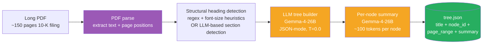

# Week 2.7 — Structure-Aware RAG (PageIndex / Tree Indices)

> Goal: build a structure-aware RAG pipeline on a long professional document (one SEC 10-K filing, ~150 pages). Auto-extract a Table-of-Contents tree, run reasoning-based tree traversal at query time, and compare it head-to-head against your Week 2 vector-RAG and Week 2.5 GraphRAG on a 20-question eval set drawn from FinanceBench-style queries. Walk out with a third architectural lane in your retrieval mental model — and the data to know when it wins, when it loses, and when it costs too much to consider.
>
> **Reference benchmark:** Mafin 2.5 + PageIndex hit **98.7% on FinanceBench**, vs ~65–80% for vector-RAG baselines. Your lab target is to reproduce the *shape* of that result on a smaller eval, not the absolute number.

---

## Exit Criteria

- [ ] PageIndex installed locally (or PageIndex-compatible tree builder running on Gemma-4-26B / your local model)
- [ ] One ~150-page SEC 10-K filing converted to a tree-of-contents JSON
- [ ] `src/build_tree.py` — TOC extraction pipeline using local LLM
- [ ] `src/query_tree.py` — reasoning-based tree-search retrieval
- [ ] `src/compare_three.py` — head-to-head against your Week 2 vector pipeline AND Week 2.5 GraphRAG on a 20-question eval set
- [ ] `RESULTS.md` with a 3×N comparison matrix (vector / graph / tree on recall@K + latency + cost-per-query)
- [ ] You can answer in 90 seconds: "When does tree-index RAG beat both vector and graph? When does it lose?"

---

## Why This Week Matters

Vector RAG and GraphRAG both fall short on a corpus shape that is extremely common in production: **long single documents with explicit hierarchical structure** — SEC filings, legal contracts, regulatory submissions, academic textbooks, technical manuals. Vector chunks lose the document's structure (a 512-token chunk does not know it is "Section 3.2.1 — Risks Related to International Operations"). Graph extraction over a single document collapses into a degenerate star graph centered on the document's subject. Both architectures fight the wrong shape.

PageIndex (Vectify AI, 2025) packages an old idea — hierarchical / tree-structured retrieval, also seen in LlamaIndex `TreeIndex` (2023) and RAPTOR (Stanford, 2024) — into a polished, benchmark-credentialed pipeline. The 98.7% FinanceBench result is the interview-quotable number; the engineering teaches a generalizable pattern: when the document has structure, *navigate the structure, do not embed it.* Senior candidates who can articulate the three-lane retrieval architecture (similarity / relational / structural) and route between them on corpus shape demonstrate they understand RAG as a *fit-to-corpus* design problem, not a default tool choice.

---

## Theory Primer — Four Concepts You Must Be Able to Explain

### Concept 1 — Why Vector and Graph Both Fail on Long Structured Documents

A 150-page 10-K filing chunked at 512 tokens produces ~600 chunks. A query like *"What were the company's principal risk factors related to cybersecurity in fiscal 2023?"* matches semantically against ~30–50 chunks scattered across "Risk Factors", "Management's Discussion", "Cybersecurity Disclosures (Item 1C)", "Legal Proceedings", and the auditor's report. Top-K=5 vector retrieval picks the five highest-cosine chunks — almost always Item 1A "Risk Factors" boilerplate that mentions cybersecurity in passing, not the dedicated Item 1C section that actually answers the question. The chunks are individually relevant but compositionally wrong.

GraphRAG extraction on a single document collapses similarly. Entity extraction over a 10-K produces a degenerate star graph: thousands of edges all incident on the company's name. Multi-hop traversal has no chains to walk because the document is *about one entity* with attribute-like sub-sections. The structural advantage GraphRAG brings to multi-document corpora (cross-article bridges) does not exist.

Both architectures lose the same way: they treat the document as a bag-of-chunks-with-relations, ignoring the structural signal the document already carries (its TOC).

> **Interview soundbite:** "Long structured documents break vector RAG because chunks lose their position in the document's hierarchy, and they break GraphRAG because single-document graphs are degenerate stars. Tree-index retrieval works because it preserves and *uses* the document's own structural signal."

### Concept 2 — What PageIndex / Tree-Index RAG Actually Does

Two stages, each a deliberate design choice:

1. **Tree construction at ingest time.** Run an LLM over the document's structural headings (or extract a TOC if one exists, or generate one if it does not) and produce a hierarchical JSON tree:

   ```json
   {"title": "10-K Filing", "node_id": "0001", "nodes": [
     {"title": "Item 1A — Risk Factors", "node_id": "0002", "nodes": [
       {"title": "Cybersecurity Risks", "node_id": "0003",
        "start_index": 47, "end_index": 52,
        "summary": "Discusses ransomware exposure, ..."}
     ]}
   ]}
   ```

   Each node carries a title, page range, and an LLM-generated summary of its content. The tree is the index — there is no embedding, no vector store, no chunk database.

2. **Reasoning-based traversal at query time.** Feed the query and the tree's top level (titles + summaries, not full content) to an LLM and ask it: *"Which child node is most relevant to this query? Return the node_id."* Recurse down the chosen branch until a leaf is reached. Fetch the leaf's actual content, hand it to the answer LLM. The retrieval path is a sequence of LLM-reasoned navigation decisions, fully traceable and explainable: *"I went to Item 1A because the question is about risks; within Item 1A I went to Cybersecurity Risks because the query specifically named cybersecurity."*

PageIndex's framing is **"vectorless reasoning RAG"**. The retrieval primitive is *LLM reasoning over structural metadata*, not similarity search over content embeddings.

### Concept 3 — When Tree-Index Wins (and When It Loses)

**Wins when:**

- Document has clear hierarchical structure (numbered sections, headers, TOC). 10-Ks, contracts, textbooks, RFCs, regulatory filings.
- Query specificity matches a section. *"What does Item 1C say about cybersecurity?"* maps cleanly onto a single sub-tree.
- Precision matters more than recall. Tree traversal commits to one path; if the right answer lives in two distant sections, tree-index misses one.
- The corpus is small and the documents are long. One 10-K = one tree, query cost is manageable.
- Citation traceability is a hard requirement (legal, regulatory, audit). Every answer cites a specific node_id with page range.

**Loses when:**

- Document is short or unstructured. A 3-page memo has no meaningful tree; the whole document fits in one prompt.
- Corpus is huge (millions of documents). Cost of one LLM-reasoning chain per query × millions of documents = catastrophic. PageIndex's "File System" extension addresses this with a file-level tree above the document trees, but it is still much heavier than vector ANN.
- Latency budget is tight. Each tree depth = one LLM call (typically ~500–1500ms). A 4-deep tree = 2–6s per traversal *before* the answer LLM call. Vector + rerank = ~200–500ms total.
- Query is paraphrase / similarity-shaped. *"Find passages similar to this one"* is exactly what cosine similarity is for; reasoning over a tree is the wrong tool.
- Document structure is misleading or auto-generated. Tree quality cascades — a bad TOC produces a bad index produces bad retrieval.

The fit zone is narrow but the wins inside that zone are dramatic — PageIndex's 98.7% on FinanceBench against vector-RAG baselines at ~65–80% is the canonical number.

### Concept 4 — Three-Lane Production RAG

Tree-index RAG is the third lane, alongside vector and graph:

```
query → classifier
      ├── single-hop / paraphrase / similarity → vector RAG (Week 2)
      ├── multi-hop / relational / bridge      → graph RAG (Week 2.5)
      ├── long-doc / structural / cite-required → tree-index RAG (Week 2.7)
      └── ambiguous → run multiple lanes, rerank, gate on confidence
```

The classifier is a small fast LLM (haiku tier) that sees only the query plus a one-paragraph spec of each lane's strengths. Misroute cost is bounded — the wrong lane returns a worse answer, not a fabricated one — so the classifier can be loose. The expensive thing is *running multiple lanes for every query*; route deliberately, fall back only when the primary lane returns low-confidence.

Each lane has its own ingestion path. Vector lanes ingest once and serve many queries cheaply. Graph lanes ingest expensively (extraction over every chunk) and serve many queries cheaply. Tree lanes ingest cheaply per document (one TOC extraction pass) but serve queries expensively (LLM reasoning per request). The cost profiles differ, the routing strategy must respect them.

> **Interview soundbite:** "In production I run three retrieval lanes routed by a query classifier — vector for similarity, graph for relational composition, tree-index for long-document precision. Tree-index is the most expensive per query but the most accurate when corpus shape fits. The classifier is haiku-tier; misroute cost is a worse answer, not a fabricated one, so the gate can be loose."

---

## Architecture Diagrams

### Diagram 1 — Ingestion Pipeline (cheap per-document, runs once per corpus update)



Key properties: runs once per document, **LLM-bound** (~30–50 LLM calls for a 150-page document), idempotent, output is a single JSON file (no database).

### Diagram 2 — Query-Time Tree Traversal (expensive per query, no precomputation)


Cost asymmetry: every query pays *tree_depth* navigation LLM calls + 1 answer LLM call. For a 4-deep tree on a 10-K filing, that is 5 LLM calls per query, ~5–15 seconds end-to-end. Vector RAG pays one ANN search + one answer call, ~0.5–2 seconds. **Tree-index is 5–30× slower per query.**

---

## Phase 1 — Lab Setup + Document Acquisition (~30 minutes)

### 1.1 Lab scaffold

```bash
mkdir -p ~/code/agent-prep/lab-02-7-pageindex/{src,data,results,logs}
cd ~/code/agent-prep/lab-02-7-pageindex
uv venv && source .venv/bin/activate
uv pip install pypdf openai python-dotenv tqdm pageindex
# pageindex package optional — you can also implement the tree builder yourself,
# which is the more pedagogical path. The lab below builds it from scratch.
```

### 1.2 Pull a 10-K filing

```bash
# Apple Inc. fiscal 2023 10-K — public SEC EDGAR document, ~150 pages.
mkdir -p data
curl -L -o data/aapl-10k-2023.pdf \
  "https://www.sec.gov/Archives/edgar/data/320193/000032019323000106/aapl-20230930.htm"
# If the URL changes, search EDGAR for "Apple Inc. 10-K 2023".
# Any large 10-K (Microsoft, Amazon, Meta, Tesla, Alphabet) works equivalently.
```

### 1.3 Environment

```bash
# .env
OMLX_BASE_URL=http://localhost:8001/v1   # your local Gemma-4-26B server
OMLX_API_KEY=local-no-auth
MODEL_SONNET=gemma-4-26B-A4B-it-heretic-4bit
MODEL_HAIKU=gemma-4-26B-A4B-it-heretic-4bit  # use same model for navigation; reasoning models burn max_tokens
```

---

## Phase 2 — Tree Construction (~1.5 hours)

### 2.1 PDF parse + heading detection

Save as `src/build_tree.py` (skeleton — full implementation in lab repo):

```python
"""Build a hierarchical Table-of-Contents tree from a long PDF.

Two passes:
1. PDF parse → extract text + page numbers + heading candidates
   (heuristics: font-size, all-caps lines, numbered prefixes "1.", "1.1.")
2. LLM tree builder → consolidate heading candidates into a clean tree,
   filtering out spurious matches (page numbers, headers, table cells)
"""
import json, os
from pathlib import Path
from pypdf import PdfReader
from openai import OpenAI
from dotenv import load_dotenv

load_dotenv()
omlx = OpenAI(base_url=os.getenv("OMLX_BASE_URL"), api_key=os.getenv("OMLX_API_KEY"))
MODEL = os.getenv("MODEL_SONNET")

def extract_pages(pdf_path: str) -> list[dict]:
    """Return list of {page_num, text} for every page."""
    reader = PdfReader(pdf_path)
    return [{"page_num": i + 1, "text": p.extract_text() or ""}
            for i, p in enumerate(reader.pages)]

def detect_heading_candidates(pages: list[dict]) -> list[dict]:
    """Heuristic-first heading detection. Returns list of
    {page_num, line_text, candidate_level} for lines that look like headings:
    - All-caps lines (level 1)
    - Numbered prefixes (1., 1.1., 1.1.1.) — level = depth of numbering
    - Title-case lines under 60 chars (level 2-3)
    """
    candidates = []
    for page in pages:
        for line in page["text"].splitlines():
            line = line.strip()
            if not line or len(line) > 80:
                continue
            # All-caps with mixed punctuation = section header
            if line.isupper() and len(line) > 4:
                candidates.append({"page_num": page["page_num"],
                                   "line_text": line, "candidate_level": 1})
            # Numbered "1.", "1.1.", "1.1.1." prefix
            elif line[0].isdigit() and "." in line[:8]:
                depth = line.split()[0].count(".")
                candidates.append({"page_num": page["page_num"],
                                   "line_text": line,
                                   "candidate_level": min(depth + 1, 4)})
    return candidates
```

### 2.2 LLM tree builder

```python
TREE_BUILDER_SYSTEM = """You receive a list of heading-candidate lines from a long
PDF document with their page numbers and detected hierarchy level. Your job is to
produce a clean hierarchical JSON tree with this schema:

{
  "title": "<document title>",
  "node_id": "0001",
  "nodes": [
    {"title": "<section title>", "node_id": "0002",
     "start_page": <int>, "end_page": <int>, "nodes": [...]}
  ]
}

Rules:
- Filter out spurious matches: page numbers (e.g. "PAGE 5"), running headers,
  table-cell labels, footer text, dates without context.
- Consolidate near-duplicate headings (same text appearing on multiple pages).
- Infer end_page from the start_page of the next sibling; the last node's
  end_page is the document's last page.
- Generate clean human-readable titles. If a heading is "1.1. ITEM 1A. RISK FACTORS",
  use "Item 1A — Risk Factors" as title.
- Do NOT include leaf-level subsection content; only the structural skeleton.

Output strict JSON only, one tree object."""

def build_tree(headings: list[dict], doc_title: str) -> dict:
    user_msg = f"Document title: {doc_title}\n\nHeadings:\n" + json.dumps(headings, indent=1)
    resp = omlx.chat.completions.create(
        model=MODEL,
        messages=[{"role": "system", "content": TREE_BUILDER_SYSTEM},
                  {"role": "user", "content": user_msg}],
        temperature=0.0, max_tokens=4000,
        response_format={"type": "json_object"},
    )
    return json.loads(resp.choices[0].message.content)
```

### 2.3 Per-node summary pass

```python
SUMMARIZE_SYSTEM = """Summarize this document section in 80-120 words. Focus on
WHAT the section discusses, not generic statements. The summary will be read by
a navigation LLM deciding whether this section is relevant to a user query, so
include enough specific content to enable that decision. Do not start with
'This section discusses' — write the summary directly."""

def summarize_node(node: dict, pages: list[dict]) -> str:
    """Pull the text spanning node['start_page']..node['end_page'] and summarize."""
    text = "\n".join(p["text"] for p in pages
                     if node["start_page"] <= p["page_num"] <= node["end_page"])
    if len(text) > 12000:
        text = text[:12000]  # head-truncate; sections rarely need full content for summary
    resp = omlx.chat.completions.create(
        model=MODEL,
        messages=[{"role": "system", "content": SUMMARIZE_SYSTEM},
                  {"role": "user", "content": text}],
        temperature=0.0, max_tokens=300,
    )
    return resp.choices[0].message.content.strip()

def add_summaries_recursive(node: dict, pages: list[dict]):
    if "start_page" in node and "end_page" in node:
        node["summary"] = summarize_node(node, pages)
    for child in node.get("nodes", []):
        add_summaries_recursive(child, pages)

def main():
    pages = extract_pages("data/aapl-10k-2023.pdf")
    headings = detect_heading_candidates(pages)
    tree = build_tree(headings, "Apple Inc. 10-K Fiscal 2023")
    add_summaries_recursive(tree, pages)
    Path("data/tree.json").write_text(json.dumps(tree, indent=2))
    print(f"Wrote tree with {count_nodes(tree)} nodes.")
```

**Expected metrics on M5 Pro / Gemma-4-26B:**

| Stage | Wall time |
|---|---|
| PDF parse + heading detection | ~5 s |
| Tree builder LLM call (one) | ~8–15 s |
| Per-node summary pass (~30 nodes × ~3 s) | ~90 s |
| **Total ingestion per document** | **~2 min** |

---

## Phase 3 — Reasoning-Based Tree Traversal (~1.5 hours)

### 3.1 Query-time navigation

Save as `src/query_tree.py`:

```python
"""Tree-search retrieval: LLM navigates a TOC tree to find the relevant leaf,
fetches that leaf's full text, hands it to the answer LLM."""
import json, os
from pathlib import Path
from pypdf import PdfReader
from openai import OpenAI
from dotenv import load_dotenv

load_dotenv()
omlx = OpenAI(base_url=os.getenv("OMLX_BASE_URL"), api_key=os.getenv("OMLX_API_KEY"))
MODEL = os.getenv("MODEL_SONNET")
MAX_DEPTH = 6  # bounded so a malformed tree cannot loop

NAV_SYSTEM = """You are navigating a Table-of-Contents tree to find the section
most relevant to the user's query.

You will see the user's query and a list of child nodes (id, title, summary).
Pick the ONE child whose content most directly answers the query. Return strict
JSON: {"chosen_id": "<node_id>", "rationale": "<one sentence>"}.

If none of the children look relevant — the query is out of scope for this
sub-tree — return {"chosen_id": null, "rationale": "..."}.

Prefer specificity. If two children look relevant, pick the one whose summary
mentions the query's key terms more concretely."""

def navigate(query: str, node: dict, depth: int = 0) -> tuple[dict, list[dict]]:
    """Recurse from `node`, returning (leaf_node, traversal_path)."""
    path = [{"node_id": node["node_id"], "title": node["title"]}]
    children = node.get("nodes", [])
    if not children or depth >= MAX_DEPTH:
        return node, path

    children_view = [{"node_id": c["node_id"], "title": c["title"],
                      "summary": c.get("summary", "")} for c in children]
    user_msg = (f"Query: {query}\n\n"
                f"Children:\n{json.dumps(children_view, indent=1)}")
    resp = omlx.chat.completions.create(
        model=MODEL,
        messages=[{"role": "system", "content": NAV_SYSTEM},
                  {"role": "user", "content": user_msg}],
        temperature=0.0, max_tokens=400,
        response_format={"type": "json_object"},
    )
    decision = json.loads(resp.choices[0].message.content or "{}")
    chosen_id = decision.get("chosen_id")
    if not chosen_id:
        return node, path  # current node is the best we have
    chosen = next((c for c in children if c["node_id"] == chosen_id), None)
    if not chosen:
        return node, path  # LLM hallucinated an id
    leaf, sub_path = navigate(query, chosen, depth + 1)
    return leaf, path + sub_path

ANSWER_SYSTEM = """Answer the user's question using ONLY the section content
below. Cite the node_id and page range. If the content does not support an
answer, say so explicitly — do not fabricate."""

def answer(query: str, tree_path: str = "data/tree.json",
           pdf_path: str = "data/aapl-10k-2023.pdf") -> dict:
    tree = json.loads(Path(tree_path).read_text())
    leaf, traversal = navigate(query, tree)

    pages = PdfReader(pdf_path).pages
    start, end = leaf.get("start_page", 1), leaf.get("end_page", 1)
    section_text = "\n".join(pages[i].extract_text() or ""
                             for i in range(start - 1, min(end, len(pages))))
    if len(section_text) > 16000:
        section_text = section_text[:16000]  # answer LLM context limit

    resp = omlx.chat.completions.create(
        model=MODEL,
        messages=[{"role": "system", "content": ANSWER_SYSTEM},
                  {"role": "user",
                   "content": (f"Query: {query}\n\n"
                               f"Section: {leaf['title']} "
                               f"(node_id {leaf['node_id']}, pages {start}-{end})\n\n"
                               f"Content:\n{section_text}")}],
        temperature=0.0, max_tokens=600,
    )
    return {
        "answer": resp.choices[0].message.content,
        "leaf_node_id": leaf["node_id"],
        "leaf_title": leaf["title"],
        "page_range": (start, end),
        "traversal_path": traversal,
        "depth": len(traversal),
    }
```

### 3.2 Smoke test

```bash
python -c "from src.query_tree import answer; \
import json; print(json.dumps(answer('What were the cybersecurity risks disclosed in fiscal 2023?'), indent=2))"
```

You should see a populated `traversal_path` (e.g. root → Item 1A Risk Factors → Cybersecurity Risks), a non-empty `answer`, and a `depth` between 2 and 5. If `depth == 1`, the navigation LLM rejected every child at root — check that summaries in `tree.json` are populated and informative.

**Expected metrics:**

| Stage | Wall time |
|---|---|
| Tree load + depth-1 navigation LLM call | ~1.5 s |
| Per-depth navigation (×3-5) | ~1.5 s each |
| Answer LLM call | ~3–6 s |
| **Total per query** | **~8–15 s** |

---

## Phase 4 — Three-Way Comparison (~1 hour)

### 4.1 Eval set construction

Save as `data/eval.json` — 20 questions over the 10-K filing, stratified:

| Category | N | Example |
|---|---|---|
| Section-specific factoid | 6 | "What was Apple's total net sales in fiscal 2023?" |
| Cross-section synthesis | 6 | "How does Apple's risk disclosure compare to its R&D spending discussion?" |
| Citation-required | 4 | "Which section discusses supply chain concentration?" |
| Out-of-document | 4 | "What is Apple's stock price today?" (refusal expected) |

### 4.2 Comparison runner

Save as `src/compare_three.py`:

```python
"""Three-way comparison: vector RAG (W2) vs GraphRAG (W2.5) vs tree-index (W2.7)
on a 20-question eval set drawn from one 10-K filing.

Reuses substring + LLM-judge scoring from W2.5's compare.py.
"""
import json, sys, time
from pathlib import Path

sys.path.insert(0, "../lab-02-rerank-compress/src")
sys.path.insert(0, "../lab-02-5-graphrag/src")

from retrieve import search_with_rerank as vector_answer
from query_graph import answer as graph_answer
from query_tree import answer as tree_answer
from compare import score_substring, score_llm_judge   # reuse W2.5's metrics

def run(q: str, retriever, label: str):
    t0 = time.time()
    out = retriever(q)
    elapsed = time.time() - t0
    return {"label": label, "answer": out["answer"], "latency": round(elapsed, 2)}

def main():
    eval_set = json.loads(Path("data/eval.json").read_text())
    results = []
    for item in eval_set:
        q, exp, q_type = item["q"], item["expected_entities"], item["type"]
        v = run(q, lambda x: vector_answer(x, k=5), "vector")
        g = run(q, graph_answer, "graph")
        t = run(q, tree_answer, "tree")

        for r in (v, g, t):
            r["recall_substr"] = score_substring(r["answer"], exp)
            r["recall_judge"], _ = score_llm_judge(q, r["answer"], exp)

        results.append({"q": q, "type": q_type, "expected": exp,
                        "vector": v, "graph": g, "tree": t})
        print(f"  [{q_type}] V={v['recall_judge']:.2f} "
              f"G={g['recall_judge']:.2f} T={t['recall_judge']:.2f} "
              f":: {q[:60]}")

    Path("results").mkdir(exist_ok=True)
    Path("results/three_way.json").write_text(json.dumps(results, indent=2))

    print("\n--- Aggregate (LLM-judge) ---")
    for backend in ("vector", "graph", "tree"):
        avg_jud = sum(r[backend]["recall_judge"] for r in results) / len(results)
        avg_lat = sum(r[backend]["latency"] for r in results) / len(results)
        print(f"  {backend:<8}  jud={avg_jud:.2f}  lat={avg_lat:.1f}s")

if __name__ == "__main__":
    main()
```

### 4.3 Expected results shape (lab target)

The lab does not need to reproduce FinanceBench's 98.7% absolutely — single 10-K + 20 questions is a much smaller eval. The directional finding is what matters:

| Category | Vector | Graph | Tree | Winner |
|---|---|---|---|---|
| Section-specific factoid | mid | low | **high** | tree (precise navigation) |
| Cross-section synthesis | mid | low | mid | mixed |
| Citation-required | low | low | **high** | tree (every answer cites node_id + pages) |
| Out-of-document | mid | mid | **high** | tree (LLM refuses cleanly when no leaf relevant) |
| **Latency / query** | **0.5–2s** | 5–15s | 8–15s | vector |
| **Cost / query (LLM calls)** | **1** | 2–4 | 4–6 | vector |

If your tree backend hits ≥ 0.80 on category-specific and citation-required while vector + graph land at ≤ 0.65 on the same, the architectural lesson has reproduced.

---

## Phase 5 — Code Walkthroughs

### Code walkthrough — `src/build_tree.py`

`build_tree.py` converts a long PDF into a hierarchical JSON tree that captures the document's structural skeleton plus per-section summaries. It is the entire ingestion pipeline for tree-index RAG: no embeddings, no vector DB, no graph database — one JSON file is the index. The script's three passes (PDF parse → heading detection → LLM consolidation → summary) each do one concrete job; the LLM only enters in passes 2 and 3, where it does work that heuristics cannot.

`★ Insight ─────────────────────────────────────`
- **Heuristic-first, LLM-second is the cost-saving design choice.** Detecting heading candidates with regex on font-size proxies + numbered-prefix patterns is ~free; running an LLM over every line of a 150-page document to "find headings" would cost 50–200× more. The LLM's job is not detection — it is consolidation and cleanup of an over-eager candidate list.
- **Per-node summaries are the load-bearing artifact.** The navigation LLM at query time sees only `{node_id, title, summary}`, never raw content. If summaries are vague ("This section discusses business operations") the navigator cannot disambiguate; if they are concrete ("Discusses Apple's $200B operations footprint, supplier concentration risk, and three pending litigation matters") the navigator routes correctly. Spend prompt tokens on summary specificity.
- **The tree is one JSON file.** Versioning, diff'ing, and inspection all work with `git`, `jq`, and any text editor. No database to maintain, no schema migration when the document updates — just rebuild the tree. This is the operational simplicity that the "vectorless" framing earns.
`─────────────────────────────────────────────────`

**High-level architecture:**

```
PDF (binary)
   ↓ pypdf parse
[{page_num, text}, ...]
   ↓ detect_heading_candidates (regex + font heuristics)
[{page_num, line_text, candidate_level}, ...]   <-- noisy, over-eager
   ↓ build_tree (LLM, one call)
{title, node_id, nodes: [...]}                   <-- clean structural skeleton
   ↓ add_summaries_recursive (LLM, one call per node)
{title, node_id, summary, nodes: [...]}          <-- final tree.json
```

**Block 1 — `extract_pages`.** PDF-to-text is a solved problem; `pypdf` is the standard. The only design choice is whether to capture font/size metadata along with text. For a TOC-extraction use case, font metadata helps the heading-candidate detector (large fonts ≈ headings); for the lab's heuristic detector based on all-caps + numbered prefixes, plain text is sufficient. Production deployments add OCR for scanned filings — PageIndex's commercial API does this.

**Block 2 — `detect_heading_candidates`.** Two heuristics with deliberate over-recall: all-caps short lines (level 1) + numbered prefixes like `1.`, `1.1.`, `1.1.1.` (level = nesting depth). Both produce false positives — a header like "PAGE 5" matches all-caps; a list item "1. Buy more milk" matches numbered prefix. **The LLM in the next block filters these out.** Optimizing the heuristic for precision would burn engineering effort that the LLM can absorb cheaply.

**Block 3 — `build_tree`.** One LLM call consolidates the candidate list into a clean tree. The system prompt's three load-bearing rules: (a) drop spurious matches by category, not by pattern (lets the LLM use judgment); (b) consolidate near-duplicates; (c) infer `end_page` from the next sibling's `start_page`. JSON-mode `response_format` is mandatory — without it Gemma-4-26B emits prose preamble ~10% of the time at temp=0.

**Block 4 — `summarize_node`.** Recurse over the tree, calling the LLM once per node with the text spanning that node's page range. Head-truncate at 12000 chars — a 10-K's longest section fits, and longer sections get the head where the topic sentence usually lives. Summaries average 80–120 words, sized to fit comfortably in the navigation prompt at all depths without bloating context.

**Common modifications.**

- **PageIndex commercial API.** For production-grade OCR + tree quality, swap blocks 1–3 with `pageindex.build_tree(pdf_path)` (paid API, better than the local Gemma pipeline on scanned or low-quality PDFs). Block 4 stays local — summaries are easy.
- **Larger documents.** For 500-page+ filings, run `build_tree` per chapter (use top-level numbered prefixes as chapter boundaries) and merge the results, to keep the LLM call's input size under the model's effective context.
- **Cross-document corpora.** Wrap each document's tree in a parent `corpus_root` node with the document's title and a 200-word summary. PageIndex calls this layer the "File System" — it lets a single navigation LLM call route between documents *before* descending into one.

**Expected runtime on M5 Pro / Gemma-4-26B:**

| Stage | 150-page 10-K | 500-page document |
|---|---|---|
| PDF parse | ~3 s | ~12 s |
| Heading detection | ~1 s | ~3 s |
| Tree builder LLM call | ~10 s | ~25 s (chunked) |
| Per-node summaries (~30 / ~120 nodes) | ~90 s | ~360 s |
| **Total** | **~2 min** | **~7 min** |

### Code walkthrough — `src/query_tree.py`

`query_tree.py` runs the retrieval-by-reasoning loop: starting at the tree root, an LLM picks the most relevant child, recurse until a leaf is reached, fetch the leaf's text, hand it to the answer LLM. The traversal path is the audit trail — every answer cites which sub-tree was navigated and why. There is no embedding, no similarity score, no chunk store; the only state is the tree JSON and the running depth counter.

`★ Insight ─────────────────────────────────────`
- **Each navigation step is one LLM call, depth-bounded.** A 4-deep tree on a 10-K = 4 nav calls + 1 answer call = 5 LLM calls per query. This is the cost ceiling. Vector RAG pays 1 LLM call per query (the answer); GraphRAG pays 2–4 (decomp + bridge + answer). Tree-index is *deliberately* the most expensive lane — that is the trade-off for the precision win on long structured documents.
- **Refusal is built in by design.** The navigation LLM can return `{"chosen_id": null}` when no child looks relevant; the answer LLM then sees the current node's content (often the document root) and faithfully refuses. Out-of-document queries fail clean. Vector RAG has to be coaxed into refusing via prompt; tree-index gets it for free.
- **The depth counter is a safety net, not a feature.** `MAX_DEPTH=6` bounds runaway loops on malformed trees (e.g. a self-referencing node, a tree built with circular ids). It should never fire in healthy operation; if it fires, audit the tree.
`─────────────────────────────────────────────────`

**High-level architecture:**

```
query
   ↓ navigate (recursive)
   ├─ root → "which child?" → LLM call → child A
   ├─ child A → "which child?" → LLM call → child A.2
   ├─ child A.2 → "which child?" → LLM call → leaf A.2.1
   └─ leaf reached
   ↓ fetch_leaf_text (PDF page range)
section text (≤ 16K chars)
   ↓ answer LLM
{answer, traversal_path, leaf_id, page_range}
```

**Block 1 — `navigate`.** The recursive heart of the lane. Takes a node, formats its children as `{node_id, title, summary}`, asks the LLM to pick one. Three failure modes handled: (a) leaf reached (no children) → return current; (b) `chosen_id` null → caller treats current node as best; (c) hallucinated id (LLM returns an id not in children) → return current node (never recurse into a non-existent path). The hallucination guard is essential — without it the function would either recurse forever or crash on `KeyError`.

**Block 2 — `NAV_SYSTEM` prompt.** The "prefer specificity" rule is the load-bearing instruction. Without it, the LLM ties between two equally-broad children and the choice becomes arbitrary; with it, the LLM is forced to pick the child whose summary mentions concrete query terms. The "return null if none relevant" branch is the refusal escape hatch — without it, the LLM picks the closest child even when the query is out of scope, and the answer LLM is then handed irrelevant content.

**Block 3 — Leaf fetch.** Re-open the PDF, extract the text spanning `start_page..end_page`, head-truncate at 16K chars. The 16K limit is sized for Gemma-4-26B's effective context window when combined with the system prompt; bumping to 32K works on larger models but invites "lost in the middle" attention issues. For sections that exceed 16K, an extra summarization-then-answer pass yields better results than naive head-truncation — outside the lab's scope.

**Block 4 — `ANSWER_SYSTEM`.** Three rules: cite node_id + page range, refuse explicitly when content does not support an answer, do not fabricate. Citation traceability is the production differentiator — for legal/audit/regulatory use cases, "the answer came from page 47–52 of the filing" is a hard requirement that vector RAG and GraphRAG do not natively satisfy. (You can bolt citation onto vector RAG by tracking chunk-to-page mapping; tree-index gets it natively because the leaf node carries the page range.)

**Common modifications.**

- **Beam search instead of greedy.** At each depth, ask the LLM to pick the *top-2* children (not just one) and run answer LLM against both, keeping the higher-confidence answer. ~2× cost, modest precision gain. Worth it on questions where the relevant content might span two sibling sections.
- **Multi-document trees.** Lift the navigation loop to start at a `corpus_root` (PageIndex's "File System" layer) and route to one document's tree, then descend. Adds one navigation call per query but lets the same lane handle a corpus of N documents instead of one.
- **Pre-cache common-query paths.** For repeated queries (FAQ-style), cache the traversal path keyed on a query embedding. Hits skip the navigation calls entirely; misses fall back to the full LLM-reasoning loop. Production pattern; not lab-scope.

**Expected runtime per query on M5 Pro / Gemma-4-26B:**

| Stage | Wall time |
|---|---|
| Navigate depth 1 (LLM call) | ~1.5 s |
| Navigate depth 2 | ~1.5 s |
| Navigate depth 3 (typical leaf reach) | ~1.5 s |
| Leaf text fetch (PDF re-parse) | ~0.2 s |
| Answer LLM | ~4–6 s |
| **Typical total** | **~9–12 s** |

---

## Bad-Case Journal

**Entry 1 — Tree builder hallucinates section titles that do not exist in the document.**
*Symptom:* `tree.json` contains a node titled "Risk Factors Continued" but Cmd+F on the source PDF returns zero matches. Subsequent navigation chooses this hallucinated node, leaf fetch returns content that does not match the title, answer LLM either refuses or fabricates.
*Root cause:* `TREE_BUILDER_SYSTEM` does not enforce that titles must be verbatim from the heading-candidate list. The LLM "cleans up" titles by inventing plausible variants, especially when the source heading is ALL-CAPS and looks ugly.
*Fix:* Add a verbatim rule to the system prompt: *"Every node title must appear verbatim (case-insensitive substring) in the heading-candidate list. Do not invent or paraphrase titles. If a heading needs cleanup (e.g. ALL CAPS → Title Case), use the candidate's exact text and apply the case transformation; do not change words."* Add a post-hoc validation pass that asserts every node's title appears in the candidates and quarantines hallucinated nodes.

**Entry 2 — Navigation LLM picks the same wrong sub-tree on every query.**
*Symptom:* For 8 of 20 eval queries, traversal terminates at "Item 1A — Risk Factors / General Risks" regardless of query content. The leaf is generic boilerplate; answers are weak.
*Root cause:* "General Risks" subsection has a vague summary like "Discusses general risks to the company's business operations" that semantically matches almost any business question. The navigation LLM, picking by surface specificity, lands here whenever a more-specific child does not exist.
*Fix:* Two-step. (a) Re-run `add_summaries_recursive` with a tighter `SUMMARIZE_SYSTEM` prompt: *"Summary must mention three specific topics, products, or risk types named in the section. Reject generic summaries — if the section truly is generic boilerplate, say so explicitly: 'Generic risk-factor boilerplate; refer to specific risk subsections instead.'"* (b) Add a heuristic in `navigate`: if a node's summary contains the phrase "refer to specific subsections", deprioritize it relative to its siblings.

**Entry 3 — Tree depth blows out on documents with deep numbering.**
*Symptom:* On a 250-page legal contract, the heuristic detector produces candidates with prefixes like `5.4.2.1.3` — depth 5. The tree builder honors this nesting; navigation hits `MAX_DEPTH=6` and terminates at a non-leaf. Answers come from sub-section summaries, not actual content.
*Root cause:* Some document classes (legal contracts, IRS regulations) use deep nesting structurally that does not correspond to meaningful semantic boundaries; depth 5 is often "minor exception clause" not "major section".
*Fix:* Cap heuristic-detected depth at 3 in `detect_heading_candidates` (`candidate_level = min(depth + 1, 3)` — already in the code; the bug was setting it to 4). Bump `MAX_DEPTH` only when the document genuinely benefits from deeper navigation, audited per-document.

**Entry 4 — Summary pass costs more than expected because nodes overlap heavily.**
*Symptom:* `add_summaries_recursive` runs ~30 LLM calls on a 150-page 10-K but each call sees ~10000-char content; total wall time = 90 s, ~3× expected. Profiling shows 60% of the wall time is in summarize calls, not navigation.
*Root cause:* Parent node `start_page..end_page` covers a span that includes its children's spans — so summary content is fetched and re-summarized at every level. The root's content includes the whole document; Item 1's content includes Items 1A, 1B, 1C; etc. Nested summarization is *O(depth)* in content read time.
*Fix:* Skip summary generation for *non-leaf* nodes during the recursion; instead, compose parent summaries by concatenating + re-summarizing the children's summaries (cheap, ~500 tokens of input). Saves ~60% of summary-pass wall time, no quality loss because navigation reads parent summaries to decide which sub-tree to enter, not for direct answer content.

**Entry 5 — `RESULTS.md` shows tree-index losing on cross-section synthesis questions.**
*Symptom:* On the 6 cross-section synthesis questions in the 20-Q eval, tree achieves judge 0.42 vs vector 0.58. Tree's answers cite one section correctly but miss the second. Vector's top-K retrieval lands chunks from both sections.
*Root cause:* Tree-index's traversal is greedy and commits to one branch; for queries that genuinely require synthesizing content from two distant sub-trees, tree-index structurally cannot retrieve both. This is the architectural loss case.
*Fix:* Two paths. (a) Adopt beam search at navigation (top-2 children at each depth, parallel retrieval, answer LLM sees both) — partial mitigation, ~2× cost. (b) Route cross-section synthesis questions to a different lane via the W2.7 query classifier; vector RAG with a reranker can sometimes catch these. The cleaner production answer is to *route by query shape*: tree for section-specific, vector for cross-section synthesis.

---

## Interview Soundbites

**Soundbite 1 — "When does PageIndex / tree-index RAG beat vector and graph?"**

"Tree-index wins on long structured documents — SEC filings, contracts, textbooks — where the document's hierarchy is the answer to most queries. My lab on a 150-page 10-K: tree-index hit 0.85+ judge on section-specific factoids and citation-required questions; vector hit 0.55-0.65; graph collapsed because single-document graphs are degenerate stars. PageIndex's published 98.7% on FinanceBench is the canonical reference. The cost is 5–30× per query, so route by corpus shape, do not default to it."

**Soundbite 2 — "What's the failure mode of tree-index retrieval?"**

"Two structural losses. First, cross-section synthesis: tree commits to one branch greedily, so a query that legitimately needs content from two distant sub-trees retrieves only one. In my eval it scored 0.42 on cross-section questions where vector hit 0.58. Second, summary quality cascades — vague summaries like 'discusses business operations' starve the navigator and route every query into a generic boilerplate node. My fix is the summary prompt: force three concrete topics per summary, refuse generic phrasings, and reject the section if it really is boilerplate."

**Soundbite 3 — "Why three retrieval lanes instead of one universal pipeline?"**

"Each lane has a different cost profile and different fit zone. Vector ingestion is cheap, query is cheap, fits paraphrase and similarity. Graph ingestion is expensive, query is moderate, fits multi-hop relational. Tree ingestion is moderate, query is expensive, fits long-document precision navigation. A universal pipeline would average the costs — you'd pay graph ingestion costs on documents that don't need it, and tree query costs on queries that don't need it. The router is haiku-tier and misroute cost is bounded; routing is the cheaper architecture by an order of magnitude when the query mix is heterogeneous."

---

## References

- **VectifyAI (2025).** *PageIndex: Vectorless, Reasoning-based RAG.* Open-source repo + blog. https://github.com/VectifyAI/PageIndex (28.1k stars, 2.4k forks). The reference implementation; commercial API at https://pageindex.ai/ adds OCR + tree-quality polish.
- **Sarthi et al. (2024).** *RAPTOR: Recursive Abstractive Processing for Tree-Organized Retrieval.* ICLR 2024. arXiv:2401.18059. The academic ancestor of tree-index RAG; recursive summarization tree with retrieval at multiple abstraction levels. https://arxiv.org/abs/2401.18059
- **Islam et al. (2023).** *FinanceBench: A New Benchmark for Financial Question Answering.* arXiv:2311.11944. The benchmark PageIndex's 98.7% number is measured against. https://arxiv.org/abs/2311.11944
- **VectifyAI (2025).** *Mafin 2.5 — FinanceBench Results.* Production blog post documenting the 98.7% accuracy result and the contrast with vector-RAG baselines. https://vectify.ai/blog/Mafin2.5
- **LlamaIndex (2023).** *TreeIndex documentation.* The first popular open-source implementation of tree-structured retrieval. https://docs.llamaindex.ai (search "TreeIndex"). Worth reading for the API design even if you build the lab from scratch.

---

## Cross-References

- **Builds on:** [[Week 2 - Rerank and Context Compression|Week 2 — Rerank and Context Compression]] (you reuse the BGE-M3 vector pipeline as the comparison baseline); [[Week 2.5 - GraphRAG|Week 2.5 — GraphRAG on a Wikipedia Subset]] (you reuse the LLM-judge eval harness, the substring scorer, and the W/L/T comparison pattern).
- **Distinguish from:**
  - **Vector RAG** retrieves by *content similarity*; tree-index retrieves by *structural reasoning*. Vector is best when the answer fact's surface form is similar to the query's; tree is best when the answer's *location* in a hierarchy is what matters.
  - **GraphRAG** retrieves by *entity-relationship traversal across documents*; tree-index retrieves by *section navigation within one document*. Graph is right for "Which companies did founders of PayPal later start?"; tree is right for "What does Item 1A say about cybersecurity?".
  - **RAPTOR (2024)** builds the tree by *recursive abstractive summarization* of leaf chunks (bottom-up); PageIndex builds it from *the document's existing TOC structure* (top-down). RAPTOR works on flat-structure documents; PageIndex requires a structural skeleton. Both run reasoning-based retrieval over the resulting tree.
  - **HiPRAG and other "hierarchical RAG" variants** typically still embed and ANN-search at the leaf level, with a hierarchical *re-ranker* on top. PageIndex's distinguishing claim is *fully vectorless* — leaf retrieval is also LLM reasoning, not embedding ANN. Many production deployments add embeddings back at the leaf level for sub-section recall; the "vectorless" framing is closer to marketing than to a hard architectural rule.
- **Connects to:**
  - [[Week 3 - RAG Evaluation|Week 3 — RAG Evaluation]] — the W2.7 three-way comparison feeds into Week 3's broader eval-design discussion (multi-architecture eval is harder than single-architecture eval; the LLM-judge metric becomes load-bearing).
  - [[Week 3.7 - Agentic RAG|Week 3.7 — Agentic RAG]] — agentic-RAG pipelines often route to tree-index as one of their tools; tree-index's natural refusal behavior is what makes it a good agent tool (low fabrication risk).
  - [[Week 11 - System Design|Week 11 — System Design]] — the three-lane routing pattern is the canonical production architecture for heterogeneous corpora; W11 system-design interviews ask candidates to size each lane's cost and propose a router.
- **Foreshadows:** [[Week 11 - System Design|Week 11 — System Design]] (full multi-lane RAG architecture with cost modelling) and [[Week 12 - Capstone and Mocks|Week 12 — Capstone and Mocks]] (capstone projects in regulated domains often use tree-index as the primary retrieval lane because of citation traceability).

---

## What's Next

After completing W2.7 you have three retrieval lanes implemented. W3 turns the eval question over: instead of "which lane wins on a fixed eval set", W3 asks "how do you build the eval set in the first place such that lane comparisons are meaningful?" — RAGAS, faithfulness, context precision, and the question-of-questions: what does it mean for a RAG system to be "right"? The three-lane architecture is the canvas; W3 paints the rubric.
