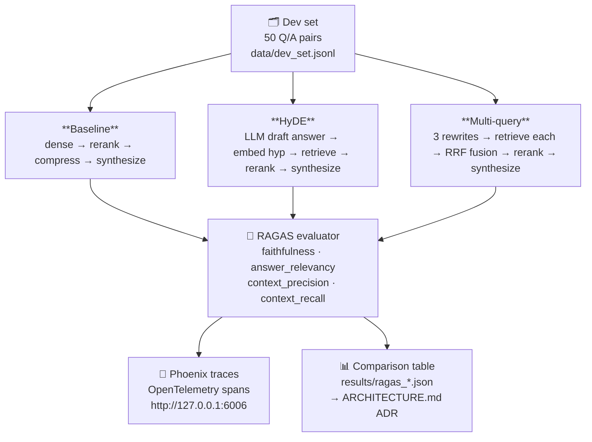
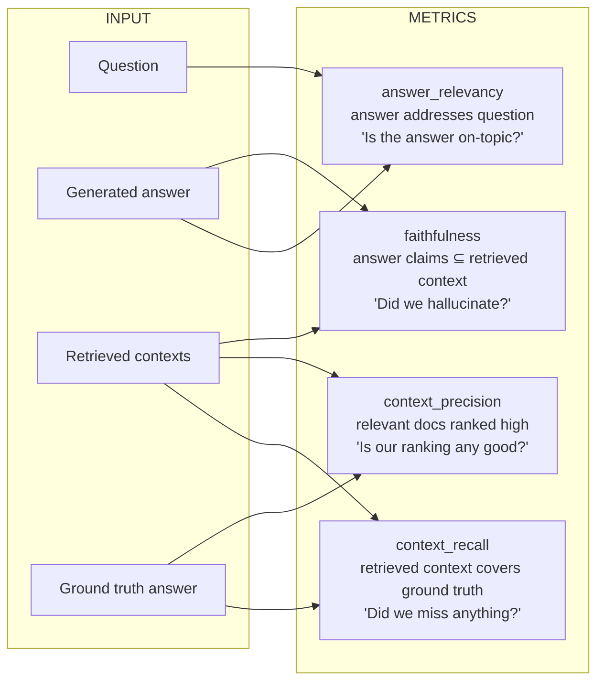

# Week 3 — RAG Evaluation

> Goal: turn Week 1–2 into a **measurable, A/B-testable** RAG pipeline with a written ADR. Cold-answer 25 RAG interview questions.

**Exit criteria.**
- [ ] Hand-authored 50-question dev set (drawn from your corpus)
- [ ] RAGAS eval harness with faithfulness + context-precision + context-recall + answer-relevancy
- [ ] HyDE A/B measured
- [ ] Multi-query fusion A/B measured
- [ ] Full Phoenix tracing wired (every retrieval → rerank → compress → generate has a span)
- [ ] `ARCHITECTURE.md` (ADR) explaining final pipeline choices
- [ ] `RESULTS.md` with A/B tables + screenshots of Phoenix traces

---

## Theory Primer

Four concepts you need cold before touching a line of eval code. Each section closes with a soundbite you can drop in an interview without hedging.

---

### 1. Faithfulness vs Factuality — Why RAG Eval Measures the Wrong Thing on Purpose

When you first see that faithfulness is the primary RAG safety metric, it looks like a cop-out. Faithfulness only asks: *is every claim in the answer supported by the retrieved context?* It says nothing about whether those claims are true. A RAG system that retrieves a confidently wrong Wikipedia paragraph, then faithfully summarises it, scores 1.0 on faithfulness while telling the user something false.

That's not a bug in the metric — it's a deliberate scope decision. Understanding why requires the intrinsic vs extrinsic hallucination taxonomy (Maynez et al. 2020, extended by the Self-RAG paper, Asai et al. 2023):

- **Intrinsic hallucination**: the model contradicts its own retrieved context. The evidence was right there and the model ignored or inverted it. This is what faithfulness catches.
- **Extrinsic hallucination**: the model adds claims *not present* in the retrieved context — whether those claims happen to be true or false in the real world. This is also caught by faithfulness (a claim unsupported by context fails the coverage check regardless of its world-truth status).

Factual correctness — "does the answer match ground truth?" — is a harder target because you need a ground-truth corpus that covers every possible query. In a production RAG system over a private document store, no such oracle exists. Faithfulness is tractable; factual accuracy at scale is not.

The practical implication: **faithfulness is necessary but not sufficient.** You can have faithfulness = 1.0 and still have a broken system if your retriever is pulling stale, biased, or simply wrong documents. That's why you read faithfulness alongside context_recall — if recall is low, the model is being honest about bad evidence. Fix the retriever, not the model.

> **Interview soundbite:** "RAG eval prioritises faithfulness over factuality because faithfulness is measurable without a ground-truth oracle — it only asks whether claims trace back to the retrieved context. Factual correctness requires knowing what's actually true, which you can't assume for private corpora. High faithfulness with low context_recall tells you your retriever is the problem, not the generator."

---

### 2. The Four RAGAS Metrics as a Diagnostic Matrix

RAGAS (Es et al. 2023) operationalises RAG quality into four LLM-judged metrics. Each measures a distinct failure mode. Reading them in isolation is almost useless; the signal is in how they move together.

**faithfulness** — *Did we hallucinate?*
Decomposes the generated answer into atomic claims, then asks an LLM: is each claim supported by the retrieved contexts? Score = fraction of claims that are entailed. Inputs: `answer` + `contexts`. No ground truth needed.

**answer_relevancy** — *Is the answer on-topic?*
Generates several reverse questions from the answer (what question would this answer?) and computes cosine similarity between those synthetic questions and the original query. A high score means the answer addresses what was asked. Inputs: `answer` + `question`. Catches verbose, evasive, or off-topic answers.

**context_precision** — *Is our ranking any good?*
For each retrieved chunk, an LLM judges whether it contributed to the ground-truth answer. Score = weighted precision, with higher-ranked chunks weighted more heavily. Inputs: `contexts` + `ground_truth`. Penalises putting irrelevant chunks at the top of the context window — which matters because of position effects (Liu et al. 2023, "Lost in the Middle" showed LLMs preferentially attend to the beginning and end of long contexts, so a high-precision ranking keeps signal where the model actually looks).

**context_recall** — *Did we miss anything?*
Decomposes the ground-truth answer into atomic claims, then checks whether each is attributable to at least one retrieved chunk. Score = fraction of ground-truth claims covered. Inputs: `contexts` + `ground_truth`. Low recall means your retriever missed relevant documents.

**The diagnostic matrix — read these four as a system:**

| Pattern | Diagnosis |
|---|---|
| High faithfulness + low context_recall | Honest model, broken retriever — it reports only what it found, but it didn't find enough |
| High context_recall + low faithfulness | Right documents retrieved, model is drifting — generator is adding claims beyond the evidence |
| Low context_precision + high context_recall | Retriever casts a wide net but ranks poorly — compression or rerank is earning its keep |
| Low answer_relevancy + high faithfulness | Answer is well-sourced but doesn't address the question — prompt or synthesis layer problem |
| All four high | The pipeline is working; look for latency or cost issues next |

> **Interview soundbite:** "RAGAS gives you four numbers: faithfulness checks the generator, context_recall checks retrieval coverage, context_precision checks retrieval ranking, and answer_relevancy checks whether the answer addresses the question. The interesting signal is in the combinations — high faithfulness with low context_recall tells you the model is honest but the retriever is broken."

---

### 3. HyDE — When Vocabulary Mismatch Kills Dense Retrieval

Dense retrieval works by embedding a query and finding documents whose embeddings are nearby. The implicit assumption is that queries and documents live in compatible regions of the embedding space. For well-specified, keyword-rich queries this holds. For under-specified queries it breaks badly.

The root problem is vocabulary mismatch. Consider: *"how does backpressure work?"* The query is sparse — a handful of nouns and a verb. Your indexed documents, however, are dense answer-like text: *"Backpressure is a flow-control mechanism where a consumer signals a producer to slow down when its buffer is full..."* The query embedding lands in question-space; the document embeddings live in answer-space. The cosine distances are structurally poor even when the content is perfectly relevant.

HyDE (Hypothetical Document Embeddings, Gao et al. 2022) solves this by asking an LLM to draft a plausible answer *before* retrieval. That draft — not the query — is what gets embedded. The hypothesis lives in answer-space alongside your indexed documents, so nearest-neighbour search suddenly has something to work with. The retrieved candidates are then re-ranked against the *original* query, correcting any semantic drift the hypothetical introduced.

**Why it helps:** under-specified queries, domain-specific terminology, and queries where the right documents use different vocabulary than the question (common in technical corpora).

**Why it hurts:** for well-specified queries with precise keywords, the hypothesis can introduce vocabulary that redirects retrieval toward plausible-but-wrong documents. You're now doing retrieval on a generated text with its own biases, not on the user's actual intent.

**Cost model:** one extra LLM call per query to generate the draft. Budget approximately 50–100 extra tokens of generation and ~100 ms of latency on a local model. For high-value queries this is negligible; for high-throughput pipelines at 1,000+ QPS it is not. Always A/B test on your actual query distribution — the Anthropic faithfulness cookbook explicitly warns against adopting retrieval improvements without measuring on representative data.

> **Interview soundbite:** "HyDE embeds a hypothetical answer instead of the query, bridging the vocabulary gap between sparse questions and dense documents. It helps on under-specified or jargon-light queries and hurts on precise ones because the LLM draft can introduce its own biases. The cost is one extra LLM call per query — worth measuring, not worth assuming."

---

### 4. Reciprocal Rank Fusion — Combining Multiple Retrieval Passes Without Score Calibration

Multi-query retrieval generates several phrasings of the same user intent, runs each through the retriever independently, and merges the result lists. The merging step is where most implementations go wrong: they try to combine raw similarity scores across queries, which are not calibrated to the same scale. A score of 0.82 from query A and 0.81 from query B might not be comparable at all.

Reciprocal Rank Fusion (Cormack, Clarke & Buettcher, SIGIR 2009) sidesteps the calibration problem entirely by working with ranks, not scores. Each document's fused score is the sum of reciprocal ranks across all query lists it appears in:

```
score(d) = Σ  1 / (k + rank_i(d))
           i
```

where `rank_i(d)` is the document's rank in the i-th retrieval list (1-indexed) and `k` is a smoothing constant.

**Why k=60?** The original Cormack et al. paper evaluated multiple values empirically across standard TREC benchmarks and found k=60 was robustly near-optimal across diverse query types. The mathematical intuition: with k=60, rank 1 gets `1/61 ≈ 0.0164` and rank 10 gets `1/70 ≈ 0.0143` — a modest spread that avoids over-weighting the top rank without flattening the distinction between ranks entirely. Smaller k (e.g., k=10) makes rank-1 dominance extreme; larger k (e.g., k=1000) treats all ranks as nearly equal. The 60 default has held up across a decade of subsequent retrieval benchmarks, which is why it appears verbatim in LangChain's `EnsembleRetriever` and most multi-query implementations.

**When multi-query fusion beats single-query retrieval:** when the same user intent can be expressed with meaningfully different vocabulary and the corpus is large enough that different phrasings surface different relevant documents. For well-typed technical queries with agreed terminology, the gain is usually small.

**Cost model:** generating 3 rewrites requires 1 extra LLM call. Embedding and retrieving 4 total query variants (original + 3 rewrites) costs approximately 4× the embedding calls of a single-query baseline. The cross-encoder rerank receives up to 4× more candidates before deduplication. Report this in your A/B table — the architectural decision should be explicit about whether the recall gain justifies the cost.

> **Interview soundbite:** "RRF fuses ranked lists with the formula 1 divided by k plus rank, summed across all lists. The k=60 default comes from Cormack et al. SIGIR 2009 — it dampens rank-1 dominance without equalising all positions. RRF works on ranks not scores, so you avoid the calibration problem of mixing similarity scores from different embedding passes."

---

### 5. Agentic RAG — the production successor (pointer to expansion week)

The four concepts above describe single-pass RAG: query → retrieve → rerank → compress → synthesize. The 2024–2025 production successor adds two LLM-decision nodes (decide-to-retrieve, grade-relevance) and a recovery loop (rewrite + retry). [LangChain's official docs](https://docs.langchain.com/oss/python/langgraph/agentic-rag) call this the **canonical 5-node Agentic RAG architecture**; the [Singh 2025 survey](https://github.com/asinghcsu/AgenticRAG-Survey) (1.6k⭐) taxonomizes it across **7 architecture families**, of which **CRAG** ([arXiv 2401.15884](https://arxiv.org/abs/2401.15884)) and **Adaptive-RAG** ([arXiv 2403.14403](https://arxiv.org/abs/2403.14403)) are the two most-cited specializations.

You don't need to internalize this in Week 3 — single-pass is the right baseline first. But know the term exists, know the canonical 5-node graph (decide → retrieve → grade → rewrite → answer), and know that any 2026 RAG-leaning interview will probe whether you've gone past Week 3's single-pass into the agentic regime.

**Hands-on lab:** [[Week 3.7 - Agentic RAG]] — a ~6–8 hour expansion week that builds the canonical 5-node graph on top of your Week 1–3 corpus + Qdrant + RAGAS harness, runs a head-to-head comparison vs single-pass on the same dev set, and implements a CRAG variant. Optional but strongly recommended before Week 11 system-design rounds where "tell me about RAG in production" is a near-guaranteed question.

> **Interview soundbite:** "Single-pass RAG is the right baseline; Agentic RAG is the production successor — five nodes, two LLM-decision points, one rewrite loop. CRAG and Adaptive-RAG are the two specializations worth naming. I default to single-pass for tight latency budgets and well-specified queries, graduate to agentic when the query distribution is mixed."

---

### Optional Deep Dives

These are breadcrumb trails for when a concept clicks and you want the full picture. None are required for the exit criteria.

**Faithfulness grounding in Self-RAG.** Asai et al. 2023 (Self-RAG) trains a model to emit special reflection tokens — `[Retrieve]`, `[IsRel]`, `[IsSup]`, `[IsUse]` — inline with generation. `[IsSup]` is essentially a per-sentence faithfulness check baked into the model weights rather than applied post-hoc. It's the logical conclusion of the faithfulness framing: instead of evaluating after the fact, the model self-supervises during generation. Worth reading if you move toward fine-tuning rather than prompt-based RAG.

**"Lost in the Middle" and context_precision.** Liu et al. 2023 showed empirically that LLM performance degrades on information placed in the middle of long contexts — models attend reliably to the beginning and end but lose signal on the interior. This is the theoretical backing for why context_precision matters beyond just a ranking quality metric: poor ranking puts the most relevant chunk at position 3 of 5, which is exactly where attention drops off. If you see high context_recall but mediocre generation quality, check whether your top-1 chunk is actually the most relevant one.

**RAGAS at scale and LLM-judge variance.** The RAGAS metrics are LLM-judged, which means they inherit the variance of the judge model. On a 50-question dev set, the 95% confidence interval on any individual metric is wide enough that differences of < 0.03 should be treated as noise rather than signal. The practical fix is to run at least 100 questions before making a pipeline adoption decision, or to use a stronger judge model for the eval pass than for generation.

**HyDE failure mode: confident hallucination in the hypothesis.** If the LLM draft confidently describes something that is factually wrong (plausible-but-false in your domain), the embedding of that false hypothesis retrieves documents that support the wrong claim. This is most dangerous in medical, legal, or regulatory corpora where plausible-sounding wrong answers exist in the index. Mitigating options: lower draft temperature, use a larger model for drafting, or restrict HyDE to query clusters that empirically show vocabulary mismatch (identified by low baseline context_recall on a tagged subset).

---
- **[Gulli *Agentic Design Patterns* Ch 19 — Evaluation and Monitoring]** — pattern-catalog view of eval. Useful vocabulary (evaluator roles, feedback loops) that complements RAGAS depth. ~20 min

## Architecture

How the three pipelines connect to the evaluation loop.



### RAGAS metric map

What each of the four RAGAS numbers is actually measuring:



> **Reading the four together:** A high faithfulness + low context_recall means the model is honest but the retriever is missing relevant chunks. A high context_recall + low faithfulness means you retrieved the right stuff but the LLM is drifting. Both problems need different fixes.

### HyDE vs Baseline — why it helps under-specified queries

```
Under-specified query: "how does backpressure work?"
                                │
          ┌─────────────────────┴──────────────────────┐
          │ BASELINE                                    │ HyDE
          │                                             │
          ▼                                             ▼
   embed("how does backpressure work?")        LLM draft answer:
          │                                    "Backpressure is a flow-control
          │ sparse embedding in               mechanism where a consumer signals
          │ question-space —                  a producer to slow down when its
          │ few keywords to latch onto        buffer is full. In Kafka this is..."
          │                                             │
          ▼                                             ▼
   retrieves generic results              embed(draft) → dense embedding in
                                          answer-space — rich vocabulary
                                                        │
                                                        ▼
                                           retrieves semantically similar docs
                                           (even without the exact keyword)
                                                        │
                                                        ▼
                                           rerank against ORIGINAL query q
                                           (so the final answer stays faithful)
```

> **Cost:** one extra LLM call per query (the draft). Budget ~100 ms and ~50 tokens. Worth it for recall; negligible for well-specified queries — which is why you A/B test first.

---

## Phase 1 — Dev Set (~3 hours)

You need a labeled Q/A set to eval against. 50 questions is enough to see signal; more is better but costs author time.

### 1.1 Lab scaffold

```bash
cd ~/code/agent-prep/lab-03-rag-eval
source ../.venv/bin/activate
set -a; source ../.env; set +a
mkdir -p data src results
cp ../lab-02-rerank-compress/data/*.{json,jsonl} data/
```

### 1.2 Semi-automated Q generation (then you curate)

Use your sonnet-tier Gemma to draft 100 candidate Qs from sampled docs. You'll keep ~50 after filtering.

Save as `src/01_gen_dev_set.py`:

```python
"""Draft Q/A pairs from 100 random docs; human curation follows in Phase 1.3."""
import json, os, random, re
from pathlib import Path
from openai import OpenAI

random.seed(7)
omlx = OpenAI(base_url=os.getenv("OMLX_BASE_URL"), api_key=os.getenv("OMLX_API_KEY"))
SONNET = os.getenv("MODEL_SONNET")

docs = [json.loads(l) for l in open("data/docs.jsonl")]
sample = random.sample(docs, 100)

PROMPT = """Read the passage and write one concrete, factual question that the passage answers. Output JSON exactly:
{{"question": "<one sentence>", "short_answer": "<≤20 words from the passage>"}}

Passage: {text}"""

out = []
for i, d in enumerate(sample):
    try:
        r = omlx.chat.completions.create(
            model=SONNET,
            messages=[{"role": "user", "content": PROMPT.format(text=d["text"])}],
            temperature=0.0, max_tokens=200,
            response_format={"type": "json_object"},
        )
        pair = json.loads(r.choices[0].message.content)
        out.append({"source_doc_id": d["id"], **pair})
    except Exception as e:
        print(f"  {i}: skip ({e})")
    if i and i % 20 == 0:
        print(f"  {i}/100")

Path("data/dev_candidates.jsonl").write_text("\n".join(json.dumps(o) for o in out))
print(f"wrote {len(out)} candidates")
```

### Code walkthrough — `src/01_gen_dev_set.py`

**① Seeded sampling** (`random.seed(7)` / `random.sample(docs, 100)`)
Pull exactly 100 docs reproducibly. The fixed seed means a teammate can re-run and get the same 100 candidates before curation. Swap the seed if you want a fresh draw.

**② Local inference via OpenAI-compatible client** (`OpenAI(base_url=..., api_key=...)`)
oMLX exposes an OpenAI-compatible REST endpoint, so the standard `openai` SDK works unchanged. No cloud spend.

**③ The Q-generation prompt** (PROMPT with `{{...}}` double braces)
Double braces escape the f-string so `{text}` remains a literal placeholder. The instruction "Output JSON exactly" combined with `response_format={"type": "json_object"}` below forces structured output.

> **Why `response_format={"type": "json_object"}`?** Without it, the local model sometimes wraps the JSON in prose ("Sure! Here is the JSON: ..."). The `json_object` mode strips that wrapper and guarantees `json.loads()` won't throw. Use it any time you need machine-readable output.

**④ Per-item try/except** (`except Exception as e`)
Generation can fail on very short or non-English passages. Skip-and-log keeps the loop running rather than crashing 60 questions in.

**⑤ Progress heartbeat** (`if i and i % 20 == 0`)
100 calls × ~1 s each = ~100 s. The heartbeat every 20 lets you confirm the loop is alive without flooding stdout.

**Common modifications:** Change `random.sample(docs, 100)` to `docs[:100]` (first 100) if your corpus is already ordered by quality and you want the best docs sampled first.

```bash
python src/01_gen_dev_set.py
```

### 1.3 Human curation (the most important step)

Open `data/dev_candidates.jsonl` in your editor. Keep **50** that meet all three:
- Clearly answerable from the source passage alone
- Not trivially keyword-matched ("What is X?" where X is literally in the passage title is too easy)
- Diverse — mix of factoid, multi-hop-ish, and slightly ambiguous

Save the keepers to `data/dev_set.jsonl` (one JSON per line, fields: `qid`, `question`, `short_answer`, `source_doc_id`).

Script to renumber + drop rejects (edit the REJECT set first):

```bash
python -c "
import json
REJECT = set()  # fill with indices of questions to drop
kept = []
for i, line in enumerate(open('data/dev_candidates.jsonl')):
    if i in REJECT: continue
    o = json.loads(line)
    o['qid'] = f'dev_{len(kept):03d}'
    kept.append(o)
    if len(kept) == 50: break
with open('data/dev_set.jsonl','w') as f:
    for o in kept: f.write(json.dumps(o)+'\n')
print(f'wrote {len(kept)} questions')
"
```

---

## Phase 2 — RAGAS Harness (~4 hours)

### 2.1 The four metrics, explained

- **faithfulness** — is every claim in the answer supported by the retrieved context? (Primary RAG safety metric.)
- **answer_relevancy** — does the answer address the question?
- **context_precision** — are the retrieved contexts ranked well (relevant ones at the top)?
- **context_recall** — does the retrieved context contain enough to answer the question?

RAGAS ships LLM-based implementations of all four. Route them through your local oMLX endpoint to keep cost at zero.

### 2.2 Baseline pipeline: dense → rerank → compress → answer

Save as `src/02_pipeline.py`:

```python
"""The pipeline under test. Returns (answer, retrieved_contexts, rerank_ids, compressed_ctx)."""
import os
from openai import OpenAI
from sentence_transformers import SentenceTransformer, CrossEncoder
from qdrant_client import QdrantClient

HOME = os.path.expanduser("~")
omlx = OpenAI(base_url=os.getenv("OMLX_BASE_URL"), api_key=os.getenv("OMLX_API_KEY"))
SONNET = os.getenv("MODEL_SONNET")

qd = QdrantClient(url="http://127.0.0.1:6333")
_enc = SentenceTransformer(f"{HOME}/models/bge-m3",               device="mps", trust_remote_code=True)
_rr  = CrossEncoder(       f"{HOME}/models/bge-reranker-v2-m3",   device="mps")

ANSWER = """Using ONLY the context below, answer the question briefly (≤50 words). If unanswerable, say "insufficient context."

Context:
{ctx}

Question: {q}
Answer:"""

def retrieve(q, n=30):
    qv = _enc.encode([q], normalize_embeddings=True)[0]
    return qd.query_points("bge_m3_hnsw", query=qv.tolist(), limit=n, with_payload=True).points

def rerank(q, hits, k=5):
    scores = _rr.predict([(q, h.payload["text"]) for h in hits], batch_size=32)
    ordered = sorted(zip(hits, scores), key=lambda x: -x[1])[:k]
    return [h for h, _ in ordered]

def answer_from(q, hits):
    ctx = "\n\n".join(h.payload["text"] for h in hits)
    r = omlx.chat.completions.create(model=SONNET, temperature=0.0, max_tokens=200,
        messages=[{"role": "user", "content": ANSWER.format(ctx=ctx, q=q)}])
    return r.choices[0].message.content.strip(), ctx

def run_pipeline(q):
    cands = retrieve(q, n=30)
    top = rerank(q, cands, k=5)
    ans, ctx = answer_from(q, top)
    return {
        "question": q,
        "answer": ans,
        "contexts": [h.payload["text"] for h in top],
        "context_ids": [h.payload["doc_id"] for h in top],
    }
```

### Code walkthrough — `src/02_pipeline.py`

**① Model loading at import time** (`_enc = SentenceTransformer(..., trust_remote_code=True)` / `_rr = CrossEncoder(...)`)
Both models are loaded once when the module is imported, not once per query. This matters: loading BGE-M3 takes ~3 s on M-series; loading it 50 times would add 2.5 minutes to an eval run.

**② `retrieve(q, n=30)` — the retrieval depth**
`n=30` fetches 30 candidate chunks from Qdrant before the cross-encoder sees them.

> **Why `top_n=30` before rerank?** The cross-encoder is O(n) — each extra candidate costs one forward pass. 30 is a practical sweet spot: enough headroom that relevant chunks don't fall outside the window, few enough that reranking stays under ~50 ms on MPS. At n=50 you gain < 1 pp recall and spend ~40 ms more per query. At n=10 you risk systematically missing chunks ranked 11–30 by the dense model. The ARCHITECTURE.md ADR captures this tradeoff explicitly.

**③ `rerank(q, hits, k=5)` — cross-encoder scoring**
`_rr.predict([(q, text), ...])` scores every (query, chunk) pair jointly — the cross-encoder sees both sides, unlike the bi-encoder which embeds them independently. The top-5 from 30 is typical; reduce k to 3 if latency is tight.

**④ `answer_from` — synthesis at `temperature=0.0`**
Zero temperature for synthesis: you want the model to be deterministic and conservative, reading only from the provided context. Higher temperatures lead to creative paraphrasing that can drift from the source — exactly what `faithfulness` penalises.

**⑤ Return shape matches RAGAS schema**
The dict keys `question`, `answer`, `contexts` match what RAGAS's `Dataset.from_list()` expects verbatim. Changing them breaks the eval harness without an obvious error.

**Common modifications:** Increase `k=5` to `k=8` when your corpus has long documents that need more coverage before compression.

### 2.3 Run RAGAS

Save as `src/02b_ragas_eval.py`:

```python
"""Score the baseline pipeline with RAGAS, backed by local oMLX."""
import json, os, asyncio
from pathlib import Path
from datasets import Dataset
from openai import OpenAI
from langchain_openai import ChatOpenAI, OpenAIEmbeddings
from ragas import evaluate
from ragas.metrics import faithfulness, answer_relevancy, context_precision, context_recall
from ragas.llms import LangchainLLMWrapper
from ragas.embeddings import LangchainEmbeddingsWrapper

from src.pipeline_wrap import run_pipeline  # re-export from 02_pipeline

# Point LangChain at local oMLX (RAGAS uses LangChain wrappers)
llm = ChatOpenAI(
    model=os.getenv("MODEL_SONNET"),
    base_url=os.getenv("OMLX_BASE_URL"),
    api_key=os.getenv("OMLX_API_KEY"),
    temperature=0.0,
)
# RAGAS also needs embeddings — use a small MLX-friendly SentenceTransformer via local HuggingFace
from langchain_community.embeddings import HuggingFaceEmbeddings
emb = HuggingFaceEmbeddings(model_name=os.path.expanduser("~/models/bge-m3"), model_kwargs={"device": "mps"})

ragas_llm = LangchainLLMWrapper(llm)
ragas_emb = LangchainEmbeddingsWrapper(emb)

# Load dev set, run pipeline
dev = [json.loads(l) for l in open("data/dev_set.jsonl")]
rows = []
for i, q in enumerate(dev):
    print(f"  {i+1}/{len(dev)}: {q['question'][:60]}")
    out = run_pipeline(q["question"])
    rows.append({
        "question": q["question"],
        "answer": out["answer"],
        "contexts": out["contexts"],
        "ground_truth": q["short_answer"],
    })

ds = Dataset.from_list(rows)
metrics = [faithfulness, answer_relevancy, context_precision, context_recall]
for m in metrics: m.llm = ragas_llm; m.embeddings = ragas_emb

scores = evaluate(ds, metrics=metrics, llm=ragas_llm, embeddings=ragas_emb)
print("\n=== BASELINE ===")
print(scores)

Path("results").mkdir(exist_ok=True)
Path("results/ragas_baseline.json").write_text(json.dumps(scores.to_pandas().to_dict(), indent=2, default=str))
```

### Code walkthrough — `src/02b_ragas_eval.py`

**① LangChain wrappers for RAGAS** (`ChatOpenAI` / `LangchainLLMWrapper`)
RAGAS's metric internals call an LLM to decompose answers into claims (`faithfulness`) and to score relevance (`answer_relevancy`). It uses LangChain as an abstraction layer, so you provide a `LangchainLLMWrapper` — this lets you point it at your local oMLX endpoint rather than OpenAI's servers.

> **Why route RAGAS metrics through local oMLX?** RAGAS evaluates 50 questions × 4 metrics, each involving 2–4 LLM sub-calls. That's ~800 LLM calls total. At cloud API prices that's non-trivial cost and latency; locally it's free and ~10× faster on an M-series machine.

**② Embedding wrapper** (`HuggingFaceEmbeddings` / `LangchainEmbeddingsWrapper`)
`answer_relevancy` generates several answer paraphrases and compares them via cosine similarity. It needs an embedding model for that step. Reusing `bge-m3` (already on disk) avoids a second download.

**③ Pipeline loop** (`for i, q in enumerate(dev)`)
Runs your actual `run_pipeline` against every dev-set question and collects the four RAGAS fields: `question`, `answer`, `contexts`, `ground_truth`. The `ground_truth` maps to `short_answer` from the dev set — RAGAS uses this for `context_recall`.

**④ Metric configuration** (`m.llm = ragas_llm; m.embeddings = ragas_emb`)
RAGAS metrics are stateful objects; you must inject your LLM and embedding backend before `evaluate()` is called. Missing this step causes RAGAS to silently fall back to OpenAI's endpoint — and crash if `OPENAI_API_KEY` is unset.

**⑤ Persist to JSON** (`scores.to_pandas().to_dict()`)
`scores` is a RAGAS `EvaluationResult` object. Convert to pandas, then to dict, for easy loading in later scripts and the ARCHITECTURE.md table.

**Common modifications:** Slice `dev[:10]` for a quick smoke-test before running all 50; costs 1/5 the time and still shows whether the harness wires up correctly.

```bash
python src/02b_ragas_eval.py
```

Expected output example:

```
{'faithfulness': 0.82, 'answer_relevancy': 0.88, 'context_precision': 0.71, 'context_recall': 0.79}
```

Save those numbers — they're your baseline.

---

## Phase 3 — HyDE A/B (~3 hours)

HyDE = **Hypothetical Document Embeddings**. Ask the LLM to write a draft answer, embed *that* (not the query), then retrieve.

### 3.1 Implementation

Save as `src/03_hyde.py`:

```python
"""Pipeline variant: HyDE query rewriting before retrieval."""
import os
from openai import OpenAI
from src.pipeline_wrap import retrieve, rerank, answer_from

omlx = OpenAI(base_url=os.getenv("OMLX_BASE_URL"), api_key=os.getenv("OMLX_API_KEY"))
SONNET = os.getenv("MODEL_SONNET")

HYDE_PROMPT = """Write a short factual paragraph (3–5 sentences) that would answer this question. If unsure, make a plausible draft — it's only used for retrieval, not shown to the user.

Question: {q}
Draft:"""

def hyde_rewrite(q):
    r = omlx.chat.completions.create(model=SONNET, temperature=0.3, max_tokens=200,
        messages=[{"role": "user", "content": HYDE_PROMPT.format(q=q)}])
    return r.choices[0].message.content.strip()

def run_pipeline_hyde(q):
    hyp = hyde_rewrite(q)
    cands = retrieve(hyp, n=30)   # embed the hypothetical, not the query
    top = rerank(q, cands, k=5)    # rerank against the ORIGINAL query
    ans, ctx = answer_from(q, top)
    return {"question": q, "answer": ans, "contexts": [h.payload["text"] for h in top]}
```

### Code walkthrough — `src/03_hyde.py`

**① Reuse from pipeline_wrap** (`from src.pipeline_wrap import retrieve, rerank, answer_from`)
HyDE only changes the *query* fed to `retrieve`. Everything downstream — rerank, answer synthesis — is identical. Importing from `pipeline_wrap` keeps the two pipelines diff-minimal, so any fix there propagates here automatically.

**② `hyde_rewrite` at `temperature=0.3`**
The draft answer is intentionally slightly creative — you want the model to generate plausible vocabulary even if it doesn't know the exact answer. A fully deterministic draft (`temperature=0.0`) would be too literal and often just echo the question's own words.

> **Why `temperature=0.3` here but `temperature=0.0` in synthesis?** These serve opposite goals. The HyDE draft is a *retrieval probe* — slight variation in word choice helps it cast a wider semantic net over the index. The final synthesis is a *faithful compression* of retrieved context — you want it deterministic and anchored, not creative. Using 0.3 in synthesis would introduce phrasing not present in the context, which directly tanks the `faithfulness` score.

**③ `retrieve(hyp, n=30)` — embed the hypothesis, not the query**
This is the entire HyDE insight: the hypothetical answer lives in the same dense vector space as your indexed *documents* (which are also answer-like text), so the nearest neighbours are much better candidates than embedding the sparse question alone.

**④ `rerank(q, cands, k=5)` — rerank against the ORIGINAL query**
Critical detail: after retrieving with the hypothesis, you score relevance against `q` (the user's actual question), not against `hyp`. This corrects any semantic drift the draft introduced and ensures the final top-5 are truly relevant to what the user asked.

**Common modifications:** Try `max_tokens=100` for the draft if latency is tight — a shorter hypothesis still covers the key vocabulary needed for retrieval without the extra generation time.

### 3.2 Re-run RAGAS with HyDE

Duplicate `02b_ragas_eval.py` → `03b_ragas_hyde.py`; change `run_pipeline` → `run_pipeline_hyde`; write results to `results/ragas_hyde.json`.

**Interpretation rule.** HyDE often helps on under-specified queries and hurts on well-specified ones. If the net faithfulness/recall delta is < 0.02, treat as "noisy; don't adopt by default."

---

## Phase 4 — Multi-Query Fusion A/B (~2 hours)

Generate 3 query rewrites, retrieve for each, **fuse via RRF** (Reciprocal Rank Fusion).

### 4.1 Implementation

Save as `src/04_multiquery.py`:

```python
"""Pipeline variant: multi-query fusion with RRF."""
import os, json
from collections import defaultdict
from openai import OpenAI
from src.pipeline_wrap import _enc, qd, rerank, answer_from

omlx = OpenAI(base_url=os.getenv("OMLX_BASE_URL"), api_key=os.getenv("OMLX_API_KEY"))
SONNET = os.getenv("MODEL_SONNET")

REWRITE_PROMPT = """Rewrite the question 3 different ways that preserve meaning but use different phrasings and keywords. Output JSON:
{{"rewrites": ["...", "...", "..."]}}

Question: {q}"""

def rewrites(q):
    r = omlx.chat.completions.create(model=SONNET, temperature=0.3, max_tokens=300,
        messages=[{"role": "user", "content": REWRITE_PROMPT.format(q=q)}],
        response_format={"type": "json_object"})
    return json.loads(r.choices[0].message.content).get("rewrites", [])[:3]

def rrf(result_lists, k=60):
    """Reciprocal Rank Fusion. result_lists = [[hit, ...], [hit, ...]]; hit has id+payload."""
    scores = defaultdict(float)
    lookup = {}
    for hits in result_lists:
        for rank, h in enumerate(hits):
            scores[h.id] += 1.0 / (k + rank + 1)
            lookup[h.id] = h
    ranked = sorted(scores.items(), key=lambda x: -x[1])
    return [lookup[i] for i, _ in ranked]

def run_pipeline_mq(q):
    qs = [q] + rewrites(q)
    lists = []
    for qq in qs:
        qv = _enc.encode([qq], normalize_embeddings=True)[0]
        lists.append(qd.query_points("bge_m3_hnsw", query=qv.tolist(), limit=20, with_payload=True).points)
    fused = rrf(lists)[:30]
    top = rerank(q, fused, k=5)
    ans, _ = answer_from(q, top)
    return {"question": q, "answer": ans, "contexts": [h.payload["text"] for h in top]}
```

### Code walkthrough — `src/04_multiquery.py`

**① Rewrite generation at `temperature=0.3`** (`rewrites(q)`)
Same reasoning as HyDE: slight variation in phrasing is the goal. Each rewrite should hit different vocabulary so the three retrieval passes cover different parts of the index. At `temperature=0.0` all three rewrites would often be near-identical.

**② `rrf(result_lists, k=60)` — Reciprocal Rank Fusion**
RRF combines ranked lists without needing calibrated scores. Each document's fused score is `Σ 1/(k + rank)` across all lists it appears in.

> **Why `k=60`?** This is the constant from the original RRF paper (Cormack, Clarke & Buettcher, SIGIR 2009). It dampens the rank-1 advantage: with k=60, rank 1 gets `1/61 ≈ 0.016` and rank 10 gets `1/70 ≈ 0.014` — a modest spread. Smaller k (e.g. 10) makes top ranks overwhelmingly dominant; larger k (e.g. 1000) makes all ranks nearly equal. 60 has been empirically robust across many retrieval benchmarks, which is why it became the de-facto default. You'd only tune it if you had a held-out dev set large enough to show a statistically significant improvement from a different value.

**③ `limit=20` per rewrite in Qdrant search**
Each of the 4 queries (original + 3 rewrites) retrieves 20 candidates, giving up to 80 unique docs before deduplication by RRF.

> **Why `limit=20` and not 30 or 50?** At limit=20 per query you get up to 80 candidates feeding RRF — already well above the 30 you'd use for a single-query baseline. Bumping to 30 per query (120 candidates) adds ~40 ms of embedding + Qdrant time with marginal recall improvement, because RRF's re-ranking already surfaces the best documents from overlapping lists. 50 per query would also require the cross-encoder to score up to 200 chunks, which is ~4× slower with no meaningful precision gain.

**④ `fused = rrf(lists)[:30]` — cap before rerank**
Take the top-30 from the fused list before passing to the cross-encoder. This keeps the rerank step bounded at the same cost as the baseline's `n=30`.

**⑤ `defaultdict(float)` + `lookup` dict**
Two data structures do different jobs: `scores` accumulates the RRF sum per document ID; `lookup` maps IDs back to the full Qdrant hit objects (with payloads). The final list comprehension reassembles hits in fused-score order.

**Common modifications:** Increase rewrites from 3 to 5 for higher recall at the cost of 2 extra embeddings + Qdrant calls; reduce to 2 rewrites if latency is the primary constraint.

### 4.2 Re-run RAGAS

Same pattern as HyDE — write `results/ragas_multiquery.json`.

---

## Phase 5 — Phoenix Tracing (~2 hours)

Wire every step so you have a visual trace for each pipeline run.

### 5.1 Instrument

Save as `src/05_trace.py`:

```python
"""Re-run baseline + HyDE + multi-query, emitting OpenTelemetry traces to Phoenix."""
import os, phoenix as px
from phoenix.otel import register
from openinference.instrumentation.openai import OpenAIInstrumentor
from openinference.instrumentation.langchain import LangChainInstrumentor

os.environ["PHOENIX_COLLECTOR_ENDPOINT"] = "http://127.0.0.1:6006"
tracer_provider = register(project_name="lab-03-rag-eval", auto_instrument=True)
OpenAIInstrumentor().instrument(tracer_provider=tracer_provider)
LangChainInstrumentor().instrument(tracer_provider=tracer_provider)

from src.pipeline_wrap import run_pipeline
from src.multiquery import run_pipeline_mq
from src.hyde import run_pipeline_hyde

import json
dev = [json.loads(l) for l in open("data/dev_set.jsonl")][:10]  # first 10 for visual inspection

for q in dev:
    for label, fn in [("baseline", run_pipeline), ("hyde", run_pipeline_hyde), ("mq", run_pipeline_mq)]:
        print(f"  [{label}] {q['question'][:60]}")
        _ = fn(q["question"])

print("\ntraces in Phoenix: http://127.0.0.1:6006")
```

### Code walkthrough — `src/05_trace.py`

**① Phoenix registration** (`register(project_name=..., auto_instrument=True)`)
`register` creates an OpenTelemetry `TracerProvider` configured to send spans to your local Phoenix collector. `auto_instrument=True` hooks into the OpenAI SDK's HTTP layer automatically — you get spans for every `chat.completions.create` call without decorating your own functions.

**② Explicit instrumentors** (`OpenAIInstrumentor` / `LangChainInstrumentor`)
Even with `auto_instrument=True`, explicit instrumentors are best practice: they guarantee the correct attribute names (Phoenix understands `llm.model_name`, `llm.token_count.prompt`, etc.) and survive SDK version bumps that would otherwise break auto-detection.

> **Why instrument both OpenAI and LangChain?** Your pipeline uses the raw `openai` client for retrieval-side LLM calls (HyDE draft, rewrite generation, synthesis) and LangChain wrappers for RAGAS's internal evaluation calls. Without `LangChainInstrumentor`, the RAGAS scoring sub-calls are invisible in Phoenix — you'd see pipeline traces but not the eval traces, making it hard to debug why a metric returned an unexpected value.

**③ `dev[:10]` — first 10 only for visual inspection**
Running all 50 queries × 3 pipelines = 150 traces is noisy for manual review. 10 × 3 = 30 traces is enough to visually compare span trees across the three variants. Run the full 50 only when you need quantitative latency data.

**④ Labelled dispatch loop** (`for label, fn in [("baseline", ...), ...]`)
The `label` string isn't used in the current script, but it's a natural place to add a Phoenix `span.set_attribute("pipeline.variant", label)` if you want traces filterable by variant in the UI.

**⑤ Side-effect-only result** (`_ = fn(q["question"])`)
The return values are intentionally discarded — this script's only purpose is trace emission. The actual answers were already scored in Phases 2–4.

**Common modifications:** Add `with tracer.start_as_current_span(label):` around each `fn()` call to group all spans for a single query+variant under one parent span, making waterfall views much cleaner in Phoenix.

```bash
python src/05_trace.py
open http://127.0.0.1:6006
```

In the Phoenix UI, filter by `project=lab-03-rag-eval`. You should see 30 traces (10 queries × 3 pipelines), each with nested spans for retrieve → rerank → LLM call.

### 5.2 Screenshot one trace per pipeline

Grab 3 screenshots (baseline, HyDE, multi-query) and save under `results/traces/`. **These go in your portfolio repo's README** — visual evidence beats any line of text about "production-grade observability."

---

## Phase 6 — `ARCHITECTURE.md` (the ADR) (~90 min)

Template — save as `ARCHITECTURE.md`:

```markdown
# RAG Pipeline — Architecture Decision Record

**Date:** 2026-05-12
**Author:** you

## Context

MS MARCO-style question answering over a 10K-doc slice. Optimize for faithfulness first, latency second.

## Decision (final pipeline)

```
query
 ├─ (optional) HyDE rewrite  ← adopted / rejected, see §Results
 ├─ BGE-M3 dense retrieval (top-30)
 ├─ BGE-reranker-v2-m3 cross-encode (top-5)
 ├─ (optional) LLM compression with sonnet-tier
 └─ Gemma 26B synthesis (answer + citations)
```

## Metric Targets (SLOs)

- faithfulness ≥ 0.80
- context_recall ≥ 0.75
- per-query latency p95 ≤ 3.5 s (local, M-series)

## Results Summary

| Variant | faithfulness | answer_relevancy | context_precision | context_recall | p95 latency |
|---|---|---|---|---|---|
| baseline               | 0.xx | 0.xx | 0.xx | 0.xx | x.x s |
| + HyDE                 | 0.xx | 0.xx | 0.xx | 0.xx | x.x s |
| + multi-query fusion   | 0.xx | 0.xx | 0.xx | 0.xx | x.x s |

Decision: adopt __ / reject __. Reason: __.

## Tradeoffs

- Chose **rerank depth = 30** over 50 because the marginal recall gain < 1 pp didn't justify the +40 ms cost.
- Chose **bge-reranker-v2-m3** over MiniLM-based rerankers because it's multilingual and we may add CN corpora later.
- Chose **local Gemma 26B** over a cloud sonnet-tier model to keep cost at $0 during iteration.

## Failure modes and mitigations

1. **Retrieval miss** → context_recall < 0.5 on a query. Mitigation: log these to a bad-case file; weekly review; consider multi-query fusion for specific query clusters.
2. **Answerable-but-refused** → synthesis says "insufficient context" even when context has the answer. Mitigation: periodic prompt regression test.
3. **Citation drift** → answer claims not traceable to context. Mitigation: Week 9 faithfulness checker.

## What's next

- Week 9 adds an automated faithfulness check post-generation.
- Capstone A/B: extend to multi-tenant ACLs + audit logging.
```

---

## Phase 7 — `RESULTS.md`

```markdown
# Lab 03 — RAG Evaluation

**Date:** 2026-05-12

## RAGAS scores across three variants

(same table as ARCHITECTURE.md §Results Summary)

## HyDE A/B

- Net delta on faithfulness: __ pp
- Net delta on context_recall: __ pp
- Added latency: __ s per query
- Conclusion: __

## Multi-query fusion A/B

- Same as above, different row

## Phoenix traces


## What I learned

(3 paragraphs)

## Bad-case journal

(failures)

## Infra bridge

RAGAS metrics are my OPA policy checks translated to an LLM pipeline. `context_recall` < 0.75 is a freshness SLA I'd wire into CI. ARCHITECTURE.md is my ADR format applied to a new surface.
```

---

## Phase 8 — Answer 25 RAG Interview Questions (~3 hours spread over the week)

Pick 25 from **Appendix A.1** of the main curriculum. For each:
- Write a 3-bullet outline from memory
- Expand to a 60-second spoken answer; record yourself
- Listen back; write one "what to tighten" note

Bank the 25 recordings in `results/mock_answers/`. These become portfolio artifacts and behavioral answer raw material.

---

## Troubleshooting

| Symptom | Likely cause | Fix |
|---|---|---|
| RAGAS hangs on first call | Waiting on embeddings to download | Verify HF_HOME points to an accessible dir; watch `~/.cache/huggingface` populate |
| RAGAS metric always returns NaN | Model returned empty / unparseable | Add `temperature=0.0` and `response_format={'type':'json_object'}` where supported |
| Phoenix shows no traces | `PHOENIX_COLLECTOR_ENDPOINT` unset OR Phoenix container dead | `curl http://127.0.0.1:6006` → ok? `docker start phoenix` |
| HyDE makes scores WORSE | Expected for well-specified queries | Report and move on — that's an interview answer in itself |
| Multi-query fusion explodes latency | 4× embeddings per query | This is the cost; report it and weigh against recall gain |

---

## What's next

Open [[Week 4 - ReAct From Scratch]] when this week's `ARCHITECTURE.md` + `RESULTS.md` are committed. Week 4 shifts from RAG → Agents.

— end —


---

## §3.X Eval-as-Test — Guardrails on the Hot Path

### From Offline Eval to Online Guardrail

RAGAS and similar frameworks give you a benchmark: run a test set offline, aggregate faithfulness, answer relevance, and context precision into a score, track across commits. Regression signal — tells you whether a new retrieval strategy or prompt change degraded quality before shipping.

The exact same scoring math can be repositioned on the live request path. Instead of batching over a test set after the fact, compute the score inline, per request, and use a threshold as a hard gate. If faithfulness drops below 0.7 on this specific response, block or flag before the user sees it.

The deployment shape changes; the math does not. Offline eval becomes a calibration tool: run it to set threshold values that inline guardrails enforce. The two modes are complementary. Offline eval catches systematic regressions across a population. Inline guardrails catch per-request failures in the tail.

**Key design insight: your eval suite is the specification for your guardrail thresholds.** Faithfulness score where 95% of benchmark passes is a reasonable production gate. Derive empirically, not by intuition.

### The 4 Inline Checks Worth Running

**1. Faithfulness gate.** Scores whether every claim in the answer is entailed by retrieved context. LLM-as-judge prompt extracts claims, verifies each against passages. Score below threshold (commonly 0.6–0.75) signals fabrication. Most important check for RAG — directly measures hallucination from model knowledge leaking past retrieval.

**2. Relevance gate.** Scores whether retrieved context is relevant to the query. Low score = retrieval failed. Right response is "I don't have reliable information" rather than generating from irrelevant context. Without this gate, faithfulness check is blind.

**3. Toxicity gate.** Classifier (Llama Guard, Perspective API, fine-tuned BERT) for harmful content. Faster than generative LLM. Run even when retrieval/generation look clean — injected content in retrieved docs can cause toxic outputs from safe prompts.

**4. PII gate.** Scans output for leaked personal data. Real concern in enterprise RAG spanning internal documents. Hybrid regex + small NER model. When triggered, suppress entirely — partial PII leakage is still a breach.

### Code Skeleton

```python
import time
from dataclasses import dataclass

@dataclass
class GuardrailResult:
    passed: bool; gate: str; score: float; latency_ms: float

class InlineGuardrailStack:
    def __init__(self, faithfulness_threshold=0.65, relevance_threshold=0.60):
        self.ft = faithfulness_threshold; self.rt = relevance_threshold

    def check_faithfulness(self, answer, contexts):
        t0 = time.monotonic()
        score = self._llm_faithfulness_score(answer, contexts)
        return GuardrailResult(score >= self.ft, "faithfulness", score, (time.monotonic()-t0)*1000)

    def check_relevance(self, query, contexts):
        t0 = time.monotonic()
        score = self._llm_relevance_score(query, contexts)
        return GuardrailResult(score >= self.rt, "relevance", score, (time.monotonic()-t0)*1000)

    def check_toxicity(self, text):
        t0 = time.monotonic()
        score = self._toxicity_classifier(text)
        return GuardrailResult(score < 0.5, "toxicity", score, (time.monotonic()-t0)*1000)

    def check_pii(self, text):
        t0 = time.monotonic()
        leaked = self._pii_detector(text)
        return GuardrailResult(not leaked, "pii", 1.0 if leaked else 0.0, (time.monotonic()-t0)*1000)

def rag_with_guardrails(query, rag_chain, guardrails):
    answer, contexts = rag_chain(query)
    checks = [
        guardrails.check_relevance(query, contexts),
        guardrails.check_faithfulness(answer, contexts),
        guardrails.check_toxicity(answer),
        guardrails.check_pii(answer),
    ]
    failures = [c for c in checks if not c.passed]
    if failures:
        return {"answer": None, "blocked": True, "reason": failures[0].gate,
                "scores": {c.gate: c.score for c in checks}}
    return {"answer": answer, "blocked": False, "scores": {c.gate: c.score for c in checks}}
```

Key structural choice: fail on the **first** blocking gate to keep median latency low.

### Latency Trade-off Table

| Configuration | p50 latency | p95 latency |
|---|---|---|
| No guardrails | 380 ms | 720 ms |
| Relevance gate only | 560 ms | 950 ms |
| Llama Guard only (toxicity) | 420 ms | 790 ms |
| 4-stack sequential | 890 ms | 1,650 ms |
| 4-stack with parallelized LLM judges | 620 ms | 1,100 ms |

Parallelizing LLM-backed checks (faithfulness, relevance) recovers ~30% of the latency penalty. For latency-sensitive applications, run toxicity and PII (classifier-based, fast) synchronously and promote LLM-judge checks to async audit trail.

### Bad-Case Journal

**Faithfulness gate blocks correct answer due to paraphrase.** User asks "What is the cancellation window?" Context says "48 hours". Model answers "two-day window". Judge fails to resolve "two-day" as equivalent to "48 hours"; scores claim as unsupported. Gate fires; user sees refusal for factually correct response. Mitigation: include few-shot examples of numeric equivalence in judge prompt, or two-pass approach where first pass rewrites answer in context vocabulary before scoring.

**Toxicity classifier false-positives on medical Q&A.** Clinical decision-support context with medication overdose thresholds. Llama Guard (trained on consumer safety) flags as self-harm content. Mitigation: domain-specific classifier fine-tuned on clinical data, or pre-classification context tag ("clinical professional mode") that shifts decision boundary.

### Interview Soundbite

"Offline RAGAS eval and inline guardrails are the same math at different deployment points. I use the offline benchmark to calibrate thresholds empirically — wherever 95% of my test set passes is my production gate. The guardrail enforces that threshold per request. Not alternatives; eval suite is the specification for the guardrail."


---

## Interview Soundbites

**Soundbite 1.** Offline eval and inline guardrails share the same scoring math but differ entirely in deployment shape. Offline RAGAS runs batch over a held-out dev set — 50 questions, four metrics aggregated into a table, regression signal across commits. Inline guardrails reposition that exact scoring logic on the live request path, per response, with a threshold acting as a hard gate before the user sees the answer. The two modes are not alternatives: offline eval is the calibration instrument; the guardrail is the enforcement mechanism.

**Soundbite 2.** Three metrics catch three failure modes. Faithfulness catches generator drift — decomposes the answer into atomic claims and checks whether each is entailed by retrieved context, flagging hallucination where the model adds knowledge beyond evidence. Answer relevancy catches synthesis failures — generates reverse questions from the answer and measures cosine similarity to the original query, catching off-topic responses that are technically grounded but don't address what was asked. Context precision catches retrieval ranking failures — checks whether relevant chunks appear at top of context window, important because of Lost-in-the-Middle attention drop-off (Liu et al. 2023).

**Soundbite 3.** I derive guardrail thresholds empirically from the offline benchmark, not by intuition. Run the full dev set, look at score distribution per metric, pick the value where 95% of passing examples clear the bar — for faithfulness that typically lands around 0.65–0.75 on a 50-question set. The chapter's baseline numbers (faithfulness 0.82, context recall 0.79, context precision 0.71) give a concrete starting ceiling; inline thresholds should sit below the median so a single weak response doesn't cause constant false-positive blocks. Offline suite is the specification; the guardrail enforces it.

---

## References

- **Es et al. (2023).** *RAGAS: Automated Evaluation of Retrieval Augmented Generation.* arXiv:2309.15217. Defines four-metric framework; primary implementation reference.
- **Maynez et al. (2020).** *On Faithfulness and Factuality in Abstractive Summarization.* ACL 2020. Intrinsic vs extrinsic hallucination taxonomy.
- **Asai et al. (2023).** *Self-RAG.* arXiv:2310.11511. Inline reflection tokens as faithfulness check.
- **Liu et al. (2023).** *Lost in the Middle.* arXiv:2307.03172. Why context precision matters.
- **Gao et al. (2022).** *HyDE.* arXiv:2212.10496. Hypothetical document embeddings.
- **Cormack, Clarke & Buettcher (2009).** *Reciprocal Rank Fusion.* SIGIR 2009. RRF k=60.
- **Zheng et al. (2023).** *MT-Bench / Chatbot Arena.* arXiv:2306.05685. LLM-judge calibration; metric differences below 0.03 = noise on 50-question sets.
- **LangChain EnsembleRetriever docs** — production RRF with k=60.

---

## Cross-References

- **Builds on:** W1 Vector Retrieval, W2 Rerank — the retrieve-rerank-compress-synthesize pipeline RAGAS scores.
- **Distinguish from:** generic NLP metrics — BLEU and ROUGE measure n-gram overlap against a reference, wrong signal for RAG. A RAG answer can score near zero on ROUGE while being faithful, complete, and responsive — paraphrase rather than copy. Faithfulness measures claim entailment; answer relevancy measures semantic alignment via reverse-question cosine. Neither requires string-matching a reference.
- **Connects to:** W9 Faithfulness Checker (post-hoc validation operationalizing the faithfulness metric as a production service); W3.7 Agentic RAG (RAGAS provides eval baseline comparing single-pass vs 5-node agentic).
- **Foreshadows:** W11 System Design (guardrail deployment as architecture decision; threshold calibration as SLO); W11.5 Agent Security (eval-as-test pattern from §3.X foundation for security guardrails).
