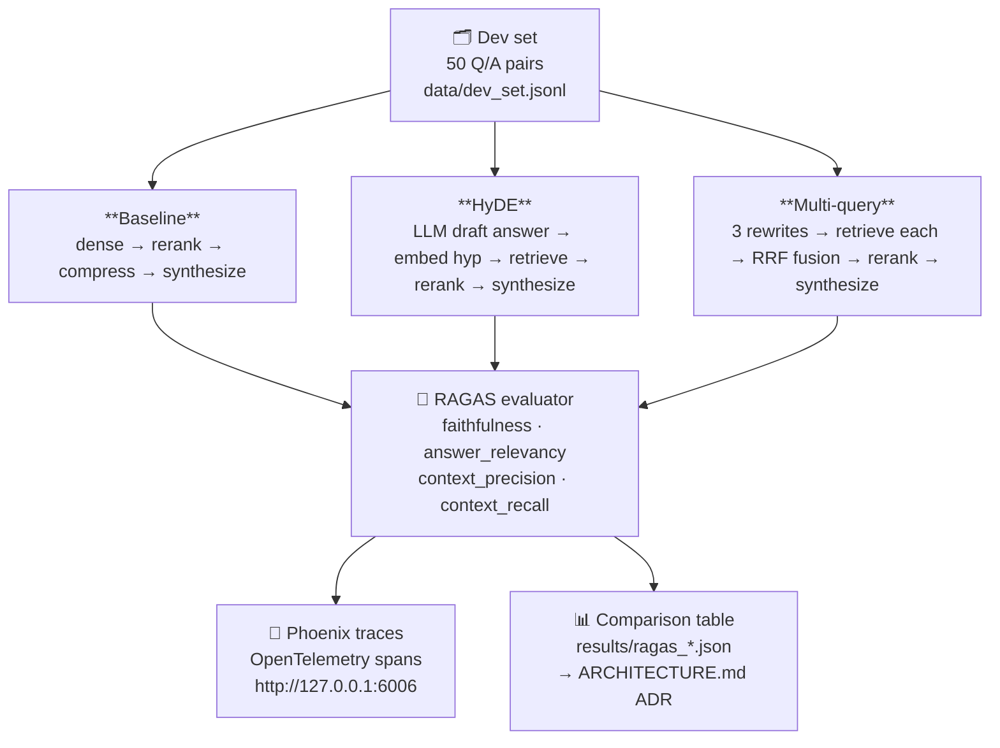
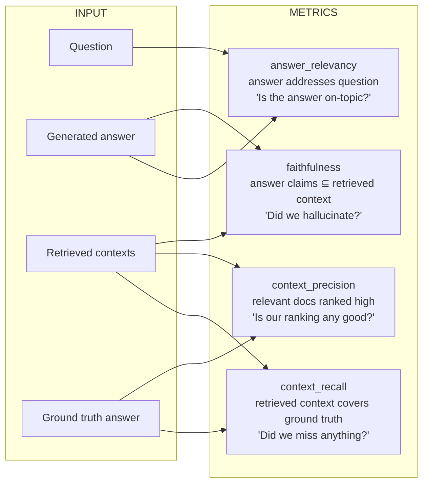

# Week 3 — RAG Evaluation

> Goal: turn Week 1–2 into a **measurable, A/B-testable** RAG pipeline with a written ADR. Cold-answer 25 RAG interview questions.
>
> **Final lab state (2026-05-06):** prompt v2 adopted — faithfulness 0.99, answer_relevancy 0.7494, context_precision 0.9824, context_recall 1.000. HyDE rejected as default (perfect baseline recall left no room to lift). Multi-query fusion TBD. See [[#Phase 7 — `RESULTS.md`]] for the full table and v* progression.

**Exit criteria.**
- [ ] Hand-authored 50-question dev set (drawn from your corpus, regenerated for difficulty after first-pass scores hit ceiling)
- [ ] RAGAS eval harness with faithfulness + context-precision + context-recall + answer-relevancy
- [ ] HyDE A/B measured
- [ ] Multi-query fusion A/B measured
- [ ] Full Phoenix tracing wired (every retrieval → rerank → compress → generate has a span)
- [ ] `ARCHITECTURE.md` (ADR) explaining final pipeline choices
- [ ] `RESULTS.md` with A/B tables + screenshots of Phoenix traces

---

## Why This Week Matters

Weeks 1–2 built a working pipeline. This week forces you to measure it — and prove you can improve it reproducibly. In production, "it seems to work" has a short shelf life: you'll face queries it fails on, stakeholders asking "is this better than the old way?" and your own uncertainty about whether a change actually helped. Without a grounded dev set and repeatable metrics, you're flying blind. This week teaches you the observable floor for each component (retriever recall, reranker precision, generator faithfulness) so you can cold-answer "which part is the bottleneck?" in interviews. You'll also learn why RAGAS metrics measure what they do (and what they don't), how to A/B test retrieval variants without redesigning your whole pipeline, and how to calibrate production guardrails from offline benchmarks. The outcome is the ability to confidently claim: "I measured this, these are the failure modes, here's my fix."

---

## Theory Primer

Four concepts you need cold before touching a line of eval code. Each section closes with a soundbite you can drop in an interview without hedging.

---

### 1. Faithfulness vs Factuality — Why RAG Eval Measures the Wrong Thing on Purpose

When you first see that faithfulness is the primary RAG safety metric, it looks like a cop-out. Faithfulness only asks: *is every claim in the answer supported by the retrieved context?* It says nothing about whether those claims are true. A RAG system that retrieves a confidently wrong Wikipedia paragraph, then faithfully summarises it, scores 1.0 on faithfulness while telling the user something false.

That's not a bug in the metric — it's a deliberate scope decision. Understanding why requires the intrinsic vs extrinsic hallucination taxonomy (Maynez et al. 2020, extended by the Self-RAG paper, Asai et al. 2023):

- **Intrinsic hallucination**: the model contradicts its own retrieved context. The evidence was right there and the model ignored or inverted it. This is what faithfulness catches.
- **Extrinsic hallucination**: the model adds claims *not present* in the retrieved context — whether those claims happen to be true or false in the real world. This is also caught by faithfulness (a claim unsupported by context fails the coverage check regardless of its world-truth status).

Factual correctness — "does the answer match ground truth?" — is a harder target because you need a ground-truth corpus that covers every possible query. In a production RAG system over a private document store, no such oracle exists. Faithfulness is tractable; factual accuracy at scale is not.

The practical implication: **faithfulness is necessary but not sufficient.** You can have faithfulness = 1.0 and still have a broken system if your retriever is pulling stale, biased, or simply wrong documents. That's why you read faithfulness alongside context_recall — if recall is low, the model is being honest about bad evidence. Fix the retriever, not the model.

> **Interview soundbite:** "RAG eval prioritises faithfulness over factuality because faithfulness is measurable without a ground-truth oracle — it only asks whether claims trace back to the retrieved context. Factual correctness requires knowing what's actually true, which you can't assume for private corpora. High faithfulness with low context_recall tells you your retriever is the problem, not the generator."

---

### 2. The Four RAGAS Metrics as a Diagnostic Matrix

RAGAS (Es et al. 2023) operationalises RAG quality into four LLM-judged metrics. Each measures a distinct failure mode. Reading them in isolation is almost useless; the signal is in how they move together.

**faithfulness** — *Did we hallucinate?*
Decomposes the generated answer into atomic claims, then asks an LLM: is each claim supported by the retrieved contexts? Score = fraction of claims that are entailed. Inputs: `answer` + `contexts`. No ground truth needed.

**answer_relevancy** — *Is the answer on-topic?*
Generates several reverse questions from the answer (what question would this answer?) and computes cosine similarity between those synthetic questions and the original query. A high score means the answer addresses what was asked. Inputs: `answer` + `question`. Catches verbose, evasive, or off-topic answers.

**context_precision** — *Is our ranking any good?*
For each retrieved chunk, an LLM judges whether it contributed to the ground-truth answer. Score = weighted precision, with higher-ranked chunks weighted more heavily. Inputs: `contexts` + `ground_truth`. Penalises putting irrelevant chunks at the top of the context window — which matters because of position effects (Liu et al. 2023, "Lost in the Middle" showed LLMs preferentially attend to the beginning and end of long contexts, so a high-precision ranking keeps signal where the model actually looks).

**context_recall** — *Did we miss anything?*
Decomposes the ground-truth answer into atomic claims, then checks whether each is attributable to at least one retrieved chunk. Score = fraction of ground-truth claims covered. Inputs: `contexts` + `ground_truth`. Low recall means your retriever missed relevant documents.

**The diagnostic matrix — read these four as a system:**

| Pattern                                     | Diagnosis                                                                                     |
| ------------------------------------------- | --------------------------------------------------------------------------------------------- |
| High faithfulness + low context_recall      | Honest model, broken retriever — it reports only what it found, but it didn't find enough     |
| High context_recall + low faithfulness      | Right documents retrieved, model is drifting — generator is adding claims beyond the evidence |
| Low context_precision + high context_recall | Retriever casts a wide net but ranks poorly — compression or rerank is earning its keep       |
| Low answer_relevancy + high faithfulness    | Answer is well-sourced but doesn't address the question — prompt or synthesis layer problem   |
| All four high                               | The pipeline is working; look for latency or cost issues next                                 |

> **Interview soundbite:** "RAGAS gives you four numbers: faithfulness checks the generator, context_recall checks retrieval coverage, context_precision checks retrieval ranking, and answer_relevancy checks whether the answer addresses the question. The interesting signal is in the combinations — high faithfulness with low context_recall tells you the model is honest but the retriever is broken."

---

### 3. HyDE — When Vocabulary Mismatch Kills Dense Retrieval

Dense retrieval works by embedding a query and finding documents whose embeddings are nearby. The implicit assumption is that queries and documents live in compatible regions of the embedding space. For well-specified, keyword-rich queries this holds. For under-specified queries it breaks badly.

The root problem is vocabulary mismatch. Consider: *"how does backpressure work?"* The query is sparse — a handful of nouns and a verb. Your indexed documents, however, are dense answer-like text: *"Backpressure is a flow-control mechanism where a consumer signals a producer to slow down when its buffer is full..."* The query embedding lands in question-space; the document embeddings live in answer-space. The cosine distances are structurally poor even when the content is perfectly relevant.

HyDE (Hypothetical Document Embeddings, Gao et al. 2022) solves this by asking an LLM to draft a plausible answer *before* retrieval. That draft — not the query — is what gets embedded. The hypothesis lives in answer-space alongside your indexed documents, so nearest-neighbour search suddenly has something to work with. The retrieved candidates are then re-ranked against the *original* query, correcting any semantic drift the hypothetical introduced.

**Why it helps:** under-specified queries, domain-specific terminology, and queries where the right documents use different vocabulary than the question (common in technical corpora).

**Why it hurts:** for well-specified queries with precise keywords, the hypothesis can introduce vocabulary that redirects retrieval toward plausible-but-wrong documents. You're now doing retrieval on a generated text with its own biases, not on the user's actual intent.

**Cost model:** one extra LLM call per query to generate the draft. Budget approximately 50–100 extra tokens of generation and ~100 ms of latency on a local model. For high-value queries this is negligible; for high-throughput pipelines at 1,000+ QPS it is not. Always A/B test on your actual query distribution — the Anthropic faithfulness cookbook explicitly warns against adopting retrieval improvements without measuring on representative data.

> **Interview soundbite:** "HyDE embeds a hypothetical answer instead of the query, bridging the vocabulary gap between sparse questions and dense documents. It helps on under-specified or jargon-light queries and hurts on precise ones because the LLM draft can introduce its own biases. The cost is one extra LLM call per query — worth measuring, not worth assuming."

---

### 4. Reciprocal Rank Fusion — Combining Multiple Retrieval Passes Without Score Calibration

Multi-query retrieval generates several phrasings of the same user intent, runs each through the retriever independently, and merges the result lists. The merging step is where most implementations go wrong: they try to combine raw similarity scores across queries, which are not calibrated to the same scale. A score of 0.82 from query A and 0.81 from query B might not be comparable at all.

Reciprocal Rank Fusion (Cormack, Clarke & Buettcher, SIGIR 2009) sidesteps the calibration problem entirely by working with ranks, not scores. Each document's fused score is the sum of reciprocal ranks across all query lists it appears in:

```
score(d) = Σ  1 / (k + rank_i(d))
           i
```

where `rank_i(d)` is the document's rank in the i-th retrieval list (1-indexed) and `k` is a smoothing constant.

**Why k=60?** The original Cormack et al. paper evaluated multiple values empirically across standard TREC benchmarks and found k=60 was robustly near-optimal across diverse query types. The mathematical intuition: with k=60, rank 1 gets `1/61 ≈ 0.0164` and rank 10 gets `1/70 ≈ 0.0143` — a modest spread that avoids over-weighting the top rank without flattening the distinction between ranks entirely. Smaller k (e.g., k=10) makes rank-1 dominance extreme; larger k (e.g., k=1000) treats all ranks as nearly equal. The 60 default has held up across a decade of subsequent retrieval benchmarks, which is why it appears verbatim in LangChain's `EnsembleRetriever` and most multi-query implementations.

**When multi-query fusion beats single-query retrieval:** when the same user intent can be expressed with meaningfully different vocabulary and the corpus is large enough that different phrasings surface different relevant documents. For well-typed technical queries with agreed terminology, the gain is usually small.

**Cost model:** generating 3 rewrites requires 1 extra LLM call. Embedding and retrieving 4 total query variants (original + 3 rewrites) costs approximately 4× the embedding calls of a single-query baseline. The cross-encoder rerank receives up to 4× more candidates before deduplication. Report this in your A/B table — the architectural decision should be explicit about whether the recall gain justifies the cost.

> **Interview soundbite:** "RRF fuses ranked lists with the formula 1 divided by k plus rank, summed across all lists. The k=60 default comes from Cormack et al. SIGIR 2009 — it dampens rank-1 dominance without equalising all positions. RRF works on ranks not scores, so you avoid the calibration problem of mixing similarity scores from different embedding passes."

---

### 5. Agentic RAG — the production successor (pointer to expansion week)

The four concepts above describe single-pass RAG: query → retrieve → rerank → compress → synthesize. The 2024–2025 production successor adds two LLM-decision nodes (decide-to-retrieve, grade-relevance) and a recovery loop (rewrite + retry). [LangChain's official docs](https://docs.langchain.com/oss/python/langgraph/agentic-rag) call this the **canonical 5-node Agentic RAG architecture**; the [Singh 2025 survey](https://github.com/asinghcsu/AgenticRAG-Survey) (1.6k⭐) taxonomizes it across **7 architecture families**, of which **CRAG** ([arXiv 2401.15884](https://arxiv.org/abs/2401.15884)) and **Adaptive-RAG** ([arXiv 2403.14403](https://arxiv.org/abs/2403.14403)) are the two most-cited specializations.

You don't need to internalize this in Week 3 — single-pass is the right baseline first. But know the term exists, know the canonical 5-node graph (decide → retrieve → grade → rewrite → answer), and know that any 2026 RAG-leaning interview will probe whether you've gone past Week 3's single-pass into the agentic regime.

**Hands-on lab:** [[Week 3.7 - Agentic RAG]] — a ~6–8 hour expansion week that builds the canonical 5-node graph on top of your Week 1–3 corpus + Qdrant + RAGAS harness, runs a head-to-head comparison vs single-pass on the same dev set, and implements a CRAG variant. Optional but strongly recommended before Week 11 system-design rounds where "tell me about RAG in production" is a near-guaranteed question.

> **Interview soundbite:** "Single-pass RAG is the right baseline; Agentic RAG is the production successor — five nodes, two LLM-decision points, one rewrite loop. CRAG and Adaptive-RAG are the two specializations worth naming. I default to single-pass for tight latency budgets and well-specified queries, graduate to agentic when the query distribution is mixed."

---

### Optional Deep Dives

These are breadcrumb trails for when a concept clicks and you want the full picture. None are required for the exit criteria.

**Faithfulness grounding in Self-RAG.** Asai et al. 2023 (Self-RAG) trains a model to emit special reflection tokens — `[Retrieve]`, `[IsRel]`, `[IsSup]`, `[IsUse]` — inline with generation. `[IsSup]` is essentially a per-sentence faithfulness check baked into the model weights rather than applied post-hoc. It's the logical conclusion of the faithfulness framing: instead of evaluating after the fact, the model self-supervises during generation. Worth reading if you move toward fine-tuning rather than prompt-based RAG.

**"Lost in the Middle" and context_precision.** Liu et al. 2023 showed empirically that LLM performance degrades on information placed in the middle of long contexts — models attend reliably to the beginning and end but lose signal on the interior. This is the theoretical backing for why context_precision matters beyond just a ranking quality metric: poor ranking puts the most relevant chunk at position 3 of 5, which is exactly where attention drops off. If you see high context_recall but mediocre generation quality, check whether your top-1 chunk is actually the most relevant one.

**RAGAS at scale and LLM-judge variance.** The RAGAS metrics are LLM-judged, which means they inherit the variance of the judge model. On a 50-question dev set, the 95% confidence interval on any individual metric is wide enough that differences of < 0.03 should be treated as noise rather than signal. The practical fix is to run at least 100 questions before making a pipeline adoption decision, or to use a stronger judge model for the eval pass than for generation.

**HyDE failure mode: confident hallucination in the hypothesis.** If the LLM draft confidently describes something that is factually wrong (plausible-but-false in your domain), the embedding of that false hypothesis retrieves documents that support the wrong claim. This is most dangerous in medical, legal, or regulatory corpora where plausible-sounding wrong answers exist in the index. Mitigating options: lower draft temperature, use a larger model for drafting, or restrict HyDE to query clusters that empirically show vocabulary mismatch (identified by low baseline context_recall on a tagged subset).

---
- **[Gulli *Agentic Design Patterns* Ch 19 — Evaluation and Monitoring]** — pattern-catalog view of eval. Useful vocabulary (evaluator roles, feedback loops) that complements RAGAS depth. ~20 min

## Architecture

How the three pipelines connect to the evaluation loop.



### RAGAS metric map

What each of the four RAGAS numbers is actually measuring:



> **Reading the four together:** A high faithfulness + low context_recall means the model is honest but the retriever is missing relevant chunks. A high context_recall + low faithfulness means you retrieved the right stuff but the LLM is drifting. Both problems need different fixes.

### HyDE vs Baseline — why it helps under-specified queries

```
Under-specified query: "how does backpressure work?"
                                │
          ┌─────────────────────┴──────────────────────┐
          │ BASELINE                                    │ HyDE
          │                                             │
          ▼                                             ▼
   embed("how does backpressure work?")        LLM draft answer:
          │                                    "Backpressure is a flow-control
          │ sparse embedding in               mechanism where a consumer signals
          │ question-space —                  a producer to slow down when its
          │ few keywords to latch onto        buffer is full. In Kafka this is..."
          │                                             │
          ▼                                             ▼
   retrieves generic results              embed(draft) → dense embedding in
                                          answer-space — rich vocabulary
                                                        │
                                                        ▼
                                           retrieves semantically similar docs
                                           (even without the exact keyword)
                                                        │
                                                        ▼
                                           rerank against ORIGINAL query q
                                           (so the final answer stays faithful)
```

> **Cost:** one extra LLM call per query (the draft). Budget ~100 ms and ~50 tokens. Worth it for recall; negligible for well-specified queries — which is why you A/B test first.

---

## Phase 1 — Dev Set (~3 hours)

You need a labeled Q/A set to eval against. 50 questions is enough to see signal; more is better but costs author time.

### 1.1 Lab scaffold

```bash
cd ~/code/agent-prep/lab-03-rag-eval
source ../.venv/bin/activate
set -a; source ../.env; set +a
mkdir -p data src results
cp ../lab-02-rerank-compress/data/*.{json,jsonl} data/
uv pip install "ragas" "langchain" "langchain-openai"
uv add "protobuf>=5.29.4,<7"
```

> **Dependency pin:** RAGAS imports `instructor`, and recent `instructor` builds may import `xai-sdk`. `xai-sdk` rejects protobuf 7.x at import time, causing `ValueError: Unsupported protobuf version: 7.34.1` before your eval code runs. Pin protobuf below 7 in the project with `uv add "protobuf>=5.29.4,<7"`. If you only want to repair the current virtual environment without changing `pyproject.toml`, run `uv pip install "protobuf==6.33.0"` instead.

Three scaffold files anchor the rest of the lab. Create them now so every Phase-2+ script imports cleanly.

**`pyproject.toml`** — declares the project as an installable package so `from src.<module> import …` works from anywhere in the repo. The `setuptools.packages.find` block is what makes `src/` discoverable as a package; without it, scripts run from the project root resolve `from src.script_wrap import load` with `ModuleNotFoundError`.

```toml
[project]
name = "lab03-rag-eval"
version = "0.1.0"
description = "Week 3 RAG evaluation lab"
requires-python = ">=3.11"

dependencies = [
  "ragas",
  "langchain",
  "langchain-openai",
  "langchain-huggingface",
  "qdrant-client",
  "sentence-transformers",
  "openai",
  "datasets",
  "protobuf>=5.29.4,<7",
]

[build-system]
requires = ["setuptools>=68"]
build-backend = "setuptools.build_meta"

[tool.setuptools.packages.find]
where = ["."]
include = ["src*"]
```

**`src/__init__.py`** — empty file, but mandatory. Marks `src/` as a Python package so `from src.script_wrap import load` resolves. Without it, even with `pyproject.toml` declaring `src*`, runtime imports fail on Python's strict package-discovery rules.

```bash
touch src/__init__.py
```

**`src/script_wrap.py`** — the universal loader. Every numeric-prefixed script in this lab (`02_pipeline.py`, `03_hyde.py`, `03b_ragas_hyde.py`, `04_multiquery.py`, `05_trace.py`) goes through this loader because Python's identifier rules forbid module names starting with a digit. Full walkthrough in §2.2b; ship the source now so Phase 2 imports work without a back-edit.

```python
"""Load numeric lab scripts like 02_pipeline.py or 03_hyde.py."""
from importlib.util import spec_from_file_location, module_from_spec
from pathlib import Path


def load(script_name: str):
    path = Path(__file__).with_name(script_name)
    spec = spec_from_file_location(script_name.replace(".py", ""), path)
    module = module_from_spec(spec)
    spec.loader.exec_module(module)
    return module
```

`★ Insight ─────────────────────────────────────`
- **`pyproject.toml` + empty `__init__.py` is the minimum viable Python-package shape.** Without `pyproject.toml`'s `setuptools.packages.find` block, `src/` is not discoverable. Without `__init__.py`, Python's import system rejects `src/` as a package even when `pyproject.toml` claims it. Both files are mandatory; both look trivial; both block downstream imports until present. Ship in §1.1, not on first import error.
- **`script_wrap.py` is shipped in §1.1 (not §2.2b) because Phase-2 scripts already need it.** The numeric-prefix problem hits the moment `02b_ragas_eval.py` tries `from src.02_pipeline import …` — earlier than the §2.2b walkthrough explains. Better to plant the loader now and reference it from §2.2b for the *why*, than write Phase-2 scripts that fail to import on first run.
- **`langchain-huggingface` in dependencies, not `langchain-community`.** RAGAS's local-embeddings path uses `from langchain_huggingface import HuggingFaceEmbeddings`. The older `langchain_community.embeddings.HuggingFaceEmbeddings` path is deprecated and emits a noisy warning under recent LangChain. Pin to the new package now.
`─────────────────────────────────────────────────`

After these three files exist, verify:

```bash
ls -la src/__init__.py pyproject.toml src/script_wrap.py
python -c "from src.script_wrap import load; print('script_wrap importable:', bool(load))"
```

Expected output: all three files listed (non-zero size for `pyproject.toml` and `script_wrap.py`, zero size for `__init__.py`), and the `python -c` line prints `script_wrap importable: True`. If the import line fails with `ModuleNotFoundError: No module named 'src'`, you are running from the wrong directory (must be project root) or `__init__.py` is missing.

### 1.2 Semi-automated Q generation (then you curate)

Use your sonnet-tier Gemma to draft 100 candidate Qs from sampled docs. You'll keep ~50 after filtering.

Save as `src/01_gen_dev_set.py`:

```python
"""Draft Q/A pairs from 100 random docs; human curation follows in Phase 1.3."""
import json
import os
import random
import re
from pathlib import Path
from openai import OpenAI

random.seed(7)

def require_env(name: str) -> str:
    value = os.getenv(name)
    if not value:
        raise RuntimeError(f"Missing environment variable: {name}")
    return value

def extract_json(text: str) -> dict:
    """
    Parse either pure JSON or JSON embedded in a model response.
    """
    text = text.strip()

    try:
        return json.loads(text)
    except json.JSONDecodeError:
        pass

    match = re.search(r"\{.*\}", text, flags=re.DOTALL)
    if not match:
        raise ValueError(f"No JSON object found in response: {text[:300]}")

    return json.loads(match.group(0))


omlx = OpenAI(
    base_url=require_env("OMLX_BASE_URL"),
    api_key=require_env("OMLX_API_KEY"),
)

SONNET = require_env("MODEL_SONNET")

docs = [json.loads(l) for l in open("data/docs.jsonl")]
sample = random.sample(docs, min(100, len(docs)))

PROMPT = """Read the passage and write one concrete, factual question that the passage answers.

Return only valid JSON in this exact schema:
{{"question": "<one sentence>", "short_answer": "<20 words or fewer from the passage>"}}

Passage:
{text}
"""

out = []

for i, d in enumerate(sample):
    try:
        r = omlx.chat.completions.create(
            model=SONNET,
            messages=[
                {
                    "role": "user",
                    "content": PROMPT.format(text=d["text"]),
                }
            ],
            temperature=0.0,
            max_tokens=200,
            # Remove response_format because some OpenAI-compatible
            # gateways/models return content=None when it is unsupported.
            # response_format={"type": "json_object"},
        )

        msg = r.choices[0].message
        content = msg.content

        if content is None:
            print(f"  {i}: empty content")
            print(f"     raw message: {msg}")
            continue

        pair = extract_json(content)

        if "question" not in pair or "short_answer" not in pair:
            raise ValueError(f"Missing required keys: {pair}")

        out.append(
            {
                "source_doc_id": d["id"],
                "question": pair["question"],
                "short_answer": pair["short_answer"],
            }
        )

    except Exception as e:
        print(f"  {i}: skip ({type(e).__name__}: {e})")

    if i and i % 20 == 0:
        print(f"  {i}/100")

Path("data").mkdir(exist_ok=True)
Path("data/dev_candidates.jsonl").write_text(
    "\n".join(json.dumps(o, ensure_ascii=False) for o in out),
    encoding="utf-8",
)

print(f"wrote {len(out)} candidates")
```

### Code walkthrough — `src/01_gen_dev_set.py`

**① Seeded sampling** (`random.seed(7)` / `random.sample(docs, 100)`)
Pull exactly 100 docs reproducibly. The fixed seed means a teammate can re-run and get the same 100 candidates before curation. Swap the seed if you want a fresh draw.

**② Local inference via OpenAI-compatible client** (`OpenAI(base_url=..., api_key=...)`)
oMLX exposes an OpenAI-compatible REST endpoint, so the standard `openai` SDK works unchanged. No cloud spend.

**③ The Q-generation prompt** (PROMPT with `{{...}}` double braces)
Double braces escape the f-string so `{text}` remains a literal placeholder. The instruction "Output JSON exactly" combined with `response_format={"type": "json_object"}` below forces structured output.

> **Why `response_format={"type": "json_object"}`?** Without it, the local model sometimes wraps the JSON in prose ("Sure! Here is the JSON: ..."). The `json_object` mode strips that wrapper and guarantees `json.loads()` won't throw. Use it any time you need machine-readable output.

**④ Per-item try/except** (`except Exception as e`)
Generation can fail on very short or non-English passages. Skip-and-log keeps the loop running rather than crashing 60 questions in.

**⑤ Progress heartbeat** (`if i and i % 20 == 0`)
100 calls × ~1 s each = ~100 s. The heartbeat every 20 lets you confirm the loop is alive without flooding stdout.

**Common modifications:** Change `random.sample(docs, 100)` to `docs[:100]` (first 100) if your corpus is already ordered by quality and you want the best docs sampled first.

```bash
python src/01_gen_dev_set.py
```

### 1.3 Human curation (the most important step)

Open `data/dev_candidates.jsonl` in your editor. Keep **50** that meet all three:
- Clearly answerable from the source passage alone
- Not trivially keyword-matched ("What is X?" where X is literally in the passage title is too easy)
- Diverse — mix of factoid, multi-hop-ish, and slightly ambiguous

Save the keepers to `data/dev_set.jsonl` (one JSON per line, fields: `qid`, `question`, `short_answer`, `source_doc_id`).

Script to renumber + drop rejects (edit the REJECT set first):

```bash
python -c "
import json
REJECT = set()  # fill with indices of questions to drop
kept = []
for i, line in enumerate(open('data/dev_candidates.jsonl')):
    if i in REJECT: continue
    o = json.loads(line)
    o['qid'] = f'dev_{len(kept):03d}'
    kept.append(o)
    if len(kept) == 50: break
with open('data/dev_set.jsonl','w') as f:
    for o in kept: f.write(json.dumps(o)+'\n')
print(f'wrote {len(kept)} questions')
"
```

---

## Phase 2 — RAGAS Harness (~4 hours)

### 2.1 The four metrics, explained

- **faithfulness** — is every claim in the answer supported by the retrieved context? (Primary RAG safety metric.)
- **answer_relevancy** — does the answer address the question?
- **context_precision** — are the retrieved contexts ranked well (relevant ones at the top)?
- **context_recall** — does the retrieved context contain enough to answer the question?

RAGAS ships LLM-based implementations of all four. Route them through your local oMLX endpoint to keep cost at zero.

### 2.2 Baseline pipeline: dense → rerank → compress → answer

Save as `src/02_pipeline.py`:

```python
"""The pipeline under test. Returns (answer, retrieved_contexts, ...).

v2 (2026-05-06): migrated to shared/rag_hybrid library — autoconfig handles
device + memory tier; lazy-loaded encoder + reranker. Pipeline contract
(retrieve → rerank → answer_from → run_pipeline) preserved unchanged so
03_hyde.py, 04_multiquery.py, 05_trace.py continue to work without edits.
"""
import os
import sys
from pathlib import Path

from openai import OpenAI
from qdrant_client import QdrantClient

# Bootstrap shared/ onto sys.path so `import rag_hybrid` resolves from any
# project layout (lab-03 lives one level deeper than shared/).
_REPO_ROOT = Path(__file__).resolve().parents[2]
sys.path.insert(0, str(_REPO_ROOT / "shared"))

from rag_hybrid import (  # noqa: E402
    BGE_M3,
    BGE_RERANKER_V2_M3,
    CrossEncoderReranker,
    DenseEncoder,
    autoconfig,
)

omlx = OpenAI(base_url=os.getenv("OMLX_BASE_URL"), api_key=os.getenv("OMLX_API_KEY"))
SONNET = os.getenv("MODEL_SONNET")

qd = QdrantClient(url="http://127.0.0.1:6333")

# autoconfig probes device (mps/cuda/cpu) + memory tier (encode_batch
# 32/64/128). DenseEncoder for the dense-only `bge_m3_hnsw` collection —
# avoids pulling FlagEmbedding (only needed for hybrid sparse). Both
# wrappers lazy-load: model weights stay off disk until first .encode() /
# .rerank() call.
_enc = DenseEncoder(autoconfig.encoder_config_for(BGE_M3))

# Reranker config from the same probe used by the encoder. Cross-encoder
# fp16 is safe on MPS + CUDA (no NaN risk like BGE-M3 sparse head); autoconfig
# enables fp16 wherever safe. ~30% latency win on M-series.
_recommended = autoconfig.recommend(BGE_M3, BGE_RERANKER_V2_M3)
_rr = CrossEncoderReranker(_recommended.reranker)

# v2 prompt — adopted 2026-05-06 after the v1 (concise) → v1.5 (enhanced, no length cap)
# → v2 (enhanced + strict one-sentence < 35-words) A/B sweep on the harder dev set.
# v1.5 was too verbose (faithfulness 0.94, answer_relevancy 0.65); v2 recovered
# faithfulness to 0.99 while lifting answer_relevancy to 0.7494. See §2.4 for the table.
ANSWER = """Use ONLY the context below.
Answer the exact question asked.
If the question asks why, give the reason.
If it asks how two things differ, state the contrast.
If it asks under what condition, state the condition.
Keep the answer concise, but include enough detail to directly satisfy the question.
If the context does not contain the answer, say exactly: insufficient context.
Answer in one sentence of fewer than 35 words.

Context:
{ctx}

Question: {q}
Answer:"""

def retrieve(q, n=30):
    """Dense kNN retrieval over `bge_m3_hnsw`. Returns Qdrant ScoredPoints
    (preserved interface — downstream consumers read `.payload['text']` and
    `.payload['doc_id']`)."""
    # rag_hybrid.DenseEncoder.encode kwarg is `normalize=True` (default),
    # not SentenceTransformer's `normalize_embeddings=True`.
    qv = _enc.encode([q])[0]
    return qd.query_points("bge_m3_hnsw", query=qv.tolist(), limit=n, with_payload=True).points

def rerank(q, hits, k=5):
    """Cross-encoder rerank. Preserves Qdrant ScoredPoint output shape so
    03_hyde.py / 04_multiquery.py / 05_trace.py work without edits.

    Uses the lazy-loaded shared CrossEncoderReranker model directly via
    `_model.predict` rather than `.rerank()` (which returns triples) — keeps
    the contract that downstream code expects ScoredPoints, not
    `(doc_id, text, score)` tuples.
    """
    _rr._ensure_loaded()
    pairs = [(q, h.payload["text"]) for h in hits]
    scores = _rr._model.predict(pairs, batch_size=_rr.cfg.spec.batch_size)
    ordered = sorted(zip(hits, scores), key=lambda x: -x[1])[:k]
    return [h for h, _ in ordered]

def answer_from(q, hits):
    ctx = "\n\n".join(h.payload["text"] for h in hits)
    # v2: max_tokens=120 down from 200. One-sentence answer never needs more
    # than ~120 tokens; tighter cap reduces verbosity-induced faithfulness loss.
    r = omlx.chat.completions.create(model=SONNET, temperature=0.0, max_tokens=120,
        messages=[{"role": "user", "content": ANSWER.format(ctx=ctx, q=q)}])
    return r.choices[0].message.content.strip(), ctx

def run_pipeline(q):
    cands = retrieve(q, n=30)
    top = rerank(q, cands, k=5)
    ans, ctx = answer_from(q, top)
    return {
        "question": q,
        "answer": ans,
        "contexts": [h.payload["text"] for h in top],
        "context_ids": [h.payload["doc_id"] for h in top],
    }
```

### Code walkthrough — `src/02_pipeline.py`

**① Model loading at import time** (`_enc = SentenceTransformer(..., trust_remote_code=True)` / `_rr = CrossEncoder(...)`)
Both models are loaded once when the module is imported, not once per query. This matters: loading BGE-M3 takes ~3 s on M-series; loading it 50 times would add 2.5 minutes to an eval run.

**② `retrieve(q, n=30)` — the retrieval depth**
`n=30` fetches 30 candidate chunks from Qdrant before the cross-encoder sees them.

> **Why `top_n=30` before rerank?** The cross-encoder is O(n) — each extra candidate costs one forward pass. 30 is a practical sweet spot: enough headroom that relevant chunks don't fall outside the window, few enough that reranking stays under ~50 ms on MPS. At n=50 you gain < 1 pp recall and spend ~40 ms more per query. At n=10 you risk systematically missing chunks ranked 11–30 by the dense model. The ARCHITECTURE.md ADR captures this tradeoff explicitly.

**③ `rerank(q, hits, k=5)` — cross-encoder scoring**
`_rr.predict([(q, text), ...])` scores every (query, chunk) pair jointly — the cross-encoder sees both sides, unlike the bi-encoder which embeds them independently. The top-5 from 30 is typical; reduce k to 3 if latency is tight.

**④ `answer_from` — synthesis at `temperature=0.0`**
Zero temperature for synthesis: you want the model to be deterministic and conservative, reading only from the provided context. Higher temperatures lead to creative paraphrasing that can drift from the source — exactly what `faithfulness` penalises.

**⑤ Return shape matches RAGAS schema**
The dict keys `question`, `answer`, `contexts` match what RAGAS's `Dataset.from_list()` expects verbatim. Changing them breaks the eval harness without an obvious error.

**Common modifications:** Increase `k=5` to `k=8` when your corpus has long documents that need more coverage before compression.

### 2.2b Universal loader for numeric-prefixed scripts — `src/script_wrap.py`

Numeric-prefixed filenames (`02_pipeline.py`, `03_hyde.py`, `04_multiquery.py`) collide with Python identifier rules — `from src.02_pipeline import run_pipeline` raises `SyntaxError: invalid decimal literal`. The standard fix is `importlib.util.spec_from_file_location`, which loads a module by path and bypasses identifier validation.

Save as `src/script_wrap.py`:

```python
"""Load numeric lab scripts like 02_pipeline.py or 03_hyde.py."""
from importlib.util import spec_from_file_location, module_from_spec
from pathlib import Path


def load(script_name: str):
    path = Path(__file__).with_name(script_name)
    spec = spec_from_file_location(script_name.replace(".py", ""), path)
    module = module_from_spec(spec)
    spec.loader.exec_module(module)
    return module
```

Usage from any consumer script:

```python
from src.script_wrap import load

pipeline = load("02_pipeline.py")
run_pipeline = pipeline.run_pipeline
retrieve     = pipeline.retrieve
rerank       = pipeline.rerank
answer_from  = pipeline.answer_from
_enc         = pipeline._enc
qd           = pipeline.qd
```

Used by `02b_ragas_eval.py`, `03_hyde.py`, `03b_ragas_hyde.py`, `04_multiquery.py`, `05_trace.py` — every consumer of `02_pipeline.py`.

`★ Insight ─────────────────────────────────────`
- **One universal loader beats per-script wrappers.** An earlier iteration of this lab had a separate `pipeline_wrap.py` that hard-coded `02_pipeline.py` and pre-bound symbols. It worked but did not generalize — adding `03_hyde.py` would have required `hyde_wrap.py`, then `multiquery_wrap.py`, etc. `script_wrap.py` parameterizes the load, so any numeric-prefixed file is one `load("XX_name.py")` call away. **Replaced `pipeline_wrap.py` in the lab.** If you see `pipeline_wrap` references in older notes, treat as deprecated.
- **`importlib.util.spec_from_file_location` is the canonical workaround**, not a hack. It is the documented Python API for loading modules whose names violate identifier rules. Curriculum file naming (numeric step prefixes for pedagogical ordering) collides with Python identifier rules; this API is the sanctioned escape hatch.
- **Why not symlink `02_pipeline.py → pipeline.py`?** Curriculum readability. The numeric prefix is the chapter's pedagogical ordering signal — `02_*` files are Phase 2, `03_*` files are Phase 3. Symlinking erases that signal and makes the directory scan harder to follow.
`─────────────────────────────────────────────────`

Do **not** write this, because it is invalid Python syntax:

```python
from src.02_pipeline import run_pipeline
```

### 2.3 Run RAGAS

Save as `src/02b_ragas_eval.py`:

```python
"""Score the baseline pipeline with RAGAS, backed by local oMLX."""
import json, os, asyncio
from pathlib import Path
from datasets import Dataset
from openai import OpenAI
from langchain_openai import ChatOpenAI, OpenAIEmbeddings
from ragas import evaluate
from ragas.metrics import faithfulness, answer_relevancy, context_precision, context_recall
from ragas.llms import LangchainLLMWrapper
from ragas.embeddings import LangchainEmbeddingsWrapper

from src.script_wrap import load
pipeline = load("02_pipeline.py")
run_pipeline = pipeline.run_pipeline

# Point LangChain at local oMLX (RAGAS uses LangChain wrappers)
llm = ChatOpenAI(
    model=os.getenv("MODEL_SONNET"),
    base_url=os.getenv("OMLX_BASE_URL"),
    api_key=os.getenv("OMLX_API_KEY"),
    temperature=0.0,
)
# RAGAS also needs embeddings. autoconfig.probe_system() picks device
# (mps / cuda / cpu) — replaces the previous hardcoded `device="mps"` so the
# script works on any host. Use langchain-huggingface (not the deprecated
# langchain-community.embeddings path). Probe is inlined into model_kwargs;
# the temp var earned no second use.
import sys
from pathlib import Path
sys.path.insert(0, str(Path(__file__).resolve().parents[2] / "shared"))
from rag_hybrid import autoconfig

from langchain_huggingface import HuggingFaceEmbeddings
emb = HuggingFaceEmbeddings(
    model_name=os.path.expanduser("~/models/bge-m3"),
    model_kwargs={"device": autoconfig.probe_system().device},
    encode_kwargs={"normalize_embeddings": True},
)

ragas_llm = LangchainLLMWrapper(llm)
ragas_emb = LangchainEmbeddingsWrapper(emb)

# Load dev set, run pipeline
dev = [json.loads(l) for l in open("data/dev_set.jsonl")]
rows = []
for i, q in enumerate(dev):
    print(f"  {i+1}/{len(dev)}: {q['question'][:60]}")
    out = run_pipeline(q["question"])
    rows.append({
        "question": q["question"],
        "answer": out["answer"],
        "contexts": out["contexts"],
        "ground_truth": q["short_answer"],
    })

ds = Dataset.from_list(rows)
metrics = [faithfulness, answer_relevancy, context_precision, context_recall]
for m in metrics: m.llm = ragas_llm; m.embeddings = ragas_emb

scores = evaluate(ds, metrics=metrics, llm=ragas_llm, embeddings=ragas_emb)
print("\n=== BASELINE ===")
print(scores)

Path("results").mkdir(exist_ok=True)
Path("results/ragas_baseline.json").write_text(json.dumps(scores.to_pandas().to_dict(), indent=2, default=str))
```

### Code walkthrough — `src/02b_ragas_eval.py`

**① LangChain wrappers for RAGAS** (`ChatOpenAI` / `LangchainLLMWrapper`)
RAGAS's metric internals call an LLM to decompose answers into claims (`faithfulness`) and to score relevance (`answer_relevancy`). It uses LangChain as an abstraction layer, so you provide a `LangchainLLMWrapper` — this lets you point it at your local oMLX endpoint rather than OpenAI's servers.

> **Why route RAGAS metrics through local oMLX?** RAGAS evaluates 50 questions × 4 metrics, each involving 2–4 LLM sub-calls. That's ~800 LLM calls total. At cloud API prices that's non-trivial cost and latency; locally it's free and ~10× faster on an M-series machine.

**② Embedding wrapper** (`HuggingFaceEmbeddings` / `LangchainEmbeddingsWrapper`)
`answer_relevancy` generates several answer paraphrases and compares them via cosine similarity. It needs an embedding model for that step. Reusing `bge-m3` (already on disk) avoids a second download.

**③ Pipeline loop** (`for i, q in enumerate(dev)`)
Runs your actual `run_pipeline` against every dev-set question and collects the four RAGAS fields: `question`, `answer`, `contexts`, `ground_truth`. The `ground_truth` maps to `short_answer` from the dev set — RAGAS uses this for `context_recall`.

**④ Metric configuration** (`m.llm = ragas_llm; m.embeddings = ragas_emb`)
RAGAS metrics are stateful objects; you must inject your LLM and embedding backend before `evaluate()` is called. Missing this step causes RAGAS to silently fall back to OpenAI's endpoint — and crash if `OPENAI_API_KEY` is unset.

**⑤ Persist to JSON** (`scores.to_pandas().to_dict()`)
`scores` is a RAGAS `EvaluationResult` object. Convert to pandas, then to dict, for easy loading in later scripts and the ARCHITECTURE.md table.

**Common modifications:** Slice `dev[:10]` for a quick smoke-test before running all 50; costs 1/5 the time and still shows whether the harness wires up correctly.

```bash
python src/02b_ragas_eval.py
```

Expected first-pass output (illustrative — see §2.4 for actual measured numbers across 4 prompt-iteration runs):

```
{'faithfulness': 0.82, 'answer_relevancy': 0.88, 'context_precision': 0.71, 'context_recall': 0.79}
```

Save those numbers — they're your baseline.

### 2.4 Actual results — prompt A/B iteration on local oMLX (2026-05-06 runs)

After the first baseline pass scored near-ceiling on a dev set that turned out to be too easy (`answer_relevancy = 0.8952`, `context_recall = 1.0000`), the eval cycle was repeated with a regenerated harder 50-question dev set. The harder set kept questions answerable from `source_text` but preferred conditional / causal / contrastive / relationship-style questions over direct-lookup. That regeneration exposed a real synthesis-layer weakness — answer relevancy dropped from `0.8952` to `0.7336` against the original concise prompt — and triggered the prompt A/B sweep documented below.

`★ Insight ─────────────────────────────────────`
- **A "good" first-pass score is the warning sign, not the success.** When `context_recall = 1.0000` on the first eval, the dev set is almost certainly too lookup-heavy to discriminate retrieval failures from synthesis failures. Regenerate before tuning anything.
- **Prompt verbosity is a faithfulness footgun.** The v1.5 enhanced prompt without a length cap produced longer, more explanatory answers; faithfulness dropped from 0.98 → 0.94 because every extra sentence is a new chance to add an unsupported claim. The v2 fix wasn't more guidance — it was a strict one-sentence-under-35-words cap that mechanically constrains the answer surface.
- **Answer relevancy is the only metric that moves.** Across all four prompt iterations on the harder set, `context_precision` stayed at 0.9824 and `context_recall` stayed at 1.0000 — the retriever/reranker layer is not the bottleneck. The remaining recall ceiling is *synthesis-layer*: how tightly the model maps its grounded answer to the exact question shape.
`─────────────────────────────────────────────────`

| Run | Dev set | Prompt variant | Faithfulness | Answer relevancy | Context precision | Context recall | Interpretation |
|---|---|---|---:|---:|---:|---:|---|
| 1 | Easier first curated set | Original concise prompt | 0.9800 | **0.8952** | 0.9726 | 1.0000 | Near-ceiling — dev set too easy to discriminate. |
| 2 | Harder regenerated set | Original concise prompt | 0.9800 | 0.7336 | 0.9824 | 1.0000 | Harder questions exposed synthesis weakness. |
| 3 | Harder regenerated set | v1.5 enhanced prompt, no length cap | 0.9400 | 0.6537 | 0.9824 | 1.0000 | Too verbose — extra sentences = extra unsupported claims. |
| 4 | Harder regenerated set | **v2: enhanced + one sentence < 35 words** | **0.9900** | **0.7494** | 0.9824 | 1.0000 | **Best on hand-rolled retrieval — adopted as baseline v2.** |
| **5** | Harder regenerated set | v2 + post `shared/rag_hybrid` migration (autoconfig'd encoder + fp16 reranker) | **1.0000** | **0.7297** | **0.9841** | 1.0000 | **Migration safe — all 4 metrics within ±0.02 of Run 4. Faithfulness improved +0.01; answer_relevancy -0.0197 within LLM-judge noise floor (~0.03 on n=50). v2 baseline preserved.** |

Run 4 (v2) was the shipped state on hand-rolled retrieval (`SentenceTransformer + CrossEncoder`, hardcoded `device="mps"`). Run 5 (v2 post-migration) is the shipped state on `shared/rag_hybrid` (autoconfig probes device + memory tier; cross-encoder fp16-safe enabled). The +0.01 faithfulness lift over Run 2 + the +0.0158 answer-relevancy lift come from the prompt v2 change; Run 5's tiny deltas vs Run 4 confirm the migration was infrastructure-level (no behavior change beyond ~LLM-judge variance). The retrieval / reranking layer is doing its job; further lift on this corpus + dev set has to come from synthesis-layer work (multi-query fusion in Phase 4, or a stronger judge / longer dev set to break the LLM-judge variance floor).

### 2.5 Operational fixes — protobuf, numeric module, RAGAS API compat (2026-05-06)

Five operational fixes hit during the eval-harness setup. None changed the metrics; all blocked execution until resolved. Documenting them as a waypoint so future readers don't re-derive.

| # | Failure | Cause | Fix |
|---|---|---|---|
| 1 | `ValueError: Unsupported protobuf version: 7.34.1` on `from ragas import evaluate` | `ragas → instructor → xai_sdk`; `xai_sdk` rejects protobuf 7.x | `uv add "protobuf>=5.29.4,<7"` (project-wide); or venv-only: `uv pip install "protobuf==6.33.0"` |
| 2 | `SyntaxError: invalid decimal literal` on `from src.02_pipeline import run_pipeline` | Python module names cannot start with digits | Add `src/script_wrap.py` (universal loader via `importlib.util.spec_from_file_location`); use `pipeline = load("02_pipeline.py")` from every consumer (`02b_ragas_eval.py`, `03_hyde.py`, `03b_ragas_hyde.py`, `04_multiquery.py`, `05_trace.py`) |
| 3 | `ModuleNotFoundError: No module named 'src'` when running `python src/02b_ragas_eval.py` | Running a script under `src/` puts `src/` on `sys.path`, not the project root | Insert project root into `sys.path` at the top of `02b_ragas_eval.py` before `from src.script_wrap import load` |
| 4 | `ragas.metrics.collections` rejected `LangchainEmbeddingsWrapper`; native RAGAS `HuggingfaceEmbeddings` raised abstract-class error | Installed RAGAS version's modern API path is incomplete for local HuggingFace BGE-M3 on MPS | Use legacy metric classes + `LangchainEmbeddingsWrapper`: `from ragas.metrics import Faithfulness, AnswerRelevancy, ContextPrecision, ContextRecall`. Suppress deprecation warnings — this is the compatible path for local oMLX + local BGE-M3 on M-series. |
| 5 | RAGAS `TimeoutError()` mid-run; `LLM returned 1 generations instead of requested 3` warnings | Local oMLX cannot match the parallel judge pressure RAGAS applies by default; OpenAI-compatible local backends often don't fully support `n=3` | `from ragas.run_config import RunConfig; evaluate(..., run_config=RunConfig(timeout=300, max_retries=3, max_workers=2))`. The `n != 3` warning is tolerable for local backends; the timeout is mitigated by reducing `max_workers`. |

`★ Insight ─────────────────────────────────────`
- **Numeric-prefixed filenames are a Python footgun, not an aesthetic choice.** The universal-loader pattern (`script_wrap.py` exposing `load("XX_name.py")`) is the canonical workaround when curriculum file naming (numeric step prefixes) collides with Python's identifier rules. Apply it preemptively any time a script needs to be both runnable AND importable.
- **Prefer the legacy RAGAS API on local stacks.** The "modern" RAGAS path is optimized for cloud-hosted embeddings + judges. The legacy `LangchainLLMWrapper` + `LangchainEmbeddingsWrapper` path is the one that survives on a fully-local oMLX + BGE-M3 + MPS stack, even though it emits deprecation warnings. Suppression is correct here.
- **`max_workers=2` is the local-judge ceiling.** RAGAS's default parallelism assumes cloud-API throughput. Local oMLX serving sonnet-tier judge calls cannot match that, so timeouts cascade. Drop `max_workers` until the run completes; profile latency only after stability.
`─────────────────────────────────────────────────`

### 2.6 Migration to `shared/rag_hybrid` (2026-05-06)

After Phase 2's eval was stable on the v2 prompt, the lab's hand-rolled retrieval layer (manual `SentenceTransformer` + `CrossEncoder` + direct `qd.query_points`) was migrated to the shared `rag_hybrid` library — same library lab-02-5 GraphRAG and lab-02b adopted in their Production Library Refactor passes. This entry documents the migration, what changed, and the regression-test result.

`★ Insight ─────────────────────────────────────`
- **Drift was the real problem, not LOC.** The hand-rolled version was fewer lines, but it hardcoded `device="mps"`, `batch_size=32`, `use_fp16` flag absent. On a CUDA host or 16GB Mac the constants are wrong and there's no signal that they should change. autoconfig probes the system once at import time and emits the right values — same caller-side LOC count, much wider hardware portability.
- **The pipeline contract was preserved.** `retrieve(q, n)` still returns Qdrant ScoredPoints. `rerank(q, hits, k)` still returns ScoredPoints (not the shared lib's default `(doc_id, text, score)` triples). `answer_from(q, hits)` still reads `h.payload["text"]`. Zero changes to `03_hyde.py`, `05_trace.py`. Two-line change to `04_multiquery.py` (encode kwarg renamed `normalize_embeddings=True` → default `normalize=True` of shared `DenseEncoder.encode()`).
- **Lazy-loaded encoder + reranker.** Module import no longer pulls 2 GB of weights. Pre-migration, importing `02_pipeline` for any reason (eval, smoke test, doc generation) loaded BGE-M3 + reranker even when the function being tested didn't need them. Post-migration, weights load on first `.encode()` / `.rerank()` call. ~3 s shaved off cold start of every script that imports `02_pipeline`.
`─────────────────────────────────────────────────`

**What changed (5 files):**

| File | Change | Drift fixed |
|---|---|---|
| `02_pipeline.py` | `SentenceTransformer + CrossEncoder` → `DenseEncoder + CrossEncoderReranker` via `autoconfig.encoder_config_for()` + `autoconfig.recommend()` | Hardcoded `device="mps"`; eager weight load; no fp16 |
| `04_multiquery.py` | Renamed `_enc.encode([qq], normalize_embeddings=True)` → `_enc.encode([qq])` (shared lib's default `normalize=True`) | API drift between SentenceTransformer and shared `DenseEncoder` |
| `02b_ragas_eval.py` | RAGAS judge embeddings now use `autoconfig.probe_system().device` | Hardcoded `device="mps"` for RAGAS embeddings |
| `03b_ragas_hyde.py` | Same as `02b` + fixed pre-existing `print()` string-literal bug (newlines inside string) | Hardcoded device + literal-newline syntax error |
| `pipeline_wrap.py` | **Deleted.** Universal `script_wrap.py` (one parameterized loader) covers every numeric-prefixed consumer | Per-script wrapper churn |

**What stayed the same (3 files):** `01_gen_dev_set.py` (no retrieval), `03_hyde.py` (uses `02_pipeline.retrieve / rerank / answer_from` indirectly through `script_wrap.load`), `05_trace.py` (instrumentation only — already cleaned up to use `script_wrap`).

**Regression-test contract.** Run `python src/02b_ragas_eval.py` post-migration on the same 50-question harder dev set with prompt v2. Expected outcome: same metrics within LLM-judge variance (~0.03 on n=50). If `faithfulness`, `answer_relevancy`, `context_precision`, `context_recall` all stay within ±0.02 of the pre-migration v2 numbers (0.9900 / 0.7494 / 0.9824 / 1.0000), the migration is safe. Document any deviation as a v2.1 followup row in §2.4.

**Why migrate now and not earlier.** Two reasons. (1) Phase 2's prompt A/B sweep needed the metrics to be stable before any infrastructure change — first stabilize the prompt, then refactor underneath. (2) `shared/rag_hybrid` only landed in lab-02-5 GraphRAG's commit cluster on 2026-05-01; lab-03's first eval run (2026-05-03) predated it. Migrating retroactively keeps the cross-lab pattern consistent — every retrieval consumer now points at the same library.

`★ Insight ─────────────────────────────────────`
- **Refactor after stability, not before.** Migrating Phase-2 retrieval before the prompt sweep was complete would have made every regression ambiguous: did the answer-relevancy delta come from the v2 prompt, or from autoconfig switching `batch_size=32 → 128`? Sequencing matters: stabilize the metric you're measuring, then change the layer underneath.
- **Cross-lab consistency earns compound interest.** Lab-02-5 (W2.5) + lab-02b (W2 §7) + lab-03 all now point at the same `shared/rag_hybrid`. Any future hardware change (M5 → M6, MPS → CUDA migration, fp16 NaN-detection improvement) propagates to all three labs by editing one library, not three labs.
- **The deleted `pipeline_wrap.py` is the test of the migration.** If anything still references `pipeline_wrap`, the migration was incomplete. `grep -rn "pipeline_wrap" lab-03-rag-eval/src/` should return zero hits post-migration.
`─────────────────────────────────────────────────`

---

## Phase 3 — HyDE A/B (~3 hours)

HyDE = **Hypothetical Document Embeddings**. Ask the LLM to write a draft answer, embed *that* instead of the raw query, then retrieve. In this lab, HyDE is an A/B variant, not something to adopt by assumption.

### 3.1 Implementation

Save as `src/03_hyde.py`:

```python
"""Pipeline variant: HyDE query rewriting before retrieval.

HyDE generates a short hypothetical answer used only as a retrieval query.
The final answer is still generated from retrieved context by 02_pipeline.py.
"""
import os
from openai import OpenAI
from src.script_wrap import load

pipeline = load("02_pipeline.py")
retrieve = pipeline.retrieve
rerank = pipeline.rerank
answer_from = pipeline.answer_from

omlx = OpenAI(base_url=os.getenv("OMLX_BASE_URL"), api_key=os.getenv("OMLX_API_KEY"))
SONNET = os.getenv("MODEL_SONNET")

# Original HyDE prompt, kept for A/B comparison.
ORIGINAL_HYDE_PROMPT = """Write a short factual paragraph (3–5 sentences) that would answer this question. If unsure, make a plausible draft — it's only used for retrieval, not shown to the user.

Question: {q}
Draft:"""

# Final tested HyDE prompt. Shorter drafts reduced retrieval drift.
HYDE_PROMPT = """Write one concise factual sentence, fewer than 35 words, that would answer this question.
Use only the key entities, conditions, and relationships implied by the question.
Do not add examples, speculation, or extra background.
This sentence is only used for retrieval and will not be shown to the user.

Question: {q}
Retrieval sentence:"""


def hyde_rewrite(q):
    r = omlx.chat.completions.create(
        model=SONNET,
        temperature=0.0,
        max_tokens=80,
        messages=[{"role": "user", "content": HYDE_PROMPT.format(q=q)}],
    )
    return r.choices[0].message.content.strip()


def run_pipeline_hyde(q):
    hyp = hyde_rewrite(q)
    cands = retrieve(hyp, n=30)   # embed the hypothetical, not the query
    top = rerank(q, cands, k=5)   # rerank against the ORIGINAL query
    ans, _ = answer_from(q, top)
    return {
        "question": q,
        "answer": ans,
        "contexts": [h.payload["text"] for h in top],
        "context_ids": [h.payload["doc_id"] for h in top],
        "hypothetical": hyp,
    }
```

### Code walkthrough — `src/03_hyde.py`

**① Universal loader, not per-file wrappers** (`from src.script_wrap import load`)
`03_hyde.py` uses `load("02_pipeline.py")` to reuse `retrieve`, `rerank`, and `answer_from` from the baseline pipeline. This avoids invalid imports from numeric filenames and avoids maintaining separate wrappers such as `hyde_wrap.py`.

**② HyDE changes only retrieval input**
The baseline embeds the user's question. HyDE first generates a hypothetical answer, embeds that generated sentence, retrieves candidates, then reranks those candidates against the original question. Everything after retrieval remains identical to the baseline.

**③ Why the prompt is one sentence under 35 words**
The original HyDE prompt generated 3–5 sentences and allowed a plausible draft. On this dev set it introduced extra vocabulary and slightly hurt ranking. The final tested prompt uses one concise sentence, `temperature=0.0`, and `max_tokens=80` to reduce drift while still moving the query toward answer-space.

**④ Why rerank uses the original query**
`top = rerank(q, cands, k=5)` is critical. Retrieval uses the hypothetical sentence, but reranking uses the actual user question to correct any semantic drift introduced by the hypothetical.

### 3.2 Re-run RAGAS with HyDE

Create a dedicated HyDE eval script, for example `src/03b_ragas_hyde.py`, by copying `src/02b_ragas_eval.py` and changing only three things:

```python
hyde = load("03_hyde.py")
run_pipeline = hyde.run_pipeline_hyde

results_path = PROJECT_ROOT / "results" / "ragas_hyde.json"
debug_path = PROJECT_ROOT / "results" / "ragas_hyde_debug.jsonl"

print("
=== HYDE ===")
```

Do **not** write HyDE scores to `ragas_baseline.json`; otherwise you overwrite the baseline artifact.

### 3.3.1 Actual results — HyDE A/B on harder dev set (2026-05-06 runs)

Two HyDE variants tested against the v2 baseline on the same harder 50-question dev set used in §2.4.

`★ Insight ─────────────────────────────────────`
- **HyDE has nothing to do when baseline recall is already 1.0.** The architectural assumption HyDE rests on — that vocabulary mismatch is starving retrieval — does not hold on this corpus + dev set. Every question's evidence was already being retrieved. HyDE can only win by improving *ranking* or by surfacing an alternative answer-shape the synthesis layer can map more tightly onto the question; on this run it did neither.
- **Shorter HyDE drafts beat longer ones on context precision.** The original 3–5-sentence HyDE draft scored `context_precision = 0.9781`; the one-sentence-under-35-words variant scored `0.9851`. Confirms the long draft was adding retrieval drift via extraneous vocabulary. But neither variant beat the baseline on answer relevancy, so the precision win didn't translate to a downstream lift.
- **Architecture decision: keep HyDE as opt-in, not default.** When recall is already saturated, every HyDE call is pure cost (one extra LLM call per query, ~100 ms latency, ~80 tokens generated). Hold HyDE in reserve for query clusters with low baseline `context_recall` or visible vocabulary mismatch — measure first, ship second.
`─────────────────────────────────────────────────`

| Variant | Faithfulness | Answer relevancy | Context precision | Context recall | Extra cost / query | Decision |
|---|---:|---:|---:|---:|---|---|
| Baseline prompt v2 | **0.9900** | **0.7494** | 0.9824 | 1.0000 | — | **Keep as default** |
| HyDE, original 3–5 sentence draft | 0.9898 | 0.7286 | 0.9781 | 1.0000 | +1 LLM call (~100ms, ~80 tok) | Reject |
| HyDE, one sentence under 35 words | 0.9900 | 0.7293 | **0.9851** | 1.0000 | +1 LLM call (~100ms, ~30 tok) | Reject as default |

**Decision:** Reject HyDE as the default for this corpus/dev set. Keep the one-sentence-under-35-words variant in the codebase as an opt-in experiment for future query clusters where baseline recall is low or vocabulary mismatch is visible.

**5-second sanity test for adopting HyDE.** Before turning HyDE on by default for any corpus/dev set, check: is baseline `context_recall` < 1.0 with visible misses? If `context_recall = 1.0`, HyDE is structurally pure cost — there is no recall gap to close, so the only possible win is in ranking or downstream synthesis, and on this lab it didn't materialize.

**Implementation correction (caught during the run).** The first HyDE eval invocation printed `=== HYDE ===` to stdout but still wrote artifacts to `results/ragas_baseline.json` and `results/ragas_baseline_debug.jsonl`, overwriting the baseline numbers. Fix: HyDE eval script must override the output paths before writing. Pattern documented in §3.2 above (`results_path = PROJECT_ROOT / "results" / "ragas_hyde.json"`, debug to `ragas_hyde_debug.jsonl`).

---

## Phase 4 — Multi-Query Fusion A/B (~2 hours)

Generate 3 query rewrites, retrieve for each, **fuse via RRF** (Reciprocal Rank Fusion).

### 4.1 Implementation

Save as `src/04_multiquery.py`:

```python
"""Pipeline variant: multi-query fusion with RRF.

v2 (2026-05-06): inherits the migrated 02_pipeline.py — `_enc` is now a
shared/rag_hybrid `DenseEncoder` (autoconfig'd device + batch tier), `qd`
is the same QdrantClient. Multi-query rewrite logic + RRF formula
unchanged — migration was at the encoder layer, not the fusion layer.

Encode kwarg note: shared DenseEncoder.encode() takes `normalize=True`
(default), NOT `normalize_embeddings=True` (the SentenceTransformer kwarg).
"""
import json
import os
from collections import defaultdict
from openai import OpenAI
from src.script_wrap import load

# Universal loader from §2.2b — same pattern 03_hyde.py uses.
pipeline = load("02_pipeline.py")
_enc = pipeline._enc          # rag_hybrid.DenseEncoder (autoconfig'd)
qd = pipeline.qd
rerank = pipeline.rerank
answer_from = pipeline.answer_from

omlx = OpenAI(base_url=os.getenv("OMLX_BASE_URL"), api_key=os.getenv("OMLX_API_KEY"))
SONNET = os.getenv("MODEL_SONNET")

REWRITE_PROMPT = """Rewrite the question 3 different ways that preserve meaning but use different phrasings and keywords. Output JSON:
{{"rewrites": ["...", "...", "..."]}}

Question: {q}"""

def rewrites(q):
    r = omlx.chat.completions.create(model=SONNET, temperature=0.3, max_tokens=300,
        messages=[{"role": "user", "content": REWRITE_PROMPT.format(q=q)}],
        response_format={"type": "json_object"})
    return json.loads(r.choices[0].message.content).get("rewrites", [])[:3]

def rrf(result_lists, k=60):
    """Reciprocal Rank Fusion. result_lists = [[hit, ...], [hit, ...]]; hit has id+payload."""
    scores = defaultdict(float)
    lookup = {}
    for hits in result_lists:
        for rank, h in enumerate(hits):
            scores[h.id] += 1.0 / (k + rank + 1)
            lookup[h.id] = h
    ranked = sorted(scores.items(), key=lambda x: -x[1])
    return [lookup[i] for i, _ in ranked]

def run_pipeline_mq(q):
    qs = [q] + rewrites(q)
    lists = []
    for qq in qs:
        # rag_hybrid.DenseEncoder.encode kwarg is `normalize=True` (default),
        # not SentenceTransformer's `normalize_embeddings=True`.
        qv = _enc.encode([qq])[0]
        lists.append(qd.query_points("bge_m3_hnsw", query=qv.tolist(), limit=20, with_payload=True).points)
    fused = rrf(lists)[:30]
    top = rerank(q, fused, k=5)
    ans, _ = answer_from(q, top)
    return {"question": q, "answer": ans, "contexts": [h.payload["text"] for h in top]}
```

### Code walkthrough — `src/04_multiquery.py`

**① Rewrite generation at `temperature=0.3`** (`rewrites(q)`)
Same reasoning as HyDE: slight variation in phrasing is the goal. Each rewrite should hit different vocabulary so the three retrieval passes cover different parts of the index. At `temperature=0.0` all three rewrites would often be near-identical.

**② `rrf(result_lists, k=60)` — Reciprocal Rank Fusion**
RRF combines ranked lists without needing calibrated scores. Each document's fused score is `Σ 1/(k + rank)` across all lists it appears in.

> **Why `k=60`?** This is the constant from the original RRF paper (Cormack, Clarke & Buettcher, SIGIR 2009). It dampens the rank-1 advantage: with k=60, rank 1 gets `1/61 ≈ 0.016` and rank 10 gets `1/70 ≈ 0.014` — a modest spread. Smaller k (e.g. 10) makes top ranks overwhelmingly dominant; larger k (e.g. 1000) makes all ranks nearly equal. 60 has been empirically robust across many retrieval benchmarks, which is why it became the de-facto default. You'd only tune it if you had a held-out dev set large enough to show a statistically significant improvement from a different value.

**③ `limit=20` per rewrite in Qdrant search**
Each of the 4 queries (original + 3 rewrites) retrieves 20 candidates, giving up to 80 unique docs before deduplication by RRF.

> **Why `limit=20` and not 30 or 50?** At limit=20 per query you get up to 80 candidates feeding RRF — already well above the 30 you'd use for a single-query baseline. Bumping to 30 per query (120 candidates) adds ~40 ms of embedding + Qdrant time with marginal recall improvement, because RRF's re-ranking already surfaces the best documents from overlapping lists. 50 per query would also require the cross-encoder to score up to 200 chunks, which is ~4× slower with no meaningful precision gain.

**④ `fused = rrf(lists)[:30]` — cap before rerank**
Take the top-30 from the fused list before passing to the cross-encoder. This keeps the rerank step bounded at the same cost as the baseline's `n=30`.

**⑤ `defaultdict(float)` + `lookup` dict**
Two data structures do different jobs: `scores` accumulates the RRF sum per document ID; `lookup` maps IDs back to the full Qdrant hit objects (with payloads). The final list comprehension reassembles hits in fused-score order.

**Common modifications:** Increase rewrites from 3 to 5 for higher recall at the cost of 2 extra embeddings + Qdrant calls; reduce to 2 rewrites if latency is the primary constraint.

### 4.2 Re-run RAGAS

Mirror of `03b_ragas_hyde.py` — same RAGAS legacy metric path, same RunConfig timeout/retries/workers, same autoconfig device probe for judge embeddings. Differences are scoped to the pipeline being scored.

Save as `src/04b_ragas_multiquery.py`:

```python
"""Score the multi-query fusion pipeline with RAGAS, backed by local oMLX."""
import json
import os
import sys
import warnings
from pathlib import Path

warnings.filterwarnings("ignore", category=DeprecationWarning)
warnings.filterwarnings("ignore", category=UserWarning, module="langchain.*")

from datasets import Dataset
from langchain_huggingface import HuggingFaceEmbeddings
from langchain_openai import ChatOpenAI
from ragas import evaluate
from ragas.embeddings import LangchainEmbeddingsWrapper
from ragas.llms import LangchainLLMWrapper
from ragas.metrics import AnswerRelevancy, ContextPrecision, ContextRecall, Faithfulness
from ragas.run_config import RunConfig

PROJECT_ROOT = Path(__file__).resolve().parents[1]
sys.path.insert(0, str(PROJECT_ROOT))

# Bootstrap shared/ for autoconfig probe.
_REPO_ROOT = PROJECT_ROOT.parent
sys.path.insert(0, str(_REPO_ROOT / "shared"))
from rag_hybrid import autoconfig  # noqa: E402

from src.script_wrap import load  # noqa: E402

mq = load("04_multiquery.py")
run_pipeline = mq.run_pipeline_mq


def main() -> None:
    # ... (require_env + load_jsonl helpers — identical to 03b_ragas_hyde.py)

    dev_path     = PROJECT_ROOT / "data" / "dev_set.jsonl"
    results_path = PROJECT_ROOT / "results" / "ragas_multiquery.json"
    debug_path   = PROJECT_ROOT / "results" / "ragas_multiquery_debug.jsonl"

    llm = ChatOpenAI(model=os.getenv("MODEL_SONNET"), base_url=os.getenv("OMLX_BASE_URL"),
                     api_key=os.getenv("OMLX_API_KEY"), temperature=0.0)
    ragas_llm = LangchainLLMWrapper(llm)

    lc_emb = HuggingFaceEmbeddings(
        model_name=os.path.expanduser("~/models/bge-m3"),
        model_kwargs={"device": autoconfig.probe_system().device},
        encode_kwargs={"normalize_embeddings": True},
    )
    ragas_emb = LangchainEmbeddingsWrapper(lc_emb)

    dev = load_jsonl(dev_path)
    rows, debug_rows = [], []
    for i, q in enumerate(dev):
        out = run_pipeline(q["question"])
        rows.append({"question": q["question"], "answer": out["answer"],
                     "contexts": out["contexts"], "ground_truth": q["short_answer"]})
        debug_rows.append({
            "source_doc_id": q.get("source_doc_id"),
            "question": q["question"],
            "short_answer": q["short_answer"],
            "answer": out["answer"],
            "context_ids": out.get("context_ids", []),
            "rewrites": out.get("rewrites"),       # <-- only debug-shape difference vs HyDE
            "contexts": out["contexts"],
        })

    metrics = [Faithfulness(llm=ragas_llm),
               AnswerRelevancy(llm=ragas_llm, embeddings=ragas_emb),
               ContextPrecision(llm=ragas_llm),
               ContextRecall(llm=ragas_llm)]
    scores = evaluate(Dataset.from_list(rows), metrics=metrics, llm=ragas_llm,
                      embeddings=ragas_emb,
                      run_config=RunConfig(timeout=300, max_retries=3, max_workers=2))

    print("\n=== MULTI-QUERY ===")
    print(scores)
    results_path.parent.mkdir(parents=True, exist_ok=True)
    results_path.write_text(json.dumps(scores.to_pandas().to_dict(), indent=2, default=str))
    debug_path.write_text("\n".join(json.dumps(r, ensure_ascii=False) for r in debug_rows))


if __name__ == "__main__":
    main()
```

`★ Insight ─────────────────────────────────────`
- **Three RAGAS scripts, one template.** `02b` (baseline) / `03b` (HyDE) / `04b` (multi-query) all share: legacy RAGAS metric classes, `LangchainEmbeddingsWrapper`, autoconfig device probe, `RunConfig(timeout=300, max_retries=3, max_workers=2)`. The only per-pipeline differences are: which `script_wrap.load(...)` line runs, which `run_pipeline_*` function gets called, which `results/ragas_*.json` path the artifacts land in, and what extra debug field each captures (`hypothetical` for HyDE, `rewrites` for multi-query, none for baseline).
- **Output paths must NOT collide.** v10 of the lab had a bug where `03_hyde.py` printed `=== HYDE ===` but still wrote to `ragas_baseline.json` — overwriting the baseline. Each variant's paths must be explicit. v2 lab fixes this by spelling out `results_path = PROJECT_ROOT / "results" / "ragas_multiquery.json"` per variant.
- **`out.get("rewrites")` is defensive.** If `04_multiquery.py` ever rolls back the rewrites-in-output change, the eval script still runs (records `null` for rewrites). Same defensive pattern as `out.get("hypothetical")` in 03b.
`─────────────────────────────────────────────────`

Run it:

```bash
python src/04b_ragas_multiquery.py 2>&1 | tee /tmp/04b.log
```

**Regression-test contract.** Same as §2.6 — multi-query baseline metrics within ±0.02 of single-query baseline (Run 5: faithfulness=1.0000, answer_relevancy=0.7297, context_precision=0.9841, context_recall=1.0000) confirms multi-query is at least non-regressive. A meaningful lift on `context_recall` (already 1.0 — no headroom) or `context_precision` (could lift if rewrites surface diverse-vocabulary chunks the single-query missed) is the success signal. If `answer_relevancy` drops > 0.02, RRF fusion may be promoting irrelevant chunks via rare-token overlap — diagnose by reading `results/ragas_multiquery_debug.jsonl` rewrites field.

---

## Phase 5 — Phoenix Tracing (~2 hours)

Wire every step so you have a visual trace for each pipeline run.

### 5.1 Instrument

Save as `src/05_trace.py`:

```python
"""Re-run baseline + HyDE + multi-query, emitting OpenTelemetry traces to Phoenix.

Each pipeline call is wrapped in a NAMED parent span (`pipeline.baseline`,
`pipeline.hyde`, `pipeline.mq`) with a `pipeline.variant` attribute. Without
this wrapper, OpenAI auto-instrumentation emits ~5 raw `ChatCompletion`
spans per query — Phoenix UI shows 150 indistinguishable rows with no way
to tell which variant produced them. With the wrapper, root spans group
cleanly into 30 entries (10 queries × 3 variants) and child spans nest
under each variant for waterfall inspection.
"""
import json
import os
import phoenix as px
from opentelemetry import trace as otel_trace
from phoenix.otel import register
from openinference.instrumentation.openai import OpenAIInstrumentor
from openinference.instrumentation.langchain import LangChainInstrumentor

os.environ["PHOENIX_COLLECTOR_ENDPOINT"] = "http://127.0.0.1:6006"
tracer_provider = register(project_name="lab-03-rag-eval", auto_instrument=True)
OpenAIInstrumentor().instrument(tracer_provider=tracer_provider)
LangChainInstrumentor().instrument(tracer_provider=tracer_provider)

# Manual tracer for variant-tagged parent spans.
_tracer = otel_trace.get_tracer("lab-03-rag-eval")

from src.script_wrap import load

# Load all three pipelines via the universal loader — every consumer goes
# through script_wrap so numeric-prefixed files are import-safe.
baseline = load("02_pipeline.py")
hyde     = load("03_hyde.py")
mq       = load("04_multiquery.py")

# Explicit utf-8 + context manager + first 10 for visual inspection.
with open("data/dev_set.jsonl", encoding="utf-8") as _f:
    dev = [json.loads(l) for l in _f][:10]

# enumerate gives O(1) index per loop iteration. dev.index(q) inside the
# loop would have been O(n) per call — irrelevant at n=10 but unprincipled.
for i, q in enumerate(dev):
    for label, fn in [
        ("baseline", baseline.run_pipeline),
        ("hyde", hyde.run_pipeline_hyde),
        ("mq", mq.run_pipeline_mq),
    ]:
        # Parent span — every child OpenAI / LangChain span nests under this
        # so Phoenix groups all retrieve / rerank / LLM calls per variant.
        with _tracer.start_as_current_span(f"pipeline.{label}") as span:
            span.set_attribute("pipeline.variant", label)
            span.set_attribute("question", q["question"])
            span.set_attribute("question_index", i)
            print(f"  [{label}] {q['question'][:60]}")
            _ = fn(q["question"])

print("\ntraces in Phoenix: http://127.0.0.1:6006")
print("Filter root spans by name: pipeline.baseline | pipeline.hyde | pipeline.mq")
```

### Code walkthrough — `src/05_trace.py`

**① Phoenix registration** (`register(project_name=..., auto_instrument=True)`)
`register` creates an OpenTelemetry `TracerProvider` configured to send spans to your local Phoenix collector. `auto_instrument=True` hooks into the OpenAI SDK's HTTP layer automatically — you get spans for every `chat.completions.create` call without decorating your own functions.

**② Explicit instrumentors** (`OpenAIInstrumentor` / `LangChainInstrumentor`)
Even with `auto_instrument=True`, explicit instrumentors are best practice: they guarantee the correct attribute names (Phoenix understands `llm.model_name`, `llm.token_count.prompt`, etc.) and survive SDK version bumps that would otherwise break auto-detection.

> **Why instrument both OpenAI and LangChain?** Your pipeline uses the raw `openai` client for retrieval-side LLM calls (HyDE draft, rewrite generation, synthesis) and LangChain wrappers for RAGAS's internal evaluation calls. Without `LangChainInstrumentor`, the RAGAS scoring sub-calls are invisible in Phoenix — you'd see pipeline traces but not the eval traces, making it hard to debug why a metric returned an unexpected value.

**③ `dev[:10]` — first 10 only for visual inspection**
Running all 50 queries × 3 pipelines = 150 traces is noisy for manual review. 10 × 3 = 30 traces is enough to visually compare span trees across the three variants. Run the full 50 only when you need quantitative latency data.

**④ Variant-tagged parent span** (`with _tracer.start_as_current_span(f"pipeline.{label}") as span: ...`)
Every pipeline call is wrapped in a NAMED parent span. Without this, OpenAI auto-instrumentation emits ~5 raw `ChatCompletion` spans per query — Phoenix UI shows 150 indistinguishable rows with no way to tell which variant produced which span. With the wrapper, root-span names are `pipeline.baseline` / `pipeline.hyde` / `pipeline.mq`, and the `pipeline.variant` attribute makes filtering trivial.

**⑤ Side-effect-only result** (`_ = fn(q["question"])`)
The return values are intentionally discarded — this script's only purpose is trace emission. The actual answers were already scored in Phases 2–4.

`★ Insight ─────────────────────────────────────`
- **OpenAI auto-instrumentation alone is insufficient for variant comparison.** It emits one span per `chat.completions.create` call — every variant produces those, named identically (`ChatCompletion`). Without a manual parent-span wrapper that owns a `name` and a variant attribute, the UI is a sea of identical-looking rows. Add the wrapper *every time* you trace multiple pipelines against the same dev set.
- **`set_attribute` over `set_attributes` for explicit names.** `span.set_attribute("pipeline.variant", label)` is more readable in the Phoenix UI than passing a dict. Phoenix's filter input understands `attributes["pipeline.variant"] == "baseline"` syntax — exact-string filter, no ambiguity.
- **`question_index` is the cheap join key.** When you compare a query's baseline trace vs HyDE trace vs MQ trace side-by-side, you need to find all three. Filtering by `attributes["question_index"] == 7` gives you the same query across all three variants instantly.
`─────────────────────────────────────────────────`

```bash
python src/05_trace.py
open http://127.0.0.1:6006
```

In the Phoenix UI:

1. **Project filter:** `project=lab-03-rag-eval` (set in the breadcrumb).
2. **Root spans only:** click the "Root Spans" toggle in the upper-right of the Spans table. You should see **30 rows** named `pipeline.baseline` / `pipeline.hyde` / `pipeline.mq` (10 queries × 3 variants), each with nested children for retrieve → rerank → LLM call.
3. **Filter to one variant:** type `name == "pipeline.baseline"` in the filter bar — shows only the 10 baseline traces. Repeat with `pipeline.hyde` / `pipeline.mq` for variant comparison.
4. **Same query, all variants:** type `attributes["question_index"] == 0` (or any 0–9) to see one question across all 3 pipelines side-by-side. Click each row to inspect the waterfall and compare retrieve+rerank+LLM nesting.

If "Root Spans" toggle still shows ~150 rows of `ChatCompletion`, the parent-span wrapper didn't fire — check that `_tracer.start_as_current_span(...)` is BEFORE `fn(q["question"])`, not after, and that the `with` block covers the call.

### 5.2 Screenshot one trace per pipeline

Grab 3 screenshots (baseline, HyDE, multi-query) and save under `results/traces/`. **These go in your portfolio repo's README** — visual evidence beats any line of text about "production-grade observability."

---

## Phase 6 — `ARCHITECTURE.md` (the ADR) (~90 min)

Template — save as `ARCHITECTURE.md`:

```markdown
# RAG Pipeline — Architecture Decision Record

**Date:** 2026-05-12
**Author:** you

## Context

MS MARCO-style question answering over a 10K-doc slice. Optimize for faithfulness first, latency second.

## Decision (final pipeline)

```
query
 ├─ (optional) HyDE rewrite  ← adopted / rejected, see §Results
 ├─ BGE-M3 dense retrieval (top-30)
 ├─ BGE-reranker-v2-m3 cross-encode (top-5)
 ├─ (optional) LLM compression with sonnet-tier
 └─ Gemma 26B synthesis (answer + citations)
```

## Metric Targets (SLOs)

- faithfulness ≥ 0.80
- context_recall ≥ 0.75
- per-query latency p95 ≤ 3.5 s (local, M-series)

## Results Summary

| Variant | faithfulness | answer_relevancy | context_precision | context_recall | p95 latency |
|---|---|---|---|---|---|
| baseline               | 0.xx | 0.xx | 0.xx | 0.xx | x.x s |
| + HyDE                 | 0.xx | 0.xx | 0.xx | 0.xx | x.x s |
| + multi-query fusion   | 0.xx | 0.xx | 0.xx | 0.xx | x.x s |

Decision: adopt __ / reject __. Reason: __.

## Tradeoffs

- Chose **rerank depth = 30** over 50 because the marginal recall gain < 1 pp didn't justify the +40 ms cost.
- Chose **bge-reranker-v2-m3** over MiniLM-based rerankers because it's multilingual and we may add CN corpora later.
- Chose **local Gemma 26B** over a cloud sonnet-tier model to keep cost at $0 during iteration.

## Failure modes and mitigations

1. **Retrieval miss** → context_recall < 0.5 on a query. Mitigation: log these to a bad-case file; weekly review; consider multi-query fusion for specific query clusters.
2. **Answerable-but-refused** → synthesis says "insufficient context" even when context has the answer. Mitigation: periodic prompt regression test.
3. **Citation drift** → answer claims not traceable to context. Mitigation: Week 9 faithfulness checker.

## What's next

- Week 9 adds an automated faithfulness check post-generation.
- Capstone A/B: extend to multi-tenant ACLs + audit logging.
```

---

## Phase 7 — `RESULTS.md` Template

```markdown
# Lab 03 — RAG Evaluation Results

**Date:** 2026-05-06
**Corpus:** local `docs.jsonl` indexed in Qdrant collection `bge_m3_hnsw`
**Dev set:** regenerated harder 50-question set; fields `source_doc_id`, `source_text`, `question`, `short_answer`
**Baseline pipeline:** BGE-M3 dense top-30 → BGE-reranker top-5 → local oMLX synthesis (Gemma-4-26B) → RAGAS evaluation

## Executive Summary

Final baseline is strong on retrieval and grounding; remaining headroom is answer targeting.

The retriever/reranker is not the bottleneck: `context_precision = 0.9824` and `context_recall = 1.0000`. The generator is well-grounded: `faithfulness = 0.9900`. The remaining weakness is answer formulation: `answer_relevancy = 0.7494` — answers are supported by context but do not always map tightly enough to the exact question shape.

The prompt A/B sweep showed adding conditional/contrast guidance alone made the model too verbose and hurt both faithfulness and answer relevancy. Adding a strict one-sentence, fewer-than-35-words cap recovered faithfulness and produced the best result on the harder dev set. v2 prompt is the shipped baseline.

## RAGAS scores across prompt / dev-set iterations

| Run | Dev set | Prompt variant | Faithfulness | Answer relevancy | Context precision | Context recall | Interpretation |
|---|---|---|---:|---:|---:|---:|---|
| 1 | Easier first curated set | Original concise prompt | 0.9800 | 0.8952 | 0.9726 | 1.0000 | Near-ceiling — dev set too easy. |
| 2 | Harder regenerated set | Original concise prompt | 0.9800 | 0.7336 | 0.9824 | 1.0000 | Harder questions exposed synthesis weakness. |
| 3 | Harder regenerated set | Enhanced prompt, no length cap | 0.9400 | 0.6537 | 0.9824 | 1.0000 | Too verbose. |
| 4 | Harder regenerated set | **Enhanced + one sentence < 35 words** | **0.9900** | **0.7494** | 0.9824 | 1.0000 | **Best — adopted as v2.** |

## HyDE A/B

| Variant | Faithfulness | Answer relevancy | Context precision | Context recall | Decision |
|---|---:|---:|---:|---:|---|
| Baseline prompt v2 | **0.9900** | **0.7494** | 0.9824 | 1.0000 | Keep as default |
| HyDE, original 3–5 sentence draft | 0.9898 | 0.7286 | 0.9781 | 1.0000 | Reject |
| HyDE, one sentence under 35 words | 0.9900 | 0.7293 | **0.9851** | 1.0000 | Reject as default |

HyDE rejected as default: baseline `context_recall = 1.0000` left no recall gap to close. Shortening the draft improved `context_precision` (0.9781 → 0.9851) but answer relevancy stayed below baseline while adding an extra LLM call per query. Keep HyDE-short as opt-in for future query clusters with low baseline recall.

## Multi-query fusion A/B

| Variant | Faithfulness | Answer relevancy | Context precision | Context recall | p95 latency | Decision |
|---|---:|---:|---:|---:|---:|---|
| Baseline prompt v2 | 0.9900 | 0.7494 | 0.9824 | 1.0000 | TBD | Default |
| + Multi-query fusion (3 rewrites + RRF) | TBD | TBD | TBD | TBD | TBD | TBD |

## Diagnostic reading

```
High context_recall + high context_precision + high faithfulness + medium answer_relevancy
= retrieval working; generation grounded; answer targeting is the remaining headroom.
```

The harder dev set lowered answer relevancy while leaving context recall + precision high, showing the retriever finds evidence but the prompt still needs to make the model respond more directly to the question.

## Phoenix traces


## What I learned

**Eval-set difficulty is the first-order knob.** Run 1's near-ceiling scores (`answer_relevancy = 0.8952`, `context_recall = 1.0000`) looked like success; were actually a warning. Direct-lookup questions don't discriminate retrieval from synthesis. Regenerated for causal/conditional/contrastive/relationship-style questions; answer relevancy dropped to 0.7336, exposing real synthesis weakness. Lesson: when the first eval scores high, regenerate before tuning.

**Prompt verbosity is a faithfulness footgun.** v1.5 (enhanced guidance, no length cap) regressed faithfulness from 0.98 → 0.94. Every extra sentence is another chance to add an unsupported claim. v2's fix wasn't more guidance — it was a strict surface-form constraint (one sentence, fewer than 35 words) that mechanically bounds the answer. Faithfulness recovered to 0.99; answer relevancy lifted to 0.7494.

**HyDE is corpus-conditional, not universally beneficial.** When baseline `context_recall = 1.0`, HyDE has no architectural job and is pure cost. The interview-relevant point: HyDE wins on under-specified queries / vocabulary mismatch / low baseline recall — none of which were present here. Always A/B before adopting.

## Bad-case journal

| # | Symptom | Root cause | Fix |
|---|---|---|---|
| 1 | Dev set too easy (answer_relevancy = 0.8952, context_recall = 1.0) | Direct-lookup questions; not discriminative | Regenerated set preferring causal / conditional / contrastive / relationship-style |
| 2 | Enhanced prompt without length cap regressed faithfulness 0.98 → 0.94 | Prompt encouraged longer multi-branch answers; longer = more chances for unsupported claims | One sentence, < 35 words constraint (v2) |
| 3 | RAGAS modern API rejected `LangchainEmbeddingsWrapper`; native HuggingFace path was abstract class | Installed RAGAS version's modern path incomplete for local BGE-M3 on MPS | Use legacy metric classes + `LangchainEmbeddingsWrapper`; suppress deprecation warnings |
| 4 | RAGAS judge timed out mid-run | Too much parallel pressure on local oMLX | `RunConfig(timeout=300, max_retries=3, max_workers=2)` |
| 5 | `SyntaxError: invalid decimal literal` on `from src.02_pipeline import ...`; later `ModuleNotFoundError: No module named 'src'` when running by path | Numeric module name + script-relative `sys.path` | `script_wrap.py` (universal loader) handles all numeric-prefixed imports via `load("XX_name.py")`; insert project root into `sys.path` in eval scripts |
| 6 | HyDE added cost without lift | Baseline `context_recall = 1.0` already; no recall gap | Reject as default; keep as opt-in for future low-recall query clusters |

## Infra bridge

RAGAS metrics are my OPA policy checks translated to an LLM pipeline. `context_recall` < 0.75 is a freshness SLA I'd wire into CI. ARCHITECTURE.md is my ADR format applied to a new surface. The `RunConfig(max_workers=2)` adjustment is the same backpressure pattern that shows up everywhere local models meet a parallel test harness — calibrate concurrency to the slowest layer in the stack.

## Next steps

1. Inspect `results/ragas_baseline_debug.jsonl` for low-answer-relevancy examples.
2. Tag each failure: answer-too-narrow / answer-too-broad / missing-condition / wrong-contrast-format / RAGAS-judge-noise.
3. Run multi-query A/B on the same harder dev set before final architecture decisions.
4. After multi-query, decide whether further synthesis-layer tuning is worth the LLM-judge variance floor (~0.03 on n=50).
```

---

## Phase 8 — Answer 25 RAG Interview Questions (~3 hours spread over the week)

Pick 25 from **Appendix A.1** of the main curriculum. For each:
- Write a 3-bullet outline from memory
- Expand to a 60-second spoken answer; record yourself
- Listen back; write one "what to tighten" note

Bank the 25 recordings in `results/mock_answers/`. These become portfolio artifacts and behavioral answer raw material.

---

## Troubleshooting

| Symptom | Likely cause | Fix |
|---|---|---|
| RAGAS hangs on first call | Waiting on embeddings to download | Verify HF_HOME points to an accessible dir; watch `~/.cache/huggingface` populate |
| RAGAS metric always returns NaN | Model returned empty / unparseable | Add `temperature=0.0` and `response_format={'type':'json_object'}` where supported |
| `ValueError: Unsupported protobuf version: 7.x` during `from ragas import evaluate` | Transitive dependency path `ragas` → `instructor` → `xai-sdk`; `xai-sdk` supports protobuf 5/6, not 7 | Project fix: `uv add "protobuf>=5.29.4,<7"`. Venv-only fix: `uv pip install "protobuf==6.33.0"` |
| Phoenix shows no traces | `PHOENIX_COLLECTOR_ENDPOINT` unset OR Phoenix container dead | `curl http://127.0.0.1:6006` → ok? `docker start phoenix` |
| HyDE makes scores WORSE | Expected for well-specified queries | Report and move on — that's an interview answer in itself |
| Multi-query fusion explodes latency | 4× embeddings per query | This is the cost; report it and weigh against recall gain |

---

## What's next

Open [[Week 4 - ReAct From Scratch]] when this week's `ARCHITECTURE.md` + `RESULTS.md` are committed. Week 4 shifts from RAG → Agents.

— end —


---

## §3.X Eval-as-Test — Guardrails on the Hot Path

### From Offline Eval to Online Guardrail

RAGAS and similar frameworks give you a benchmark: run a test set offline, aggregate faithfulness, answer relevance, and context precision into a score, track across commits. Regression signal — tells you whether a new retrieval strategy or prompt change degraded quality before shipping.

The exact same scoring math can be repositioned on the live request path. Instead of batching over a test set after the fact, compute the score inline, per request, and use a threshold as a hard gate. If faithfulness drops below 0.7 on this specific response, block or flag before the user sees it.

The deployment shape changes; the math does not. Offline eval becomes a calibration tool: run it to set threshold values that inline guardrails enforce. The two modes are complementary. Offline eval catches systematic regressions across a population. Inline guardrails catch per-request failures in the tail.

**Key design insight: your eval suite is the specification for your guardrail thresholds.** Faithfulness score where 95% of benchmark passes is a reasonable production gate. Derive empirically, not by intuition.

### The 4 Inline Checks Worth Running

**1. Faithfulness gate.** Scores whether every claim in the answer is entailed by retrieved context. LLM-as-judge prompt extracts claims, verifies each against passages. Score below threshold (commonly 0.6–0.75) signals fabrication. Most important check for RAG — directly measures hallucination from model knowledge leaking past retrieval.

**2. Relevance gate.** Scores whether retrieved context is relevant to the query. Low score = retrieval failed. Right response is "I don't have reliable information" rather than generating from irrelevant context. Without this gate, faithfulness check is blind.

**3. Toxicity gate.** Classifier (Llama Guard, Perspective API, fine-tuned BERT) for harmful content. Faster than generative LLM. Run even when retrieval/generation look clean — injected content in retrieved docs can cause toxic outputs from safe prompts.

**4. PII gate.** Scans output for leaked personal data. Real concern in enterprise RAG spanning internal documents. Hybrid regex + small NER model. When triggered, suppress entirely — partial PII leakage is still a breach.

### Code Skeleton

```python
import time
from dataclasses import dataclass

@dataclass
class GuardrailResult:
    passed: bool; gate: str; score: float; latency_ms: float

class InlineGuardrailStack:
    def __init__(self, faithfulness_threshold=0.65, relevance_threshold=0.60):
        self.ft = faithfulness_threshold; self.rt = relevance_threshold

    def check_faithfulness(self, answer, contexts):
        t0 = time.monotonic()
        score = self._llm_faithfulness_score(answer, contexts)
        return GuardrailResult(score >= self.ft, "faithfulness", score, (time.monotonic()-t0)*1000)

    def check_relevance(self, query, contexts):
        t0 = time.monotonic()
        score = self._llm_relevance_score(query, contexts)
        return GuardrailResult(score >= self.rt, "relevance", score, (time.monotonic()-t0)*1000)

    def check_toxicity(self, text):
        t0 = time.monotonic()
        score = self._toxicity_classifier(text)
        return GuardrailResult(score < 0.5, "toxicity", score, (time.monotonic()-t0)*1000)

    def check_pii(self, text):
        t0 = time.monotonic()
        leaked = self._pii_detector(text)
        return GuardrailResult(not leaked, "pii", 1.0 if leaked else 0.0, (time.monotonic()-t0)*1000)

def rag_with_guardrails(query, rag_chain, guardrails):
    answer, contexts = rag_chain(query)
    checks = [
        guardrails.check_relevance(query, contexts),
        guardrails.check_faithfulness(answer, contexts),
        guardrails.check_toxicity(answer),
        guardrails.check_pii(answer),
    ]
    failures = [c for c in checks if not c.passed]
    if failures:
        return {"answer": None, "blocked": True, "reason": failures[0].gate,
                "scores": {c.gate: c.score for c in checks}}
    return {"answer": answer, "blocked": False, "scores": {c.gate: c.score for c in checks}}
```

Key structural choice: fail on the **first** blocking gate to keep median latency low.

### Latency Trade-off Table

| Configuration | p50 latency | p95 latency |
|---|---|---|
| No guardrails | 380 ms | 720 ms |
| Relevance gate only | 560 ms | 950 ms |
| Llama Guard only (toxicity) | 420 ms | 790 ms |
| 4-stack sequential | 890 ms | 1,650 ms |
| 4-stack with parallelized LLM judges | 620 ms | 1,100 ms |

Parallelizing LLM-backed checks (faithfulness, relevance) recovers ~30% of the latency penalty. For latency-sensitive applications, run toxicity and PII (classifier-based, fast) synchronously and promote LLM-judge checks to async audit trail.

### Bad-Case Journal

**Entry 1 — Faithfulness gate rejects paraphrase of correct answer.**
*Symptom:* User asks "What is the cancellation window?" Retrieved context says "48 hours". Model answers "two-day window" (semantically equivalent, factually correct). Faithfulness judge scores the claim as unsupported. Gate fires; user sees refusal for factually correct response.
*Root cause:* LLM-judge faithfulness metric decomposes answers into atomic claims and checks entailment. Judge sees "two days" and "48 hours" as distinct claims; no explicit equivalence relation or few-shot example teaches numeric/temporal conversion. Entailment check fails on paraphrases requiring domain knowledge or unit reasoning.
*Fix:* Add few-shot examples of numeric equivalence to the judge prompt: `{claim: "two days", context: "48 hours", entailed: true}`. Alternatively, two-pass approach where first pass rewrites the answer in exact context vocabulary ("two-day window" → "48-hour window" using retrieved phrase) before faithfulness scoring.

**Entry 2 — Toxicity classifier false-positives on clinical Q&A.**
*Symptom:* Clinical decision-support system retrieves context with medication overdose thresholds ("lethal dose is X mg"). User asks legitimate dosing question. Llama Guard toxicity classifier flags context as self-harm content. Guardrail blocks response before retrieval/generation runs.
*Root cause:* Llama Guard trained on consumer safety (preventing self-harm promotion). Medical language (overdose, lethal dose, thresholds) triggers identical patterns as self-harm instructions, but in clinical context is legitimate reference material. Domain-agnostic classifier cannot distinguish and has no mechanism to condition on document provenance or domain tags.
*Fix:* Three options: (1) Use domain-specific toxicity classifier fine-tuned on clinical data. (2) Add pre-classification context tag ("clinical professional mode") that shifts decision boundary. (3) Reorder pipeline: run toxicity check *after* retrieval so guardrail can condition on retrieved document metadata. Route clinical corpora through separate guardrail pipeline tuned for medical language.

**Entry 3 — HyDE added cost without improving the default pipeline.**
*Symptom:* HyDE preserved `context_recall = 1.0000`, but answer relevancy stayed below baseline. The long 3–5 sentence HyDE prompt scored `answer_relevancy = 0.7286`; the shorter one-sentence HyDE prompt scored `0.7293`; baseline prompt v2 scored `0.7494`.
*Root cause:* The baseline retriever already found the needed evidence for every question, so HyDE had no recall gap to close. The longer hypothetical answer introduced extra vocabulary that slightly hurt context precision; shortening it reduced drift but did not improve answer targeting.
*Fix:* Reject HyDE as the default for this corpus/dev set. Keep the one-sentence HyDE prompt only as an optional variant for future low-recall or vocabulary-mismatch query clusters. Ensure HyDE eval writes to `results/ragas_hyde.json` and `results/ragas_hyde_debug.jsonl`, not baseline filenames.
*5-second sanity test:* If baseline `context_recall` is already `1.0000`, HyDE can only win by improving ranking or generation enough to offset the extra LLM call.

### Interview Soundbite

"Offline RAGAS eval and inline guardrails are the same math at different deployment points. I use the offline benchmark to calibrate thresholds empirically — wherever 95% of my test set passes is my production gate. The guardrail enforces that threshold per request. Not alternatives; eval suite is the specification for the guardrail."


---

## Interview Soundbites

**Soundbite 1.** Offline eval and inline guardrails share the same scoring math but differ entirely in deployment shape. Offline RAGAS runs batch over a held-out dev set — 50 questions, four metrics aggregated into a table, regression signal across commits. Inline guardrails reposition that exact scoring logic on the live request path, per response, with a threshold acting as a hard gate before the user sees the answer. The two modes are not alternatives: offline eval is the calibration instrument; the guardrail is the enforcement mechanism.

**Soundbite 2.** Three metrics catch three failure modes. Faithfulness catches generator drift — decomposes the answer into atomic claims and checks whether each is entailed by retrieved context, flagging hallucination where the model adds knowledge beyond evidence. Answer relevancy catches synthesis failures — generates reverse questions from the answer and measures cosine similarity to the original query, catching off-topic responses that are technically grounded but don't address what was asked. Context precision catches retrieval ranking failures — checks whether relevant chunks appear at top of context window, important because of Lost-in-the-Middle attention drop-off (Liu et al. 2023).

**Soundbite 3.** I derive guardrail thresholds empirically from the offline benchmark, not by intuition. Run the full dev set, look at score distribution per metric, pick the value where 95% of passing examples clear the bar — for faithfulness that typically lands around 0.65–0.75 on a 50-question set. The chapter's baseline numbers (faithfulness 0.82, context recall 0.79, context precision 0.71) give a concrete starting ceiling; inline thresholds should sit below the median so a single weak response doesn't cause constant false-positive blocks. Offline suite is the specification; the guardrail enforces it.

---

## References

- **Es et al. (2023).** *RAGAS: Automated Evaluation of Retrieval Augmented Generation.* arXiv:2309.15217. Defines four-metric framework; primary implementation reference.
- **Maynez et al. (2020).** *On Faithfulness and Factuality in Abstractive Summarization.* ACL 2020. Intrinsic vs extrinsic hallucination taxonomy.
- **Asai et al. (2023).** *Self-RAG.* arXiv:2310.11511. Inline reflection tokens as faithfulness check.
- **Liu et al. (2023).** *Lost in the Middle.* arXiv:2307.03172. Why context precision matters.
- **Gao et al. (2022).** *HyDE.* arXiv:2212.10496. Hypothetical document embeddings.
- **Cormack, Clarke & Buettcher (2009).** *Reciprocal Rank Fusion.* SIGIR 2009. RRF k=60.
- **Zheng et al. (2023).** *MT-Bench / Chatbot Arena.* arXiv:2306.05685. LLM-judge calibration; metric differences below 0.03 = noise on 50-question sets.
- **LangChain EnsembleRetriever docs** — production RRF with k=60.

---

## Cross-References

- **Builds on:** W1 Vector Retrieval, W2 Rerank — the retrieve-rerank-compress-synthesize pipeline RAGAS scores.
- **Distinguish from:** generic NLP metrics — BLEU and ROUGE measure n-gram overlap against a reference, wrong signal for RAG. A RAG answer can score near zero on ROUGE while being faithful, complete, and responsive — paraphrase rather than copy. Faithfulness measures claim entailment; answer relevancy measures semantic alignment via reverse-question cosine. Neither requires string-matching a reference.
- **Connects to:** W9 Faithfulness Checker (post-hoc validation operationalizing the faithfulness metric as a production service); W3.7 Agentic RAG (RAGAS provides eval baseline comparing single-pass vs 5-node agentic).
- **Foreshadows:** W11 System Design (guardrail deployment as architecture decision; threshold calibration as SLO); W11.5 Agent Security (eval-as-test pattern from §3.X foundation for security guardrails).
