# Week 3.5 — Cross-Session Memory

> Goal: build an agent that remembers a user's preferences across three or more separate conversations, using `mem0` (open-source memory layer) + Qdrant for vector-addressable facts + SQLite for structured user state. Exit with a working demo, a recall benchmark, and a crisp answer to the interview question "how do you give an agent long-term memory?"

This is a **half-week insert** between Week 3 and Week 4. It adds ~5 hours to Phase 1 and closes a real portfolio gap: before this lab, every agent you've built is session-local. Cross-session memory is the product feature behind ChatGPT's "memories," Claude Projects' context, and most 2026 consumer-agent products. It's also the thing interviewers will probe once you've explained RAG cleanly — "RAG gives your agent knowledge; what gives it a relationship?"

---

## Why This Week Matters

Every agent you've built up to now forgets. Close the browser tab, or start a new session, and the model has no idea who you are or what you've told it before. RAG solved *knowledge* amnesia (agents can now retrieve documents); this week solves *relationship* amnesia — agents remember facts about their users across separate conversations.

This is production critical. ChatGPT's "memories" feature, Claude Projects' context persistence, and every 2026 consumer AI product stores facts extracted from conversations. The interview signal is distinct: candidates who can articulate the four memory types (working, episodic, semantic, procedural), explain the extract→store→retrieve→inject lifecycle, and describe the dual-store topology (vector for episodes, relational for semantic facts) demonstrate they understand agent state management as a system design decision, not a feature checkbox.

---

## Exit Criteria

- [ ] `docker-compose.yml` running Qdrant (reusing your Week 1 instance is fine)
- [ ] `src/memory.py` — memory writer + reader backed by mem0 + Qdrant + SQLite
- [ ] `src/chat.py` — a REPL agent that reads memory at turn-start and writes memory at turn-end
- [ ] `src/demo_three_sessions.py` — scripted demo proving cross-session recall across three separate conversations
- [ ] `tests/test_recall.py` — 15-question recall benchmark, ≥ 12/15 passing
- [ ] `RESULTS.md` with the demo transcript + recall-benchmark table + memory-type taxonomy table
- [ ] You can answer in 90 seconds: "What are the four types of agent memory, and which does mem0 give you?"

---

## Theory Primer — Four Concepts You Must Be Able to Explain

### Concept 1 — The Four Types of Memory (Cognitive-Science Borrowing)

The taxonomy interviewers expect you to know — adapted from cognitive science and now standard vocabulary in agent engineering:

| Memory type | What it stores | Lifetime | Storage |
|---|---|---|---|
| **Working / Short-term** | Current conversation turns | Session | Conversation buffer in the prompt |
| **Episodic** | "On Tuesday the user asked about X and I answered Y" | Permanent, time-indexed | Vector store + timestamp |
| **Semantic / Entity** | "The user lives in Taipei. The user is vegan." | Permanent, fact-indexed | Vector store + structured DB |
| **Procedural** | Learned skills — "for this user, prefer terse replies" | Permanent, pattern-indexed | System prompt augmentation or fine-tune |

`mem0` primarily implements **episodic + semantic** memory. Working memory is still the conversation buffer. Procedural memory is almost always out-of-scope for off-the-shelf tools — you roll your own or fine-tune.

> **Interview soundbite:** "Four types — working, episodic, semantic, procedural. mem0 gives you episodic and semantic out of the box. Working is the conversation buffer; procedural usually needs fine-tuning or prompt augmentation. The mistake candidates make is conflating all four under 'long-term memory' — interviewers want you to name the type and pick the right storage."

### Concept 2 — The Memory Lifecycle: Extract → Store → Retrieve → Inject

Every memory system has the same four stages. Knowing them prevents the "just dump everything in a vector DB" anti-pattern:

1. **Extract.** At end of turn, an LLM reads the conversation and emits candidate memories as structured facts ("user is vegan", "user lives in Taipei"). This is the step most homegrown memory systems skip — they store raw turns, then retrieval returns noisy transcripts instead of crisp facts.
2. **Store.** Each fact is embedded and written to a vector store, with metadata (user_id, timestamp, source_session_id). Semantic facts also land in a relational DB for exact-match queries like "fetch user's current location."
3. **Retrieve.** At start of next turn, embed the incoming user message and retrieve the top-k relevant memories.
4. **Inject.** Prepend retrieved memories to the system prompt: "Known facts about this user: ...". Critically, inject **only facts that pass a relevance threshold** — injecting irrelevant facts is strictly worse than injecting none.

### Concept 3 — Why Naive "Dump Every Turn" Fails

The temptation: skip the extract stage, store every (user-message, assistant-message) turn as an embedded document, retrieve top-k at the next turn. Why this fails:

- **Retrieval returns verbose transcripts, not facts.** The model spends prompt budget re-reading its own prior outputs.
- **Contradictions accumulate.** User says "I live in Taipei" in session 1, "I moved to Tokyo" in session 2. Naive retrieval returns both; the model gets confused. Extract-based memory resolves this by updating the `user.location` semantic fact.
- **Token cost scales linearly with conversation history.** Extract-based memory compresses hundreds of turns into dozens of facts. Storage grows O(facts), not O(turns).

### Concept 4 — The Forgetting Problem (and Why It Matters)

Memory without forgetting is a landfill. Three forgetting strategies:

1. **TTL (time-to-live).** Facts decay after N days unless re-confirmed. Simplest, and surprisingly effective for consumer products.
2. **Confidence-weighted eviction.** Each fact has a confidence score; lowest-confidence facts are evicted when the memory store hits a cap.
3. **Contradiction-triggered update.** When a new fact contradicts an existing one, the old fact is archived (not deleted — archived for audit), and the new one takes precedence.

mem0 implements (3) natively via LLM-based contradiction detection. (1) and (2) you add yourself. Production systems usually run all three.

> **Interview soundbite:** "Memory without forgetting is a landfill. I use three strategies — TTL for stale facts, confidence-weighted eviction under a cap, and LLM-based contradiction detection for updates. The archive-don't-delete rule is non-negotiable for audit."

---

## Architecture Diagrams

### Diagram 1 — Dual-Store Topology

```mermaid
flowchart TB
    subgraph APP[Agent runtime]
        CHAT[chat.py REPL<br/>one process = one session]
    end

    subgraph MEM[src/memory.py — the contract]
        EXT[extract_memories&#40;&#41;<br/>haiku, JSON mode]
        WRITE_S[write_semantic_fact&#40;&#41;<br/>UNIQUE + archive-on-conflict]
        WRITE_E[write_episodic&#40;&#41;<br/>embed + upsert]
        RECALL[recall&#40;&#41;<br/>facts + top-k episodes]
    end

    subgraph STORES[Storage]
        SQL[(SQLite<br/>user_facts<br/>key/value + archived)]
        QDR[(Qdrant<br/>user_memories<br/>1024-dim embeddings)]
    end

    CHAT -->|end of turn| EXT
    EXT -->|semantic facts| WRITE_S --> SQL
    EXT -->|episodic summaries| WRITE_E --> QDR

    CHAT -->|start of turn| RECALL
    RECALL --> SQL
    RECALL --> QDR
    RECALL -->|facts + episodes| CHAT

    style EXT fill:#f5a623,color:#fff
    style WRITE_S fill:#4a90d9,color:#fff
    style WRITE_E fill:#4a90d9,color:#fff
    style RECALL fill:#9b59b6,color:#fff
    style SQL fill:#27ae60,color:#fff
    style QDR fill:#27ae60,color:#fff
```



**Why two stores:** semantic facts need exact-match queries (`SELECT value FROM user_facts WHERE key='location'`) AND a uniqueness constraint for the archive-on-contradiction rule — those are RDBMS strengths. Episodic memories are free-form and retrieved by similarity — that's a vector-store strength. Forcing both into one store makes one of the two query patterns painful.

#### Diagram 1 Walkthrough — Dual-Store Topology

The dual-store topology separates memory into two tiers: SQLite for durable facts (location, preferences, role) and Qdrant for episodic events (conversations, observations, task completions). This split is foundational because semantic queries demand ACID isolation and contradiction resolution, while episodic retrieval demands vector similarity. A single unified store forces you to sacrifice one query pattern — prod at both and neither performs. The diagram shows the agent's REPL reading from both stores at turn-start, then writing to both after the model responds, with contradiction detection in the semantic write path to maintain single-source truth.

`★ Insight ─────────────────────────────────────`
- **Two-tier split avoids false choice**: SQLite (exact match + uniqueness + audit trail) + Qdrant (free-form + similarity) solves different problems with appropriate tools, not a compromise that half-works for both
- **Archive-on-conflict, not update-in-place**: New semantic facts don't overwrite old ones; old rows get `archived=1` so audit trail and revert paths remain available
- **Read-before-call, write-after-reply**: Model sees memories in system prompt (read path), then memory extraction runs async post-reply (write path) so user never waits on extraction latency
`─────────────────────────────────────────────────`

**Data flow (numbered nodes):**
1. **chat.py REPL** — user session entry point; owns read/respond/write cycle
2. **extract_memories** — haiku-class LLM call; distills conversation into `{semantic: [], episodic: []}` 
3. **write_semantic_fact** — SQLite insert/update with contradiction detection; returns "new" / "updated" / "unchanged"
4. **write_episodic** — Qdrant upsert; embeds text, stores with payload (user_id, session_id, timestamp)
5. **recall** — reads both stores; fetches live facts from SQLite, top-k episodes from Qdrant by vector similarity
6. **Stores**: SQLite (key/value + archived flag) and Qdrant (1024-dim, COSINE distance)

**Why this matters in interviews**: Explain that you separated concerns by storage technology, not by trying to build a one-size-fits-all memory system. Show you understand why `SELECT WHERE key=?` and vector-similarity search are different enough that forcing them into one backend is a footgun.

---

### Diagram 2 — Single-Turn Lifecycle (read → respond → write)

```mermaid
sequenceDiagram
    autonumber
    actor U as User
    participant C as chat.py
    participant R as recall&#40;&#41;
    participant S as SQLite
    participant Q as Qdrant
    participant L as Gemma-4-26B
    participant E as extract_memories&#40;&#41;
    participant WS as write_semantic_fact&#40;&#41;
    participant WE as write_episodic&#40;&#41;

    U->>C: user message
    C->>R: recall(user_id, user_message)
    R->>S: SELECT live facts
    R->>Q: vector search top-k
    R-->>C: {semantic_facts, relevant_episodes}
    C->>C: inject memory block into system prompt
    C->>L: chat.completions(system + history + user_msg)
    L-->>C: assistant reply
    C-->>U: display reply

    Note over C: async-equivalent: after reply is shown, write memory
    C->>E: extract_memories(user_msg, assistant_msg)
    E-->>C: {"semantic": [...], "episodic": [...]}

    loop for each semantic fact
        C->>WS: write_semantic_fact(user_id, key, value)
        WS->>S: SELECT live WHERE key=?
        alt live row exists with different value
            WS->>S: UPDATE archived=1 (old)
            WS->>S: INSERT new row
        else no live row
            WS->>S: INSERT new row
        end
    end

    loop for each episodic memory
        C->>WE: write_episodic(user_id, session_id, text)
        WE->>L: embed(text) [bge-m3]
        WE->>Q: upsert point with payload
    end
```



Two beats that separate this from Reflexion-style self-critique: **(a)** the read path runs **before** the model call — the model sees memories in its system prompt as context, not as a post-hoc correction; **(b)** the write path runs **after** the reply is shown to the user, so memory extraction never adds latency to the visible response. In production you'd move step 12 onward onto a background queue (Celery, RQ, or a simple `asyncio.create_task`) so the user never waits on memory writes.

#### Diagram 2 Walkthrough — Single-Turn Lifecycle (read → respond → write)

The sequence diagram choreographs a single agent turn: the agent reads existing memories at request-start (steps 1–6), feeds them into the system prompt, calls the LLM (steps 7–9), and then asynchronously extracts and stores new memories after showing the user the reply (steps 10–13). The critical insight is the *order*: read before model call, write after user sees the response. This avoids Reflexion's latency penalty (where the model waits for critique) and preserves the archive-on-contradiction invariant (contradiction detection runs in the write path, not in the read path). The diagram shows autonumbered steps so you can trace what happens at each stage — who calls whom, when does Qdrant get involved, which step involves the LLM.

`★ Insight ─────────────────────────────────────`
- **Eager read, lazy write**: Model gets memory context upfront (read path = synchronous, visible), writes happen after reply (write path = async, invisible to user latency)
- **Two LLM calls, different models**: Recall is lightweight (no LLM); extraction uses haiku (cheap) after the main model call; archive-on-contradiction uses LLM-based diff detection
- **Contradiction detection is write-time, not read-time**: Old semantic facts are archived only when a *new* fact contradicts them, not preemptively; this lets the model see prior context and decide if the new fact should actually replace it
`─────────────────────────────────────────────────`

**Sequence steps:**
1. **User sends message** → chat.py receives it
2. **chat.py calls recall(user_id, user_message)** → fetch live facts + episodic top-k
3. **Recall queries SQLite** → SELECT live facts (archived=0)
4. **Recall queries Qdrant** → vector search for similar episodes
5. **Recall returns both** → {semantic_facts, relevant_episodes}
6. **chat.py injects memory block** → prepend to system prompt
7. **chat.py calls LLM** → chat.completions(system + history + user_msg)
8. **LLM responds** → assistant reply ready
9. **chat.py displays reply** → user sees response (no memory latency!)
10. **chat.py calls extract_memories** → haiku-model: distill turn into {semantic, episodic}
11. **For each semantic fact** → write_semantic_fact() handles archive-on-conflict
12. **For each episodic summary** → write_episodic() embeds and upserts to Qdrant
13. **Both stores updated** → SQLite + Qdrant consistency maintained

**Interview framing**: "Memory read is synchronous and happens before the model call so the context is fresh. Memory write is asynchronous and happens after the user sees the response so extraction latency never blocks the user. The write path also handles contradiction detection — if a new fact contradicts an old one, we archive the old one instead of overwriting it."

---

## Phase 1 — Infrastructure Setup (~30 minutes)

### 1.1 Lab scaffold

```bash
mkdir -p ~/code/agent-prep/lab-03-5-memory/{src,data,results,tests}
cd ~/code/agent-prep/lab-03-5-memory
uv venv --python 3.11 && source .venv/bin/activate
uv pip install mem0ai qdrant-client openai python-dotenv pytest sentence-transformers
```

**Embedding model setup — recommended path (oMLX serves BGE-M3)**:

oMLX supports embedding models including BGE-M3 (see [jundot/omlx README](https://github.com/jundot/omlx) — types supported: LLM, VLM, OCR, embedding, reranker). A fresh oMLX install ships chat models only — you need to add the embedding model explicitly. Two options:

1. **Via oMLX admin dashboard** (easiest): open `http://localhost:8000/admin/chat`, find the model-download UI, search for `bge-m3`, download. Restart oMLX → `bge-m3-mlx-fp16` (or similar id) appears in `/v1/models`.
2. **Via HuggingFace CLI manual placement**: `huggingface-cli download mlx-community/bge-m3-mlx-fp16 --local-dir ~/.omlx/models/bge-m3-mlx-fp16` → restart oMLX.

Verify the model is registered: `curl -H "Authorization: Bearer $OMLX_API_KEY" http://localhost:8000/v1/models | grep -i bge`. Once the model id appears, `embed()` will use the oMLX-served endpoint (no Python-side model load, much lower resident memory per process).

**Embedding fallback — in-process (`USE_LOCAL_EMBED=1`)**: if you can't / don't want to add the model to oMLX, set `USE_LOCAL_EMBED=1` in `.env`. The lab will load BGE-M3 in-process via `sentence-transformers` (~1 GB resident, MPS device on Apple Silicon). Slower at module import (10s first load); offline-capable.

`sentence-transformers` stays in the dependency list so the fallback path always works even on a fresh oMLX install that hasn't been configured yet.

### 1.2 Environment

```bash
# .env
OMLX_BASE_URL=http://localhost:8000/v1
OMLX_API_KEY=Shane@7162
MODEL_SONNET=gemma-4-26B-A4B-it-heretic-4bit
MODEL_HAIKU=gpt-oss-20b-MXFP4-Q8
EMBED_MODEL=bge-m3-mlx-fp16    # oMLX-served embedding model id; see Phase 1.1
USE_LOCAL_EMBED=0              # set to 1 to bypass oMLX + use in-process
                               # sentence-transformers BGE-M3 fallback
QDRANT_URL=http://localhost:6333
SQLITE_PATH=data/memory.db
```

Your Qdrant instance from Week 1 is fine — we'll create a dedicated collection `user_memories`.

**Required running services before starting the lab:**

| Service | Endpoint | How to start | Verify |
|---|---|---|---|
| Qdrant | `localhost:6333` | `docker start qdrant` (or `docker run -d -p 6333:6333 --name qdrant qdrant/qdrant`) | `curl localhost:6333/readyz` returns `OK` |
| oMLX (chat for extraction + response) | `localhost:8000` | Open the oMLX menu-bar app | `curl -H "Authorization: Bearer $OMLX_API_KEY" localhost:8000/v1/models` returns model list including `MODEL_HAIKU` + `MODEL_SONNET` |
| BGE-M3 (embeddings) | in-process | Auto-loaded on first `import src.memory` (~10s first-time download + load) | Smoke test: `python -c "from src.memory import embed; print(len(embed('test')))"` returns `1024` |

If `curl localhost:8000/v1/models` returns `Connection refused`, oMLX isn't running. If it returns `API key required`, you forgot the `Authorization` header — that's fine, the server is up. If you get `404 Model 'bge-m3' not found` after running the chat REPL, your `embed()` is still hitting oMLX — apply the in-process fix from Phase 2.1.

### 1.3 SQLite schema for semantic facts

```python
# src/init_db.py
import sqlite3, os
from pathlib import Path
from dotenv import load_dotenv; load_dotenv()

Path(os.getenv("SQLITE_PATH")).parent.mkdir(exist_ok=True)
conn = sqlite3.connect(os.getenv("SQLITE_PATH"))
conn.executescript("""
CREATE TABLE IF NOT EXISTS user_facts (
    id         INTEGER PRIMARY KEY AUTOINCREMENT,
    user_id    TEXT NOT NULL,
    key        TEXT NOT NULL,       -- e.g. 'location', 'diet', 'name'
    value      TEXT NOT NULL,
    confidence REAL DEFAULT 1.0,
    created_at TIMESTAMP DEFAULT CURRENT_TIMESTAMP,
    updated_at TIMESTAMP DEFAULT CURRENT_TIMESTAMP,
    archived   INTEGER DEFAULT 0,
    UNIQUE(user_id, key, archived)
);
CREATE INDEX IF NOT EXISTS idx_user_facts_live ON user_facts(user_id, archived);
""")
conn.commit(); conn.close()
print("SQLite initialised")
```

Run once: `python src/init_db.py`.

---

## Phase 2 — Memory Writer + Reader (~2 hours)

### 2.1 The two-store design

Save as `src/memory.py`:

```python
"""Two-store memory backend:
  - Qdrant holds episodic memories (verbatim-ish: 'user said they love cycling').
  - SQLite holds semantic facts (structured: key='hobby', value='cycling').
Both are written to; retrieval fetches from both and merges.

Contradiction handling: when we store a new semantic fact for a key that
already has a LIVE value, we archive the old row (archived=1) and write
a new one. We NEVER UPDATE IN PLACE — archival preserves audit trail."""
import os, json, sqlite3, uuid
from typing import Literal
from openai import OpenAI
from qdrant_client import QdrantClient
from qdrant_client.models import Distance, VectorParams, PointStruct
from dotenv import load_dotenv

load_dotenv()
omlx   = OpenAI(base_url=os.getenv("OMLX_BASE_URL"), api_key=os.getenv("OMLX_API_KEY"))
qdrant = QdrantClient(url=os.getenv("QDRANT_URL"))
SQLITE = os.getenv("SQLITE_PATH")
MODEL  = os.getenv("MODEL_SONNET")
HAIKU  = os.getenv("MODEL_HAIKU")
EMBED_MODEL = os.getenv("EMBED_MODEL", "bge-m3-mlx-fp16")
COLLECTION = "user_memories"

# Dual-path embedding: default oMLX-served BGE-M3 (low resident memory,
# shared across processes); fallback in-process sentence-transformers
# when USE_LOCAL_EMBED=1 (offline-capable, ~1 GB per process).
_USE_LOCAL = os.getenv("USE_LOCAL_EMBED", "0") == "1"
_local_embedder = None
if _USE_LOCAL:
    from sentence_transformers import SentenceTransformer
    _local_embedder = SentenceTransformer("BAAI/bge-m3", device="mps")

# Bootstrap Qdrant collection (idempotent)
if not qdrant.collection_exists(COLLECTION):
    qdrant.create_collection(
        COLLECTION,
        vectors_config=VectorParams(size=1024, distance=Distance.COSINE),
    )

# ── Extraction: turn a conversation turn into structured memories ────────────

EXTRACT_PROMPT = """Extract memories from this conversation turn.
Return JSON only: {"semantic": [{"key": str, "value": str}], "episodic": [str]}.

SEMANTIC — durable facts about the user. Structured. Examples:
  {"key": "location", "value": "Taipei"}
  {"key": "diet", "value": "vegan"}
  {"key": "job_role", "value": "cloud infrastructure engineer"}

EPISODIC — noteworthy events. One-sentence summaries. Examples:
  "user asked about setting up LangGraph for a customer-support agent"
  "user mentioned they are preparing for an agent-engineering interview"

Skip trivia. Do not invent facts. If nothing memorable, return empty lists."""


def embed(text: str) -> list[float]:
    """1024-dim L2-normalized BGE-M3 vector. Default path is oMLX-served
    (low resident, shared across processes); fallback is in-process
    sentence-transformers when USE_LOCAL_EMBED=1."""
    if _local_embedder is not None:
        vec = _local_embedder.encode([text], normalize_embeddings=True)[0]
        return vec.tolist()
    r = omlx.embeddings.create(model=EMBED_MODEL, input=text)
    return r.data[0].embedding


def extract_memories(user_msg: str, assistant_msg: str) -> dict:
    resp = omlx.chat.completions.create(
        model=HAIKU,   # extraction is cheap; run on haiku
        messages=[
            {"role": "system", "content": EXTRACT_PROMPT},
            {"role": "user",   "content": f"USER: {user_msg}\n\nASSISTANT: {assistant_msg}"},
        ],
        temperature=0.0, max_tokens=400,
        response_format={"type": "json_object"},
    )
    try:
        return json.loads(resp.choices[0].message.content)
    except json.JSONDecodeError:
        return {"semantic": [], "episodic": []}


# ── Write path ───────────────────────────────────────────────────────────────

def write_semantic_fact(user_id: str, key: str, value: str) -> Literal["new", "updated", "unchanged"]:
    conn = sqlite3.connect(SQLITE)
    row = conn.execute(
        "SELECT id, value FROM user_facts WHERE user_id=? AND key=? AND archived=0",
        (user_id, key),
    ).fetchone()

    if row is None:
        conn.execute(
            "INSERT INTO user_facts (user_id, key, value) VALUES (?, ?, ?)",
            (user_id, key, value),
        )
        result = "new"
    elif row[1] == value:
        result = "unchanged"
    else:
        # Archive old, insert new — preserves audit trail
        conn.execute("UPDATE user_facts SET archived=1 WHERE id=?", (row[0],))
        conn.execute(
            "INSERT INTO user_facts (user_id, key, value) VALUES (?, ?, ?)",
            (user_id, key, value),
        )
        result = "updated"

    conn.commit(); conn.close()
    return result


def write_episodic(user_id: str, session_id: str, text: str) -> None:
    qdrant.upsert(
        collection_name=COLLECTION,
        points=[PointStruct(
            id=str(uuid.uuid4()),
            vector=embed(text),
            payload={"user_id": user_id, "session_id": session_id, "text": text},
        )],
    )


def remember_turn(user_id: str, session_id: str, user_msg: str, assistant_msg: str) -> dict:
    mem = extract_memories(user_msg, assistant_msg)
    sem_results = [
        {"key": f["key"], "value": f["value"],
         "status": write_semantic_fact(user_id, f["key"], f["value"])}
        for f in mem.get("semantic", []) if f.get("key") and f.get("value")
    ]
    for ep in mem.get("episodic", []):
        if ep: write_episodic(user_id, session_id, ep)
    return {"semantic": sem_results, "episodic_count": len(mem.get("episodic", []))}


# ── Read path ────────────────────────────────────────────────────────────────

def recall(user_id: str, query: str, k: int = 5) -> dict:
    # Semantic: all live facts
    conn = sqlite3.connect(SQLITE)
    facts = conn.execute(
        "SELECT key, value FROM user_facts WHERE user_id=? AND archived=0",
        (user_id,),
    ).fetchall()
    conn.close()

    # Episodic: top-k by similarity
    hits = qdrant.query_points(
        collection_name=COLLECTION,
        query=embed(query),
        query_filter={"must": [{"key": "user_id", "match": {"value": user_id}}]},
        limit=k,
    ).points
    episodes = [h.payload["text"] for h in hits if h.score > 0.35]  # threshold prevents noise

    return {
        "semantic_facts": [{"key": k_, "value": v} for k_, v in facts],
        "relevant_episodes": episodes,
    }


def format_memory_block(memory: dict) -> str:
    if not memory["semantic_facts"] and not memory["relevant_episodes"]:
        return ""
    lines = ["Known facts about this user:"]
    for f in memory["semantic_facts"]:
        lines.append(f"- {f['key']}: {f['value']}")
    if memory["relevant_episodes"]:
        lines.append("\nRelevant past interactions:")
        for e in memory["relevant_episodes"]:
            lines.append(f"- {e}")
    return "\n".join(lines)
```

#### Code Walkthrough — src/memory.py

`src/memory.py` is the memory backend contract — all extraction, write, and read logic lives here. It exports four public functions: `extract_memories()` (distill conversation), `write_semantic_fact()` (SQLite archive-on-conflict), `write_episodic()` (Qdrant upsert), and `recall()` (fetch both stores). The module bootstraps Qdrant on import (idempotent create-collection) and wraps the oMLX client so every call uses the same model config. The key design: extraction is cheap (haiku model, JSON mode), semantic writes are deterministic (SQL logic), episodic writes are idempotent (Qdrant upsert with UUID), and reads merge both stores before returning to the caller.

`★ Insight ─────────────────────────────────────`
- **JSON mode extraction**: LLM extraction is not summarization—it's structured output via `response_format={"type": "json_object"}` with a strict schema, so the model cannot deviate into prose
- **Archive-on-conflict, not UPDATE**: When a new semantic fact contradicts an existing one, the old row gets `archived=1` (not deleted), preserving audit trail and allowing rollback if the new fact is wrong
- **UUID per episodic, not per session**: Qdrant upsert uses UUID per memory, not per session; this allows the same episode (e.g., "user mentioned they love cycling") to appear in multiple sessions' episode stores without collision
- **Similarity threshold on retrieval**: Qdrant queries set `threshold > 0.35` to reject low-confidence matches; raw cosine similarity is too noisy without this gate
`─────────────────────────────────────────────────`

**Block 1 — Module init + Qdrant bootstrap (lines 249–263).**

The module imports clients (OpenAI for oMLX, Qdrant for vector store), loads environment, and initializes a Qdrant collection. The key is **idempotent**: `qdrant.collection_exists()` check before create means re-importing this module does not error out — critical for testing and interactive environments. The collection is 1024-dim (bge-m3 embedding size) with COSINE distance. Note that you configure all of this once here; every later function call re-uses the same client instances.

**Block 2 — extract_memories() (lines 287–300).**

Extraction is the LLM call that turns a user message + assistant response into `{semantic: [], episodic: []}`. The prompt is hardcoded (lines 267–279) and examples-based — it shows the model what a semantic fact looks like (structured key/value) and what an episodic memory looks like (one-sentence summary). The `response_format={"type": "json_object"}` is critical: it forces the LLM to output valid JSON without prose wrapper. Temperature = 0.0 (deterministic). Max_tokens = 400 (enough for ~5 facts + ~5 episodes). Failure case: if the response is not valid JSON, catch and return empty lists (graceful degradation).

Why this matters: extraction is the compression step — you could skip it and store raw turns, but then retrieval returns verbose transcripts instead of crisp facts. The LLM is forced to distill.

**Block 3 — write_semantic_fact() (lines 305–330).**

This is the archive-on-conflict logic. For a given (user_id, key), check if a live row exists. If none, insert. If it exists and value is unchanged, return "unchanged" (no-op). If it exists and value differs, archive the old row (UPDATE archived=1) and insert a new row. This preserves audit trail: you can query archived facts to see what the user previously stated and when it changed.

Why archive instead of update: Audit trail + revert safety. If the new fact is wrong, you can revert to the old one. If you UPDATE in place, you lose history.

The UNIQUE constraint `(user_id, key, archived)` allows multiple rows per key as long as only one has `archived=0`. This enforces single-source truth for live facts.

**Block 4 — write_episodic() (lines 333–341).**

Episodic writes are idempotent: embed the memory text using bge-m3, generate a UUID, and upsert into Qdrant with payload (user_id, session_id, text). Upsert = insert if not exists, update if exists (by ID). The payload metadata allows filtering by user during retrieval.

Why upsert: if the same text appears multiple times, it gets the same embedding and overwrites the same Qdrant point (same UUID). This is fine — episodes are additive and duplicates don't hurt.

**Block 5 — remember_turn() (lines 344–352).**

Orchestrator that calls extract_memories, then writes both semantic and episodic facts. Returns a summary of what was written (status per fact, count of episodes). This is called from the REPL after the LLM response is shown to the user.

**Block 6 — recall() (lines 407–428).**

Read path: fetch all live semantic facts (archived=0) and top-k episodic memories by similarity. Episodic hits are filtered by `score > 0.35` to reject low-confidence noise. Returns merged dict with both. The query embedding is computed by calling embed() on the incoming query string.

Why the 0.35 threshold: cosine similarity on 1024-dim embeddings can be high by chance; 0.35 is an empirical threshold that rejects noise. Tune this per your corpus — too low and you get irrelevant episodes, too high and you miss relevant ones.

**Block 7 — format_memory_block() (lines 431–441).**

Formats the recalled memory dict into a prompt-injectable string. The model sees this block prepended to its system prompt:
```
Known facts about this user:
- location: Taipei
- diet: vegan

Relevant past interactions:
- user mentioned they are preparing for an agent-engineering interview
- user asked about setting up LangGraph for a customer-support agent
```

This is the injection point where memory becomes context.

**Common modifications:**
- **Change embedding model**: Edit line 283 (`embed()`) to use a different model (e.g., "nomic-embed-text-v1.5" instead of bge-m3). Update COLLECTION vector size accordingly.
- **Tune episodic threshold**: Line 423 `if h.score > 0.35` — lower for recall, raise for precision.
- **Archive retention**: Add a TTL by querying `SELECT * FROM user_facts WHERE archived=1 AND updated_at < CURRENT_TIMESTAMP - 30 days` and deleting old archives periodically.
- **Confidence scoring**: Add a confidence column to semantic facts and use it to rank retrieved facts; higher confidence facts get injected first.

**Expected runtime (M5 Pro):**
- extract_memories (haiku, JSON mode): ~150–200 ms per turn
- write_semantic_fact (SQLite): ~2–5 ms per fact
- write_episodic (Qdrant embed + upsert): ~20–30 ms per episode
- recall (SQLite + Qdrant query): ~10–20 ms
- Total memory write latency (post-reply): ~200–300 ms for a turn with 5 facts + 5 episodes
- Total memory read latency (pre-model): ~10–20 ms (unnoticed by user)

---

### 2.2 The chat REPL that uses it

Save as `src/chat.py`:

```python
"""REPL agent with cross-session memory. Each REPL invocation is a separate
session; memory carries across. Run it multiple times with --user alice to
watch memory accumulate."""
import os, sys, uuid, argparse
from openai import OpenAI
from dotenv import load_dotenv
from src.memory import recall, remember_turn, format_memory_block

load_dotenv()
omlx  = OpenAI(base_url=os.getenv("OMLX_BASE_URL"), api_key=os.getenv("OMLX_API_KEY"))
MODEL = os.getenv("MODEL_SONNET")


def chat_loop(user_id: str, session_id: str) -> None:
    history = []
    print(f"[session {session_id[:8]} for user '{user_id}']")
    print("Type 'exit' to quit. Type '/memory' to inspect current memory.\n")

    while True:
        user_msg = input("you> ").strip()
        if user_msg.lower() == "exit": break
        if user_msg == "/memory":
            mem = recall(user_id, "")
            print(format_memory_block(mem) or "(no memories yet)"); print()
            continue

        mem = recall(user_id, user_msg)
        memory_block = format_memory_block(mem)

        system = "You are a helpful assistant."
        if memory_block:
            system += "\n\n" + memory_block

        messages = [{"role": "system", "content": system}, *history,
                    {"role": "user", "content": user_msg}]
        resp = omlx.chat.completions.create(model=MODEL, messages=messages, temperature=0.4, max_tokens=400)
        assistant_msg = resp.choices[0].message.content
        print(f"bot> {assistant_msg}\n")

        history.append({"role": "user", "content": user_msg})
        history.append({"role": "assistant", "content": assistant_msg})
        result = remember_turn(user_id, session_id, user_msg, assistant_msg)
        if result["semantic"] or result["episodic_count"]:
            tags = [f"{s['key']}={s['value']} [{s['status']}]" for s in result["semantic"]]
            print(f"  [remembered: {', '.join(tags) or '-'} | +{result['episodic_count']} episodic]\n")


if __name__ == "__main__":
    ap = argparse.ArgumentParser()
    ap.add_argument("--user", default="alice")
    args = ap.parse_args()
    chat_loop(args.user, str(uuid.uuid4()))
```

### 2.3 Smoke test

```bash
python -m src.chat --user alice
# Tell it: "I live in Taipei and I'm vegan"
# Exit, restart
python -m src.chat --user alice
# Ask: "Can you recommend a restaurant near me?"
# → answer should mention Taipei AND be vegan-aware
# Type /memory to inspect
```

If the second session's response references Taipei and vegan, memory is working. If not, walk the stages: did extraction emit facts? Are they in SQLite? Is `recall()` returning them? Is `format_memory_block()` injecting them?

---

## Phase 3 — Scripted Three-Session Demo (~45 minutes)

Save as `src/demo_three_sessions.py`:

```python
"""Non-interactive proof of cross-session memory. Three scripted sessions,
each a separate 'conversation'. At session 3, the agent must recall facts
from sessions 1 and 2 to answer correctly."""
import os, uuid
from openai import OpenAI
from dotenv import load_dotenv
from src.memory import recall, remember_turn, format_memory_block

load_dotenv()
omlx  = OpenAI(base_url=os.getenv("OMLX_BASE_URL"), api_key=os.getenv("OMLX_API_KEY"))
MODEL = os.getenv("MODEL_SONNET")
USER  = "demo_user_" + str(uuid.uuid4())[:8]


def turn(session_id: str, user_msg: str) -> str:
    mem = recall(USER, user_msg)
    system = "You are a helpful assistant."
    block = format_memory_block(mem)
    if block: system += "\n\n" + block
    resp = omlx.chat.completions.create(
        model=MODEL,
        messages=[{"role": "system", "content": system}, {"role": "user", "content": user_msg}],
        temperature=0.2, max_tokens=300,
    )
    reply = resp.choices[0].message.content
    remember_turn(USER, session_id, user_msg, reply)
    return reply


def main():
    # Session 1 — tell the agent about the user
    s1 = str(uuid.uuid4())
    print(">>> Session 1")
    print("you> I live in Taipei and I work as a cloud infrastructure engineer.")
    print("bot>", turn(s1, "I live in Taipei and I work as a cloud infrastructure engineer."), "\n")
    print("you> I'm vegan and I ride a bicycle to work every day.")
    print("bot>", turn(s1, "I'm vegan and I ride a bicycle to work every day."), "\n")

    # Session 2 — unrelated topic, more info
    s2 = str(uuid.uuid4())
    print(">>> Session 2 (new session)")
    print("you> I'm preparing for an agent-engineering interview next month.")
    print("bot>", turn(s2, "I'm preparing for an agent-engineering interview next month."), "\n")

    # Session 3 — the recall test
    s3 = str(uuid.uuid4())
    print(">>> Session 3 (new session — cross-session recall test)")
    question = "Recommend one restaurant near me for lunch and one activity for the weekend."
    print(f"you> {question}")
    answer = turn(s3, question)
    print("bot>", answer, "\n")

    # Heuristic check
    lower = answer.lower()
    hits = {
        "taipei": "taipei" in lower,
        "vegan":  "vegan" in lower or "plant" in lower,
        "cycling/biking":  "bike" in lower or "cycl" in lower,
    }
    print("Recall checks:", hits)
    print("PASS" if all(hits.values()) else "FAIL")


if __name__ == "__main__":
    main()
```

Run: `python -m src.demo_three_sessions`. Paste the output into `RESULTS.md`.

---

## Phase 4 — 15-Question Recall Benchmark (~1 hour)

Hand-write `tests/test_recall.py` with 15 seed-and-probe pairs. Each test: seed the memory with N facts, open a fresh "session," ask a question that requires one of those facts, assert the answer contains the expected string.

```python
# tests/test_recall.py — minimal template, add 12 more
import pytest, uuid
from src.memory import remember_turn, recall, format_memory_block
from src.chat   import chat_loop  # adjust to your function names

def make_user(): return "bench_" + str(uuid.uuid4())[:8]

def test_recall_location():
    u, s = make_user(), str(uuid.uuid4())
    remember_turn(u, s, "I live in Osaka.", "Got it — Osaka.")
    mem = recall(u, "any good ramen nearby?")
    assert any("osaka" in f["value"].lower() for f in mem["semantic_facts"])

def test_recall_contradiction_update():
    u, s = make_user(), str(uuid.uuid4())
    remember_turn(u, s, "I live in Osaka.",       "Got it — Osaka.")
    remember_turn(u, s, "Actually I moved to Tokyo.", "Got it — Tokyo.")
    mem = recall(u, "where do I live now?")
    vals = [f["value"].lower() for f in mem["semantic_facts"] if f["key"] == "location"]
    assert "tokyo" in vals and "osaka" not in vals  # Tokyo wins; Osaka archived
```

Target: 12 of 15 passing. Write the failing cases into the bad-case journal.

---

## Production Comparator — `mathomhaus/guild` (read after completing the lab)

After your dual-store mem0 + Qdrant + SQLite lab is shipped, spend 30-60 min reading [`mathomhaus/guild`](https://github.com/mathomhaus/guild) (Apache-2.0, Go, single binary, embedded SQLite) as a production-shaped reference for the same problem space. Guild is an MCP-protocol-native agent-memory server with hybrid (BM25 + dense embedding + RRF fusion k=60) retrieval and atomic-lock primitives for parallel-agent coordination. The mythos vocabulary (Gates / Guild / Quest / Scroll / Lore / Oath) maps onto familiar memory primitives, listed below.

**Side-by-side mapping — your lab vs guild**:

| Your W3.5 lab primitive | Guild equivalent | Notable difference |
|---|---|---|
| `remember_turn()` writes to dual store | `quest_complete()` writes a scroll into the archive | Guild treats each completion as a discrete record with cause/effect; your lab archives by turn |
| `recall()` queries both stores | `guild_session_start()` returns oath + brief + top quest in ONE call | Single-shot context recovery vs multi-call assembly — production discipline |
| 4 memory types (working / episodic / semantic / procedural) | Quest (procedural-as-task) / Scroll (episodic-as-handoff) / Lore (semantic-as-archive) / Oath (procedural-as-principle) | Different ontology, same underlying needs; vocabulary decouples from ML jargon |
| SQLite for facts + Qdrant for vectors | Single SQLite with embedded ONNX encoder (`-tags=withembed`) for vectors | Guild's choice: one binary, zero infra. Tradeoff: harder to swap embedders |
| Contradiction-update via archive flag | Versioned scrolls + lore supersedes via timestamp | Same SCD-2 pattern, different implementation |
| Single-agent context | Atomic `quest_accept` locks for parallel agents | Guild adds multi-agent coordination — beyond this lab's scope |

**Hybrid retrieval pattern parallels W2.7**: guild fuses BM25 + dense via RRF k=60 — the EXACT same stack as W2.7's `PageVectorIndex` (Phase 8 chunk-level fallback). When two unrelated local-first memory systems independently land on the same hybrid+RRF stack, that's evidence the pattern is the right shape for this problem class.

**What to read in their source (in order)**:

1. `internal/store/sqlite/` — schema design (scrolls, lore, quests, oaths). Compare to your lab's SQLite schema. Note the table-per-primitive split + the explicit `superseded_by` column for contradiction handling.
2. `internal/retrieve/` — BM25 + vector + RRF fusion. Compare to W2.7's `PageVectorIndex.search()` for the same pattern in a different language.
3. `internal/mcp/` — MCP-tool surface (the 15-ish tools agents call). Compare to your lab's `recall()` / `remember_turn()` shape. Note how guild collapses multi-step lifecycles into single tool calls.
4. `cmd/guild/init.go` — the `guild init` guided-setup flow. Compare to your lab's manual setup. Production-quality DX is a load-bearing skill that lab work often skips.

**Three production insights worth importing into your lab BCJ**:

- **Single-shot session start vs multi-call recall**. Guild's `guild_session_start` returns oath + brief + top quest atomically. Your `recall()` is invoked turn-by-turn. The single-shot pattern minimizes prompt-construction churn — relevant for any production system that values determinism per session.
- **Versioned scrolls vs in-place updates**. Guild never deletes; it timestamps + supersedes. Your contradiction-update test (`test_recall.py`) implements the same pattern; guild's source is the production-quality reference for the same SCD-2 discipline.
- **MCP-protocol-native vs Python-library-native**. Your lab agent imports mem0 directly. Guild exposes memory as MCP tools, so ANY MCP client (Claude Code, Cursor, Codex) shares the same memory layer. The MCP wrapping pattern is the right shape when memory needs to span multiple agent frameworks — a topic W6.7 / W7 expands on.

`★ Insight ─────────────────────────────────────`
- **Reading guild AFTER the canonical lab is the right order.** The lab teaches WHY each memory primitive exists; guild teaches HOW production-grade systems compose them. Reading guild first would skip the why and turn into copy-paste-engineering.
- **The mythos vocabulary is a real design choice, not just flavor.** "Lore" as semantic memory + "Oath" as procedural principle has the advantage of being meaningful to non-ML readers (product managers, designers). The disadvantage in interviews: requires translation back to ML terms. Use ML terms in interview answers; cite guild as the production parallel.
- **The Go-vs-Python stack difference exposes a real production tradeoff**: guild's single binary + embedded SQLite is operationally cleaner than mem0 + Qdrant + SQLite (3 processes, 2 storage engines). The cost is harder to extend without Go knowledge. For lab work and rapid iteration, Python wins. For production deployment, single-binary Go is the safer ops shape. Both are valid — the choice is product-driven, not technical.
- **Future W3.5.5 supplement (multi-agent shared memory) uses guild as the substrate.** Your single-agent lab is the prerequisite — finish here, then graduate to multi-agent coordination in W3.5.5 if your roadmap calls for it.
`─────────────────────────────────────────────────`

---

## RESULTS.md Template

```markdown
# Week 3.5 — Cross-Session Memory Results

## Three-session demo transcript
(paste the output of demo_three_sessions.py here)

**Verdict:** PASS / FAIL

## Recall benchmark
|                                  | Pass | Fail |
|----------------------------------|-----:|-----:|
| Simple semantic recall (5 tests) |   _  |   _  |
| Contradiction/update (3 tests)   |   _  |   _  |
| Episodic recall (4 tests)        |   _  |   _  |
| Multi-fact composition (3 tests) |   _  |   _  |

## What I learned (3 paragraphs)
- (paragraph on extract → store → retrieve → inject)
- (paragraph on why raw-turn dumping fails)
- (paragraph on contradiction handling — archive, don't delete)

## Infra bridge
User memory is a slowly-changing dimension (SCD-2). Every contradiction update creates an archived row — identical to how a data warehouse tracks customer-address changes. Archive-don't-delete isn't just ops hygiene; it's SCD-2 by another name.
```

---

## Lock-In: Flashcards + Interview Questions

### 5 Anki Cards
1. Q: Four types of agent memory? — A: Working, episodic, semantic, procedural.
2. Q: Which two types does mem0 primarily implement? — A: Episodic + semantic.
3. Q: Four stages of the memory lifecycle? — A: Extract → store → retrieve → inject.
4. Q: Why not store every turn verbatim? — A: Transcripts crowd the prompt and contradictions accumulate; extraction compresses hundreds of turns into dozens of facts.
5. Q: Three forgetting strategies? — A: TTL, confidence-weighted eviction, contradiction-triggered update (archive, don't delete).

### 3 Spoken Interview Questions
1. "How do you give an agent long-term memory?" (target: 90 sec — name the four types, name the lifecycle, name the storage)
2. "How do you handle contradictions in user memory?" (target: 2 min — archive the old fact, write the new one, defend the audit-trail rule)
3. "Design a memory system for an agent that serves 10M users." (target: 5 min — sharding by user_id, per-user memory cap, async extraction pipeline, TTL-based cleanup)

---

## Troubleshooting

| Symptom | Likely cause | Fix |
|---|---|---|
| `qdrant_client.http.exceptions.UnexpectedResponse` on upsert | embedding model returning wrong dim | confirm BGE-M3 returns 1024; re-create collection with right size |
| Facts write but recall returns empty | user_id filter mismatch (trailing whitespace, casing) | log actual IDs on both write + read paths |
| Demo session 3 fails recall for "cycling" | extraction split it as `hobby=cycling` vs `transport=bike`; retrieval missed | lower similarity threshold; or normalise keys in extraction prompt |
| Contradiction test leaves two live rows | UNIQUE constraint too loose | ensure `UNIQUE(user_id, key, archived)` is in the schema |
| Memory block balloons the prompt to 4K+ tokens | no cap on semantic facts | add `LIMIT 20` to the SELECT or summarise facts older than N days |

---

## What's Next

- Back to **[[Week 4 - ReAct From Scratch]]** — now your ReAct agent can have memory by importing `src.memory` and calling `recall()` at turn-start.
- Extension: add **procedural memory** via system-prompt augmentation — after 20 turns, an LLM reads episodic history and emits "operating guidance for this user" sentences that get appended to the system prompt. This is how ChatGPT-style "custom instructions" are learned rather than manually written.
- Interview prep: this lab is the strongest evidence you have for the "how does your agent remember things?" follow-up. Bring the three-session demo transcript in your portfolio.


---

## Bad-Case Journal

**Entry 1 — Retrieval returns contradiction: "lives in Taipei" and "just moved to Tokyo" both rank high.**
*Symptom:* User updates location across sessions. `recall()` returns both semantic facts, or both episodic memories. Model gets conflicting context and either refuses to answer or hallucinates a merge.
*Root cause:* Semantic facts not deduplicated on key. Two live rows exist for the same user+key because contradiction detection failed (extraction said different things; `value` field mismatch passed UNIQUE constraint). Episodic memories from different sessions both match the query embedding.
*Fix:* Semantic facts must enforce `UNIQUE(user_id, key, archived)` at schema level. On contradiction, query live facts by key and archive old before write. For episodic retrieval, set a relevance threshold (similarity > 0.7) so old irrelevant memories don't surface.

**Entry 2 — Extraction returns structurally invalid JSON; pipeline crashes silently.**
*Symptom:* `extract_memories()` calls `json.loads()`, which throws `JSONDecodeError` on some turns. Try-except silently returns empty dicts; facts aren't written; user has no idea memory didn't persist. Later queries fail silently.
*Root cause:* Model sometimes returns markdown-wrapped JSON (```json ... ```) or raw text comments before JSON. Extraction prompt doesn't enforce strict JSON mode (or model doesn't support it).
*Fix:* Force JSON mode in API call: `response_format={"type": "json_object"}` in OpenAI SDK. Add regex extraction as fallback: `re.search(r'\{.*\}', resp, re.DOTALL)` before `json.loads()`. Log extraction failures loudly; don't swallow errors.

**Entry 3 — Seed-entity matching fails; graph traversal finds zero edges.**
*Symptom:* `recall()` successfully retrieves episodic memories ("user mentioned cycling"). But semantic facts retrieval returns empty because the embedding of "cycling" doesn't match the stored fact's embedding (e.g., fact stored as "hobby=cycling" during extraction, but query embedded just the word "cycling").
*Root cause:* Extraction and retrieval use the same embedding model, but extraction embeds the full semantic fact string while retrieval embeds the isolated query term. Vocabulary mismatch.
*Fix:* On write, embed both the full fact string and the key+value separately; store both embeddings. On retrieval, search both. Alternatively, normalise by always embedding in context: extract time writes `f"{key}={value}"` and retrieval embeds incoming query as `f"user fact: {query}"`.

**Entry 4 — Memory writes cause N+1 queries on user table lookups.**
*Symptom:* `write_semantic_fact()` does a SELECT to check for live facts, then UPDATE/INSERT. In a multi-turn session, this repeated SELECT per turn causes 50 queries to SQLite. Latency compounds; agent response stalls.
*Root cause:* No indexing; no connection pooling. Each write is a separate sqlite3.connect(), which is slow. SELECT-then-write pattern is atomic at app level but not DB level.
*Fix:* Add `CREATE INDEX idx_user_facts_live ON user_facts(user_id, archived)` (already in schema). Use connection pool or keep one persistent connection per session. Or, use `INSERT OR REPLACE` with a trigger to handle contradictions atomically on the DB side.

**Entry 5 — Memory injected into prompt exceeds context window.**
*Symptom:* After 20 turns, `recall()` returns 30+ semantic facts and 50+ episodic summaries. System prompt + retrieved facts + conversation now exceeds 4K tokens on a 4K model, context exhausted, model fails.
*Root cause:* No cap on `recall()` results. Every fact ever stored is eligible for retrieval and injection. Memory growth is unbounded.
*Fix:* Add `LIMIT k` to retrieval queries (e.g., `LIMIT 20` for facts). Implement TTL (facts older than 30 days get archived). Implement confidence-weighted eviction: each fact has a `confidence` score; lowest scores are archived when store hits cap. Summarise old facts: after N days, run an LLM over episodic history to emit "permanent takeaways" (semantic facts) and archive the raw episodes.

**Entry 6 — `recall()` crashes with `404 Model 'bge-m3' not found` on first user message.**
*Symptom:* Fresh-install agent, `python -m src.chat --user alice` starts, REPL prompts for input, first message crashes with `openai.NotFoundError: Error code: 404 - {'error': {'message': "Model 'bge-m3' not found. Available models: Gemma-4-..., Qwen3.6-..., gpt-oss-20b-..."}}`. Connection IS established (oMLX is running), but `embed()` calls `omlx.embeddings.create(model="bge-m3", ...)` and gets a 404.
*Root cause:* oMLX *supports* embedding models (BERT, BGE-M3, ModernBERT — see [jundot/omlx README](https://github.com/jundot/omlx)) but ships with chat models only by default. The lab's original `embed()` assumed `bge-m3` would already be registered. Connection succeeds (server up, auth OK) but the model name is unknown until you explicitly add it. Earlier symptom of the same root cause is `Connection refused` if oMLX itself isn't running — the layered failure mode hides which dependency is missing.
*Fix (recommended, oMLX-served):* Download an MLX-converted BGE-M3 into `~/.omlx/models/bge-m3-mlx-fp16/` (e.g. `huggingface-cli download mlx-community/bge-m3-mlx-fp16 --local-dir ~/.omlx/models/bge-m3-mlx-fp16` or via oMLX admin dashboard). Restart oMLX. Set `EMBED_MODEL=bge-m3-mlx-fp16` in `.env`. `embed()` then calls `omlx.embeddings.create(model=EMBED_MODEL, input=text)`. Verify with `curl -H "Authorization: Bearer $OMLX_API_KEY" http://localhost:8000/v1/models | grep bge` — model id must appear.
*Fix (fallback, in-process):* Set `USE_LOCAL_EMBED=1` in `.env`. `embed()` then uses `sentence-transformers` BGE-M3 with `device="mps"`. One extra GB resident per process, zero second-server dependency, offline-capable. `sentence-transformers` stays in `requirements` so this path always works.
*Discipline rule:* check what each "running" service ACTUALLY serves, not just whether the port is open. Phase 1 setup table now lists per-service smoke tests (e.g. `curl /v1/models` must return your embedding model id). Code stays dual-mode behind one env-var toggle so the lab works either way and ships a clean fallback for users who can't add the model to oMLX.

---

## Interview Soundbites

**Soundbite 1.** Working memory is the conversation buffer — resets every session. Episodic memory stores time-indexed events: "user asked about LangGraph on Tuesday." Semantic memory stores durable facts: "user is vegan, lives in Taipei." Procedural memory encodes learned behavioral patterns and almost always requires fine-tuning or system-prompt augmentation — no off-the-shelf tool gives it to you. The mistake interviewers catch is candidates collapsing all four into "long-term memory." Name the type, pick the right storage.

**Soundbite 2.** Memory without forgetting is a landfill. Three strategies prevent unbounded growth: TTL evicts stale facts after N days unless reconfirmed; confidence-weighted eviction drops lowest-confidence facts at cap; contradiction-triggered update archives the old fact and writes the new — archive, never delete, because audit trail matters. Naive failure mode: storing every raw turn verbatim. Contradictions accumulate, retrieval returns verbose transcripts instead of crisp facts, token cost scales with conversation history not extracted facts.

**Soundbite 3.** Storage choice follows query shape. Semantic facts ("user.location = Taipei") need exact-match lookups + uniqueness constraint for archive-on-contradiction → relational DB (SQLite, Postgres). Episodic memories are free-form, retrieved by similarity to current message → vector store (Qdrant, pgvector). Graph databases add value when memory is relational ("user A knows user B who prefers X") but carry operational overhead only justified once entity relationships are load-bearing. Start with dual-store: vector for episodes, relational for semantic facts.

---

## References

- **Packer et al. (2023).** *MemGPT: Towards LLMs as Operating Systems.* arXiv:2310.08560. OS-paging analogy for agent memory.
- **mem0 (2024).** https://github.com/mem0ai/mem0. Open-source episodic + semantic memory with LLM contradiction detection.
- **Wang et al. (2024).** *A-MEM.* arXiv:2502.12110. Dynamic memory structuring.
- **Shinn et al. (2023).** *Reflexion.* arXiv:2303.11366. Memory-through-reflection.
- **Madaan et al. (2023).** *Self-Refine.* arXiv:2303.17651. Single-session self-critique; contrast with cross-session.
- **Qdrant docs** — collection creation, payload filtering, score thresholds.
- **Slowly Changing Dimensions (SCD-2)** — Kimball Group. Archive-on-contradiction = SCD-2 by another name.

---

## Cross-References

- **Builds on:** W1 Vector Retrieval — vector memory uses same embedding + cosine primitives; `embed()` and collection setup extend W1's work.
- **Distinguish from:** W5.5 Metacognition / Reflexion — Reflexion writes self-critique into memory persisting across turns *within a session*, correction loop inline (post-reply, pre-next-turn). Cross-session memory persists across *separate process invocations*, writes after reply (or async), reads before model call. Same vocabulary ("memory") but differ in lifetime, write timing, query shape.
- **Connects to:** W4 ReAct (`recall()` at turn-start seeds working context; `src.memory` imports into Week 4 ReAct harness); W7 Tool Harness (memory becomes first-class tool — `recall_tool`, `remember_tool` — agent selects via tool-use rather than imperative call).
- **Foreshadows:** W11 System Design — production memory infra requires sharding by user_id, per-user caps at store layer, async extraction (Celery/RQ) so writes never block response, TTL cleanup jobs. Dual-store topology here is the single-node prototype.
