# Week 3.5 — Cross-Session Memory

> Goal: build an agent that remembers a user's preferences across three or more separate conversations, using `mem0` (open-source memory layer) + Qdrant for vector-addressable facts + SQLite for structured user state. Exit with a working demo, a recall benchmark, and a crisp answer to the interview question "how do you give an agent long-term memory?"

This is a **half-week insert** between Week 3 and Week 4. It adds ~5 hours to Phase 1 and closes a real portfolio gap: before this lab, every agent you've built is session-local. Cross-session memory is the product feature behind ChatGPT's "memories," Claude Projects' context, and most 2026 consumer-agent products. It's also the thing interviewers will probe once you've explained RAG cleanly — "RAG gives your agent knowledge; what gives it a relationship?"

---

## Exit Criteria

- [ ] `docker-compose.yml` running Qdrant (reusing your Week 1 instance is fine)
- [ ] `src/memory.py` — memory writer + reader backed by mem0 + Qdrant + SQLite
- [ ] `src/chat.py` — a REPL agent that reads memory at turn-start and writes memory at turn-end
- [ ] `src/demo_three_sessions.py` — scripted demo proving cross-session recall across three separate conversations
- [ ] `tests/test_recall.py` — 15-question recall benchmark, ≥ 12/15 passing
- [ ] `RESULTS.md` with the demo transcript + recall-benchmark table + memory-type taxonomy table
- [ ] You can answer in 90 seconds: "What are the four types of agent memory, and which does mem0 give you?"

---

## Theory Primer — Four Concepts You Must Be Able to Explain

### Concept 1 — The Four Types of Memory (Cognitive-Science Borrowing)

The taxonomy interviewers expect you to know — adapted from cognitive science and now standard vocabulary in agent engineering:

| Memory type | What it stores | Lifetime | Storage |
|---|---|---|---|
| **Working / Short-term** | Current conversation turns | Session | Conversation buffer in the prompt |
| **Episodic** | "On Tuesday the user asked about X and I answered Y" | Permanent, time-indexed | Vector store + timestamp |
| **Semantic / Entity** | "The user lives in Taipei. The user is vegan." | Permanent, fact-indexed | Vector store + structured DB |
| **Procedural** | Learned skills — "for this user, prefer terse replies" | Permanent, pattern-indexed | System prompt augmentation or fine-tune |

`mem0` primarily implements **episodic + semantic** memory. Working memory is still the conversation buffer. Procedural memory is almost always out-of-scope for off-the-shelf tools — you roll your own or fine-tune.

> **Interview soundbite:** "Four types — working, episodic, semantic, procedural. mem0 gives you episodic and semantic out of the box. Working is the conversation buffer; procedural usually needs fine-tuning or prompt augmentation. The mistake candidates make is conflating all four under 'long-term memory' — interviewers want you to name the type and pick the right storage."

### Concept 2 — The Memory Lifecycle: Extract → Store → Retrieve → Inject

Every memory system has the same four stages. Knowing them prevents the "just dump everything in a vector DB" anti-pattern:

1. **Extract.** At end of turn, an LLM reads the conversation and emits candidate memories as structured facts ("user is vegan", "user lives in Taipei"). This is the step most homegrown memory systems skip — they store raw turns, then retrieval returns noisy transcripts instead of crisp facts.
2. **Store.** Each fact is embedded and written to a vector store, with metadata (user_id, timestamp, source_session_id). Semantic facts also land in a relational DB for exact-match queries like "fetch user's current location."
3. **Retrieve.** At start of next turn, embed the incoming user message and retrieve the top-k relevant memories.
4. **Inject.** Prepend retrieved memories to the system prompt: "Known facts about this user: ...". Critically, inject **only facts that pass a relevance threshold** — injecting irrelevant facts is strictly worse than injecting none.

### Concept 3 — Why Naive "Dump Every Turn" Fails

The temptation: skip the extract stage, store every (user-message, assistant-message) turn as an embedded document, retrieve top-k at the next turn. Why this fails:

- **Retrieval returns verbose transcripts, not facts.** The model spends prompt budget re-reading its own prior outputs.
- **Contradictions accumulate.** User says "I live in Taipei" in session 1, "I moved to Tokyo" in session 2. Naive retrieval returns both; the model gets confused. Extract-based memory resolves this by updating the `user.location` semantic fact.
- **Token cost scales linearly with conversation history.** Extract-based memory compresses hundreds of turns into dozens of facts. Storage grows O(facts), not O(turns).

### Concept 4 — The Forgetting Problem (and Why It Matters)

Memory without forgetting is a landfill. Three forgetting strategies:

1. **TTL (time-to-live).** Facts decay after N days unless re-confirmed. Simplest, and surprisingly effective for consumer products.
2. **Confidence-weighted eviction.** Each fact has a confidence score; lowest-confidence facts are evicted when the memory store hits a cap.
3. **Contradiction-triggered update.** When a new fact contradicts an existing one, the old fact is archived (not deleted — archived for audit), and the new one takes precedence.

mem0 implements (3) natively via LLM-based contradiction detection. (1) and (2) you add yourself. Production systems usually run all three.

> **Interview soundbite:** "Memory without forgetting is a landfill. I use three strategies — TTL for stale facts, confidence-weighted eviction under a cap, and LLM-based contradiction detection for updates. The archive-don't-delete rule is non-negotiable for audit."

---

## Architecture Diagrams

### Diagram 1 — Dual-Store Topology

```mermaid
flowchart TB
    subgraph APP[Agent runtime]
        CHAT[chat.py REPL<br/>one process = one session]
    end

    subgraph MEM[src/memory.py — the contract]
        EXT[extract_memories&#40;&#41;<br/>haiku, JSON mode]
        WRITE_S[write_semantic_fact&#40;&#41;<br/>UNIQUE + archive-on-conflict]
        WRITE_E[write_episodic&#40;&#41;<br/>embed + upsert]
        RECALL[recall&#40;&#41;<br/>facts + top-k episodes]
    end

    subgraph STORES[Storage]
        SQL[(SQLite<br/>user_facts<br/>key/value + archived)]
        QDR[(Qdrant<br/>user_memories<br/>1024-dim embeddings)]
    end

    CHAT -->|end of turn| EXT
    EXT -->|semantic facts| WRITE_S --> SQL
    EXT -->|episodic summaries| WRITE_E --> QDR

    CHAT -->|start of turn| RECALL
    RECALL --> SQL
    RECALL --> QDR
    RECALL -->|facts + episodes| CHAT

    style EXT fill:#f5a623,color:#fff
    style WRITE_S fill:#4a90d9,color:#fff
    style WRITE_E fill:#4a90d9,color:#fff
    style RECALL fill:#9b59b6,color:#fff
    style SQL fill:#27ae60,color:#fff
    style QDR fill:#27ae60,color:#fff
```



**Why two stores:** semantic facts need exact-match queries (`SELECT value FROM user_facts WHERE key='location'`) AND a uniqueness constraint for the archive-on-contradiction rule — those are RDBMS strengths. Episodic memories are free-form and retrieved by similarity — that's a vector-store strength. Forcing both into one store makes one of the two query patterns painful.

### Diagram 2 — Single-Turn Lifecycle (read → respond → write)

```mermaid
sequenceDiagram
    autonumber
    actor U as User
    participant C as chat.py
    participant R as recall&#40;&#41;
    participant S as SQLite
    participant Q as Qdrant
    participant L as Gemma-4-26B
    participant E as extract_memories&#40;&#41;
    participant WS as write_semantic_fact&#40;&#41;
    participant WE as write_episodic&#40;&#41;

    U->>C: user message
    C->>R: recall(user_id, user_message)
    R->>S: SELECT live facts
    R->>Q: vector search top-k
    R-->>C: {semantic_facts, relevant_episodes}
    C->>C: inject memory block into system prompt
    C->>L: chat.completions(system + history + user_msg)
    L-->>C: assistant reply
    C-->>U: display reply

    Note over C: async-equivalent: after reply is shown, write memory
    C->>E: extract_memories(user_msg, assistant_msg)
    E-->>C: {"semantic": [...], "episodic": [...]}

    loop for each semantic fact
        C->>WS: write_semantic_fact(user_id, key, value)
        WS->>S: SELECT live WHERE key=?
        alt live row exists with different value
            WS->>S: UPDATE archived=1 (old)
            WS->>S: INSERT new row
        else no live row
            WS->>S: INSERT new row
        end
    end

    loop for each episodic memory
        C->>WE: write_episodic(user_id, session_id, text)
        WE->>L: embed(text) [bge-m3]
        WE->>Q: upsert point with payload
    end
```



Two beats that separate this from Reflexion-style self-critique: **(a)** the read path runs **before** the model call — the model sees memories in its system prompt as context, not as a post-hoc correction; **(b)** the write path runs **after** the reply is shown to the user, so memory extraction never adds latency to the visible response. In production you'd move step 12 onward onto a background queue (Celery, RQ, or a simple `asyncio.create_task`) so the user never waits on memory writes.

---

## Phase 1 — Infrastructure Setup (~30 minutes)

### 1.1 Lab scaffold

```bash
mkdir -p ~/code/agent-prep/lab-03-5-memory/{src,data,results,tests}
cd ~/code/agent-prep/lab-03-5-memory
uv venv --python 3.11 && source .venv/bin/activate
uv pip install mem0ai qdrant-client openai python-dotenv pytest
```

### 1.2 Environment

```bash
# .env
OMLX_BASE_URL=http://localhost:8000/v1
OMLX_API_KEY=Shane@7162
MODEL_SONNET=gemma-4-26B-A4B-it-heretic-4bit
MODEL_HAIKU=gpt-oss-20b-MXFP4-Q8
QDRANT_URL=http://localhost:6333
SQLITE_PATH=data/memory.db
```

Your Qdrant instance from Week 1 is fine — we'll create a dedicated collection `user_memories`.

### 1.3 SQLite schema for semantic facts

```python
# src/init_db.py
import sqlite3, os
from pathlib import Path
from dotenv import load_dotenv; load_dotenv()

Path(os.getenv("SQLITE_PATH")).parent.mkdir(exist_ok=True)
conn = sqlite3.connect(os.getenv("SQLITE_PATH"))
conn.executescript("""
CREATE TABLE IF NOT EXISTS user_facts (
    id         INTEGER PRIMARY KEY AUTOINCREMENT,
    user_id    TEXT NOT NULL,
    key        TEXT NOT NULL,       -- e.g. 'location', 'diet', 'name'
    value      TEXT NOT NULL,
    confidence REAL DEFAULT 1.0,
    created_at TIMESTAMP DEFAULT CURRENT_TIMESTAMP,
    updated_at TIMESTAMP DEFAULT CURRENT_TIMESTAMP,
    archived   INTEGER DEFAULT 0,
    UNIQUE(user_id, key, archived)
);
CREATE INDEX IF NOT EXISTS idx_user_facts_live ON user_facts(user_id, archived);
""")
conn.commit(); conn.close()
print("SQLite initialised")
```

Run once: `python src/init_db.py`.

---

## Phase 2 — Memory Writer + Reader (~2 hours)

### 2.1 The two-store design

Save as `src/memory.py`:

```python
"""Two-store memory backend:
  - Qdrant holds episodic memories (verbatim-ish: 'user said they love cycling').
  - SQLite holds semantic facts (structured: key='hobby', value='cycling').
Both are written to; retrieval fetches from both and merges.

Contradiction handling: when we store a new semantic fact for a key that
already has a LIVE value, we archive the old row (archived=1) and write
a new one. We NEVER UPDATE IN PLACE — archival preserves audit trail."""
import os, json, sqlite3, uuid
from typing import Literal
from openai import OpenAI
from qdrant_client import QdrantClient
from qdrant_client.models import Distance, VectorParams, PointStruct
from dotenv import load_dotenv

load_dotenv()
omlx   = OpenAI(base_url=os.getenv("OMLX_BASE_URL"), api_key=os.getenv("OMLX_API_KEY"))
qdrant = QdrantClient(url=os.getenv("QDRANT_URL"))
SQLITE = os.getenv("SQLITE_PATH")
MODEL  = os.getenv("MODEL_SONNET")
HAIKU  = os.getenv("MODEL_HAIKU")
COLLECTION = "user_memories"

# Bootstrap Qdrant collection (idempotent)
if not qdrant.collection_exists(COLLECTION):
    qdrant.create_collection(
        COLLECTION,
        vectors_config=VectorParams(size=1024, distance=Distance.COSINE),
    )

# ── Extraction: turn a conversation turn into structured memories ────────────

EXTRACT_PROMPT = """Extract memories from this conversation turn.
Return JSON only: {"semantic": [{"key": str, "value": str}], "episodic": [str]}.

SEMANTIC — durable facts about the user. Structured. Examples:
  {"key": "location", "value": "Taipei"}
  {"key": "diet", "value": "vegan"}
  {"key": "job_role", "value": "cloud infrastructure engineer"}

EPISODIC — noteworthy events. One-sentence summaries. Examples:
  "user asked about setting up LangGraph for a customer-support agent"
  "user mentioned they are preparing for an agent-engineering interview"

Skip trivia. Do not invent facts. If nothing memorable, return empty lists."""


def embed(text: str) -> list[float]:
    r = omlx.embeddings.create(model="bge-m3", input=text)
    return r.data[0].embedding


def extract_memories(user_msg: str, assistant_msg: str) -> dict:
    resp = omlx.chat.completions.create(
        model=HAIKU,   # extraction is cheap; run on haiku
        messages=[
            {"role": "system", "content": EXTRACT_PROMPT},
            {"role": "user",   "content": f"USER: {user_msg}\n\nASSISTANT: {assistant_msg}"},
        ],
        temperature=0.0, max_tokens=400,
        response_format={"type": "json_object"},
    )
    try:
        return json.loads(resp.choices[0].message.content)
    except json.JSONDecodeError:
        return {"semantic": [], "episodic": []}


# ── Write path ───────────────────────────────────────────────────────────────

def write_semantic_fact(user_id: str, key: str, value: str) -> Literal["new", "updated", "unchanged"]:
    conn = sqlite3.connect(SQLITE)
    row = conn.execute(
        "SELECT id, value FROM user_facts WHERE user_id=? AND key=? AND archived=0",
        (user_id, key),
    ).fetchone()

    if row is None:
        conn.execute(
            "INSERT INTO user_facts (user_id, key, value) VALUES (?, ?, ?)",
            (user_id, key, value),
        )
        result = "new"
    elif row[1] == value:
        result = "unchanged"
    else:
        # Archive old, insert new — preserves audit trail
        conn.execute("UPDATE user_facts SET archived=1 WHERE id=?", (row[0],))
        conn.execute(
            "INSERT INTO user_facts (user_id, key, value) VALUES (?, ?, ?)",
            (user_id, key, value),
        )
        result = "updated"

    conn.commit(); conn.close()
    return result


def write_episodic(user_id: str, session_id: str, text: str) -> None:
    qdrant.upsert(
        collection_name=COLLECTION,
        points=[PointStruct(
            id=str(uuid.uuid4()),
            vector=embed(text),
            payload={"user_id": user_id, "session_id": session_id, "text": text},
        )],
    )


def remember_turn(user_id: str, session_id: str, user_msg: str, assistant_msg: str) -> dict:
    mem = extract_memories(user_msg, assistant_msg)
    sem_results = [
        {"key": f["key"], "value": f["value"],
         "status": write_semantic_fact(user_id, f["key"], f["value"])}
        for f in mem.get("semantic", []) if f.get("key") and f.get("value")
    ]
    for ep in mem.get("episodic", []):
        if ep: write_episodic(user_id, session_id, ep)
    return {"semantic": sem_results, "episodic_count": len(mem.get("episodic", []))}


# ── Read path ────────────────────────────────────────────────────────────────

def recall(user_id: str, query: str, k: int = 5) -> dict:
    # Semantic: all live facts
    conn = sqlite3.connect(SQLITE)
    facts = conn.execute(
        "SELECT key, value FROM user_facts WHERE user_id=? AND archived=0",
        (user_id,),
    ).fetchall()
    conn.close()

    # Episodic: top-k by similarity
    hits = qdrant.query_points(
        collection_name=COLLECTION,
        query=embed(query),
        query_filter={"must": [{"key": "user_id", "match": {"value": user_id}}]},
        limit=k,
    ).points
    episodes = [h.payload["text"] for h in hits if h.score > 0.35]  # threshold prevents noise

    return {
        "semantic_facts": [{"key": k_, "value": v} for k_, v in facts],
        "relevant_episodes": episodes,
    }


def format_memory_block(memory: dict) -> str:
    if not memory["semantic_facts"] and not memory["relevant_episodes"]:
        return ""
    lines = ["Known facts about this user:"]
    for f in memory["semantic_facts"]:
        lines.append(f"- {f['key']}: {f['value']}")
    if memory["relevant_episodes"]:
        lines.append("\nRelevant past interactions:")
        for e in memory["relevant_episodes"]:
            lines.append(f"- {e}")
    return "\n".join(lines)
```

### 2.2 The chat REPL that uses it

Save as `src/chat.py`:

```python
"""REPL agent with cross-session memory. Each REPL invocation is a separate
session; memory carries across. Run it multiple times with --user alice to
watch memory accumulate."""
import os, sys, uuid, argparse
from openai import OpenAI
from dotenv import load_dotenv
from src.memory import recall, remember_turn, format_memory_block

load_dotenv()
omlx  = OpenAI(base_url=os.getenv("OMLX_BASE_URL"), api_key=os.getenv("OMLX_API_KEY"))
MODEL = os.getenv("MODEL_SONNET")


def chat_loop(user_id: str, session_id: str) -> None:
    history = []
    print(f"[session {session_id[:8]} for user '{user_id}']")
    print("Type 'exit' to quit. Type '/memory' to inspect current memory.\n")

    while True:
        user_msg = input("you> ").strip()
        if user_msg.lower() == "exit": break
        if user_msg == "/memory":
            mem = recall(user_id, "")
            print(format_memory_block(mem) or "(no memories yet)"); print()
            continue

        mem = recall(user_id, user_msg)
        memory_block = format_memory_block(mem)

        system = "You are a helpful assistant."
        if memory_block:
            system += "\n\n" + memory_block

        messages = [{"role": "system", "content": system}, *history,
                    {"role": "user", "content": user_msg}]
        resp = omlx.chat.completions.create(model=MODEL, messages=messages, temperature=0.4, max_tokens=400)
        assistant_msg = resp.choices[0].message.content
        print(f"bot> {assistant_msg}\n")

        history.append({"role": "user", "content": user_msg})
        history.append({"role": "assistant", "content": assistant_msg})
        result = remember_turn(user_id, session_id, user_msg, assistant_msg)
        if result["semantic"] or result["episodic_count"]:
            tags = [f"{s['key']}={s['value']} [{s['status']}]" for s in result["semantic"]]
            print(f"  [remembered: {', '.join(tags) or '-'} | +{result['episodic_count']} episodic]\n")


if __name__ == "__main__":
    ap = argparse.ArgumentParser()
    ap.add_argument("--user", default="alice")
    args = ap.parse_args()
    chat_loop(args.user, str(uuid.uuid4()))
```

### 2.3 Smoke test

```bash
python -m src.chat --user alice
# Tell it: "I live in Taipei and I'm vegan"
# Exit, restart
python -m src.chat --user alice
# Ask: "Can you recommend a restaurant near me?"
# → answer should mention Taipei AND be vegan-aware
# Type /memory to inspect
```

If the second session's response references Taipei and vegan, memory is working. If not, walk the stages: did extraction emit facts? Are they in SQLite? Is `recall()` returning them? Is `format_memory_block()` injecting them?

---

## Phase 3 — Scripted Three-Session Demo (~45 minutes)

Save as `src/demo_three_sessions.py`:

```python
"""Non-interactive proof of cross-session memory. Three scripted sessions,
each a separate 'conversation'. At session 3, the agent must recall facts
from sessions 1 and 2 to answer correctly."""
import os, uuid
from openai import OpenAI
from dotenv import load_dotenv
from src.memory import recall, remember_turn, format_memory_block

load_dotenv()
omlx  = OpenAI(base_url=os.getenv("OMLX_BASE_URL"), api_key=os.getenv("OMLX_API_KEY"))
MODEL = os.getenv("MODEL_SONNET")
USER  = "demo_user_" + str(uuid.uuid4())[:8]


def turn(session_id: str, user_msg: str) -> str:
    mem = recall(USER, user_msg)
    system = "You are a helpful assistant."
    block = format_memory_block(mem)
    if block: system += "\n\n" + block
    resp = omlx.chat.completions.create(
        model=MODEL,
        messages=[{"role": "system", "content": system}, {"role": "user", "content": user_msg}],
        temperature=0.2, max_tokens=300,
    )
    reply = resp.choices[0].message.content
    remember_turn(USER, session_id, user_msg, reply)
    return reply


def main():
    # Session 1 — tell the agent about the user
    s1 = str(uuid.uuid4())
    print(">>> Session 1")
    print("you> I live in Taipei and I work as a cloud infrastructure engineer.")
    print("bot>", turn(s1, "I live in Taipei and I work as a cloud infrastructure engineer."), "\n")
    print("you> I'm vegan and I ride a bicycle to work every day.")
    print("bot>", turn(s1, "I'm vegan and I ride a bicycle to work every day."), "\n")

    # Session 2 — unrelated topic, more info
    s2 = str(uuid.uuid4())
    print(">>> Session 2 (new session)")
    print("you> I'm preparing for an agent-engineering interview next month.")
    print("bot>", turn(s2, "I'm preparing for an agent-engineering interview next month."), "\n")

    # Session 3 — the recall test
    s3 = str(uuid.uuid4())
    print(">>> Session 3 (new session — cross-session recall test)")
    question = "Recommend one restaurant near me for lunch and one activity for the weekend."
    print(f"you> {question}")
    answer = turn(s3, question)
    print("bot>", answer, "\n")

    # Heuristic check
    lower = answer.lower()
    hits = {
        "taipei": "taipei" in lower,
        "vegan":  "vegan" in lower or "plant" in lower,
        "cycling/biking":  "bike" in lower or "cycl" in lower,
    }
    print("Recall checks:", hits)
    print("PASS" if all(hits.values()) else "FAIL")


if __name__ == "__main__":
    main()
```

Run: `python -m src.demo_three_sessions`. Paste the output into `RESULTS.md`.

---

## Phase 4 — 15-Question Recall Benchmark (~1 hour)

Hand-write `tests/test_recall.py` with 15 seed-and-probe pairs. Each test: seed the memory with N facts, open a fresh "session," ask a question that requires one of those facts, assert the answer contains the expected string.

```python
# tests/test_recall.py — minimal template, add 12 more
import pytest, uuid
from src.memory import remember_turn, recall, format_memory_block
from src.chat   import chat_loop  # adjust to your function names

def make_user(): return "bench_" + str(uuid.uuid4())[:8]

def test_recall_location():
    u, s = make_user(), str(uuid.uuid4())
    remember_turn(u, s, "I live in Osaka.", "Got it — Osaka.")
    mem = recall(u, "any good ramen nearby?")
    assert any("osaka" in f["value"].lower() for f in mem["semantic_facts"])

def test_recall_contradiction_update():
    u, s = make_user(), str(uuid.uuid4())
    remember_turn(u, s, "I live in Osaka.",       "Got it — Osaka.")
    remember_turn(u, s, "Actually I moved to Tokyo.", "Got it — Tokyo.")
    mem = recall(u, "where do I live now?")
    vals = [f["value"].lower() for f in mem["semantic_facts"] if f["key"] == "location"]
    assert "tokyo" in vals and "osaka" not in vals  # Tokyo wins; Osaka archived
```

Target: 12 of 15 passing. Write the failing cases into the bad-case journal.

---

## RESULTS.md Template

```markdown
# Week 3.5 — Cross-Session Memory Results

## Three-session demo transcript
(paste the output of demo_three_sessions.py here)

**Verdict:** PASS / FAIL

## Recall benchmark
|                                  | Pass | Fail |
|----------------------------------|-----:|-----:|
| Simple semantic recall (5 tests) |   _  |   _  |
| Contradiction/update (3 tests)   |   _  |   _  |
| Episodic recall (4 tests)        |   _  |   _  |
| Multi-fact composition (3 tests) |   _  |   _  |

## What I learned (3 paragraphs)
- (paragraph on extract → store → retrieve → inject)
- (paragraph on why raw-turn dumping fails)
- (paragraph on contradiction handling — archive, don't delete)

## Infra bridge
User memory is a slowly-changing dimension (SCD-2). Every contradiction update creates an archived row — identical to how a data warehouse tracks customer-address changes. Archive-don't-delete isn't just ops hygiene; it's SCD-2 by another name.
```

---

## Lock-In: Flashcards + Interview Questions

### 5 Anki Cards
1. Q: Four types of agent memory? — A: Working, episodic, semantic, procedural.
2. Q: Which two types does mem0 primarily implement? — A: Episodic + semantic.
3. Q: Four stages of the memory lifecycle? — A: Extract → store → retrieve → inject.
4. Q: Why not store every turn verbatim? — A: Transcripts crowd the prompt and contradictions accumulate; extraction compresses hundreds of turns into dozens of facts.
5. Q: Three forgetting strategies? — A: TTL, confidence-weighted eviction, contradiction-triggered update (archive, don't delete).

### 3 Spoken Interview Questions
1. "How do you give an agent long-term memory?" (target: 90 sec — name the four types, name the lifecycle, name the storage)
2. "How do you handle contradictions in user memory?" (target: 2 min — archive the old fact, write the new one, defend the audit-trail rule)
3. "Design a memory system for an agent that serves 10M users." (target: 5 min — sharding by user_id, per-user memory cap, async extraction pipeline, TTL-based cleanup)

---

## Troubleshooting

| Symptom | Likely cause | Fix |
|---|---|---|
| `qdrant_client.http.exceptions.UnexpectedResponse` on upsert | embedding model returning wrong dim | confirm BGE-M3 returns 1024; re-create collection with right size |
| Facts write but recall returns empty | user_id filter mismatch (trailing whitespace, casing) | log actual IDs on both write + read paths |
| Demo session 3 fails recall for "cycling" | extraction split it as `hobby=cycling` vs `transport=bike`; retrieval missed | lower similarity threshold; or normalise keys in extraction prompt |
| Contradiction test leaves two live rows | UNIQUE constraint too loose | ensure `UNIQUE(user_id, key, archived)` is in the schema |
| Memory block balloons the prompt to 4K+ tokens | no cap on semantic facts | add `LIMIT 20` to the SELECT or summarise facts older than N days |

---

## What's Next

- Back to **[[Week 4 - ReAct From Scratch]]** — now your ReAct agent can have memory by importing `src.memory` and calling `recall()` at turn-start.
- Extension: add **procedural memory** via system-prompt augmentation — after 20 turns, an LLM reads episodic history and emits "operating guidance for this user" sentences that get appended to the system prompt. This is how ChatGPT-style "custom instructions" are learned rather than manually written.
- Interview prep: this lab is the strongest evidence you have for the "how does your agent remember things?" follow-up. Bring the three-session demo transcript in your portfolio.


---

## Interview Soundbites

**Soundbite 1.** Working memory is the conversation buffer — resets every session. Episodic memory stores time-indexed events: "user asked about LangGraph on Tuesday." Semantic memory stores durable facts: "user is vegan, lives in Taipei." Procedural memory encodes learned behavioral patterns and almost always requires fine-tuning or system-prompt augmentation — no off-the-shelf tool gives it to you. The mistake interviewers catch is candidates collapsing all four into "long-term memory." Name the type, pick the right storage.

**Soundbite 2.** Memory without forgetting is a landfill. Three strategies prevent unbounded growth: TTL evicts stale facts after N days unless reconfirmed; confidence-weighted eviction drops lowest-confidence facts at cap; contradiction-triggered update archives the old fact and writes the new — archive, never delete, because audit trail matters. Naive failure mode: storing every raw turn verbatim. Contradictions accumulate, retrieval returns verbose transcripts instead of crisp facts, token cost scales with conversation history not extracted facts.

**Soundbite 3.** Storage choice follows query shape. Semantic facts ("user.location = Taipei") need exact-match lookups + uniqueness constraint for archive-on-contradiction → relational DB (SQLite, Postgres). Episodic memories are free-form, retrieved by similarity to current message → vector store (Qdrant, pgvector). Graph databases add value when memory is relational ("user A knows user B who prefers X") but carry operational overhead only justified once entity relationships are load-bearing. Start with dual-store: vector for episodes, relational for semantic facts.

---

## References

- **Packer et al. (2023).** *MemGPT: Towards LLMs as Operating Systems.* arXiv:2310.08560. OS-paging analogy for agent memory.
- **mem0 (2024).** https://github.com/mem0ai/mem0. Open-source episodic + semantic memory with LLM contradiction detection.
- **Wang et al. (2024).** *A-MEM.* arXiv:2502.12110. Dynamic memory structuring.
- **Shinn et al. (2023).** *Reflexion.* arXiv:2303.11366. Memory-through-reflection.
- **Madaan et al. (2023).** *Self-Refine.* arXiv:2303.17651. Single-session self-critique; contrast with cross-session.
- **Qdrant docs** — collection creation, payload filtering, score thresholds.
- **Slowly Changing Dimensions (SCD-2)** — Kimball Group. Archive-on-contradiction = SCD-2 by another name.

---

## Cross-References

- **Builds on:** W1 Vector Retrieval — vector memory uses same embedding + cosine primitives; `embed()` and collection setup extend W1's work.
- **Distinguish from:** W5.5 Metacognition / Reflexion — Reflexion writes self-critique into memory persisting across turns *within a session*, correction loop inline (post-reply, pre-next-turn). Cross-session memory persists across *separate process invocations*, writes after reply (or async), reads before model call. Same vocabulary ("memory") but differ in lifetime, write timing, query shape.
- **Connects to:** W4 ReAct (`recall()` at turn-start seeds working context; `src.memory` imports into Week 4 ReAct harness); W7 Tool Harness (memory becomes first-class tool — `recall_tool`, `remember_tool` — agent selects via tool-use rather than imperative call).
- **Foreshadows:** W11 System Design — production memory infra requires sharding by user_id, per-user caps at store layer, async extraction (Celery/RQ) so writes never block response, TTL cleanup jobs. Dual-store topology here is the single-node prototype.
