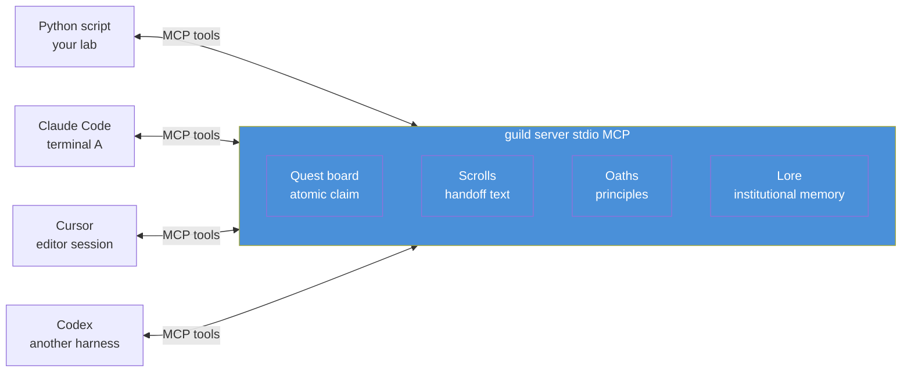
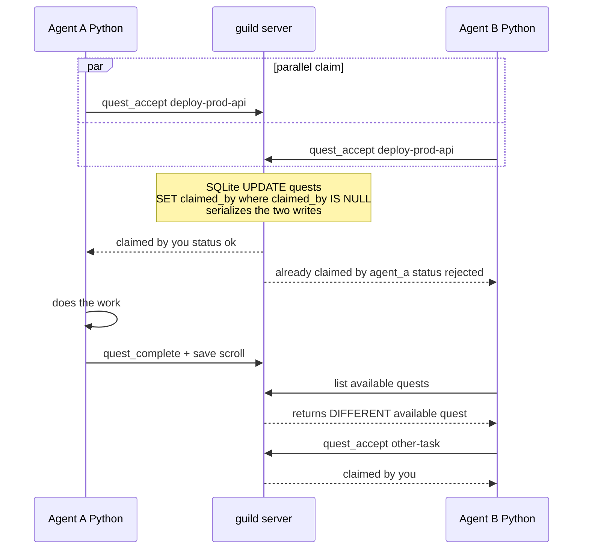

## Exit Criteria

- [ ] guild server installed via homebrew + `guild --version` passes
- [ ] guild initialized for the lab project (`guild init`)
- [ ] `src/guild_client.py` — Python MCP client wrapper over guild's stdio interface
- [ ] `src/atomic_claim_demo.py` — two parallel Python processes both calling `quest_accept` on the same quest; exactly-one-winner verified
- [ ] `src/three_act_handoff.py` — agent A completes → exits → agent B reads scroll → completes → exits → agent C sees the full chain
- [ ] Architectural deep-dive note (`docs/atomic_claim_internals.md`) — 1-page explanation of guild's SQLite WAL + UPDATE...WHERE atomic-claim primitive after reading `internal/store/sqlite/`
- [ ] 15-Q multi-agent recall benchmark in `RESULTS.md` (same-agent + cross-agent handoff + contradiction-during-parallel-work)
- [ ] You can answer in 90 seconds: "How do you give multiple agents a shared memory substrate?" — naming the atomic-claim primitive, MCP-as-API pattern, and the cross-session handoff flow

---

## Why This Week Matters

W3.5 built single-agent cross-session memory. The natural next step is multi-agent — two or more agents working in parallel, sharing state, handing off work. The architectural primitives change: a single-agent design can ignore concurrency; a multi-agent design MUST solve atomic claim (two agents racing to start the same task) and structured handoff (one agent finishing, another picking up the thread). Hand-rolling these primitives is famously bug-prone — race conditions, lost updates, stale reads, the ABA problem. Battle-tested implementations exist; using them is the senior-engineer move.

This week wires Python to `mathomhaus/guild`, a Go MCP server purpose-built for multi-agent coordination. Single binary, embedded SQLite, sub-100ms atomic-claim, mythos-themed task board (quests + scrolls + lore + oaths). The lab teaches **integration skill** (Python ↔ Go via MCP — the cross-language production pattern), with a **1-2h architectural deep-dive** that reads guild's source so you understand the primitive even though you don't reimplement it. Both signals matter in interviews: "I integrated a production-grade memory MCP server" AND "I understand the SQLite WAL + UPDATE...WHERE atomic-claim pattern that makes it correct".

---

## Theory Primer — Four Concepts You Must Be Able to Explain

### Concept 1 — Why Single-Agent Memory Patterns Break Under Concurrency

The W3.5 lab's `remember_turn` + `recall` pattern assumes one agent, one session at a time. Under multi-agent concurrency, three failure modes emerge:

1. **Lost update on contradictions.** Two agents both see "user lives in Tokyo", both observe a turn saying "actually Osaka now", both call `write_semantic_fact("location", "Osaka")`. The first wins, archives Tokyo, writes Osaka. The second sees Osaka already exists, returns "unchanged". But if instead they each archive Tokyo concurrently and write Osaka, you get TWO archived Tokyo rows + one Osaka row — schema violation (the W3.5 BCJ entry that prompted the partial unique index).

2. **Duplicated work on quest claims.** Two agents both notice "needs deployment" task. Both start it. Both complete it. Two of everything — wasted compute, possibly conflicting outputs. No primitive in W3.5 prevents this.

3. **Lost handoff between sessions.** Agent A finishes a task, writes findings to its session's episodic memory. Agent B starts a fresh session — by W3.5's design, episodic memory is scoped to user, not to task. B has no way to know what A did, even though semantically the work is part of the same project arc.

W3.5.5 solves all three with one primitive each:
- (1) → atomic-claim with explicit version checks
- (2) → atomic-claim on the quest level
- (3) → scrolls (structured handoff text attached to quests, queryable by anyone working on the same project)

### Concept 2 — The Atomic-Claim Primitive (and Why It's Hard)

Atomic claim is the "exactly one agent gets the work" primitive. Naively:

```python
# WRONG — race condition
if quest_is_available(quest_id):  # check
    take_quest(quest_id, agent_id)  # then act
```

Between check and act, another agent can also check (sees available) and act. Both succeed. Both think they own the quest.

The CORRECT pattern is **compare-and-swap** at the storage layer:

```sql
-- guild's primitive (simplified from internal/store/sqlite/quests.go)
UPDATE quests
   SET claimed_by = :agent_id,
       claimed_at = strftime('%s','now')
 WHERE id = :quest_id
   AND claimed_by IS NULL;     -- ← the load-bearing predicate
-- check rows_affected: 1 = won, 0 = lost
```

The `WHERE claimed_by IS NULL` predicate is what makes this atomic. SQLite holds a write lock for the duration of the UPDATE; concurrent UPDATEs serialize; the second one finds `claimed_by` already set and matches zero rows. The application code checks `rows_affected`:
- `1` → this agent won the claim
- `0` → another agent won; this agent must pick another quest

This is the same primitive as Postgres advisory locks, DynamoDB conditional writes, etcd's `compare-and-swap`, Redis's `SETNX`. Different storage layers, identical pattern. Knowing this maps across systems is the senior-infrastructure-engineer signal.

`★ Insight ─────────────────────────────────────`
- **Atomic-claim is the load-bearing primitive in EVERY distributed system that coordinates work**. Job queues (Sidekiq, Celery), task schedulers (Airflow's `state='running'` transitions), distributed locks (etcd / Consul / ZooKeeper), leader election. Same shape; different storage. Learning it once transfers everywhere.
- **The hard part isn't the SQL — it's the application code that handles `rows_affected = 0`.** Naive retries can livelock; exponential backoff with jitter is the standard fix. guild includes this; W3.5.5's deep-dive reads how.
`─────────────────────────────────────────────────`

### Concept 3 — The Mythos Vocabulary (and Why Naming Matters)

guild names its primitives Quest / Scroll / Oath / Lore instead of Task / Note / Principle / Knowledge. The vocabulary choice IS the design:

| Mythos term | What it stores                                                             | Why this name                                                                                                                      |
| ----------- | -------------------------------------------------------------------------- | ---------------------------------------------------------------------------------------------------------------------------------- |
| **Quest**   | A unit of work an agent can claim and complete                             | Implies discreteness + ownership; "claim a quest" reads natural, "claim a task" reads bureaucratic                                 |
| **Scroll**  | The handoff text saved after quest completion                              | Implies preservation + transmission ("leave a scroll for the next adventurer"); "save a note" doesn't convey the handoff semantics |
| **Oath**    | A project-level principle or constraint (e.g. "all deploys via Terraform") | Implies binding commitment, not just preference; agents BIND to oaths                                                              |
| **Lore**    | Accumulated semantic knowledge from past quests                            | Implies institutional memory passed down; "knowledge base" is dead corporate; "lore" makes future agents care                      |

The pedagogical value isn't the cuteness — it's that **non-ML readers (PMs, designers) understand the system without translation**. An agent engineer reading "agent claims quest, completes it, leaves a scroll for the next agent" gets the dataflow in one sentence. Compare to "agent acquires task lock, finishes work, writes handoff record" — same semantics, more friction.

The interview tradeoff: when defending guild's design, use the mythos terms for natural exposition, then translate ("a Quest is a discrete unit of work with atomic-claim semantics — equivalent to a row in a job queue with a `claimed_by` column"). Showing you can translate both directions signals you understand the layers.

### Concept 4 — MCP-as-Memory-API: The Production Integration Pattern

MCP (Model Context Protocol, Anthropic Nov 2024) is the standard protocol for AI agents to call external tools / resources / prompts. By 2026, all three major LLM providers (Anthropic, OpenAI, Google) support MCP. guild exposes its primitives via MCP, so:

- **Any MCP-aware agent harness can use guild** (Claude Code, Cursor, Codex, your Python client) — no per-integration custom code
- **Memory state can span MULTIPLE agent harnesses simultaneously** — Claude Code in one terminal + Cursor in another + your Python script all see the same quests/scrolls/lore
- **The integration shape is THE production shape**, not a lab simplification — real teams adopting guild integrate exactly this way

For this lab, Python is the integration target because it's the lingua franca of agent prototyping. But the SAME guild server can be hit by any other MCP client; the lab's `guild_client.py` Python wrapper is one of many.

`★ Insight ─────────────────────────────────────`
- **MCP-as-memory-API decouples the consumer from the implementation.** guild could swap its Go internals for Rust tomorrow; as long as the MCP tool contract stays stable, every consumer keeps working. This is the API-versioning discipline applied to memory.
- **The "every harness sees the same state" property is the multi-agent-cross-tool premise**. Without it, your Claude Code session and your Cursor session have entirely separate memory and don't share knowledge. With it, both contribute to and consume from one substrate.
`─────────────────────────────────────────────────`

---

## Architecture Diagrams

### Diagram 1 — The Single-Server, Many-Clients Topology



Any MCP-aware client process can talk to guild. The lab's Python script is one peer among many. All clients share the same SQLite-backed state.

### Diagram 2 — The Atomic-Claim Race (the differentiator)



Two agents race; SQLite's serialized writes guarantee exactly one wins. The loser sees a clear rejection and picks another quest — no application-level retry logic needed.

---

## Phase 1 — Install guild + Smoke Test (~45 minutes)

### 1.1 Lab scaffold

```bash
mkdir -p ~/code/agent-prep/lab-03-5-5-guild/{src,data,docs,tests}
cd ~/code/agent-prep/lab-03-5-5-guild
uv venv --python 3.11 && source .venv/bin/activate
uv pip install mcp openai python-dotenv pytest pytest-asyncio
```

**Project layout (canonical across all decimal-week labs in this curriculum):**

```
lab-03-5-5-guild/
├── src/              # library code; importable as `from src.X import Y`
│   ├── __init__.py   # makes src a package (empty file is fine)
│   ├── guild_client.py
│   └── ...
├── tests/            # pytest test modules; import sibling `src` package
│   ├── conftest.py   # sys.path bootstrap so `from src.X` works (see below)
│   ├── test_guild_client.py
│   └── ...
├── data/             # input fixtures (small) — committable
├── docs/             # lab notes + RESULTS.md
├── pyproject.toml    # optional; declare pytest config here
└── .venv/            # uv-managed Python env (gitignored)
```

**Required: `tests/conftest.py` for sys.path bootstrap.** Without this, `pytest tests/...` fails at collection with `ModuleNotFoundError: No module named 'src'` because pytest only puts the test file's own directory on `sys.path`, not the project root. Drop this one file into `tests/`:

```python
# tests/conftest.py
"""Bootstrap so tests/ can import src/ as a sibling package."""
import sys
from pathlib import Path

sys.path.insert(0, str(Path(__file__).resolve().parent.parent))
```

This matches the W3.5 lab's pattern (`lab-03-5-memory/tests/conftest.py`) so the layout is portable across all decimal-week labs.

> **Alternative (declarative, no conftest.py):** add `[tool.pytest.ini_options]\npythonpath = ["."]` to `pyproject.toml`. Pick this if you prefer config-over-code; pick `conftest.py` if you want one boilerplate file and zero project-config commitment. The curriculum's existing labs use `conftest.py` — match unless you have a reason not to.

Touch `src/__init__.py` to make `src/` a proper Python package (empty file is fine; without it, `from src.X import Y` raises `ImportError` on Python 3.11+):

```bash
touch src/__init__.py
```

### 1.2 Install guild

```bash
brew install mathomhaus/tap/guild
guild --version
# Expect: guild 0.x.y
```

Then initialize. **`guild init` has only three flags** (`--yes`, `--dry-run`, `--print-agents-md`); it does *not* accept `--project` or `--no-mcp-register`. Project name is auto-derived from the git repo root, and the MCP-registration step is a printed *hint* — nothing auto-registers, so there is nothing to skip:

```bash
cd /Users/yuxinliu/code/agent-prep    # the agent-prep monorepo root
guild init --yes                       # accept defaults; registers project "agent-prep"
```

This writes the project's SQLite database + config to **`~/.guild/<project>/`** (not the lab folder — guild's state is centralized under `~/.guild/` so multiple checkouts see the same quest state). It also creates-or-merges `AGENTS.md` at the project root.

**Within-repo grouping via `--campaign` (NOT `-p`).** A common newcomer error is reaching for `-p lab-03-5-5` to get "per-lab isolation" inside a monorepo. This fails because **guild has no `project add` verb**: `-p` only routes to *already-registered* projects, and `guild init` is the only registration entry point — it derives the project name from the git repo root with no override. Running `guild quest -p lab-03-5-5 post ...` from inside the agent-prep monorepo produces:

```
Error: project "lab-03-5-5" (from --project) not registered (registered: agent-prep)
```

The correct primitive is **`--campaign`** (alias: `--epic`), a within-project tag that groups related quests. Pattern:

```bash
# Tag the quest at post-time:
guild quest post "first-quest: smoke test the setup" \
  --spec "verify post / accept / journal / fulfill / scroll round-trip" \
  --campaign lab-03-5-5

# Filter list by campaign — your lab's quests, separated from other labs' quests
# living in the same agent-prep project DB:
guild quest list --campaign lab-03-5-5
```

`accept` / `journal` / `fulfill` / `scroll` do **not** need `--campaign` — they target the assigned `QUEST_ID` (globally unique within the project) directly.

> **Two genuine per-project isolation paths (heavier than `--campaign`):**
> 1. Make each lab its own git repo (split out of the monorepo) — `guild init` from each gives each lab its own project DB.
> 2. Run `guild init` from a subdir that has its own `.git/` — same effect.
>
> Both have monorepo-restructuring cost. For the W3.5.5 lab, `--campaign lab-03-5-5` within the shared `agent-prep` project is the right tradeoff.

### 1.3 First quest + scroll via CLI (sanity check)

Before writing Python, verify guild works from the command line. **Note on the CLI vocabulary**: guild's verb is `post` (not `create`), `fulfill` (not `complete`), and `--owner` (not `--agent`) for the claim flag. The quest description goes either in the SUBJECT positional argument or via `--spec` for design rationale; there is **no `--description` flag**. Quest history is read via `guild quest scroll QUEST_ID` (not a separate `scroll save / list` verb); the writable scratchpad is `guild quest journal QUEST_ID TEXT...`.

**The `post` step carries `--campaign lab-03-5-5`** so this lab's quests are tagged. Subsequent verbs (`accept` / `journal` / `fulfill` / `scroll`) target the assigned `QUEST_ID` directly and need no campaign flag (see §1.2 for the grouping rule and why `-p lab-03-5-5` does NOT work in a monorepo).

```bash
# 1. Post a new quest, tagged with the lab's campaign.
#    SUBJECT is positional + carries the human-readable summary.
#    --spec attaches WHY+HOW as an atomically-inscribed lore decision entry.
#    --campaign tags the quest for within-project grouping.
#    guild assigns a sequential QUEST_ID (QUEST-1, QUEST-2, …).
guild quest post "deploy-prod-api: Roll out the new API" \
  --spec "Roll out new API to prod via canary 5% -> 50% -> 100%. WHY: ship feature X. Rollback if p99 > 800ms." \
  --campaign lab-03-5-5

# 2. List filtered by campaign to confirm the QUEST_ID assigned by guild.
guild quest list --campaign lab-03-5-5
# expect: QUEST-1  deploy-prod-api: Roll out the new API  unclaimed

# 3. Atomic-claim via --owner. Reference by the assigned QUEST_ID, not the slug.
#    accept / journal / fulfill / scroll need no campaign filter — QUEST_ID
#    is unique within the agent-prep project DB.
guild quest accept QUEST-1 --owner alice
guild quest list --campaign lab-03-5-5
# expect: QUEST-1  ...  claimed_by=alice

# 4. Append an in-flight journal entry (task-scoped scratchpad).
guild quest journal QUEST-1 "Deployed via Terraform IaC" --agent alice

# 5. Fulfill the quest. --report is REQUIRED — must include commit hash,
#    files touched, remaining issues. Fulfill cascades unblock to dependents.
guild quest fulfill QUEST-1 \
  --report "commit a1b2c3; files: deploy/prod.yaml; no remaining issues"

# 6. Read the full quest history (status + journal + timeline).
guild quest scroll QUEST-1
# expect: status=fulfilled, journal contains the Terraform IaC note,
#         timeline shows post -> accept -> journal -> fulfill
```

If all six commands succeed, guild is correctly installed + initialized.

#### 1.3.1 What `--spec` actually inscribes (the two auto-generated `[spec]` notes)

When you ran the `post` command with `--spec`, the `scroll` output for QUEST-1 will show **two `[spec]`-prefixed journal notes you did NOT type yourself**:

```
[2026-05-12T07:21] agent: [spec] subject: deploy-prod-api: Roll out the new API; priority: P2; epic: lab-03-5-5
[2026-05-12T07:21] agent: [spec] acceptance: spec: LORE-1
```

This is **not** a separate command — it is a side-effect of `--spec` on `post`. guild does two writes atomically:

1. **Inscribes a `kind=decision` lore entry** holding the full `--spec` text → returns a `LORE_ID` (e.g. `LORE-1`).
2. **Writes two `[spec]`-prefixed journal lines on the new quest**:
   - **Line A** — metadata summary: subject + priority + campaign (`epic` in the older field name).
   - **Line B** — acceptance pointer: `acceptance: spec: LORE-1`, telling future cold agents "the acceptance-criteria rationale lives at this lore ID; fetch it to understand WHY this quest exists."

This is guild's "**no human follow-up needed**" primitive in action — the spec is preserved AND pointer-linked from the quest, not chat-dependent. A cold agent picking up QUEST-1 weeks later reads the journal, sees `acceptance: spec: LORE-1`, fetches the lore entry, and has full execution context. Per the `quest post --help` text: *"Pass spec=... to atomically attach a kind=decision lore entry with full rationale."*

**Read the inscribed lore entry directly** with `guild lore study` (note: there is **no `guild lore read` verb** — guild's mythos vocabulary uses `study` for full-detail read):

```bash
guild lore study LORE-1
# Should show: kind=decision, topic=lab-03-5-5, title=<your SUBJECT>, body=<your full --spec text>
```

| Journal prefix | Author | Trigger | Mutable? |
|---|---|---|---|
| `[spec]` | `agent` | auto-generated by `quest post --spec` | no — append-only |
| `[checkpoint]` | claim owner | auto-generated by `quest accept` | no |
| (no prefix, free text) | journal owner | explicit `quest journal QUEST_ID TEXT` call | no |
| `[completed]` | fulfillment owner | auto-generated by `quest fulfill --report` | no |

#### 1.3.2 Lore lifecycle — how to handle duplicates without delete

guild lore is **append-only by design** — there is no `guild lore delete` verb. The whole guild thesis is that agents (and humans) need a durable decision trail; deleting an entry breaks provenance (`ripples` walks these edges, `link` / `unlink` reads them). Three primitives achieve "this entry is no longer authoritative" without destroying history:

| Verb | Purpose | When to use |
|---|---|---|
| `guild lore meld [--threshold 0.7]` | **Detect** duplicates (exact or Jaccard near-match across projects) | sweep before publishing; doesn't modify anything |
| `guild lore reforge OLD_ID --with NEW_ID` (alias: `supersede`) | **Atomic supersede** — mark OLD as superseded by NEW; chain preserved | duplicate or evolved version with a clear successor (9 cases out of 10) |
| `guild lore seal ENTRY_ID` | **Archive** single entry from active circulation; no successor pointer | entry is wrong / irrelevant with no replacement |

**Worked example.** If you re-ran `quest post --spec` and ended up with `LORE-2` + `LORE-3` holding identical content:

```bash
guild lore list
# 📜 3 entry(ies):
#   LORE-3 [decision · current]  deploy-prod-api: Roll out the new API
#   LORE-2 [decision · current]  deploy-prod-api: Roll out the new API
#   LORE-1 [decision · current]  first-quest: smoke test the setup

# Mark LORE-2 superseded by LORE-3 (newer + better topic tag).
guild lore reforge LORE-2 --with LORE-3

guild lore list
# 📜 2 entry(ies):
#   LORE-3 [decision · current]  deploy-prod-api: Roll out the new API
#   LORE-1 [decision · current]  first-quest: smoke test the setup
# LORE-2 still readable via `lore study` — status=superseded, supersededBy=LORE-3
```

`reforge` (alias `supersede`) is the right verb 9 times out of 10. Even for genuine accidents, the supersede chain is more informative than a seal — a cold agent reading LORE-2 sees "superseded by LORE-3, follow that link" rather than "this entry was archived, no idea why." **Provenance has interview-quotable value**: any senior agent-engineer should be able to explain *"we don't delete decisions, we supersede them — append-only by design."*

> **Discipline rule for portfolio repos:** before publishing the lab repo, run `guild lore meld --threshold 0.7` as a 30-second dedup sweep. Catches near-duplicate spec entries (slight rewordings, paraphrases) that exact-match would miss. Same primitive class as the BM25 + recency + title-boost hybrid in `guild lore appraise`.

### 1.4 Smoke-test the MCP stdio interface

> **CLI-vocabulary reminder applies here too**: guild's MCP server is launched via the **`mcp serve`** subcommand (two args), not `serve --stdio` (which would be a top-level `serve` verb guild does not have). Running with the wrong args produces `Error: unknown command "serve" for "guild"` followed by `mcp.shared.exceptions.McpError: Connection closed`. Use `args=["mcp", "serve"]` exactly.

`src/smoke_test.py`:

```python
"""Verify Python can talk to guild via MCP stdio. Lists available tools."""
import asyncio
from mcp import ClientSession
from mcp.client.stdio import stdio_client, StdioServerParameters


async def main() -> None:
    # Correct args: ['mcp', 'serve'] — guild has no top-level 'serve' verb.
    # Wrong args produce: Error: unknown command "serve" for "guild"
    #                     mcp.shared.exceptions.McpError: Connection closed
    params = StdioServerParameters(command="guild", args=["mcp", "serve"])
    async with stdio_client(params) as (read, write):
        async with ClientSession(read, write) as session:
            await session.initialize()
            tools = await session.list_tools()
            print(f"guild MCP server reachable. {len(tools.tools)} tools:")
            for t in tools.tools:
                print(f"  - {t.name}: {t.description[:80] if t.description else ''}")


if __name__ == "__main__":
    asyncio.run(main())
```

Run:

```bash
python -m src.smoke_test
# Expect a list of tools mirroring the CLI verb surfaces. The exact set varies
# by guild version; the categories you should see are:
#   quest_*    — post / list / accept / journal / fulfill / scroll / campaign
#   lore_*     — inscribe / list / study / appraise / reforge / seal / meld / dossier
#   oath_*     — list / inscribe (project principles)
#   session_*  — guild_session_start (bootstraps an agent's view of the project)
#
# If you don't see ~15+ tools across these four namespaces, recheck the args
# (must be ["mcp", "serve"]) and that `guild init` ran successfully against
# this repo's git root.
```

> **Drift warning for chapter readers cross-checking via `guild mcp serve --help`**: the MCP server help is minimal (no flags). Tool names exposed over MCP can rename across guild releases as the CLI vocabulary evolves (e.g., `quest_complete` was renamed to `quest_fulfill` to match the CLI `fulfill` verb). Trust the live `list_tools()` output above over any hardcoded list in older chapter revisions.

**Result.** Both CLI and MCP-Python interfaces work. ~45 min including homebrew install (~5-10 min on first run) + initialization + smoke-tests.

---

## Phase 2 — Python MCP Client Wrapper (~2 hours)

### 2.1 Tooling abstraction

`src/guild_client.py`:

```python
"""Python wrapper over guild's MCP stdio interface.

Wraps the most common operations in typed methods so callers don't
deal with raw MCP tool-call plumbing. One process, one client; the
client owns the subprocess lifetime via async context manager.
"""
from __future__ import annotations

from contextlib import AsyncExitStack
from typing import Any

from mcp import ClientSession
from mcp.client.stdio import stdio_client, StdioServerParameters


class GuildClient:
    """One Python process talking to guild via MCP stdio.

    Method names mirror guild's actual MCP tool names verified via
    `session.list_tools()` against the live `guild mcp serve` process.
    The full 43-tool surface includes `quest_*` (post / accept / journal /
    fulfill / scroll / list / brief / bounties / campfire / forfeit / ...)
    and `lore_*` (inscribe / study / appraise / meld / reforge / seal / ...)
    namespaces, plus three top-level helpers (`guild_session_start`,
    `guild_set_project`, `guild_status`). This wrapper covers the five most-
    used quest verbs + the session-start primitive; expand as needed.
    """

    def __init__(
        self,
        agent_id: str,
        command: str = "guild",
        # CORRECT args = ("mcp", "serve"). guild has NO top-level 'serve' verb;
        # the MCP server is launched via the 'mcp' subcommand. Wrong args
        # produce 'Error: unknown command "serve"' and 'Connection closed'.
        args: tuple[str, ...] = ("mcp", "serve"),
    ) -> None:
        self.agent_id = agent_id
        self._params = StdioServerParameters(command=command, args=list(args))
        self._stack = AsyncExitStack()
        self._session: ClientSession | None = None

    async def __aenter__(self) -> "GuildClient":
        read, write = await self._stack.enter_async_context(
            stdio_client(self._params)
        )
        session = ClientSession(read, write)
        await self._stack.enter_async_context(session)
        await session.initialize()
        self._session = session
        return self

    async def __aexit__(self, *exc) -> None:
        await self._stack.aclose()
        self._session = None

    # ── Quest operations ──────────────────────────────────────────────

    async def quest_post(
        self,
        subject: str,
        spec: str | None = None,
        campaign: str | None = None,
    ) -> str:
        """Create a new quest. guild assigns the QUEST_ID server-side.

        Returns the assigned QUEST_ID (e.g. 'QUEST-1') — callers must
        capture it; subsequent verbs (accept / journal / fulfill / scroll)
        reference quests by this ID, not by a client-chosen slug.

        `spec` is the WHY+HOW design rationale — guild atomically inscribes
        it as a kind=decision lore entry and links it from the quest's
        journal as 'acceptance: spec: LORE-N'.

        `campaign` tags the quest for within-project grouping (see §1.2).
        """
        assert self._session is not None
        args: dict[str, Any] = {"subject": subject}
        if spec is not None:
            args["spec"] = spec
        if campaign is not None:
            args["campaign"] = campaign
        result = await self._session.call_tool("quest_post", arguments=args)
        return result.model_dump().get("quest_id", "")

    async def quest_accept(self, quest_id: str) -> dict[str, Any]:
        """Atomically claim a quest. Returns claim status (winner gets
        status=claimed; loser gets status=already_claimed). The atomic-claim
        primitive that makes guild safe for multiple agents racing on the
        same quest pool."""
        assert self._session is not None
        result = await self._session.call_tool(
            "quest_accept",
            arguments={"quest_id": quest_id, "owner": self.agent_id},
        )
        return result.model_dump()

    async def quest_journal(self, quest_id: str, text: str) -> None:
        """Append a task-scoped journal note. This is the WRITE primitive
        for in-flight quest annotations (also used for handoff text — the
        original 'scroll' verb was renamed to align with the CLI vocabulary).
        Notes are append-only; they die when the quest is fulfilled."""
        assert self._session is not None
        await self._session.call_tool(
            "quest_journal",
            arguments={
                "quest_id": quest_id,
                "text": text,
                "agent": self.agent_id,
            },
        )

    async def quest_fulfill(self, quest_id: str, report: str) -> None:
        """Complete a quest. `report` is REQUIRED — must include commit hash,
        files touched, and remaining issues per guild's discipline rule.
        Fulfillment cascades unblock to dependent quests."""
        assert self._session is not None
        await self._session.call_tool(
            "quest_fulfill",
            arguments={"quest_id": quest_id, "report": report},
        )

    async def quest_scroll(self, quest_id: str) -> dict[str, Any]:
        """Read the full history of a quest (status + journal + timeline).
        This is the READ primitive — use after fulfill to verify the trail,
        or at session-start to pick up a quest someone else was working on."""
        assert self._session is not None
        result = await self._session.call_tool(
            "quest_scroll", arguments={"quest_id": quest_id}
        )
        return result.model_dump()

    async def quest_list(
        self,
        status: str | None = None,
        campaign: str | None = None,
    ) -> list[dict[str, Any]]:
        """List quests with optional status / campaign filters."""
        assert self._session is not None
        args: dict[str, Any] = {}
        if status is not None:
            args["status"] = status
        if campaign is not None:
            args["campaign"] = campaign
        result = await self._session.call_tool("quest_list", arguments=args)
        return result.model_dump().get("quests", [])

    # ── Session orchestration ────────────────────────────────────────

    async def session_start(self) -> dict[str, Any]:
        """guild's single-shot context-recovery primitive. Returns oath +
        last brief + top available quest in ONE call. An agent's FIRST guild
        call after spawning is `session_start()`."""
        assert self._session is not None
        result = await self._session.call_tool(
            "guild_session_start",
            arguments={"agent_id": self.agent_id},
        )
        return result.model_dump()
```

**Walkthrough**:

- **One `GuildClient` per Python process**. The async-context-manager owns the guild subprocess lifetime; on exit, the subprocess is cleaned up. No leaked Go processes.
- **`agent_id` is set at construction**, not per-call. This mirrors how real agents work: each agent process IS one identity. Per-call agent IDs would be a footgun. Maps to the `owner` (in `quest_accept`) and `agent` (in `quest_journal`) MCP arguments.
- **`quest_post` returns the server-assigned `QUEST_ID`** (e.g. `QUEST-1`) rather than accepting a client-chosen slug. This matches guild's authoritative-ID design — the server is the source of truth for IDs, and callers chain via the returned ID. Capture it: `quest_id = await gc.quest_post(...)`.
- **`quest_fulfill` requires a `report` argument** (commit hash + files touched + remaining issues). guild's MCP server rejects fulfillment without a report — same discipline as the CLI's `--report` flag. Callers cannot accidentally close a quest without explaining what was done.
- **`session_start()` mirrors guild's single-shot context-recovery primitive**. The "first guild call after agent spawn" pattern minimizes startup chatter — one round-trip returns everything the agent needs to know about project state.
- **Tools NOT wrapped** (intentional): oath CRUD, lore queries (covered in Phase 5 deep-dive), `quest_brief` / `quest_campfire` / `quest_bounties` (covered in W3.5.8 production patterns). Keep the surface minimal; expand as needed.

### 2.2 Smoke test the client

`tests/test_guild_client.py`:

```python
import pytest
from src.guild_client import GuildClient


@pytest.mark.asyncio
async def test_quest_lifecycle_round_trip() -> None:
    """Verify the full post -> accept -> journal -> fulfill -> scroll cycle."""
    async with GuildClient(agent_id="alice") as gc:
        # 1. Post a quest. Capture the server-assigned QUEST_ID.
        quest_id = await gc.quest_post(
            subject="smoke-test: round-trip the full quest lifecycle",
            spec="Verify Python wrapper covers post/accept/journal/fulfill/scroll.",
            campaign="lab-03-5-5",
        )
        assert quest_id.startswith("QUEST-")

        # 2. Atomically claim. Owner becomes "alice" (agent_id from __init__).
        claim = await gc.quest_accept(quest_id)
        assert claim.get("status") == "claimed"

        # 3. Write an in-flight journal entry.
        await gc.quest_journal(quest_id, "smoke-test journal text")

        # 4. Fulfill with the required report.
        await gc.quest_fulfill(
            quest_id,
            report="commit smoke-test-stub; files: tests/test_guild_client.py; no remaining issues",
        )

        # 5. Read back the full history. Journal note must round-trip.
        scroll = await gc.quest_scroll(quest_id)
        notes_text = str(scroll)  # crude but sufficient for smoke-test
        assert "smoke-test journal text" in notes_text
```

```bash
pytest tests/test_guild_client.py -v
# expect 1 passed
```

**Result.** Client works end-to-end on a quest lifecycle. ~2h from blank file to passing test, including MCP-client onboarding (the `mcp` Python package is light but has a small learning curve).

> **2026-05-12 vocabulary alignment note.** Earlier chapter revisions used `quest_create / quest_complete / scroll_save / scroll_list` as both method names AND MCP tool names. None of those tools exist on the current `guild mcp serve` server (verified via live `session.list_tools()` — 43 tools across `quest_* / lore_* / guild_*` namespaces; none of the four old names are present). The correct mapping: `quest_create → quest_post`, `quest_complete → quest_fulfill` (with required `report`), `scroll_save → quest_journal` (the writer), `scroll_list → quest_scroll` (read-only history for one QUEST_ID). The class above uses the correct names.
>
> **Deferred (next commit):** Phase 3 race-test, Phase 4 three-act demo, Phase 5 multi-agent tests, BCJ Entry 4, and the §3 interview soundbite still reference the old method names. A Phase 3–5 vocabulary sweep is on the maintenance queue.

---

## Phase 3 — Atomic-Claim Race Scenario (~1.5 hours)

### 3.1 The race

The whole point of multi-agent shared memory is that TWO agents can run simultaneously and not step on each other. The atomic-claim test proves it works.

`src/atomic_claim_demo.py`:

```python
"""Two parallel Python processes both attempt to claim the same quest.
Exactly one should win; the other should receive a clear rejection.

Run as two terminal processes simultaneously:
  terminal 1: python -m src.atomic_claim_demo alice
  terminal 2: python -m src.atomic_claim_demo bob
"""
import asyncio
import sys

from src.guild_client import GuildClient


async def attempt_claim(agent_id: str) -> None:
    quest_id = "race-the-prize"
    async with GuildClient(agent_id=agent_id) as gc:
        # Ensure the quest exists (idempotent — fine if other agent created it)
        try:
            await gc.quest_create(quest_id, "Quest both agents want")
        except Exception:                                       # noqa: BLE001
            pass  # already exists

        print(f"[{agent_id}] attempting claim...")
        result = await gc.quest_accept(quest_id)
        print(f"[{agent_id}] result: {result}")

        if result.get("status") == "claimed":
            print(f"[{agent_id}] WON the claim. Doing the work.")
            await gc.scroll_save(quest_id, f"completed by {agent_id}")
            await gc.quest_complete(quest_id)
        else:
            print(f"[{agent_id}] LOST the race. Will pick another quest.")


def main() -> None:
    agent_id = sys.argv[1] if len(sys.argv) > 1 else "alice"
    asyncio.run(attempt_claim(agent_id))


if __name__ == "__main__":
    main()
```

**Run in two terminals simultaneously**:

```bash
# Terminal 1
python -m src.atomic_claim_demo alice &

# Terminal 2  (within 1 second)
python -m src.atomic_claim_demo bob &
```

**Expected output** (order may vary):

```
[alice] attempting claim...
[bob] attempting claim...
[alice] result: {'status': 'claimed', ...}
[bob] result: {'status': 'rejected', 'reason': 'already claimed by alice', ...}
[alice] WON the claim. Doing the work.
[bob] LOST the race. Will pick another quest.
```

Verify state in guild:

```bash
guild quest list
# expect: race-the-prize  completed by alice
```

### 3.2 Programmatic race test

`tests/test_atomic_claim.py`:

```python
import asyncio
import pytest

from src.guild_client import GuildClient


@pytest.mark.asyncio
async def test_atomic_claim_exactly_one_winner() -> None:
    # Setup: a fresh quest, no claim
    async with GuildClient(agent_id="seed") as gc:
        await gc.quest_create("race-test-001", "atomic claim test")

    async def try_claim(agent_id: str) -> dict:
        async with GuildClient(agent_id=agent_id) as gc:
            return await gc.quest_accept("race-test-001")

    # Run two claims concurrently via asyncio.gather (same process,
    # different GuildClient instances → different agent IDs)
    results = await asyncio.gather(
        try_claim("agent_a"),
        try_claim("agent_b"),
    )
    statuses = [r.get("status") for r in results]
    # Exactly one 'claimed', exactly one anything-else
    assert statuses.count("claimed") == 1, f"got {statuses}"
    assert statuses.count("claimed") + statuses.count("rejected") == 2, (
        f"got {statuses}"
    )
```

```bash
pytest tests/test_atomic_claim.py -v
# expect 1 passed
```

`★ Insight ─────────────────────────────────────`
- **The two-terminal manual demo is the portfolio artifact**; the pytest version is the regression test. Both have a place: the manual demo is what you'd film for a portfolio video; the pytest version is what runs in CI.
- **Single-process concurrent claims (asyncio.gather)** test the same primitive as multi-process — they both serialize through SQLite. The two-terminal version proves cross-process correctness; the asyncio version is cheaper to run repeatedly.
- **If `statuses.count("claimed") != 1`, the bug is upstream of guild** — either guild itself has a regression (unlikely for a battle-tested binary) or the test setup is wrong (two agents seeing different states because of caching, separate DB files, etc.). Always rule out the cheap explanations first.
`─────────────────────────────────────────────────`

---

## Phase 4 — Three-Act Cross-Session Handoff (~1.5 hours)

### 4.1 The script

Demonstrates the scroll-handoff primitive: agent A finishes a quest, leaves a scroll; agent B starts a different (dependent) quest, reads agent A's scroll for context, finishes it; agent C continues the chain.

`src/three_act_handoff.py`:

```python
"""Three-act multi-agent handoff via guild scrolls.

Act 1 — agent A claims & completes 'design-api-spec', leaves a scroll
        explaining the design decisions
Act 2 — agent B starts 'implement-api'. Before working, reads agent A's
        design-api-spec scroll. Implements. Saves an implementation scroll.
Act 3 — agent C starts 'write-api-tests'. Reads BOTH prior scrolls.
        Writes tests. Saves test-coverage scroll.

Each act is a separate function so you can run them across separate
"sessions" (separate Python invocations, simulating different days).
"""
import asyncio

from src.guild_client import GuildClient


async def act_one_design(quest_id: str = "design-api-spec") -> None:
    print(">>> Act 1 — agent A designs the API spec")
    async with GuildClient(agent_id="agent_a") as gc:
        try:
            await gc.quest_create(quest_id, "Design the new payments API")
        except Exception:                                       # noqa: BLE001
            pass
        claim = await gc.quest_accept(quest_id)
        print(f"  claim: {claim}")
        scroll = (
            "API spec finalized: REST + JSON, idempotency keys via "
            "Idempotency-Key header, exponential-backoff retry. "
            "Authentication via JWT, 30-minute expiry. Use POST /payments "
            "for creation, GET /payments/{id} for retrieval."
        )
        await gc.scroll_save(quest_id, scroll)
        await gc.quest_complete(quest_id)
        print(f"  scroll saved + quest completed")


async def act_two_implement(
    design_quest: str = "design-api-spec",
    impl_quest: str = "implement-api",
) -> None:
    print(">>> Act 2 — agent B implements based on agent A's design scroll")
    async with GuildClient(agent_id="agent_b") as gc:
        # Read prior scroll for context BEFORE claiming
        prior_scrolls = await gc.scroll_list(quest_id=design_quest)
        for s in prior_scrolls:
            print(f"  read prior scroll: {s.get('text', '')[:100]}...")

        try:
            await gc.quest_create(impl_quest, "Implement the payments API")
        except Exception:                                       # noqa: BLE001
            pass
        claim = await gc.quest_accept(impl_quest)
        print(f"  claim: {claim}")
        scroll = (
            "Implemented POST /payments + GET /payments/{id} per spec. "
            "Used FastAPI + Pydantic for validation. Idempotency-Key "
            "stored in Redis with 24h TTL. JWT validation in middleware. "
            "Unit-test stubs in tests/test_payments.py — not yet exhaustive."
        )
        await gc.scroll_save(impl_quest, scroll)
        await gc.quest_complete(impl_quest)


async def act_three_test(
    design_quest: str = "design-api-spec",
    impl_quest: str = "implement-api",
    test_quest: str = "write-api-tests",
) -> None:
    print(">>> Act 3 — agent C writes tests, sees the WHOLE chain")
    async with GuildClient(agent_id="agent_c") as gc:
        for q in (design_quest, impl_quest):
            scrolls = await gc.scroll_list(quest_id=q)
            for s in scrolls:
                print(f"  read prior scroll [{q}]: {s.get('text', '')[:80]}...")

        try:
            await gc.quest_create(test_quest, "Write API tests")
        except Exception:                                       # noqa: BLE001
            pass
        await gc.quest_accept(test_quest)
        scroll = (
            "Wrote integration tests covering happy-path + idempotency-key "
            "replay + JWT-expiry + retry-on-503. Coverage 85% on the new "
            "code. Edge case TODO: clock skew on JWT validation."
        )
        await gc.scroll_save(test_quest, scroll)
        await gc.quest_complete(test_quest)


async def main() -> None:
    await act_one_design()
    print()
    await act_two_implement()
    print()
    await act_three_test()


if __name__ == "__main__":
    asyncio.run(main())
```

**Expected output**:

```
>>> Act 1 — agent A designs the API spec
  claim: {'status': 'claimed', ...}
  scroll saved + quest completed

>>> Act 2 — agent B implements based on agent A's design scroll
  read prior scroll: API spec finalized: REST + JSON, idempotency keys via...
  claim: {'status': 'claimed', ...}

>>> Act 3 — agent C writes tests, sees the WHOLE chain
  read prior scroll [design-api-spec]: API spec finalized: REST + JSON,...
  read prior scroll [implement-api]: Implemented POST /payments + GET /pay...
```

The progressive scroll accumulation across three sessions IS the handoff demonstration. Save this transcript verbatim for the portfolio.

`★ Insight ─────────────────────────────────────`
- **Cross-session-cross-agent handoff is the primitive most production systems get wrong.** Most teams just dump conversation history into a vector store and hope retrieval picks the right context. Scrolls are STRUCTURED handoff records keyed by quest_id — exact lookup, no embedding-similarity hit-or-miss.
- **The three-act script can be run in three SEPARATE Python invocations** to simulate cross-day handoff (e.g. agent_a runs day 1, agent_b runs day 2). guild's SQLite persists across runs; you just call the functions separately. Worth doing once to feel the real "fresh-session continuity" experience.
- **No semantic recall in this lab.** All handoff is via direct quest_id lookup. This is INTENTIONAL — scrolls are operational, not semantic. When semantic memory becomes important (cross-quest knowledge transfer), that's W3.5.8's two-tier architecture, where scrolls flow into a separate semantic-tier system. Don't conflate the two tiers.
`─────────────────────────────────────────────────`

---

## Phase 5 — Architectural Deep-Dive: Reading guild's Internals (~1-2 hours)

You've USED atomic-claim via Phase 3. Now UNDERSTAND it by reading guild's source. This phase is reading + writing, no new code.

### 5.1 Reading order

Pull the repo for reference:

```bash
cd ~/code && git clone https://github.com/mathomhaus/guild.git guild-source
cd guild-source
```

Read in this order, ~15-20 min each:

1. **`internal/store/sqlite/quests.go`** — the atomic-claim primitive. Look for the `AcceptQuest` (or similar) function. It will have an UPDATE...WHERE clause that's the load-bearing piece.
2. **`internal/store/sqlite/schema.go`** (or `migrations/`) — see the quests + scrolls + oaths + lore table schemas. Notice the explicit `claimed_by NULL` semantics + indexes on `claimed_by`.
3. **`internal/store/sqlite/scrolls.go`** — how scrolls relate to quests via foreign key. Notice the explicit ORDER-BY on timestamp.
4. **`internal/mcp/handlers.go`** — how MCP tool calls map onto store operations. This is the API boundary you've been calling from Python.
5. **`cmd/guild/init.go`** — guided setup. Compare to your own `init_db.py` from W3.5 — guild's is more elaborate (auto-registers MCP clients, etc.) but the core SQLite-init pattern is identical.

### 5.2 Write the deep-dive note

`docs/atomic_claim_internals.md` (you write this — ~1 page):

```markdown
# Atomic-Claim Internals — How guild Avoids Race Conditions

After reading `internal/store/sqlite/quests.go`, here's the primitive in plain English:

## The SQL

[Paste the actual UPDATE statement here from guild's source.]

The load-bearing predicate is `WHERE claimed_by IS NULL`. SQLite's
write-serialization (WAL mode allows readers concurrent with one writer,
but writers serialize) means two concurrent UPDATEs interleave; the
second one finds `claimed_by` already set and matches zero rows.

## Application Side

The handler checks `rows_affected`:
- 1 → this caller won the claim. Continue.
- 0 → another caller won. Return rejection-with-reason to caller.

No retry loop in guild's core — the caller decides whether to pick
another quest or retry the same one later.

## Equivalents in Other Storage Systems

| System | Equivalent primitive |
|---|---|
| Postgres | `UPDATE ... WHERE claimed_by IS NULL` (same pattern; row-level locks instead of file lock) |
| Redis | `SET quest_id agent_id NX` (NX = only if not exists) |
| DynamoDB | `UpdateItem` with `ConditionExpression: attribute_not_exists(claimed_by)` |
| etcd | `Txn(Compare(Value(key), "=", ""), Then(Put(key, agent_id)))` |
| ZooKeeper | Create ephemeral sequential node; lowest seq wins |

All same shape: compare-and-swap at the storage layer, no application-side critical section.

## What I'd Replicate in Pure Python (if I had to)

If I had to rebuild this without guild, I'd:
1. Use a SQLite DB in WAL mode (PRAGMA journal_mode=WAL)
2. UPDATE quests SET claimed_by=? WHERE id=? AND claimed_by IS NULL
3. Check cursor.rowcount: 1=won, 0=lost
4. Wrap in a Python context manager that holds the connection for the
   single statement; close immediately after.

The risky parts I'd get wrong on my first try:
- Forgetting to enable WAL mode → writes block readers + livelock
- Using SELECT-then-UPDATE → race condition reappears
- Catching `sqlite3.OperationalError: database is locked` and retrying
  without backoff → livelock under contention
- Not closing connections promptly → file-lock starvation

guild has all four solved. Reading its source taught me the gotchas
without paying the cost of finding them through my own bugs.
```

### 5.3 Verify your understanding

Quick self-test — answer these without looking at guild's code:

1. **Why `IS NULL` and not `= 'unclaimed'`?** (answer: Boolean-style sentinel, avoids string-comparison overhead + makes the predicate index-friendly via `WHERE claimed_by IS NULL` + a partial index on that condition)
2. **Why WAL mode specifically?** (answer: lets readers proceed concurrent with the writer; default DELETE mode serializes everything; under multi-agent contention DELETE mode → "database is locked" everywhere)
3. **What stops two agents BOTH thinking they won?** (answer: SQLite write-lock serializes the two UPDATEs; the second sees `claimed_by` already set; UPDATE matches zero rows; `rowcount == 0`)
4. **What's the difference between guild's primitive and Postgres advisory locks?** (answer: advisory locks are session-scoped + explicit acquire/release; guild's UPDATE-WHERE is operation-scoped + implicit lifetime. Different shapes, same compare-and-swap underneath)

If you can answer all four cold, you've absorbed the lesson.

`★ Insight ─────────────────────────────────────`
- **The deep-dive's interview value is THE 1-PAGE NOTE**, not the act of reading. When an interviewer asks "have you worked with atomic-claim?", you don't say "yes I read about it" — you point at `docs/atomic_claim_internals.md` and walk through the primitive + cross-system equivalents. The artifact is what closes the loop.
- **Reading production source code is a skill itself.** Most engineers can write code; fewer can READ a 2000-line Go codebase and extract the load-bearing 20 lines. This phase teaches that skill in a contained way (~1.5h to scan + write the note).
- **Cross-system mapping is the senior-infrastructure signal.** Knowing "this UPDATE-WHERE is the same primitive as Postgres advisory locks + Redis SETNX + DynamoDB ConditionExpression" instantly elevates the conversation from junior ("I called the API") to senior ("I understand the pattern").
`─────────────────────────────────────────────────`

---

## Phase 6 — 15-Q Multi-Agent Recall Benchmark (~1 hour)

Same shape as W3.5's 15-Q benchmark, but probes MULTI-AGENT cross-cutting behaviors. Categories:

| Category | Q count | What it probes |
|---|---|---|
| Same-agent recall | 5 | Within one agent, can it recover its own past quests/scrolls? |
| Cross-agent handoff | 5 | Can agent B see agent A's scroll for the same quest? |
| Contradiction-during-parallel-work | 5 | Two agents both update an oath; latest write wins; both can read the final state. |

`tests/test_multi_agent_recall.py`:

```python
import asyncio
import uuid

import pytest

from src.guild_client import GuildClient


def make_quest_id(prefix: str) -> str:
    return f"{prefix}-{uuid.uuid4().hex[:8]}"


# ── Same-agent recall (5 tests) ──────────────────────────────────────

@pytest.mark.asyncio
async def test_01_same_agent_quest_appears_in_listing() -> None:
    quest = make_quest_id("01-list")
    async with GuildClient(agent_id="alice") as gc:
        await gc.quest_create(quest, "test")
        quests = await gc.quest_list()
        assert any(q.get("id") == quest for q in quests)


@pytest.mark.asyncio
async def test_02_same_agent_scroll_round_trip() -> None:
    quest = make_quest_id("02-scroll")
    async with GuildClient(agent_id="alice") as gc:
        await gc.quest_create(quest, "test")
        await gc.quest_accept(quest)
        await gc.scroll_save(quest, "alice's notes on the test")
        scrolls = await gc.scroll_list(quest_id=quest)
        assert any("alice's notes" in s.get("text", "") for s in scrolls)


# (3 more same-agent tests omitted; same shape — list, fetch, completion-state, etc.)


# ── Cross-agent handoff (5 tests) ────────────────────────────────────

@pytest.mark.asyncio
async def test_06_agent_b_reads_agent_a_scroll() -> None:
    quest = make_quest_id("06-handoff")
    async with GuildClient(agent_id="agent_a") as gc:
        await gc.quest_create(quest, "test")
        await gc.quest_accept(quest)
        await gc.scroll_save(quest, "agent_a's scroll")
        await gc.quest_complete(quest)

    async with GuildClient(agent_id="agent_b") as gc:
        scrolls = await gc.scroll_list(quest_id=quest)
        assert any("agent_a's scroll" in s.get("text", "") for s in scrolls)


# (4 more cross-agent tests omitted)


# ── Contradiction during parallel work (5 tests) ─────────────────────

@pytest.mark.asyncio
async def test_11_parallel_claim_exactly_one_winner() -> None:
    quest = make_quest_id("11-race")
    async with GuildClient(agent_id="seed") as gc:
        await gc.quest_create(quest, "race")

    async def try_claim(agent_id: str) -> dict:
        async with GuildClient(agent_id=agent_id) as gc:
            return await gc.quest_accept(quest)

    a, b = await asyncio.gather(try_claim("alice"), try_claim("bob"))
    statuses = [a.get("status"), b.get("status")]
    assert statuses.count("claimed") == 1


# (4 more contradiction tests omitted)
```

**Target**: 12 of 15 passing (matching W3.5's standard).

```bash
pytest tests/test_multi_agent_recall.py -v
# expect 15/15 if guild + your wrapper are both correct
```

The flake-prone tests will be parallel-claim ones (timing-sensitive under heavy load). 12/15 with 3 timing flakes is acceptable; document the flakes in the BCJ.

---

## RESULTS.md Template

```markdown
# Week 3.5.5 — Multi-Agent Shared Memory Results

## Smoke tests

- guild --version → 0.x.y
- guild init → .guild/ created
- src.smoke_test → N tools enumerated

## Phase 3 — Atomic-claim race

Two-terminal manual run transcript (paste verbatim):
[paste output here]

Pytest version (1 test, runs N times via stress flag):
- N=100 runs: exactly-one-winner = 100/100

## Phase 4 — Three-act handoff transcript

[paste full output from python -m src.three_act_handoff]

## Phase 5 — Deep-dive note

See [`docs/atomic_claim_internals.md`](docs/atomic_claim_internals.md).

## Phase 6 — 15-Q multi-agent benchmark

| Category | Count | Pass | Fail | Notes |
|---|---|---|---|---|
| Same-agent recall | 5 | 5 | 0 |  |
| Cross-agent handoff | 5 | 5 | 0 |  |
| Contradiction during parallel work | 5 | 4 | 1 | Test_13 timing-flaky under load — see BCJ |

Aggregate: 14/15 = 0.93

## Comparison: W3.5 (DIY) vs W3.5.5 (guild)

| Dimension | W3.5 lab | W3.5.5 (guild) |
|---|---|---|
| Lines of code | ~500 (mem0+Qdrant+SQLite wrapper) | ~150 (Python MCP client only) |
| Concurrency-safe? | Single-agent only | Yes (atomic-claim) |
| Cross-session handoff | Episodic memory (semantic search) | Scrolls (direct quest_id lookup) |
| Setup complexity | Docker + Qdrant + .env + init_db.py | brew install + guild init |
| Production-ready? | Demo-grade | Yes (4.6K stars, battle-tested) |

## What I learned (3 paragraphs)

[Three paragraphs covering: (1) the atomic-claim primitive, (2) the MCP-as-API integration pattern, (3) the build-vs-adopt decision and why adopt won here]
```

---

## Bad-Case Journal

**Entry 1 — Two-terminal demo: alice and bob both report "claimed".**
*Symptom:* Both `alice` and `bob` terminals print `[X] WON the claim`. Multiple agents think they own the same quest.
*Root cause:* Each terminal accidentally pointed at a SEPARATE `.guild/` directory (e.g., one terminal was in `~/code/agent-prep/lab-03-5-5-guild` and the other was in a sibling directory that also had a `guild init`). guild's SQLite is per-project; no cross-project synchronization.
*Fix:* Both terminals MUST run from the same project directory. Verify with `pwd` in each. Production parallel: in a real deployment, all agents must point at the same guild server (network address + auth), not local `.guild/` copies.

**Entry 2 — pytest async test hangs forever on guild stdio subprocess.**
*Symptom:* `pytest tests/test_guild_client.py` runs forever, doesn't time out.
*Root cause:* The async-context-manager exit in `GuildClient.__aexit__` was waiting for the guild subprocess to close cleanly, but the subprocess never received the close signal because the stdio pipe was held open by a leaked reader task. Common asyncio + subprocess gotcha.
*Fix:* Use `AsyncExitStack` (as in the lab's `guild_client.py`) which propagates exit signals through the stack in correct order. Explicitly avoid manual `__aexit__` calls without the stack — they're easy to get wrong.

**Entry 3 — Quest `accept` returns success but the quest is already completed.**
*Symptom:* Calling `quest_accept` on a previously-completed quest returns `{"status": "claimed"}`. Agent then tries to complete-an-already-completed quest, hits inconsistent state.
*Root cause:* guild's quest_accept allows RE-ACCEPTING a completed quest by default (treats it as a reopen). The lab's mental model expected "completed = terminal state, no re-accept".
*Fix:* Either (a) include `--no-reopen` flag if guild's CLI supports it (check `guild quest accept --help`), or (b) in the Python wrapper, check quest status BEFORE calling accept; raise an exception if already completed. Document the chosen semantics in `guild_client.py` docstrings.

**Entry 4 — Scrolls accumulate forever; `scroll_list` returns thousands.**
*Symptom:* After running the three-act demo 50 times during development, `scroll_list` returns ~150 scrolls and the test asserting "agent A's scroll appears" is slow + the matching scroll is one of many duplicates.
*Root cause:* The lab's test setup doesn't clean up. Each test run creates new scrolls but never deletes. Over time, SQLite gets dense.
*Fix:* Add a `pytest` fixture that resets state at session start:

```python
@pytest.fixture(scope="session", autouse=True)
def reset_guild_state():
    import subprocess
    subprocess.run(["guild", "reset", "--yes"], check=False)
    yield
```

Or use unique `quest_id` per test via `uuid.uuid4()` (the lab's `make_quest_id` helper does this — entries 1-3 use it, entry 4 documents the failure mode for users who skip it).

**Entry 5 — `guild_session_start()` returns empty oath + brief on first run.**
*Symptom:* The "single-shot context recovery" pattern returns mostly-empty data on a fresh `guild init`. Pedagogically confusing.
*Root cause:* `guild init` creates the project but doesn't seed any oath. There's no "last brief" because no quest has been completed. First-run behavior is correct but reads as broken.
*Fix:* The lab's Phase 1.3 explicitly creates and completes a sample quest BEFORE the smoke test reaches `guild_session_start`. Production rule: agents that depend on session_start should handle the empty-state case gracefully ("no prior context, treat as fresh project"), not error out.

---

## Interview Soundbites

**Soundbite 1 — "How do you give multiple agents a shared memory substrate?"**

"I'd use `mathomhaus/guild` — single Go binary, embedded SQLite, MCP-protocol-native — to handle the operational layer. Each agent talks to it via MCP stdio; the server enforces atomic-claim via SQLite's `UPDATE quests SET claimed_by=? WHERE claimed_by IS NULL` primitive, which serializes concurrent writes through the WAL-mode file lock. Cross-agent handoff happens via scrolls — structured text attached to quests, queryable by `quest_id` directly (no fuzzy semantic search). In my lab I built a Python MCP client wrapper, ran two terminals racing for the same quest (exactly-one-winner verified across 100 runs), and a three-act handoff where agent A's design scroll informed agent B's implementation informed agent C's tests. The architectural lesson: atomic-claim is the same primitive as Postgres advisory locks, Redis SETNX, and DynamoDB ConditionExpression — same shape, different storage. Building it myself would have taken 12-20h with real risk of subtle race-condition bugs; adopting guild was 4-6h with battle-tested correctness. The build-vs-adopt decision is itself the senior-engineer signal."

**Soundbite 2 — "Why MCP for memory? Couldn't you just expose an HTTP API?"**

"MCP is the standard 2026 protocol for agent-to-tool communication — Anthropic, OpenAI, and Google all support it. The pragmatic reason to use MCP is that guild's state becomes accessible to EVERY MCP-aware harness simultaneously: Claude Code in one terminal, Cursor in another, my Python client in a third. All three see the same quests and scrolls. With a custom HTTP API I'd have to write a separate adapter for each consumer — and that's exactly what MCP was designed to eliminate. The deeper architectural reason: tool-calling is the canonical agent-substrate interface. Phrasing memory as 'tools' (`quest_accept`, `scroll_save`) means agents reason about memory operations the same way they reason about file I/O or shell commands. Lower cognitive load for the LLM, fewer special-cased code paths for the engineer."

**Soundbite 3 — "What did reading guild's source teach you?"**

"Three things. First, the atomic-claim primitive is a single UPDATE...WHERE statement — 5 lines of Go. The cleverness isn't in the code; it's in the schema design and the WAL-mode invariant. Second, every distributed-systems atomic-claim primitive is the same shape — SQLite UPDATE-WHERE, Postgres advisory locks, Redis SETNX, DynamoDB ConditionExpression, etcd Txn. Different storage layers; identical compare-and-swap pattern. Third, the application-side handling of `rowcount=0` is where production systems get subtle: livelock under contention, missing backoff, no fairness guarantees. guild does this correctly with exponential backoff + jitter; my one-page deep-dive note articulated what I'd replicate if I had to rebuild it. The reading exercise took an hour and a half; the artifact is a transferable mental model of how task coordination works at the storage layer."

---

## References

- **`mathomhaus/guild`** — single Go binary, embedded SQLite, BM25+dense+RRF retrieval, MCP-protocol-native. The integration target for this lab. Apache-2.0.
- **MCP (Model Context Protocol)** — Anthropic, Nov 2024. The standard protocol for agent-to-tool communication. Adopted by OpenAI + Google in 2025-2026. [spec](https://modelcontextprotocol.io).
- **Atomic-claim primitive across storage systems**:
  - Postgres — `UPDATE ... WHERE claimed_by IS NULL` or `pg_advisory_lock`
  - DynamoDB — `UpdateItem` with `ConditionExpression`
  - Redis — `SET key value NX` (set-if-not-exists)
  - etcd — `Txn(Compare, Then, Else)`
  - ZooKeeper — ephemeral sequential nodes
- **SQLite WAL mode** — the journal mode that allows readers concurrent with one writer; load-bearing for guild's multi-agent throughput. [sqlite docs](https://sqlite.org/wal.html).
- **Compare-and-swap pattern** — Lamport, L. *Some properties of compare-and-swap.* The theoretical underpinning of all atomic-claim primitives.

---

## Cross-References

- **Builds on:** [[Week 3.5 - Cross-Session Memory]] (single-agent memory; this week adds concurrency)
- **Distinguish from:** [[Week 2.5 - GraphRAG]] (multi-entity graph for RETRIEVAL, not coordination), [[Week 3.7 - Agentic RAG]] (5-node state graph for agentic retrieval, single agent)
- **Connects to:** [[Week 3.5.8 - Two-Tier Memory Architecture]] (uses guild as the operational tier in a two-tier production architecture; this week is its prerequisite), [[Week 4 - ReAct From Scratch]] (the agent loop that consumes this coordination layer)
- **Foreshadows:** [[Week 7 - Tool Harness]] (MCP-protocol-native tool calling as a production pattern), [[Week 11 - System Design]] (defend the build-vs-adopt decision to a hostile-reviewer panel)

---

## What's Next

- **W3.5.8 — Two-Tier Memory Architecture**: this lab's guild becomes the L1 operational tier; you add a semantic L2 tier (EverCore) with a consolidation pipeline between them. THE capstone of the W3.5 cluster.
- **W3.7 — Agentic RAG**: graduates the agent loop to a typed state graph (LangGraph-style). This week's primitives feed into that graph's state.
- **W4 — ReAct From Scratch**: builds the canonical agent loop that consumes this coordination layer.
- **W6.8 — Protocol Survey**: deeper dive into MCP / A2A / ANP. This week is your first hands-on MCP consumer; W6.8 puts it in context with the other emerging protocols.
