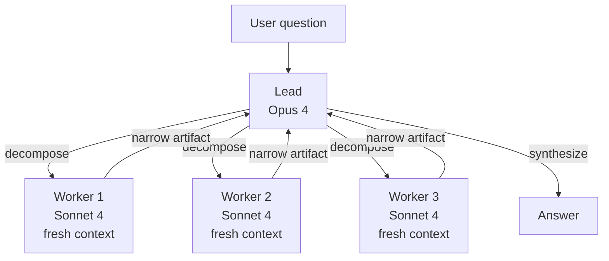
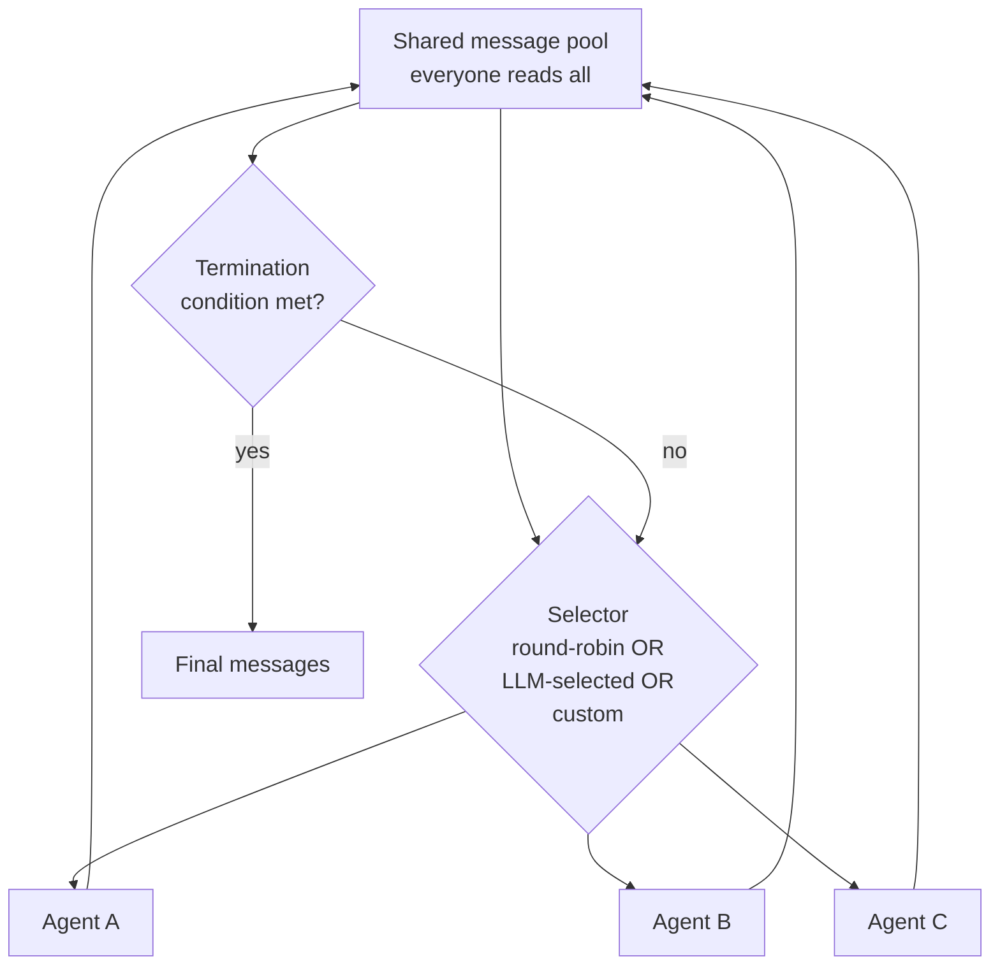
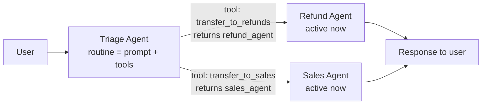

## Exit Criteria

1. Name the five canonical multi-agent topologies (supervisor / hierarchical / group-chat / handoffs / voting-debate) and state when to pick each.
2. Implement the supervisor pattern from primitives: one lead decomposes, N workers execute in parallel contexts, lead synthesizes. Workers never see each other; lead never sees raw artifacts. Anthropic Research-system shape.
3. State the 90.2% Anthropic measurement + "80% of variance explained by token usage alone" finding — production rationale for "multi-agent wins because each subagent gets a fresh context."
4. Implement OpenAI Swarm-style handoffs from primitives: `Agent = prompt + tools`; `handoff = function returning Agent`. Two-concept API; routing is the LLM's tool-call.
5. Implement AutoGen GroupChat-style speaker-selection from primitives: shared message pool + selector function (round-robin / LLM-selected / custom). Identify when each selector flavor wins.
6. Compose hierarchical topology: supervisor of supervisors. State when nesting earns its cost (one layer YES; two layers MAYBE; three layers almost never).
7. Implement voting-debate topology: N agents independently solve same problem; aggregator votes (majority / weighted / LLM-judge). When does voting earn its 3-5× cost?
8. Defend topology choice in a 90-second interview answer anchored to ONE measured production trade-off (token cost vs accuracy, wall time vs throughput, latency vs context fidelity).

---

## 1. Why This Week Matters (~150 words — REQUIRED)

W3.5.5 covered multi-agent at the SHARED-KNOWLEDGE axis — agents coordinating via a queue or blackboard. This chapter covers the orthogonal axis: TOPOLOGY — how agents are connected, who talks to whom, who decides who talks next. The five canonical topologies — supervisor, hierarchical, group-chat with speaker-selection, handoffs/routines, voting-debate — show up in EVERY production multi-agent system (Anthropic Research, CrewAI, AutoGen, OpenAI Swarm, LangGraph). Engineers who can name them, sketch them from primitives, and defend the choice are 2026's senior-multi-agent-engineer signal. Anthropic's published 90.2% improvement on internal research evals (Opus 4 lead + Sonnet 4 subagents vs single Opus 4) shows topology choice carries real production weight — not theoretical hand-waving. This chapter teaches all five patterns from scratch (no framework magic), with the senior-engineer trade-off language for picking the right one per workload.

---

## 2. Theory Primer (~1000 words — REQUIRED — SPEC)

### 2.1 The topology-vs-shared-knowledge axis split

W3.5.5 taught the SHARED-KNOWLEDGE axis: how do agents coordinate state? Queue, blackboard, shared memory, message passing. This chapter teaches the TOPOLOGY axis: who talks to whom? Orthogonal concerns — a topology choice doesn't determine a shared-knowledge choice or vice versa. Production systems pick one from each axis. E.g., Anthropic Research = supervisor topology + per-worker isolated context (no shared knowledge). CrewAI sequential = pipeline topology + shared task list. AutoGen GroupChat = group-chat topology + shared message pool.

### 2.2 Five topologies — capability summary

| Topology | Shape | Best for | Token cost vs single | When wrong |
|---|---|---|---|---|
| **Supervisor / Orchestrator-Worker** | 1 lead + N workers, parallel | Research-shape decomposition | ~15× | Sequential tasks; simple queries |
| **Hierarchical** | Supervisor-of-supervisors, recursive | Very large tasks needing 2+ decomposition layers | 30-50× | One-layer tasks; flat work |
| **Group-Chat (speaker-selection)** | Shared message pool + selector | Emergent collaboration with unclear topology | ~5-10× (selector cost dominates) | Tightly-scripted workflows |
| **Handoffs / Routines** | Active-agent passes baton via tool-call | Triage + skill-based routing | ~2-3× (one agent at a time) | Long sessions; parallel execution |
| **Voting / Debate** | N independent solvers + aggregator | High-accuracy decisions; correctness > cost | 3-5× | Cheap-correctness tasks; latency-sensitive |

### 2.3 Concept 1 — Supervisor / Orchestrator-Worker pattern

One lead agent (typically a strong reasoner like Opus 4 in Anthropic's Research system) plans + decomposes + synthesizes. N worker agents (typically faster/cheaper like Sonnet 4) execute in parallel, each with its own fresh context. Lead never reads raw materials. Workers never see each other's work until lead synthesizes.

**Why it wins (Anthropic's 3 mechanisms):**
1. **Fresh context per subagent.** Worker exploring sub-question doesn't carry the 40k tokens the lead spent planning. Gets a fresh 200k window.
2. **Specialization via prompt.** Lead's prompt = "decompose and synthesize" (not "research"). Worker's prompt = narrow sub-question. Focused prompts → focused outputs.
3. **Parallelism.** Workers run concurrently. Wall = `max(worker_times) + plan + synthesis`, not `sum(worker_times)`.

**Measured impact:** Anthropic Research's published +90.2% on internal research evals vs single Opus 4. Same post: 80% of BrowseComp variance is explained by token usage ALONE. Fresh context per subagent is the dominant mechanism.

**Production lessons (Anthropic 2025-2026):**
- **Scale effort to query complexity.** Simple queries: 1 agent, 3-10 tool calls. Complex: 10+ agents. Lead must estimate, not caller.
- **Broad then narrow.** Decompose into broad sub-questions; spawn more workers per sub-question if answer warrants depth.
- **Rainbow deployments.** Agents are long-running and stateful; traditional blue-green doesn't work. Gradual rollout with version drain.
- **Token usage dominates.** ~15× single-agent cost. Only run when task value justifies.

**Failure modes:** lead hallucinates plan (workers research wrong target); workers over-explore (drift beyond sub-question); synthesis conflicts (silent picking of one answer is worst — user never sees disagreement).

### 2.4 Concept 2 — Hierarchical (supervisor-of-supervisors)

Recursive supervisor pattern. A top-level lead decomposes into sub-questions; each sub-question becomes a SUPERVISED sub-problem with its own lead + workers. Two layers earn cost when sub-questions themselves decompose. Three layers almost never — diminishing returns vs operational complexity explode.

**When to nest:** the user question genuinely has TWO decomposition layers ("compare regulatory frameworks across EU, US, UK" → top lead decomposes by region → each region's lead decomposes by regulatory dimension → leaf workers research dimensions).

**When to flatten:** the user question is one layer ("summarize this paper" → just spawn workers per section). Hierarchy is operational cost; pay it only when the decomposition genuinely needs it.

### 2.5 Concept 3 — Group-Chat with speaker-selection (AutoGen / AG2 / Microsoft Agent Framework)

Shared message pool. Every agent sees every message. A selector function picks who speaks next. Three selector flavors:

- **Round-robin.** Fixed cycle. Deterministic, scales linearly. Ignores context — coder gets turn even when topic is legal review.
- **LLM-selected.** Call to LLM that reads recent pool + returns best next speaker. Context-aware but slow (every turn = one extra LLM call).
- **Custom.** Python function with whatever logic. Typical: LLM-selected with fallback rules ("always give verifier the turn after coder").

**API shape** (AutoGen / AG2):
```python
agent = ConversableAgent(name="coder", system_message="You write Python.", llm_config={...})
chat = GroupChat(agents=[coder, reviewer, tester], messages=[])
manager = GroupChatManager(groupchat=chat, llm_config={...})
```

**Why group-chat:** when the workflow is NOT statically knowable. Sometimes the coder asks the reviewer, sometimes the researcher, sometimes the writer. Hardcoding every edge produces an edge explosion; group-chat lets the conversation emerge.

**Failure mode:** speaker selection becomes the bottleneck. Every turn = LLM call to selector. 10-turn conversation = 10 selector calls on top of agent calls. Cost ~2× vs round-robin.

**Production status (2026):** AutoGen v0.2's GroupChat semantics preserved in AG2 fork; AutoGen v0.4 rewrote it as event-driven actor model. Microsoft put AutoGen into maintenance mode February 2026 + merged with Semantic Kernel into Microsoft Agent Framework (RC February 2026). GroupChat primitive survives in both.

### 2.6 Concept 4 — Handoffs / Routines (OpenAI Swarm / OpenAI Agents SDK)

Two-primitive API:
- **Routine.** A system prompt + scoped tool list. Defines an agent's role.
- **Handoff.** A tool the agent can call that returns another Agent object. Runtime detects the Agent return + switches active agent.

```python
def transfer_to_refunds():
    return refund_agent
triage_agent = Agent(name="triage", instructions="Route user.",
                    functions=[transfer_to_refunds, transfer_to_sales, ...])
```

**Why it's viral:** small API (two concepts); uses model's existing tool-calling; no state-machine DSL burden. Routing is the LLM's tool-call.

**Trade-off:** stateless between runs. Memory + continuity = caller's problem. OpenAI Agents SDK (March 2025) added session management + guardrails + tracing on top of this primitive.

**Best for:** triage (front-line → specialist), skill-based routing (code → coder, research → researcher), short bounded conversations (customer support, FAQ-to-ticket).

**Bad for:** long sessions with shared memory (handoffs reset conversation state); parallel execution (handoff is one-at-a-time).

### 2.7 Concept 5 — Voting / Debate topology

N agents independently solve the same problem. Aggregator collects answers + decides:
- **Majority vote.** Discrete answer space; pick most-frequent. Robust to single-agent failures.
- **Weighted vote.** Agents have confidence scores; aggregator weights by confidence.
- **LLM-judge.** Aggregator is itself an LLM that reads all N answers + picks/synthesizes.

**Debate variant:** agents take adversarial roles (pro / con / synthesizer). Each iterates with awareness of others' arguments. Multi-round.

**Why voting wins:** for tasks where correctness > cost (medical diagnosis, legal review, security-critical code review). Single-agent error rate ε; N-agent majority error rate ≈ ε^(N/2) under independence assumption.

**When to skip:** cheap-correctness tasks (the task isn't actually hard enough to need N answers); latency-sensitive tasks (3-5× wall time); high-cost-per-query tasks (N× the LLM bill).

### 2.8 Distinguish-from box

**Topology vs framework** — LangGraph, CrewAI, AutoGen are FRAMEWORKS that implement these topologies. The topologies exist independent of framework choice. This chapter teaches the topologies from primitives so you can build them in any framework or none.

**Topology vs orchestration runtime** — W4.6 Durable Agent Runtime is about HOW agents persist + recover. This chapter is about WHICH agents talk to whom. Orthogonal.

**Topology vs A2A protocol** — A2A is the cross-organization protocol (W6.95). Topologies are intra-system structure. A2A doesn't tell you to use supervisor vs group-chat; topology choice happens at the system-design layer regardless of inter-org protocol.

### 2.9 Decision matrix — pick a topology from these 6 questions

1. Is the task decomposable into INDEPENDENT sub-questions? → YES enables supervisor / hierarchical.
2. Do sub-questions further decompose? → YES enables hierarchical (rare).
3. Is the workflow KNOWABLE in advance? → YES enables pipeline (W3.5.5) or supervisor. NO enables group-chat.
4. Is the interaction TRIAGE-shaped (front-line routing to specialists)? → YES enables handoffs.
5. Is correctness MORE valuable than cost (e.g., medical, legal, security)? → YES enables voting/debate.
6. Does the task need long-running shared memory? → NO supports handoffs; YES supports group-chat or supervisor with persisted state.

### 2.10 Papers + references — pointer list

- **Anthropic — Research system engineering post (2025).** 90.2% measurement + "80% of BrowseComp variance from token usage" finding.
- **OpenAI Swarm (October 2024)** — the original two-primitive paper / repo.
- **OpenAI Agents SDK (March 2025)** — production successor to Swarm.
- **AutoGen GroupChat / AG2** — speaker-selection reference impl.
- **Microsoft Agent Framework (RC February 2026)** — merged AutoGen + Semantic Kernel.
- **Phase 16 lessons 05, 06, 10, 11, 15** (`rohitg00/ai-engineering-from-scratch`) — source lessons.
- **Du et al. (2023). Improving Factuality and Reasoning in Language Models through Multiagent Debate.** Foundational debate-topology paper.

---

## 3. System Architecture (REQUIRED — Mermaid)

### 3.1 Supervisor topology



### 3.2 Group-Chat with speaker-selection



### 3.3 Handoffs / Routines



---

## 4. Lab Phases (REQUIRED — SPEC — code lands when lab runs)

### Phase 1 — Supervisor from primitives (~1.5 hours)

Goal: `code/supervisor.py` (~120 LOC). One lead, 3 workers, `threading` for parallelism. Lead decomposes a research question into 3 sub-questions. Each worker gets its own context + LLM call. Lead synthesizes returned artifacts.

Verification: wall-time < `max(worker_times) + plan + synthesis`, NOT `sum`. Run on a real question; measure wall + tokens. Compare to single-agent baseline on the same question.

### Phase 2 — Hierarchical (one extra layer) (~1 hour)

Goal: extend Phase 1 with one sub-supervisor. Top lead decomposes into 2 macro-questions; each macro-question gets its own sub-lead + 2 workers. Total = 1 + 2 + 4 = 7 agents.

Verification: hierarchy depth = 2 (1 top + sub-leads). Wall-time comparison vs flat supervisor with 6 workers (Phase 1 generalization). When does hierarchy win vs flat? Capture in `outputs/hierarchy_vs_flat.md`.

### Phase 3 — Group-Chat speaker-selection (~1.5 hours)

Goal: `code/group_chat.py` (~150 LOC). 3 agents (coder, reviewer, tester), shared message pool, 3 selector flavors (round-robin / LLM-selected / custom). Termination on `TERMINATE` token in any message OR max-rounds reached.

Verification: same task run with each selector flavor. Compare wall + token cost + answer quality. Capture in `outputs/selector_comparison.md`.

### Phase 4 — Handoffs / Swarm from primitives (~1.5 hours)

Goal: `code/handoffs.py` (~80 LOC). 3 agents (triage, refund, sales). Triage has 2 handoff tools (`transfer_to_refund`, `transfer_to_sales`). Run 5 user prompts that should route to different specialists. Measure: did triage route correctly each time?

Verification: 5/5 correct routing on a labeled test set. False-routing rate < 20% on edge cases.

### Phase 5 — Voting / Debate (~1.5 hours)

Goal: `code/voting.py` (~120 LOC). 3 independent agents solve same problem with different seeds. Aggregator picks via majority OR LLM-judge. Compare to single-agent baseline accuracy.

Verification: on a 20-question test set with known answers, measure single-agent vs voting accuracy. Calculate cost-per-correct-answer (tokens / questions correct).

### Phase 6 — Topology decision matrix exercise (~30 min)

Goal: for 10 sample workloads (research, customer-support, code-review, data-analysis, etc.), answer the §2.9 6-question decision matrix and pick a topology. Defend each choice in 2 sentences.

Deliverable: `outputs/topology_decisions.md` — 10-row table of (workload, 6 answers, picked topology, defense).

---

## 5. (deprecated)

---

## 6. Bad-Case Journal (3-5 entries — SPEC)

Candidate failure surfaces:

- **Phase 1 — Lead hallucinates the decomposition.** Likely surface: lead generates sub-questions that don't decompose the real question; workers do precise research on the wrong target. Fix: lead's decomposition prompt must reference back to the original question + ask workers to flag if scope drifts.
- **Phase 2 — Hierarchical sub-leads silently swallow worker disagreement.** Likely surface: sub-lead picks one worker's answer when two disagreed; top lead never sees the disagreement. Fix: sub-lead artifact MUST include explicit disagreement notes when workers' answers conflict.
- **Phase 3 — LLM-selected speaker stalls into self-loops.** Likely surface: selector picks the same agent every turn because that agent's last message is the most engaging; conversation never advances. Fix: selector prompt explicitly says "do NOT pick the agent who just spoke unless you have a specific reason."
- **Phase 4 — Triage hallucinates the handoff target.** Likely surface: user asks about something not covered by registered specialists; triage invents a `transfer_to_legal` handoff that doesn't exist. Fix: triage prompt enumerates ONLY the registered handoff tools; system message tells triage to handle out-of-scope queries directly with apology.
- **Phase 5 — Voting collapses to herd behavior under shared training data.** Likely surface: 3 agents from same model family + same prompt template give identical wrong answers; majority vote codifies the wrong answer. Fix: vary prompts + seeds + ideally model families across voters to maximize independence.

---

## 7. Interview Soundbites (2-3 entries — SPEC)

- **Planned Soundbite 1 — "When would you reach for supervisor vs group-chat?"** Anchors: §2.9 6-question matrix + Anthropic 90.2% measurement. 70 words: "Supervisor when the workflow IS knowable — decompose, parallelize, synthesize. Anthropic Research shows 90.2% improvement vs single-agent on internal evals, with 80% of variance from fresh context per subagent. Group-chat when workflow isn't statically known — coder might ask reviewer OR researcher OR writer. Group-chat pays selector overhead per turn. Pick supervisor when you can name the sub-questions; pick group-chat when the agents need to react to each other emergently."
- **Planned Soundbite 2 — "Why is OpenAI Swarm two concepts?"** Anchors: §2.6. 70 words naming the design choice (routing IS the LLM's tool-call; no DSL burden) + the stateless trade-off.
- **Planned Soundbite 3 — "When does voting earn its 3-5× cost?"** Anchors: §2.7 + Phase 5 measured accuracy delta. 70 words: voting wins for correctness > cost tasks (medical, legal, security); single-agent error rate ε → N-agent majority error rate ≈ ε^(N/2) under independence; herd-behavior failure mode + mitigation.

---

## 8. References

### Papers + canonical writing

- **Anthropic Engineering (2025).** *How we built Research.* https://anthropic.com/engineering — production supervisor pattern; 90.2% improvement measurement; 80%-of-variance-from-tokens finding.
- **Du, Yilun et al. (2023).** *Improving Factuality and Reasoning in Language Models through Multiagent Debate.* arXiv:2305.14325. Foundational debate-topology paper.
- **OpenAI (October 2024).** *Swarm — Educational framework for multi-agent orchestration.* https://github.com/openai/swarm. Two-primitive API (routines + handoffs); the protocol is in the source.

### Production blog posts

- **LangChain blog (2025).** *Supervisor pattern via tool-calling (move from langgraph-supervisor library).* The 2025 documentation update.
- **Microsoft AI blog (February 2026).** *AutoGen + Semantic Kernel → Microsoft Agent Framework RC.* Production migration context for GroupChat primitive.

### Source lessons

- **`rohitg00/ai-engineering-from-scratch` — Phase 16 lesson 05 (Supervisor / Orchestrator-Worker Pattern).** https://github.com/rohitg00/ai-engineering-from-scratch/tree/main/phases/16-multi-agent-and-swarms/05-supervisor-orchestrator-pattern. Source of §2.3 + Phase 1.
- **`rohitg00/ai-engineering-from-scratch` — Phase 16 lesson 06 (Hierarchical Architecture).** Source of §2.4 + Phase 2.
- **`rohitg00/ai-engineering-from-scratch` — Phase 16 lesson 10 (Group Chat + Speaker Selection).** Source of §2.5 + Phase 3.
- **`rohitg00/ai-engineering-from-scratch` — Phase 16 lesson 11 (Handoffs and Routines).** Source of §2.6 + Phase 4.
- **`rohitg00/ai-engineering-from-scratch` — Phase 16 lesson 15 (Voting / Debate Topology).** Source of §2.7 + Phase 5.

### Canonical reference implementations

- **OpenAI Swarm** — https://github.com/openai/swarm. Two-primitive reference; ~400 LOC for the whole framework. Worth reading end-to-end as the cleanest topology implementation.
- **OpenAI Agents SDK (March 2025)** — production successor to Swarm.
- **AG2 GroupChat** — https://github.com/ag2ai/ag2. AutoGen v0.2 GroupChat-semantics fork.
- **Microsoft Agent Framework** — Microsoft's merged AutoGen + Semantic Kernel; RC February 2026.

---

## 9. Cross-References

- **Builds on:** [[Week 3.5.5 - Multi-Agent Shared Knowledge]] (shared-knowledge axis — this chapter is the topology axis); [[Week 4 - ReAct From Scratch]] (single-agent loop primitive that topologies compose).
- **Distinguish from:** [[Week 6.95 - A2A Protocol]] (A2A is cross-organization protocol; topology choice is intra-system structure — orthogonal concerns); [[Week 4.6 - Durable Agent Runtime and Process Topologies]] (W4.6's "process topology" is execution-trigger axis; this chapter is communication-topology axis).
- **Connects to:** [[Week 11.5 - Agent Security]] (multi-agent failure modes — MAST, groupthink — relate to topology choice); [[Week 12 - Capstone]] (capstone systems pick from these 5 topologies).
- **Foreshadows:** [[Week 12 - Capstone]] (capstone defense often turns on topology choice).

---

## What's Next

After W3.5.5.5: [[Week 3.5.8 - Two-Tier Memory Architecture]] (memory for multi-agent systems — the topology determines what memory shape each agent needs); [[Week 6.95 - A2A Protocol]] (cross-system collaboration after intra-system topology).
