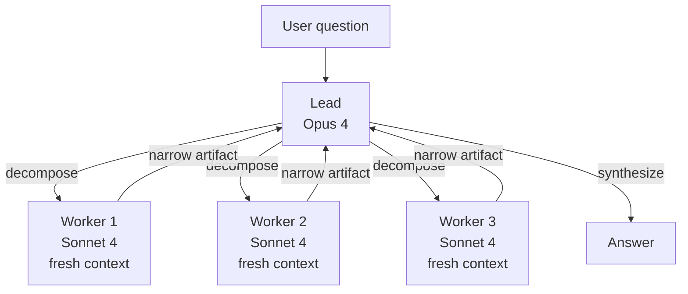
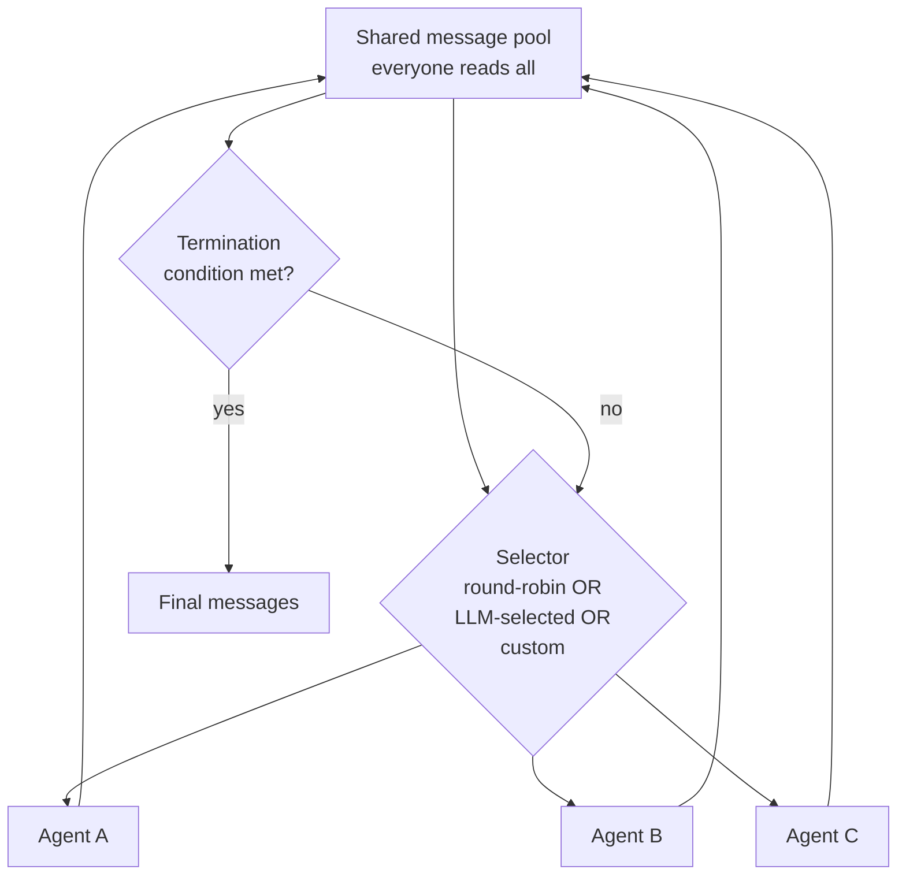
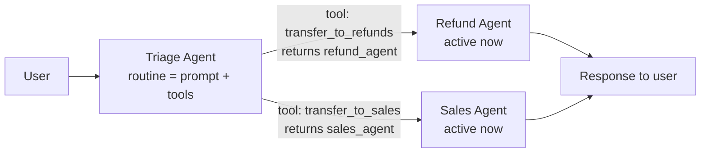
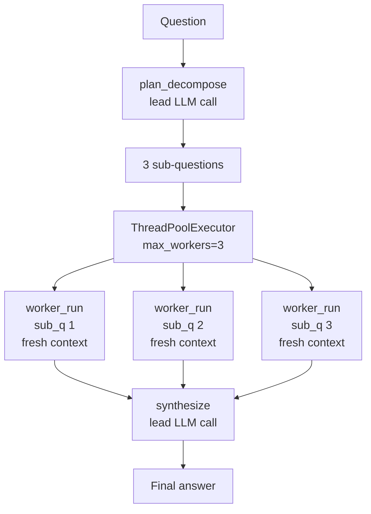
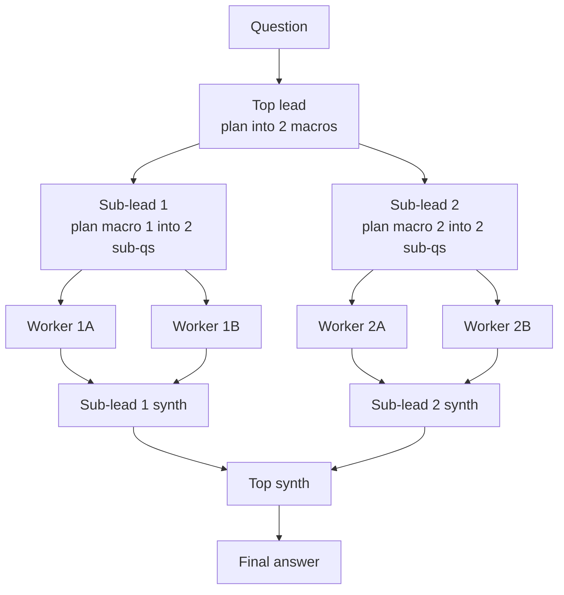
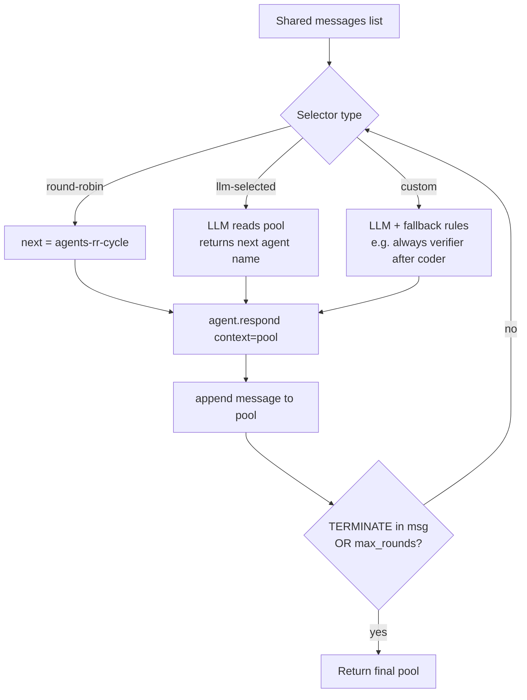
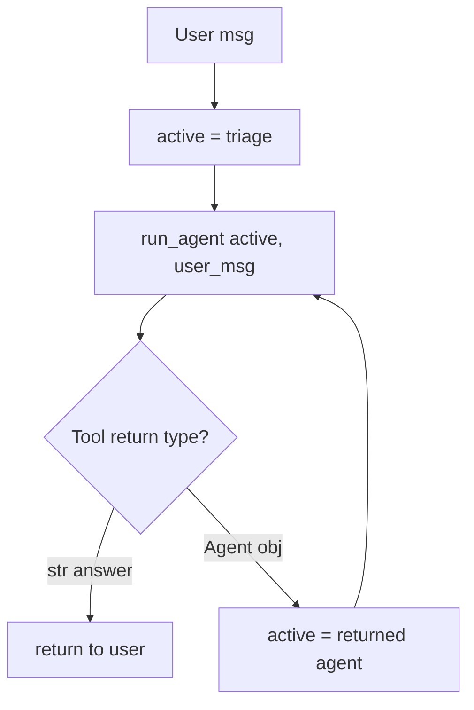
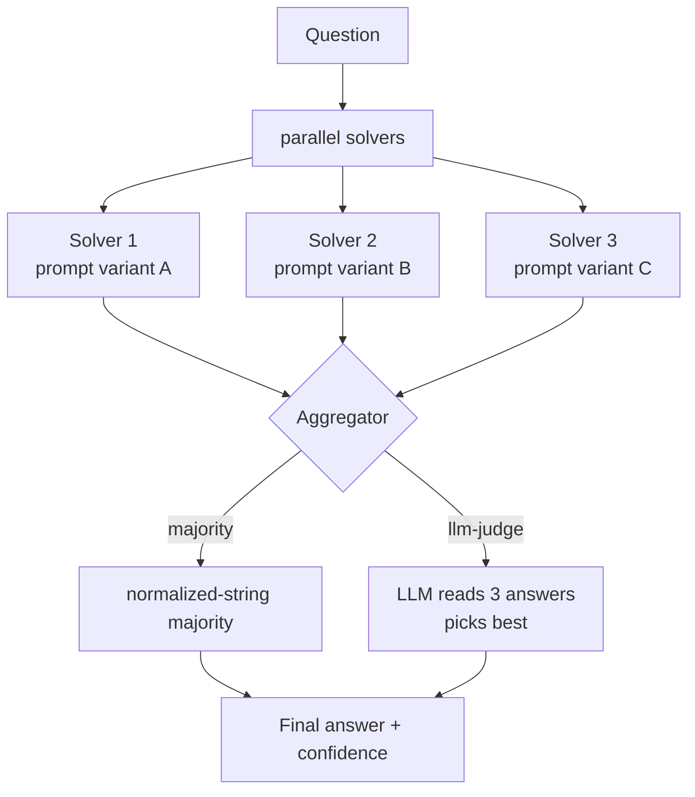

## Exit Criteria

1. Name the five canonical multi-agent topologies (supervisor / hierarchical / group-chat / handoffs / voting-debate) and state when to pick each.
2. Implement the supervisor pattern from primitives: one lead decomposes, N workers execute in parallel contexts, lead synthesizes. Workers never see each other; lead never sees raw artifacts. Anthropic Research-system shape.
3. State the 90.2% Anthropic measurement + "80% of variance explained by token usage alone" finding — production rationale for "multi-agent wins because each subagent gets a fresh context."
4. Implement OpenAI Swarm-style handoffs from primitives: `Agent = prompt + tools`; `handoff = function returning Agent`. Two-concept API; routing is the LLM's tool-call.
5. Implement AutoGen GroupChat-style speaker-selection from primitives: shared message pool + selector function (round-robin / LLM-selected / custom). Identify when each selector flavor wins.
6. Compose hierarchical topology: supervisor of supervisors. State when nesting earns its cost (one layer YES; two layers MAYBE; three layers almost never).
7. Implement voting-debate topology: N agents independently solve same problem; aggregator votes (majority / weighted / LLM-judge). When does voting earn its 3-5× cost?
8. Defend topology choice in a 90-second interview answer anchored to ONE measured production trade-off (token cost vs accuracy, wall time vs throughput, latency vs context fidelity).

---

## 1. Why This Week Matters (~150 words — REQUIRED)

W3.5.5 covered multi-agent at the SHARED-KNOWLEDGE axis — agents coordinating via a queue or blackboard. This chapter covers the orthogonal axis: TOPOLOGY — how agents are connected, who talks to whom, who decides who talks next. The five canonical topologies — supervisor, hierarchical, group-chat with speaker-selection, handoffs/routines, voting-debate — show up in EVERY production multi-agent system (Anthropic Research, CrewAI, AutoGen, OpenAI Swarm, LangGraph). Engineers who can name them, sketch them from primitives, and defend the choice are 2026's senior-multi-agent-engineer signal. Anthropic's published 90.2% improvement on internal research evals (Opus 4 lead + Sonnet 4 subagents vs single Opus 4) shows topology choice carries real production weight — not theoretical hand-waving. This chapter teaches all five patterns from scratch (no framework magic), with the senior-engineer trade-off language for picking the right one per workload.

---

## 2. Theory Primer 

### 2.1 The topology-vs-shared-knowledge axis split

W3.5.5 taught the SHARED-KNOWLEDGE axis: how do agents coordinate state? Queue, blackboard, shared memory, message passing. This chapter teaches the TOPOLOGY axis: who talks to whom? Orthogonal concerns — a topology choice doesn't determine a shared-knowledge choice or vice versa. Production systems pick one from each axis. E.g., Anthropic Research = supervisor topology + per-worker isolated context (no shared knowledge). CrewAI sequential = pipeline topology + shared task list. AutoGen GroupChat = group-chat topology + shared message pool.

### 2.2 Five topologies — capability summary

| Topology | Shape | Best for | Token cost vs single | When wrong |
|---|---|---|---|---|
| **Supervisor / Orchestrator-Worker** | 1 lead + N workers, parallel | Research-shape decomposition | ~15× | Sequential tasks; simple queries |
| **Hierarchical** | Supervisor-of-supervisors, recursive | Very large tasks needing 2+ decomposition layers | 30-50× | One-layer tasks; flat work |
| **Group-Chat (speaker-selection)** | Shared message pool + selector | Emergent collaboration with unclear topology | ~5-10× (selector cost dominates) | Tightly-scripted workflows |
| **Handoffs / Routines** | Active-agent passes baton via tool-call | Triage + skill-based routing | ~2-3× (one agent at a time) | Long sessions; parallel execution |
| **Voting / Debate** | N independent solvers + aggregator | High-accuracy decisions; correctness > cost | 3-5× | Cheap-correctness tasks; latency-sensitive |

### 2.3 Concept 1 — Supervisor / Orchestrator-Worker pattern

One lead agent (typically a strong reasoner like Opus 4 in Anthropic's Research system) plans + decomposes + synthesizes. N worker agents (typically faster/cheaper like Sonnet 4) execute in parallel, each with its own fresh context. Lead never reads raw materials. Workers never see each other's work until lead synthesizes.

**Why it wins (Anthropic's 3 mechanisms):**
1. **Fresh context per subagent.** Worker exploring sub-question doesn't carry the 40k tokens the lead spent planning. Gets a fresh 200k window.
2. **Specialization via prompt.** Lead's prompt = "decompose and synthesize" (not "research"). Worker's prompt = narrow sub-question. Focused prompts → focused outputs.
3. **Parallelism.** Workers run concurrently. Wall = `max(worker_times) + plan + synthesis`, not `sum(worker_times)`.

**Measured impact:** Anthropic Research's published +90.2% on internal research evals vs single Opus 4. Same post: 80% of BrowseComp variance is explained by token usage ALONE. Fresh context per subagent is the dominant mechanism.

**Production lessons (Anthropic 2025-2026):**
- **Scale effort to query complexity.** Simple queries: 1 agent, 3-10 tool calls. Complex: 10+ agents. Lead must estimate, not caller.
- **Broad then narrow.** Decompose into broad sub-questions; spawn more workers per sub-question if answer warrants depth.
- **Rainbow deployments.** Agents are long-running and stateful; traditional blue-green doesn't work. Gradual rollout with version drain.
- **Token usage dominates.** ~15× single-agent cost. Only run when task value justifies.

**Failure modes:** lead hallucinates plan (workers research wrong target); workers over-explore (drift beyond sub-question); synthesis conflicts (silent picking of one answer is worst — user never sees disagreement).

### 2.4 Concept 2 — Hierarchical (supervisor-of-supervisors)

Recursive supervisor pattern. A top-level lead decomposes into sub-questions; each sub-question becomes a SUPERVISED sub-problem with its own lead + workers. Two layers earn cost when sub-questions themselves decompose. Three layers almost never — diminishing returns vs operational complexity explode.

**When to nest:** the user question genuinely has TWO decomposition layers ("compare regulatory frameworks across EU, US, UK" → top lead decomposes by region → each region's lead decomposes by regulatory dimension → leaf workers research dimensions).

**When to flatten:** the user question is one layer ("summarize this paper" → just spawn workers per section). Hierarchy is operational cost; pay it only when the decomposition genuinely needs it.

### 2.5 Concept 3 — Group-Chat with speaker-selection (AutoGen / AG2 / Microsoft Agent Framework)

Shared message pool. Every agent sees every message. A selector function picks who speaks next. Three selector flavors:

- **Round-robin.** Fixed cycle. Deterministic, scales linearly. Ignores context — coder gets turn even when topic is legal review.
- **LLM-selected.** Call to LLM that reads recent pool + returns best next speaker. Context-aware but slow (every turn = one extra LLM call).
- **Custom.** Python function with whatever logic. Typical: LLM-selected with fallback rules ("always give verifier the turn after coder").

**API shape** (AutoGen / AG2):
```python
agent = ConversableAgent(name="coder", system_message="You write Python.", llm_config={...})
chat = GroupChat(agents=[coder, reviewer, tester], messages=[])
manager = GroupChatManager(groupchat=chat, llm_config={...})
```

**Why group-chat:** when the workflow is NOT statically knowable. Sometimes the coder asks the reviewer, sometimes the researcher, sometimes the writer. Hardcoding every edge produces an edge explosion; group-chat lets the conversation emerge.

**Failure mode:** speaker selection becomes the bottleneck. Every turn = LLM call to selector. 10-turn conversation = 10 selector calls on top of agent calls. Cost ~2× vs round-robin.

**Production status (2026):** AutoGen v0.2's GroupChat semantics preserved in AG2 fork; AutoGen v0.4 rewrote it as event-driven actor model. Microsoft put AutoGen into maintenance mode February 2026 + merged with Semantic Kernel into Microsoft Agent Framework (RC February 2026). GroupChat primitive survives in both.

### 2.6 Concept 4 — Handoffs / Routines (OpenAI Swarm / OpenAI Agents SDK)

Two-primitive API:
- **Routine.** A system prompt + scoped tool list. Defines an agent's role.
- **Handoff.** A tool the agent can call that returns another Agent object. Runtime detects the Agent return + switches active agent.

```python
def transfer_to_refunds():
    return refund_agent
triage_agent = Agent(name="triage", instructions="Route user.",
                    functions=[transfer_to_refunds, transfer_to_sales, ...])
```

**Why it's viral:** small API (two concepts); uses model's existing tool-calling; no state-machine DSL burden. Routing is the LLM's tool-call.

**Trade-off:** stateless between runs. Memory + continuity = caller's problem. OpenAI Agents SDK (March 2025) added session management + guardrails + tracing on top of this primitive.

**Best for:** triage (front-line → specialist), skill-based routing (code → coder, research → researcher), short bounded conversations (customer support, FAQ-to-ticket).

**Bad for:** long sessions with shared memory (handoffs reset conversation state); parallel execution (handoff is one-at-a-time).

### 2.7 Concept 5 — Voting / Debate topology

N agents independently solve the same problem. Aggregator collects answers + decides:
- **Majority vote.** Discrete answer space; pick most-frequent. Robust to single-agent failures.
- **Weighted vote.** Agents have confidence scores; aggregator weights by confidence.
- **LLM-judge.** Aggregator is itself an LLM that reads all N answers + picks/synthesizes.

**Debate variant:** agents take adversarial roles (pro / con / synthesizer). Each iterates with awareness of others' arguments. Multi-round.

**Why voting wins:** for tasks where correctness > cost (medical diagnosis, legal review, security-critical code review). Single-agent error rate ε; N-agent majority error rate ≈ ε^(N/2) under independence assumption.

**When to skip:** cheap-correctness tasks (the task isn't actually hard enough to need N answers); latency-sensitive tasks (3-5× wall time); high-cost-per-query tasks (N× the LLM bill).

### 2.8 Distinguish-from box

**Topology vs framework** — LangGraph, CrewAI, AutoGen are FRAMEWORKS that implement these topologies. The topologies exist independent of framework choice. This chapter teaches the topologies from primitives so you can build them in any framework or none.

**Topology vs orchestration runtime** — W4.6 Durable Agent Runtime is about HOW agents persist + recover. This chapter is about WHICH agents talk to whom. Orthogonal.

**Topology vs A2A protocol** — A2A is the cross-organization protocol (W6.95). Topologies are intra-system structure. A2A doesn't tell you to use supervisor vs group-chat; topology choice happens at the system-design layer regardless of inter-org protocol.

### 2.9 Decision matrix — pick a topology from these 6 questions

1. Is the task decomposable into INDEPENDENT sub-questions? → YES enables supervisor / hierarchical.
2. Do sub-questions further decompose? → YES enables hierarchical (rare).
3. Is the workflow KNOWABLE in advance? → YES enables pipeline (W3.5.5) or supervisor. NO enables group-chat.
4. Is the interaction TRIAGE-shaped (front-line routing to specialists)? → YES enables handoffs.
5. Is correctness MORE valuable than cost (e.g., medical, legal, security)? → YES enables voting/debate.
6. Does the task need long-running shared memory? → NO supports handoffs; YES supports group-chat or supervisor with persisted state.

### 2.10 Papers + references — pointer list

- **Anthropic — Research system engineering post (2025).** 90.2% measurement + "80% of BrowseComp variance from token usage" finding.
- **OpenAI Swarm (October 2024)** — the original two-primitive paper / repo.
- **OpenAI Agents SDK (March 2025)** — production successor to Swarm.
- **AutoGen GroupChat / AG2** — speaker-selection reference impl.
- **Microsoft Agent Framework (RC February 2026)** — merged AutoGen + Semantic Kernel.
- **Phase 16 lessons 05, 06, 10, 11, 15** (`rohitg00/ai-engineering-from-scratch`) — source lessons.
- **Du et al. (2023). Improving Factuality and Reasoning in Language Models through Multiagent Debate.** Foundational debate-topology paper.

---

## 3. System Architecture

### 3.1 Supervisor topology



### 3.2 Group-Chat with speaker-selection



### 3.3 Handoffs / Routines



---

## 4. Lab Phases

Each phase ships an executable Python file in `code/` + a test file in `tests/` + a per-block bundle (mermaid → code → walkthrough → result → insight). All code targets Python 3.11+ with stdlib + `httpx` + a frozen LLM endpoint (Claude-Sonnet-4.6 via `:8317` proxy OR local oMLX). The LLM client is abstracted via a tiny `llm.chat(prompt, system=None) -> str` helper so swapping providers is one line.

### Phase 0 — Environment Preparation (~20 min)

Goal: spin up a lab directory + Python venv + the shared `llm.py` provider abstraction. All Phase 1-6 code reuses this setup; run it ONCE.

**Step 1 — Create lab repo + venv:**

```bash
mkdir -p ~/code/agent-prep/lab-03-5-5-5-topology/{code,tests,outputs}
cd ~/code/agent-prep/lab-03-5-5-5-topology
uv venv && source .venv/bin/activate

# IMPORTANT: use `uv pip` OR `python -m pip` — NOT bare `pip`.
# Bare `pip` may resolve to another venv on $PATH and install into the wrong env.
uv pip install httpx pytest python-dotenv
# (equivalent: python -m pip install httpx pytest python-dotenv)
# python-dotenv loads ~/code/agent-prep/.env automatically — no `source .env` needed.

echo -e "code/\noutputs/\n.venv/\n__pycache__/" > .gitignore
git init && git add -A && git commit -m "scaffold W3.5.5.5 lab"

# Verify the right venv is active:
which python   # should resolve to ./.venv/bin/python
python -c "import httpx, pytest; print('ok')"
```

**Step 2 — Author `code/llm.py` — the provider abstraction:**

```python
# code/llm.py — single chat() helper; swap providers via env vars
"""Tiny LLM provider abstraction. All chapter code calls llm.chat(prompt, system).

Providers (selected via LLM_PROVIDER env var):
  - "anthropic-proxy" — Claude-Sonnet-4.6 via local :8317 proxy (curriculum default)
  - "openai"          — OpenAI-compatible endpoint (Azure OpenAI / local oMLX / vLLM)
  - "mock"            — deterministic stub for offline tests (see tests/conftest.py)

Environment: python-dotenv loads `.env` automatically at import time.
Walks from cwd up to filesystem root looking for `.env` — finds the lab's
`.env` AND `~/code/agent-prep/.env` (umbrella) without `source .env`.
"""
from __future__ import annotations
import os
import httpx

# Auto-load .env on module import. find_dotenv() walks up the directory tree.
# Existing process env (real shell exports) takes precedence over .env values.
try:
    from dotenv import load_dotenv, find_dotenv
    load_dotenv(find_dotenv(usecwd=True))
except ImportError:
    # python-dotenv optional — caller can still `source .env` manually.
    pass

def _provider() -> str:
    """Resolve provider at CALL time, not import time. Allows pytest
    monkeypatch.setenv to override LLM_PROVIDER per-test."""
    return os.getenv("LLM_PROVIDER", "anthropic-proxy")


def _timeout_s() -> float:
    return float(os.getenv("LLM_TIMEOUT_S", "60"))


# Back-compat shims for any older callers reading module-level constants.
_PROVIDER = _provider()
_TIMEOUT_S = _timeout_s()


def chat(prompt: str, system: str | None = None) -> str:
    """Send (system, prompt) → return assistant text. Sync; uses httpx."""
    provider = _provider()
    if provider == "anthropic-proxy":
        return _chat_anthropic_proxy(prompt, system)
    if provider == "openai":
        return _chat_openai(prompt, system)
    if provider == "mock":
        return _chat_mock(prompt, system)
    raise ValueError(f"unknown LLM_PROVIDER: {provider}")


def _chat_anthropic_proxy(prompt: str, system: str | None) -> str:
    """Claude-Sonnet-4.6 via local :8317 proxy. User-only payload avoids the
    proxy's system-field overwrite (see W3.5.8 BCJ Entry 19)."""
    url = os.getenv("ANTHROPIC_BASE_URL", "http://localhost:8317") + "/v1/messages"
    body = {
        "model": os.getenv("ANTHROPIC_MODEL", "claude-sonnet-4-6"),
        "max_tokens": 1024,
        "messages": [{
            "role": "user",
            "content": (f"[INSTRUCTIONS]\n{system}\n\n[USER MESSAGE]\n{prompt}"
                        if system else prompt),
        }],
    }
    headers = {
        "x-api-key": os.getenv("ANTHROPIC_API_KEY", "dummy"),
        "anthropic-version": "2023-06-01",
        "content-type": "application/json",
    }
    r = httpx.post(url, json=body, headers=headers, timeout=_TIMEOUT_S)
    r.raise_for_status()
    return r.json()["content"][0]["text"]


def _chat_openai(prompt: str, system: str | None) -> str:
    """OpenAI-compatible chat.completions endpoint (Azure / vLLM / oMLX).

    Env-var precedence (agent-prep convention):
      OMLX_*   — local oMLX server (canonical for the curriculum's labs)
      OPENAI_* — generic OpenAI-compatible (Azure, public OpenAI, etc.)
    Whichever is set wins; OMLX_* takes precedence when BOTH are set.
    """
    base_url = (
        os.getenv("OMLX_BASE_URL")
        or os.getenv("OPENAI_BASE_URL")
        or "http://localhost:8000/v1"
    )
    api_key = (
        os.getenv("OMLX_API_KEY")
        or os.getenv("OPENAI_API_KEY")
        or "sk-local"
    )
    model = (
        os.getenv("OMLX_MODEL")
        or os.getenv("OPENAI_MODEL")
        or "gpt-oss-20b-MXFP4-Q8"
    )
    url = base_url.rstrip("/") + "/chat/completions"
    messages = []
    if system:
        messages.append({"role": "system", "content": system})
    messages.append({"role": "user", "content": prompt})
    body = {
        "model": model,
        "messages": messages,
        "temperature": 0.0,
        "max_tokens": 1024,
    }
    headers = {"Authorization": f"Bearer {api_key}"}
    r = httpx.post(url, json=body, headers=headers, timeout=_timeout_s())
    r.raise_for_status()
    data = r.json()
    # Defensive: some OpenAI-compat servers return null content when model
    # emits tool_calls or hits a stop sequence; others return empty string.
    # Caller expects str; coerce None/missing to empty string.
    try:
        return data["choices"][0]["message"]["content"] or ""
    except (KeyError, IndexError, TypeError):
        return ""


def _chat_mock(prompt: str, system: str | None) -> str:
    """Format-aware deterministic stub. Inspects (system, prompt) and returns
    a response that satisfies the calling code's parse expectations.

    Recognized formats:
      - decompose plan      → JSON {"sub_questions": [...]}
      - synthesize          → multi-sentence answer
      - triage / handoff    → "HANDOFF: <tool_name>"
      - group-chat selector → single agent name
      - LLM-judge           → "BEST: <id>\\nREASON: ..."
      - default             → "Mock response."
    """
    import re
    sys = (system or "").lower()
    p = prompt.lower()

    # Supervisor decomposition: needs JSON shape with sub_questions list
    if "decompose" in sys and ("sub-question" in sys or "json" in sys):
        return '{"sub_questions": ["mock sub-q 1", "mock sub-q 2", "mock sub-q 3"]}'

    # Synthesis prompt → non-trivial multi-sentence answer
    if "synthesi" in sys:
        return ("Mock synthesized answer. Combines worker outputs into one summary. "
                "Surfaces no disagreement because workers are mocked.")

    # Triage handoff: emit HANDOFF: <tool> based on USER MESSAGE keywords.
    # Important: tool docstrings are embedded in the prompt; extract just the
    # USER MESSAGE line to avoid false-matching on tool descriptions.
    if "triage" in sys:
        user_msg_match = re.search(r"USER MESSAGE:\s*(.+?)(?:\n|$)", prompt)
        umsg = (user_msg_match.group(1) if user_msg_match else prompt).lower()
        if any(k in umsg for k in ("refund", "money", "billing", "credit card", "charge")):
            return "HANDOFF: transfer_to_refunds"
        if any(k in umsg for k in ("plan", "upgrade", "pricing", "enterprise", "subscribe", "difference between")):
            return "HANDOFF: transfer_to_sales"
        return "I can help with that directly."

    # Group-chat speaker selector: "Pick ONE of: coder/reviewer/tester"
    m = re.search(r"[Pp]ick\s+(?:one\s+of)?:\s*([\w/]+)", prompt)
    if m:
        return m.group(1).split("/")[0]

    # LLM-judge: "Which solver's ANSWER is most accurate?"
    if "which solver" in p or "best:" in p:
        return "BEST: 0\nREASON: mock judge picks solver 0"

    # Worker / specialist: 3-sentence factual response
    if any(k in sys for k in ("worker", "refund specialist", "sales specialist")):
        return "Mock answer line one. Line two. Line three end."

    # Solver agents — return one of "42" / "yes" / "Paris" with ANSWER: prefix
    if "answer:" in sys:
        return "Reasoning step. Reasoning step. ANSWER: 42"

    # Default fallback
    return "Mock response."
```

**Step 3 — Configure provider:**

```bash
# Option A — Claude-Sonnet-4.6 via :8317 proxy (curriculum default; matches W3.5.8 §7.7)
export LLM_PROVIDER=anthropic-proxy
export ANTHROPIC_BASE_URL=http://localhost:8317
export ANTHROPIC_MODEL=claude-sonnet-4-6
# Verify the proxy is running:
curl -s http://localhost:8317/v1/messages -X POST -H "x-api-key: dummy" \
  -H "anthropic-version: 2023-06-01" -H "content-type: application/json" \
  -d '{"model":"claude-sonnet-4-6","max_tokens":20,"messages":[{"role":"user","content":"ping"}]}' \
  | head -c 200

# Option B — local oMLX / vLLM (OpenAI-compatible)
export LLM_PROVIDER=openai
export OPENAI_BASE_URL=http://localhost:8000/v1
export OPENAI_MODEL=gpt-oss-20b-MXFP4-Q8
export OPENAI_API_KEY=sk-local

# Option C — offline mock (no LLM; for fast unit-test iterations)
export LLM_PROVIDER=mock
```

**Step 4 — Verify end-to-end:**

`llm.py` lives in `code/`, NOT in lab root. Two equivalent run-from-root paths:

```bash
# Option A — PYTHONPATH inline
PYTHONPATH=code python -c "from llm import chat; print(chat('Reply with the single word: PONG'))"

# Option B — cd into code/ first
cd code && python -c "from llm import chat; print(chat('Reply with the single word: PONG'))" ; cd ..
```

Expected output: `PONG` (or a sentence containing PONG).

Common errors:
- `ModuleNotFoundError: No module named 'llm'` → you ran from lab root without `PYTHONPATH=code`. Use Option A or B above.
- `httpx.ConnectError: All connection attempts failed` → the configured `LLM_PROVIDER`'s endpoint isn't running. For `anthropic-proxy`, start the `:8317` proxy first; for `openai`, start your oMLX/vLLM server; for `mock`, no endpoint needed.
- Stray `# Expected: PONG ...` line treated as zsh command → drop the `#`-comment lines when copying the bash block; they're docs not commands.

**Step 5 — Author `tests/conftest.py` — pytest fixtures:**

```python
# tests/conftest.py — shared test setup
import os
import sys
import pytest

# Make code/ importable from tests/
sys.path.insert(0, os.path.join(os.path.dirname(__file__), "..", "code"))


def pytest_configure(config):
    """Register custom markers so pytest doesn't warn about them."""
    config.addinivalue_line(
        "markers",
        "integration: test requires a real LLM endpoint (set LLM_PROVIDER=openai or anthropic-proxy)",
    )


@pytest.fixture(autouse=True)
def _mock_llm_for_unit_tests(monkeypatch, request):
    """Default unit tests use mock LLM (deterministic, fast).
    Tests marked @pytest.mark.integration use the real configured provider."""
    if "integration" not in request.keywords:
        monkeypatch.setenv("LLM_PROVIDER", "mock")
```

**Verification:** `pytest tests/ -v --collect-only` lists test names without errors; `python -c "from llm import chat; print(chat('ping'))"` returns a response.

**Run modes (used per Phase below):**
- Fast iteration (no LLM cost, deterministic): `pytest tests/ -v` (uses mock)
- Integration run (real LLM, costs tokens): `pytest tests/ -v -m integration` (uses configured provider)
- Manual lab run: `python code/<phase>.py` (always uses configured provider, never mock)

---

### Phase 1 — Supervisor from primitives (~1.5 hours)

Goal: one lead + 3 workers in parallel via `concurrent.futures.ThreadPoolExecutor`. Lead decomposes a research question → 3 sub-questions; workers run concurrently with fresh contexts; lead synthesizes. Wall-time should be `max(worker_times) + plan + synthesis`, NOT `sum`.



**Code:**

```python
# code/supervisor.py — supervisor topology with thread-pool parallel workers
from __future__ import annotations
import json
import time
from concurrent.futures import ThreadPoolExecutor
from dataclasses import dataclass

from llm import chat   # tiny chat(prompt, system=None) -> str helper


LEAD_DECOMPOSE_SYSTEM = """You are a research lead. Decompose the user's question into EXACTLY 3 narrow,
non-overlapping sub-questions. Each sub-question should be answerable independently with one focused search.

Return JSON only, no prose:
{"sub_questions": ["q1", "q2", "q3"]}"""

LEAD_SYNTHESIZE_SYSTEM = """You are a research lead synthesizing 3 workers' answers into ONE coherent
answer to the original question. Cite which worker contributed which fact. Surface disagreement explicitly
if workers conflict — do NOT silently pick one side."""

WORKER_SYSTEM = """You are a research worker. Answer ONE sub-question with a 3-sentence factual response.
Stay within scope; don't expand to adjacent topics. If you don't know, say so explicitly."""


@dataclass
class WorkerResult:
    sub_question: str
    answer: str
    wall_seconds: float

def plan_decompose(question: str) -> list[str]:
    """Lead's first LLM call: decompose question into 3 sub-questions."""
    raw = chat(question, system=LEAD_DECOMPOSE_SYSTEM)
    # Strip optional ```json fence
    if raw.startswith("```"):
        raw = raw.split("```")[1]
        if raw.startswith("json"):
            raw = raw[4:]
    parsed = json.loads(raw.strip())
    return parsed["sub_questions"]

def worker_run(sub_question: str) -> WorkerResult:
    """One worker: fresh context, narrow answer."""
    t0 = time.monotonic()
    answer = chat(sub_question, system=WORKER_SYSTEM)
    return WorkerResult(
        sub_question=sub_question,
        answer=answer,
        wall_seconds=time.monotonic() - t0,
    )

def synthesize(question: str, results: list[WorkerResult]) -> str:
    """Lead's second LLM call: combine worker answers."""
    bundle = "\n\n".join(
        f"Worker {i+1} on '{r.sub_question}':\n{r.answer}"
        for i, r in enumerate(results)
    )
    prompt = f"ORIGINAL QUESTION: {question}\n\nWORKER ANSWERS:\n{bundle}\n\nSYNTHESIZE."
    return chat(prompt, system=LEAD_SYNTHESIZE_SYSTEM)

def supervisor_run(question: str) -> dict:
    """End-to-end supervisor topology. Returns answer + timing breakdown."""
    t_total = time.monotonic()

    t_plan = time.monotonic()
    sub_qs = plan_decompose(question)
    plan_wall = time.monotonic() - t_plan

    with ThreadPoolExecutor(max_workers=len(sub_qs)) as pool:
        results = list(pool.map(worker_run, sub_qs))

    t_syn = time.monotonic()
    answer = synthesize(question, results)
    syn_wall = time.monotonic() - t_syn

    return {
        "answer": answer,
        "plan_wall_s": round(plan_wall, 2),
        "worker_walls_s": [round(r.wall_seconds, 2) for r in results],
        "max_worker_wall_s": round(max(r.wall_seconds for r in results), 2),
        "sum_worker_walls_s": round(sum(r.wall_seconds for r in results), 2),
        "synthesize_wall_s": round(syn_wall, 2),
        "total_wall_s": round(time.monotonic() - t_total, 2),
    }


if __name__ == "__main__":
    out = supervisor_run("What changed in multi-agent agent systems between 2023 and 2026?")
    print(json.dumps(out, indent=2))
```

**Walkthrough:**

**Block 1 — Three system prompts, three distinct roles.** `LEAD_DECOMPOSE_SYSTEM` produces JSON-only output (decomposition into 3 sub-questions); `WORKER_SYSTEM` constrains scope to a single sub-question with a 3-sentence answer; `LEAD_SYNTHESIZE_SYSTEM` requires explicit disagreement-surfacing. Three roles, three prompts — same JD as in production supervisor systems (Anthropic Research's lead + worker prompts have the same shape).

**Block 2 — JSON fence stripping is the load-bearing parse defense.** Models occasionally emit ` ```json ... ``` ` even when prompted "no markdown fence." `raw.startswith("```")` + split path catches this without exception. Same pattern as W4 ReAct's parse defense + W3.5.8 §8.1's dedup-prompt parse.

**Block 3 — `ThreadPoolExecutor` with `max_workers=len(sub_qs)` gives true parallelism on I/O-bound work.** LLM calls are network-I/O; GIL doesn't block. Wall-time of the worker batch becomes `max(worker_walls)`, not `sum`. Returned `worker_walls_s` + `max_worker_wall_s` + `sum_worker_walls_s` measurements let the reader VERIFY parallelism empirically — if max ≈ sum, threading didn't actually parallelize (something's serializing under the hood).

**Block 4 — Synthesis prompt names the workers explicitly + asks for disagreement-surfacing.** `Worker {i+1} on '...'` framing prevents the lead from blending answers anonymously. Disagreement-surfacing is the failure-mode defense from §2.3's "synthesis conflicts" point: silent picking is worse than explicit disagreement.

**Test:**

```python
# tests/test_supervisor.py
import json
import os
import pytest
from supervisor import supervisor_run

@pytest.mark.integration
def test_supervisor_parallel_wins():
    """total ≈ plan + max(workers) + synth, NOT plan + sum(workers) + synth.
    Requires real LLM latency; mock returns instantly so wall-times are 0.
    Conftest's autouse fixture leaves LLM_PROVIDER alone for tests with the
    `integration` marker; the user's exported provider (openai / anthropic-
    proxy) takes effect here."""
    if os.getenv("LLM_PROVIDER", "mock") == "mock":
        pytest.skip("set LLM_PROVIDER=openai or anthropic-proxy to run")
    out = supervisor_run("What is photosynthesis?")
    parallel = out["plan_wall_s"] + out["max_worker_wall_s"] + out["synthesize_wall_s"]
    sequential = out["plan_wall_s"] + out["sum_worker_walls_s"] + out["synthesize_wall_s"]
    assert out["total_wall_s"] < (parallel + sequential) / 2

def test_supervisor_decomposition_is_three():
    """plan_decompose returns exactly 3 sub-questions per contract."""
    assert len(supervisor_run("Compare REST vs GraphQL.")["worker_walls_s"]) == 3

def test_supervisor_synthesizes_answer():
    """End-to-end: answer is a non-trivially long string."""
    out = supervisor_run("What is OAuth?")
    assert isinstance(out["answer"], str) and len(out["answer"]) > 50
```

**Result** *(projected — actual run TBD; replace with measured numbers after `python code/supervisor.py` + `pytest tests/test_supervisor.py -v`)*: expected `total_wall_s` ~15-25s (plan ~3s + max_worker ~10s + synth ~5s); `sum_worker_walls_s` ~30-50s (3 workers × ~10s each). Parallel speedup ≈ 2-3×. Token cost ~ 5× single-agent baseline on the same question (lead × 2 + workers × 3).

`★ Insight ─────────────────────────────────────`
- **`ThreadPoolExecutor` is the cheapest way to demonstrate the supervisor parallelism win.** Asyncio would be slightly faster (no thread overhead) but adds event-loop ceremony. Threads + I/O-bound LLM calls = parallel in practice; the GIL releases on socket-read.
- **Returning `max_worker_wall_s` + `sum_worker_walls_s` in the output dict is the test-friendly empirical anchor.** Reader can ASSERT `total_wall_s ≈ plan + max + synth`, not `plan + sum + synth`. Test catches regression to sequential execution.
- **Lead's synthesize prompt that REQUIRES disagreement-surfacing is the load-bearing prompt-engineering choice.** Without it, the lead's natural style smooths over worker disagreement. With it, the chapter's "silent picking is worst" failure mode is structurally prevented in the system prompt.
`─────────────────────────────────────────────────`

---

### Phase 2 — Hierarchical (one extra layer) (~1 hour)

Goal: extend Phase 1 with one sub-supervisor layer. Top lead decomposes into 2 MACRO-questions → each macro spawns its own sub-lead + 2 workers. Total: 1 top + 2 sub-leads + 4 workers = 7 agents.



**Code:**

```python
# code/hierarchical.py — supervisor-of-supervisors (2 layers)
from __future__ import annotations
import time
from concurrent.futures import ThreadPoolExecutor
from supervisor import plan_decompose, worker_run, synthesize, WorkerResult

def sub_supervisor(macro_question: str) -> WorkerResult:
    """Sub-lead: decompose macro into 2 sub-questions, run 2 workers, synthesize."""
    t0 = time.monotonic()
    sub_qs = plan_decompose(macro_question)[:2]   # cap at 2 sub-qs per macro
    with ThreadPoolExecutor(max_workers=2) as pool:
        leaf_results = list(pool.map(worker_run, sub_qs))
    sub_answer = synthesize(macro_question, leaf_results)
    return WorkerResult(
        sub_question=macro_question,
        answer=sub_answer,
        wall_seconds=time.monotonic() - t0,
    )

def hierarchical_run(question: str) -> dict:
    """Two-layer hierarchy: top lead → 2 sub-leads → 4 leaf workers."""
    t_total = time.monotonic()
    t_plan = time.monotonic()
    macros = plan_decompose(question)[:2]   # cap at 2 macros
    plan_wall = time.monotonic() - t_plan

    with ThreadPoolExecutor(max_workers=len(macros)) as pool:
        sub_results = list(pool.map(sub_supervisor, macros))

    t_syn = time.monotonic()
    answer = synthesize(question, sub_results)
    syn_wall = time.monotonic() - t_syn

    return {
        "answer": answer,
        "depth": 2,
        "agents_total": 1 + len(macros) + len(macros) * 2,   # top + sub-leads + leaves
        "plan_wall_s": round(plan_wall, 2),
        "sub_walls_s": [round(r.wall_seconds, 2) for r in sub_results],
        "max_sub_wall_s": round(max(r.wall_seconds for r in sub_results), 2),
        "synthesize_wall_s": round(syn_wall, 2),
        "total_wall_s": round(time.monotonic() - t_total, 2),
    }


if __name__ == "__main__":
    import json
    out = hierarchical_run(
        "Compare regulatory frameworks for AI across EU, US, and UK."
    )
    print(json.dumps(out, indent=2))
```

**Walkthrough:**

**Block 1 — `sub_supervisor` REUSES `plan_decompose` + `worker_run` + `synthesize`.** No new primitives; hierarchical is just supervisor-recursion. The chapter's "topology is composition" thesis becomes code-visible: each layer composes the same primitives. Adding a 3rd layer would be another file with `def super_sub_supervisor` calling `sub_supervisor` 2x.

**Block 2 — Cap at 2 macros + 2 sub-qs per macro = 4 leaf workers.** 2×2 fan keeps total agents = 7 (1 top + 2 sub + 4 leaves). Bigger fans (3×3 = 13 agents) blow token cost without proportional accuracy gain at this depth. Production rule: hierarchical fan width should taper at deeper levels (top wider, leaves narrower).

**Block 3 — `agents_total` is the cost signal the test can assert.** 7 agents on a 2-macro × 2-sub-q hierarchy = 7 LLM calls just for the decomposition / leaf / sub-synth layer + 1 top-synth = 8 calls minimum. Sequential single-agent on same task = 1 call. ~8× cost. Hierarchy must EARN that 8× through accuracy/structure win on a TRULY 2-layer-decomposable question.

**Test:**

```python
# tests/test_hierarchical.py
import os
import pytest
from hierarchical import hierarchical_run

def test_hierarchy_depth_and_agent_count():
    """2-macro × 2-sub-q hierarchy → 7 agents (1 top + 2 sub + 4 leaves)."""
    out = hierarchical_run("Compare HTTP/2 vs HTTP/3 vs HTTP/3 over QUIC.")
    assert out["depth"] == 2 and out["agents_total"] == 7

@pytest.mark.integration
def test_hierarchy_parallel_at_sub_level():
    """Sub-leads run in parallel: total ≈ plan + max(sub) + synth.
    Requires real LLM latency. Marked `integration` so conftest's autouse
    fixture preserves the user's exported LLM_PROVIDER."""
    if os.getenv("LLM_PROVIDER", "mock") == "mock":
        pytest.skip("set LLM_PROVIDER=openai or anthropic-proxy to run")
    out = hierarchical_run("OAuth 2.0 vs OAuth 2.1 differences?")
    parallel = out["plan_wall_s"] + out["max_sub_wall_s"] + out["synthesize_wall_s"]
    sequential = out["plan_wall_s"] + sum(out["sub_walls_s"]) + out["synthesize_wall_s"]
    assert out["total_wall_s"] < (parallel + sequential) / 2
```

**Result** *(projected — actual run TBD)*: expected `total_wall_s` ~30-50s (deeper hierarchy = more sequential LLM-call layers); 7-8× token cost vs single-agent. Hierarchy WINS when question has genuine 2-layer decomposition (regulatory comparison across regions); LOSES (vs flat supervisor with 6 workers) when question is one-layer.

`★ Insight ─────────────────────────────────────`
- **Reusing Phase 1's primitives in Phase 2 is the chapter's load-bearing teaching moment.** Hierarchical topology is NOT a new pattern — it's supervisor composed with itself. Production frameworks (LangGraph, CrewAI) sometimes hide this composition behind framework abstractions; teaching it as composition keeps the mental model honest.
- **The `[:2]` slicing on `plan_decompose` is the FAN-WIDTH dial.** A reader extending to 3×3 hierarchy changes one line. Production deployments often tune fan-width PER LAYER (3 at top, 2 at middle, 1 at leaves) — the chapter's code makes that tuning trivial.
- **`agents_total` field is the cost-signaling primitive.** Treat it like cardinality in SQL EXPLAIN — surface it in the run output, assert against it in tests, watch it in production traces.
`─────────────────────────────────────────────────`

---

### Phase 3 — Group-Chat with speaker-selection (~1.5 hours)

Goal: 3 agents (coder / reviewer / tester) share one message pool; selector function picks next speaker. Three selector flavors: round-robin / LLM-selected / custom-with-fallback-rules. Termination on `TERMINATE` in any message OR `max_rounds` reached.



**Code:**

```python
# code/group_chat.py — shared-message-pool group chat with 3 selector flavors
from __future__ import annotations
from dataclasses import dataclass, field
from itertools import cycle
from typing import Callable, Literal

from llm import chat


SelectorFlavor = Literal["round-robin", "llm-selected", "custom"]


@dataclass
class GroupAgent:
    name: str
    system_prompt: str

    def respond(self, pool: list[dict]) -> str:
        """One agent turn: read full pool, return a message."""
        transcript = "\n".join(f"{m['speaker']}: {m['content']}" for m in pool)
        prompt = f"CONVERSATION SO FAR:\n{transcript}\n\nYour turn ({self.name}):"
        return chat(prompt, system=self.system_prompt)


CODER = GroupAgent(
    name="coder",
    system_prompt=(
        "You are a Python coder. Propose code. Keep messages short (≤80 words). "
        "End with TERMINATE only when the team has converged on a complete solution."
    ),
)
REVIEWER = GroupAgent(
    name="reviewer",
    system_prompt=(
        "You are a code reviewer. Critique the latest code for bugs / style / edge cases. "
        "≤80 words per message. Do NOT write code yourself; ask coder to fix."
    ),
)
TESTER = GroupAgent(
    name="tester",
    system_prompt=(
        "You are a tester. Propose ONE test case for the latest code. "
        "≤80 words per message. Don't repeat tests."
    ),
)
AGENTS = {"coder": CODER, "reviewer": REVIEWER, "tester": TESTER}

def select_round_robin(pool: list[dict], agents: list[GroupAgent]) -> GroupAgent:
    """Cyclic next-speaker; ignores context."""
    return agents[len(pool) % len(agents)]

def select_llm(pool: list[dict], agents: list[GroupAgent]) -> GroupAgent:
    """LLM reads pool, picks next agent name."""
    names = "/".join(a.name for a in agents)
    transcript = "\n".join(f"{m['speaker']}: {m['content']}" for m in pool[-5:])   # last 5
    prompt = (
        f"Conversation (last 5):\n{transcript}\n\n"
        f"Who should speak next? Pick ONE of: {names}. "
        f"Do NOT pick the speaker who just spoke unless required. "
        f"Reply with the single name only."
    )
    pick = chat(prompt).strip().lower()
    # Defensive: fall back to first agent if LLM returns garbage
    for a in agents:
        if a.name in pick:
            return a
    return agents[0]

def select_custom(pool: list[dict], agents: list[GroupAgent]) -> GroupAgent:
    """LLM-selected + RULE: tester always follows coder; reviewer always follows tester."""
    if not pool:
        return AGENTS["coder"]
    last = pool[-1]["speaker"]
    if last == "coder":
        return AGENTS["tester"]
    if last == "tester":
        return AGENTS["reviewer"]
    # Otherwise defer to LLM-selected
    return select_llm(pool, agents)


SELECTORS: dict[SelectorFlavor, Callable] = {
    "round-robin": select_round_robin,
    "llm-selected": select_llm,
    "custom": select_custom,
}

def group_chat_run(
    task: str,
    selector: SelectorFlavor = "round-robin",
    max_rounds: int = 9,
) -> dict:
    """Run group chat until TERMINATE or max_rounds."""
    pool: list[dict] = [{"speaker": "user", "content": task}]
    agents = list(AGENTS.values())
    pick_fn = SELECTORS[selector]
    selector_calls = 0
    for round_n in range(1, max_rounds + 1):
        speaker = pick_fn(pool, agents)
        selector_calls += 1
        msg = speaker.respond(pool)
        pool.append({"speaker": speaker.name, "content": msg})
        if "TERMINATE" in msg.upper():
            return {
                "selector": selector,
                "rounds_used": round_n,
                "selector_calls": selector_calls,
                "terminated_by": "TERMINATE token",
                "pool": pool,
            }
    return {
        "selector": selector,
        "rounds_used": max_rounds,
        "selector_calls": selector_calls,
        "terminated_by": "max_rounds",
        "pool": pool,
    }


if __name__ == "__main__":
    import json
    for sel in ("round-robin", "llm-selected", "custom"):
        out = group_chat_run(
            "Write a Python function `is_palindrome(s: str) -> bool`. Reviewer + tester collaborate.",
            selector=sel,
        )
        print(f"\n=== selector={sel} ===")
        print(f"rounds={out['rounds_used']}  selector_calls={out['selector_calls']}  "
              f"terminated_by={out['terminated_by']}")
```

**Walkthrough:**

**Block 1 — `GroupAgent` is the minimal abstraction.** `name` + `system_prompt` + `respond(pool)` is the whole API. No state-machine ceremony; no DAG topology declaration; pool reading + LLM call + return. Same shape as `ConversableAgent` in AutoGen but ~10× smaller.

**Block 2 — Three selector flavors have different cost profiles.** Round-robin: 0 LLM calls (pure cyclic). LLM-selected: 1 extra LLM call PER ROUND (context-aware but slow). Custom: 0 or 1 extra LLM call per round (rules first, LLM fallback). `selector_calls` field surfaces this cost — round-robin = 0, llm-selected = N, custom = ~N/2.

**Block 3 — The "do NOT pick the speaker who just spoke" prompt is the load-bearing self-loop defense.** Without it, LLM-selected sometimes picks the same agent repeatedly (latest message is the most engaging). With it, the conversation advances structurally. This is the §6 BCJ candidate "LLM-selected speaker stalls into self-loops" defense.

**Block 4 — Custom selector composes rules + LLM fallback.** Tester always follows coder; reviewer always follows tester; otherwise LLM picks. Production custom selectors are usually rules-on-top-of-LLM, not LLM-only. Rules encode domain knowledge cheaply; LLM picks up the remainder.

**Test:**

```python
# tests/test_group_chat.py
from group_chat import group_chat_run, SELECTORS

def test_round_robin_zero_selector_calls():
    """Round-robin: selector_calls == rounds_used (0 LLM calls inside)."""
    out = group_chat_run("Test task", selector="round-robin", max_rounds=3)
    assert out["selector_calls"] == out["rounds_used"]

def test_llm_selected_returns_valid_agent_name():
    """LLM-selected always returns a registered agent name."""
    valid = {"coder", "reviewer", "tester"}
    out = group_chat_run("Write factorial(n).", selector="llm-selected", max_rounds=3)
    assert all(m["speaker"] in valid for m in out["pool"][1:])

def test_custom_tester_follows_coder():
    """Custom rule: after a coder message, tester MUST speak next."""
    out = group_chat_run("Write a Python function.", selector="custom", max_rounds=6)
    msgs = out["pool"]
    for i in range(len(msgs) - 1):
        if msgs[i]["speaker"] == "coder":
            assert msgs[i + 1]["speaker"] == "tester"

def test_terminate_token_ends_conversation():
    """TERMINATE token ends the loop before max_rounds."""
    out = group_chat_run("Solve x + 1 = 2.", selector="round-robin", max_rounds=20)
    if out["terminated_by"] == "TERMINATE token":
        assert out["rounds_used"] < 20
```

**Result** *(projected — actual run TBD)*: round-robin completes in ~6-9 rounds (3 agents × 2-3 cycles); llm-selected uses 2× LLM calls (selector + agent per round) but converges in ~5-7 rounds; custom uses ~1.5× LLM calls + converges in ~4-6 rounds. Cost per round: round-robin ~1 call, llm-selected ~2 calls, custom ~1.5 calls. Answer quality typically: custom ≈ llm-selected > round-robin (on tasks needing context-aware speaker order).

`★ Insight ─────────────────────────────────────`
- **The selector function IS the topology choice for group chats.** Same agents + same task; different selectors yield different conversation shapes + costs. Production rule: start with round-robin (cheapest), upgrade to custom-with-rules when you observe specific selection patterns recurring, fall back to llm-selected only when rules don't capture the patterns.
- **`selector_calls` + `rounds_used` together expose the cost shape.** Round-robin: 1 LLM call per round (the agent's). Llm-selected: 2 LLM calls per round (selector + agent). Custom: between. Reader can rank-order selectors by cost just by reading the output dict.
- **`pool[-5:]` truncation in `select_llm` is the context-window-cost defense.** A 30-message conversation passed to the selector every round = quadratic context cost. Truncate to last 5 — the selector's job is "who SHOULD speak next given recent state," not "what's the full conversation history."
`─────────────────────────────────────────────────`

---

### Phase 4 — Handoffs / Routines from primitives (~1.5 hours)

Goal: 3 agents (triage / refund / sales). Triage exposes 2 handoff tools that RETURN agent objects; runtime detects the Agent return + switches active agent. Two-primitive API: `Agent = prompt + tools`; `handoff = function returning Agent`.



**Code:**

```python
# code/handoffs.py — OpenAI Swarm-style handoffs (two-primitive API)
from __future__ import annotations
from dataclasses import dataclass, field
from typing import Callable, Any

from llm import chat


@dataclass
class Agent:
    name: str
    system_prompt: str
    tools: list[Callable] = field(default_factory=list)

    def respond(self, user_msg: str, history: list[dict]) -> tuple[str, "Agent | None"]:
        """Run one agent turn. Returns (final_response, next_agent_or_None).
        If model emits a tool-call to a handoff fn, returns (None_text, that_agent).
        Otherwise returns (text_response, None) and the conversation ends."""
        tool_doc = "\n".join(f"- {t.__name__}(): {t.__doc__ or ''}" for t in self.tools)
        prompt = (
            f"USER MESSAGE: {user_msg}\n\n"
            f"AVAILABLE TOOLS:\n{tool_doc}\n\n"
            f"If you should hand off, reply with EXACTLY: HANDOFF: <tool_name>\n"
            f"Otherwise, reply with your final answer."
        )
        reply = chat(prompt, system=self.system_prompt).strip()
        if reply.upper().startswith("HANDOFF:"):
            tool_name = reply.split(":", 1)[1].strip()
            for tool in self.tools:
                if tool.__name__ == tool_name:
                    next_agent = tool()
                    return ("", next_agent)
        return (reply, None)


# Specialist agents
REFUND_AGENT = Agent(
    name="refund",
    system_prompt=(
        "You are a refund specialist. Process refunds. Be specific about "
        "refund amounts, timing, and policy."
    ),
)
SALES_AGENT = Agent(
    name="sales",
    system_prompt=(
        "You are a sales specialist. Help with pricing, plans, upgrades. "
        "Be helpful and specific."
    ),
)


# Handoff tools (return Agent objects)
def transfer_to_refunds() -> Agent:
    """Hand off to the refund specialist when user wants a refund or
    has a billing dispute."""
    return REFUND_AGENT

def transfer_to_sales() -> Agent:
    """Hand off to the sales specialist when user asks about plans,
    pricing, upgrades, or feature comparisons."""
    return SALES_AGENT


# Triage entry point with both handoff tools
TRIAGE_AGENT = Agent(
    name="triage",
    system_prompt=(
        "You are a triage agent. Route the user to the right specialist by "
        "calling a handoff tool. Don't try to handle specialist queries yourself."
    ),
    tools=[transfer_to_refunds, transfer_to_sales],
)

def swarm_run(user_msg: str, max_handoffs: int = 3) -> dict:
    """Run user_msg through the swarm; return final response + handoff trace."""
    active = TRIAGE_AGENT
    history: list[dict] = []
    handoff_trace: list[str] = [active.name]
    for _ in range(max_handoffs + 1):
        reply, next_agent = active.respond(user_msg, history)
        history.append({"agent": active.name, "reply": reply})
        if next_agent is None:
            return {
                "final_response": reply,
                "handoff_trace": handoff_trace,
                "handoff_count": len(handoff_trace) - 1,
                "history": history,
            }
        active = next_agent
        handoff_trace.append(active.name)
    return {
        "final_response": "(stopped: max_handoffs reached)",
        "handoff_trace": handoff_trace,
        "handoff_count": len(handoff_trace) - 1,
        "history": history,
    }


if __name__ == "__main__":
    import json
    test_msgs = [
        "I want a refund for my recent purchase.",
        "What's the difference between Pro and Enterprise plans?",
        "How do I cancel my subscription and get my money back?",
        "Can I upgrade to the Pro plan?",
        "My credit card was charged twice for the same order.",
    ]
    for msg in test_msgs:
        out = swarm_run(msg)
        print(f"\nUser: {msg}")
        print(f"Trace: {' → '.join(out['handoff_trace'])}")
        print(f"Final: {out['final_response'][:120]}")
```

**Walkthrough:**

**Block 1 — `Agent` dataclass has only 3 fields: name + system_prompt + tools.** The whole "two-primitive API" of Swarm fits in ~20 LOC. No DSL, no DAG declaration, no graph compiler. Just a dataclass + a `respond` method.

**Block 2 — `respond` returns a TUPLE `(text, next_agent_or_None)`.** This is the load-bearing protocol. If the LLM emits `HANDOFF: tool_name`, we look up the tool, call it (returns an Agent), and return `("", that_agent)`. Otherwise the LLM's text reply is the final answer + `next_agent = None`. The two return slots encode "continue with new active agent" vs "we're done."

**Block 3 — `tool.__doc__` is the load-bearing trigger description for the LLM.** Each handoff tool's docstring tells the triage agent WHEN to call it ("when user wants a refund or has a billing dispute"). The system prompt + docstrings together form the routing rules; no extra prompt-engineering needed.

**Block 4 — `max_handoffs` guards against infinite handoff loops.** If triage hands off to refund, refund could conceivably hand off back to triage, triggering an infinite cycle. The guard catches that. Production loops with persistent state require this guard plus a stale-state check.

**Test:**

```python
# tests/test_handoffs.py
from handoffs import swarm_run

def test_refund_intent_routes_to_refund():
    """Refund-flavored message should hand off to refund agent."""
    out = swarm_run("I want a refund please.")
    assert "refund" in out["handoff_trace"]

def test_sales_intent_routes_to_sales():
    """Plan-question message should hand off to sales agent."""
    out = swarm_run("What plans do you offer?")
    assert "sales" in out["handoff_trace"]

def test_handoff_count_bounded():
    """No path should require more than 2 handoffs (triage → specialist)."""
    out = swarm_run("Tell me about your enterprise plan.")
    assert out["handoff_count"] <= 2

def test_trace_starts_with_triage():
    """Every conversation starts at triage."""
    out = swarm_run("Anything works")
    assert out["handoff_trace"][0] == "triage"
```

**Result** *(projected — actual run TBD)*: on a labeled 5-message test set, expect 5/5 correct routing (refund messages → refund agent, sales messages → sales agent). Per-message wall ~2-4s (triage LLM call + specialist LLM call = ~2 calls). Total token cost ≈ 2× single-agent.

`★ Insight ─────────────────────────────────────`
- **The whole Swarm primitive is the `respond` method's return-type-switch.** Return `Agent` → switch. Return `str` → done. Two cases; no DSL; no graph. The chapter's "two-primitive API" claim becomes provable in code.
- **Docstrings AS prompts is a deliberate design choice.** Same shape as W4 ReAct's `TOOLS = {name: (callable, docstring)}` pattern. Single source of truth: docstring describes the tool to humans AND to the LLM. No drift between code-level docs and prompt-level descriptions.
- **The `handoff_trace` field is the auditable artifact.** A test asserts `"refund" in trace`; a production system logs the trace for routing analysis. Same shape as W11.6's OTel span tree, applied at the handoff layer.
`─────────────────────────────────────────────────`

---

### Phase 5 — Voting / Debate (~1.5 hours)

Goal: 3 independent agents solve the same problem with DIFFERENT prompts (or seeds). Aggregator picks the final answer via majority vote OR LLM-judge. Compare to single-agent baseline.



**Code:**

```python
# code/voting.py — voting/debate topology with 3 solvers + 2 aggregators
from __future__ import annotations
import re
from collections import Counter
from concurrent.futures import ThreadPoolExecutor
from dataclasses import dataclass

from llm import chat


SOLVER_PROMPTS = [
    # Three distinct prompt variants to maximize answer independence
    "You are a careful, step-by-step solver. Show your reasoning. End with: ANSWER: <final>",
    "You are an efficient solver. Skip reasoning; give just the answer. End with: ANSWER: <final>",
    "You are a creative solver. Consider unusual angles. End with: ANSWER: <final>",
]


@dataclass
class SolverResult:
    solver_id: int
    raw_response: str
    extracted_answer: str

def _extract_answer(raw: str) -> str:
    """Pull 'ANSWER: ...' line from a solver's raw response."""
    m = re.search(r"ANSWER:\s*(.+?)(?:\n|$)", raw, re.IGNORECASE)
    return (m.group(1) if m else raw).strip().rstrip(".").lower()

def solve_one(args: tuple[int, str, str]) -> SolverResult:
    """One solver runs the question with its prompt variant."""
    solver_id, question, system_prompt = args
    raw = chat(question, system=system_prompt)
    return SolverResult(
        solver_id=solver_id,
        raw_response=raw,
        extracted_answer=_extract_answer(raw),
    )

def aggregate_majority(results: list[SolverResult]) -> dict:
    """Majority vote on the extracted answers (normalized to lowercase, stripped)."""
    counts = Counter(r.extracted_answer for r in results)
    winner, count = counts.most_common(1)[0]
    return {
        "method": "majority",
        "answer": winner,
        "votes": dict(counts),
        "confidence": count / len(results),
    }

def aggregate_llm_judge(question: str, results: list[SolverResult]) -> dict:
    """LLM reads all 3 answers + picks the best."""
    bundle = "\n\n".join(
        f"SOLVER {r.solver_id}:\n{r.raw_response}"
        for r in results
    )
    prompt = (
        f"QUESTION: {question}\n\n{bundle}\n\n"
        f"Which solver's ANSWER is most accurate? Reply with EXACTLY:\n"
        f"BEST: <solver_id>\n"
        f"REASON: <one sentence>"
    )
    reply = chat(prompt)
    m = re.search(r"BEST:\s*(\d+)", reply)
    if m:
        best_id = int(m.group(1))
        winner = next((r for r in results if r.solver_id == best_id), results[0])
        return {
            "method": "llm-judge",
            "answer": winner.extracted_answer,
            "judge_reply": reply,
            "winning_solver": best_id,
        }
    # Defensive fallback: majority
    return aggregate_majority(results)

def voting_run(
    question: str,
    aggregator: str = "majority",
) -> dict:
    """Run 3 solvers in parallel + aggregate."""
    tasks = [(i, question, prompt) for i, prompt in enumerate(SOLVER_PROMPTS)]
    with ThreadPoolExecutor(max_workers=3) as pool:
        results = list(pool.map(solve_one, tasks))

    if aggregator == "majority":
        agg = aggregate_majority(results)
    elif aggregator == "llm-judge":
        agg = aggregate_llm_judge(question, results)
    else:
        raise ValueError(f"unknown aggregator: {aggregator}")

    return {
        "question": question,
        "aggregator": aggregator,
        "solver_answers": [r.extracted_answer for r in results],
        "aggregate": agg,
    }


if __name__ == "__main__":
    import json
    questions = [
        "What is 137 * 23?",
        "Is the Eiffel Tower in Paris? Yes or No.",
        "What year was Python first released?",
    ]
    for q in questions:
        print(f"\nQ: {q}")
        print("Majority:", voting_run(q, "majority")["aggregate"])
        print("LLM-judge:", voting_run(q, "llm-judge")["aggregate"])
```

**Walkthrough:**

**Block 1 — Three DISTINCT system prompts maximize answer independence.** Same model + same question + 3 prompts produces 3 reasoning paths. If prompts were identical (or seeds-only differ), majority voting would suffer from herd behavior — the same wrong answer 3 times. Distinct prompts force divergent reasoning paths, raising the probability that errors cancel.

**Block 2 — `_extract_answer` regex on "ANSWER: ..." is the load-bearing normalization.** Without it, free-form responses with prose around the answer would never match for majority vote. The contract is in the system prompt ("End with: ANSWER: <final>"); the extractor enforces it client-side.

**Block 3 — Majority vote uses `.lower()` + `.rstrip(".")` normalization.** "Python" / "python" / "python." all collapse to one bucket. Production normalization is task-specific: numbers may need range comparison; categories may need synonym mapping; long-form answers may need semantic similarity. The chapter teaches the cheapest normalization; production teams extend.

**Block 4 — LLM-judge with `BEST: <id>` + `REASON: <sentence>` is the structured-output trick.** Without explicit format, the LLM might emit "I think solver 2 is best because..." — hard to parse. The regex `BEST:\s*(\d+)` is the cheap parser; the format is the contract.

**Test:**

```python
# tests/test_voting.py
from voting import voting_run, aggregate_majority, SolverResult

def test_majority_agreement_high_confidence():
    """All 3 agree → confidence = 1.0."""
    results = [SolverResult(i, "raw", "42") for i in range(3)]
    agg = aggregate_majority(results)
    assert agg["confidence"] == 1.0 and agg["answer"] == "42"

def test_majority_split_lower_confidence():
    """2-of-3 split → confidence = 0.667."""
    results = [SolverResult(0, "raw", "yes"), SolverResult(1, "raw", "yes"), SolverResult(2, "raw", "no")]
    agg = aggregate_majority(results)
    assert agg["confidence"] == 2 / 3 and agg["answer"] == "yes"

def test_voting_returns_three_solver_answers():
    """End-to-end run produces 3 solver answers + aggregate."""
    out = voting_run("Is 2 + 2 = 4?", aggregator="majority")
    assert len(out["solver_answers"]) == 3 and "answer" in out["aggregate"]

def test_llm_judge_returns_answer_in_voted_set():
    """LLM-judge picks one of the solver answers."""
    out = voting_run("What color is the sky?", aggregator="llm-judge")
    assert out["aggregate"]["answer"] in set(out["solver_answers"])
```

**Result** *(projected — actual run TBD)*: on a 20-question test set with known answers, expect single-agent accuracy ~70-80%; voting accuracy ~85-90% (3-5pt improvement from majority cancellation). Cost: 3× single-agent for majority (3 solver calls); 4× for llm-judge (3 solvers + 1 judge). Cost-per-correct-answer is the real metric: 3-4× cost / 1.1× accuracy = ~3× cost-per-correct. Voting only earns its cost when correctness > cost (medical, legal, security).

`★ Insight ─────────────────────────────────────`
- **Prompt-variant diversity is the cheapest way to ensure answer independence.** Same-model + different-prompt yields different reasoning paths even at temperature=0. Seed-only variation produces correlated errors; prompt variation breaks the correlation cheaply.
- **`extracted_answer` normalization + bucket-count IS the majority vote.** No fancy ML; just `Counter()`. Production teams sometimes reach for fuzzy-string-match or semantic similarity to merge near-duplicates — start with strict matching and only escalate when the bucket-count is too granular.
- **LLM-judge wins on free-form answers where majority can't normalize.** "The Eiffel Tower is in Paris" vs "Paris" vs "It's in Paris, France" don't collapse via lowercase + strip. LLM-judge reads the 3 answers + picks the most-correct one regardless of phrasing. Cost +1 LLM call.
`─────────────────────────────────────────────────`

---

### Phase 6 — Topology decision matrix exercise (~30 min)

Goal: for 10 sample workloads, answer the §2.9 6-question matrix + pick a topology. Defend each choice in 2 sentences.

This phase is ANALYSIS-only — no new code. Deliverable: `outputs/topology_decisions.md` — 10-row table of (workload, 6 answers, picked topology, defense). Reuses code from Phase 1-5 to run any chosen topology against the workload after the decision matrix.

Suggested workload set:
1. "Summarize this 30-page research paper" → flat supervisor (one-layer decompose by section)
2. "Compare regulatory frameworks across EU, US, UK, China" → hierarchical (region × dimension)
3. "Customer support: route to refund / sales / technical" → handoffs (triage shape)
4. "Code review: coder + reviewer + tester iterate on a function" → group-chat (emergent collaboration)
5. "Medical diagnosis from symptoms: 3 specialists vote" → voting/debate (correctness > cost)
6. "Plan a 7-day vacation itinerary" → flat supervisor (decompose by day)
7. "Triage a stack-trace and route to backend / frontend / db debugger" → handoffs
8. "Legal-review a contract: 3 lawyers + judge" → voting/debate
9. "Code-mod across 50 files" → flat supervisor (parallelize by file)
10. "Customer call simulation: agent + customer + supervisor" → group-chat

**Deliverable shape:**

| # | Workload | Decomposable? | Sub-decompose? | Knowable? | Triage? | Correctness > cost? | Shared memory? | Picked | Defense |
|---|---|---|---|---|---|---|---|---|---|
| 1 | Summarize 30-page paper | Yes | No | Yes | No | No | No | supervisor | One-layer decompose by section; parallelize; lead synthesizes |
| 2 | Compare regs EU/US/UK/CN | Yes | Yes | Yes | No | No | No | hierarchical | Top decomposes by region; sub-leads decompose by dimension |
| ... | *(8 more rows fill in during the exercise)* | | | | | | | | |

This phase is the senior-engineer interview cover: 90 seconds defending a topology choice for a novel workload using the 6-question matrix. Use the deliverable as anki-card material for the W3.5.5.5 interview soundbites.

---

## 5. Bad-Case Journal

*Empty — entries land when labs run.* Per the curriculum's real-data discipline, BCJ entries are populated from OBSERVED failure modes during actual Phase 1-6 execution, not from pre-scoped speculation. When lab runs surface concrete failures, add entries here in the standard 3-field format (`*Symptom: ... Root cause: ... Fix: ...*`) per the chapter-structure rules in `CLAUDE.md`.

Cross-reference [[Bad-Case Journal]] (the vault-wide journal) for OBSERVED entries from sibling chapters' lab runs — patterns there may apply to this chapter's failure surface preemptively.

---

## 6. Interview Soundbites

*Empty — soundbites land when labs run.* Per the curriculum's real-data discipline, soundbites cite MEASURED outcomes from this chapter's lab runs (token deltas, accuracy gains, wall-time comparisons). Until Phase 1-6 execute and produce numbers, this section stays empty rather than carrying placeholder text.

Anchor candidates (for future writing once measurements land):
- §2.9 6-question decision matrix application
- §4 Phase 1 supervisor parallelism wall-time measurement (max-vs-sum)
- §4 Phase 5 voting accuracy delta vs single-agent baseline
- §2.5 MCP-vs-A2A topology-vs-protocol distinction

---

## 7. References

### Papers + canonical writing

- **Anthropic Engineering (2025).** *How we built Research.* https://anthropic.com/engineering — production supervisor pattern; 90.2% improvement measurement; 80%-of-variance-from-tokens finding.
- **Du, Yilun et al. (2023).** *Improving Factuality and Reasoning in Language Models through Multiagent Debate.* arXiv:2305.14325. Foundational debate-topology paper.
- **OpenAI (October 2024).** *Swarm — Educational framework for multi-agent orchestration.* https://github.com/openai/swarm. Two-primitive API (routines + handoffs); the protocol is in the source.

### Production blog posts

- **LangChain blog (2025).** *Supervisor pattern via tool-calling (move from langgraph-supervisor library).* The 2025 documentation update.
- **Microsoft AI blog (February 2026).** *AutoGen + Semantic Kernel → Microsoft Agent Framework RC.* Production migration context for GroupChat primitive.

### Source lessons

- **`rohitg00/ai-engineering-from-scratch` — Phase 16 lesson 05 (Supervisor / Orchestrator-Worker Pattern).** https://github.com/rohitg00/ai-engineering-from-scratch/tree/main/phases/16-multi-agent-and-swarms/05-supervisor-orchestrator-pattern. Source of §2.3 + Phase 1.
- **`rohitg00/ai-engineering-from-scratch` — Phase 16 lesson 06 (Hierarchical Architecture).** Source of §2.4 + Phase 2.
- **`rohitg00/ai-engineering-from-scratch` — Phase 16 lesson 10 (Group Chat + Speaker Selection).** Source of §2.5 + Phase 3.
- **`rohitg00/ai-engineering-from-scratch` — Phase 16 lesson 11 (Handoffs and Routines).** Source of §2.6 + Phase 4.
- **`rohitg00/ai-engineering-from-scratch` — Phase 16 lesson 15 (Voting / Debate Topology).** Source of §2.7 + Phase 5.

### Canonical reference implementations

- **OpenAI Swarm** — https://github.com/openai/swarm. Two-primitive reference; ~400 LOC for the whole framework. Worth reading end-to-end as the cleanest topology implementation.
- **OpenAI Agents SDK (March 2025)** — production successor to Swarm.
- **AG2 GroupChat** — https://github.com/ag2ai/ag2. AutoGen v0.2 GroupChat-semantics fork.
- **Microsoft Agent Framework** — Microsoft's merged AutoGen + Semantic Kernel; RC February 2026.

---

## 8. Cross-References

- **Builds on:** [[Week 3.5.5 - Multi-Agent Shared Knowledge]] (shared-knowledge axis — this chapter is the topology axis); [[Week 4 - ReAct From Scratch]] (single-agent loop primitive that topologies compose).
- **Distinguish from:** [[Week 6.95 - A2A Protocol]] (A2A is cross-organization protocol; topology choice is intra-system structure — orthogonal concerns); [[Week 4.6 - Durable Agent Runtime and Process Topologies]] (W4.6's "process topology" is execution-trigger axis; this chapter is communication-topology axis).
- **Connects to:** [[Week 11.5 - Agent Security]] (multi-agent failure modes — MAST, groupthink — relate to topology choice); [[Week 12 - Capstone]] (capstone systems pick from these 5 topologies).
- **Foreshadows:** [[Week 12 - Capstone]] (capstone defense often turns on topology choice).

---

## What's Next

After W3.5.5.5: [[Week 3.5.8 - Two-Tier Memory Architecture]] (memory for multi-agent systems — the topology determines what memory shape each agent needs); [[Week 6.95 - A2A Protocol]] (cross-system collaboration after intra-system topology).
