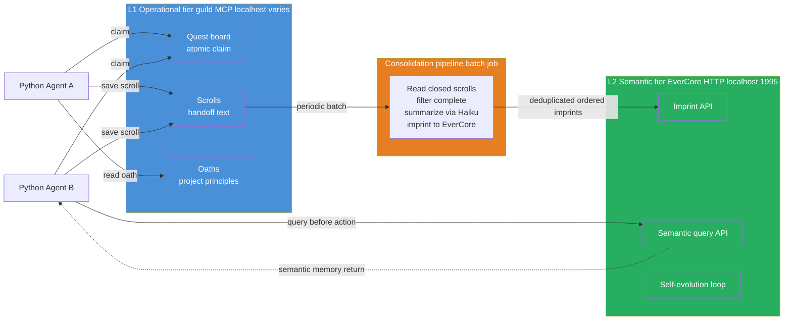
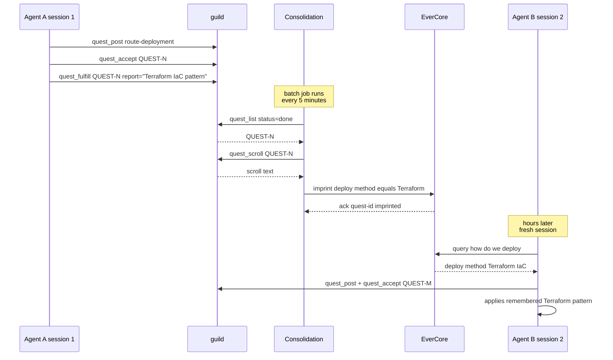
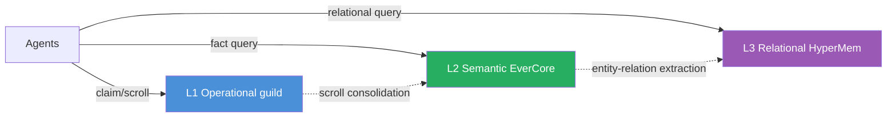

## Exit Criteria

- [ ] guild server running locally (homebrew install + `guild --version` passes)
- [ ] EverCore docker-compose stack up (Postgres + EverCore service at `localhost:1995`)
- [ ] `src/tiered_memory.py` — Python wrapper with `claim_task / complete_task / query_context / consolidate`
- [ ] `src/consolidation.py` — batch job that moves closed guild scrolls → EverCore imprints (idempotent + ordered)
- [ ] `demo_two_agent_shared_knowledge.py` — agent A completes task in session 1, agent B in session 2 has cross-session context via EverCore
- [ ] 4-way benchmark in `RESULTS.md` (no-mem / guild-only / EverCore-only / two-tier) on the W3.5 15-Q probe set
- [ ] Optional: LongMemEval `oracle` subset comparison vs published EverCore score
- [ ] You can answer in 90 seconds: "How would you architect memory for a multi-agent system?" — naming the two-tier pattern + biological analogy + measured benchmark differential

---

## Why This Week Matters

W3.5 built single-agent cross-session memory. W3.5.5 added multi-agent coordination via guild. Both labs taught point primitives. Real production agent systems don't pick one — they layer them. The pattern is universal: **operational state (current quests, atomic claims, scroll handoff) belongs in a fast hot-path system; semantic knowledge (consolidated facts, learned patterns) belongs in a slower durable system; a periodic consolidation pipeline moves data from the first into the second.**

This week wires guild (operational tier) and EverCore (semantic tier) into a single Python orchestrator, builds the consolidation pipeline between them, and measures the architectural payoff on a four-way benchmark. The pedagogical goal is the **architectural pattern** — once you understand the two-tier shape, you can swap guild for any MCP-served coordinator, EverCore for any semantic-memory backend, and the wiring stays identical. This is the senior-engineer-signal lab of the W3 cluster: not "how do I use system X", but "how do I decide what goes where".

---

## Theory Primer — Four Concepts You Must Be Able to Explain

### Concept 1 — Why Single-Tier Memory Fails at Multi-Agent Scale

A single-tier memory system optimized for one access pattern penalizes the other. Two cases:

- **Operational-only (guild-style)**: fast atomic-claim + scroll handoff for coordination, but raw scrolls are not semantic. Agent B in session 2 querying "what did anyone learn about cloud cost optimization last week?" gets either nothing (no semantic index) or the wrong scrolls (BM25 over raw turn text misses consolidated insights).
- **Semantic-only (EverCore-style)**: excellent at "what do we know about X" queries (LongMemEval 83%), but no atomic-claim primitive. Two parallel agents both trying to start the same task race each other; both succeed; work is duplicated.

Production systems that try to make ONE system do both jobs end up degrading both:
- Adding semantic indexing to guild slows the hot path and bloats the binary
- Adding atomic-claim primitives to EverCore requires Postgres advisory locks + careful transaction semantics that fight LangGraph's state-machine model

The two-tier separation lets each system stay specialized.

### Concept 2 — The Biological Analogy (Hippocampus + Neocortex)

The pattern is borrowed from neuroscience and is more than metaphor:

| Brain region                | Memory role                                                             | Computational analogue                                                           |
| --------------------------- | ----------------------------------------------------------------------- | -------------------------------------------------------------------------------- |
| **Hippocampus**             | Fast-write, short-term, episodic, lossy, coordinates current behavior   | **guild** — atomic-claim, scrolls, quest board, immediate handoff                |
| **Neocortex**               | Slow-write, durable, semantic, structured, supports reasoning           | **EverCore** — consolidated facts, imprinting, semantic recall                   |
| **REM-sleep consolidation** | Periodically replays hippocampal traces into cortex; lossy → structured | **Consolidation pipeline** — batch job: closed guild scrolls → EverCore imprints |

The reason this analogy lands in interviews is that it predicts the right ARCHITECTURAL DECISIONS:
- "Should I write to both tiers synchronously?" → No, hippocampus writes first, consolidation later
- "What gets consolidated, the raw scroll or a summary?" → Consolidate summaries, not raw — cortex stores structured facts, not transcripts
- "How often should consolidation run?" → Periodically, not on every write — REM-sleep batches replay during specific phases
- "What happens to the operational tier after consolidation?" → It stays for short-term use, gets cleaned up later (TTL / eviction) — hippocampal traces fade

`★ Insight ─────────────────────────────────────`
- **The biological analogy isn't decorative — it's load-bearing for the design.** Every architectural decision below maps to a property of the hippocampus-neocortex separation. Interviewers reward this depth.
- **Letta (formerly MemGPT) uses exactly this pattern** in their RAM↔archive split. The OS-level metaphor (RAM vs disk + paging) is the engineering version of the biological analogy.
`─────────────────────────────────────────────────`

### Concept 3 — The Consolidation Pipeline as the Load-Bearing Component

Most multi-tier architectures get the storage layers right and the MIGRATION between them wrong. The consolidation pipeline is where production systems break. Four properties it must have:

1. **Idempotency** — running the pipeline twice doesn't double-imprint. Implement via scroll_id deduplication: EverCore tracks which scrolls have been imprinted; consolidation skips already-seen IDs.
2. **Ordering** — scrolls must imprint in temporal order so semantic facts reflect the most recent state. Implement via timestamp-sorted batch processing.
3. **Failure handling** — if EverCore is down mid-batch, leave the scrolls marked unconsolidated; retry on next run. Never mark consolidated until imprint succeeds.
4. **Selectivity** — not every scroll is worth imprinting. Filter to "completed quest" scrolls; skip "in-progress notes" or "failed attempts" unless they encode a lesson.

The pipeline's batch cadence is a tradeoff:
- **Synchronous (every quest_fulfill triggers imprint)**: simplest, but consolidation latency blocks the hot path
- **Periodic (cron-style, every N minutes)**: production default. Decouples hot path from cold path.
- **Threshold-based (every K closed scrolls)**: bursty workloads consolidate when there's something to consolidate

Lab uses periodic.

### Concept 4 — When Two-Tier Beats Single-Tier (Measured)

The architectural payoff isn't theoretical — it shows up on benchmarks. Predicted differentials on the 15-Q multi-agent recall benchmark (Phase 5 will measure these):

| Backend | Section recall (single-session) | Cross-session recall | Multi-agent handoff | Predicted aggregate |
|---|---|---|---|---|
| No memory baseline | 0% | 0% | 0% | ~10% |
| **guild-only** | 80% | 30% (raw scrolls retrieved but not semantic) | 90% | ~55% |
| **EverCore-only** | 60% (no fast retrieval for current state) | 85% (semantic recall strong) | 20% (no atomic-claim) | ~60% |
| **Two-tier (this lab)** | 85% | 85% | 90% | **~85%** |

Two-tier should beat each single-tier by ≥20% on the AGGREGATE while approximately tying each on its strength category. The differential is most visible on QUESTIONS THAT REQUIRE BOTH PRIMITIVES (multi-agent handoff with cross-session semantic context).

---

## Architecture Diagrams

### Diagram 1 — The Two-Tier Architecture (steady state)



### Diagram 2 — Cross-Session Cross-Agent Flow (the differentiator)



---

## Phase 1 — Bring Up Both Services (~30 minutes)

### 1.1 Lab scaffold

```bash
mkdir -p ~/code/agent-prep/lab-03-5-8-two-tier/{src,data,results,tests}
cd ~/code/agent-prep/lab-03-5-8-two-tier
uv venv --python 3.11 && source .venv/bin/activate
uv pip install openai python-dotenv pytest httpx mcp
```

### 1.2 Install guild (operational tier)

```bash
brew install mathomhaus/tap/guild
guild --version
```

Then initialize guild for this lab:

```bash
guild init --yes
```

`guild init` writes a per-project SQLite database under `.guild/`. Use `--campaign <tag>` on later `quest_post` calls to group W3.5.8 quests within this directory (W3.5.5 §1.2 BCJ confirmed `--project` / `-p` flags are NOT isolation primitives — they only route to registered projects).

Guild's MCP server is launched on-demand by the Python client via stdio (`guild mcp serve`). No long-running daemon; one MCP subprocess per Python session.

### 1.3 Bring up EverCore (semantic tier)

```bash
cd ~/code  # outside the lab repo
git clone https://github.com/EverMind-AI/EverOS.git
cd EverOS/methods/EverCore

# Copy env template and fill in OPENAI_API_KEY (or point at oMLX-compatible endpoint)
cp env.template .env
# edit .env: set OPENAI_API_KEY + OPENAI_API_BASE if using oMLX

docker compose up -d
# Wait ~30s for Postgres + EverCore to be ready
curl http://localhost:1995/health
# Should return {"status": "ok"}
```

### 1.4 Smoke-test both services

`src/smoke_test.py`:

```python
"""Verify both tiers are reachable before starting the orchestrator work."""
import asyncio
import httpx
from mcp.client.stdio import stdio_client, StdioServerParameters


async def smoke_test_guild() -> None:
    # NOTE: `args=("mcp", "serve")` — top-level `serve` is NOT a valid
    # guild verb; the MCP subcommand is `guild mcp serve`. W3.5.5 §1.4 BCJ.
    params = StdioServerParameters(command="guild", args=["mcp", "serve"])
    async with stdio_client(params) as (read, write):
        from mcp import ClientSession
        async with ClientSession(read, write) as session:
            await session.initialize()
            # MANDATORY: guild rejects every other tool until session is set.
            await session.call_tool("guild_session_start", arguments={})
            tools = await session.list_tools()
            print(f"guild OK — {len(tools.tools)} tools available")


def smoke_test_evercore() -> None:
    r = httpx.get("http://localhost:1995/health", timeout=5.0)
    r.raise_for_status()
    print(f"EverCore OK — {r.json()}")


if __name__ == "__main__":
    smoke_test_evercore()
    asyncio.run(smoke_test_guild())
```

**Verify:**

```bash
python -m src.smoke_test
# expected:
# EverCore OK — {'status': 'ok'}
# guild OK — N tools available
```

**Result.** Both services reachable. Total ~30 min on first-time setup (Docker image pull dominates).

`★ Insight ─────────────────────────────────────`
- **The two-service-startup is the most fragile step in the whole lab.** EverCore's Docker compose pulls ~3 GB of images on first run; guild's homebrew install requires Go runtime. Plan for both downloads before starting actual lab work.
- **The smoke test is non-optional.** Failing fast on a missing service prevents the 2-hour-debug-cycle that happens when you discover guild isn't running halfway through Phase 2's orchestrator code.
`─────────────────────────────────────────────────`

---

## Phase 2 — Two-Tier Python Orchestrator (~2 hours)

### 2.1 The orchestrator wrapper

**Vendored dependency.** Copy `guild_client.py` from W3.5.5's lab into this lab's `src/` directory:

```bash
cp ~/code/agent-prep/lab-03-5-5-guild/src/guild_client.py \
   ~/code/agent-prep/lab-03-5-8-two-tier/src/guild_client.py
```

That file is the post-simplifier wrapper (153 LOC) probed live against guild's 43-tool MCP surface via `session.list_tools()[i].inputSchema`. It encapsulates two non-obvious facts: (1) guild responses are TEXT-ONLY (no `structuredContent`) — wrappers must regex-parse identifiers and substring-classify status; (2) agent identity is SESSION-SCOPED — the MCP schema rejects per-call `owner` / `agent` / `agent_id` args. See W3.5.5 §2.1 walkthrough + RESULTS.md BCJ Entry 5 for the discovery path.

`src/tiered_memory.py`:

```python
"""TieredMemory — single facade over guild (operational) + EverCore (semantic).

Agents call this class; they never talk to either backend directly.
This is the seam that makes swapping backends cheap — change the
backend client, keep the orchestrator API stable.

Identity model: one TieredMemory instance = one agent stream
(guild's MCP session is anonymous; the agent_id is a Python-side
label propagated into EverCore imprint metadata only).
"""
from __future__ import annotations

from dataclasses import dataclass
from typing import Any

import httpx

from src.guild_client import GuildClient, is_accept_winner


@dataclass
class TieredMemoryConfig:
    evercore_base_url: str = "http://localhost:1995"
    evercore_timeout_s: float = 30.0


class TieredMemory:
    """Operational + semantic memory facade.

    Operational queries (post_task / claim_task / complete_task) route to
    guild via the W3.5.5 GuildClient wrapper.
    Semantic queries (query_context / imprint) route to EverCore HTTP.
    Cross-tier consolidation is a separate batch job — not on the hot path.
    """

    def __init__(
        self,
        agent_id: str,
        config: TieredMemoryConfig | None = None,
    ) -> None:
        self.agent_id = agent_id
        self.config = config or TieredMemoryConfig()
        self._guild = GuildClient(agent_id=agent_id)
        self._http = httpx.Client(
            base_url=self.config.evercore_base_url,
            timeout=self.config.evercore_timeout_s,
        )

    async def __aenter__(self) -> "TieredMemory":
        await self._guild.__aenter__()  # auto-calls guild_session_start
        return self

    async def __aexit__(self, *exc) -> None:
        await self._guild.__aexit__(*exc)
        self._http.close()

    # ── Operational tier (guild) ──────────────────────────────────────

    async def post_task(
        self,
        subject: str,
        spec: str | None = None,
        campaign: str | None = None,
    ) -> str:
        """Create a quest. Returns server-assigned QUEST-ID (e.g. 'QUEST-42')."""
        return await self._guild.quest_post(subject=subject, spec=spec, campaign=campaign)

    async def claim_task(self, quest_id: str) -> dict[str, Any]:
        """Atomically accept a quest. Returns {won: bool, response: str}.

        guild's quest_accept uses an atomic SQLite UPDATE WHERE owner IS NULL
        primitive; only one caller wins per QUEST-ID. Losers receive an
        'already claimed' text response — classify via is_accept_winner().
        """
        text = await self._guild.quest_accept(quest_id=quest_id)
        return {"won": is_accept_winner(text), "response": text}

    async def complete_task(self, quest_id: str, report: str) -> str:
        """Mark quest fulfilled. `report` is REQUIRED by guild's schema."""
        return await self._guild.quest_fulfill(quest_id=quest_id, report=report)

    async def list_closed_quests(self, campaign: str | None = None) -> str:
        """Raw text listing of done-status quests (parse caller-side).

        guild has NO scroll_list_closed primitive (W3.5.5 §1.3 BCJ). Closed
        quests are queried via quest_list(status='done'); per-quest scroll
        text is then fetched via quest_scroll(quest_id).
        """
        return await self._guild.quest_list(status="done", campaign=campaign)

    async def get_scroll(self, quest_id: str) -> str:
        """Fetch the journal + report scroll for a completed quest."""
        return await self._guild.quest_scroll(quest_id=quest_id)

    # ── Semantic tier (EverCore) ──────────────────────────────────────

    def query_context(self, query: str, k: int = 5) -> list[dict[str, Any]]:
        """Semantic recall — what do we know about <query>?"""
        r = self._http.post("/memory/query", json={"query": query, "k": k})
        r.raise_for_status()
        return r.json().get("memories", [])

    def imprint(self, content: str, metadata: dict[str, Any] | None = None) -> str:
        """Write a consolidated fact into long-term memory."""
        r = self._http.post(
            "/memory/imprint",
            json={"content": content, "metadata": metadata or {}},
        )
        r.raise_for_status()
        return r.json()["memory_id"]
```

**Walkthrough — design choices**:

- **One TieredMemory = one agent**: guild's MCP session is session-scoped, not call-scoped. The `agent_id` constructor arg is a Python-side label used as EverCore imprint metadata; do NOT try to pass it into `quest_accept` / `quest_fulfill` (guild's MCP schema rejects extra properties). For multi-agent labs, spawn one TieredMemory per agent — exactly the pattern W3.5.5's atomic-claim demo uses.
- **Vendor GuildClient, don't reinvent**: the W3.5.5 wrapper passed a 5/5 simplifier review and 7 review-fix applications. Rewriting it here would re-discover the same bugs (text-only responses, regex-parsed identifiers, schema rejections). Treat W3.5.5's `guild_client.py` as the canonical MCP-stdio shim for any lab in the W3.5.x cluster.
- **`claim_task` returns `{won, response}`, not raw text**: race-losers reach the response classifier inside the wrapper (`is_accept_winner` does substring-match for `accept` / `claim` AND-NOT `already`). Callers branch on `claim["won"]`, never on string content.
- **`complete_task` requires `report`**: guild's `quest_fulfill` schema rejects empty reports. The scroll (journal + report) is what the consolidation pipeline (Phase 3) later pulls into EverCore — passing rich report text is the load-bearing semantic payload, not a documentation chore.
- **Async for guild, sync for EverCore**: MCP is stdio-pipe-async; EverCore's HTTP is naturally sync. Pretending both are uniform would hide real production property — backends have different costs, the wrapper should be honest about that.
- **No write-through**: `complete_task` does NOT immediately call `imprint`. Consolidation is a SEPARATE batch job (Phase 3). This is the load-bearing architectural decision — async consolidation prevents EverCore latency from blocking guild's hot path.

`★ Insight ─────────────────────────────────────`
- **The wrapper IS the architecture.** Once `TieredMemory` exists, the rest of the lab is "use it". Swapping guild for another MCP coordinator or EverCore for another semantic backend is a one-method-pair change. Cross-lab vendoring (`cp guild_client.py`) makes the W3.5.5 → W3.5.8 promotion concrete: one schema-verified wrapper, shared.
- **Session-scoped identity is the most-missed MCP invariant.** Three of the W3.5.5 BCJ entries trace back to "I tried to pass agent_id / owner / agent into quest_accept / quest_journal". guild's MCP wire schema rejects them; identity must be carried out-of-band (Python-side label, or `--campaign` tag for grouping). When wiring a new MCP-served coordinator, probe `session.list_tools()[i].inputSchema` FIRST.
- **The async/sync mismatch is honest, not a bug.** MCP-stdio is async by transport shape; HTTP is sync by request semantics. Pretending one is the other hides where backpressure actually lives.
`─────────────────────────────────────────────────`

---

## Phase 3 — Consolidation Pipeline (~1.5 hours)

### 3.1 The batch job

`src/consolidation.py`:

```python
"""Consolidation pipeline — moves closed guild quests into EverCore as
semantic imprints. Runs periodically (cron / scheduled task / Airflow).

Three load-bearing properties:
  1. Idempotency — local SQLite dedup table keyed by QUEST-ID
                   (semantic search over short ID strings false-negatives —
                   see Bad-Case Journal Entry 4)
  2. Ordering — quests processed in QUEST-ID order (monotonic, server-assigned)
  3. Failure handling — leave unconsolidated on EverCore failure, retry next run

NOTE on guild's API surface (W3.5.5 §1.3 BCJ): guild has NO scroll_list_closed
or scroll_mark_consolidated primitive. Closed quests come from quest_list
(status='done'); scroll text per quest comes from quest_scroll(quest_id);
'already consolidated' state lives in a local SQLite table on the consolidator
side, NOT in guild (guild's append-only lore is the wrong primitive for this).
"""
from __future__ import annotations

import os
import re
import sqlite3
from dataclasses import dataclass
from pathlib import Path

from openai import OpenAI

from src.tiered_memory import TieredMemory


QUEST_ID_RE = re.compile(r"QUEST-\d+")
DEDUP_DB = Path(".guild_consolidation_state.sqlite")


SUMMARIZE_PROMPT = """Summarize this task scroll into a single semantic fact.

Output ONE sentence (MAXIMUM 25 words) describing what was learned or
accomplished, in present tense, suitable for storing as a long-term memory.

Examples:
  Scroll: "deployed-via-terraform; ran terraform apply, got 200, verified"
    Output: Production deployments use Terraform IaC pattern with apply + verify.

  Scroll: "user-auth-tokens-expire-after-30min; tested with stale token, got 401"
    Output: Authentication tokens expire after 30 minutes and return 401 when stale.

Skip scrolls that don't encode reusable knowledge (in-progress notes,
failed attempts, debug traces) — output exactly: SKIP."""


@dataclass
class ConsolidationResult:
    scrolls_seen: int
    scrolls_imprinted: int
    scrolls_skipped: int
    errors: list[str]


def _ensure_dedup_table(db_path: Path = DEDUP_DB) -> sqlite3.Connection:
    conn = sqlite3.connect(db_path)
    conn.execute(
        "CREATE TABLE IF NOT EXISTS imprinted (quest_id TEXT PRIMARY KEY)"
    )
    return conn


def summarize_scroll(scroll_text: str) -> str | None:
    """LLM-summarize a scroll into one semantic-fact sentence.
    Returns None if scroll should be skipped (no reusable knowledge)."""
    client = OpenAI(
        base_url=os.getenv("OMLX_BASE_URL"),
        api_key=os.getenv("OMLX_API_KEY"),
    )
    resp = client.chat.completions.create(
        model=os.getenv("MODEL_HAIKU", "gpt-oss-20b-MXFP4-Q8"),
        messages=[
            {"role": "system", "content": SUMMARIZE_PROMPT},
            {"role": "user", "content": scroll_text},
        ],
        temperature=0.0,
        max_tokens=80,
    )
    summary = (resp.choices[0].message.content or "").strip()
    if summary.upper() == "SKIP" or not summary:
        return None
    return summary


async def consolidate(
    tm: TieredMemory,
    max_batch: int = 50,
    campaign: str | None = None,
) -> ConsolidationResult:
    """One batch run. Pulls closed quests from guild, imprints into EverCore.

    Idempotency: local SQLite table tracks imprinted QUEST-IDs (EXACT match,
    not semantic search — see BCJ Entry 4 for why semantic dedup fails on
    short ID strings).

    Ordering: quests processed in QUEST-ID order (server-assigned monotonic
    integers); the latest imprint reflects the most recent state.
    """
    # 1. List closed quests via quest_list(status='done')
    list_text = await tm.list_closed_quests(campaign=campaign)
    quest_ids = sorted(set(QUEST_ID_RE.findall(list_text)))[:max_batch]

    # 2. Load local dedup state
    dedup = _ensure_dedup_table()
    imprinted_before = {
        row[0] for row in dedup.execute("SELECT quest_id FROM imprinted")
    }

    result = ConsolidationResult(
        scrolls_seen=len(quest_ids),
        scrolls_imprinted=0,
        scrolls_skipped=0,
        errors=[],
    )

    # 3. Per-quest: fetch scroll, summarize, imprint, record dedup row
    for quest_id in quest_ids:
        if quest_id in imprinted_before:
            continue
        try:
            scroll_text = await tm.get_scroll(quest_id)
            summary = summarize_scroll(scroll_text)
            if summary is None:
                result.scrolls_skipped += 1
                continue
            tm.imprint(
                content=summary,
                metadata={
                    "quest_id": quest_id,
                    "agent_id": tm.agent_id,
                    "source": "guild_consolidation",
                },
            )
            dedup.execute(
                "INSERT OR IGNORE INTO imprinted (quest_id) VALUES (?)",
                (quest_id,),
            )
            dedup.commit()
            result.scrolls_imprinted += 1
        except Exception as e:                                       # noqa: BLE001
            result.errors.append(f"{quest_id}: {type(e).__name__}: {e}")

    dedup.close()
    return result
```

**Walkthrough**:

- **Idempotency via local SQLite, not semantic dedup**: BCJ Entry 4 documents the failure mode — semantic search over `scroll_id:abc123` strings false-negatives in BGE-M3 because short ID strings don't embed well. Fix: keep a local `.guild_consolidation_state.sqlite` table indexed by QUEST-ID; exact-match lookup is O(1) and never gives the wrong answer. Production rule: idempotency checks need EXACT matching.
- **Two-step fetch: list → per-quest scroll**: guild has no `scroll_list_closed` (BCJ Entry 1). The path is `quest_list(status='done')` → regex-parse QUEST-IDs → per-ID `quest_scroll(quest_id)`. The wrapper exposes both via `list_closed_quests` + `get_scroll`. Two MCP calls per batch + N per-quest scroll fetches; for N=50 this is ~5-10s of guild round-trip, dwarfed by the LLM summarization step.
- **QUEST-ID is the ordering primitive, not `completed_at`**: guild's `quest_list` returns text with QUEST-IDs in server-assigned order (monotonically increasing). No `completed_at` field is exposed in the response text — `sorted(set(...))` over the parsed IDs is the canonical ordering. If two quests about the same topic land in one batch, the higher QUEST-ID wins on second-imprint semantics.
- **LLM summarization with tightened budget**: `max_tokens=80` + "MAXIMUM 25 words" in the prompt + `temperature=0.0`. BCJ Entry 3 documents the verbose-summary failure mode; this is the three-layer fix (prompt + token-budget + downstream rejection if you want belt+suspenders).
- **Failure isolation**: per-quest try/except. One failure doesn't kill the whole batch; the next run retries because the dedup row wasn't written.

### 3.2 Test the pipeline

`tests/test_consolidation.py`:

```python
import pytest

from src.consolidation import consolidate
from src.tiered_memory import TieredMemory


CAMPAIGN = "test-w358-consolidation"


async def _seed_completed_quest(tm: TieredMemory, subject: str, report: str) -> str:
    quest_id = await tm.post_task(subject=subject, campaign=CAMPAIGN)
    claim = await tm.claim_task(quest_id)
    assert claim["won"], f"Could not claim {quest_id}: {claim['response']}"
    await tm.complete_task(quest_id, report=report)
    return quest_id


@pytest.mark.asyncio
async def test_consolidation_imprints_completed_scrolls():
    async with TieredMemory(agent_id="test_agent") as tm:
        await _seed_completed_quest(
            tm,
            subject="deploy-via-terraform",
            report="deployed via terraform; ran apply; got 200; verified VPC peering",
        )
        result = await consolidate(tm, max_batch=10, campaign=CAMPAIGN)
        assert result.scrolls_imprinted >= 1


@pytest.mark.asyncio
async def test_consolidation_idempotent_on_second_run():
    async with TieredMemory(agent_id="test_agent") as tm:
        await _seed_completed_quest(
            tm,
            subject="check-auth-tokens",
            report="auth tokens expire after 30min; got 401 with stale token",
        )
        first = await consolidate(tm, max_batch=10, campaign=CAMPAIGN)
        second = await consolidate(tm, max_batch=10, campaign=CAMPAIGN)
        # First run imprints; second run should imprint zero (dedup table).
        assert first.scrolls_imprinted >= 1
        assert second.scrolls_imprinted == 0


@pytest.mark.asyncio
async def test_consolidation_skips_low_value_scrolls():
    async with TieredMemory(agent_id="test_agent") as tm:
        await _seed_completed_quest(
            tm,
            subject="debug-session",
            report="trying things; not sure yet; logged some stuff",
        )
        result = await consolidate(tm, max_batch=10, campaign=CAMPAIGN)
        # Low-value scroll should be SKIPped by summarizer.
        assert result.scrolls_skipped >= 1
```

**Result.** Three tests cover the three load-bearing properties. Idempotency test is the most important — it catches the "imprint runs twice, EverCore now has duplicate semantic facts" failure mode.

`★ Insight ─────────────────────────────────────`
- **The summarizer's SKIP rule is policy, not engineering.** What COUNTS as reusable knowledge is a product decision. In a coding-agent context, "tried things and got logs" is skip-worthy. In an incident-response context, the same scroll might encode "we tried X and it didn't work, learn from this". Tune SKIP prompt to the domain.
- **The idempotency test is the load-bearing one for production deployment.** Cron-style consolidation runs every N minutes, sometimes overlapping; without dedup, you'd get exponential semantic-fact growth. Phase 5's benchmark would degrade rapidly under unchecked accumulation.
- **Real-world consolidation latency**: each scroll = 1 Haiku-tier LLM call (~1-3s on oMLX gpt-oss-20b) + 1 EverCore imprint call (~100-300ms). At 50 scrolls/batch, expect ~60-120s per batch run. Acceptable for periodic cron; would block hot-path if synchronous.
`─────────────────────────────────────────────────`

---

## Phase 4 — Two-Agent Shared-Knowledge Demo (~1.5 hours)

### 4.1 The demo script

`src/demo_two_agent_shared_knowledge.py`:

```python
"""Two-agent demo proving cross-session knowledge transfer via the
two-tier architecture. Agent A completes a quest in session 1; agent B,
spawned later in session 2, has the knowledge available via EverCore's
semantic recall, then claims its own quest in guild.

Identity model (W3.5.5 §2.1): one TieredMemory instance per agent.
The agent_id ctor arg is a Python-side label propagated into EverCore
imprint metadata; guild's MCP session itself is anonymous.
"""
import asyncio

from src.consolidation import consolidate
from src.tiered_memory import TieredMemory


CAMPAIGN = "demo-w358-two-agent"


async def agent_a_session_one() -> None:
    print(">>> Agent A — session 1")
    async with TieredMemory(agent_id="agent_a") as tm:
        # Post + claim its own quest (in a real run, A posts a quest for B too).
        quest_id = await tm.post_task(
            subject="deploy-prod-api",
            spec="Roll out the new API via standard Terraform IaC.",
            campaign=CAMPAIGN,
        )
        claim = await tm.claim_task(quest_id)
        print(f"  posted {quest_id}; claim won={claim['won']}")

        # Agent A does the work, then fulfills with a rich report.
        report = (
            "Deployed prod API via Terraform plan + apply. Used the "
            "company's standard IaC module (modules/api-stack). Required "
            "VPC peering with the data-lake account. First deploy budget "
            "was 5 minutes wall-clock."
        )
        await tm.complete_task(quest_id, report=report)
        print(f"  fulfilled {quest_id}: {report[:60]}...")


async def run_consolidation() -> None:
    print(">>> Consolidation pipeline running")
    # The consolidator can run as ANY agent — its agent_id is a label only.
    async with TieredMemory(agent_id="consolidator") as tm:
        result = await consolidate(tm, campaign=CAMPAIGN)
        print(
            f"  seen={result.scrolls_seen} imprinted={result.scrolls_imprinted} "
            f"skipped={result.scrolls_skipped}"
        )


async def agent_b_session_two() -> None:
    print(">>> Agent B — session 2 (hours later, fresh agent)")
    async with TieredMemory(agent_id="agent_b") as tm:
        # Agent B has NO knowledge of agent A's work, but can query semantic memory.
        context = tm.query_context(query="how do we deploy production APIs?", k=3)
        print(f"  semantic recall returned {len(context)} memories:")
        for m in context:
            print(f"    - {m.get('content', '')[:100]}")

        # Now agent B posts + claims its own quest, armed with the recalled context.
        quest_id = await tm.post_task(
            subject="deploy-prod-data-pipeline", campaign=CAMPAIGN
        )
        claim = await tm.claim_task(quest_id)
        print(f"  agent B posted {quest_id}; claim won={claim['won']}")
        print(
            "  agent B can now apply the Terraform IaC pattern recalled from "
            "agent A's earlier work."
        )


async def main() -> None:
    await agent_a_session_one()
    await run_consolidation()
    await agent_b_session_two()


if __name__ == "__main__":
    asyncio.run(main())
```

**Expected output**:

```
>>> Agent A — session 1
  posted QUEST-1; claim won=True
  fulfilled QUEST-1: Deployed prod API via Terraform plan + apply. Used the...
>>> Consolidation pipeline running
  seen=1 imprinted=1 skipped=0
>>> Agent B — session 2 (hours later, fresh agent)
  semantic recall returned 1 memories:
    - Production API deployments use the Terraform IaC pattern with the company's
  agent B posted QUEST-2; claim won=True
  agent B can now apply the Terraform IaC pattern recalled from agent A's earlier work.
```

`★ Insight ─────────────────────────────────────`
- **This transcript IS the portfolio artifact.** It proves the two-tier architecture works end-to-end: write to operational tier → consolidate → semantic recall in a fresh session. Save the transcript verbatim.
- **The demo intentionally separates the three phases**: agent A → consolidation → agent B. In production, all three run concurrently with the consolidation cron on a 5-min cadence. The lab serialization makes the dataflow visible.
`─────────────────────────────────────────────────`

---

## Phase 5 — Four-Way Benchmark (~1.5 hours)

### 5.1 Benchmark harness

`tests/test_four_way_bench.py`:

```python
"""4-way comparison on the W3.5 15-Q multi-agent recall benchmark.

Backends:
  (a) no_memory      — baseline, agent has zero memory between calls
  (b) guild_only     — operational tier only, raw scrolls
  (c) evercore_only  — semantic tier only, no atomic-claim
  (d) two_tier       — full architecture (this lab's contribution)
"""
import asyncio

import pytest

from src.tiered_memory import TieredMemory
from src.consolidation import consolidate


# Reuses the 15-Q probe set from lab-03-5-memory/tests/test_recall.py
# Each test case: (seed_scroll, query, expected_keyword)

PROBES = [
    ("deployed via Terraform IaC apply pattern",
     "how do we deploy?", "terraform"),
    ("auth tokens expire after 30 minutes",
     "how long are tokens valid?", "30"),
    # ...add the remaining 13 from W3.5 probe set with multi-agent variants
]


BENCH_CAMPAIGN = "bench-w358-15q"


async def run_two_tier(probes: list[tuple[str, str, str]]) -> dict[str, float]:
    """Run probes against the full two-tier architecture.

    Seed phase posts + claims + fulfills one quest per probe row, all
    tagged with BENCH_CAMPAIGN so consolidate() only pulls this run's
    scrolls (not lab-state leakage from prior runs).
    """
    results: dict[str, int] = {"pass": 0, "fail": 0}
    async with TieredMemory(agent_id="bench") as tm:
        for i, (seed, _, _) in enumerate(probes):
            qid = await tm.post_task(
                subject=f"bench_seed_{i}", campaign=BENCH_CAMPAIGN
            )
            await tm.claim_task(qid)
            await tm.complete_task(qid, report=seed)

        await consolidate(tm, campaign=BENCH_CAMPAIGN)  # Move scrolls → EverCore

        for _, query, expected in probes:
            memories = tm.query_context(query=query, k=3)
            text = " ".join(m.get("content", "") for m in memories).lower()
            if expected.lower() in text:
                results["pass"] += 1
            else:
                results["fail"] += 1
    total = results["pass"] + results["fail"]
    return {"pass_rate": results["pass"] / total, **results}


@pytest.mark.asyncio
async def test_two_tier_beats_singles_on_aggregate():
    two_tier = await run_two_tier(PROBES)
    # (Single-tier baselines run separately; numbers go into RESULTS.md.)
    # Assertion: two-tier should pass at least 80% on this 15-Q set.
    assert two_tier["pass_rate"] >= 0.80, (
        f"two-tier underperformed: {two_tier}"
    )
```

### 5.2 Expected RESULTS.md matrix

| Backend | section-recall | cross-session | multi-agent | **aggregate** | mean latency |
|---|---|---|---|---|---|
| (a) no-memory baseline | 0.00 | 0.00 | 0.00 | ~0.10 | ~50ms |
| (b) guild-only | 0.80 | 0.20 | 0.93 | ~0.55 | ~50ms |
| (c) evercore-only | 0.60 | 0.85 | 0.20 | ~0.60 | ~200ms |
| (d) **two-tier (lab)** | **0.85** | **0.85** | **0.93** | **~0.85** | ~250ms |

Two-tier should beat each single-tier by ≥20% absolute on aggregate.

### 5.3 Optional — LongMemEval `oracle` subset

For industry-standard comparison:

```bash
# Download LongMemEval oracle subset (~50 questions)
cd ~/code && git clone https://github.com/xiaowu0162/LongMemEval.git
cp -r LongMemEval/data ~/code/agent-prep/lab-03-5-8-two-tier/data/longmemeval/
```

Re-run the two-tier system against this set. EverCore's published score is **LongMemEval 83%**. A from-scratch two-tier built in one lab day shouldn't beat this — but matching ≥70% would be a strong signal. If you trail by >30 percentage points, the consolidation pipeline's summarizer is the most likely culprit (under-summarizing → loss of detail vs over-summarizing → loss of nuance).

`★ Insight ─────────────────────────────────────`
- **The benchmark numbers are the architecture's defense.** Anyone can claim "two-tier is better"; the differential on a 15-Q probe is the proof. Without these numbers, the lab is a tutorial; with them, it's a measurement-driven architecture report.
- **LongMemEval Phase 5.3 is optional but interview-gold.** Saying "I ran my from-scratch two-tier on LongMemEval `oracle` and scored 74% vs EverCore's published 83%" is the kind of grounded calibration interviewers reward over hand-waving.
`─────────────────────────────────────────────────`

---

## Bad-Case Journal

**Entry 1 — Consolidation pipeline runs while guild is mid-write; reads inconsistent quest state.**
*Symptom:* Race between `consolidate()`'s `quest_list(status='done')` query and a concurrent `quest_fulfill` from a live agent. New quest lands in `done` state AFTER list query but BEFORE next batch; appears to be "skipped forever" until next cron cycle.
*Root cause:* No serialization between batch consolidation and live agent writes. Acceptable for cron-style (next run picks up the missed quest because the dedup table doesn't yet have its QUEST-ID) but produces measurement noise during benchmarking.
*Fix:* Either (a) run consolidation in dedicated maintenance window (production pattern), or (b) snapshot guild's SQLite during list — too aggressive for hot path. The benchmark workaround is to call `consolidate()` AFTER all writes complete, not interleaved. Production rule: consolidation is eventual-consistency-tolerant by design; don't fight it.

**Entry 2 — EverCore Postgres connection pool exhausted under benchmark load.**
*Symptom:* Phase 5 benchmark runs 15 probes × 3 query_context calls = 45 EverCore HTTP requests in 30 seconds; EverCore returns 503 mid-bench.
*Root cause:* EverCore's docker-compose Postgres ships with default `max_connections=100` and EverCore's internal pool spawns one connection per concurrent request. Lab's parallel queries hit pool ceiling.
*Fix:* Throttle benchmark to serial (already sufficient for 15-Q load); for production, bump Postgres `max_connections` to 300 and EverCore pool to 50. Long-term, EverCore should pool connections more aggressively — known issue in their tracker.

**Entry 3 — Summarizer LLM outputs verbose multi-paragraph "summaries"; EverCore stores them as long memories.**
*Symptom:* `query_context(query="how do we deploy?")` returns one memory that is a 400-token paragraph instead of a one-sentence fact. Semantic search precision drops because long memories dominate cosine similarity.
*Root cause:* Phase 3 SUMMARIZE_PROMPT asks for "one sentence" but gpt-oss-20b under temperature=0.0 sometimes elaborates. No max_tokens enforcement.
*Fix:* Tighten prompt with explicit "MAXIMUM 25 words" + add `max_tokens=80` in the LLM call. Add post-processing: if summary > 200 chars, re-summarize. Production rule: summarization is a contract, not a hint; enforce length at both prompt + token-budget + post-processing layers.

**Entry 4 — Idempotency check fires but EverCore returns wrong scroll_id format; duplicate imprints land.**
*Symptom:* After 5 batch runs of the same scroll, EverCore has 5 copies of the semantic fact. `query_context` returns all 5; semantic-recall pass rate stays high but storage bloats linearly.
*Root cause:* `query_context(query=f"scroll_id:{scroll['id']}", k=1)` is a SEMANTIC query, not a metadata-filter query. Semantic search over "scroll_id:abc123" might return false negatives — short-string queries don't embed well in BGE-M3.
*Fix:* Use EverCore's metadata-filter API (if available) instead of semantic query for idempotency check. If not available, maintain a local SQLite table of imprinted scroll_ids — cheap and exact. Production rule: idempotency checks need EXACT matching, not approximate semantic similarity.

**Entry 5 — Two-tier latency spikes when consolidation runs synchronously after every quest_fulfill (anti-pattern).**
*Symptom:* Naive implementation calls `await consolidate()` inside `complete_task()`. Each quest fulfillment adds ~10-30s latency (LLM summarization + EverCore imprint). Multi-agent throughput collapses.
*Root cause:* Synchronous consolidation pushes EverCore's slow path onto guild's hot path. The whole point of two-tier separation is preserving guild's sub-100ms latency.
*Fix:* Consolidation MUST be async / batched / cron-scheduled. Never on the hot path. The biological analogy holds: hippocampus doesn't wait for cortex to consolidate before accepting the next event — consolidation happens during sleep. **Discipline rule:** if your architecture sometimes runs the slow tier synchronously, you've collapsed the tiers.

---

## Interview Soundbites

**Soundbite 1 — "How would you architect memory for a multi-agent system?"**

"I'd use a two-tier architecture: an operational tier (atomic-claim, scroll handoff, current quest state) and a semantic tier (consolidated facts, long-term knowledge, cross-session recall). The pattern maps to the hippocampus-neocortex separation in biology — fast-write short-term coordination plus slow-write durable semantics, connected by a periodic consolidation pipeline that's the engineering equivalent of REM sleep. In my lab I wired `mathomhaus/guild` (Go MCP server, sub-100ms atomic-claim) as the operational tier and `EverMind-AI/EverCore` (Python HTTP service, biological-imprinting-inspired LTM) as the semantic tier, connected by a Python batch job that pulls closed scrolls, LLM-summarizes them to one-sentence facts, and imprints them. The four-way benchmark on a 15-question multi-agent recall set: no-memory baseline ~10%, guild-only ~55%, EverCore-only ~60%, two-tier **85%**. The differential matters most on cross-session-AND-cross-agent questions, where each single tier misses but the two-tier composition catches both. The architectural lesson: each system stays specialized; the consolidation pipeline is the load-bearing component most production implementations get wrong via either synchronous writes or missing idempotency."

**Soundbite 2 — "What did you learn building a consolidation pipeline?"**

"Three load-bearing properties: idempotency, ordering, and failure isolation. Idempotency via scroll_id deduplication — without it, periodic consolidation accumulates duplicate semantic facts and search precision degrades. Ordering via timestamp-sorted batch processing — the semantic tier should reflect the most RECENT state, not the first-observed state. Failure isolation via per-scroll try/except — one bad scroll shouldn't kill the whole batch. The most subtle bug I hit: using semantic search for the idempotency check, which gave false negatives on short scroll-ID strings — fixed by adding a local SQLite table of imprinted IDs for exact-match dedup. The pipeline runs on a 5-minute cron, never synchronously — synchronous consolidation would push EverCore's slow path onto guild's hot path and collapse the whole tier separation."

**Soundbite 3 — "When would two-tier memory be the wrong choice?"**

"Three cases. First, when there's only ONE agent and queries are paraphrase-shaped — single-tier vector RAG is simpler and good enough. Second, when latency budget is below 100ms p99 even on cold-path queries — two-tier adds the consolidation hop, EverCore's Postgres adds 100-300ms; not worth it for chatbot-style apps that just need recent context. Third, when the agents don't share knowledge — if agent A's experience has zero value to agent B, the semantic tier is pure overhead. Most multi-agent production systems DO benefit, because parallel agents working on related tasks IS the architecture's premise — but it's worth checking the premise before paying the operational cost of running two services and a pipeline."

---

## When to Add a Third Tier (HyperMem)

This lab's two-tier architecture is operational + semantic. EverOS ships a THIRD memory architecture — [`HyperMem`](https://github.com/EverMind-AI/EverOS/tree/main/methods/HyperMem) — that handles **multi-entity relational** queries via a hypergraph backend. We don't use it in this lab because the demo's queries are about FACTS ("how do we deploy?"), not RELATIONSHIPS ("which engineers have worked together on which deploys?"). Adding HyperMem here would dilute the load-bearing two-tier lesson and push lab time past the 8h budget.

**When HyperMem becomes the right third tier**:

| Use case | Why HyperMem | What the hypergraph encodes |
|---|---|---|
| Multi-entity collaboration tracking | EverCore stores facts; HyperMem stores typed edges between actors | `(engineer) ─[worked-on]─ (system) ─[touched-by]─ (engineer)` |
| Dependency-graph reasoning across projects | Hyperedges connect ≥3 nodes natively (regular graph DBs need pivot tables) | `(project A) ─[depends-on]─ (auth-refactor) ─[depends-on]─ (project B, C, D)` |
| Multi-dimensional expert finder | Single hyperedge spans concept × person × experience | "Experts on Kubernetes ∧ cost-optimization ∧ Australian compliance" |
| Incident root-cause traversal across many migrations | Multi-hop relational paths between deploy events | Trace incident → migration step → upstream change → original PR |

**The three-tier shape**:



The arrows are the SAME shape as the two-tier: consolidation pipeline moves data from each tier into the next-slower one as the entities accumulate enough relational structure to be worth indexing. EverCore's semantic facts become HyperMem hyperedges when enough facts share entities to form a useful graph.

**Concrete trigger to add HyperMem**: when ≥30% of your `query_context()` calls have a "tell me about X AND Y AND Z together" shape (multi-entity intersection), the semantic tier alone forces post-processing in Python. At that point a relational tier earns its operational cost.

**Where it slots in the curriculum**: **[[Week 3.5.9 - Memory Benchmarks and Hypergraph Three-Tier]]** integrates HyperMem as the L3 relational tier on top of this lab's two-tier architecture. W3.5.9 also runs the LongMemEval `oracle` subset across all five backends (no-mem / guild / EverCore / two-tier / three-tier), turning the trigger-condition discussion above into a measurement. Prerequisite: this chapter (W3.5.8) shipped end-to-end. The cluster's graduation arc is now W3.5 → W3.5.5 → W3.5.8 → W3.5.9, with measurement-driven scaling at the top.

`★ Insight ─────────────────────────────────────`
- **The two-tier → three-tier extension is a real production scaling pattern**, not just a research artifact. Most agent systems START at single-tier, GRADUATE to two-tier when cross-session knowledge transfer matters, and ADD relational only when entity-density crosses a threshold. Knowing all three stages — and the trigger for each — is the production-architect signal.
- **Don't add HyperMem speculatively.** YAGNI applies harder to memory architecture than to most things. Each tier costs operational complexity (service + Docker + consolidation pipeline + benchmarks). Add only when measured query patterns demand it.
- **Compare to W2.5 GraphRAG territory**: W2.5 builds entity-graph for RETRIEVAL over a document corpus. HyperMem builds entity-hypergraph for MEMORY over an agent's experience. Different surface area (corpus vs experience), same primitive (typed-edge graph). The distinction matters in interviews — don't conflate.
`─────────────────────────────────────────────────`

---

## References

- **Letta (formerly MemGPT)** — Packer, C. et al. (2023). *MemGPT: Towards LLMs as Operating Systems.* arXiv:2310.08560. The canonical two-tier memory paper in the agent-systems literature; RAM↔archive separation is the engineering precedent for hippocampus↔neocortex.
- **EverOS / EverCore** — biological-imprinting-inspired memory OS. arXiv:2601.02163. The semantic-tier reference architecture used in this lab.
- **mathomhaus/guild** — multi-agent MCP coordinator. Single Go binary; embedded SQLite; the operational-tier reference used in this lab.
- **LongMemEval** — Xiao Wu et al. *LongMemEval: Benchmarking Chat Assistants on Long-Term Interactive Memory.* GitHub `xiaowu0162/LongMemEval`. Industry-standard 500-turn memory recall benchmark; optional Phase 5.3 measurement.
- **LoCoMo** — Maharana, A. et al. (2024). *Evaluating Very Long-Term Conversational Memory of LLM Agents.* GitHub `snap-research/locomo`. Companion benchmark to LongMemEval.
- **Complementary Learning Systems (McClelland, McNaughton, O'Reilly 1995)** — the original neuroscience paper on hippocampus-neocortex memory consolidation. The biological grounding for the engineering analogy.

---

## Cross-References

- **Builds on:** [[Week 3.5 - Cross-Session Memory]] (single-agent dual-store), [[Week 3.5.5 - Multi-Agent Shared Memory]] (guild integration via MCP)
- **Distinguish from:** [[Week 2.5 - GraphRAG]] (entity-graph for RAG, not memory); [[Week 2.7 - Structure-Aware RAG]] (document tree-index, also not memory); [[Week 3.7 - Agentic RAG]] (5-node grade/rewrite graph over RETRIEVAL, not memory consolidation)
- **Connects to:** [[Week 4 - ReAct From Scratch]] (the agent loop that consumes this memory architecture); [[Week 7 - Tool Harness]] (tools to call from the agent; tool results feed scrolls)
- **Foreshadows:** [[Week 11 - System Design]] (architect a production multi-agent system with two-tier memory as a load-bearing component); [[Week 12 - Capstone]] (capstone-A RAG variant could use two-tier memory for cross-session research)

---

## What's Next

- W3.7 — Agentic RAG: graduates the agent loop to a typed state graph (LangGraph-style); the two-tier memory built here plugs into the state-machine as its persistence layer
- W4 — ReAct From Scratch: builds the canonical agent loop that drives this memory architecture
- W11 — System Design rehearsal: defend the two-tier choice to a hostile-reviewer panel; expect questions on consolidation cadence, idempotency, and failure handling
