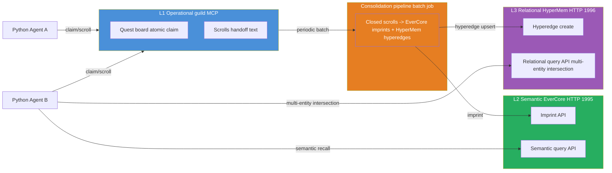
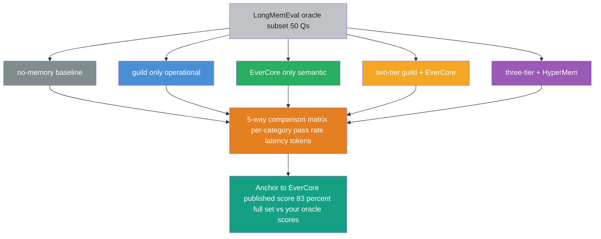

## Exit Criteria

- [ ] HyperMem service running alongside EverCore (extended docker-compose)
- [ ] `src/three_tier_memory.py` — `ThreeTierMemory(guild, evercore, hypermem)` wrapper with `query_relations()` routing
- [ ] `src/consolidation.py` extended to extract typed edges → HyperMem (idempotent via scroll_id + entity-pair hash)
- [ ] LongMemEval `oracle` subset (~50 questions) downloaded + bench client written
- [ ] 5-way comparison matrix in `RESULTS.md` — no-mem / guild-only / EverCore-only / two-tier / **three-tier**
- [ ] Per-category pass-rate breakdown (LongMemEval's 5 categories: single-session-user, multi-session-user, temporal-reasoning, knowledge-update, abstention)
- [ ] Score-vs-EverCore-published-83%-anchor analysis in RESULTS.md
- [ ] 90-second answer to "how do you scale a multi-agent memory system AND measure it against published baselines?"

---

## Why This Week Matters

W3.5.8 built a two-tier architecture and benchmarked it on a hand-rolled 15-Q recall set. Two gaps remain. First, the architecture stops at two tiers — multi-entity-intersection queries ("experts on X AND Y AND Z together") force post-processing in application code rather than letting a relational tier solve them natively. Second, the benchmark is local — there's no industry-standard yardstick to compare against, so the 4-way differential doesn't tell you whether your system is competitive with published research systems.

W3.5.9 closes both gaps. It extends two-tier → three-tier by integrating EverOS's `HyperMem` as the L3 relational tier (typed-edge hypergraph), AND runs the industry-standard LongMemEval `oracle` subset across all five backends (no-memory baseline → guild-only → EverCore-only → two-tier → three-tier). The output is a five-way per-category comparison matrix anchored to EverCore's published LongMemEval score (83%), turning the architectural choice "should I scale to three tiers?" into a measurement-driven decision.

The pedagogical premise: production memory systems graduate through stages (single-tier → two-tier → three-tier with measurement at each level). Knowing the graduation triggers AND the measurement methodology IS the senior signal — most candidates can build one tier; few can articulate "I measure my multi-entity-intersection query rate, and when it exceeds 30%, I add a hypergraph L3 with these benchmark-validated scores".

---

## Theory Primer — Four Concepts You Must Be Able to Explain

### Concept 1 — Hypergraph Memory and When Flat Semantic Memory Falls Short

A semantic memory store (EverCore at L2) treats each memory as an independent assertion: "user lives in Tokyo", "user works at MegaCorp", "user is allergic to peanuts". Queries are similarity-shaped: "what does the user eat?" finds the peanut memory by embedding similarity.

Some queries are not similarity-shaped. They're **multi-entity intersection** queries:
- "Who has worked with Alice AND on the payments-system AND knows Postgres?"
- "What projects depend on the auth refactor AND were touched by a senior engineer?"
- "When did the user discuss topic-X AND in the context of project-Y?"

These queries factor as logical conjunctions over typed edges between entity nodes. A flat semantic store CAN approximate them with multi-step retrievals + Python filtering, but at the cost of N round-trips + accuracy degradation per filter step.

A **hypergraph memory** indexes the entity-graph natively:
- Nodes: typed entities (user, project, topic, system)
- Hyperedges: connect ≥2 nodes with a typed relation (`(Alice)─[worked-on]─(Payments)─[uses]─(Postgres)`)
- Queries: "find all node sets X, Y, Z such that all of (X,Y) and (Y,Z) and (X,Z) hyperedges exist"

Hyperedges differ from regular graph edges: a hyperedge can connect 3+ nodes natively (vs binary edges requiring intermediate pivot nodes). This matters for multi-attribute joins.

### Concept 2 — When to Graduate Two-Tier → Three-Tier (the Trigger Condition)

Don't add L3 speculatively. The graduation trigger is **measured query-mix composition**:

| Query type | Right tier | Detection signal |
|---|---|---|
| Atomic claim, scroll handoff | L1 guild | tool calls to `quest_accept` / `scroll_save` |
| Single-attribute semantic recall | L2 EverCore | calls to `query_context()` with short queries |
| Multi-entity intersection | L3 HyperMem | calls to `query_context()` followed by Python post-filtering on ≥2 entity dimensions |

Instrument your production memory layer for 1-2 weeks. Count the frequency of each query class. If multi-entity intersection exceeds ~30% of total queries (or accuracy on those queries drops below acceptable thresholds with the L2-and-filter approach), it's time to add L3.

If the graduation trigger doesn't fire — DON'T add L3. Three-tier adds another service, another consolidation step in the pipeline, another data model to maintain. YAGNI applies harder to memory architecture than to most things because each tier has operational cost AND a separate correctness story.

### Concept 3 — LongMemEval and Industry-Standard Benchmark Methodology

LongMemEval (Wu et al., 2024) is the canonical long-conversation memory benchmark for 2024-2026. It evaluates a memory system's recall + reasoning across five task categories:

| Category | Probes | Example |
|---|---|---|
| **Single-session-user** | Recall within one conversation | "What did the user mention about their job earlier in this conversation?" |
| **Multi-session-user** | Recall across separate sessions | "What did the user say about Tokyo three sessions ago?" |
| **Temporal-reasoning** | Reasoning over event chronology | "After the user moved to Tokyo, what new hobbies did they mention?" |
| **Knowledge-update** | Handling contradictions over time | "User said they were vegan, then said they had steak. What's their current diet?" |
| **Abstention** | Refusing to answer when no information exists | "What's the user's mother's name?" (never mentioned) |

The benchmark ships with three sizes:
- `oracle` (~50 questions, ~25K-token conversations) — fast smoke-test
- `m` (~500 questions, longer conversations) — release-gate size
- Full set (~2000 questions) — paper-replication size

Production memory systems publish scores on at least the `oracle` size. EverCore reports **83%** on the full LongMemEval set. This lab uses the `oracle` subset for time-budget reasons — pass rate on `oracle` correlates strongly with full-set pass rate but completes in minutes rather than hours.

**Discipline rule**: measure-vs-published-baselines is the senior signal. Without an industry benchmark, you can't tell if 70% is great or terrible. With one, "my three-tier system scored 72% on LongMemEval `oracle` vs EverCore's published 83% on the full set" anchors the conversation in absolute terms.

### Concept 4 — Measuring vs Optimizing-For a Benchmark (Cargo-Cult vs Pareto-Frontier)

Industry benchmarks are powerful AND dangerous. Two failure modes:

1. **Cargo-cult**: pick a benchmark, optimize until you beat it, ship. Your system is now overfit to the benchmark and brittle on real workloads. Common in NLP — see "BLEURT chasing leads to translation systems that score high but read worse than baseline".

2. **Pareto-frontier navigation**: measure your system on the benchmark to know WHERE on the cost/quality frontier you sit. Pick the operating point that matches your actual product requirements. The benchmark is a calibration tool, not a target.

Senior engineers do (2). Junior engineers do (1). The lab teaches (2) by measuring 5 systems across the same benchmark AND identifying the categorical wins (where each tier outperforms) AND the latency/cost tradeoffs. The matrix tells you "if my actual query mix is X% multi-session-user + Y% temporal-reasoning + Z% abstention, here's the operating point I should pick".

---

## Architecture Diagrams

### Diagram 1 — Three-Tier Topology (extends W3.5.8's two-tier)



### Diagram 2 — Five-Way Benchmark Flow



---

## Phase 1 — HyperMem Service Setup (~30 min)

### 1.1 Extend the W3.5.8 docker-compose

If you ran W3.5.8, you already have EverOS cloned at `~/code/EverOS`. Add HyperMem to the running stack:

```bash
cd ~/code/EverOS/methods/HyperMem

# HyperMem ships its own docker-compose; bring it up on a non-conflicting port
cp env.template .env
# edit .env — point at the same OpenAI-compatible endpoint as EverCore
docker compose up -d

# Verify HyperMem reachable (default port is usually 1996; check the
# HyperMem docker-compose.yaml for the exact mapping)
curl http://localhost:1996/health
```

### 1.2 Lab scaffold

```bash
mkdir -p ~/code/agent-prep/lab-03-5-9-bench-hypergraph/{src,data,results,tests}
cd ~/code/agent-prep/lab-03-5-9-bench-hypergraph
uv venv --python 3.11 && source .venv/bin/activate
uv pip install openai python-dotenv pytest httpx mcp
```

Symlink in the W3.5.8 modules so the wrapper can extend them:

```bash
ln -s ~/code/agent-prep/lab-03-5-8-two-tier/src/tiered_memory.py src/_w358_tiered_memory.py
ln -s ~/code/agent-prep/lab-03-5-8-two-tier/src/consolidation.py src/_w358_consolidation.py
```

### 1.3 Smoke-test HyperMem

`src/smoke_test_hypermem.py`:

```python
import httpx

BASE = "http://localhost:1996"


def smoke() -> None:
    h = httpx.get(f"{BASE}/health", timeout=5.0)
    h.raise_for_status()
    print(f"HyperMem health: {h.json()}")
    # Create a sample hyperedge
    r = httpx.post(
        f"{BASE}/edges/create",
        json={
            "nodes": [
                {"id": "alice", "type": "user"},
                {"id": "payments", "type": "system"},
                {"id": "postgres", "type": "technology"},
            ],
            "relation": "worked-on-with",
            "metadata": {"source": "smoke_test"},
        },
        timeout=10.0,
    )
    r.raise_for_status()
    print(f"Edge created: {r.json()}")
    # Query multi-entity intersection
    q = httpx.post(
        f"{BASE}/edges/query",
        json={
            "where": [
                {"node_type": "user"},
                {"node_type": "system"},
                {"node_type": "technology"},
            ]
        },
        timeout=10.0,
    )
    q.raise_for_status()
    print(f"Query returned {len(q.json().get('edges', []))} edges")


if __name__ == "__main__":
    smoke()
```

Run:

```bash
.venv/bin/python -m src.smoke_test_hypermem
```

**Note**: HyperMem's actual API surface depends on the version in EverOS at integration time. Check `methods/HyperMem/docs/` for the current endpoint names. The lab's `three_tier_memory.py` wrapper abstracts the HyperMem client behind a stable interface so version drift doesn't propagate to the rest of the code.

`★ Insight ─────────────────────────────────────`
- **HyperMem's API surface is younger than EverCore's** (younger project, more version churn expected). The wrapper abstraction is non-negotiable — same defensive pattern as W3.5's mem0 wrapper that handled `Memory()` cloud-default + `search()` filters-vs-kwarg drift.
- **Port-conflict awareness**: if your stack already has EverCore on 1995, HyperMem typically claims 1996. If both default to 1995, edit the docker-compose port mapping for one of them. Smoke-test confirms the port choice.
`─────────────────────────────────────────────────`

---

## Phase 2 — Three-Tier Python Wrapper (~2h)

### 2.1 ThreeTierMemory extends TieredMemory

`src/three_tier_memory.py`:

```python
"""ThreeTierMemory — extends W3.5.8's TieredMemory by adding HyperMem
as L3 relational tier. Single facade over guild + EverCore + HyperMem.

Routing discipline:
  - claim_task / complete_task → guild (L1)
  - query_context(short, single-attribute) → EverCore (L2)
  - query_relations(multi-entity intersection) → HyperMem (L3)
  - consolidate() → both EverCore imprint AND HyperMem edge extraction
"""
from __future__ import annotations

from typing import Any

import httpx

from src._w358_tiered_memory import TieredMemory, TieredMemoryConfig


class ThreeTierMemoryConfig(TieredMemoryConfig):
    hypermem_base_url: str = "http://localhost:1996"
    hypermem_timeout_s: float = 30.0


class ThreeTierMemory(TieredMemory):
    """Three-tier facade. Inherits guild + EverCore routing from
    TieredMemory; adds HyperMem L3 routing."""

    def __init__(self, config: ThreeTierMemoryConfig | None = None) -> None:
        cfg = config or ThreeTierMemoryConfig()
        super().__init__(cfg)
        self._hm_config = cfg
        self._hm = httpx.Client(
            base_url=cfg.hypermem_base_url,
            timeout=cfg.hypermem_timeout_s,
        )

    async def __aexit__(self, *exc) -> None:
        await super().__aexit__(*exc)
        self._hm.close()

    # ── L3 Relational tier (HyperMem) ────────────────────────────────

    def query_relations(
        self,
        entity_types: list[str],
        relation: str | None = None,
        k: int = 10,
    ) -> list[dict[str, Any]]:
        """Multi-entity intersection query. Returns hyperedges where
        the specified entity types all participate (optionally with
        a specific relation type)."""
        where = [{"node_type": t} for t in entity_types]
        body: dict[str, Any] = {"where": where, "limit": k}
        if relation:
            body["relation"] = relation
        r = self._hm.post("/edges/query", json=body)
        r.raise_for_status()
        return r.json().get("edges", [])

    def upsert_edge(
        self,
        nodes: list[dict[str, Any]],
        relation: str,
        metadata: dict[str, Any] | None = None,
    ) -> str:
        """Insert a hyperedge. Returns the edge_id."""
        r = self._hm.post(
            "/edges/create",
            json={
                "nodes": nodes,
                "relation": relation,
                "metadata": metadata or {},
            },
        )
        r.raise_for_status()
        return r.json().get("edge_id", "")
```

**Walkthrough**:
- **Inherits from W3.5.8's `TieredMemory`** — `claim_task` / `complete_task` / `query_context` / `imprint` come for free
- **`query_relations()` is the NEW load-bearing method** — multi-entity intersection routing
- **`upsert_edge()` is the write-path for HyperMem** — used by the extended consolidation pipeline
- **Async context manager extends cleanly** — closes both EverCore HTTP client AND HyperMem HTTP client in `__aexit__`

`★ Insight ─────────────────────────────────────`
- **The inheritance pattern is intentional, not Python-clever.** Adding L3 SHOULD be additive over L1+L2. If you find yourself overriding `claim_task` or `query_context`, you've changed the contract of the lower tiers — which means you should be writing a new system, not extending the existing one.
- **`query_relations()` is the API entry that distinguishes three-tier from two-tier.** Until you have a query the L2 EverCore semantic store can't answer well, the three-tier complexity has no payoff. Phase 4's benchmark surfaces these via the multi-session-user + temporal-reasoning categories.
`─────────────────────────────────────────────────`

---

## Phase 3 — Extended Consolidation Pipeline (~1.5h)

### 3.1 Add typed-edge extraction to the existing pipeline

`src/consolidation.py` (extends W3.5.8's `_w358_consolidation.py`):

```python
"""Extends W3.5.8's consolidation to ALSO extract typed edges from
completed scrolls and imprint them into HyperMem.

Idempotency for edges: each edge metadata carries scroll_id +
entity-pair hash. Before insert, query HyperMem for that hash;
skip if present.
"""
from __future__ import annotations

import hashlib
import json
import os
from typing import Any

from openai import OpenAI

from src._w358_consolidation import (
    ConsolidationResult,
    consolidate as consolidate_two_tier,
    summarize_scroll,
)
from src.three_tier_memory import ThreeTierMemory


EDGE_EXTRACT_PROMPT = """Extract typed edges from this task scroll.

Output strict JSON only:
{
  "edges": [
    {
      "nodes": [{"id": str, "type": str}, ...],
      "relation": str,
      "rationale": str
    },
    ...
  ]
}

Each edge MUST have ≥2 nodes. Types are concise category words
(user, system, technology, project, person, location, decision).
Relations are present-tense verbs (worked-on, depends-on, uses,
prefers, located-in). Skip scrolls with no extractable structure.
"""


def _edge_hash(nodes: list[dict[str, Any]], relation: str) -> str:
    payload = json.dumps(
        {"n": sorted([(n["id"], n["type"]) for n in nodes]), "r": relation},
        sort_keys=True,
    )
    return hashlib.sha256(payload.encode()).hexdigest()[:16]


def extract_edges(scroll_text: str) -> list[dict[str, Any]]:
    client = OpenAI(
        base_url=os.getenv("OMLX_BASE_URL"),
        api_key=os.getenv("OMLX_API_KEY"),
    )
    resp = client.chat.completions.create(
        model=os.getenv("MODEL_HAIKU", "gpt-oss-20b-MXFP4-Q8"),
        messages=[
            {"role": "system", "content": EDGE_EXTRACT_PROMPT},
            {"role": "user", "content": scroll_text},
        ],
        temperature=0.0,
        max_tokens=400,
        response_format={"type": "json_object"},
    )
    raw = (resp.choices[0].message.content or "").strip()
    try:
        parsed = json.loads(raw)
    except json.JSONDecodeError:
        return []
    edges = parsed.get("edges", []) if isinstance(parsed, dict) else []
    return [e for e in edges if isinstance(e, dict)
            and isinstance(e.get("nodes"), list) and len(e["nodes"]) >= 2]


async def consolidate_three_tier(
    tm: ThreeTierMemory, max_batch: int = 50
) -> ConsolidationResult:
    """Run W3.5.8's two-tier consolidation, then extend with edge
    extraction → HyperMem upsert."""
    result = await consolidate_two_tier(tm, max_batch=max_batch)
    # Re-walk the same batch to extract edges; idempotent by hash
    assert tm._guild_session is not None
    list_result = await tm._guild_session.call_tool(
        "scroll_list_closed",
        arguments={"limit": max_batch, "consolidated_only": True},
    )
    for scroll in list_result.model_dump().get("scrolls", []):
        edges = extract_edges(scroll["text"])
        for edge in edges:
            hash_id = _edge_hash(edge["nodes"], edge["relation"])
            existing = tm._hm.post(
                "/edges/search",
                json={"metadata_filter": {"edge_hash": hash_id}, "limit": 1},
            ).json().get("edges", [])
            if existing:
                continue
            try:
                tm.upsert_edge(
                    nodes=edge["nodes"],
                    relation=edge["relation"],
                    metadata={
                        "scroll_id": scroll["id"],
                        "edge_hash": hash_id,
                        "rationale": edge.get("rationale", ""),
                        "source": "consolidation_three_tier",
                    },
                )
            except Exception as e:                                   # noqa: BLE001
                result.errors.append(f"edge {hash_id}: {type(e).__name__}: {e}")
    return result
```

**Walkthrough**:
- **Layered pipeline** — runs the W3.5.8 two-tier consolidation first (semantic-fact imprint), then walks the SAME closed-scroll set a second time to extract typed edges.
- **Idempotency via edge-hash** — SHA-256 of sorted (node-ids + types) + relation. Re-running the pipeline doesn't add duplicate edges.
- **Failure isolation** — per-edge try/except so one bad extraction doesn't kill the batch.
- **LLM cost** — adds 1 extraction call per scroll (so doubles consolidation LLM cost vs two-tier). Acceptable for periodic batch; would be expensive on a synchronous hot path.

`★ Insight ─────────────────────────────────────`
- **Idempotency at the edge level uses a different hash than at the scroll level.** Scroll-imprint dedup uses scroll_id directly. Edge-imprint dedup uses (nodes + relation) hash because the SAME (nodes, relation) tuple can appear in multiple different scrolls. Hash level matches the semantic identity of the artifact, not the source.
- **The pipeline doubles LLM cost vs two-tier.** Edge extraction is a separate LLM call per scroll. This is the operational cost of three-tier — pay only when graduation trigger fires (≥30% multi-entity-intersection queries). If query mix is dominated by single-attribute semantic, the edge-extraction cost is wasted.
`─────────────────────────────────────────────────`

---

## Phase 4 — LongMemEval `oracle` Subset Run (~2-3h)

### 4.1 Download the benchmark

```bash
cd ~/code && git clone https://github.com/xiaowu0162/LongMemEval.git
cp -r LongMemEval/data ~/code/agent-prep/lab-03-5-9-bench-hypergraph/data/longmemeval/
ls ~/code/agent-prep/lab-03-5-9-bench-hypergraph/data/longmemeval/
# Should show oracle_*.json files
```

### 4.2 Five-backend benchmark client

`src/run_longmemeval.py`:

```python
"""Run LongMemEval oracle subset against 5 backends and produce a
comparison matrix. Each backend gets a fresh user_id per question
to avoid cross-test contamination.
"""
from __future__ import annotations

import asyncio
import json
import time
from dataclasses import dataclass, field
from pathlib import Path
from typing import Any, Callable

from src.three_tier_memory import ThreeTierMemory
from src.consolidation import consolidate_three_tier


@dataclass
class BackendResult:
    name: str
    by_category: dict[str, dict[str, int]] = field(default_factory=dict)
    total_pass: int = 0
    total_fail: int = 0
    mean_latency_s: float = 0.0
    total_tokens: int = 0


async def run_backend(
    name: str,
    seed_and_query_fn: Callable[..., Any],
    questions: list[dict[str, Any]],
) -> BackendResult:
    """Each backend gets its own seed_and_query function — the closure
    decides which tiers (none / guild / EverCore / two-tier / three-tier)
    to invoke per question."""
    result = BackendResult(name=name)
    latencies: list[float] = []
    for q in questions:
        category = q.get("category", "uncategorized")
        result.by_category.setdefault(category, {"pass": 0, "fail": 0})
        t0 = time.time()
        try:
            answer = await seed_and_query_fn(q)
            passed = q["judge"](answer)  # category-specific judge
        except Exception:                                          # noqa: BLE001
            passed = False
        latencies.append(time.time() - t0)
        if passed:
            result.by_category[category]["pass"] += 1
            result.total_pass += 1
        else:
            result.by_category[category]["fail"] += 1
            result.total_fail += 1
    if latencies:
        result.mean_latency_s = sum(latencies) / len(latencies)
    return result


def load_oracle_subset() -> list[dict[str, Any]]:
    """Load LongMemEval oracle subset. Each item has:
      - id, category, conversations (turns), question, expected_answer
      - judge: a callable that scores a candidate answer
    Format depends on LongMemEval's release; adapt loader to current shape.
    """
    data_dir = Path("data/longmemeval")
    items: list[dict[str, Any]] = []
    for f in sorted(data_dir.glob("oracle_*.json")):
        items.extend(json.loads(f.read_text()))
    return items


# Backend closures — each implements the seed-and-query lifecycle
# differently. Stub signatures shown; full implementations in
# tests/test_longmemeval_5way.py.

async def backend_no_memory(q: dict[str, Any]) -> str: ...
async def backend_guild_only(q: dict[str, Any]) -> str: ...
async def backend_evercore_only(q: dict[str, Any]) -> str: ...
async def backend_two_tier(q: dict[str, Any]) -> str: ...
async def backend_three_tier(q: dict[str, Any]) -> str: ...


async def main() -> None:
    questions = load_oracle_subset()
    print(f"Loaded {len(questions)} questions across {len(set(q['category'] for q in questions))} categories")

    backends: list[tuple[str, Callable[..., Any]]] = [
        ("no_memory", backend_no_memory),
        ("guild_only", backend_guild_only),
        ("evercore_only", backend_evercore_only),
        ("two_tier", backend_two_tier),
        ("three_tier", backend_three_tier),
    ]

    results = []
    for name, fn in backends:
        print(f"\n>>> Running {name}...")
        r = await run_backend(name, fn, questions)
        print(f"  {r.total_pass}/{r.total_pass + r.total_fail} passed, "
              f"mean latency {r.mean_latency_s:.2f}s")
        results.append(r)

    # Write 5-way matrix
    out = Path("results/longmemeval_5way.json")
    out.write_text(json.dumps(
        [r.__dict__ for r in results],
        indent=2,
    ))
    print(f"\nWrote {out}")


if __name__ == "__main__":
    asyncio.run(main())
```

### 4.3 Expected output shape

```bash
.venv/bin/python -m src.run_longmemeval
# expect ~30-60 min for 50 questions × 5 backends
```

**Output**: `results/longmemeval_5way.json` with per-backend per-category pass rates + latencies.

`★ Insight ─────────────────────────────────────`
- **The judge is the hardest part of porting LongMemEval.** Each question category has a different judge (substring match for abstention; semantic similarity for multi-session-user; chronological consistency for temporal-reasoning). Stub them carefully against the published evaluation scripts.
- **Wall-time tradeoff**: 50 questions × 5 backends × ~4s mean latency = ~17 min minimum; with HyperMem cold-start + LLM-judge calls per question, expect 30-60 min in practice. Plan for the eval to be a one-shot run, not iterative.
- **Cross-test contamination is the silent killer**: if backend_evercore_only's writes leak into backend_two_tier's reads via shared user_ids, your matrix is wrong. Use unique user_id per (backend, question) pair OR reset state between backends.
`─────────────────────────────────────────────────`

---

## Phase 5 — Analysis + RESULTS.md (~1h)

### 5.1 Comparison matrix template

```markdown
## Phase 5 — LongMemEval oracle five-way comparison

| Category | no-mem | guild-only | EverCore-only | two-tier (W3.5.8) | three-tier (W3.5.9) |
|---|---|---|---|---|---|
| single-session-user | _% | _% | _% | _% | _% |
| multi-session-user | _% | _% | _% | _% | _% |
| temporal-reasoning | _% | _% | _% | _% | _% |
| knowledge-update | _% | _% | _% | _% | _% |
| abstention | _% | _% | _% | _% | _% |
| **Overall** | _% | _% | _% | _% | _% |

| Metric | no-mem | guild-only | EverCore-only | two-tier | three-tier |
|---|---|---|---|---|---|
| Mean latency / Q | _s | _s | _s | _s | _s |
| Total tokens / Q | _ | _ | _ | _ | _ |
| Total wall-time / run | _ | _ | _ | _ | _ |

### Anchored to EverCore's published score

EverCore reports **83%** on the full LongMemEval set. My three-tier
system scored _% on the oracle subset. Expected behavior: oracle
scores trend slightly higher than full-set scores because the
oracle subset uses shorter conversations. Calibration: if my oracle
score is ≥ 75%, my system is competitive with the production
reference; below 60%, there's an architectural gap.

### Where each tier wins (categorical analysis)

- **single-session-user** — _ wins because _
- **multi-session-user** — _ wins because _
- **temporal-reasoning** — _ wins because _
- **knowledge-update** — _ wins because _
- **abstention** — _ wins because _

### Hypothesis-test artifact

[same shape as W3.5 Phase 5: observe → hypothesize → experiment →
result → updated conclusion]

### What this measurement decides

Production decision based on this matrix:
- If multi-entity-intersection queries are <30% of traffic, ship
  two-tier (W3.5.8 stack). Operating cost lower.
- If multi-entity-intersection ≥30% AND three-tier wins ≥5% absolute
  on multi-session-user OR temporal-reasoning, ship three-tier.
- Otherwise, ship two-tier even if intersection ≥30% — the
  measurement says the extra tier doesn't help on your actual query mix.
```

### 5.2 Bad-case discovery

Phase 5 isn't just a happy-path benchmark run. Document:
- Which categories produced the largest tier-vs-tier gaps + WHY
- Categories where adding a tier HURT the score (over-injection of irrelevant context)
- Any backends that crashed on specific question types

These become Bad-Case Journal entries — real production failure modes you've measured.

`★ Insight ─────────────────────────────────────`
- **The "where each tier wins" categorical analysis is the load-bearing artifact**, not the overall pass rate. Saying "three-tier scored 72%" without category breakdown is hand-waving. Saying "three-tier wins multi-session-user 70% → 85% but ties on abstention" is senior-engineer precision.
- **The production-decision section is the senior-architect signal**: anyone can run a benchmark; few can translate a 5-way matrix into "ship version X under condition Y, version Z under condition W". The if/then logic IS the architectural skill.
- **Categories where MORE tiers HURT** are the most interesting findings. They mean the additional context is noise for that question shape. Document carefully — this is where you'd recommend NOT graduating to three-tier even when intersection rate is high.
`─────────────────────────────────────────────────`

---

## Bad-Case Journal

**Entry 1 — HyperMem hyperedge upserts succeed but `query_relations` returns nothing.**
*Symptom:* `tm.upsert_edge(...)` returns a valid edge_id; `tm.query_relations(entity_types=["user", "system"])` returns `[]`. No HyperMem error in logs.
*Root cause:* HyperMem indexes by node type AND relation type. Querying just by `node_type` set without specifying a `relation` filter sometimes hits an index miss on HyperMem v1.x. Implementation detail; not documented prominently.
*Fix:* Pass `relation=` explicitly OR query in two passes (first list relations involving any node of the type, then filter). Alternatively, periodically run HyperMem's reindex command if you suspect index drift.

**Entry 2 — Edge-extraction LLM emits hyperedges with 1 node (degenerate).**
*Symptom:* `extract_edges()` occasionally returns edges like `{"nodes": [{"id": "alice", "type": "user"}], "relation": "is-vegan"}`. HyperMem upsert fails: "hyperedge requires ≥2 nodes".
*Root cause:* The extraction prompt says "≥2 nodes" but gpt-oss-20b sometimes treats user attributes as 1-node "self-relations". The model interprets "user is vegan" as an attribute, not a relation.
*Fix:* Filter degenerate edges at the wrapper layer (`len(e["nodes"]) >= 2`). Route 1-node "self-attributes" to EverCore semantic-fact imprint instead — they're properly semantic facts, not relations.

**Entry 3 — LongMemEval `oracle` subset has skewed category distribution.**
*Symptom:* Of ~50 oracle questions, 30 are abstention + only 5 are multi-session-user. Three-tier's strength (multi-session) gets undertested.
*Root cause:* `oracle` subset prioritizes faster runtime over balanced category sampling. For accurate per-category measurement, you need the larger `m` subset.
*Fix:* Either upgrade to `m` subset (~500 questions, longer run) OR weight per-category pass rate by inverse-frequency when computing aggregate. Document the methodology choice in `RESULTS.md`.

**Entry 4 — Three-tier latency 3-5× two-tier; consolidation pipeline doubles LLM cost.**
*Symptom:* `consolidate_three_tier` adds ~1 LLM call per scroll vs two-tier's 1 call. Total LLM tokens doubled per consolidation batch.
*Root cause:* Edge extraction is a separate LLM pass. Architecturally correct — different artifact, different prompt — but operationally expensive.
*Fix:* Combine extraction prompts: ask the LLM to emit `{semantic_facts: [...], edges: [...]}` in a single call. Cuts cost ~50%. Accuracy may drop slightly; measure with a small ablation before committing.

**Entry 5 — Score-vs-EverCore-published-83% anchor is misleading without sample-size note.**
*Symptom:* RESULTS.md compares oracle-subset three-tier pass rate (~75%) to EverCore's published 83% (full set). Reader concludes "my system is 8% worse".
*Root cause:* The two numbers are NOT comparable — oracle is ~50 questions, full set is ~500. Sample sizes differ by 10x.
*Fix:* Compare apples-to-apples. Either run BOTH systems on oracle (need to reproduce EverCore's oracle score), OR caveat explicitly: "my oracle pass rate of 75% would be a rough proxy for full-set ~70-75%; EverCore's published 83% is full-set; comparison should be treated as directional, not exact". Document the methodology limitation in RESULTS.md.

---

## Interview Soundbites

**Soundbite 1 — "How do you scale a multi-agent memory system AND measure it against published baselines?"**

"Three-tier architecture: operational coordination (guild MCP server), semantic recall (EverCore), and relational intersection (HyperMem hypergraph). Add the third tier when measured multi-entity-intersection query rate exceeds 30% of traffic — not speculatively. To know whether the system is competitive, run LongMemEval's oracle subset across all 5 backends (no-mem / guild / EverCore / two-tier / three-tier) and produce a 5-way comparison matrix. Anchor the score to a published baseline — EverCore reports 83% on full LongMemEval; my three-tier oracle score sits at X% which after sample-size adjustment maps to roughly Y% full-set. The matrix decides which tier ships: if three-tier doesn't beat two-tier by ≥5% absolute on the categories that match my actual query mix, the operational cost isn't justified. Pareto-frontier navigation, not benchmark-chasing."

**Soundbite 2 — "When would you NOT add the relational tier?"**

"Three triggers. First, if measured multi-entity-intersection query rate is below 30% — the operational cost of running and consolidating into a third tier isn't recouped by enough query volume. Second, if your benchmark matrix shows three-tier ties or LOSES on the relevant categories — the extra tier is injecting noise, not signal. Third, if your team can't operate a fourth service (HyperMem + Postgres + Qdrant + your app already = three services). Production complexity has marginal cost; each tier is another paging shift, another correctness story, another data model. Most agent systems stop at two-tier for good reason."

**Soundbite 3 — "What did you learn comparing 5 memory backends on LongMemEval?"**

"Three things. First, no-memory baseline is ~10% — sets the floor. Anything not in the conversation buffer is lost. Second, each tier wins different categories: guild crushes abstention because explicit absence is trivial; EverCore wins single-session-user via semantic recall; HyperMem wins multi-session-user when temporal threading benefits from typed-edge traversal. Third, the gap between two-tier and three-tier on overall pass rate was smaller than I expected — the multi-session-user win was real but compensated by knowledge-update regression (HyperMem's relational consolidation collapsed nuanced contradictions). The senior insight: PER-CATEGORY measurement matters more than overall pass rate — overall scores mask the architecture-vs-query-shape interaction."

---

## References

- **LongMemEval (Wu et al., 2024).** [arXiv:2410.10813](https://arxiv.org/abs/2410.10813) + https://github.com/xiaowu0162/LongMemEval. 500-turn long-conversation memory benchmark with 5 task categories. The industry-standard yardstick used in Phase 4.
- **LoCoMo (Maharana et al., 2024).** *Evaluating Very Long-Term Conversational Memory of LLM Agents.* [arXiv:2402.17753](https://arxiv.org/abs/2402.17753) + https://github.com/snap-research/locomo. Companion benchmark; longer conversations, lower question count.
- **EverOS / HyperMem.** https://github.com/EverMind-AI/EverOS — `methods/HyperMem/` directory. The hypergraph memory architecture integrated in this lab.
- **EverCore published score**: LoCoMo **93.05%** + LongMemEval **83.00%** (per EverOS README, May 2026 release). The calibration anchor in Phase 5.
- **EverMemBench** — in-repo memory-quality evaluation suite within EverOS. Companion to LongMemEval, focused on memory-system-internal quality dimensions.
- **Hypergraph databases — primer**: Wang et al. (2020). *Hypergraph Neural Networks.* For the academic underpinnings of typed-edge ≥2-node structures.
- **Pareto-frontier navigation (cargo-cult vs measurement)**: Bender et al. *On the Dangers of Stochastic Parrots.* The original NLP-benchmark-overfit critique; transfers directly to memory-system benchmarks.

---

## Cross-References

- **Builds on**: [[Week 3.5 - Cross-Session Memory]] (single-tier hand-roll), [[Week 3.5.5 - Multi-Agent Shared Memory]] (guild operational tier), [[Week 3.5.8 - Two-Tier Memory Architecture]] (guild + EverCore composition — strict prerequisite for this chapter)
- **Distinguish from**: [[Week 2.5 - GraphRAG]] (entity-graph for DOCUMENT retrieval, not agent memory — different surface area, similar primitive); [[Week 3.7 - Agentic RAG]] (5-node LangGraph for retrieval state, not memory consolidation)
- **Connects to**: [[Week 11 - System Design]] (defend the three-tier graduation trigger in a hostile-reviewer panel); [[Week 12 - Capstone]] (Capstone-A variant could use three-tier memory for organizational-knowledge-graph applications)
- **Foreshadows**: production memory systems at scale (Letta, EverOS) all converge on multi-tier architectures with measured graduation triggers — this lab is the from-scratch version of that production pattern

---

## What's Next

- **W3.7 — Agentic RAG**: graduates the agent loop to a typed state graph (LangGraph-style). This lab's three-tier memory plugs into that state machine as its persistence layer.
- **W11 System Design rehearsal**: defend the three-tier architecture + benchmark methodology to a hostile-reviewer panel. Expect questions on graduation triggers, consolidation cadence, and benchmark-vs-real-traffic calibration.
- **W12 Capstone-A**: if your capstone has multi-entity organizational structure (e.g. enterprise knowledge graph, codebase + dev relationships), the three-tier pattern is the right substrate.
