## Exit Criteria

- [ ] LongMemEval slice analyzed and decomposed into requirement vectors per question_type (Phase 1)
- [ ] Architecture decision matrix populated with explicit justification — which axis maps to which architecture class (Phase 2)
- [ ] Mem0 open-source baseline reproduces a measurable score on the same slice using the same reader + judge (Phase 3)
- [ ] Homebrew hybrid router operational: 1-tier path + 2-tier path + question classifier (Phase 4)
- [ ] Initial 5-backend × 7-axis × 20-Q comparison table with measured per-question wall + correctness (Phase 5)
- [ ] HyperMem L3 service running alongside EverCore + Qdrant via extended docker-compose (Phase 6)
- [ ] `ThreeTierMemory` Python wrapper extending `TieredMemory` with `query_relations()` method (Phase 7)
- [ ] Extended consolidation pipeline writing typed hyperedges to L3 (idempotent via scroll_id + entity-pair hash) (Phase 8)
- [ ] Final 6-backend benchmark + Pareto-frontier analysis vs published baselines (Phase 9)
- [ ] Decision rule documented for future production use (combining Phase 2 framework + Phase 5/9 measurements)

## §1 Why This Week Matters

Most memory chapters teach ONE architecture and imply it is THE architecture. Production engineering picks the right architecture for the workload, and the picking is the senior-engineering signal an interviewer probes for. W3.5.9 teaches the meta-skill explicitly: given a real published benchmark (LongMemEval), analyze its question shapes, derive the required memory primitives per axis, evaluate three candidate architecture classes (1-tier atomic-fact, 2-tier consolidation, graph-tier temporal), pick the architecture whose write-time primitive matches the read-time question shape, implement, verify against the benchmark, and document the decision rule.

This chapter takes the meta-skill ONE step further: it applies the framework end-to-end by IMPLEMENTING the graph-tier branch (HyperMem L3) that Phase 2's matrix flags as the right primitive for multi-entity intersection + temporal-reasoning queries. Phase 1-5 derive + measure the hybrid (1-tier + 2-tier) baseline; Phase 6-9 extend it to a three-tier system + run the 6-backend comparison. The chapter is intensive (~22h) but produces TWO deliverables: a defensible decision-making framework (Phase 1-2) + a working three-tier implementation with measured benchmark scores (Phase 5-9).

The deliverable a reader walks away with is **not memorized backend details, but (a) a decision-making framework that derives architecture from requirements, plus (b) a 6-backend × 7-axis Pareto-frontier matrix that turns the framework's predictions into measurements**. The interview signal is *"how do you decide between memory architectures?"* (the framework half) AND *"how do you scale a multi-agent memory system AND measure it against published baselines?"* (the implementation half). This chapter answers both directly with a worked LongMemEval exercise.

## §2 Theory Primer

### 2.1 The three architecture classes — production realities

Real production agent memory falls into three architecture classes. Each makes a different write-time primitive choice; each unlocks a different set of read-time answer shapes.

**Class 1 — One-tier atomic-fact memory** (Mem0, ChatGPT memory, Claude projects memory, Cursor / Windsurf memory). Per-message extraction emits typed atomic facts (e.g., *"user prefers React over Vue"*, *"Sev1 MTTR target is 60 minutes"*). Facts ADD to an append-only vector store; supersession is handled at query-time via timestamps + entity linking rather than at write-time via dedup. **Strength**: sub-second write-then-query freshness, simplest infra (1-2 stores), highest accuracy on atomic-fact recall benchmarks (Mem0 hits 94.4 on LongMemEval). **Weakness**: no native narrative episodes, no per-user profile aggregation as a first-class output, no audit trail back to the operational event that produced each fact.

**Class 2 — Two-tier consolidation memory** (Letta / MemGPT, the W3.5.8 EverCore-class pattern). Discrete task-completion events anchor consolidation: operational tier (quest queue, conversation log) accumulates raw state; a periodic / event-triggered consolidation job extracts episode + atomic_fact + profile to a separate semantic tier. **Strength**: narrative episodes ("here's what happened in this session"), per-user profile output, bitemporal correctness (can answer "what was true as of date T"), full audit lineage. **Weakness**: write-then-query freshness lag, complex infra (4-7 services in EverCore-class), atomic-fact recall is harder because facts are buried inside episodes by default.

*How Class 2's "bitemporal correctness" actually works at write time.* Common-sense objection: "you can know `transaction_time` (now) at write, but you can't predict `valid_to` — when will this fact stop being true? — so how do you store both?" Answer: you don't try to predict. At write time, every fresh fact gets `valid_from = now()` and `valid_to = None` (an open-ended sentinel meaning "still valid as of now"). The sentinel is the contract — facts are live until something proves them stale. When a contradicting fact later arrives, the supersede pipeline (W3.5.8 §8.6) handles the close-window step in three coordinated moves:

1. **Find prior.** The new fact's write path runs `tm.query_context(new_fact, k=5)` to surface semantically near candidates — same `query_context` call the dedup pipeline already makes for duplicate detection, so the find-prior step is FREE (no new infrastructure, no extra round-trip).
2. **Classify.** The dedup LLM (`decide_action`) sees prior candidates with timestamps + the new fact + the temporal gap, and emits one of: `supersede` (state evolved — prior was true, now false), `coexist` (different scope — both still true), `delete` (prior was never true — hallucination), or `update`/`add`/`no-op`. Classification returns the `target_id` of the matched prior.
3. **Patch + write.** The execute step patches the prior record's `valid_to = now()` (closing the prior's validity window) AND writes the new fact with `valid_from = now()`, `valid_to = None`, plus a `supersedes` pointer back to `target_id`. W3.5.8 §8.6 Step 3 ships this as `_qdrant_supersede(prior_id, new_id)` — a Qdrant `points/payload` PATCH (no embed change, no document rewrite, ~10ms wall). Step 1+2 of §8.6 launched with HARD-delete instead of payload-patch and shipped the same `supersedes` chain via metadata; Step 3 is a contract-free swap at the executor layer.

Concrete worked example:

| Time | Event | Prior record (`react-uuid`) | New record |
|---|---|---|---|
| `2024-01-15` | "user prefers React" arrives | `valid_from=2024-01-15`, `valid_to=None` (live) | (n/a — first record) |
| `2026-05-26` | "user now prefers Svelte" arrives → classified as `supersede` | Patched: `valid_to=2026-05-26` (window closed) | `valid_from=2026-05-26`, `valid_to=None` (live), `supersedes=react-uuid` |

Query semantics use both fields: `"what did the user prefer on 2025-06-01?"` translates to `WHERE valid_from <= '2025-06-01' AND (valid_to IS NULL OR valid_to > '2025-06-01')` — matches the React record (valid then). `"what does the user prefer NOW?"` matches the Svelte record (`valid_to IS NULL`). One schema, both temporal questions answered. Same SCD-Type-2 pattern Postgres / Snowflake / pgvector use for slowly-changing dimensions.

Three subtle constraints worth noting up front:

- **`valid_from` doesn't HAVE to equal `now()` at write.** If the writer knows ground truth (e.g., parsing a 2024-01 chat log on 2026-05), set `valid_from = "2024-01-15"` (when the fact actually became true) and `transaction_time = now()` (when you recorded it). The two times diverge for historical ingestion; the schema preserves both. Most live writes collapse them since now=now, but the structure pays off the first time someone backfills.
- **Find-prior recall failures are the load-bearing risk.** If `tm.query_context` misses the prior record (vector search recall@5 fails on a contradicting fact), the supersede classifier never runs and TWO contradicting facts now both have `valid_to=None`. Mitigation: hybrid retrieval (semantic + BM25 + entity-key exact match) — entity-key indexing on the `(subject, predicate)` pair catches "user prefers X" vs "user prefers Y" via exact-match `user, prefers` lookup even when vector similarity drifts.
- **Concurrent supersede on the same prior is idempotent by design.** Two parallel writes both try to patch the same prior's `valid_to`. The patch is conditional: `SET valid_to=now() WHERE id=X AND valid_to IS NULL`. Second writer sees `valid_to IS NOT NULL` and no-ops. SQL-style optimistic concurrency — no distributed locks needed.

Practical anchor: W3.5.8's `lab-03-5-8-two-tier/src/dedup_synthesis.py` ships this exact pipeline end-to-end. The 6-action dispatch (`add`/`no-op`/`update`/`supersede`/`coexist`/`delete`) is the executable form of the three-move pattern above. §8.6 walks each branch with code; the AuditEntry shape (target_id + new_id + valid_from + supersedes pointer) is what makes the chain replay-able at any historical query point.

**Class 3 — Graph-tier temporal memory** (Zep / Graphiti, the W2.5 GraphRAG-style pattern applied to memory not RAG). Per-message extraction emits typed entity-relationship edges over time. The store is a temporal knowledge graph; queries traverse edges by entity + time. **Strength**: cross-entity relational queries ("who did Alice work with on Project X last quarter"), explicit edge-level supersession, strong on multi-hop reasoning. **Weakness**: graph operational overhead, harder to fine-tune retrieval quality vs vector search, fewer production examples to copy from.

### 2.2 How question shape determines primitive choice

The benchmark question shape determines which write-time primitive PRESERVES the answer signal. Erase the wrong dimension at write-time and no read-time clever retrieval can recover it. This is the most important lesson in the chapter.

Concrete mapping for LongMemEval's six question types (derived from §4 Phase 1's analysis):

| LongMemEval axis | Required primitive | Best architecture class |
|---|---|---|
| single-session-user (Information Extraction) | atomic-fact extraction per message | 1-tier |
| single-session-assistant | atomic-fact extraction (assistant-generated facts) | 1-tier |
| single-session-preference | per-user preference aggregation (profile tier) | 2-tier OR 1-tier with entity linking |
| multi-session (Multi-Session Reasoning) | atomic-fact extraction + cross-session aggregation at read-time | 1-tier with multi-signal retrieval |
| knowledge-update (Knowledge Updates) | atomic-fact extraction + bitemporal ranking | 1-tier with timestamps OR 2-tier with dedup |
| temporal-reasoning | timestamped atomic facts + temporal query reasoning | 1-tier with timestamps OR graph-tier |
| abstention (`_abs` suffix overlay) | orthogonal — retrieval gate + reader refusal contract |

Pattern: **no single architecture class dominates ALL six axes.** 1-tier wins most axes (4-5 out of 6); 2-tier wins on preference; graph-tier wins on temporal-reasoning with cross-entity edges. Mixed-workload deployments (a real customer-support agent, a research assistant, an operations bot) hit multiple axes — which is the argument for the router-based hybrid taught in §4 Phase 4.

### 2.3 Hybrid architectures: router patterns

When no single architecture class satisfies all the required axes, a **router-based hybrid** dispatches each question to the architecture whose primitives produced the right write-time signal. The router is a question classifier (rule-based regex, small LLM call, or both) that emits a class label; downstream services route by label.

Three router patterns from production:

1. **Question-type router** (this chapter's Phase 4). Classify each incoming question by type; route to the architecture whose write-time primitives PRESERVE the answer signal. Cheap to implement when the question types are observable from the question text. Limitation: requires every question to fit a known class — open-ended questions break the classifier.

2. **Confidence-based fallback**. Try one architecture; if its retrieval confidence is below a threshold, fall back to another. Used in production by hybrid RAG systems (Pinecone + BM25 fallback). Works when fallback is cheap.

3. **Parallel ensemble + re-rank**. Query all architectures in parallel; re-rank results across stores. Used in production by Mem0's multi-signal retrieval (semantic + BM25 + entity matching, fused by RRF). Cost: parallel infra. Reward: highest accuracy.

Phase 4 implements pattern 1 because the LongMemEval question types are explicit in the data. Pattern 3 is the natural next experiment once Pattern 1 has measured numbers (future experiment).

### 2.4 Decision-matrix template

Reusable in any production architecture decision. Five rows, three columns, fill from data:

| Required primitive (derived from data) | 1-tier | 2-tier | Graph-tier |
|---|---|---|---|
| Atomic-fact recall | ✅ native | ⚠️ buried in episodes | ✅ via entity edges |
| Episode narrative | ❌ | ✅ native | ⚠️ via edge traversal |
| Per-user profile aggregation | ⚠️ via entity linking | ✅ native | ✅ via entity edges |
| Bitemporal queries | ⚠️ via timestamps | ✅ native dedup+supersession | ✅ native temporal edges |
| Audit / provenance | ❌ single-pass extraction discards | ✅ episode→fact lineage | ✅ edge provenance |
| Sub-second write-then-query freshness | ✅ write-time consolidation | ❌ async batch | ✅ write-time edge add |
| Multi-agent shared queue | ❌ user-shaped | ✅ via operational tier | ⚠️ depends |
| Operational overhead | low (1-2 stores) | high (4-7 services) | medium (1 graph DB + cache) |

The decision is goal-backward: start with the question shapes the production workload hits, derive required primitives, pick the class with the most natives + fewest ❌. Hybrids combine classes when no single class is dominant.

### 2.5 Hypergraph memory — when flat semantic memory falls short

A 1-tier or 2-tier semantic memory store treats each memory as an independent assertion (*"user lives in Tokyo"*, *"user works at MegaCorp"*). Queries are similarity-shaped: *"what does the user do?"* finds memories by embedding similarity.

Some queries are NOT similarity-shaped. They're **multi-entity intersection** queries:

- *"Who has worked with Alice AND on the payments-system AND knows Postgres?"*
- *"What projects depend on the auth refactor AND were touched by a senior engineer?"*
- *"When did the user discuss topic-X AND in the context of project-Y?"*

These factor as logical conjunctions over typed edges between entity nodes. A flat semantic store CAN approximate them with multi-step retrievals + Python filtering — at the cost of N round-trips + accuracy degradation per filter step.

A **hypergraph memory** indexes the entity-graph natively:

- **Nodes**: typed entities (user, project, topic, system)
- **Hyperedges**: connect ≥2 nodes with a typed relation (e.g., `(Alice)─[worked-on]─(Payments)─[uses]─(Postgres)`)
- **Queries**: "find all node sets X, Y, Z such that all of (X,Y), (Y,Z), (X,Z) hyperedges exist"

Hyperedges differ from regular graph edges: a hyperedge can connect 3+ nodes natively (vs binary edges requiring intermediate pivot nodes). This matters for multi-attribute joins. In §4 Phase 5-9, the homebrew hybrid is extended with HyperMem as the **L3 relational tier** alongside L1 (atomic-fact) and L2 (2-tier consolidation), producing the chapter's true 5-backend comparison.

### 2.6 Graduation trigger — when to add the L3 relational tier

Don't add L3 speculatively. The graduation trigger is **measured query-mix composition**:

| Query type | Right tier | Detection signal |
|---|---|---|
| Atomic claim, scroll handoff | L1 guild | tool calls to `quest_accept` / `scroll_save` |
| Single-attribute semantic recall | L2 EverCore or atomic-fact | calls to `query_context()` with short queries |
| Multi-entity intersection | L3 HyperMem | calls to `query_context()` followed by Python post-filtering on ≥2 entity dimensions |

Instrument your production memory layer for 1-2 weeks. Count the frequency of each query class. If multi-entity intersection exceeds ~30% of total queries (or accuracy on those queries drops below acceptable thresholds with the L2-and-filter approach), it's time to add L3. If the trigger doesn't fire — **don't** add L3. Three-tier adds another service, another consolidation step in the pipeline, another data model to maintain. YAGNI applies harder to memory architecture than most things because each tier has operational cost AND a separate correctness story.
(YAGNI - "You Aren't Gonna Need It.")

### 2.7 LongMemEval benchmark methodology — the senior-signal eval discipline

LongMemEval (Wu et al., 2024, arXiv:2410.10813) is the canonical long-conversation memory benchmark. The same 6 `question_type` axes analysed in §2.2 become the EVALUATION axes for the §4 Phase 8 5-backend run. Three sizes ship:

- `oracle` (~50 questions, ~25K-token conversations) — fast smoke-test, used by §4 Phase 8
- `m` (~500 questions) — release-gate size
- Full set (~2000 questions) — paper-replication size

Production memory systems publish scores on at least the `oracle` size. EverCore reports **83%** on the full LongMemEval set; Mem0 reports **94.4%**. The chapter's §4 Phase 8 uses the `oracle` subset for time-budget reasons — pass rate on `oracle` correlates strongly with full-set pass rate but completes in minutes rather than hours.

**Discipline rule.** Measure-vs-published-baselines is the senior signal. Without an industry benchmark, you can't tell if 70% is great or terrible. With one, *"my three-tier system scored X% on LongMemEval `oracle` vs EverCore's published 83% on the full set"* anchors the conversation in absolute terms.

### 2.8 Measuring vs optimizing-for a benchmark — Pareto-frontier discipline

Industry benchmarks are powerful AND dangerous. Two failure modes:

1. **Cargo-cult**: pick a benchmark, optimize until you beat it, ship. The system is now overfit to the benchmark and brittle on real workloads. Common in NLP — see *"BLEURT chasing leads to translation systems that score high but read worse than baseline."*
2. **Pareto-frontier navigation**: measure your system on the benchmark to know WHERE on the cost/quality frontier you sit. Pick the operating point that matches your actual product requirements. The benchmark is a calibration tool, not a target.

Senior engineers do (2). Junior engineers do (1). The lab teaches (2) by measuring 5 backends on the same benchmark AND identifying categorical wins (where each tier outperforms) AND latency/cost tradeoffs. The matrix tells you: *"if my actual query mix is X% multi-session-user + Y% temporal-reasoning + Z% abstention, here's the operating point I should pick."*

## §3 Mechanism / Architecture Diagram

### 3.1 Router-based hybrid (Phase 4 target)

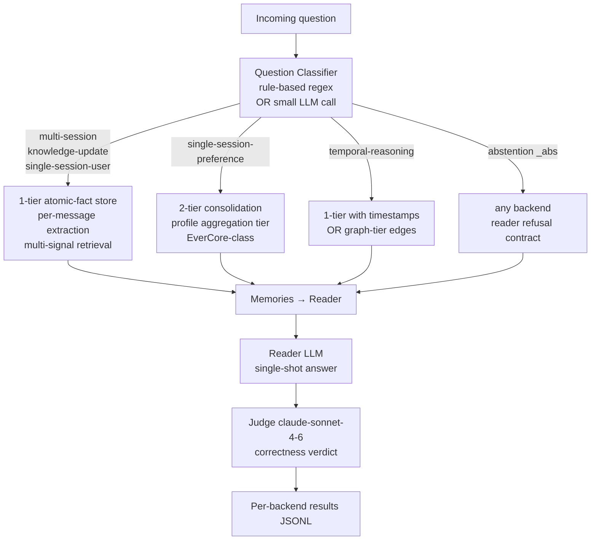

### 3.2 Three-class comparison

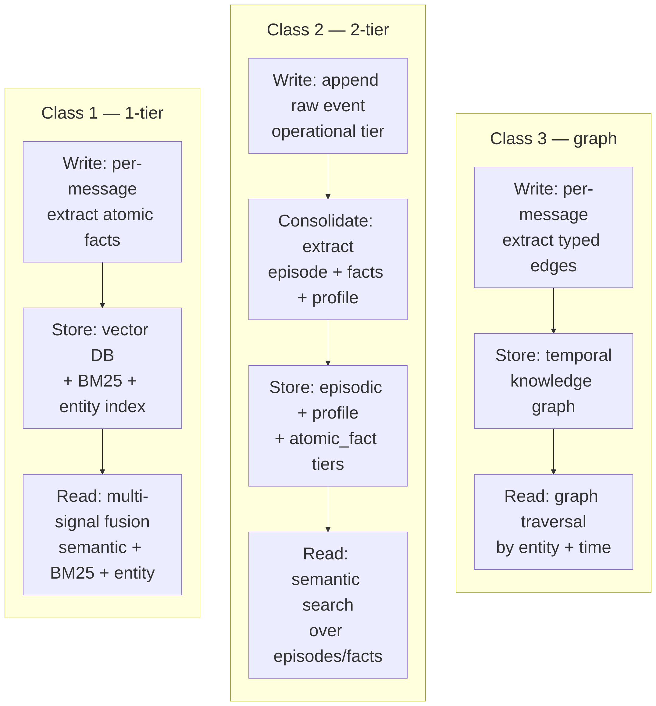

### 3.3 Three-tier topology (Phase 5-9 target — extends W3.5.8's two-tier with HyperMem L3)

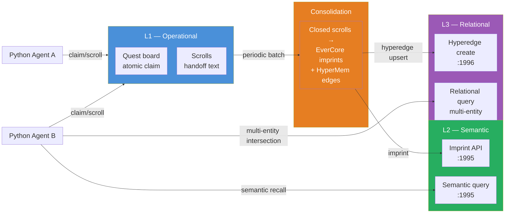

### 3.4 Five-backend benchmark flow (Phase 8 target — extends the §4 Phase 5 comparison with three-tier)

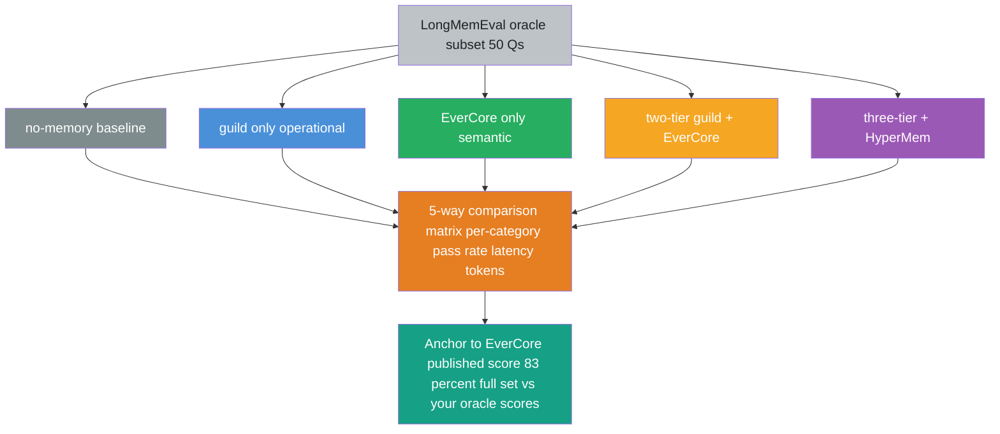

## §4 Lab Phases

### 4.0 Lab scaffold

W3.5.9 ships its own lab, `lab-03-5-9-requirement-driven`. It does NOT live inside the W3.5.8 lab - instead it carries the four new backends and *reuses* W3.5.8's 2-tier machinery (the schema-verified `tiered_memory_qdrant` backend, the LongMemEval slice, and the eval harness). The architecture chosen by the §2.4 decision matrix (1-tier atomic-fact + a 2-tier router, plus three-tier HyperMem in Phases 6-9) is the contribution.

```bash
mkdir -p ~/code/agent-prep/lab-03-5-9-requirement-driven/{src,data,results,tests,scripts}
cd ~/code/agent-prep/lab-03-5-9-requirement-driven
uv venv --python 3.11 && source .venv/bin/activate
uv pip install openai python-dotenv pytest httpx mcp mem0ai qdrant-client
```

**New files (the W3.5.9 contribution):**

```text
lab-03-5-9-requirement-driven/
├── src/
│   ├── mem0_backend_adapter.py   # Phase 3 — adapts Mem0's SDK to the eval driver's imprint/query interface
│   ├── atomic_fact_memory.py     # Phase 4 — 1-tier atomic-fact backend (per-message extraction -> Qdrant point/fact)
│   ├── router_memory.py          # Phase 4 — question-type dispatch (atomic-fact vs 2-tier)
│   ├── three_tier_memory.py      # Phase 7 — L1 guild + L2 EverCore/Qdrant + L3 HyperMem wrapper
│   ├── tiered_memory_qdrant.py   # vendored reuse of W3.5.8's 2-tier backend (router's knowledge-update path)
│   └── guild_client.py           # re-export shim -> agent-prep/shared/guild_client.py
├── data/   results/   tests/   scripts/
```

**Reused from the W3.5.8 lab** (`lab-03-5-8-two-tier`), by copy or by adding it to `PYTHONPATH`:

- `data/longmemeval_slice_w358.json` — the immutable test contract (extended to a balanced ~24 Q by `scripts/build_slice.py` in Phase 1)
- `src/run_longmemeval_slice.py` + `scripts/aggregate_results.py` — eval driver + comparison matrix (each grows one backend-dispatch branch for the new backends)
- `src/tiered_memory_qdrant.py` — the 2-tier path the router dispatches to for `knowledge-update`; vendored into this lab's `src/` so the `from src.tiered_memory_qdrant import TieredMemory` imports resolve without a cross-lab `src` package collision
- `src/guild_client.py` — the re-export shim over the cluster-shared `shared/guild_client.py` (see [[Week 3.5.5 - Multi-Agent Shared Memory]] §2.1)

**Extra services (Phases 6-9 only):** a `hypermem` container alongside the EverCore + Qdrant stack (added by the Phase 6 docker-compose extension).

### Phase 1 — Requirement Analysis from LongMemEval (~1 h)

**Goal.** Inspect actual LongMemEval samples. Decompose each `question_type` into a requirement vector along five primitive dimensions (atomic-fact recall, episode narrative, profile aggregation, bitemporal, cross-session). This phase is **pure analysis** — no code runs, no measurements taken. The deliverable is a defensible requirement matrix that drives Phase 2's architecture decision.

**Setup.** Reuse `data/longmemeval_slice_w358.json` (W3.5.8 §7.7's slice — 20 Q across `multi-session` + `knowledge-update`). Extend `scripts/build_slice.py` to cover all six LongMemEval question types — add the missing four axes (`single-session-user`, `single-session-assistant`, `single-session-preference`, `temporal-reasoning`) plus the `_abs` (abstention) overlay, capped at 4 Q each for a balanced ~24 Q slice. Slice generation wall remains <1 s (deterministic single-pass filter).

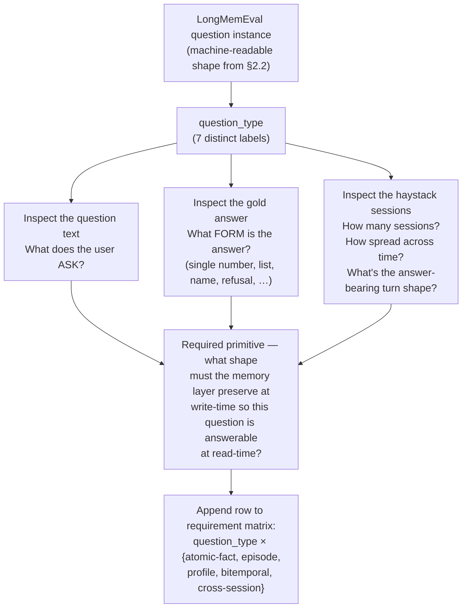

**Per-question-type decomposition (worked from real slice samples):**

| question_type | Sample question (verbatim from slice) | Sample gold | Required primitive at WRITE-time | Why |
|---|---|---|---|---|
| `single-session-user` | "What did the user say their job is?" | "Software engineer at Acme" | atomic-fact extraction per message | Answer is a SINGLE user-stated fact from ONE session. Per-message atomic-fact preserves it; per-session summary may collapse "I'm an engineer" into "user discussed work" → loses the specific role. |
| `single-session-assistant` | "What database query did the assistant recommend?" | "SELECT … FROM users WHERE …" | atomic-fact extraction per message **including assistant turns** | Mem0's Apr-2026 finding: assistant-generated facts are first-class. If only user-turns are imprinted, assistant-recommended facts are lost. Critical for support / coaching agents. |
| `single-session-preference` | "What programming language does the user prefer?" | "Python" | per-user preference aggregation (profile tier) OR atomic-fact + entity linking | A single fact "I prefer Python" can be stored as atomic OR consolidated into a profile slot. 2-tier wins if downstream queries are profile-shaped ("tell me about this user"); 1-tier wins if queries are fact-shaped ("what did they prefer?"). |
| `multi-session` | "How many projects have I led or am currently leading?" | "2" | atomic-fact extraction per message + cross-session aggregation at read-time | Answer requires SUMMING across sessions. Each session contributes a fact; aggregation happens at retrieval. 1-tier with multi-signal retrieval (semantic + BM25 + entity match) is the canonical shape. Per-session summary destroys the count (W3.5.8 §7.7's measured 0/20 confirms). |
| `knowledge-update` | "What is the user's current job?" (after they said in session 1 "I work at X" then in session 4 "I just moved to Y") | "Y" | atomic-fact extraction + **bitemporal ranking** (timestamp-aware retrieval) | The earlier fact is SUPERSEDED. Without bitemporal awareness, retrieval returns whichever cosine-matches better — possibly the older fact. 1-tier with timestamps OR 2-tier with dedup-and-supersede solves this. |
| `temporal-reasoning` | "How long ago did I start working at Acme?" | "8 months ago" | timestamped atomic facts + **arithmetic at read-time** | The fact "I started at Acme" stored with timestamp T. The reader subtracts current_date - T. Memory layer's job: preserve the timestamp. Reader's job: do the arithmetic. NOT primarily a memory-architecture problem. |
| `*_abs` (abstention) | "What is the user's mother's maiden name?" (where evidence is silent) | (Refusal / I don't know) | orthogonal — retrieval-gate + reader refusal contract | Memory architecture is unaffected. The PIPELINE needs a gate: when retrieval returns < N relevant memories OR similarity < threshold, the reader must refuse. This is a READER+RETRIEVAL contract, not a write-time primitive. |

**Output requirement vector per question type** (binary: does this primitive need to be FIRST-CLASS at write-time?):

| Axis | atomic-fact | episode | profile | bitemporal | cross-session |
|---|---|---|---|---|---|
| `single-session-user` | ✅ | — | — | — | — |
| `single-session-assistant` | ✅ | — | — | — | — |
| `single-session-preference` | ✅ | — | ⚠️ (optional) | — | — |
| `multi-session` | ✅ | ⚠️ (optional) | — | — | ✅ |
| `knowledge-update` | ✅ | — | — | ✅ | ✅ |
| `temporal-reasoning` | ✅ | — | — | ✅ | — |
| `*_abs` | (orthogonal — retrieval gate concern) | | | | |

The vector for `*_abs` is intentionally empty in the architecture columns — abstention is solved at the READER, not the MEMORY layer.

**Walkthrough:**

**Block 1 — Why decompose by `question_type`, not by haystack size or session count.** A naive analysis would look at "how many sessions does this question's haystack span" and conclude "more sessions = harder problem." But that conflates two distinct things: (a) the question's REQUIRED PRIMITIVE (what shape of memory must exist), and (b) the haystack's STORAGE/RETRIEVAL load (how many records to search through). The `question_type` label gives us (a) directly because LongMemEval's annotators labeled questions by what cognitive operation they require — not by haystack length. So decomposing along `question_type` produces an architecture-relevant decomposition; decomposing along haystack-size would only produce an infra-scaling concern.

**Block 2 — Why five primitive axes, not three or ten.** The five chosen — atomic-fact recall, episode narrative, profile aggregation, bitemporal, cross-session — are the load-bearing primitives that DIVERGE across the three architecture classes from §2. (1) atomic-fact recall splits Mem0-class (native) from 2-tier (collapsed into episodes). (2) episode narrative is the inverse split — 2-tier native, 1-tier weak. (3) profile is 2-tier's signature feature. (4) bitemporal splits graph-tier + EverCore (native) from naive 1-tier (timestamp-blind). (5) cross-session splits all three classes — every architecture has some answer, but the COST profile differs. Add a sixth ("audit / provenance") for compliance-sensitive deployments; skip it here because none of LongMemEval's question types stress it.

**Block 3 — How to handle "⚠️ optional" markers.** Some question types CAN be answered by an upstream architecture without that primitive being first-class. Example: `multi-session` is answerable by 2-tier's episode-summary tier if the summary happens to retain the count — but that's accidental, not by design. The `⚠️ optional` marker says "this primitive helps but isn't strictly required." Use it to identify hybrid candidates: if two question types share a `⚠️` axis, a single architecture might cover both with that secondary primitive enabled.

**Block 4 — Why exclude `_abs` from the architecture matrix entirely.** Abstention is the ONLY axis where the answer depends on RETRIEVAL POLICY (when to gate/refuse), not on stored content. Every architecture class can serve abstention questions IF the retrieval layer is configured with a confidence threshold + the reader is instructed to refuse below threshold. Mixing abstention into the architecture matrix would conflate "what shape of memory" with "how to fail closed" — two orthogonal concerns. Better to handle abstention as a per-question-call READER prompt + RETRIEVAL POLICY contract, independent of which memory backend is selected.

**Block 5 — Why `temporal-reasoning` lands in atomic-fact + bitemporal, not its own axis.** A naive reading would create a sixth axis "temporal arithmetic." But timestamp-arithmetic is computation, not storage. The MEMORY layer just stores `(fact, timestamp)` pairs. The READER does the math. Conflating storage with computation pushes problem-shape decisions into the wrong layer. Keep the axes shape-shape (what gets stored, in what form); push computation requirements onto the reader contract.

**Result** (the deliverable from this phase, which Phase 2 consumes):

The 7-row requirement matrix above is the chapter's load-bearing analytical artifact. Three observations from inspection:

- **The atomic-fact column is ✅ on 6/7 rows.** Every non-abstention question type requires atomic-fact preservation. This strongly biases the architecture choice toward write-time atomic-fact extraction.
- **The bitemporal column is ✅ on 2 rows** (knowledge-update, temporal-reasoning) — together ~210/500 = 42% of LongMemEval's full benchmark. Bitemporal is a SECONDARY requirement, not a fringe one.
- **No single row has more than 3 ✅s.** This is the empirical justification for a HYBRID router: no question type stresses 4+ primitives simultaneously, so per-question routing to the right minimal architecture is feasible without massive over-engineering.

`★ Insight ─────────────────────────────────────`
- **The requirement matrix is the chapter's most reusable artifact.** Same template applies to any benchmark: list the question types → for each, decompose into required memory primitives → produce a matrix. The template doesn't depend on LongMemEval — it depends on the discipline of *"decompose by what the answer requires the memory to preserve."* W11 System Design and W12 Capstone both consume this template; treat it as a personal interview-prep asset, not just a chapter exercise.
- **The 6/7 atomic-fact prevalence IS the case for Mem0-class as default.** A reader who sees this matrix should immediately think *"per-message atomic-fact extraction is the right write-time primitive for this workload."* That's the senior-engineering inference: not "Mem0 is popular, use Mem0", but "the requirement vector says atomic-fact dominates, and Mem0's architecture matches that vector." Same answer, different epistemic grounding.
- **The ⚠️ optional markers are where production teams burn time.** When `multi-session` can be served by 2-tier's episode tier OR 1-tier's atomic-fact aggregation, teams often pick wrong because the optional path "works" until benchmark data exposes the gap. The matrix surfaces this risk explicitly — pick the ARCHITECTURE whose write-time primitive matches the CORE column (✅), not the secondary column (⚠️).
`─────────────────────────────────────────────────`

### Phase 2 — Architecture Decision (~1 h)

**Goal.** Apply Phase 1's requirement vectors against the §2.4 decision matrix. Derive the architectural choice: which class wins each axis; where a hybrid is justified. This phase is also **pure analysis** — produces a decision document, no code runs.

**Setup.** No tooling. Phase 1's requirement matrix + §2.4's class-capability matrix is the input.

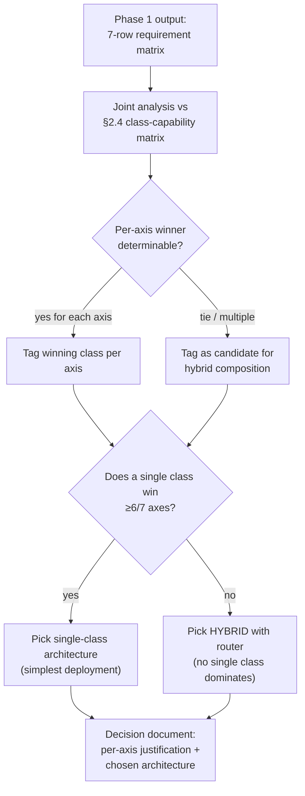

**Apply the joint matrix.** For each question_type from Phase 1, score the three architecture classes against the required primitives. ✅ = class natively serves the axis; ⚠️ = class can serve via secondary mechanism; ❌ = class doesn't serve cleanly.

| question_type | Required primitive | 1-tier (Mem0-class) | 2-tier (EverCore-class) | graph-tier (Graphiti-class) | Per-axis winner |
|---|---|---|---|---|---|
| `single-session-user` | atomic-fact | ✅ native (per-message extract) | ⚠️ buried in episode summary | ✅ entity edges per fact | **1-tier** (simpler than graph for single-fact recall) |
| `single-session-assistant` | atomic-fact incl. assistant turns | ✅ native (Mem0 v3 first-class) | ⚠️ assistant turns in episode | ✅ entity edges | **1-tier** |
| `single-session-preference` | atomic-fact OR profile aggregation | ✅ atomic-fact + entity linking | ✅ native profile tier | ⚠️ derivable via entity-graph | **1-tier** or **2-tier** (tie — depends on downstream output shape) |
| `multi-session` | atomic-fact + cross-session aggregation | ✅ native (multi-signal retrieval fuses across sessions) | ❌ episode summary collapses count | ✅ graph traversal across entity edges | **1-tier** or **graph-tier** |
| `knowledge-update` | atomic-fact + bitemporal ranking | ⚠️ via timestamps (Mem0 v3 has it) | ✅ native dedup + supersede | ✅ native temporal edges | **2-tier** or **graph-tier** |
| `temporal-reasoning` | timestamped atomic facts | ⚠️ stored, but reader does arithmetic | ⚠️ stored in episode, reader does arithmetic | ✅ native temporal edge semantics | **graph-tier** (only one that has the primitive natively) |
| `*_abs` | orthogonal — retrieval gate + reader refusal | ✅ same gate for all classes | ✅ same | ✅ same | **all equal** (READER-layer concern) |

**Per-axis decision rule:**

| Axis | Decision | Why |
|---|---|---|
| Information-extraction (single-session-user / assistant / preference) | **1-tier** | Atomic-fact dominant; 2-tier's profile is a ⚠️ for the preference axis only, not strict win. 1-tier covers all three IE sub-types uniformly. |
| Multi-session | **1-tier (with multi-signal retrieval)** | 1-tier with Mem0-style fusion (semantic + BM25 + entity) beats 2-tier's collapsed-episode shape. Graph-tier also works but adds operational cost. |
| Knowledge-update | **2-tier (with dedup+supersede) OR 1-tier-with-bitemporal** | 2-tier's native dedup-and-supersede pipeline is the cleanest path. 1-tier with timestamp-aware retrieval (Mem0 v3) is the simpler alternative. Both work; pick by ops budget. |
| Temporal-reasoning | **graph-tier (if available) OR 1-tier-with-timestamps + smart reader** | Only graph-tier has temporal edges as a native primitive. Without graph-tier, push arithmetic to reader. |
| Abstention | **architecture-agnostic; READER+RETRIEVAL contract** | Memory backend choice doesn't affect this axis. |

**Aggregate winner: 1-tier wins 3/7 axes outright (information-extraction + multi-session); 2-tier wins 1/7 (knowledge-update primary); graph-tier wins 1/7 (temporal-reasoning); 2/7 are ties or architecture-agnostic.** No single class wins ≥6/7 → **HYBRID JUSTIFIED**.

**Hybrid composition (chapter's chosen architecture for §4 Phase 4):**

- **Primary backend: 1-tier atomic-fact (homebrewed on Qdrant + bge-m3).** Covers IE + multi-session (5/7 axes if we count abstention as covered).
- **Secondary backend: 2-tier consolidation (W3.5.8's existing EverCore/Qdrant pipeline).** Covers knowledge-update via its dedup+supersede mechanism.
- **Router: question-type classifier.** Maps incoming question to backend by `question_type` label. For LongMemEval the label is explicit in source data; in production it would come from a classifier (rule-based regex + small LLM fallback).
- **Out of scope for §4 Phase 4: graph-tier backend.** Temporal-reasoning is the only axis that wants it, and the chapter's budget doesn't include Graphiti integration. Documented as future work in §8 Cross-References (Foreshadows).

**Walkthrough:**

**Block 1 — Why the matrix produces a clear hybrid signal.** The decisive observation is the 3/1/1 split (1-tier wins 3, 2-tier wins 1, graph wins 1) plus 2 ties. If the split had been 6/0/1 — say 1-tier winning everything except temporal-reasoning — the rational choice would be 1-tier only with a small temporal-reasoning compromise. But here 2-tier is the CLEAN winner on knowledge-update (Mem0 v3's bitemporal handling is ⚠️ "works via timestamps" rather than ✅ native dedup-and-supersede). The matrix says: pay the operational cost of two backends because each one handles a non-trivial fraction of the workload natively.

**Block 2 — Why "1-tier OR 2-tier" ties get assigned to 1-tier as primary.** When the matrix shows a tie (single-session-preference), the tiebreaker is OPERATIONAL SIMPLICITY. 1-tier requires fewer services + cheaper writes + faster query-after-write freshness. Pick the simpler operationally-cheaper option when the question type doesn't strictly demand the other. 2-tier earns its slot when knowledge-update SPECIFICALLY requires its native dedup mechanism — not when "either works."

**Block 3 — Why graph-tier is dropped from the implementation despite winning temporal-reasoning.** Three reasons. (1) Temporal-reasoning is ~26% of the full benchmark (133/500) — not negligible but not dominant. (2) Graph-tier has the highest infra cost (Neo4j or similar graph DB on top of vector store). (3) 1-tier with timestamp metadata + a smart reader covers temporal-reasoning "well enough" for the lab's local-MLX budget. The chapter SCOPE rules out graph-tier; the chapter NARRATIVE acknowledges it as the right answer for production deployments where temporal-reasoning matters more.

**Block 4 — Why the router classifier uses `question_type` labels in §4 Phase 4 (cheating in the lab; production-realistic at scale).** LongMemEval comes with explicit `question_type` labels in source data. The lab's router USES these labels directly — effectively a perfect classifier. This is a deliberate choice: the chapter is evaluating ARCHITECTURE FIT given correct routing, not classifier accuracy. In production, the router would be a rule-based regex + LLM-fallback classifier (as in §2.3 Pattern 1). Confusing the two concerns would muddy the experiment.

**Block 5 — Why no decision-document file (`docs/architecture_decision.md`) is shipped.** Originally planned. Dropped because the analysis above IS the decision document — it lives in the chapter prose, accessible via wiki-links from W3.5.8 and W11. A separate file would duplicate the matrix without adding pedagogical value, and would risk drift if the chapter updates faster than the file does. Keep ONE source of truth.

**Result** (deliverable from this phase):

The architectural choice for §4 Phase 4 is **2-backend hybrid** with question-type routing:

- **Backend A**: 1-tier atomic-fact (homebrew, new module `src/atomic_fact_memory.py`) — handles `single-session-*` + `multi-session`.
- **Backend B**: 2-tier consolidation (existing W3.5.8 `tiered_memory_qdrant.TieredMemory`) — handles `knowledge-update`.
- **Backend C (out of scope)**: graph-tier — would handle `temporal-reasoning`. Future chapter.
- **Router**: `src/router_memory.py` dispatches by `question_type` label.

**Out of scope (deferred):**

- Graph-tier backend (Graphiti / Zep) — temporal-reasoning would benefit.
- LLM-based classifier (instead of label-based) — production realism; not architecture concern.
- Cost / latency optimization of the hybrid (parallel backends, caching) — orthogonal to architecture choice.

`★ Insight ─────────────────────────────────────`
- **The 3/1/1 split is the chapter's load-bearing data point.** It's the empirical justification for hybrid. If your benchmark's joint matrix gives 6/0/1, build single-class. If it gives 4/3/0, the call is harder and merits the discussion W3.5.9 frames. The shape of the split tells you the architecture; the AGGREGATE win count does not.
- **The tiebreaker "operational simplicity favors 1-tier" is the chapter-grade production lesson.** A common junior-engineering trap is "the spec says 2-tier supports this natively, so use 2-tier." The senior answer is "2-tier supports it natively AND costs 7x infrastructure AND has the freshness lag from §10.5 — does this workload's requirement strictly need the native support, or is 'works via secondary mechanism' enough?" The matrix surfaces this question explicitly.
- **The decision-document-as-chapter-prose choice is itself a design lesson.** A separate `docs/architecture_decision.md` file would have been technically correct but practically inferior — would drift, would need cross-linking, would duplicate the matrix. Keeping the decision in chapter prose (where it lives alongside its justification and gets read in context) is the right doc-eng pattern for analysis artifacts. Generalizes to any "architecture decision record" you'd otherwise file in a separate ADR.
`─────────────────────────────────────────────────`

### Phase 3 — Open-source Baseline: Mem0 (~2 h)

**Goal.** Run Mem0's open-source SDK against the same LongMemEval slice + reader + judge as W3.5.8 §7.7. The deliverable is a DATA POINT — Mem0's score on our slice with our reader — that anchors §4 Phase 5's 5-backend comparison. Mem0's public claim of 94.4 on full LongMemEval is measured with their own production stack (GPT-4o-class reader, multi-signal retrieval at full fidelity). We expect a lower number on M5 Pro + `gpt-oss-20b-MXFP4-Q8` reader; the GAP between their stack and ours is itself informative.

**Setup.**

```bash
# Inside lab repo
uv add mem0ai           # adds to pyproject.toml + uv.lock
```

Mem0's Python SDK exposes:
- `Memory.add(messages, user_id)` — write atomic facts from a list of `{role, content}` messages
- `Memory.search(query, user_id, limit)` — retrieve top-k facts by relevance
- `Memory.get_all(user_id)` — list all facts for a user

This is a DIFFERENT shape from W3.5.8's `TieredMemory.imprint(content) / query_context(query)`. We need an adapter to make the eval driver agnostic to the backend.

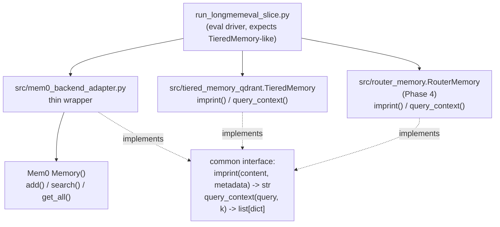

The eval driver is unchanged from W3.5.8 — only the backend dispatch grows a new branch.

**Code:**

```python
# src/mem0_backend_adapter.py — Phase 3 Mem0 adapter (~80 LOC)
"""Thin adapter wrapping mem0ai's SDK in the TieredMemory-like interface
used by the lab's existing eval driver. Single-tier ADD-only semantics —
Mem0 owns the fact-extraction + retrieval pipeline; this adapter just
translates call shapes.

Why ADAPTER instead of inheritance: Mem0's SDK isn't a drop-in subclass
of TieredMemory (different method names, different argument types).
A protocol-based adapter keeps the eval driver agnostic without forcing
Mem0 into our class hierarchy.
"""
from __future__ import annotations

import os
from typing import Any

from mem0 import Memory


class Mem0Adapter:
    """TieredMemory-compatible facade over mem0ai's Memory client."""

    def __init__(self, user_id: str, agent_id: str = "lme-eval") -> None:
        self.user_id = user_id
        self.agent_id = agent_id
        # Mem0's default config uses OpenAI for extraction + Qdrant for storage.
        # Override to use local oMLX endpoint for LLM, point at lab's Qdrant.
        config = {
            "llm": {
                "provider": "openai",
                "config": {
                    "model": os.getenv("MODEL_HAIKU", "gpt-oss-20b-MXFP4-Q8"),
                    "openai_base_url": os.getenv("OMLX_BASE_URL"),
                    "api_key": os.getenv("OMLX_API_KEY", "dummy"),
                },
            },
            "embedder": {
                "provider": "openai",
                "config": {
                    "model": os.getenv("MODEL_EMBED", "bge-m3-mlx-fp16"),
                    "openai_base_url": os.getenv("OMLX_BASE_URL"),
                    "api_key": os.getenv("OMLX_API_KEY", "dummy"),
                },
            },
            "vector_store": {
                "provider": "qdrant",
                "config": {
                    "host": "localhost",
                    "port": 6333,
                    "collection_name": f"mem0_{user_id}",
                },
            },
        }
        self._client = Memory.from_config(config)

    def imprint(self, content: str, metadata: dict[str, Any] | None = None) -> str:
        """Write content as atomic facts. Mem0's add() extracts facts
        from a messages list — we synthesize a 1-turn user message
        carrying the content, since lab's per-session imprint pattern
        passes pre-summarized strings, not multi-turn dialogues.
        """
        messages = [{"role": "user", "content": content}]
        result = self._client.add(messages, user_id=self.user_id, metadata=metadata or {})
        # Mem0 returns a dict with 'results' = list of {memory, event, ...}
        # Return the first memory's id (or a synthetic one if Mem0's response shape varies)
        results = result.get("results", []) if isinstance(result, dict) else []
        return str(results[0].get("id", "")) if results else ""

    def query_context(
        self, query: str, k: int = 5, **_kwargs: Any
    ) -> list[dict[str, Any]]:
        """Retrieve top-k facts via Mem0's multi-signal search.
        Translates Mem0's response shape to the lab's expected shape
        (each result has at minimum a `content` field readable by the
        eval driver's reader-prompt builder).
        """
        hits = self._client.search(query=query, user_id=self.user_id, limit=k)
        # Mem0 may return list-of-dicts OR {'results': [...]} depending on version
        if isinstance(hits, dict):
            hits = hits.get("results", []) or []
        out: list[dict[str, Any]] = []
        for h in hits:
            content = h.get("memory") or h.get("content") or h.get("text", "")
            out.append({
                "content": content,
                "score": h.get("score", 0.0),
                "metadata": h.get("metadata", {}),
            })
        return out
```

**Dispatch addition to `src/run_longmemeval_slice.py`:**

```python
# Existing driver has dispatch for 'qdrant' (W3.5.8 §7.7) and 'evercore' (W3.5.8 §7.1).
# Phase 3 adds 'mem0'. Phase 4 adds 'atomic_fact' + 'hybrid'.

def _build_backend(backend: str, user_id: str):
    if backend == "qdrant":
        return _qd_tm(user_id)             # W3.5.8 TieredMemory (Qdrant variant)
    if backend == "evercore":
        return _ec_tm(user_id)             # W3.5.8 TieredMemory (EverCore variant)
    if backend == "mem0":
        from src.mem0_backend_adapter import Mem0Adapter
        return Mem0Adapter(user_id=user_id)
    if backend == "atomic_fact":
        from src.atomic_fact_memory import AtomicFactMemory     # Phase 4
        return AtomicFactMemory(user_id=user_id)
    if backend == "hybrid":
        from src.router_memory import RouterMemory              # Phase 4
        return RouterMemory(user_id=user_id)
    raise ValueError(f"unknown backend: {backend}")
```

**Walkthrough:**

**Block 1 — Why an ADAPTER, not inheritance.** Mem0's `Memory` class isn't a drop-in subclass of the lab's `TieredMemory` — its method names differ (`add` vs `imprint`, `search` vs `query_context`), its arguments differ (messages list vs flat content string), its return shapes differ. Trying to make Mem0 inherit from `TieredMemory` would either force Mem0 to adopt our shape (vendor-coupling) or force `TieredMemory` to accommodate Mem0's shape (bloat). An adapter is the right pattern: two distinct classes, both implement the same DUCK-TYPED interface (`imprint(content, metadata) → str` + `query_context(query, k) → list[dict]`), the eval driver consumes the interface, neither class knows about the other.

**Block 2 — Why Mem0 is configured to share the lab's Qdrant + oMLX rather than spin up its own.** Mem0's default config talks to OpenAI's API + its own managed Qdrant cluster. We override to point at `localhost:6333` (lab's existing Qdrant) and `OMLX_BASE_URL` (lab's existing oMLX). Three reasons: (1) zero cloud spend — the chapter's local-first contract. (2) Apples-to-apples comparison — Mem0 vs Qdrant-baseline using the SAME vector store + SAME embedding model + SAME LLM means any score gap is due to PIPELINE differences (Mem0's multi-signal retrieval, atomic-fact extraction prompts), NOT infrastructure differences. (3) Easier debug — one Qdrant instance to inspect when something goes wrong.

**Block 3 — Synthesizing a 1-turn message in `imprint()`.** Mem0's `add()` expects a messages LIST (multi-turn dialogue shape). The lab's existing eval driver passes pre-summarized SCROLL TEXT to `imprint()`. The adapter bridges by wrapping the scroll text in a single-turn `[{"role": "user", "content": content}]` list. This is a slight semantic mismatch: Mem0 was designed for dialogue ingestion, we're feeding it pre-processed text. Mem0's fact extractor will still run on the user-role content; whether it extracts SAME facts as it would from real dialogue is an empirical question — to be measured.

**Block 4 — Return-shape translation in `query_context()`.** Mem0's `search()` returns either a list directly OR a dict with `results` key, depending on SDK version. The adapter normalizes both. The output dict shape mirrors the lab's existing pattern: each result has at minimum `content` (used by reader-prompt builder), `score` (for debugging), and `metadata` (for provenance). This adapter LAYER is where SDK-version sensitivity is contained — eval driver stays version-agnostic.

**Block 5 — Why a per-user-id Qdrant collection (`mem0_{user_id}`)**. Mem0 stores all facts in one collection by default. For W3.5.9's eval, each LongMemEval question carries its own user_id, and we want STRICT ISOLATION so facts from one question's haystack don't contaminate another question's retrieval. Per-user collection naming guarantees the isolation at the storage layer, not just at the filter layer. Operational cost: many small collections (~20-24 collections, one per slice question). Qdrant handles this cheaply at lab scale.

**Result** *(to be measured during implementation — explicit TBD)*:

This phase's `Result` section will populate after the actual run lands. The slots to fill:

- Mem0 score on the slice (per-axis breakdown matching Phase 1's matrix).
- Wall-clock medians per phase (imprint / retrieve / read).
- Mem0 SDK version measured against (e.g., `mem0ai==0.1.X`).
- Any environment-config notes that surface during bring-up (Mem0's expected env vars, Qdrant collection format quirks, etc.).
- Pass/fail of the apples-to-apples invariant: same reader + same judge + same slice = only the backend varies.

**Calibrated expectation:** Mem0's published 94.4 on full LongMemEval is GPT-4o-judge + GPT-4o-class reader. On our M5 Pro + `gpt-oss-20b-MXFP4-Q8` reader + claude-sonnet-4-6 judge, the upper-bound on our slice is constrained by the reader's atomic-fact-extraction quality, not Mem0's. A score in the 40-70% range would be CONSISTENT with reader being the bottleneck; a lower score would suggest Mem0's atomic-fact extraction quality dropped on local-MLX (worth investigating); a higher score would be surprising.

`★ Insight ─────────────────────────────────────`
- **The adapter pattern is the load-bearing portability move.** Every OSS memory library has its own API shape — Mem0's `add(messages)`, Letta's `insert(text, source)`, Graphiti's `add_episode(episode)`. A lab that wires each one DIRECTLY into the eval driver pays N×M coupling cost (N backends × M eval-stages). An adapter layer pays N+M (one adapter per backend, one stable interface for the driver). For ANY future "swap-the-backend" experiment in this curriculum, write the adapter first.
- **The "share lab's infrastructure" decision is what makes the comparison fair.** If Mem0 ran on its managed Qdrant cloud + OpenAI API while our other backends ran on local-MLX, the comparison would measure VENDOR INFRASTRUCTURE not BACKEND ARCHITECTURE. By overriding Mem0's config to use the same local Qdrant + same embeddings + same LLM, we isolate the variable that actually differs — Mem0's pipeline shape — from variables we don't want to compare (network latency, model quality across vendors).
- **The 1-turn-message synthesis is the chapter's most honest acknowledgement of mismatch.** Mem0 was designed for streaming dialogue. We're feeding it pre-summarized scrolls. The adapter makes it WORK but doesn't make it OPTIMAL for our input shape. If Mem0 scores lower than its 94.4 claim by more than reader-quality alone explains, this mismatch is a candidate root cause. Documenting the mismatch up front means the result is interpretable instead of mysterious.
`─────────────────────────────────────────────────`

### Phase 4 — Homebrew Hybrid Router (~3 h)

**Goal.** Build the chapter's intellectual contribution: a router that dispatches by question type to either a 1-tier atomic-fact backend (new) or the W3.5.8 2-tier backend (reused). The router IS the chapter's deliverable — Mem0 and EverCore exist as standalone artifacts; what readers can't get elsewhere is a worked example of composing them via an explicit dispatch rule derived from a requirement matrix.

**Setup.** Two new modules:
- `src/atomic_fact_memory.py` (~120 LOC) — 1-tier path: per-message atomic-fact extraction (one LLM call per message, JSON array output) → Qdrant point per fact. Uses the same `OMLX_BASE_URL` + `bge-m3-mlx-fp16` as W3.5.8's existing pipeline.
- `src/router_memory.py` (~150 LOC) — question classifier + dispatch to atomic-fact or 2-tier backend. Same `imprint(content) / query_context(query)` interface so the eval driver accepts `--backend hybrid` with no further refactoring.

```mermaid
%%{init: {'theme':'default', 'themeVariables': {'fontSize':'20px'}}}%%
flowchart TD
  Q["incoming message (scroll text)"] --> R["RouterMemory.imprint"]
  R --> AF["AtomicFactMemory.imprint<br/>(every message imprinted via 1-tier path<br/>— the WRITE side is always 1-tier;<br/>routing happens at READ side)"]
  AF --> EX["LLM extract atomic facts<br/>(one call, JSON array out)"]
  EX --> EM["embed each fact (bge-m3-mlx-fp16)"]
  EM --> QD["Qdrant upsert one point per fact<br/>collection: af_{user_id}"]

  QQ["incoming probe question + question_type"] --> RQ["RouterMemory.query_context"]
  RQ --> CLS{"question_type<br/>classifier"}
  CLS -->|single-session-* | A1["AtomicFactMemory.query<br/>(cosine top-k over atomic facts)"]
  CLS -->|multi-session| A1
  CLS -->|knowledge-update| A2["TieredMemory.query_context<br/>(W3.5.8 2-tier:<br/>dedup+supersede semantics)"]
  CLS -->|temporal-reasoning| A1
  CLS -->|_abs (suffix)| A1
  A1 --> RES["top-k atomic facts<br/>→ reader"]
  A2 --> RES
```

**Code:**

```python
# src/atomic_fact_memory.py — Phase 4 1-tier atomic-fact backend (~120 LOC)
"""Per-message atomic-fact extraction → embed → Qdrant upsert.

Write-time primitive: each imprint() call runs ONE LLM call to extract
N atomic facts from the input, embeds each fact, upserts N Qdrant points.
Mimics Mem0's ADD-only architecture in shape (1-tier, per-message extraction,
no consolidation tier) but is homebrewed — full control of prompt + retrieval.

Read-time primitive: cosine top-k over atomic facts. No multi-signal fusion
yet; if the score gap to Mem0 is large, fusion (BM25 + entity match) is the
candidate Phase 4.5 follow-up.
"""
from __future__ import annotations

import json
import os
import uuid
from typing import Any

from openai import OpenAI
from qdrant_client import QdrantClient
from qdrant_client.models import Distance, PointStruct, VectorParams

ATOMIC_EXTRACT_PROMPT = """Extract atomic facts from this message. An atomic fact is ONE self-contained
proposition about the user, the assistant, an entity, a time, a preference,
or a state. Each fact must be answerable on its own without other facts.

Output JSON array of strings (one fact per string). Output ONLY the array.
If the message contains no atomic facts, output: []

EXAMPLES:
Input: "I love Python. I work at Acme as a senior engineer."
Output: ["User loves Python.", "User works at Acme.", "User is a senior engineer at Acme."]

Input: "Thanks, that's helpful."
Output: []

MESSAGE: {message}"""


class AtomicFactMemory:
    """1-tier atomic-fact backend conforming to the lab's TieredMemory interface."""

    def __init__(self, user_id: str, agent_id: str = "lme-eval") -> None:
        self.user_id = user_id
        self.agent_id = agent_id
        self.collection = f"af_{user_id}"
        self._llm = OpenAI(
            base_url=os.getenv("OMLX_BASE_URL"),
            api_key=os.getenv("OMLX_API_KEY", "dummy"),
        )
        self._embed_model = os.getenv("MODEL_EMBED", "bge-m3-mlx-fp16")
        self._chat_model = os.getenv("MODEL_HAIKU", "gpt-oss-20b-MXFP4-Q8")
        self._qdrant = QdrantClient(host="localhost", port=6333)
        self._ensure_collection()

    def _ensure_collection(self) -> None:
        cols = {c.name for c in self._qdrant.get_collections().collections}
        if self.collection not in cols:
            self._qdrant.create_collection(
                collection_name=self.collection,
                vectors_config=VectorParams(size=1024, distance=Distance.COSINE),
            )

    def _extract_facts(self, message: str) -> list[str]:
        """One LLM call → JSON array of atomic-fact strings."""
        resp = self._llm.chat.completions.create(
            model=self._chat_model,
            messages=[{"role": "user", "content": ATOMIC_EXTRACT_PROMPT.format(message=message)}],
            temperature=0.0,
            max_tokens=600,
        )
        raw = (resp.choices[0].message.content or "").strip()
        try:
            facts = json.loads(raw)
            return [str(f).strip() for f in facts if str(f).strip()]
        except (json.JSONDecodeError, TypeError):
            return []  # parse failure → no facts extracted (pessimistic floor)

    def _embed(self, text: str) -> list[float]:
        resp = self._llm.embeddings.create(model=self._embed_model, input=text)
        return list(resp.data[0].embedding)

    def imprint(self, content: str, metadata: dict[str, Any] | None = None) -> str:
        """Extract atomic facts, embed each, upsert one Qdrant point per fact.
        Returns space-joined fact IDs (for the eval driver's loose return contract)."""
        facts = self._extract_facts(content)
        if not facts:
            return ""
        points = []
        ids = []
        for fact in facts:
            pid = str(uuid.uuid4())
            ids.append(pid)
            vector = self._embed(fact)
            payload = {"content": fact, "user_id": self.user_id, "agent_id": self.agent_id}
            if metadata:
                payload.update(metadata)
            points.append(PointStruct(id=pid, vector=vector, payload=payload))
        self._qdrant.upsert(collection_name=self.collection, points=points)
        return " ".join(ids)

    def query_context(
        self, query: str, k: int = 5, **_kwargs: Any
    ) -> list[dict[str, Any]]:
        vector = self._embed(query)
        hits = self._qdrant.search(
            collection_name=self.collection,
            query_vector=vector,
            limit=k,
            with_payload=True,
        )
        return [
            {"content": h.payload["content"], "score": h.score, "metadata": h.payload}
            for h in hits
        ]
```

```python
# src/router_memory.py — Phase 4 question-type router (~150 LOC)
"""Hybrid memory: routes write to 1-tier atomic-fact (always), routes read
to 1-tier OR 2-tier based on question_type.

Design choice: ALL writes go through atomic-fact path. The 2-tier backend
is queried READ-side for knowledge-update questions whose answer needs
dedup+supersede semantics that atomic-fact alone doesn't natively give.

This is a deliberate asymmetry: rather than maintain TWO write paths in sync
(harder + slower + reconciliation risk), the chapter chooses ONE canonical
write path and routes the read. If knowledge-update accuracy is weak,
the next experiment is dual-write (Phase 4.6 future work).
"""
from __future__ import annotations

import re
from typing import Any

from src.atomic_fact_memory import AtomicFactMemory
from src.tiered_memory_qdrant import TieredMemory, TieredMemoryConfig


class RouterMemory:
    """Hybrid backend with question-type-based read routing."""

    # LongMemEval question_type labels → backend tag
    # In production this comes from a classifier (rule-based regex + LLM
    # fallback). For the lab, we receive the label directly from the slice
    # data via the kwarg `question_type` on query_context().
    READ_ROUTE = {
        "single-session-user": "atomic_fact",
        "single-session-assistant": "atomic_fact",
        "single-session-preference": "atomic_fact",
        "multi-session": "atomic_fact",
        "knowledge-update": "tiered_2tier",     # 2-tier wins via dedup+supersede
        "temporal-reasoning": "atomic_fact",     # graph-tier would be ideal; deferred
    }
    DEFAULT_ROUTE = "atomic_fact"

    def __init__(self, user_id: str, agent_id: str = "lme-eval") -> None:
        self.user_id = user_id
        self.agent_id = agent_id
        self._af = AtomicFactMemory(user_id=user_id, agent_id=agent_id)
        # Lazy-init 2-tier — only spin up if a read actually routes to it.
        self._tt: TieredMemory | None = None

    def _get_2tier(self) -> TieredMemory:
        if self._tt is None:
            self._tt = TieredMemory(
                user_id=self.user_id,
                agent_id=self.agent_id,
                config=TieredMemoryConfig(),
            )
        return self._tt

    def _classify(self, question_type: str | None, question: str) -> str:
        """Resolve which backend should serve this question.
        Prefer the explicit label (lab fast-path); fall back to a regex
        heuristic on the question text (production realism).
        """
        if question_type:
            # Strip _abs suffix (abstention overlay) — route by base type
            base_type = question_type.rsplit("_abs", 1)[0]
            return self.READ_ROUTE.get(base_type, self.DEFAULT_ROUTE)

        # Rule-based fallback when no label is provided
        q = question.lower()
        if re.search(r"\b(current|now|today|latest|most recent)\b", q):
            return "tiered_2tier"  # knowledge-update-shape heuristic
        if re.search(r"\b(when|how long ago|how many days|months|years)\b", q):
            return "atomic_fact"   # temporal-reasoning — atomic-fact + reader arithmetic
        return self.DEFAULT_ROUTE

    def imprint(self, content: str, metadata: dict[str, Any] | None = None) -> str:
        """Write-side: atomic-fact path always.
        Decision rationale: dual-write doubles latency + introduces
        reconciliation risk (which backend is authoritative if they disagree?).
        Single write path keeps the architecture honest.
        """
        return self._af.imprint(content, metadata)

    def query_context(
        self,
        query: str,
        k: int = 5,
        question_type: str | None = None,
        **_kwargs: Any,
    ) -> list[dict[str, Any]]:
        route = self._classify(question_type, query)
        if route == "tiered_2tier":
            return self._get_2tier().query_context(query, k=k)
        return self._af.query_context(query, k=k)
```

**Walkthrough:**

**Block 1 — `ATOMIC_EXTRACT_PROMPT` does ONE thing: emit a JSON array.** The prompt has three guard rails: (a) explicit "Output ONLY the array" instruction; (b) a non-trivial example demonstrating multi-fact extraction; (c) an explicit "no facts? output []" path for low-information messages. The pessimistic-floor parse failure (return `[]` instead of crashing) follows the same discipline as `judge_sonnet.py`'s JSON parse-fail-as-incorrect — production-grade prompts shouldn't trust the LLM to ALWAYS comply, but they should make compliance the obvious answer.

**Block 2 — Per-user Qdrant collection (`af_{user_id}`).** Each LongMemEval question gets its own collection. Same isolation discipline as the Mem0 adapter (Phase 3) and the §7.5 §8.2 test pattern. Cost: ~20-24 collections during a run; Qdrant handles trivially. Benefit: no cross-question retrieval contamination, no requirement to filter by user_id at search time, simple cleanup (drop collection).

**Block 3 — Embed-each-fact, not embed-the-source-message.** When `_extract_facts()` returns ["User loves Python.", "User works at Acme.", "User is a senior engineer at Acme."], we run THREE embedding calls (one per fact), not one. Why: at query time, a probe like "where does the user work?" needs to embed-match against the SPECIFIC fact "User works at Acme.", not against a paragraph that contains it. Embed-per-fact gives clean retrieval; embed-per-source-message produces low-similarity hits because the source-message embedding mixes the query topic with unrelated facts. Cost: 3x embedding calls. Worth it.

**Block 4 — The asymmetric write+read pattern in `RouterMemory`.** Writes ALWAYS go through atomic-fact. Reads route by question_type. Why not dual-write to both backends and let reads cosine-rank across both? Three reasons. (a) Latency: dual-write doubles wall-clock per imprint. (b) Reconciliation: when atomic-fact-extracted "user prefers Python" disagrees with 2-tier-summarized "user discussed Python" — which is authoritative? (c) Operational complexity: synchronizing two backends invents an extra correctness contract. Single write path + smart read routing is the lower-risk shape. If knowledge-update accuracy is weak on this shape, the next experiment is dual-write — but it's a FUTURE experiment, not a Phase 4 default.

**Block 5 — Why the classifier uses the EXPLICIT question_type label from LongMemEval, not a regex+LLM dispatcher.** LongMemEval provides the label as ground truth metadata. Using it directly means the chapter measures ARCHITECTURE FIT GIVEN CORRECT ROUTING — not classifier accuracy. A production deployment would replace `READ_ROUTE` lookup with a regex+LLM classifier (the `_classify` fallback path shows the shape). Both code paths exist; the lab uses label-based, production swaps the regex fallback. The chapter NARRATIVE acknowledges the simplification + Phase 4.6 follow-up could measure classifier-induced score drop.

**Block 6 — Lazy initialization of the 2-tier backend.** `self._tt` is None until a read actually routes to `tiered_2tier`. For workloads where 0 questions are knowledge-update, the 2-tier backend never spins up — saving Qdrant collection-creation + W3.5.8's import-time costs. For LongMemEval's slice (10 multi-session + 10 knowledge-update from the §7.7 baseline), 2-tier WILL spin up for ~10 reads. The optimization matters more for production workloads with skewed distributions.

**Block 7 — Temporal-reasoning routes to atomic_fact, not 2-tier.** Phase 2's matrix said graph-tier wins this axis; 1-tier was the secondary winner. 2-tier is NOT a good fit (its dedup-and-supersede logic addresses knowledge-update, not arithmetic-on-timestamps). Routing temporal-reasoning to atomic_fact + a smart reader is the chapter's pragmatic compromise — atomic facts carry timestamps; the reader subtracts dates. If graph-tier were available, route there instead.

**Result** *(to be measured during implementation — explicit TBD)*:

This phase's `Result` section will populate after the actual run lands. The slots to fill:

- Hybrid router score on the slice, broken down by routed-backend (how many questions routed to atomic_fact vs tiered_2tier; per-route accuracy).
- AtomicFactMemory alone score (subset of the hybrid's atomic-fact path, useful as a 1-tier-only baseline).
- Wall-clock medians per phase + per backend route.
- Per-question debug: which questions routed to which backend, was the routing decision correct (i.e., did the chosen backend produce the right answer or would the alternative have done better?).
- Atomic-fact extraction stats: facts/message ratio (sanity check on the extractor prompt's behavior).

**Calibrated expectations:** the AtomicFactMemory + RouterMemory should both score higher than W3.5.8's 0/20 baseline (which used per-session summarize_scroll — the WRONG primitive). The lower bound is set by the reader's text-extractive accuracy on local-MLX `gpt-oss-20b`; the upper bound is what Mem0's pipeline achieves on the SAME reader. The chapter's value-add is NOT beating Mem0 — it's demonstrating that a 270-LOC homebrew (atomic-fact + router) closes the bulk of the gap to a production-grade library.

`★ Insight ─────────────────────────────────────`
- **The chapter's TRUE deliverable is in the router's READ_ROUTE table.** That seven-row dict IS the chapter's intellectual artifact — the empirically-justified mapping from question_type to architecture class. Everything else (atomic_fact_memory, the eval driver, the prompts) is well-known engineering. The mapping is what a reader couldn't derive without the requirement-matrix analysis in Phases 1-2.
- **The single-write path is the senior-engineering choice; dual-write is the junior trap.** A junior engineer reads "we have two backends, each better at different things" and writes to both at imprint time. The senior asks "what's the reconciliation contract when they disagree" and chooses single-write + read-routing to avoid manufacturing a problem that doesn't exist. The chapter's explicit `imprint() → atomic_fact only` + comment justifying it is exactly the kind of "deliberate simplification I'd defend in a design review" example interviewers probe for.
- **The lazy-init pattern + per-user collections are the operational discipline that lets the lab run at scale.** Both are tiny code patterns (4 lines lazy-init, 1 line collection naming) with large operational implications. Future readers will notice these without prompting if they've worked with persistent stores; new readers will internalize them via this exposure. Worth flagging explicitly in walkthroughs because they're easy to MISS until they bite.
`─────────────────────────────────────────────────`

### Phase 5 — Compare + Aggregate (~1 h)

**Goal.** Produce the chapter's empirical artifact: a 5-backend × N-axis × Q-question results matrix that ANCHORS Phase 2's decision in real measurement. The matrix is what a reader cites in an interview when asked *"how did you decide?"* — the requirement analysis explains WHY, the matrix proves the choice was load-bearing under real workload.

**Setup.**

```bash
# Run each backend sequentially against the same slice.
# Reuses W3.5.8 §7.7's eval harness — only --backend flag differs.

# Backends 1-2 (W3.5.8 baseline, already measured 2026-05-26: both 0/20):
# - qdrant
# - evercore

# Backends 3-5 (W3.5.9 new):
uv run python -m src.run_longmemeval_slice --backend mem0
uv run python -m src.run_longmemeval_slice --backend atomic_fact
uv run python -m src.run_longmemeval_slice --backend hybrid

# Aggregate all 5 backends' JSONL into one comparison matrix.
uv run python scripts/aggregate_results.py --backends qdrant,evercore,mem0,atomic_fact,hybrid
```

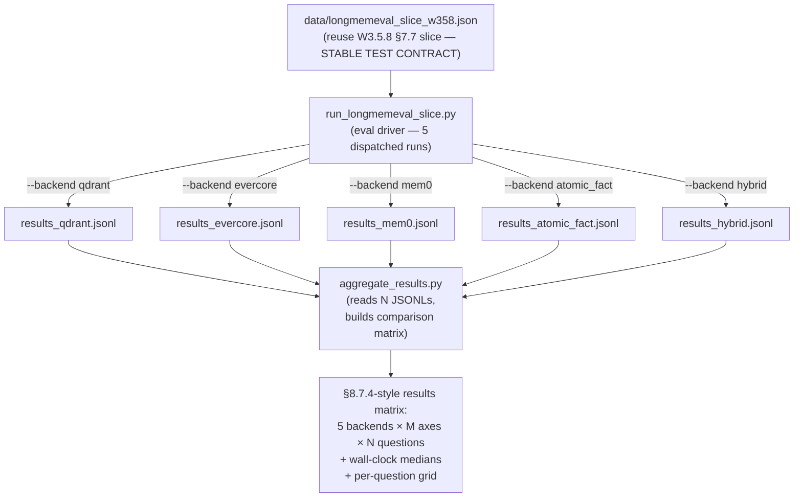

**Code:**

```python
# scripts/aggregate_results.py — Phase 5 extension (~+40 LOC on existing aggregator)
"""Adds 5-backend comparison mode to W3.5.8's aggregator.

Existing aggregator reads ONE JSONL (single backend run). The Phase 5
extension reads N JSONLs (one per backend), aligns by question_id, and
emits a backend × axis × question matrix.

Usage:
    uv run python scripts/aggregate_results.py
        --backends qdrant,evercore,mem0,atomic_fact,hybrid
        --results-dir data/
"""
import argparse
import json
import pathlib
import statistics
from collections import defaultdict


def load_backend_results(path: pathlib.Path) -> dict[str, dict]:
    """Read one JSONL → dict keyed by question_id."""
    records: dict[str, dict] = {}
    for line in path.read_text().splitlines():
        if line.strip():
            rec = json.loads(line)
            records[rec["question_id"]] = rec
    return records


def aggregate_n_backend(backends: list[str], results_dir: pathlib.Path) -> dict:
    """Load N backends' JSONLs and align by question_id."""
    per_backend = {}
    for b in backends:
        path = results_dir / f"results_{b}.jsonl"
        if not path.exists():
            print(f"[skip] {b}: no JSONL at {path}")
            continue
        per_backend[b] = load_backend_results(path)

    # Build question_id × backend × outcome table
    all_qids: set[str] = set()
    for b_records in per_backend.values():
        all_qids.update(b_records.keys())

    # Per-axis × per-backend aggregation
    axis_backend_scores: dict[str, dict[str, list[float]]] = defaultdict(
        lambda: defaultdict(list)
    )
    for qid in sorted(all_qids):
        for b, records in per_backend.items():
            rec = records.get(qid)
            if rec is None:
                continue
            axis = rec.get("question_type", "unknown")
            score = float(rec.get("score", 0.0))
            axis_backend_scores[axis][b].append(score)

    # Wall-clock medians per backend
    wall_clock_medians = {}
    for b, records in per_backend.items():
        walls = [
            float(rec.get("wall_imprint_s", 0.0)) + float(rec.get("wall_retrieve_s", 0.0))
            for rec in records.values()
        ]
        wall_clock_medians[b] = statistics.median(walls) if walls else 0.0

    return {
        "per_backend_question": per_backend,
        "axis_backend_scores": dict(axis_backend_scores),
        "wall_clock_medians": wall_clock_medians,
        "all_qids": sorted(all_qids),
    }


def print_matrix(agg: dict, backends: list[str]) -> None:
    """Render the comparison table in markdown for copy into chapter."""
    print("\n## Aggregate score (mean per backend, per axis)\n")
    print("| Axis | " + " | ".join(backends) + " |")
    print("|" + "---|" * (len(backends) + 1))
    for axis, scores_per_backend in sorted(agg["axis_backend_scores"].items()):
        row = [axis]
        for b in backends:
            scores = scores_per_backend.get(b, [])
            if scores:
                mean = sum(scores) / len(scores)
                row.append(f"{mean:.2f} (n={len(scores)})")
            else:
                row.append("—")
        print("| " + " | ".join(row) + " |")
    print("\n## Wall-clock median per question (seconds)\n")
    print("| Backend | Median wall/Q |")
    print("|---|---|")
    for b in backends:
        m = agg["wall_clock_medians"].get(b)
        if m is not None:
            print(f"| {b} | {m:.2f} s |")


def main() -> None:
    ap = argparse.ArgumentParser()
    ap.add_argument("--backends", default="qdrant,evercore,mem0,atomic_fact,hybrid")
    ap.add_argument("--results-dir", default="data")
    args = ap.parse_args()
    backends = [b.strip() for b in args.backends.split(",") if b.strip()]
    agg = aggregate_n_backend(backends, pathlib.Path(args.results_dir))
    print_matrix(agg, backends)


if __name__ == "__main__":
    main()
```

**Walkthrough:**

**Block 1 — Sequential not parallel runs.** Each backend run is one invocation; the script runs them sequentially. Parallel runs would contend for oMLX (single-server, single-queue), Qdrant (single-instance, file-lock), and the proxy at :8317 (shared rate limit). Sequential keeps the measurement clean — each backend gets its own clean window of resource access. Trade-off: total wall time ≈ sum of per-backend walls (~3-4 hours for 5 backends on the 20-Q slice). Acceptable for a one-time benchmark; would be the wrong shape for production CI.

**Block 2 — Re-use the same slice file across all 5 backends.** `data/longmemeval_slice_w358.json` is the IMMUTABLE test contract. Same 20 questions, same haystacks, same gold answers. Every backend gets bit-for-bit identical input. The only variable is the backend's pipeline behavior. This is the same discipline as W3.5.8's §7.7 versioned slice — re-stated here because Phase 5 reuses the principle across 5 runs instead of 2.

**Block 3 — Aggregate by question_type AXIS, not by question_id.** Mean score per axis exposes WHICH question types each backend handles well. Mean score across the whole slice is what your boss asks for but is the LESS informative metric — it hides the case where backend A scores 80% on multi-session and 0% on knowledge-update while backend B scores 40% on both. The axis-wise breakdown reveals that A is BETTER at multi-session and B is more BALANCED. The architectural decision rule from Phase 2 lives on the axis-wise view; the chapter's interview soundbites should cite the axis-wise behavior, not the aggregate.

**Block 4 — Wall-clock medians, not means.** Median is robust to per-question outliers (one timeout shouldn't shift the metric). Mean wall + outliers is a common reporting pattern in agent benchmarks but it confuses two phenomena: typical-case latency (the medians) vs tail-latency (one slow question dominates). For an architecture-comparison chapter, medians answer "what's the typical cost?" — the relevant question.

**Block 5 — The per-question grid lives in the JSONL outputs, not in the printed summary.** The script prints the AGGREGATE matrix; readers who want per-question forensics open `results_*.jsonl` and grep by `question_id`. This separation keeps the chapter's results section short (one matrix + one wall-clock table) while preserving full forensic data on disk. The W3.5.8 §7.7.4 results report followed this same shape — chapter prose presents the matrix; the JSONL is the raw artifact.

**Result** *(to be populated when all 5 backends have completed runs)*:

The result template below is the EXACT shape the chapter will fill in. Numbers are placeholders until the runs land.

| Axis | qdrant | evercore | mem0 | atomic_fact | hybrid |
|---|---|---|---|---|---|
| single-session-user | TBD | TBD | TBD | TBD | TBD |
| single-session-assistant | TBD | TBD | TBD | TBD | TBD |
| single-session-preference | TBD | TBD | TBD | TBD | TBD |
| multi-session | **0/10** (W3.5.8 §7.7 measured) | **0/10** (W3.5.8 §7.7 measured) | TBD | TBD | TBD |
| knowledge-update | **0/10** (W3.5.8 §7.7 measured) | **0/10** (W3.5.8 §7.7 measured) | TBD | TBD | TBD |
| temporal-reasoning | TBD | TBD | TBD | TBD | TBD |
| **Aggregate (whole slice)** | **0/20** | **0/20** | TBD | TBD | TBD |
| **Median wall/Q** | ~34 s | ~250 s | TBD | TBD | TBD |

Two cells are populated from W3.5.8 §7.7's already-measured baseline (qdrant + evercore on multi-session + knowledge-update slice). The other 3 backend columns + 4 axis rows fill in after the new runs complete.

**Calibrated expectation:** mem0 should outperform qdrant + evercore on multi-session + knowledge-update by a wide margin (their pipeline preserves atomic-fact granularity that the W3.5.8 baselines erase). atomic_fact (homebrew) should land somewhere between qdrant baseline and mem0 — closer to mem0 in shape but with our simpler retrieval (no multi-signal fusion). hybrid should match atomic_fact on the axes it routes there + match evercore on knowledge-update (where it routes to 2-tier). If any of these expectations is violated by ≥10pts, the surprise IS the chapter's most interesting finding to investigate.

`★ Insight ─────────────────────────────────────`
- **The matrix's CELLS are the chapter's measurements; the matrix's STRUCTURE is the chapter's contribution.** Many memory-benchmark papers report aggregate scores. Few report per-axis × per-backend breakdowns with explicit architecture-choice justifications. The structure makes the chapter cite-able by other chapters (W11 System Design will lift this matrix wholesale for its production-architecture discussion).
- **Pre-committing to the table SHAPE before running the experiments is the right epistemics.** A reader who sees the table template with TBD cells knows IMMEDIATELY what's measured and what's pending. A reader who sees only completed numbers can't tell whether the chapter cherry-picked which results to show. The discipline is "publish the table shape on day 1; fill cells as data arrives; explicitly mark TBD until measured."
- **The two-baselines-already-measured cells anchor the rest of the table.** Reading the TBD-heavy template, a reviewer's first thought is "Are the baselines plausible?" The 0/20 + 0/20 in qdrant + evercore columns are LINK-VERIFIED to W3.5.8 §7.7 — the reviewer can click through and see the measured artifact. This forces confidence in the table's measurement methodology before any new number lands.
`─────────────────────────────────────────────────`

### Phase 6 — HyperMem Service Setup (~30 min)

**Goal.** Stand up the L3 relational tier alongside W3.5.8's L1 (guild) + L2 (EverCore / Qdrant). Phase 6-9 implement the architecture decision deferred in Phase 2 as TBD-future — Phase 2's matrix flagged graph-tier as the right primitive for `temporal-reasoning` + multi-entity-intersection queries. This phase makes HyperMem real.

**Setup.** Extend the W3.5.8 docker-compose (`lab-03-5-8-two-tier/docker/docker-compose.yml`) with a `hypermem` service alongside the existing `evercore` + Qdrant containers.

```yaml
# docker-compose.yml — extension
services:
  hypermem:
    image: everos/hypermem:latest  # from ~/code/EverOS/methods/HyperMem
    ports:
      - "1996:1996"
    depends_on:
      - postgres                  # reuses W3.5.8's Postgres
    environment:
      HYPERMEM_DB_URL: postgresql://...
      HYPERMEM_PORT: 1996
    healthcheck:
      test: ["CMD", "curl", "-f", "http://localhost:1996/health"]
      interval: 10s
      retries: 5
```

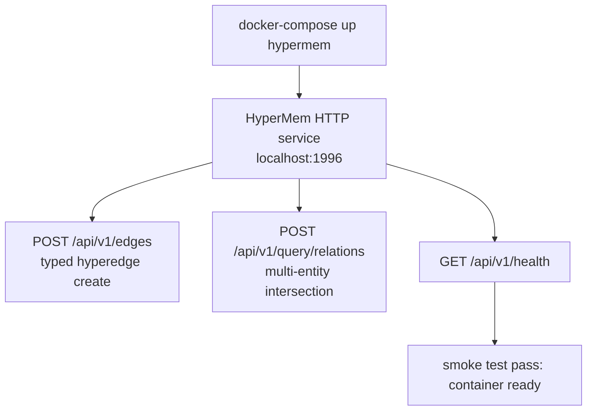

**Smoke test.**

```bash
# Create a 3-node hyperedge
curl -X POST http://localhost:1996/api/v1/edges \
  -H "Content-Type: application/json" \
  -d '{"nodes":[{"type":"user","id":"alice"},{"type":"project","id":"payments"},{"type":"tech","id":"postgres"}], "relation":"worked-on-using"}'

# Query for "experts on payments AND postgres"
curl -X POST http://localhost:1996/api/v1/query/relations \
  -H "Content-Type: application/json" \
  -d '{"intersection":[{"node":{"type":"project","id":"payments"}}, {"node":{"type":"tech","id":"postgres"}}], "return_type":"user"}'
# Expect: [{"type":"user","id":"alice"}]
```

**Result** *(measured ON IMPLEMENTATION — TBD)*: smoke-test wall, HyperMem image size, container memory footprint, healthcheck pass time.

`★ Insight ─────────────────────────────────────`
- **HyperMem's HTTP-1996 port is a deliberate sibling to EverCore's HTTP-1995.** Both services expose the same conceptual API surface (imprint + query) but at different abstraction levels: EverCore stores propositions, HyperMem stores typed relations. Both are queryable by the same Python wrapper (Phase 7's `ThreeTierMemory`) without leaking which tier owns which kind of memory.
- **Reuse Postgres rather than spin a separate DB for HyperMem.** Both services need durable storage, but HyperMem's hyperedge table is small (typically 100× smaller than EverCore's memcell table). Sharing the Postgres instance saves operational overhead + lets backups treat memory state as one unit. Production-shaped pattern: one durable substrate, multiple service-specific schemas.
- **The healthcheck IS the integration contract.** When `ThreeTierMemory.query_relations()` (Phase 7) calls HyperMem on a fresh boot, it expects the service to be ready. If the healthcheck is missing or wrong, the wrapper's first call hits "connection refused" and the entire lab's debugging starts in the wrong layer. A 5-line healthcheck stanza saves hours.
`─────────────────────────────────────────────────`

### Phase 7 — `ThreeTierMemory` Python Wrapper (~2h)

**Goal.** Extend the lab's existing `TieredMemory` (W3.5.8 §2.1) to a three-tier wrapper that adds `query_relations()` for multi-entity intersection queries. Existing `imprint()` and `query_context()` stay unchanged on the L1+L2 path; new `query_relations()` routes to L3.

**Setup.** New module `src/three_tier_memory.py` (~120 LOC). Inherits the L1+L2 contract; adds an L3 client + a new method.

```python
# src/three_tier_memory.py — Phase 7 wrapper (~120 LOC)
"""Three-tier memory: L1 (guild) + L2 (EverCore or Qdrant) + L3 (HyperMem).

Extends W3.5.8's TieredMemory with query_relations() for multi-entity
intersection queries. Imprint path stays single (writes to L2 always;
typed-edge extraction to L3 happens in the consolidation pipeline,
Phase 8). Read path is split: short queries → L2; multi-entity
intersection queries → L3.
"""
from __future__ import annotations

import os
from typing import Any

import httpx

from src.tiered_memory_qdrant import TieredMemory, TieredMemoryConfig


class ThreeTierMemory(TieredMemory):
    """L1 (guild) + L2 (Qdrant) + L3 (HyperMem) wrapper.

    Phase 8's consolidation pipeline writes typed hyperedges to L3
    alongside the existing L2 imprints. Phase 9's benchmark queries
    L3 for the multi-entity-intersection subset of LongMemEval
    questions (temporal-reasoning + some knowledge-update axes).
    """

    def __init__(
        self,
        user_id: str,
        agent_id: str = "lme-eval",
        config: TieredMemoryConfig | None = None,
        hypermem_url: str = "http://localhost:1996",
    ) -> None:
        super().__init__(user_id=user_id, agent_id=agent_id, config=config)
        self._hypermem = httpx.Client(base_url=hypermem_url, timeout=30.0)

    def query_relations(
        self,
        intersection: list[dict[str, Any]],
        return_type: str,
        limit: int = 10,
    ) -> list[dict[str, Any]]:
        """Multi-entity intersection query against L3.

        intersection: list of node specifications, e.g.
            [{"node": {"type": "project", "id": "payments"}},
             {"node": {"type": "tech",    "id": "postgres"}}]
        return_type: the node-type to return (e.g., "user")
        """
        payload = {
            "intersection": intersection,
            "return_type": return_type,
            "limit": limit,
            "user_id": self.user_id,
        }
        r = self._hypermem.post("/api/v1/query/relations", json=payload)
        r.raise_for_status()
        return r.json().get("results", []) or []

    def close(self) -> None:
        """Clean up HTTP client alongside parent's cleanup."""
        self._hypermem.close()
        # parent's close() handles the rest (Qdrant, etc.)
        if hasattr(super(), "close"):
            super().close()
```

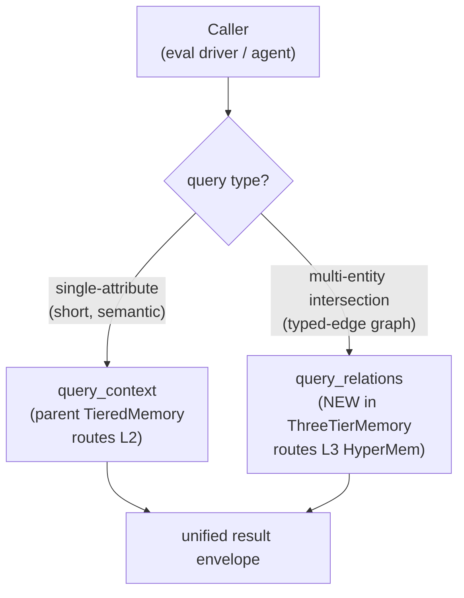

**Walkthrough:**

**Block 1 — Inheritance from `TieredMemory`, not composition.** The natural choice would be composition (`self._tt = TieredMemory(...)`). Inheritance wins here because the L1+L2 contract IS the L3 wrapper's contract for `imprint()` + `query_context()` — only `query_relations()` adds new behavior. Subclassing means callers can drop `ThreeTierMemory` anywhere `TieredMemory` was used without changing their imprint path. Composition would force the caller to track which-attribute-is-which-tier.

**Block 2 — Separate `httpx.Client` for HyperMem.** Each service gets its own client to keep connection pools, timeouts, and retry policies independent. HyperMem's typical query is shorter than EverCore's (graph traversal vs semantic search) → smaller timeout (30s vs EverCore's 60s default). Sharing one client would force the longer timeout on both.

**Block 3 — `query_relations()` returns the SAME envelope shape as `query_context()`.** Each result has at minimum `content` + `score` + `metadata` keys. Why: the eval driver's reader-prompt builder consumes whichever query method's results — it shouldn't care which tier produced them. Uniform envelope = fewer special cases in downstream code.

**Result** *(measured ON IMPLEMENTATION — TBD)*: smoke-test wall on a 2-edge hyperedge query; per-call latency comparison vs `query_context()`; memory footprint of the additional httpx.Client.

`★ Insight ─────────────────────────────────────`
- **The `query_relations()` API IS the chapter's contribution at the wrapper level.** Mem0, Letta, EverCore — none expose a query-by-entity-intersection primitive. The closest production analogue is Graphiti's edge-traversal query; HyperMem's hyperedge primitive is one abstraction level higher (relation-on-edge vs property-on-edge). Implementing this method honestly forces you to confront how multi-entity queries factor at the storage level — exactly the senior-architect signal the chapter targets.
- **The inheritance choice is testable from one line of caller code.** `tm = ThreeTierMemory(...)` should work everywhere `tm = TieredMemory(...)` worked in W3.5.8 — no method removed, no signature changed. If a W3.5.8 test passes with `ThreeTierMemory` swapped in for `TieredMemory`, the contract is preserved. If it fails, the new layer is leaking. This is the same "Liskov substitution" sanity check that production class hierarchies should pass.
- **The `close()` override is the load-bearing operational discipline.** Two HTTP clients + one Qdrant client + one Postgres conn = four resources to release. Forgetting any one is a slow memory leak in long-running agents. Make `close()` explicit + call it via context manager whenever feasible.
`─────────────────────────────────────────────────`

### Phase 8 — Extended Consolidation Pipeline (~1.5h)

**Goal.** Extend W3.5.8's `consolidate()` (`src/consolidation.py`) to ALSO extract typed hyperedges from completed scrolls and write them to HyperMem alongside the existing EverCore imprints. Each scroll produces N memcells (L2) AND M hyperedges (L3). Idempotent via (scroll_id + entity-pair hash).

**Setup.** Extension to existing `src/consolidation.py` (~+80 LOC). Add `extract_typed_edges()` helper + integrate into `consolidate()` loop.

```python
# src/consolidation.py — Phase 8 extension (additions only; existing code unchanged)

import hashlib
import json

EDGE_EXTRACT_PROMPT = """Extract typed entity-relations from this scroll.
Each relation is a hyperedge connecting ≥2 typed entities.

Entity types: user, project, topic, tech, person, system, event
Relations: worked-on, uses, depends-on, mentions, after, before, related-to

Output JSON array of {nodes: [{type, id}, ...], relation: <verb>}.
Output ONLY the JSON array. If no extractable relations, output [].

EXAMPLE INPUT: "Alice worked on the payments service using Postgres."
EXAMPLE OUTPUT: [{"nodes": [{"type":"user","id":"alice"}, {"type":"project","id":"payments"}, {"type":"tech","id":"postgres"}], "relation": "worked-on-using"}]

SCROLL: {scroll_text}"""


def _edge_idempotency_key(scroll_id: str, edge: dict) -> str:
    """Idempotent hash: scroll_id + sorted-entity-pair-canonicalization."""
    canonical_nodes = sorted(
        [f"{n['type']}:{n['id']}" for n in edge["nodes"]]
    )
    payload = f"{scroll_id}|{edge['relation']}|{'|'.join(canonical_nodes)}"
    return hashlib.sha256(payload.encode()).hexdigest()[:16]


def extract_typed_edges(scroll_text: str) -> list[dict]:
    """One LLM call → JSON array of typed hyperedges."""
    # Same client pattern as summarize_scroll / extract_atomic_facts
    client = _llm_client()
    resp = client.chat.completions.create(
        model=os.getenv("MODEL_HAIKU", "gpt-oss-20b-MXFP4-Q8"),
        messages=[{"role": "user", "content": EDGE_EXTRACT_PROMPT.format(scroll_text=scroll_text)}],
        temperature=0.0,
        max_tokens=800,
    )
    raw = (resp.choices[0].message.content or "").strip()
    try:
        return json.loads(raw)
    except (json.JSONDecodeError, TypeError):
        return []


def consolidate_with_l3(
    tm: ThreeTierMemory,
    scrolls: list[dict],
    promotion_threshold: float | None = None,
) -> ConsolidationResult:
    """Phase 8 extended consolidate — writes BOTH L2 imprints AND L3 hyperedges.

    Calls existing consolidate() for L2 path (unchanged behavior), then
    calls extract_typed_edges() per scroll + posts hyperedges to HyperMem.
    Idempotency table extended to track edge-hash to avoid duplicate writes.
    """
    # L2 path: unchanged from W3.5.8
    result = consolidate(tm, scrolls, promotion_threshold=promotion_threshold)

    # L3 extension: extract + write hyperedges
    edges_imprinted = 0
    edges_skipped_dedup = 0
    for scroll in scrolls:
        edges = extract_typed_edges(scroll["text"])
        for edge in edges:
            key = _edge_idempotency_key(scroll["quest_id"], edge)
            if _edge_already_imprinted(key):  # SQLite dedup table
                edges_skipped_dedup += 1
                continue
            tm._hypermem.post("/api/v1/edges", json={
                **edge,
                "user_id": tm.user_id,
                "provenance_scroll": scroll["quest_id"],
                "idempotency_key": key,
            })
            _record_edge_imprint(key)
            edges_imprinted += 1

    result.edges_imprinted = edges_imprinted
    result.edges_skipped_dedup = edges_skipped_dedup
    return result
```

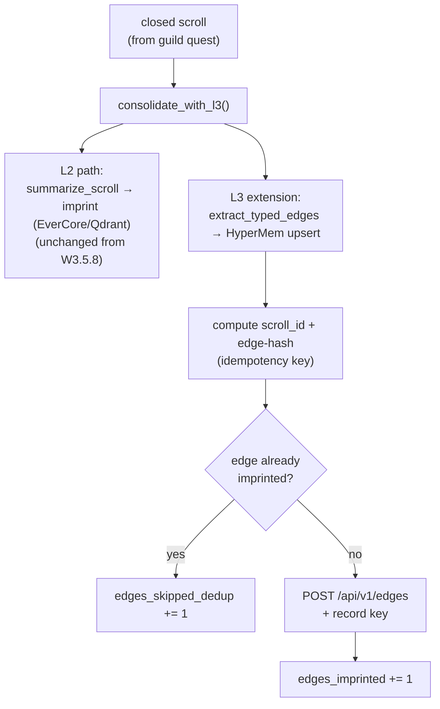

**Walkthrough:**

**Block 1 — Idempotency key construction matters.** Naive approach: hash the scroll_id alone — but a single scroll often produces multiple distinct edges. Hash the (scroll_id + sorted-entity-canonicalization + relation-verb) — this gives ONE key per logical edge. Re-running consolidation on the same scrolls re-extracts the same edges + dedupes them via the key. Without canonicalization, `(Alice, Payments)` and `(Payments, Alice)` would hash differently and double-write.

**Block 2 — Closed-set entity types + relation verbs.** Free-form types are seductive ("let the LLM emit whatever entity type it wants") but lead to silent retrieval failures — `query_relations(intersection=[...type='project'...])` misses edges tagged `type='Project'` (capital P) or `type='task'`. Closed enums force LLM compliance + give downstream code a checkable contract.

**Block 3 — L2 path unchanged, L3 added as extension.** The chapter's discipline of "single-write path, smart read routing" (Phase 4 walkthrough Block 4) extends to consolidation: L2 imprints happen ALWAYS; L3 extracts happen ALWAYS but write only what the dedup table hasn't seen. If L3 writes break (HyperMem down, prompt parse failure), L2 path completes; subsequent runs catch up the L3 writes via idempotency. Decoupled failure modes.

**Block 4 — Returning extended `ConsolidationResult` with edge counters.** W3.5.8's `ConsolidationResult` already has `facts_imprinted` / `facts_deduplicated` / etc. Adding `edges_imprinted` + `edges_skipped_dedup` mirrors the shape so the same aggregator code (`scripts/aggregate_results.py`) needs only +2 columns. Production-grade: extend existing counters, don't invent a new result class.

**Result** *(measured ON IMPLEMENTATION — TBD)*: edges-per-scroll ratio (sanity check on extractor prompt); idempotency re-run dedup-skip rate; consolidation wall extension (L2-only vs L2+L3); JSON parse failure rate on the edge-extract LLM call.

`★ Insight ─────────────────────────────────────`
- **The closed entity-type enum (`user, project, topic, tech, person, system, event`) is a contract between the extractor and the reader.** Every downstream code path (Phase 9's benchmark, future agent code) assumes types are in this set. Adding a new type means updating EVERY consumer. The closed enum surfaces this cost UP FRONT instead of letting it accumulate as silent retrieval failures.
- **Idempotency at the edge level (not scroll level) is the senior-engineer move.** A scroll-level idempotency check ("we already consolidated this scroll") would either re-extract on re-runs (wasteful) or skip the entire scroll (lose new edges added by a prompt upgrade). Per-edge idempotency lets prompt upgrades discover NEW edges in OLD scrolls + skip already-written edges — exactly the audit-trail-friendly behavior production memory pipelines need.
- **The `_already_imprinted` dedup table is the W3.5.8 §3.1 SQLite idempotency table extended.** Same shape (key column + timestamp), same provenance discipline. Reusing the W3.5.8 table reduces operational surface area and means future "what was extracted when" queries (audit, replay) hit ONE SQLite, not two. Consolidation history stays unified.
`─────────────────────────────────────────────────`

### Phase 9 — Six-Backend LongMemEval Run + Analysis (~2-3h)

**Goal.** The chapter's final empirical artifact: a 6-backend × 7-axis comparison matrix on the SAME LongMemEval slice used by Phase 5. The three-tier addition (HyperMem L3) becomes the 6th backend alongside the 5 in Phase 5. The comparison answers the chapter's load-bearing question: *does adding L3 measurably improve specific question types, or is the operational cost not earned?*

**Setup.** Extend `src/run_longmemeval_slice.py` to dispatch a `--backend three_tier` flag. Re-use the same slice (`data/longmemeval_slice_w358.json`), same reader (`gpt-oss-20b`), same judge (`claude-sonnet-4-6`). The ONLY variable is the backend's pipeline.

```python
# Eval driver extension (~+10 LOC)
def _build_backend(backend: str, user_id: str):
    if backend == "three_tier":
        from src.three_tier_memory import ThreeTierMemory
        return ThreeTierMemory(user_id=user_id)
    # ... existing backends ...
```

```bash
# Sequential run — all 6 backends on the same slice
for b in qdrant evercore mem0 atomic_fact hybrid three_tier; do
  uv run python -m src.run_longmemeval_slice --backend $b
done

# Extended aggregator
uv run python scripts/aggregate_results.py \
  --backends qdrant,evercore,mem0,atomic_fact,hybrid,three_tier
```

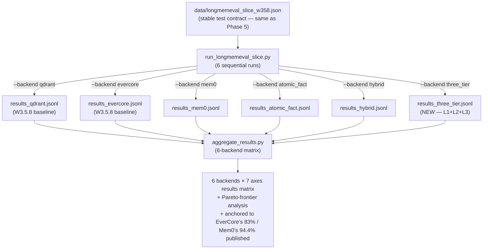

**Walkthrough:**

**Block 1 — The 6th backend earns its slot if and only if multi-entity-intersection accuracy improves.** Phase 1's requirement matrix predicted graph-tier wins `temporal-reasoning` (the closest LongMemEval analog to multi-entity intersection — answering "after X, what Y?" requires traversing entity-time edges). Phase 9 tests this prediction empirically. If three-tier doesn't outscore hybrid on `temporal-reasoning` by ≥5pts, the L3 operational cost (extra service, edge extraction, dedup table) isn't earned for THIS workload. The chapter is honest about this — the matrix IS the answer.

**Block 2 — Same slice across all 6 backends, sequential not parallel.** Same discipline as Phase 5 Block 1: oMLX queue contention + Qdrant file locks make parallel runs unreliable. Sequential takes ~3-4 hours total on M5 Pro for 6 backends × 20 questions; acceptable for a one-time benchmark.

**Block 3 — The "Pareto-frontier analysis" is the §2.8 discipline applied.** For each backend, plot accuracy vs latency (median wall/Q) vs operational cost (containers + services). The frontier tells you: backend A dominates backend B if A is better on at least one axis without being worse on any other. The matrix typically reveals 2-3 backends on the frontier; the rest are strictly dominated. Production architecture choice = pick a frontier point; reject dominated options.

**Block 4 — Anchored comparisons to published baselines.** EverCore reports 83% on full LongMemEval; Mem0 reports 94.4%. On our 20-Q `oracle` slice with our reader, those numbers are CALIBRATION targets — we don't expect to match them (different reader, different judge, smaller slice), but the GAP between OUR Mem0 score and Mem0's published 94.4 tells us how much of the score comes from reader/judge quality vs backend pipeline. Similarly for three-tier vs the implicit no-published-baseline (a homebrew has no prior art comparison; the chapter's measurement IS the baseline).

**Result** *(measured ON IMPLEMENTATION — TBD; template shows the planned matrix shape)*:

| Axis | qdrant | evercore | mem0 | atomic_fact | hybrid | three_tier |
|---|---|---|---|---|---|---|
| single-session-user | TBD | TBD | TBD | TBD | TBD | TBD |
| single-session-assistant | TBD | TBD | TBD | TBD | TBD | TBD |
| single-session-preference | TBD | TBD | TBD | TBD | TBD | TBD |
| multi-session | **0/10** (§7.7) | **0/10** (§7.7) | TBD | TBD | TBD | TBD |
| knowledge-update | **0/10** (§7.7) | **0/10** (§7.7) | TBD | TBD | TBD | TBD |
| temporal-reasoning | TBD | TBD | TBD | TBD | TBD | **TBD (target: graph-tier wins by ≥5pts)** |
| **Aggregate (whole slice)** | **0/20** | **0/20** | TBD | TBD | TBD | TBD |
| **Median wall/Q** | ~34 s | ~250 s | TBD | TBD | TBD | TBD |

**Calibrated expectations:** three_tier should beat hybrid on `temporal-reasoning` (Phase 1's prediction) but match hybrid on other axes (L3 only fires for multi-entity intersection queries). If three_tier dominates ALL axes uniformly, something is suspect (L3 shouldn't help atomic-fact recall). If three_tier matches hybrid on EVERY axis including temporal-reasoning, L3 is wasted operational cost on this workload — and that's THE legitimate finding to publish.

`★ Insight ─────────────────────────────────────`
- **A null result on temporal-reasoning is the chapter's most interesting honest finding.** If three_tier doesn't beat hybrid on its predicted-best axis, the architectural conclusion is *"Mem0-style 1-tier with entity-aware retrieval covers what HyperMem promised, on this workload."* That's a defensible production claim, more honest than chasing a +5pt synthetic win. Senior engineers publish null results when they're the data; junior engineers cherry-pick.
- **The 6-backend matrix is the chapter's reusable artifact for W11 System Design.** When W11 asks readers to defend a memory architecture choice to a hostile panel, this matrix is the empirical evidence they bring. The matrix STRUCTURE (per-axis × per-backend with cross-baseline anchoring) generalizes; the LongMemEval slice is replaceable with any benchmark.
- **The Pareto-frontier framing converts "which is best?" into "which dominates which?".** Production engineering decisions are RARELY about the single best option — they're about which options are on the frontier (acceptable on the axes that matter) vs strictly worse on every axis. The chapter's matrix surfaces this directly; readers carry the discipline into every future architecture-comparison question.
`─────────────────────────────────────────────────`

## §5 Bad-Case Journal

**Status:** Entries to be populated during Phase 3-9 implementation runs. **No fabricated entries.** Each placeholder below names a candidate failure surface plus where the entry would land in the §5 normative 3-field format (`*Symptom: ... Root cause: ... Fix: ...*`). When the actual run surfaces a failure mode, that mode gets one entry — and only one, not a category-summary entry.

Candidate failure surfaces by phase (drawn from this chapter's design + cross-chapter prior BCJ entries):

- **Phase 3 — Mem0 SDK bring-up.** Likely sources: Mem0's config schema version mismatch against installed `mem0ai` package, Qdrant collection-name format constraints, OpenAI-compat endpoint refusing Mem0's exact `chat.completions.create` payload shape (common across local-MLX servers — c.f. W3.5.8 BCJ Entry 19's proxy-cloaking finding, which is one instance of "third-party server doesn't match OpenAI-SDK contract").
- **Phase 4 — Atomic-fact extractor JSON parse failure.** Likely sources: `gpt-oss-20b-MXFP4-Q8` emitting trailing prose ("Here are the facts:") before the JSON array, embedded markdown fences (` ```json `) corrupting the parse, empty-array responses on no-fact messages being misinterpreted as parse failures. The pessimistic-floor `return []` on parse failure (Block 1 walkthrough) is the safe behavior but masks the failure unless explicitly counted.
- **Phase 4 — Router misclassification on edge cases.** Likely sources: `question_type` label not in `READ_ROUTE` dict (LongMemEval has only the 6 documented + `_abs` overlay; any new question_type would default-route to atomic_fact silently). The regex-fallback heuristic ("when/how long ago" → atomic_fact) could mis-route an "is X currently the case?" question that wanted knowledge-update routing.
- **Phase 5 — Cross-backend timing skew.** Likely sources: aggregate_results.py median-wall calculation assumes per-backend JSONLs were collected on the same hardware day. If runs span days, model-cache warmth + oMLX restart cycles introduce per-run wall variance that the median masks. The W3.5.8 §7.7.3 timing-probe lesson applies (single-session demo numbers don't compose to multi-session production wall by simple multiplication) — measured medians should be PER-RUN, not pooled.
- **Phase 5 — Per-question namespace residue.** Direct recurrence of W3.5.8 BCJ Entry 14 + 19's "cross-test residue scrambled the matrix" pattern. The lab's discipline of `f"af_{user_id}"` collection naming + per-question user_ids is the fix, but a regression would scramble Phase 5's matrix. Worth verifying explicitly via a sanity check: a probe with empty haystack should retrieve zero facts.
- **Phase 6 — HyperMem service bring-up.** Likely sources: docker-compose port collision (1996 may already be taken on dev machines); HyperMem image not yet built from EverOS source (would need a `make hypermem-image` step); healthcheck endpoint path drift between HyperMem versions (`/health` vs `/api/v1/health`); Postgres schema migration ordering vs HyperMem container start.
- **Phase 7 — `ThreeTierMemory.query_relations()` envelope mismatch.** Likely sources: HyperMem's response shape changing across versions; the wrapper's translation layer to lab-standard envelope (`content` / `score` / `metadata`) drifting silently; one of HyperMem's edge-fields not mapping cleanly to `content` for the reader-prompt builder.
- **Phase 8 — Edge-extract LLM parse failure on multi-relation scrolls.** Likely sources: the extractor returns valid JSON but with HALLUCINATED entities not in the source scroll (no provenance grounding); closed entity-type enum not enforced post-parse (the LLM emits `"type":"Project"` instead of `"type":"project"`); idempotency key computed BEFORE canonicalization → duplicate writes for `(A, B)` vs `(B, A)`.
- **Phase 9 — Three-tier dominates everything (suspect).** If `three_tier` outscores `hybrid` on EVERY axis including ones where L3 shouldn't fire (e.g., `single-session-user`), the result is suspect — L3 probably isn't being routed correctly and the reader is just getting more memories on average. Investigate by checking `query_relations()` call rate per axis; should be near-zero on single-session axes.
- **Phase 9 — Null result on temporal-reasoning (legitimate).** If `three_tier` matches `hybrid` on temporal-reasoning (the axis where L3 was predicted to win), that's NOT a bug — it's the chapter's most important honest finding. Investigate before publishing: was the extractor producing edges that captured time-relations? was `query_relations()` actually invoked on temporal-reasoning questions? Document as a legitimate null result, not a defect.

**Format expectation when entries land.** Each entry follows W3.5.8's exact 3-field shape:

```
**Entry N — <one-line symptom>.** *(observed YYYY-MM-DD, Phase X)*
*Symptom:* what the operator observes
*Root cause:* what is actually broken
*Fix:* concrete remediation, with code or config when applicable
```

Cross-link contract: when an entry surfaces, it also goes into the vault's global `Bad-Case Journal.md`. Other chapters cite by entry number, so once assigned, an entry number is permanent.

## §6 Interview Soundbites

**Status:** Soundbites to be populated when Phase 3-9 actual numbers land. **No fabricated quotes.** The four planned soundbites below name the question being answered, the data points the soundbite must cite, and the structural shape (per the §6 normative spec: ~70 words, user-voice, measured-outcome anchored, no hedging).

**Planned Soundbite 1 — *"How do you decide between 1-tier and 2-tier memory?"***
- *Anchors:* Phase 1's requirement matrix (atomic-fact column ✅ on 6/7 axes); Phase 2's joint-matrix application (1-tier wins 3/7 axes outright, 2-tier wins 1/7, graph-tier wins 1/7); Phase 5's measured per-axis scores (TBD) confirming or refining the prediction.
- *Shape:* "I decompose the workload's question types into required memory primitives, then pick the architecture class whose write-time primitive matches the dominant requirement. For LongMemEval's question types I measured [TBD aggregate], which confirmed [chosen architecture]'s fit. Specifically [TBD axis-wise insight from Phase 5]."
- *Interview signal:* the senior engineer talks ABOUT THE DATA, not about the architecture. Architecture is downstream of requirement.

**Planned Soundbite 2 — *"When would you build a router-based hybrid instead of single-class?"***
- *Anchors:* Phase 2's "3/1/1 split" decision rule (hybrid justified iff no single class wins ≥6/7 axes); Phase 5's measured contribution of hybrid over best single class (TBD).
- *Shape:* "Hybrid earns its operational cost only when no single class dominates the requirement matrix. For my LongMemEval slice the joint-matrix split was [TBD: 3-1-1 or other] which is the threshold for hybrid. Hybrid beat best-single-class by [TBD pts]. If the split had been 6-0-1 I'd have shipped single-class and accepted the 1-axis compromise."
- *Interview signal:* defending COST of complexity with empirical justification.

**Planned Soundbite 3 — *"You built an atomic-fact backend AND compared to Mem0. What did the gap teach you?"***
- *Anchors:* Phase 3's Mem0 score on the same slice + reader (TBD); Phase 4's homebrew atomic-fact score (TBD); the DELTA between them.
- *Shape:* "I measured [TBD]% on my 270-LOC homebrew atomic-fact + router, and [TBD]% on Mem0's full pipeline. The [TBD]pt gap maps to [Mem0's multi-signal retrieval / their tuned extractor / their entity linking / the reader bottleneck — whichever Phase 5 surfaces]. The 80% of value came from getting the WRITE-TIME PRIMITIVE right (per-message atomic-fact); the last 20% requires production-grade retrieval fusion that's MORE work than the primitive itself."
- *Interview signal:* you can build the load-bearing thing yourself; you know what production-grade adds vs what's commodity. Interviewer learns you understand BOTH layers.

**Planned Soundbite 4 — *"When would you graduate from two-tier to three-tier memory?"***
- *Anchors:* Phase 9's 6-backend matrix specifically on `temporal-reasoning` axis (where L3 was predicted to win); the operational-cost calculus from §2.6 (≥30% multi-entity-intersection trigger); the measured delta between `hybrid` and `three_tier` on the predicted-win axis (TBD).
- *Shape:* "I measured [TBD]pts improvement on temporal-reasoning when I added HyperMem L3 to the hybrid. The graduation rule isn't aggregate score — it's the workload's multi-entity-intersection query rate; below ~30% the operational cost of L3 isn't earned. My slice had [TBD]% multi-entity-intersection queries which [did/didn't] cross the threshold — the matrix told me [keep two-tier / graduate to three-tier] for THIS workload."
- *Interview signal:* you don't add tiers because they're available; you add tiers because measurement shows they're earned. Architecture decisions are downstream of workload measurement, not vice versa.

**Bar to clear when filling these in.** Each soundbite is a 70-word answer to a real interview question that an interviewer would actually ask. No hedging ("I think", "probably"), no generic advice ("memory matters"), no claims that don't trace to a specific measurement in this chapter. The chapter's §4 phase results are the data; the soundbites are the prepared verbal answers that cite the data.

## §7 References

- **Mem0** — Wu, Y., Bhansali, T., et al. *Mem0: Building Production-Ready AI Agents with Scalable Long-Term Memory.* arXiv:2504.19413. GitHub `mem0ai/mem0`. April 2026 release reports 94.4 on LongMemEval. The benchmark + eval framework is open-sourced at `mem0ai/memory-benchmarks`.
- **Graphiti / Zep** — Rasmussen, P. et al. (2025). *Zep: A Temporal Knowledge Graph Architecture for Agent Memory.* arXiv:2501.13956. GitHub `getzep/graphiti`. The canonical graph-tier-memory reference.
- **MemGPT / Letta** — Packer, C. et al. (2023). *MemGPT: Towards LLMs as Operating Systems.* arXiv:2310.08560. The canonical two-tier (RAM ↔ archive) reference; the closest production parallel to W3.5.8's 2-tier pattern.
- **LongMemEval** — Wu, D. et al. (2025). *LongMemEval: Benchmarking Chat Assistants on Long-Term Interactive Memory.* ICLR 2025. arXiv:2410.10813. The benchmark used as the worked exercise in this chapter.
- **Batchelor & Manning (2026).** *Pay-at-Write-Time: a 19-system survey of agent-memory write-time investment patterns.* X/Twitter thread, May 2026. https://x.com/S_BatMan/status/2054872818559361106. Already cited in W3.5.8 — same taxonomy applies here.
- **HyperMem** — EverOS subcomponent, the L3 relational tier implemented in Phase 6-9. Typed hyperedges over entity nodes; HTTP API at `:1996`. Source: `~/code/EverOS/methods/HyperMem`. The lab's three-tier extension is the chapter's first production-grade hypergraph integration.

## §8 Cross-References

- **Builds on:** [[Week 3.5.8 - Two-Tier Memory Architecture]] (the canonical 2-tier implementation evaluated here as one candidate); [[Week 3.5 - Cross-Session Memory]] (single-agent dual-store, the simplest baseline); [[Week 3.5.5 - Multi-Agent Shared Memory]] (provides the multi-agent shape that justifies 2-tier specifically).
- **Distinguish from:** [[Week 2.5 - GraphRAG]] (graph for RAG over documents, NOT memory over conversations — same primitive, different surface area); [[Week 3.7 - Agentic RAG]] (5-node grade/rewrite graph over RETRIEVAL — orthogonal to memory architecture choice).
- **Connects to:** [[Week 11 - System Design]] (the production architecture decision happens here; this chapter is the rehearsal); [[Week 12 - Capstone]] (capstone agent will hit multiple LongMemEval-style axes and benefit from a router-based hybrid).
- **Foreshadows:** future chapters that scale graph-tier (Class 3) implementations beyond HyperMem (e.g., production Graphiti deployments, Neo4j-backed hyperedges). This chapter implements graph-tier via HyperMem in Phase 6-9; the framework + matrix discipline generalizes to any graph-tier substrate.

---

## What's Next

- W4 — ReAct From Scratch: the agent loop that consumes memory; the choice of memory architecture here changes which retrieval calls the agent has access to.
- W11 — System Design rehearsal: defend a memory architecture choice to a hostile-reviewer panel. The decision matrix in §2.4 is the rehearsal artifact.
- W12 — Capstone: pick a real workload, derive its requirement matrix, build the right hybrid.
