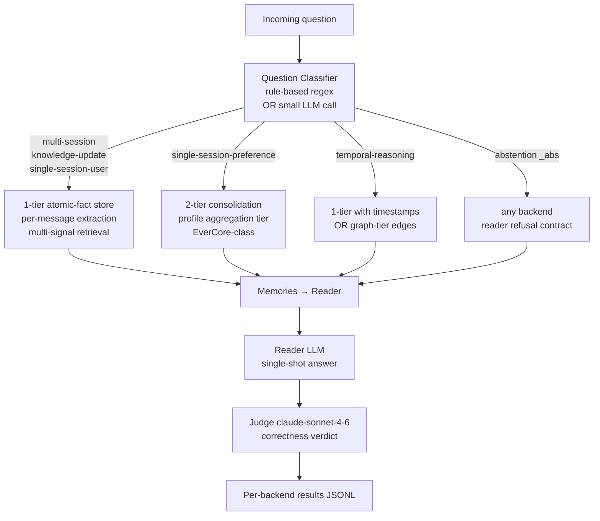
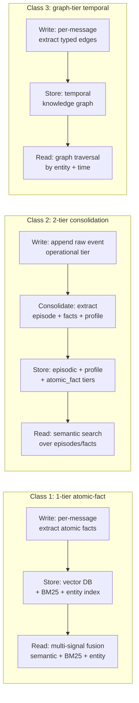

## Exit Criteria

- [ ] LongMemEval slice analyzed and decomposed into requirement vectors per question_type (Phase 1)
- [ ] Architecture decision matrix populated with explicit justification — which axis maps to which architecture class (Phase 2)
- [ ] Mem0 open-source baseline reproduces a measurable score on the same slice using the same reader + judge (Phase 3)
- [ ] Homebrew hybrid router operational: 1-tier path + 2-tier path + question classifier (Phase 4)
- [ ] 5-backend × 6-axis × 20-Q comparison table with measured per-question wall + correctness (Phase 5)
- [ ] Decision rule documented for future production use (Phase 5 close)

## §1 Why This Week Matters

Most memory chapters teach ONE architecture and imply it is THE architecture. Production engineering picks the right architecture for the workload, and the picking is the senior-engineering signal an interviewer probes for. W3.5.9 teaches the meta-skill explicitly: given a real published benchmark (LongMemEval), analyze its question shapes, derive the required memory primitives per axis, evaluate three candidate architecture classes (1-tier atomic-fact, 2-tier consolidation, graph-tier temporal), pick the architecture whose write-time primitive matches the read-time question shape, implement, verify against the benchmark, and document the decision rule.

The deliverable a reader walks away with is **not memorized backend details, but a defensible decision-making framework** — plus a working hybrid implementation that composes the right primitives for a mixed workload. The interview signal is *"how do you decide between memory architectures?"*, which is harder to fake than *"how does Mem0 work?"*. This chapter answers the harder question directly with a worked LongMemEval exercise.

## §2 Theory Primer

### 2.1 The three architecture classes — production realities

Real production agent memory falls into three architecture classes. Each makes a different write-time primitive choice; each unlocks a different set of read-time answer shapes.

**Class 1 — One-tier atomic-fact memory** (Mem0, ChatGPT memory, Claude projects memory, Cursor / Windsurf memory). Per-message extraction emits typed atomic facts (e.g., *"user prefers React over Vue"*, *"Sev1 MTTR target is 60 minutes"*). Facts ADD to an append-only vector store; supersession is handled at query-time via timestamps + entity linking rather than at write-time via dedup. **Strength**: sub-second write-then-query freshness, simplest infra (1-2 stores), highest accuracy on atomic-fact recall benchmarks (Mem0 hits 94.4 on LongMemEval). **Weakness**: no native narrative episodes, no per-user profile aggregation as a first-class output, no audit trail back to the operational event that produced each fact.

**Class 2 — Two-tier consolidation memory** (Letta / MemGPT, the W3.5.8 EverCore-class pattern). Discrete task-completion events anchor consolidation: operational tier (quest queue, conversation log) accumulates raw state; a periodic / event-triggered consolidation job extracts episode + atomic_fact + profile to a separate semantic tier. **Strength**: narrative episodes ("here's what happened in this session"), per-user profile output, bitemporal correctness (can answer "what was true as of date T"), full audit lineage. **Weakness**: write-then-query freshness lag, complex infra (4-7 services in EverCore-class), atomic-fact recall is harder because facts are buried inside episodes by default.

**Class 3 — Graph-tier temporal memory** (Zep / Graphiti, the W2.5 GraphRAG-style pattern applied to memory not RAG). Per-message extraction emits typed entity-relationship edges over time. The store is a temporal knowledge graph; queries traverse edges by entity + time. **Strength**: cross-entity relational queries ("who did Alice work with on Project X last quarter"), explicit edge-level supersession, strong on multi-hop reasoning. **Weakness**: graph operational overhead, harder to fine-tune retrieval quality vs vector search, fewer production examples to copy from.

### 2.2 How question shape determines primitive choice

The benchmark question shape determines which write-time primitive PRESERVES the answer signal. Erase the wrong dimension at write-time and no read-time clever retrieval can recover it. This is the most important lesson in the chapter.

Concrete mapping for LongMemEval's six question types (derived from §4 Phase 1's analysis):

| LongMemEval axis | Required primitive | Best architecture class |
|---|---|---|
| single-session-user (Information Extraction) | atomic-fact extraction per message | 1-tier |
| single-session-assistant | atomic-fact extraction (assistant-generated facts) | 1-tier |
| single-session-preference | per-user preference aggregation (profile tier) | 2-tier OR 1-tier with entity linking |
| multi-session (Multi-Session Reasoning) | atomic-fact extraction + cross-session aggregation at read-time | 1-tier with multi-signal retrieval |
| knowledge-update (Knowledge Updates) | atomic-fact extraction + bitemporal ranking | 1-tier with timestamps OR 2-tier with dedup |
| temporal-reasoning | timestamped atomic facts + temporal query reasoning | 1-tier with timestamps OR graph-tier |
| abstention (`_abs` suffix overlay) | orthogonal — retrieval gate + reader refusal contract |

Pattern: **no single architecture class dominates ALL six axes.** 1-tier wins most axes (4-5 out of 6); 2-tier wins on preference; graph-tier wins on temporal-reasoning with cross-entity edges. Mixed-workload deployments (a real customer-support agent, a research assistant, an operations bot) hit multiple axes — which is the argument for the router-based hybrid taught in §4 Phase 4.

### 2.3 Hybrid architectures: router patterns

When no single architecture class satisfies all the required axes, a **router-based hybrid** dispatches each question to the architecture whose primitives produced the right write-time signal. The router is a question classifier (rule-based regex, small LLM call, or both) that emits a class label; downstream services route by label.

Three router patterns from production:

1. **Question-type router** (this chapter's Phase 4). Classify each incoming question by type; route to the architecture whose write-time primitives PRESERVE the answer signal. Cheap to implement when the question types are observable from the question text. Limitation: requires every question to fit a known class — open-ended questions break the classifier.

2. **Confidence-based fallback**. Try one architecture; if its retrieval confidence is below a threshold, fall back to another. Used in production by hybrid RAG systems (Pinecone + BM25 fallback). Works when fallback is cheap.

3. **Parallel ensemble + re-rank**. Query all architectures in parallel; re-rank results across stores. Used in production by Mem0's multi-signal retrieval (semantic + BM25 + entity matching, fused by RRF). Cost: parallel infra. Reward: highest accuracy.

Phase 4 implements pattern 1 because the LongMemEval question types are explicit in the data. Pattern 3 is the natural next experiment once Pattern 1 has measured numbers (§5.3 follow-up).

### 2.4 Decision-matrix template

Reusable in any production architecture decision. Five rows, three columns, fill from data:

| Required primitive (derived from data) | 1-tier | 2-tier | Graph-tier |
|---|---|---|---|
| Atomic-fact recall | ✅ native | ⚠️ buried in episodes | ✅ via entity edges |
| Episode narrative | ❌ | ✅ native | ⚠️ via edge traversal |
| Per-user profile aggregation | ⚠️ via entity linking | ✅ native | ✅ via entity edges |
| Bitemporal queries | ⚠️ via timestamps | ✅ native dedup+supersession | ✅ native temporal edges |
| Audit / provenance | ❌ single-pass extraction discards | ✅ episode→fact lineage | ✅ edge provenance |
| Sub-second write-then-query freshness | ✅ write-time consolidation | ❌ async batch | ✅ write-time edge add |
| Multi-agent shared queue | ❌ user-shaped | ✅ via operational tier | ⚠️ depends |
| Operational overhead | low (1-2 stores) | high (4-7 services) | medium (1 graph DB + cache) |

The decision is goal-backward: start with the question shapes the production workload hits, derive required primitives, pick the class with the most natives + fewest ❌. Hybrids combine classes when no single class is dominant.

## §3 Mechanism / Architecture Diagram

### 3.1 Router-based hybrid (Phase 4 target)

### 3.2 Three-class comparison

## §4 Lab Phases

### Phase 1 — Requirement Analysis from LongMemEval (~1 h)

**Goal.** Inspect actual LongMemEval samples. Decompose each question_type into a requirement vector along five primitive dimensions: atomic-fact recall, episode narrative, profile aggregation, bitemporal, cross-session.

**Setup.** Reuse `data/longmemeval_slice_w358.json` from W3.5.8 §7.7 (already in lab repo, 20 Q across multi-session + knowledge-update). Extend `scripts/build_slice.py` to cover all 6 axes (~+20 LOC).

**Output.** A requirement matrix per question type, written to `docs/requirements_matrix.md` in the lab repo.

*(Detailed bundle — mermaid + code + walkthrough + result + insight — to be filled during implementation.)*

### Phase 2 — Architecture Decision (~1 h)

**Goal.** Apply Phase 1's requirement vectors against the §2.4 decision matrix. Derive the architectural choice: which class wins each axis; where a hybrid is justified.

**Output.** A decision-rule document in the lab repo at `docs/architecture_decision.md` with explicit justification per axis + a hybrid-router spec.

*(Detailed bundle to be filled during implementation.)*

### Phase 3 — Open-source Baseline: Mem0 (~2 h)

**Goal.** Run Mem0 against the same LongMemEval slice + reader + judge as W3.5.8 §7.7. Measure score per axis.

**Setup.** `pip install mem0ai`. New module `src/mem0_backend_adapter.py` (~80 LOC) wraps Mem0's SDK in the same `TieredMemory`-like interface used by W3.5.8's `tiered_memory_qdrant.TieredMemory`. Add `--backend mem0` dispatch to `src/run_longmemeval_slice.py` (~+30 LOC).

**Expected outcome.** Mem0 production reports 94.4 on full benchmark. On our M5 Pro + gpt-oss-20b reader, expect ~40-70 on the slice (reader is the bottleneck).

*(Detailed bundle to be filled during implementation.)*

### Phase 4 — Homebrew Hybrid Router (~3 h)

**Goal.** Build the chapter's contribution: a router that dispatches by question type to either a 1-tier atomic-fact backend (new) or the W3.5.8 2-tier backend (reused).

**Setup.** Two new modules:
- `src/atomic_fact_memory.py` (~120 LOC) — 1-tier path: per-message atomic-fact extraction (one LLM call per message, JSON array output) → Qdrant point. Uses the same `OMLX_BASE_URL` + `bge-m3-mlx-fp16` as W3.5.8's existing pipeline.
- `src/router_memory.py` (~150 LOC) — question classifier (rule-based first, small LLM call as fallback) + dispatch to atomic-fact or 2-tier backend. Conforms to the same interface as `TieredMemory` so `run_longmemeval_slice.py` accepts `--backend hybrid` with no further refactoring.

**Expected outcome.** Better than Qdrant + summarize_scroll (0/20) on multi-session + knowledge-update axes. Better than EverCore alone on those axes too. On preference axis, hybrid routes to 2-tier and matches W3.5.8's profile aggregation.

*(Detailed bundle to be filled during implementation.)*

### Phase 5 — Compare + Aggregate (~1 h)

**Goal.** 5-backend × 6-axis × 20-Q comparison: Qdrant + summarize (W3.5.8), EverCore (W3.5.8), Mem0 (Phase 3), atomic-fact-only homebrew (Phase 4 sub-component), full hybrid router (Phase 4).

**Setup.** Extend `scripts/aggregate_results.py` to add backend-class column. Re-run `src/run_longmemeval_slice.py` with all 5 backends sequentially.

**Output.** Results table + per-question grid + per-axis × per-backend means + wall-clock medians + a one-paragraph decision rule.

*(Detailed bundle + results table to be filled when run completes.)*

## §6 Bad-Case Journal

*(Entries to be added during implementation. Likely candidates: router misclassification on edge-case questions; Mem0 SDK quirks; atomic-fact extractor JSON parse failures; hybrid-router latency budget overrun on dispatcher LLM calls.)*

## §7 Interview Soundbites

*(Soundbites to be added when Phase 5 results are measured. Three planned:*

- *"How do you decide between 1-tier and 2-tier memory?" — anchored to §2 + Phase 1-2 measured analysis.*
- *"When would you build a router-based hybrid?" — anchored to Phase 4's measured contribution vs single-class baselines.*
- *"You measured Mem0 vs your own homebrew — what did the gap teach you?" — anchored to Phase 3 + Phase 5 results.*

*Each ~70 words, user-voice, measured-outcome anchored.)*

## §8 References

- **Mem0** — Wu, Y., Bhansali, T., et al. *Mem0: Building Production-Ready AI Agents with Scalable Long-Term Memory.* arXiv:2504.19413. GitHub `mem0ai/mem0`. April 2026 release reports 94.4 on LongMemEval. The benchmark + eval framework is open-sourced at `mem0ai/memory-benchmarks`.
- **Graphiti / Zep** — Rasmussen, P. et al. (2025). *Zep: A Temporal Knowledge Graph Architecture for Agent Memory.* arXiv:2501.13956. GitHub `getzep/graphiti`. The canonical graph-tier-memory reference.
- **MemGPT / Letta** — Packer, C. et al. (2023). *MemGPT: Towards LLMs as Operating Systems.* arXiv:2310.08560. The canonical two-tier (RAM ↔ archive) reference; the closest production parallel to W3.5.8's 2-tier pattern.
- **LongMemEval** — Wu, D. et al. (2025). *LongMemEval: Benchmarking Chat Assistants on Long-Term Interactive Memory.* ICLR 2025. arXiv:2410.10813. The benchmark used as the worked exercise in this chapter.
- **Batchelor & Manning (2026).** *Pay-at-Write-Time: a 19-system survey of agent-memory write-time investment patterns.* X/Twitter thread, May 2026. https://x.com/S_BatMan/status/2054872818559361106. Already cited in W3.5.8 — same taxonomy applies here.

## §9 Cross-References

- **Builds on:** [[Week 3.5.8 - Two-Tier Memory Architecture]] (the canonical 2-tier implementation evaluated here as one candidate); [[Week 3.5 - Cross-Session Memory]] (single-agent dual-store, the simplest baseline); [[Week 3.5.5 - Multi-Agent Shared Memory]] (provides the multi-agent shape that justifies 2-tier specifically).
- **Distinguish from:** [[Week 2.5 - GraphRAG]] (graph for RAG over documents, NOT memory over conversations — same primitive, different surface area); [[Week 3.7 - Agentic RAG]] (5-node grade/rewrite graph over RETRIEVAL — orthogonal to memory architecture choice).
- **Connects to:** [[Week 11 - System Design]] (the production architecture decision happens here; this chapter is the rehearsal); [[Week 12 - Capstone]] (capstone agent will hit multiple LongMemEval-style axes and benefit from a router-based hybrid).
- **Foreshadows:** future chapters that introduce graph-tier (Class 3) implementations — this chapter discusses graph-tier conceptually but does not implement it.

---

## What's Next

- W4 — ReAct From Scratch: the agent loop that consumes memory; the choice of memory architecture here changes which retrieval calls the agent has access to.
- W11 — System Design rehearsal: defend a memory architecture choice to a hostile-reviewer panel. The decision matrix in §2.4 is the rehearsal artifact.
- W12 — Capstone: pick a real workload, derive its requirement matrix, build the right hybrid.
