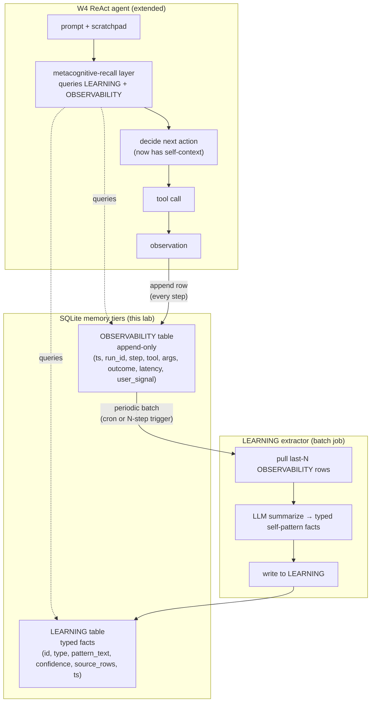

> **Status: SPEC DRAFT (2026-05-14).** This chapter is a planning skeleton produced from single-source research on Daniel Miessler's Personal_AI_Infrastructure (PAI) v7.6 Memory architecture. Phase Python blocks marked `TBD` are scoped but not yet written. Reviewer-pass before implementation. Spec source: PAI v5.0.0 release notes + v7.6 Memory system documentation (2026-05-14).

## Exit Criteria

- [ ] `src/observability.py` — append-only SQLite `OBSERVABILITY` table; one row per tool call / decision / outcome / user-satisfaction signal; instruments the W4 ReAct loop transparently
- [ ] `src/learning_extractor.py` — periodic LLM job that pulls last-N OBSERVABILITY rows, summarizes into self-pattern facts, writes to `LEARNING` table (typed: `failure_pattern`, `success_pattern`, `tool_preference`, `recurring_mistake`)
- [ ] `src/metacog_recall.py` — pre-decision query layer; given current prompt + scratchpad, retrieves top-K relevant LEARNING facts + last-M OBSERVABILITY rows; injects into agent context window
- [ ] `tests/test_self_recall_changes_behavior.py` — **agent retrieves a relevant LEARNING fact at decision time and the recall provably changes the decision** (paired-trial probe: same prompt, with/without LEARNING injection, decision divergence rate ≥ 30% on a 15-task self-pattern probe set)
- [ ] `RESULTS.md` — measurement: (a) OBSERVABILITY row growth rate per agent-hour, (b) LEARNING extraction noise rate (junk facts / total facts), (c) recall-precision on the 15-task probe, (d) end-to-end task success delta with vs without metacognitive recall

---

## 1. Why This Week Matters (~150 words — REQUIRED)

W4's ReAct loop logs every tool call to `obs.py` and never reads from it again. The agent has perfect amnesia about its own past behavior — it cannot say "last time I tried `grep` on this codebase it timed out, let me use `rg` instead", because that fact is buried in a log file the agent treats as write-only. This is the same failure mode that surfaces in W5.5 Metacognition: the agent doesn't know what it has tried. Daniel Miessler's PAI v7.6 Memory system makes a sharp pedagogical move — it splits memory along **function**, not just recency. WORK holds active task state, KNOWLEDGE holds typed facts about the world, **LEARNING holds meta-patterns the agent extracted about itself**, and **OBSERVABILITY is the raw behavioral log treated as a first-class memory tier, not a debug artifact**. The senior-engineer signal is "my agent can answer what's my own failure pattern — and the answer changes its next decision". This chapter builds that self-facing memory layer on top of W3.5.8's two-tier world-facing memory.

---

## 2. Theory Primer (~1000 words — REQUIRED — OUTLINED, FULL TEXT IN ROUND 2)

### 2.1 The self-facing vs world-facing memory split

World-facing memory (W3.5, W3.5.8, W3.5.9) answers "what is true about the domain": entity facts, document chunks, relational hyperedges. Self-facing memory answers "what is true about me, the agent, doing this work": which tools I tried, which decisions I made, which prompts confused me, which retries paid off. PAI's contribution is making this split first-class — OBSERVABILITY and LEARNING are not "logging" or "monitoring", they are memory the agent reads from at decision time. Logging is for humans debugging the agent; OBSERVABILITY is for the agent debugging itself.

### 2.2 Five concepts to own before writing code

1. **Self-facing vs world-facing memory** — a world-facing fact is "Postgres uses MVCC". A self-facing fact is "when I ask Postgres questions, I keep forgetting to scope by schema and the query fails". The first lives in KNOWLEDGE; the second lives in LEARNING. Both are facts; their subject differs.
2. **OBSERVABILITY = primary key** — every tool call, every hook firing, every decision outcome, every user satisfaction signal is one append-only row. Primary key is `(timestamp, agent_run_id, step_idx)`. No updates, no deletes (except by retention policy). This append-only discipline is what makes the table queryable as memory rather than as state.
3. **LEARNING extraction as cron-style consolidation** — OBSERVABILITY is high-volume, noisy, low-signal. LEARNING is low-volume, denoised, high-signal. The bridge is a periodic LLM extractor: pull last-N rows, summarize into typed self-pattern facts, write to LEARNING. This is the same hot→warm consolidation pattern from W3.5.8, but applied to *self*-data instead of *world*-data.
4. **Metacognitive recall = decision-time query** — at each ReAct step, before the agent picks its next action, query LEARNING for facts relevant to the current prompt and inject the top-K. The injection is in-context, not fine-tuning. Cheap, immediate, observable.
5. **Failure-mode self-attribution** — the LEARNING extractor must distinguish "tool X failed because of network" from "I keep mis-using tool X". The first is environmental, not a self-pattern. The second is. The extractor's system prompt must enforce this distinction or LEARNING saturates on noise.

### 2.3 Papers + references to cite (TBD-fill in round 2)

- Shinn et al. (2023). *Reflexion: Language Agents with Verbal Reinforcement Learning.* arXiv:2303.11366 — closest academic analog to LEARNING; self-generated linguistic feedback used at next decision.
- Wang et al. (2023). *Voyager: An Open-Ended Embodied Agent with Large Language Models.* arXiv:2305.16291 — skill library accreted from self-observation; LEARNING-like persistence.
- Park et al. (2023). *Generative Agents: Interactive Simulacra of Human Behavior.* arXiv:2304.03442 — reflection module summarizing observation streams into higher-level insights.
- Flavell (1979). *Metacognition and Cognitive Monitoring.* American Psychologist — original metacognition framing; the self-knowledge axis the chapter operationalizes.
- Daniel Miessler's PAI v5.0.0 release notes (Memory v7.6 architecture — WORK / KNOWLEDGE / LEARNING / OBSERVABILITY split).
- PAI repo: `Releases/v5.0.0/README.md` + `containment-zones.ts` skill-registry pattern + hook architecture.

### 2.4 Distinguish-from box

- **OBSERVABILITY ≠ logging.** Logging is for humans reading after a failure. OBSERVABILITY is for the agent reading before its next decision. Same data shape, different consumer, different access pattern. A log file flushed to disk and never read is not OBSERVABILITY.
- **LEARNING ≠ fine-tuning.** Fine-tuning changes model weights; LEARNING changes the in-context prefix at decision time. LEARNING is cheap, fast, debuggable, and rollback-able; fine-tuning is none of those. They are different mechanisms for the same goal (behavior shaped by past experience).
- **Self-facing memory ≠ episodic memory in the W3.5 sense.** W3.5 episodic memory stores past conversation turns as world-data ("user said X"). LEARNING stores extracted patterns about the agent's own behavior ("I tend to over-call grep on large repos"). The subject of the fact is what differs.
- **Metacognitive recall ≠ reflection.** Reflection (W5.5) is the agent generating new self-knowledge in-the-moment. Metacognitive recall is the agent retrieving previously-extracted self-knowledge. Reflection writes to LEARNING; recall reads from it. Both are W5.5 primitives; this chapter builds the read+write substrate they ride on.

---

## 3. System Architecture (REQUIRED — Mermaid)

**Reading the diagram.** The W4 ReAct loop is unchanged except for two new edges: every step appends to OBSERVABILITY (write side), and the decision layer queries LEARNING + OBSERVABILITY before picking an action (read side). The LEARNING extractor runs out-of-band as a batch job — cron-style or every N steps — pulling raw observation rows and summarizing them into typed self-pattern facts. The agent never writes directly to LEARNING; the extractor is the only writer. This separation is what keeps LEARNING denoised.

---

## 4. Lab Phases (REQUIRED — TBD code, scoped now)

### Phase 1 — OBSERVABILITY SQLite schema + W4 obs.py extension (~45 min)

Goal: extend the W4 ReAct lab's `obs.py` SQLite logger (at `~/code/agent-prep/lab-04-react/obs.py`) into a first-class OBSERVABILITY table with the full row schema. Add indices on `(run_id, step_idx)` and `(tool_name, ts)` for the query patterns the recall layer will need.

- **TBD code** — `src/observability.py`: schema migration, append API, query helpers (by run, by tool, by recency window).
- **TBD verification** — smoke test inserts 1000 synthetic rows, queries by tool name, verifies index usage via `EXPLAIN QUERY PLAN`.
- Pedagogical note: the schema choice is load-bearing. `outcome` is a JSON column for flexibility, but the indexed columns are typed and queryable. This mirrors the W3.5.8 hot-tier design.

### Phase 2 — Tool-call instrumentation hooks into W4 ReAct loop (~1 hour)

Goal: wrap every tool call in the W4 ReAct loop with a decorator/middleware that writes one OBSERVABILITY row per call. Capture: tool name, args (PII-scrubbed — see §6 Entry 5), latency, outcome status, raw outcome (truncated), step index, run id. Add a user-satisfaction hook point so downstream lab phases (or the reader's own usage) can stamp `user_signal: thumbs_up | thumbs_down | silent` onto recent rows.

- **TBD code** — `src/instrument.py`: tool wrapper, hook-firing on every step, integration shim with W4's `run_agent()`.
- **TBD verification** — run the W4 20-task probe set with instrumentation on; verify one OBSERVABILITY row per tool call, no missing rows on tool failures, latency overhead < 5ms p99.

### Phase 3 — LEARNING extractor (periodic LLM consolidation job) (~1.5 hours)

Goal: implement the batch LLM job that reads OBSERVABILITY → writes LEARNING. The extractor's prompt enforces typed output (`failure_pattern | success_pattern | tool_preference | recurring_mistake`) and the self-attribution discipline from §2.2 concept 5 (must distinguish environmental failure from self-pattern). Run via `python -m learning_extractor --since 1h`. Default trigger: every 50 OBSERVABILITY rows or every 1 hour, whichever first.

- **TBD code** — `src/learning_extractor.py`: row puller, summarizer prompt, JSON-mode output parser, LEARNING insert with source-row provenance.
- **TBD measurement** — run extractor against 500 hand-curated OBSERVABILITY rows; measure LEARNING facts produced; manually grade noise rate (junk facts / total facts). Target noise rate ≤ 25% on first pass.
- Pedagogical note: the extractor SHOULD use a *smaller* model than the agent (haiku-tier `:8004` is sufficient for summarization). Using the agent's own opus-tier model creates a feedback loop where the agent's biases get baked into its self-knowledge. See reviewer question #5.

### Phase 4 — Metacognitive recall (pre-decision query layer) (~1.5 hours)

Goal: at each ReAct step, before the agent picks its next action, query LEARNING for facts relevant to the current `(prompt, scratchpad)` and inject top-K (default K=3) into the agent's context window under a `## Self-Patterns You Have Observed` header. Use simple BM25 + recency-decay scoring against `pattern_text` for v1; defer embedding-based recall to a later supplement.

- **TBD code** — `src/metacog_recall.py`: query builder, top-K scorer, context injection formatter.
- **TBD measurement** — manual inspection: on the 15-task probe set, does each task receive at least one relevant LEARNING fact at recall time? Recall-precision target ≥ 60% (more than half of injected facts are judged relevant by manual review).

### Phase 5 — Paired-trial measurement: does recall change the decision? (~1.5 hours)

Goal: hand-curate a 15-task self-pattern probe set where each task has a known self-pattern in LEARNING that *should* alter the agent's first-choice action. Run paired trials: same prompt, identical seed, once with metacognitive recall ON, once OFF. Measure decision divergence rate (fraction of tasks where the first chosen tool or first action differs), end-to-end success rate delta, and token-cost delta.

- **TBD code** — `tests/test_self_recall_changes_behavior.py`: paired-trial harness, divergence detector, success-rate comparator.
- **TBD result table** — populate `RESULTS.md` with: divergence rate (target ≥ 30%), success delta, token-cost delta, and qualitative analysis of which kinds of self-patterns produced the largest behavior shifts.

---

## 5. (deprecated)

Walkthroughs live inline per the per-Python-block bundle in §4.

---

## 6. Bad-Case Journal (3-5 entries — TBD AFTER LAB RUN)

Pre-flight entries scoped from convergent failure modes in PAI v7.6 documentation + Reflexion/Voyager literature; final entries populated post-implementation.

**Entry 1 (planned) — LEARNING extractor saturates on noise.**
*Scoped from:* Reflexion §6.3 noisy-self-reflection failure mode. Extractor over-produces low-signal facts ("I called `grep` 47 times"); LEARNING table grows but recall precision collapses. Likely fix: tighter typed-output prompt + minimum-confidence threshold + dedup-by-pattern-similarity at insert time.

**Entry 2 (planned) — Recall over-confidence — LEARNING facts injected as ground truth even when stale.**
*Scoped from:* PAI v7.6 release notes "stale-pattern" caveat. Agent retrieves a 3-week-old LEARNING fact about a tool that has since changed, blindly trusts it, fails. Likely fix: recency-decay scoring + confidence prefix in injected text ("you observed in the past that …, but verify").

**Entry 3 (planned) — Self-attribution bias — environmental failures logged as self-patterns.**
*Scoped from:* §2.2 concept 5 design tension. Network blip causes 5 tool failures; extractor decides "I keep mis-using tool X". Likely fix: extractor prompt must include explicit `is_self_caused: bool` field; filter on insert.

**Entry 4 (planned) — OBSERVABILITY table size growth — unbounded log becomes a query bottleneck.**
*Scoped from:* W4 obs.py precedent + standard append-only-table growth pathology. After 30 days of use, OBSERVABILITY is multi-GB, queries slow. Likely fix: retention policy (delete rows > 90 days unless flagged), summarized-rollup table for older windows, or move cold rows to a Parquet file.

**Entry 5 (planned) — PII leaks from OBSERVABILITY — raw tool args contain secrets.**
*Scoped from:* general security hygiene + reviewer question #4 default. Tool args include API keys, user paths, prompt content with PII. Likely fix: scrub-PII middleware at the OBSERVABILITY write boundary (regex for known secret formats + path redaction + opt-in raw-args mode for debugging only).

---

## 7. Interview Soundbites (2-3 entries — TBD AFTER LAB RUN)

Soundbites are written post-measurement so the numbers cited are real. Scoped topics:

- (a) "How does your agent learn from its own past behavior without fine-tuning?" — anchor on LEARNING extraction + paired-trial divergence numbers from Phase 5.
- (b) "What's the difference between logging and observability for an agent system?" — anchor on §2.4 distinguish-from box; OBSERVABILITY as memory not as debug artifact.
- (c) "How do you keep an agent's self-knowledge from drifting or saturating on noise?" — anchor on BCJ Entry 1 + Entry 3 fixes; typed-output discipline + self-attribution filter.

---

## 8. References (TBD-fill)

Same set as §2.3 once expanded. Format per vault conventions:
- **Author et al. (Year).** *Title.* Venue. arXiv link. One-line description.

Must include at least one production blog post or canonical implementation repo. Candidates:
- Daniel Miessler PAI v5.0.0 release notes — `https://github.com/danielmiessler/Personal_AI_Infrastructure/blob/main/Releases/v5.0.0/README.md`
- PAI v7.6 Memory system architecture (cited in v5.0.0)
- PAI `containment-zones.ts` + hook architecture (skill-registry analog)
- Shinn et al. (2023) *Reflexion* arXiv:2303.11366
- Wang et al. (2023) *Voyager* arXiv:2305.16291
- Park et al. (2023) *Generative Agents* arXiv:2304.03442
- Flavell (1979) *Metacognition and Cognitive Monitoring* — foundational framing

---

## 9. Cross-References

- **Builds on:** [[Week 3.5.8 - Two-Tier Memory]] (hot/warm consolidation pattern, applied here to *self*-data); [[Week 4 - ReAct From Scratch]] (`obs.py` SQLite logger; tool-call loop being instrumented).
- **Distinguish from:** [[Week 3.5 - Cross-Session Memory]] and [[Week 3.5.8 - Two-Tier Memory]] and [[Week 3.5.9 - Three-Tier Hypergraph]] (all world-facing — store facts ABOUT the domain; this chapter is self-facing — stores facts ABOUT the agent itself); logging-as-debug-tool (logs are for humans reading after a failure; OBSERVABILITY is for the agent reading before its next decision — §2.4).
- **Connects to:** [[Week 5.5 - Metacognition]] **heavily** — reflection (write to LEARNING in-the-moment) and metacognitive recall (read from LEARNING at decision time) are the two W5.5 primitives that ride on top of this chapter's substrate; [[Week 6.7 - Agent Skills]] (PAI's skill registry uses the same hook architecture this chapter borrows from).
- **Foreshadows:** [[Week 11 - System Design]] production observability stack (OBSERVABILITY scales to OTel + ClickHouse in production; same memory-not-log discipline); [[Week 12 - Capstone]] self-improving agent loop.

---

## Reviewer-pass questions (DELETE BEFORE COMMIT TO MAIN)

1. **Numbering choice — W3.5.95 vs W3.6?** W3.5.95 sits inside the memory cluster (3.5, 3.5.8, 3.5.9) and signals "elective supplement deep inside the memory thread"; W3.6 would imply a new primary thread. Default: keep W3.5.95 because pedagogically it IS a memory variant (self-facing vs world-facing), not a new topic. Risk: decimal-cascade visual clutter in the vault TOC.
2. **Single-source convergence risk.** This chapter is sourced from one repo (PAI) where W4.5 was sourced from a 4-repo cross-repo convergence. Should we hold the chapter until at least one second source (Reflexion impl, Voyager skill-library repo, or another self-observability agent) is folded in to avoid PAI-specific accident? Default: ship as v0 spec, add second source before lab-execution round.
3. **Table-size cap policy.** Default to 90-day retention with rollup-summary for older windows, or to a hard row-cap (e.g., 100K rows)? 90-day retention is more PAI-idiomatic; hard cap is more deterministic for a teaching lab. Lean: 90-day + rollup, document hard-cap as alternative.
4. **PII-scrubbing default.** Default ON (safer, slightly distorts the data) or OFF with opt-in (truer to raw OBSERVABILITY, leak risk on shared repos)? Lean: ON by default, document the opt-out for power users. See BCJ Entry 5.
5. **LEARNING summarizer model — same as agent or separate smaller model?** Using the agent's opus-tier model gives high-quality summaries but bakes the agent's biases into its self-knowledge (echo-chamber risk). Using a separate haiku-tier model breaks the feedback loop at some summary-quality cost. Lean: separate haiku-tier on `:8004`. This is the §2.2 concept-5 + Phase 3 pedagogical-note tension; surface it explicitly in the chapter prose.

---

*Spec drafted from single-source research on Daniel Miessler's Personal_AI_Infrastructure v7.6 Memory architecture. Single-source convergence risk acknowledged in reviewer question #2; second source (Reflexion implementation or analog) to be folded in before lab-execution round.*
