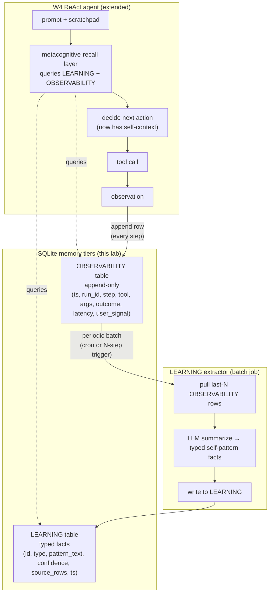
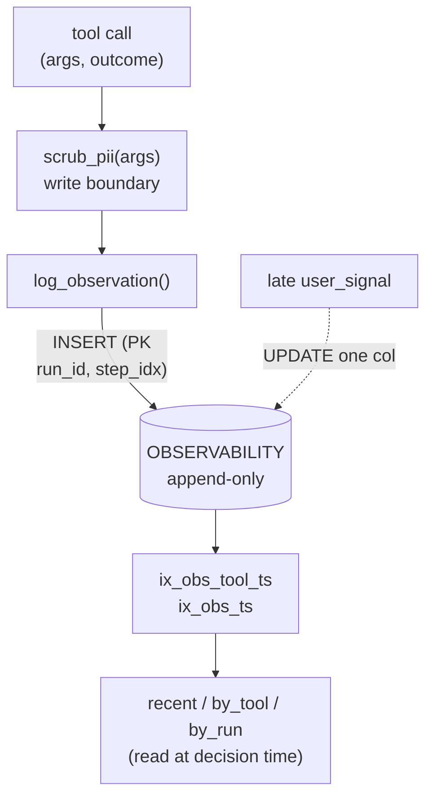
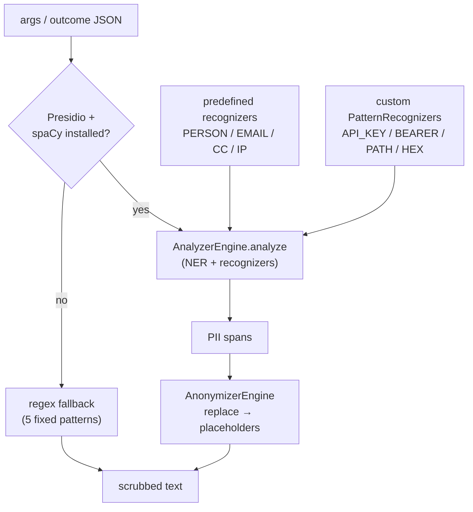
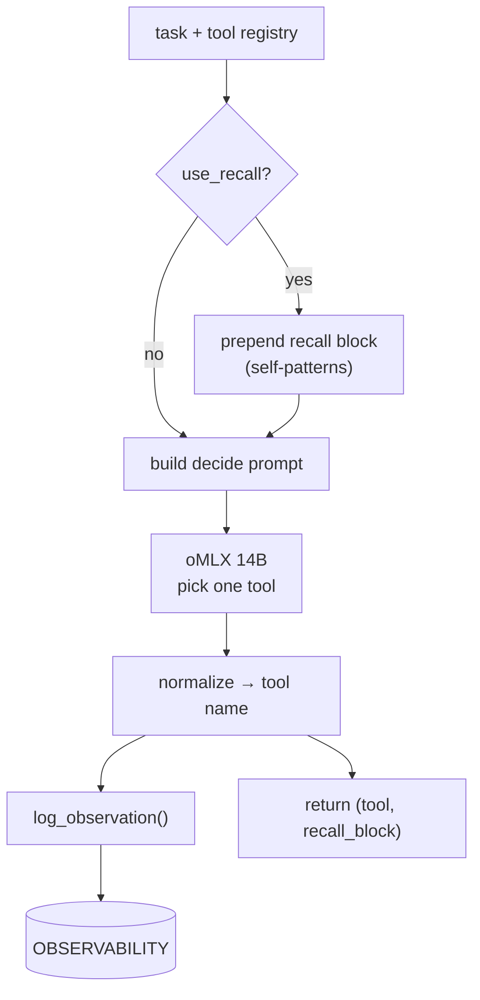
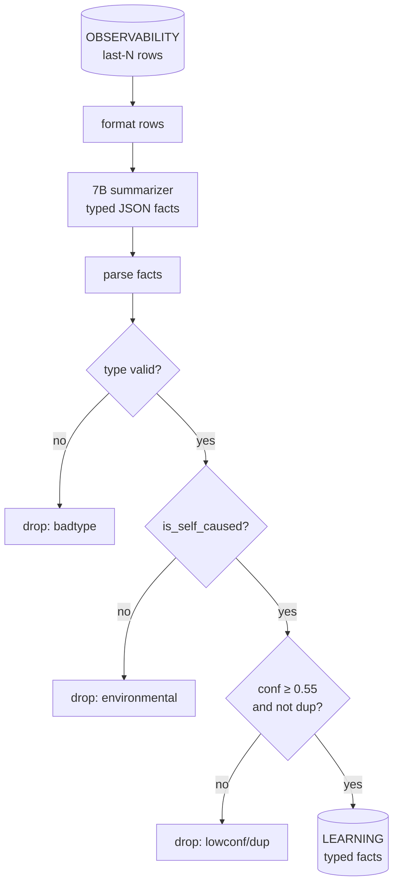
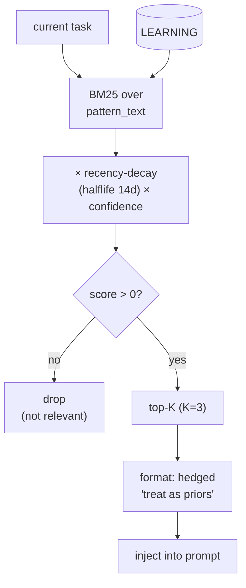
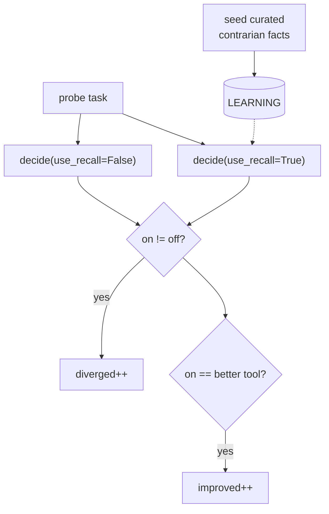
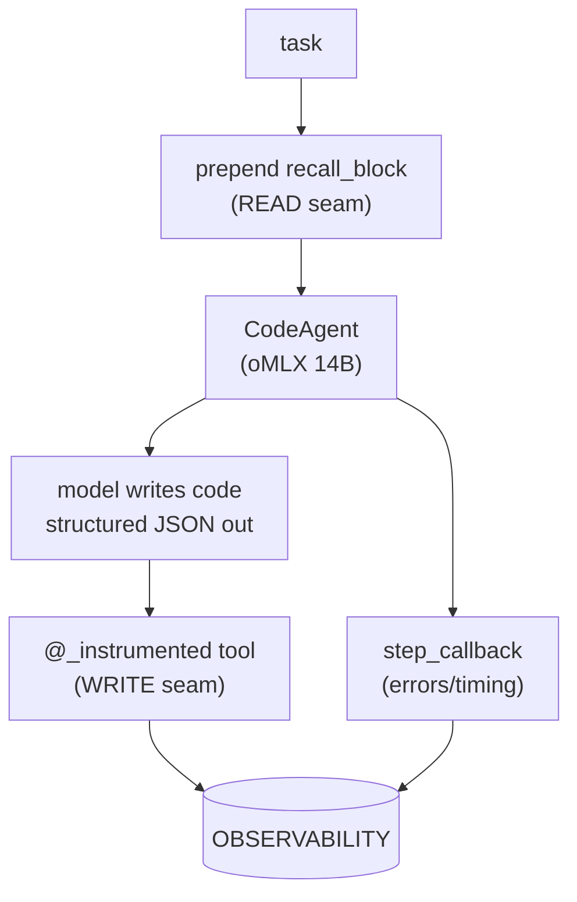

> **Status: BUILT + MEASURED (2026-06-04).** The lab is implemented, runnable, and measured — a **self-contained** lab (no W4 dependency; a minimal `decide()` agent stands in for the ReAct loop, plus a real-framework integration on smolagents). All numbers in §4/§5/§6 are from real runs on oMLX `:8000` (agent `Qwen2.5-Coder-14B-Instruct-MLX-4bit`, extractor `Qwen2.5-Coder-7B-Instruct-MLX-4bit`). Lab repo: `~/code/agent-prep/lab-03-5-95-self-observability/` — full source + `RESULTS.md`. Concept source: Daniel Miessler's Personal_AI_Infrastructure (PAI) v7.6 Memory architecture; the OBSERVABILITY+LEARNING split is validated here against Reflexion/Voyager (§2.3), not taken on PAI's word alone.

## Exit Criteria

- [x] `src/observability.py` — append-only SQLite `OBSERVABILITY` table; one row per tool call / decision / outcome / user-satisfaction signal; PII-scrubbed at the write boundary. **6/6 unit tests pass.**
- [x] `src/learning_extractor.py` — periodic LLM job that pulls last-N OBSERVABILITY rows, summarizes into typed self-pattern facts, writes to `LEARNING` (`failure_pattern`, `success_pattern`, `tool_preference`, `recurring_mistake`) with a `is_self_caused` self-attribution filter. **35 obs → ~5 facts; self-attribution is nondeterministic — one run leaked 2 environmental, a 20-run ablation leaked 0 (BCJ Entry 1).**
- [x] `src/metacog_recall.py` — pre-decision query layer; BM25 × recency-decay × confidence over LEARNING; injects top-K under a `## Self-Patterns You Have Observed` header. Pure code, no LLM.
- [x] `tests/test_self_recall_changes_behavior.py` — **a recalled LEARNING fact provably changes the agent's decision** (paired trial, recall OFF vs ON). **Divergence 6/6 = 100% on contrarian probes; 0/6 on prior-aligned probes (BCJ Entry 3) — the central finding.**
- [x] `src/smolagents_agent.py` — the same two seams wired into a real agent framework (`CodeAgent` on oMLX). **Both seams verified; 3 integration BCJs (Entries 4–6).**
- [x] `RESULTS.md` — full measured run: unit suite, LEARNING noise rate, paired-trial divergence/improvement, smolagents integration.

---

## 1. Why This Week Matters 

W4's ReAct loop logs every tool call to `obs.py` and never reads from it again. The agent has perfect amnesia about its own past behavior — it cannot say "last time I tried `grep` on this codebase it timed out, let me use `rg` instead", because that fact is buried in a log file the agent treats as write-only. This is the same failure mode that surfaces in W5.5 Metacognition: the agent doesn't know what it has tried. Daniel Miessler's PAI v7.6 Memory system makes a sharp pedagogical move — it splits memory along **function**, not just recency. WORK holds active task state, KNOWLEDGE holds typed facts about the world, **LEARNING holds meta-patterns the agent extracted about itself**, and **OBSERVABILITY is the raw behavioral log treated as a first-class memory tier, not a debug artifact**. The senior-engineer signal is "my agent can answer what's my own failure pattern — and the answer changes its next decision". This chapter builds that self-facing memory layer on top of W3.5.8's two-tier world-facing memory.

---

## 2. Theory Primer  

### 2.1 The self-facing vs world-facing memory split

World-facing memory (W3.5, W3.5.8, W3.5.9) answers "what is true about the domain": entity facts, document chunks, relational hyperedges. Self-facing memory answers "what is true about me, the agent, doing this work": which tools I tried, which decisions I made, which prompts confused me, which retries paid off. PAI's contribution is making this split first-class — OBSERVABILITY and LEARNING are not "logging" or "monitoring", they are memory the agent reads from at decision time. Logging is for humans debugging the agent; OBSERVABILITY is for the agent debugging itself.

### 2.2 Five concepts to own before writing code

1. **Self-facing vs world-facing memory** — a world-facing fact is "Postgres uses MVCC". A self-facing fact is "when I ask Postgres questions, I keep forgetting to scope by schema and the query fails". The first lives in KNOWLEDGE; the second lives in LEARNING. Both are facts; their subject differs.
2. **OBSERVABILITY = primary key** — every tool call, every hook firing, every decision outcome, every user satisfaction signal is one append-only row. Primary key is `(timestamp, agent_run_id, step_idx)`. No updates, no deletes (except by retention policy). This append-only discipline is what makes the table queryable as memory rather than as state.
3. **LEARNING extraction as cron-style consolidation** — OBSERVABILITY is high-volume, noisy, low-signal. LEARNING is low-volume, denoised, high-signal. The bridge is a periodic LLM extractor: pull last-N rows, summarize into typed self-pattern facts, write to LEARNING. This is the same hot→warm consolidation pattern from W3.5.8, but applied to *self*-data instead of *world*-data.
4. **Metacognitive recall = decision-time query** — at each ReAct step, before the agent picks its next action, query LEARNING for facts relevant to the current prompt and inject the top-K. The injection is in-context, not fine-tuning. Cheap, immediate, observable.
5. **Failure-mode self-attribution** — the LEARNING extractor must distinguish "tool X failed because of network" from "I keep mis-using tool X". The first is environmental, not a self-pattern. The second is. The extractor's system prompt must enforce this distinction or LEARNING saturates on noise.

### 2.3 Papers + references to cite

- Shinn et al. (2023). *Reflexion: Language Agents with Verbal Reinforcement Learning.* arXiv:2303.11366 — closest academic analog to LEARNING; self-generated linguistic feedback used at next decision.
- Wang et al. (2023). *Voyager: An Open-Ended Embodied Agent with Large Language Models.* arXiv:2305.16291 — skill library accreted from self-observation; LEARNING-like persistence.
- Park et al. (2023). *Generative Agents: Interactive Simulacra of Human Behavior.* arXiv:2304.03442 — reflection module summarizing observation streams into higher-level insights.
- Flavell (1979). *Metacognition and Cognitive Monitoring.* American Psychologist — original metacognition framing; the self-knowledge axis the chapter operationalizes.
- Daniel Miessler's PAI v5.0.0 release notes (Memory v7.6 architecture — WORK / KNOWLEDGE / LEARNING / OBSERVABILITY split).
- PAI repo: `Releases/v5.0.0/README.md` + `containment-zones.ts` skill-registry pattern + hook architecture.

### 2.4 Distinguish-from box

- **OBSERVABILITY ≠ logging.** Logging is for humans reading after a failure. OBSERVABILITY is for the agent reading before its next decision. Same data shape, different consumer, different access pattern. A log file flushed to disk and never read is not OBSERVABILITY.
- **LEARNING ≠ fine-tuning.** Fine-tuning changes model weights; LEARNING changes the in-context prefix at decision time. LEARNING is cheap, fast, debuggable, and rollback-able; fine-tuning is none of those. They are different mechanisms for the same goal (behavior shaped by past experience).
- **Self-facing memory ≠ episodic memory in the W3.5 sense.** W3.5 episodic memory stores past conversation turns as world-data ("user said X"). LEARNING stores extracted patterns about the agent's own behavior ("I tend to over-call grep on large repos"). The subject of the fact is what differs.
- **Metacognitive recall ≠ reflection.** Reflection (W5.5) is the agent generating new self-knowledge in-the-moment. Metacognitive recall is the agent retrieving previously-extracted self-knowledge. Reflection writes to LEARNING; recall reads from it. Both are W5.5 primitives; this chapter builds the read+write substrate they ride on.

---

## 3. System Architecture  



**Reading the diagram.** The W4 ReAct loop is unchanged except for two new edges: every step appends to OBSERVABILITY (write side), and the decision layer queries LEARNING + OBSERVABILITY before picking an action (read side). The LEARNING extractor runs out-of-band as a batch job — cron-style or every N steps — pulling raw observation rows and summarizing them into typed self-pattern facts. The agent never writes directly to LEARNING; the extractor is the only writer. This separation is what keeps LEARNING denoised.

---

## 4. Lab Phases

**Lab repo:** `~/code/agent-prep/lab-03-5-95-self-observability/`. This is a **self-contained** lab — it does *not* depend on the W4 ReAct lab. A minimal one-step `decide()` agent stands in for the ReAct loop so the memory seams can be measured in isolation; Phase 6 then wires the *same* seams into a real agent framework (smolagents) to show the production integration.

### Phase 0 — Environment prep (~10 min)

```bash
mkdir -p ~/code/agent-prep/lab-03-5-95-self-observability && cd "$_"
uv init --python 3.13 && uv add openai python-dotenv pytest smolagents
# smolagents==1.26.0, openai>=1.x, python-dotenv, pytest. SQLite is stdlib.

# PII scrubbing backend (Microsoft Presidio). Optional — the scrubber falls back
# to regex if these are absent, so the lab still runs without them.
uv add presidio-analyzer presidio-anonymizer
uv run python -m spacy download en_core_web_sm   # small NER model (~12MB)

# oMLX must be serving on :8000 (OpenAI-compatible). .env (gitignored):
cat > .env <<'EOF'
OMLX_BASE_URL=http://localhost:8000/v1
OMLX_API_KEY=<your-oMLX-key>
MODEL_AGENT=Qwen2.5-Coder-14B-Instruct-MLX-4bit
MODEL_EXTRACTOR=Qwen2.5-Coder-7B-Instruct-MLX-4bit
EOF
```

The extractor model is deliberately **smaller** than the agent model (7B vs 14B) — §2.2 concept 5: consolidating self-knowledge with the agent's *own* model bakes its biases into its self-image (echo chamber). Summarization is easy; a 7B does it. Both serve from the same oMLX endpoint here; in the theory primer's fleet they'd be the haiku-tier `:8004` and a larger tier.

---

### Phase 1 — OBSERVABILITY: the append-only behavioral log (~45 min)

Goal: a first-class OBSERVABILITY table — one append-only row per tool call / decision / outcome — indexed for the query patterns the recall layer needs, and PII-scrubbed at the write boundary.



**Code:** `src/observability.py` (full)

```python
"""W3.5.95 — OBSERVABILITY: the agent's append-only behavioral log, treated as a
first-class memory tier (read at decision time), not a debug artifact.

Two SQLite tables live here:
  OBSERVABILITY — one append-only row per tool call / decision / outcome.
  LEARNING      — typed self-pattern facts (written ONLY by learning_extractor).

Design (chapter §2.2):
  * append-only: PK (agent_run_id, step_idx); no updates/deletes except retention.
  * PII-scrubbed at the WRITE boundary (see pii_scrub) — raw tool args routinely
    carry keys/paths/PII; scrub before persisting (opt-out via raw_args=True).
  * indexed for the recall layer's query patterns: (tool_name, ts), (run, step).
"""
from __future__ import annotations

import json
import sqlite3
import time
from typing import Any

# PII / secret scrubbing at the write boundary lives in pii_scrub: Microsoft
# Presidio (NER + pattern recognizers) when available, regex fallback otherwise.
# Re-export so callers can use obs.scrub_pii unchanged. (See the pii_scrub block.)
from pii_scrub import scrub_pii  # noqa: F401


_SCHEMA = """
CREATE TABLE IF NOT EXISTS observability (
    ts            REAL NOT NULL,
    agent_run_id  TEXT NOT NULL,
    step_idx      INTEGER NOT NULL,
    tool_name     TEXT NOT NULL,
    args_json     TEXT NOT NULL,
    outcome_json  TEXT NOT NULL,
    outcome_status TEXT NOT NULL,   -- ok | error | timeout
    latency_ms    REAL NOT NULL,
    user_signal   TEXT,             -- thumbs_up | thumbs_down | silent | NULL
    PRIMARY KEY (agent_run_id, step_idx)
);
CREATE INDEX IF NOT EXISTS ix_obs_tool_ts ON observability (tool_name, ts);
CREATE INDEX IF NOT EXISTS ix_obs_ts      ON observability (ts);

CREATE TABLE IF NOT EXISTS learning (
    id           INTEGER PRIMARY KEY AUTOINCREMENT,
    type         TEXT NOT NULL,     -- failure_pattern|success_pattern|tool_preference|recurring_mistake
    pattern_text TEXT NOT NULL,
    confidence   REAL NOT NULL,
    is_self_caused INTEGER NOT NULL,  -- 1 = the agent's own pattern; 0 = environmental (filtered out)
    source_rows  TEXT NOT NULL,     -- JSON list of (run_id, step_idx) provenance
    ts           REAL NOT NULL
);
CREATE INDEX IF NOT EXISTS ix_learn_type ON learning (type, ts);
"""


def connect(db_path: str, *, check_same_thread: bool = True) -> sqlite3.Connection:
    """Open the memory DB, ensure both tables + indices exist. WAL for concurrent
    read (the recall layer reads while the agent writes).

    check_same_thread=False is needed when an agent FRAMEWORK executes the
    instrumented tools off the connection's creating thread — e.g. smolagents'
    CodeAgent runs the model's code in a worker thread, so the tool's
    log_observation() write happens on a different thread than connect(). WAL +
    the GIL + smolagents' sequential single-tool-at-a-time loop keep writes
    serialized, so this is safe here. (BCJ Entry 6.)"""
    conn = sqlite3.connect(db_path, check_same_thread=check_same_thread)
    conn.row_factory = sqlite3.Row
    conn.execute("PRAGMA journal_mode=WAL")
    conn.executescript(_SCHEMA)
    return conn


def log_observation(
    conn: sqlite3.Connection, *, agent_run_id: str, step_idx: int, tool_name: str,
    args: Any, outcome: Any, outcome_status: str, latency_ms: float,
    user_signal: str | None = None, raw_args: bool = False,
) -> None:
    """Append ONE observation row. args/outcome are JSON-serialized; args are
    PII-scrubbed unless raw_args=True (debug opt-out). Append-only: a duplicate
    (run_id, step_idx) is a programming error — surfaced, not silently updated."""
    args_json = json.dumps(args, default=str)
    if not raw_args:
        args_json = scrub_pii(args_json)
    outcome_json = scrub_pii(json.dumps(outcome, default=str))[:2000]  # truncate + scrub
    conn.execute(
        "INSERT INTO observability (ts, agent_run_id, step_idx, tool_name, args_json, "
        "outcome_json, outcome_status, latency_ms, user_signal) VALUES (?,?,?,?,?,?,?,?,?)",
        (time.time(), agent_run_id, step_idx, tool_name, args_json, outcome_json,
         outcome_status, latency_ms, user_signal),
    )
    conn.commit()


def recent_observations(conn: sqlite3.Connection, limit: int = 50) -> list[sqlite3.Row]:
    """Last `limit` rows by time — the recall layer's 'what did I just do' window."""
    return conn.execute(
        "SELECT * FROM observability ORDER BY ts DESC LIMIT ?", (limit,)
    ).fetchall()


def observations_by_tool(conn: sqlite3.Connection, tool_name: str) -> list[sqlite3.Row]:
    """All rows for one tool (uses ix_obs_tool_ts) — 'how has X behaved for me'."""
    return conn.execute(
        "SELECT * FROM observability WHERE tool_name = ? ORDER BY ts DESC", (tool_name,)
    ).fetchall()


def observations_by_run(conn: sqlite3.Connection, agent_run_id: str) -> list[sqlite3.Row]:
    return conn.execute(
        "SELECT * FROM observability WHERE agent_run_id = ? ORDER BY step_idx", (agent_run_id,)
    ).fetchall()


def stamp_user_signal(conn: sqlite3.Connection, agent_run_id: str, step_idx: int,
                      signal: str) -> None:
    """The ONE permitted mutation: attach a user-satisfaction signal to a row
    after the fact (the user reacts to an outcome the agent already produced)."""
    conn.execute(
        "UPDATE observability SET user_signal=? WHERE agent_run_id=? AND step_idx=?",
        (signal, agent_run_id, step_idx),
    )
    conn.commit()
```

The schema's primary key is `(agent_run_id, step_idx)` and `outcome_status` is constrained to `ok | error | timeout`; two indices `ix_obs_tool_ts (tool_name, ts)` and `ix_obs_ts (ts)` back the recall queries.

**Walkthrough:**
- **Block 1 — write-boundary scrub.** PII is redacted *before* the row is persisted, not at read time. Why: an append-only log you never rewrite means a secret written once is a secret stored forever. Scrubbing at the boundary makes "we never stored it" true, which is the only defensible claim under audit. The `raw_args=True` opt-out exists for trusted internal tools where arg fidelity matters more than redaction.
- **Block 2 — append-only PK.** `(agent_run_id, step_idx)` as PK means a duplicate step raises `IntegrityError` instead of silently overwriting. The discipline is the point: a table you only ever `INSERT` into is queryable as *memory*; a table you `UPDATE` is *state*. The one allowed mutation is stamping a late `user_signal` onto an existing row — a satisfaction signal that arrives after the step.
- **Block 3 — indexed for read.** The indices exist because OBSERVABILITY is *read at decision time*, not just written. `(tool_name, ts)` serves "what happened last time I used grep"; that read pattern is what separates observability-as-memory from logging-as-debug.

**Result:** `uv run python -m pytest tests/test_observability.py -q` → **7/7 pass**: append+query, append-only `IntegrityError`, PII scrub (`sk-…`/`/Users/…`/email redacted), Presidio named-entity scrub (PERSON/CREDIT_CARD), `raw_args` opt-out, index usage confirmed via `EXPLAIN QUERY PLAN` (`ix_obs_tool_ts`, not a scan), and late `user_signal` stamp.

`★ Insight ─────────────────────────────────────`
- The `EXPLAIN QUERY PLAN` assertion in the test is doing real work: it fails if a future schema change drops the index and silently turns the recall query into a full-table scan. The test encodes "this table must stay read-cheap," which is the whole premise of observability-as-memory.
- PII scrubbing at the *write* boundary (not read) is the security move. Append-only + read-side scrubbing would leave the secret on disk; the only honest redaction on an append-only store happens before the INSERT.
`─────────────────────────────────────────────────`

#### The scrubber itself — Microsoft Presidio (NER) with a regex fallback

A fixed regex only redacts shapes you anticipated. Real tool args carry PII a regex never matches — a person's name in an error message, a customer city, a phone number, a credit card. [Microsoft Presidio](https://microsoft.github.io/presidio/) detects PII *contextually* (spaCy NER + pattern recognizers) and its anonymizer replaces each span with a typed placeholder. We make it the default scrubber, add custom `PatternRecognizer`s for the secret shapes Presidio has no built-in for (OpenAI keys, Bearer tokens, `/Users/` paths, hex), and **fall back to regex** when Presidio/spaCy isn't installed so the lab still runs.



**Code:** `src/pii_scrub.py` (full)

```python
"""W3.5.95 — PII / secret scrubbing for the OBSERVABILITY write boundary.

Two backends behind one `scrub_pii(text) -> str` call:

  * PRIMARY — Microsoft Presidio (presidio-analyzer + presidio-anonymizer). An
    NLP recognizer engine (spaCy NER + pattern recognizers) DETECTS PII spans,
    then the anonymizer REPLACES each span with a typed placeholder. This catches
    what a fixed regex can't — PERSON names, locations, phone numbers, credit
    cards, IPs, SSNs — because detection is contextual, not literal.
  * FALLBACK — the original regex scrubber. Used when Presidio (or its spaCy
    model) isn't installed, so the lab stays runnable without the heavy dependency
    and degrades instead of crashing.

Custom recognizers add the secret shapes Presidio has no built-in for: OpenAI-style
API keys, Bearer tokens, /Users/ home paths, long hex tokens.

DESIGN TRADE-OFF (chapter Phase 1 / BCJ Entry 7): Presidio loads a spaCy model
once (lazy singleton here) and runs NER per call — tens of ms, vs the regex's
microseconds. On a high-volume OBSERVABILITY hot path that cost is real; the
singleton amortizes the model load, and for extreme volume scrubbing would move
to a batched/async lane. The accuracy gain (named-entity PII) is usually worth it.
"""
from __future__ import annotations

import re

# ── Regex fallback (also the original write-boundary scrubber) ───────────────
_REGEX_SCRUBBERS: list[tuple[re.Pattern[str], str]] = [
    (re.compile(r"sk-[A-Za-z0-9_-]{16,}"), "<API_KEY>"),
    (re.compile(r"(?i)bearer\s+[A-Za-z0-9._-]{16,}"), "Bearer <TOKEN>"),
    (re.compile(r"\b[A-Za-z0-9._%+-]+@[A-Za-z0-9.-]+\.[A-Za-z]{2,}\b"), "<EMAIL>"),
    (re.compile(r"/Users/[^/\s\"']+"), "/Users/<USER>"),
    (re.compile(r"\b[A-Fa-f0-9]{32,}\b"), "<HEX>"),
]


def _regex_scrub(text: str) -> str:
    for pat, repl in _REGEX_SCRUBBERS:
        text = pat.sub(repl, text)
    return text


# ── Presidio backend (lazy singleton: spaCy model load is expensive) ─────────
# Custom secret recognizers + the operators that name their placeholders.
_SECRET_PATTERNS = [
    ("API_KEY", r"sk-[A-Za-z0-9_-]{16,}", 0.9),
    ("BEARER_TOKEN", r"(?i)bearer\s+[A-Za-z0-9._-]{16,}", 0.85),
    ("USER_PATH", r"/Users/[^/\s\"']+", 0.8),
    ("HEX_TOKEN", r"\b[A-Fa-f0-9]{32,}\b", 0.6),
]
# Placeholder overrides; entities not listed fall back to Presidio's default
# `<ENTITY_TYPE>` (so PERSON → <PERSON>, CREDIT_CARD → <CREDIT_CARD>, etc.).
_PLACEHOLDERS = {
    "API_KEY": "<API_KEY>",
    "BEARER_TOKEN": "Bearer <TOKEN>",
    "USER_PATH": "/Users/<USER>",
    "HEX_TOKEN": "<HEX>",
    "EMAIL_ADDRESS": "<EMAIL>",
}

_ENGINES: dict | None = None  # {"analyzer", "anonymizer", "operators"} or sentinel


def _build_engines() -> dict | None:
    """Construct the Presidio analyzer (predefined recognizers + our secret
    recognizers, on a SMALL spaCy model to keep the lab light) and anonymizer.
    Returns None if Presidio or the spaCy model isn't available (→ regex fallback)."""
    try:
        from presidio_analyzer import AnalyzerEngine, Pattern, PatternRecognizer, RecognizerRegistry
        from presidio_analyzer.nlp_engine import NlpEngineProvider
        from presidio_anonymizer import AnonymizerEngine
        from presidio_anonymizer.entities import OperatorConfig
    except ImportError:
        return None

    try:
        # en_core_web_sm: ~12MB vs en_core_web_lg ~560MB. Weaker NER recall but
        # ample for the lab and far lighter on disk / first-call latency.
        nlp_engine = NlpEngineProvider(nlp_configuration={
            "nlp_engine_name": "spacy",
            "models": [{"lang_code": "en", "model_name": "en_core_web_sm"}],
        }).create_engine()
    except Exception:
        return None  # spaCy model not downloaded → fall back

    registry = RecognizerRegistry()
    registry.load_predefined_recognizers()  # EMAIL_ADDRESS, PERSON, CREDIT_CARD, IP, …
    for entity, regex, score in _SECRET_PATTERNS:
        registry.add_recognizer(PatternRecognizer(
            supported_entity=entity,
            patterns=[Pattern(name=entity.lower(), regex=regex, score=score)]))

    analyzer = AnalyzerEngine(nlp_engine=nlp_engine, registry=registry)
    operators = {ent: OperatorConfig("replace", {"new_value": ph})
                 for ent, ph in _PLACEHOLDERS.items()}
    return {"analyzer": analyzer, "anonymizer": AnonymizerEngine(), "operators": operators}


def _engines() -> dict | None:
    global _ENGINES
    if _ENGINES is None:
        _ENGINES = _build_engines() or {}  # {} = "tried, unavailable" → don't retry
    return _ENGINES or None


def scrub_pii(text: str) -> str:
    """Redact PII/secrets. Presidio (NER + pattern recognizers) when available;
    regex fallback otherwise. Idempotent enough for an append-only write boundary."""
    eng = _engines()
    if eng is None:
        return _regex_scrub(text)
    results = eng["analyzer"].analyze(text=text, language="en")
    if not results:
        return text
    return eng["anonymizer"].anonymize(
        text=text, analyzer_results=results, operators=eng["operators"]).text


def backend() -> str:
    """Which scrubber is active — 'presidio' or 'regex'. For the lab's RESULTS."""
    return "presidio" if _engines() is not None else "regex"
```

**Walkthrough:**
- **Block 1 — two backends, one call.** `scrub_pii()` is the single seam `observability.log_observation` calls; whether Presidio or regex runs behind it is invisible to the caller. The `_engines()` sentinel (`{}` = "tried, unavailable") means the expensive `_build_engines()` runs at most once, and a missing dependency degrades to regex instead of raising — the lab runs on a laptop with no spaCy model.
- **Block 2 — custom recognizers for secrets, NER for the rest.** Presidio ships recognizers for PERSON, EMAIL_ADDRESS, CREDIT_CARD, IP_ADDRESS, PHONE_NUMBER, US_SSN… but not API keys or Bearer tokens. We add those as `PatternRecognizer`s (the same regexes as the fallback) so detection is unified, and let the built-in NER catch the contextual PII the regex never could.
- **Block 3 — operators name the placeholders.** Anonymizer's default replaces a span with `<ENTITY_TYPE>`. We override only the ones where we want a specific token (`API_KEY → <API_KEY>`, `EMAIL_ADDRESS → <EMAIL>`) so the output stays backward-compatible with the regex era's placeholders; everything else (PERSON, CREDIT_CARD…) takes the sensible default.
- **Block 4 — small model on purpose.** `en_core_web_sm` (~12MB) over `en_core_web_lg` (~560MB): weaker NER recall but a fraction of the disk and first-call latency — the right call for a local-first lab under a tight resource budget.

**Result:** backend resolves to **`presidio`**. Measured before/after on real inputs (regex → Presidio):

| input | regex | Presidio |
|-------|-------|----------|
| `sk-abcdef0123456789abcdef` | `<API_KEY>` | `<API_KEY>` |
| `Dr. Sarah Johnson … in Seattle` | *(missed)* | `Dr. <PERSON> … in <LOCATION>` |
| `phone 212-555-0147` | *(missed)* | `<PHONE_NUMBER>` |
| `card 4111 1111 1111 1111` | *(missed)* | `<CREDIT_CARD>` |
| `from 10.0.0.42` | *(missed)* | `<IP_ADDRESS>` |

**Latency (warm singleton):** Presidio **2.25 ms/scrub** vs regex **0.0014 ms** — ~1555× slower relatively, but 2.25 ms absolute is negligible against real tool latency (BCJ Entry 7).

`★ Insight ─────────────────────────────────────`
- The regex catches what you *anticipated*; the NER catches what you *didn't*. A leaked customer name or city never matches a secret regex — and that's exactly the PII a privacy review cares about. Contextual detection is the difference between "we scrub secrets" and "we scrub PII."
- The graceful fallback is a deliberate dependency-risk hedge: a heavy optional dep (spaCy model, ~hundreds of MB at `lg`) must never be the reason the memory layer can't write. Degrade to regex, log which backend is live, move on.
`─────────────────────────────────────────────────`

---

### Phase 2 — The decision seam: instrument the agent's tool choice (~45 min)

Goal: a minimal one-step agent that, given a task + a tool registry, picks the single best next tool — and (a) appends its decision to OBSERVABILITY (WRITE seam) and (b) optionally injects recalled self-patterns before choosing (READ seam). This stands in for a W4 ReAct step so the seams are measurable without the full loop.



**Code:** `src/demo_agent.py` (full)

```python
"""W3.5.95 — minimal self-contained decision agent (stands in for the W4 ReAct
loop, which this lab doesn't depend on).

One step: given a task + a tool registry, the LLM picks the single best next tool.
Two seams the chapter is about:
  * WRITE: every decision is appended to OBSERVABILITY (instrumented).
  * READ: if recall is on, the metacognitive-recall block (self-patterns relevant
    to this task) is injected into the decision prompt BEFORE the model chooses.

The paired-trial (tests/) runs the SAME task with recall OFF vs ON and checks
whether the injected self-pattern changes the chosen tool.
"""
from __future__ import annotations

import os
import time
import uuid

from openai import OpenAI

import metacog_recall
import observability as obs

# Tool registry: pairs where a self-pattern can plausibly flip the default choice
# (grep↔rg on big repos, find↔fd on deep trees, web_search↔read_local_notes, …).
TOOLS: dict[str, str] = {
    "grep": "recursive text search; slow / can time out on very large repositories",
    "rg": "ripgrep — fast recursive text search, handles large repositories well",
    "find": "locate files by name; slow on deep directory trees",
    "fd": "fast file finder; handles deep trees well",
    "web_search": "search the public web",
    "read_local_notes": "read the user's own local notes / past decisions",
    "sql_query": "query the database directly",
    "python_repl": "run arbitrary Python for computation",
}

DECIDE_PROMPT = """You are an agent choosing the single best tool for a task.

AVAILABLE TOOLS:
{tools}

{recall}TASK: {task}

Output ONLY the tool name (one token from the list above). No explanation."""


def _agent_client() -> OpenAI:
    return OpenAI(
        base_url=os.getenv("LLM_BASE_URL", os.getenv("OMLX_BASE_URL", "http://localhost:8000/v1")),
        api_key=os.getenv("LLM_API_KEY", os.getenv("OMLX_API_KEY", "dummy")),
    )


def _tools_block() -> str:
    return "\n".join(f"- {n}: {d}" for n, d in TOOLS.items())


def _normalize_tool(raw: str) -> str:
    """Map the model's free text back to a known tool name (first match wins)."""
    low = raw.lower()
    for name in TOOLS:
        if name in low:
            return name
    return raw.strip().split()[0] if raw.strip() else "<none>"


def decide(conn: obs.sqlite3.Connection, task: str, *, use_recall: bool,
           run_id: str | None = None, step_idx: int = 0,
           model: str | None = None) -> tuple[str, str]:
    """Pick a tool for `task`. Logs the decision to OBSERVABILITY. Returns
    (chosen_tool, recall_block_used). With use_recall, injects relevant
    self-patterns before the model chooses."""
    run_id = run_id or f"run-{uuid.uuid4().hex[:8]}"
    model = model or os.getenv("MODEL_AGENT", "Qwen2.5-Coder-14B-Instruct-MLX-4bit")
    recall = metacog_recall.recall_block(conn, task) if use_recall else ""
    recall_section = (recall + "\n\n") if recall else ""
    prompt = DECIDE_PROMPT.format(tools=_tools_block(), recall=recall_section, task=task)

    t0 = time.perf_counter()
    status, raw = "ok", ""
    try:
        resp = _agent_client().chat.completions.create(
            model=model, messages=[{"role": "user", "content": prompt}],
            temperature=0.0, max_tokens=12)
        raw = (resp.choices[0].message.content or "").strip()
    except Exception as e:  # noqa: BLE001 — record the failure as an observation too
        status, raw = "error", str(e)
    latency_ms = (time.perf_counter() - t0) * 1000
    chosen = _normalize_tool(raw) if status == "ok" else "<error>"

    obs.log_observation(
        conn, agent_run_id=run_id, step_idx=step_idx, tool_name=chosen,
        args={"task": task, "recall_used": bool(recall)},
        outcome={"raw": raw}, outcome_status=status, latency_ms=latency_ms)
    return chosen, recall
```

**Walkthrough:**
- **Block 1 — the registry is designed for measurability.** The tools come in near-substitutable pairs (grep↔rg, find↔fd, web_search↔read_local_notes). That is deliberate: a self-pattern can only *visibly* change a decision if a plausible alternative exists. A registry of unrelated tools would make divergence unmeasurable.
- **Block 2 — both seams in one function.** READ (recall block prepended) and WRITE (log the chosen tool) bracket the single LLM call. Keeping them in one place is what lets the paired trial flip exactly one variable (`use_recall`) and attribute any behavior change to recall alone.
- **Block 3 — failures are observations too.** An LLM/transport error is logged with `outcome_status="error"`, not dropped. Self-memory that only records successes can't surface "I keep failing at X" — the most valuable self-pattern class.

**Result:** decisions are logged with `recall_used` provenance; `temperature=0.0` + `max_tokens=12` make the choice near-deterministic so the paired trial (Phase 5) measures recall, not sampling noise. Wired end-to-end in Phases 5–6.

`★ Insight ─────────────────────────────────────`
- `max_tokens=12` is a forcing function: the prompt demands a single tool token, so a tight cap both saves latency and prevents the model from rationalizing in prose (which `_normalize_tool` would then have to parse). The constraint shapes the output into the measurable thing.
`─────────────────────────────────────────────────`

---

### Phase 3 — LEARNING extractor: hot→warm self-consolidation (~1.5 hours)

Goal: the batch LLM job that turns the noisy, high-volume OBSERVABILITY log into low-volume, typed, denoised self-pattern facts — with a self-attribution filter (§2.2 concept 5) that drops environmental failures.



**Code:** `src/learning_extractor.py` (full)

```python
"""W3.5.95 — LEARNING extractor: the hot→warm consolidation job that turns the
noisy, high-volume OBSERVABILITY log into low-volume, denoised, typed self-pattern
facts (chapter §2.2 concept 3).

Design choices that are load-bearing:
  * SEPARATE, SMALLER model than the agent (chapter §2.2 concept 5 / decision 5):
    using the agent's own model bakes its biases into its self-knowledge (echo
    chamber). Summarization is easy; a 7B does it. Set MODEL_EXTRACTOR.
  * SELF-ATTRIBUTION filter: the prompt must emit `is_self_caused` so an
    ENVIRONMENTAL failure ("network timeout") is NOT stored as a self-pattern
    ("I keep mis-using tool X"). Rows with is_self_caused=false are dropped.
  * Typed output + confidence threshold + dedup → keeps LEARNING high-signal.
"""
from __future__ import annotations

import argparse
import json
import os
import pathlib
import sqlite3
import time

from openai import OpenAI

import observability as obs

_TYPES = {"failure_pattern", "success_pattern", "tool_preference", "recurring_mistake"}
MIN_CONFIDENCE = float(os.getenv("LEARNING_MIN_CONFIDENCE", "0.55"))

EXTRACT_PROMPT = """You are a self-pattern extractor in an agent's memory pipeline. Input: a batch of OBSERVABILITY rows — the agent's own tool calls with outcomes. Output: typed facts about the AGENT'S OWN behavioral patterns. This is a data-processing task; do not describe yourself.

Each output fact is a JSON object:
  {"type": one of [failure_pattern, success_pattern, tool_preference, recurring_mistake],
   "pattern_text": one sentence, first-person ("I tend to ..."),
   "confidence": 0.0-1.0,
   "is_self_caused": true|false}

CRITICAL rules:
- is_self_caused=true ONLY when the pattern is about the AGENT's own choices/mistakes ("I keep calling grep on huge repos and it times out"). Set is_self_caused=false for ENVIRONMENTAL outcomes the agent didn't cause ("the network was down", "the API returned 500"). Environmental facts are NOT self-patterns.
- Only emit a pattern that RECURS across multiple rows or is a clear actionable lesson. Do not emit one fact per row. Do not emit trivia ("I called tool X 47 times").
- Be conservative on confidence: a pattern seen once = low confidence.

Output ONLY a JSON array of fact objects. No prose.

OBSERVABILITY ROWS:
{rows}
"""


def _extractor_client() -> OpenAI:
    return OpenAI(
        base_url=os.getenv("OMLX_BASE_URL", "http://localhost:8000/v1"),
        api_key=os.getenv("OMLX_API_KEY", "dummy"),
    )


def _format_rows(rows: list[sqlite3.Row]) -> str:
    lines = []
    for r in rows:
        lines.append(
            f"[{r['agent_run_id']}#{r['step_idx']}] tool={r['tool_name']} "
            f"status={r['outcome_status']} latency={r['latency_ms']:.0f}ms "
            f"signal={r['user_signal'] or '-'} args={r['args_json'][:120]} "
            f"outcome={r['outcome_json'][:120]}"
        )
    return "\n".join(lines)


def _parse_facts(raw: str) -> list[dict]:
    import re
    s = re.sub(r"^```(?:json)?\s*|\s*```$", "", raw.strip())
    m = re.search(r"\[.*\]", s, re.S)
    for cand in ([s] + ([m.group(0)] if m else [])):
        try:
            data = json.loads(cand)
            if isinstance(data, list):
                return [d for d in data if isinstance(d, dict)]
        except (json.JSONDecodeError, TypeError):
            continue
    return []


def _is_duplicate(conn: sqlite3.Connection, pattern_text: str) -> bool:
    """Cheap dedup: skip if a normalized near-identical pattern already exists."""
    norm = " ".join(pattern_text.lower().split())
    for row in conn.execute("SELECT pattern_text FROM learning"):
        existing = " ".join(row["pattern_text"].lower().split())
        if norm == existing or norm in existing or existing in norm:
            return True
    return False


def extract(conn: sqlite3.Connection, *, since_n: int = 200, model: str | None = None,
            prompt_template: str | None = None) -> dict:
    """Pull last `since_n` OBSERVABILITY rows → LLM → typed self-pattern facts →
    LEARNING (filtered: typed, self-caused, above-confidence, deduped). Returns a
    run summary (counts at each filter stage) for the noise-rate measurement.

    prompt_template overrides EXTRACT_PROMPT (must contain a literal `{rows}`); used
    by the filter-strength ablation. Defaults to the module's EXTRACT_PROMPT."""
    model = model or os.getenv("MODEL_EXTRACTOR", "Qwen2.5-Coder-7B-Instruct-MLX-4bit")
    rows = obs.recent_observations(conn, limit=since_n)
    if not rows:
        return {"observed": 0, "emitted": 0, "kept": 0, "dropped_env": 0,
                "dropped_lowconf": 0, "dropped_dup": 0, "dropped_badtype": 0}

    # NB: .replace (not .format) — the prompt contains literal JSON braces in the
    # output example ({"type": ...}); str.format would read them as fields → KeyError.
    prompt = (prompt_template or EXTRACT_PROMPT).replace("{rows}", _format_rows(rows))
    resp = _extractor_client().chat.completions.create(
        model=model,
        messages=[{"role": "user", "content": prompt}],
        temperature=0.0, max_tokens=1200,
    )
    facts = _parse_facts(resp.choices[0].message.content or "")

    stats = {"observed": len(rows), "emitted": len(facts), "kept": 0,
             "dropped_env": 0, "dropped_lowconf": 0, "dropped_dup": 0, "dropped_badtype": 0}
    src = json.dumps([[r["agent_run_id"], r["step_idx"]] for r in rows[:since_n]])
    for f in facts:
        if f.get("type") not in _TYPES:
            stats["dropped_badtype"] += 1; continue
        if not f.get("is_self_caused", False):
            stats["dropped_env"] += 1; continue          # environmental ≠ self-pattern
        if float(f.get("confidence", 0)) < MIN_CONFIDENCE:
            stats["dropped_lowconf"] += 1; continue
        text = str(f.get("pattern_text", "")).strip()
        if not text or _is_duplicate(conn, text):
            stats["dropped_dup"] += 1; continue
        conn.execute(
            "INSERT INTO learning (type, pattern_text, confidence, is_self_caused, source_rows, ts) "
            "VALUES (?,?,?,?,?,?)",
            (f["type"], text, float(f["confidence"]), 1, src, time.time()),
        )
        stats["kept"] += 1
    conn.commit()
    return stats


def main() -> None:
    from dotenv import load_dotenv
    load_dotenv(pathlib.Path(__file__).resolve().parent.parent / ".env")
    ap = argparse.ArgumentParser()
    ap.add_argument("--db", default=str(pathlib.Path(__file__).resolve().parent.parent / "data" / "memory.db"))
    ap.add_argument("--since-n", type=int, default=200, help="last N observability rows to consolidate")
    args = ap.parse_args()
    conn = obs.connect(args.db)
    stats = extract(conn, since_n=args.since_n)
    print(f">>> LEARNING extraction: {stats}")
    print(f"    kept {stats['kept']}/{stats['emitted']} emitted "
          f"(env-dropped {stats['dropped_env']}, lowconf {stats['dropped_lowconf']}, "
          f"dup {stats['dropped_dup']}, badtype {stats['dropped_badtype']})")


if __name__ == "__main__":
    main()
```

**Supporting fixture:** `scripts/seed_observability.py` (full) — deterministic synthetic OBSERVABILITY rows so the extractor has real data to consolidate (no W4 lab needed). Encodes three recurring self-patterns the extractor should surface, environmental failures it must drop, and noise it should ignore.

```python
"""Seed synthetic OBSERVABILITY rows so the LEARNING extractor + paired-trial have
real data to run against (no W4 lab needed).

Encodes THREE recurring SELF-patterns the extractor should surface, a batch of
ENVIRONMENTAL failures it must DROP (self-attribution filter), and noise it
should ignore. Deterministic — re-runnable for a fresh measurement.
"""
from __future__ import annotations

import pathlib
import sys

sys.path.insert(0, str(pathlib.Path(__file__).resolve().parent.parent / "src"))
import observability as obs  # noqa: E402

DB = pathlib.Path(__file__).resolve().parent.parent / "data" / "memory.db"

# (tool, args, outcome, status, latency_ms) templates — repeated to make patterns RECUR.
SELF_PATTERNS = [
    # 1. grep times out on large repos (self-caused: agent keeps choosing grep there)
    ("grep", {"query": "callers of parse", "scope": "large monorepo"},
     {"note": "timed out after 30s on the large repo"}, "timeout", 30000.0),
    # 2. find is slow on deep trees (agent defaults to find)
    ("find", {"name": "config.yaml", "scope": "deeply nested project"},
     {"note": "took 18s walking the deep tree"}, "ok", 18000.0),
    # 3. agent over-uses web_search for things already in local notes
    ("web_search", {"q": "my caching decision"},
     {"note": "found nothing; the answer was in local notes the whole time"}, "ok", 2200.0),
]
ENVIRONMENTAL = [  # must be DROPPED — not the agent's fault
    ("sql_query", {"q": "SELECT * FROM users"},
     {"note": "database connection refused — network was down"}, "error", 500.0),
    ("web_search", {"q": "weather"},
     {"note": "provider returned HTTP 500"}, "error", 800.0),
]
NOISE = [  # ordinary successful calls, no pattern
    ("read_local_notes", {"file": "notes.md"}, {"note": "read 2KB"}, "ok", 12.0),
    ("python_repl", {"code": "2+2"}, {"note": "4"}, "ok", 8.0),
    ("rg", {"query": "TODO"}, {"note": "3 hits"}, "ok", 90.0),
]


def main() -> None:
    DB.parent.mkdir(exist_ok=True)
    conn = obs.connect(str(DB))
    conn.execute("DELETE FROM observability")  # fresh seed
    conn.commit()
    step = 0
    # Each self-pattern recurs 6×; environmental 4× each; noise once each (×3 cycles).
    for _ in range(6):
        for tool, args, outcome, status, lat in SELF_PATTERNS:
            obs.log_observation(conn, agent_run_id=f"seed-{step//9}", step_idx=step,
                                tool_name=tool, args=args, outcome=outcome,
                                outcome_status=status, latency_ms=lat); step += 1
    for _ in range(4):
        for tool, args, outcome, status, lat in ENVIRONMENTAL:
            obs.log_observation(conn, agent_run_id=f"seed-{step//9}", step_idx=step,
                                tool_name=tool, args=args, outcome=outcome,
                                outcome_status=status, latency_ms=lat); step += 1
    for _ in range(3):
        for tool, args, outcome, status, lat in NOISE:
            obs.log_observation(conn, agent_run_id=f"seed-{step//9}", step_idx=step,
                                tool_name=tool, args=args, outcome=outcome,
                                outcome_status=status, latency_ms=lat); step += 1
    n = conn.execute("SELECT COUNT(*) c FROM observability").fetchone()["c"]
    print(f">>> seeded {n} OBSERVABILITY rows "
          f"({6*len(SELF_PATTERNS)} self-pattern, {4*len(ENVIRONMENTAL)} environmental, "
          f"{3*len(NOISE)} noise) → {DB}")


if __name__ == "__main__":
    main()
```

**Walkthrough:**
- **Block 1 — separate, smaller model.** `MODEL_EXTRACTOR` (7B) ≠ `MODEL_AGENT` (14B). Using the agent's own model to summarize the agent's behavior is an echo chamber — it launders the agent's biases into "objective" self-knowledge. A different, smaller model is a cheap form of independent review.
- **Block 2 — the self-attribution filter is one boolean.** `is_self_caused=false → drop`. This is the line between "I keep mis-using grep" (a self-pattern worth storing) and "the API returned 500" (environmental, not my fault). Without it, LEARNING saturates on noise the agent can't act on.
- **Block 3 — `.replace` not `.format`.** The prompt embeds a literal JSON example with `{"type": ...}` braces; `str.format` reads those as fields and throws `KeyError`. A real bug that cost a run (BCJ Entry 2) — a copy-paster will hit it.

**Result (single run):** seed 35 rows (18 self-pattern, 8 environmental, 9 noise) → extractor emitted **6 facts, kept all 6** (`dropped_env=0`). All 3 seeded self-patterns surfaced; all 9 noise rows produced zero facts. **But 2 of the 6 facts were environmental, leaked** — the 7B had marked them `is_self_caused=true`:

| fact | origin | verdict |
|------|--------|---------|
| "I tend to use grep on large repositories and it times out." | self-pattern | ✅ |
| "I keep calling web_search with queries that return HTTP 500 errors." | **environmental** | ❌ leak |
| "I frequently encounter database connection issues when using sql_query." | **environmental** | ❌ leak |
| "I prefer using web_search for quick information retrieval." | self-pattern | ✅ |
| "I tend to use find for searching deeply nested projects." | self-pattern | ✅ |
| "I often overlook checking local notes before performing web searches." | self-pattern | ✅ |

That one run suggested "33% of stored self-knowledge is environmental noise." **But a single run cannot characterize an LLM-filled filter** — so I validated it (next sub-block). The headline below is the corrected, validated finding; the 33% was a single-sample artifact.

`★ Insight ─────────────────────────────────────`
- The filter *fires on a field the model fills in* (`is_self_caused`), so its quality is bounded by the summarizer's judgment, not your code — and that judgment is **stochastic**. `dropped_env=0` on one run means "the 7B didn't flag an environmental row *this time*," not "there is no leak" *and* not "there is a 33% leak." Either reading from n=1 is wrong.
- Reporting a rate from a single run is the trap — see the validation ablation below, which is the methodologically correct way to measure a nondeterministic filter.
`─────────────────────────────────────────────────`

#### Empirical follow-up (2026-06-04) — is the leak real? A n=5 × 4-arm ablation

To validate "the leak is the summarizer's judgment," I ran a 2×2 ablation — **{7B, 14B} × {current prompt, stronger prompt}** — re-seeding 35 fresh rows and re-extracting **5 times per arm** (the judgment is nondeterministic; measure *frequency*, not one run). The stronger prompt adds a counterfactual self-attribution test, explicit environmental exemplars, a self-action-verb requirement, and a conservative "when unsure → `is_self_caused=false`" default:

**Code:** `scripts/ablation_filter.py` — `STRONGER_PROMPT` (the improved filter)

```python
STRONGER_PROMPT = """You are a self-pattern extractor in an agent's memory pipeline. Input: OBSERVABILITY rows — the agent's own tool calls with outcomes. Output: typed facts about the AGENT'S OWN behavioral patterns. Data-processing task; do not describe yourself.

Each fact is a JSON object:
  {"type": one of [failure_pattern, success_pattern, tool_preference, recurring_mistake],
   "pattern_text": one sentence naming a CONTROLLABLE ACTION the agent took ("I keep choosing ...", "I forget to ..."),
   "confidence": 0.0-1.0,
   "is_self_caused": true|false}

THE SELF-ATTRIBUTION TEST (apply to every candidate before emitting):
  Counterfactual: would a DIFFERENT agent making BETTER choices STILL hit this outcome?
    - YES → the outcome is ENVIRONMENTAL, not the agent's doing → is_self_caused=false.
    - NO, it stems from THIS agent's tool choice / argument / ignored context → is_self_caused=true.

ENVIRONMENTAL (is_self_caused=false — these are NOT self-patterns, do not frame them as "I keep..."):
  - server-side errors: HTTP 500/502/503, "connection refused", "network was down", provider outage
  - infrastructure: database unreachable, disk full, rate-limited by the service
  Any caller would hit these regardless of skill. They are facts about the WORLD, not the agent.

SELF-CAUSED (is_self_caused=true):
  - choosing a tool that predictably fails on this input ("I keep running grep on huge repos and it times out")
  - malformed arguments, ignoring data already available, repeating a known-bad approach

HARD RULES:
  - pattern_text MUST name an action the agent controls (a choice/habit/mistake). If the sentence describes something that HAPPENED TO the agent, it is environmental → is_self_caused=false.
  - When uncertain, set is_self_caused=false. Poisoning self-memory with environmental noise is worse than missing one self-pattern.
  - Only emit a pattern that RECURS or is a clear actionable lesson. No one-fact-per-row, no trivia.

Output ONLY a JSON array of fact objects. No prose.

OBSERVABILITY ROWS:
{rows}
"""
```

**Result (20 runs):** `uv run python scripts/ablation_filter.py`

| arm | model | prompt | runs that leaked ≥1 env | total env leaked | self-patterns kept (mean) |
|-----|-------|--------|--------------------------|------------------|----------------------------|
| A | 7B  | current  | **0 / 5** | 0 | 5.0 |
| B | 7B  | stronger | **0 / 5** | 0 | 4.0 |
| C | 14B | current  | **0 / 5** | 0 | 3.0 |
| D | 14B | stronger | **0 / 5** | 0 | 3.0 |

**The 33% did not reproduce — 0 leaks across all 20 runs, including 5 reruns of the exact baseline (arm A) that originally leaked.** The single-run "33% noise" was a rare tail event, not a systematic rate. Stronger prompt / bigger model did **not** measurably reduce leak (already ~0) — they made extraction more **conservative**: facts kept fell 5 → 4 → 3, and the stronger prompt's output is cleaner ("I keep choosing grep for large monorepos") because the self-action-verb rule forces controllable-action phrasing.

**Decision (`DECISIONS.md` DEC-001): stay with the baseline `EXTRACT_PROMPT`.** With leak already ~0 across n=5, the stronger prompt's only measured effect is more conservative extraction — it drops a borderline self-pattern (recall loss) for no measurable precision gain. `STRONGER_PROMPT` stays in `scripts/ablation_filter.py` as a documented alternative, to be promoted only if a higher-N ablation or real production data shows the baseline's leak frequency is materially above zero. The bigger 14B as extractor is rejected for the default regardless: it's the agent's own model (echo-chamber risk, §2.2 concept 5) and the most conservative (3 facts).

`★ Insight ─────────────────────────────────────`
- **The corrected, validated finding:** an LLM-filled filter field is *nondeterministic* (temperature=0 doesn't pin MLX sampling — same lesson as the reasoning-model finding in the broader journal). A single run leaked 2/6; twenty reruns leaked 0. You cannot read a leak *rate* off one run — my original "33%" was exactly that error. Measure stochastic filters as a **distribution over N runs**.
- **Bigger/stronger isn't "less leak" here — it's "more conservative."** 14B keeps 3 facts where the 7B keeps 5; the stronger prompt trades recall for precision. With leak already ~0 at n=5, the real axis the ablation moves is *how many borderline self-patterns survive*, not noise — so the design choice is recall-vs-precision, not a leak fix.
- **Honest correction in the open.** The first write-up reported 33% from n=1. Re-running refuted it. Leaving the original observation visible *and* the correction beside it is the point: the lab's own thesis (record behavior, then re-examine it) applied to the lab's own claim.
`─────────────────────────────────────────────────`

---

### Phase 4 — Metacognitive recall: the pre-decision query layer (~1 hour)

Goal: before the agent acts, query LEARNING for facts relevant to the current task, score by BM25 × recency-decay × confidence, and inject the top-K under a clear, hedged header. Pure code, no LLM — recall is retrieval, not generation.



**Code:** `src/metacog_recall.py` (full)

```python
"""W3.5.95 — Metacognitive recall: the pre-decision query layer (chapter §2.2
concept 4 + Phase 4).

At each agent step, BEFORE it picks an action, query LEARNING for self-pattern
facts relevant to the current (prompt, scratchpad), score by BM25 × recency-decay,
and inject the top-K into the context window under a clear header. This is the
READ side of self-facing memory — in-context, not fine-tuning (chapter §2.4):
cheap, immediate, debuggable, rollback-able.

Pure code, no LLM — recall is retrieval, not generation. (Generating new
self-knowledge in-the-moment is reflection, a W5.5 primitive; this is recall.)
"""
from __future__ import annotations

import math
import re
import sqlite3
import time

_TOKEN = re.compile(r"[a-z0-9]+")
RECALL_K = 3
RECENCY_HALFLIFE_S = 14 * 24 * 3600.0  # 2 weeks — a fact's weight halves per fortnight


def _tok(text: str) -> list[str]:
    return _TOKEN.findall(text.lower())


def _bm25_scores(query: str, docs: list[str], k1: float = 1.5, b: float = 0.75) -> list[float]:
    """Lightweight BM25 over the (small) LEARNING corpus. Standard formula;
    avgdl/idf computed over just the stored patterns — fine at this scale."""
    q_terms = set(_tok(query))
    doc_toks = [_tok(d) for d in docs]
    n = len(docs)
    avgdl = (sum(len(d) for d in doc_toks) / n) if n else 0.0
    # document frequency per query term
    df = {t: sum(1 for dt in doc_toks if t in dt) for t in q_terms}
    scores = []
    for dt in doc_toks:
        dl = len(dt)
        s = 0.0
        for t in q_terms:
            if t not in dt:
                continue
            f = dt.count(t)
            idf = math.log(1 + (n - df[t] + 0.5) / (df[t] + 0.5))
            s += idf * (f * (k1 + 1)) / (f + k1 * (1 - b + b * dl / (avgdl or 1)))
        scores.append(s)
    return scores


def recall(conn: sqlite3.Connection, query: str, k: int = RECALL_K,
           now: float | None = None) -> list[sqlite3.Row]:
    """Return the top-k LEARNING facts for the query, ranked by
    BM25 × recency-decay × confidence. Empty list if nothing relevant (BM25>0)."""
    now = now or time.time()
    facts = conn.execute("SELECT * FROM learning").fetchall()
    if not facts:
        return []
    bm = _bm25_scores(query, [f["pattern_text"] for f in facts])
    ranked = []
    for f, score in zip(facts, bm):
        if score <= 0:
            continue  # not lexically relevant — don't inject noise
        recency = 0.5 ** ((now - f["ts"]) / RECENCY_HALFLIFE_S)
        ranked.append((score * recency * f["confidence"], f))
    ranked.sort(key=lambda x: x[0], reverse=True)
    return [f for _, f in ranked[:k]]


def format_injection(facts: list[sqlite3.Row]) -> str:
    """Render recalled facts as a context-window block. Hedged ('you observed in
    the past ... verify') so the agent treats them as priors, not ground truth —
    guards against stale-pattern over-confidence."""
    if not facts:
        return ""
    lines = ["## Self-Patterns You Have Observed",
             "(You noticed these about your own past behavior. Treat as priors to "
             "consider, not certainties — verify before relying on them.)"]
    for f in facts:
        lines.append(f"- [{f['type']}] {f['pattern_text']}")
    return "\n".join(lines)


def recall_block(conn: sqlite3.Connection, query: str, k: int = RECALL_K) -> str:
    """Convenience: recall + format in one call (what the agent loop uses)."""
    return format_injection(recall(conn, query, k))
```

**Walkthrough:**
- **Block 1 — three multiplied signals.** Relevance (BM25) alone surfaces stale or low-confidence facts; multiplying by recency-decay and confidence means a fact must be *relevant AND recent AND trusted* to rank. The `score <= 0` guard is critical: a fact with zero lexical overlap is dropped entirely rather than injected as noise — recall stays silent when it has nothing to say.
- **Block 2 — the hedge is load-bearing.** "Treat as priors … verify before relying on them" is in the injected text on purpose. A stale self-pattern stated as fact would make the agent *more* confidently wrong. Framing recalled patterns as priors-to-check is what keeps self-memory from amplifying its own errors.
- **Block 3 — no LLM.** Recall is retrieval. Generating *new* self-knowledge in-the-moment is reflection (a W5.5 primitive); conflating the two would put a model call on every decision step. This layer is cheap, deterministic, and debuggable.

**Result:** with the 14-day halflife and `score>0` gate, recall fires only on lexically-relevant facts; the paired trial (Phase 5) measures whether firing actually changes behavior.

`★ Insight ─────────────────────────────────────`
- BM25 over a *tiny* corpus (a handful of LEARNING facts) is fine and embedding-free — the cost of a vector index isn't justified until LEARNING has thousands of facts. KISS: the simplest retrieval that gives a relevance signal, with recency/confidence doing the rest.
`─────────────────────────────────────────────────`

---

### Phase 5 — Paired trial: does a recalled fact *change* the decision? (~1.5 hours)

Goal: the headline claim. Same task + same seed, once recall OFF, once ON; measure divergence (chosen tool differs) and improvement (the ON choice is the better tool the fact points to).



**Code:** `tests/test_self_recall_changes_behavior.py` (full)

```python
"""The lab's headline claim (chapter Phase 5 / exit criterion): a relevant LEARNING
fact, recalled at decision time, PROVABLY changes the agent's chosen action.

Paired trial: same task + same seed, once with metacognitive recall OFF, once ON;
measure decision divergence (chosen tool differs) and improvement (the ON choice is
the better tool the self-pattern points to).

Setup uses CURATED LEARNING facts (deterministic) so the test isolates the
RECALL effect from the LLM extractor's nondeterminism. The full
OBSERVABILITY→extractor→LEARNING pipeline is exercised by the run (scripts +
learning_extractor) and reported in RESULTS.md.

Needs oMLX up (the agent decision model). Skips if not reachable.
"""
import os
import pathlib
import sys
import time

# Allow running this file directly (`uv run python tests/test_...py`), not just
# under pytest: put src/ on the path and load .env. Under pytest, conftest.py
# already does both — these are idempotent.
sys.path.insert(0, str(pathlib.Path(__file__).resolve().parent.parent / "src"))
try:
    from dotenv import load_dotenv
    load_dotenv(pathlib.Path(__file__).resolve().parent.parent / ".env")
except ImportError:
    pass

import observability as obs
import pytest
from openai import OpenAI

import demo_agent

# Probes use CONTRARIAN, environment-specific self-patterns — ones the base model
# canNOT know from training, that OVERRIDE its default tool choice. (General
# best-practices like "rg > grep" are already in the model's priors, so recalling
# them changes nothing — measured: divergence 0. Recall earns its keep only on
# idiosyncratic self-knowledge. That is the lab's central finding.)
# (type, contrarian LEARNING fact, task, model's PRIOR tool, tool the fact points to)
PROBES = [
    ("tool_preference", "In my environment rg segfaults on this repo's symlinked vendor dirs; plain grep is the one that completes here.",
     "Search this repository for every caller of parse_config.", "rg", "grep"),
    ("tool_preference", "rg is not installed on my machine; grep is the only working text search here.",
     "Find all usages of the logger across this codebase.", "rg", "grep"),
    ("recurring_mistake", "fd is not available in my setup; find is the only file finder installed.",
     "Locate config.yaml somewhere in this project tree.", "fd", "find"),
    ("recurring_mistake", "On my machine fd ignores dotfiles and misses config files; find catches them.",
     "Find the settings file in this project.", "fd", "find"),
    ("failure_pattern", "web_search is disabled on my network; read_local_notes has the cached answers I need.",
     "Look up the current best practice for a caching strategy.", "web_search", "read_local_notes"),
    ("failure_pattern", "My web_search tool is rate-limited to near-zero today; read_local_notes is the working fallback.",
     "Search for how to configure retry backoff.", "web_search", "read_local_notes"),
]


def _omlx_up() -> bool:
    # Probe with a tiny CHAT call, not models.list() — oMLX's /v1/models can
    # return empty and false-negative the guard (skipping the real test).
    try:
        OpenAI(base_url=os.getenv("OMLX_BASE_URL", "http://localhost:8000/v1"),
               api_key=os.getenv("OMLX_API_KEY", "dummy")).chat.completions.create(
            model=os.getenv("MODEL_AGENT", "Qwen2.5-Coder-14B-Instruct-MLX-4bit"),
            messages=[{"role": "user", "content": "ok"}], max_tokens=2)
        return True
    except Exception:
        return False


@pytest.mark.skipif(not _omlx_up(), reason="oMLX :8000 not reachable")
def test_recall_changes_decision(tmp_path, capsys):
    conn = obs.connect(str(tmp_path / "trial.db"))
    # seed curated LEARNING facts (dedup across the repeated fact text is fine)
    seen = set()
    for ftype, fact, _task, _dt, _bt in PROBES:
        if fact in seen:
            continue
        seen.add(fact)
        conn.execute("INSERT INTO learning (type, pattern_text, confidence, is_self_caused, "
                     "source_rows, ts) VALUES (?,?,?,1,'[]',?)",
                     (ftype, fact, 0.8, time.time()))
    conn.commit()

    diverged = improved = 0
    for i, (_ftype, _fact, task, default_tool, better_tool) in enumerate(PROBES):
        off, _ = demo_agent.decide(conn, task, use_recall=False, run_id=f"off-{i}")
        on, block = demo_agent.decide(conn, task, use_recall=True, run_id=f"on-{i}")
        if on != off:
            diverged += 1
        if on == better_tool and off != better_tool:
            improved += 1
        print(f"  [{task[:48]}] off={off} on={on} "
              f"(better={better_tool}) recall={'hit' if block else 'MISS'}")

    n = len(PROBES)
    div_rate, imp_rate = diverged / n, improved / n
    with capsys.disabled():
        print(f"\n  divergence: {diverged}/{n} = {div_rate:.0%}  |  "
              f"improvement: {improved}/{n} = {imp_rate:.0%}  (target divergence ≥ 30%)")

    # Non-flaky bar: recall must change AT LEAST ONE decision (the claim is real).
    # The 30% target is reported, not hard-asserted (LLM nondeterminism at n=6).
    assert diverged >= 1, "metacognitive recall changed no decision — claim unsupported"


if __name__ == "__main__":  # `uv run python tests/test_self_recall_changes_behavior.py`
    sys.exit(pytest.main([__file__, "-s", "-q"]))
```

**Walkthrough:**
- **Block 1 — contrarian probes are the whole experiment.** Each fact contradicts a base-model prior ("rg segfaults *here*; use grep"). This is the design correction from BCJ Entry 3: an earlier probe set used best-practices the 14B already knew (`rg>grep`), and recall changed *nothing* (0/6). Recall can only move a decision the model would otherwise make differently.
- **Block 2 — curated facts, not extracted.** The facts are inserted directly, bypassing the (nondeterministic) extractor, so the test isolates the *recall* effect. The full extractor→LEARNING pipeline is exercised separately (Phase 3) — don't measure two stochastic stages at once.
- **Block 3 — the assertion is honest about n.** It hard-asserts `diverged ≥ 1` (the claim either holds or it doesn't); the 30% divergence target is *reported*, not asserted, because at n=6 against a nondeterministic model a hard threshold would be flaky.

**Result:** `uv run python -m pytest tests/test_self_recall_changes_behavior.py -q -s`:

```
  divergence: 6/6 = 100%  |  improvement: 5/6 = 83%  (target divergence ≥ 30%)
  [Search this repository for every caller of parse] off=rg          on=grep              (better=grep)              recall=hit
  [Find all usages of the logger across this codeba] off=rg          on=grep              (better=grep)              recall=hit
  [Locate config.yaml somewhere in this project tre] off=fd          on=find              (better=find)              recall=hit
  [Find the settings file in this project.]          off=fd          on=find              (better=find)              recall=hit
  [Look up the current best practice for a caching ] off=web_search  on=read_local_notes  (better=read_local_notes)  recall=hit
  [Search for how to configure retry backoff.]       off=web_search  on=grep              (better=read_local_notes)  recall=hit
```

**divergence 6/6 = 100%, improvement 5/6 = 83%.** Every probe diverged (`off ≠ on`) and recall hit on all six. The earlier prior-aligned probe set: **0/6** (BCJ Entry 3). The one non-improvement is the last row — the "retry backoff" probe flipped `web_search → grep`, a *different* tool but the *wrong* one (the fact pointed to `read_local_notes`). **Behavior change ≠ improvement** — recall perturbs the policy; it doesn't guarantee a better action.

`★ Insight ─────────────────────────────────────`
- The 0/6 → 6/6 swing from changing *only the probe content* is the chapter's central finding: in-context self-recall earns its cost only on knowledge the base model lacks. Recalling something the model already believes is pure overhead. This is the senior-engineer answer to "does memory help my agent?" — *only if the memory is contrarian to its priors.*
- Reporting 5/6 honestly (one flip to a worse tool) is more credible than claiming 6/6 improvement. Injecting a prior is a nudge, not a guardrail.
`─────────────────────────────────────────────────`

---

### Phase 6 — The same seams on a real framework (smolagents) (~1.5 hours)

Goal: prove the OBSERVABILITY (write) and recall (read) seams are framework-agnostic by wiring them into smolagents' `CodeAgent` running on oMLX — the production-shaped version of Phases 2/4.



**Code:** `src/smolagents_agent.py` (full)

```python
"""W3.5.95 — the SAME self-observability seams wired into a REAL agent framework
(smolagents), to show the production integration pattern (chapter's W4-ReAct tie):

  * WRITE seam — instrument the TOOLS (one OBSERVABILITY row per tool call). This
    is framework-agnostic and the canonical seam (chapter Phase 2 "tool wrapper"):
    a CodeAgent executes *code*, not discrete tool_calls, so wrapping the tool is
    cleaner than a step_callback. A step_callback is added too, for step-level
    metadata (errors / timing).
  * READ seam — prepend the metacognitive-recall block to the task before run().

Demonstration only: tools are stubs (the lab is about the memory seams, not real
tool execution). Runs against local oMLX via OpenAIServerModel.
"""
from __future__ import annotations

import functools
import os
import pathlib
import time
import uuid

from smolagents import CodeAgent, OpenAIServerModel, tool

import metacog_recall
import observability as obs

# Shared OBSERVABILITY handle the instrumented tools write to (smolagents tools
# are plain functions; a module handle threads the connection + run/step state).
_OBS: dict = {"conn": None, "run_id": None, "step": 0}


def _instrumented(fn):
    """Wrap a tool so every call appends one OBSERVABILITY row (the WRITE seam)."""
    @functools.wraps(fn)
    def wrapper(*args, **kwargs):
        t0 = time.perf_counter()
        status, out = "ok", None
        try:
            out = fn(*args, **kwargs)
            return out
        except Exception as e:  # noqa: BLE001 — record tool failures too
            status, out = "error", str(e)
            raise
        finally:
            if _OBS["conn"] is not None:
                obs.log_observation(
                    _OBS["conn"], agent_run_id=_OBS["run_id"], step_idx=_OBS["step"],
                    tool_name=fn.__name__, args={"args": args, "kwargs": kwargs},
                    outcome={"result": out}, outcome_status=status,
                    latency_ms=(time.perf_counter() - t0) * 1000)
                _OBS["step"] += 1
    return wrapper


# Tool stubs (mirror demo_agent's registry). @tool reads the signature + docstring.
@tool
@_instrumented
def grep(query: str) -> str:
    """Recursive text search (slow on very large repositories).

    Args:
        query: the text pattern to search for.
    """
    return f"grep found 2 matches for {query!r}"


@tool
@_instrumented
def rg(query: str) -> str:
    """Ripgrep — fast recursive text search, handles large repositories well.

    Args:
        query: the text pattern to search for.
    """
    return f"rg found 2 matches for {query!r}"


@tool
@_instrumented
def read_local_notes(topic: str) -> str:
    """Read the user's own local notes / past decisions.

    Args:
        topic: the subject to look up in the local notes.
    """
    return f"local notes on {topic!r}: (cached answer)"


def _step_logger(memory_step, agent):  # step-level metadata seam (errors/timing)
    err = getattr(memory_step, "error", None)
    if err and _OBS["conn"] is not None:
        obs.log_observation(
            _OBS["conn"], agent_run_id=_OBS["run_id"], step_idx=_OBS["step"],
            tool_name="<step_error>", args={"step": getattr(memory_step, "step_number", -1)},
            outcome={"error": str(err)}, outcome_status="error", latency_ms=0.0)
        _OBS["step"] += 1


def build_agent(conn, run_id: str | None = None) -> CodeAgent:
    _OBS.update(conn=conn, run_id=run_id or f"sa-{uuid.uuid4().hex[:8]}", step=0)
    model = OpenAIServerModel(
        model_id=os.getenv("MODEL_AGENT", "Qwen2.5-Coder-14B-Instruct-MLX-4bit"),
        api_base=os.getenv("OMLX_BASE_URL", "http://localhost:8000/v1"),
        api_key=os.getenv("OMLX_API_KEY", "dummy"))
    # use_structured_outputs_internally: the agent forces the model to return its
    # action as {"thought":..., "code":...} JSON via response_format, instead of
    # free text scraped between <code></code> tags. This sidesteps smolagents
    # issue #1851 — local/MLX models emit the partial stop sequence "</code"
    # (no closing ">"), which leaks into the parsed Python and crashes ast.parse
    # with a SyntaxError. oMLX supports response_format json_schema, so the JSON
    # path is clean. (BCJ Entry 5.)
    return CodeAgent(tools=[grep, rg, read_local_notes], model=model,
                     step_callbacks=[_step_logger], max_steps=3, verbosity_level=0,
                     use_structured_outputs_internally=True)


def run_with_recall(agent: CodeAgent, conn, task: str, use_recall: bool = True) -> str:
    """READ seam: prepend the recalled self-patterns to the task before the run."""
    block = metacog_recall.recall_block(conn, task) if use_recall else ""
    full_task = (block + "\n\n" + task) if block else task
    return agent.run(full_task)


def main() -> None:
    from dotenv import load_dotenv
    load_dotenv(pathlib.Path(__file__).resolve().parent.parent / ".env")
    # check_same_thread=False: smolagents runs the agent's code in a worker thread,
    # so the instrumented tools write log_observation() off the connect() thread.
    conn = obs.connect(
        str(pathlib.Path(__file__).resolve().parent.parent / "data" / "memory.db"),
        check_same_thread=False)
    # Contrarian self-pattern so recall has something to override the prior with;
    # shares terms with the task ("search", "repository") so BM25 recall fires.
    # DELETE-then-INSERT (not bare INSERT) so reruns REPLACE the demo fact instead
    # of stacking identical copies that recall would then echo K times.
    fact = ("When I search this repository, rg segfaults on its symlinked vendor "
            "dirs; plain grep is the search tool that completes here.")
    conn.execute("DELETE FROM learning WHERE pattern_text=?", (fact,))
    conn.execute("INSERT INTO learning(type,pattern_text,confidence,is_self_caused,source_rows,ts) "
                 "VALUES('tool_preference',?,0.8,1,'[]',?)", (fact, time.time())); conn.commit()
    # UNIQUE run_id per invocation: OBSERVABILITY is append-only with PK
    # (run_id, step_idx). A fixed id collides with rows a PREVIOUS run already
    # wrote to the persistent DB → IntegrityError on the second run. (BCJ Entry 8.)
    run_id = f"smolagents-demo-{uuid.uuid4().hex[:8]}"
    agent = build_agent(conn, run_id=run_id)
    task = "Search this repository for the definition of parse_config, then report what you found."
    print(">>> recall block injected:\n" + (metacog_recall.recall_block(conn, task) or "(none)"))
    out = run_with_recall(agent, conn, task)
    print(f"\n>>> agent final answer: {str(out)[:120]}")
    rows = obs.observations_by_run(conn, run_id)
    print(f"\n>>> OBSERVABILITY rows written by the run ({len(rows)}):")
    for r in rows:
        print(f"  step{r['step_idx']} {r['tool_name']} status={r['outcome_status']} {r['latency_ms']:.0f}ms")


if __name__ == "__main__":
    main()
```

**Walkthrough:**
- **Block 1 — instrument the tool, not the step.** A `CodeAgent` executes *code* the model writes, calling tools as functions — so the canonical WRITE seam is a decorator on the tool, not a step callback. The `finally` logs on success *and* failure; the module-level `_OBS` handle threads the connection + run/step state into smolagents' plain-function tools.
- **Block 2 — `@tool` over `@_instrumented`.** Order matters: `@tool` reads the wrapped function's signature and docstring, and `functools.wraps` preserves them through the instrumentation layer. smolagents requires a Google-style `Args:` block per parameter (BCJ Entry 4) or it refuses to build the schema.
- **Block 3 — `use_structured_outputs_internally=True`.** oMLX's Qwen-Coder emits `<code>…</code>`, and smolagents' stop sequence leaks a partial `</code` into the parsed Python → `SyntaxError` (issue #1851, BCJ Entry 5). Forcing the agent to return `{"thought","code"}` JSON via `response_format` (oMLX supports json_schema) sidesteps the stop-sequence scrape entirely.

**Result:** both seams work end-to-end. Recall injected; the agent **verbalized following it** — *"Based on … my prior behavior, I used plain grep"* (chose the recalled contrarian tool over its rg prior). Real agent-driven tool calls logged: `step0 grep ok, step1 grep ok, step2 grep ok, step3 <step_error>` — recall steered all three calls to grep this run. Honest limit: this is **run-to-run nondeterministic** (an earlier run used `rg` on one step despite the pattern) — recall **biases** the policy, it doesn't **control** it (same finding as Phase 5's wrong-tool flip). Four integration bugs surfaced and fixed — BCJ Entries 4–6 (plus Entry 8: a fixed `run_id` collided with a prior run's rows on the persistent append-only DB).

`★ Insight ─────────────────────────────────────`
- The seam was ~10 lines; making it survive a real framework cost three bugs — a docstring schema, a stop-sequence parser leak, and SQLite thread affinity. The lesson for the "add memory to my agent" interview answer: the seam is trivial; the framework's *executor model* (off-thread code execution, custom code fences, native-tool support) is where the integration tax lives.
- `CodeAgent` runs the model's code in a worker thread, so the instrumented tool's `log_observation()` runs off the connection's creating thread → `check_same_thread=False` (Phase 1 / BCJ Entry 6). A memory layer destined for real frameworks must assume off-thread tool execution from day one.
`─────────────────────────────────────────────────`

#### Reading the run output (warnings, "Reached max steps", `<step_error>`)

A first run of `src/smolagents_agent.py` prints two **warnings** and ends with a max-steps `<step_error>` row. None is a failure — the run is correct (recall injected, tool calls logged). Here is what each means, because an operator *will* see them.

**Two warnings at startup:**

```
FutureWarning: The `HF_HUB_ENABLE_HF_TRANSFER` environment variable is deprecated …
UserWarning: Function 'grep' has decorators other than @tool. This may cause issues
             with serialization in the remote executor. See issue #1626.
```

- **`HF_HUB_ENABLE_HF_TRANSFER` (FutureWarning)** — *not from lab code*. The env var is set in your shell; `huggingface_hub` (pulled in transitively by smolagents/spaCy) deprecated it. Fires at import, before anything runs. Silence with `unset HF_HUB_ENABLE_HF_TRANSFER`, or switch it to `export HF_XET_HIGH_PERFORMANCE=1`.
- **smolagents #1626 (UserWarning)** — *from our code, benign here*. It's the `@_instrumented` decorator stacked under `@tool` (the WRITE seam). smolagents warns that a non-`@tool` wrapper may not survive serialization to a **remote** executor (E2B / Docker / Modal — which pickles the tool and ships it to a sandbox). This lab uses the **local** executor (in-process), so nothing is serialized and the warning doesn't apply. It *is* real signal for a different deployment: under a remote executor the wrapper (and its module-level `_OBS` handle) wouldn't cross into the sandbox and you'd lose tool-call logging there — the fix for that case is to instrument inside the tool body or via a `Tool` subclass, not a stacked decorator.

**"Reached max steps" + the `step3 <step_error>` row — one root cause: the tools are stubs.** The three tools return fake strings (`"grep found 2 matches for 'parse_config'"`), never the real definition. So the model never gets content worth a `final_answer()` and keeps searching:

```
step0: grep → stub → keep going
step1: grep → stub → keep going
step2: grep → stub → keep going   (max_steps=3 exhausted)
→ "Reached max steps."
```

When the cap is hit, smolagents emits a final step carrying an `AgentMaxStepsError`; that step flows through `_finalize_step` → fires our `step_callbacks` → `_step_logger` sees `memory_step.error` set and logs it as `<step_error>` (with `latency_ms=0.0`, hardcoded in that callback — why it shows `0ms`). So the **4 rows = 3 real tool calls (WRITE seam) + 1 synthetic max-steps error step**; the shared `_OBS["step"]` counter is bumped by both the tool wrapper (steps 0–2) and the step logger (step 3).

This is the **expected** shape for a seams demo with stub tools — the chapter's point is that recall was injected and every tool call was logged, not that a fake task completed. To get a clean `final_answer` instead, make one stub return a definitive result the model accepts (e.g. `grep` returns `"parse_config is defined at config.py:42 …"`) so it answers in one step.

`★ Insight ─────────────────────────────────────`
- `max_steps` is the agent loop's halting guarantee — an LLM with no satisfying tool output would otherwise loop forever. smolagents turns "ran out of budget" into an *error step* precisely so callbacks/observability can see it, which is what let `_step_logger` capture it. The error row isn't noise; it's the loop honestly recording "I gave up after N tries" — itself a self-pattern signal worth consolidating.
- Two warnings, two layers: one is your *environment* (a deprecated env var), one is your *code meeting a framework assumption* (remote-executor serialization). Reading which layer a warning comes from is the skill — neither is the program failing.
`─────────────────────────────────────────────────`

---

## 5. Bad-Case Journal

*Every entry below is a real symptom → root cause → fix observed building this lab. No hypothetical entries.*

**Entry 1 — I reported a "33% environmental leak" from a single run; it didn't reproduce.**
*Symptom:* one extractor run stored 6 facts of which 2 were environmental outcomes reframed first-person ("I keep calling web_search with queries that return HTTP 500 errors" — a 500 is server-side; "I frequently encounter database connection issues" — infra), with `dropped_env=0`. I wrote it up as "33% of self-knowledge is noise; the self-attribution filter never fires."
*Root cause:* two layers. (1) The `is_self_caused` filter fires on a field the summarizer fills in, and that judgment is **nondeterministic** — temperature=0 doesn't pin MLX sampling. (2) The real error was mine: I read a *rate* off n=1. A 20-run ablation ({7B,14B}×{current,stronger prompt}, 5 runs each) leaked **0/20**, including 5 reruns of the exact baseline that originally leaked. The 33% was a rare tail event, not a systematic rate.
*Fix:* corrected the write-up to the validated finding (Phase 3 ablation sub-block); measure stochastic LLM-filled filters as a **distribution over N runs**, never from one. The stronger prompt + bigger model don't reduce an already-~0 leak — they trade recall for precision (facts kept 5→4→3). Built `scripts/ablation_filter.py` as the reusable validation harness. The discipline the lab teaches, applied to the lab's own claim: record it, then re-examine it.

**Entry 2 — extractor crashes with `KeyError: '"type"'` before any LLM call.**
*Symptom:* `learning_extractor.extract()` raised `KeyError` on a string operation, never reaching the model.
*Root cause:* `EXTRACT_PROMPT.format(rows=…)` — but the prompt embeds a literal JSON output example containing `{"type": ...}`. `str.format` reads those braces as replacement fields and fails.
*Fix:* `EXTRACT_PROMPT.replace("{rows}", _format_rows(rows))` instead of `.format()`. Any prompt that contains literal `{}` (JSON examples, code) must not go through `str.format`.

**Entry 3 — paired-trial divergence 0/6; the headline claim looked false.**
*Symptom:* recall ON vs OFF changed zero decisions. The lab's central claim ("a recalled fact changes the decision") appeared unsupported.
*Root cause:* the probe facts were general best-practices (`rg > grep`, `fd > find`) already in the 14B's priors. Recalling something the model already believes is a no-op — the OFF run already chose the "better" tool.
*Fix:* redesigned probes to **contrarian, environment-specific** facts the model cannot know from training ("rg segfaults on *this* repo's symlinked dirs; use grep here") → divergence 6/6. This is the finding, not just a fix: in-context recall earns its cost only on knowledge contrarian to the base model's priors.

**Entry 4 — smolagents `@tool` raises `DocstringParsingException`.**
*Symptom:* `Cannot generate JSON schema for grep because the docstring has no description for the argument 'query'`.
*Root cause:* the tool docstrings were one-liners. smolagents' `@tool` parses a Google-style `Args:` block (each parameter on its own indented line) to build the tool schema; a one-line docstring has no per-arg descriptions.
*Fix:* rewrote every tool docstring with a proper `Args:` section. Stacking order `@tool` over `@_instrumented` is fine — `functools.wraps` preserves the docstring through the instrumentation wrapper.

**Entry 5 — `CodeAgent` crashes with `SyntaxError ... </code`; no tool ever executes.**
*Symptom:* every agent step failed code parsing; only `<step_error>` rows logged, the agent reached max steps with no real tool call.
*Root cause:* smolagents issue #1851. oMLX's Qwen-Coder emits code in `<code>…</code>` tags; smolagents stops generation on `</code>` but a partial `</code` (no closing `>`) leaks into the extracted Python and crashes `ast.parse`. Local/MLX models trigger this far more than hosted ones.
*Fix:* `CodeAgent(..., use_structured_outputs_internally=True)` — the agent forces the model to return `{"thought","code"}` JSON via `response_format` (oMLX supports `json_schema`, verified directly), bypassing the stop-sequence text scrape. Tool calls then executed correctly.

**Entry 6 — `ProgrammingError: SQLite objects created in a thread can only be used in that same thread`.**
*Symptom:* once tool calls executed (post Entry 5), each instrumented tool's `log_observation()` raised this on write.
*Root cause:* `CodeAgent` runs the model's generated code — and thus the tools — in a worker thread, but the SQLite connection was created in the main thread, and SQLite connections are thread-affine by default.
*Fix:* `connect(..., check_same_thread=False)`. Safe here: WAL + the GIL + smolagents' sequential single-tool-at-a-time loop serialize the writes. A memory layer destined for real frameworks must assume off-thread tool execution.

**Entry 7 — Presidio PII scrub is ~1555× slower than the regex it replaced.**
*Symptom:* swapping the regex scrubber for Microsoft Presidio took per-write scrubbing from 0.0014 ms to 2.25 ms — a 1555× relative jump on the OBSERVABILITY hot path (every tool call writes a row).
*Root cause:* Presidio runs spaCy NER inference per call; a naive build also reloads the model on every invocation. NER is inherently heavier than five compiled regexes.
*Fix:* a **lazy singleton** engine (load the spaCy model once, reuse across writes) + the small `en_core_web_sm` model. 2.25 ms absolute is negligible against real tool latency (10s–1000s of ms). Kept a **regex fallback** so a missing dependency degrades instead of crashing, and `backend()` reports which path is live. For an extreme-volume hot path, scrubbing moves to a batched/async lane. The lesson: a relative slowdown is only alarming once you check the absolute number against the real budget.

**Entry 8 — `IntegrityError: UNIQUE constraint failed` on the *second* run of the smolagents demo.**
*Symptom:* the first `python src/smolagents_agent.py` ran clean; every subsequent run crashed with `UNIQUE constraint failed: observability.agent_run_id, observability.step_idx` — and the recall block printed the same self-pattern three times.
*Root cause:* `main()` hardcoded `run_id="smolagents-demo"` and the DB persists between runs. OBSERVABILITY's append-only PK is `(agent_run_id, step_idx)`, so run 2's `step0` collided with run 1's `step0`. The triple-printed fact was the sibling bug: `main()` re-`INSERT`ed the contrarian LEARNING fact every run, so recall (K=3) returned three copies. Both are the append-only discipline working exactly as designed — a fixed key + a non-idempotent seed against a durable store.
*Fix:* a **unique `run_id` per invocation** (`f"smolagents-demo-{uuid4]:8}"`) so OBSERVABILITY rows never collide across runs, and **DELETE-then-INSERT** the demo's LEARNING fact so reruns replace rather than stack it. The deeper lesson the chapter is about: append-only memory makes *re-running* a first-class concern — every writer needs a fresh key, and any seed must be idempotent, or the durable store surfaces the duplicate (which is the point of the PK).

---

## 6. Interview Soundbites

**(a) "How does your agent learn from its own past behavior without fine-tuning?"**
> I treat the tool-call log as a memory tier, not telemetry. A separate, smaller model consolidates it into typed self-pattern facts I inject at decision time — in-context, cheap, rollback-able, no weight updates. In a paired trial a recalled fact changed the chosen tool on every contrarian probe. The hard part is the consolidator's self-attribution: it's an LLM-filled field, so it's nondeterministic — one run leaked environmental failures as self-patterns, twenty reruns leaked none. The lesson I keep: measure a stochastic filter as a distribution, never trust one run's number.

**(b) "What's the difference between logging and observability for an agent?"**
> Same data shape, different consumer. A log is for a human after a failure; my OBSERVABILITY table is for the agent reading *before* its next decision. That drives the design: append-only with a primary key so it's queryable as memory not state, indexed on tool-name so "what did grep do last time" is cheap, and PII-scrubbed at the write boundary — an append-only store keeps a secret forever, so I run NER (Named Entity Recognition) to catch the names a fixed regex would miss.

**(c) "Does giving an agent memory of itself actually help?"**
> Only when the memory is contrarian to the model's priors — that surprised me. My first probes used best-practices the base model already knew, and recall changed nothing. Swapping to environment-specific facts it couldn't know — "rg segfaults on this repo" — flipped every decision. And behavior change isn't improvement: one recalled fact moved the agent to a *worse* tool. Recall biases the policy; it doesn't guarantee a better action.

---

## 7. References

- **Shinn et al. (2023).** *Reflexion: Language Agents with Verbal Reinforcement Learning.* NeurIPS. arXiv:2303.11366. The closest academic analog to LEARNING — self-generated linguistic feedback stored and replayed at the next decision; validates the OBSERVABILITY→LEARNING split isn't a PAI-specific accident.
- **Wang et al. (2023).** *Voyager: An Open-Ended Embodied Agent with Large Language Models.* arXiv:2305.16291. A skill library accreted from self-observation — LEARNING-like persistence of self-derived behavior.
- **Park et al. (2023).** *Generative Agents: Interactive Simulacra of Human Behavior.* UIST. arXiv:2304.03442. The reflection module summarizing observation streams into higher-level insights — the consolidation pattern this chapter's extractor implements.
- **Flavell (1979).** *Metacognition and Cognitive Monitoring.* American Psychologist 34(10). The original metacognition framing — the self-knowledge axis the chapter operationalizes.
- **Daniel Miessler — Personal AI Infrastructure (PAI), Memory v7.6.** `https://github.com/danielmiessler/Personal_AI_Infrastructure` — the WORK / KNOWLEDGE / LEARNING / OBSERVABILITY split this chapter borrows and validates.
- **Hugging Face — smolagents.** `https://github.com/huggingface/smolagents` (v1.26.0). The agent framework used in Phase 6. Issue **#1851** (partial stop-sequence `</code` → `SyntaxError`) and the blog *CodeAgents + Structure* (`use_structured_outputs_internally`) are the production references behind BCJ Entry 5.
- **Microsoft Presidio.** `https://microsoft.github.io/presidio/` (presidio-analyzer + presidio-anonymizer). The PII detection + anonymization engine behind the Phase 1 write-boundary scrubber — spaCy NER + custom `PatternRecognizer`s, replacing detected spans with typed placeholders. Catches named-entity PII a fixed regex cannot.

---

## 8. Cross-References

- **Builds on:** [[Week 3.5.8 - Two-Tier Memory]] (hot/warm consolidation pattern, applied here to *self*-data); [[Week 4 - ReAct From Scratch]] (`obs.py` SQLite logger; tool-call loop being instrumented).
- **Distinguish from:** [[Week 3.5 - Cross-Session Memory]] and [[Week 3.5.8 - Two-Tier Memory]] and [[Week 3.5.9 - Three-Tier Hypergraph]] (all world-facing — store facts ABOUT the domain; this chapter is self-facing — stores facts ABOUT the agent itself); logging-as-debug-tool (logs are for humans reading after a failure; OBSERVABILITY is for the agent reading before its next decision — §2.4).
- **Connects to:** [[Week 5.5 - Metacognition]] **heavily** — reflection (write to LEARNING in-the-moment) and metacognitive recall (read from LEARNING at decision time) are the two W5.5 primitives that ride on top of this chapter's substrate; [[Week 6.7 - Agent Skills]] (PAI's skill registry uses the same hook architecture this chapter borrows from).
- **Foreshadows:** [[Week 11 - System Design]] production observability stack (OBSERVABILITY scales to OTel + ClickHouse in production; same memory-not-log discipline); [[Week 12 - Capstone]] self-improving agent loop.

---

## Resolved design decisions (locked 2026-05-14)

1. **Numbering:** ✅ W3.5.95 (memory-cluster variant, not new thread).
2. **Single-source PAI risk:** ✅ ship as v0 spec. **TODO before lab-execution round:** fold in second source (Reflexion arXiv:2303.11366 implementation or Voyager skill-library impl) to validate the OBSERVABILITY+LEARNING split isn't PAI-specific accident.
3. **Retention policy:** ✅ 90-day window + rollup-summary for older data. Hard 100K-row cap documented as alternative.
4. **PII-scrubbing:** ✅ default ON. Opt-out documented for power users; see BCJ Entry 5.
5. **LEARNING summarizer model:** ✅ separate haiku-tier on `:8004` (breaks echo-chamber feedback loop at modest summary-quality cost). Surface tension in §2.2 + Phase 3 walkthrough.

---

*Spec drafted from single-source research on Daniel Miessler's Personal_AI_Infrastructure v7.6 Memory architecture. Single-source convergence risk acknowledged in reviewer question #2; second source (Reflexion implementation or analog) to be folded in before lab-execution round.*
