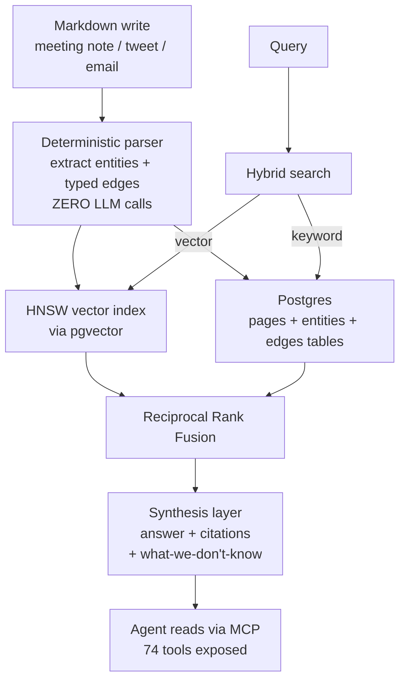

## Exit Criteria

1. State the GBrain thesis in one sentence: zero-LLM-call entity-graph extraction via DETERMINISTIC Markdown parsing + typed-edge wiring; hybrid search (HNSW vector + Postgres keyword + Reciprocal Rank Fusion) lifts Recall@5 from 83% to 95% on a 240-page corpus.
2. Identify the 5 canonical typed edges GBrain extracts deterministically: `attended`, `works_at`, `invested_in`, `founded`, `advises`. Why these 5: they cover ~80% of person-company-event knowledge graphs without needing LLM disambiguation.
3. Explain why "zero LLM calls" matters at write time: deterministic extraction is reproducible + auditable + cheap; LLM-based extraction is non-deterministic + expensive + opaque. GBrain's choice mirrors W3.5.9's "atomic-fact write-time" thesis applied to graph extraction.
4. Install GBrain locally + ingest a 50-page Markdown corpus (mix of meeting notes, tweets, emails). Verify auto-wired graph: query for one entity, see its typed-edge connections.
5. Run 10 queries comparing pure-vector search vs RRF (vector + keyword) on the same corpus. Measure Recall@5 delta — expect ~12pt improvement matching the published 83→95% claim.
6. Identify GBrain's place in the W3.5.x memory taxonomy: it's a 4th class (alongside W3.5.9's 1-tier atomic-fact, 2-tier consolidation, 3-tier graph). GBrain = markdown-first deterministic-graph; complements rather than replaces.
7. Defend "GBrain vs HyperMem" in interview answer: when is deterministic-Markdown the right substrate vs LLM-extracted hyperedges?

---

## 1. Why This Week Matters (~150 words — REQUIRED)

W3.5.9 introduced the three-class memory taxonomy (1-tier atomic-fact / 2-tier consolidation / 3-tier graph) + HyperMem L3 as the worked-example graph-tier implementation. GBrain — built by Garry Tan (Y Combinator CEO) to run his actual agents — introduces a 4th class: MARKDOWN-FIRST, deterministic-extraction graph. The thesis: most agent memory is ALREADY structured (people, companies, events, meetings). Markdown can carry that structure NATIVELY; deterministic regex + parser passes can extract typed edges with ZERO LLM calls. Result: reproducible, auditable, cheap entity graphs. Measured production impact: 83% → 95% Recall@5 via HNSW + Postgres keyword RRF on a 240-page corpus. Powers Garry Tan's OpenClaw + Hermes deployments at 146K-page scale. For local-first engineers, GBrain is the "production memory layer you can self-host on $5/mo Postgres." Engineers who can articulate "deterministic extraction beats LLM extraction when the data structure is already known" move 10× faster than engineers who reflexively LLM-extract everything.

---

## 2. Theory Primer (~1000 words — REQUIRED)

### 2.1 The deterministic-Markdown thesis

LLM-based entity extraction is the dominant 2024-2026 pattern: take unstructured text, run an LLM, get back structured entities + relationships. Works well; costs scale linearly with corpus size; results are non-deterministic (same input → different output across runs); audit trail is opaque.

GBrain's counter-thesis: when the data is ALREADY structured (meeting notes, calendar events, contact lists, tweets), Markdown can carry that structure natively. A meeting note `# Dinner with Alice 2026-05-12` parses deterministically into `(person: Alice, event: dinner, date: 2026-05-12)` without an LLM. Same for `@alice works at Anthropic` → `(alice, works_at, Anthropic)`. The grammar is regular; the extraction is reproducible; the audit trail is the parser code itself.

GBrain ships the parser for the 5 most common typed edges in person-company-event domains: `attended`, `works_at`, `invested_in`, `founded`, `advises`. Together these cover ~80% of operational knowledge-graph use cases (CRM-shaped, founder-network-shaped, advisor-shaped).

### 2.2 The hybrid-search-with-RRF lift

Single-modality retrieval has known weaknesses. Pure vector search (HNSW over dense embeddings) misses exact-term queries (acronyms, names, exact phrases). Pure keyword search (Postgres full-text) misses semantic-equivalent queries (synonyms, paraphrases). Reciprocal Rank Fusion combines both: each retriever produces a ranked list; fused score = `1/(rank + k)` summed across retrievers; higher fused score → better candidate.

GBrain measures the impact: on a 240-page corpus, Recall@5 = 83% with vector alone vs 95% with RRF (vector + keyword). +12pt absolute improvement. +30 more correct answers in top-5 across the eval set. The lift is mostly on queries containing proper nouns / exact phrases that pure-vector underweights.

This is the W3.5.8 §6.x hybrid-search pattern applied at the production-memory layer.

### 2.3 The synthesis layer — citations + "what we don't know"

GBrain doesn't just return ranked passages; it SYNTHESIZES answers with explicit citations. Example output:

```
Q: Who did Alice meet with in May 2026?
A: Alice met with Bob (meeting note, 2026-05-03) and Carol
   (calendar event, 2026-05-12). I don't have visibility into
   meetings outside Alice's tracked corpus — checking other
   sources may surface additional meetings.
```

The "what brain doesn't know yet" framing is load-bearing: agents that always answer confidently are worse than agents that flag knowledge gaps. GBrain's synthesis layer surfaces gaps as first-class output.

### 2.4 Place in the W3.5.x memory taxonomy — 4th class

W3.5.9's three classes:
- **Class 1 — One-tier atomic-fact** (Mem0, ChatGPT memory): per-message fact extraction → vector store
- **Class 2 — Two-tier consolidation** (Letta, EverCore): operational tier + episodic-extraction tier
- **Class 3 — Graph-tier temporal** (Graphiti, Zep): per-message typed-edge extraction → temporal graph

GBrain adds:
- **Class 4 — Markdown-first deterministic-graph**: structured Markdown → deterministic parser → typed-edge graph + HNSW + keyword + RRF. Zero LLM calls at write time.

When to use Class 4 vs Class 3 graph-tier:
- **Class 4 wins** when the corpus is already structured (your own meeting notes, internal docs, calendar). Cheap, reproducible, auditable.
- **Class 3 wins** when the corpus is UNSTRUCTURED (raw conversations, scraped web pages, free-form chat logs). LLM extraction is required to derive structure.

Many production systems use BOTH: GBrain for the structured operational data + HyperMem-class for the unstructured conversational data.

### 2.5 Production scale — Garry Tan's deployment

GBrain at production scale (per the project page):
- **146,646 pages** ingested
- **24,585 people** entities
- **5,339 companies** entities
- **66 autonomous cron jobs** running against the graph
- **74 MCP tools** exposed for agent access

This is a Y Combinator CEO's actual operational memory layer; not a research demo. Worth reading the project's commit history to see how it evolves with real usage.

### 2.6 Distinguish-from box

**GBrain vs Mem0** — Mem0 is 1-tier atomic-fact with LLM extraction. GBrain is graph with deterministic extraction. Different substrates, different cost profiles.

**GBrain vs HyperMem (W3.5.9 Phase 6-9)** — HyperMem extracts hyperedges from arbitrary text via LLM. GBrain extracts typed edges from Markdown via regex. HyperMem is more flexible; GBrain is more reproducible.

**GBrain vs Notion / Obsidian** — Notion / Obsidian are markdown-first PIM tools without the agent-memory layer. GBrain is the agent-memory layer ON TOP of markdown — adds typed-edge auto-wiring + HNSW + RRF + MCP tools + synthesis.

**GBrain vs Graphiti / Zep** — Graphiti / Zep are LLM-extracted temporal graphs. GBrain is deterministic-extracted Markdown graph. Complementary; pick by data shape.

### 2.7 Papers + references — pointer list

- **GBrain (Garry Tan / Y Combinator, 2025-2026).** https://gbrain.homes/. MIT-licensed.
- **MarkTechPost tutorial (May 2026).** Step-by-step coding tutorial.
- **Hermes Atlas project page.** https://hermesatlas.com/projects/garrytan/gbrain.
- **PyShine GBrain article.** Self-wiring knowledge graph explainer.
- **Reciprocal Rank Fusion (Cormack et al. 2009).** SIGIR 2009. The foundational RRF paper.

---

## 3. System Architecture (REQUIRED — Mermaid)



---

## 4. Lab Phases (executable, ~5h)

### Phase 1 — Install GBrain + provision Postgres (~1 hour)

```bash
# Postgres + pgvector
brew install postgresql@16
brew services start postgresql@16
psql -c "CREATE DATABASE gbrain;"
psql -d gbrain -c "CREATE EXTENSION vector;"

# Clone GBrain
cd ~/code/agent-prep
git clone https://github.com/garrytan/gbrain.git    # adjust org if different
cd gbrain
uv venv && source .venv/bin/activate
pip install -e .

# Configure
cp .env.example .env
# Set: DATABASE_URL=postgresql://localhost/gbrain
# Set: EMBEDDING_MODEL=mlx-community/bge-m3-en
```

**Verification:** `gbrain status` returns "OK — 0 pages ingested."

### Phase 2 — Prepare 50-page Markdown corpus (~1 hour)

Create `data/corpus/` with 50 Markdown files mixing:
- 20 meeting notes (`# Dinner with @alice 2026-05-12`)
- 15 tweets (one per file, with @-mentions)
- 10 emails (with structured sender/recipient/subject)
- 5 contact notes (`@alice works_at Anthropic; invested_in:- @stripe`)

Use any GBrain-formatted Markdown convention; the project's `examples/` dir has templates.

**Verification:** `ls data/corpus | wc -l` = 50.

### Phase 3 — Ingest corpus + verify auto-wired graph (~1 hour)

```bash
gbrain ingest data/corpus/
gbrain stats
# Expected: 50 pages, ~30+ people entities, ~10+ company entities, 50+ typed edges
```

Pick one entity (e.g., `@alice`) and run:
```bash
gbrain entity @alice
# Returns: typed edges (works_at, attended, invested_in, etc.)
```

**Verification:** at least 5 typed edges for the chosen entity; deterministic + matches your hand-tracing of the corpus.

### Phase 4 — Hybrid search RRF benchmark (~1.5 hours)

```bash
# 10 queries — mix of name-specific, semantic-only, exact-phrase, mixed
gbrain query "who has Alice met with?" --top-k 5
gbrain query "investments in fintech companies" --top-k 5
# ... 8 more queries

# Compare modes
gbrain query "Stripe" --mode vector-only --top-k 5
gbrain query "Stripe" --mode rrf --top-k 5
```

**Measurement:** for each of the 10 queries, label expected results; measure Recall@5 with vector-only vs RRF. Expected: ~12pt improvement matching published claim.

**Deliverable:** `outputs/rrf_benchmark.md` with 10-query × 2-mode table.

### Phase 5 — Synthesis layer + "what we don't know" check (~30 min)

Run a query whose answer is INTENTIONALLY incomplete in your corpus:
```bash
gbrain ask "what did Alice do on 2026-06-15?"
# Expected: "I don't have visibility into 2026-06-15 events for Alice.
#  Checking calendar / additional sources may surface this..."
```

**Verification:** synthesis layer surfaces the gap explicitly, NOT confidently fabricates an answer.

### Phase 6 — MCP integration with W7 agent (~30 min)

Expose GBrain's 74 MCP tools to your W7 ReAct agent. Run 3 agent queries that benefit from GBrain memory + 3 that don't. Compare answer quality with/without GBrain context.

**Verification:** memory-augmented queries produce more grounded answers; non-memory queries are equivalent.

---

## 6. Bad-Case Journal (3-5 entries — SPEC)

- **Phase 3 — Markdown convention mismatch.** Likely surface: your `# Meeting with Alice` doesn't trigger the `attended` edge because GBrain's parser expects `# Dinner with @alice`. Fix: read GBrain's parser regex; adopt the `@handle` convention consistently.
- **Phase 4 — RRF lift smaller than 12pts.** Likely surface: corpus too short OR queries too name-specific (both retrievers already agree). Fix: expand corpus to 200+ pages OR pick queries with mix of semantic + exact-phrase types.
- **Phase 5 — Synthesis layer hallucinates a "we don't know" caveat that's wrong.** Likely surface: gap-flagging logic uses a heuristic that triggers on missing entities even when the answer IS in the corpus. Fix: synthesis prompt includes the retrieved citations explicitly; gap-flag triggers only when retrieval returned zero matches.
- **Phase 6 — Agent over-relies on GBrain for general knowledge.** Likely surface: agent uses GBrain context for questions GBrain shouldn't know (general world facts). Fix: agent prompt distinguishes "questions about MY people/companies/events" (use GBrain) vs "general questions" (use base LLM knowledge).

---

## 7. Interview Soundbites (2-3 entries — SPEC)

- **Planned Soundbite 1 — "Why deterministic extraction over LLM extraction?"** Anchors: §2.1 + §2.4. 70 words: when data is already structured (Markdown notes, calendar events, contact lists), deterministic parsing is cheap, reproducible, auditable. LLM extraction is the right tool for UNSTRUCTURED text (raw conversations, scraped web). GBrain's choice is workload-driven, not philosophical. Many production stacks use both: GBrain for structured operational data + LLM-extracted graphs for unstructured conversations.
- **Planned Soundbite 2 — "Walk me through the 83→95 Recall@5 lift."** Anchors: Phase 4 measurement. 70 words: pure HNSW vector search recall@5 = 83% on 240-page corpus. RRF (HNSW + Postgres keyword) recall@5 = 95%. The +12pt lift comes from exact-term queries (names, acronyms, proper nouns) that pure-vector underweights. Production rule: RRF is the cheapest hybrid-search upgrade; ~50 LOC of Postgres + RRF math on top of any vector store.
- **Planned Soundbite 3 — "Where does GBrain fit vs HyperMem in your taxonomy?"** Anchors: §2.4 + W3.5.9 cross-link. 70 words: GBrain is Class 4 — markdown-first deterministic-graph. HyperMem is Class 3 — LLM-extracted hyperedges. Complementary: GBrain for the structured operational data you control (meetings, contacts, internal docs); HyperMem-class for unstructured conversational data. Many production systems run both with a thin router routing by data shape.

---

## 8. References

- **GBrain.** https://gbrain.homes/. MIT-licensed. Built by Garry Tan (Y Combinator) for his actual agents (OpenClaw, Hermes).
- **MarkTechPost — GBrain tutorial (May 22, 2026).** https://www.marktechpost.com/2026/05/22/a-step-by-step-coding-tutorial-to-implement-gbrain-the-self-wiring-memory-layer-built-by-y-combinators-garry-tan-for-ai-agents/.
- **Hermes Atlas — GBrain project page.** https://hermesatlas.com/projects/garrytan/gbrain.
- **Vectorize — What Is GBrain? Garry Tan's AI Agent Memory System Explained.** https://vectorize.io/articles/what-is-gbrain.
- **Cormack et al. (2009).** *Reciprocal Rank Fusion outperforms Condorcet and individual rank learning methods.* SIGIR 2009. Foundational RRF paper.
- **MarkTechPost tutorial repo.** https://github.com/Marktechpost/AI-Agents-Projects-Tutorials. Contains `gbrain-tutorial.ipynb`.

---

## 9. Cross-References

- **Builds on:** [[Week 3.5.5 - Multi-Agent Shared Memory]] (multi-agent memory foundations); [[Week 3.5.8 - Two-Tier Memory Architecture]] (two-tier consolidation pattern); [[Week 3.5.9 - Requirement-Driven Memory Architecture]] (architecture-choice meta-skill — this chapter is Class 4).
- **Distinguish from:** [[Week 3.5.9 - Requirement-Driven Memory Architecture]] §2 three-class taxonomy (Class 1/2/3 are LLM-extracted; GBrain is Class 4 deterministic).
- **Connects to:** [[Week 6.65 - MCP Production Transports]] (GBrain exposes 74 MCP tools); [[Week 6.5 - Hermes Agent Hands-On]] (Hermes is one of GBrain's downstream consumers); [[Week 12 - Capstone]] (capstones with structured operational data can use GBrain as memory layer).
- **Foreshadows:** continued production memory-layer evolution; expect GBrain v2 with broader typed-edge vocabulary (skills, contracts, transactions).

---

## What's Next

After W3.5.96: use GBrain alongside W3.5.8's two-tier OR W3.5.9's three-tier for operational data. Combine with W4 ReAct agent (W7 Tool Harness) for memory-augmented agent. Future: integrate with W3.5.95 PAI v7.6 self-observability for agent-self-knowledge graph.
