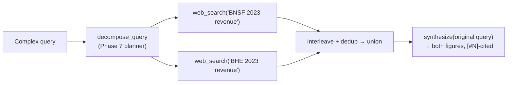

# Web-Fallback Decomposition Debug Log

> A debugging arc that started as *"why didn't my RAG do a web search?"* and ended with
> three real fixes — query-fan-out, result interleaving, and a metasearch backend — plus
> one corrected wrong conclusion of my own. Companion to [[Week 3.7 - Agentic RAG]] §3.3 /
> Phase 6. Every number here is traced to a runnable probe, not prose.

## The symptom

Testing the live MCP server in Claude Desktop:

```
Use agentic-rag to answer: Compare BNSF Railway and Berkshire Energy 2023 revenue.
```

`rag_query` returned `"I don't know"`. Claude then answered from its **own training memory**
(`BNSF ≈ $23.9B`, `BHE ≈ $26.0B`) and *offered* to search the web — making it look like the
RAG had skipped web search entirely.

## Layered diagnosis — three questions, three different fixes

The single symptom ("I don't know") hid three independent layers. Running probes separated
them; stopping at layer 1 would have debugged the wrong thing.

| Layer | Question | Probe finding |
|-------|----------|---------------|
| 1 | Did the web fallback **run**? | **Yes** — `source: web`, `next_action.executed: True`, `web_error: None` |
| 2 | Did web **return docs**? | **Yes** — 4 docs (Tavily) |
| 3 | Did those docs **contain the answer**? | **No** — for the *comparison* phrasing, no single passage held both figures |

And a fourth, separate finding about the **host**, not the pipeline:

> The numbers Claude showed (`$26.0B`) did **not** come from the tool. The tool returned
> `"I don't know"`. The host model **overrode the abstaining tool with parametric memory** —
> and flagged it itself ("working from memory rather than the document"). This is exactly the
> judgment-atrophy failure mode: a confident answer that *looks* grounded but isn't.

```mermaid
flowchart TD
  S["symptom: 'I don't know'<br/>+ host gives $26.0B from memory"] --> L1{"web ran?"}
  L1 -->|"yes (source=web)"| L2{"web returned docs?"}
  L2 -->|"yes (4 docs)"| L3{"docs contain<br/>BOTH figures?"}
  L3 -->|"no — single-shot<br/>comparison search"| ABS["synthesize() correctly<br/>abstains (no fabrication)"]
  S -.->|"separate issue"| HOST["host bypassed tool,<br/>answered from memory"]
  classDef bad fill:#fde,stroke:#c44; classDef ok fill:#dfd,stroke:#4a4
  class ABS ok; class HOST bad
```

## Probe evidence — single-shot vs atomic

The comparison query failed, but its **atomic** sub-queries each grounded cleanly (Tavily):

```
Q: "BNSF Railway 2023 annual revenue"
   source=web → "$23.876 billion, an 8% decrease from 2022 [#1]"   ✓
Q: "Berkshire Hathaway Energy 2023 annual revenue"
   source=web → web ran, but top doc is a paywalled Statista snippet ("**** billion")   ✗
Q: "Compare BNSF Railway and Berkshire Energy 2023 revenue"
   source=web → "I don't know"   ✗ (no single passage holds both)
```

**Conclusion:** the bottleneck is *query shape* and *passage content*, not connectivity. A
"compare X and Y" question is a doomed single web search; two atomic lookups are not.

## Fix 1 — observability (`mcp_server.py`)

`rag_query` didn't return `source`, so the host couldn't tell web had already run and
re-offered it. Added `source` + `web_docs_found` to the tool's return — the orchestrating
model now reasons from the actual path, not a guess.

## Fix 2 — fan out the web fallback (`web_search_planned`)

The corpus path already decomposed (gated behind `ENABLE_DECOMPOSITION=1` via `execute_plan`),
but the **web fallback searched the original `query` as one shot**. The fix: when
`decide_complexity` labels a query Complex, decompose into atomic sub-queries and web-search
each `lookup` independently, then union the passages — the same idea as the corpus fan-out,
applied on the *web* surface because out-of-corpus answers live on the web.



Result: BNSF went from **total abstain → `$23.876 billion [#1]`**, cited. The architecture was
correct; the second entity was still weak — which surfaced the next bug.

## Fix 3 — interleave the fan-out results (fairness)

Appending *all* of sub-query-1's docs, then *all* of sub-query-2's, biases every comparison:
`synthesize()` caps passages at 8000 chars, so the **second entity gets truncated out**. Fix:
**round-robin interleave** (`q1d1, q2d1, q1d2, q2d2, …`) so both entities sit near the top.
Measured effect: BHE's best doc moved from `[#7]` → `[#2]` across the two runs. A real bug I'd
*introduced* by doubling the doc count — not a tuning knob.

## The wrong conclusion (and its correction)

After Tavily and DuckDuckGo *both* failed to ground BHE, I concluded:

> *"The bottleneck is the source, not the engine — engine swap ruled out."*

**This was wrong, and SearXNG proved it.** BHE's figure was on a free page the whole time —
**Wikipedia, `US$26.198 billion`, plain text**. Tavily and DDG both ranked Statista's
*paywalled* snippet above Wikipedia, so I never saw it and wrongly inferred a hard ceiling.
Two retrievers that **share ranking signals** failing the same way is *not* independent
confirmation of "unreachable" — it's one bias sampled twice.

## Fix 4 — SearXNG metasearch backend

A local [SearXNG](https://github.com/searxng/searxng) instance aggregates Google + Startpage
and **reranks**, floating Wikipedia above the paywall snippet. Wired in as the top of the
`web_search` precedence chain (free, no key):

```
web_search backend precedence:  SEARXNG_URL  →  TAVILY_API_KEY  →  DuckDuckGo
```

With SearXNG, the comparison query grounds **both** figures, both cited:

```
* For 2023, BNSF reported revenues of $23.876 billion, down 8% from 2022 [#5].
* Berkshire Hathaway Energy's revenue is listed as US$26.198 billion [#4].
```

`k` sensitivity: the authoritative free source ranks ~3rd–4th, so per-sub-query depth
`WEB_FANOUT_K` defaults to **8** (at 6 the synthesizer settled for an imprecise `$25.6B`).

## Measured before → after

| Backend / path | BNSF 2023 | BHE 2023 | Outcome |
|---|---|---|---|
| Tavily, single-shot comparison | — | — | full `I don't know` |
| Tavily, fan-out (k=6) | `$23.876B` ✓ | `**** billion` (paywall) | half-grounded |
| DuckDuckGo, fan-out | `$23.876B` ✓ | `I don't know` | worse (DDG dropped BHE) |
| **SearXNG, fan-out (k=8)** | **`$23.876B` ✓** | **`US$26.198B` ✓** | **both grounded + cited** |

Single-entity regression check (`"Who is the CEO of OpenAI as of 2026?"`): fan-out correctly
stayed `single` (Simple query → no decompose) → `"Sam Altman [#1,#2,#4,#5,#7]"`. No regression.

*Numbers from `src/baseline_handrolled.py` probes run 2026-06-11 against a live SearXNG on
`:8080`; BHE Wikipedia figure from the SearXNG JSON `content` field. This is a representative
run — live web ranking is **non-deterministic**, so repeat calls reorder results and a given run
may cite a weaker source (a later probe surfaced a `$23.35B` 2024-corporate BNSF figure and a
wrong BHE sub-segment). SearXNG makes the authoritative free source **reachable in the top-k**,
not **guaranteed first**; the pipeline grounds whatever the top passages contain and abstains
rather than fabricates when they're thin — which is the property you want.*

## Transferable lessons

1. **One symptom, many layers.** "I don't know" meant *ran? returned docs? contained the
   answer?* — three independent fixes. Separate them with probes before touching code.
2. **Tool results must expose the path taken.** A missing `source` field made the host
   re-offer a step already done. Return *what ran*, not just the final string.
3. **Honest partial > confident hallucination.** The tool abstained on a figure it couldn't
   ground; the *host* fabricated it from memory. The tool was right. Grounding that refuses to
   fabricate is the property you want — verify the host doesn't undo it.
4. **Decomposition belongs on whichever surface holds the answer** — corpus *or* web. Fan out
   the retriever that can actually reach the fact.
5. **Two engines failing the same way ≠ a hard ceiling** if they share a backend. A metasearch
   that aggregates + reranks is an independent third sample. (My wrong "engine swap ruled out"
   was caught only by *running* the third engine, not by reasoning.)
6. **Watch for bugs you introduce while fixing one.** Doubling docs under a fixed passage cap
   silently truncated entity #2 — interleaving restored fairness.

## Files changed

- `src/baseline_handrolled.py` — `_searxng_search`, 3-tier `web_search`, `web_search_planned`
  (decompose + interleave), rewired `answer()` web fallback, `WEB_FANOUT_K` (default 8).
- `src/mcp_server.py` — `rag_query` returns `source` + `web_docs_found`.
- `searxng/` — `docker-compose.yml`, `settings.yml`, `README.md` (free local backend).
- `.env.example`, `mcp-config.json` — `SEARXNG_URL` documented in the precedence chain.

## Navigation

- Parent chapter: [[Week 3.7 - Agentic RAG]] (§3.3 hand-rolled CRAG, Phase 6 baseline, Phase 7 decomposition)
