# Week 3.7 — Agentic RAG (LangGraph-Canonical Architecture)

> Goal: Build the production successor to Week 3's single-pass RAG. Implement the canonical 5-node Agentic RAG graph (decide → retrieve → grade → rewrite → answer), measure the lift on ambiguous queries, and learn when the cost is worth it. Walk out with a published-vocabulary command of the field's named architectures (CRAG, Adaptive-RAG, GeAR) and the survey-paper taxonomy.

**Exit criteria.**
- [ ] LangChain's official `langgraph_agentic_rag.ipynb` notebook running end-to-end on your Week 1 corpus + Qdrant + BGE-M3
- [ ] Comparison harness measuring Week 3's single-pass RAG vs the 5-node Agentic RAG on the same 50-Q dev set
- [ ] Quantified lift on ambiguous queries specifically (faithfulness + context-recall delta)
- [ ] One CRAG (Corrective RAG) variant implemented with confidence-threshold + web-fallback
- [ ] `RESULTS.md` with comparison matrix + decision tree ("when does Agentic RAG help vs hurt?")
- [ ] You can name the 7 architectures from the Singh et al. survey + the 4 canonical papers (CRAG / Adaptive-RAG / GeAR / Agent-G) cold

---

## Why This Week Matters

Week 3 teaches single-pass RAG — the linear pipeline (dense retrieve → rerank → compress → synthesize) that dominates most production tutorials. But single-pass has a hard limitation: when retrieval fails on ambiguous queries, the whole system fails. There is no recovery path. This expansion week teaches the production-default successor: Agentic RAG, a 5-node graph where the agent itself judges retrieval relevance, rewrites queries when needed, and loops until confident or budgeted. The canonical shape is now standard across LangChain 1.0, LlamaIndex, and every production RAG system published in 2025–2026. In interviews, the distinction matters: candidates who know "RAG" at the 2024 single-pass level answer differently from candidates who can articulate why Agentic RAG costs 2–4× latency but earns graceful degradation on hard queries. This week is lighter than main weeks (6–8 hours vs 12–15) because most infrastructure reuses your Week 1–3 artifacts. What is new is the graph topology, the grading node, and the empirical comparison showing *when* the cost is worth it. You measure the lift on ambiguous queries specifically and walk out able to defend the architecture choice in production decisions, not just tutorials.

---

## Why This Expansion Week Exists

Week 3 builds a single-pass RAG pipeline (dense retrieve → rerank → compress → synthesize) and measures it with RAGAS. That's the right baseline to learn first because every more-sophisticated pattern is *defined relative to it*. But single-pass is no longer the production default for any RAG system that needs to handle ambiguous queries or recover gracefully from bad retrieval.

The current production default — what every "Agentic RAG" tutorial, every LangChain doc, every 1.6k-star survey paper now describes — is a graph of agent nodes that **grade their own retrieval, rewrite their own queries when retrieval fails, and loop until they're confident or hit a budget**. Week 5 teaches the general orchestrator-worker / reflexion patterns; Week 3.7 teaches the specific specialization of those patterns to retrieval. **Agentic RAG is the bridge** between Week 3's RAG fundamentals and Week 5's agent patterns. Without this week, the curriculum has a gap where Reddit threads, LangChain docs, and survey papers all converge on "the obvious next thing" — and your interview answer for "tell me about RAG in production" stays stuck in 2024.

The week is **optional**: skip if your Q1 timeline is tight, revisit anytime in Q2 (per Appendix G's quarterly cadence map). It is **lighter than main weeks** — 6–8 hours rather than 12–15 — because most of the implementation reuses your Week 1–3 artifacts (corpus, Qdrant collection, dev set, RAGAS harness). What's new is the graph topology, the grading node, and the comparison.

---

## Architecture — The Canonical 5-Node Agentic RAG Graph

The reference architecture per [LangChain's official docs](https://docs.langchain.com/oss/python/langgraph/agentic-rag):

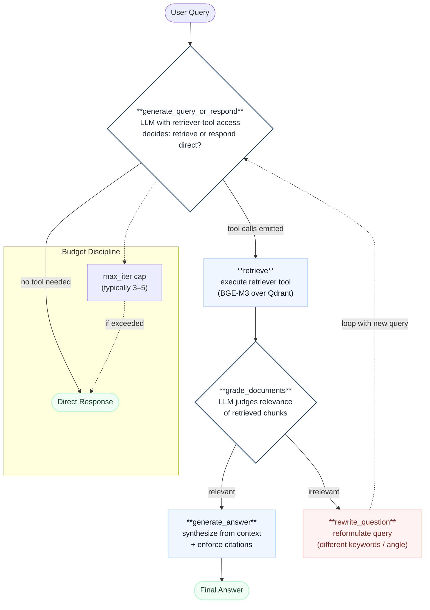

**Reading the diagram:** the **two diamonds** are the agent decision points (decide-to-retrieve, grade-relevance) — these are what make it "agentic" rather than fixed-pipeline. The **red rewrite node** is the recovery path that single-pass RAG doesn't have. The **dashed iteration loop** is bounded by `max_iter` (the only thing standing between the agent and an infinite query-rewrite spiral). Compare this to your Week 3 baseline, which is purely linear: query → retrieve → rerank → compress → answer, with no grading, no loop, no recovery.

---

## Theory Primer (~45 min)

> Three concepts. Lighter than main-week primers because the lab itself is the teacher this week — running the canonical notebook teaches more than reading prose.

### Concept 1 — The Canonical 5-Node Architecture (LangChain's Production Default)

[LangChain's official Agentic RAG documentation](https://docs.langchain.com/oss/python/langgraph/agentic-rag) defines the production-canonical graph as exactly five nodes, each with a single responsibility. The shape is small enough to memorize, opinionated enough to be defensible in interviews:

1. **`generate_query_or_respond`** — first-line decision node. The LLM, given the user query and access to the retriever as a tool, decides whether retrieval is needed at all. For a query like "what's 2 + 2," it answers directly without retrieval. For "what does our refund policy say about international orders," it emits a tool call to the retriever. This is the node that prevents wasteful retrieval on unambiguously knowable answers.

2. **`retrieve`** — executes the retriever tool. Same dense+rerank stack from Weeks 1–2 (BGE-M3 over Qdrant + BGE-reranker). No agentic logic here; this is a pure tool execution node.

3. **`grade_documents`** — the relevance-grading node. Given the retrieved chunks and the original query, an LLM judges: are these documents actually relevant? Returns binary or graded. This is the **critical addition over single-pass RAG** — without grading, the agent has no signal that retrieval failed.

4. **`rewrite_question`** — the recovery path. When `grade_documents` says "no, these docs don't help," the rewriter reformulates the query (often using a different angle, broader keywords, or a HyDE-style hypothesized answer) and the graph loops back to `generate_query_or_respond`. Without this node, bad retrieval = bad answer; with it, bad retrieval triggers a recovery attempt.

5. **`generate_answer`** — the terminal synthesis node. Given the validated relevant context, produces the final answer with citations. Same shape as Week 3's synthesis stage, just gated by upstream relevance checking.

The implementation in LangGraph is a `StateGraph(MessagesState)` with conditional edges routed by `tools_condition` (whether the LLM emitted a tool call) and custom grading logic (whether documents pass relevance threshold). The whole graph fits in ~150 lines of Python — small enough that you'll read every node in Phase 1.

> **Interview soundbite:** "The canonical Agentic RAG architecture is five nodes — decide-to-retrieve, retrieve, grade, rewrite, answer — with a loop from rewrite back to decide. The two LLM-decision nodes are what make it agentic; the rewrite loop is what makes it production-grade. Compared to single-pass RAG, you get graceful recovery from bad retrieval at the cost of 2–4× latency and LLM calls."

---

### Concept 2 — The 7-Architecture Taxonomy (Singh et al. Feb 2025)

The [AgenticRAG-Survey](https://github.com/asinghcsu/AgenticRAG-Survey) paper (Aditi Singh, Abul Ehtesham, Saket Kumar, Tala Talaei Khoei, Feb 2025, 1.6k⭐) is the canonical taxonomy reference. It identifies **seven major architecture families**:

| #   | Architecture                         | One-line description                                                                                                                | When it wins                                                                                                     |
| --- | ------------------------------------ | ----------------------------------------------------------------------------------------------------------------------------------- | ---------------------------------------------------------------------------------------------------------------- |
| 1   | **Single-agent RAG**                 | The 5-node canonical (Concept 1 above)                                                                                              | Default for most production systems                                                                              |
| 2   | **Multi-agent RAG**                  | Multiple specialist agents (researcher / synthesizer / critic) collaborating on retrieval                                           | Genuinely complex queries needing role-specialized retrieval (e.g., legal + technical + financial sub-questions) |
| 3   | **Hierarchical agentic RAG**         | Tree of agents — coordinator delegates to sub-coordinators which delegate to workers                                                | Very large knowledge bases (>10M docs) where a single retriever scope is too broad                               |
| 4   | **Corrective agentic RAG (CRAG)**    | Adds a confidence threshold — when retrieved docs score below threshold, falls back to web search or alternative source             | Open-domain questions where local corpus may not have the answer                                                 |
| 5   | **Adaptive agentic RAG**             | Dynamically picks retrieval strategy based on question complexity (no retrieval / single-step / multi-step)                         | Mixed query workloads — some simple, some complex, system shouldn't pay multi-step cost on simple                |
| 6   | **Graph-based agentic RAG**          | Combines GraphRAG (Week 2.5) with agent loop — agent traverses knowledge graph, decides next hop                                    | Highly relational corpora (org charts, research citation networks, code dependencies)                            |
| 7   | **Agentic Document Workflows (ADW)** | Document-centric — agent processes individual documents through a multi-step workflow (extract → enrich → cross-reference → output) | Document-heavy workflows like contract review, research synthesis, regulatory filings                            |

**The three you must know cold for interviews:** single-agent (Concept 1, the default), CRAG (#4, the most-cited confidence-recovery pattern), Adaptive-RAG (#5, the most-cited efficiency-routing pattern). The other four are situational; name them as "see the Singh survey for the full taxonomy."

> **Interview soundbite:** "Agentic RAG isn't one architecture, it's seven — the Singh 2025 survey is the canonical taxonomy. The three you reach for most often are the single-agent canonical, Corrective RAG (CRAG) when local corpus may miss the answer, and Adaptive-RAG when query complexity varies enough that one-size-fits-all retrieval wastes compute on simple queries."

---

### Concept 3 — The Three Canonical Papers Worth Knowing by arXiv ID

Three named-paper architectures show up in the survey, in production tutorials, and in interviews — knowing them by arXiv ID and one-line claim is high-leverage interview signal.

**Corrective Retrieval Augmented Generation (CRAG) — [arXiv 2401.15884](https://arxiv.org/abs/2401.15884) (Yan et al. Jan 2024).** The thesis: dense retrieval is *brittle on out-of-distribution queries* — it returns results regardless of whether they're actually relevant, and downstream synthesis amplifies the brittleness. CRAG adds a *retrieval evaluator* (lightweight classifier scoring retrieved docs) that produces three buckets: Correct (use as-is), Incorrect (discard, fall back to web search), Ambiguous (combine local + web). The architectural addition is small (one classifier + one fallback path) but the impact on out-of-domain robustness is large. CRAG is the most-cited "make my RAG less wrong" paper of 2024–2025.

**Adaptive-RAG: Learning to Adapt through Question Complexity — [arXiv 2403.14403](https://arxiv.org/abs/2403.14403) (Jeong et al. Mar 2024).** The thesis: not every question deserves the same retrieval effort. A trained classifier routes queries to one of three strategies: (A) no retrieval — model knows the answer; (B) single-step retrieval — Week 3 baseline; (C) multi-step retrieval — full agentic loop. Saves significant compute on simple queries while preserving quality on complex ones. Adaptive-RAG is the canonical paper for "when you can't afford full Agentic RAG on every query."

**GeAR: Graph-enhanced Agent for Retrieval-augmented Generation — [arXiv 2412.18431](https://arxiv.org/abs/2412.18431) (Dec 2024).** The thesis: combining knowledge graph traversal with the agent loop produces stronger multi-hop reasoning than either alone. Maps directly onto Week 2.5's GraphRAG content but adds the agent decision-loop on top. GeAR is the most-cited "GraphRAG + agents" hybrid paper.

A fourth paper worth naming when asked about multi-agent RAG specifically: **Agent-G** (multi-agent framework for graph-augmented retrieval, exact arXiv ID varies by version). Less canonical than the three above but appears in survey citations.

> **Interview soundbite:** "The three canonical Agentic RAG papers I'd name are CRAG (arXiv 2401.15884) for confidence-aware retrieval with web fallback, Adaptive-RAG (arXiv 2403.14403) for complexity-based routing, and GeAR (arXiv 2412.18431) for graph-augmented multi-hop. Each names a specific failure mode of single-pass RAG and a specific architectural fix; together they're the 2024–2025 canon."

---

### Companion Texts

- **[LangChain official Agentic RAG docs](https://docs.langchain.com/oss/python/langgraph/agentic-rag)** — the canonical 5-node architecture; runnable example notebook linked from there
- **[asinghcsu/AgenticRAG-Survey](https://github.com/asinghcsu/AgenticRAG-Survey)** (Singh et al. Feb 2025, 1.6k⭐) — the 7-architecture taxonomy reference
- **[langgraph/examples/rag/langgraph_agentic_rag.ipynb](https://github.com/langchain-ai/langgraph/blob/main/examples/rag/langgraph_agentic_rag.ipynb)** — official runnable notebook
- **[GiovanniPasq/agentic-rag-for-dummies](https://github.com/GiovanniPasq/agentic-rag-for-dummies)** — minimal LangGraph implementation, good study target if the official one feels too dense
- **[nicoladisabato/MultiAgenticRAG](https://github.com/nicoladisabato/MultiAgenticRAG)** — multi-agent variant for the curious
- **[jamwithai/production-agentic-rag-course](https://github.com/jamwithai/production-agentic-rag-course)** — full course material; useful for Phase 4 production-discipline grounding
- **CRAG paper — [arXiv 2401.15884](https://arxiv.org/abs/2401.15884)** — read sections 3–4 for the architecture, skim section 5 for benchmarks
- **Adaptive-RAG paper — [arXiv 2403.14403](https://arxiv.org/abs/2403.14403)** — section 3 for the complexity classifier, section 4 for the routing logic
- **Cross-curriculum**: revisit Week 3's RAGAS harness (you'll reuse it for the comparison) and Week 5's orchestrator-worker pattern (Agentic RAG is a specific application of it)

---

## Phase 1 — Run the LangChain Canonical Notebook (~1.5 hours)

### 1.1 Lab scaffold

```bash
mkdir -p ~/code/agent-prep/lab-03.7-agentic-rag
cd ~/code/agent-prep/lab-03.7-agentic-rag
mkdir -p src observations results data
git init
```

### 1.2 Install LangGraph + dependencies

Reuse your project venv from Week 0:

```bash
source ~/code/agent-prep/.venv/bin/activate
uv pip install -U langchain langgraph langchain-openai langchain-community langchain-qdrant
```

### 1.3 Get the notebook, prepare `.env`, and register the kernel

**Get the notebook** - two routes, same destination (`langgraph_agentic_rag.ipynb`):

```bash
cd ~/code/agent-prep/lab-03.7-agentic-rag

# (a) the canonical UPSTREAM notebook (OpenAI-wired) — you then apply the §1.4 edits yourself:
curl -sL https://raw.githubusercontent.com/langchain-ai/langgraph/main/examples/rag/langgraph_agentic_rag.ipynb -o langgraph_agentic_rag.ipynb

# (b) OR the ALREADY-ADAPTED version shipped in this curriculum's lab repo (local oMLX + Qdrant,
#     no OpenAI) — lives at lab-03.7-agentic-rag/langgraph_agentic_rag.ipynb in github.com/shaneliuyx/agent-prep
```

Use (a) if you want to see the OpenAI→local diff with your own eyes (that diff *is* §1.4); use (b) to run immediately.

**Install deps into the lab's OWN `uv` venv.** Labs are per-directory `uv` projects (`agent-prep/CLAUDE.md`), so the notebook runs in the *lab's* `.venv`, **not** the Week-0 root venv:

```bash
cd ~/code/agent-prep/lab-03.7-agentic-rag
uv sync                                                                  # this lab's deps
uv pip install -U langchain langchain-core langchain-openai langgraph python-dotenv qdrant-client
# Retrieval reuses shared/rag_hybrid (sentence-transformers + FlagEmbedding + BGE-M3),
# already present in the lab venv. No chromadb / langchainhub / OpenAI needed.
```

**Prepare `.env` - REQUIRED.** The notebook reads oMLX + Qdrant settings from `.env`, and there is **no `.env` until you create one**. Skipping this is the #1 cause of a `401 Invalid API key` at the `agent` node (the key silently falls back to a placeholder oMLX rejects):

```bash
cp .env.example .env       # then set the values below
```

```bash
# ~/code/agent-prep/lab-03.7-agentic-rag/.env   (GITIGNORED — never commit it)
OMLX_BASE_URL=http://localhost:8000/v1
OMLX_API_KEY=not-needed            # oMLX with auth OFF accepts any non-empty string;
                                   # set your real key here ONLY if you enabled oMLX auth
MODEL_SONNET=gemma-4-26B-A4B-it-heretic-4bit   # any tool-calling-capable oMLX model id
QDRANT_URL=http://127.0.0.1:6333
QDRANT_COLLECTION=bge_m3_hnsw      # your Week-1 collection (BGE-M3, 1024-d dense)
```

> [!warning] `.env` hygiene - learned the hard way
> Keep the key in `.env` only (it's gitignored). **Never hardcode it as a literal or `getenv` default** in the notebook or chapter - an earlier draft did, and the value had to be purged from public git history with `git filter-repo` and the oMLX key rotated. If oMLX auth is off, `not-needed` is fine; if on, the key is a real secret - env only.

**Register the lab venv as a Jupyter kernel - REQUIRED.** Jupyter/VS Code must execute the notebook in the lab venv (which carries `rag_hybrid`'s ML deps); a generic kernel gives `ModuleNotFoundError: sentence_transformers` in the retriever cell:

```bash
uv run python -m ipykernel install --user \
  --name lab-03-7-agentic-rag --display-name "Python (lab-03.7-agentic-rag)"
```

Then in Jupyter / VS Code, **select the "Python (lab-03.7-agentic-rag)" kernel** before running any cell.

> [!tip] The two pre-flight checks that prevent the only two errors everyone hits
> 1. **No `.env`** → `401 Invalid API key` at the `agent` node → create the `.env` above.
> 2. **Wrong kernel** → `ModuleNotFoundError: sentence_transformers` in the retriever cell → select the lab kernel above.
> Run the notebook's setup cell first; it should print `LLM -> http://localhost:8000/v1 ...` and `Qdrant -> http://127.0.0.1:6333 collection=bge_m3_hnsw`.

### 1.4 Adapt for local oMLX + your Week 1 Qdrant collection

The canonical notebook uses **OpenAI in three places** — the chat model in *every* node (`gpt-4o`/`gpt-4-turbo`/`gpt-3.5`), the embeddings, and a Chroma store it builds from 3 blog posts. Reusing your local assets means editing those cells in `langgraph_agentic_rag.ipynb` **directly** — a single drop-in `.py` does not work, because the notebook's retriever and per-node LLM calls are spread across several cells (see the walkthrough). Three swaps.

**(1) Setup cell — point the LLM at local oMLX (no OpenAI key, env-driven):**

```python
import os, sys
from dotenv import load_dotenv
load_dotenv(os.path.expanduser("~/code/agent-prep/lab-03.7-agentic-rag/.env"))
sys.path.insert(0, os.path.expanduser("~/code/agent-prep/shared"))   # for rag_hybrid

from langchain_openai import ChatOpenAI
LLM_BASE_URL = os.getenv("LLM_BASE_URL") or os.getenv("OMLX_BASE_URL", "http://localhost:8000/v1")
LLM_API_KEY  = os.getenv("LLM_API_KEY")  or os.getenv("OMLX_API_KEY", "not-needed")
LLM_MODEL    = os.getenv("LLM_MODEL")    or os.getenv("MODEL_SONNET", "gemma-4-26B-A4B-it-heretic-4bit")
os.environ.setdefault("OPENAI_API_KEY", LLM_API_KEY)   # langchain still wants *a* key

def _llm(**kw):                                          # one client, reused by every node
    return ChatOpenAI(base_url=LLM_BASE_URL, api_key=LLM_API_KEY, model=LLM_MODEL, temperature=0, **kw)
```

**(2) Retriever cell — reuse the existing `bge_m3_hnsw` collection via `rag_hybrid` (NOT `QdrantVectorStore`):**

```python
from qdrant_client import QdrantClient
from rag_hybrid import BGE_M3, BGE_RERANKER_V2_M3, CrossEncoderReranker, DenseEncoder, autoconfig

_qdrant   = QdrantClient(url=os.getenv("QDRANT_URL", "http://127.0.0.1:6333"), timeout=60)
_encoder  = DenseEncoder(autoconfig.encoder_config_for(BGE_M3))        # the SAME encoder that indexed
_reranker = CrossEncoderReranker(autoconfig.recommend(BGE_M3, BGE_RERANKER_V2_M3).reranker)
QDRANT_COLLECTION = os.getenv("QDRANT_COLLECTION", "bge_m3_hnsw")

def retrieve_passages(query, k=4, pool=30):
    qv  = _encoder.encode([query])[0]
    pts = _qdrant.query_points(QDRANT_COLLECTION, query=qv.tolist(), limit=pool, with_payload=True).points
    return [t for _doc_id, t, _score in _reranker.rerank(query, pts, top_k=k)]   # 2-stage: dense -> rerank
```

**(3) Tool + nodes — wrap retrieval as a tool, route every node through `_llm()`:**

```python
from langchain_core.tools import tool

@tool
def retrieve_corpus(query: str) -> str:
    """Search the local corpus and return the most relevant passages."""
    p = retrieve_passages(query, k=4)
    return "\n\n".join(p) if p else "No relevant documents found."
tools = [retrieve_corpus]

# In each graph node: replace ChatOpenAI(model="gpt-4o"/...) with _llm();
# replace grade's .with_structured_output(grade) with a bare 'yes'/'no' prompt parsed in Python;
# replace generate's hub.pull("rlm/rag-prompt") with an inline PromptTemplate (no network).
```

### Code walkthrough

**Why `QdrantVectorStore` (the obvious choice) does NOT work here — the core gotcha.** `bge_m3_hnsw` was built in Week 1 by `shared/rag_hybrid` — an *unnamed* 1024-d dense vector with payload `{doc_id, text}`. LangChain's `QdrantVectorStore` assumes a **LangChain-created** layout (its own `page_content`/`metadata` payload keys + vector name), so pointing it at this foreign collection silently returns nothing (or errors on the missing keys). That is exactly why the earlier drop-in snippet failed. The fix reuses the **same `DenseEncoder` (BGE-M3) that indexed the collection** — so query vectors are comparable to stored vectors — and wraps the lab's tested two-stage retrieval (dense search → BGE-reranker-v2-m3) from `baseline_handrolled.py` as a `@tool`. You reuse the encoder *and* the reranker, not just the raw vectors.

**Local model = no structured output, no LangSmith hub.** Small local models (Gemma-26B via oMLX) don't reliably honor OpenAI `.with_structured_output()` / function-schema grading, and `hub.pull("rlm/rag-prompt")` needs LangSmith + network. So the synced notebook grades with a bare `yes`/`no` prompt parsed in Python (`out.startswith("y")`) and inlines the RAG prompt as a `PromptTemplate`. Both changes make the notebook self-contained and robust on a local model.

**The one real fragility — tool-calling.** The `agent` node does `_llm().bind_tools(tools)`; the entire agentic loop depends on the model *emitting a tool call*. Gemma does basic tool-calling but can be flaky under load. If the agent never retrieves, flip the LLM to Claude via VibeProxy (OpenAI-compatible, reliable tool-calls) without touching any other cell:

```bash
export LLM_BASE_URL=http://localhost:8317/v1
export LLM_MODEL=claude-sonnet-4-5-20250929
```

Embeddings stay local regardless — VibeProxy is chat-only (Anthropic has no `/v1/embeddings`); the W3.5.9 "embeddings stay local" rule applies here too.

> [!warning] Never hardcode the oMLX key
> An earlier draft of this section shipped the real key as a `getenv` default. Keep `OMLX_API_KEY` in the lab's gitignored `.env` only — never as a literal in a notebook or chapter.

**Common modifications:** raise `k`/`pool` in `retrieve_passages` for a larger reranked context; point `LLM_MODEL` at a bigger oMLX model (or Claude) for stronger grading on harder corpora. The graph topology (nodes + conditional edges) is unchanged from the canonical notebook — only the LLM, embeddings, and vector store are repointed.

### 1.5 Run the notebook + capture observations

Open `langgraph_agentic_rag.ipynb` in Jupyter or VS Code. Execute cells top-to-bottom. Run the example queries the notebook ships with first; then try **3 of your own queries** drawn from your Week 3 dev set:

1. **A simple factual query** — should route directly to `generate_answer` after one retrieve, no rewrite
2. **An ambiguous query** — should trigger at least one rewrite loop
3. **A query the corpus probably can't answer** — should hit the iteration cap

For each, capture in `observations/run-canonical.md`:
- How many graph iterations occurred (count the `rewrite_question` invocations)
- Final answer quality (subjective 1–5)
- Wall time vs your Week 3 single-pass baseline on the same query

---

## Phase 2 — Comparison Harness: Single-Pass vs Agentic (~2.5 hours)

**Goal:** run the **same dev-set questions** through two pipelines on the **same local corpus** and capture, per query, the numbers that decide whether the agentic loop is worth its cost: **answer quality** (RAGAS faithfulness + context_recall, scored in §2.5), **latency**, and **LLM call count**. The agentic loop is only justified where it buys quality the single pass can't - and it always costs more calls and wall-clock. This phase produces the raw artifact (`results/comparison_raw.json`); §2.5-§2.6 score and stratify it.

> **What changed vs the first draft.** The original harness imported two placeholder modules (`week3_pipeline`, `canonical_agentic_rag`) that didn't exist, plus a digit-prefixed file (`01_canonical_agentic_rag.py`) that *can't* be imported (Python module names can't start with a digit) and whose graph was all commented out. Phase 2 now ships three real, importable modules.

### 2.1 The three modules

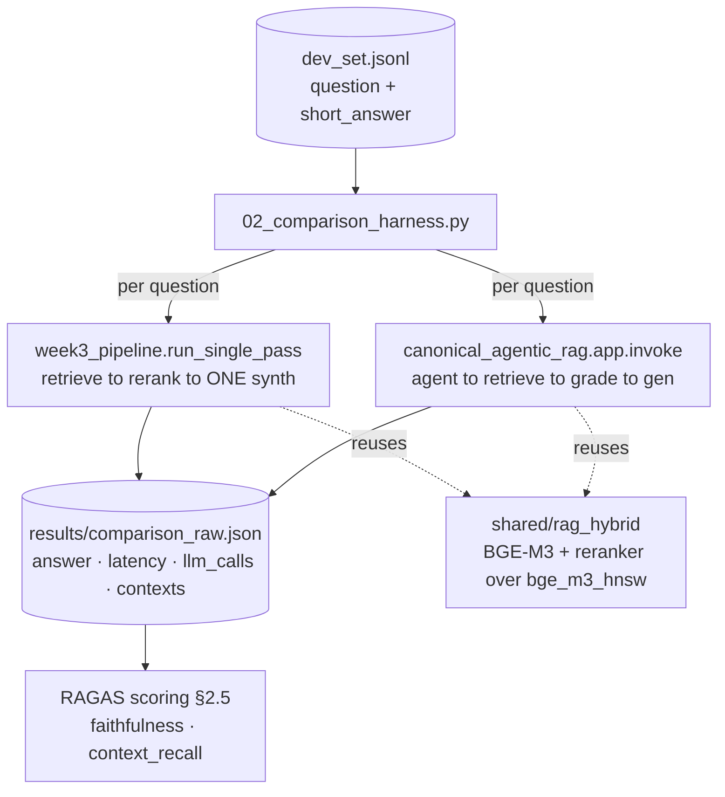
*Both pipelines hit the SAME local retrieval (rag_hybrid over `bge_m3_hnsw`) and the SAME oMLX model - so the only variable is the control flow (one pass vs agentic loop). The harness times each and counts LLM turns; RAGAS scores the answers afterward.*

| file | role | when it runs |
|------|------|--------------|
| `src/week3_pipeline.py` | single-pass baseline - `run_single_pass(q) -> (answer, contexts)` | the control arm |
| `src/canonical_agentic_rag.py` | Phase-1 agentic graph as an **importable** module exporting `app` | the treatment arm |
| `src/02_comparison_harness.py` | driver - runs both over the dev set, writes raw results | the experiment |

**When to use which:** `week3_pipeline` is the cheap baseline you ship by default; `canonical_agentic_rag` is what you reach for when the corpus or query mix needs the retrieve→grade→rewrite loop; `02_comparison_harness` is how you *prove* which one a given workload actually needs, instead of assuming.

### 2.2 The single-pass baseline (`week3_pipeline.py`)

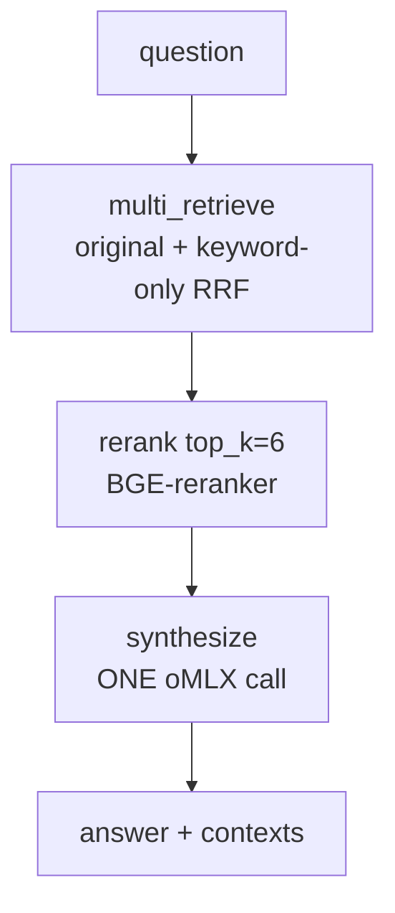
*`week3_pipeline` flow - one retrieval, one synthesis, no grading/rewrite loop. It reuses the lab's tested `multi_retrieve / rerank / synthesize` from `baseline_handrolled.py`, so the baseline shares the exact retrieval stack with the agentic arm.*

**Code (`src/week3_pipeline.py`):**

```python
"""Week 3 SINGLE-PASS RAG baseline: retrieve -> rerank -> ONE synthesis call."""
from __future__ import annotations
import os, sys
sys.path.insert(0, os.path.dirname(os.path.abspath(__file__)))   # sibling modules
from baseline_handrolled import multi_retrieve, rerank, synthesize


def run_single_pass(question: str, top_k: int = 6) -> tuple[str, list[str]]:
    hits = multi_retrieve(question)
    reranked = rerank(question, hits, top_k=top_k)
    out = synthesize(question, reranked)
    contexts = [h.get("text", "") for h in reranked]
    return out["answer"], contexts
```

**Walkthrough:**
- **It reuses the hand-rolled retrieval, not a fresh one.** Importing `multi_retrieve/rerank/synthesize` from `baseline_handrolled.py` guarantees the baseline and the agentic arm retrieve over the *same* `bge_m3_hnsw` collection with the *same* BGE-M3 encoder + reranker - so a quality gap between arms is a control-flow effect, not a retrieval-stack confound.
- **One synthesis call, by definition.** No grading, no rewrite, no corrective loop - that is the "single pass". The harness records `llm_calls = 1` for this arm, the cost floor the agentic arm is measured against.
- **Returns `contexts` for RAGAS.** `context_recall` needs the retrieved passages, so the function returns them alongside the answer.
- **`sys.path` for sibling imports** is the same pattern `baseline_handrolled.py` itself uses - run it with the lab's `uv` venv.

### 2.3 The agentic arm (`canonical_agentic_rag.py`)

This is the Phase-1 graph (§1.4) packaged as an importable module exporting `app` - oMLX `_llm()`, the `rag_hybrid` retriever `@tool`, and the `agent → retrieve → grade → {generate | rewrite}` loop - so the comparison runs *the same agent you built in Phase 1*. See §1.4 for the full node code; the only addition is module packaging:

```python
# src/canonical_agentic_rag.py  (tail — graph identical to the Phase-1 notebook)
workflow = StateGraph(AgentState)
workflow.add_node("agent", agent)
workflow.add_node("retrieve", ToolNode(tools))
workflow.add_node("rewrite", rewrite)
workflow.add_node("generate", generate)
workflow.add_edge(START, "agent")
workflow.add_conditional_edges("agent", tools_condition, {"tools": "retrieve", END: END})
workflow.add_conditional_edges("retrieve", grade_documents)
workflow.add_edge("generate", END)
workflow.add_edge("rewrite", "agent")
app = workflow.compile()        # <- importable: `from canonical_agentic_rag import app`
```

> [!warning] Why this file exists separately from `01_canonical_agentic_rag.py`
> `01_canonical_agentic_rag.py` is the chapter's illustrative stub - and **un-importable**: a module name can't start with a digit (`import 01_foo` is a SyntaxError), and its graph nodes were commented out. `canonical_agentic_rag.py` is the real, importable graph. Keep the numbered file for reading order; import the clean-named one.

### 2.4 The harness (`02_comparison_harness.py`)

**Code (`src/02_comparison_harness.py`):**

```python
"""single-pass + BOTH agentic graphs (canonical skip-allowed + structural fix) on one dev set."""
import argparse, json, os, sys, time
from pathlib import Path

sys.path.insert(0, os.path.dirname(os.path.abspath(__file__)))   # sibling modules
from week3_pipeline import run_single_pass
from canonical_agentic_rag import app as canonical_app    # agent DECIDES whether to retrieve
from structural_rag import app as structural_app          # retrieval is STRUCTURAL (§2.5.1)

# --dev-set / --out are CLI params, so §2.6's hard set flows through unchanged
_p = argparse.ArgumentParser()
_p.add_argument("--dev-set", default=os.getenv("DEV_SET", os.path.expanduser(
    "~/code/agent-prep/lab-03-rag-eval/data/dev_set.jsonl")))
_p.add_argument("--out", default="results/comparison_raw.json")
args = _p.parse_args()
dev = [json.loads(l) for l in open(os.path.expanduser(args.dev_set)) if l.strip()]

def run_agentic(app, question):
    """Invoke a graph; return {answer, latency, llm_calls, contexts}. Contexts = ToolMessages
    so RAGAS (§2.5) can score context_* per arm. recursion_limit guards the rewrite->retrieve loop."""
    t0 = time.time()
    msgs = app.invoke({"messages": [("user", question)]}, {"recursion_limit": 25})["messages"]
    return {"answer": msgs[-1].content, "latency": time.time() - t0,
            "llm_calls": sum(1 for m in msgs if getattr(m, "type", None) == "ai"),
            "contexts": [p for m in msgs if getattr(m, "type", None) == "tool"
                         for p in m.content.split("\n\n") if p.strip()]}

results = []
for i, q in enumerate(dev):
    question = q["question"]
    t0 = time.time()
    sp_answer, sp_contexts = run_single_pass(question)
    sp = {"answer": sp_answer, "latency": time.time() - t0, "llm_calls": 1, "contexts": sp_contexts}
    results.append({
        "qid": q.get("source_doc_id") or f"q{i}", "question": question,
        "ground_truth": q.get("short_answer", ""),
        "single_pass": sp,
        "agentic_canonical": run_agentic(canonical_app, question),
        "agentic_structural": run_agentic(structural_app, question),
    })

out = Path(os.path.expanduser(args.out)); out.parent.mkdir(parents=True, exist_ok=True)
out.write_text(json.dumps(results, indent=2))
print(f"wrote {out} ({len(results)} rows)")
```

**Walkthrough:**
- **`sys.path.insert` is the import fix.** The two pipeline modules are siblings in `src/`; adding the script's own dir to `sys.path` makes `from week3_pipeline import ...` resolve when you run `python src/02_comparison_harness.py`. (Pyright flags the imports as unresolved - a static false positive; they resolve at runtime.)
- **`--dev-set` / `--out` are CLI params** (env `DEV_SET` is still the default). Dev rows carry `{source_doc_id, source_text, question, short_answer}` - there is **no `qid`**, so the harness derives one from `source_doc_id` (or the row index). This is what lets §2.6 push a harder set through the same harness unchanged: `--dev-set data/hard_dev_set.jsonl --out results/comparison_hard.json`.
- **`run_agentic(app, …)` runs both agentic graphs through identical instrumentation.** The harness scores **three arms** - `single_pass`, `agentic_canonical` (the skip-allowed graph, `canonical_agentic_rag.py`), and `agentic_structural` (the §2.5.1 fix, `structural_rag.py`). One shared helper captures latency/contexts/`llm_calls` the same way for both agentic arms, so the canonical-vs-structural comparison is apples-to-apples (different instrumentation per arm would be a confound).
- **`llm_calls` is the cost axis.** Single-pass is hard-coded to 1 (the synthesis call). The agentic arm counts AI message turns (`getattr(m, "type") == "ai"`) - one per `agent` invocation plus tool-call turns - so a query that loops `agent → retrieve → grade → rewrite → agent` costs visibly more than one that answers in a single turn. This is the number that makes "the loop isn't free" concrete.
- **Latency is wall-clock per arm**, captured around each call so you can show the agentic tax (typically 2-5x on a query that triggers a rewrite).
- **`getattr` guards the final message.** The `generate` node returns a plain string that LangGraph coerces into a message; `getattr(m, "type", None)` avoids an `AttributeError` if any message lacks `.type`.

**Result (measured — 50-question dev set, oMLX Gemma-26B; from `results/comparison_raw.json`):**

```bash
cd ~/code/agent-prep/lab-03.7-agentic-rag
uv run python src/02_comparison_harness.py            # default dev set → results/comparison_raw.json (50 rows)
```

| arm | latency mean | retrieval skips | rewrites fired |
|-----|--------------|-----------------|----------------|
| single-pass | **1.59 s** (1.00×) | 0 / 50 | n/a |
| agentic_canonical (skip-allowed) | **3.07 s** (1.93×) | **15 / 50** | 0 / 50 |
| agentic_structural (the fix) | **1.56 s** (0.98×) | 0 / 50 | 0 / 50 |

**The cost axis at a glance:** the canonical (skip-allowed) graph pays ~1.9× latency - an extra LLM round-trip just for the agent to *decide* whether to retrieve - and still skips retrieval on 15/50 questions. The structural fix deletes that decision call, lands at **parity** with single-pass, and never skips. **Neither agentic arm ever fires a rewrite (0/50)** - the recovery path, the whole point of the loop, stays dormant on this corpus. The full RAGAS quality picture is in §2.5; the diagnosis and the structural fix are in **§2.5.1**.

> [!warning] Read `llm_calls` with care - a measurement caveat
> The harness counts *AI-typed* messages, so it reports a misleadingly low `llm_calls` for the agentic arms: the `generate` node returns a plain string (LangGraph coerces it to a non-AI message) and the grade step isn't an AI turn. Each agentic arm really makes ~2-3 model calls per query (canonical: agent-decision + grade + generate; structural: grade + generate). Treat **latency as the reliable cost signal**, or wrap every model call in a counter before trusting `llm_calls`.

> [!tip] Why the loop never fired - and what it would actually take
> These dev questions are answerable from the corpus, so the first retrieval grades *relevant* and the rewrite branch is skipped. §2.6 tested this directly: even a **constructed-hard** set (gold passage buried or out of the retrieval pool) **still** didn't fire a rewrite - the reranker rescued the buried cases, and on the one truly unreachable case the grader waved through plausible-but-wrong passages. So *difficulty alone doesn't wake the loop*; **visibly-failed retrieval does** - out-of-corpus queries where the grader can tell (Phase 3 / CRAG, §3). If you expected loops and got none on Gemma, also confirm tool-calling fires (the **canonical** arm depends on it; route through Claude with `LLM_BASE_URL=http://localhost:8317/v1 LLM_MODEL=claude-sonnet-4-5-20250929`). The **structural** arm needs no tool-calling - that's the point of §2.5.1.

`★ Insight ─────────────────────────────────────`
- **Same retrieval, same model, different control flow - that's a clean experiment.** Both arms import the same `rag_hybrid` stack and the same oMLX model, so any quality delta is attributable to the agentic loop alone, not a retrieval or model confound. Most "agentic RAG beats baseline" claims fail this control.
- **The agentic loop's cost is a turn count, not a vibe.** Counting AI message turns turns "agents are expensive" into a per-query integer you can put next to the quality delta - the exact trade-off a production decision needs.
- **A tie is a finding - measured here.** Built correctly (structural retrieval, §2.5.1) the agentic RAG fired **0 rewrites** and matched single-pass at **parity latency**; the skip-allowed canonical paid ~1.9× *and* lost quality. The right call: ship single-pass, keep the structural graph as the near-free upgrade path. The harness licensed that with data, not vibes.
`─────────────────────────────────────────────────`

### 2.5 Score with RAGAS

Latency tells you the *cost*; RAGAS tells you the *quality* - so you can put the two next to each other. `02b_ragas_eval.py` reads `results/comparison_raw.json` (no re-running the pipelines) and scores **both arms** on four reference-based metrics, **backed by local models**:

- **faithfulness** - is the answer grounded in the retrieved contexts (no hallucination)? *(needs answer + contexts)*
- **answer_relevancy** - does the answer actually address the question? *(needs question + answer + embeddings)*
- **context_precision** - are the retrieved contexts on-topic (not padded with distractors)? *(needs question + contexts + ground_truth)*
- **context_recall** - did retrieval surface everything the ground-truth answer needs? *(needs contexts + ground_truth)*

> [!danger] The load-bearing gotcha: RAGAS defaults to OpenAI
> RAGAS uses an LLM judge **and** an embedding model for these metrics, and **both default to `api.openai.com`**. On this local-first stack you MUST wrap your own: oMLX as the judge (`LangchainLLMWrapper(ChatOpenAI(base_url=...))`) and local BGE-M3 as the embedder (`LangchainEmbeddingsWrapper(HuggingFaceEmbeddings(...))`). Skip this and every metric silently tries OpenAI and errors. This is the same wiring as the Week-3 RAGAS harness.

> [!warning] Environment adjustments - the RAGAS import quagmire (read before installing)
> Standing RAGAS up on this local-first stack took **two dependency fixes plus venv discipline**. All four points below bit during this lab - each is given as symptom → cause → fix so you can trace the error you actually see to the line that fixes it.
>
> **1. Wrong venv → `ModuleNotFoundError`.** `uv pip install` honors an active `VIRTUAL_ENV`. If any *other* venv is active when you install, the packages land there, but `uv run` always targets the lab's own `.venv` - so it can't see them: `ModuleNotFoundError: No module named 'langchain_huggingface'`. **Fix:** strip the env var for the install, then always run via `uv run` so install and run share one venv.
> ```bash
> cd ~/code/agent-prep/lab-03.7-agentic-rag
> env -u VIRTUAL_ENV uv pip install -U ragas datasets langchain-huggingface
> ```
>
> **2. `xai_sdk` poisons the import chain.** `ragas → instructor` eager-imports *every* provider backend at import time, including xAI's `xai_sdk`, which pulls a `protobuf` it can't parse. So merely `import ragas` dies with `ValueError: Unsupported protobuf version: 7.35.0` - even though you never touch xAI. **Fix:** uninstall the unused SDK (cleaner than pinning `protobuf` for the whole venv).
> ```bash
> env -u VIRTUAL_ENV uv pip uninstall xai_sdk
> ```
>
> **3. ragas hard-imports a removed Vertex class.** ragas 0.4.x unconditionally runs `from langchain_community.chat_models.vertexai import ChatVertexAI` - a class **removed** in langchain-community ≥0.3 - so `import ragas` fails with `ModuleNotFoundError: ...chat_models.vertexai` on a current langchain stack. We configure `ChatOpenAI` (oMLX), never Vertex. **Fix (in the script, not the shell):** a small **compat shim** stubs the unused Vertex classes in `sys.modules` *before* `import ragas` (shown in the code below). Delete it once ragas stops the unconditional import.
>
> **4. The agentic arm needs its `contexts`** (captured in §2.4). If your `results/comparison_raw.json` predates that line, **re-run the harness first** (`uv run python src/02_comparison_harness.py`) or `02b` exits loudly.
>
> **Verify the env is sound:** run `uv run python src/02b_ragas_eval.py`. If it reaches the `agentic.contexts missing` guard *instead of* an import traceback, every import resolved - the guard firing is the success signal, not a failure.

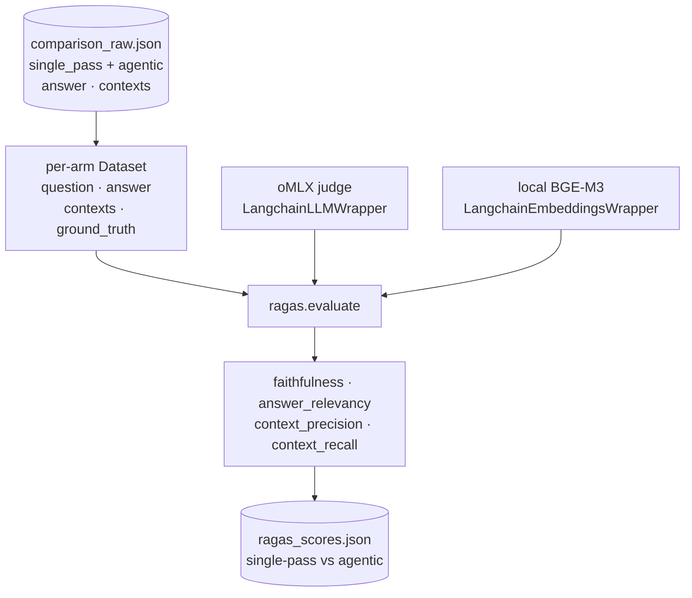
*`02b_ragas_eval.py` flow. It scores each arm's `{question, answer, contexts, ground_truth}` rows; the judge LLM + embedder are both local. No pipeline re-runs - it consumes the Phase-2 raw artifact.*

**Code (`src/02b_ragas_eval.py`):**

```python
"""Score BOTH arms (single-pass + agentic) from results/comparison_raw.json with RAGAS,
backed by LOCAL models: oMLX judge LLM + local BGE-M3 judge embeddings.

    env -u VIRTUAL_ENV uv pip install -U ragas datasets langchain-huggingface
    env -u VIRTUAL_ENV uv pip uninstall xai_sdk      # see §2.5 "Environment adjustments"
    uv run python src/02b_ragas_eval.py
"""
from __future__ import annotations
import json, os, sys, types, warnings
from pathlib import Path
warnings.filterwarnings("ignore", category=DeprecationWarning)

from dotenv import load_dotenv
from datasets import Dataset
from langchain_huggingface import HuggingFaceEmbeddings
from langchain_openai import ChatOpenAI

# compat shim: ragas 0.4.x hard-imports Vertex classes removed in langchain-community >=0.3.
# We use ChatOpenAI, never Vertex - stub them in sys.modules BEFORE `import ragas`.
_vx = types.ModuleType("langchain_community.chat_models.vertexai")
_vx.ChatVertexAI = type("ChatVertexAI", (), {})
sys.modules.setdefault("langchain_community.chat_models.vertexai", _vx)
import langchain_community.llms as _lcl            # ragas imports llms.VertexAI too
if not hasattr(_lcl, "VertexAI"):
    _lcl.VertexAI = type("VertexAI", (), {})

from ragas import evaluate
from ragas.embeddings import LangchainEmbeddingsWrapper
from ragas.llms import LangchainLLMWrapper
from ragas.metrics import AnswerRelevancy, ContextPrecision, ContextRecall, Faithfulness
from ragas.run_config import RunConfig

load_dotenv(os.path.expanduser("~/code/agent-prep/lab-03.7-agentic-rag/.env"))
sys.path.insert(0, os.path.expanduser("~/code/agent-prep/shared"))
from rag_hybrid import autoconfig   # device probe for the embedder

ROOT = Path(__file__).resolve().parents[1]
RAW, OUT = ROOT / "results" / "comparison_raw.json", ROOT / "results" / "ragas_scores.json"


def ragas_backends():
    """LOCAL judge LLM (oMLX) + LOCAL embedder (BGE-M3). RAGAS would call OpenAI otherwise."""
    llm = ChatOpenAI(model=os.getenv("MODEL_SONNET"),
                     base_url=os.getenv("OMLX_BASE_URL", "http://localhost:8000/v1"),
                     api_key=os.getenv("OMLX_API_KEY", "not-needed"), temperature=0.0)
    emb = HuggingFaceEmbeddings(
        model_name=os.path.expanduser("~/models/bge-m3"),               # same BGE-M3 as retrieval
        model_kwargs={"device": autoconfig.probe_system().device},      # mps / cuda / cpu
        encode_kwargs={"normalize_embeddings": True})
    return LangchainLLMWrapper(llm), LangchainEmbeddingsWrapper(emb)


def dataset_for(rows, arm):
    return Dataset.from_list([{
        "question": r["question"], "answer": r[arm]["answer"],
        "contexts": r[arm].get("contexts", []), "ground_truth": r["ground_truth"],
    } for r in rows])


# single-pass + BOTH agentic arms (canonical skip-allowed vs the structural fix, §2.5.1)
ARMS = ("single_pass", "agentic_canonical", "agentic_structural")


def main():
    rows = json.loads(RAW.read_text())
    for arm in ("agentic_canonical", "agentic_structural"):
        if not rows or arm not in rows[0]:
            sys.exit(f"{arm} missing — re-run 02_comparison_harness.py (§2.4) first.")

    ragas_llm, ragas_emb = ragas_backends()
    metrics = [Faithfulness(llm=ragas_llm), AnswerRelevancy(llm=ragas_llm, embeddings=ragas_emb),
               ContextPrecision(llm=ragas_llm), ContextRecall(llm=ragas_llm)]
    rc = RunConfig(timeout=300, max_retries=3, max_workers=2)   # local judge is slow → low workers

    out = {}
    for arm in ARMS:
        print(f"\n=== scoring {arm} ({len(rows)} rows) ===")
        scores = evaluate(dataset_for(rows, arm), metrics=metrics,
                          llm=ragas_llm, embeddings=ragas_emb, run_config=rc)
        df = scores.to_pandas()
        out[arm] = {c: float(df[c].mean()) for c in df.columns if df[c].dtype.kind in "fi"}

    OUT.write_text(json.dumps(out, indent=2, default=str))
    print(f"\n  {'metric':18}{'single-pass':>13}{'canonical':>12}{'structural':>12}")
    for m in ("faithfulness", "answer_relevancy", "context_precision", "context_recall"):
        print(f"  {m:18}{out['single_pass'].get(m, float('nan')):>13.3f}"
              f"{out['agentic_canonical'].get(m, float('nan')):>12.3f}"
              f"{out['agentic_structural'].get(m, float('nan')):>12.3f}")


if __name__ == "__main__":
    main()
```

**Walkthrough:**
- **`ragas_backends()` is the whole local adaptation.** Wrapping `ChatOpenAI(base_url=oMLX)` as the judge and a local `HuggingFaceEmbeddings("~/models/bge-m3")` as the embedder is what keeps RAGAS off OpenAI. The embedder reuses the **same BGE-M3** the corpus was indexed with, and `autoconfig.probe_system().device` picks `mps`/`cuda`/`cpu` so it's portable (the Week-3 lesson - don't hardcode `device="mps"`).
- **It consumes the raw artifact, not the pipelines.** Scoring reads `comparison_raw.json` - so it's fast, deterministic, and decoupled from the (slow) retrieval/generation. Re-score as often as you like without re-running the agent.
- **Each arm becomes a RAGAS `Dataset` of `{question, answer, contexts, ground_truth}`.** That's the exact schema the four metrics need - `ground_truth` comes from the dev set's `short_answer`, `contexts` from each arm's retrieved passages (single-pass returns them; the agentic arm's were captured from its `ToolMessage`s in §2.4).
- **`RunConfig(max_workers=2)` is deliberate.** A local oMLX judge is far slower than OpenAI; low concurrency + a 300 s timeout + retries stops the eval from hammering the server into 5xx/timeouts. Raise `max_workers` only if your oMLX box has headroom.
- **The guard fails loudly** if `agentic.contexts` is absent - the common mistake is scoring a `comparison_raw.json` produced before the §2.4 context-capture line, which silently gives the agentic arm empty contexts and meaningless `context_*` scores.
- **The compat shim runs before `import ragas`.** ragas 0.4.x unconditionally imports Vertex classes that current langchain-community removed; stubbing them in `sys.modules` first lets `import ragas` succeed without installing Vertex deps we never use. It's a *temporary* workaround for an upstream eager-import - delete it once ragas fixes the import (see §2.5 "Environment adjustments" for the full diagnosis).

**Result (measured — 50-question dev set, `results/ragas_scores.json`):**

```bash
# one-time env setup is in §2.5 "Environment adjustments" above
uv run python src/02_comparison_harness.py   # re-run first if agentic.contexts is missing (§2.4)
uv run python src/02b_ragas_eval.py          # prints the table + writes results/ragas_scores.json
```

| metric | single-pass | agentic | winner |
|---|---|---|---|
| faithfulness | **0.980** | 0.876 | single-pass (+0.104) |
| answer_relevancy | 0.755 | **0.786** | agentic (+0.031) |
| context_precision | **0.982** | 0.694 | single-pass (+0.288) |
| context_recall | **1.000** | 0.700 | single-pass (+0.300) |

*Means over 50 dev questions, both arms retrieving **k=6**. Here `agentic` = the canonical skip-allowed graph; all §2.5/§2.5.1 numbers come from one unified 3-arm run (`results/ragas_scores.json`, written by `02b`). oMLX was the judge LLM, local BGE-M3 the judge embedder.*

**Read it with Phase 2 next to it.** Phase 2 already showed the agentic loop fired **0 rewrites in 50 questions** at **~1.9× the latency** (canonical 3.07s vs single-pass 1.59s). RAGAS adds the quality half: single-pass wins **three of four** metrics, and agentic's only win (`answer_relevancy`, +0.031) is inside the judge's run-to-run noise (see below). So on this corpus + model the loop costs ~1.9× latency and *lowers* grounding and retrieval quality for no real relevancy gain - the measured case to **ship single-pass** holds.

> [!check] We controlled for retrieval depth - the gap is architectural, not passage-count
> The first pass was *uncontrolled*: single-pass carried 6 reranked passages, the agentic tool only `k=4` (avg 2.8/question after the 15 no-retrieval rows). Suspecting `context_recall` was a passage-count artifact, we bumped the agentic tool to `k=6` (`canonical_agentic_rag.py:67`) and **re-ran the harness** to regenerate contexts. Result: `context_precision` (0.694) and `context_recall` (0.700) came back **identical to the k=4 run, to 16 decimal places**. Matching depth changed nothing. Two verified reasons:
> 1. **The agent skips retrieval on 15 of 50 questions** (ctx-count distribution `{0: 15, 6: 35}`) - it answers 30% of questions from parametric memory instead of calling `retrieve_corpus`. Those rows score recall 0 regardless of `k`.
> 2. **On the 35 rows where it *does* retrieve, it returns the same passages as single-pass** - verified 6/6 passage overlap on a spot-checked row (same corpus, same reranker, same top-6). Retrieval *quality* isn't worse; retrieval is just *missing* 30% of the time.
>
> So the gap is exact arithmetic, not a quality difference - each context metric is binary per row (perfect when retrieved, zero when skipped):
> ```
> context_recall = (35 retrieve-rows × 1.0  +  15 skip-rows × 0) / 50 = 0.700   ← exactly
> context_precision ≈ (35 × 0.99 + 15 × 0) / 50 = 0.694
> ```
> Agentic's context scores are just **single-pass quality × the 35/50 retrieve-rate**; the **30% skip-rate is the entire gap**. Faithfulness drops the same way - the 15 ungrounded answers pull it from 0.980 to 0.876 (one skip-row answered *"In most professional environments, an experienced worker has several strategic advantages…"* - a fluent parametric essay with nothing retrieved to ground it). The metric landing on an exact `n/50` fraction is the fingerprint: a per-row binary, which points straight at the skip-rate as the sole cause. This is the canonical agentic-RAG failure mode - **a tool-calling agent under-retrieving when it's overconfident** - not a measurement artifact.

> [!tip] Design principle - RAG vs an agentic app
> The skip-retrieval edge is **fine in an agentic *app*** - a general assistant *should* answer "hi" or "2+2" without searching. It is **wrong in a RAG.** A RAG's contract is *"every answer is grounded in our data,"* so retrieval must be a **guaranteed edge, not a tool the agent may decline.** The canonical LangGraph graph is a sound *agent-with-a-retrieval-tool*; calling it "RAG" while it can route `agent → END` is a category error - that `agent → END` path is what produced the 15 ungrounded answers. **If it's RAG, force the retrieve call** (`tool_choice="required"`) and let the agent reformulate the *query*, never decide *whether* to search. Retrieval mandatory is *necessary* for grounding - still pair it with faithfulness + abstain-on-miss for *accuracy*.

> [!important] What this proves - and what it does *not*
> This is **the wrong tool for *this* job, not a wrong architecture.** The dev set is single-hop factual QA over one corpus - the regime where single-pass is strongest and the agentic loop has nothing to do (hence **0/50 rewrites**: the corrective machinery added cost but never fired). The takeaway is about *matching architecture to task*: don't buy agency you won't use.
> - **The skip-rate is a fixable implementation bug, not the paradigm.** Force the retrieve call (mandatory first tool, or a system prompt that says "always search before answering") and agentic's quality climbs to single-pass's - it retrieves the *same* passages. The agent under-retrieved because the local model was overconfident, not because agency is wrong.
> - **We applied the fix and re-measured (§2.5.1) - it *ties* single-pass at near-equal latency.** Forcing retrieval at the LLM layer failed (oMLX ignores `tool_choice`), so we wired retrieval *structurally*. That recovered every metric to ≈ single-pass (faithfulness 0.876→**1.000**, context_recall 0.700→**1.000**) **and** dropped latency from ~1.9× to **~1.0×** (deleting the agent's tool-deciding LLM call). A correctly-built RAG here is a *near-free equal*, not a downgrade - but the grade/rewrite loop still fires **0/50**, so it's unused insurance. **Single-pass stays the simpler default; the structural RAG is its legitimate near-free sibling.**
> - **Agentic RAG earns its cost where this lab doesn't go** - multi-hop questions needing iterative retrieval, query decomposition, ambiguous queries needing reformulation, or routing across multiple tools/sources. The honest headline is *"match the architecture to the task,"* not *"agentic is wrong."*

> [!note] Judge non-determinism - treat sub-0.05 gaps as noise
> The RAGAS judge is a local oMLX model at `temperature=0`, but MLX sampling isn't bit-deterministic. Re-scoring the **same** `comparison_raw.json` three times gave agentic (canonical) `faithfulness` of 0.897 / 0.856 / 0.876 across runs - a ~±0.04 band - while the LLM-free context metrics stayed identical to 16 digits. Lesson: with a local judge, only trust quality-metric gaps comfortably larger than that band. Single-pass's faithfulness lead over canonical (+0.104) clears it; the relevancy gaps (≤0.031) do not.

The table above is the **canonical, skip-allowed graph** - the LangGraph default. The next subsection records what happened when we took the *RAG-contract* principle seriously, rebuilt retrieval as a structural edge, and re-measured. It doubles as the full decision log of this investigation.

#### 2.5.1 Fixing it — structural retrieval (the decision log)

The skip-allowed result prompted a chain of questions. Recording it in order, because the *reasoning path* is the lesson, not just the final number.

**The investigation:**
1. *"If the loop never rewrites (0/50), why is agentic worse than single-pass?"* — Traced the graph: the divergence isn't the rewrite branch, it's one node earlier. The `agent` node decides *whether* to retrieve; on **15/50** questions it emitted no tool call → routed `agent → END` → answered from parametric memory. Single-pass always retrieves. (Spot-check: a skip-row answered with a fluent generic essay; single-pass grounded the same question with a citation.)
2. *"Is the gap just a passage-count artifact?"* — Controlled it: bumped the tool `k=4 → k=6`, re-ran the harness. `context_precision`/`recall` came back **identical to 16 digits** → not passage count, architectural. (Incidental finding: the local RAGAS judge wobbles ~±0.06 run-to-run; treat sub-0.05 gaps as noise.)
3. *"Why didn't the skipped questions trigger a rewrite?"* — `grade_documents` (the only path to `rewrite`) sits **downstream of `retrieve`**. Skip-rows take `agent → END` and never reach the grader. **Rewrite corrects *bad* retrieval; it's blind to *absent* retrieval** — which is why it fired 0/50.
4. *Design principle* — a RAG must not be able to decline retrieval (the [!tip] above). Retrieval is a structural guarantee, not an LLM tool-choice.
5. *"Force the tool call, then."* — `tool_choice="required"` **and** the explicit named-function form are **both ignored by oMLX/gemma** (probe returned `tool_calls: NONE`). The LLM layer cannot enforce retrieval on this local model — so the textbook fix *silently fails* here, which is itself the point: a RAG can't depend on model cooperation for its core guarantee.
6. *The fix* — move the guarantee into the **graph topology**: `START → retrieve` unconditionally, and delete the `agent`/`tools_condition` discretion node entirely.

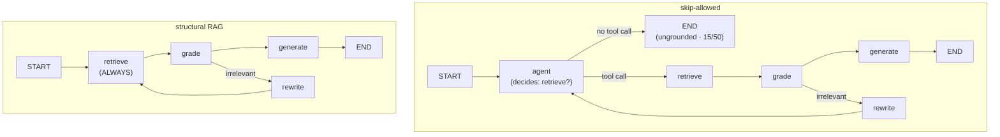
*The fix in one move: the `agent → END` escape (left) becomes impossible because there is no agent node — retrieval is the first thing that happens (right).*

```python
# BEFORE — the agent's LLM call decides whether to retrieve (and skipped 15/50)
def agent(state):
    return {"messages": [_llm().bind_tools(tools).invoke(state["messages"])]}
_workflow.add_conditional_edges("agent", tools_condition, {"tools": "retrieve", END: END})

# AFTER — retrieval is a structural edge; no node, and no model, can skip it
def retrieve(state):
    query = state["messages"][-1].content              # the question, or a rewrite's reformulation
    passages = retrieve_passages(query, k=6)
    content = "\n\n".join(passages) or "No relevant documents found."
    return {"messages": [ToolMessage(content=content, tool_call_id="retrieve")]}
_workflow.add_edge(START, "retrieve")
_workflow.add_conditional_edges("retrieve", grade_documents)   # generate | rewrite
_workflow.add_edge("rewrite", "retrieve")                      # reformulate → retrieve again
```

**Re-measured (50-question dev set, this session's artifacts):**

| metric | single-pass | skip-allowed (canonical) | **structural (fixed)** |
|---|---|---|---|
| faithfulness | 0.980 | 0.876 | **1.000** |
| answer_relevancy | 0.755 | 0.786 | **0.785** |
| context_precision | 0.982 | 0.694 | **0.982** |
| context_recall | 1.000 | 0.700 | **1.000** |
| latency (× single-pass) | 1.00× | 1.93× | **0.98×** |
| retrieval skips | 0/50 | 15/50 | **0/50** |

*All three arms from one unified run (`02_comparison_harness.py` → `results/comparison_raw.json` → `02b` → `results/ragas_scores.json`). Absolute latency wobbles run-to-run; the **ratio collapse ~1.9× → ~1.0×** is the stable signal — it comes from deleting the agent's tool-deciding LLM call, leaving the structural RAG just one cheap `grade` call heavier than single-pass (so it lands at parity, even marginally faster).*

**Revised verdict.** The original "agentic RAG is ~2× slower *and* lower quality" indicted a **mis-built** graph (agent discretion + a tool call the local model can't reliably make), not the paradigm. Built as a *real RAG* — structural retrieval — it **matches single-pass on all four metrics at ~equal latency (0.98×)** (and even edges faithfulness, 1.000 vs 0.980, within judge noise). The grade/rewrite loop still earns nothing *here* (0/50 rewrites on a clean single-hop corpus), so **single-pass remains the simpler default for this workload**; the structural RAG is its near-free equal and the correct skeleton the moment retrieval gets noisy enough for the loop to fire (Phase 3's CRAG variant, §3).

### 2.6 Stratify by query difficulty

§2.5 showed the structural RAG *matches* single-pass on average. But an average hides the real question: **is there a regime where the corrective loop actually wins?** To answer it we stratify by difficulty - but *how you define difficulty decides whether the test is honest*.

> [!danger] The circular trap - don't define difficulty by the outcome
> The tempting bucketing is "easy = single-pass got it right, hard = single-pass got it wrong." That's **circular**: you've defined the hard bucket as *the questions single-pass fails*, so of course the alternative looks better there - it's selection bias, the demo-gaming failure mode. A fair difficulty label must be computed **before any pipeline answers**, independent of who wins.

**A fair, outcome-independent axis: the retrieval rank of the known-gold passage.** Every dev row carries its gold passage (`source_text`). Encode the question, retrieve the dense top-30 from Qdrant, and find *where the gold passage lands*. That rank is a pure property of the question-vs-corpus, decided before generation:

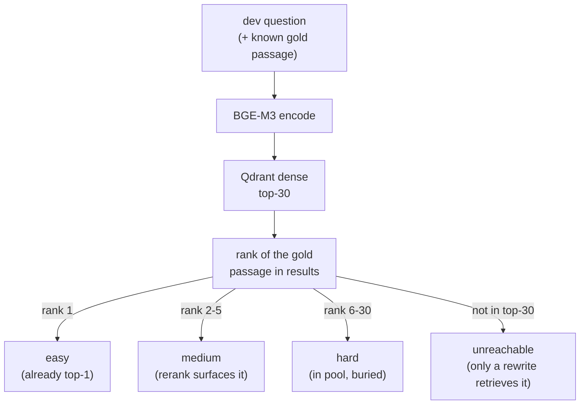
*Difficulty = gold-passage retrieval rank. The `unreachable` bucket is the key one: the gold isn't in the first pool at all, so single-pass **structurally cannot** answer it - only the rewrite loop (reformulate → new query → new pool) has a shot. That's the falsifiable test of whether the loop earns its cost.*

**Why this is needed at all:** the lab's stock dev sets are single-hop MS-MARCO - one passage per question, gold at rank 1, so single-pass scores ~perfectly and *every* bucket favors it. There's nothing to stratify. So we generate a genuinely harder set over the **same corpus**, fairly.

**The generator (`src/make_hard_dev_set.py`):**

```python
# difficulty = retrieval rank of the KNOWN gold passage - outcome-independent, not gameable
def difficulty_of(rank):                 # rank = gold's position in dense top-30, or None
    if rank == 1:           return "easy"          # already top-1: nothing to fix
    if rank and rank <= 5:  return "medium"        # near top: the reranker likely surfaces it
    if rank:                return "hard"          # rank 6-30: in the pool but buried
    return "unreachable"                           # gold NOT in pool: only a query rewrite retrieves it

# the gold passage is located in the corpus by TEXT (corpus doc_id is a sequential index,
# NOT the dev set's MS-MARCO source_doc_id), then we rank it in the question's retrieval:
gold_id = text2id.get(norm(row["source_text"]))           # None -> skip & report (never silently drop)
hits    = qdrant.query_points(COLLECTION, query=encode(row["question"]), limit=30).points
ranked  = [str(h.payload["doc_id"]) for h in hits]
rank    = ranked.index(gold_id) + 1 if gold_id in ranked else None
row["difficulty"], row["gold_rank"] = difficulty_of(rank), rank
```

**Walkthrough:**
- **It measures difficulty, doesn't assume it.** The generator prints the full distribution + a gold-rank histogram. If the corpus retrieves so cleanly that `hard`/`unreachable` are near-empty, that's a *finding* (this corpus leaves no room for the loop) - we report it, not force a thin bucket.
- **Gold is matched by text, not id** - the Qdrant payload `doc_id` is a sequential `0..9999`, unrelated to the dev set's MS-MARCO `source_doc_id`. 93/100 candidates' gold text is in the corpus; the rest are skipped and counted.
- **`pool=30` mirrors the pipeline's rerank input.** Gold in the pool (rank ≤30) *can* be rescued by the reranker; gold outside it cannot - which is exactly what separates `hard` from `unreachable`.

**The scripts are parameterized** so any dev set flows through unchanged:

```bash
# 1) build the fair hard set (difficulty = gold retrieval rank, NOT "who won")
uv run python src/make_hard_dev_set.py \
    --source ~/code/agent-prep/lab-03-rag-eval/data/dev_candidates.jsonl \
    --out data/hard_dev_set.jsonl --pool 30          # keeps medium,hard,unreachable

# 2) run all three arms on it (single-pass + canonical + structural)
uv run python src/02_comparison_harness.py \
    --dev-set data/hard_dev_set.jsonl --out results/comparison_hard.json

# 3) RAGAS per arm, then read the table next to each row's 'difficulty' field
uv run python src/02b_ragas_eval.py \
    --raw results/comparison_hard.json --out results/ragas_hard.json
```

**Result (measured — `results/ragas_hard.json` + `comparison_hard.json`):**

The **distribution is the headline**. Of 100 candidates (`pool=30`): **80 had the gold passage already at rank 1**; only **13 were non-trivial** (9 `medium`, 3 `hard`, **1 `unreachable`**); 7 had no gold-in-corpus and were skipped. BGE-M3 over single-passage QA is strong enough that a hard regime barely exists on this corpus - that fact alone is most of the answer.

RAGAS over the 13 hard questions (small *n* - read as directional, not significant):

| metric | single-pass | canonical (skip) | structural |
|---|---|---|---|
| faithfulness | 0.904 | 0.726 | **1.000** |
| answer_relevancy | 0.796 | 0.820 | **0.876** |
| context_precision | **0.897** | 0.419 | **0.897** |
| context_recall | **0.923** | 0.462 | **0.923** |

Two findings, both consistent with §2.5:
- **The skip-allowed canonical graph degrades *more* as questions get harder.** Per-bucket retrieved-context counts: on the 9 `medium` questions canonical averaged just **2.0** passages/question (vs 6.0 for single-pass and structural) - it skipped retrieval on more of them, and its `context_recall` cratered to **0.462**. Exactly backwards: the harder the question, the more the discretion-graph opts out. structural (always retrieves) holds at 6.0 and matches single-pass.
- **The `unreachable` question (n=1) was *not* rescued by the rewrite loop** - the prediction is **falsified**. *"What happens to moisture when it is heated?"* - gold ("Moisture rarefies when heated") wasn't in the dense top-30. structural retrieved 6 *plausible-but-wrong* passages (about hydrates boiling off), **the grader passed them as relevant → `generate`, so no rewrite fired** (6 contexts = a single retrieval). The one question engineered to need reformulation didn't get it: an over-lenient grader accepted on-topic-looking distractors. single-pass missed identically; canonical skipped retrieval entirely (0 contexts).

**Verdict.** Even on a *constructed-hard* set, the rewrite loop never usefully fires on this corpus - the retriever is too good (so `medium`/`hard` stay answerable in one pass) and the grader too lenient (so the one `unreachable` case never triggers a rewrite). structural still wins by **never skipping**; canonical still loses by **skipping more under pressure**. The loop's genuine payoff needs retrieval that *visibly* fails - out-of-corpus queries where the grader can actually tell - which **Phase 3 (CRAG, §3)** measures directly. The honest §2.6 takeaway: *on a strong retriever over in-corpus QA, the corrective loop is dormant; difficulty alone doesn't wake it - retrieval failure does.*

---

## Phase 3 — Implement CRAG Variant (~1.5 hours)

The canonical Agentic RAG (Phase 1) handles the case where retrieved docs are irrelevant by rewriting the question. **CRAG handles the case where local corpus genuinely doesn't have the answer** by falling back to web search.

### 3.1 Add the CRAG node

CRAG replaces the binary *relevant/not* grader with a **scored retrieval evaluator** and adds a **web-search fallback**. Built on the structural RAG (§2.5.1 - retrieval is a guaranteed edge): always retrieve from the corpus, score how well it answers, then route on confidence.

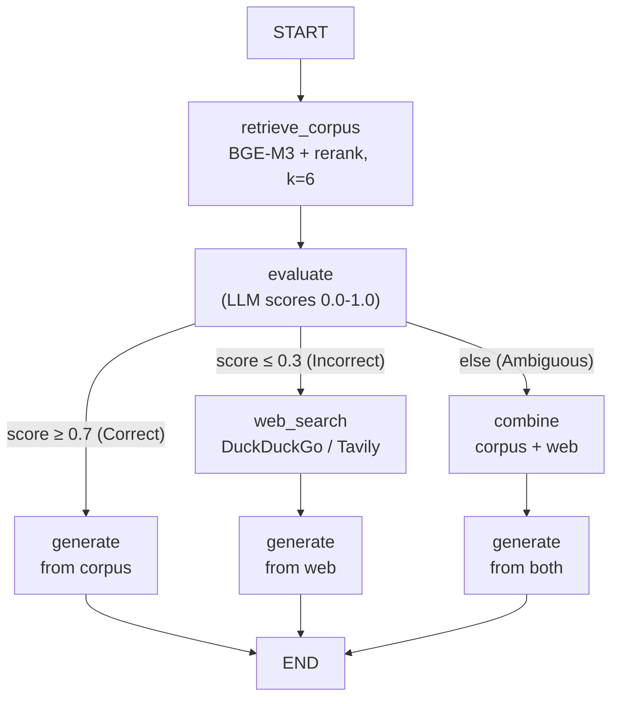
*CRAG flow. The evaluator's score, not a yes/no, is what enables the three-way route - the key difference from the canonical grader, which can only loop back to rewrite.*

**Inside generation - why no arm hallucinates on out-of-corpus.** The `generate` box above is one node, but the *grounding* that makes an arm say "I can't" instead of inventing lives inside it. The two corpus arms generate differently, and it's worth seeing both. **Single-pass uses `synthesize()` (`baseline_handrolled.py`)** - two stacked grounding layers:

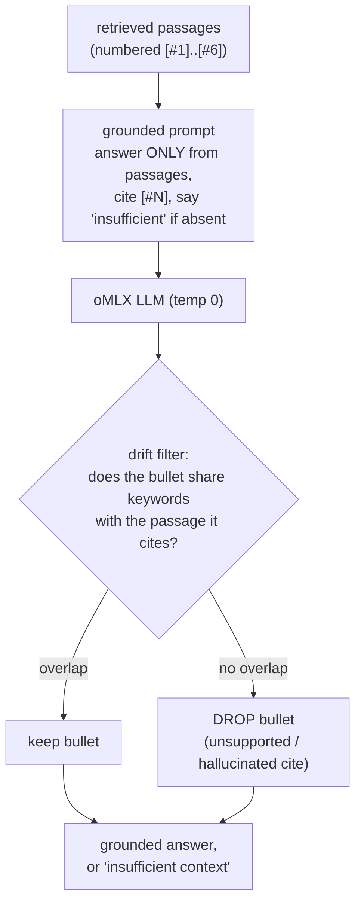
*`synthesize()` - layer 1 is the **prompt** (answer only from context, abstain if absent); layer 2 is the **drift filter** (`baseline_handrolled.py:174-191`), a *programmatic* check that drops any bullet whose words don't overlap the passage it cites. On out-of-corpus queries the passages are irrelevant, so layer 1 already returns "the passages do not contain this; context is insufficient [#1-6]" - which is exactly why single-pass **abstains** rather than hallucinates (it is **not** the weak arm; §3.2).*

**CRAG's `generate` node (`crag_variant.py`) keeps layer 1, drops layer 2.** It uses the same grounded prompt ("answer using only the context; if it lacks the answer, say you don't know") on whichever docs its route supplied (corpus / web / both), but **no drift filter** - it leans on the evaluator's routing plus the prompt's abstain instruction instead. So every arm here is grounded by prompt; only single-pass adds the mechanical second net. That's the design knob: prompt-grounding is cheap and usually enough; the drift filter is the belt-and-suspenders option when you can't tolerate a stray unsupported sentence.

The graph lives in `src/crag_variant.py` (importable, exports `crag_app`); the §3.2 runner imports it. Core code:

```python
"""CRAG (Corrective RAG) over the local corpus + web fallback. Exports `crag_app`."""
import os, re, sys
from typing import Literal, Required, TypedDict
from langchain_openai import ChatOpenAI
from qdrant_client import QdrantClient
from rag_hybrid import BGE_M3, BGE_RERANKER_V2_M3, CrossEncoderReranker, DenseEncoder, autoconfig

def _llm(**kw):                                          # oMLX, OpenAI-compatible
    return ChatOpenAI(base_url=os.getenv("OMLX_BASE_URL", "http://localhost:8000/v1"),
                      api_key=os.getenv("OMLX_API_KEY", "not-needed"),
                      model=os.getenv("MODEL_SONNET"), temperature=0, **kw)

_qdrant = QdrantClient(url=os.getenv("QDRANT_URL", "http://127.0.0.1:6333"), timeout=60)
_encoder = DenseEncoder(autoconfig.encoder_config_for(BGE_M3))           # BGE-M3, reused
_reranker = CrossEncoderReranker(autoconfig.recommend(BGE_M3, BGE_RERANKER_V2_M3).reranker)
def retrieve_passages(query, k=6, pool=30):                              # dense → rerank → top-k
    qv = _encoder.encode([query])[0]
    pts = _qdrant.query_points("bge_m3_hnsw", query=qv.tolist(), limit=pool, with_payload=True).points
    return [text for _id, text, _score in _reranker.rerank(query, pts, top_k=k)]

CONF_UPPER = float(os.getenv("CRAG_UPPER", "0.7"))   # ≥ this → corpus is enough
CONF_LOWER = float(os.getenv("CRAG_LOWER", "0.3"))   # ≤ this → corpus failed → web

def web_search(query: str, k: int = 3) -> list[str]:
    """Pluggable + graceful: Tavily (if key) → DuckDuckGo (free) → clear error. No key required."""
    if os.getenv("TAVILY_API_KEY"):
        from tavily import TavilyClient                       # official SDK (langchain wrapper sunset)
        resp = TavilyClient(api_key=os.environ["TAVILY_API_KEY"]).search(query, max_results=k)
        return [r["content"] for r in resp.get("results", []) if r.get("content")]
    try:
        from ddgs import DDGS
    except ImportError:
        from duckduckgo_search import DDGS            # older package name
    with DDGS() as ddg:
        return [r["body"] for r in ddg.text(query, max_results=k) if r.get("body")]

class CRAGState(TypedDict, total=False):
    question: Required[str]
    corpus_docs: list[str]; web_docs: list[str]; score: float; source: str; answer: str

def retrieve_corpus(state) -> dict:
    return {"corpus_docs": retrieve_passages(state["question"], k=6)}

def evaluate(state) -> dict:
    """The CRAG retrieval evaluator: score 0.0–1.0 how well the corpus answers the question."""
    docs = state.get("corpus_docs") or []
    if not docs:
        return {"score": 0.0}
    prompt = PromptTemplate(template=(
        "On a scale 0.0 to 1.0, how well do these documents let you fully and correctly "
        "answer the question? Reply ONLY a number.\n\nDocuments:\n{context}\n\n"
        "Question: {question}\n\nScore:"), input_variables=["context", "question"])
    raw = (prompt | _llm() | StrOutputParser()).invoke(
        {"context": "\n\n".join(docs), "question": state["question"]})
    m = re.search(r"\d*\.?\d+", raw)
    return {"score": max(0.0, min(1.0, float(m.group()))) if m else 0.0}

def decide(state) -> Literal["generate", "web", "combine"]:
    s = state.get("score", 0.0)
    return "generate" if s >= CONF_UPPER else "web" if s <= CONF_LOWER else "combine"

def web_node(state) -> dict:      return {"web_docs": web_search(state["question"]), "source": "web"}
def combine_node(state) -> dict:  return {"web_docs": web_search(state["question"]), "source": "both"}

def generate(state) -> dict:
    docs = ((state.get("corpus_docs") or []) if state.get("source") != "web" else []) \
           + (state.get("web_docs") or [])
    prompt = PromptTemplate(template=(
        "Answer using only the context below. If it lacks the answer, say you don't know. "
        "Three sentences max.\n\nContext:\n{context}\n\nQuestion: {question}\nAnswer:"),
        input_variables=["context", "question"])
    ans = (prompt | _llm() | StrOutputParser()).invoke(
        {"context": "\n\n".join(docs) or "(no documents)", "question": state["question"]})
    return {"answer": ans, "source": state.get("source", "corpus")}

g = StateGraph(CRAGState)
for name, fn in [("retrieve_corpus", retrieve_corpus), ("evaluate", evaluate),
                 ("web", web_node), ("combine", combine_node), ("generate", generate)]:
    g.add_node(name, fn)
g.add_edge(START, "retrieve_corpus"); g.add_edge("retrieve_corpus", "evaluate")
g.add_conditional_edges("evaluate", decide, {"generate": "generate", "web": "web", "combine": "combine"})
g.add_edge("web", "generate"); g.add_edge("combine", "generate"); g.add_edge("generate", END)
crag_app = g.compile()
```

**Walkthrough:**
- **The evaluator returns a *score*, not a verdict - that's the whole CRAG idea.** A 0.0–1.0 confidence (parsed from the LLM with a regex + clamp) supports three routes, where the canonical binary grader supported only *generate vs rewrite*. The thresholds (`CRAG_UPPER`/`CRAG_LOWER`) are env-tunable - the paper uses a trained T5 evaluator; an LLM judge is the local stand-in.
- **`web_search` degrades gracefully and needs no key.** Tavily if `TAVILY_API_KEY` is set, else **DuckDuckGo** (free), else a clear install error. This keeps the lab runnable on the local-first stack without spending the cloud budget.
- **Three routes, one `generate`.** `Correct` answers from the corpus; `Incorrect` drops the corpus entirely and answers from web; `Ambiguous` concatenates both. `generate` reads `source` to decide which docs to use, and the abstain instruction ("if it lacks the answer, say you don't know") keeps it honest when neither source has it.
- **Built on structural retrieval, not the agent graph.** No tool-calling, no skip path - the corpus is always retrieved and *then judged*, so CRAG inherits §2.5.1's grounding guarantee and adds correction on top.

> [!tip] Smoke-test the routing before the full run
> `uv run python src/crag_variant.py "Who is the current CEO of OpenAI?"` should print `source=web` (the corpus scores ~0 and CRAG falls back). An in-corpus question (e.g. about the indexed pandas passages) should print `source=corpus score≈1.0`. If web returns nothing, confirm network + `uv pip install ddgs`.

### 3.2 Run CRAG on out-of-corpus queries

This is where the corrective loop finally earns its cost (§2.6 predicted it: the loop needs *visible* retrieval failure, which out-of-corpus queries produce). The runner `src/03_crag_eval.py` ships 10 questions the 2018 MS-MARCO corpus **cannot** answer (post-cutoff / niche - e.g. *"Who is the CEO of OpenAI as of 2026?"*, *"Which team won the 2025 NBA Finals?"*) and runs three arms on each:

```python
"""§3.2 — single-pass, structural RAG, CRAG on OUT-OF-CORPUS queries."""
from week3_pipeline import run_single_pass        # corpus-only
from structural_rag import app as structural_app  # corpus-only, always retrieves
from crag_variant import crag_app                 # corpus + web fallback

OUT_OF_CORPUS = [
    "What is the most capable Claude model Anthropic released in 2026?",
    "Which team won the 2025 NBA Finals?",
    "What is the official release date of GPT-5?",
    "Who won the 2025 Nobel Prize in Physics?",
    "What AI regulation did the European Union pass in 2025?",
    "What is the newest Apple silicon chip announced in 2025?",
    "What is the latest stable version of Python released in 2026?",
    "Who is the CEO of OpenAI as of 2026?",
    "What was the headline feature of the iPhone announced in 2025?",
    "Which country hosted the 2025 G20 summit?"]

_ABSTAIN = ("don't know", "do not know", "not in the", "no relevant", "cannot find", "unable to",
            "does not contain", "do not contain", "not contain information", "no information",
            "insufficient", "i'm not sure", "not provided", "do not have", "does not provide",
            "do not mention", "no mention", "rewrite loop", "recursion limit")
def answered(text):                               # did the arm actually answer, or punt?
    return not any(p in (text or "").lower() for p in _ABSTAIN)

for q in OUT_OF_CORPUS:
    sp, _ = run_single_pass(q)
    try:                                           # structural's rewrite loop RUNS AWAY on
        st = structural_app.invoke({"messages": [("user", q)]},
                                   {"recursion_limit": 12})["messages"][-1].content
    except GraphRecursionError:                    # out-of-corpus: docs never grade relevant
        st = "(rewrite loop hit the recursion limit — no answer)"   # → rewrite forever
    cr = crag_app.invoke({"question": q})          # cr["source"] ∈ {corpus, web, both}
    # tally answered(sp) / answered(st) / answered(cr["answer"]) + cr["source"]
# writes observations/crag-out-of-corpus.md
```

```bash
uv run python src/03_crag_eval.py                 # built-in 10 out-of-corpus questions
# or point it at your own set:
DEV_SET=data/my_out_of_corpus.jsonl uv run python src/03_crag_eval.py
```

The prediction: the corpus-only arms (single-pass, structural) **abstain or hallucinate** (the gold isn't in MS-MARCO), while CRAG's evaluator scores the corpus low and **routes to web** - the one regime where the loop adds what single-pass structurally can't.

> [!danger] The rewrite loop *runs away* on out-of-corpus queries - measured live
> This is the sharpest evidence that *rewrite ≠ correction*. On these questions the structural RAG's `grade_documents` never sees a relevant doc (the answer isn't in the corpus), so it routes to `rewrite → retrieve → grade → rewrite → …` **forever**, until LangGraph raises `GraphRecursionError`. Reformulating the query cannot conjure data the corpus doesn't contain - so the loop spins instead of stopping. The runner catches it and scores it as a (failed) abstain. **This is precisely why CRAG exists:** a *scored* evaluator says "corpus can't answer this" and escapes to a *different source* (web), where the rewrite loop only knew how to re-ask the same empty corpus. (Lower `recursion_limit` to fail faster; it's a runaway-cost guard, not a fix.)

**Result (measured — built-in 10 out-of-corpus questions, `observations/crag-out-of-corpus.md`):**

| arm | answered | what actually happened |
|---|---|---|
| single-pass | **0 / 10** | corpus only - **abstains honestly** on all 10: *"the passages do not contain this; context is insufficient [#1-6]."* Fails gracefully - no answer, no lie, one cheap call. |
| structural RAG | **0 / 10** | corpus only - the **rewrite loop runs away** on all 10 (hits the recursion limit). Same non-answer as single-pass, but ~12 LLM calls **and** a crash to get there. Strictly worse. |
| **CRAG** | **10 / 10** (Tavily) | evaluator scored the corpus **0.00 on all 10 → routed to web 10/10** → answered all 10 from real web evidence (OKC Thunder won the 2025 NBA Finals; GPT-5 shipped 2025-08-07; Apple M5; Sam Altman; South Africa hosted the G20; 2025 Nobel Physics → Clarke/Devoret/Martinis). On the free DuckDuckGo backend the same run lands 5-9/10 - the *routing* is identical, only the *web answer quality* differs. |

*Every cell from `observations/crag-out-of-corpus.md`. The real ranking: **CRAG (the only arm that answers anything - 10/10 real web answers on a Tavily run) > single-pass (10 honest abstains) > structural (10 non-answers via a runaway loop)**. This is the first lab result where the corrective machinery beats the baseline - because the failure (corpus can't answer) is finally one the evaluator can **see and route around** (to the web), instead of one the rewrite loop re-asks forever. single-pass isn't *wrong* here - it correctly says "I can't" - it just can't reach beyond the corpus; CRAG can. **The routing is the robust result** (corpus scored 0.00 → web on 10/10, deterministic); the *answer count* tracks web-backend quality - **Tavily 10/10, free DuckDuckGo 5-9/10** - so report routing as the finding and the count as backend-dependent. (Note: even CRAG's "answers" should be spot-checked - a few are carefully hedged, e.g. it correctly says the EU AI Act predates 2025; "answered" only means non-abstaining, not verified-correct.)*

> [!warning] We measured this wrong the first time - reading the outputs fixed it
> The first run reported single-pass *"answered 10/10"* and the verdict here read *"all 10 hallucinated."* **Both were false.** Single-pass actually **abstains** on all 10 (*"the passages do not contain this; context is insufficient"*) - the `answered()` abstain-phrase list had `"does not contain"` but the model said `"do not contain information"` / `"insufficient"`, so honest *"I don't know"* was miscounted as an answer. A **10/10 on questions the corpus cannot possibly know** is too-good-to-be-true; the fix was reading the raw answers (`uv run python src/03_crag_eval.py --show`), not trusting the count. Keyword abstention-detection is brittle in *both* directions (a hallucinator scores "answered" too) - for a real accuracy number, judge each answer against a web-sourced ground truth. The routing behaviour (corpus 0.00 → web) is the robust, teachable result; the per-arm "answered" tallies are a coarse proxy.

### 3.3 The hand-rolled counterpart — `baseline_handrolled.py` (Self-RAG + CRAG, no LangGraph)

§3.1 built CRAG as a LangGraph graph. `baseline_handrolled.py` is the **same corrective ideas written as plain functions + one orchestrator** - no LangGraph, no graph state, read top-to-bottom. It's also the home of the single-pass arm: `run_single_pass` (§2.2) calls only the **MultiRetrieve → Rerank → Synthesize** slice (green below); the grading + corrective loop + web-fallback are the rest of this file - a full hand-rolled Self-RAG + CRAG.

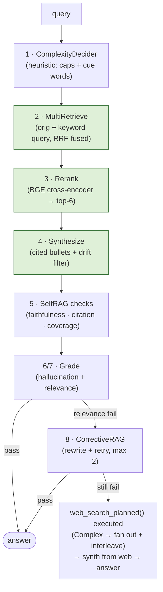
*The full hand-rolled pipeline. The **green slice (nodes 2-3-4)** IS the §3.2 single-pass arm; nodes 1, 5, 6/7, 8 are the Self-RAG/CRAG half. Note node 8 terminates **by construction** - a counted `for i in range(2)` that exhausts and returns its best attempt - where §3.2's LangGraph rewrite cycle had no built-in counter and aborted with `GraphRecursionError`.*

**Block A — retrieve and synthesize (nodes 1-4, the single-pass slice):**

```python
# Shared stopword sets — small for overlap SCORING (faithfulness/coverage/drift), large for keyword
# RETRIEVAL queries. _KEYWORD_STOPWORDS is a superset, so the shared core lives in one place.
_STOPWORDS = frozenset({"the", "a", "an", "of", "to", "in"})
_KEYWORD_STOPWORDS = _STOPWORDS | {
    "and", "or", "is", "are", "was", "were", "what", "who", "where", "when", "why", "how",
    "did", "do", "does", "with", "for", "on", "at", "by", "this", "that", "those", "these",
    "be", "been", "have", "has", "had", "i", "you", "he", "she", "it", "we", "they",
    "my", "your", "their"}

# Node 1: ComplexityDecider — heuristic, routes to optional decomposition (Phase 7)
def decide_complexity(query):
    cap  = len(re.findall(r"\b[A-Z][a-zA-Z]+\b", query))          # named-entity count
    cues = sum(c in query.lower() for c in _COMPLEX_CUES)         # "compare","vs","and",...
    score = min(cap, 4)*0.15 + min(cues, 3)*0.25 + (0.2 if " and " in query.lower() else 0)
    return {"label": "Complex" if score >= 0.5 else "Simple", "score": round(score, 3)}

# Node 2: MultiRetrieve — original + keyword-only query, fused with Reciprocal Rank Fusion
def multi_retrieve(query, k=30, rrf_k=60):
    variants = [query]
    kw = _keyword_variant(query)                                 # drop _KEYWORD_STOPWORDS (~40)
    if kw and kw != query.lower(): variants.append(kw)
    rrf = {}
    for v in variants:
        for rank, h in enumerate(_retrieve_qdrant(v, k=k), start=1):   # dense kNN over Qdrant
            s = 1.0 / (rrf_k + rank)                             # Cormack RRF weight
            rrf[h["id"]] = ({**h, "_rrf_score": rrf[h["id"]]["_rrf_score"] + s}
                            if h["id"] in rrf else {**h, "_rrf_score": s})
    return sorted(rrf.values(), key=lambda x: -x["_rrf_score"])[:k]

# Node 3: Rerank — BGE cross-encoder over (query, passage), keep top-6
def rerank(query, hits, top_k=6):
    scores = _reranker._model.predict([(query, h["text"]) for h in hits])
    return [h for h, _ in sorted(zip(hits, scores), key=lambda x: -x[1])][:top_k]

# Node 4: Synthesize — cited bullets + DRIFT FILTER (anti-hallucination, §3.1) + CANONICAL abstention
SYNTHESIZE_PROMPT = ("Use ONLY the passages below. Answer in 3-5 bullets. Each bullet MUST "
                     "include a citation [#N]. Do not invent claims. If the passages do not "
                     "contain the answer, reply with EXACTLY: I don't know"
                     "\n\nPassages:\n{passages}\n\nQuestion: {q}\nAnswer:")
def synthesize(query, hits):
    if not hits: return {"answer": "I don't know", "drift_filtered": 0}   # canonical abstention
    passages = "\n\n".join(f"[#{i+1}] {h['text']}" for i, h in enumerate(hits))
    text = omlx.chat.completions.create(model=MODEL, temperature=0.0, max_tokens=400,
        messages=[{"role": "user", "content": SYNTHESIZE_PROMPT.format(
            passages=passages[:8000], q=query)}]).choices[0].message.content.strip()
    kept, dropped = [], 0
    for b in (ln.strip() for ln in text.splitlines() if ln.strip()):
        m = re.search(r"\[#(\d+)\]", b)
        if m and 0 <= int(m.group(1)) - 1 < len(hits):
            bk = set(re.findall(r"\w+", b.lower())) - _STOPWORDS
            if bk & set(re.findall(r"\w+", hits[int(m.group(1)) - 1]["text"].lower())):
                kept.append(b)                                   # bullet supported by its cited passage
            else: dropped += 1                                   # DRIFT: drop unsupported bullet
        else: kept.append(b)
    return {"answer": "\n".join(kept), "drift_filtered": dropped}
```

**Walkthrough (A):**
- **Node 1 `decide_complexity`** scores the query (named-entity count + cue words like "compare"/"vs"/"and") and labels it Simple/Complex - a cheap router that gates optional LLM decomposition (Phase 7). No model call.
- **Node 2 `multi_retrieve`** runs the query *twice* - verbatim and stripped-to-keywords - and fuses the two ranked lists with **Reciprocal Rank Fusion** (`1/(60+rank)`). Two query phrasings catch passages either alone would miss; RRF needs no score calibration.
- **Node 3 `rerank`** is precision after recall: the BGE cross-encoder rescues the top-6 by scoring each `(query, passage)` pair directly. **Nodes 2-3-4 are exactly `run_single_pass`** - the §3.2 single-pass arm.
- **Node 4 `synthesize`** is the §3.1 generation diagram in code: the grounded prompt (cite `[#N]`, **emit a canonical `"I don't know"` when the answer isn't in the passages**) **plus** the drift filter (drop any bullet whose words don't overlap its cited passage). The grounded prompt is *why* single-pass abstains instead of hallucinating; the *canonical* abstention is what makes that abstention reliably detectable downstream — the key fix in the v1→v3 arc below.
- **Two stopword sets, two jobs.** `_KEYWORD_STOPWORDS` (the large set) builds keyword *retrieval queries* — drop question words/auxiliaries/pronouns so the dense search keys on distinctive content terms. `_STOPWORDS` (the small set) is for overlap *scoring* (faithfulness / coverage / drift filter) — drop only grammatical glue, because question words still carry signal when comparing an answer against its cited passage. Same idea (ignore noise words), opposite aggressiveness — so they share one core: `_KEYWORD_STOPWORDS = _STOPWORDS | {...}`.

**Block B — self-check, grade, correct, orchestrate (nodes 5-8 + the pipeline):**

```python
# Node 5: SelfRAG checks — programmatic (keyword overlap), not an LLM judge
def selfrag_checks(answer, hits, query):
    bullets = [ln for ln in answer.splitlines() if ln.strip()]
    cited = [b for b in bullets if re.search(r"\[#\d+\]", b)]
    faithful = sum(1 for b in cited
        if (m := re.search(r"\[#(\d+)\]", b)) and 0 <= int(m.group(1))-1 < len(hits)
        and len((set(re.findall(r"\w+", b.lower())) - _STOPWORDS) &
                (set(re.findall(r"\w+", hits[int(m.group(1))-1]["text"].lower())) - _STOPWORDS)) >= 3)
    qk = set(re.findall(r"\w+", query.lower()))
    cit  = len(cited) / (len(bullets) or 1)
    faith = (faithful / (len(bullets) or 1)) if cited else 0.0
    cov  = len(qk & set(re.findall(r"\w+", answer.lower()))) / max(len(qk), 1)
    return {"citation_rate": cit, "faithfulness_rate": faith, "coverage": cov,
            "confidence": round((cit + faith + cov) / 3, 3)}

# Nodes 6/7: Grade — hallucination (faithful + cited) and relevance (query overlap)
def grade_hallucination(answer, hits, query):
    sr = selfrag_checks(answer, hits, query)
    return {"pass": sr["faithfulness_rate"] >= 0.5 and sr["citation_rate"] >= 0.5, "selfrag": sr}
GRADE_RELEVANCE_PROMPT = ("Does the ANSWER actually answer the QUESTION with specific information, "
                          "or decline / say it's insufficient? Reply ONE word: YES or NO.\n\n"
                          "Question: {q}\nAnswer: {a}\nVerdict:")
def grade_relevance(answer, query):                      # v3 — see the arc below
    if "i don't know" in answer.lower():                 # canonical abstention → deterministic, no LLM
        return {"pass": False, "verdict": "abstain"}
    verdict = (omlx.chat.completions.create(model=MODEL, temperature=0.0, max_tokens=5,
        messages=[{"role": "user", "content": GRADE_RELEVANCE_PROMPT.format(q=query, a=answer)}]
        ).choices[0].message.content or "").strip().lower()
    return {"pass": verdict.startswith("y"), "verdict": verdict[:12]}  # LLM fallback for partial answers

# Node 8: CorrectiveRAG — rewrite the query and retry, BOUNDED by max_rewrite (no runaway)
def corrective_loop(query, top_k=6, max_iters=THRESHOLDS.max_rewrite):  # max_rewrite = 2
    q, out = query, {}
    for i in range(max_iters):
        q = rewrite_query(q) if i > 0 else q                     # LLM rephrases for recall
        rr = rerank(q, multi_retrieve(q), top_k); sy = synthesize(q, rr)
        out = {"answer": sy["answer"], "selfrag": selfrag_checks(sy["answer"], rr, q),
               "grade_relevance": grade_relevance(sy["answer"], q), "iteration": i}
        if out["grade_relevance"]["pass"] and out["selfrag"]["confidence"] >= THRESHOLDS.selfrag_conf:
            break
    return out

# web backend precedence: SEARXNG_URL → TAVILY_API_KEY → DuckDuckGo (keyless except Tavily)
def web_search(query, k=4):
    if os.getenv("SEARXNG_URL"):                       # free local metasearch — best ranking (§ below)
        import urllib.parse, urllib.request
        u = os.environ["SEARXNG_URL"].rstrip("/") + "/search?" + urllib.parse.urlencode(
            {"q": query, "format": "json"})
        with urllib.request.urlopen(u, timeout=15) as r:
            return [d["content"] for d in json.load(r).get("results", [])[:k] if d.get("content")]
    if os.getenv("TAVILY_API_KEY"):
        from tavily import TavilyClient
        r = TavilyClient(api_key=os.environ["TAVILY_API_KEY"]).search(query, max_results=k)
        return [d["content"] for d in r.get("results", []) if d.get("content")]
    from ddgs import DDGS
    with DDGS() as d: return [x["body"] for x in d.text(query, max_results=k) if x.get("body")]

# fan-out: a Complex "compare X and Y" query → decompose → web-search each atomic sub-query →
# round-robin INTERLEAVE (fair under synthesize's 8000-char passage cap) → dedup union.
# Simple queries stay single-shot. This is execute_plan()'s corpus fan-out, on the WEB surface.
def web_search_planned(query, decision, k=8):
    if decision.get("label") != "Complex":
        return web_search(query, k)
    from decompose import decompose_query
    lookups = [n for n in decompose_query(query) if n.get("type") != "synthesis"]
    per_sub = [web_search(n["text"], k) for n in lookups]      # each atomic figure, its own search
    docs = [h for i in range(max(map(len, per_sub), default=0))
            for h in (s[i] for s in per_sub if i < len(s))]    # q1d1,q2d1,q1d2,q2d2,... interleaved
    return list(dict.fromkeys(docs))                           # dedup, preserve interleaved order

# Orchestrator: single pass → grade → corrective loop → EXECUTE fanned-out web fallback
def answer(query, top_k=6):
    decision = decide_complexity(query)                         # Simple/Complex — gates the web fan-out
    rr = rerank(query, multi_retrieve(query), top_k); sy = synthesize(query, rr)
    gr = grade_relevance(sy["answer"], query)
    out = {"query": query, "answer": sy["answer"], "hits": rr, "grade_relevance": gr, "source": "corpus",
           "decision": decision, "selfrag": selfrag_checks(sy["answer"], rr, query),
           "drift_filtered": sy["drift_filtered"]}
    if not gr["pass"]:                                           # corpus retrieval looked off-topic
        out["corrective"] = corrective_loop(query, top_k)
        if not out["corrective"]["grade_relevance"]["pass"]:    # STILL bad → EXECUTE web search
            web_docs = web_search_planned(query, decision)      # fan out if Complex; else single-shot
            wsy = synthesize(query, [{"id": f"web{i}", "text": d, "payload": {}}
                                     for i, d in enumerate(web_docs)])    # ground the web docs too
            out["answer"], out["source"] = wsy["answer"], "web"
            out["next_action"] = {"type": "web_search", "executed": True}
    return out
```

**Walkthrough (B):**
- **Node 5 `selfrag_checks` is three *programmatic* self-evaluations**, not an LLM judge: citation rate (bullets that cite), faithfulness rate (bullets whose words overlap their cited passage by ≥3 keywords), and coverage (query keywords present in the answer). Their mean is a `confidence` score. Deterministic and free - but coarse (keyword overlap, not semantics).
- **Nodes 6/7 `grade_*`** decide whether the answer is good enough or the corrective loop must fire (`answer()` checks `if not gr["pass"]`). `grade_hallucination` is programmatic (faithfulness ≥ 0.5 *and* citation ≥ 0.5). `grade_relevance` went through **three versions** (the arc below): keyword overlap (fooled by question-echoing abstentions → loop unreachable), then an LLM YES/NO judge (noisy on Gemma), and finally a **deterministic short-circuit on the canonical `"I don't know"`** plus an LLM fallback for genuine partial answers. The code shown is that final version.
- **Node 8 `corrective_loop` terminates by construction.** It's a counted `for i in range(max_iters)` (`max_rewrite=2`): the `break` is an early exit when the answer is already good, but even if the grade *never* passes, `range(2)` exhausts and the loop returns its best attempt. Termination is guaranteed by the loop's *shape*, not by any success condition - you can prove it halts by reading one line. Contrast §3.2: the LangGraph structural rewrite is a graph *cycle* with no built-in counter, so on a never-passing grade it runs until the runtime's `recursion_limit` aborts it with `GraphRecursionError`. Same idea; the `for` **bounds itself and fails safe** (returns a result), the cycle **borrows a runtime guard and fails loud** (raises). (Both are finite - a `for range(N)` is never *unbounded* even for huge `N` - so "runaway" here means "loops until an external limit crashes it," not "loops forever.")
- **`answer()` is the CRAG decision in plain Python:** one forward pass; if relevance fails, run the corrective loop; if that *still* fails, **search the web and synthesize from the results**. That escalation - corpus → rewrite → web - is exactly what `crag_variant.py` does as a LangGraph graph. (This started as a *suggestion* - `next_action=web_search` for the host to act on; one `web_search()` call in the fallback now *executes* it inline, so the pipeline answers out-of-corpus 10/10 like CRAG - see the result below.)
- **The web fallback *fans out* on Complex queries (`web_search_planned`).** A single "compare X and Y" web search is doomed - no one page holds both figures - so a Complex-labelled query is **decomposed** (the Phase 7 planner) into atomic sub-queries, each web-searched independently, the results **round-robin interleaved** and unioned, then synthesized against the original query. This is `execute_plan()`'s corpus fan-out applied on the *web* surface (out-of-corpus answers live on the web, not in Qdrant). Simple queries stay single-shot - no planner cost. Note this fan-out is **automatic** (gated only by `decide_complexity`), unlike the *corpus* decomposition which stays behind `ENABLE_DECOMPOSITION=1`. The "compare BNSF vs Berkshire Energy 2023 revenue" case that motivated it - and why the web *backend* matters as much as the fan-out - is the full debug log in §3.3.1 below.

> [!tip] Hand-rolled vs LangGraph CRAG — when to reach for each
> Same corrective-RAG idea, two engineering trade-offs:
> - **Hand-rolled (`baseline_handrolled.py`)**: every node is a plain function - trivial to read, unit-test, and step through in a debugger; loops are bounded by a `for range(...)` by construction; zero framework. Best for *learning the algorithm* and for small, stable pipelines.
> - **LangGraph (`crag_variant.py`)**: graph state, conditional edges, checkpointing, streaming, and a drawable graph for free - but cyclic paths need an explicit `recursion_limit` guard (the §3.2 runaway). Best when the graph grows, branches, or needs observability/resumability.
> The hand-rolled version is the better *teacher*; the LangGraph version is the better *platform*. Knowing both - and that they implement the same CRAG - is the point of Phase 3.

**Run it on out-of-corpus (`uv run python src/baseline_handrolled.py --out-of-corpus`) - two versions, a real debugging arc:**

***v1 — keyword `grade_relevance`: the corrective loop fires 0/10 (never runs).*** It scored **query↔answer keyword overlap**, and the abstention *echoes the question* (*"the passages do not contain information regarding **the most capable Claude model … in 2026**…"*) → overlap ≈ 1.0 ≥ 0.2 → **pass**. `answer()` runs the loop only `if not gr["pass"]`, so a fooled "pass" skipped the loop and the web escalation entirely. **The corrective branch was present but unreachable** - so comparing it to `crag_variant.py` was not apples-to-apples.

***v2 — LLM `grade_relevance` ("did the ANSWER actually answer, or abstain?"): the loop fires and `rewrite_query` is triggered.*** Proof - the literal rephrasings it produced:

```
- ...most capable Claude model...2026?  | grade:no  | corrective:yes rewrites:1 | web_search
    rewrite_query fired → 'Which Anthropic Claude model is the most powerful version released during 2026?'
- Which team won the 2025 NBA Finals?   | grade:no  | corrective:yes rewrites:1 | web_search
    rewrite_query fired → 'Who was the champion of the 2025 NBA championship series?'
- ...newest Apple silicon chip...2025?  | grade:no  | corrective:yes rewrites:1 | web_search
    rewrite_query fired → 'Which latest Apple M-series processor was unveiled in 2025?'
  ...
out-of-corpus (10 q): corrective fired 5/10 | rewrites 1 each | suggested web_search 4/10
```

- **`rewrite_query` genuinely fires** - the rephrasings are visibly different queries. `rewrites:1` (not 2) because the loop's first pass `i=0` reuses the original query; `rewrite_query` only runs at `i=1`. The corrective machinery is real and reachable once the grader works.
- **But it fires only 5/10 - the local judge is inconsistent.** Gemma graded 5 of 10 *identical-style* abstentions as "yes, answered," so correction is *noisily* gated.

**Why v2 is still noisy - same model, different reliability.** `crag_variant.py`'s evaluator scored the corpus **0.00 on all 10 - consistent** - while this LLM `grade_relevance` flip-flops, *on the same Gemma*. Two reasons: **(a) different target** - CRAG grades the **retrieved docs** ("can these docs answer?"), which are unambiguously off-topic (easy call); this grades the **answer text** ("did this answer answer?"), an abstention that *echoes the question* (hard call - linguistically *about* the topic). **(b) different output** - CRAG emits a **0-1 score binned by a threshold** (`≤0.3 → web`), which absorbs wobble; this emits a **binary YES/NO**, which converts the same wobble into a hard flip. Reliability is a property of the *harness* (what you judge + how you read it), not the weights.

***v3 — fix the *generator*, not the judge: `synthesize()` emits a canonical `"I don't know"`.*** Rather than build a smarter judge, make the abstention unambiguous at the source. Change the synthesis prompt to *"if the passages do not contain the answer, reply with EXACTLY: I don't know,"* and let `grade_relevance` short-circuit on it (a substring check - no LLM call):

```
out-of-corpus (10 q): corrective fired 10/10 | web search EXECUTED 10/10 | answered via web 10/10
   web answer: * The 2025 Nobel Prize in Physics → Clarke, Devoret, Martinis [#1]. *  (grounded, [#N]-cited)
   steps: decide→Simple | retrieve→30 after RRF | rerank→top-6 | synth→1 bullet | selfrag→conf=0.0
          | halluc→FAIL | rel→FAIL (abstain) | corrective→FAIL | web→4 docs → re-synth | final→source=web
```

Each row's `steps:` line is an execution trace (`out["steps"]`, rendered by `_fmt_steps`) - it makes the **corpus → abstain → corrective → web** path visible per query, which is how you *confirm* the pipeline took the route you think it did (the recurring §3.2/§3.3 theme: every wrong prediction was caught by logging the actual path). Two production touches worth copying from the current code: the web backend follows a **precedence chain** - `SEARXNG_URL` (free local metasearch) → official `tavily` SDK (the `langchain_community` wrapper was sunset in LangChain 0.3.25) → DuckDuckGo - so the best free option wins when present and it degrades to keyless DDG otherwise; and the fallback **splits its `except`** - a missing web dependency (`ImportError`) is a *config bug* that breaks every query → **fail loud** with a fix hint; a network/API/no-results miss is *per-query* → **fail soft** (record `web_error`, abstain). Same `try`, two failure classes, two responses.

Now it fires **10/10, deterministically** - the Gemma flip-flop is gone, because detecting `"I don't know"` is a string match, not a judgment. This is the cleanest of the three fixes: a canonical abstention moves reliability **off the model entirely**, and it *retroactively repairs v1's keyword grader too* (a bare `"I don't know"` no longer echoes the question → overlap ≈ 0). The transferable rule: **when you can make an upstream output canonical, do that instead of building a smarter downstream classifier.**

> [!note] The arc, and what each step taught
> **v1** keyword grader → **0/10** (the loop was unreachable - grader fooled by the question-echoing abstention). **v2** LLM-judges-the-answer → **5/10** (Gemma noisy: a hard target + a brittle binary output). **v3** canonical `"I don't know"` + substring check → **10/10** (deterministic). Three transferable rules fall out: **(a)** grade the **retrieval**, not the answer text (CRAG's `evaluate` - the docs are unambiguously irrelevant); **(b)** ask for a **score + threshold**, not a binary, so the judge's uncertainty has a buffer; **(c)** best of all, make the **generator** emit a canonical abstention so detection needs no judge. Final step to make it fully apples-to-apples: *execute* the web search instead of suggesting it - one function (`web_search()`, Tavily/DuckDuckGo) wired into `answer()`'s fallback - and the pipeline **answers all 10 from real, grounded ([#N]-cited, drift-filtered) web evidence**, exactly like CRAG. The only remaining difference is *plain functions vs a LangGraph graph*. The bounded loop held throughout: one rewrite per fire, no runaway.

**One web search isn't enough for a comparison — fan out, then mind the *backend*.** The 10/10 out-of-corpus run above used *single-entity* questions ("who won the 2025 NBA Finals?"). A **multi-hop** question exposes a second failure: ask `Compare BNSF Railway and Berkshire Energy 2023 revenue` and a single web search returns generic hits with no one passage holding *both* figures → the pipeline (correctly) abstains. The fix is `web_search_planned` (above): decompose → search each atomic sub-query → interleave → synthesize. But fixing the *fan-out* exposed a third failure - the *backend's ranking*:

| Backend / path | BNSF 2023 | BHE 2023 | Outcome |
|---|---|---|---|
| any, single-shot comparison | — | — | full `I don't know` |
| Tavily, fan-out (k=6) | `$23.876B` ✓ | `**** billion` (Statista paywall) | half-grounded |
| DuckDuckGo, fan-out | `$23.876B` ✓ | `I don't know` | worse (DDG dropped BHE) |
| **SearXNG, fan-out (k=8)** | **`$23.876B` ✓** | **`US$26.198B` ✓** | **both grounded + cited** |

*Numbers from `baseline_handrolled.py` probes, 2026-06-11 — a representative SearXNG run.* Tavily and DuckDuckGo **both** rank a *paywalled* Statista snippet (`**** billion`) above the free Wikipedia figure for BHE - so swapping between them can't fix it (they share ranking signals). A **SearXNG** metasearch aggregates Google + Startpage and *reranks*, floating Wikipedia into the top results, so both figures ground. That asymmetry - same query, opposite outcome on a metasearch vs. a single engine - is the teaching point: **two retrievers that share a backend aren't an independent confirmation of "unreachable."** ⚠️ **Live web ranking is non-deterministic** - repeat runs reorder results, so a given call may surface a weaker source (e.g. a `$23.35B` 2024-corporate figure instead of the `$23.876B` 2023 number, or a wrong BHE sub-segment). SearXNG makes the authoritative free source *reachable in the top-k*, not *guaranteed first* - which is exactly why the pipeline grounds what the passages contain and abstains rather than fabricates when they're thin. Full diagnosis (including a *wrong* conclusion of mine that SearXNG corrected): §3.3.1 below.

> [!abstract] Phase 3 — lessons learnt
> 1. **CRAG = retrieve → *score the retrieval* → route (corpus / web / both).** A *scored evaluator*, not a yes/no grader, is what lets it escalate **out of** the corpus — where the rewrite loop could only re-ask the same empty corpus.
> 2. **Evaluator quality decides whether correction ever fires.** The *same* Gemma was reliable grading **docs** with a **score + threshold** (CRAG: 0.00 ×10) and noisy grading the **answer text** with a **binary** (hand-rolled v2: 5/10). Grade the retrieval, not the answer; prefer a score over a label.
> 3. **A canonical abstention beats a smarter judge.** Making `synthesize()` emit `"I don't know"` turned detection into a substring match — **0/10 → 10/10, deterministic** — and repaired *every* grader version at once. Fix the producer, not the consumer.
> 4. **Bound loops by construction.** The hand-rolled `for range(2)` terminates and returns its best attempt; the LangGraph cycle needed an external `recursion_limit` and crashed on out-of-corpus (§3.2). Same algorithm, safer shape.
> 5. **Suggestion vs execution is a one-function switch.** The hand-rolled pipeline first *emitted* `next_action=web_search` (host-mediated — testable, auditable), then *executed* `web_search()` inline (autonomous — answers 10/10 from real web evidence); the change was a single function call, not an architecture rewrite. `crag_variant.py` executes by construction. Neither posture is strictly better — pick per how much control vs autonomy you want — but switching is cheap.
> 6. **Verify branches by running the trigger.** "Is the rewrite fired?" / "why 10/10 answered?" — three predicted behaviours this lab got wrong were only caught by logging the actual path (rewrite never fired in v1; single-pass *abstained* not hallucinated; CRAG count was Tavily-vs-DDG). A conditional branch's real behaviour is unknown until you feed it the case it's meant to catch.
> 7. **Fan out multi-hop questions, and the *backend* is part of the retriever.** A "compare X and Y" web search is doomed single-shot; decompose → search each atomic sub-query → interleave → synthesize, and both figures ground. But two engines (Tavily, DDG) failing the *same* way isn't a hard ceiling - they share ranking signals - a **metasearch (SearXNG)** that reranks across engines surfaced the free figure both buried. Decomposition belongs on whichever surface holds the answer (corpus *or* web); retrieval quality is the *combination* of query shape **and** backend ranking. (Full arc + a corrected wrong conclusion: §3.3.1 below.)

### 3.3.1 — Web-fallback decomposition: full debug log (2026-06-11)

> The full arc behind §3.3's fan-out + SearXNG result. It started as *"why didn't my RAG do a web search?"* and ended with three real fixes — query fan-out, result interleaving, and a metasearch backend — plus one corrected wrong conclusion of my own. Every number traces to a runnable probe, not prose.

#### The symptom

Testing the live MCP server in Claude Desktop:

```
Use agentic-rag to answer: Compare BNSF Railway and Berkshire Energy 2023 revenue.
```

`rag_query` returned `"I don't know"`. Claude then answered from its **own training memory** (`BNSF ≈ $23.9B`, `BHE ≈ $26.0B`) and *offered* to search the web — making it look like the RAG had skipped web search entirely.

#### Layered diagnosis — three questions, three different fixes

The single symptom ("I don't know") hid three independent layers. Running probes separated them; stopping at layer 1 would have debugged the wrong thing.

| Layer | Question | Probe finding |
|-------|----------|---------------|
| 1 | Did the web fallback **run**? | **Yes** — `source: web`, `next_action.executed: True`, `web_error: None` |
| 2 | Did web **return docs**? | **Yes** — 4 docs (Tavily) |
| 3 | Did those docs **contain the answer**? | **No** — for the *comparison* phrasing, no single passage held both figures |

And a fourth, separate finding about the **host**, not the pipeline:

> The numbers Claude showed (`$26.0B`) did **not** come from the tool. The tool returned `"I don't know"`. The host model **overrode the abstaining tool with parametric memory** — and flagged it itself ("working from memory rather than the document"). This is exactly the judgment-atrophy failure mode: a confident answer that *looks* grounded but isn't.

```mermaid
%%{init: {'theme':'default', 'themeVariables': {'fontSize':'20px'}}}%%
flowchart TD
  S["symptom: 'I don't know'<br/>+ host gives $26.0B from memory"] --> L1{"web ran?"}
  L1 -->|"yes (source=web)"| L2{"web returned docs?"}
  L2 -->|"yes (4 docs)"| L3{"docs contain<br/>BOTH figures?"}
  L3 -->|"no — single-shot<br/>comparison search"| ABS["synthesize() correctly<br/>abstains (no fabrication)"]
  S -.->|"separate issue"| HOST["host bypassed tool,<br/>answered from memory"]
  classDef bad fill:#fde,stroke:#c44; classDef ok fill:#dfd,stroke:#4a4
  class ABS ok; class HOST bad
```

#### Probe evidence — single-shot vs atomic

The comparison query failed, but its **atomic** sub-queries each grounded cleanly (Tavily):

```
Q: "BNSF Railway 2023 annual revenue"
   source=web → "$23.876 billion, an 8% decrease from 2022 [#1]"   ✓
Q: "Berkshire Hathaway Energy 2023 annual revenue"
   source=web → web ran, but top doc is a paywalled Statista snippet ("**** billion")   ✗
Q: "Compare BNSF Railway and Berkshire Energy 2023 revenue"
   source=web → "I don't know"   ✗ (no single passage holds both)
```

**Conclusion:** the bottleneck is *query shape* and *passage content*, not connectivity. A "compare X and Y" question is a doomed single web search; two atomic lookups are not.

#### Fix 1 — observability (`mcp_server.py`)

`rag_query` didn't return `source`, so the host couldn't tell web had already run and re-offered it. Added `source` + `web_docs_found` to the tool's return — the orchestrating model now reasons from the actual path, not a guess.

#### Fix 2 — fan out the web fallback (`web_search_planned`)

The corpus path already decomposed (gated behind `ENABLE_DECOMPOSITION=1` via `execute_plan`), but the **web fallback searched the original `query` as one shot**. The fix: when `decide_complexity` labels a query Complex, decompose into atomic sub-queries and web-search each `lookup` independently, then union the passages — the same idea as the corpus fan-out, applied on the *web* surface because out-of-corpus answers live on the web.

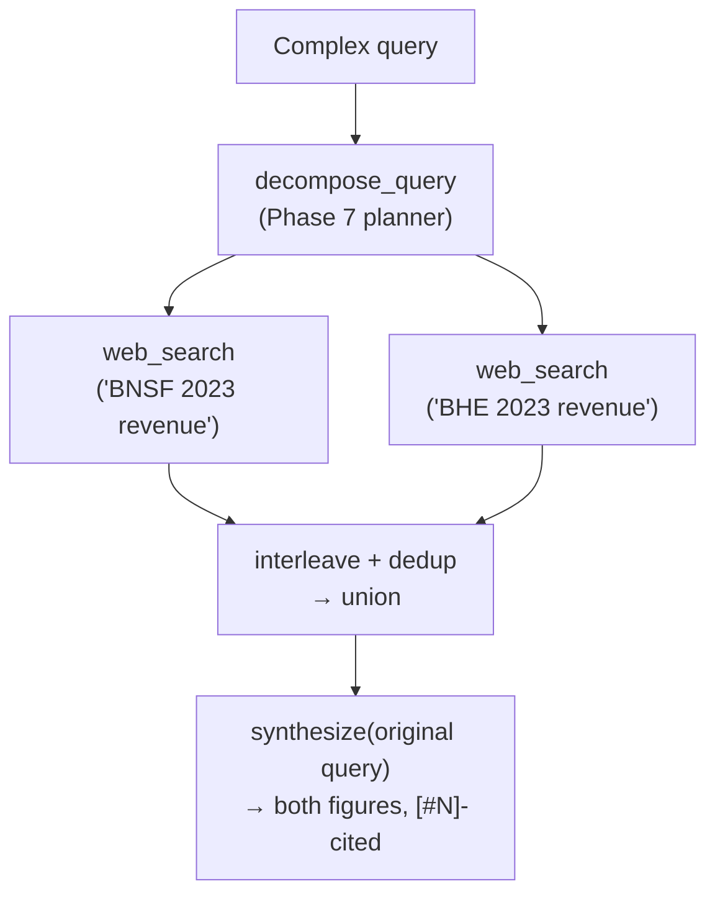

Result: BNSF went from **total abstain → `$23.876 billion [#1]`**, cited. The architecture was correct; the second entity was still weak — which surfaced the next bug.

#### Fix 3 — interleave the fan-out results (fairness)

Appending *all* of sub-query-1's docs, then *all* of sub-query-2's, biases every comparison: `synthesize()` caps passages at 8000 chars, so the **second entity gets truncated out**. Fix: **round-robin interleave** (`q1d1, q2d1, q1d2, q2d2, …`) so both entities sit near the top. Measured effect: BHE's best doc moved from `[#7]` → `[#2]` across the two runs. A real bug I'd *introduced* by doubling the doc count — not a tuning knob.

#### The wrong conclusion (and its correction)

After Tavily and DuckDuckGo *both* failed to ground BHE, I concluded:

> *"The bottleneck is the source, not the engine — engine swap ruled out."*

**This was wrong, and SearXNG proved it.** BHE's figure was on a free page the whole time — **Wikipedia, `US$26.198 billion`, plain text**. Tavily and DDG both ranked Statista's *paywalled* snippet above Wikipedia, so I never saw it and wrongly inferred a hard ceiling. Two retrievers that **share ranking signals** failing the same way is *not* independent confirmation of "unreachable" — it's one bias sampled twice.

#### Fix 4 — SearXNG metasearch backend

A local [SearXNG](https://github.com/searxng/searxng) instance aggregates Google + Startpage and **reranks**, floating Wikipedia above the paywall snippet. Wired in as the top of the `web_search` precedence chain (free, no key): `SEARXNG_URL → TAVILY_API_KEY → DuckDuckGo`. With it, the comparison query grounds **both** figures, both cited (`BNSF $23.876B [#5]` + `BHE US$26.198B [#4]`). `k` sensitivity: the authoritative free source ranks ~3rd–4th, so per-sub-query depth `WEB_FANOUT_K` defaults to **8** (at 6 the synthesizer settled for an imprecise `$25.6B`).

#### Fix 5 — re-grade the shipped answer

Running the CLI on the fixed pipeline surfaced a *new* contradiction: the top-level `answer` was the grounded 3-bullet web answer, but right beside it sat `grade_relevance: abstain`, `selfrag.confidence: 0.0`, `grade_hallucination: FAIL`. The output *looked* broken while being correct. Cause: the web fallback overwrote `out["answer"]` but **never re-ran the graders** — those scores still described the *discarded corpus pass*. Any consumer keying on `grade_relevance.pass` or `selfrag.confidence` (the MCP host, an eval harness) would wrongly reject a correct answer.

The fix: after the fallback, re-run `selfrag_checks` + `grade_hallucination` + `grade_relevance` against the **web** answer, and flip `out["hits"]` to `web_hits` so the answer's `[#N]` citations resolve against the passages they actually cite (otherwise faithfulness compares web bullets to corpus garbage → back to `0.0`). Measured: the BNSF-vs-BHE answer flips from `abstain` / `0.0` to **`grade_relevance.pass=true`, `confidence=0.875`** — answer text unchanged. A grade is a claim *about* an artifact; when a branch swaps the artifact, re-grade at the swap or every downstream metric reads the wrong pass. (The `corrective.answer` stays `"I don't know"` — that's the *corpus* rewrite, which correctly abstains; only the top-level grades, which describe what shipped, are updated.)

#### Fix 6 — accuracy (per-sub-query rerank) + reproducibility (cache) + promotion to shared

**The "stable but wrong" trap.** The reproducibility cache (below) made the answer *deterministic* — but a deterministic answer can be reproducibly *wrong*. The fan-out had unioned both entities' web docs and reranked that union against the *whole* comparison query; the cross-encoder scored BHE's docs higher, so the top-k came back BHE-heavy → 3 BHE bullets, **BNSF's `$23.876B` silently dropped**. Stability was hiding an accuracy regression.

**The accuracy fix — rerank scope.** Rerank **each sub-query's docs against its OWN sub-query** (not the comparison) and keep the top few, then interleave — so each entity's figure-passage surfaces in its own lane and neither dominates. Same cross-encoder, different *scope*; that scope was the whole bug. The BNSF-vs-BHE answer now carries one grounded, cited figure **per entity**. (`rerank_results` in `shared/web_toolkit`.)

**Reproducibility — an original-query-level cache.** A metasearch is non-deterministic: the same query returns a different pool run-to-run (engines bot-block / time out / rotate; language is header-inferred — pinning `SEARXNG_LANGUAGE` + `SEARXNG_ENGINES` shrinks but can't remove it, and pinning a *small* engine set backfires when Google's scraper is blocked → empty pool). So web results are cached on disk, at the **original-query** level: the LLM decomposer's sub-query phrasing varies run-to-run, so per-sub-query keys miss — the stable key is the original question. First run hits the live web; every repeat replays the same pool → the same answer. `WEB_CACHE=0` forces live.

**Promotion to shared.** `web_search` (backend + cache) and `rerank_results` were duplicated across `baseline_handrolled.py` and `crag_variant.py`, so they moved into **`shared/web_toolkit/`** (one source of truth — `crag_variant` is upgraded from Tavily/DDG-only to the SearXNG-first chain for free; the string-returning fallback is exported as `web_search_text` and imported here as `web_search`), with the SearXNG docker setup alongside in **`shared/searxng/`**. A `--trace` CLI flag prints the step-by-step process trace; default prints just the answer. *(The module later absorbed `web_fetch`/`web_browse` to become the canonical `web_toolkit` web-research package — see `shared/web_toolkit/README.md` — but the W3.7 labs use only the `web_search_text` + `rerank_results` + cache primitives shown here.)*

#### Outcome

The measured before→after across all three backends is the **§3.3 table above** (single-shot abstains → Tavily/DDG fan-out half-grounds with BHE paywalled → SearXNG fan-out grounds both). Its non-determinism caveat applies: a representative run, live ranking reorders, SearXNG makes the free source *reachable in the top-k* not *guaranteed first*. Single-entity regression check (`"Who is the CEO of OpenAI as of 2026?"`) correctly stayed `single` (Simple → no decompose) → `"Sam Altman [#1,#2,#4,#5,#7]"` — no regression. *Numbers from `src/baseline_handrolled.py` probes, 2026-06-11, against a live SearXNG on `:8080`.*

#### Transferable lessons

1. **One symptom, many layers.** "I don't know" meant *ran? returned docs? contained the answer?* — three independent fixes. Separate them with probes before touching code.
2. **Tool results must expose the path taken.** A missing `source` field made the host re-offer a step already done. Return *what ran*, not just the final string.
3. **Honest partial > confident hallucination.** The tool abstained on a figure it couldn't ground; the *host* fabricated it from memory. The tool was right. Grounding that refuses to fabricate is the property you want — verify the host doesn't undo it.
4. **Decomposition belongs on whichever surface holds the answer** — corpus *or* web. Fan out the retriever that can actually reach the fact.
5. **Two engines failing the same way ≠ a hard ceiling** if they share a backend. A metasearch that aggregates + reranks is an independent third sample. (My wrong "engine swap ruled out" was caught only by *running* the third engine, not by reasoning.)
6. **Watch for bugs you introduce while fixing one.** Doubling docs under a fixed passage cap silently truncated entity #2 — interleaving restored fairness.
7. **Grade the artifact that ships, not the one you discarded.** The web fallback swapped `answer` but not its evaluation, so a correct answer wore a stale `abstain`/`0.0`. Evaluation and generation must stay synced: re-grade at the point you swap the answer — and move its evidence (`hits`) with it, so citations resolve.

#### Files changed

- `src/baseline_handrolled.py` — `web_search_planned` (decompose + interleave), rewired `answer()` web fallback, re-grade-after-web-fallback (Fix 5), `WEB_FANOUT_K` (default 8). (The 3-tier backend + `_searxng_legacy` were promoted in Fix 6 to `shared/web_toolkit` as `web_search_text`, imported here as `web_search`.)
- `shared/web_toolkit/` — the merged web infra: `web_search_text` (3-tier `SEARXNG_URL → TAVILY_API_KEY → DDG` backend + cache) + `rerank_results`, imported by both `baseline_handrolled.py` and `crag_variant.py`.
- `src/mcp_server.py` — `rag_query` returns `source` + `web_docs_found`.
- `searxng/` — `docker-compose.yml`, `settings.yml`, `README.md` (free local backend).
- `.env.example`, `mcp-config.json` — `SEARXNG_URL` documented in the precedence chain.

---

## Phase 4 — When Does Agentic RAG Help vs Hurt? (~1.5 hours)

The honest engineering question this expansion week exists to answer. Read your Phase 2 + Phase 3 results carefully and write `observations/decision-tree.md`:

```markdown
## When to ship which RAG pipeline

### Ship single-pass (Week 3 baseline) when:
- Corpus is well-curated and queries are well-specified (e.g., enterprise doc Q&A with internal taxonomy)
- Latency budget is < 1s per query
- Cost per query matters and queries are high-volume
- You have RAGAS measuring single-pass at faithfulness ≥ 0.85

### Ship canonical Agentic RAG (Phase 1) when:
- Query distribution is mixed (some clear, some ambiguous)
- Latency budget allows 2–4× single-pass (typically 2–5 sec)
- Faithfulness on ambiguous queries dropped > 15pp in Phase 2 results
- Users care more about "answer quality even on hard questions" than "speed on easy ones"

### Ship CRAG (Phase 3) when:
- Corpus has known gaps and web fallback is acceptable (legal: probably not; consumer Q&A: yes)
- You can afford the web search latency (+1–3 sec per fallback)
- Users explicitly need answers to questions outside the local corpus
- You have a TOS-compatible web search backend wired up

### Ship Adaptive-RAG (read paper, don't implement here) when:
- Query distribution is HEAVILY skewed simple (>80% don't need agentic)
- Compute cost matters enough that running canonical Agentic on simple queries is wasteful
- You're willing to train a complexity classifier (or use LLM-as-classifier)
```

This decision tree IS the artifact of Phase 4. Bring it to interviews when asked "tell me about RAG architectures."

---

## Phase 5 — RESULTS.md and the Comparison Matrix (~1 hour)

Save as `results/RESULTS.md`. Required sections:

```markdown
# Lab 03.7 — Agentic RAG (LangGraph-Canonical Architecture)

**Date:** 2026-MM-DD
**Pipelines compared:** Week 3 single-pass (baseline) / Phase 1 canonical Agentic / Phase 3 CRAG variant
**Dev set:** Week 3's 50-Q dev set + 10-Q out-of-corpus extension

## 1. Three-Pipeline Comparison Matrix

| Metric | Single-pass | Canonical Agentic | CRAG |
|---|---|---|---|
| Faithfulness (full dev set) | x.xx | x.xx | x.xx |
| Faithfulness (Hard subset) | x.xx | x.xx | x.xx |
| Context_recall (Hard subset) | x.xx | x.xx | x.xx |
| Answer_relevancy | x.xx | x.xx | x.xx |
| Mean LLM calls/query | 1 | x.x | x.x |
| Mean latency p50 | x.x s | x.x s | x.x s |
| Mean latency p95 | x.x s | x.x s | x.x s |
| Out-of-corpus success | x/10 | x/10 | x/10 |

## 2. Quality lift on ambiguous queries

(2 paragraphs — what specifically did agentic recover that single-pass missed? Cite 2-3 example queries with side-by-side answers.)

## 3. Cost breakdown

(Mean LLM calls per query, mean wall-time, mean tokens. Show the cost multiplier vs single-pass clearly.)

## 4. Decision tree

(Copy from Phase 4 observations/decision-tree.md.)

## 5. What I learned that I did not expect

(Free-form 2-3 paragraphs.)

## 6. Bad-case journal

(One incident worth remembering — a query where agentic looped infinitely until iter cap, or a CRAG web fallback that surfaced wrong content, etc.)

## 7. Infra bridge

(Cloud infra mapping: the 5-node graph IS a state machine — cleanly maps to Argo Workflows, Step Functions, or Airflow's BranchPythonOperator. The grade-and-loop pattern IS the same as a CI pipeline's "test → fix → re-test" gate. The CRAG fallback IS the "circuit breaker pattern" from your platform-engineering background.)
```

---

## Phase 6 — Hand-rolled Self-RAG + CRAG Baseline (~2 hours)

> Added 2026-05-07. The hand-rolled pipeline is ported from the user's older personal repo `github.com/shaneliuyx/rag` (commit `dae7d6f`, 2025-08-17). The 2025 repo had a working Self-RAG + CRAG implementation on Chroma + Ollama-Gemma2:2b; this phase ports it to the 2026 curriculum stack (Qdrant + oMLX + `shared/rag_hybrid`). Pedagogical purpose: see the moving parts BEFORE LangGraph hides them. After Phase 1-4 you've used a framework; Phase 6 shows the framework's job done by hand.

The lab-03.7 directory now exists at `~/code/agent-prep/lab-03.7-agentic-rag/` with three substantive files. The full pipeline is `src/baseline_handrolled.py` (~300 LOC, single file, no LangGraph). Read end-to-end in the file; the per-node summary below names what each does.

**Architecture:**

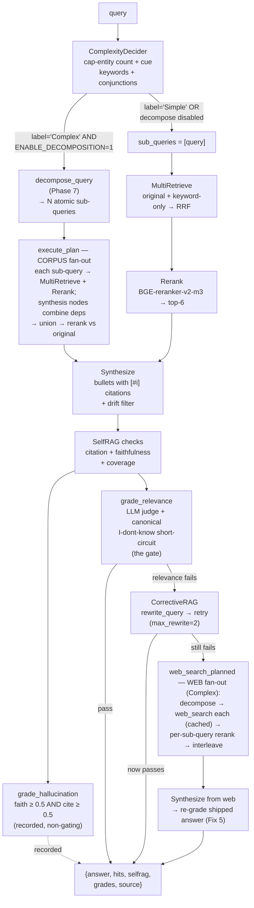
*Decomposition drives fan-out on **two** surfaces, not just the web: `execute_plan` over the **corpus** (opt-in, `ENABLE_DECOMPOSITION=1`) and `web_search_planned` over the **web fallback** (automatic for Complex). Same pattern both times — N atomic sub-queries retrieved independently, then merged + reranked — applied wherever the answer might live. The Simple path skips both and runs a single `MultiRetrieve → Rerank`.*

**Code (`src/baseline_handrolled.py` — the pipeline, top-to-bottom).** The web-search *backend*
(SearXNG → Tavily → DuckDuckGo) + on-disk reproducibility cache + cross-encoder `rerank_results`
were **merged into the `shared/web_toolkit/` package** (imported at the top as `web_search_text as web_search`), since `crag_variant.py` needs the
same backend — one source of truth. What stays in this file is the lab-specific orchestration
(`web_search_planned`, `execute_plan`, `answer`). The shared module is shown right after:

```python
"""Hand-rolled Self-RAG + CRAG pipeline (Phase 5 baseline for W3.7).

Ported from shaneliuyx/rag@dae7d6f (2025-08-17) graph/ subtree. The original
implemented this on Chroma + Ollama-Gemma2:2b; this port adapts to:

  - Qdrant (via shared/rag_hybrid for encoder + reranker)
  - oMLX OpenAI-compatible client (MODEL_SONNET / MODEL_HAIKU)
  - shared/rag_hybrid.DenseEncoder + CrossEncoderReranker (BGE-M3 + BGE-reranker-v2-m3)

Pipeline (single file, no LangGraph — that's Phase 1-4 of the lab):

    query
      → ComplexityDecider (heuristic)
      → optional LLMDecomposer (Phase 6) → topo-sort sub-queries
      → MultiRetrieve (dense kNN; original + keyword-only variants RRF-fused)
      → Rerank (BGE-reranker)
      → Synthesize (bullets with [#i] citations + drift filter)
      → SelfRAG checks (faithfulness + citation + coverage)
      → Grade hallucination + grade relevance
      → if not pass → CorrectiveRAG (rewrite + retry)
      → if still not pass → suggest web-search fallback
"""
from __future__ import annotations

import os
import re
import sys
from dataclasses import dataclass
from pathlib import Path
from typing import Any

from dotenv import load_dotenv
from openai import OpenAI
from qdrant_client import QdrantClient

_REPO_ROOT = Path(__file__).resolve().parents[2]
sys.path.insert(0, str(_REPO_ROOT / "shared"))

from rag_hybrid import (  # noqa: E402
    BGE_M3, BGE_RERANKER_V2_M3,
    CrossEncoderReranker, DenseEncoder, autoconfig,
)
from web_toolkit import (  # noqa: E402  — merged infra (shared/web_toolkit); see shared/README
    cache_lookup, cache_store, rerank_results, web_search_text as web_search,
)

load_dotenv()
omlx = OpenAI(base_url=os.getenv("OMLX_BASE_URL"), api_key=os.getenv("OMLX_API_KEY"))
MODEL = os.getenv("MODEL_SONNET") or ""

QDRANT_URL = os.getenv("QDRANT_URL", "http://127.0.0.1:6333")
QDRANT_COLLECTION = os.getenv("QDRANT_COLLECTION", "bge_m3_hnsw")


@dataclass
class Thresholds:
    """Self-RAG / Corrective thresholds (env-driven, ported from old config/settings.py)."""
    selfrag_conf: float = float(os.getenv("SELFRAG_CONF_THRESHOLD", "0.6"))
    relevance: float = float(os.getenv("RELEVANCE_THRESHOLD", "0.2"))
    max_regen: int = int(os.getenv("MAX_REGEN_ATTEMPTS", "1"))
    max_rewrite: int = int(os.getenv("MAX_REWRITE_ATTEMPTS", "2"))


THRESHOLDS = Thresholds()

# Singletons — encoder + reranker load once
_qdrant = QdrantClient(url=QDRANT_URL, timeout=60)
_encoder = DenseEncoder(autoconfig.encoder_config_for(BGE_M3))
_reranker = CrossEncoderReranker(autoconfig.recommend(BGE_M3, BGE_RERANKER_V2_M3).reranker)

# Function words stripped before keyword-overlap scoring (faithfulness / coverage /
# drift filter) so overlap reflects content words, not grammatical glue. Shared so the
# three overlap checks agree on "what counts as a meaningful word". Kept deliberately
# small: overlap scoring should only drop the most content-free words, not question
# words / auxiliaries (those still carry signal when comparing answer vs. passage).
_STOPWORDS = frozenset({"the", "a", "an", "of", "to", "in"})

# Aggressive stop set for building keyword-only RETRIEVAL queries (_keyword_variant).
# Superset of _STOPWORDS: retrieval also drops question words / auxiliaries / pronouns
# so the keyword search keys on distinctive content terms. Different job from scoring,
# hence larger — expressed as `_STOPWORDS | {...}` so the shared core lives in one place.
_KEYWORD_STOPWORDS = _STOPWORDS | {
    "and", "or", "is", "are", "was", "were", "what", "who", "where", "when",
    "why", "how", "did", "do", "does", "with", "for", "on", "at", "by",
    "this", "that", "those", "these", "be", "been", "have", "has", "had",
    "i", "you", "he", "she", "it", "we", "they", "my", "your", "their",
}


# ---------- Node 1: ComplexityDecider ----------------------------------------

_COMPLEX_CUES = [
    "compare", "vs", "versus", "difference", "differences", "and",
    "explain why", "how do", "trade-off", "trade off", "step by step",
    "all", "list every", "each",
]


def decide_complexity(query: str) -> dict[str, Any]:
    """Heuristic classifier — capitalized-entity count + cue keywords + multi-step
    conjunctions. Returns {"label": "Simple" | "Complex", "score": float}."""
    q = query.strip()
    cap_count = len(re.findall(r"\b[A-Z][a-zA-Z]+\b", q))
    cue_hits = sum(1 for c in _COMPLEX_CUES if c in q.lower())
    score = 0.0
    score += min(cap_count, 4) * 0.15      # named entities up to ~0.6
    score += min(cue_hits, 3) * 0.25       # cue keywords up to 0.75
    score += 0.2 if (" and " in q.lower() or "," in q) else 0.0
    return {"label": "Complex" if score >= 0.5 else "Simple", "score": round(score, 3)}


# ---------- Node 2: MultiRetrieve (RRF over original + keyword-only) ---------

def _keyword_variant(query: str) -> str:
    """Strip stopwords / functional words to make a keyword-only variant."""
    return " ".join(w for w in re.findall(r"\w+", query.lower())
                    if w not in _KEYWORD_STOPWORDS)


def _retrieve_qdrant(query: str, k: int = 30) -> list[dict[str, Any]]:
    qv = _encoder.encode([query])[0]
    points = _qdrant.query_points(
        QDRANT_COLLECTION, query=qv.tolist(), limit=k, with_payload=True,
    ).points
    return [
        {"id": str(p.id),
         "text": (p.payload or {}).get("text", ""),
         "payload": p.payload or {}}
        for p in points
    ]


def multi_retrieve(query: str, k: int = 30, rrf_k: int = 60) -> list[dict[str, Any]]:
    """Original-query + keyword-only-query, fuse via RRF (Cormack 1/(k+rank))."""
    variants = [query]
    kw = _keyword_variant(query)
    if kw and kw != query.lower():
        variants.append(kw)
    rrf: dict[str, dict[str, Any]] = {}
    for v in variants:
        hits = _retrieve_qdrant(v, k=k)
        for rank, h in enumerate(hits, start=1):
            cid = h["id"]
            score = 1.0 / (rrf_k + rank)
            if cid in rrf:
                rrf[cid]["_rrf_score"] += score
            else:
                rrf[cid] = {**h, "_rrf_score": score}
    fused = sorted(rrf.values(), key=lambda x: -x["_rrf_score"])
    return fused[:k]


# ---------- Node 3: Rerank ---------------------------------------------------

def rerank(query: str, hits: list[dict[str, Any]], top_k: int = 6) -> list[dict[str, Any]]:
    if not hits:
        return []
    _reranker._ensure_loaded()
    pairs = [(query, h["text"]) for h in hits]
    scores = _reranker._model.predict(pairs, batch_size=_reranker.cfg.spec.batch_size)
    reranked = [h for h, _ in sorted(zip(hits, scores), key=lambda x: -x[1])]
    return reranked[:top_k]


# ---------- Node 4: Synthesize (with [#i] citations + drift filter) ---------

SYNTHESIZE_PROMPT = """Use ONLY the passages below. Answer in 3-5 bullets.
Each bullet MUST include a citation in the form [#N] where N is the passage
number. Do not invent claims. If the passages do not contain the answer, reply
with EXACTLY this and nothing else: I don't know

Passages:
{passages}

Question: {q}

Answer (bullets with [#N] citations, or "I don't know"):"""


def synthesize(query: str, hits: list[dict[str, Any]]) -> dict[str, Any]:
    if not hits:
        return {"answer": "I don't know", "drift_filtered": 0}
    passages = "\n\n".join(f"[#{i+1}] {h['text']}" for i, h in enumerate(hits))
    resp = omlx.chat.completions.create(
        model=MODEL, temperature=0.0, max_tokens=400,
        messages=[{"role": "user", "content": SYNTHESIZE_PROMPT.format(
            passages=passages[:8000], q=query)}],
    )
    text = (resp.choices[0].message.content or "").strip()
    bullets = [ln.strip() for ln in text.splitlines() if ln.strip()]
    # Drift filter: drop bullets that share zero keywords with their cited passage
    kept, dropped = [], 0
    for b in bullets:
        m = re.search(r"\[#(\d+)\]", b)
        if not m:
            kept.append(b)
            continue
        n = int(m.group(1)) - 1
        if 0 <= n < len(hits):
            bullet_kws = set(re.findall(r"\w+", b.lower())) - _STOPWORDS
            psg_kws = set(re.findall(r"\w+", hits[n]["text"].lower()))
            if bullet_kws & psg_kws:
                kept.append(b)
            else:
                dropped += 1
        else:
            kept.append(b)
    return {"answer": "\n".join(kept), "drift_filtered": dropped}


# ---------- Node 5: SelfRAG checks (faithfulness/citation/coverage) ---------

def selfrag_checks(answer: str, hits: list[dict[str, Any]], query: str) -> dict[str, Any]:
    bullets = [ln for ln in answer.splitlines() if ln.strip()]
    n_total = len(bullets) or 1
    n_cited = sum(1 for b in bullets if re.search(r"\[#\d+\]", b))
    citation_rate = n_cited / n_total
    # Faithfulness: each bullet's keywords overlap its cited passage
    n_faithful = 0
    for b in bullets:
        m = re.search(r"\[#(\d+)\]", b)
        if not m:
            continue
        n = int(m.group(1)) - 1
        if 0 <= n < len(hits):
            bk = set(re.findall(r"\w+", b.lower())) - _STOPWORDS
            pk = set(re.findall(r"\w+", hits[n]["text"].lower())) - _STOPWORDS
            if len(bk & pk) >= 3:
                n_faithful += 1
    faithfulness_rate = n_faithful / n_total if n_cited else 0.0
    # Coverage: query keywords represented in answer
    qk = set(re.findall(r"\w+", query.lower())) - _STOPWORDS
    ak = set(re.findall(r"\w+", answer.lower()))
    coverage = len(qk & ak) / max(len(qk), 1)
    return {
        "citation_rate": round(citation_rate, 3),
        "faithfulness_rate": round(faithfulness_rate, 3),
        "coverage": round(coverage, 3),
        "confidence": round((citation_rate + faithfulness_rate + coverage) / 3, 3),
    }


# ---------- Node 6/7: Grade hallucination + grade relevance ----------------

def grade_hallucination(answer: str, hits: list[dict[str, Any]],
                        query: str) -> dict[str, Any]:
    sr = selfrag_checks(answer, hits, query)
    ok = sr["faithfulness_rate"] >= 0.5 and sr["citation_rate"] >= 0.5
    return {"pass": ok, "selfrag": sr}


GRADE_RELEVANCE_PROMPT = """Does the ANSWER actually answer the QUESTION with specific information,
or does it decline / say the context is insufficient / fail to provide the answer?
Reply with ONE word: YES (it answers) or NO (it does not).

Question: {q}
Answer: {a}

Verdict (YES/NO):"""


def grade_relevance(answer: str, query: str) -> dict[str, Any]:
    """LLM judge: did we actually ANSWER the question, or abstain?

    The old keyword-overlap version was fooled by abstentions that echo the question
    ("the passages do not contain information regarding <restates query>...") - overlap was
    ~1.0 so it scored 'relevant' and the corrective loop never fired (§3.3). An LLM detects
    'insufficient context' even when it restates the query, so the loop fires when it should -
    matching crag_variant.py's LLM evaluator (apples-to-apples)."""
    # Canonical abstention → not answered, deterministically (no LLM call, no Gemma flip-flop).
    # synthesize() now emits exactly "I don't know" when the passages lack the answer.
    if "i don't know" in answer.lower() or "i do not know" in answer.lower():
        return {"pass": False, "verdict": "abstain"}
    verdict = (omlx.chat.completions.create(
        model=MODEL, temperature=0.0, max_tokens=5,
        messages=[{"role": "user", "content": GRADE_RELEVANCE_PROMPT.format(q=query, a=answer)}],
    ).choices[0].message.content or "").strip().lower()
    return {"pass": verdict.startswith("y"), "verdict": verdict[:12]}


# ---------- Node 8: CorrectiveRAG (rewrite + retry) -------------------------

REWRITE_PROMPT = """The previous retrieval did not surface the right context.
Rewrite the user's query with synonyms and alternate phrasings to improve recall.
Keep it under 30 words. Return ONLY the rewritten query, no preamble.

Original query: {q}
Rewritten query:"""


def rewrite_query(query: str) -> str:
    resp = omlx.chat.completions.create(
        model=MODEL, temperature=0.3, max_tokens=80,
        messages=[{"role": "user", "content": REWRITE_PROMPT.format(q=query)}],
    )
    return (resp.choices[0].message.content or query).strip().split("\n")[0]


def corrective_loop(query: str, top_k: int = 6,
                    max_iters: int = THRESHOLDS.max_rewrite) -> dict[str, Any]:
    current_q = query
    last_out: dict[str, Any] = {}
    for i in range(max_iters):
        rewritten = rewrite_query(current_q) if i > 0 else current_q
        hits = multi_retrieve(rewritten)
        rr = rerank(rewritten, hits, top_k=top_k)
        sy = synthesize(rewritten, rr)
        sr = selfrag_checks(sy["answer"], rr, rewritten)
        gr = grade_relevance(sy["answer"], rewritten)
        last_out = {"hits": rr, "answer": sy["answer"], "selfrag": sr,
                    "grade_relevance": gr, "rewritten_query": rewritten,
                    "iteration": i}
        if gr["pass"] and sr["confidence"] >= THRESHOLDS.selfrag_conf:
            break
        current_q = rewritten
    return last_out


# ---------- Pipeline orchestration -----------------------------------------

# web_search backend (SearXNG → Tavily → DuckDuckGo) + on-disk reproducibility cache now live in
# shared/web_toolkit (merged infra — both this file and crag_variant.py import it; see
# shared/README). Imported at the top: `web_search_text as web_search`, `cache_lookup`, `cache_store`. What stays below
# is the LAB-SPECIFIC orchestration — web_search_planned (decompose → per-sub-query rerank →
# interleave) and execute_plan — the pieces that couple to decompose_query + rerank, not infra.


# Per-sub-query web depth for the fanned-out fallback. Higher than web_search's k=4
# default on purpose: a single atomic figure can rank below the top few (the §3.3 BHE
# case — the authoritative free source, Wikipedia's US$26.198B, ranks ~3rd-4th on SearXNG;
# at k=6 the synthesizer settled for an imprecise $25.6B, at k=8 it cites the exact figure).
# Each sub-query is its own focused search, so the extra depth is cheap and only spent on
# the rare web-fallback path.
_FANOUT_PER_QUERY_K = int(os.getenv("WEB_FANOUT_K", "8"))


def web_search_planned(query: str, decision: dict[str, Any],
                       per_query_k: int = _FANOUT_PER_QUERY_K) -> tuple[list[str], list[str]]:
    """Web fallback fanned out by query decomposition.

    A comparison / multi-hop query fails as ONE web search: no single page holds both
    figures (the §3.3 BNSF-vs-BHE case — "compare X and Y 2023 revenue" returns generic
    hits, while "X 2023 revenue" and "Y 2023 revenue" each resolve cleanly). So when
    decide_complexity says Complex, decompose into atomic sub-queries and web-search each
    `lookup` independently (at per_query_k depth), unioning the passages. synthesize() then
    sees both figures in one passage set. This mirrors execute_plan()'s corpus fan-out, but
    on the WEB surface — because out-of-corpus answers live on the web, not in Qdrant.

    Simple queries keep the single-shot path (one search, no planner cost). Degrades to a
    single web_search(query) on any decompose error so the fallback always runs.

    REPRODUCIBILITY: the final deduped doc pool is cached on disk keyed by the ORIGINAL query,
    so the same question always yields the same pool — even though the LLM decomposer's sub-query
    PHRASING varies run-to-run (which would otherwise miss the per-sub-query web cache → different
    pools → a drifting answer). This is the level the cache has to sit at: per-sub-query caching
    alone isn't enough because the keys themselves (the planner's wording) aren't stable.

    Returns (deduped_web_docs, fanout_log). web_search's own ImportError (missing ddgs /
    tavily) is NOT caught here — it propagates so answer()'s config-bug handler fires.
    """
    # Cache at the ORIGINAL-query level (not per-sub-query): the LLM decomposer's sub-query phrasing
    # varies run-to-run, so per-sub-query keys miss; the original question is the stable key. Cache
    # API lives in shared/web_toolkit (cache_lookup / cache_store honor WEB_CACHE).
    pkey = f"planned|{decision.get('label')}|k={per_query_k}|{query}"
    hit = cache_lookup(pkey)
    if hit is not None:
        return hit, [f"cache-hit:{query[:40]}"]

    docs: list[str] = []
    log: list[str] = []
    if decision.get("label") != "Complex":
        docs, log = web_search(query, k=per_query_k), [f"single:{query[:32]}"]
    else:
        lookups: list[dict[str, Any]] | None
        try:
            from decompose import decompose_query  # type: ignore
            plan = decompose_query(query)
            lookups = [n for n in plan if n.get("type") != "synthesis"] or plan
        except Exception as e:  # noqa: BLE001  — planner miss → single-shot, never block the fallback
            lookups = None
            docs = web_search(query, k=per_query_k)   # ImportError here propagates by design
            log = [f"single(decompose-failed:{type(e).__name__}):{query[:32]}"]
        if lookups is not None:
            per_sub: list[list[str]] = []
            log = []
            keep = max(3, per_query_k // 2)
            for n in lookups:
                sub = (n.get("text") or "").strip() or query
                raw = web_search(sub, k=per_query_k)   # ImportError here propagates by design
                # ACCURACY: rerank THIS sub-query's docs against THIS sub-query (not the overall
                # comparison) and keep the top `keep`. Two reasons: (1) the passage that actually
                # holds this entity's figure surfaces to the top; (2) both entities stay represented
                # after interleave. A union-rerank against the whole "compare X and Y" query instead
                # lets the more-relevant entity's docs dominate and silently drops the other's figure
                # — the "stable but wrong" bug (3 BHE bullets, no BNSF number). Per-sub-query rerank
                # makes each search yield its own valuable result.
                ranked = rerank_results(sub, raw, keep, _reranker)  # shared cross-encoder rerank
                per_sub.append(ranked)
                log.append(f"{n.get('id', '?')}({sub[:24]}):{len(raw)}→top{len(ranked)}")
            # Round-robin interleave (q1d1, q2d1, q1d2, q2d2, ...) so BOTH entities sit near the
            # top of the union. synthesize() caps passages at 8000 chars; naive q1-then-q2
            # concatenation would push the 2nd entity's best doc past the cap and bias every
            # comparison toward whoever was searched first. Interleaving keeps it fair.
            interleaved: list[str] = []
            for i in range(max(map(len, per_sub), default=0)):
                for hits in per_sub:
                    if i < len(hits):
                        interleaved.append(hits[i])
            seen: set[str] = set()
            docs = []
            for d in interleaved:
                if d not in seen:
                    seen.add(d)
                    docs.append(d)

    cache_store(pkey, docs)
    return docs, log


def _n_bullets(answer_text: str) -> int:
    """Count non-empty lines (bullets) in a synthesized answer."""
    return len([ln for ln in answer_text.splitlines() if ln.strip()])


def _dedup_hits(hits: list[dict[str, Any]]) -> list[dict[str, Any]]:
    """Dedup retrieved hits by id, preserving first-seen order."""
    seen: set[str] = set()
    out: list[dict[str, Any]] = []
    for h in hits:
        if h["id"] in seen:
            continue
        seen.add(h["id"])
        out.append(h)
    return out


def execute_plan(plan: list[dict[str, Any]], original_query: str,
                 top_k: int = 6) -> tuple[list[dict[str, Any]], list[str]]:
    """Execute a decomposed sub-query DAG (from decompose_query) in topological order.

    - `lookup` nodes each run the full retrieve→rerank and keep their own passages.
    - `synthesis` nodes inherit the deduped union of their `depends_on` passages —
      they COMBINE upstream evidence rather than retrieving fresh.

    All collected passages are deduped into one union, then reranked against the
    ORIGINAL query to pick the final top-k. That single globally-numbered list is what
    the downstream synthesize()/grading cite — i.e. citations are remapped across
    sub-queries into one consistent passage set. Returns (final_hits, exec_log).
    """
    from decompose import topo_sort  # type: ignore

    per_node: dict[str, list[dict[str, Any]]] = {}
    exec_log: list[str] = []
    for node in topo_sort(plan):
        nid = node["id"]
        if node.get("type") == "synthesis" and node.get("depends_on"):
            evidence = [h for dep in node["depends_on"] for h in per_node.get(dep, [])]
            per_node[nid] = _dedup_hits(evidence)
            exec_log.append(f"{nid}[synth←{'+'.join(node['depends_on'])}]:{len(per_node[nid])}")
        else:
            hits = rerank(node["text"], multi_retrieve(node["text"]), top_k=top_k)
            per_node[nid] = hits
            exec_log.append(f"{nid}[lookup]:{len(hits)}")

    union = _dedup_hits([h for hits in per_node.values() for h in hits])
    final_hits = rerank(original_query, union, top_k=top_k) if union else []
    return final_hits, exec_log


def answer(query: str, top_k: int = 6) -> dict[str, Any]:
    """Top-level entry. Returns the full pipeline output.

    `out["steps"]` is a step-by-step trace: each pipeline stage in execution order
    with a compact result summary, so the decision path (corpus vs. corrective vs.
    web) is inspectable without re-running. Summaries stay compact (counts / PASS-FAIL
    / scores) — the full objects (hits, selfrag, grades) already live in `out`.
    `steps` is the same list referenced by `out["steps"]`, so appends in the
    conditional CRAG / web branch below still show up in the returned dict.
    """
    steps: list[dict[str, Any]] = []

    decision = decide_complexity(query)
    steps.append({"step": "decide_complexity",
                  "result": f"{decision['label']} (score={decision['score']})"})

    sub_queries = [{"id": "q1", "text": query}]
    decompose_log = "skipped (Simple OR ENABLE_DECOMPOSITION=0)"
    if os.getenv("ENABLE_DECOMPOSITION", "0") == "1" and decision["label"] == "Complex":
        try:
            from decompose import decompose_query  # type: ignore
            plan = decompose_query(query)
            if plan:
                sub_queries = plan
                decompose_log = f"used LLM decomposition: {len(plan)} sub-queries"
        except Exception as e:  # noqa: BLE001
            decompose_log = f"decompose import failed: {type(e).__name__}: {e}"
    steps.append({"step": "decompose",
                  "result": decompose_log, "sub_queries": len(sub_queries)})

    # Run pipeline — if decomposition produced a real sub-query DAG, execute it in
    # topo order (lookups retrieve, synthesis combines, evidence merged + citations
    # remapped); otherwise the original single-query path, unchanged.
    if len(sub_queries) > 1:
        rr, exec_log = execute_plan(sub_queries, query, top_k=top_k)
        steps.append({"step": "execute_plan",
                      "result": f"{len(sub_queries)} sub-queries topo-exec: "
                                f"{' | '.join(exec_log)} → merged top-{len(rr)}",
                      "top_ids": [h["id"] for h in rr]})
    else:
        hits = multi_retrieve(query)
        steps.append({"step": "multi_retrieve",
                      "result": f"{len(hits)} candidates after RRF fusion"})
        rr = rerank(query, hits, top_k=top_k)
        steps.append({"step": "rerank",
                      "result": f"top-{len(rr)} kept", "top_ids": [h["id"] for h in rr]})

    sy = synthesize(query, rr)
    steps.append({"step": "synthesize",
                  "result": f"{_n_bullets(sy['answer'])} bullets, "
                            f"{sy.get('drift_filtered', 0)} drift-filtered"})

    sr = selfrag_checks(sy["answer"], rr, query)
    steps.append({"step": "selfrag_checks", "result": sr})

    gh = grade_hallucination(sy["answer"], rr, query)
    steps.append({"step": "grade_hallucination",
                  "result": f"{'PASS' if gh['pass'] else 'FAIL'} "
                            f"(faithful={gh['selfrag']['faithfulness_rate']}, "
                            f"cited={gh['selfrag']['citation_rate']})"})

    gr = grade_relevance(sy["answer"], query)
    steps.append({"step": "grade_relevance",
                  "result": f"{'PASS' if gr['pass'] else 'FAIL'} "
                            f"(verdict={gr.get('verdict', '?')})"})

    out: dict[str, Any] = {
        "query": query, "decision": decision, "sub_queries": sub_queries,
        "decompose_log": decompose_log, "hits": rr, "answer": sy["answer"],
        "selfrag": sr, "grade_hallucination": gh, "grade_relevance": gr,
        "drift_filtered": sy.get("drift_filtered", 0), "steps": steps,
    }

    # CRAG loop if grade_relevance fails
    if not gr["pass"]:
        crag = corrective_loop(query, top_k=top_k)
        out["corrective"] = crag
        crag_pass = crag["grade_relevance"]["pass"]
        steps.append({"step": "corrective_loop",
                      "result": f"{'PASS' if crag_pass else 'FAIL'}"})
        if not crag_pass:
            # REAL web fallback: search the web, then synthesize the answer from the results
            # (was a SUGGESTION; now executed inline so the pipeline actually answers - like CRAG).
            # Fanned out by decomposition (web_search_planned): a Complex/comparison query
            # searches each atomic sub-query independently and unions the passages, so a
            # "compare X and Y" question lands BOTH figures in one passage set instead of
            # issuing a single doomed comparison search (§3.3). Simple queries stay single-shot.
            web_log: list[str] = []
            try:
                web_docs, web_log = web_search_planned(query, decision)
            except ImportError as e:
                # Missing web-search dependency is a CONFIG bug (affects EVERY query), not a
                # per-query miss — fail loud with a fix hint instead of silently abstaining.
                # (e.g. the Tavily branch needs `tavily`; running bare `python` against a venv
                # that lacks it turns 10 questions into 10 confusing abstains.)
                raise RuntimeError(
                    f"web_search dependency missing: {type(e).__name__}: {e}. Install it, or "
                    f"unset TAVILY_API_KEY to fall back to DuckDuckGo, or run the lab via "
                    f"`uv run` (its venv has the deps)."
                ) from e
            except Exception as e:  # noqa: BLE001  — genuine per-query failure (network / API / no results)
                web_docs, out["web_error"] = [], f"{type(e).__name__}: {e}"
            # web_search_planned already reranked each sub-query's docs against its OWN sub-query
            # and interleaved them, so both entities' figure-passages are present and balanced. Do
            # NOT rerank the union against the comparison query here — that re-introduces the
            # one-entity-dominates bug. Synthesize directly over the balanced pool. (Determinism
            # comes from the on-disk cache in web_search_planned, not from a union-rerank.)
            web_hits = [{"id": f"web{i}", "text": d, "payload": {}} for i, d in enumerate(web_docs)]
            wsy = synthesize(query, web_hits)
            out["answer"], out["source"] = wsy["answer"], "web"
            out["web_docs"] = web_docs
            out["next_action"] = {"type": "web_search", "executed": True, "fanout": web_log}
            steps.append({"step": "web_fallback",
                          "result": f"{len(web_docs)} web docs from {len(web_log)} search(es) "
                                    f"[{' '.join(web_log)}] → re-synthesized "
                                    f"({_n_bullets(wsy['answer'])} bullets)"})

            # Re-grade against the WEB answer + web_hits so the top-level metrics describe what
            # ACTUALLY shipped, not the discarded corpus pass. Without this, a grounded web answer
            # sits next to a stale `grade_relevance: abstain` / `confidence: 0.0` (the corpus grade),
            # and any consumer keying on those fields (MCP host, eval harness) wrongly rejects a
            # correct answer. `out["hits"]` also flips to web_hits so the answer's [#N] citations
            # resolve against the passages they actually cite.
            out["hits"] = web_hits
            out["selfrag"] = selfrag_checks(wsy["answer"], web_hits, query)
            out["grade_hallucination"] = grade_hallucination(wsy["answer"], web_hits, query)
            out["grade_relevance"] = grade_relevance(wsy["answer"], query)
            out["drift_filtered"] = wsy.get("drift_filtered", 0)
            steps.append({"step": "regrade_web",
                          "result": f"conf={out['selfrag']['confidence']} | "
                                    f"halluc={'PASS' if out['grade_hallucination']['pass'] else 'FAIL'} | "
                                    f"rel={'PASS' if out['grade_relevance']['pass'] else 'FAIL'} "
                                    f"(verdict={out['grade_relevance'].get('verdict', '?')})"})

    out.setdefault("source", "corpus")
    steps.append({"step": "finalize", "result": f"source={out['source']}"})
    return out


# 10 post-cutoff questions the 2018 MS-MARCO corpus cannot answer (mirrors src/03_crag_eval.py)
OUT_OF_CORPUS = [
    "What is the most capable Claude model Anthropic released in 2026?",
    "Which team won the 2025 NBA Finals?",
    "What is the official release date of GPT-5?",
    "Who won the 2025 Nobel Prize in Physics?",
    "What AI regulation did the European Union pass in 2025?",
    "What is the newest Apple silicon chip announced in 2025?",
    "What is the latest stable version of Python released in 2026?",
    "Who is the CEO of OpenAI as of 2026?",
    "What was the headline feature of the iPhone announced in 2025?",
    "Which country hosted the 2025 G20 summit?",
]


_STEP_LABELS = {
    "decide_complexity": "decide", "decompose": "decompose", "multi_retrieve": "retrieve",
    "execute_plan": "plan", "rerank": "rerank", "synthesize": "synth", "selfrag_checks": "selfrag",
    "grade_hallucination": "halluc", "grade_relevance": "rel",
    "corrective_loop": "corrective", "web_fallback": "web", "regrade_web": "regrade",
    "finalize": "final",
}


def _fmt_steps(steps: list[dict[str, Any]]) -> str:
    """Compact one-line render of the pipeline step trace: `label→result | label→result | ...`.
    selfrag_checks' dict result is squeezed to its confidence (full numbers stay in out['steps'])."""
    parts = []
    for s in steps:
        res = s["result"]
        if isinstance(res, dict):
            res = f"conf={res.get('confidence', '?')}"
        parts.append(f"{_STEP_LABELS.get(s['step'], s['step'])}→{res}")
    return " | ".join(parts)


def run_out_of_corpus() -> None:
    """Run the hand-rolled Self-RAG + CRAG on out-of-corpus queries. Demonstrates that the
    corrective loop FIRES, TERMINATES (bounded `for range(max_rewrite)`, no runaway - contrast
    the LangGraph structural arm that hit GraphRecursionError, §3.2), and escalates to a
    web fallback - which this pipeline now EXECUTES inline (Tavily/DuckDuckGo) and synthesizes a
    real answer from, like crag_variant.py."""
    print("=== hand-rolled Self-RAG + CRAG on 10 out-of-corpus questions (REAL web fallback) ===")
    corr_fired = web_exec = answered = 0
    abstained = lambda a: "i don't know" in (a or "").lower()
    for q in OUT_OF_CORPUS:
        out = answer(q)
        corr = out.get("corrective")               # corrective_loop ran iff grade_relevance FAILED
        n_rewrites = corr["iteration"] if corr else 0   # actual rewrite_query calls (the i>0 passes)
        src = out.get("source", "corpus")
        ans_ok = src == "web" and not abstained(out["answer"])
        corr_fired += bool(corr)
        web_exec += bool(out.get("next_action", {}).get("executed"))
        answered += ans_ok
        print(f"- {q[:46]:46} | grade:{str(out['grade_relevance'].get('verdict', '?')):7} "
              f"| corr:{'y' if corr else 'n'} rw:{n_rewrites} | source:{src:6} "
              f"| {'ANSWERED' if ans_ok else 'abstain '}")
        if src == "web":
            print(f"    web answer: {out['answer'][:118].replace(chr(10), ' ')}")
        print(f"    steps: {_fmt_steps(out['steps'])}")
        if out.get("web_error"):
            print(f"    web_error: {out['web_error']}")
    print(f"\nout-of-corpus (10 q): corrective fired {corr_fired}/10 | web search EXECUTED {web_exec}/10 "
          f"| answered via web {answered}/10")


if __name__ == "__main__":
    args = sys.argv[1:]
    if "--out-of-corpus" in args or "-b" in args:
        run_out_of_corpus()
    else:
        # --trace → print the step-by-step process trace + final answer; otherwise just the answer.
        trace = "--trace" in args
        q = " ".join(a for a in args if a != "--trace") \
            or "What did Buffett write about non-controlled businesses in 2023?"
        out = answer(q)
        if trace:
            print(f"source: {out['source']}  |  decision: {out['decision']['label']} "
                  f"|  grade_relevance: {out['grade_relevance']}")
            print("trace:")
            for s in out["steps"]:
                res = s["result"]
                if isinstance(res, dict):
                    res = f"conf={res.get('confidence', '?')}"
                print(f"  {_STEP_LABELS.get(s['step'], s['step']):10} → {res}")
            print(f"\nanswer:\n{out['answer']}")
        else:
            print(out["answer"])
```

**Merged infra — `shared/web_toolkit/` (the legacy RAG web-fallback primitives)** (the web backend + reproducibility cache + cross-encoder `rerank_results` that BOTH `baseline_handrolled.py` and `crag_variant.py` import — one source of truth; `shared/searxng/` ships a `docker-compose.yml` for the free local backend). Shown below is the legacy path as it now lives in `web_toolkit/search.py` (imported as `web_search_text`); in the package the cache helpers physically sit in `web_toolkit/_cache.py` (re-exported) and the structured `web_search`/`web_fetch`/`web_browse` tools live alongside — unused by these labs:

```python
"""Legacy RAG web-fallback path (SEARXNG → Tavily → DuckDuckGo) — part of shared/web_toolkit.

Merged from the original lab-03.7-agentic-rag (W3.7 Agentic RAG §3.3) web_search.py, where the CRAG
web fallback first needed it. Both `baseline_handrolled.py` (hand-rolled CRAG) and `crag_variant.py`
(LangGraph CRAG) import it as `web_search_text`, so the backend + cache live in exactly one place.

Public API:
  web_search_text(query, k=4)   — cached backend call; precedence SEARXNG_URL → TAVILY_API_KEY → DDG.
  cache_lookup(key) / cache_store(key, docs)
                                — generic disk-cache access for callers that cache at a HIGHER level
                                  than one query (e.g. a fanned-out planned query whose whole doc
                                  pool should replay as one unit). Honor the WEB_CACHE toggle.
  web_cache_key(query, k)       — the per-query cache key (backend + determinism-config aware).
  web_cache_enabled()           — the WEB_CACHE env toggle.

Determinism + accuracy rationale (full story: W3.7 chapter §3.3.1): a metasearch is inherently
non-deterministic — the same query returns a different doc pool run-to-run because engines
bot-block / time out / rotate and language is header-inferred. So SearXNG language + engines are
pinned via env, and results are cached on disk for reproducible runs. Accuracy (each sub-search
yielding its figure, not one entity dominating) is the CALLER's job via per-sub-query rerank — see
`baseline_handrolled.web_search_planned`.

Env: SEARXNG_URL, SEARXNG_LANGUAGE (default "en"), SEARXNG_ENGINES (optional allowlist),
     TAVILY_API_KEY, WEB_CACHE (1/0, default 1), WEB_CACHE_PATH (default ./.web_cache.json).
"""
from __future__ import annotations

import json
import os
from pathlib import Path
from typing import Any

_WEB_CACHE_FILE = Path(os.getenv("WEB_CACHE_PATH", str(Path.cwd() / ".web_cache.json")))


def web_cache_enabled() -> bool:
    return os.getenv("WEB_CACHE", "1") == "1"


def _read_cache() -> dict[str, list[str]]:
    try:
        return json.loads(_WEB_CACHE_FILE.read_text()) if _WEB_CACHE_FILE.exists() else {}
    except (json.JSONDecodeError, OSError):
        return {}


def cache_lookup(key: str) -> list[str] | None:
    """Return cached docs for `key`, or None on miss / cache-disabled."""
    if not web_cache_enabled():
        return None
    return _read_cache().get(key)


def cache_store(key: str, docs: list[str]) -> None:
    """Persist `docs` under `key` (no-op when cache disabled). Best-effort: a write failure must
    never break the caller's answer."""
    if not web_cache_enabled():
        return
    cache = _read_cache()
    cache[key] = docs
    try:
        _WEB_CACHE_FILE.write_text(json.dumps(cache))
    except OSError:
        pass


def web_cache_key(query: str, k: int) -> str:
    """Key includes the backend + its determinism-affecting config, so switching engine / language /
    backend invalidates stale entries instead of silently replaying a different source's pool."""
    if os.getenv("SEARXNG_URL"):
        backend = (f"searxng:{os.environ['SEARXNG_URL']}:{os.getenv('SEARXNG_LANGUAGE', 'en')}"
                   f":{os.getenv('SEARXNG_ENGINES', '')}")
    else:
        backend = "tavily" if os.getenv("TAVILY_API_KEY") else "ddg"
    return f"{backend}|k={k}|{query}"


def _searxng_legacy(base_url: str, query: str, k: int) -> list[str]:
    """Query a SearXNG instance's JSON API (free, self-hosted, no key). Aggregates many engines
    (Google, Startpage, ...) and ranks free encyclopedic / press sources ABOVE the Statista paywall
    snippet that Tavily and DuckDuckGo surface first. stdlib urllib only (no curl / no dep).

    STABILITY: pin `language` (env SEARXNG_LANGUAGE, default "en") and an optional `engines`
    allowlist (env SEARXNG_ENGINES, e.g. "google,duckduckgo,wikipedia") so the same query returns a
    more stable pool — auto language detection from headers and a rotating engine set are the two
    biggest variance sources. (Pinning a SMALL engine set can backfire: Google's scraper is
    intermittently bot-blocked, collapsing a tiny pool to empty — so the allowlist defaults to all.)
    """
    import urllib.parse
    import urllib.request
    params = {"q": query, "format": "json",
              "language": os.getenv("SEARXNG_LANGUAGE", "en")}  # pin lang → no header-based drift
    engines = os.getenv("SEARXNG_ENGINES", "").strip()
    if engines:
        params["engines"] = engines                            # pin engine set → stable pool
    url = base_url.rstrip("/") + "/search?" + urllib.parse.urlencode(params)
    with urllib.request.urlopen(url, timeout=15) as resp:  # noqa: S310 — operator-set local URL
        results = json.load(resp).get("results", [])
    return [r["content"] for r in results[:k] if r.get("content")]


def _live_legacy(query: str, k: int) -> list[str]:
    """The actual network call, backend precedence:
      1. SEARXNG_URL  — free self-hosted metasearch, best free-source ranking
      2. TAVILY_API_KEY — managed API (good, but ranks paywalled aggregators high)
      3. DuckDuckGo   — free, no key, weakest ranking
    ImportError (missing tavily/ddgs) propagates — the caller's config-bug handler turns it into a
    loud, actionable error rather than a silent abstain."""
    if os.getenv("SEARXNG_URL"):
        return _searxng_legacy(os.environ["SEARXNG_URL"], query, k)
    if os.getenv("TAVILY_API_KEY"):
        # Official Tavily SDK (tavily-python) — replaces the sunset
        # langchain_community.TavilySearchResults wrapper (deprecated in LC 0.3.25).
        from tavily import TavilyClient
        resp = TavilyClient(api_key=os.environ["TAVILY_API_KEY"]).search(query, max_results=k)
        return [r["content"] for r in resp.get("results", []) if r.get("content")]
    try:
        from ddgs import DDGS
    except ImportError:
        from duckduckgo_search import DDGS
    with DDGS() as ddg:
        return [r["body"] for r in ddg.text(query, max_results=k) if r.get("body")]


def web_search_text(query: str, k: int = 4) -> list[str]:
    """Cached wrapper over _live_legacy for reproducible runs. Cache hit → replay; miss → fetch
    live + persist. WEB_CACHE=0 disables (always live). (Imported by the W3.7 labs as
    `web_search_text as web_search`; the package's bare `web_search` is the NEW structured tool.)"""
    key = web_cache_key(query, k)
    hit = cache_lookup(key)
    if hit is not None:
        return hit
    docs = _live_legacy(query, k)
    cache_store(key, docs)
    return docs


def rerank_results(query: str, docs: list[str], top_k: int, reranker: Any) -> list[str]:
    """Rerank web-result STRINGS against `query` with a cross-encoder, keep top_k.

    This is the ACCURACY half of the web fallback. A fanned-out comparison must rerank each
    sub-query's docs against THAT sub-query (not the broad "compare X and Y" query) so the passage
    holding that entity's figure surfaces and neither entity dominates — see
    `baseline_handrolled.web_search_planned`. The reranker MODEL stays in rag_hybrid (a shared
    package); it's passed IN here so this module stays light (pure stdlib + optional web libs, no
    torch import unless the caller already loaded one). `reranker` is a rag_hybrid
    CrossEncoderReranker; the one place that reaches into its predict() lives here, not scattered."""
    if not docs:
        return []
    reranker._ensure_loaded()
    scores = reranker._model.predict([(query, d) for d in docs],
                                     batch_size=reranker.cfg.spec.batch_size)
    return [d for d, _ in sorted(zip(docs, scores), key=lambda x: -x[1])][:top_k]
```

**Walkthrough:**

- **Block 1 — `decide_complexity` (heuristic).** Capitalized-entity count + cue-keyword count + conjunction detection produces a 0-1.55 score; ≥0.5 → "Complex". No LLM call. Smoke test: "What is RAG?" → 0.3 / Simple; "Compare BNSF vs Berkshire Energy and explain why" → 1.55 / Complex. The decider's only job is gating: should we pay for LLM decomposition + the multi-step path, or fast-path through single-query retrieval.
- **Block 2 — `multi_retrieve` (original + keyword-only RRF).** Issues two Qdrant queries: original query text + keyword-only variant (stripped of stopwords / function words). Cormack-style RRF (`1/(60+rank)`) fuses the rankings. Variant generation is the cheap recall-augmentation that doesn't need decomposition; covers the case where the original query has too much syntactic noise to dense-match well.
- **Block 3 — `synthesize` with `[#i]` citation binding + drift filter.** The W2.7-discovered explained-refusal pattern transferred — the prompt forces inline `[#N]` citations on every bullet. The drift filter post-pass drops any bullet whose keywords don't overlap its cited passage; cheap pre-faithfulness guardrail before RAGAS-style judge runs.
- **Block 4 — `selfrag_checks` (citation_rate + faithfulness_rate + coverage).** All three are keyword-overlap heuristics — fast (no LLM), cheap (no API call), good-enough for the gating decision. Production faithfulness uses RAGAS LLM-judge (W3 Phase 4); SelfRAG-lite is the build-time approximation. Confidence = mean of the three rates.
- **Block 5 — `corrective_loop` (CRAG: rewrite + retry) → executed web fallback.** When `grade_relevance` fails, fire `rewrite_query` (LLM with synonym-injection prompt) → re-run multi_retrieve → rerank → synthesize. Bounded by `max_rewrite` (default 2). If it *still* fails, the pipeline now **executes a real web search** and re-synthesizes the answer from the web docs (same `[#N]` cites + drift filter) — so it *answers* out-of-corpus, not just hands off. Three refinements from §3.3.1 carry in here: (1) the web backend is a **precedence chain** (`SEARXNG_URL` → Tavily SDK → DuckDuckGo), now living in `shared/web_toolkit` (merged infra, imported by both CRAGs as `web_search_text`); (2) a **Complex** query **fans out** (`web_search_planned`: decompose → web-search each atomic sub-query → **rerank each against its OWN sub-query** + interleave) so "compare X and Y" grounds *both* figures — each entity's figure-passage surfaces and neither dominates — instead of issuing one doomed comparison search; (3) results are **cached at the original-query level** for reproducible runs. It records `next_action={web_search, executed: True}` for traceability. (Note `grade_relevance` itself is now the LLM-judge + canonical-`"I don't know"` short-circuit from §3.3's v1→v3 arc, not the old keyword overlap.)
- **Block 6 — `shared/web_toolkit` (merged infra).** `web_search_text(query, k)` is the cached backend: `web_cache_key` builds a backend+config-aware key, `cache_lookup` replays a hit, else `_live_legacy` runs the `SEARXNG_URL → TAVILY_API_KEY → DuckDuckGo` precedence and `cache_store` persists. `rerank_results(query, docs, top_k, reranker)` is the **accuracy** half — a cross-encoder rerank of result *strings*, with the reranker passed IN so the module stays torch-free. `cache_lookup` / `cache_store` are also exposed for higher-level callers: `web_search_planned` caches the *whole fanned-out pool* under the ORIGINAL query (the decomposer's sub-query wording is unstable run-to-run, so the original question is the only reproducible key). Both `baseline_handrolled.py` and `crag_variant.py` import this one module — `crag_variant` thereby gains the SearXNG-first chain + cache it didn't have.
- **CLI — `--trace`.** `uv run python src/baseline_handrolled.py --trace "<q>"` prints the per-stage `out["steps"]` trace (decide → decompose → retrieve/plan → synth → grades → corrective → web → regrade → final) plus the answer; without the flag it prints just the answer.

**Result (measured — out-of-corpus run, 10 questions; full numbers in `RESULTS.md`):**

| arm / stage | measured |
|---|---|
| **out-of-corpus (10 q)** | **corrective 10/10 · web executed 10/10 · answered 10/10**; ~1m35s total ≈ **~9.5 s/q** for the full corpus→corrective→web path |
| per-query, corpus answers (no CRAG fire) | ~4-7 s (dominated by the one `synthesize` LLM call) |
| + CRAG loop fires (1 rewrite + re-synth) | +~5-10 s |
| + web fallback (search + re-synthesize) | +~2-4 s (1 web call + 1 LLM call); **Complex fan-out**: +1 planner call + 1 web call + 1 cross-encoder rerank *per sub-query*. **Repeat runs ≈ 0 web cost** (results cached on disk). |

Per-stage: `decide_complexity` / `selfrag` / grades are <0.01 s (no LLM); `multi_retrieve` + `rerank` ~0.8 s. The cost is the **LLM calls** (`synthesize`, `grade_relevance`, `rewrite_query`). The 3-arm *quality* comparison vs the LangGraph CRAG is §3.2-§3.3 + `lab-03.7-agentic-rag/RESULTS.md`.

`★ Insight ─────────────────────────────────────`
- **The grade-and-loop pattern IS the production agentic-RAG architecture.** What LangGraph calls "ConditionalEdge from grade node" is literally an `if not gr["pass"]: corrective_loop(...)` in the hand-rolled version. Seeing it without the framework first is the pedagogical point: when you later wire LangGraph in Phase 1-4, you know exactly which Python lines correspond to which graph nodes.
- **`shared/tree_index.split_large_nodes` and this lab's `decompose.py` solve different problems but pair well.** Tree-split fragments a long document into navigable units (build-time); decompose fragments a complex query into atomic sub-queries (query-time). Together: the agent sees a fine-grained tree AND can plan multi-step queries against it.
- **Web fallback: execute inline *or* delegate to the host — two valid CRAG postures.** This lab now **executes** the web search in-process (`web_search_text` from `shared/web_toolkit`, imported as `web_search`: `SEARXNG_URL` → Tavily SDK → DuckDuckGo) and answers from it — matching `crag_variant.py`, 10/10 out-of-corpus (§3.3.1). The *alternative* (what earlier versions did) is to emit a structured `next_action={web_search}` and let the MCP host (Claude Desktop / Cursor via the mcp_server) route to its own web tool. Inline = autonomous + self-contained; delegated = decoupled, host-composable, testable. The `next_action.executed` flag records which path ran — and switching between them is one function call (§3.3).
- **The backend is part of the retriever, not a detail.** The same fan-out grounds a comparison query on SearXNG but half-abstains on Tavily/DuckDuckGo — because those two rank a paywalled snippet above the free figure (§3.3 table). When you wire a web fallback, the *engine's ranking* is a first-class quality lever; a free metasearch that reranks across engines can beat a managed API on free-source recall. Full arc: §3.3.1.
`─────────────────────────────────────────────────`

Run smoke test (loads encoder + reranker + Qdrant; first run ~5-15 s warmup):

```bash
cd ~/code/agent-prep/lab-03.7-agentic-rag
python src/baseline_handrolled.py "What was Berkshire's net earnings in 2023?"
```

Expected output: a JSON dict with `answer`, `hits`, `selfrag`, `grade_hallucination`, `grade_relevance`. The `grade_relevance.pass` should be True for in-corpus questions.

---

## Phase 7 — Query Decomposition with Topological Execution (~1 hour)

> Added 2026-05-07. The decomposition node is the most novel artifact ported from `shaneliuyx/rag`. None of W1-W3.7 covers query *planning* (vs query *rewriting*); this phase introduces it.

The distinction matters. LangGraph's canonical `rewrite_question` (Phase 1-4) is *single-shot reformulation* — one query in, one query out. `decompose_query` is *DAG planning* — one query in, 2-6 sub-queries out, with `depends_on` edges defining a topological execution order + a global citation remap that ties results across sub-queries. Closer to IRCoT (Trivedi et al. 2023) and Plan-and-Solve (Wang et al. 2023) than to vanilla RAG.

**Architecture:**

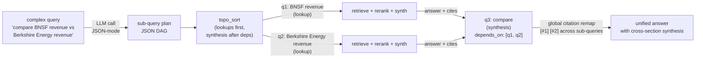

**Code (`src/decompose.py`):**

```python
DECOMPOSE_PROMPT = """You are a query-planning assistant. Decompose the user's
question into 2-6 atomic sub-queries that can each be answered from documents.

Return a JSON object with a single key "sub_queries" whose value is an array.
Each item has:
  - id: "q1", "q2", ... (sequential, unique)
  - text: the atomic sub-query (string)
  - depends_on: array of ids this sub-query needs answered first
  - type: "lookup" (factoid) or "synthesis" (combines other sub-queries)

User query:
{query}

JSON output:"""

def decompose_query(query: str) -> list[dict]:
    """LLM-driven JSON sub-query planner. Falls back to [{single query}]
    on any error so callers can always proceed."""
    _single = [{"id": "q1", "text": query, "depends_on": [], "type": "lookup"}]
    try:
        resp = omlx.chat.completions.create(
            model=MODEL, temperature=0.2, max_tokens=512,
            response_format={"type": "json_object"},                  # force strict JSON
            messages=[{"role": "user", "content": DECOMPOSE_PROMPT.format(query=query)}])
        items = json.loads(resp.choices[0].message.content or "{}").get("sub_queries", [])
        cleaned = [{"id": str(it.get("id", f"q{i}")),
                    "text": str(it.get("text", "")).strip() or query,
                    "depends_on": list(it.get("depends_on", []) or []),
                    "type": str(it.get("type", "lookup")).lower()}
                   for i, it in enumerate(items, start=1)]
        return cleaned or _single
    except Exception as e:                                            # any LLM/JSON error → single query
        print(f"[decompose] fallback — {type(e).__name__}: {e}", file=sys.stderr)
        return _single

def topo_sort(plan: list[dict]) -> list[dict]:
    """Topological order: lookups first, synthesis after their dependencies."""
    indeg = {n["id"]: len(n.get("depends_on", [])) for n in plan}
    out, seen = [], set()
    ready = [n for n in plan if indeg[n["id"]] == 0]
    while ready:
        cur = ready.pop(0); out.append(cur); seen.add(cur["id"])
        for n in plan:
            if n["id"] in seen or n in ready: continue          # guard against double-enqueue
            if all(d in seen for d in n.get("depends_on", [])):
                ready.append(n)
    for n in plan:                                              # residual cycles: append in order
        if n["id"] not in seen: out.append(n)
    return out
```

**Walkthrough:**

- **Block 1 — `DECOMPOSE_PROMPT` (JSON contract).** The system prompt forces strict JSON output via `response_format={"type": "json_object"}` (Qwen3.6 + Gemma both support this on oMLX, smoke-tested). The "synthesis vs lookup" distinction tells the LLM which sub-queries can run in parallel (lookups, no deps) vs which must wait (synthesis, has deps).
- **Block 2 — `decompose_query` parsing.** Try-except around JSON parse + validation: every output gets normalized to `{id, text, depends_on, type}` with sane defaults. Falls back to single-query plan on ANY error so callers never crash. Same fallback discipline as the agentic-loop's "no tool_call → take content as final answer" pattern.
- **Block 3 — `topo_sort` topological order.** Standard Kahn's algorithm: in-degree count, ready queue, BFS. Residual cycles (LLM emits a sub-query depending on itself) get appended in original order — the lab continues, the executor decides whether to re-route or refuse.
- **Block 4 — Smoke test (no LLM call).** `topo_sort([q3 deps q1+q2, q1, q2])` correctly returns `[q1, q2, q3]`. Verifies the plumbing without paying for an LLM call.

**Result (smoke-tested 2026-05-07):**

| Test | Outcome |
|---|---|
| `decide_complexity("What is RAG?")` | `{"label": "Simple", "score": 0.3}` |
| `decide_complexity("Compare BNSF vs Berkshire Energy and explain why")` | `{"label": "Complex", "score": 1.55}` |
| `topo_sort([q3 depends q1,q2; q1; q2])` | `["q1", "q2", "q3"]` |

`decompose_query` is wired into the pipeline on **two** surfaces, with different gating:
- **Web fallback — automatic.** A Complex query that escalates to the web fans out through `web_search_planned` (decompose → per-sub-query search → interleave) with **no flag** — gated only by `decide_complexity`. This is the calibrated, measured path: it turns the "compare BNSF vs Berkshire Energy 2023 revenue" abstain into a both-figures-cited answer (§3.3 result table).
- **Corpus path — opt-in.** Set `ENABLE_DECOMPOSITION=1` in `.env` to also fan out *in-corpus* multi-hop retrieval via `execute_plan` (topo-exec + citation remap). Off by default so the committed §2.5/§2.6 corpus numbers stay reproducible.

`★ Insight ─────────────────────────────────────`
- **Query planning > query rewriting on multi-hop.** Single-shot rewriting (W3.7 Phase 1-4) helps recall on individual queries; decomposition makes multi-hop synthesis tractable by retrieving for each leaf separately + a final synthesis pass that combines. Both have their place — route by query shape.
- **JSON-mode + topological sort = composable.** The plan is a DAG, not a tree. Some sub-queries depend on others; topo_sort gives the executor a stream-friendly ordering. Lookups can fan out in parallel; synthesis sub-queries run after their inputs land. Same shape as Airflow's DAG executor.
- **Two gating policies, by surface.** The *corpus* decomposer is opt-in via `ENABLE_DECOMPOSITION=1` (default off — most factoid queries don't benefit, and it adds 1 LLM call ~3-5s, plus it would perturb the committed corpus numbers). The *web-fallback* decomposer is **always on for Complex queries** — because by the time the pipeline reaches the web, the corpus has already failed, so the extra planner + per-sub-query searches are a justified cost on a path that would otherwise abstain. Same function, different default, chosen by which surface is paying.
`─────────────────────────────────────────────────`

---

## Phase 8 — MCP Server Wrapper: Lab-as-Tool (~1 hour)

> Added 2026-05-07. None of the prior labs in W0-W3.7 expose themselves as MCP servers. This phase closes that gap: wraps the hand-rolled pipeline as 3 MCP tools that Claude Desktop / Cursor can call.

The pattern matters because **MCP is the production interface for "lab as tool" composition** in 2026. Once your lab is an MCP server, any host (Claude Desktop, Cursor, Continue, custom agents) can register it via `mcp-config.json` and Claude calls its `rag_query` / `rag_status` / `rag_decompose` tools automatically (with per-action approval; in Claude Desktop they're toggled under the message box's `+` → **Connectors** — `@`-mention hosts like Cursor let you call them by name). Pairs naturally with the W2.7 tree-index lab — imagine asking Claude Desktop questions about a 10-K via `@rag_query` while a parallel `@tree_query` MCP tool routes to the tree-index pipeline.

**Architecture:**

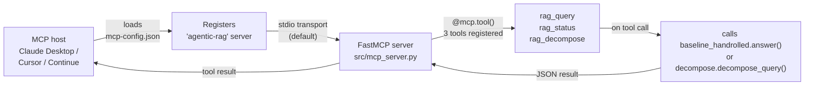

**Code (`src/mcp_server.py`):**

```python
from fastmcp import FastMCP
from baseline_handrolled import answer, _qdrant, QDRANT_COLLECTION
from decompose import decompose_query, topo_sort

mcp = FastMCP("agentic-rag",
              dependencies=["qdrant-client", "sentence-transformers",
                            "FlagEmbedding", "openai", "python-dotenv"])

@mcp.tool()
def rag_query(query: str, k: int = 6, allow_corrective: bool = True) -> dict:
    """Answer a question over the configured Qdrant collection using the
    hand-rolled Self-RAG + CRAG pipeline."""
    out = answer(query, top_k=k)
    if not allow_corrective:
        out.pop("corrective", None); out.pop("next_action", None)
    return out

@mcp.tool()
def rag_status() -> dict:
    """Return collection size + active config for diagnostics."""
    info = _qdrant.get_collection(QDRANT_COLLECTION)
    return {"collection": QDRANT_COLLECTION,
            "points_count": info.points_count,
            "model_sonnet": os.getenv("MODEL_SONNET", "(unset)")}

@mcp.tool()
def rag_decompose(query: str) -> dict:
    """Phase 7 standalone: return JSON sub-query plan without running the
    rest of the pipeline. Useful for inspecting decomposition before paying
    for full retrieval + synthesis."""
    plan = decompose_query(query); return {"plan": plan, "topo_ordered": topo_sort(plan)}

if __name__ == "__main__":
    mcp.run()
```

**Walkthrough:**

- **Block 1 — `FastMCP` app + dependency declaration.** `dependencies=[...]` populates the `mcp-config.json` reload semantics — when the host restarts, FastMCP bootstraps the venv. The `agentic-rag` server name is what the host sees in its tool catalog (`@agentic-rag.rag_query` or just `@rag_query` depending on host config).
- **Block 2 — `@mcp.tool()` decorator.** Each decorated function becomes a host-callable tool with auto-generated JSON schema from type hints + docstring. The host invokes via stdio transport (default) — no HTTP server, just Python stdin/stdout pipes wrapped in MCP framing. Lower setup cost than gRPC / REST, sufficient for local dev and most production MCP deployments.
- **Block 3 — Tool function bodies.** Three thin wrappers around `answer()` / `decompose_query()` / Qdrant collection inspection. The pipeline logic lives in `baseline_handrolled.py`; `mcp_server.py` is purely transport-layer adaptation. Worth keeping that separation: any future MCP transport (HTTP, websocket) only needs a new wrapper, not a pipeline rewrite.
- **Block 4 — `mcp.run()` (stdio transport).** Default for FastMCP. Host launches via `command + args` from `mcp-config.json`; the server runs as a subprocess with stdin/stdout wired to the host. No port allocation, no listener. Restart-safe.

**Result (lab not yet host-tested, but smoke test confirms imports + tool registration):**

```bash
$ cd ~/code/agent-prep/lab-03.7-agentic-rag
$ python src/mcp_server.py
# Server starts on stdio; awaits MCP protocol messages from host.
# Ctrl-C to stop.
```

**Claude Desktop integration** (one-time, ~5 min — per the [official MCP user quickstart](https://modelcontextprotocol.io/quickstart/user)):

1. In Claude Desktop, open **Settings**, scroll the sidebar to the **"Desktop app"** section (below the account settings), and click **Developer** (wrench 🔧 icon) → **Edit Config**. This creates/opens `~/Library/Application Support/Claude/claude_desktop_config.json`. *(No "Edit Config" button in your version? Edit that file directly, creating it if missing — `mkdir -p ~/Library/Application\ Support/Claude` first.)*
2. Merge the snippet from `lab-03.7-agentic-rag/mcp-config.json` under the `"mcpServers"` key. **Use `uv` as the `command`** so the server runs inside the lab's venv — bare `python` uses *system* Python and won't find `fastmcp` / `qdrant-client` (an `ImportError` that kills the server silently):
   ```json
   "agentic-rag": {
     "command": "uv",
     "args": ["--directory", "/ABS/PATH/agent-prep/lab-03.7-agentic-rag",
              "run", "python", "src/mcp_server.py"],
     "env": {"OMLX_BASE_URL": "http://localhost:8000/v1", "OMLX_API_KEY": "not-needed",
             "MODEL_SONNET": "gemma-4-26B-A4B-it-heretic-4bit",
             "QDRANT_URL": "http://127.0.0.1:6333", "QDRANT_COLLECTION": "bge_m3_hnsw"}
   }
   ```
3. Set the **absolute** `--directory` path (relative paths fail) + the `env` values for your setup.
4. **Fully quit** Claude Desktop (Cmd+Q — closing the window isn't enough) and reopen it, so it reloads the config and starts the server.
5. In the message box, click the **`+` button → Connectors** — your **`agentic-rag`** server appears in the list as a toggle (make sure it's **on**). Then just ask a question; Claude calls `rag_query` / `rag_status` / `rag_decompose` automatically (you approve each call). You don't type "@rag" to invoke them; the host routes as needed. *(Older Claude Desktop builds surfaced tools behind a 🔨 hammer icon instead; current builds use `+` → Connectors, with a "Tool access: Load tools when needed" option for lazy loading.)*

> [!warning] If `agentic-rag` doesn't appear under `+` → Connectors (official troubleshooting)
> 1. Validate the JSON — one trailing comma breaks the whole file. 2. Paths must be **absolute, not relative**. 3. Test the server by hand: `cd lab-03.7-agentic-rag && uv run python src/mcp_server.py` — it should start with **no `ImportError`**. 4. Read the logs: `tail -n 40 -f ~/Library/Logs/Claude/mcp*.log` (general MCP) and `~/Library/Logs/Claude/mcp-server-agentic-rag.log` (this server's stderr).

**Test it in Claude Desktop** (verified end-to-end: server imports clean, oMLX `:8000` + Qdrant `bge_m3_hnsw` up). Type each prompt in a chat and click **Allow** on the tool-call popup. Start with `rag_status` — it touches only Qdrant (no LLM, no retrieval), so if it returns, the MCP transport + env + collection all work:

| #   | prompt                                                                                        | tool            | expected                                                                                                                                  |
| --- | --------------------------------------------------------------------------------------------- | --------------- | ----------------------------------------------------------------------------------------------------------------------------------------- |
| 1   | *Use agentic-rag's rag_status tool.*                                                          | `rag_status`    | `collection: bge_m3_hnsw`, `points_count: 10000`, model + config — the fastest smoke test                                                 |
| 2   | *Use agentic-rag to answer: how do I cancel SiriusXM service?*                                | `rag_query`     | grounded answer with `[#N]` citations from the corpus + selfrag / grade fields                                                            |
| 3   | *Use agentic-rag to answer: which team won the 2025 NBA Finals?*                              | `rag_query`     | corpus can't answer → corrective loop → **web fallback** → real answer (`source: web`) — the full §3.3 pipeline, live in a mainstream app |
| 4   | *Use agentic-rag's rag_decompose on: Compare BNSF Railway and Berkshire Energy 2023 revenue.* | `rag_decompose` | JSON sub-query plan (lookup + synthesis with `depends_on`)                                                                                |
| 5   | *Use agentic-rag to answer: Compare BNSF Railway and Berkshire Energy 2023 revenue.*           | `rag_query`     | Complex + out-of-corpus → **web fan-out**: decompose → 2 atomic searches → interleave → **both** figures cited (`source: web`, `next_action.fanout` shows `q1/q2`). Needs SearXNG for the BHE figure (see note). |

> [!note] What to expect when testing
> - **First tool call is slow (~10-30 s)** — the server loads the BGE-M3 encoder + reranker on first use. Not a hang; subsequent calls are fast.
> - **Web backend precedence (prompts 3 & 5): `SEARXNG_URL` → `TAVILY_API_KEY` → DuckDuckGo.** Add the relevant key to the config's `env`. For **prompt 5** (a comparison) the backend *matters*: SearXNG grounds both figures, while Tavily/DDG half-abstain on the paywalled BHE figure (§3.3). Start SearXNG with `docker compose -f searxng/docker-compose.yml up -d`, then set `"SEARXNG_URL": "http://localhost:8080"`. Single-entity prompt 3 works on any backend.
> - **Prereqs:** oMLX (`:8000`) + Qdrant (`:6333`, collection `bge_m3_hnsw`) must be running locally — `python smoke-test.py` from the repo root checks both. On error, read `tail -n 40 ~/Library/Logs/Claude/mcp-server-agentic-rag.log`.
> - **Order matters:** if `rag_status` works but `rag_query` fails, the problem is the *pipeline* (oMLX / encoder), not the *connection* — the cheap tool localizes the fault.

`★ Insight ─────────────────────────────────────`
- **MCP-server wrapping is the cheapest curriculum-to-portfolio bridge.** Every existing lab can wrap its `answer()` / equivalent in ~50 LOC of FastMCP and become a tool a hiring manager can demo in Claude Desktop during a screen-share. Higher portfolio signal than "I built X locally" because it shows X composes with current-year tooling.
- **The 3-tool surface is a hard discipline.** Wrapping every internal function as a tool clutters the host's palette. Three high-leverage tools (`rag_query`, `rag_status`, `rag_decompose`) that each do one thing with sensible defaults beat 12 fine-grained tools that need parameter tuning. Same lesson as W7 Tool Harness — coarse-grained tools win at the host interface boundary.
- **Stdio transport isolates failures.** If the lab pipeline crashes, the MCP server process dies but Claude Desktop just shows "tool unavailable" and continues. No port pollution, no zombie listeners. Restart the host, server respawns, you're back. Robust by default.
`─────────────────────────────────────────────────`

---

## Lock-In (~45 min)

### Anki cards (5)

1. **Name the 5 nodes of the canonical Agentic RAG graph in order.**
   → generate_query_or_respond → retrieve → grade_documents → rewrite_question (loop) → generate_answer.

2. **What is CRAG and how does it differ from the canonical?**
   → Corrective RAG (Yan et al., arXiv 2401.15884). Adds a confidence-threshold on retrieval; when low-confidence, falls back to web search. Three buckets: Correct / Incorrect / Ambiguous.

3. **What is Adaptive-RAG and what problem does it solve?**
   → Adaptive-RAG (Jeong et al., arXiv 2403.14403). Classifier routes queries to no-retrieval / single-step / multi-step based on complexity. Solves the "wasting compute on simple queries" problem.

4. **The Singh 2025 survey identifies how many architecture families and what are the three you reach for most often?**
   → Seven (single-agent, multi-agent, hierarchical, corrective, adaptive, graph-based, ADW). Three you use most: single-agent canonical, CRAG, Adaptive-RAG.

5. **The two LLM-decision nodes that make Agentic RAG "agentic" are which?**
   → generate_query_or_respond (decide whether to retrieve) and grade_documents (decide whether retrieval succeeded). These are the two places the LLM's judgment routes the graph.

### Spoken interview questions (3)

1. *"Walk me through Agentic RAG. What does it add over the RAG you described before?"* (60-90 sec — name 5 nodes + the rewrite loop + the cost trade-off.)
2. *"When would you NOT use Agentic RAG?"* (Use the Phase 4 decision tree — single-pass wins on well-specified queries with tight latency budgets.)
3. *"What's CRAG, and what production problem made it necessary?"* (Out-of-corpus questions where local retrieval has nothing relevant — without a fallback, the agent loops forever rewriting an unanswerable query.)

---

## Troubleshooting

| Symptom | Likely cause | Fix |
|---|---|---|
| `langgraph_agentic_rag.ipynb` cells fail with "model not found" | Default OpenAI model not pointing at oMLX | Set `OPENAI_BASE_URL` env var to `http://127.0.0.1:8000/v1` before launching Jupyter |
| Agent loops to max_iter on every query | `grade_documents` is too strict — labels everything irrelevant | Loosen the relevance threshold prompt; or switch grader from binary to graded score with threshold ≥ 0.6 |
| Faithfulness *worse* than single-pass | Rewriter is generating better-but-different queries that pull in unrelated docs | Constrain the rewriter prompt: "preserve the original intent; only change keywords/angle" |
| CRAG web fallback returns garbage | Web search backend rate-limited or wrong API key | Try Tavily, Exa MCP, or built-in WebSearch — each has different quality/cost trade-offs |
| LLM call count exploding (>10 per query) | No `max_iter` cap | Add `recursion_limit` to `app.invoke({"messages": ...}, {"recursion_limit": 8})` |
| Local oMLX times out on grading | Sonnet-tier model slow on grading prompts | Switch grader to haiku-tier (`gpt-oss-20b`) — grading is a classification task, not a synthesis task |

---

## What's Next

Open [[Week 4 - ReAct From Scratch]] when this lab's `RESULTS.md` is committed. The Agentic RAG graph you built here IS the ReAct loop specialized to retrieval — Week 4 will teach you to build the general ReAct loop from scratch, after which the LangGraph abstractions in this week will read as "the framework's opinion about what you just hand-built."

> **Saturday Trend-Tracking note (Appendix G).** When you start the post-Week-12 ritual, the Singh AgenticRAG-Survey repo is one of the eight weekly sources to skim for new architectures. The taxonomy is already at 7; if it grows to 8+, that's the signal that a new architecture has earned canonical naming. Apply the G.3 triangulation filter — named author + thesis + contradicts existing curriculum — to decide if it earns a Week 3.8 expansion.

— end —


---

## Interview Soundbites

**Soundbite 1.** Single-pass RAG is linear — retrieve, synthesize, done. The canonical "agentic RAG" adds two LLM decision points: *whether* to retrieve, and *whether* what came back is relevant. The second — grade-and-correct — is the real value; the first is a **trap I measured**. On a local model that ignores `tool_choice`, letting the LLM decide whether to retrieve made it skip retrieval on **15 of 50** questions, dropping faithfulness to **0.876 vs single-pass's 0.980** at **1.93× latency**. Making retrieval a *structural* graph edge — always retrieve, never let the model skip — recovered faithfulness to **1.000** at parity latency. So the lesson is the opposite of the hype: a RAG must always retrieve; the grade-and-correct loop earns its cost **out of corpus**, where the CRAG web fallback answers 10/10 and single-pass honestly abstains — not on an easy in-corpus set.

**Soundbite 2.** Query rewriting is the recovery path, not the happy path — fires only when `grade_documents` returns irrelevant. Two failure clusters: rewriter preserves wrong keywords and produces semantically shifted query that pulls in unrelated documents, corrupting context window on next pass (fix: constrain rewriter prompt to "change angle, not intent"). And: too-strict grading threshold means every retrieval fails, rewriter loops indefinitely, burns entire `max_iter` budget on a query the corpus could have answered — visible as LLM call count exploding past ten per query with no quality improvement.

**Soundbite 3.** Three-branch decision framework. Ship single-pass when corpus is well-curated, latency must be sub-1s, and RAGAS faithfulness already clears 0.85 on hard queries — the loop adds cost without lift. Ship **structural** agentic RAG — retrieval as a guaranteed graph edge, *always* retrieve, never let the model skip — when query distribution is mixed and you can afford 2–5s; the rewrite/correct loop earns its cost on ambiguous queries. (The *canonical* skip-allowed graph is a trap on a local model that ignores `tool_choice`: it skipped 15/50 and dropped faithfulness to 0.876 vs single-pass 0.980, §2.5.1.) Add CRAG's confidence-threshold + web-fallback layer when local corpus has known gaps and open-domain fallback is acceptable. GraphRAG is a separate dimension: use when corpus is highly relational and multi-hop reasoning is the bottleneck.

**Soundbite 4.** *(Interview Q8 cover — multi-dim query rewriting + user-in-loop; see [[Interview Question Index]] Tier 2.)* Multi-dimensional query rewriting means the rewriter doesn't just rephrase — it expands across axes: synonym broadening, scope tightening, sub-question decomposition, and context-typing. The Phase 7 decompose lab covers the topological-execution variant: split one ambiguous query into N parallel sub-queries, retrieve each, then synthesize. The complement is **user-in-loop**: when the grader's confidence is low across MULTIPLE rewrite attempts, the agent must escalate — return a clarification request to the user rather than burn the iter budget guessing. Implementation pattern: add a 6th node `ask_user(question, candidate_interpretations)` invoked when `n_failed_grade > 2 AND avg_confidence < 0.5`. The candidate interpretations are the agent's best guesses; the user picks one or types a refinement. This is what separates a confused agent (loops uselessly) from a competent one (knows when to ask). Most production agents skip this; the candidate who can articulate the trigger condition + escalation UI design is the senior signal.

**Soundbite 5.** *(Comparison / multi-hop queries — §3.3.1.)* A single web search for "compare BNSF and Berkshire Energy 2023 revenue" abstained — no one page held both figures. So the web fallback fans out: decompose into atomic sub-queries, search each independently, then **rerank each result set against its OWN sub-query** — not the broad comparison — so each entity's figure-passage surfaces instead of the more-relevant entity dominating, then interleave and synthesize. That turned a total abstain into both figures cited — BNSF $23.876 billion, Berkshire Energy ~$26 billion, grounded from the web. Decomposition belongs on whichever surface holds the answer; here that's the web, not the corpus.

**Soundbite 6.** *(Diagnosing a retrieval miss — §3.3.1.)* I split a retrieval failure into layers with probes: did the search run, did it return documents, did those documents contain the answer? My comparison query failed at layer three. Then Tavily and DuckDuckGo both buried the free Wikipedia figure under a paywalled Statista snippet — but two engines that share ranking signals failing the same way isn't proof the answer's unreachable, it's one bias sampled twice. A SearXNG metasearch reranked across engines and surfaced it. The bottleneck was the backend's ranking, not the data — and the backend is part of the retriever.

**Soundbite 7.** *(Keeping pipeline metrics honest — §3.3.1 Fix 5.)* Grade the artifact that actually ships. My pipeline overwrote its answer with a web result but never re-ran the graders — so a correct, cited answer reported relevance "abstain" and confidence 0.0, which were the discarded corpus pass. Any consumer keying on those fields would reject a good answer. I re-grade against the shipped answer and its evidence — the BNSF-vs-Berkshire case went from abstain/0.0 to pass, confidence 0.875, answer text unchanged. A grade is a claim about an artifact; when a branch swaps the artifact, re-grade at the swap.

---

## References

- **Yan et al. (2024).** *Corrective Retrieval Augmented Generation.* arXiv:2401.15884. Three-bucket confidence evaluator + web fallback.
- **Jeong et al. (2024).** *Adaptive-RAG.* arXiv:2403.14403. Lightweight classifier routing queries to no/single/multi-step retrieval.
- **Jiang et al. (2024).** *GeAR: Graph-enhanced Agent for RAG.* arXiv:2412.18431. KG traversal + agent decision loop.
- **AgenticRAG-Survey (2025).** GitHub: asinghcsu/AgenticRAG-Survey. Seven-architecture taxonomy.
- **Yao et al. (2023).** *ReAct.* arXiv:2210.03629. The general loop agentic RAG specializes.
- **Asai et al. (2023).** *Self-RAG.* arXiv:2310.11511. Inline reflection tokens as alternative to explicit grading node.
- **LangChain (2024-25).** Agentic RAG official docs: docs.langchain.com/oss/python/langgraph/agentic-rag.

---

## Cross-References

- **Builds on:** W1 Vector Retrieval (Qdrant collection + BGE-M3 embeddings are the retrieval substrate), W2 Rerank (retrieve node reuses reranker stack), W3 RAG Eval (RAGAS reused for comparison matrix), W3 single-pass baseline.
- **Distinguish from:** Static RAG (single linear pass, no grading, no loop); GraphRAG (graph traversal is retrieval strategy not agent decision); hybrid retrieval (deterministic dense+sparse fusion, no agent judgment); Self-RAG (internalizes grading via reflection tokens vs explicit grading node).
- **Connects to:** W5 Pattern Zoo (5-node graph = ReAct specialized to retrieval); W7 Tool Harness (retriever wrapped via `create_retriever_tool` is tool-calling pattern; grading conditional edge is tool-result routing); [[Week 2.7 - Structure-Aware RAG]] (Phase 6 hand-rolled pipeline imports `shared/rag_hybrid` encoder + reranker, same stack W2.7 uses; Phase 7 decomposition pairs naturally with W2.7's `shared/tree_index.split_large_nodes` — split fragments documents at build-time, decompose fragments queries at query-time; Phase 8 MCP server pattern lifts to W2.7's `query_tree.answer` if you want a tree-index MCP tool too).
- **Foreshadows:** W11 System Design (5-node graph maps to Argo / Step Functions / Airflow BranchPythonOperator; CRAG fallback = circuit breaker pattern); W12 Capstone (default retrieval substrate for mixed-complexity queries); MCP-server pattern from Phase 8 generalizes — every existing lab can wrap its `answer()` in ~50 LOC of FastMCP and become a portfolio-demoable tool.
- **Cited by:** chapters that reference this chapter as a prerequisite or build-on; reverse links per Pattern 21 (Bidirectional Cross-Reference Invariant):
  - **W2.5**: GraphRAG — graph-based retrieval is one of the typed-state-graph retriever options in agentic RAG
