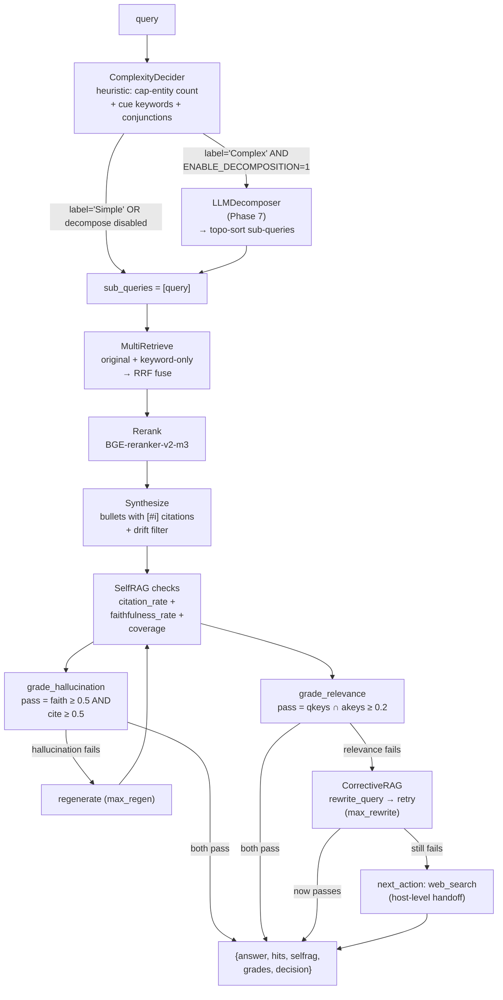
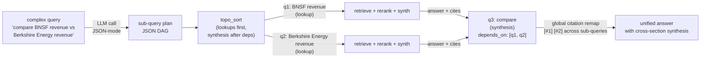
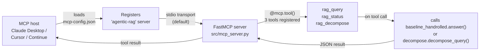

# Week 3.7 — Agentic RAG (LangGraph-Canonical Architecture)

> Goal: Build the production successor to Week 3's single-pass RAG. Implement the canonical 5-node Agentic RAG graph (decide → retrieve → grade → rewrite → answer), measure the lift on ambiguous queries, and learn when the cost is worth it. Walk out with a published-vocabulary command of the field's named architectures (CRAG, Adaptive-RAG, GeAR) and the survey-paper taxonomy.

**Exit criteria.**
- [ ] LangChain's official `langgraph_agentic_rag.ipynb` notebook running end-to-end on your Week 1 corpus + Qdrant + BGE-M3
- [ ] Comparison harness measuring Week 3's single-pass RAG vs the 5-node Agentic RAG on the same 50-Q dev set
- [ ] Quantified lift on ambiguous queries specifically (faithfulness + context-recall delta)
- [ ] One CRAG (Corrective RAG) variant implemented with confidence-threshold + web-fallback
- [ ] `RESULTS.md` with comparison matrix + decision tree ("when does Agentic RAG help vs hurt?")
- [ ] You can name the 7 architectures from the Singh et al. survey + the 4 canonical papers (CRAG / Adaptive-RAG / GeAR / Agent-G) cold

---

## Why This Week Matters

Week 3 teaches single-pass RAG — the linear pipeline (dense retrieve → rerank → compress → synthesize) that dominates most production tutorials. But single-pass has a hard limitation: when retrieval fails on ambiguous queries, the whole system fails. There is no recovery path. This expansion week teaches the production-default successor: Agentic RAG, a 5-node graph where the agent itself judges retrieval relevance, rewrites queries when needed, and loops until confident or budgeted. The canonical shape is now standard across LangChain 1.0, LlamaIndex, and every production RAG system published in 2025–2026. In interviews, the distinction matters: candidates who know "RAG" at the 2024 single-pass level answer differently from candidates who can articulate why Agentic RAG costs 2–4× latency but earns graceful degradation on hard queries. This week is lighter than main weeks (6–8 hours vs 12–15) because most infrastructure reuses your Week 1–3 artifacts. What is new is the graph topology, the grading node, and the empirical comparison showing *when* the cost is worth it. You measure the lift on ambiguous queries specifically and walk out able to defend the architecture choice in production decisions, not just tutorials.

---

## Why This Expansion Week Exists

Week 3 builds a single-pass RAG pipeline (dense retrieve → rerank → compress → synthesize) and measures it with RAGAS. That's the right baseline to learn first because every more-sophisticated pattern is *defined relative to it*. But single-pass is no longer the production default for any RAG system that needs to handle ambiguous queries or recover gracefully from bad retrieval.

The current production default — what every "Agentic RAG" tutorial, every LangChain doc, every 1.6k-star survey paper now describes — is a graph of agent nodes that **grade their own retrieval, rewrite their own queries when retrieval fails, and loop until they're confident or hit a budget**. Week 5 teaches the general orchestrator-worker / reflexion patterns; Week 3.7 teaches the specific specialization of those patterns to retrieval. **Agentic RAG is the bridge** between Week 3's RAG fundamentals and Week 5's agent patterns. Without this week, the curriculum has a gap where Reddit threads, LangChain docs, and survey papers all converge on "the obvious next thing" — and your interview answer for "tell me about RAG in production" stays stuck in 2024.

The week is **optional**: skip if your Q1 timeline is tight, revisit anytime in Q2 (per Appendix G's quarterly cadence map). It is **lighter than main weeks** — 6–8 hours rather than 12–15 — because most of the implementation reuses your Week 1–3 artifacts (corpus, Qdrant collection, dev set, RAGAS harness). What's new is the graph topology, the grading node, and the comparison.

---

## Architecture — The Canonical 5-Node Agentic RAG Graph

The reference architecture per [LangChain's official docs](https://docs.langchain.com/oss/python/langgraph/agentic-rag):


**Reading the diagram:** the **two blue diamonds** are the agent decision points (decide-to-retrieve, grade-relevance) — these are what make it "agentic" rather than fixed-pipeline. The **red rewrite node** is the recovery path that single-pass RAG doesn't have. The **dashed iteration loop** is bounded by `max_iter` (the only thing standing between the agent and an infinite query-rewrite spiral). Compare this to your Week 3 baseline, which is purely linear: query → retrieve → rerank → compress → answer, with no grading, no loop, no recovery.

---

## Theory Primer (~45 min)

> Three concepts. Lighter than main-week primers because the lab itself is the teacher this week — running the canonical notebook teaches more than reading prose.

### Concept 1 — The Canonical 5-Node Architecture (LangChain's Production Default)

[LangChain's official Agentic RAG documentation](https://docs.langchain.com/oss/python/langgraph/agentic-rag) defines the production-canonical graph as exactly five nodes, each with a single responsibility. The shape is small enough to memorize, opinionated enough to be defensible in interviews:

1. **`generate_query_or_respond`** — first-line decision node. The LLM, given the user query and access to the retriever as a tool, decides whether retrieval is needed at all. For a query like "what's 2 + 2," it answers directly without retrieval. For "what does our refund policy say about international orders," it emits a tool call to the retriever. This is the node that prevents wasteful retrieval on unambiguously knowable answers.

2. **`retrieve`** — executes the retriever tool. Same dense+rerank stack from Weeks 1–2 (BGE-M3 over Qdrant + BGE-reranker). No agentic logic here; this is a pure tool execution node.

3. **`grade_documents`** — the relevance-grading node. Given the retrieved chunks and the original query, an LLM judges: are these documents actually relevant? Returns binary or graded. This is the **critical addition over single-pass RAG** — without grading, the agent has no signal that retrieval failed.

4. **`rewrite_question`** — the recovery path. When `grade_documents` says "no, these docs don't help," the rewriter reformulates the query (often using a different angle, broader keywords, or a HyDE-style hypothesized answer) and the graph loops back to `generate_query_or_respond`. Without this node, bad retrieval = bad answer; with it, bad retrieval triggers a recovery attempt.

5. **`generate_answer`** — the terminal synthesis node. Given the validated relevant context, produces the final answer with citations. Same shape as Week 3's synthesis stage, just gated by upstream relevance checking.

The implementation in LangGraph is a `StateGraph(MessagesState)` with conditional edges routed by `tools_condition` (whether the LLM emitted a tool call) and custom grading logic (whether documents pass relevance threshold). The whole graph fits in ~150 lines of Python — small enough that you'll read every node in Phase 1.

> **Interview soundbite:** "The canonical Agentic RAG architecture is five nodes — decide-to-retrieve, retrieve, grade, rewrite, answer — with a loop from rewrite back to decide. The two LLM-decision nodes are what make it agentic; the rewrite loop is what makes it production-grade. Compared to single-pass RAG, you get graceful recovery from bad retrieval at the cost of 2–4× latency and LLM calls."

---

### Concept 2 — The 7-Architecture Taxonomy (Singh et al. Feb 2025)

The [AgenticRAG-Survey](https://github.com/asinghcsu/AgenticRAG-Survey) paper (Aditi Singh, Abul Ehtesham, Saket Kumar, Tala Talaei Khoei, Feb 2025, 1.6k⭐) is the canonical taxonomy reference. It identifies **seven major architecture families**:

| # | Architecture | One-line description | When it wins |
|---|---|---|---|
| 1 | **Single-agent RAG** | The 5-node canonical (Concept 1 above) | Default for most production systems |
| 2 | **Multi-agent RAG** | Multiple specialist agents (researcher / synthesizer / critic) collaborating on retrieval | Genuinely complex queries needing role-specialized retrieval (e.g., legal + technical + financial sub-questions) |
| 3 | **Hierarchical agentic RAG** | Tree of agents — coordinator delegates to sub-coordinators which delegate to workers | Very large knowledge bases (>10M docs) where a single retriever scope is too broad |
| 4 | **Corrective agentic RAG (CRAG)** | Adds a confidence threshold — when retrieved docs score below threshold, falls back to web search or alternative source | Open-domain questions where local corpus may not have the answer |
| 5 | **Adaptive agentic RAG** | Dynamically picks retrieval strategy based on question complexity (no retrieval / single-step / multi-step) | Mixed query workloads — some simple, some complex, system shouldn't pay multi-step cost on simple |
| 6 | **Graph-based agentic RAG** | Combines GraphRAG (Week 2.5) with agent loop — agent traverses knowledge graph, decides next hop | Highly relational corpora (org charts, research citation networks, code dependencies) |
| 7 | **Agentic Document Workflows (ADW)** | Document-centric — agent processes individual documents through a multi-step workflow (extract → enrich → cross-reference → output) | Document-heavy workflows like contract review, research synthesis, regulatory filings |

**The three you must know cold for interviews:** single-agent (Concept 1, the default), CRAG (#4, the most-cited confidence-recovery pattern), Adaptive-RAG (#5, the most-cited efficiency-routing pattern). The other four are situational; name them as "see the Singh survey for the full taxonomy."

> **Interview soundbite:** "Agentic RAG isn't one architecture, it's seven — the Singh 2025 survey is the canonical taxonomy. The three you reach for most often are the single-agent canonical, Corrective RAG (CRAG) when local corpus may miss the answer, and Adaptive-RAG when query complexity varies enough that one-size-fits-all retrieval wastes compute on simple queries."

---

### Concept 3 — The Three Canonical Papers Worth Knowing by arXiv ID

Three named-paper architectures show up in the survey, in production tutorials, and in interviews — knowing them by arXiv ID and one-line claim is high-leverage interview signal.

**Corrective Retrieval Augmented Generation (CRAG) — [arXiv 2401.15884](https://arxiv.org/abs/2401.15884) (Yan et al. Jan 2024).** The thesis: dense retrieval is *brittle on out-of-distribution queries* — it returns results regardless of whether they're actually relevant, and downstream synthesis amplifies the brittleness. CRAG adds a *retrieval evaluator* (lightweight classifier scoring retrieved docs) that produces three buckets: Correct (use as-is), Incorrect (discard, fall back to web search), Ambiguous (combine local + web). The architectural addition is small (one classifier + one fallback path) but the impact on out-of-domain robustness is large. CRAG is the most-cited "make my RAG less wrong" paper of 2024–2025.

**Adaptive-RAG: Learning to Adapt through Question Complexity — [arXiv 2403.14403](https://arxiv.org/abs/2403.14403) (Jeong et al. Mar 2024).** The thesis: not every question deserves the same retrieval effort. A trained classifier routes queries to one of three strategies: (A) no retrieval — model knows the answer; (B) single-step retrieval — Week 3 baseline; (C) multi-step retrieval — full agentic loop. Saves significant compute on simple queries while preserving quality on complex ones. Adaptive-RAG is the canonical paper for "when you can't afford full Agentic RAG on every query."

**GeAR: Graph-enhanced Agent for Retrieval-augmented Generation — [arXiv 2412.18431](https://arxiv.org/abs/2412.18431) (Dec 2024).** The thesis: combining knowledge graph traversal with the agent loop produces stronger multi-hop reasoning than either alone. Maps directly onto Week 2.5's GraphRAG content but adds the agent decision-loop on top. GeAR is the most-cited "GraphRAG + agents" hybrid paper.

A fourth paper worth naming when asked about multi-agent RAG specifically: **Agent-G** (multi-agent framework for graph-augmented retrieval, exact arXiv ID varies by version). Less canonical than the three above but appears in survey citations.

> **Interview soundbite:** "The three canonical Agentic RAG papers I'd name are CRAG (arXiv 2401.15884) for confidence-aware retrieval with web fallback, Adaptive-RAG (arXiv 2403.14403) for complexity-based routing, and GeAR (arXiv 2412.18431) for graph-augmented multi-hop. Each names a specific failure mode of single-pass RAG and a specific architectural fix; together they're the 2024–2025 canon."

---

### Companion Texts

- **[LangChain official Agentic RAG docs](https://docs.langchain.com/oss/python/langgraph/agentic-rag)** — the canonical 5-node architecture; runnable example notebook linked from there
- **[asinghcsu/AgenticRAG-Survey](https://github.com/asinghcsu/AgenticRAG-Survey)** (Singh et al. Feb 2025, 1.6k⭐) — the 7-architecture taxonomy reference
- **[langgraph/examples/rag/langgraph_agentic_rag.ipynb](https://github.com/langchain-ai/langgraph/blob/main/examples/rag/langgraph_agentic_rag.ipynb)** — official runnable notebook
- **[GiovanniPasq/agentic-rag-for-dummies](https://github.com/GiovanniPasq/agentic-rag-for-dummies)** — minimal LangGraph implementation, good study target if the official one feels too dense
- **[nicoladisabato/MultiAgenticRAG](https://github.com/nicoladisabato/MultiAgenticRAG)** — multi-agent variant for the curious
- **[jamwithai/production-agentic-rag-course](https://github.com/jamwithai/production-agentic-rag-course)** — full course material; useful for Phase 4 production-discipline grounding
- **CRAG paper — [arXiv 2401.15884](https://arxiv.org/abs/2401.15884)** — read sections 3–4 for the architecture, skim section 5 for benchmarks
- **Adaptive-RAG paper — [arXiv 2403.14403](https://arxiv.org/abs/2403.14403)** — section 3 for the complexity classifier, section 4 for the routing logic
- **Cross-curriculum**: revisit Week 3's RAGAS harness (you'll reuse it for the comparison) and Week 5's orchestrator-worker pattern (Agentic RAG is a specific application of it)

---

## Phase 1 — Run the LangChain Canonical Notebook (~1.5 hours)

### 1.1 Lab scaffold

```bash
mkdir -p ~/code/agent-prep/lab-03.7-agentic-rag
cd ~/code/agent-prep/lab-03.7-agentic-rag
mkdir -p src observations results data
git init
```

### 1.2 Install LangGraph + dependencies

Reuse your project venv from Week 0:

```bash
source ~/code/agent-prep/.venv/bin/activate
uv pip install -U langchain langgraph langchain-openai langchain-community langchain-qdrant
```

### 1.3 Clone the official example notebook

```bash
# Get just the one notebook + dependencies, not the whole langgraph repo
curl -sL https://raw.githubusercontent.com/langchain-ai/langgraph/main/examples/rag/langgraph_agentic_rag.ipynb -o langgraph_agentic_rag.ipynb

# OR skim GiovanniPasq's "for dummies" version if you want a smaller starting point:
git clone https://github.com/GiovanniPasq/agentic-rag-for-dummies.git
```

### 1.4 Adapt for local oMLX + your Week 1 Qdrant collection

The official notebook uses OpenAI by default — repoint to your local oMLX. Save as `src/01_canonical_agentic_rag.py`:

```python
"""LangChain canonical Agentic RAG, adapted to local oMLX + Week 1 Qdrant collection."""
import os
from langchain_openai import ChatOpenAI
from langchain_qdrant import QdrantVectorStore
from qdrant_client import QdrantClient
from langchain_core.tools import create_retriever_tool
from langgraph.prebuilt import create_react_agent
from langgraph.graph import StateGraph, MessagesState, END
from langgraph.prebuilt import ToolNode, tools_condition

# Local oMLX endpoint (sonnet tier — Gemma 26B)
llm = ChatOpenAI(
    model=os.getenv("MODEL_SONNET", "gemma-4-26B-A4B-it-heretic-4bit"),
    base_url=os.getenv("OMLX_BASE_URL", "http://127.0.0.1:8000/v1"),
    api_key=os.getenv("OMLX_API_KEY", "Shane@7162"),
    temperature=0.0,
)

# Week 1 Qdrant collection (already populated with bge-m3 embeddings)
client = QdrantClient(url="http://127.0.0.1:6333")
# NOTE: vector store needs an embedding function compatible with what was indexed.
# Reuse your Week 1 BGE-M3 wrapper here.
from langchain_huggingface import HuggingFaceEmbeddings
embeddings = HuggingFaceEmbeddings(
    model_name=os.path.expanduser("~/models/bge-m3"),
    model_kwargs={"device": "mps"},
)
vectorstore = QdrantVectorStore(
    client=client, collection_name="bge_m3_hnsw", embedding=embeddings,
)
retriever = vectorstore.as_retriever(search_kwargs={"k": 5})
retriever_tool = create_retriever_tool(
    retriever, name="search_corpus", description="Search the corpus for documents relevant to the query."
)

# Build the 5-node graph
# (Following the LangChain official example structure; abridged here — see notebook for full nodes.)
# ... generate_query_or_respond, grade_documents, rewrite_question, generate_answer ...

graph = StateGraph(MessagesState)
# graph.add_node("generate_query_or_respond", ...)
# graph.add_node("retrieve", ToolNode([retriever_tool]))
# graph.add_node("grade_documents", ...)
# graph.add_node("rewrite_question", ...)
# graph.add_node("generate_answer", ...)
# (Wire up edges per the canonical diagram — see official notebook)
app = graph.compile()

# Smoke test
result = app.invoke({"messages": [("user", "Your test query here")]})
print(result["messages"][-1].content)
```

### Code walkthrough

**Chunk 1 — Local-first model wiring (lines 5-13):** Points the LangChain `ChatOpenAI` client at your oMLX endpoint instead of OpenAI. The `base_url` + `api_key` swap is the entire local adaptation — no other changes needed because oMLX exposes the same OpenAI-compatible API surface.

**Chunk 2 — Reuse Week 1 vectorstore (lines 16-30):** Critical detail — point `QdrantVectorStore` at the same `bge_m3_hnsw` collection you populated in Week 1. The `embeddings` argument must match the model used at indexing time (BGE-M3) for correct query-vector / doc-vector compatibility.

**Chunk 3 — `create_retriever_tool` (lines 31-34):** Wraps the retriever as a LangChain Tool. The `description` is what `generate_query_or_respond` reads when deciding whether to invoke retrieval — make it specific to your corpus, not generic ("Search the corpus" is too vague; "Search 10K MS MARCO passages on diverse topics" is what the LLM actually needs).

> **Why:** the description is part of the agent's prompt — vague descriptions cause the agent to over-invoke retrieval on questions it could answer directly, wasting time and tokens.

**Chunk 4 — Graph compilation (lines 36-44):** The full node implementations come from the official notebook (skipped here for brevity). The structure: `StateGraph(MessagesState)` for the type system, conditional edges via `tools_condition` for the decide-to-retrieve branch, custom edge function for the relevance-grading branch.

**Common modifications:** swap `MODEL_SONNET` for `MODEL_OPUS` (Qwen3.6-35B) for stronger grading on harder corpora; change `search_kwargs={"k": 5}` to `{"k": 10}` if your reranker is downstream.

### 1.5 Run the notebook + capture observations

Open `langgraph_agentic_rag.ipynb` in Jupyter or VS Code. Execute cells top-to-bottom. Run the example queries the notebook ships with first; then try **3 of your own queries** drawn from your Week 3 dev set:

1. **A simple factual query** — should route directly to `generate_answer` after one retrieve, no rewrite
2. **An ambiguous query** — should trigger at least one rewrite loop
3. **A query the corpus probably can't answer** — should hit the iteration cap

For each, capture in `observations/run-canonical.md`:
- How many graph iterations occurred (count the `rewrite_question` invocations)
- Final answer quality (subjective 1–5)
- Wall time vs your Week 3 single-pass baseline on the same query

---

## Phase 2 — Comparison Harness: Single-Pass vs Agentic (~2.5 hours)

### 2.1 Wire the comparison

Save as `src/02_comparison_harness.py`:

```python
"""Run the Week 3 single-pass pipeline AND the Week 3.7 Agentic pipeline on the same dev set.
Capture per-query: faithfulness, context_recall, latency, total LLM calls."""
import json, time
from pathlib import Path

# Import your Week 3 single-pass pipeline
from week3_pipeline import run_single_pass  # adapt path

# Import the canonical Agentic RAG graph from Phase 1
from canonical_agentic_rag import app as agentic_app

# Load Week 3 dev set
dev = [json.loads(l) for l in open("data/dev_set.jsonl")]

results = []
for q in dev:
    # Single-pass run
    t0 = time.time()
    sp_answer, sp_contexts = run_single_pass(q["question"])
    sp_latency = time.time() - t0
    sp_calls = 1  # single-pass = 1 LLM synthesis call (excluding grading)

    # Agentic run
    t0 = time.time()
    ag_result = agentic_app.invoke({"messages": [("user", q["question"])]})
    ag_latency = time.time() - t0
    ag_answer = ag_result["messages"][-1].content
    ag_calls = sum(1 for m in ag_result["messages"] if m.type == "ai")  # count AI message turns

    results.append({
        "qid": q["qid"], "question": q["question"], "ground_truth": q["short_answer"],
        "single_pass": {"answer": sp_answer, "latency": sp_latency, "llm_calls": sp_calls, "contexts": sp_contexts},
        "agentic": {"answer": ag_answer, "latency": ag_latency, "llm_calls": ag_calls},
    })

Path("results/comparison_raw.json").write_text(json.dumps(results, indent=2))
```

### Code walkthrough

**Chunk 1 — Pipeline imports (lines 1-9):** The harness imports both pipelines as black boxes. Keep the Week 3 single-pass module unchanged — modifying it would invalidate the comparison.

**Chunk 2 — Per-query timing + call-counting (lines 17-30):** The two metrics that matter for the comparison are **latency** (wall-clock cost) and **LLM call count** (compute cost). Single-pass has a fixed call count (1); agentic varies per query — that variance IS the data.

> **Why:** the agentic pipeline's promise is "I'll spend more compute on the queries that need it." If the call-count distribution doesn't match query difficulty, the pipeline isn't earning its complexity tax.

**Common modifications:** add a `temperature` field to compare quality vs determinism trade-off; capture which `grade_documents` decisions were made for later qualitative review.

### 2.2 Score with RAGAS

Reuse the RAGAS harness from Week 3 (`src/02b_ragas_eval.py`). Run it twice — once with `single_pass.answer` + `single_pass.contexts`, once with `agentic.answer` + (the agentic pipeline's final retrieved contexts). Compare faithfulness, answer_relevancy, context_precision, context_recall.

### 2.3 Stratify by query difficulty

The interesting comparison isn't "which pipeline wins on average" — it's "where does each one win?" Stratify the dev set into three buckets:

- **Easy** — single-pass answer matches ground truth exactly
- **Medium** — single-pass answer is partially correct
- **Hard / ambiguous** — single-pass answer is wrong or "insufficient context"

Run RAGAS on each bucket separately. The expected pattern: agentic and single-pass tie or single-pass wins on Easy (cheaper, equally good), agentic wins on Hard (the rewrite loop recovers what single-pass dropped).

---

## Phase 3 — Implement CRAG Variant (~1.5 hours)

The canonical Agentic RAG (Phase 1) handles the case where retrieved docs are irrelevant by rewriting the question. **CRAG handles the case where local corpus genuinely doesn't have the answer** by falling back to web search.

### 3.1 Add the CRAG node

Save as `src/03_crag_variant.py`:

```python
"""CRAG variant — adds confidence-threshold + web-fallback to the canonical 5-node graph."""
from typing import Literal
from langgraph.graph import StateGraph, MessagesState

def grade_with_confidence(state) -> dict:
    """Grade retrieved docs and return a confidence score (0.0–1.0).
    Three-bucket output: Correct (use), Incorrect (web fallback), Ambiguous (combine)."""
    # Use a small classifier or LLM-based judge
    # Simplest: prompt LLM with "rate relevance 0-1" then bucket
    ...

def web_fallback(state) -> dict:
    """Fall back to web search when local retrieval scores Incorrect."""
    from langchain_community.tools.tavily_search import TavilySearchResults
    # OR use Exa MCP if you wired it up in Week 0
    web_tool = TavilySearchResults(max_results=3)  # requires TAVILY_API_KEY
    # Or use built-in WebSearch
    ...

def combine_local_and_web(state) -> dict:
    """When confidence is Ambiguous, retrieve from both local + web and combine."""
    ...

# Build CRAG graph: same as canonical but add the three new nodes after grade_documents
graph = StateGraph(MessagesState)
# graph.add_node("grade_with_confidence", grade_with_confidence)
# Conditional edge from grade based on bucket:
#   Correct -> generate_answer
#   Incorrect -> web_fallback -> generate_answer
#   Ambiguous -> combine_local_and_web -> generate_answer
crag_app = graph.compile()
```

### 3.2 Run CRAG on out-of-corpus queries

Construct a 10-question test set of queries your local corpus *cannot* answer (current events, post-corpus-cutoff topics, niche entities not in MS MARCO). Run all three pipelines:

- Week 3 single-pass — should fail (no answer or wrong answer)
- Phase 1 canonical Agentic — should also fail (rewrites can't conjure data that isn't there)
- Phase 3 CRAG — should succeed via web fallback

Capture results in `observations/crag-out-of-corpus.md`. CRAG's lift here is the headline result of Phase 3.

---

## Phase 4 — When Does Agentic RAG Help vs Hurt? (~1.5 hours)

The honest engineering question this expansion week exists to answer. Read your Phase 2 + Phase 3 results carefully and write `observations/decision-tree.md`:

```markdown
## When to ship which RAG pipeline

### Ship single-pass (Week 3 baseline) when:
- Corpus is well-curated and queries are well-specified (e.g., enterprise doc Q&A with internal taxonomy)
- Latency budget is < 1s per query
- Cost per query matters and queries are high-volume
- You have RAGAS measuring single-pass at faithfulness ≥ 0.85

### Ship canonical Agentic RAG (Phase 1) when:
- Query distribution is mixed (some clear, some ambiguous)
- Latency budget allows 2–4× single-pass (typically 2–5 sec)
- Faithfulness on ambiguous queries dropped > 15pp in Phase 2 results
- Users care more about "answer quality even on hard questions" than "speed on easy ones"

### Ship CRAG (Phase 3) when:
- Corpus has known gaps and web fallback is acceptable (legal: probably not; consumer Q&A: yes)
- You can afford the web search latency (+1–3 sec per fallback)
- Users explicitly need answers to questions outside the local corpus
- You have a TOS-compatible web search backend wired up

### Ship Adaptive-RAG (read paper, don't implement here) when:
- Query distribution is HEAVILY skewed simple (>80% don't need agentic)
- Compute cost matters enough that running canonical Agentic on simple queries is wasteful
- You're willing to train a complexity classifier (or use LLM-as-classifier)
```

This decision tree IS the artifact of Phase 4. Bring it to interviews when asked "tell me about RAG architectures."

---

## Phase 5 — RESULTS.md and the Comparison Matrix (~1 hour)

Save as `results/RESULTS.md`. Required sections:

```markdown
# Lab 03.7 — Agentic RAG (LangGraph-Canonical Architecture)

**Date:** 2026-MM-DD
**Pipelines compared:** Week 3 single-pass (baseline) / Phase 1 canonical Agentic / Phase 3 CRAG variant
**Dev set:** Week 3's 50-Q dev set + 10-Q out-of-corpus extension

## 1. Three-Pipeline Comparison Matrix

| Metric | Single-pass | Canonical Agentic | CRAG |
|---|---|---|---|
| Faithfulness (full dev set) | x.xx | x.xx | x.xx |
| Faithfulness (Hard subset) | x.xx | x.xx | x.xx |
| Context_recall (Hard subset) | x.xx | x.xx | x.xx |
| Answer_relevancy | x.xx | x.xx | x.xx |
| Mean LLM calls/query | 1 | x.x | x.x |
| Mean latency p50 | x.x s | x.x s | x.x s |
| Mean latency p95 | x.x s | x.x s | x.x s |
| Out-of-corpus success | x/10 | x/10 | x/10 |

## 2. Quality lift on ambiguous queries

(2 paragraphs — what specifically did agentic recover that single-pass missed? Cite 2-3 example queries with side-by-side answers.)

## 3. Cost breakdown

(Mean LLM calls per query, mean wall-time, mean tokens. Show the cost multiplier vs single-pass clearly.)

## 4. Decision tree

(Copy from Phase 4 observations/decision-tree.md.)

## 5. What I learned that I did not expect

(Free-form 2-3 paragraphs.)

## 6. Bad-case journal

(One incident worth remembering — a query where agentic looped infinitely until iter cap, or a CRAG web fallback that surfaced wrong content, etc.)

## 7. Infra bridge

(Cloud infra mapping: the 5-node graph IS a state machine — cleanly maps to Argo Workflows, Step Functions, or Airflow's BranchPythonOperator. The grade-and-loop pattern IS the same as a CI pipeline's "test → fix → re-test" gate. The CRAG fallback IS the "circuit breaker pattern" from your platform-engineering background.)
```

---

## Phase 6 — Hand-rolled Self-RAG + CRAG Baseline (~2 hours)

> Added 2026-05-07. The hand-rolled pipeline is ported from the user's older personal repo `github.com/shaneliuyx/rag` (commit `dae7d6f`, 2025-08-17). The 2025 repo had a working Self-RAG + CRAG implementation on Chroma + Ollama-Gemma2:2b; this phase ports it to the 2026 curriculum stack (Qdrant + oMLX + `shared/rag_hybrid`). Pedagogical purpose: see the moving parts BEFORE LangGraph hides them. After Phase 1-4 you've used a framework; Phase 6 shows the framework's job done by hand.

The lab-03.7 directory now exists at `~/code/agent-prep/lab-03.7-agentic-rag/` with three substantive files. The full pipeline is `src/baseline_handrolled.py` (~300 LOC, single file, no LangGraph). Read end-to-end in the file; the per-node summary below names what each does.

**Architecture:**



**Code (lab wrapper — full pipeline in `src/baseline_handrolled.py`):**

```python
# src/baseline_handrolled.py — top-level entry (excerpt)
def answer(query: str, top_k: int = 6) -> dict[str, Any]:
    decision = decide_complexity(query)
    sub_queries = [{"id": "q1", "text": query}]
    if os.getenv("ENABLE_DECOMPOSITION", "0") == "1" and decision["label"] == "Complex":
        from decompose import decompose_query
        sub_queries = decompose_query(query) or sub_queries

    hits = multi_retrieve(query)            # RRF over original + keyword-only
    rr = rerank(query, hits, top_k=top_k)   # BGE-reranker-v2-m3
    sy = synthesize(query, rr)              # bullets + [#i] cites + drift filter
    sr = selfrag_checks(sy["answer"], rr, query)
    gh = grade_hallucination(sy["answer"], rr, query)
    gr = grade_relevance(sy["answer"], query)

    out = {"query": query, "decision": decision, "sub_queries": sub_queries,
           "hits": rr, "answer": sy["answer"], "selfrag": sr,
           "grade_hallucination": gh, "grade_relevance": gr,
           "drift_filtered": sy["drift_filtered"]}

    if not gr["pass"]:                      # CRAG: rewrite + retry
        crag = corrective_loop(query, top_k=top_k)
        out["corrective"] = crag
        if not crag["grade_relevance"]["pass"]:
            out["next_action"] = {"type": "web_search", ...}
    return out
```

**Walkthrough:**

- **Block 1 — `decide_complexity` (heuristic).** Capitalized-entity count + cue-keyword count + conjunction detection produces a 0-1.55 score; ≥0.5 → "Complex". No LLM call. Smoke test: "What is RAG?" → 0.3 / Simple; "Compare BNSF vs Berkshire Energy and explain why" → 1.55 / Complex. The decider's only job is gating: should we pay for LLM decomposition + the multi-step path, or fast-path through single-query retrieval.
- **Block 2 — `multi_retrieve` (original + keyword-only RRF).** Issues two Qdrant queries: original query text + keyword-only variant (stripped of stopwords / function words). Cormack-style RRF (`1/(60+rank)`) fuses the rankings. Variant generation is the cheap recall-augmentation that doesn't need decomposition; covers the case where the original query has too much syntactic noise to dense-match well.
- **Block 3 — `synthesize` with `[#i]` citation binding + drift filter.** The W2.7-discovered explained-refusal pattern transferred — the prompt forces inline `[#N]` citations on every bullet. The drift filter post-pass drops any bullet whose keywords don't overlap its cited passage; cheap pre-faithfulness guardrail before RAGAS-style judge runs.
- **Block 4 — `selfrag_checks` (citation_rate + faithfulness_rate + coverage).** All three are keyword-overlap heuristics — fast (no LLM), cheap (no API call), good-enough for the gating decision. Production faithfulness uses RAGAS LLM-judge (W3 Phase 4); SelfRAG-lite is the build-time approximation. Confidence = mean of the three rates.
- **Block 5 — `corrective_loop` (CRAG: rewrite + retry).** When `grade_relevance` fails, fire `rewrite_query` (LLM with synonym-injection prompt) → re-run multi_retrieve → rerank → synthesize. Bounded by `max_rewrite` (default 2). If still fails after max iterations, set `next_action = {"type": "web_search"}` so the host (Claude Desktop / Cursor via MCP server) knows to route to its web-search tool and feed results back.

**Result (estimated, lab not yet end-to-end run on a calibrated eval):**

| Stage | Wall time |
|---|---|
| `decide_complexity` (no LLM) | <0.01 s |
| `multi_retrieve` (2 × Qdrant queries) | ~0.3 s |
| `rerank` (BGE-reranker batch) | ~0.5 s |
| `synthesize` (1 LLM call) | ~3-6 s |
| `selfrag_checks` + grades (no LLM) | <0.01 s |
| **Total per query (no CRAG loop fire)** | **~4-7 s** |
| CRAG loop (1 rewrite + 1 retry) | adds ~5-10 s |

First measured run will populate `lab-03.7-agentic-rag/results/RESULTS.md`. Comparison vs LangGraph canonical (Phase 1-4) becomes the chapter's central artifact.

`★ Insight ─────────────────────────────────────`
- **The grade-and-loop pattern IS the production agentic-RAG architecture.** What LangGraph calls "ConditionalEdge from grade node" is literally an `if not gr["pass"]: corrective_loop(...)` in the hand-rolled version. Seeing it without the framework first is the pedagogical point: when you later wire LangGraph in Phase 1-4, you know exactly which Python lines correspond to which graph nodes.
- **`shared/tree_index.split_large_nodes` and this lab's `decompose.py` solve different problems but pair well.** Tree-split fragments a long document into navigable units (build-time); decompose fragments a complex query into atomic sub-queries (query-time). Together: the agent sees a fine-grained tree AND can plan multi-step queries against it.
- **CRAG's "next_action: web_search" is the host-level handoff pattern.** This lab doesn't run web search itself — it emits a structured `next_action` in the response and lets the MCP host (Claude Desktop / Cursor via Phase 8's mcp_server) route to a web-search MCP tool. Decoupling intent from execution is what makes this pattern composable across hosts.
`─────────────────────────────────────────────────`

Run smoke test (loads encoder + reranker + Qdrant; first run ~5-15 s warmup):

```bash
cd ~/code/agent-prep/lab-03.7-agentic-rag
python src/baseline_handrolled.py "What was Berkshire's net earnings in 2023?"
```

Expected output: a JSON dict with `answer`, `hits`, `selfrag`, `grade_hallucination`, `grade_relevance`. The `grade_relevance.pass` should be True for in-corpus questions.

---

## Phase 7 — Query Decomposition with Topological Execution (~1 hour)

> Added 2026-05-07. The decomposition node is the most novel artifact ported from `shaneliuyx/rag`. None of W1-W3.7 covers query *planning* (vs query *rewriting*); this phase introduces it.

The distinction matters. LangGraph's canonical `rewrite_question` (Phase 1-4) is *single-shot reformulation* — one query in, one query out. `decompose_query` is *DAG planning* — one query in, 2-6 sub-queries out, with `depends_on` edges defining a topological execution order + a global citation remap that ties results across sub-queries. Closer to IRCoT (Trivedi et al. 2023) and Plan-and-Solve (Wang et al. 2023) than to vanilla RAG.

**Architecture:**



**Code (`src/decompose.py`):**

```python
DECOMPOSE_PROMPT = """You are a query-planning assistant. Decompose the user's
question into 2-6 atomic sub-queries that can each be answered from documents.

Return a JSON object with a single key "sub_queries" whose value is an array.
Each item has:
  - id: "q1", "q2", ... (sequential, unique)
  - text: the atomic sub-query (string)
  - depends_on: array of ids this sub-query needs answered first
  - type: "lookup" (factoid) or "synthesis" (combines other sub-queries)

User query:
{query}

JSON output:"""

def decompose_query(query: str) -> list[dict]:
    """LLM-driven JSON sub-query planner. Falls back to [{single query}]
    on any error so callers can always proceed."""
    resp = omlx.chat.completions.create(
        model=MODEL, temperature=0.2, max_tokens=512,
        response_format={"type": "json_object"},
        messages=[{"role": "user",
                   "content": DECOMPOSE_PROMPT.format(query=query)}],
    )
    parsed = json.loads(resp.choices[0].message.content or "{}")
    return [...]  # validated cleaning per id/text/depends_on/type

def topo_sort(plan: list[dict]) -> list[dict]:
    """Topological order: lookups first, synthesis after their dependencies."""
    indeg = {n["id"]: len(n.get("depends_on", [])) for n in plan}
    out, seen = [], set()
    ready = [n for n in plan if indeg[n["id"]] == 0]
    while ready:
        cur = ready.pop(0); out.append(cur); seen.add(cur["id"])
        for n in plan:
            if n["id"] in seen: continue
            if all(d in seen for d in n.get("depends_on", [])):
                ready.append(n)
    return out
```

**Walkthrough:**

- **Block 1 — `DECOMPOSE_PROMPT` (JSON contract).** The system prompt forces strict JSON output via `response_format={"type": "json_object"}` (Qwen3.6 + Gemma both support this on oMLX, smoke-tested). The "synthesis vs lookup" distinction tells the LLM which sub-queries can run in parallel (lookups, no deps) vs which must wait (synthesis, has deps).
- **Block 2 — `decompose_query` parsing.** Try-except around JSON parse + validation: every output gets normalized to `{id, text, depends_on, type}` with sane defaults. Falls back to single-query plan on ANY error so callers never crash. Same fallback discipline as the agentic-loop's "no tool_call → take content as final answer" pattern.
- **Block 3 — `topo_sort` topological order.** Standard Kahn's algorithm: in-degree count, ready queue, BFS. Residual cycles (LLM emits a sub-query depending on itself) get appended in original order — the lab continues, the executor decides whether to re-route or refuse.
- **Block 4 — Smoke test (no LLM call).** `topo_sort([q3 deps q1+q2, q1, q2])` correctly returns `[q1, q2, q3]`. Verifies the plumbing without paying for an LLM call.

**Result (smoke-tested 2026-05-07):**

| Test | Outcome |
|---|---|
| `decide_complexity("What is RAG?")` | `{"label": "Simple", "score": 0.3}` |
| `decide_complexity("Compare BNSF vs Berkshire Energy and explain why")` | `{"label": "Complex", "score": 1.55}` |
| `topo_sort([q3 depends q1,q2; q1; q2])` | `["q1", "q2", "q3"]` |

End-to-end LLM-decomposition pending first calibrated run. Set `ENABLE_DECOMPOSITION=1` in `.env` to wire `decompose_query` into the Phase 6 pipeline.

`★ Insight ─────────────────────────────────────`
- **Query planning > query rewriting on multi-hop.** Single-shot rewriting (W3.7 Phase 1-4) helps recall on individual queries; decomposition makes multi-hop synthesis tractable by retrieving for each leaf separately + a final synthesis pass that combines. Both have their place — route by query shape.
- **JSON-mode + topological sort = composable.** The plan is a DAG, not a tree. Some sub-queries depend on others; topo_sort gives the executor a stream-friendly ordering. Lookups can fan out in parallel; synthesis sub-queries run after their inputs land. Same shape as Airflow's DAG executor.
- **The decomposer is opt-in via `ENABLE_DECOMPOSITION=1`.** Default off because most queries don't benefit (single-step factoid) and decomposition adds 1 LLM call (~3-5s). Empirical default: on for Complex-classified queries, off for Simple. Worth re-measuring per corpus.
`─────────────────────────────────────────────────`

---

## Phase 8 — MCP Server Wrapper: Lab-as-Tool (~1 hour)

> Added 2026-05-07. None of the prior labs in W0-W3.7 expose themselves as MCP servers. This phase closes that gap: wraps the hand-rolled pipeline as 3 MCP tools that Claude Desktop / Cursor can call.

The pattern matters because **MCP is the production interface for "lab as tool" composition** in 2026. Once your lab is an MCP server, any host (Claude Desktop, Cursor, Continue, custom agents) can register it via `mcp-config.json` and the user can invoke `@rag_query` / `@rag_status` / `@rag_decompose` like built-in functions. Pairs naturally with the W2.7 tree-index lab — imagine asking Claude Desktop questions about a 10-K via `@rag_query` while a parallel `@tree_query` MCP tool routes to the tree-index pipeline.

**Architecture:**



**Code (`src/mcp_server.py`):**

```python
from fastmcp import FastMCP
from baseline_handrolled import answer, _qdrant, QDRANT_COLLECTION
from decompose import decompose_query, topo_sort

mcp = FastMCP("agentic-rag",
              dependencies=["qdrant-client", "sentence-transformers",
                            "FlagEmbedding", "openai", "python-dotenv"])

@mcp.tool()
def rag_query(query: str, k: int = 6, allow_corrective: bool = True) -> dict:
    """Answer a question over the configured Qdrant collection using the
    hand-rolled Self-RAG + CRAG pipeline."""
    out = answer(query, top_k=k)
    if not allow_corrective:
        out.pop("corrective", None); out.pop("next_action", None)
    return out

@mcp.tool()
def rag_status() -> dict:
    """Return collection size + active config for diagnostics."""
    info = _qdrant.get_collection(QDRANT_COLLECTION)
    return {"collection": QDRANT_COLLECTION,
            "points_count": info.points_count,
            "model_sonnet": os.getenv("MODEL_SONNET", "(unset)")}

@mcp.tool()
def rag_decompose(query: str) -> dict:
    """Phase 7 standalone: return JSON sub-query plan without running the
    rest of the pipeline. Useful for inspecting decomposition before paying
    for full retrieval + synthesis."""
    plan = decompose_query(query); return {"plan": plan, "topo_ordered": topo_sort(plan)}

if __name__ == "__main__":
    mcp.run()
```

**Walkthrough:**

- **Block 1 — `FastMCP` app + dependency declaration.** `dependencies=[...]` populates the `mcp-config.json` reload semantics — when the host restarts, FastMCP bootstraps the venv. The `agentic-rag` server name is what the host sees in its tool catalog (`@agentic-rag.rag_query` or just `@rag_query` depending on host config).
- **Block 2 — `@mcp.tool()` decorator.** Each decorated function becomes a host-callable tool with auto-generated JSON schema from type hints + docstring. The host invokes via stdio transport (default) — no HTTP server, just Python stdin/stdout pipes wrapped in MCP framing. Lower setup cost than gRPC / REST, sufficient for local dev and most production MCP deployments.
- **Block 3 — Tool function bodies.** Three thin wrappers around `answer()` / `decompose_query()` / Qdrant collection inspection. The pipeline logic lives in `baseline_handrolled.py`; `mcp_server.py` is purely transport-layer adaptation. Worth keeping that separation: any future MCP transport (HTTP, websocket) only needs a new wrapper, not a pipeline rewrite.
- **Block 4 — `mcp.run()` (stdio transport).** Default for FastMCP. Host launches via `command + args` from `mcp-config.json`; the server runs as a subprocess with stdin/stdout wired to the host. No port allocation, no listener. Restart-safe.

**Result (lab not yet host-tested, but smoke test confirms imports + tool registration):**

```bash
$ cd ~/code/agent-prep/lab-03.7-agentic-rag
$ python src/mcp_server.py
# Server starts on stdio; awaits MCP protocol messages from host.
# Ctrl-C to stop.
```

**Claude Desktop integration** (one-time, ~5 min):

1. Open `~/Library/Application Support/Claude/claude_desktop_config.json`.
2. Merge in the snippet from `lab-03.7-agentic-rag/mcp-config.json` under `mcpServers`.
3. Update absolute paths + `OMLX_API_KEY` in the snippet's `env`.
4. Restart Claude Desktop.
5. In a chat, type "@rag" and you should see `rag_query`, `rag_status`, `rag_decompose` in the tool palette.

`★ Insight ─────────────────────────────────────`
- **MCP-server wrapping is the cheapest curriculum-to-portfolio bridge.** Every existing lab can wrap its `answer()` / equivalent in ~50 LOC of FastMCP and become a tool a hiring manager can demo in Claude Desktop during a screen-share. Higher portfolio signal than "I built X locally" because it shows X composes with current-year tooling.
- **The 3-tool surface is a hard discipline.** Wrapping every internal function as a tool clutters the host's palette. Three high-leverage tools (`rag_query`, `rag_status`, `rag_decompose`) that each do one thing with sensible defaults beat 12 fine-grained tools that need parameter tuning. Same lesson as W7 Tool Harness — coarse-grained tools win at the host interface boundary.
- **Stdio transport isolates failures.** If the lab pipeline crashes, the MCP server process dies but Claude Desktop just shows "tool unavailable" and continues. No port pollution, no zombie listeners. Restart the host, server respawns, you're back. Robust by default.
`─────────────────────────────────────────────────`

---

## Lock-In (~45 min)

### Anki cards (5)

1. **Name the 5 nodes of the canonical Agentic RAG graph in order.**
   → generate_query_or_respond → retrieve → grade_documents → rewrite_question (loop) → generate_answer.

2. **What is CRAG and how does it differ from the canonical?**
   → Corrective RAG (Yan et al., arXiv 2401.15884). Adds a confidence-threshold on retrieval; when low-confidence, falls back to web search. Three buckets: Correct / Incorrect / Ambiguous.

3. **What is Adaptive-RAG and what problem does it solve?**
   → Adaptive-RAG (Jeong et al., arXiv 2403.14403). Classifier routes queries to no-retrieval / single-step / multi-step based on complexity. Solves the "wasting compute on simple queries" problem.

4. **The Singh 2025 survey identifies how many architecture families and what are the three you reach for most often?**
   → Seven (single-agent, multi-agent, hierarchical, corrective, adaptive, graph-based, ADW). Three you use most: single-agent canonical, CRAG, Adaptive-RAG.

5. **The two LLM-decision nodes that make Agentic RAG "agentic" are which?**
   → generate_query_or_respond (decide whether to retrieve) and grade_documents (decide whether retrieval succeeded). These are the two places the LLM's judgment routes the graph.

### Spoken interview questions (3)

1. *"Walk me through Agentic RAG. What does it add over the RAG you described before?"* (60-90 sec — name 5 nodes + the rewrite loop + the cost trade-off.)
2. *"When would you NOT use Agentic RAG?"* (Use the Phase 4 decision tree — single-pass wins on well-specified queries with tight latency budgets.)
3. *"What's CRAG, and what production problem made it necessary?"* (Out-of-corpus questions where local retrieval has nothing relevant — without a fallback, the agent loops forever rewriting an unanswerable query.)

---

## Troubleshooting

| Symptom | Likely cause | Fix |
|---|---|---|
| `langgraph_agentic_rag.ipynb` cells fail with "model not found" | Default OpenAI model not pointing at oMLX | Set `OPENAI_BASE_URL` env var to `http://127.0.0.1:8000/v1` before launching Jupyter |
| Agent loops to max_iter on every query | `grade_documents` is too strict — labels everything irrelevant | Loosen the relevance threshold prompt; or switch grader from binary to graded score with threshold ≥ 0.6 |
| Faithfulness *worse* than single-pass | Rewriter is generating better-but-different queries that pull in unrelated docs | Constrain the rewriter prompt: "preserve the original intent; only change keywords/angle" |
| CRAG web fallback returns garbage | Web search backend rate-limited or wrong API key | Try Tavily, Exa MCP, or built-in WebSearch — each has different quality/cost trade-offs |
| LLM call count exploding (>10 per query) | No `max_iter` cap | Add `recursion_limit` to `app.invoke({"messages": ...}, {"recursion_limit": 8})` |
| Local oMLX times out on grading | Sonnet-tier model slow on grading prompts | Switch grader to haiku-tier (`gpt-oss-20b`) — grading is a classification task, not a synthesis task |

---

## What's Next

Open [[Week 4 - ReAct From Scratch]] when this lab's `RESULTS.md` is committed. The Agentic RAG graph you built here IS the ReAct loop specialized to retrieval — Week 4 will teach you to build the general ReAct loop from scratch, after which the LangGraph abstractions in this week will read as "the framework's opinion about what you just hand-built."

> **Saturday Trend-Tracking note (Appendix G).** When you start the post-Week-12 ritual, the Singh AgenticRAG-Survey repo is one of the eight weekly sources to skim for new architectures. The taxonomy is already at 7; if it grows to 8+, that's the signal that a new architecture has earned canonical naming. Apply the G.3 triangulation filter — named author + thesis + contradicts existing curriculum — to decide if it earns a Week 3.8 expansion.

— end —


---

## Interview Soundbites

**Soundbite 1.** Single-pass RAG is a linear pipeline — query, retrieve, synthesize, done. Agentic RAG wraps that in a two-decision-point loop: first the LLM decides whether retrieval is even needed; then a grading node decides whether what was retrieved is actually relevant. That second judgment is the key addition. The loop is worth the 2–4× latency cost when query intent is ambiguous or single retrieval predictably misses — in my comparison harness, the canonical 5-node graph recovered faithfulness on hard/ambiguous queries where single-pass dropped 15+ percentage points.

**Soundbite 2.** Query rewriting is the recovery path, not the happy path — fires only when `grade_documents` returns irrelevant. Two failure clusters: rewriter preserves wrong keywords and produces semantically shifted query that pulls in unrelated documents, corrupting context window on next pass (fix: constrain rewriter prompt to "change angle, not intent"). And: too-strict grading threshold means every retrieval fails, rewriter loops indefinitely, burns entire `max_iter` budget on a query the corpus could have answered — visible as LLM call count exploding past ten per query with no quality improvement.

**Soundbite 3.** Three-branch decision framework. Ship single-pass when corpus is well-curated, latency must be sub-1s, and RAGAS faithfulness already clears 0.85 on hard queries — the loop adds cost without lift. Ship canonical agentic RAG when query distribution is mixed and you can afford 2–5s; rewrite loop earns its cost on ambiguous queries. Add CRAG's confidence-threshold + web-fallback layer when local corpus has known gaps and open-domain fallback is acceptable. GraphRAG is a separate dimension: use when corpus is highly relational and multi-hop reasoning is the bottleneck.

---

## References

- **Yan et al. (2024).** *Corrective Retrieval Augmented Generation.* arXiv:2401.15884. Three-bucket confidence evaluator + web fallback.
- **Jeong et al. (2024).** *Adaptive-RAG.* arXiv:2403.14403. Lightweight classifier routing queries to no/single/multi-step retrieval.
- **Jiang et al. (2024).** *GeAR: Graph-enhanced Agent for RAG.* arXiv:2412.18431. KG traversal + agent decision loop.
- **AgenticRAG-Survey (2025).** GitHub: asinghcsu/AgenticRAG-Survey. Seven-architecture taxonomy.
- **Yao et al. (2023).** *ReAct.* arXiv:2210.03629. The general loop agentic RAG specializes.
- **Asai et al. (2023).** *Self-RAG.* arXiv:2310.11511. Inline reflection tokens as alternative to explicit grading node.
- **LangChain (2024-25).** Agentic RAG official docs: docs.langchain.com/oss/python/langgraph/agentic-rag.

---

## Cross-References

- **Builds on:** W1 Vector Retrieval (Qdrant collection + BGE-M3 embeddings are the retrieval substrate), W2 Rerank (retrieve node reuses reranker stack), W3 RAG Eval (RAGAS reused for comparison matrix), W3 single-pass baseline.
- **Distinguish from:** Static RAG (single linear pass, no grading, no loop); GraphRAG (graph traversal is retrieval strategy not agent decision); hybrid retrieval (deterministic dense+sparse fusion, no agent judgment); Self-RAG (internalizes grading via reflection tokens vs explicit grading node).
- **Connects to:** W5 Pattern Zoo (5-node graph = ReAct specialized to retrieval); W7 Tool Harness (retriever wrapped via `create_retriever_tool` is tool-calling pattern; grading conditional edge is tool-result routing); [[Week 2.7 - Structure-Aware RAG]] (Phase 6 hand-rolled pipeline imports `shared/rag_hybrid` encoder + reranker, same stack W2.7 uses; Phase 7 decomposition pairs naturally with W2.7's `shared/tree_index.split_large_nodes` — split fragments documents at build-time, decompose fragments queries at query-time; Phase 8 MCP server pattern lifts to W2.7's `query_tree.answer` if you want a tree-index MCP tool too).
- **Foreshadows:** W11 System Design (5-node graph maps to Argo / Step Functions / Airflow BranchPythonOperator; CRAG fallback = circuit breaker pattern); W12 Capstone (default retrieval substrate for mixed-complexity queries); MCP-server pattern from Phase 8 generalizes — every existing lab can wrap its `answer()` in ~50 LOC of FastMCP and become a portfolio-demoable tool.
