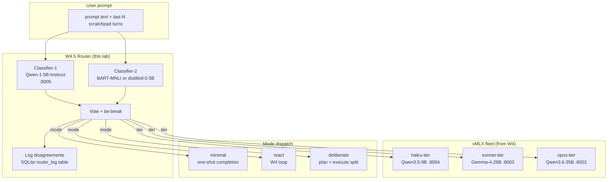

> **Status: SPEC DRAFT (2026-05-14).** This chapter is a planning skeleton produced from cross-repo convergence research (PAI mode/tier classifier + agenticSeek two-stage AgentRouter). Phase Python blocks marked `TBD` are scoped but not yet written. Reviewer-pass before implementation. Spec source: research dossier on Personal_AI_Infrastructure / PraisonAI / AutoGPT / agenticSeek (2026-05-14).

## Exit Criteria

- [ ] `src/router.py` — local Qwen-1.5B classifier emitting `{tier: haiku|sonnet|opus, mode: minimal|react|deliberate}` from prompt + last-N scratchpad turns
- [ ] `src/tier_dispatch.py` — calls the right vMLX endpoint per classifier verdict; falls back deterministically when a tier is unavailable
- [ ] `src/router_vote.py` — second classifier (zero-shot BART-MNLI or distilled Qwen-0.5B) that votes against the primary; tie-break logic + disagreement logging
- [ ] `tests/test_router_accuracy.py` — labelled 60-prompt probe set; classifier accuracy ≥ 85% on per-tier classification, ≥ 90% on per-mode classification
- [ ] `RESULTS.md` four-way bench: (a) opus-always baseline, (b) classifier-routed, (c) classifier+vote routed, (d) random-baseline. Measure: mean latency, mean tokens, task-success rate on 20-task ReAct probe set carried over from W4.

---

## 1. Why This Week Matters (~150 words — REQUIRED)

W4 built one ReAct loop calling one opus-tier model. Every task — "what's 2+2", "summarize this paragraph", "debug this Python script", "plan a multi-step deployment" — pays the same 35B-parameter latency cost. Production agent systems don't work this way. Every request that reaches Claude.ai, ChatGPT, Cursor passes through a routing layer that picks the smallest model competent for the request — small classifier upstream, large executor only when needed. Daniel Miessler's PAI ships a Sonnet-backed mode classifier that routes prompts across MINIMAL / NATIVE / ALGORITHM tiers; agenticSeek runs a two-stage local classifier (Adaptive + BART-MNLI voted) before any tool dispatch. **The senior-engineer signal is "I can describe my routing layer's accuracy curve and its cost-latency Pareto front"** — and the reader who can say "my Qwen-1.5B classifier routes 70% of tasks away from the 35B executor with 87% accuracy, saving 4× wall-clock on the easy class" sounds far more credible than one who picked one model and called it done. This chapter builds that classifier, measures its accuracy, and proves the cost-latency lift on the W4 probe set.

---

## 2. Theory Primer (~1000 words — REQUIRED — OUTLINED, FULL TEXT IN ROUND 2)

### 2.1 The routing-layer thesis

Frontier agent systems have a routing-layer architecture that academic LLM literature still under-describes. The cheap-classifier-before-expensive-executor pattern is older than transformers (Mixture-of-Experts since 1991), but its agent-system incarnation has three load-bearing properties most introductions miss:

1. **Closed-list classification, not free-text reasoning.** The router emits one of N labels. It is NOT a small reasoning model; it is a softmax over a fixed taxonomy. Calibration matters more than capability.
2. **Multi-axis routing.** PAI splits at least two axes (mode × tier); agenticSeek splits two as well (complexity × task-type). The product is the dispatch decision.
3. **Vote-or-fallback for safety.** Single-classifier mis-routes are silent failures. Two classifiers + tie-break + log-on-disagree gives you the ground truth to keep tuning.

### 2.2 Five concepts to own before writing code

1. **Tier vs mode** — *tier* is "how big is the executor" (haiku/sonnet/opus parameter count, latency, cost); *mode* is "what control flow do we run" (minimal one-shot / ReAct loop / deliberate plan-then-execute). They are orthogonal axes; cheaper executor + heavier mode often beats heavier executor + minimal mode.
2. **Classifier-as-policy** — the classifier IS the policy layer. Hand-coded if/else rules over query patterns become unmaintainable past ~10 routes. A small fine-tunable classifier is the right abstraction.
3. **The few-shot trick** — neither PAI nor agenticSeek fine-tunes their classifier from scratch. PAI uses Sonnet with a strong system prompt; agenticSeek seeds its `AdaptiveClassifier` via `add_examples()` in-process. Few-shot + small base model is the cheapest viable design.
4. **Calibration curves over accuracy** — for a router, accuracy is one number; the calibration curve (predicted-confidence vs actual-accuracy) tells you when to escalate to a heavier tier or trigger the vote.
5. **The cost-latency Pareto front** — every routed-task decision moves you on a 2-D plane (mean-tokens × p50-latency). The right metric for a router is not "accuracy" but "how much of the front does my routing cover".

### 2.3 Papers + references to cite (TBD-fill in round 2)

- Shazeer et al. (2017). *Outrageously Large Neural Networks: The Sparsely-Gated Mixture-of-Experts Layer.* arXiv:1701.06538. — MoE foundation.
- Mu et al. (2024). *RouterBench.* — benchmark for LLM-routing systems.
- Hu et al. (2024). *RouteLLM: Learning to Route LLMs with Preference Data.* arXiv:2406.18665 — production routing recipe.
- Chen et al. (2023). *FrugalGPT: How to Use Large Language Models While Reducing Cost and Improving Performance.* arXiv:2305.05176 — cascading and routing across providers.
- Daniel Miessler's PAI v6.3.0 Algorithm release notes (mode classifier).
- agenticSeek `sources/router.py` (`AgentRouter` + `router_vote`).
- PraisonAI process modes (sequential / parallel / hierarchical / workflow).

### 2.4 Distinguish-from box

- **Routing ≠ tool selection.** Tool selection (W6.7 Agent Skills) picks WHICH tool to call inside one agent; routing picks WHICH model+control-flow to run the agent under. Both are policy layers, but at different abstraction levels.
- **Routing ≠ MoE.** MoE picks experts INSIDE a single model's forward pass; routing picks BETWEEN entire deployed models. Same idea, different layer.
- **Routing ≠ cascade.** A cascade always tries the cheap model first, escalates on failure; a router commits to ONE model up-front. Cascade pays double latency on hard tasks; router pays a small classifier latency always but no double-call cost. We build a router; we explain cascade for contrast.

---

## 3. System Architecture (REQUIRED — Mermaid)

**Reading the diagram.** Both classifiers see the same input (prompt + last-N scratchpad turns). They emit `(tier, mode)` independently. The vote layer agrees-or-tie-breaks and writes the verdict + both classifier outputs to a SQLite log. The chosen tier-endpoint runs the chosen mode against the executor.

---

## 4. Lab Phases (REQUIRED — TBD code, scoped now)

### Phase 1 — Lab scaffold + add classifier-tier model to fleet (~30 min)

Goal: extend the W4 vMLX fleet config with a Qwen-1.5B-Instruct classifier on `:8005`. Verify the four-endpoint fleet (`:8002 / :8003 / :8004 / :8005`) is reachable from Python.

- **TBD code** — `src/fleet_config.py` extending W4's fleet config with classifier-tier endpoint.
- **TBD verification** — curl smoke test against all 4 endpoints; latency measurement at idle.

### Phase 2 — Build the labelled probe set (~45 min)

Goal: hand-label a 60-prompt training set covering 3 tiers × 3 modes × ~7 examples. Mix mathematical, summarization, code-debug, planning, multi-step-tool-use prompts. The labels are the ground truth the classifiers train against.

- **TBD artifact** — `tests/router_probes.jsonl` (60 rows: `prompt`, `expected_tier`, `expected_mode`, `domain`).
- Pedagogical note: the labelled set IS the policy; hand-curating it forces the engineer to articulate what "needs opus" actually means in their domain. This is the unglamorous reusable-skill step.

### Phase 3 — Build classifier-1 + dispatch (~1.5 hours)

Goal: prompt-engineer Qwen-1.5B-Instruct to emit `{tier, mode}` as JSON. Implement `src/router.py` with `classify(prompt, scratchpad) -> dict`. Implement `src/tier_dispatch.py` that maps the verdict to the right fleet endpoint + spawns the right control-flow (re-use W4's `run_agent()` for `react` mode; new `run_minimal()` / `run_deliberate()` for the other two).

- **TBD code** — `src/router.py`, `src/tier_dispatch.py`.
- **TBD measurement** — single-classifier accuracy on the 60-prompt probe set. Target ≥ 85% per-tier, ≥ 90% per-mode.

### Phase 4 — Add classifier-2 + vote (~1.5 hours)

Goal: introduce a second classifier (zero-shot BART-MNLI from HuggingFace transformers, run on MLX) that emits the same `(tier, mode)` taxonomy. Implement `router_vote()` with the rule: agree → emit; disagree → escalate one tier + log row. Tie-break: prefer the heavier tier on disagreement (safety bias).

- **TBD code** — `src/router_vote.py`, `src/router_log.py` (SQLite append-only schema).
- **TBD measurement** — voted-classifier accuracy vs single-classifier on the probe set. Disagreement rate. Latency cost of running the second classifier in parallel.

### Phase 5 — Four-way cost-latency benchmark (~2 hours)

Goal: re-run the W4 20-task ReAct probe set under four routing configurations:
- (a) **opus-always baseline** — every task routed to `:8002`
- (b) **classifier-routed** — single Qwen-1.5B verdict
- (c) **classifier+vote routed** — Qwen-1.5B + BART-MNLI with vote
- (d) **random-baseline** — uniform random tier+mode (sanity floor)

Measure: mean tokens, p50 latency, p95 latency, task-success rate, $ cost equivalent (using public per-token rates as the equivalent-cloud baseline). Plot the cost-latency Pareto front.

- **TBD code** — `tests/test_four_way_bench.py`.
- **TBD result table** — populate `RESULTS.md` with the 4-way comparison.

---

## 5. (deprecated)

Walkthroughs live inline per the per-Python-block bundle in §4.

---

## 6. Bad-Case Journal (3-5 entries — TBD AFTER LAB RUN)

Pre-flight entries scoped from convergent failure modes in PAI + agenticSeek + RouteLLM literature; final entries populated post-implementation.

**Entry 1 (planned) — Classifier silently miscategorizes domain-shift prompts.**
*Scoped from:* agenticSeek BART-MNLI lock-in on stale labels.

**Entry 2 (planned) — Mode classifier saturates on "deliberate" when scratchpad grows.**
*Scoped from:* PAI mode-classifier degradation on long contexts.

**Entry 3 (planned) — Vote layer over-escalates and erases the latency win.**
*Scoped from:* RouteLLM paper §5 cascade-vs-routing analysis.

**Entry 4 (planned) — Tier 0 fleet endpoint unavailable → no fallback path defined.**
*Scoped from:* W4 BCJ Entry-N (fleet endpoint blue-screen) precedent.

**Entry 5 (planned) — Probe-set drift; reader's actual prompt distribution diverges from labelled set.**
*Scoped from:* RouterBench paper §7 train/eval distribution mismatch.

---

## 7. Interview Soundbites (2-3 entries — TBD AFTER LAB RUN)

Soundbites are written post-measurement so the numbers cited are real. Scoped topics:

- (a) "How would you design a routing layer for an LLM agent system?" — anchor on 4-way bench numbers.
- (b) "Why two classifiers instead of one?" — anchor on disagreement rate + escalation safety.
- (c) "What's the difference between routing and Mixture-of-Experts?" — anchor on the §2.4 distinguish-from material.

---

## 8. References (TBD-fill)

Same set as §2.3 once expanded. Format per vault conventions:
- **Author et al. (Year).** *Title.* Venue. arXiv link. One-line description.

Must include at least one production blog post or canonical implementation repo. Candidates:
- agenticSeek `sources/router.py` (canonical local-classifier impl)
- PAI v6.3.0 Algorithm release notes (mode classifier production discussion)
- RouteLLM HuggingFace `lmsys/RouteLLM` (production-deployed router)
- Anthropic Claude routing engineering blog (when available)

---

## 9. Cross-References

- **Builds on:** [[Week 4 - ReAct From Scratch]] (fleet, scratchpad, ReAct loop); [[Week 1 - Local Inference]] (MLX serving primitives).
- **Distinguish from:** [[Week 6.7 - Agent Skills]] (tool selection inside an agent, not model selection between agents); MoE inside a single model's forward pass; cascade-vs-route distinction (§2.4).
- **Connects to:** [[Week 5.5 - Metacognition]] (self-routing is a metacognitive primitive — agent classifying its own confusion as "needs heavier tier"); [[Week 6.5 - Hermes]] (the classifier's structured-output discipline is the same as tool-call structured output).
- **Foreshadows:** [[Week 11 - System Design]] (production routing topology, cost-latency Pareto front); [[Week 12 - Capstone]] (the routing layer is one of the load-bearing capstone components).

---

## Resolved design decisions (locked 2026-05-14)

1. **Scope:** ✅ 5 phases ~6 hours (matches W3.5.8 budget).
2. **Classifier port `:8005`:** ✅ accepted as default. **TODO during Phase 1 implementation:** grep W3.x chapters for any pre-existing service binding to `:8005` and reassign if collision found.
3. **Probe set:** ✅ hand-label 60 prompts (forces domain articulation). Public benches (RouterBench, RouteLLM) cited in §2.3 as comparative reading only.
4. **Vote concurrency:** ✅ `asyncio.gather()` parallel. Both classifiers are 1.5B-class — no contention concern.
5. **PAI propose-then-verify pattern:** ✅ slot in W5.5, not W4.5 (self-state classification, not prompt classification).

---

*Spec drafted from cross-repo convergence research (Personal_AI_Infrastructure + PraisonAI + AutoGPT + agenticSeek). Convergence finding: 2/4 repos converge on local-classifier-before-tool-dispatch; PraisonAI converges on 4-mode process topology (parallel pattern, slots into §4.3 mode taxonomy); AutoGPT converges on graph-runtime (deferred to candidate W4.6 Durable Runtime, NOT this chapter).*
