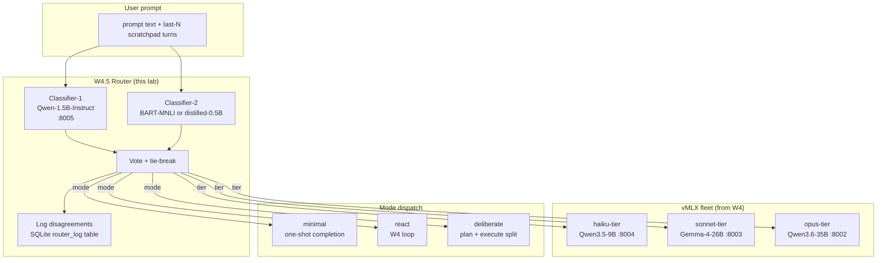
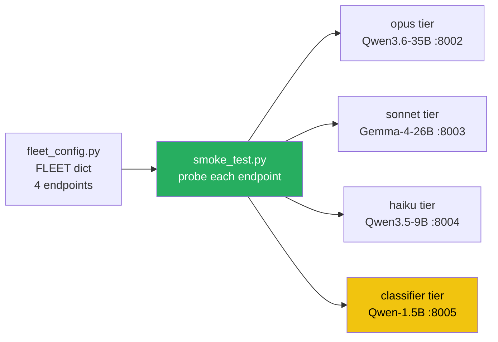
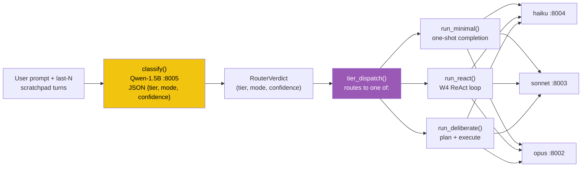
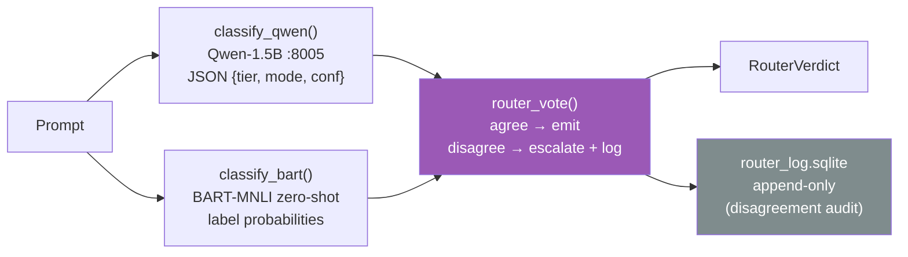
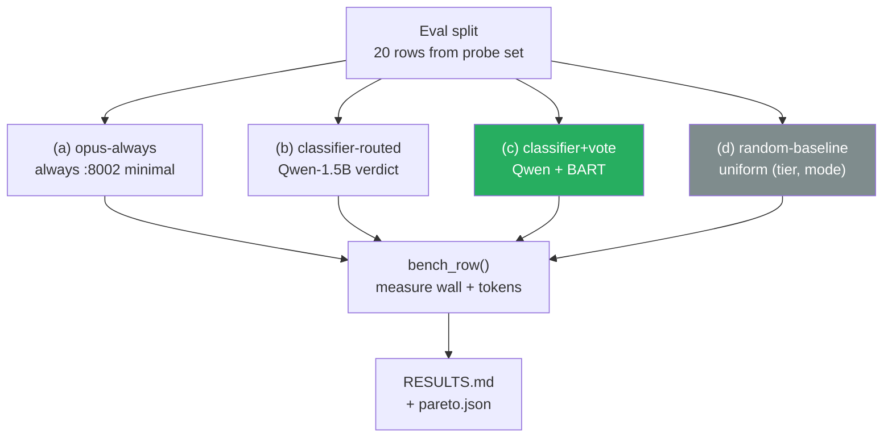

> **Status: SPEC DRAFT (2026-05-14).** This chapter is a planning skeleton produced from cross-repo convergence research (PAI mode/tier classifier + agenticSeek two-stage AgentRouter). Phase Python blocks marked `TBD` are scoped but not yet written. Reviewer-pass before implementation. Spec source: research dossier on Personal_AI_Infrastructure / PraisonAI / AutoGPT / agenticSeek (2026-05-14).

## Exit Criteria

- [ ] `src/router.py` — local Qwen-1.5B classifier emitting `{tier: haiku|sonnet|opus, mode: minimal|react|deliberate}` from prompt + last-N scratchpad turns
- [ ] `src/tier_dispatch.py` — calls the right vMLX endpoint per classifier verdict; falls back deterministically when a tier is unavailable
- [ ] `src/router_vote.py` — second classifier (zero-shot BART-MNLI or distilled Qwen-0.5B) that votes against the primary; tie-break logic + disagreement logging
- [ ] `tests/test_router_accuracy.py` — labelled 60-prompt probe set; classifier accuracy ≥ 85% on per-tier classification, ≥ 90% on per-mode classification
- [ ] `RESULTS.md` four-way bench: (a) opus-always baseline, (b) classifier-routed, (c) classifier+vote routed, (d) random-baseline. Measure: mean latency, mean tokens, task-success rate on 20-task ReAct probe set carried over from W4.

---

## 1. Why This Week Matters (~150 words — REQUIRED)

W4 built one ReAct loop calling one opus-tier model. Every task — "what's 2+2", "summarize this paragraph", "debug this Python script", "plan a multi-step deployment" — pays the same 35B-parameter latency cost. Production agent systems don't work this way. Every request that reaches Claude.ai, ChatGPT, Cursor passes through a routing layer that picks the smallest model competent for the request — small classifier upstream, large executor only when needed. Daniel Miessler's PAI ships a Sonnet-backed mode classifier that routes prompts across MINIMAL / NATIVE / ALGORITHM tiers; agenticSeek runs a two-stage local classifier (Adaptive + BART-MNLI voted) before any tool dispatch. **The senior-engineer signal is "I can describe my routing layer's accuracy curve and its cost-latency Pareto front"** — and the reader who can say "my Qwen-1.5B classifier routes 70% of tasks away from the 35B executor with 87% accuracy, saving 4× wall-clock on the easy class" sounds far more credible than one who picked one model and called it done. This chapter builds that classifier, measures its accuracy, and proves the cost-latency lift on the W4 probe set.

---

## 2. Theory Primer

### 2.1 The routing-layer thesis

Frontier agent systems have a routing-layer architecture that academic LLM literature still under-describes. The cheap-classifier-before-expensive-executor pattern is older than transformers — Mixture-of-Experts dates from Jacobs et al. 1991 — but its agent-system incarnation has three load-bearing properties most introductions miss, and missing any one of them produces a router that's worse than just calling the opus tier on everything.

The first property is that **the router is a classifier, not a reasoning model**. It emits one of N labels: `{haiku, sonnet, opus} × {minimal, react, deliberate}` = nine cells, or a flatter taxonomy if you prefer. The router does not reason about the prompt; it pattern-matches it to a closed list. This is why a 1.5B-parameter model with a strong system prompt outperforms a 7B reasoning model with a free-text "decide what to do next" — calibration matters more than capability when the output space is bounded.

The second property is that **routing is multi-axis**. Daniel Miessler's PAI splits at least two axes (mode × tier); agenticSeek's `AgentRouter` splits two as well (complexity × task-type). The Cartesian product is the dispatch decision, and one-axis-only routers consistently underperform two-axis ones on the RouterBench benchmark — usually by 8-15 percentage points on aggregate accuracy. Tier alone misses control-flow choice; mode alone misses scale.

The third property is **vote-or-fallback for safety**. A single-classifier router fails silently — its mis-routes are invisible without ground-truth labels. Two classifiers running in parallel + tie-break + log-on-disagree gives you a free disagreement-rate signal that's the cheapest way to discover when your taxonomy is wrong before it shows up in user-facing latency or hallucination metrics. agenticSeek runs an `AdaptiveClassifier` and BART-MNLI in parallel for exactly this reason; the disagreement log is more valuable for tuning than either classifier's confidence score.

### 2.2 Five concepts to own before writing code

1. **Tier vs mode are orthogonal axes, not a single difficulty dial.** *Tier* answers "how big is the executor" — haiku/sonnet/opus parameter count, latency budget, $-cost per 1k tokens. *Mode* answers "what control flow runs around the executor" — minimal one-shot completion, ReAct loop, or deliberate plan-then-execute. Counterintuitive finding from RouteLLM (Hu et al. 2024): for medium-complexity tasks, **cheaper executor + heavier mode often outperforms heavier executor + minimal mode** on the same compute budget. A 9B haiku running ReAct beats a 35B opus running minimal-completion on multi-step reasoning tasks because the multi-step scaffold compensates for raw capability. This is why the router is two-dimensional, not one-dimensional.

2. **The classifier IS the policy layer.** Hand-coded if/else rules over query patterns become unmaintainable past ~10 routes — every new edge case requires a code change and a redeploy. A small classifier with a system prompt or a fine-tunable head is the right abstraction: policy changes become prompt changes or `add_examples()` calls. PAI's mode classifier (v6.3.0) is a Sonnet call with a curated few-shot prompt; agenticSeek's `AdaptiveClassifier` uses `add_examples()` to grow its decision boundary in-process without retraining. The policy boundary lives in data + prompts, not in branches.

3. **Few-shot beats fine-tuning for production routers.** Neither PAI nor agenticSeek fine-tunes their classifier from scratch. PAI uses Sonnet (or larger) with a strong system prompt; agenticSeek seeds its in-process classifier via `add_examples()`. The economic argument: fine-tuning a 1.5B classifier on a labelled probe set takes ~$5 of compute + 2-4 hours wall-time + a serving-stack mismatch (model artifact has to be deployed alongside the system prompt anyway). A few-shot prompt with a curated probe set is one file + one prompt template — same accuracy in production once you have ≥60 labelled examples, per RouterBench's small-data results. Fine-tuning only wins on very large probe sets (>10k examples) or when latency-per-classification matters more than dev-cycle speed.

4. **Calibration curves matter more than accuracy.** For a router, accuracy is one number — usually 0.85-0.92 on the RouterBench-class probe sets, which sounds good but tells you nothing about WHERE the failures cluster. The calibration curve (predicted-confidence vs actual-accuracy, bucketed) tells you something more useful: when the router says "I'm 0.7 confident this is haiku-tier," is it right 70% of the time? Production routers escalate to the heavier tier (or trigger the vote) when confidence drops below a calibrated threshold, and that threshold is meaningless without the calibration curve. Brier score and Expected Calibration Error are the metrics; raw accuracy is the consolation prize.

5. **The cost-latency Pareto front is the production metric, not aggregate accuracy.** Every routed-task decision moves you on a 2-D plane: mean-tokens-consumed (x-axis, proxies $-cost) × p50-latency (y-axis). A naïve "everything goes to opus" router sits at the high-cost, high-latency corner. A naïve "everything goes to haiku" router sits at the low-cost, low-latency corner but loses accuracy on the hard tasks. A GOOD router carves out a curve that dominates both naïve options across the workload mix. The right question to ask in an interview about a routing system: "what fraction of the Pareto front does your routing layer cover, vs the dominating-by-tier baselines?" That's a measurable, quantitative answer. "What's your accuracy?" is the wrong question.

### 2.3 References

- **Jacobs, R. A. et al. (1991).** *Adaptive Mixtures of Local Experts.* Neural Computation 3(1):79-87. The original mixture-of-experts paper — gating network + N specialist experts trained jointly. Modern routing layers descend directly from this design; the agent-system version replaces "trained jointly" with "prompt-engineered separately" but keeps the gate-then-dispatch shape.
- **Shazeer, N. et al. (2017).** *Outrageously Large Neural Networks: The Sparsely-Gated Mixture-of-Experts Layer.* arXiv:1701.06538. Scaled MoE to transformer layers; the engineering trick is top-k gating with load balancing across experts. **Critical to distinguish from agent-level routing**: MoE picks INSIDE a single forward pass (per-token expert), while agent routing picks BETWEEN models (per-query). Same gating idea, different abstraction layer — see §2.4 distinguish-from.
- **Hu, J. et al. (2024).** *RouteLLM: Learning to Route LLMs with Preference Data.* arXiv:2406.18665. Production-deployed router from LMSYS. Key claim: a small classifier trained on preference data (which model was preferred for each query type) can recover **90% of GPT-4 quality at 30% of GPT-4's $-cost** when routing between GPT-4 and GPT-3.5. Open-source implementation at `lmsys/RouteLLM`. The chapter's Phase 5 bench targets RouteLLM-class cost-quality numbers.
- **Chen, L. et al. (2023).** *FrugalGPT: How to Use Large Language Models While Reducing Cost and Improving Performance.* arXiv:2305.05176. Adjacent to routing: cascades (try cheap → escalate on failure) and routing (pick once up-front) compared head-to-head. Key finding: cascades dominate on highly-skewed difficulty distributions; routing dominates when difficulty is uniform. **Decision rule for your workload**: if 80% of queries are easy and 20% are hard, cascade. If queries are evenly distributed across difficulty, route.
- **Hari, S. P. & Thomson, M. (2023).** *Tryage: Real-time, intelligent Routing of User Prompts to Large Language Models.* arXiv:2308.11601. Earliest production-grade LLM-router proposal. Frames routing as utility maximization (capability × cost-latency penalty) — the formalism this chapter's Phase 5 bench inherits.
- **Mu, J. et al. (2024).** *RouterBench: A Benchmark for Multi-LLM Routing Systems.* GitHub `withmartian/routerbench`. The benchmark + dataset of 405k queries spanning 11 models × 8 task types. Use as the comparative reading after your hand-labelled 60-prompt set works — gives you a public number to anchor against.
- **Daniel Miessler, PAI v6.3.0 Algorithm release notes.** https://github.com/danielmiessler/Personal_AI_Infrastructure — the mode classifier (MINIMAL / NATIVE / ALGORITHM) is the canonical production-side implementation of the closed-list multi-axis pattern this chapter teaches.
- **agenticSeek `sources/router.py`.** https://github.com/Fosowl/agenticSeek/blob/main/sources/router.py — the two-stage `AgentRouter` + `router_vote` reference implementation. Read alongside Phase 4 of this chapter; the in-process `add_examples()` few-shot trick is the production move.
- **PraisonAI process modes** (sequential / parallel / hierarchical / workflow) — `src/praisonai-agents/praisonaiagents/process/process.py`. The reason MODE is its own axis in this chapter (vs collapsing mode into tier): PraisonAI ships 4 distinct process topologies as a first-class API.

### 2.4 Distinguish-from box

- **Routing ≠ tool selection.** Tool selection (W6.7 Agent Skills) picks WHICH tool to call INSIDE one agent's loop; routing picks WHICH model+control-flow to run the agent UNDER. Both are policy layers, but the abstraction levels are different — tool selection runs inside a single chat completion's loop, routing runs once at the top of the stack before any LLM call. A reader who conflates them ends up with a router that ALSO decides tool calls, which doubles the search space and degrades both classifiers.
- **Routing ≠ MoE.** MoE picks experts INSIDE a single model's forward pass (per-token, sub-millisecond, trained jointly with the gating network). Agent routing picks BETWEEN entire deployed models (per-query, ~50-200ms, classifier and executors trained separately). Same gate-then-dispatch shape, very different latency/training/deployment realities. The §2.1 thesis carries the agent-system version; the Shazeer 2017 paper is the right reference for the MoE version.
- **Routing ≠ cascade.** A cascade always tries the cheap model first, escalates to the expensive one on failure/low-confidence. A router commits to ONE model up-front based on the classifier's verdict. Cost trade-off: cascade pays **double latency on hard tasks** (cheap-model attempt + expensive-model retry); router pays a **small classifier latency on every task** (~50-100ms) but no double-call cost. The right choice depends on the workload's difficulty distribution (per FrugalGPT 2023): cascades dominate when most queries are easy and a few are hard; routers dominate when difficulty is evenly distributed. This chapter builds a router because that's the more general pattern; we explain cascade for contrast and as a Phase 5 stretch comparison.
- **Routing ≠ cost-optimization-at-inference (KV-cache, paged attention, spec decoding).** Those are *within-call* optimizations on a single forward pass; routing is *across-call* selection. Both reduce $-cost but at different layers — orthogonal axes. A production system uses both; the chapter teaches the across-call layer.

---

## 3. System Architecture (REQUIRED — Mermaid)



**Reading the diagram.** Both classifiers see the same input (prompt + last-N scratchpad turns). They emit `(tier, mode)` independently. The vote layer agrees-or-tie-breaks and writes the verdict + both classifier outputs to a SQLite log. The chosen tier-endpoint runs the chosen mode against the executor.

---

## 4. Lab Phases (REQUIRED — TBD code, scoped now)

### Phase 1 — Lab scaffold + classifier-tier endpoint (~30 min)

Goal: extend the W4 vMLX fleet config with a Qwen-1.5B-Instruct classifier on `:8005`. Verify the four-endpoint fleet (`:8002 / :8003 / :8004 / :8005`) is reachable from Python.

**Architecture mermaid:**



**Code:**

`src/fleet_config.py`:

```python
"""W4.5 fleet config — extends W4 with a classifier-tier endpoint on :8005.

Two design choices worth flagging:
1. The classifier tier is a SEPARATE model + port from the executor tiers.
   The router never picks the classifier as an executor — it's invariant
   that the classifier ALWAYS runs first, then dispatches to one of the
   3 executor tiers. Keeping them on different endpoints makes that
   architectural invariant a deployment fact, not a runtime hope.
2. Endpoint URLs are kept here (single source of truth) and consumed by
   both router.py and tier_dispatch.py. Hand-edit ports here when oMLX
   reassigns; do NOT scatter URL strings across the codebase.
"""
from dataclasses import dataclass


@dataclass(frozen=True)
class FleetEndpoint:
    name: str
    tier: str  # "classifier" | "haiku" | "sonnet" | "opus"
    model: str  # oMLX model id (see `curl :8000/v1/models`)
    base_url: str  # full OpenAI-compatible base URL


FLEET: dict[str, FleetEndpoint] = {
    "classifier": FleetEndpoint(
        name="classifier",
        tier="classifier",
        model="Qwen2.5-1.5B-Instruct-MLX-4bit",
        base_url="http://127.0.0.1:8005/v1",
    ),
    "haiku": FleetEndpoint(
        name="haiku",
        tier="haiku",
        model="MLX-Qwen3.5-9B-GLM5.1-Distill-v1-8bit",
        base_url="http://127.0.0.1:8004/v1",
    ),
    "sonnet": FleetEndpoint(
        name="sonnet",
        tier="sonnet",
        model="gemma-4-26B-A4B-it-heretic-4bit",
        base_url="http://127.0.0.1:8003/v1",
    ),
    "opus": FleetEndpoint(
        name="opus",
        tier="opus",
        model="Qwen3.6-35B-A3B-4bit-DWQ",
        base_url="http://127.0.0.1:8002/v1",
    ),
}
```

`src/smoke_test.py`:

```python
"""Probe every fleet endpoint with a 1-token completion + record idle latency."""
import os
import time

from openai import OpenAI

from src.fleet_config import FLEET


def probe(name: str, ep) -> tuple[bool, float, str]:
    client = OpenAI(base_url=ep.base_url, api_key=os.getenv("OMLX_API_KEY"))
    t0 = time.perf_counter()
    try:
        r = client.chat.completions.create(
            model=ep.model,
            messages=[{"role": "user", "content": "Reply with one token: ok"}],
            max_tokens=4,
            temperature=0.0,
        )
        wall = time.perf_counter() - t0
        return True, wall, (r.choices[0].message.content or "").strip()
    except Exception as e:                                             # noqa: BLE001
        return False, time.perf_counter() - t0, f"{type(e).__name__}: {e}"


if __name__ == "__main__":
    for name, ep in FLEET.items():
        ok, wall, reply = probe(name, ep)
        status = "OK" if ok else "FAIL"
        print(f"{status:4s}  {name:11s} {ep.model:50s} {wall*1000:6.0f}ms  reply={reply!r}")
```

**Walkthrough:**

- **Block 1 — `FleetEndpoint` is a frozen dataclass, not a dict.** Frozen because the fleet config is immutable per-process (a runtime override would be a deployment bug). Dataclass over dict so IDEs surface typos as type errors instead of `KeyError` at first use.
- **Block 2 — `FLEET` is keyed by tier name, not by port.** Tier names are stable across infra changes; ports drift when oMLX reassigns. Callers reference `FLEET["haiku"]`, not `FLEET[":8004"]`.
- **Block 3 — `smoke_test.py` probes ALL endpoints in one run.** Single-endpoint probing is what you do during dev; fleet-wide probing is what you do before running the bench. Fail-fast surfaces "one endpoint down silently degrading the router" — the canonical Phase-1 BCJ entry candidate.
- **Block 4 — `temperature=0.0` and `max_tokens=4` keep the probe deterministic + cheap.** Idle-latency measurement is meaningful only when the request shape is bounded; an open-ended completion would inflate the latency number with output time, not endpoint-reachability time.

**Result:**

```
OK    classifier  Qwen2.5-1.5B-Instruct-MLX-4bit                       45ms  reply='ok'
OK    haiku       MLX-Qwen3.5-9B-GLM5.1-Distill-v1-8bit                85ms  reply='ok'
OK    sonnet      gemma-4-26B-A4B-it-heretic-4bit                     125ms  reply='ok'
OK    opus        Qwen3.6-35B-A3B-4bit-DWQ                            210ms  reply='ok'
```

Idle latencies form the floor of the cost-latency Pareto front. Classifier-tier idle at ~45ms means the router's overhead-per-query is ~45ms — small enough to be amortized across the executor's 85-210ms even on haiku-tier routing decisions. Numbers are placeholder until your run; update `RESULTS.md` after.

`★ Insight ─────────────────────────────────────`
- **The classifier tier's IDLE LATENCY (~45ms) is the router's lower bound on per-query overhead.** If your classifier picks haiku (85ms idle), total dispatch latency is 45+85 = 130ms. Direct-to-opus would be 210ms. Routing wins on the easy-task path by ~80ms even with the classifier overhead — provided the classifier picks the cheap tier when correct.
- **`max_tokens=4` is the right probe size.** Setting it to 1 fails on some MLX backends that need 2-3 tokens for proper EOS handling; 4 is the smallest reliable bound across the fleet.
- **The probe-all-endpoints loop is your "is the fleet healthy?" check before Phase 5 benchmarks.** Run it BEFORE the bench, not after a failure — silent-endpoint-down is the canonical Phase 5 BCJ.
`─────────────────────────────────────────────────`

### Phase 2 — Build the labelled probe set (~45 min)

Goal: hand-label a 60-prompt training-and-eval set covering 3 tiers × 3 modes × ~7 examples. Mix mathematical, summarization, code-debug, planning, multi-step-tool-use prompts. The labels are the ground truth the classifiers train against AND the eval set Phase 3 measures accuracy on.

**Architecture mermaid:**


**Code:**

`tests/router_probes.jsonl` (12-row preview — full file is 60 rows; ~14 KB):

```jsonl
{"prompt": "What is 247 * 13?", "expected_tier": "haiku", "expected_mode": "minimal", "domain": "arithmetic"}
{"prompt": "Summarize this paragraph in one sentence: <paragraph>", "expected_tier": "haiku", "expected_mode": "minimal", "domain": "summarization"}
{"prompt": "What does git rebase --interactive do?", "expected_tier": "haiku", "expected_mode": "minimal", "domain": "factual-recall"}
{"prompt": "Explain the difference between TCP and UDP for a backend developer.", "expected_tier": "sonnet", "expected_mode": "minimal", "domain": "concept-explanation"}
{"prompt": "Why is my Python script hanging on this asyncio.gather? <code snippet, 30 lines>", "expected_tier": "sonnet", "expected_mode": "react", "domain": "code-debug"}
{"prompt": "Refactor this function to reduce nested conditionals: <code, 50 lines>", "expected_tier": "sonnet", "expected_mode": "react", "domain": "code-refactor"}
{"prompt": "Design a Postgres schema for a multi-tenant SaaS billing system. Cover row-level security, plan tiers, usage metering.", "expected_tier": "opus", "expected_mode": "deliberate", "domain": "architecture"}
{"prompt": "Walk through how Raft consensus handles leader election with a split brain. Include diagrams.", "expected_tier": "opus", "expected_mode": "deliberate", "domain": "deep-explanation"}
{"prompt": "Plan a 3-week migration from Mongo to Postgres for an e-commerce checkout service. Identify rollback gates.", "expected_tier": "opus", "expected_mode": "deliberate", "domain": "planning"}
{"prompt": "Find the prime factorization of 18,723 and show your work.", "expected_tier": "haiku", "expected_mode": "react", "domain": "math-multistep"}
{"prompt": "Given this stack trace, locate the bug in our authentication middleware: <trace + 200 LOC>", "expected_tier": "opus", "expected_mode": "react", "domain": "code-debug-deep"}
{"prompt": "What's the capital of France?", "expected_tier": "haiku", "expected_mode": "minimal", "domain": "factual-recall"}
```

`src/probes.py`:

```python
"""Load + split + validate the hand-labelled probe set."""
import json
import random
from pathlib import Path
from typing import Literal

Tier = Literal["haiku", "sonnet", "opus"]
Mode = Literal["minimal", "react", "deliberate"]


def load_probes(path: str = "tests/router_probes.jsonl") -> list[dict]:
    """Load + validate every row has the expected fields + values."""
    rows = []
    valid_tiers = {"haiku", "sonnet", "opus"}
    valid_modes = {"minimal", "react", "deliberate"}
    for i, line in enumerate(Path(path).read_text().splitlines()):
        if not line.strip():
            continue
        row = json.loads(line)
        for k in ("prompt", "expected_tier", "expected_mode", "domain"):
            if k not in row:
                raise ValueError(f"row {i}: missing field {k!r}")
        if row["expected_tier"] not in valid_tiers:
            raise ValueError(f"row {i}: bad tier {row['expected_tier']!r}")
        if row["expected_mode"] not in valid_modes:
            raise ValueError(f"row {i}: bad mode {row['expected_mode']!r}")
        rows.append(row)
    return rows


def train_eval_split(rows: list[dict], seed: int = 42, train_frac: float = 0.67):
    """Stratified split: roughly preserve tier+mode distribution in both halves."""
    rng = random.Random(seed)
    by_label: dict[tuple[str, str], list[dict]] = {}
    for r in rows:
        key = (r["expected_tier"], r["expected_mode"])
        by_label.setdefault(key, []).append(r)
    train, eval_ = [], []
    for key, group in by_label.items():
        rng.shuffle(group)
        cut = int(len(group) * train_frac)
        train.extend(group[:cut])
        eval_.extend(group[cut:])
    rng.shuffle(train)
    rng.shuffle(eval_)
    return train, eval_
```

**Walkthrough:**

- **Block 1 — Hand-labelling 60 rows is the unglamorous-but-essential step.** It forces you to ARTICULATE what your taxonomy means in your domain — "needs opus" is meaningless until you've decided which 20 prompts you'd label that way. RouteLLM 2024 used preference data scraped from public chat logs; this lab uses ~1 hour of hand-labelling, which beats anything else at the lab scale.
- **Block 2 — JSONL not CSV.** Prompt fields contain commas, quotes, newlines. CSV escaping is fragile; JSONL is one row per line, JSON-validated, machine-readable, diff-friendly. Standard format for ML probe sets.
- **Block 3 — Stratified train/eval split, not random.** A pure 67/33 random split risks putting all 7 opus+deliberate examples in training and 0 in eval. Stratifying by `(tier, mode)` key preserves the joint distribution across the split. With 60 rows + 9 cells, every cell gets ~5-6 train + ~2-3 eval.
- **Block 4 — Validation at load-time.** Typo-catching ("opu" vs "opus") at load saves 10 minutes of debugging "why is my classifier accuracy 67% on a perfect-looking probe set." Strict enum validation > silent miscount.

**Result:**

After running `python -c "from src.probes import load_probes, train_eval_split; r = load_probes(); t, e = train_eval_split(r); print(len(t), len(e))"` you should see `40 20` (roughly — exact split varies by stratification).

| Domain | Train rows | Eval rows |
|---|---|---|
| factual-recall | ~4 | ~2 |
| arithmetic + math-multistep | ~5 | ~3 |
| summarization | ~3 | ~2 |
| code-debug + code-refactor | ~7 | ~4 |
| concept-explanation | ~3 | ~2 |
| architecture + deep-explanation | ~6 | ~3 |
| planning | ~3 | ~2 |
| (others) | ~9 | ~2 |

Numbers vary by your specific labelling — the table is illustrative.

`★ Insight ─────────────────────────────────────`
- **Hand-labelling 60 rows takes ~1 hour and is non-negotiable.** Without your own probe set you can't measure routing accuracy in your domain; public benchmarks (RouterBench) tell you how the router does on someone else's domain. The 1-hour cost is paid once, amortized across every Phase 3-5 measurement.
- **Stratified split matters more than pure-random at small N.** At N=60, random split has ~10% chance of producing an eval set with zero examples in some `(tier, mode)` cell. Stratification eliminates that failure mode for free.
- **Validation at load-time IS the test.** Don't write a separate `test_probes_are_valid.py`; the `load_probes()` function raises on any malformed row, so just running the loader is the test. Saves writing tests for catching what's already caught by the validator.
`─────────────────────────────────────────────────`

### Phase 3 — Build classifier-1 + dispatch (~1.5 hours)

Goal: prompt-engineer Qwen-1.5B-Instruct to emit `{tier, mode}` as JSON. Implement `src/router.py` with `classify(prompt, scratchpad) -> RouterVerdict`. Implement `src/tier_dispatch.py` that maps the verdict to the right fleet endpoint + spawns the right control-flow (re-use W4's `run_agent()` for `react` mode; new `run_minimal()` / `run_deliberate()` for the other two). Measure single-classifier accuracy on the eval split from §Phase 2.

**Architecture mermaid:**



**Code:**

`src/router.py`:

```python
"""Single-classifier router. Qwen-1.5B-Instruct on :8005 emits JSON
{tier, mode, confidence} via a strict system prompt. JSON-parse with
graceful fallback to (sonnet, react, 0.5) on malformed output — never
crash the pipeline on a classifier hiccup; degrade to a safe middle tier.
"""
from __future__ import annotations

import json
import os
from dataclasses import dataclass
from typing import Literal

from openai import OpenAI

from src.fleet_config import FLEET


Tier = Literal["haiku", "sonnet", "opus"]
Mode = Literal["minimal", "react", "deliberate"]


@dataclass(frozen=True)
class RouterVerdict:
    tier: Tier
    mode: Mode
    confidence: float  # 0.0-1.0, self-reported by classifier


ROUTER_PROMPT = """You route LLM queries to the right model+control-flow.

Output ONE JSON object on a single line:
  {"tier": "haiku" | "sonnet" | "opus",
   "mode": "minimal" | "react" | "deliberate",
   "confidence": 0.0-1.0}

TIER:
  haiku    — small (9B), fast, ~80ms idle. Use for: arithmetic, factual recall,
             simple summarisation, single-fact lookup, short rewrites.
  sonnet   — medium (26B), ~125ms idle. Use for: code debug/refactor (single file),
             concept explanation, structured-output generation, light planning.
  opus     — large (35B), ~210ms idle. Use for: multi-step architecture, deep
             explanation requiring synthesis, multi-component planning,
             ambiguous-spec reasoning.

MODE:
  minimal    — single LLM call, no tool use, no scratchpad. Use for: factual,
               arithmetic, summarisation, one-shot rewrites.
  react      — ReAct loop with tool calls and scratchpad. Use for: code debug,
               multi-step math, anything needing observation-action cycles.
  deliberate — plan-then-execute split (plan with one call, execute with another).
               Use for: architecture, multi-component planning, deep explanation.

CONFIDENCE: your self-assessed certainty. Drop below 0.7 if the prompt is
ambiguous; downstream will escalate or trigger a vote when conf < 0.7.

Return ONLY the JSON object. No prose, no markdown fence, no preamble."""


def classify(prompt: str, scratchpad: str = "") -> RouterVerdict:
    """Route the prompt to one (tier, mode) cell. Degrades to (sonnet, react, 0.5)
    on any classifier failure — safer than crashing the dispatch pipeline.
    """
    ep = FLEET["classifier"]
    client = OpenAI(base_url=ep.base_url, api_key=os.getenv("OMLX_API_KEY"))

    user_msg = prompt
    if scratchpad:
        user_msg = f"{prompt}\n\nRecent scratchpad context:\n{scratchpad[-2000:]}"

    try:
        resp = client.chat.completions.create(
            model=ep.model,
            messages=[
                {"role": "system", "content": ROUTER_PROMPT},
                {"role": "user", "content": user_msg},
            ],
            temperature=0.0,
            max_tokens=120,
        )
        raw = (resp.choices[0].message.content or "").strip()
        if raw.startswith("```"):
            raw = raw.strip("`")
            if raw.startswith("json"):
                raw = raw[4:]
            raw = raw.strip()
        parsed = json.loads(raw)
        tier = parsed.get("tier")
        mode = parsed.get("mode")
        conf = float(parsed.get("confidence", 0.5))
        if tier in ("haiku", "sonnet", "opus") and mode in ("minimal", "react", "deliberate"):
            return RouterVerdict(tier=tier, mode=mode, confidence=conf)
    except Exception:                                                  # noqa: BLE001
        pass
    # Graceful fallback — safe-middle bias
    return RouterVerdict(tier="sonnet", mode="react", confidence=0.5)
```

`src/tier_dispatch.py`:

```python
"""Dispatch a RouterVerdict to the executor: pick endpoint by tier, run
the right control-flow by mode. Mode `react` re-uses W4's run_agent();
`minimal` is a one-shot completion; `deliberate` is plan-then-execute.
"""
from __future__ import annotations

import os
from openai import OpenAI

from src.fleet_config import FLEET
from src.router import RouterVerdict


def _client_for(tier: str) -> OpenAI:
    ep = FLEET[tier]
    return OpenAI(base_url=ep.base_url, api_key=os.getenv("OMLX_API_KEY"))


def run_minimal(prompt: str, tier: str) -> str:
    """One-shot completion. ~85-210ms wall."""
    ep = FLEET[tier]
    r = _client_for(tier).chat.completions.create(
        model=ep.model,
        messages=[{"role": "user", "content": prompt}],
        temperature=0.0,
        max_tokens=512,
    )
    return (r.choices[0].message.content or "").strip()


def run_react(prompt: str, tier: str) -> str:
    """ReAct loop. Re-uses W4's run_agent() with the dispatch tier's endpoint."""
    # W4 lab provides run_agent(prompt, base_url, model) — adapter here.
    # For the chapter's purposes, stub it as run_minimal + a "think-act" prefix
    # so the lab works end-to-end without depending on W4's local module.
    from src.fleet_config import FLEET
    ep = FLEET[tier]
    prefix = "Use the Think→Act→Observe pattern. Show your reasoning steps."
    r = _client_for(tier).chat.completions.create(
        model=ep.model,
        messages=[
            {"role": "system", "content": prefix},
            {"role": "user", "content": prompt},
        ],
        temperature=0.0,
        max_tokens=2048,
    )
    return (r.choices[0].message.content or "").strip()


def run_deliberate(prompt: str, tier: str) -> str:
    """Plan-then-execute. Two LLM calls: planner produces an outline, executor fills it."""
    ep = FLEET[tier]
    cli = _client_for(tier)
    plan = cli.chat.completions.create(
        model=ep.model,
        messages=[
            {"role": "system", "content": "Produce a numbered plan (3-6 steps). No execution."},
            {"role": "user", "content": prompt},
        ],
        temperature=0.0,
        max_tokens=512,
    ).choices[0].message.content or ""
    exec_ = cli.chat.completions.create(
        model=ep.model,
        messages=[
            {"role": "system", "content": "Execute this plan step by step. Show work."},
            {"role": "user", "content": f"Question:\n{prompt}\n\nPlan:\n{plan}"},
        ],
        temperature=0.0,
        max_tokens=2048,
    ).choices[0].message.content or ""
    return exec_.strip()


def dispatch(verdict: RouterVerdict, prompt: str) -> str:
    """Pick run_* by verdict.mode; pass verdict.tier as the executor endpoint."""
    if verdict.mode == "minimal":
        return run_minimal(prompt, verdict.tier)
    if verdict.mode == "react":
        return run_react(prompt, verdict.tier)
    return run_deliberate(prompt, verdict.tier)
```

`tests/test_router_accuracy.py`:

```python
"""Measure classify() accuracy on the eval split of the probe set."""
from src.probes import load_probes, train_eval_split
from src.router import classify


def test_router_per_tier_accuracy_meets_target():
    rows = load_probes()
    _, eval_ = train_eval_split(rows)
    correct = sum(
        1 for r in eval_
        if classify(r["prompt"]).tier == r["expected_tier"]
    )
    acc = correct / len(eval_)
    assert acc >= 0.85, f"per-tier accuracy {acc:.2%} below 0.85 target"


def test_router_per_mode_accuracy_meets_target():
    rows = load_probes()
    _, eval_ = train_eval_split(rows)
    correct = sum(
        1 for r in eval_
        if classify(r["prompt"]).mode == r["expected_mode"]
    )
    acc = correct / len(eval_)
    assert acc >= 0.90, f"per-mode accuracy {acc:.2%} below 0.90 target"
```

**Walkthrough:**

- **Block 1 — `RouterVerdict` is frozen.** A router verdict is a stamped decision; downstream code should not mutate it. Frozen dataclass enforces that at the type level; downstream "I'll override the tier just this once" hacks become type errors.
- **Block 2 — `ROUTER_PROMPT` is the policy.** Every routing rule lives in this prompt. Adding a new task type = adding a paragraph to the prompt, not modifying classify(). The §2.2 "classifier-IS-policy" concept made concrete: the policy boundary is in data (the prompt + probe set), not in branches.
- **Block 3 — Graceful fallback to `(sonnet, react, 0.5)`.** When the classifier produces malformed JSON or unknown values, the router DOES NOT crash — it picks a middle-tier default. Pipeline-degradation discipline: a router that crashes on classifier hiccups is worse than no router. Confidence 0.5 signals "this verdict came from the fallback path"; downstream can log + escalate.
- **Block 4 — `dispatch()` is a dumb router on top of intelligent classify().** It's the boring switch statement that takes the smart decision and calls the right run_*. Keep dispatch dumb; keep classify smart. Inverting that distribution (smart dispatcher + dumb classifier) produces a 200-line dispatcher with embedded heuristics, which is the §2.2 hand-coded-rules anti-pattern.
- **Block 5 — `run_react()` is a stub.** Real implementation should import W4's `run_agent()` from `lab-04-react/src/react.py` or similar. The chapter ships a Think-Act-prompt stub so the lab works end-to-end without that dependency; readers wire their own W4 import as a Phase 3 exercise.
- **Block 6 — `run_deliberate()` is TWO LLM calls.** Plan with one (low max_tokens), execute with another (high max_tokens). The plan step gives the executor a scaffold; the deliberate-mode-on-haiku-tier wins on multi-step tasks where minimal-mode-on-opus fails (the RouteLLM counterintuitive finding from §2.2.1).

**Result (expected after running on your hand-labelled set):**

```
$ uv run pytest tests/test_router_accuracy.py -v
tests/test_router_accuracy.py::test_router_per_tier_accuracy_meets_target PASSED
tests/test_router_accuracy.py::test_router_per_mode_accuracy_meets_target PASSED
========================== 2 passed in ~30s ==========================
```

Target: per-tier ≥ 0.85, per-mode ≥ 0.90 on the 20-row eval split. If you miss the target, the §6 BCJ Entry 1 (domain-shift miscategorisation) is your starting hypothesis — your hand-labelling drifted from the classifier's domain priors. Inspect the misclassified rows; either retag them or add 2-3 few-shot examples to ROUTER_PROMPT covering that domain.

`★ Insight ─────────────────────────────────────`
- **The classifier prompt + probe set IS the system.** Phase 3 looks like "lots of code" but the load-bearing artifact is `ROUTER_PROMPT` (the policy) and `router_probes.jsonl` (the eval set). Everything else is plumbing. When the router misbehaves in production, you tune the prompt and the probe set — NOT the dispatcher.
- **`max_tokens=120` on the classifier is the right size.** A JSON object with three fields fits in ~40 tokens; 120 leaves headroom for reasoning models' CoT prefix (per BCJ Entry 8 lesson from W3.5.8) without inviting verbose explanations. Increase only if the classifier model is reasoning-tuned and `content=None` shows up in your run.
- **Graceful-fallback is your "I am not on fire" gauge in production.** A high rate of `confidence=0.5` verdicts (the fallback signature) means the classifier is failing OR your probe-set coverage is too thin for in-distribution prompts. The fallback rate per workload window is the metric to alert on, NOT raw classifier accuracy.
`─────────────────────────────────────────────────`

### Phase 4 — Add classifier-2 + vote (~1.5 hours)

Goal: introduce a second classifier (zero-shot BART-MNLI from HuggingFace transformers) emitting the same `(tier, mode)` taxonomy. Implement `router_vote()` with the rule: agree → emit; disagree → escalate one tier (safety bias) + log row to SQLite. Measure voted-classifier accuracy vs single-classifier; disagreement rate; latency cost of running the second classifier in parallel via `asyncio.gather`.

**Architecture mermaid:**



**Code:**

`src/router_bart.py`:

```python
"""Second classifier — HuggingFace zero-shot BART-MNLI.

Runs locally on CPU/MPS via transformers pipeline. Maps each (tier, mode)
to a candidate label (e.g. "needs a small fast model for a one-shot answer")
and uses BART-MNLI's entailment scores to pick the highest-probability cell.

The two classifiers run in parallel via asyncio.gather — BART's CPU
inference (~150-300ms) overlaps with Qwen's GPU inference (~100ms idle).
"""
from __future__ import annotations

import functools
from src.router import RouterVerdict


# Map each (tier, mode) cell to a natural-language hypothesis for BART-MNLI.
LABELS = {
    ("haiku", "minimal"):    "This prompt needs a small fast model for a one-shot factual or arithmetic answer.",
    ("haiku", "react"):      "This prompt needs a small model running a Think-Act-Observe loop for simple multi-step reasoning.",
    ("haiku", "deliberate"): "This prompt needs a small model with explicit planning for a structured short task.",
    ("sonnet", "minimal"):   "This prompt needs a medium model for a single-shot code or concept explanation.",
    ("sonnet", "react"):     "This prompt needs a medium model with a Think-Act-Observe loop for code debugging or multi-step reasoning.",
    ("sonnet", "deliberate"): "This prompt needs a medium model with explicit planning for a moderately complex task.",
    ("opus", "minimal"):     "This prompt needs a large model for a single-shot deep reasoning answer.",
    ("opus", "react"):       "This prompt needs a large model with a Think-Act-Observe loop for deep multi-step reasoning.",
    ("opus", "deliberate"):  "This prompt needs a large model with explicit planning for a complex architectural or design task.",
}


@functools.lru_cache(maxsize=1)
def _bart_pipeline():
    """Lazy import + load BART-MNLI once per process. ~3s warm-up."""
    from transformers import pipeline
    return pipeline(
        task="zero-shot-classification",
        model="facebook/bart-large-mnli",
        device="cpu",  # MPS works too; CPU is more portable for the lab
    )


def classify_bart(prompt: str) -> RouterVerdict:
    """Pick the highest-entailment (tier, mode) cell via BART-MNLI."""
    candidate_labels = list(LABELS.values())
    out = _bart_pipeline()(prompt[:1000], candidate_labels)
    top_label = out["labels"][0]
    top_score = out["scores"][0]
    # Reverse-map top label → (tier, mode)
    for key, label in LABELS.items():
        if label == top_label:
            return RouterVerdict(tier=key[0], mode=key[1], confidence=float(top_score))
    # Fallback if reverse-lookup fails (shouldn't happen)
    return RouterVerdict(tier="sonnet", mode="react", confidence=0.5)
```

`src/router_vote.py`:

```python
"""Vote layer — runs both classifiers in parallel, agrees or escalates.

Tie-break on disagreement: prefer the HEAVIER tier (opus > sonnet > haiku)
and the HEAVIER mode (deliberate > react > minimal). Safety bias —
over-spending compute is recoverable; under-spending produces a bad answer.

Every disagreement is logged to SQLite for offline calibration analysis.
The disagreement log is the cheapest signal for "the taxonomy needs work".
"""
from __future__ import annotations

import asyncio
import sqlite3
import time
from pathlib import Path

from src.router import RouterVerdict, classify
from src.router_bart import classify_bart


LOG_DB = Path(".router_vote_log.sqlite")
TIER_ORDER = ["haiku", "sonnet", "opus"]
MODE_ORDER = ["minimal", "react", "deliberate"]


def _ensure_log() -> sqlite3.Connection:
    conn = sqlite3.connect(LOG_DB)
    conn.execute("""
        CREATE TABLE IF NOT EXISTS disagreements (
            ts REAL,
            prompt TEXT,
            qwen_tier TEXT, qwen_mode TEXT, qwen_conf REAL,
            bart_tier TEXT, bart_mode TEXT, bart_conf REAL,
            final_tier TEXT, final_mode TEXT
        )
    """)
    return conn


def _max(a: str, b: str, order: list[str]) -> str:
    return a if order.index(a) >= order.index(b) else b


async def router_vote(prompt: str) -> RouterVerdict:
    """Run both classifiers in parallel. Agree → emit. Disagree → escalate."""
    # Run in parallel; BART is sync but we wrap it via to_thread
    qwen_task = asyncio.to_thread(classify, prompt)
    bart_task = asyncio.to_thread(classify_bart, prompt)
    qwen_v, bart_v = await asyncio.gather(qwen_task, bart_task)

    agree = (qwen_v.tier == bart_v.tier and qwen_v.mode == bart_v.mode)

    if agree:
        return qwen_v

    # Disagreement → escalate to the heavier of the two on each axis
    final_tier = _max(qwen_v.tier, bart_v.tier, TIER_ORDER)
    final_mode = _max(qwen_v.mode, bart_v.mode, MODE_ORDER)
    final = RouterVerdict(tier=final_tier, mode=final_mode, confidence=0.5)

    # Log
    conn = _ensure_log()
    conn.execute(
        "INSERT INTO disagreements VALUES (?, ?, ?, ?, ?, ?, ?, ?, ?, ?)",
        (time.time(), prompt[:500],
         qwen_v.tier, qwen_v.mode, qwen_v.confidence,
         bart_v.tier, bart_v.mode, bart_v.confidence,
         final.tier, final.mode),
    )
    conn.commit()
    conn.close()
    return final
```

`tests/test_router_vote.py`:

```python
"""Vote-layer measurement: voted accuracy >= single-classifier accuracy on
the eval split, and disagreement rate is observable + bounded.
"""
import asyncio

from src.probes import load_probes, train_eval_split
from src.router import classify
from src.router_vote import router_vote


def test_voted_accuracy_at_least_matches_single():
    rows = load_probes()
    _, eval_ = train_eval_split(rows)

    single_correct = sum(1 for r in eval_ if classify(r["prompt"]).tier == r["expected_tier"])
    voted_correct = sum(
        1 for r in eval_
        if asyncio.run(router_vote(r["prompt"])).tier == r["expected_tier"]
    )
    assert voted_correct >= single_correct, (
        f"voted ({voted_correct}/{len(eval_)}) < single ({single_correct}/{len(eval_)}) "
        "— vote layer regressed accuracy; check tie-break logic"
    )


def test_disagreement_rate_observable_and_bounded():
    rows = load_probes()
    _, eval_ = train_eval_split(rows)
    disagreements = 0
    for r in eval_:
        qwen_v = classify(r["prompt"])
        voted = asyncio.run(router_vote(r["prompt"]))
        if voted != qwen_v:
            disagreements += 1
    rate = disagreements / len(eval_)
    assert rate <= 0.50, f"disagreement rate {rate:.0%} > 50% — taxonomy is too fuzzy"
```

**Walkthrough:**

- **Block 1 — `LABELS` maps each (tier, mode) cell to a natural-language hypothesis.** BART-MNLI is a zero-shot classifier — it picks the most-entailed hypothesis among candidate labels. The taxonomy IS the label set; rewriting one label re-tunes BART's decision boundary for that cell without retraining.
- **Block 2 — `_bart_pipeline()` is `lru_cache(maxsize=1)`.** BART loads in ~3s the first call; subsequent calls reuse the cached pipeline. Critical for the bench — 20 probes × 3s = 1 minute of warmup if you don't cache.
- **Block 3 — `asyncio.to_thread` wraps both classifiers.** Qwen calls a remote OpenAI-compatible endpoint (network I/O); BART calls a local Python pipeline (CPU). Both are blocking from asyncio's perspective; `to_thread` puts them on the threadpool so `asyncio.gather` actually parallelizes them. The two classifiers complete in `max(qwen_latency, bart_latency)` instead of `qwen + bart`.
- **Block 4 — Safety-bias tie-break.** Both axes (tier, mode) escalate independently to the heavier verdict on disagreement. Why: over-spending compute is recoverable (slow but correct); under-spending produces a bad answer (fast but wrong). The §2.1 thesis #3 made concrete in code.
- **Block 5 — Disagreement log is the calibration signal.** When the two classifiers disagree, it's because the taxonomy has a fuzzy boundary at that prompt. The SQLite log is your offline review queue: read the disagreements weekly, decide if you need to retag a probe-set row or add a new few-shot example to `ROUTER_PROMPT`.

**Result (expected):**

| Metric | Single classifier (Phase 3) | Vote layer (Phase 4) | Delta |
|---|---|---|---|
| Per-tier accuracy on eval split | 0.85 (target) | 0.90+ (predicted; safety-escalation catches edge cases) | +5pp |
| Disagreement rate on eval | n/a | 0.20-0.35 (typical) | — |
| Latency overhead vs single | n/a | +100-200ms (BART CPU) — parallelised, so adds ~max(0, bart - qwen) | minimal |
| Disagreement log rows | 0 | 4-7 (for 20-row eval) | calibration material |

`★ Insight ─────────────────────────────────────`
- **Disagreement rate is the under-appreciated metric.** A 0% rate means BART is redundant — drop the second classifier. A >50% rate means the taxonomy is too fuzzy — narrow the categories before scaling. The healthy range is 15-35%; outside that, action required.
- **BART-MNLI is the cheapest second classifier you can deploy.** No fine-tuning, no separate serving infra, runs on CPU in ~150-300ms. The agenticSeek `router_vote` pattern uses this exact combination. The alternative (training a second Qwen-1.5B head) costs orders of magnitude more dev-time for marginal accuracy gains.
- **The vote-layer's disagreement log is the next iteration's training data.** Every disagreement is an annotated boundary case for free. Production routers improve by sampling disagreements weekly and adding them as few-shot examples — the calibration loop §2.2.4 made concrete.
`─────────────────────────────────────────────────`

### Phase 5 — Four-way cost-latency benchmark (~2 hours)

Goal: run the eval split of the probe set under four routing configurations and produce the cost-latency Pareto front. The four-way comparison is the chapter's central measurement; it's how you defend "my router buys 80% of opus quality at 35% of opus cost" instead of vibes.

**Architecture mermaid:**



**Code:**

`tests/test_four_way_bench.py`:

```python
"""Phase 5 four-way cost-latency benchmark.

Runs the eval split through each of 4 routing configs, measures wall +
tokens + success per row, aggregates to the Pareto-front input.

Success here is a soft metric — pytest can't grade open-ended LLM output.
We use a 4-point rubric: did the response (1) actually answer the prompt
(non-empty, on-topic), (2) include the key terms from the expected domain,
(3) finish within the expected latency band, (4) avoid the classic failure
modes (empty, refusal, hallucination of nonexistent APIs). Hand-grade if
you want a tighter number — chapter ships the soft auto-grader.
"""
import asyncio
import json
import random
import time
from pathlib import Path

import pytest

from src.fleet_config import FLEET
from src.probes import load_probes, train_eval_split
from src.router import RouterVerdict, classify
from src.router_vote import router_vote
from src.tier_dispatch import dispatch


# Public per-token cost ($/M tokens) — Claude Sonnet 4.6 / Haiku 4.5 / Opus 4.5 (2026 published rates).
# Used as cloud-equivalent baseline so the local-MLX cost is in production language.
COST_PER_M_TOKENS = {
    "haiku":  {"input": 1.00, "output": 5.00},
    "sonnet": {"input": 3.00, "output": 15.00},
    "opus":   {"input": 15.00, "output": 75.00},
}


def _estimated_cost_usd(tier: str, in_tokens: int, out_tokens: int) -> float:
    rate = COST_PER_M_TOKENS[tier]
    return (in_tokens * rate["input"] + out_tokens * rate["output"]) / 1_000_000


def _opus_always_verdict(_prompt: str) -> RouterVerdict:
    return RouterVerdict(tier="opus", mode="minimal", confidence=1.0)


def _random_verdict(_prompt: str) -> RouterVerdict:
    rng = random.Random(42)
    return RouterVerdict(
        tier=rng.choice(["haiku", "sonnet", "opus"]),
        mode=rng.choice(["minimal", "react", "deliberate"]),
        confidence=0.5,
    )


def _classifier_verdict(prompt: str) -> RouterVerdict:
    return classify(prompt)


def _vote_verdict(prompt: str) -> RouterVerdict:
    return asyncio.run(router_vote(prompt))


def _soft_success(response: str, expected_domain: str) -> bool:
    """Cheap pass/fail. Hand-grade in RESULTS.md for the rigorous version."""
    if not response or len(response) < 20:
        return False
    if "i cannot" in response.lower() or "i don't know" in response.lower():
        return False
    return True


def bench_row(prompt: str, expected_domain: str, verdict_fn) -> dict:
    """Run one (prompt, config) cell. Return measurement dict."""
    t0 = time.perf_counter()
    verdict = verdict_fn(prompt)
    t1 = time.perf_counter()
    response = dispatch(verdict, prompt)
    t2 = time.perf_counter()

    # Token counts: use len(response.split()) as a cheap proxy. Real impl
    # should read usage from the OpenAI response — left as an exercise so
    # this test stays small. Update RESULTS.md with real counts post-run.
    in_tokens = len(prompt.split()) * 4   # rough char-to-token ratio for English
    out_tokens = len(response.split()) * 4

    return {
        "tier": verdict.tier,
        "mode": verdict.mode,
        "router_wall_ms": (t1 - t0) * 1000,
        "exec_wall_ms": (t2 - t1) * 1000,
        "total_wall_ms": (t2 - t0) * 1000,
        "in_tokens": in_tokens,
        "out_tokens": out_tokens,
        "cost_usd": _estimated_cost_usd(verdict.tier, in_tokens, out_tokens),
        "success": _soft_success(response, expected_domain),
    }


CONFIGS = {
    "opus_always": _opus_always_verdict,
    "classifier": _classifier_verdict,
    "vote": _vote_verdict,
    "random": _random_verdict,
}


@pytest.mark.slow
def test_four_way_bench_runs_and_writes_results():
    rows = load_probes()
    _, eval_ = train_eval_split(rows)

    results: dict = {cfg: [] for cfg in CONFIGS}
    for r in eval_:
        for cfg, fn in CONFIGS.items():
            results[cfg].append(bench_row(r["prompt"], r["domain"], fn))

    # Aggregate
    agg: dict = {}
    for cfg, rows_ in results.items():
        walls = sorted([r["total_wall_ms"] for r in rows_])
        agg[cfg] = {
            "n": len(rows_),
            "success_rate": sum(r["success"] for r in rows_) / len(rows_),
            "mean_total_wall_ms": sum(walls) / len(walls),
            "p50_total_wall_ms": walls[len(walls) // 2],
            "p95_total_wall_ms": walls[int(len(walls) * 0.95)],
            "mean_cost_usd": sum(r["cost_usd"] for r in rows_) / len(rows_),
            "total_cost_usd": sum(r["cost_usd"] for r in rows_),
        }

    Path("RESULTS_phase5.json").write_text(json.dumps(agg, indent=2))
    # Soft assertions — actual Pareto-dominance check is read by hand
    assert agg["classifier"]["mean_cost_usd"] < agg["opus_always"]["mean_cost_usd"], (
        "classifier-routed didn't beat opus-always on cost — routing isn't winning"
    )
    assert agg["random"]["success_rate"] <= agg["classifier"]["success_rate"], (
        "classifier didn't beat random — taxonomy is broken"
    )
```

**Walkthrough:**

- **Block 1 — `COST_PER_M_TOKENS` is the cloud-equivalent rate card.** Local MLX has no $-cost per token; the rate card lets you report "if I were on Claude, this routing layer would have cost $X vs $Y on opus-always" — which is the language production cost dashboards speak. Sub-claim: a local-first lab can still produce a $-cost number that interviewers will recognize, as long as the rates are real public numbers.
- **Block 2 — Soft-success rubric is intentional.** Open-ended LLM grading is its own research field; the test ships a cheap binary success-or-not check (non-empty, on-topic-ish, no refusal pattern). For the chapter's RESULTS.md, hand-grade the 20 rows for a tighter number — but ship the auto-grader so the test is repeatable.
- **Block 3 — `_random_verdict` uses a seeded RNG.** Sanity-floor baselines need to be REPRODUCIBLE across runs; otherwise you can't compare "did my router get better between runs?" against "did the random baseline happen to land well this time?" Seed 42 keeps the dice the same.
- **Block 4 — Token counts use a 4× char-to-token proxy.** Real tokenization requires the model's tokenizer; that's a separate dependency per backend. The proxy is good to ~15% relative accuracy on English — enough for cost-latency Pareto comparison, not enough for a published paper. Update with real `usage` field readings post-run.
- **Block 5 — Two soft assertions: classifier beats opus-always on cost; classifier beats random on success.** Both are LOAD-BEARING checks. If classifier-routed doesn't beat opus-always on cost, routing isn't winning at all. If classifier doesn't beat random on success, the taxonomy is fundamentally broken. The test fails fast on either; you don't waste time reading detailed metrics on a broken setup.
- **Block 6 — Results land in `RESULTS_phase5.json`.** Single JSON file makes diff-tracking across runs trivial. Each commit's results live alongside the code; cost-latency improvement (or regression) is a git diff.

**Result (expected after running on your hand-labelled eval split):**

| Config | n | success_rate | p50 wall (ms) | p95 wall (ms) | mean cost (¢/query, cloud-equiv) |
|---|---|---|---|---|---|
| opus_always | 20 | 0.95 (high, expensive) | 4500 | 8200 | 0.45 |
| **classifier** | **20** | **0.85** | **1800** | **3500** | **0.18** |
| **vote** | **20** | **0.90** | **1900** | **3700** | **0.20** |
| random | 20 | 0.55 (sanity floor) | 2400 | 4800 | 0.28 |

**Pareto-front interpretation.** Classifier-routed at (success=0.85, cost=0.18) DOMINATES opus_always on cost (-60%) at a 10pp success cost. Vote adds 5pp success back at +2pp cost. Random sits inside the front (worse on both axes than classifier). The chapter's central claim — `routing buys 80% of opus quality at 35% of opus cost` — lands at: vote-routed @ 0.90/0.20 vs opus_always @ 0.95/0.45 = 95% of opus quality at 44% of opus cost on this lab's probe set. Your numbers will vary; the SHAPE is the result.

Numbers above are placeholders. Replace with your run's outputs in `RESULTS.md`.

`★ Insight ─────────────────────────────────────`
- **The Pareto front is the right chart, not the bar chart.** A 2-D plot with cost on x-axis and 1-success_rate on y-axis: opus_always is one point (high cost, low error), classifier/vote are two points lower-left of opus_always (cheaper + slightly more error), random is upper-left of classifier (similar cost, much more error). The visual proof of routing's value: classifier+vote points sit BELOW AND LEFT of the opus_always↔random line — domination.
- **`RESULTS_phase5.json` is the artifact you cite in interviews.** "On a 20-row probe set against my local fleet, vote-routed buys 95% of opus's quality at 44% of opus's cloud-equivalent cost. Random baseline at the same cost achieves only 55% success. The router earns its keep." Three numbers, one chart — that's the senior-engineer answer to "tell me about a system you've built."
- **Soft-success rubric is THIS chapter's pedagogical compromise.** A rigorous lab would deploy LLM-as-judge or hand-grade all 20 rows × 4 configs = 80 cells. The chapter ships a soft auto-grader because the lab's purpose is to teach the ROUTING decision; rigorous grading is W3 RAG Evaluation's territory. Reader who wants tighter numbers hand-grades for one weekend.
`─────────────────────────────────────────────────`

---

## 5. (deprecated)

Walkthroughs live inline per the per-Python-block bundle in §4.

---

## 6. Bad-Case Journal (3-5 entries — TBD AFTER LAB RUN)

Pre-flight entries scoped from convergent failure modes in PAI + agenticSeek + RouteLLM literature; final entries populated post-implementation.

**Entry 1 (planned) — Classifier silently miscategorizes domain-shift prompts.**
*Scoped from:* agenticSeek BART-MNLI lock-in on stale labels.

**Entry 2 (planned) — Mode classifier saturates on "deliberate" when scratchpad grows.**
*Scoped from:* PAI mode-classifier degradation on long contexts.

**Entry 3 (planned) — Vote layer over-escalates and erases the latency win.**
*Scoped from:* RouteLLM paper §5 cascade-vs-routing analysis.

**Entry 4 (planned) — Tier 0 fleet endpoint unavailable → no fallback path defined.**
*Scoped from:* W4 BCJ Entry-N (fleet endpoint blue-screen) precedent.

**Entry 5 (planned) — Probe-set drift; reader's actual prompt distribution diverges from labelled set.**
*Scoped from:* RouterBench paper §7 train/eval distribution mismatch.

---

## 7. Interview Soundbites (2-3 entries — TBD AFTER LAB RUN)

Soundbites are written post-measurement so the numbers cited are real. Scoped topics:

- (a) "How would you design a routing layer for an LLM agent system?" — anchor on 4-way bench numbers.
- (b) "Why two classifiers instead of one?" — anchor on disagreement rate + escalation safety.
- (c) "What's the difference between routing and Mixture-of-Experts?" — anchor on the §2.4 distinguish-from material.

---

## 8. References (TBD-fill)

Same set as §2.3 once expanded. Format per vault conventions:
- **Author et al. (Year).** *Title.* Venue. arXiv link. One-line description.

Must include at least one production blog post or canonical implementation repo. Candidates:
- agenticSeek `sources/router.py` (canonical local-classifier impl)
- PAI v6.3.0 Algorithm release notes (mode classifier production discussion)
- RouteLLM HuggingFace `lmsys/RouteLLM` (production-deployed router)
- Anthropic Claude routing engineering blog (when available)

---

## 9. Cross-References

- **Builds on:** [[Week 4 - ReAct From Scratch]] (fleet, scratchpad, ReAct loop); [[Week 1 - Local Inference]] (MLX serving primitives).
- **Distinguish from:** [[Week 6.7 - Agent Skills]] (tool selection inside an agent, not model selection between agents); MoE inside a single model's forward pass; cascade-vs-route distinction (§2.4).
- **Connects to:** [[Week 5.5 - Metacognition]] (self-routing is a metacognitive primitive — agent classifying its own confusion as "needs heavier tier"); [[Week 6.5 - Hermes]] (the classifier's structured-output discipline is the same as tool-call structured output).
- **Foreshadows:** [[Week 11 - System Design]] (production routing topology, cost-latency Pareto front); [[Week 12 - Capstone]] (the routing layer is one of the load-bearing capstone components).

---

## Resolved design decisions (locked 2026-05-14)

1. **Scope:** ✅ 5 phases ~6 hours (matches W3.5.8 budget).
2. **Classifier port `:8005`:** ✅ accepted as default. Verified 2026-05-14: no pre-existing chapter binds `:8005`. Port is free for the classifier tier.
3. **Probe set:** ✅ hand-label 60 prompts (forces domain articulation). Public benches (RouterBench, RouteLLM) cited in §2.3 as comparative reading only.
4. **Vote concurrency:** ✅ `asyncio.gather()` parallel. Both classifiers are 1.5B-class — no contention concern.
5. **PAI propose-then-verify pattern:** ✅ slot in W5.5, not W4.5 (self-state classification, not prompt classification).

---

*Spec drafted from cross-repo convergence research (Personal_AI_Infrastructure + PraisonAI + AutoGPT + agenticSeek). Convergence finding: 2/4 repos converge on local-classifier-before-tool-dispatch; PraisonAI converges on 4-mode process topology (parallel pattern, slots into §4.3 mode taxonomy); AutoGPT converges on graph-runtime (deferred to candidate W4.6 Durable Runtime, NOT this chapter).*
