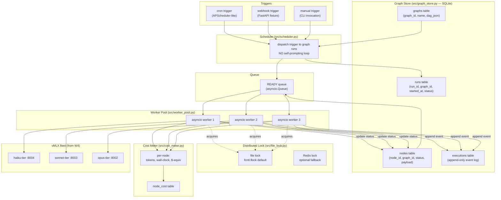

> **Status: SPEC DRAFT (2026-05-14).** This chapter is a planning skeleton produced from cross-repo convergence research (AutoGPT Platform executor/scheduler/cluster_lock/cost_tracking architecture + PraisonAI four Process modes + Trigger-based scheduling rebuke of classic-AutoGPT self-prompting loops). Phase Python blocks marked `TBD` are scoped but not yet written. Reviewer-pass before implementation. Spec source: research dossier on AutoGPT-classic→Platform postmortem + PraisonAI `process.py` (2026-05-14). Target: a 200–300 LOC minimal runtime, NOT a re-implementation of AutoGPT Platform.

## Exit Criteria

- [ ] `src/graph_store.py` — SQLite schema + persistence layer for agent graphs (nodes, edges, executions, runs); survives process restart mid-run
- [ ] `src/worker_pool.py` — asyncio worker pool consuming queued nodes; configurable concurrency; graceful drain on SIGTERM
- [ ] `src/file_lock.py` — file-based distributed lock primitive (advisory `fcntl.flock`); optional Redis backend behind same interface
- [ ] `src/cost_meter.py` — per-node token + wall-clock + $-equivalent observability; SQLite `node_cost` table; CSV export
- [ ] `src/scheduler.py` — trigger-based scheduler with cron + webhook + manual-trigger fixtures; explicit absence of an always-on autonomous self-prompt loop
- [ ] `tests/test_durability.py` — kill-mid-run + restart test; verify the graph completes from the last persisted node
- [ ] `RESULTS.md` four-topology bench: sequential / parallel / hierarchical / workflow on a fixed 5-node DAG; measure mean wall-clock, total tokens, peak concurrency, partial-failure recovery time

---

## 1. Why This Week Matters (~150 words — REQUIRED)

W4 built a ReAct loop that lives inside one Python process: kill the terminal, lose the run. Classic AutoGPT (2023) tried to fix this with an always-on autonomous self-prompting loop — and produced the canonical failure mode of the LLM-agent era: agents that get stuck, loop forever, burn API credits, and have no idea they failed. AutoGPT Platform (2024+) is the explicit postmortem: agents are **persisted DAGs**, not running processes; execution is **queue-fed asyncio workers**, not while-loops; concurrency is bounded by **distributed locks**, not luck; every node call is **cost-metered before it runs**; and triggers are **cron/webhook/event**, not self-prompts. **The senior-engineer signal is "my agent runtime survives a kill -9 mid-run and resumes from the last persisted node, and I can show you the SQLite row that proves it"** — anyone can build a one-shot ReAct script, but production agent systems require execution state separate from the LLM loop. This chapter builds the minimal version of that separation in ~250 LOC and benchmarks four process topologies on top of it.

---

## 2. Theory Primer (~1000 words — REQUIRED — SPEC)

### 2.1 The durable-runtime thesis

The bug at the heart of classic AutoGPT was not "the agent is dumb." It was an architectural category error: execution state was conflated with LLM state. When the prompt grew too large, when an API call timed out, when the user hit Ctrl-C, the entire run vaporized — because the run lived in Python locals, not in storage. Workflow-engine literature (Temporal, Cadence, Airflow, Argo) solved this problem a decade earlier in a different domain: **decouple the durable execution log from the worker process**. AutoGPT Platform is what you get when you port that lesson to LLM agents. PraisonAI's `process.py` is what you get when you take the *topology* half of that lesson — sequential / parallel / hierarchical / workflow — and make it the agent's first-class API.

### 2.2 Five concepts to own before writing code

1. **Graph-as-program** — the agent is not a script; it is a DAG persisted to SQLite. Nodes are units of work (LLM call, tool call, branch decision). Edges are data dependencies. Execution is "walk the DAG topologically, dispatch ready nodes to workers." The graph survives process death because the graph is a row, not a stack frame.
2. **Event sourcing for agent runs** — every state change is an append-only event in `executions` table. Reconstruct the run by replaying events. This is how durable workflow engines (Temporal, Cadence) achieve "kill -9 → resume" semantics; LLM agents inherit the pattern unchanged.
3. **Worker pool vs always-on loop** — classic AutoGPT had ONE process running `while True: agent.step()`. AutoGPT Platform has N asyncio workers consuming a queue of READY nodes. The difference is the same as the difference between a CGI script and a thread-pool web server: bounded concurrency, observable backpressure, no infinite-loop trap.
4. **Process topology as a first-class choice** — PraisonAI exposes four: *sequential* (one node at a time, ordered), *parallel* (all-fan-out, gather), *hierarchical* (manager-delegates-to-workers tree), *workflow* (explicit DAG with validation-feedback loops + retry counters). Choosing the wrong topology for the task is a bigger lift-or-tank decision than choosing the wrong model.
5. **Triggers, not self-prompts** — production agents are triggered by cron, webhook, or external event. They are not allowed to wake themselves up. This is the explicit rebuke of classic-AutoGPT's "give the agent infinite resources and a goal." Trigger-based scheduling is the architectural guardrail that makes agent systems debuggable.

### 2.3 Papers + references to cite (SPEC)

- Vogels (2007). *Eventually Consistent.* CACM. — durable distributed state foundations.
- Fowler, Martin. *Event Sourcing.* martinfowler.com — canonical pattern reference for append-only execution logs.
- Temporal.io engineering blog. *Why Workflow Engines.* — durable-execution thesis applied to general workflows.
- Cadence Workflow whitepaper (Uber, 2017). — production durable-workflow precedent.
- Significant-Gravitas AutoGPT v1 → AutoGPT Platform postmortem (commits + architecture-doc diff, 2024). — the canonical real-world failure-mode source.
- PraisonAI `src/praisonai-agents/praisonaiagents/process/process.py` (lines ~582, 1309, 1446) — four-mode process implementation reference.
- AutoGPT Platform `autogpt_platform/backend/backend/executor/{manager.py, scheduler.py, cluster_lock.py, cost_tracking.py, simulator.py}` — canonical reference impl.
- Workflow-Engines-vs-Agent-Loops distinction (Hamel Husain blog post candidate, or equivalent industry write-up).

### 2.4 Distinguish-from box

- **Durable runtime ≠ agent framework.** LangGraph, CrewAI, AutoGen are agent frameworks; they may or may not be durable. Durability is an orthogonal property layered under the framework. AutoGPT Platform is durable; classic AutoGPT used the same agent loop with no durability.
- **Durable workflow ≠ state machine.** A state machine encodes legal transitions between a fixed set of states; a durable workflow encodes an arbitrary DAG of work with persistence. State machines are a degenerate case (1 path through the DAG).
- **Process topology ≠ control flow.** Control flow is "if/else inside one node"; topology is "how nodes are connected." A sequential topology of nodes-with-branching is not the same as a workflow topology of branching-via-edges. The chapter teaches the distinction explicitly.
- **Trigger-based scheduling ≠ cascade.** A trigger fires once on an external event; a cascade chains sub-runs internally. Confusing the two leads to runaway-cost failure modes (BCJ Entry 5).
- **Distributed lock ≠ mutex.** Mutex is in-process; distributed lock is cross-process and survives process death. The minimal viable version is a file lock (`fcntl.flock`); Redis is the heavier option.

### 2.5 The 4-trigger × 6-topology design space (Russell 2026 synthesis)

Most chapter-zero discussions of multi-agent systems conflate two orthogonal axes. Russell's 2026 survey of Codex / Claude Code / OpenClaw / Hermes is the cleanest split published to date. The reader who internalizes the 2D grid below stops asking "is this multi-agent or single-agent?" and starts asking "which trigger × which topology?"

**Trigger axis — when does the system go from 1 agent to N?**

| Trigger | What fires the fan-out | Canonical system |
|---|---|---|
| **Explicit** | User says `Use parallel subagents` or `Spawn one agent per category` | Codex (refuses to auto-spawn from "deep investigation") |
| **Semantic** | Parent agent matches task content against subagent `description` field | Claude Code default subagents |
| **Routing** | Message entry point (Slack channel, Telegram peer, Discord thread, guild, role) binds to a specific agent | OpenClaw |
| **Queue** | Task lands in a board / cron / background-job table; dispatcher pulls workers by `assignee` | Hermes Kanban |

**Topology axis — once the system is multi-agent, how are the agents organized?**

| Topology | Shape | Best for | Worst for |
|---|---|---|---|
| **Single** | 1 agent | Small changes, strong-order tasks, fuzzy requirements | Long context that pollutes main agent |
| **Star fan-out / fan-in** | 1 parent → N workers; workers don't talk; reduce at parent | PR review (security / tests / perf in parallel), code-search exploration | Tasks where workers need to challenge each other |
| **Pipeline** | A → B → C → D, strictly ordered | Locate-bug → write-fix → add-test → review; ETL-shaped tasks | Anything where worker N's output doesn't feed worker N+1 |
| **Tree** | Orchestrator subagent spawns leaf workers; bounded depth | Large tasks needing sub-decomposition (Codex `max_depth=2`; OpenClaw default `maxSpawnDepth=1`) | Tasks that don't compose hierarchically — depth-N×breadth-N fan-out explodes ($) |
| **Mesh** | Teammates communicate peer-to-peer, share task list | Multi-hypothesis debug (login fails → frontend? token? session? cache? deploy?) | Anything where the worker count > 4-5 — coordination overhead dominates |
| **Gateway routing** | Different entry points → different agents (no fan-out per task) | Multi-channel personal assistant (Slack vs Telegram vs family group) | Single-channel coding tasks (where Codex/Claude Code already dominate) |
| **Durable board** | Tasks + comments + handoffs in persistent storage; workers attached to states | Cross-turn, cross-day, human-in-loop work (research reports, migrations, audits) | Sub-minute tasks (board overhead dominates wall-clock) |

The 2D grid is roughly 4 × 7 = 28 cells, but only ~10 are well-populated in production. The empty cells are the most useful — they say "this combination has no good system precedent, so think before you ship it."

### 2.6 The 7-step call chain — anatomy of a multi-agent task

Russell's article distills every multi-agent system into one canonical pipeline. If you can name what your system does at each of these steps, you can debug it. If you can't, you'll be guessing.

```text
input event
  → router / dispatcher          (decide: spawn? who?)
  → context builder              (decide: what does child know?)
  → worker profile selection     (decide: what role?)
  → execution sandbox            (decide: what can child do?)
  → state store                  (decide: where does state live?)
  → merge / reduce               (decide: who owns the output?)
  → final output OR next task    (decide: in-turn return or queue handoff?)
```

Each step is a *design decision*, not an implementation detail:
- **Router / dispatcher**: explicit user-driven (Codex), description-match (Claude Code), channel-binding (OpenClaw), or queue-pull (Hermes Kanban).
- **Context builder**: the *write-side* of the Delegation Contract Template (see [[Engineering Decision Patterns#Pattern 14 — Delegation Contract Template]]). What's in here determines whether the child can succeed or has to guess.
- **Worker profile selection**: read-only explorer vs implementation worker vs security reviewer. Role choice cascades into the next two steps.
- **Execution sandbox**: shell? network? write? spawn child? Hermes leaf restrictions are the canonical reference; OpenClaw's tool-policy isolation is the canonical pattern.
- **State store**: ephemeral (lives in the turn), session (lives in agent workspace), durable (lives in board / SQLite / postgres). Picking wrong here is the difference between "kill -9 → resume" and "kill -9 → start over."
- **Merge / reduce**: most demos skip this step. Most production systems fail here. Pre-declare who reduces, with what merge logic, before spawning the workers.
- **Final output or next task**: in-turn return is RPC-shaped; queue handoff is durable-board-shaped. Choosing wrong is the same category error as [[Bad-Case Journal#2026-05-19 — Cross-cutting — Multi-Agent Anti-Patterns (Russell 2026 synthesis)|BCJ Entry MA-5]] (wrong primitive for lifecycle).

### 2.7 The 8-question decision order — what to ask BEFORE picking a topology

Russell's most useful contribution is reframing topology choice as a *decision sequence*, not a menu pick. Run through these in order; the answer to question N constrains question N+1. Most engineers reach for "star fan-out" by reflex; the questions below catch the cases where that's wrong.

1. **Can a single agent do this?** Small changes, strong-order tasks, and fuzzy requirements are most stable with one agent. Multi-agent isn't free — it adds tokens, latency, coordination cost. Don't pay it until you have to.
2. **Will the main context get polluted?** Long logs, large searches, multi-file reads, and many failure stacks make the main agent dumber. Off-loading those to explorer subagents is a *context isolation* play, not a parallelism play — and that's reason enough to fan out.
3. **Can sub-tasks run independently?** Security review + test review + performance review = yes. Locate-bug → write-fix → add-test = no (that's a pipeline). Independence ≠ complexity. (See [[Bad-Case Journal#2026-05-19 — Cross-cutting — Multi-Agent Anti-Patterns (Russell 2026 synthesis)|BCJ Entry MA-1]] for the complexity-as-trigger anti-pattern.)
4. **Must the result return in *this* turn?** Yes → fork/join RPC (Codex subagents, Hermes `delegate_task`). No → background job. Need cross-day, cross-restart, or human-in-loop pauses → durable board (Hermes Kanban, AutoGPT Platform graph store). Picking wrong here is anti-pattern MA-5.
5. **Do workers need to challenge each other?** No → star fan-out is enough. Yes → mesh / team topology (Claude Code Agent Teams). Mesh costs ~3-5× the tokens of star — only pay that cost for genuinely multi-hypothesis problems.
6. **Will workers write to overlapping files?** Yes → write down ownership boundaries (file-path split or read-only/write split) BEFORE spawning. No ownership → don't fan out the writes. Anti-pattern MA-3.
7. **Are there multiple entry points with different identities / permissions?** Yes → Gateway routing (OpenClaw shape) is upstream of any per-task topology choice. The first question isn't "how do I fan out this task?" — it's "which agent does this message even belong to?"
8. **How does the system recover from failure?** Retry semantics? Block / unblock state? Handoff trace? Worker-level audit? These are durable-board concerns. If the answers are "no / no / no / no," the system isn't production-grade no matter how clever the topology.

`★ Insight ─────────────────────────────────────`
- **The 8 questions are the inverse of the 7 anti-patterns.** Q1 ↔ MA-1, Q3 ↔ MA-1, Q4 ↔ MA-5, Q5 ↔ MA-3/MA-4, Q6 ↔ MA-3, Q7 ↔ MA-6, Q8 ↔ MA-7. Running the questions in order proactively prevents the catalog of failures retroactively. The questions are the *write-side* discipline; the BCJ entries are the *read-side* forensic record.
- **Routing (Q7) goes BEFORE topology**, even though most multi-agent literature treats topology as the first decision. Russell's OpenClaw walkthrough is the case for this re-ordering: gateway-routed systems are not a special case of fan-out — they're an *orthogonal* design dimension, and ignoring it produces a system where the "first agent to see the message" determines the run, which is rarely what you want.
- **Question 2 (context pollution) is the most under-appreciated reason to spawn a subagent.** Most engineers think multi-agent = parallelism; the cleaner mental model is multi-agent = *context isolation*. A read-only explorer subagent that reads 50 files and returns a 200-token summary is doing context engineering, not parallel computation. The parallelism is a side effect.
`─────────────────────────────────────────────────`

---

## 3. System Architecture (REQUIRED — Mermaid)



**Reading the diagram.** A trigger (cron / webhook / manual) fires the Scheduler, which creates a `runs` row and seeds the READY queue with the graph's root nodes. Workers pull ready nodes, acquire the file lock (preventing two workers from claiming the same node), call the right vMLX endpoint, write a cost row, append an event, update node status, and enqueue dependent nodes whose preconditions are now satisfied. Process death anywhere in that loop is safe because the graph + executions tables hold ground truth; restart re-derives the READY queue from `nodes WHERE status='ready'`.

---

## 4. Lab Phases (REQUIRED — (SPEC — code lands when lab runs))

### Phase 1 — SQLite graph schema + persistence layer (~1 hour)

Goal: design the durable schema. Four tables: `graphs` (DAG definition), `nodes` (per-node state machine: pending / ready / running / done / failed), `executions` (append-only event log: node_id, event_type, timestamp, payload_json), `runs` (one row per trigger fire). Implement `src/graph_store.py` with `create_graph()`, `start_run()`, `claim_ready_node()`, `mark_done()`, `mark_failed()`, `replay_run()`. The schema is the single most important design decision in the chapter; everything else builds on it.

- **TBD code** — `src/graph_store.py` (schema + CRUD + replay).
- **TBD verification** — `tests/test_graph_store.py`: create graph, start run, mark nodes done, kill connection mid-run, reopen, verify state is intact.
- Pedagogical note: this is the event-sourcing pattern from durable-workflow literature. The reader should be able to articulate why we append events instead of mutating a single status column. (Hint: audit trail + replay + recovery debugging.)

### Phase 2 — Asyncio worker pool (~1 hour)

Goal: implement `src/worker_pool.py` with a configurable-N asyncio worker coroutine. Each worker pulls from the READY queue, dispatches to a node-type-specific handler (LLM call → vMLX endpoint; tool call → local function; branch → expression eval), writes cost + event rows, and enqueues unblocked downstream nodes. Graceful drain on SIGTERM: workers finish current node, do NOT pick up new work, the scheduler flushes pending events.

- **TBD code** — `src/worker_pool.py` (worker coroutine + supervisor + drain logic).
- **TBD verification** — `tests/test_worker_pool.py`: queue 10 nodes, observe N=3 workers run them with bounded concurrency; SIGTERM mid-flight, observe clean drain.
- Pedagogical note: contrast with classic AutoGPT's `while True: agent.step()`. The worker-pool model is the same shift that turned CGI into thread-pool web servers in the 2000s.

### Phase 3 — File-based distributed lock primitive (~45 min)

Goal: implement `src/file_lock.py` using `fcntl.flock` for advisory file locking. Single class `FileLock(path)` with `acquire(timeout)` / `release()` / context-manager interface. Worker uses lock to claim a node atomically (`SELECT … FOR UPDATE` would be the SQL equivalent; we use a sibling lock file because SQLite's row-level locking is coarse). Optional Redis backend behind the same interface, off by default. Lock release on process death is automatic (the kernel closes the fd).

- **TBD code** — `src/file_lock.py` (file lock + optional Redis backend).
- **TBD verification** — `tests/test_file_lock.py`: two processes race for the same lock; verify exactly one acquires, the loser blocks; kill the holder, verify the loser proceeds.
- Pedagogical note: AutoGPT Platform uses Redis for cluster-wide locks. For a local-first 200-LOC version, file locks are correct: same semantics, zero deps. Redis fallback is shown but elective.

### Phase 4 — Per-node cost meter + observability (~1 hour)

Goal: implement `src/cost_meter.py` with `meter(node_id)` context manager. On enter: record start wall-clock + tokens-in. On exit: record end wall-clock + tokens-out, compute $-equivalent using a constant rate-card dict, insert one `node_cost` row. Add a `cost_report(run_id)` function that aggregates per-run totals and emits CSV. The cost meter wraps every LLM call inside the worker; cost is recorded BEFORE the result is returned, so a process death after the call records cost but not result — a deliberate design choice to prevent silent cost leaks.

- **TBD code** — `src/cost_meter.py` (meter context + aggregator + CSV export).
- **TBD verification** — `tests/test_cost_meter.py`: run a 5-node graph, verify the CSV has 5 rows with non-zero token + wall-clock numbers; sum matches the run-level aggregate.
- Pedagogical note: this is the W4.5 routing decision's empirical anchor. Without per-node cost data, you cannot tell whether your router is winning.

### Phase 5 — Trigger-based scheduler + four-topology bench (~2 hours)

Goal: implement `src/scheduler.py` with three trigger types: `register_cron(graph_id, cron_expr)`, `register_webhook(graph_id, path)` (FastAPI fixture), `trigger_manually(graph_id, payload)`. Then build a fixed 5-node test graph and execute it under four PraisonAI-style topologies: *sequential* (one ready node at a time), *parallel* (all root nodes simultaneously), *hierarchical* (manager-node dispatches children, gathers), *workflow* (DAG with one validation-feedback edge + retry counter ≤ 3). Measure: mean wall-clock, total tokens, peak concurrency, partial-failure recovery time (kill -9 a worker mid-run; restart; measure time to completion).

- **TBD code** — `src/scheduler.py`, `tests/test_four_topology_bench.py`, `examples/example_graph.py`.
- **TBD result table** — populate `RESULTS.md` with the 4-topology comparison.
- Pedagogical note: the topology choice is empirical, not theoretical. *Parallel* wins on independent fan-out; *workflow* wins on validation-heavy pipelines; *hierarchical* wins when subgraphs are themselves agents; *sequential* wins on simplicity and ordering guarantees. Reader leaves with the heuristic, not just the code.

---

## 5. (deprecated)

Walkthroughs live inline per the per-Python-block bundle in §4.

---

## 6. Bad-Case Journal (3–5 entries — (SPEC — to be filled after lab run))

Pre-flight entries scoped from convergent failure modes in AutoGPT Platform issue tracker + PraisonAI process-mode bug reports + durable-workflow literature; final entries populated post-implementation.

**Entry 1 (planned) — Cluster lock contention serializes the worker pool to 1-effective-worker.**
*Scoped from:* AutoGPT Platform `cluster_lock.py` deadlock-on-redis-reconnect bug. The lock is held too coarsely; every node serializes through it. Symptom: N=10 workers, wall-clock matches N=1.

**Entry 2 (planned) — Scheduler drift: cron fires twice because two scheduler processes are running.**
*Scoped from:* APScheduler / classic-AutoGPT scheduler duplication failure mode. Without a leader-election or single-scheduler invariant, every restart can leave a zombie scheduler running.

**Entry 3 (planned) — Graph state corruption on partial failure: a node is marked `done` but its event row was not appended.**
*Scoped from:* event-sourcing literature (write-ordering bug). The fix is to append the event in the same transaction as the status update; teaching moment about durable-runtime atomicity.

**Entry 4 (planned) — Cost-meter race: two workers double-count cost for the same retried node.**
*Scoped from:* AutoGPT Platform `cost_tracking.py` idempotency-key absence (early commits). Without an idempotency key on the cost row, retried nodes get billed twice.

**Entry 5 (planned) — Retry storm: validation-feedback loop has no exponential backoff, the retry counter resets on restart.**
*Scoped from:* PraisonAI workflow-mode retry counter design (`process.py` ~line 1446). Restart-resets-counter is the canonical infinite-cost failure mode that classic AutoGPT made famous.

---

## 7. Interview Soundbites (2–3 entries — (SPEC — to be filled after lab run))

Soundbites are written post-measurement so the numbers cited are real. Scoped topics:

- (a) "What's wrong with classic AutoGPT's autonomous loop?" — anchor on the architecture diff: graph store + worker pool + lock + cost meter + trigger-based scheduler are the five things classic AutoGPT lacked.
- (b) "How does your agent runtime survive a process restart?" — anchor on the Phase 1 schema + the kill-mid-run test in Phase 2.
- (c) "When would you pick parallel vs hierarchical topology?" — anchor on the four-topology bench numbers from Phase 5.

---

## 8. References (SPEC)

Same set as §2.3 once expanded. Format per vault conventions:
- **Author et al. (Year).** *Title.* Venue. arXiv / URL. One-line description.

Must include at least one production blog post or canonical implementation repo. Candidates:
- AutoGPT Platform repo `autogpt_platform/backend/backend/executor/` (canonical durable-runtime impl)
- PraisonAI `src/praisonai-agents/praisonaiagents/process/process.py` (canonical four-topology impl)
- Temporal.io engineering blog (durable-workflow thesis)
- **`rohitg00/agentmemory`** — alternative durable-runtime reference built on **iii-engine** (3-primitive Worker/Function/Trigger model + WebSocket daemon on `:49134` + file-based SQLite via StateModule). Same "execution state separate from LLM loop" thesis but lighter-weight than Temporal.io (single-host, embedded SQLite, no separate workflow cluster). Pattern: memory ops registered as functions; HTTP endpoints registered as triggers; state daemon as a separate process. Production reference for the lightweight end of the durable-runtime spectrum.
- Cadence Workflow whitepaper (Uber)
- Significant-Gravitas AutoGPT classic→Platform architecture-doc diff (the postmortem)
- Martin Fowler — *Event Sourcing* article

---

## 9. Cross-References

- **Builds on:** [[Week 4 - ReAct From Scratch]] (vMLX fleet, ReAct loop — the thing we are now putting under a durable runtime); [[Week 4.5 - Model Routing and Effort Tiering]] (per-call routing; this chapter's cost meter is what makes routing wins measurable).
- **Distinguish from:** state machine vs agent loop (a state machine is a degenerate workflow with one path; an agent loop is the LLM control flow inside a node, not the runtime around it); durable workflow vs cascade (durable workflow persists a DAG; cascade chains attempts at the same node — different abstractions); agent framework vs runtime (LangGraph / CrewAI are frameworks; durability is an orthogonal property).
- **Connects to:** [[Week 11.5 - Agent Security]] (trigger surface is the auth boundary — webhook trigger is an unauthenticated entry point until you secure it; cron triggers run as the system identity); [[Week 12 - Capstone]] (the capstone agent runs on this runtime, not a one-shot script).
- **Foreshadows:** production deployment topology (multi-host worker pool, Redis-backed lock, cron-leader election); cost-attribution dashboards; multi-tenant agent platforms.

- **Cited by:** chapters that reference this chapter as a prerequisite or build-on; reverse links per Pattern 21 (Bidirectional Cross-Reference Invariant):
  - **W11.5**: Agent Security — the PreToolUse hook integration wires security guards into W4.6's durable runtime tool dispatcher
  - **W6.5**: Hermes — Hermes's two-primitive split (`delegate_task` + Kanban) is one canonical implementation of W4.6's trigger × topology design space

---

## Resolved design decisions (locked 2026-05-14)

1. **Scope:** ✅ 5 phases / 6 hours / 200–300 LOC hard cap. Redis + multi-host deferred to W11.5 / W12.
2. **Lock primitive:** ✅ `fcntl.flock` (POSIX). One-line note re: macOS-target assumption + SQLite `BEGIN EXCLUSIVE` as cross-platform alternative.
3. **Topology coverage:** ✅ implement all 4 PraisonAI modes (each ~30–50 LOC once runtime exists); benchmark is the empirical anchor.
4. **Scheduler scope:** ✅ cron + webhook + manual trigger. Event triggers (file-watcher, MQ) deferred to W11.5 / W12.
5. **Cost meter:** ✅ hardcode public per-token rates (Claude Sonnet 4.6 / Haiku 4.5 / Opus 4.5) as cloud-equivalent baseline. Readers override for their stack.

---

*Spec drafted from cross-repo convergence research (AutoGPT classic→Platform postmortem + PraisonAI `process.py` four-mode topology + Trigger-based scheduling rebuke of self-prompting loops). Convergence finding: AutoGPT Platform converges on graph-store + worker-pool + cluster-lock + cost-tracking + trigger-scheduler as the five load-bearing primitives a durable agent runtime requires; PraisonAI independently converges on four process topologies as the right first-class API on top of such a runtime. This chapter teaches the minimal version of both — explicitly NOT a re-implementation of AutoGPT Platform, but the 200–300 LOC kernel that demonstrates each primitive.*
