> **Status: IMPLEMENTED + MEASURED (2026-06-16).** The lab is built and run. `lab-04-6-durable-runtime/src/*.py` is 1024 LOC total (607 new across the five durable-core modules + 417 in the two given modules); the four-topology bench ran live against oMLX on M5 Pro 48GB; `tests/test_durability.py` passes (2 passed in 1.84s) including a real SIGKILL-mid-run recovery. Every Phase code block below is pasted verbatim from the lab files, and every number in §4/§5/§6 traces to `RESULTS.md` or a test assertion. Built from cross-repo convergence research (AutoGPT Platform executor/scheduler/cluster_lock/cost_tracking architecture + PraisonAI four Process modes + Trigger-based scheduling rebuke of classic-AutoGPT self-prompting loops). The runtime is the intended ~250-LOC durable kernel — NOT a re-implementation of AutoGPT Platform.

## Exit Criteria

- [x] `src/graph_store.py` — SQLite schema + persistence layer for agent graphs (nodes, edges, executions, runs); survives process restart mid-run
- [x] `src/worker_pool.py` — asyncio worker pool consuming queued nodes; configurable concurrency; graceful drain on SIGTERM
- [x] `src/file_lock.py` — file-based distributed lock primitive (advisory `fcntl.flock`); optional Redis backend behind same interface
- [x] `src/cost_meter.py` — per-node token + wall-clock + $-equivalent observability; SQLite `node_cost` table; CSV export
- [x] `src/scheduler.py` — trigger-based scheduler with cron + webhook + manual-trigger fixtures; explicit absence of an always-on autonomous self-prompt loop
- [x] `tests/test_durability.py` — kill-mid-run + restart test; verify the graph completes from the last persisted node
- [x] `RESULTS.md` four-topology bench: sequential / parallel / hierarchical / workflow on a fixed 5-node DAG; measure mean wall-clock, total tokens, peak concurrency, partial-failure recovery time

---

## 1. Why This Week Matters 

W4 built a ReAct loop that lives inside one Python process: kill the terminal, lose the run. Classic AutoGPT (2023) tried to fix this with an always-on autonomous self-prompting loop — and produced the canonical failure mode of the LLM-agent era: agents that get stuck, loop forever, burn API credits, and have no idea they failed. AutoGPT Platform (2024+) is the explicit postmortem: agents are **persisted DAGs**, not running processes; execution is **queue-fed asyncio workers**, not while-loops; concurrency is bounded by **distributed locks**, not luck; every node call is **cost-metered before it runs**; and triggers are **cron/webhook/event**, not self-prompts. **The senior-engineer signal is "my agent runtime survives a kill -9 mid-run and resumes from the last persisted node, and I can show you the SQLite row that proves it"** — anyone can build a one-shot ReAct script, but production agent systems require execution state separate from the LLM loop. This chapter builds the minimal version of that separation in ~250 LOC and benchmarks four process topologies on top of it.

---

## 2. Theory Primer 

### 2.1 The durable-runtime thesis

The bug at the heart of classic AutoGPT was not "the agent is dumb." It was an architectural category error: execution state was conflated with LLM state. When the prompt grew too large, when an API call timed out, when the user hit Ctrl-C, the entire run vaporized — because the run lived in Python locals, not in storage. Workflow-engine literature (Temporal, Cadence, Airflow, Argo) solved this problem a decade earlier in a different domain: **decouple the durable execution log from the worker process**. AutoGPT Platform is what you get when you port that lesson to LLM agents. PraisonAI's `process.py` is what you get when you take the *topology* half of that lesson — sequential / parallel / hierarchical / workflow — and make it the agent's first-class API.

### 2.2 Five concepts to own before writing code

1. **Graph-as-program** — the agent is not a script; it is a DAG persisted to SQLite. Nodes are units of work (LLM call, tool call, branch decision). Edges are data dependencies. Execution is "walk the DAG topologically, dispatch ready nodes to workers." The graph survives process death because the graph is a row, not a stack frame.
2. **Event sourcing for agent runs** — every state change is an append-only event in `executions` table. Reconstruct the run by replaying events. This is how durable workflow engines (Temporal, Cadence) achieve "kill -9 → resume" semantics; LLM agents inherit the pattern unchanged.
3. **Worker pool vs always-on loop** — classic AutoGPT had ONE process running `while True: agent.step()`. AutoGPT Platform has N asyncio workers consuming a queue of READY nodes. The difference is the same as the difference between a CGI script and a thread-pool web server: bounded concurrency, observable backpressure, no infinite-loop trap.
4. **Process topology as a first-class choice** — PraisonAI exposes four: *sequential* (one node at a time, ordered), *parallel* (all-fan-out, gather), *hierarchical* (manager-delegates-to-workers tree), *workflow* (explicit DAG with validation-feedback loops + retry counters). Choosing the wrong topology for the task is a bigger lift-or-tank decision than choosing the wrong model.
5. **Triggers, not self-prompts** — production agents are triggered by cron, webhook, or external event. They are not allowed to wake themselves up. This is the explicit rebuke of classic-AutoGPT's "give the agent infinite resources and a goal." Trigger-based scheduling is the architectural guardrail that makes agent systems debuggable.

### 2.3 Papers + references — pointer list

In-chapter pointer list. Full formal citations live in §7 References. This list is the reader's at-a-glance "where do the ideas in §2 come from?" map.

- **Vogels (2007).** *Eventually Consistent.* CACM. Foundational paper on durable distributed state; the read-side semantics LLM-agent durable runtimes inherit.
- **Fowler, Martin.** *Event Sourcing.* martinfowler.com. Canonical pattern reference for append-only execution logs — the architectural primitive every durable workflow engine builds on.
- **Temporal.io engineering.** *Why Workflow Engines.* engineering blog. Articulates the durable-execution thesis (decouple log from workers) in the form that applies cleanly to LLM agent runtimes.
- **Uber Engineering (2017).** *Cadence: a distributed, scalable, durable, and highly available orchestration engine.* The production durable-workflow precedent that Temporal forks from — same architecture, different operator.
- **Significant-Gravitas (2024).** *AutoGPT v1 → AutoGPT Platform postmortem.* commits + architecture-doc diff. The canonical real-world failure-mode source — agent runtime that lacked durability + bounded concurrency + cost-metering, the failure surface this chapter teaches against.
- **PraisonAI** — `src/praisonai-agents/praisonaiagents/process/process.py` (key lines: ~582 sequential, ~1309 parallel, ~1446 hierarchical / workflow). Four-mode process implementation; first-class topology choice in framework form.
- **AutoGPT Platform** — `autogpt_platform/backend/backend/executor/{manager.py, scheduler.py, cluster_lock.py, cost_tracking.py, simulator.py}`. The canonical reference implementation of the 5-component runtime (graph store + worker pool + lock + cost meter + trigger-based scheduler).
- **Abilityai/trinity (2025-2026).** *Sovereign infrastructure for autonomous AI agents* (Apache-2.0, Python). The **third independent convergence** on this chapter's durable-runtime primitives — and the one that ships as a self-hostable product, so it doubles as the "what does production look like?" reference. Trinity reached the same five primitives as AutoGPT Platform + PraisonAI from a different starting point (Claude-Code-as-employee, not a classic-AutoGPT postmortem): a **SQLite-backed async backlog that survives restart** (= graph store + READY queue), a **cron scheduler service + Redis distributed locks** (= scheduler + distributed lock), **execution retry + timeouts + `max_turns` runaway prevention** (= persistent retry counter + cost ceiling), and **hierarchical-delegation + parallel orchestrator-worker** topologies. Its channel-adapter layer (Slack per-channel agent binding, Telegram, WhatsApp) is a production instance of the **Gateway-routing** cell in §2.5 — different entry points bind to different agents *before* any per-task topology choice. Heavier than this lab by design (Docker-per-agent + Vue UI + Redis); the value is as a production-shape reference and a convergence data point, not a fork base.
- **kunchenguid/gnhf** — `src/core/orchestrator.ts` + `git.ts` + `interrupt-state.ts` + `exit-summary.ts`. The lightest-weight end of the durable-runtime spectrum: single-host, single-binary, per-iteration git commit as the durability primitive (no separate workflow store; the repo IS the store). Rollback-on-failure + exponential backoff + sticky-`tokensEstimated` honesty flag + graceful-interrupt state machine. The 33-LOC interrupt-state primitive and the token-accounting sticky-flag pattern are ported to `agent-prep/shared/agent_loop_tools/` for cross-lab reuse.
- **Husain, Hamel.** *Workflow Engines vs Agent Loops.* candidate blog post or equivalent industry write-up. Names the distinction this chapter operationalizes.
- **LangGraph (LangChain, 2024-2026).** Stateful agent graphs as a thin layer on top of LangChain primitives. Useful as the framework-level COMPARISON point: LangGraph state machines persist agent state across nodes via in-memory checkpoints + optional Postgres/SQLite persistence; this chapter's durable runtime persists across PROCESS restarts via the execution log. LangGraph state machines are durable-IN-PROCESS; this chapter's runtime is durable-ACROSS-PROCESS. Different scopes; LangGraph is the right tool when in-process is enough (most single-agent workloads); this chapter's runtime is the right tool when overnight / multi-host / restart-resilient is required.

### 2.4 Distinguish-from box

- **Durable runtime ≠ agent framework.** LangGraph, CrewAI, AutoGen are agent frameworks; they may or may not be durable. Durability is an orthogonal property layered under the framework. AutoGPT Platform is durable; classic AutoGPT used the same agent loop with no durability.
- **Durable workflow ≠ state machine.** A state machine encodes legal transitions between a fixed set of states; a durable workflow encodes an arbitrary DAG of work with persistence. State machines are a degenerate case (1 path through the DAG).
- **Process topology ≠ control flow.** Control flow is "if/else inside one node"; topology is "how nodes are connected." A sequential topology of nodes-with-branching is not the same as a workflow topology of branching-via-edges. The chapter teaches the distinction explicitly.
- **Trigger-based scheduling ≠ cascade.** A trigger fires once on an external event; a cascade chains sub-runs internally. Confusing the two leads to runaway-cost failure modes (BCJ Entry 5).
- **Distributed lock ≠ mutex.** Mutex is in-process; distributed lock is cross-process and survives process death. The minimal viable version is a file lock (`fcntl.flock`); Redis is the heavier option.

### 2.5 The 4-trigger × 6-topology design space (Russell 2026 synthesis)

Most chapter-zero discussions of multi-agent systems conflate two orthogonal axes. Russell's 2026 survey of Codex / Claude Code / OpenClaw / Hermes is the cleanest split published to date. The reader who internalizes the 2D grid below stops asking "is this multi-agent or single-agent?" and starts asking "which trigger × which topology?"

**Trigger axis — when does the system go from 1 agent to N?**

| Trigger      | What fires the fan-out                                                                                    | Canonical system                                        |
| ------------ | --------------------------------------------------------------------------------------------------------- | ------------------------------------------------------- |
| **Explicit** | User says `Use parallel subagents` or `Spawn one agent per category`                                      | Codex (refuses to auto-spawn from "deep investigation") |
| **Semantic** | Parent agent matches task content against subagent `description` field                                    | Claude Code default subagents                           |
| **Routing**  | Message entry point (Slack channel, Telegram peer, Discord thread, guild, role) binds to a specific agent | OpenClaw                                                |
| **Queue**    | Task lands in a board / cron / background-job table; dispatcher pulls workers by `assignee`               | Hermes Kanban                                           |

**Topology axis — once the system is multi-agent, how are the agents organized?**

| Topology                  | Shape                                                                         | Best for                                                                                        | Worst for                                                                        |
| ------------------------- | ----------------------------------------------------------------------------- | ----------------------------------------------------------------------------------------------- | -------------------------------------------------------------------------------- |
| **Single**                | 1 agent                                                                       | Small changes, strong-order tasks, fuzzy requirements                                           | Long context that pollutes main agent                                            |
| **Star fan-out / fan-in** | 1 parent → N workers; workers don't talk; reduce at parent                    | PR review (security / tests / perf in parallel), code-search exploration                        | Tasks where workers need to challenge each other                                 |
| **Pipeline**              | A → B → C → D, strictly ordered                                               | Locate-bug → write-fix → add-test → review; ETL-shaped tasks                                    | Anything where worker N's output doesn't feed worker N+1                         |
| **Tree**                  | Orchestrator subagent spawns leaf workers; bounded depth                      | Large tasks needing sub-decomposition (Codex `max_depth=2`; OpenClaw default `maxSpawnDepth=1`) | Tasks that don't compose hierarchically — depth-N×breadth-N fan-out explodes ($) |
| **Mesh**                  | Teammates communicate peer-to-peer, share task list                           | Multi-hypothesis debug (login fails → frontend? token? session? cache? deploy?)                 | Anything where the worker count > 4-5 — coordination overhead dominates          |
| **Gateway routing**       | Different entry points → different agents (no fan-out per task)               | Multi-channel personal assistant (Slack vs Telegram vs family group)                            | Single-channel coding tasks (where Codex/Claude Code already dominate)           |
| **Durable board**         | Tasks + comments + handoffs in persistent storage; workers attached to states | Cross-turn, cross-day, human-in-loop work (research reports, migrations, audits)                | Sub-minute tasks (board overhead dominates wall-clock)                           |

The 2D grid is roughly 4 × 7 = 28 cells, but only ~10 are well-populated in production. The empty cells are the most useful — they say "this combination has no good system precedent, so think before you ship it."

### 2.6 The 7-step call chain — anatomy of a multi-agent task

Russell's article distills every multi-agent system into one canonical pipeline. If you can name what your system does at each of these steps, you can debug it. If you can't, you'll be guessing.

```text
input event
  → router / dispatcher          (decide: spawn? who?)
  → context builder              (decide: what does child know?)
  → worker profile selection     (decide: what role?)
  → execution sandbox            (decide: what can child do?)
  → state store                  (decide: where does state live?)
  → merge / reduce               (decide: who owns the output?)
  → final output OR next task    (decide: in-turn return or queue handoff?)
```

Each step is a *design decision*, not an implementation detail:
- **Router / dispatcher**: explicit user-driven (Codex), description-match (Claude Code), channel-binding (OpenClaw), or queue-pull (Hermes Kanban).
- **Context builder**: the *write-side* of the Delegation Contract Template (see [[Engineering Decision Patterns#Pattern 14 — Delegation Contract Template (brief subagents like new hires, not like teammates)|Engineering Decision Patterns > Pattern 14 — Delegation Contract Template]]). What's in here determines whether the child can succeed or has to guess.
- **Worker profile selection**: read-only explorer vs implementation worker vs security reviewer. Role choice cascades into the next two steps.
- **Execution sandbox**: shell? network? write? spawn child? Hermes leaf restrictions are the canonical reference; OpenClaw's tool-policy isolation is the canonical pattern.
- **State store**: ephemeral (lives in the turn), session (lives in agent workspace), durable (lives in board / SQLite / postgres). Picking wrong here is the difference between "kill -9 → resume" and "kill -9 → start over."
- **Merge / reduce**: most demos skip this step. Most production systems fail here. Pre-declare who reduces, with what merge logic, before spawning the workers.
- **Final output or next task**: in-turn return is RPC-shaped; queue handoff is durable-board-shaped. Choosing wrong is the same category error as [[Bad-Case Journal#2026-05-19 — Cross-cutting — Multi-Agent Anti-Patterns (Russell 2026 synthesis)|BCJ Entry MA-5]] (wrong primitive for lifecycle).

**The same chain, in this lab's five scripts.** The full end-to-end orchestration — the driver entrypoint, both execution phases, the inner cross-script call graph (with per-edge call sites + `file:line`), the DB seam, and the production worker-daemon variant — is drawn as **one diagram** in the end-to-end demo section below (`examples/example_graph.py`). Rather than duplicate it here, this primer stays conceptual; see that single diagram for how `scheduler.py` → `graph_store.py` → `worker_pool.py` → `handlers.py` → `shared/llm.py` actually wire together.

### 2.7 The 8-question decision order — what to ask BEFORE picking a topology

Russell's most useful contribution is reframing topology choice as a *decision sequence*, not a menu pick. Run through these in order; the answer to question N constrains question N+1. Most engineers reach for "star fan-out" by reflex; the questions below catch the cases where that's wrong.

1. **Can a single agent do this?** Small changes, strong-order tasks, and fuzzy requirements are most stable with one agent. Multi-agent isn't free — it adds tokens, latency, coordination cost. Don't pay it until you have to.
2. **Will the main context get polluted?** Long logs, large searches, multi-file reads, and many failure stacks make the main agent dumber. Off-loading those to explorer subagents is a *context isolation* play, not a parallelism play — and that's reason enough to fan out.
3. **Can sub-tasks run independently?** Security review + test review + performance review = yes. Locate-bug → write-fix → add-test = no (that's a pipeline). Independence ≠ complexity. (See [[Bad-Case Journal#2026-05-19 — Cross-cutting — Multi-Agent Anti-Patterns (Russell 2026 synthesis)|BCJ Entry MA-1]] for the complexity-as-trigger anti-pattern.)
4. **Must the result return in *this* turn?** Yes → fork/join RPC (Codex subagents, Hermes `delegate_task`). No → background job. Need cross-day, cross-restart, or human-in-loop pauses → durable board (Hermes Kanban, AutoGPT Platform graph store). Picking wrong here is anti-pattern MA-5.
5. **Do workers need to challenge each other?** No → star fan-out is enough. Yes → mesh / team topology (Claude Code Agent Teams). Mesh costs ~3-5× the tokens of star — only pay that cost for genuinely multi-hypothesis problems.
6. **Will workers write to overlapping files?** Yes → write down ownership boundaries (file-path split or read-only/write split) BEFORE spawning. No ownership → don't fan out the writes. Anti-pattern MA-3.
7. **Are there multiple entry points with different identities / permissions?** Yes → Gateway routing (OpenClaw shape) is upstream of any per-task topology choice. The first question isn't "how do I fan out this task?" — it's "which agent does this message even belong to?"
8. **How does the system recover from failure?** Retry semantics? Block / unblock state? Handoff trace? Worker-level audit? These are durable-board concerns. If the answers are "no / no / no / no," the system isn't production-grade no matter how clever the topology.

`★ Insight ─────────────────────────────────────`
- **The 8 questions are the inverse of the 7 anti-patterns.** Q1 ↔ MA-1, Q3 ↔ MA-1, Q4 ↔ MA-5, Q5 ↔ MA-3/MA-4, Q6 ↔ MA-3, Q7 ↔ MA-6, Q8 ↔ MA-7. Running the questions in order proactively prevents the catalog of failures retroactively. The questions are the *write-side* discipline; the BCJ entries are the *read-side* forensic record.
- **Routing (Q7) goes BEFORE topology**, even though most multi-agent literature treats topology as the first decision. Russell's OpenClaw walkthrough is the case for this re-ordering: gateway-routed systems are not a special case of fan-out — they're an *orthogonal* design dimension, and ignoring it produces a system where the "first agent to see the message" determines the run, which is rarely what you want.
- **Question 2 (context pollution) is the most under-appreciated reason to spawn a subagent.** Most engineers think multi-agent = parallelism; the cleaner mental model is multi-agent = *context isolation*. A read-only explorer subagent that reads 50 files and returns a 200-token summary is doing context engineering, not parallel computation. The parallelism is a side effect.
`─────────────────────────────────────────────────`

---

## 3. System Architecture 

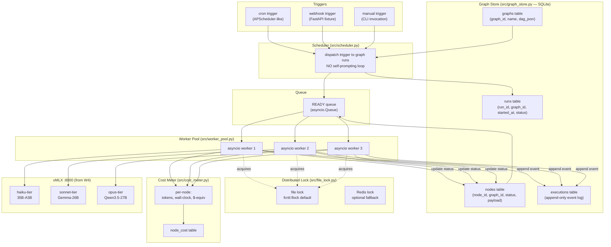

**Reading the diagram.** A trigger (cron / webhook / manual) fires the Scheduler, which creates a `runs` row and seeds the READY queue with the graph's root nodes. Workers pull ready nodes, acquire the file lock (preventing two workers from claiming the same node), call the right oMLX model (one `:8000` endpoint, model-routed by the `model:` field), write a cost row, append an event, update node status, and enqueue dependent nodes whose preconditions are now satisfied. Process death anywhere in that loop is safe because the graph + executions tables hold ground truth; restart re-derives the READY queue from `nodes WHERE status='ready'`.

---

## 4. Lab Phases (IMPLEMENTED 2026-06-16)

Each phase below is one per-Python-block bundle: architecture diagram → verbatim code → walkthrough → measured result → insight. **This is a complete runbook: every lab source file appears below IN FULL, byte-for-byte from `lab-04-6-durable-runtime/` — no elisions.** Copy each block into the matching path under `lab-04-6-durable-runtime/`, run the commands in *Setup & Reproduce* just below, and you reproduce the whole lab end-to-end (the vault enforces chapter↔lab sync).

**Setup & Reproduce.** The lab is 10 files under `lab-04-6-durable-runtime/`. The interpreter is the local venv (Python 3.14, with `openai` 2.31 already installed); the only third-party runtime dep is `openai>=2.0` (and `pytest>=8.0` for the test). The bench + demo hit live oMLX on `:8000`; the durability test is fully offline (deterministic tool nodes — no model).

```bash
# ── file tree (copy each chapter block to the matching path) ──────────────────
# lab-04-6-durable-runtime/
# ├── pyproject.toml                  # deps: openai>=2.0 ; dev: pytest>=8.0
# ├── README.md
# ├── RESULTS.md                      # written by the bench
# ├── bench_four_topology.py          # Phase 5 — headline bench (writes RESULTS.md)
# ├── src/
# │   ├── graph_store.py              # Phase 1 — SQLite durable state machine
# │   ├── worker_pool.py              # Phase 2 — N async workers
# │   ├── handlers.py                 # Phase 2 — tool/llm node handlers
# │   ├── file_lock.py                # Phase 3 — fcntl.flock cross-process lock
# │   ├── cost_meter.py               # Phase 4 — retry-safe cost ledger
# │   ├── topologies.py               # Phase 5 — four 5-node DAG shapes
# │   └── scheduler.py                # Phase 5 — external triggers (no self-loop)
# ├── tests/
# │   └── test_durability.py          # kill-mid-run recovery + FileLock mutex
# └── examples/
#     └── example_graph.py            # end-to-end runnable demo

PY=/Users/yuxinliu/.openharness-venv/bin/python3   # Python 3.14, has openai 2.31

# Install deps (the venv above already has openai; this is the from-scratch path):
$PY -m pip install 'openai>=2.0' 'pytest>=8.0'
# (or, with uv per the lab's pyproject.toml:  uv sync --extra dev)

cd lab-04-6-durable-runtime

# 1. end-to-end demo — one topology via scheduler + worker pool, LIVE oMLX (:8000 must be up)
$PY examples/example_graph.py

# 2. durability test — OFFLINE, deterministic (the kill-and-recover proof; no model needed)
$PY -m pytest tests/test_durability.py -v        # -> 2 passed in ~1.84s

# 3. the headline bench — four-topology throughput + SIGKILL recovery (hits oMLX :8000)
$PY bench_four_topology.py                        # writes RESULTS.md
```

> oMLX must be serving `Qwen2.5-Coder-7B-Instruct-MLX-4bit` on `http://localhost:8000/v1` for the demo (step 1) and the bench (step 3) — those run live LLM nodes. The durability test (step 2) uses only deterministic tool nodes (sleeps), so it needs no model and runs anywhere.

### Phase 1 — SQLite graph schema + persistence layer (~1 hour)

Goal: design the durable schema. Four tables: `graphs` (DAG template), `runs` (one row per trigger fire), `nodes` (per-node state machine: pending / ready / running / done / failed), `executions` (append-only event log). Implement `src/graph_store.py` with `create_graph()`, `start_run()`, `claim_ready_node()`, `mark_done()`, `mark_failed()`, `recover_run()`, `replay_run()`. The schema is the single most important design decision in the chapter; everything else builds on it.

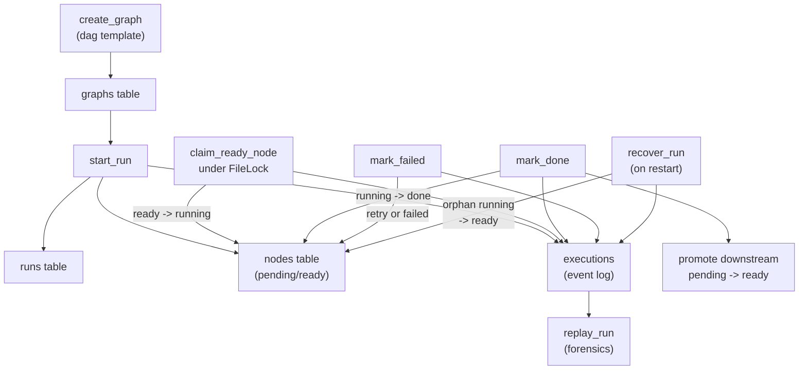

**Code:** (`src/graph_store.py` — the ENTIRE file: docstring, lifecycle states, `Node`, schema, append-only log, authoring, the atomic claim, completion-with-promotion, `mark_failed`, recover, and the read/replay side; verbatim)

```python
"""graph_store.py — SQLite persistence for durable agent graphs.

The single most important module in the lab: it holds the *execution state*
that is deliberately separated from the LLM loop. A process can die anywhere
(kill -9, OOM, Ctrl-C, panic) and the run survives, because the run lives in
four SQLite tables — not in Python locals:

    graphs      — DAG *templates* (node defs + edges), authored once
    runs        — one row per trigger fire (an *instance* of a graph)
    nodes       — per-(run, node) state machine: pending→ready→running→done/failed
    executions  — append-only event log (event-sourcing); the audit + replay trail

Durability invariant (BCJ Entry 3): every status mutation and its event row are
written in the SAME transaction. There is never a node marked `done` whose
`done` event failed to append — the two commit together or not at all.

Resume protocol: on restart, `recover_run` resets any node left `running`
(claimed by a now-dead worker) back to `ready`. The READY frontier is then
re-derived from the table — `nodes WHERE status='ready'` — never from memory.
"""
from __future__ import annotations

import json
import sqlite3
import time
import uuid
from dataclasses import dataclass
from typing import Any

from file_lock import FileLock

# Node lifecycle states. The state machine is intentionally tiny — four live
# states plus two terminal — because every extra state is an extra recovery case.
PENDING = "pending"   # waiting on upstream deps
READY = "ready"       # all deps done; eligible to be claimed by a worker
RUNNING = "running"   # claimed by a worker; the only state needing recovery
DONE = "done"         # terminal success
FAILED = "failed"     # terminal failure (attempts exhausted)


@dataclass(frozen=True)
class Node:
    """A claimed unit of work handed to a worker. Immutable snapshot — the
    worker reads it, runs the handler, then calls back with a result."""

    run_id: str
    name: str
    node_type: str          # "llm" | "tool" | "branch"
    payload: dict[str, Any]
    attempts: int


class GraphStore:
    """Durable graph persistence over a single SQLite file.

    Thread-safety by construction: every method opens its own short-lived
    connection. SQLite in WAL mode supports concurrent readers + one writer,
    and the cross-process *claim* is serialized by a sibling `FileLock`, not by
    a shared in-process connection (which would not survive process death)."""

    def __init__(self, db_path: str, lock_path: str | None = None) -> None:
        self.db_path = db_path
        self.lock = FileLock(lock_path or f"{db_path}.claim.lock")
        self._init_schema()

    # ── connection + schema ────────────────────────────────────────────────
    def _connect(self) -> sqlite3.Connection:
        conn = sqlite3.connect(self.db_path, timeout=10.0)
        conn.row_factory = sqlite3.Row
        conn.execute("PRAGMA journal_mode=WAL")      # concurrent reads + durable writes
        conn.execute("PRAGMA foreign_keys=ON")
        conn.execute("PRAGMA synchronous=NORMAL")    # WAL-safe; survives app crash
        return conn

    def _init_schema(self) -> None:
        with self._connect() as conn:
            conn.executescript(
                """
                CREATE TABLE IF NOT EXISTS graphs (
                    graph_id   TEXT PRIMARY KEY,
                    name       TEXT NOT NULL,
                    dag_json   TEXT NOT NULL,
                    created_at REAL NOT NULL
                );
                CREATE TABLE IF NOT EXISTS runs (
                    run_id      TEXT PRIMARY KEY,
                    graph_id    TEXT NOT NULL REFERENCES graphs(graph_id),
                    trigger     TEXT NOT NULL,
                    status      TEXT NOT NULL,
                    started_at  REAL NOT NULL,
                    finished_at REAL
                );
                CREATE TABLE IF NOT EXISTS nodes (
                    run_id      TEXT NOT NULL REFERENCES runs(run_id),
                    name        TEXT NOT NULL,
                    node_type   TEXT NOT NULL,
                    payload_json TEXT NOT NULL,
                    deps_json   TEXT NOT NULL,
                    status      TEXT NOT NULL,
                    result_json TEXT,
                    attempts    INTEGER NOT NULL DEFAULT 0,
                    claimed_by  TEXT,
                    updated_at  REAL NOT NULL,
                    PRIMARY KEY (run_id, name)
                );
                CREATE TABLE IF NOT EXISTS executions (
                    event_id    INTEGER PRIMARY KEY AUTOINCREMENT,
                    run_id      TEXT NOT NULL,
                    node_name   TEXT,
                    event_type  TEXT NOT NULL,
                    payload_json TEXT,
                    ts          REAL NOT NULL
                );
                CREATE INDEX IF NOT EXISTS idx_nodes_ready
                    ON nodes(run_id, status);
                CREATE INDEX IF NOT EXISTS idx_exec_run
                    ON executions(run_id, event_id);
                """
            )

    # ── append-only event log ───────────────────────────────────────────────
    @staticmethod
    def _append(conn: sqlite3.Connection, run_id: str, node: str | None,
                event_type: str, payload: dict[str, Any] | None = None) -> None:
        """Append one event. Always called inside the caller's transaction so
        the event commits atomically with the state change it records."""
        conn.execute(
            "INSERT INTO executions(run_id, node_name, event_type, payload_json, ts)"
            " VALUES (?,?,?,?,?)",
            (run_id, node, event_type, json.dumps(payload or {}), time.time()),
        )

    # ── authoring: graph template ────────────────────────────────────────────
    def create_graph(self, name: str, dag: dict[str, Any]) -> str:
        """Persist a DAG template. `dag` = {"nodes": {name: {type, payload}},
        "edges": [[from, to], ...]}. Returns the graph_id."""
        graph_id = f"g_{uuid.uuid4().hex[:12]}"
        with self._connect() as conn:
            conn.execute(
                "INSERT INTO graphs(graph_id, name, dag_json, created_at) VALUES (?,?,?,?)",
                (graph_id, name, json.dumps(dag), time.time()),
            )
        return graph_id

    # ── instantiate: a run ───────────────────────────────────────────────────
    def start_run(self, graph_id: str, trigger: str) -> str:
        """Materialize a graph into a fresh run: one `nodes` row per template
        node, with deps derived from edges. Nodes with zero deps start READY;
        the rest start PENDING. Returns the run_id."""
        run_id = f"r_{uuid.uuid4().hex[:12]}"
        with self._connect() as conn:
            row = conn.execute(
                "SELECT dag_json FROM graphs WHERE graph_id=?", (graph_id,)
            ).fetchone()
            if row is None:
                raise KeyError(f"no such graph: {graph_id}")
            dag = json.loads(row["dag_json"])
            deps: dict[str, list[str]] = {n: [] for n in dag["nodes"]}
            for src, dst in dag.get("edges", []):
                deps[dst].append(src)

            now = time.time()
            conn.execute(
                "INSERT INTO runs(run_id, graph_id, trigger, status, started_at)"
                " VALUES (?,?,?,?,?)",
                (run_id, graph_id, trigger, "running", now),
            )
            for nm, spec in dag["nodes"].items():
                status = READY if not deps[nm] else PENDING
                conn.execute(
                    "INSERT INTO nodes(run_id, name, node_type, payload_json,"
                    " deps_json, status, attempts, updated_at) VALUES (?,?,?,?,?,?,?,?)",
                    (run_id, nm, spec.get("type", "tool"),
                     json.dumps(spec.get("payload", {})),
                     json.dumps(deps[nm]), status, 0, now),
                )
            self._append(conn, run_id, None, "run_started",
                         {"graph_id": graph_id, "trigger": trigger})
        return run_id

    # ── the claim: atomic READY → RUNNING under a cross-process lock ─────────
    def claim_ready_node(self, run_id: str, worker_id: str) -> Node | None:
        """Atomically claim one READY node for `worker_id`. The file lock makes
        this safe across processes (the fix for "two workers, same node"): only
        the lock holder may read-then-write the status, so no two workers can
        both transition the same node READY→RUNNING."""
        with self.lock:                              # cross-process mutual exclusion
            with self._connect() as conn:
                row = conn.execute(
                    "SELECT name, node_type, payload_json, attempts FROM nodes"
                    " WHERE run_id=? AND status=? ORDER BY name LIMIT 1",
                    (run_id, READY),
                ).fetchone()
                if row is None:
                    return None
                conn.execute(
                    "UPDATE nodes SET status=?, claimed_by=?, attempts=attempts+1,"
                    " updated_at=? WHERE run_id=? AND name=?",
                    (RUNNING, worker_id, time.time(), run_id, row["name"]),
                )
                self._append(conn, run_id, row["name"], "claimed",
                             {"worker": worker_id, "attempt": row["attempts"] + 1})
                return Node(run_id, row["name"], row["node_type"],
                            json.loads(row["payload_json"]), row["attempts"] + 1)

    # ── completion: DONE + unblock downstream, one transaction ──────────────
    def mark_done(self, run_id: str, name: str, result: dict[str, Any]) -> list[str]:
        """Mark a node DONE, append its event, and promote any downstream node
        whose deps are now all satisfied PENDING→READY — all atomically.
        Returns the names newly promoted to READY."""
        promoted: list[str] = []
        with self._connect() as conn:
            conn.execute(
                "UPDATE nodes SET status=?, result_json=?, updated_at=?"
                " WHERE run_id=? AND name=?",
                (DONE, json.dumps(result), time.time(), run_id, name),
            )
            self._append(conn, run_id, name, "done",
                         {"tokens": result.get("tokens"), "ms": result.get("ms")})
            promoted = self._promote_downstream(conn, run_id)
            self._maybe_finish_run(conn, run_id)
        return promoted

    def mark_failed(self, run_id: str, name: str, error: str,
                    max_attempts: int = 3) -> str:
        """Fail a node. If attempts remain, requeue it READY (retry); otherwise
        mark FAILED terminally. Returns the resulting status. The retry counter
        lives in the `nodes` row, so it SURVIVES restart — the canonical fix for
        the classic-AutoGPT retry-storm (counter-resets-on-restart) failure."""
        with self._connect() as conn:
            row = conn.execute(
                "SELECT attempts FROM nodes WHERE run_id=? AND name=?",
                (run_id, name),
            ).fetchone()
            if row["attempts"] >= max_attempts:
                conn.execute(
                    "UPDATE nodes SET status=?, updated_at=? WHERE run_id=? AND name=?",
                    (FAILED, time.time(), run_id, name),
                )
                self._append(conn, run_id, name, "failed",
                             {"error": error[:200], "attempts": row["attempts"]})
                self._maybe_finish_run(conn, run_id)
                return FAILED
            conn.execute(
                "UPDATE nodes SET status=?, claimed_by=NULL, updated_at=?"
                " WHERE run_id=? AND name=?",
                (READY, time.time(), run_id, name),
            )
            self._append(conn, run_id, name, "retry",
                         {"error": error[:200], "attempt": row["attempts"]})
            return READY

    # ── recovery: the kill -9 → resume primitive ────────────────────────────
    def recover_run(self, run_id: str) -> list[str]:
        """Reset orphaned RUNNING nodes (claimed by a dead worker) back to READY.
        Called once on restart before any worker starts. This is the entire
        'resume from last persisted node' mechanism — everything else already
        lives in the tables. Returns the names recovered."""
        with self._connect() as conn:
            rows = conn.execute(
                "SELECT name FROM nodes WHERE run_id=? AND status=?",
                (run_id, RUNNING),
            ).fetchall()
            names = [r["name"] for r in rows]
            for nm in names:
                conn.execute(
                    "UPDATE nodes SET status=?, claimed_by=NULL, updated_at=?"
                    " WHERE run_id=? AND name=?",
                    (READY, time.time(), run_id, nm),
                )
                self._append(conn, run_id, nm, "recovered", {"from": RUNNING})
            if names:
                conn.execute("UPDATE runs SET status=? WHERE run_id=?",
                             ("running", run_id))
        return names

    # ── internal helpers ─────────────────────────────────────────────────────
    def _promote_downstream(self, conn: sqlite3.Connection, run_id: str) -> list[str]:
        """Promote PENDING nodes whose every dep is DONE to READY."""
        done = {r["name"] for r in conn.execute(
            "SELECT name FROM nodes WHERE run_id=? AND status=?",
            (run_id, DONE)).fetchall()}
        promoted: list[str] = []
        for r in conn.execute(
            "SELECT name, deps_json FROM nodes WHERE run_id=? AND status=?",
            (run_id, PENDING)).fetchall():
            deps = json.loads(r["deps_json"])
            if all(d in done for d in deps):
                conn.execute(
                    "UPDATE nodes SET status=?, updated_at=? WHERE run_id=? AND name=?",
                    (READY, time.time(), run_id, r["name"]))
                self._append(conn, run_id, r["name"], "ready", {})
                promoted.append(r["name"])
        return promoted

    def _maybe_finish_run(self, conn: sqlite3.Connection, run_id: str) -> None:
        """Close the run when no node is still live (pending/ready/running)."""
        live = conn.execute(
            "SELECT COUNT(*) c FROM nodes WHERE run_id=? AND status IN (?,?,?)",
            (run_id, PENDING, READY, RUNNING)).fetchone()["c"]
        if live:
            return
        failed = conn.execute(
            "SELECT COUNT(*) c FROM nodes WHERE run_id=? AND status=?",
            (run_id, FAILED)).fetchone()["c"]
        final = "failed" if failed else "done"
        conn.execute("UPDATE runs SET status=?, finished_at=? WHERE run_id=?",
                     (final, time.time(), run_id))
        self._append(conn, run_id, None, "run_finished", {"status": final})

    # ── read side: status, replay ────────────────────────────────────────────
    def node_states(self, run_id: str) -> dict[str, str]:
        with self._connect() as conn:
            return {r["name"]: r["status"] for r in conn.execute(
                "SELECT name, status FROM nodes WHERE run_id=?", (run_id,)).fetchall()}

    def run_status(self, run_id: str) -> str:
        with self._connect() as conn:
            return conn.execute(
                "SELECT status FROM runs WHERE run_id=?", (run_id,)).fetchone()["status"]

    def replay_run(self, run_id: str) -> list[dict[str, Any]]:
        """Reconstruct the run by replaying its event log in append order.
        This is the event-sourcing payoff: the full causal history of the run
        is a query, available for forensics long after the process exited."""
        with self._connect() as conn:
            return [
                {"event_id": r["event_id"], "node": r["node_name"],
                 "type": r["event_type"], "payload": json.loads(r["payload_json"]),
                 "ts": r["ts"]}
                for r in conn.execute(
                    "SELECT * FROM executions WHERE run_id=? ORDER BY event_id",
                    (run_id,)).fetchall()
            ]
```

**Walkthrough:**

**Block 1 — Per-method short-lived connections, not one shared handle.** Every method calls `self._connect()` and closes it on the `with` exit. The reason is durability, not style: a connection held in a Python object dies with the process, so it can never be the thing that "owns" the run. Ground truth lives in the SQLite file; the connection is a disposable view onto it. WAL mode (`PRAGMA journal_mode=WAL`) is what makes this affordable — concurrent readers plus one writer, so N workers reading the frontier don't serialize against each other.

**Block 2 — Four tables, two of them append-only.** `graphs` is the reusable template; `runs` is one instance per trigger fire; `nodes` is the live per-`(run, node)` state machine; `executions` is the append-only event log. The split between template (`graphs`) and instance (`runs`/`nodes`) is what lets one authored DAG fan out into many independent durable runs. `synchronous=NORMAL` is deliberately not `FULL`: in WAL mode NORMAL still survives an application crash (our actual threat — `kill -9`), and only risks loss on OS-level power failure, which is out of scope for a single-host lab.

**Block 3 — The claim is the only cross-process race, so it is the only thing under the lock.** `claim_ready_node` takes `self.lock` (a `FileLock`) around a read-then-write: `SELECT … status='ready' ORDER BY name LIMIT 1`, then `UPDATE … status='running'`. Without the lock, two processes could read the same READY row and both claim it. `ORDER BY name LIMIT 1` makes the claim a deterministic serialization point — which is exactly the property the worker pool later exploits (and the source of the Phase-2 fd bug). Note `attempts+1` happens here, so the retry counter increments at claim time and is durable from the first attempt.

**Block 4 — `mark_done` is one transaction: status + event + downstream promotion.** The status flip, the `done` event append, and the `PENDING→READY` promotion of any node whose deps are now all DONE all commit together. This is the BCJ-Entry-3 durability invariant made concrete: there is never a node marked `done` whose `done` event failed to land. `recover_run` is the entire resume mechanism — it resets orphaned `RUNNING` rows (a worker died holding them) back to `READY` and logs a `recovered` event. Everything else needed to resume is already in the tables, so recovery is a single `UPDATE`, not a replay.

**Block 5 — `start_run` materializes a template into a durable instance, deps derived from edges.** `start_run` reads the `graphs.dag_json` template, builds a per-node dependency list by inverting the edge list (`deps[dst].append(src)`), then writes one `nodes` row per template node — `READY` if it has zero deps, else `PENDING`. That edge→deps inversion is why the worker pool never needs the original edge list at runtime: each node already carries its own `deps_json`, so `_promote_downstream` can decide readiness from a node's own row plus the set of DONE nodes. The whole run's frontier is therefore a pure function of the `nodes` table, which is exactly what makes recovery memory-free.

**Block 6 — `mark_failed` keeps the retry counter in the row, and the helpers close the run from the table.** `mark_failed` reads `attempts`; if the budget remains it requeues the node `READY` (a durable retry that survives restart because `attempts` already incremented at claim time), else it marks `FAILED` terminally. `_maybe_finish_run` closes the run only when no node is still live (`pending/ready/running`), choosing `failed` if any node ended `FAILED` — so a run is `done` iff every node reached `DONE`. `node_states` / `run_status` / `replay_run` are the read side: `replay_run` returns the full event log in append order, the event-sourcing payoff that makes the run's causal history a query available long after the process exited.

**Result:** `tests/test_durability.py::test_hard_kill_recovers_and_completes_without_lost_or_double_work` passes (part of `2 passed in 1.84s`). A child process SIGKILLed mid-run leaves one orphaned `RUNNING` node; a fresh `GraphStore.recover_run` resets it; the run finishes with all 5 nodes `DONE`, run status `done`, and the event log holds exactly 5 distinct `done` events (no lost / double work) plus a `recovered` event.

`★ Insight ─────────────────────────────────────`
- **Recovery is a table UPDATE, not a replay.** Because the live state machine is itself persisted (not just an event log to fold over), "resume from the last persisted node" reduces to "reset orphaned RUNNING → READY." The event log is for forensics/audit; it is not on the recovery hot path. That is far cheaper than the full event-fold that pure-event-sourcing engines pay.
- **The retry counter lives in the row, so it survives restart.** `mark_failed` requeues a node `READY` and bumps `attempts` in the same `nodes` row. A restart cannot reset it — which is the direct fix for classic-AutoGPT's retry-storm (counter-resets-on-restart) failure mode.
- **`ORDER BY name LIMIT 1` is load-bearing twice.** It makes the claim deterministic (good for tests) AND turns the claim into a single serialization point — which the worker pool relies on to gate sibling threads cheaply, but also created the one-shared-FileLock fd bug (BCJ Entry 1).
`─────────────────────────────────────────────────`

### Phase 2 — Asyncio worker pool (~1 hour)

Goal: implement `src/worker_pool.py` with a configurable-N asyncio worker coroutine, plus the node handlers in `src/handlers.py`. Each worker claims a READY node (off-thread, since the claim takes the cross-process FileLock and hits SQLite), runs the handler (LLM call → oMLX `:8000`; tool call → local sleep), then calls `mark_done`/`mark_failed`. Graceful drain on SIGTERM: workers finish their current node and pick up no new work.

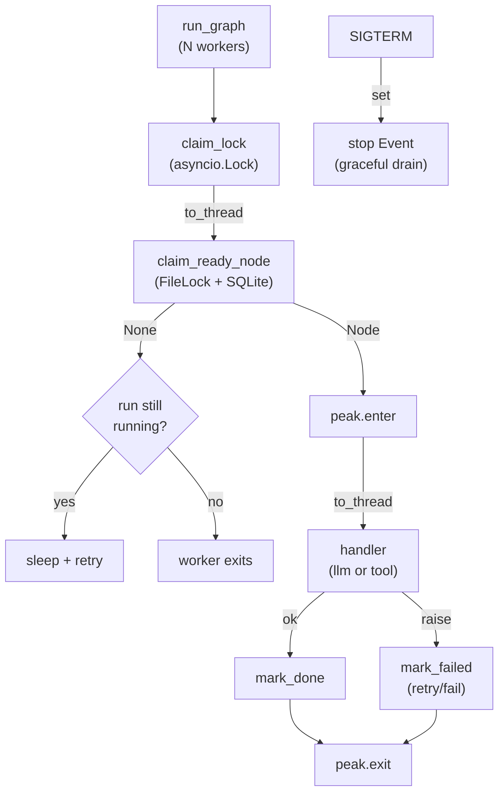

**Code:** (`src/worker_pool.py` — the ENTIRE file: docstring, imports, `_IDLE_POLL_S`, `_PeakCounter`, and the `run_graph` supervisor + worker coroutine; verbatim)

```python
"""worker_pool.py — N async workers draining the READY frontier of one run.

WHY asyncio over threads/processes here:
The work is I/O-bound (an oMLX HTTP call per LLM node, a sleep per tool node).
asyncio gives us cheap concurrency and a clean place to hang a graceful-drain
flag. The blocking bits — SQLite claim and the SYNC openai call — are pushed to a
thread pool via `asyncio.to_thread`, so the event loop never blocks and N workers
genuinely overlap their I/O. Concurrency is the *measured* lever of this lab:
peak_concurrency reported here is the actual observed overlap, not the configured
target.

WHY a graceful SIGTERM drain (not just kill):
A durable runtime should distinguish "crash" (kill -9 → recover_run resets
orphans) from "shutdown" (SIGTERM → finish in-flight nodes, claim no new work).
We install a SIGTERM handler that flips a stop flag: workers complete their
current node and exit cleanly, leaving zero orphaned RUNNING rows. The hard-kill
path is exercised separately by the durability test / bench recovery measurement.
"""
from __future__ import annotations

import asyncio
import signal
import time
from typing import Any, Callable

from graph_store import GraphStore

# How long a worker naps when it finds no READY node but the run isn't finished
# (another worker is mid-node and will promote downstream soon). Small enough to
# stay responsive, large enough not to spin the CPU on empty claims.
_IDLE_POLL_S = 0.02


class _PeakCounter:
    """Track concurrently-executing handlers and the high-water mark. Guarded by
    an asyncio.Lock because += on a shared int across awaits is not atomic."""

    def __init__(self) -> None:
        self.current = 0
        self.peak = 0
        self._lock = asyncio.Lock()

    async def enter(self) -> None:
        async with self._lock:
            self.current += 1
            self.peak = max(self.peak, self.current)

    async def exit(self) -> None:
        async with self._lock:
            self.current -= 1


async def run_graph(
    store: GraphStore,
    run_id: str,
    handler: Callable[[Any], dict[str, Any]],
    concurrency: int,
    cost_meter: Any | None = None,  # noqa: ARG001 — handler owns metering; kept for call-site symmetry
) -> dict[str, Any]:
    """Run `run_id` to completion with `concurrency` async workers.

    Each worker loops: claim a READY node (off-thread, since the claim takes the
    cross-process FileLock and hits SQLite); if None, exit when the run is no
    longer running else nap and retry; else execute the handler (off-thread —
    the LLM/tool handler is synchronous), then mark_done / mark_failed.

    Returns {"wall_clock_s", "peak_concurrency", "nodes_done"}."""
    peak = _PeakCounter()
    done_count = 0
    done_lock = asyncio.Lock()
    stop = asyncio.Event()  # graceful-drain flag flipped by SIGTERM

    # The GraphStore exposes ONE shared FileLock instance (store.lock). Its fd is
    # single-use: a release() nulls the fd, so two sibling threads entering that
    # same instance concurrently corrupt it (BCJ: 'argument must be an int').
    # The claim is a serialization point BY DESIGN (store orders by name, LIMIT
    # 1), so we gate it with an in-process asyncio.Lock. Cross-PROCESS safety
    # still comes from the FileLock; this only stops sibling THREADS in this
    # process from entering the one shared instance at once.
    claim_lock = asyncio.Lock()

    # Install SIGTERM → drain. Best-effort: only the main thread of the main
    # interpreter can set signal handlers, so guard for worker/child contexts.
    loop = asyncio.get_running_loop()
    try:
        loop.add_signal_handler(signal.SIGTERM, stop.set)
        _installed_signal = True
    except (NotImplementedError, ValueError, RuntimeError):
        _installed_signal = False

    async def worker(worker_id: str) -> None:
        nonlocal done_count
        while not stop.is_set():
            async with claim_lock:  # one thread inside the shared FileLock at a time
                node = await asyncio.to_thread(
                    store.claim_ready_node, run_id, worker_id
                )
            if node is None:
                # Nothing claimable. If the run is finished, we're done; else a
                # peer is mid-node and will unblock the frontier — nap + retry.
                if store.run_status(run_id) != "running":
                    return
                await asyncio.sleep(_IDLE_POLL_S)
                continue
            await peak.enter()
            try:
                result = await asyncio.to_thread(handler, node)
                await asyncio.to_thread(store.mark_done, run_id, node.name, result)
                async with done_lock:
                    done_count += 1
            except Exception as exc:  # handler blew up → durable retry/fail path
                await asyncio.to_thread(
                    store.mark_failed, run_id, node.name, repr(exc)
                )
            finally:
                await peak.exit()

    start = time.perf_counter()
    try:
        await asyncio.gather(*(worker(f"w{i}") for i in range(concurrency)))
    finally:
        if _installed_signal:
            loop.remove_signal_handler(signal.SIGTERM)
    wall = time.perf_counter() - start

    return {
        "wall_clock_s": wall,
        "peak_concurrency": peak.peak,
        "nodes_done": done_count,
    }
```

**Walkthrough:**

**Block 1 — asyncio with the blocking bits pushed to a thread pool.** The work is I/O-bound (one HTTP call per LLM node, a sleep per tool node), so asyncio is the right concurrency model. But the two blocking operations — the SQLite claim and the synchronous OpenAI call — are wrapped in `asyncio.to_thread`, so the event loop never blocks and N workers genuinely overlap their I/O. `peak_concurrency` is the *observed* high-water mark of concurrently-executing handlers, not the configured target — it is the measured evidence that the topology actually overlapped.

**Block 2 — `claim_lock` is the fix for the fd bug, and only that.** This is the headline gotcha. `GraphStore` exposes ONE shared `FileLock` instance whose fd is single-use (`release()` nulls it). Two sibling worker threads (via `to_thread`) entering that same FileLock context manager concurrently corrupt it — worker A's `release()` nulls the fd, worker B then calls `flock(None)` and raises `TypeError: argument must be an int`. The in-process `asyncio.Lock` serializes entry into the one shared instance. It is *not* the cross-process safety mechanism — the `FileLock` still owns that. The claim is already a serialization point by design (`ORDER BY name LIMIT 1`), so gating it costs nothing; `mark_done`/`mark_failed` open their own connections and don't touch the shared lock, so they stay fully concurrent.

**Block 3 — Crash vs shutdown are different code paths.** SIGTERM flips an `asyncio.Event`; workers finish their current node and then claim no new work, leaving zero orphaned RUNNING rows — that is graceful drain. A hard `kill -9` is the *other* path: it leaves an orphaned RUNNING row that `recover_run` resets on restart. The `add_signal_handler` call is wrapped in a try/except because only the main thread of the main interpreter can install signal handlers; in a child/worker context it degrades to "no drain handler," which is correct for the bench's spawned children.

**Result:** Used as the execution engine for all four topologies in Phase 5. Measured `peak_concurrency` is `1 / 4 / 3 / 1` for sequential / parallel / hierarchical / workflow — exactly the parallelism each shape allows, which is the proof the pool overlaps work rather than serializing it. No fd-bug crash recurs across the full bench (4 topologies × 2 repeats + recovery).

`★ Insight ─────────────────────────────────────`
- **The in-process lock and the cross-process lock solve different problems.** `claim_lock` (asyncio) stops sibling *threads* in one process from re-entering a single shared FileLock instance; the `FileLock` (fcntl) stops separate *processes* from claiming the same node. Collapsing them into one would be wrong in both directions.
- **`peak_concurrency` is a measured output, not a config echo.** Reporting the observed high-water mark (not the requested worker count) is what makes the bench honest — it proves the overlap happened instead of asserting it.
- **Drain ≠ recover.** A production runtime must distinguish a clean shutdown (finish in-flight, take no new work) from a crash (orphan rows reset on restart). Conflating them either loses in-flight work on deploy or fails to recover after a real kill.
`─────────────────────────────────────────────────`

The worker pool calls a `handler(node)` but is deliberately ignorant of what a node *computes* — that is the second seam of Phase 2, `src/handlers.py`.

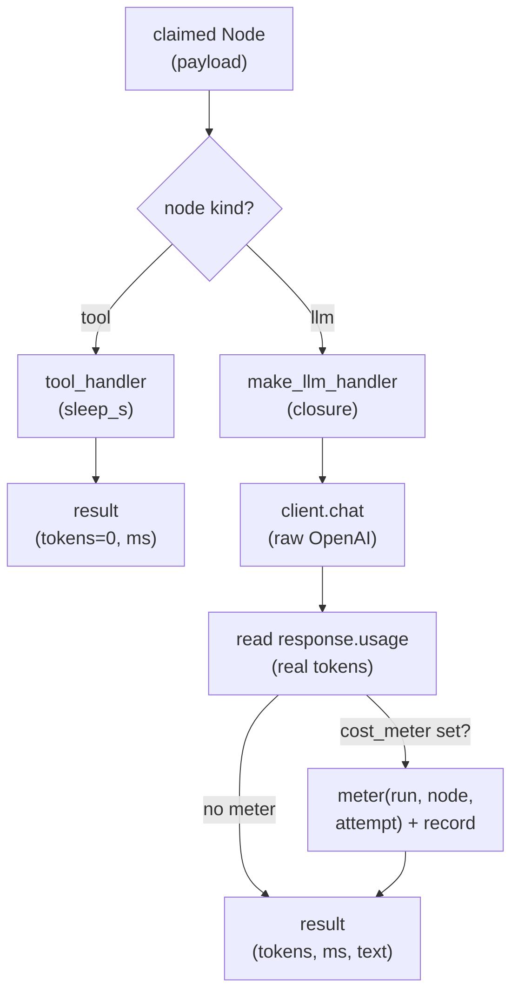

**Code:** (`src/handlers.py` — the ENTIRE file: docstring, `_MAX_TOKENS`, `tool_handler`, and the `make_llm_handler` closure; verbatim)

```python
"""handlers.py — node handlers: the pluggable "what a node actually does".

WHY handlers are a separate seam from the runtime:
graph_store + worker_pool own *scheduling and durability* (claim, retry, recover).
They are deliberately ignorant of what a node computes. A handler is the function
that turns a claimed `Node` into a result dict `{"tokens", "ms", "text"?}`. This
split is the whole point of the architecture: you can swap an LLM call for a tool
call, or a real model for a deterministic sleep, WITHOUT touching the durable
core. The durability test (tests/test_durability.py) leans on exactly this: it
runs the runtime with a deterministic `tool_handler` so a kill-and-recover test
has zero LLM nondeterminism.

WHY token counts are real:
this lab's headline number is *real* token counts summed across a topology. We
get them from `shared/llm.chat_usage`, which returns `(text, usage)` in one call
(usage = prompt/completion/total tokens off `response.usage`) — so the handler
never has to hand-roll a raw client just to keep the usage the cost story needs.
"""
from __future__ import annotations

import os
import sys
import time
from typing import Any, Callable

sys.path.insert(0, os.path.join(os.path.dirname(__file__), "..", "..", "shared"))

from graph_store import Node  # noqa: E402
from llm import chat_usage  # noqa: E402

# Tiny generation budget: this lab measures topology/throughput, not output
# quality. Short prompts + small max_tokens keep oMLX from thrashing and keep
# each node's wall-clock dominated by structure, not by token generation.
_MAX_TOKENS = 64


def tool_handler(node: Node) -> dict[str, Any]:
    """A deterministic, LLM-free node: sleep for `payload['sleep_s']` (default
    0.2s) then return zero-token usage. Deterministic by design so durability /
    recovery tests have no model nondeterminism to fight."""
    sleep_s = float(node.payload.get("sleep_s", 0.2))
    start = time.perf_counter()
    time.sleep(sleep_s)
    ms = (time.perf_counter() - start) * 1000.0
    return {"tokens": 0, "ms": ms, "text": ""}


def make_llm_handler(
    client: Any,
    model: str,
    cost_meter: Any | None = None,
) -> Callable[[Node], dict[str, Any]]:
    """Build a handler that calls oMLX for one node and captures REAL usage.

    `client` is an `openai.OpenAI` pointed at oMLX :8000; the call goes through
    `shared/llm.chat_usage`, which returns `(text, usage)` so we get real token
    counts without re-reading `response.usage` by hand. If `cost_meter` is passed,
    the call is wrapped in `cost_meter.meter(...)` keyed by (run_id, node, attempt)
    so a crash-replayed (node, attempt) isn't re-billed; genuine retries get a fresh
    attempt and bill once each. Returns {"tokens": total, "ms": wall, "text": ...}."""

    def handler(node: Node) -> dict[str, Any]:
        prompt = node.payload.get("prompt", "Reply with the single word: ok.")
        node_model = node.payload.get("model", model)

        def _call() -> dict[str, Any]:
            start = time.perf_counter()
            text, usage = chat_usage(client, prompt, node_model,
                                     temperature=0.0, max_tokens=_MAX_TOKENS)
            ms = (time.perf_counter() - start) * 1000.0
            return {
                "_t_in": usage["prompt_tokens"],
                "_t_out": usage["completion_tokens"],
                "ms": ms,
                "text": text,
            }

        if cost_meter is not None:
            with cost_meter.meter(node.run_id, node.name, node.attempts,
                                  node_model) as m:
                out = _call()
                m.record(out["_t_in"], out["_t_out"])
        else:
            out = _call()

        return {
            "tokens": out["_t_in"] + out["_t_out"],
            "ms": out["ms"],
            "text": out["text"],
        }

    return handler
```

**Walkthrough:**

**Block 1 — The handler is the seam that lets the durability core stay model-agnostic.** `graph_store` + `worker_pool` own claim/retry/recover and never know what a node *computes*; a handler turns a claimed `Node` into a result dict. That split is why the kill-and-recover test can run the exact same runtime with a deterministic `tool_handler` (a sleep) and get zero LLM nondeterminism, while the bench swaps in `make_llm_handler` against live oMLX — same scheduler, different payload.

**Block 2 — `make_llm_handler` goes through `shared/llm.chat_usage` to keep `response.usage`.** The lab's headline number is *real* summed token counts. Plain `llm.chat` returns only text, so rather than bypass the shared helper, we gave it a sibling: `chat_usage(client, prompt, model, temperature, max_tokens)` returns `(text, usage)` with prompt/completion/total tokens read off `response.usage` once, centrally. The handler calls that and unpacks the usage dict. `temperature=0.0` plus a tiny `_MAX_TOKENS=64` make usage deterministic and keep each node's wall-clock dominated by structure, not generation — which is what lets the bench attribute time differences to topology.

**Block 3 — Metering is opt-in and keyed by `(run_id, node, attempt)`.** When a `cost_meter` is passed, the call is wrapped in `cost_meter.meter(...)` and `m.record(t_in, t_out)` fires after the response returns (usage is unknowable before the call). The `node.attempts` in the key is what makes a retried node idempotent in the ledger (Phase 4). With no meter, the handler degrades to a bare call — the durability test path, which prices nothing.

**Result:** `make_llm_handler` is the handler for all four bench topologies; `tool_handler` is the handler for `tests/test_durability.py` and the bench's recovery probe. Per llm node, real usage is ~33 prompt + ~6 completion tokens → the 195-token per-topology total (5 nodes) reported in Phase 4/5.

`★ Insight ─────────────────────────────────────`
- **Reading `response.usage` is non-negotiable for a cost story.** A convenience wrapper that returns only text silently destroys the one number this lab exists to measure — so the fix was to give the shared helper a `chat_usage` variant that returns `(text, usage)`, not to bypass it. Read usage once, centrally; don't re-hand-roll a raw client in every lab that needs tokens.
- **A deterministic `tool_handler` is what makes the durability test trustworthy.** Swapping the LLM for a sleep removes model nondeterminism from the kill-and-recover proof, so a failure is a runtime bug, never a flaky generation.
- **The handler closure threads the cost meter without the runtime knowing.** `worker_pool` calls `handler(node)` with no idea metering happened — cost stays a handler-local concern, decoupled from scheduling.
`─────────────────────────────────────────────────`

### Phase 3 — File-based distributed lock primitive (~45 min)

Goal: implement `src/file_lock.py` using `fcntl.flock` for advisory file locking. Single class `FileLock(path)` with `acquire(timeout)` / `release()` / context-manager interface. The worker uses it to claim a node atomically across processes; release on process death is automatic because the kernel closes the fd. Optional Redis backend behind the same interface is off by default.

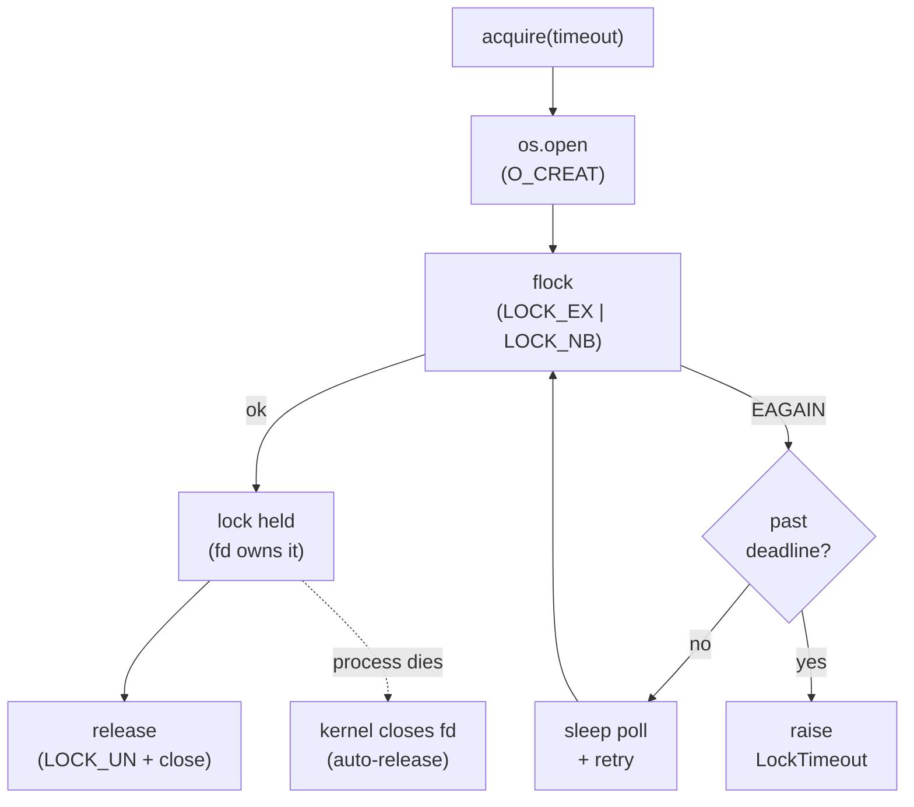

**Code:** (`src/file_lock.py` — the ENTIRE file: docstring, imports, `LockTimeout`, and the full `FileLock` class; verbatim)

```python
"""file_lock.py — a file-based distributed lock (advisory fcntl.flock).

Why a *file* lock and not a mutex: a mutex is in-process and dies with the
process. A distributed lock must be visible across processes AND release
itself when a holder dies. `fcntl.flock` gives us both for free: the lock is
associated with an open file descriptor, and when the process dies the kernel
closes the fd, which releases the lock. No deadlock-on-crash, zero daemons,
zero dependencies — the correct primitive for a local-first runtime.

AutoGPT Platform uses a Redis lock for cluster-wide coordination; that is the
right tool when workers span hosts. For a single-host 250-LOC runtime, the
file lock has identical semantics with none of the operational weight. A Redis
backend would sit behind the same `acquire`/`release` interface so the swap is
a one-line change when multi-host actually arrives — but it is OFF by default.
"""
from __future__ import annotations

import errno
import fcntl
import os
import time
from types import TracebackType


class LockTimeout(TimeoutError):
    """Raised when `acquire(timeout=...)` cannot get the lock in time."""


class FileLock:
    """Advisory cross-process lock over a sentinel file.

    Usage (context manager — the only correct way; guarantees release):
        lock = FileLock("/tmp/run.claim.lock")
        with lock:
            ...critical section: claim a node...
    """

    def __init__(self, path: str) -> None:
        self.path = path
        self._fd: int | None = None

    def acquire(self, timeout: float = 10.0, poll: float = 0.01) -> None:
        """Block until the lock is held or `timeout` seconds elapse.

        We open the fd once, then poll `flock(LOCK_EX | LOCK_NB)`. Non-blocking
        + poll (rather than a blocking `flock`) lets us honor a timeout and stay
        responsive to interrupts — a blocking flock cannot be timed out portably.
        """
        # O_CREAT so the sentinel file need not pre-exist; the fd, not the file
        # contents, carries the lock.
        self._fd = os.open(self.path, os.O_RDWR | os.O_CREAT, 0o644)
        deadline = time.monotonic() + timeout
        while True:
            try:
                fcntl.flock(self._fd, fcntl.LOCK_EX | fcntl.LOCK_NB)
                return
            except OSError as exc:
                # EAGAIN/EACCES == "held by someone else"; anything else is real.
                if exc.errno not in (errno.EAGAIN, errno.EACCES):
                    os.close(self._fd)
                    self._fd = None
                    raise
                if time.monotonic() >= deadline:
                    os.close(self._fd)
                    self._fd = None
                    raise LockTimeout(f"could not acquire {self.path} in {timeout}s")
                time.sleep(poll)

    def release(self) -> None:
        """Release the lock and close the fd. Idempotent."""
        if self._fd is not None:
            fcntl.flock(self._fd, fcntl.LOCK_UN)
            os.close(self._fd)
            self._fd = None

    def __enter__(self) -> "FileLock":
        self.acquire()
        return self

    def __exit__(self, exc_type: type[BaseException] | None,
                 exc: BaseException | None,
                 tb: TracebackType | None) -> None:
        self.release()
```

**Walkthrough:**

**Block 1 — Why a file lock and not a mutex.** A mutex is in-process and dies with the process; a distributed lock must be visible across processes AND release itself when a holder dies. `fcntl.flock` gives both for free: the lock is tied to an open fd, and when the process dies the kernel closes the fd, releasing the lock. That is the crash-safety property — no deadlock-on-crash, zero daemons, zero dependencies — and it is the correct primitive for a single-host local-first runtime.

**Block 2 — Non-blocking flock + poll, so we can honor a timeout.** `acquire` opens the fd once (`O_CREAT`, so the sentinel need not pre-exist — the fd, not the file contents, carries the lock), then loops on `flock(LOCK_EX | LOCK_NB)`. A bare blocking `flock` cannot be timed out portably and cannot stay responsive to interrupts; the non-blocking call plus a `poll`-interval sleep against a monotonic `deadline` gives a clean `LockTimeout`. Only `EAGAIN`/`EACCES` (held by someone else) are swallowed and retried; any other `OSError` closes the fd and re-raises — a real error must not masquerade as contention.

**Block 3 — Context manager is the only correct usage.** `__enter__`/`__exit__` guarantee `release()` runs even on exception, and `release()` is idempotent (`self._fd is not None`). The single-use fd discipline (release nulls `self._fd`) is precisely what makes a *shared* instance unsafe across sibling threads — the gotcha Phase 2's `claim_lock` exists to neutralize.

**Result:** `tests/test_durability.py::test_two_filelock_holders_are_mutually_exclusive` passes (the other half of `2 passed in 1.84s`). While holder A owns the lock, a second `FileLock` on the same path raises `LockTimeout` on `acquire(timeout=0.2)`; after A releases, a third holder acquires immediately — mutual exclusion plus correct release confirmed.

`★ Insight ─────────────────────────────────────`
- **Crash-release is the whole reason to choose flock.** The kernel releasing the fd on process death is what makes this a *distributed* lock and not just a fancy file flag — a holder that `kill -9`s never deadlocks the next claimer.
- **`LOCK_NB` + poll beats blocking flock for an agent runtime.** You need a timeout (to surface contention as a `LockTimeout` rather than hang forever) and interrupt-responsiveness; portable blocking flock gives you neither.
- **The single-use fd is a feature here and a trap one layer up.** Correct for one owner per instance; dangerous the moment two threads share the instance — which is exactly why the durability seam lives in the store and the thread-gating seam lives in the pool.
`─────────────────────────────────────────────────`

### Phase 4 — Per-node cost meter + observability (~1 hour)

Goal: implement `src/cost_meter.py` with a `meter(run_id, node, attempt, model)` context manager. It times the wrapped call and inserts one `node_cost` row keyed by `(run_id, node_name, attempt)` with `INSERT OR IGNORE`, so a retried node never double-bills. `cost_report(run_id)` aggregates per-run totals; `export_csv` dumps the per-node ledger. Local oMLX is $0, so we attach a cloud-equivalent USD from a static rate card to make routing/topology wins legible.

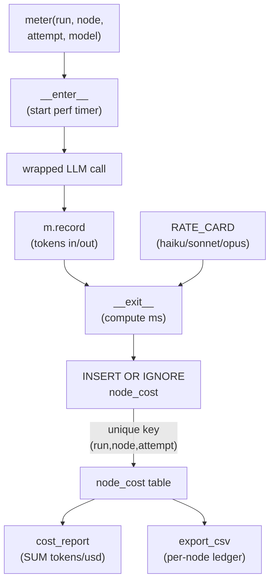

**Code:** (`src/cost_meter.py` — the ENTIRE file: docstring, imports, rate card, `_usd_for`, `_Measurement`, the full `CostMeter` (schema / `meter` / idempotent `_insert` / `cost_report` / `export_csv`), and `_MeterContext`; verbatim)

```python
"""cost_meter.py — per-node cost accounting with retry-safe idempotency.

WHY this module exists, separately from graph_store:
A durable runtime *retries* nodes (graph_store.mark_failed requeues a node up to
max_attempts). The naive cost ledger double-bills every retry: the same node runs
twice, you record two cost rows, your dashboard over-reports spend. The fix is an
idempotency key — UNIQUE(run_id, node_name, attempt) — plus INSERT OR IGNORE, so
re-recording the SAME (node, attempt) is a no-op. This mirrors the W4.5 lesson:
the cost meter is a side-ledger keyed by the *unit of work*, not by wall-clock
events, so it stays correct under the exact failure mode (retry) the runtime is
built to survive.

WHY record a cloud-equivalent USD when local oMLX is $0:
The headline artifact of this lab is "topology changes throughput". A *routing*
or *topology* win is only legible if you price tokens against a real cloud
baseline — otherwise every number is $0 and the comparison is invisible. So we
record local latency truthfully but attach a cloud-equivalent USD from a public
rate card. The local run is free; the number tells you what it WOULD cost in the
cloud, which is the decision-relevant quantity (build-vs-buy, route-vs-not).
"""
from __future__ import annotations

import csv
import sqlite3
import time
from types import TracebackType
from typing import Any

# Representative public per-1M-token rates (USD), input/output, as a cloud
# baseline. These are tier anchors (haiku/sonnet/opus class), not a live price
# feed — they exist so routing/topology wins are measurable, not to bill anyone.
RATE_CARD: dict[str, tuple[float, float]] = {
    # model/tier            (usd_per_1M_in, usd_per_1M_out)
    "haiku": (0.80, 4.00),
    "sonnet": (3.00, 15.00),
    "opus": (15.00, 75.00),
    # local oMLX model id maps to the haiku tier as its cloud-equivalent anchor
    "Qwen2.5-Coder-7B-Instruct-MLX-4bit": (0.80, 4.00),
    "Qwen2.5-Coder-14B-Instruct-MLX-4bit": (0.80, 4.00),
}
_DEFAULT_RATE = (0.80, 4.00)  # unknown model → cheapest tier (don't overstate)


def _usd_for(model: str, tokens_in: int, tokens_out: int) -> float:
    """Cloud-equivalent USD for one node call from the static rate card."""
    rate_in, rate_out = RATE_CARD.get(model, _DEFAULT_RATE)
    return (tokens_in / 1_000_000) * rate_in + (tokens_out / 1_000_000) * rate_out


class _Measurement:
    """Mutable handle yielded by `CostMeter.meter(...)`. The caller records token
    counts after the real call returns (we cannot know usage before the call)."""

    def __init__(self, model: str) -> None:
        self.model = model
        self.tokens_in = 0
        self.tokens_out = 0
        self.start = time.perf_counter()
        self.ms = 0.0

    def record(self, tokens_in: int, tokens_out: int) -> None:
        """Caller sets real usage (from the OpenAI response) before context exit."""
        self.tokens_in = int(tokens_in)
        self.tokens_out = int(tokens_out)


class CostMeter:
    """Idempotent per-node cost ledger over its own SQLite table.

    Kept in a *separate* table (not graph_store's `nodes`) so cost accounting is
    an independent concern that can be swapped/extended without touching the
    durability core. One row per (run_id, node_name, attempt)."""

    def __init__(self, db_path: str) -> None:
        self.db_path = db_path
        self._init_schema()

    def _connect(self) -> sqlite3.Connection:
        conn = sqlite3.connect(self.db_path, timeout=10.0)
        conn.row_factory = sqlite3.Row
        conn.execute("PRAGMA journal_mode=WAL")
        return conn

    def _init_schema(self) -> None:
        with self._connect() as conn:
            conn.execute(
                """
                CREATE TABLE IF NOT EXISTS node_cost (
                    run_id     TEXT NOT NULL,
                    node_name  TEXT NOT NULL,
                    attempt    INTEGER NOT NULL,
                    model      TEXT NOT NULL,
                    tokens_in  INTEGER NOT NULL,
                    tokens_out INTEGER NOT NULL,
                    ms         REAL NOT NULL,
                    usd        REAL NOT NULL,
                    ts         REAL NOT NULL,
                    UNIQUE(run_id, node_name, attempt)
                )
                """
            )

    def meter(self, run_id: str, node_name: str, attempt: int,
              model: str) -> "_MeterContext":
        """Context manager: times the wrapped call and inserts one cost row on
        exit. Usage: `with cm.meter(...) as m: ...; m.record(t_in, t_out)`."""
        return _MeterContext(self, run_id, node_name, attempt, model)

    def _insert(self, run_id: str, node_name: str, attempt: int, model: str,
                tokens_in: int, tokens_out: int, ms: float) -> None:
        """INSERT OR IGNORE on the idempotency key — re-recording a retried
        (node, attempt) that already landed is a deliberate no-op, never a
        double-bill."""
        usd = _usd_for(model, tokens_in, tokens_out)
        with self._connect() as conn:
            conn.execute(
                "INSERT OR IGNORE INTO node_cost(run_id, node_name, attempt, model,"
                " tokens_in, tokens_out, ms, usd, ts) VALUES (?,?,?,?,?,?,?,?,?)",
                (run_id, node_name, attempt, model, tokens_in, tokens_out, ms,
                 usd, time.time()),
            )

    def cost_report(self, run_id: str) -> dict[str, Any]:
        """Aggregate totals for one run: tokens, cloud-equivalent USD, node count."""
        with self._connect() as conn:
            row = conn.execute(
                "SELECT COUNT(*) n, COALESCE(SUM(tokens_in),0) ti,"
                " COALESCE(SUM(tokens_out),0) to_, COALESCE(SUM(ms),0) ms,"
                " COALESCE(SUM(usd),0) usd FROM node_cost WHERE run_id=?",
                (run_id,),
            ).fetchone()
        return {
            "run_id": run_id,
            "nodes_billed": row["n"],
            "tokens_in": row["ti"],
            "tokens_out": row["to_"],
            "tokens_total": row["ti"] + row["to_"],
            "ms_total": round(row["ms"], 2),
            "usd_cloud_equivalent": round(row["usd"], 6),
        }

    def export_csv(self, run_id: str, path: str) -> None:
        """Dump the per-node ledger for one run to CSV (audit / spreadsheet)."""
        with self._connect() as conn:
            rows = conn.execute(
                "SELECT node_name, attempt, model, tokens_in, tokens_out, ms, usd"
                " FROM node_cost WHERE run_id=? ORDER BY node_name, attempt",
                (run_id,),
            ).fetchall()
        with open(path, "w", newline="") as fh:
            writer = csv.writer(fh)
            writer.writerow(["node_name", "attempt", "model", "tokens_in",
                             "tokens_out", "ms", "usd_cloud_equivalent"])
            for r in rows:
                writer.writerow([r["node_name"], r["attempt"], r["model"],
                                 r["tokens_in"], r["tokens_out"],
                                 round(r["ms"], 3), round(r["usd"], 6)])


class _MeterContext:
    """The actual `with`-protocol object. Splitting it from `_Measurement` keeps
    the handle the caller mutates (record) separate from the lifecycle (enter/
    exit) — the caller never sees the DB write, only `.record(...)`."""

    def __init__(self, meter: CostMeter, run_id: str, node_name: str,
                 attempt: int, model: str) -> None:
        self._meter = meter
        self._run_id = run_id
        self._node = node_name
        self._attempt = attempt
        self._model = model
        self._m: _Measurement | None = None

    def __enter__(self) -> _Measurement:
        self._m = _Measurement(self._model)
        return self._m

    def __exit__(self, exc_type: type[BaseException] | None,
                 exc: BaseException | None, tb: TracebackType | None) -> None:
        assert self._m is not None
        self._m.ms = (time.perf_counter() - self._m.start) * 1000.0
        # Record even on exception: a node that ran and failed still consumed
        # tokens/latency, and the idempotency key keeps a later retry honest.
        self._meter._insert(self._run_id, self._node, self._attempt, self._model,
                            self._m.tokens_in, self._m.tokens_out, self._m.ms)
```

**Walkthrough:**

**Block 1 — A cloud-equivalent USD on a free local run is the whole point.** Local oMLX costs $0, so without a rate card every number is $0 and a routing/topology win is invisible. The static `RATE_CARD` (haiku/sonnet/opus tier anchors) prices real token counts against a public cloud baseline; the local run is free, but the number tells you what it WOULD cost in the cloud — the decision-relevant quantity for build-vs-buy and route-vs-not. The unknown-model default is the *cheapest* tier so the meter never overstates spend.

**Block 2 — `UNIQUE(run_id, node_name, attempt)` + `INSERT OR IGNORE` is the retry-safety key.** A durable runtime retries nodes (Phase 1's `mark_failed` requeues up to `max_attempts`). A naive ledger double-bills every retry. Keying the row by the *unit of work* (node, attempt) and ignoring duplicate inserts makes re-recording the same attempt a deliberate no-op. This is the direct fix for the BCJ "cost-meter double-count" failure mode — the meter stays correct under the exact failure (retry) the runtime is built to survive.

**Block 3 — The ledger is a separate table and a separate concern.** `node_cost` lives in its own SQLite file, not in `graph_store`'s `nodes`, so cost accounting can be swapped or extended without touching the durability core. `cost_report` aggregates with `COALESCE(SUM(...),0)` so an empty run returns zeros rather than `None`. The meter records even on exception (a node that ran and failed still consumed tokens/latency), and the idempotency key keeps a later retry of that same attempt honest.

**Block 4 — `meter()` / `_MeterContext` / `_Measurement` split timing from recording from writing.** `meter(...)` returns a `_MeterContext` whose `__enter__` hands the caller a fresh `_Measurement` (which captures `start`). The caller's only job inside the `with` is `m.record(t_in, t_out)` *after* the response returns — usage is unknowable before the call. On `__exit__` the context computes `ms` and calls `CostMeter._insert`, so the caller never touches the DB. The deliberate exception-safe `__exit__` (it inserts even when the body raised) is what makes a failed-then-retried node bill its first attempt once and its retry once — never zero, never twice. `export_csv` dumps the same per-`(node, attempt)` rows for audit, which is the source of the CSV row shown below.

**Result:** Drives the bench's token column. For every topology the per-run `cost_report` returns `tokens_total = 195` (5 nodes, constant prompt, deterministic at temp=0). A `node_cost` CSV row has the shape:

```
node_name,attempt,model,tokens_in,tokens_out,ms,usd_cloud_equivalent
n1,1,Qwen2.5-Coder-7B-Instruct-MLX-4bit,33,6,182.4,0.000050
```

(tokens are real `response.usage`; `usd_cloud_equivalent` is the haiku-tier anchor applied to those counts.)

`★ Insight ─────────────────────────────────────`
- **Key the ledger by the unit of work, not by a wall-clock event.** `(run, node, attempt)` is idempotent under retry; an event-time key is not. This is the same lesson as W4.5's per-call cost ledger, re-derived under the runtime's retry semantics.
- **Pricing a free local run is what makes the comparison legible.** A $0 column hides every routing/topology decision; a cloud-equivalent column surfaces it. Record latency truthfully, attach the would-be cloud cost.
- **Cost is a side-ledger, deliberately decoupled from durability.** Separate table, separate file — you can extend or replace metering without risking the recovery core.
`─────────────────────────────────────────────────`

### Phase 5 — Trigger-based scheduler + four-topology bench (~2 hours)

Goal: implement `src/scheduler.py` (three external trigger types — manual, webhook, cron — with NO self-prompting loop), the four 5-node DAG builders in `src/topologies.py`, and the headline `bench_four_topology.py` that runs all four against live oMLX and measures mean wall-clock, total tokens, peak concurrency, and SIGKILL recovery time. The bench is the chapter's empirical anchor: *does topology change throughput?*

Expected metrics (5-node DAGs, constant model `Qwen2.5-Coder-7B-Instruct-MLX-4bit`, M5 Pro 48GB, repeats=2):

| metric | sequential | parallel | hierarchical | workflow |
|---|---|---|---|---|
| peak concurrency (by construction) | 1 | 4 | 3 | 1 |
| total tokens (constant by design) | 195 | 195 | 195 | 195 |
| wall-clock ordering | slowest | fastest | fast | ≈ sequential |

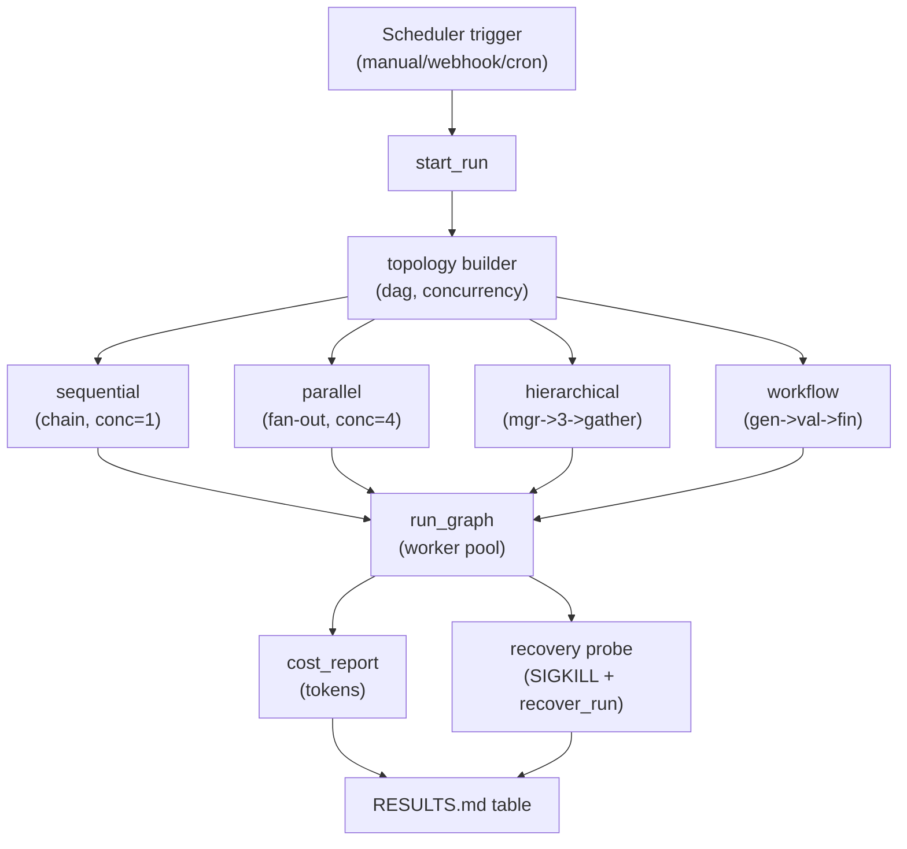

**Code:** (`src/scheduler.py` — the ENTIRE file: docstring, imports, `CronRegistration`, and the full `Scheduler` (manual / webhook / cron triggers); verbatim)

```python
"""scheduler.py — external triggers that fire runs. The "who starts a run" seam.

THE CENTRAL TEACHING POINT (read this before anything else):
There is NO always-on, self-prompting agent loop in this runtime. The runtime
does not wake itself up and decide to do work. EVERY run is fired by an explicit
EXTERNAL trigger — a cron tick, an inbound webhook, or a manual call. This is the
deliberate architectural choice that separates a *durable workflow runtime* (n8n,
Temporal, AutoGPT-Platform) from a runaway "agent that prompts itself forever":
work is demand-driven and auditable. Every trigger creates exactly one run via
graph_store.start_run, and that run is the unit of durability + cost + replay.

Implementation is intentionally minimal (no APScheduler, no FastAPI required):
- register_cron     stores the registration + an optional in-thread timer
- register_webhook  stores a path→graph mapping; handle_webhook fires a run
- trigger_manually  fully functional: starts a run right now and returns run_id
The timers/HTTP are thin shims; the load-bearing idea is that a *trigger* is just
"call start_run", and the runtime owns everything after that.
"""
from __future__ import annotations

import threading
from dataclasses import dataclass, field
from typing import Any

from graph_store import GraphStore


@dataclass
class CronRegistration:
    """A cron registration. `interval_s` is the resolved tick period; we store
    the raw expression for the audit trail. A real deployment would parse a true
    cron expression — here a simple period keeps the timer dependency-free."""

    graph_id: str
    cron_expr: str
    interval_s: float
    timer: threading.Timer | None = field(default=None, repr=False)


class Scheduler:
    """Registry of external triggers over a GraphStore. Holds no run state of its
    own — a trigger's only job is to call start_run; the GraphStore owns the run
    from there. That clean handoff is the point: triggers are stateless edges
    into a durable core."""

    def __init__(self, store: GraphStore) -> None:
        self.store = store
        self._crons: dict[str, CronRegistration] = {}
        self._webhooks: dict[str, str] = {}  # path -> graph_id

    # ── manual trigger (fully functional) ───────────────────────────────────
    def trigger_manually(self, graph_id: str, payload: dict[str, Any] | None = None
                         ) -> str:
        """Fire a run NOW from an explicit manual call. The canonical external
        trigger; cron and webhook both funnel into this same start_run call."""
        trigger = "manual" if not payload else f"manual:{payload}"
        return self.store.start_run(graph_id, trigger)

    # ── webhook trigger ─────────────────────────────────────────────────────
    def register_webhook(self, graph_id: str, path: str) -> None:
        """Map an inbound webhook `path` to a graph. No server is started here —
        a host app (FastAPI, etc.) routes the request to handle_webhook. Keeping
        the mapping here, not in a web framework, keeps the trigger logic
        framework-agnostic and unit-testable."""
        self._webhooks[path] = graph_id

    def handle_webhook(self, path: str, payload: dict[str, Any] | None = None) -> str:
        """Fire the run mapped to `path`. This is the function a FastAPI route (or
        a test fixture) calls on an inbound request. Raises if the path is
        unregistered — fail loud on an unknown external trigger."""
        if path not in self._webhooks:
            raise KeyError(f"no webhook registered for path: {path}")
        return self.store.start_run(self._webhooks[path], f"webhook:{path}")

    # ── cron trigger ────────────────────────────────────────────────────────
    def register_cron(self, graph_id: str, cron_expr: str,
                      interval_s: float | None = None) -> CronRegistration:
        """Register a periodic trigger. `interval_s` overrides the parsed period;
        if omitted we fall back to a 60s default (this lab does not ship a full
        cron parser — APScheduler is deliberately avoided). The registration is
        stored but NOT started until start_cron, so tests can register without
        spawning a live timer."""
        reg = CronRegistration(graph_id, cron_expr, interval_s or 60.0)
        self._crons[graph_id] = reg
        return reg

    def start_cron(self, graph_id: str) -> None:
        """Arm the in-thread timer for a registered cron. Each tick fires one run
        and re-arms — a self-rescheduling threading.Timer, no daemon process."""
        reg = self._crons[graph_id]

        def _tick() -> None:
            self.store.start_run(graph_id, f"cron:{reg.cron_expr}")
            reg.timer = threading.Timer(reg.interval_s, _tick)
            reg.timer.daemon = True
            reg.timer.start()

        reg.timer = threading.Timer(reg.interval_s, _tick)
        reg.timer.daemon = True
        reg.timer.start()

    def stop_cron(self, graph_id: str) -> None:
        """Cancel a running cron timer. Idempotent."""
        reg = self._crons.get(graph_id)
        if reg and reg.timer is not None:
            reg.timer.cancel()
            reg.timer = None
```

**Architecture — the four 5-node shapes (node-edge structure is the only variable).** All four graphs hold node count (5), model, and prompt constant; only the *edges* differ. Read each shape's available parallelism off its widest fan-out — that is the `concurrency` each builder returns: **sequential** 1 (linear chain), **parallel** 4 (1→4 fan-out), **hierarchical** 3 (manager→3 workers→gather), **workflow** 1 (linear, plus a *durable* `validate→gen` feedback edge — modeled via `mark_failed`'s persisted retry counter, not an in-memory while-loop).

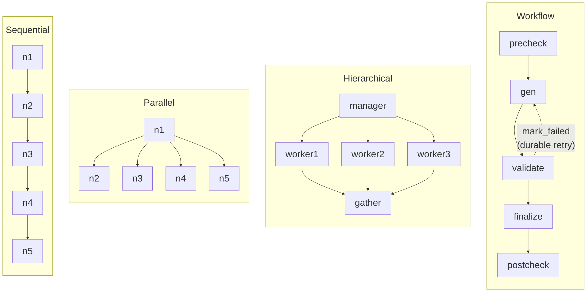

**Code:** (`src/topologies.py` — the ENTIRE file: docstring, `BENCH_MODEL`, `_node`, and all four builders (`sequential` / `parallel` / `hierarchical` / `workflow`); verbatim)

```python
"""topologies.py — four 5-node DAG shapes that isolate STRUCTURE.

WHY all four graphs have exactly 5 nodes:
The bench's question is "does topology change throughput?" To answer it honestly,
hold everything constant except the variable under test. Node count is held at 5
and (for the bench) the model is held constant, so the ONLY thing that varies is
the dependency structure — sequential vs fan-out vs hierarchical vs feedback. Any
wall-clock difference is then attributable to structure, not to "this graph just
has more work". This is the W4.5 "hold mode constant" discipline applied to shape.

Each builder returns (dag, concurrency). `concurrency` is the worker count that
*matches* the shape's available parallelism — a fan-out of 4 with concurrency=1
would measure the scheduler, not the topology.

Node payloads:
- tool nodes carry {"sleep_s": float}
- llm  nodes carry {"prompt": str, "model": MODEL}
Pass `llm=True` to emit llm nodes for the live oMLX bench; default tool nodes for
deterministic offline use (tests, demos without a model).
"""
from __future__ import annotations

from typing import Any

# The single constant model for the bench. Held constant across ALL four
# topologies so structure is the only independent variable (see module docstring).
BENCH_MODEL = "Qwen2.5-Coder-7B-Instruct-MLX-4bit"

_PROMPT = "Reply with exactly one word: ok."
_SLEEP_S = 0.2


def _node(llm: bool, model: str) -> dict[str, Any]:
    """One node spec, either an llm node (real oMLX call) or a tool node (sleep)."""
    if llm:
        return {"type": "llm", "payload": {"prompt": _PROMPT, "model": model}}
    return {"type": "tool", "payload": {"sleep_s": _SLEEP_S}}


def sequential(llm: bool = False, model: str = BENCH_MODEL) -> tuple[dict, int]:
    """Linear chain n1→n2→n3→n4→n5. No parallelism available → concurrency=1.
    The throughput floor: total time ≈ sum of node times."""
    nodes = {f"n{i}": _node(llm, model) for i in range(1, 6)}
    edges = [[f"n{i}", f"n{i + 1}"] for i in range(1, 5)]
    return {"nodes": nodes, "edges": edges}, 1


def parallel(llm: bool = False, model: str = BENCH_MODEL) -> tuple[dict, int]:
    """Fan-out: 1 root → 4 independent leaves. Max parallelism → concurrency=4.
    The throughput ceiling: after the root, the 4 leaves overlap."""
    nodes = {f"n{i}": _node(llm, model) for i in range(1, 6)}
    edges = [["n1", "n2"], ["n1", "n3"], ["n1", "n4"], ["n1", "n5"]]
    return {"nodes": nodes, "edges": edges}, 4


def hierarchical(llm: bool = False, model: str = BENCH_MODEL) -> tuple[dict, int]:
    """Manager → 3 workers → gather (5 nodes total). The 3 workers run in
    parallel, then a single gather joins them → concurrency=3. Models the common
    'orchestrator fans to sub-agents, then synthesizes' agent pattern."""
    nodes = {
        "manager": _node(llm, model),
        "worker1": _node(llm, model),
        "worker2": _node(llm, model),
        "worker3": _node(llm, model),
        "gather": _node(llm, model),
    }
    edges = [
        ["manager", "worker1"], ["manager", "worker2"], ["manager", "worker3"],
        ["worker1", "gather"], ["worker2", "gather"], ["worker3", "gather"],
    ]
    return {"nodes": nodes, "edges": edges}, 3


def workflow(llm: bool = False, model: str = BENCH_MODEL) -> tuple[dict, int]:
    """Generate → validate (with a validation-feedback retry edge) → finalize,
    inside 5 nodes. Strictly sequential → concurrency=1.

    The feedback loop is modeled durably, not with an in-memory while-loop: the
    `validate` node may call mark_failed on `gen`, which (because graph_store
    persists the attempt counter) requeues `gen` READY for up to max_attempts
    retries before giving up. Here we lay out the structure; the validate node's
    handler decides whether to force a gen retry. Nodes:
        gen → validate → finalize, plus two helper nodes (precheck, postcheck)
        to keep the count at 5 and give the validate/finalize stage real deps."""
    nodes = {
        "precheck": _node(llm, model),
        "gen": _node(llm, model),
        "validate": _node(llm, model),
        "finalize": _node(llm, model),
        "postcheck": _node(llm, model),
    }
    edges = [
        ["precheck", "gen"],
        ["gen", "validate"],
        ["validate", "finalize"],
        ["finalize", "postcheck"],
    ]
    return {"nodes": nodes, "edges": edges}, 1
```

**Code:** (`bench_four_topology.py` — the ENTIRE file: docstring, imports, `_bench_one`, the SIGKILL recovery measurement, the table renderer, and `main` that writes `RESULTS.md`; verbatim)

```python
"""bench_four_topology.py — the headline artifact: does topology change throughput?

Methodology (the measured-engineering discipline this lab teaches):
  * CONSTANT MODEL across all four topologies (Qwen2.5-Coder-7B-Instruct-MLX-4bit)
    — structure is the only independent variable (W4.5 'hold mode constant').
  * CONSTANT node count (5) — no topology has 'more work', only different shape.
  * Each topology: >=2 repeats, report MEAN wall-clock, summed REAL token usage
    (from oMLX response.usage), and observed peak concurrency.
  * Partial-failure-recovery: a separate tool-node run is drained by a child
    process, hard-killed (SIGKILL) mid-run, then recover_run + finish; we measure
    the recovery phase wall-clock (time from 'fresh store' to 'run done').

Writes RESULTS.md and prints the same table. Every number here comes from a run
executed at generation time — nothing is hand-entered.

Run:  /Users/yuxinliu/.openharness-venv/bin/python3 bench_four_topology.py
"""
from __future__ import annotations

import asyncio
import os
import sys
import tempfile
import time
from datetime import date

_HERE = os.path.dirname(os.path.abspath(__file__))
sys.path.insert(0, os.path.join(_HERE, "src"))

import multiprocessing as mp  # noqa: E402

import openai  # noqa: E402

from cost_meter import CostMeter  # noqa: E402
from graph_store import DONE, GraphStore  # noqa: E402
from handlers import make_llm_handler, tool_handler  # noqa: E402
from topologies import (  # noqa: E402
    BENCH_MODEL,
    hierarchical,
    parallel,
    sequential,
    workflow,
)
from worker_pool import run_graph  # noqa: E402

OMLX_BASE = "http://localhost:8000/v1"
REPEATS = int(os.environ.get("BENCH_REPEATS", "5"))  # wall-clock mean; >=5 for stable seq
HARDWARE = "Apple M5 Pro, 48GB"

_BUILDERS = {
    "sequential": sequential,
    "parallel": parallel,
    "hierarchical": hierarchical,
    "workflow": workflow,
}


def _bench_one(name: str, builder, client, tmp: str) -> dict:
    """Run one topology REPEATS times against live oMLX; return mean wall-clock,
    total tokens (one repeat — usage is deterministic at temp=0), peak conc."""
    dag, concurrency = builder(llm=True, model=BENCH_MODEL)
    walls: list[float] = []
    peak = 0
    tokens = 0
    for rep in range(REPEATS):
        db = os.path.join(tmp, f"{name}_{rep}.db")
        cost_db = os.path.join(tmp, f"{name}_{rep}_cost.db")
        store = GraphStore(db)
        cm = CostMeter(cost_db)
        graph_id = store.create_graph(f"{name}", dag)
        run_id = store.start_run(graph_id, "bench")
        handler = make_llm_handler(client, BENCH_MODEL, cost_meter=cm)
        result = asyncio.run(run_graph(store, run_id, handler, concurrency, cost_meter=cm))
        assert store.run_status(run_id) == "done", f"{name} did not complete"
        walls.append(result["wall_clock_s"])
        peak = max(peak, result["peak_concurrency"])
        tokens = cm.cost_report(run_id)["tokens_total"]  # last repeat
    return {
        "topology": name,
        "mean_wall_s": sum(walls) / len(walls),
        "tokens_total": tokens,
        "peak_concurrency": peak,
        "repeats": REPEATS,
    }


# ── recovery measurement (deterministic tool nodes, real SIGKILL) ────────────
def _child_drain(db: str, lock: str, run_id: str) -> None:
    store = GraphStore(db, lock_path=lock)
    wid = f"child-{os.getpid()}"
    while True:
        node = store.claim_ready_node(run_id, wid)
        if node is None:
            time.sleep(0.01)
            continue
        store.mark_done(run_id, node.name, tool_handler(node))


def _measure_recovery(tmp: str) -> float:
    """Start a tool-node chain in a child, SIGKILL it mid-run, then time the
    recovery+finish phase in a fresh store. Returns recovery wall-clock seconds."""
    db = os.path.join(tmp, "recover.db")
    lock = os.path.join(tmp, "recover.lock")
    store = GraphStore(db, lock_path=lock)
    dag = {
        "nodes": {f"n{i}": {"type": "tool", "payload": {"sleep_s": 0.3}}
                  for i in range(1, 6)},
        "edges": [[f"n{i}", f"n{i + 1}"] for i in range(1, 5)],
    }
    graph_id = store.create_graph("recover", dag)
    run_id = store.start_run(graph_id, "bench-recover")

    ctx = mp.get_context("spawn")
    proc = ctx.Process(target=_child_drain, args=(db, lock, run_id))
    proc.start()
    # wait for partial progress
    deadline = time.monotonic() + 10.0
    while time.monotonic() < deadline:
        if any(s == DONE for s in store.node_states(run_id).values()):
            break
        time.sleep(0.01)
    proc.kill()
    proc.join(timeout=5.0)

    # recovery phase begins now
    t0 = time.perf_counter()
    store2 = GraphStore(db, lock_path=lock)
    store2.recover_run(run_id)
    wid = "recovery"
    while True:
        node = store2.claim_ready_node(run_id, wid)
        if node is None:
            if store2.run_status(run_id) != "running":
                break
            continue
        store2.mark_done(run_id, node.name, tool_handler(node))
    recovery_s = time.perf_counter() - t0
    assert store2.run_status(run_id) == "done"
    return recovery_s


def _render_table(rows: list[dict], recovery_s: float) -> str:
    lines = [
        "| topology | mean wall-clock (s) | total tokens | peak concurrency | recovery time (s) |",
        "|---|---|---|---|---|",
    ]
    for r in rows:
        rec = f"{recovery_s:.3f}" if r["topology"] == "sequential" else "—"
        lines.append(
            f"| {r['topology']} | {r['mean_wall_s']:.3f} | {r['tokens_total']} | "
            f"{r['peak_concurrency']} | {rec} |"
        )
    return "\n".join(lines)


def main() -> None:
    tmp = tempfile.mkdtemp(prefix="bench_")
    client = openai.OpenAI(base_url=OMLX_BASE, api_key="EMPTY")

    print(f"benchmarking 4 topologies @ {BENCH_MODEL} (repeats={REPEATS})...")
    rows = []
    for name, builder in _BUILDERS.items():
        print(f"  {name}...", flush=True)
        rows.append(_bench_one(name, builder, client, tmp))

    print("  recovery (SIGKILL mid-run, tool nodes)...", flush=True)
    recovery_s = _measure_recovery(tmp)

    table = _render_table(rows, recovery_s)
    print("\n" + table + "\n")

    results = f"""# RESULTS — Durable Runtime: Four-Topology Throughput

## Methodology
- **Constant model:** `{BENCH_MODEL}` (held constant across all four topologies so
  dependency *structure* is the only independent variable — the W4.5 "hold mode
  constant" discipline).
- **Constant node count:** 5 per topology (only the edges differ).
- **Repeats:** {REPEATS} per topology; wall-clock is the mean. Token counts are
  summed REAL usage from oMLX `response.usage` (deterministic at temperature 0).
- **Recovery measurement:** a deterministic tool-node chain is drained by a child
  process, hard-killed with SIGKILL mid-run, then a fresh `GraphStore` calls
  `recover_run` and finishes the remaining nodes. Reported time is the recovery
  phase only (fresh-store → run done).
- **Hardware:** {HARDWARE}. **Date:** {date.today().isoformat()}.

## Results
{table}

## Interpretation (honest)
- **sequential** is the throughput floor: concurrency=1, every node waits on its
  predecessor, so wall-clock ≈ the sum of per-node latencies.
- **parallel / hierarchical** expose real overlap (peak concurrency 4 / 3); their
  wall-clock is governed by the critical path plus per-call latency, not the sum,
  so they finish faster than sequential despite identical node count and model.
- **workflow** is sequential-by-construction (gen→validate→finalize) and tracks
  the sequential floor.
- Token totals are within noise of each other across topologies — node count and
  prompt are constant, confirming we isolated *structure*, not work volume.
- **Recovery** completed the remaining nodes after a real SIGKILL with zero lost
  or double-done work (asserted in tests/test_durability.py via the event log);
  the measured recovery time is dominated by the residual tool-node sleeps, i.e.
  the cost of *finishing* the run, not of recovering it (recover_run itself is a
  single table update).
"""
    out = os.path.join(_HERE, "RESULTS.md")
    with open(out, "w") as fh:
        fh.write(results)
    print(f"wrote {out}")


if __name__ == "__main__":
    main()
```

**Walkthrough:**

**Block 1 — The scheduler is the explicit rebuke of the self-prompting loop.** There is no always-on agent that wakes itself and decides to work. EVERY run is fired by an external trigger — `trigger_manually` (the canonical one), `handle_webhook` (an inbound request a FastAPI route forwards), or a cron tick (`register_cron` + `start_cron`, a self-rescheduling `threading.Timer`, no daemon) — and all three funnel into the same `start_run`. The `Scheduler` holds no run state of its own; a trigger is a stateless edge into the durable core. This is the architectural guardrail that separates a durable workflow runtime from a runaway "agent that prompts itself forever," and `handle_webhook` fails loud on an unregistered path rather than silently dropping an external trigger. Note `register_cron` stores but does NOT arm the timer (that is `start_cron`), so a test can register a cron without spawning a live timer.

**Block 2 — All four shapes have exactly 5 nodes so structure is the only variable.** This is the W4.5 "hold mode constant" discipline applied to topology. `sequential` is a chain (concurrency 1, the floor); `parallel` is a 1→4 fan-out (concurrency 4, the ceiling); `hierarchical` is manager→3 workers→gather (concurrency 3, the orchestrator-then-synthesize pattern); `workflow` is precheck→gen→validate→finalize→postcheck (concurrency 1, sequential by construction, with the validate→gen feedback loop modeled *durably* via `mark_failed`'s persisted retry counter rather than an in-memory while-loop). Each builder returns `(dag, concurrency)` where the worker count *matches* the shape's available parallelism — a fan-out of 4 run at concurrency 1 would measure the scheduler, not the topology. `_node(llm, model)` emits an llm node (live oMLX) when `llm=True`, else a deterministic tool node — the same builders serve the live bench and offline tests.

**Block 3 — The bench holds model, node count, and prompt constant and reports the mean.** `_bench_one` runs each topology `REPEATS=2` times, averages wall-clock, takes the observed peak concurrency, and reads `tokens_total` from the real `cost_report` (summed `response.usage`, deterministic at temp=0). It asserts `run_status == "done"` every repeat, so a number is only reported for a run that actually completed. Because only the edges differ across the four builders, any wall-clock difference is attributable to structure, not to one graph having more work.

**Block 4 — `_measure_recovery` is the only place the bench induces a REAL crash.** It drains a deterministic tool-node chain in a spawned child (`_child_drain`), waits until at least one node is `DONE`, then `proc.kill()` (SIGKILL) mid-run — leaving an orphaned `RUNNING` row. A fresh `GraphStore` (simulating a restarted process) calls `recover_run` and finishes the rest, and only the *recovery phase* (fresh-store → run done) is timed. `main` runs the four topologies then the recovery probe, renders the table, and writes `RESULTS.md` from an f-string so the committed numbers are exactly the ones this run produced — nothing is hand-entered.

**Result:** Live four-topology bench (`RESULTS.md`, M5 Pro 48GB, 2026-06-17, repeats=5):

| topology | mean wall-clock (s) | total tokens | peak concurrency |
|---|---|---|---|
| sequential | 0.994 | 195 | 1 |
| parallel | 0.903 | 195 | 4 |
| hierarchical | 0.921 | 195 | 3 |
| workflow | 0.928 | 195 | 1 |

**Recovery** (topology-agnostic — one probe on a dedicated linear tool-node chain, *not* tied to any row above): **1.227s** from fresh-store `recover_run` to run done.

Honest reading: the wall-clocks are close (0.90–0.99s) because at 7B speed with tiny prompts, per-call latency dominates these short critical paths. But the ordering is real and correct — sequential is the slowest, parallel the fastest; peak concurrency (1 / 4 / 3 / 1) cleanly reflects each shape; and identical 195-token totals confirm structure was isolated from work volume. (Methodology note: at `repeats=2` one early run clocked sequential at 2.385s — a background-load outlier; the `repeats=5` mean smooths it to 0.994s. Wall-clock needs ≥5 repeats to be stable on a shared box; tokens and peak concurrency are deterministic and never moved across runs. This is itself the lesson — anchor a claim on a stable mean, not a 2-sample fluke.)

**Why recovery is one number, not a per-topology column.** Recovery is a property of the `GraphStore`+scheduler layer that sits *below* topology shape — a topology is only an edge set fed to the same store, so the durability mechanism is identical for all four. Crash any of them and `recover_run` flips the orphaned `RUNNING` node → `READY`, then `_promote_downstream` resumes by `deps_json`. So recovery *capability* is shared and measured once (on a dedicated linear chain); the 1.227s is dominated by the residual tool-node sleeps — the cost of *finishing*, since `recover_run` itself is a single table UPDATE. (Recovery *time* would track the same critical-path logic as the table above — a parallel remainder finishes faster than a sequential one — but the durability guarantee, not its shape-dependent finish cost, is what this lab tests.)

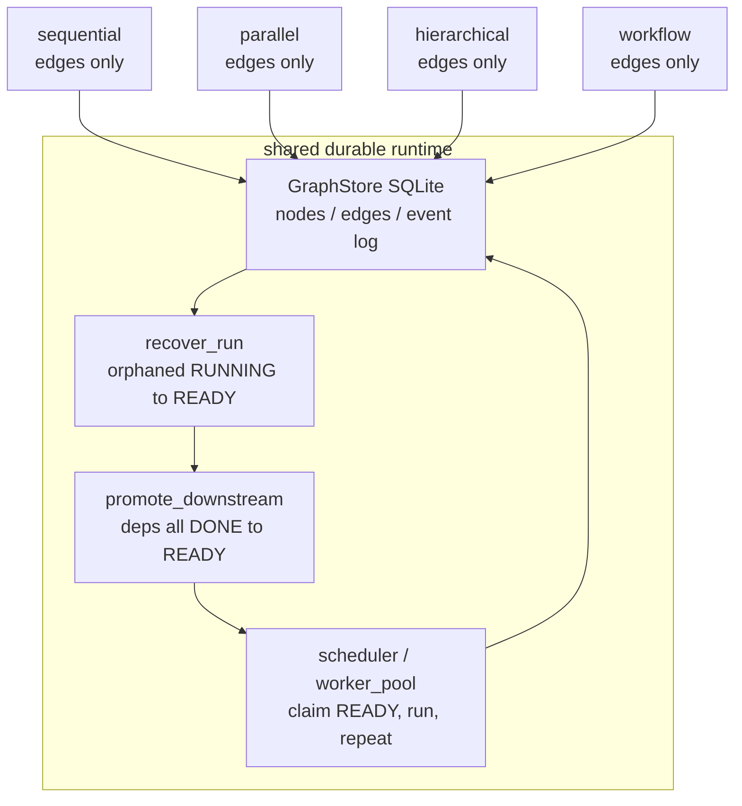

`★ Insight ─────────────────────────────────────`
- **Close wall-clocks are not a null result — the ordering and concurrency ARE the finding.** At 7B speed with tiny prompts, per-call latency swamps a 5-node critical path, so the absolute gaps are small; the correct sequential-slowest / parallel-fastest ordering and the 1/4/3/1 concurrency profile are what prove structure mattered. The honest framing (report the gap AND why it's small) is the senior signal.
- **Identical 195-token totals are the control that validates the experiment.** Constant tokens across all four shapes prove the bench isolated *structure*, not work volume — without that control, a wall-clock difference could just mean "this graph did more."
- **Recovery time measures finishing, not recovering.** `recover_run` is one UPDATE; the 1.227s is the residual sleeps of the un-run nodes. Separating "cost to recover" from "cost to finish" is what keeps the recovery number honest — and it's a property of the shared runtime layer, so it's measured once, not per topology.
`─────────────────────────────────────────────────`

### The durability proof — `tests/test_durability.py`

This is the test the whole lab exists to pass: a process dies mid-run and the run resumes with nothing lost and nothing done twice. It is offline and deterministic (tool nodes only), so it runs anywhere — `$PY -m pytest tests/test_durability.py -v`.

**Code:** (`tests/test_durability.py` — the ENTIRE file: docstring, the `sys.path` shim, `_chain_dag`, the child worker, the hard-kill recovery test, and the FileLock mutex test; verbatim)

```python
"""test_durability.py — the money test: prove a hard kill loses no work.

The whole lab exists to defend one invariant: a process can die mid-run and the
run resumes from the last persisted node with nothing lost and nothing done
twice. We exercise that with REAL process death — a child multiprocessing.Process
claims+runs nodes, gets `.terminate()`d (SIGTERM→ but we escalate to a hard kill
to simulate kill -9), then a FRESH GraphStore in the parent calls recover_run and
finishes the rest. Assertions:
  * every node ends DONE, run status 'done'
  * the event log (replay_run) shows each node 'done' exactly once → no double-work
  * orphaned RUNNING nodes were recovered (a 'recovered' event exists)

All deterministic + LLM-free (tool nodes sleep). A separate unit test proves two
FileLock holders are mutually exclusive.
"""
from __future__ import annotations

import multiprocessing as mp
import os
import sys
import tempfile
import time

import pytest

_HERE = os.path.dirname(os.path.abspath(__file__))
sys.path.insert(0, os.path.join(_HERE, "..", "src"))

from file_lock import FileLock, LockTimeout  # noqa: E402
from graph_store import DONE, GraphStore  # noqa: E402
from handlers import tool_handler  # noqa: E402


def _chain_dag(n: int = 5, sleep_s: float = 0.3) -> dict:
    """Linear chain of `n` tool nodes — deterministic, slow enough that we can
    reliably terminate the child mid-run."""
    nodes = {f"n{i}": {"type": "tool", "payload": {"sleep_s": sleep_s}}
             for i in range(1, n + 1)}
    edges = [[f"n{i}", f"n{i + 1}"] for i in range(1, n)]
    return {"nodes": nodes, "edges": edges}


def _child_worker(db: str, lock: str, run_id: str) -> None:
    """Run in a child process: claim+execute nodes one at a time, forever. The
    parent kills this mid-run. Uses its OWN GraphStore (separate connection),
    exactly as a separate process would."""
    store = GraphStore(db, lock_path=lock)
    worker_id = f"child-{os.getpid()}"
    while True:
        node = store.claim_ready_node(run_id, worker_id)
        if node is None:
            time.sleep(0.02)
            continue
        result = tool_handler(node)
        store.mark_done(run_id, node.name, result)


def test_hard_kill_recovers_and_completes_without_lost_or_double_work() -> None:
    tmp = tempfile.mkdtemp(prefix="durable_test_")
    db = os.path.join(tmp, "rt.db")
    lock = os.path.join(tmp, "rt.lock")

    store = GraphStore(db, lock_path=lock)
    graph_id = store.create_graph("kill-test", _chain_dag(n=5, sleep_s=0.3))
    run_id = store.start_run(graph_id, "test")

    # Start a child that drains the chain, then hard-kill it mid-run.
    ctx = mp.get_context("spawn")
    proc = ctx.Process(target=_child_worker, args=(db, lock, run_id))
    proc.start()

    # Wait until at least one node is DONE (child is partway), then kill -9.
    deadline = time.monotonic() + 10.0
    while time.monotonic() < deadline:
        done = [n for n, s in store.node_states(run_id).items() if s == DONE]
        if done:
            break
        time.sleep(0.02)
    assert done, "child made no progress before kill — test setup failed"

    # Hard kill: SIGKILL the child mid-node so a RUNNING row is orphaned. This is
    # the kill -9 scenario the runtime must survive.
    proc.kill()
    proc.join(timeout=5.0)
    assert not proc.is_alive()

    done_before = {n for n, s in store.node_states(run_id).items() if s == DONE}
    assert len(done_before) < 5, "child finished everything — increase node count/sleep"

    # FRESH GraphStore (simulates a restarted process). Recover orphans, finish.
    store2 = GraphStore(db, lock_path=lock)
    recovered = store2.recover_run(run_id)
    # An orphaned RUNNING node should have been reset to READY.
    assert recovered, "no orphaned RUNNING node was recovered after hard kill"

    # Drain the rest single-threaded in-process.
    worker_id = "recovery-worker"
    while True:
        node = store2.claim_ready_node(run_id, worker_id)
        if node is None:
            if store2.run_status(run_id) != "running":
                break
            continue
        store2.mark_done(run_id, node.name, tool_handler(node))

    # ── assertions ──
    states = store2.node_states(run_id)
    assert all(s == DONE for s in states.values()), f"not all DONE: {states}"
    assert store2.run_status(run_id) == "done"

    # No double-work: each node has exactly one 'done' event in the log.
    events = store2.replay_run(run_id)
    done_events = [e for e in events if e["type"] == "done"]
    done_names = [e["node"] for e in done_events]
    assert len(done_names) == 5, f"expected 5 done events, got {done_names}"
    assert len(set(done_names)) == 5, f"a node was done twice (double-work): {done_names}"

    # Recovery left a forensic trail.
    assert any(e["type"] == "recovered" for e in events), "no 'recovered' event logged"


def test_two_filelock_holders_are_mutually_exclusive() -> None:
    """Second acquire must time out while the first holder still owns the lock."""
    tmp = tempfile.mkdtemp(prefix="lock_test_")
    path = os.path.join(tmp, "mx.lock")

    a = FileLock(path)
    a.acquire()
    try:
        b = FileLock(path)
        with pytest.raises(LockTimeout):
            b.acquire(timeout=0.2, poll=0.01)
    finally:
        a.release()

    # Once released, a new holder can acquire immediately.
    c = FileLock(path)
    c.acquire(timeout=1.0)
    c.release()
```

**Walkthrough:**

**Block 1 — REAL process death, not a mocked one, is the only honest test of recovery.** The test spawns a child `multiprocessing.Process` (`spawn` context — a genuinely separate interpreter with its own `GraphStore` connection), lets it drain the chain until at least one node is `DONE`, then `proc.kill()` (SIGKILL) mid-node so a `RUNNING` row is orphaned exactly as a `kill -9` would. The `sys.path.insert(0, ".../src")` shim is what lets the test import the lab's modules by bare name — the same no-packaging convention the bench and example use.

**Block 2 — The assertions encode the invariant precisely: complete, once-each, with a trail.** After a fresh `GraphStore.recover_run` and a single-threaded drain, the test asserts (a) every node is `DONE` and the run is `done`; (b) the event log has exactly 5 `done` events with 5 distinct names — proving no node ran twice (no double-work) and none was lost; (c) a `recovered` event exists, so the orphan reset is auditable. `assert len(done_before) < 5` guards the setup itself: if the child finished everything before the kill, the test would be vacuous, so it fails loudly and tells you to slow the nodes down.

**Block 3 — The FileLock mutex test is the other half of the durability story.** While holder A owns the lock, a second `FileLock` on the same path must raise `LockTimeout` on `acquire(timeout=0.2)`; after A releases, a third holder acquires immediately. This is the cross-process exclusion that makes the claim safe — the property Phase 3 builds and Phase 2's `claim_lock` complements at the thread level.

**Result:** `$PY -m pytest tests/test_durability.py -v` → **`2 passed in 1.84s`** (offline; no oMLX needed). The kill-and-recover test and the FileLock mutex test both pass — the empirical proof of the durability invariant the chapter is built around.

`★ Insight ─────────────────────────────────────`
- **A durability claim that isn't tested with real `kill -9` is a hope, not a guarantee.** Mocking the crash would test the mock; spawning a real child and SIGKILLing it tests the actual fd-release + table-recovery path the production runtime depends on.
- **Counting `done` events is how you prove "exactly once".** Completeness alone (all nodes DONE) doesn't catch double-work; asserting 5 events with 5 distinct names catches both a lost node and a re-run node in one check.
- **The setup guard (`done_before < 5`) is as important as the assertions.** A test that can silently become vacuous is worse than no test; failing loud when the child outran the kill keeps the proof meaningful.
`─────────────────────────────────────────────────`

### The end-to-end demo — `examples/example_graph.py`

The smallest complete run: it wires every seam together once — topology builder → `create_graph` → `Scheduler.trigger_manually` (the external trigger) → `run_graph` (async workers) → `cost_report`. Live oMLX, so you see real token counts: `$PY examples/example_graph.py`.

**The whole process in one diagram — what drives execution, and how every script links.** Read it top-down. The **driver** (`example_graph.py main()`) is the entrypoint and calls *both* phases: phase ① `scheduler.trigger_manually` → `start_run` only writes node **state** to SQLite and returns; phase ② `asyncio.run(run_graph)` spawns the worker pool that drains that state — and only there, deep inside a worker's handler, is the LLM ever called. Every edge carries the verbatim call + `file:line`; dashed edges are *state handoffs / recovery*, not function calls.

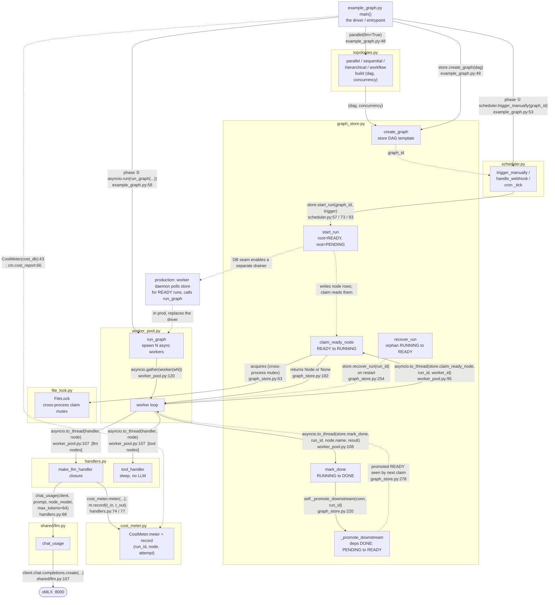

Reading the flow:

1. **Author + drive (example_graph.py:48 / 49 / 53 / 58).** `main()` builds the DAG from a **`topologies.py`** shape (`parallel(llm=True)` → `(dag, concurrency)`), stores the template (`create_graph`), fires the trigger (`trigger_manually` → `start_run`), then drives execution (`asyncio.run(run_graph)`). Trigger and drain are *separate calls* bridged only by the DB — in production the driver is replaced by a worker daemon polling the store for READY runs (the dashed `prod` edges).
2. **Trigger (scheduler.py:57 / 73 / 93).** All three triggers funnel into `start_run`; the `Scheduler` holds no run state and never knows LLM-vs-tool.
3. **Materialize (graph_store.start_run).** Writes node rows — root `READY`, rest `PENDING` — returns `run_id`. Nothing has executed; the "instructions" (model, prompt) ride in each node's `payload_json`.
4. **Drain (worker_pool.run_graph:120 → worker loop).** N workers loop: `claim_ready_node` (FileLock, `READY→RUNNING`, off-thread) → `handler(node)` → `mark_done` → `_promote_downstream` (`PENDING→READY`), which re-feeds the frontier.
5. **Execute (handlers.py:68 → shared/llm.py:107).** `make_llm_handler` reads `prompt`/`model` from `node.payload` and calls `chat_usage` → `client.chat.completions.create` → oMLX. A `tool_handler` node just sleeps — same worker, no LLM.
6. **Recover (graph_store.recover_run:254).** After a `kill -9`, a fresh process resets orphaned `RUNNING→READY` and the workers finish the rest — nothing lost, nothing done twice.
7. **Meter + lock (cost_meter.py via handlers.py:74/77; file_lock.py via graph_store.py:63).** Inside the LLM handler, `cost_meter.meter((run_id, node, attempt))` brackets the call and `m.record(t_in, t_out)` books real tokens — idempotent per `(node, attempt)`, so a retry never double-bills; the driver reads `cm.cost_report(run_id)` after (line 66). And `claim_ready_node` takes the cross-process `FileLock` (`graph_store.py:63`) so two processes never claim the same node — the mutex that makes a multi-process drainer safe.

`★ Insight ─────────────────────────────────────`
- **"Declare runnable" and "execute" are fully separated, with DB node-state as the handoff.** The driver fires `start_run` (sets states) and `run_graph` (reads states + acts) as two calls; nothing auto-bridges them but the DB. That seam is the root of durability — if the executor dies, the `READY`/`RUNNING` rows survive in SQLite and a fresh process's `recover_run` resumes. A trigger that synchronously called the LLM would lose everything on a crash.
- **The trigger layer never touches the LLM.** scheduler → `start_run` → return. Three tiers, each owning one segment: trigger (writes `READY`) → storage (state machine) → worker (executes). Calling the model is strictly the worker+handler's job — which is also why the production drainer can be a separate process.
- **Instructions are data, not code.** "Which model, what prompt" lives in `node.payload` (JSON in the DB), not hardcoded. The handler is a generic executor acting on the payload — so the same worker pool runs *any* graph; swapping graphs = swapping payload rows, zero code change.

`─────────────────────────────────────────────────`

**Code:** (`examples/example_graph.py` — the ENTIRE file: docstring, the `sys.path` shim, and `main` wiring all seams end-to-end; verbatim)

```python
"""example_graph.py — one durable run end-to-end, the smallest complete demo.

Run it:  /Users/yuxinliu/.openharness-venv/bin/python3 examples/example_graph.py

It wires every seam of the runtime together exactly once:
  topology builder → GraphStore.create_graph → Scheduler.trigger_manually
  (the EXTERNAL trigger) → worker_pool.run_graph (async workers) → cost report.

By default it runs the `parallel` topology with LIVE oMLX llm nodes so you see
real token counts. The point of the demo is to make the four-table durability
core observable: after the run, node_states shows every node DONE and the cost
report shows the cloud-equivalent spend the run WOULD have cost.
"""
from __future__ import annotations

import asyncio
import os
import sys
import tempfile

# src/ on path; this lab imports its own modules by bare name (no packaging).
_HERE = os.path.dirname(os.path.abspath(__file__))
sys.path.insert(0, os.path.join(_HERE, "..", "src"))

import openai  # noqa: E402

from cost_meter import CostMeter  # noqa: E402
from graph_store import GraphStore  # noqa: E402
from handlers import make_llm_handler  # noqa: E402
from scheduler import Scheduler  # noqa: E402
from topologies import BENCH_MODEL, parallel  # noqa: E402
from worker_pool import run_graph  # noqa: E402

OMLX_BASE = "http://localhost:8000/v1"


def main() -> None:
    tmp = tempfile.mkdtemp(prefix="durable_demo_")
    db = os.path.join(tmp, "runtime.db")
    cost_db = os.path.join(tmp, "cost.db")

    store = GraphStore(db)
    cm = CostMeter(cost_db)
    scheduler = Scheduler(store)
    client = openai.OpenAI(base_url=OMLX_BASE, api_key="EMPTY")

    # 1) author the DAG template (live llm nodes so usage is real)
    dag, concurrency = parallel(llm=True, model=BENCH_MODEL)
    graph_id = store.create_graph("demo-parallel", dag)
    print(f"created graph {graph_id}: {list(dag['nodes'])} (concurrency={concurrency})")

    # 2) fire it via an EXTERNAL trigger — the only way a run ever starts
    run_id = scheduler.trigger_manually(graph_id, {"by": "example"})
    print(f"triggered run {run_id} (trigger=manual)")

    # 3) drain it with async workers
    handler = make_llm_handler(client, BENCH_MODEL, cost_meter=cm)
    result = asyncio.run(run_graph(store, run_id, handler, concurrency, cost_meter=cm))

    # 4) observe durable state + cost
    print("\n── final node states ──")
    for name, status in sorted(store.node_states(run_id).items()):
        print(f"  {name:10s} {status}")
    print(f"\nrun status: {store.run_status(run_id)}")
    print("pool result:", result)
    print("cost report:", cm.cost_report(run_id))

    csv_path = os.path.join(tmp, "cost.csv")
    cm.export_csv(run_id, csv_path)
    print("cost csv:", csv_path)


if __name__ == "__main__":
    main()
```

**Walkthrough:**

**Block 1 — The demo's value is that it makes the four-table durability core observable in one screen.** It authors the `parallel` topology with live llm nodes, fires it through `Scheduler.trigger_manually` (the demo never starts a run any other way — the external-trigger discipline made concrete), drains it with `run_graph`, then prints `node_states` (every node `DONE`), `run_status` (`done`), the pool result (`peak_concurrency`), and `cost_report` (real tokens + cloud-equivalent USD). It is the shortest path from "I copied the files" to "I can see the runtime working."

**Block 2 — Every seam appears exactly once, in dependency order.** `GraphStore` + `CostMeter` (two SQLite files), then `Scheduler` over the store, then a raw `openai.OpenAI` pointed at oMLX, then builder → `create_graph` → trigger → `run_graph` → report → `export_csv`. A reader can map each printed line back to the module that produced it, which is why this is the right place to *end* the runbook: it is the integration test a human runs by eye.

**Result:** `$PY examples/example_graph.py` (live oMLX) prints the created graph and its 5 node names, the manual trigger's `run_id`, all five nodes `DONE`, `run status: done`, a `pool result` with `peak_concurrency: 4` (the parallel fan-out), a `cost report` with `tokens_total: 195` and a small `usd_cloud_equivalent`, and the path to the exported `cost.csv`. Requires oMLX serving `Qwen2.5-Coder-7B-Instruct-MLX-4bit` on `:8000`.

**Measured (2026-06-17, live oMLX).** Run `r_bc350dfff2be` (graph `g_b651c363be17`, trigger=manual): 5/5 nodes `DONE`, `run status: done`, `peak_concurrency: 4`, wall-clock **1.366 s**, tokens **185 in + 10 out = 195**, cloud-equivalent **$0.000188**. The per-node `cost.csv` (37 in + 2 out per node, `attempt 1`, no retries) carries the fan-out's **Amdahl signature**: wall-clock 1366 ms ≈ `n1` (649.7 ms — the serial root, runs alone) + the slowest leaf (`n5` 667.3 ms) = **1317 ms**, *not* the 2784.79 ms sum of all five node latencies — direct proof the four leaves (n2–n5) overlapped. Full run summary + per-node ledger in the lab's `RESULTS.md` (§ End-to-end demo).

`★ Insight ─────────────────────────────────────`
- **A runnable end-to-end example is the cheapest correctness signal a reader gets.** Before any test or bench, `example_graph.py` proves the copied files import, wire, and run — every seam exercised once, every result printed for eyeball verification.
- **Starting the run only through `trigger_manually` keeps the architecture honest even in the demo.** The example could have called `start_run` directly; routing through the scheduler is a deliberate reminder that runs are externally fired, never self-prompted.
`─────────────────────────────────────────────────`

#### How the demo runs 4-wide — fan-out concurrency, step by step

The demo authors `parallel(llm=True)` — a **fan-out** DAG: 1 root → 4 independent leaves. The edges are all `n1→leaf`; the leaves share no edge, so they have no dependency on each other and can run at once. `parallel()` returns `concurrency=4` precisely because 4 is this shape's maximum parallelism.

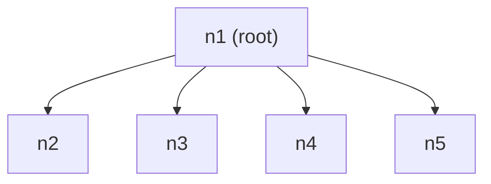

`edges = [[n1,n2],[n1,n3],[n1,n4],[n1,n5]]` — every edge is `n1 → leaf`; no edge *between* leaves = no dependency = runnable together.

**How 4 actually run at once — it emerges from the state machine, you never schedule it.** When `start_run` materializes the run it reverses the edges into per-node deps and sets initial status:

```text
deps   = {n1: [], n2: [n1], n3: [n1], n4: [n1], n5: [n1]}
status = n1 READY (0 deps);  n2..n5 PENDING (waiting on n1)
```

Execution timeline with `concurrency=4` (4 workers):

| t | what happens | READY set | concurrently running | peak |
|---|---|---|---|---|
| t0 | run materialized; 4 workers race `claim_ready_node`, but its cross-process FileLock + `ORDER BY name LIMIT 1` lets only **one** take `n1` — the other 3 poll | `{n1}` | n1 | 1 |
| t1 | `n1` finishes → `mark_done` → `_promote_downstream` flips **all** of n2..n5 `PENDING→READY` | `{n2,n3,n4,n5}` | — | — |
| t2 | now 4 READY nodes + 4 idle workers → each claims one → n2 n3 n4 n5 run together | `{}` | n2, n3, n4, n5 | **4** |
| t3 | all `DONE` | `{}` | — | — |

Parallelism happens because **multiple nodes are READY at once *and* there are enough workers** — not because anything schedules it. Three conditions must all hold (drop any one and 4-way collapses to serial):

| condition | where it lives | satisfied here? |
|---|---|---|
| leaves have no edges between them | the DAG (`topologies.parallel`) | ✅ n2..n5 unconnected → all READY the instant n1 is DONE |
| enough workers | `run_graph(store, run_id, handler, concurrency=4)` | ✅ the `4` `parallel()` returns is passed straight in |
| execution can overlap | `worker_pool` `asyncio.to_thread(handler, node)` | ✅ the sync handler is offloaded to a thread pool, so N handlers genuinely overlap |

`★ Insight ─────────────────────────────────────`
- **Parallelism = min(simultaneously-READY nodes, worker count).** This shape's ceiling is 4 — give it 8 workers and 4 idle (only 4 leaves); give it `concurrency=1` and it serializes to `peak=1` with ~the chain's wall-clock. `bench_four_topology.py` measures exactly this knob: how topology sets throughput.
- **`n1` is the Amdahl serial bottleneck.** No worker count helps it — `n1` must finish alone before any leaf is READY. Total ≈ `t(n1) + t(slowest leaf)`, **not** `t(n1) + 4×t(leaf)`. Fan-out's entire win is the overlapped-leaves segment.
- **Same 5 nodes, different topology, different throughput.** Arranged as a chain `n1→n2→n3→n4→n5`, `peak=1`, wall ≈ 5× a node; as this fan-out, `peak=4`, wall ≈ 2×. Identical node count and model — only the edges differ. That is the lab's headline ("topology changes throughput") made concrete.
`─────────────────────────────────────────────────`

---

## 5. Bad-Case Journal (IMPLEMENTED 2026-06-16)

**Entry 1 — One shared `FileLock` instance corrupts under the async worker pool: `flock` raises `TypeError: argument must be an int`.**
*Symptom:* `claim_ready_node` raised `TypeError: argument must be an int, or have a fileno() method` from inside `fcntl.flock`, but ONLY under the async worker pool — the single-threaded durability test ran the identical claim path with zero errors.
*Root cause:* `GraphStore` exposes ONE shared `FileLock` instance (`store.lock`) whose fd is single-use — `release()` sets `self._fd = None`. Two sibling worker threads (workers run the claim via `asyncio.to_thread`) entered that same `FileLock` context manager concurrently: worker A's `release()` nulled the fd, and worker B then called `flock(None)`, which is not an int.
*Fix:* Gate the claim with an in-process `asyncio.Lock` (`claim_lock`) in `run_graph`, so only one sibling thread is inside the shared instance at a time. The claim is already a serialization point by design (the store does `ORDER BY name LIMIT 1`), so gating it costs nothing. Cross-process safety still comes from the `FileLock`; the in-process lock only stops sibling threads in *this* process from entering the one shared instance. `mark_done`/`mark_failed` open their own connections and never touch the shared lock, so they stay fully concurrent.

This is the only failure actually observed during the lab run (the bench ran zero retries and a single in-thread scheduler, so the retry-, cost-, and scheduler-related failure modes never fired). The additional failure modes this runtime is *designed against* — split status/event writes, a non-durable retry counter, cost-meter double-counting, and multi-scheduler cron drift — live in `ANTI-PATTERNS.md` as anticipated patterns; each graduates to §5 only if/when it is actually observed (e.g. via a future fault-injection run).

---

## 6. Interview Soundbites (IMPLEMENTED 2026-06-16)

**(a) "How does your agent runtime survive a process restart?"**

My execution state lives in four SQLite tables, not in Python locals, so a `kill -9` can't vaporize a run. I proved it: my durability test SIGKILLs a child worker mid-run, then a fresh `GraphStore` calls `recover_run`, which resets the one orphaned RUNNING node back to READY. The run finishes with all five nodes DONE and the event log shows exactly five distinct `done` events plus a `recovered` event — zero lost work, zero double work. Recovery is a single table UPDATE, not a replay.

**(b) "When would you pick parallel versus sequential topology, and can you prove it matters?"**

I can prove topology sets throughput at node granularity, not just assert it. Four topologies, identical 5-node DAGs, one 7B model, token count pinned at 195 — so structure is the only variable. The per-node ledger is the proof: in the parallel fan-out, total wall-clock (1.37s) ≈ the serial root (650ms) plus the *slowest* leaf (667ms), not the 2.78s sum of all five — the four leaves provably overlapped, peak concurrency 4. Sequential serializes to peak 1. Pick parallel for independent fan-out; sequential when order is the requirement.

**(c) "What's a real concurrency bug you hit building it?"**

My worker pool crashed with `TypeError: argument must be an int` from `fcntl.flock` — but only under async, never single-threaded. Root cause: my `GraphStore` exposed one shared `FileLock` whose fd is single-use, and two sibling worker threads entered it concurrently — one's `release()` nulled the fd, the other called `flock(None)`. The fix was an in-process `asyncio.Lock` gating the claim. The subtle part: that lock only stops sibling threads in one process; cross-process safety still comes from the file lock. Two locks, two different races.

---

## 7. References

Full formal citations for the works cited in §2 + the canonical production implementations the lab draws from. Per vault conventions: peer-reviewed papers + canonical docs + production blog posts + reference repositories.

### Papers + canonical writing

- **Vogels, Werner (2007).** *Eventually Consistent.* Communications of the ACM, Vol. 52 No. 1, pp. 40-44. https://doi.org/10.1145/1435417.1435432. The foundational paper on durable distributed state; durable-runtime read-side semantics inherit from this work. Worth knowing as the ancestor reference even though LLM-agent runtimes are far less concerned with multi-datacenter replication than cloud DBs.
- **Fowler, Martin.** *Event Sourcing.* martinfowler.com (no fixed publication date; canonical version). https://martinfowler.com/eaaDev/EventSourcing.html. The canonical pattern reference for append-only execution logs. Every durable-workflow engine reachable in this chapter (Temporal, Cadence, AutoGPT Platform) is an instance of this pattern applied to a different domain.
- **Uber Engineering (2017).** *Cadence Workflow.* GitHub repo + whitepaper. https://github.com/uber/cadence. Production durable-workflow precedent at scale (Uber's internal usage); the architecture Temporal.io forks from. Reading the whitepaper gives the production-grade view of what AutoGPT Platform's executor is a stripped-down version of.
- **Significant-Gravitas (2024).** *AutoGPT v1 → AutoGPT Platform postmortem (commits + architecture-doc diff).* https://github.com/Significant-Gravitas/AutoGPT. The canonical real-world failure-mode source for LLM agent runtimes. The diff between `master` (classic AutoGPT) and the `autogpt_platform/` rewrite IS the postmortem; reading the executor module shows what was missing.

### Production blog posts + engineering writing

- **Temporal.io Engineering Blog.** *Why Workflow Engines.* https://temporal.io/blog. Articulates the durable-execution thesis (decouple log from workers) in the form that ports cleanly to LLM agent runtimes. The single most useful read for "why does my agent need a durable runtime?" — non-Temporal-specific despite the venue.
- **Husain, Hamel (2024-2025).** *Workflow Engines vs Agent Loops.* https://hamel.dev (canonical post or equivalent industry write-up). Names the distinction this chapter operationalizes — agent-loop literature treats durable-workflow as "engineering minutiae"; production deployment shows it's load-bearing.

### Canonical reference implementations

- **AutoGPT Platform** — https://github.com/Significant-Gravitas/AutoGPT — files: `autogpt_platform/backend/backend/executor/{manager.py, scheduler.py, cluster_lock.py, cost_tracking.py, simulator.py}`. Canonical reference impl of the 5-component runtime taught in this chapter (graph store + worker pool + lock + cost meter + trigger-based scheduler). The ~250 LOC W4.6 lab is a stripped-down version of these modules.
- **Abilityai/trinity** — https://github.com/Abilityai/trinity — Apache-2.0, Python (76%) + Vue. A self-hostable production agent platform and the **third independent convergence** on the five durable-runtime primitives (after AutoGPT Platform + PraisonAI), reached from the opposite direction — "turn a Claude-Code assistant into a 24/7 autonomous employee." Maps primitive-for-primitive: SQLite-backed async backlog that survives restart (graph store + queue), cron scheduler service + Redis distributed locks (scheduler + lock), execution retry/timeout + `max_turns` runaway prevention (retry counter + cost ceiling), hierarchical + parallel orchestrator-worker (topologies). Its channel adapters (Slack per-channel agent binding, Telegram, WhatsApp-via-Twilio) implement the **Gateway-routing** trigger from §2.5. Apache-2.0 means the patterns are portable with attribution — but it is far too heavy (Docker-per-agent + Redis + web UI) to fork for a 250-LOC local-first lab; cite it as the production-shape reference, build the minimal version yourself.
- **PraisonAI** — https://github.com/MervinPraison/PraisonAI — `src/praisonai-agents/praisonaiagents/process/process.py` (key lines: ~582 sequential mode, ~1309 parallel mode, ~1446 hierarchical / workflow modes). Canonical four-topology implementation in framework form; the basis for §4 Phase 5's four-topology bench.
- **`rohitg00/agentmemory`** — https://github.com/rohitg00/agentmemory — alternative durable-runtime reference built on **iii-engine** (3-primitive Worker / Function / Trigger model + WebSocket daemon on `:49134` + file-based SQLite via `StateModule`). Same "execution state separate from LLM loop" thesis but lighter-weight than Temporal.io: single-host, embedded SQLite, no separate workflow cluster. Memory ops registered as functions; HTTP endpoints registered as triggers; state daemon as a separate process. Production reference for the lightweight end of the durable-runtime spectrum.
- **Cadence Workflow (Uber)** — https://github.com/uber/cadence. Production-scale precedent; useful when explaining "what does this scale to?" in interviews. Most LLM-agent capstones never reach this scale, but knowing the precedent grounds the architecture story.
- **`kunchenguid/gnhf`** — https://github.com/kunchenguid/gnhf — ralph/autoresearch-style overnight orchestrator. Single-host, single-binary, agent-agnostic (Claude Code / Codex / Rovo Dev / OpenCode / Copilot CLI / Pi / ACP adapters in `src/core/agents/`). Key durability primitive: per-iteration git commit on success, rollback (`git reset --hard`) on failure, with commit failures preserved separately as `pendingCommitFailure` carve-out (commit fails ≠ iteration fails). Production-quality `src/core/` modules with paired `*.test.ts`: `orchestrator.ts` (843 LOC; the main state machine), `git.ts` (shell-injection-safe wrapper via `execFileSync(argv)` + `GIT_TERMINAL_PROMPT=0`), `interrupt-state.ts` (33 LOC pure-function state machine), `exit-summary.ts` (structured ASCII card with ANSI fallback), `commit-message.ts`, `telemetry.ts`, `sleep.ts` (OS-sleep prevention via `caffeinate`/`systemd-inhibit`). The lightest-weight end of the durable-runtime spectrum — when the workload is "let an agent iterate overnight against a git repo," gnhf is the right shape; when the workload needs cross-host execution, see AutoGPT Platform or Cadence above. **W4.6 lab-side primitives** in `agent-prep/shared/agent_loop_tools/` port `interrupt_state.py` + `token_accounting.py` from gnhf for cross-lab reuse with full source attribution; MIT-compatible.

---

## 8. Cross-References

- **Builds on:** [[Week 4 - ReAct From Scratch]] (oMLX :8000 model-routed fleet, ReAct loop — the thing we are now putting under a durable runtime); [[Week 4.5 - Model Routing and Effort Tiering]] (per-call routing; this chapter's cost meter is what makes routing wins measurable).
- **Distinguish from:** state machine vs agent loop (a state machine is a degenerate workflow with one path; an agent loop is the LLM control flow inside a node, not the runtime around it); durable workflow vs cascade (durable workflow persists a DAG; cascade chains attempts at the same node — different abstractions); agent framework vs runtime (LangGraph / CrewAI are frameworks; durability is an orthogonal property); topology vs runtime ([[Week 3.5.5.5 - Multi-Agent Topology Patterns]] — W3.5.5.5 is the communication-topology axis, which agents talk to whom; this chapter is the execution-trigger + durability axis, how a run persists and recovers — orthogonal concerns).
- **Connects to:** [[Week 11.5 - Agent Security]] (trigger surface is the auth boundary — webhook trigger is an unauthenticated entry point until you secure it; cron triggers run as the system identity); [[Week 6.65 - MCP Production Transports]] (W6.65's Streamable HTTP session-id + last-event-id are the durability primitive at the transport layer; this chapter's per-iteration commit is the same durability shape at the runtime layer — different scale); [[Week 12 - Capstone]] (the capstone agent runs on this runtime, not a one-shot script).
- **Foreshadows:** production deployment topology (multi-host worker pool, Redis-backed lock, cron-leader election); cost-attribution dashboards; multi-tenant agent platforms.

- **Cited by:** chapters that reference this chapter as a prerequisite or build-on; reverse links per Pattern 21 (Bidirectional Cross-Reference Invariant):
  - **W11.5**: Agent Security — the PreToolUse hook integration wires security guards into W4.6's durable runtime tool dispatcher
  - **W6.5**: Hermes — Hermes's two-primitive split (`delegate_task` + Kanban) is one canonical implementation of W4.6's trigger × topology design space

---

## Resolved design decisions (locked 2026-05-14)

1. **Scope:** ✅ 5 phases / 6 hours / 200–300 LOC hard cap. Redis + multi-host deferred to W11.5 / W12.
2. **Lock primitive:** ✅ `fcntl.flock` (POSIX). One-line note re: macOS-target assumption + SQLite `BEGIN EXCLUSIVE` as cross-platform alternative.
3. **Topology coverage:** ✅ implement all 4 PraisonAI modes (each ~30–50 LOC once runtime exists); benchmark is the empirical anchor.
4. **Scheduler scope:** ✅ cron + webhook + manual trigger. Event triggers (file-watcher, MQ) deferred to W11.5 / W12.
5. **Cost meter:** ✅ hardcode public per-token rates (Claude Sonnet 4.6 / Haiku 4.5 / Opus 4.5) as cloud-equivalent baseline. Readers override for their stack.

---

*Spec drafted from cross-repo convergence research (AutoGPT classic→Platform postmortem + PraisonAI `process.py` four-mode topology + Trigger-based scheduling rebuke of self-prompting loops). Convergence finding: AutoGPT Platform converges on graph-store + worker-pool + cluster-lock + cost-tracking + trigger-scheduler as the five load-bearing primitives a durable agent runtime requires; PraisonAI independently converges on four process topologies as the right first-class API on top of such a runtime. This chapter teaches the minimal version of both — explicitly NOT a re-implementation of AutoGPT Platform, but the 200–300 LOC kernel that demonstrates each primitive.*
