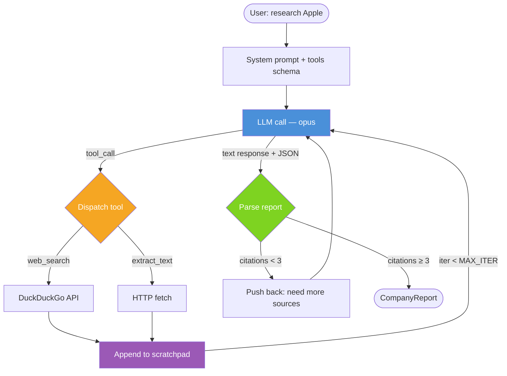
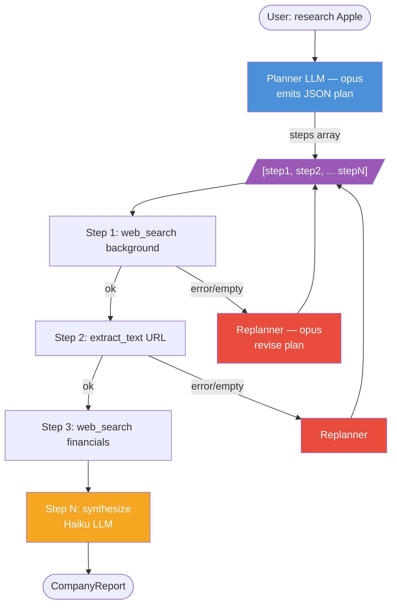
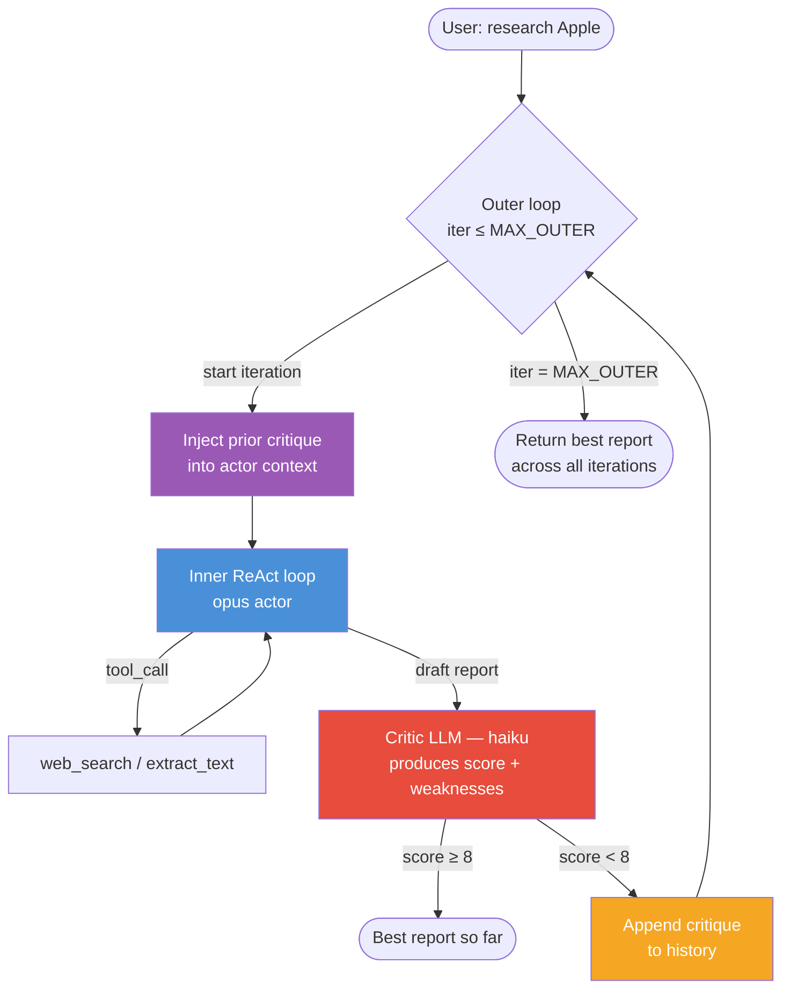
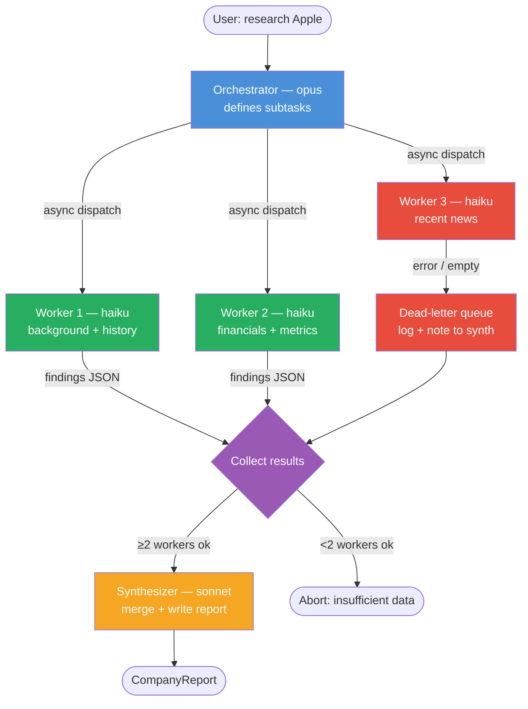
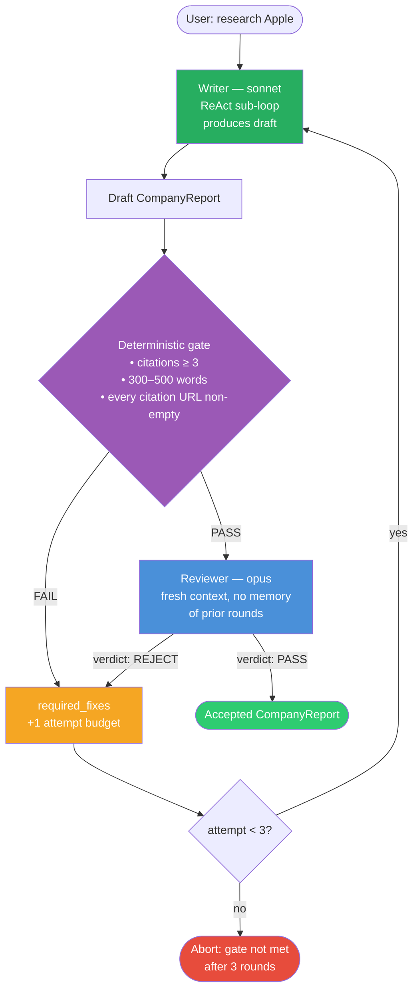
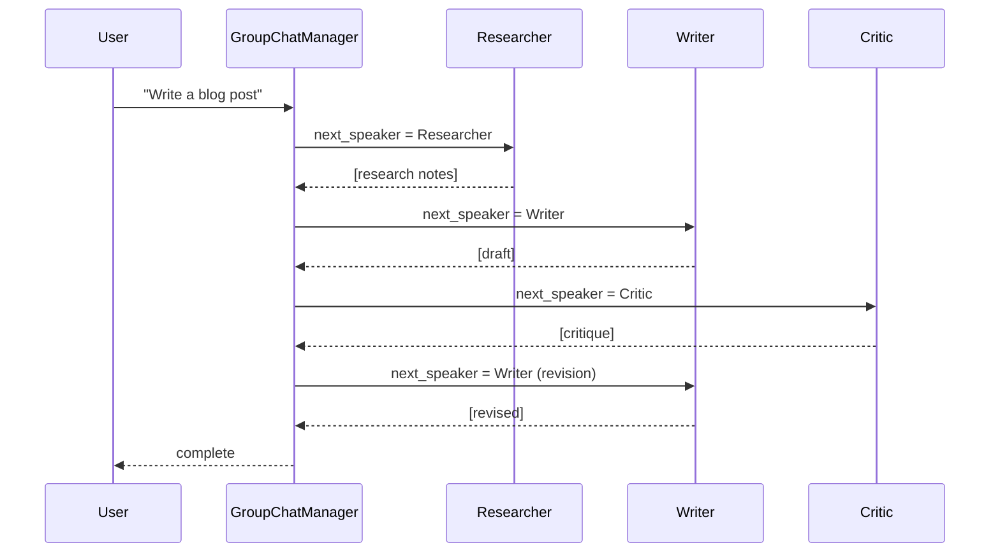
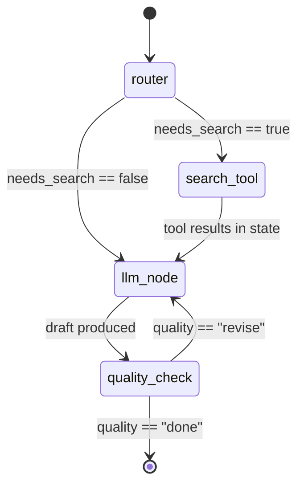
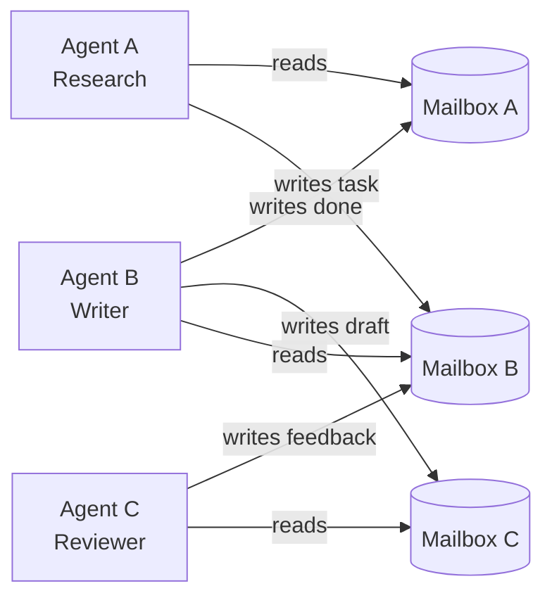

# Week 5 — The Pattern Zoo

> Goal: implement the same task five different ways, measure all five, and walk out of this week with a data-backed opinion about when each pattern earns its complexity.

The research question is simple: "Research a company and produce a 1-page summary with at least 3 citations." One task. Five architectures. One comparison harness that runs all five on the same 10 companies and scores them on success rate, token cost, wall time, and output quality.

By the end of the week you should be able to answer "how do you choose an agent architecture?" with your own numbers, not buzzwords.

---

## Exit Criteria

- [ ] `src/impl_react.py` running end-to-end on all 10 companies, results in `results/react/`
- [ ] `src/impl_plan_solve.py` with planner, executor, and replanner classes, results in `results/plan_solve/`
- [ ] `src/impl_reflexion.py` with a critic LLM wired in, results in `results/reflexion/`
- [ ] `src/impl_orchestrator.py` with 3 parallel workers, results in `results/orchestrator/`
- [ ] `src/impl_adversarial.py` with writer (sonnet) + reviewer (opus) fix-until-pass gate, results in `results/adversarial/`
- [ ] `src/05_compare.py` producing a 5×4 comparison matrix in `results/comparison.json`
- [ ] `RESULTS.md` filled with real numbers, pattern analysis, and a "which pattern won and why"
- [ ] You can answer out loud: "When does Reflexion make an agent *worse*?" with a concrete mechanism
- [ ] You can articulate why the writer–reviewer adversarial loop is **not** Reflexion — three structural differences (role specialisation, binary verdict + deterministic gate, independent reviewer context)

---

> **Pre-read recommendation (~60 min).** Before starting Phase 1, work through Gulli's *Agentic Design Patterns* Ch 4 (Reflection), Ch 6 (Planning), and Ch 7 (Multi-Agent). Each has a runnable Jupyter notebook in the repo (`chapter_notebooks/`) that implements a minimal version of the pattern you're about to build. Running those notebooks first anchors the design decisions you'll make in this lab and saves 2+ hours of design thrashing.

## Theory Primer — Five Concepts You Must Be Able to Explain

> Read this before touching any code. These five ideas are what interviewers probe once the pattern names stop impressing them. They want the failure modes, the trade-offs, the mental model — not the acronyms.

---

### Concept 1 — When to Choose Which Pattern (Decision Tree)

The first interview trap is pattern name-dropping without a decision criterion. The correct answer always begins: *"It depends on what the task's structure looks like."*

| Task property | Pattern | Why |
|---|---|---|
| Linear sequence where each step depends on the previous output | **ReAct** | Minimal overhead; scratchpad accumulates exactly what is needed |
| Long-horizon goal requiring upfront global decomposition | **Plan-and-Solve** | Wang et al. (2023): pure ReAct loses coherence when the scratchpad fills with local context and the global plan dissolves — externalise the plan into a DAG first |
| Output quality is the bottleneck and the quality criterion is articulable | **Reflexion / Self-Refine** | Shinn et al. (2023) / Madaan et al. (2023): iterate with a critic when the first draft is improvable by critique |
| Subtasks are genuinely independent and can run in parallel | **Orchestrator-Worker** | Anthropic "Building effective agents": fan out to workers, fan in to a synthesiser |
| Output must satisfy a **machine-checkable acceptance test** and cannot ship until it does | **Writer–Reviewer Adversarial** | Two agents with opposing objectives — writer produces, reviewer gates. A deterministic pre-check plus an independent reviewer context prevents the self-anchoring that plagues Reflexion. |
| The problem naturally decomposes into **specialists reporting to a lead** (e.g. triage → domain expert → synthesiser) | **Hierarchical Multi-Agent** | A lead agent owns the goal; specialists own sub-goals scoped to their tools and context. The lead never touches specialist tools directly — it delegates and synthesises. This is orchestrator-worker with *typed* workers whose boundaries are part of the design, not emergent. See Week 11 System #2 for a worked example. |
| Solution space is deeply branching and exhaustive search is justified | **Tree-of-Thoughts** *(skim only; rarely in prod)* | Yao et al. (2023): best-first search over thought nodes — expensive, hard to parallelise safely |

**The rule of thumb:** every additional layer of architecture must be justified by a property the task actually has. If your task is linear, ReAct is not a simplification — it is the correct choice. Adding a critic loop when the output is already 85% correct is waste, not sophistication. Adding a planner when there are only two sequential steps is ceremony, not engineering.

> **Interview soundbite:** "I match the pattern to the task's structural properties. Linear dependencies → ReAct. Long-horizon decomposition → Plan-and-Solve. Quality iteration with an articulable critic → Reflexion. Independent parallelism → Orchestrator-Worker. Output that must satisfy a hard acceptance test → Writer-Reviewer Adversarial, because role specialisation and a deterministic pre-gate avoid the anchoring loop that Reflexion falls into. Anything beyond that needs a concrete justification grounded in what the task actually requires."

<details>
<summary>Optional deep dive — Self-Refine vs. Reflexion</summary>

Self-Refine (Madaan et al. 2023) keeps everything in one model: generate, critique your own output, refine — no episodic memory, no separate critic. Cheaper, and often sufficient when the quality criterion is about style or structure. Reflexion (Shinn et al. 2023) maintains an episodic store of past critique summaries that are injected into future attempts, making it better suited for tasks that benefit from accumulating learning across trials — e.g., code debugging across successive test-run failures. For single-shot quality improvement, start with Self-Refine.

</details>

---

### Concept 2 — Reflexion's Failure Mode: Amplifying Confident Errors

Reflexion's promise is appealing: run a critic, inject the critique, iterate toward a better answer. The failure mode is less discussed but more important for production readiness.

The critic has no independent ground truth. It evaluates the actor's output using the same base training distribution. If the actor makes a confident factual error in iteration 1 — misidentifies a company's founding year, hallucinates a citation — the critic is likely to treat that claim as plausible and focus its critique on surface qualities: citation formatting, hedging language, section completeness. The actor re-runs, producing a more polished version of the same wrong answer. By iteration 3 the error is entrenched: every revision has built on it, the history context reinforces the frame, and no pass has broken out of it.

This is the **anchoring amplification problem**. Shinn et al. (2023) acknowledge it directly in the Reflexion limitations section: the agent may fail to recover from early mistakes when the reflection model shares similar biases to the actor. In practice it surfaces as confident, well-cited, well-structured reports that are factually wrong in one key dimension — which is worse than a visibly uncertain wrong answer.

**When NOT to use Reflexion:**

1. First-attempt quality is already ~60%+ on your target metric — marginal gain from iteration rarely justifies the token cost and latency.
2. Actor and critic share the same model family and therefore the same training biases. A Haiku critic evaluating an Opus actor gives you more independent signal than an Opus critic evaluating an Opus actor.
3. The task requires external ground truth (financial data, legal facts, test execution results) that the critic cannot actually verify — it will score plausibility, not correctness.

> **Interview soundbite:** "Reflexion fails when the critic shares the actor's training biases — the loop reinforces the frame instead of breaking it. I'd use it only when the quality criterion is articulable, the critic can evaluate it without needing external ground truth, and the first-attempt score is low enough to justify the iteration cost."

---

### Concept 3 — Multi-Agent = Distributed Compute

The mental model that clears up most multi-agent confusion: **you have already built this, just without language models in the execution layer.**

| Multi-agent concept | Cloud infra analogue |
|---|---|
| Orchestrator | Kubernetes controller / Argo Workflow scheduler |
| Worker agents | Pods / Spark executors |
| Task assignments + result messages | SQS queue / Kafka topic |
| Failed worker output with nowhere to go | Dead-letter queue (DLQ) |
| Worker retry with backoff | K8s failed-job restart policy |
| Orchestrator abort signal | `SIGTERM` propagated to pod |

The orchestrator is a **scheduler**, not a reasoner. Its job is to construct a task graph, dispatch subtasks, collect results, and decide whether to proceed, retry, or abort — exactly what an Argo Workflow controller does on node failure. Gerred's *Amping Up* (Part IV) makes the distributed-compute mapping explicit: observable-based state management scales in multi-agent systems for the same reason you instrument Kafka consumer lag rather than polling a database — state transitions become traceable events.

Harness Engineering Book 1 §7.1 states it directly: *"多代理走到一定程度，问题就不再是'会不会做'，而是'怎么分工'"* — once a multi-agent system reaches scale, the problem is no longer capability, it is division of labor. At that point the engineering questions are: who owns which state, how do you detect a stuck worker, what is the retry policy, and — critically — who synthesises the collected results.

> **Interview soundbite:** "A multi-agent system is a distributed compute pipeline where the executors happen to be language models. Orchestrator = Kubernetes controller. Workers = pods. Communication = message bus. Failed workers = DLQ. Synthesis = reduce phase. I reason about it in infra terms because that is where the failure modes live."

> **Concrete application — Agentic RAG.** The most production-deployed specialization of the orchestrator-worker pattern in 2026 is the canonical 5-node Agentic RAG graph (decide → retrieve → grade → rewrite → answer). It applies the orchestrator-worker decomposition specifically to retrieval pipelines, with the orchestrator deciding *when* to retrieve and *whether retrieval succeeded*, and the worker executing the retrieve+rerank stack. See [[Week 3.7 - Agentic RAG]] for the dedicated hands-on lab including the 7-architecture taxonomy from Singh et al. 2025, CRAG/Adaptive-RAG/GeAR canonical papers, and a comparison harness vs Week 3's single-pass baseline.

---

### Concept 4 — Forked Agents Must Be Cache-Safe

This is the operational detail that separates someone who has read about multi-agent from someone who has run it in production.

When you fork a child agent from a parent, the child issues its own API calls. If those calls do not share the parent's cache-critical parameters — system prompt, user context, tool schema — you get a **cache miss on every child call**. With dozens of parallel workers, this is not a latency footnote; it is a cost multiplier that makes the fan-out architecture more expensive than sequential execution.

Harness Engineering Book 1 §7.2 names the first-principle explicitly: the forked agent's job is to preserve `CacheSafeParams` — `systemPrompt`, `userContext`, `systemContext`, `toolUseContext`, `forkContextMessages` — from the parent request. A seemingly trivial change, like bumping `maxOutputTokens` to give a worker more room, invalidates the cache if `thinkingConfig` is derived from it.

The second principle, from §7.3, is **state isolation by default**. A child agent clones read state, creates its own `AbortController`, and treats parent state mutations as a no-op unless the caller explicitly opts in. The reasoning: a child's local reasoning errors, temporary file reads, and intermediate tool decisions should not leak into the parent's context. Sharing is an explicit opt-in, not the default.

The practical consequence: dirty shared state between parallel agents produces **nondeterministic bugs that are nearly impossible to reproduce** — the same failure class as a race condition in concurrent code, except the execution trace is a model's context window rather than a thread's heap. You cannot attach a debugger. Your only defense is isolation-by-default at fork time.

> **Interview soundbite:** "Forked child agents must share cache-critical parameters with the parent — otherwise parallel fan-out costs more than sequential. State is isolated by default; sharing is an explicit opt-in. Dirty shared state in parallel agents produces nondeterministic bugs you can't reproduce."

<details>
<summary>Optional deep dive — what breaks the cache key</summary>

A prompt cache hit requires an exact prefix match on: system prompt + prefilled context messages + tool schema definitions. Changing `maxOutputTokens` can invalidate the cache if the provider includes inference config in the key (Anthropic does for thinking config). This means a parameter bump that looks trivial silently breaks the entire caching strategy for every worker in the fan-out.

</details>

---

### Concept 5 — Verification Is a Separate Stage

The most common way a multi-agent system fails silently: verification is treated as the last step of the implementation worker's job. The worker finishes the task, runs a quick sanity check, marks it done, and the orchestrator collates the results. No independent verification has happened — only the worker's self-report.

Harness Engineering Book 1 §7.5 names this trap precisely: *"验证必须独立成阶段，否则'实现完成'很快就会冒充'问题解决'"* — verification must be a separate stage, or "implementation complete" will pose as "problem solved." The implication is structural: verification must be assigned to an agent whose only job is to be skeptical of the implementation worker's output — running tests with the feature enabled, investigating errors rather than dismissing them, and producing a verdict independent of the worker's self-report.

The orchestrator cannot outsource synthesis either. Harness §7.4 establishes that synthesis is the scarce capability in multi-agent pipelines: every worker returns local knowledge; compressing that into a coherent, verified next step requires the orchestrator to actually read and understand the outputs, not forward them. If the orchestrator rubber-stamps worker results, the system degrades into polite task-forwarding — every agent is busy, nothing is actually understood.

The infra analogy is direct: you would not let the service that writes to a database also certify the write succeeded. Read-your-writes consistency is confirmation the write API returned 200, not verification. An independent read path with its own consistency guarantees is what verification means. Multi-agent systems need the same separation.

> **Interview soundbite:** "Verification must be a structurally separate stage — assigned to an agent whose only job is skepticism toward the implementation worker's output. If the same agent implements and verifies, you get self-certification. The orchestrator is still responsible for synthesis; multi-agent distributes execution, not judgment."

<details>
<summary>Optional deep dive — what independent verification actually checks</summary>

Verification is not "does the file exist" or "does the agent claim it worked." The verification agent must run tests with the new feature enabled (not just the pre-existing suite), investigate any errors rather than classifying them as pre-existing, and produce a verdict grounded in evidence, not in the implementation worker's confidence level. The criterion: *prove it works*, not *confirm it was written*.

</details>

---

### Concept 6 — When single-agent beats multi-agent (Stanford 2025)

The default assumption in 2024–early 2025 was *more agents = more quality*. Stanford's NLP group (Cohen et al., late 2025) ran the controlled head-to-head: a well-prompted single agent with strong tool use against multi-agent crew variants on the same task batteries (research, code-gen, multi-step reasoning). On most benchmarks the single-agent baseline matched or beat the multi-agent variants while consuming **5–10× less compute** and being dramatically easier to debug. The multi-agent quality lift, when it appeared, was within noise on smaller models and only exceeded noise on the strongest models — and even there only for genuinely parallelizable workloads (orchestrator-worker fan-out, not arbitrary role-play crews).

The implication is *not* "never use multi-agent." It's "don't reach for it as the default." Multi-agent earns its tax on three conditions: (a) the workload is genuinely parallelizable (independent sub-tasks, not sequential reasoning); (b) the model tier is strong enough that orchestration overhead is amortized by quality lift; (c) you can pay 5–10× compute for the marginal gain. CrewAI demos look impressive because they cherry-pick (a) and (b); your production workload usually fails at least one. Single-agent + good prompt + good tools is the boring, correct default.

> **Interview soundbite:** "The Stanford 2025 result is that single-agent matches or beats multi-agent on most benchmarks at 5–10× less compute. So I default to single-agent and graduate to multi-agent only when the workload is genuinely parallelizable — not because it sounds more sophisticated. The orchestrator-worker pattern is the exception that earns its complexity; arbitrary role-play crews usually don't."

---

### Concept 7 — Anthropic's three-agent harness (research / synthesize / critique)

Anthropic's published research-agent pattern is the multi-agent shape most worth knowing because it's the most *constrained*. Three fixed roles, fixed data flow:

1. **Orchestrator** decomposes the user query into N parallel research sub-questions (typical N = 3–5).
2. **N research workers** run in parallel, each focused on one sub-question, each with its own tool budget and isolated context. They return structured findings.
3. **Synthesizer** aggregates the N worker outputs into a coherent draft answer.
4. **Critic** reviews the draft against the original query — checks coverage, contradictions, grounding — and either approves or sends specific revision instructions back to the synthesizer.

This is the shape that earns multi-agent's tax by satisfying Stanford's three conditions: genuinely parallelizable (each worker is independent), strong-model tier (orchestrator and critic typically opus-tier), and quality lift comes from the critic stage catching what a single agent would miss. The roles are *fixed*, not learned or negotiated — that's why it's debuggable. CrewAI-style "agents argue until consensus" patterns are the opposite: emergent role definition, no fixed data flow, very hard to reason about.

> **Interview soundbite:** "Anthropic's three-agent harness — research, synthesize, critique — is the multi-agent pattern most worth knowing because it's constrained enough to debug. Roles are fixed, the data flow is explicit, the critic stage is what earns the multi-agent tax over a single agent. It maps directly to the Stanford finding: multi-agent helps when the workload is genuinely parallelizable; this pattern is constructed to make sure that condition holds."

---

### Companion Texts — Gulli Cross-References

- **[Gulli *Agentic Design Patterns* Ch 4 — Reflection]** + **[Ch 6 — Planning]** + **[Ch 7 — Multi-Agent]** ★ — these three chapters map DIRECTLY onto this week's four implementations. Each has a runnable Jupyter notebook in the repo. **Recommended pre-read before the lab.** ~60 min total
- **[Gulli *Agentic Design Patterns* Ch 2 — Routing]** + **[Ch 3 — Parallelization]** — named patterns for routing and worker parallelization. ~30 min
- **[Gulli *Agentic Design Patterns* Ch 15 — Inter-Agent Communication (A2A)]** — a pattern the curriculum doesn't cover but increasingly interview-relevant. ~20 min

## Pattern Diagrams — Visual Showcase

> **What this means:** These four diagrams are the centerpiece of this week. Before writing a single line of code, be able to trace a request through each diagram and explain where control flow diverges. If you can do that, the implementations will feel like filling in details you already understand.

### Pattern A — ReAct (Linear Interleaved Loop)



> **Analogy (Infra):** A single-threaded streaming pipeline. Each stage depends on the previous output. No parallelism. The scratchpad is your in-memory state that accumulates across iterations — like a running `GROUP BY` that grows with each row.

---

### Pattern B — Plan-and-Solve (DAG Scheduler)



> **Analogy (Infra):** An Argo Workflow. The planner writes the DAG definition (task nodes + ordering). The executor runs each node. The replanner is your `on_failure_callback` — it rewrites the remaining DAG when a node fails. Plan is written once upfront; execution is deterministic.

---

### Pattern C — Reflexion (Quality Loop with Critic)



> **Analogy (Infra):** A pipeline with a downstream quality gate that writes rejection reasons back to the source. Like a Terraform test that, on failure, appends a failure note to the model's input table and re-triggers the model run. The critic is the test. The critique history is the enriched input. The risk: if your test is wrong, re-runs produce worse output.

---

### Pattern D — Orchestrator-Worker (Fan-out / Fan-in)



> **Analogy (Infra):** A Spark fan-out job. The orchestrator defines the partitioning strategy. Three workers execute their partitions concurrently. The dead-letter queue holds failed partitions — the job proceeds with available data and notes the gap. The synthesizer is the final reduce step.

---

### Pattern E — Writer–Reviewer Adversarial (Fix-Until-Pass Gate)



> **Analogy (Infra):** A CI pipeline with a pre-commit hook AND a code reviewer. The deterministic gate is `pytest + ruff` — fast, cheap, binary. The reviewer LLM is the human in code review — slower, judgement-based, and only invoked when the mechanical checks already pass. The writer is the committing developer. Three rejections and the PR is closed. **This is the pattern most senior candidates miss in interviews.** The three structural choices that make it non-Reflexion:
> 1. **Two roles, two system prompts** — not one agent critiquing itself.
> 2. **Binary verdict + deterministic pre-gate** — not a soft score that invites score-gaming.
> 3. **Independent reviewer context** — the reviewer never sees prior drafts or prior critiques, so it cannot anchor on the frame the writer has been iterating inside.

---

## The Mental Model Before You Write Code

> **Analogy (Infra):** You already know distributed compute. A multi-agent system is not magic — it is a workflow scheduler with LLM-backed executors. The orchestrator is your Argo scheduler. Workers are Spark executors or Terraform modules. Their communication is a message bus (Kafka, SQS — pick your mental model). When a worker fails and there is nowhere to send its output, that is a dead-letter queue problem. You have solved all of these before, just without language models in the execution layer.

Mapping this to the four patterns:

| Agent Pattern | Distributed Compute Analogue |
|---|---|
| ReAct | Single-threaded streaming pipeline — each step depends on the last output |
| Plan-and-Solve | DAG scheduler — produce the DAG first (planner), then execute nodes in order |
| Reflexion | Pipeline with a quality gate and re-run loop — like a Terraform test that triggers re-computation on failure |
| Orchestrator-Worker | Fan-out / fan-in — scheduler fires N parallel workers, collects results, merges |

Keep this table in your head. When an interviewer asks "how does multi-agent parallelism work," you say: "The orchestrator is the scheduler. It constructs a task graph, dispatches subtasks to workers over a shared message channel, and collects results. Any worker that errors gets its task placed on the dead-letter queue for retry or human escalation. The orchestrator decides whether to proceed, retry, or abort — exactly what an Argo Workflow does on task failure."

---

## Phase 1 — Define the Canonical Task

**Time estimate: ~1 hour**

Every pattern will run against the exact same task definition. Lock this down before writing any implementation so comparisons are fair.

### 1.1 Lab scaffold

```bash
mkdir -p ~/code/agent-prep/lab-05-pattern-zoo
cd ~/code/agent-prep/lab-05-pattern-zoo
source ../.venv/bin/activate
set -a; source ../.env; set +a
mkdir -p data src results/{react,plan_solve,reflexion,orchestrator}
```

### 1.2 Environment variables

Your `.env` file at `~/code/agent-prep/.env` should already have these from Week 4. Verify:

```bash
grep -E "OMLX|MODEL" ../env | head -10
```

Expected:

```
OMLX_BASE_URL=http://127.0.0.1:8000/v1
OMLX_API_KEY=Shane@7162
MODEL_OPUS=Qwen3.6-35B-A3B-nvfp4
MODEL_SONNET=gemma-4-26B-A4B-it-heretic-4bit
MODEL_HAIKU=gpt-oss-20b-MXFP4-Q8
```

> **Why this step exists:** Every pattern uses a different model tier. The orchestrator/planner needs strong reasoning — opus. Workers and the LLM-as-judge need to be cheap enough to run in parallel fan-outs — haiku. Synthesis uses sonnet. Hard-coding model names in each file creates a maintenance problem the moment you want to swap a model.

### 1.3 Input schema

Save as `data/companies.json`:

```json
[
  {"id": "apple",     "name": "Apple Inc.",           "ticker": "AAPL"},
  {"id": "nvidia",    "name": "NVIDIA Corporation",   "ticker": "NVDA"},
  {"id": "tsmc",      "name": "Taiwan Semiconductor", "ticker": "TSM"},
  {"id": "palantir",  "name": "Palantir Technologies","ticker": "PLTR"},
  {"id": "databricks","name": "Databricks Inc.",      "ticker": null},
  {"id": "snowflake", "name": "Snowflake Inc.",       "ticker": "SNOW"},
  {"id": "anthropic", "name": "Anthropic PBC",        "ticker": null},
  {"id": "openai",    "name": "OpenAI Inc.",          "ticker": null},
  {"id": "asml",      "name": "ASML Holding",         "ticker": "ASML"},
  {"id": "arm",       "name": "Arm Holdings",         "ticker": "ARM"}
]
```

The mix is intentional: 6 public companies (verifiable financials), 3 private (forces agents to work with partial data), a range of industries. A pattern that scores well on Apple but fails on Anthropic is not production-ready.

### 1.4 Output schema — `src/schema.py`

```python
"""Shared output schema. All four implementations must return a CompanyReport."""
from pydantic import BaseModel, Field
from typing import List, Optional
from datetime import datetime


class Citation(BaseModel):
    url: str
    title: str
    snippet: str  # ≤1 sentence supporting the claim


class CompanyReport(BaseModel):
    company_id: str
    company_name: str
    summary: str = Field(..., description="1-page summary, 300–500 words")
    citations: List[Citation] = Field(..., min_items=3)
    pattern_name: str                      # "react" | "plan_solve" | "reflexion" | "orchestrator"
    success: bool                          # did the agent produce a valid report?
    failure_reason: Optional[str] = None   # populated only when success=False
    total_tokens: int
    wall_time_s: float
    iterations: int                        # total LLM calls across the run
    generated_at: str = Field(default_factory=lambda: datetime.utcnow().isoformat())
```

> **Why this step exists:** You cannot compare four agents if they return different shapes. The output schema is the contract — think of it as the Parquet schema your downstream comparison harness depends on. Every agent is a source that must respect the schema or the harness rejects the row.

### 1.5 Shared tools — `src/tools.py`

```python
"""Shared tool implementations used across all four agent patterns.
Both tools are intentionally thin wrappers. This week is about orchestration
layer differences, not tool internals."""
import os, json, time, urllib.request, urllib.parse
from typing import Any


def web_search(query: str, max_results: int = 5) -> list[dict]:
    """DuckDuckGo Instant Answer API — free, no key required.
    Returns list of {title, url, snippet}.
    Falls back to an empty list on network error so agents do not crash."""
    encoded = urllib.parse.urlencode({
        "q": query, "format": "json", "no_html": "1", "skip_disambig": "1"
    })
    url = f"https://api.duckduckgo.com/?{encoded}"
    try:
        with urllib.request.urlopen(url, timeout=8) as r:  # 8s timeout — generous for local dev
            data = json.loads(r.read())
        results = []
        for item in data.get("RelatedTopics", [])[:max_results]:
            if "Text" in item and "FirstURL" in item:
                results.append({
                    "title":   item.get("Text", "")[:80],
                    "url":     item["FirstURL"],
                    "snippet": item.get("Text", "")[:200],
                })
        # Return at least one item so downstream code never gets an empty list
        return results if results else [{"title": "no results", "url": "", "snippet": ""}]
    except Exception as e:
        return [{"title": "search_error", "url": "", "snippet": str(e)}]


def extract_text(url: str) -> str:
    """Fetch a URL and return the first 2000 chars of visible text.
    Naive tag-stripping is intentional — full headless browser is overkill for this lab."""
    try:
        req = urllib.request.Request(url, headers={"User-Agent": "Mozilla/5.0"})
        with urllib.request.urlopen(req, timeout=8) as r:
            raw = r.read(8192).decode("utf-8", errors="ignore")
        import re
        text = re.sub(r"<[^>]+>", " ", raw)       # strip HTML tags
        text = re.sub(r"\s+", " ", text).strip()   # collapse whitespace
        return text[:2000]                          # cap to avoid context bloat
    except Exception as e:
        return f"extract_error: {e}"


# OpenAI function-calling format — consumed by ReAct and Reflexion actor loops
TOOL_DEFINITIONS = [
    {
        "type": "function",
        "function": {
            "name": "web_search",
            "description": "Search the web for recent information about a company. Returns titles, URLs, and snippets.",
            "parameters": {
                "type": "object",
                "properties": {
                    "query":       {"type": "string", "description": "Search query string"},
                    "max_results": {"type": "integer", "default": 5},
                },
                "required": ["query"],
            },
        },
    },
    {
        "type": "function",
        "function": {
            "name": "extract_text",
            "description": "Fetch the visible text from a URL. Use after web_search to get details from a specific result.",
            "parameters": {
                "type": "object",
                "properties": {"url": {"type": "string"}},
                "required": ["url"],
            },
        },
    },
]

TOOL_MAP: dict[str, Any] = {
    "web_search":   web_search,
    "extract_text": extract_text,
}
```

### Code walkthrough — `src/tools.py`

**Chunk 1 — `web_search`:** Calls the DuckDuckGo Instant Answer API with `format=json`. No API key. The `timeout=8` prevents an unresponsive network from stalling the agent loop. Returns a non-empty list even on failure so downstream code can always do `results[0]` without a length check.

> **Why:** Agents that crash on empty tool results are a common failure mode from Week 4. The defensive return value converts a hard crash into a soft "no data" signal the LLM can reason about.

**Chunk 2 — `extract_text`:** Fetches raw HTML, strips tags with a regex, and caps at 2000 characters. Deliberately avoids a proper HTML parser.

> **Why:** A full parser (BeautifulSoup, lxml) is not worth the dependency for a lab that cares about orchestration. The 2000-char cap is the more important design decision — it prevents a single extract call from consuming the model's context budget.

**Chunk 3 — `TOOL_DEFINITIONS`:** The OpenAI function-calling schema. Only ReAct and Reflexion use this directly (they pass it to the LLM as `tools=`). Plan-and-Solve and Orchestrator-Worker call `TOOL_MAP` functions directly from Python, bypassing the LLM tool-dispatch mechanism.

> **Why:** A key architectural insight. In Plan-and-Solve, the planner decides *which* tool to call in the plan JSON — the executor calls it programmatically. The LLM never sees the tool schema during execution. This is deterministic and faster; it trades flexibility for predictability.

**Common modifications:** Swap `web_search` for a Brave Search or SerpAPI call by changing only this file — all four implementations import from here.

---

## Phase 2 — Implementation A: ReAct

**Time estimate: ~1.5 hours**

ReAct is your Week 4 loop adapted to the company-research task. This is the baseline — every other pattern is measured against this.

> **What this means:** ReAct (Reason + Act) interleaves thinking and tool use in a single linear context. The model sees the full scratchpad at every iteration: what it thought, what it called, what came back. Powerful for exploratory tasks. Two structural weaknesses: it cannot parallelize searches, and it has no self-correction mechanism outside of the scratchpad — if it goes down a wrong path, it keeps going.

Save as `src/impl_react.py`:

```python
"""
Implementation A — ReAct (Reason + Act)
Reuses the Week 4 loop structure, adapted to return a CompanyReport.
Model: MODEL_OPUS — strong tool-calling is the entire mechanism here.
"""
import os, json, time, re
from openai import OpenAI
from src.schema import CompanyReport, Citation
from src.tools import TOOL_DEFINITIONS, TOOL_MAP

omlx = OpenAI(base_url=os.getenv("OMLX_BASE_URL"), api_key=os.getenv("OMLX_API_KEY"))
OPUS = os.getenv("MODEL_OPUS")

SYSTEM_PROMPT = """You are a financial research analyst. Your task:
Research the company the user names and write a 1-page summary (300–500 words) with at least 3 citations.

You have two tools: web_search and extract_text. Use them to gather sources.
When you have enough information, output a JSON object matching exactly:
{
  "summary": "<300–500 word prose summary>",
  "citations": [
    {"url": "...", "title": "...", "snippet": "..."},
    ...
  ]
}
Do NOT output the JSON until you have at least 3 citations from real URLs."""

MAX_ITER = 12   # hard ceiling — prevents infinite tool-calling loops


def run(company: dict) -> CompanyReport:
    t0 = time.time()
    messages = [
        {"role": "system", "content": SYSTEM_PROMPT},
        {"role": "user", "content": f"Research company: {company['name']} (ticker: {company.get('ticker','N/A')})"},
    ]
    total_tokens = 0
    iterations = 0

    for _ in range(MAX_ITER):
        iterations += 1
        resp = omlx.chat.completions.create(
            model=OPUS,
            messages=messages,
            tools=TOOL_DEFINITIONS,
            tool_choice="auto",   # let the model decide; "required" causes infinite loops
            temperature=0.0,      # deterministic — important for reproducible comparisons
            max_tokens=1500,
        )
        total_tokens += resp.usage.total_tokens if resp.usage else 0
        msg = resp.choices[0].message

        # --- Branch 1: model wants to call a tool ---
        if msg.tool_calls:
            messages.append(msg)
            for tc in msg.tool_calls:
                fn_name = tc.function.name
                fn_args = json.loads(tc.function.arguments)
                result = TOOL_MAP.get(fn_name, lambda **kw: {"error": "unknown tool"})(**fn_args)
                messages.append({
                    "role":        "tool",
                    "tool_call_id": tc.id,
                    "content":     json.dumps(result, ensure_ascii=False)[:3000],  # cap to avoid context bloat
                })
            continue  # go back to top of loop

        # --- Branch 2: model emits text — try to parse the final report ---
        content = msg.content or ""
        try:
            raw = re.search(r'\{.*\}', content, re.DOTALL)  # strip markdown fences if present
            if not raw:
                raise ValueError("no JSON found in response")
            data = json.loads(raw.group())
            cits = [Citation(**c) for c in data.get("citations", [])]
            if len(cits) < 3:
                # Not enough citations — push back and let the model keep researching
                messages.append({"role": "assistant", "content": content})
                messages.append({"role": "user", "content": "You need at least 3 citations. Keep researching."})
                continue
            return CompanyReport(
                company_id=company["id"],
                company_name=company["name"],
                summary=data["summary"],
                citations=cits,
                pattern_name="react",
                success=True,
                total_tokens=total_tokens,
                wall_time_s=round(time.time() - t0, 2),
                iterations=iterations,
            )
        except Exception as e:
            # Malformed JSON — push the error back so the model can self-correct
            messages.append({"role": "assistant", "content": content})
            messages.append({"role": "user", "content": f"Output was not valid JSON: {e}. Try again."})

    # MAX_ITER reached without a valid report
    return CompanyReport(
        company_id=company["id"], company_name=company["name"],
        summary="", citations=[], pattern_name="react", success=False,
        failure_reason=f"max_iter={MAX_ITER} reached without valid output",
        total_tokens=total_tokens, wall_time_s=round(time.time() - t0, 2), iterations=iterations,
    )
```

### Code walkthrough — `src/impl_react.py`

**Chunk 1 — System prompt:** Specifies the output contract upfront. The "Do NOT output the JSON until you have at least 3 citations" instruction is a soft guard — the model will sometimes ignore it. The hard guard is the `len(cits) < 3` check in the parse branch.

> **Why:** LLMs respond to instruction emphasis but are not perfectly reliable. Pair natural-language instructions with programmatic validation. The instruction reduces how often the parse branch fires; the check handles the cases that slip through.

**Chunk 2 — `MAX_ITER = 12`:** The hard ceiling on loop iterations. Without it, a model that keeps finding empty search results will loop indefinitely. 12 is generous — in practice ReAct converges in 4–7 iterations for this task.

> **Why:** `MAX_ITER` is the equivalent of `max_retries` on an RPC client. Always set it. The value 12 is a starting point; tune down if you want tighter cost control in production.

**Chunk 3 — Tool call branch:** Appends the model message and all tool results back to the messages list. The `[:3000]` cap on tool result content prevents a large web page from consuming the available context window.

> **Why:** A single `extract_text` call on a data-heavy page can return 50KB+ of text. Feeding that into the context verbatim would either truncate the entire conversation or push the context past the model's limit. Cap it here, not in the tool itself — this is a per-agent-architecture policy, not a universal tool policy.

**Chunk 4 — Parse branch:** Uses `re.search(r'\{.*\}', content, re.DOTALL)` to strip markdown fences before calling `json.loads`. This pattern appears in all four implementations.

> **Why:** Even with `response_format={"type":"json_object"}` set, oMLX models occasionally wrap JSON in triple-backtick code blocks. The regex is the defensive layer.

**Chunk 5 — Push-back mechanic:** When parsing succeeds but citation count is below 3, the response is re-appended as an assistant message and a user message with instructions is added. This is the ReAct self-correction mechanism — it uses the conversation history rather than a dedicated critic.

> **Why:** In ReAct, self-correction is implicit in the scratchpad. This is fundamentally different from Reflexion, where a separate model provides structured critique. The ReAct push-back is cheaper (no extra LLM call) but less targeted.

**Chunk 6 — Failure return:** Returns a `CompanyReport` with `success=False` rather than raising an exception. This keeps the comparison harness uniform — it can always call `.success` and `.failure_reason` without try/except.

**Common modifications:** Reduce `MAX_ITER` to 6 for a cost-vs-quality experiment. Add a `max_tokens_guard` that aborts if `total_tokens > 8000` to cap per-company spend.

Smoke test:

```bash
python -c "
import json, os, sys
os.chdir(os.path.expanduser('~/code/agent-prep/lab-05-pattern-zoo'))
sys.path.insert(0, '.')
from src.impl_react import run
r = run({'id': 'apple', 'name': 'Apple Inc.', 'ticker': 'AAPL'})
print('success:', r.success, '| citations:', len(r.citations), '| tokens:', r.total_tokens, '| time:', r.wall_time_s)
"
```

> **Gotcha:** If the DuckDuckGo API returns empty results for private companies (Anthropic, OpenAI, Databricks), the loop will keep searching until `MAX_ITER`. That is correct behavior — it shows up as high iteration count and low citation count in your results, which is meaningful data.

---

## Phase 3 — Implementation B: Plan-and-Solve

**Time estimate: ~2.5 hours**

Plan-and-Solve separates planning from execution. The planner is a dedicated LLM call that produces a numbered plan as structured JSON. The executor runs each step in sequence. A replanner fires when a step fails.

> **Analogy (Infra):** This is a DAG. The planner writes the DAG definition — nodes (steps) and their ordering. The executor is the task runner. The replanner is your `on_failure_callback`. If you have ever written a `TriggerDagRunOperator`, you already understand the replanner.

> **What this means:** Plan-and-Solve has a structural advantage over ReAct for long-horizon tasks: the plan is written in structured form, so the executor never has to infer "what should I do next" from a sprawling scratchpad. The structural cost is two-fold: higher latency on simple tasks (you pay for the planner call even when a single-step ReAct would suffice), and brittleness when the planner produces a bad plan.

Save as `src/impl_plan_solve.py`:

```python
"""
Implementation B — Plan-and-Solve
Planner  (opus):  emits a JSON plan — array of {step, action, input, rationale}.
Executor (haiku): runs each step in sequence, calling tools or the synthesis LLM.
Replanner (opus): fires when a step fails or returns insufficient output.
"""
import os, json, time, re
from openai import OpenAI
from src.schema import CompanyReport, Citation
from src.tools import TOOL_MAP

omlx = OpenAI(base_url=os.getenv("OMLX_BASE_URL"), api_key=os.getenv("OMLX_API_KEY"))
OPUS  = os.getenv("MODEL_OPUS")
HAIKU = os.getenv("MODEL_HAIKU")

MAX_REPLANS = 2   # allow at most 2 full replan cycles per company


# ── Planner ──────────────────────────────────────────────────────────────────

PLANNER_SYSTEM = """You are a research planning agent.
Given a company name, produce a research plan as a JSON object with key "steps".
Each step: {"step": int, "action": "web_search"|"extract_text"|"synthesize", "input": str, "rationale": str}
"synthesize" is always the final step — it means "write the 1-page summary using gathered facts."
Aim for 5–8 steps. Do not include steps that cannot be executed with web_search or extract_text."""


def plan(company: dict) -> tuple[list[dict], int]:
    resp = omlx.chat.completions.create(
        model=OPUS,
        messages=[
            {"role": "system", "content": PLANNER_SYSTEM},
            {"role": "user", "content": f"Plan research for: {company['name']} (ticker: {company.get('ticker','N/A')})"},
        ],
        temperature=0.0,
        max_tokens=800,
        response_format={"type": "json_object"},
    )
    tokens = resp.usage.total_tokens if resp.usage else 0
    raw = json.loads(resp.choices[0].message.content)
    # Handle both {"steps": [...]} and a bare list
    steps = raw.get("steps", raw) if isinstance(raw, dict) else raw
    if not isinstance(steps, list):
        steps = list(raw.values())[0] if isinstance(raw, dict) else []
    return steps, tokens


# ── Executor ─────────────────────────────────────────────────────────────────

def execute_step(step: dict, context: list[dict]) -> tuple[str, int]:
    """Run one plan step. Returns (result_text, tokens_used).
    Raises ValueError when the result is clearly insufficient."""
    action = step.get("action", "")
    inp    = step.get("input", "")

    if action == "web_search":
        results = TOOL_MAP["web_search"](query=inp, max_results=5)
        serialized = json.dumps(results, ensure_ascii=False)[:3000]
        if "search_error" in serialized:
            raise ValueError(f"web_search error: {serialized}")
        return serialized, 0   # tool calls are free — no LLM involved

    elif action == "extract_text":
        text = TOOL_MAP["extract_text"](url=inp)
        if text.startswith("extract_error"):
            raise ValueError(text)
        return text[:2000], 0

    elif action == "synthesize":
        # Build context string from all prior successful steps
        ctx_text = "\n\n".join(
            f"[Step {c['step']}] {c['result'][:500]}"
            for c in context if c.get("result")
        )
        resp = omlx.chat.completions.create(
            model=HAIKU,   # haiku is sufficient for structured merging
            messages=[
                {
                    "role": "system",
                    "content": (
                        "You are a financial analyst. Write a 1-page company summary (300–500 words). "
                        "Extract at least 3 citations from the research notes. "
                        "Output JSON: {\"summary\": \"...\", \"citations\": [{\"url\":\"...\",\"title\":\"...\",\"snippet\":\"...\"}]}"
                    ),
                },
                {"role": "user", "content": f"Research notes:\n{ctx_text}"},
            ],
            temperature=0.0,
            max_tokens=1500,
            response_format={"type": "json_object"},
        )
        tokens = resp.usage.total_tokens if resp.usage else 0
        return resp.choices[0].message.content, tokens

    else:
        return f"unknown_action: {action}", 0


# ── Replanner ─────────────────────────────────────────────────────────────────

REPLANNER_SYSTEM = """A step in a research plan failed. Given the original plan and the failure,
produce a replacement plan as JSON {"steps": [...]} using the same step schema.
Be conservative — only add steps likely to succeed. If the original plan is fundamentally flawed,
rewrite it entirely."""


def replan(company: dict, original_plan: list[dict], failed_step: dict, error: str) -> tuple[list[dict], int]:
    resp = omlx.chat.completions.create(
        model=OPUS,   # replan requires strong reasoning — same tier as original planner
        messages=[
            {"role": "system", "content": REPLANNER_SYSTEM},
            {"role": "user", "content": json.dumps({
                "company":       company["name"],
                "original_plan": original_plan,
                "failed_step":   failed_step,
                "error":         error,
            })},
        ],
        temperature=0.0,
        max_tokens=800,
        response_format={"type": "json_object"},
    )
    tokens = resp.usage.total_tokens if resp.usage else 0
    raw = json.loads(resp.choices[0].message.content)
    steps = raw.get("steps", raw) if isinstance(raw, dict) else raw
    if not isinstance(steps, list):
        steps = list(raw.values())[0] if isinstance(raw, dict) else []
    return steps, tokens


# ── Orchestrate ───────────────────────────────────────────────────────────────

def _run_plan(company: dict, steps: list[dict], context: list[dict]) -> tuple[list[dict], int, str | None]:
    """Execute a plan. Returns (updated_context, tokens_used, error_message_or_None)."""
    tokens = 0
    for step in steps:
        try:
            result, step_tokens = execute_step(step, context)
            tokens += step_tokens
            if len(result.strip()) < 20:
                raise ValueError(f"step produced insufficient output: {result[:100]}")
            context.append({"step": step["step"], "action": step["action"], "result": result})
        except Exception as e:
            return context, tokens, f"step {step['step']} failed: {e}"
    return context, tokens, None


def run(company: dict) -> CompanyReport:
    t0 = time.time()
    total_tokens = 0
    total_iterations = 0

    current_plan, pt = plan(company)
    total_tokens += pt
    total_iterations += 1   # planner call counts as one iteration

    context: list[dict] = []

    for replan_attempt in range(MAX_REPLANS + 1):   # 0 = original plan; 1,2 = replans
        context, step_tokens, error = _run_plan(company, current_plan, context)
        total_tokens += step_tokens
        total_iterations += len(current_plan)

        if error is None:
            break  # plan executed cleanly

        if replan_attempt >= MAX_REPLANS:
            return CompanyReport(
                company_id=company["id"], company_name=company["name"],
                summary="", citations=[], pattern_name="plan_solve", success=False,
                failure_reason=f"replan limit ({MAX_REPLANS}) reached. Last error: {error}",
                total_tokens=total_tokens, wall_time_s=round(time.time() - t0, 2),
                iterations=total_iterations,
            )

        # Build a synthetic "failed_step" object for the replanner
        failed_step = {"error": error}
        new_plan, rpt = replan(company, current_plan, failed_step, error)
        total_tokens += rpt
        total_iterations += 1
        current_plan = new_plan

    # Extract synthesis result (last "synthesize" step in context)
    synth = next((c for c in reversed(context) if c["action"] == "synthesize"), None)
    if not synth:
        return CompanyReport(
            company_id=company["id"], company_name=company["name"],
            summary="", citations=[], pattern_name="plan_solve", success=False,
            failure_reason="no synthesis step completed",
            total_tokens=total_tokens, wall_time_s=round(time.time() - t0, 2),
            iterations=total_iterations,
        )

    try:
        raw = re.search(r'\{.*\}', synth["result"], re.DOTALL)
        data = json.loads(raw.group() if raw else synth["result"])
        cits = [Citation(**c) for c in data.get("citations", [])]
        return CompanyReport(
            company_id=company["id"], company_name=company["name"],
            summary=data.get("summary", ""),
            citations=cits,
            pattern_name="plan_solve",
            success=len(cits) >= 3,
            failure_reason=None if len(cits) >= 3 else "fewer than 3 citations",
            total_tokens=total_tokens, wall_time_s=round(time.time() - t0, 2),
            iterations=total_iterations,
        )
    except Exception as e:
        return CompanyReport(
            company_id=company["id"], company_name=company["name"],
            summary="", citations=[], pattern_name="plan_solve", success=False,
            failure_reason=f"synthesis parse error: {e}",
            total_tokens=total_tokens, wall_time_s=round(time.time() - t0, 2),
            iterations=total_iterations,
        )
```

### Code walkthrough — `src/impl_plan_solve.py`

**Chunk 1 — `plan()`:** One opus LLM call with `response_format={"type":"json_object"}`. Returns a list of step dicts. The double-unwrap logic (`raw.get("steps", raw) if isinstance(raw, dict) else raw`) handles both `{"steps": [...]}` and the occasional bare `[...]` that models emit when they ignore schema instructions.

> **Why:** `response_format=json_object` guarantees valid JSON syntax but not a specific schema. Always add defensive unwrapping for the outer key.

**Chunk 2 — `execute_step()`:** Branches on `action` type. `web_search` and `extract_text` call `TOOL_MAP` directly — no LLM involved. `synthesize` is the only step that calls an LLM (haiku). This means only the planner, replanner, and synthesize steps consume tokens; all other steps are free.

> **Why:** This is a key cost advantage over ReAct. In ReAct, every iteration requires an LLM call (to decide what to do next). In Plan-and-Solve, tool dispatch is deterministic — the LLM made the decision at plan time.

**Chunk 3 — `replan()`:** Same model tier as `plan()` (opus). The replan call receives the full original plan and the error message. This context is critical — the replanner needs to understand what failed and why before proposing alternatives.

> **Why:** Using haiku for replanning would be a false economy. A bad replan compounds the failure. Pay for opus here.

**Chunk 4 — `_run_plan()`:** Isolated helper that runs one plan to completion and returns either a clean context or an error message. The outer loop in `run()` calls this up to `MAX_REPLANS + 1` times.

> **Why:** Separating plan execution into a helper makes the replan logic readable. The outer `for replan_attempt in range(MAX_REPLANS + 1)` pattern is intentional — `range(3)` means "try the original plan, then up to 2 replans."

**Chunk 5 — Failure accounting:** Every failure path returns a `CompanyReport` with `success=False` and a specific `failure_reason`. Never raise exceptions across the boundary into the comparison harness.

**Chunk 6 — Synthesis extraction:** `next((c for c in reversed(context) ...), None)` finds the last synthesize step. Using `reversed` handles the edge case where a replan re-runs the synthesize step.

**Common modifications:** To measure the value of replanning, set `MAX_REPLANS = 0` and compare results — this isolates the replanner's contribution to success rate.

> **Gotcha:** The replanner adds latency. In your results you will likely see Plan-and-Solve has higher p95 wall time than ReAct because replan calls are expensive (opus, sequential). The median may be lower because planned execution avoids redundant exploratory steps. Report both p50 and p95 — this distinction signals production maturity.

---

## Phase 4 — Implementation C: Reflexion

**Time estimate: ~2 hours**

Reflexion adds a critic LLM on top of the ReAct inner loop. After each complete iteration, the critic reads the current output and produces written self-critique. That critique is injected into the actor's context for the next outer iteration.

> **What this means:** Reflexion is a quality loop, not just an execution loop. An independent reviewer reads the output and writes margin notes, then the original worker reads those notes before trying again. In distributed systems terms: a consumer enriches a message and writes it back to the same topic, where the original producer will pick it up next cycle.

Save as `src/impl_reflexion.py`:

```python
"""
Implementation C — Reflexion
Actor  (opus):  inner ReAct loop that produces a draft report each outer iteration.
Critic (haiku): reads the draft, scores it, lists weaknesses.
Critique history is injected into the actor's context on the next outer iteration.

MAX_OUTER = 3 outer iterations. Early exit when critic score ≥ 8.
"""
import os, json, time, re
from openai import OpenAI
from src.schema import CompanyReport, Citation
from src.tools import TOOL_DEFINITIONS, TOOL_MAP

omlx = OpenAI(base_url=os.getenv("OMLX_BASE_URL"), api_key=os.getenv("OMLX_API_KEY"))
OPUS  = os.getenv("MODEL_OPUS")
HAIKU = os.getenv("MODEL_HAIKU")

MAX_OUTER = 3    # outer reflexion iterations — more than 3 rarely helps and triples cost
MAX_INNER = 6    # inner ReAct steps per outer iteration

ACTOR_SYSTEM = """You are a financial research analyst.
Research the company the user names. Write a 1-page summary (300–500 words) with at least 3 citations.
Use web_search and extract_text to gather information.
When ready, output JSON: {"summary": "...", "citations": [{"url":"...","title":"...","snippet":"..."}]}
Take the critic's feedback seriously — it identifies specific gaps you must fix."""

CRITIC_SYSTEM = """You are a research quality critic. Score a draft company summary on a 1–10 rubric.
Focus on: missing financials, claims not backed by a citation, broken or off-topic citations, vague summaries.
Output JSON: {"score": 0-10, "weaknesses": ["...", "..."], "improvement_instruction": "one sentence"}
Be critical. A 10 requires verified financials AND recent news AND company background. Most drafts score 5–7."""


def _parse_report(content: str) -> dict | None:
    """Extract JSON report from model output. Returns None if unparseable."""
    raw = re.search(r'\{.*\}', content, re.DOTALL)
    if not raw:
        return None
    try:
        return json.loads(raw.group())
    except json.JSONDecodeError:
        return None


def _critic_call(summary: str, citations: list) -> tuple[dict, int]:
    """Call the critic LLM. Returns (critique_dict, tokens_used)."""
    resp = omlx.chat.completions.create(
        model=HAIKU,   # haiku for cost control — critic runs every outer iteration
        messages=[
            {"role": "system", "content": CRITIC_SYSTEM},
            {"role": "user",   "content": json.dumps({"summary": summary[:800], "citations": citations})},
        ],
        temperature=0.0,
        max_tokens=400,
        response_format={"type": "json_object"},
    )
    tokens = resp.usage.total_tokens if resp.usage else 0
    try:
        return json.loads(resp.choices[0].message.content), tokens
    except Exception:
        # Fallback: treat parse failure as a neutral critique
        return {"score": 5, "weaknesses": [], "improvement_instruction": "improve the summary"}, tokens


def run(company: dict) -> CompanyReport:
    t0 = time.time()
    total_tokens = 0
    total_iterations = 0

    best_report:  dict | None = None
    best_score:   int = -1
    critique_history: list[str] = []   # accumulates across outer iterations

    for outer in range(MAX_OUTER):

        # Build actor messages — inject critique history from prior outer iterations
        messages = [
            {"role": "system", "content": ACTOR_SYSTEM},
            {"role": "user",   "content": f"Research: {company['name']} (ticker: {company.get('ticker','N/A')})"},
        ]
        if critique_history:
            messages.append({
                "role": "user",
                "content": "Previous critic feedback you MUST address:\n" + "\n".join(
                    f"Iteration {i+1}: {c}" for i, c in enumerate(critique_history)
                ),
            })

        current_data = None

        # Inner ReAct loop
        for inner in range(MAX_INNER):
            total_iterations += 1
            resp = omlx.chat.completions.create(
                model=OPUS,
                messages=messages,
                tools=TOOL_DEFINITIONS,
                tool_choice="auto",
                temperature=0.0,
                max_tokens=1500,
            )
            total_tokens += resp.usage.total_tokens if resp.usage else 0
            msg = resp.choices[0].message

            if msg.tool_calls:
                messages.append(msg)
                for tc in msg.tool_calls:
                    fn_name = tc.function.name
                    fn_args = json.loads(tc.function.arguments)
                    result = TOOL_MAP.get(fn_name, lambda **kw: {"error": "unknown tool"})(**fn_args)
                    messages.append({
                        "role":        "tool",
                        "tool_call_id": tc.id,
                        "content":     json.dumps(result, ensure_ascii=False)[:3000],
                    })
                continue

            data = _parse_report(msg.content or "")
            if data and len(data.get("citations", [])) >= 3:
                current_data = data
                break   # inner loop done — hand off to critic
            else:
                messages.append({"role": "assistant", "content": msg.content})
                messages.append({"role": "user", "content": "Output JSON with at least 3 citations."})

        if current_data is None:
            # Actor failed this outer iteration — record and continue
            critique_history.append("Actor produced no valid output. Focus on completing the JSON structure.")
            continue

        # ── Critic pass ─────────────────────────────────────────────────────
        critique, ct = _critic_call(current_data.get("summary", ""), current_data.get("citations", []))
        total_tokens += ct
        score = critique.get("score", 0)

        if score > best_score:
            best_score  = score
            best_report = current_data

        if score >= 8:
            break   # good enough — skip remaining outer iterations

        # Distill critique into a single actionable sentence for the next iteration
        weaknesses   = "; ".join(critique.get("weaknesses", []))
        instruction  = critique.get("improvement_instruction", "")
        critique_history.append(f"Score {score}/10. Weaknesses: {weaknesses}. Fix: {instruction}")

    if best_report is None:
        return CompanyReport(
            company_id=company["id"], company_name=company["name"],
            summary="", citations=[], pattern_name="reflexion", success=False,
            failure_reason="all outer iterations failed to produce valid output",
            total_tokens=total_tokens, wall_time_s=round(time.time() - t0, 2),
            iterations=total_iterations,
        )

    try:
        cits = [Citation(**c) for c in best_report.get("citations", [])]
        return CompanyReport(
            company_id=company["id"], company_name=company["name"],
            summary=best_report.get("summary", ""),
            citations=cits,
            pattern_name="reflexion",
            success=len(cits) >= 3,
            failure_reason=None if len(cits) >= 3 else "fewer than 3 citations after reflexion",
            total_tokens=total_tokens, wall_time_s=round(time.time() - t0, 2),
            iterations=total_iterations,
        )
    except Exception as e:
        return CompanyReport(
            company_id=company["id"], company_name=company["name"],
            summary="", citations=[], pattern_name="reflexion", success=False,
            failure_reason=f"parse error: {e}",
            total_tokens=total_tokens, wall_time_s=round(time.time() - t0, 2),
            iterations=total_iterations,
        )
```

### Code walkthrough — `src/impl_reflexion.py`

**Chunk 1 — `MAX_OUTER = 3` and `MAX_INNER = 6`:** Two nested guards. The outer bound limits how many full critique cycles run. The inner bound limits how many ReAct steps each actor attempt gets.

> **Why:** Without `MAX_OUTER`, a model that always scores below 8 would loop forever. 3 outer iterations triples the token cost of ReAct — this cost is visible in your comparison results and is the main tradeoff argument against Reflexion for simple tasks.

**Chunk 2 — Critique injection:** At the start of each outer iteration, `critique_history` is formatted into a user message. The history accumulates — iteration 3 sees all feedback from iterations 1 and 2.

> **Why:** Injecting the full history (not just the latest critique) forces the actor to address earlier feedback that it may have ignored. This is the key mechanism that distinguishes Reflexion from a simple retry — each outer iteration is more informed than the last.

**Chunk 3 — `_critic_call()` on haiku:** The critic uses haiku, not opus. This is deliberate cost management — the critic runs every outer iteration.

> **Why:** If you used opus as the critic, Reflexion would cost ~3× more than ReAct per company (3 outer iterations × 1 critic call each). Haiku brings that down to ~1.3× overhead. The quality difference in critique generation is small — haiku is sufficient for structured weakness identification.

**Chunk 4 — `best_report` tracking:** The harness always returns the highest-scoring report, even if the final iteration scores lower than a prior one (this can happen if the actor "over-corrects" and introduces new errors). The `if score > best_score` guard implements this.

**Chunk 5 — Early exit at score ≥ 8:** Prevents unnecessary outer iterations when quality is already high. For companies with abundant public data (Apple, NVIDIA), this fires on iteration 1. For private companies, it may never fire.

**Chunk 6 — Critic fallback:** If the critic LLM returns unparseable output, the fallback critique (`score=5`) prevents the outer loop from crashing. The actor will run again with no specific guidance, which is better than aborting.

**Common modifications:** Change the early-exit threshold from 8 to 7 for faster runs. Add `print(f"  outer={outer} score={score}")` in the loop to watch quality improve in real time.

> **When Reflexion HURTS — The Full Mechanism**
>
> Reflexion is effective when the agent's error is *visible* — a missing citation, a structural gap, an explicit "I don't know." The critic can name these and the actor can fix them.
>
> Reflexion is harmful when the error is *invisible* — a confident hallucination. Example: the actor writes "Apple's gross margin was 45.2% in FY2025." The critic (haiku, no ground-truth financial data) sees a specific number and assumes it is correct — LLMs treat specific-sounding claims as authoritative. The critique says "good number, now add detail about operating expenses." The next iteration builds on the wrong figure. After 3 outer iterations, you have a polished, confidently wrong report.
>
> This is not a bug in this implementation. It is a fundamental property of using a same-family LLM as both actor and critic. The mitigation is grounding: before each critic call, re-retrieve the relevant fact and pass it as evidence. The critic then evaluates claims against retrieved context rather than parametric memory. Note the extra retrieval cost — this tradeoff is worth quantifying in your RESULTS.md.
>
> Watch for this pattern in your own run: find a case where the critic gave a high score to a report that contains a suspicious-looking specific number (revenue, market cap, employee count). Check the source. If the number is wrong, you have found your hallucination amplification example. Document it — it is your strongest interview answer for this week.

---

## Phase 5 — Implementation D: Orchestrator-Worker

**Time estimate: ~2.5 hours**

One orchestrator dispatches subtasks to three workers simultaneously. Workers run concurrently via asyncio. The orchestrator collects their outputs and passes them to a synthesizer.

> **Analogy (Infra):** Fan-out / fan-in. The orchestrator is your Spark job scheduler that partitions the data and dispatches executors. Workers are Spark executors — they receive a task partition, process it, and return a result. The synthesizer is the final reduce. Worker failures go to the dead-letter queue: log, decide to retry or skip, then proceed.

> **What this means:** For the company-research task, subtasks split naturally along information type — background, financials, news. These three searches are independent. ReAct runs them sequentially. The orchestrator fires all three at once. Wall time drops from 3× to 1× the per-worker time. Token cost is the same — you are not reducing work, you are parallelizing it.

Save as `src/impl_orchestrator.py`:

```python
"""
Implementation D — Orchestrator-Worker
Orchestrator (opus):   decides on subtask split, reviews final report.
Workers (haiku × 3):  each handles one research dimension in parallel via asyncio.
Synthesizer (sonnet):  merges worker findings into the final 1-page report.

Dead-letter queue: workers whose output is empty or error-flagged are logged;
the orchestrator decides whether to proceed with partial data or abort.
Abort threshold: fewer than 2 healthy worker results.
"""
import os, json, time, asyncio
from openai import AsyncOpenAI, OpenAI
from src.schema import CompanyReport, Citation
from src.tools import TOOL_MAP

omlx_async = AsyncOpenAI(base_url=os.getenv("OMLX_BASE_URL"), api_key=os.getenv("OMLX_API_KEY"))
omlx_sync  = OpenAI(   base_url=os.getenv("OMLX_BASE_URL"), api_key=os.getenv("OMLX_API_KEY"))
HAIKU  = os.getenv("MODEL_HAIKU")
SONNET = os.getenv("MODEL_SONNET")

MIN_HEALTHY_WORKERS = 2   # abort if fewer than this many workers return valid findings


# ── Worker configuration ──────────────────────────────────────────────────────
# Each worker has a narrow domain. Narrow prompts produce more useful findings
# than a single broad worker, which tends to produce generic summaries.

WORKER_CONFIGS = [
    {
        "worker_id": "background",
        "system": (
            "You are a research worker. Focus: company background and history. "
            "Find: founding date, HQ, CEO/CTO, core products, market position. "
            "Output JSON: {\"findings\": [{\"fact\": \"...\", \"url\": \"...\", \"title\": \"...\"}]}"
        ),
        "query_template": "{name} company background history leadership founded",
    },
    {
        "worker_id": "financials",
        "system": (
            "You are a research worker. Focus: financial data. "
            "Find: revenue, profit margin, market cap (public) or funding rounds (private), YoY growth. "
            "Output JSON: {\"findings\": [{\"fact\": \"...\", \"url\": \"...\", \"title\": \"...\"}]}"
        ),
        "query_template": "{name} revenue financials earnings annual report 2024 2025",
    },
    {
        "worker_id": "news",
        "system": (
            "You are a research worker. Focus: recent news (past 12 months). "
            "Find: product launches, partnerships, acquisitions, layoffs, regulatory issues. "
            "Output JSON: {\"findings\": [{\"fact\": \"...\", \"url\": \"...\", \"title\": \"...\"}]}"
        ),
        "query_template": "{name} news 2025 2026 announcement partnership acquisition",
    },
]


# ── Individual worker ─────────────────────────────────────────────────────────

async def worker(config: dict, company: dict) -> dict:
    """One async worker coroutine. Runs search → extract → LLM synthesis.
    Returns {worker_id, findings, tokens, error}. Never raises."""
    worker_id = config["worker_id"]
    query = config["query_template"].format(name=company["name"])
    tokens = 0

    # Step 1: search (sync tool — wrapped in run_in_executor for true async)
    loop = asyncio.get_event_loop()
    search_results = await loop.run_in_executor(
        None, lambda: TOOL_MAP["web_search"](query=query, max_results=5)
    )

    # Step 2: extract text from the top result URL
    top_url = search_results[0].get("url", "") if search_results else ""
    extracted = await loop.run_in_executor(
        None, lambda: TOOL_MAP["extract_text"](url=top_url) if top_url else "no url available"
    )

    # Step 3: worker LLM synthesizes its narrow findings
    context_str = f"Search results: {json.dumps(search_results)}\n\nExtracted text: {extracted[:1500]}"
    try:
        resp = await omlx_async.chat.completions.create(
            model=HAIKU,
            messages=[
                {"role": "system", "content": config["system"]},
                {"role": "user",   "content": f"Company: {company['name']}\n\nData:\n{context_str}"},
            ],
            temperature=0.0,
            max_tokens=600,
            response_format={"type": "json_object"},
        )
        tokens = resp.usage.total_tokens if resp.usage else 0
        raw = json.loads(resp.choices[0].message.content)
        findings = raw.get("findings", [])
        if not findings:
            return {"worker_id": worker_id, "findings": [], "tokens": tokens,
                    "error": "LLM returned no findings"}
        return {"worker_id": worker_id, "findings": findings, "tokens": tokens, "error": None}
    except Exception as e:
        return {"worker_id": worker_id, "findings": [], "tokens": tokens, "error": str(e)}


# ── Dead-letter queue ─────────────────────────────────────────────────────────

def handle_dlq(failed_workers: list[dict]) -> str:
    """Log failed workers and return a note for the synthesizer.
    In production: write to a Kafka dead-letter topic; a separate consumer retries.
    In this lab: log + return a natural-language note injected into the synthesis prompt."""
    if not failed_workers:
        return ""
    ids    = [w["worker_id"] for w in failed_workers]
    errors = [f"{w['worker_id']}: {w.get('error','?')}" for w in failed_workers]
    note = f"[DLQ] Workers failed: {', '.join(ids)}. Errors: {'; '.join(errors)}. Synthesize without this data."
    print(note)   # visible in run_log.txt — good for RESULTS.md analysis
    return note


# ── Synthesizer ───────────────────────────────────────────────────────────────

def synthesize(company: dict, good_results: list[dict], dlq_note: str) -> tuple[str, int]:
    """Merge worker findings into a final report. Returns (response_content, tokens)."""
    all_findings = [f for r in good_results for f in r.get("findings", [])]
    ctx = json.dumps(all_findings, ensure_ascii=False)[:4000]
    if dlq_note:
        ctx += f"\n\nNote: {dlq_note}"

    resp = omlx_sync.chat.completions.create(
        model=SONNET,   # sonnet — this is the quality-critical step
        messages=[
            {
                "role": "system",
                "content": (
                    "You are a financial analyst. Given research findings from multiple workers, "
                    "write a 1-page company summary (300–500 words). "
                    "Include citations sourced directly from the findings (url + title + snippet). "
                    "If findings from a worker are missing, note the gap honestly. "
                    "Output JSON: {\"summary\": \"...\", \"citations\": [{\"url\":\"...\",\"title\":\"...\",\"snippet\":\"...\"}]}"
                ),
            },
            {"role": "user", "content": f"Company: {company['name']}\n\nFindings:\n{ctx}"},
        ],
        temperature=0.0,
        max_tokens=1500,
        response_format={"type": "json_object"},
    )
    tokens = resp.usage.total_tokens if resp.usage else 0
    return resp.choices[0].message.content, tokens


# ── Entry point ───────────────────────────────────────────────────────────────

async def _run_async(company: dict) -> CompanyReport:
    t0 = time.time()
    total_tokens = 0

    # Fan-out: fire all three workers in parallel
    tasks   = [worker(cfg, company) for cfg in WORKER_CONFIGS]
    results = await asyncio.gather(*tasks, return_exceptions=True)

    good_results: list[dict] = []
    failed_workers: list[dict] = []
    for r in results:
        if isinstance(r, Exception):
            failed_workers.append({"worker_id": "unknown", "error": str(r)})
        elif r.get("error"):
            failed_workers.append(r)
        else:
            good_results.append(r)
            total_tokens += r.get("tokens", 0)

    dlq_note = handle_dlq(failed_workers)

    # Abort if too few workers succeeded
    if len(good_results) < MIN_HEALTHY_WORKERS:
        return CompanyReport(
            company_id=company["id"], company_name=company["name"],
            summary="", citations=[], pattern_name="orchestrator", success=False,
            failure_reason=f"only {len(good_results)}/{len(WORKER_CONFIGS)} workers ok. {dlq_note}",
            total_tokens=total_tokens, wall_time_s=round(time.time() - t0, 2),
            iterations=len(WORKER_CONFIGS) + 1,
        )

    # Fan-in: synthesize
    synth_content, synth_tokens = synthesize(company, good_results, dlq_note)
    total_tokens += synth_tokens

    try:
        data = json.loads(synth_content)
        cits = [Citation(**c) for c in data.get("citations", [])]
        return CompanyReport(
            company_id=company["id"], company_name=company["name"],
            summary=data.get("summary", ""),
            citations=cits,
            pattern_name="orchestrator",
            success=len(cits) >= 3,
            failure_reason=None if len(cits) >= 3 else "fewer than 3 citations after merge",
            total_tokens=total_tokens, wall_time_s=round(time.time() - t0, 2),
            iterations=len(WORKER_CONFIGS) + 2,  # 3 workers + 1 synth + orchestrate overhead
        )
    except Exception as e:
        return CompanyReport(
            company_id=company["id"], company_name=company["name"],
            summary="", citations=[], pattern_name="orchestrator", success=False,
            failure_reason=f"synthesis parse error: {e}",
            total_tokens=total_tokens, wall_time_s=round(time.time() - t0, 2),
            iterations=len(WORKER_CONFIGS) + 2,
        )


def run(company: dict) -> CompanyReport:
    """Sync wrapper so the comparison harness can call all patterns uniformly."""
    return asyncio.run(_run_async(company))
```

### Code walkthrough — `src/impl_orchestrator.py`

**Chunk 1 — `WORKER_CONFIGS`:** Three dicts, each defining a narrow research domain. Narrow prompts produce more actionable findings than one broad worker that generates a generic summary.

> **Why:** If you gave all three workers the same prompt, they would return near-identical outputs and the synthesizer would produce a redundant merged report. The domain split mirrors database partitioning — each partition owns a distinct slice of the problem space.

**Chunk 2 — `worker()` coroutine:** Runs `web_search` → `extract_text` → haiku LLM. The `run_in_executor` calls wrap the sync tool functions for true asyncio compatibility. The function never raises — all failures are caught and returned as `{"error": ...}`.

> **Why:** `asyncio.gather()` does not suppress exceptions from individual coroutines unless you pass `return_exceptions=True`. Returning errors as values (rather than raising) is the cleaner pattern — it lets the orchestrator inspect every result and decide what to do, rather than having gather short-circuit on the first failure.

**Chunk 3 — `handle_dlq()`:** Logs failed workers and returns a note injected into the synthesis prompt. In production, this function would write to a dead-letter Kafka topic and return a message ID. The synthesizer note preserves honesty in the output — the report says what data is missing rather than hallucinating it.

> **Why:** Silent data loss is worse than acknowledged data gaps. A report that says "financial data unavailable for Anthropic (worker failed)" is more trustworthy than one that invents a revenue figure. This is your data-quality engineering instinct applied to agent outputs.

**Chunk 4 — `asyncio.gather(*tasks, return_exceptions=True)`:** The core fan-out. All three workers start simultaneously. `return_exceptions=True` means exceptions from individual workers come back as exception objects in the results list rather than aborting gather.

> **Why:** `return_exceptions=True` is the production-correct default for gather. Without it, one failing worker crashes the entire orchestration even if the other two succeeded.

**Chunk 5 — Abort threshold `MIN_HEALTHY_WORKERS = 2`:** If fewer than 2 workers produce valid findings, abort. This is a policy decision — you could also proceed with 1 worker or retry the failed workers. Document whichever choice you make in RESULTS.md.

**Chunk 6 — `synthesize()` uses sonnet:** The synthesizer is the quality-critical step. The workers used haiku for cheap fan-out; the synthesizer upgrades to sonnet because merging diverse research into coherent prose is a harder generation task.

> **Why:** This is the DE equivalent of running cheap workers for map tasks and a more expensive coordinator for the reduce. Match model cost to task complexity.

**Common modifications:** Add a `retry_failed_workers` function that re-runs DLQ workers once with a different query before aborting. Add per-worker `asyncio.timeout(30)` to prevent one slow worker from holding up the entire gather.

---

## Phase 5B — Implementation E: Writer–Reviewer Adversarial Loop

**Time estimate: ~2.5 hours**

> **Why this pattern exists as its own phase.** Reflexion, Self-Refine, and Writer-Reviewer Adversarial all iterate on drafts — so candidates collapse them into "the critique pattern" in interviews. They are not the same. Reflexion's critic shares the actor's bias and anchors on the actor's frame. The writer-reviewer adversarial loop fixes this by **structurally separating roles**: different system prompts, different model tiers (reviewer is stronger, not cheaper, reversing Reflexion's cost-saving pattern), a reviewer with no memory across rounds, and a **deterministic gate that runs before the reviewer LLM is even invoked**. The deterministic gate is the piece that makes this pattern industrially useful — it catches the failure modes a same-family critic would rubber-stamp.
>
> This is also the canonical answer to the interview test: *"build a system where one agent writes and another reviews until it passes a test."* The test is the deterministic gate. The writer fixes until the gate and the reviewer both pass, or the round budget is exhausted and the system aborts loudly rather than silently accepting weak output.

### 5B.1 The design contract

Before any code: decide the three things that separate this from Reflexion, and commit them in comments at the top of the file so every future reader (including interviewers reading your repo) sees them immediately.

| Design choice | Reflexion | Adversarial |
|---|---|---|
| Role separation | Same agent, two passes | Two agents with distinct system prompts |
| Verdict type | Numeric score (1–10) that invites gaming | Binary PASS/REJECT plus `required_fixes: list[str]` |
| Reviewer memory | History of prior critiques is injected into next round | **No memory** — reviewer sees only the current draft + criteria |
| Model tier | Critic is cheaper than actor (cost optimisation) | Reviewer is **stronger** than writer (rigor optimisation) |
| First filter | None — LLM critic evaluates every draft | **Deterministic pre-gate** (regex-level checks) runs before the reviewer is paid to look |
| Termination | Score ≥ threshold, or round budget | Both gate AND reviewer PASS, or round budget |

### 5B.2 Implementation — `src/impl_adversarial.py`

```python
"""
Implementation E — Writer-Reviewer Adversarial Loop.

Structural contract (read once, remember forever):
  1. Writer and Reviewer have DIFFERENT system prompts. They are not the same agent.
  2. The Reviewer receives ONLY the current draft + the acceptance criteria.
     It never sees prior drafts or prior critiques. This prevents the Reflexion
     anchoring failure where the critic builds on the writer's frame.
  3. A deterministic gate runs BEFORE the reviewer LLM. If the gate fails, the
     reviewer is not invoked at all — cheaper and impossible to game.
  4. Verdict is binary (PASS / REJECT) plus required_fixes[]. No numeric scores.
  5. Reviewer uses OPUS tier (stronger than the sonnet-tier writer) — reverses
     Reflexion's "cheap critic" heuristic. Rigor, not cost, is the objective here.
  6. Hard budget: MAX_ROUNDS=3. After that we abort loudly rather than accept
     a weak report — fail-closed beats silent degradation.
"""
import os, json, time, re
from openai import OpenAI
from pydantic import BaseModel, Field, ValidationError
from typing import Literal
from src.schema import CompanyReport, Citation
from src.tools  import TOOL_DEFINITIONS, TOOL_MAP

omlx   = OpenAI(base_url=os.getenv("OMLX_BASE_URL"), api_key=os.getenv("OMLX_API_KEY"))
WRITER_MODEL   = os.getenv("MODEL_SONNET")   # Gemma 26B
REVIEWER_MODEL = os.getenv("MODEL_OPUS")     # Qwen3.6 35B — stronger than writer

MAX_ROUNDS      = 3     # hard budget; abort rather than accept weak output
MAX_INNER_ITERS = 6     # tool calls per writer round
MIN_CITATIONS   = 3
MIN_WORDS       = 300
MAX_WORDS       = 500

# ── Writer ────────────────────────────────────────────────────────────────────

WRITER_SYSTEM = """You are a research writer. Your job is to produce a CompanyReport:
- summary: a 300-500 word one-page summary covering background, financials, recent news
- citations: a JSON list of at least 3 objects {url, title, snippet}, each citing a real
  source you fetched via the web_search / extract_text tools.

Use the tools to gather evidence. When you have enough to write, emit a final message
containing ONLY valid JSON matching this shape:
  {"summary": "...", "citations": [{"url": "...", "title": "...", "snippet": "..."}]}

If you receive required_fixes from a reviewer, address EACH fix in the new draft.
Do not defend your previous draft. Do not argue. Produce a corrected draft."""


def writer_round(company: dict, required_fixes: list[str]) -> tuple[dict | None, int]:
    """One writer round = up to MAX_INNER_ITERS of ReAct, returns (draft_dict, tokens_used)."""
    fixes_block = ""
    if required_fixes:
        fixes_block = "\n\nREQUIRED FIXES FROM REVIEWER:\n" + "\n".join(f"- {f}" for f in required_fixes)

    messages = [
        {"role": "system", "content": WRITER_SYSTEM},
        {"role": "user",   "content": f"Research this company: {company['name']} ({company['id']}).{fixes_block}"},
    ]
    tokens = 0
    for _ in range(MAX_INNER_ITERS):
        resp = omlx.chat.completions.create(
            model=WRITER_MODEL, messages=messages, tools=TOOL_DEFINITIONS,
            temperature=0.3, max_tokens=1200,
        )
        tokens += resp.usage.total_tokens
        msg = resp.choices[0].message
        messages.append(msg.model_dump(exclude_none=True))

        if msg.tool_calls:
            for call in msg.tool_calls:
                args = json.loads(call.function.arguments or "{}")
                result = TOOL_MAP[call.function.name](**args)
                messages.append({
                    "role": "tool", "tool_call_id": call.id,
                    "content": json.dumps(result)[:3000],
                })
            continue

        # Final message — try to extract JSON draft
        m = re.search(r"\{.*\}", msg.content or "", re.DOTALL)
        if not m:
            return None, tokens
        try:
            return json.loads(m.group(0)), tokens
        except json.JSONDecodeError:
            return None, tokens

    return None, tokens  # ran out of inner iterations


# ── Deterministic gate — runs BEFORE the reviewer LLM ─────────────────────────

def deterministic_gate(draft: dict | None) -> tuple[bool, list[str]]:
    """Cheap, binary, impossible-to-game checks. Reviewer is not invoked if this fails."""
    if draft is None:
        return False, ["writer did not produce parseable JSON"]

    fixes: list[str] = []
    summary  = (draft.get("summary") or "").strip()
    citations = draft.get("citations") or []

    wc = len(summary.split())
    if wc < MIN_WORDS:
        fixes.append(f"summary is {wc} words; must be {MIN_WORDS}-{MAX_WORDS}")
    if wc > MAX_WORDS:
        fixes.append(f"summary is {wc} words; must be {MIN_WORDS}-{MAX_WORDS}")

    if not isinstance(citations, list) or len(citations) < MIN_CITATIONS:
        fixes.append(f"need at least {MIN_CITATIONS} citations; got {len(citations) if isinstance(citations, list) else 0}")

    for i, c in enumerate(citations if isinstance(citations, list) else []):
        if not isinstance(c, dict):
            fixes.append(f"citation #{i+1} is not an object")
            continue
        if not (c.get("url") or "").startswith(("http://", "https://")):
            fixes.append(f"citation #{i+1} has missing or invalid URL")
        if not (c.get("snippet") or "").strip():
            fixes.append(f"citation #{i+1} has empty snippet")

    return (len(fixes) == 0), fixes


# ── Reviewer LLM — fresh context every round, never sees prior drafts ─────────

class ReviewVerdict(BaseModel):
    verdict: Literal["PASS", "REJECT"]
    required_fixes: list[str] = Field(default_factory=list)


REVIEWER_SYSTEM = """You are a skeptical senior editor. Evaluate the provided CompanyReport
against ACCEPTANCE CRITERIA below. Your verdict is BINARY: PASS or REJECT.

ACCEPTANCE CRITERIA:
- Each factual claim in the summary is plausibly supported by at least one citation's snippet.
- The summary covers background, financials OR metrics, and recent news/direction.
- No citation's snippet contradicts the summary.
- Prose is coherent, not a list of disconnected facts.

If ANY criterion fails, verdict=REJECT and required_fixes lists the SPECIFIC, actionable fixes
(not vague feedback). Keep each fix under 20 words. Do NOT reference "previous drafts" —
you are seeing this draft for the first time.

Respond with JSON only: {"verdict": "PASS"|"REJECT", "required_fixes": [string, ...]}"""


def reviewer_call(draft: dict) -> tuple[ReviewVerdict, int]:
    resp = omlx.chat.completions.create(
        model=REVIEWER_MODEL,
        messages=[
            {"role": "system", "content": REVIEWER_SYSTEM},
            {"role": "user",   "content": f"Draft to review:\n{json.dumps(draft, indent=2)[:4000]}"},
        ],
        temperature=0.0,  # determinism for the gate
        max_tokens=500,
        response_format={"type": "json_object"},
    )
    tokens = resp.usage.total_tokens
    try:
        return ReviewVerdict.model_validate_json(resp.choices[0].message.content), tokens
    except ValidationError:
        # If the reviewer itself fails to emit valid JSON, default to REJECT with
        # a self-referential fix — fail-closed, never fail-open.
        return ReviewVerdict(verdict="REJECT", required_fixes=["reviewer output malformed; writer should retry"]), tokens


# ── Top-level loop ────────────────────────────────────────────────────────────

def run(company: dict) -> CompanyReport:
    t0 = time.time()
    total_tokens = 0
    total_iterations = 0
    required_fixes: list[str] = []
    last_draft: dict | None = None

    for attempt in range(1, MAX_ROUNDS + 1):
        total_iterations += 1

        draft, writer_tok = writer_round(company, required_fixes)
        total_tokens += writer_tok
        last_draft = draft

        # Deterministic gate first — cheap, impossible to game
        gate_ok, gate_fixes = deterministic_gate(draft)
        if not gate_ok:
            required_fixes = gate_fixes
            continue

        # Only invoke reviewer if gate passed
        verdict, rev_tok = reviewer_call(draft)
        total_tokens += rev_tok

        if verdict.verdict == "PASS":
            cits = [Citation(**c) for c in draft["citations"]]
            return CompanyReport(
                company_id=company["id"], company_name=company["name"],
                summary=draft["summary"], citations=cits,
                pattern_name="adversarial", success=True, failure_reason=None,
                total_tokens=total_tokens,
                wall_time_s=round(time.time() - t0, 2),
                iterations=total_iterations,
            )

        required_fixes = verdict.required_fixes

    # Budget exhausted — fail loudly, do not silently accept a degraded draft
    return CompanyReport(
        company_id=company["id"], company_name=company["name"],
        summary=(last_draft or {}).get("summary", ""),
        citations=[Citation(**c) for c in ((last_draft or {}).get("citations") or []) if isinstance(c, dict) and c.get("url", "").startswith("http")],
        pattern_name="adversarial", success=False,
        failure_reason=f"gate/reviewer not satisfied after {MAX_ROUNDS} rounds; last fixes: {required_fixes}",
        total_tokens=total_tokens,
        wall_time_s=round(time.time() - t0, 2),
        iterations=total_iterations,
    )
```

### Code walkthrough — `src/impl_adversarial.py`

**Chunk 1 — Module docstring as design contract.** The top-of-file docstring names the six structural decisions that separate this from Reflexion. Write them in prose, not as a TODO list. When someone reviews this file in six months — or an interviewer reads your repo — this is the first thing they see, and it prevents the "isn't this just Reflexion?" objection before it is raised.

> **Why:** Architectural intent rots fastest in loop-based agents. Pinning the intent in a docstring anchors future modifications (including your own) to the *why*, not just the *how*.

**Chunk 2 — `WRITER_SYSTEM` vs `REVIEWER_SYSTEM`.** Two distinct system prompts, each authored for its agent's job. The writer is instructed *never to defend* prior drafts when fixes arrive — this prevents the writer drifting into argumentation. The reviewer is instructed to treat every draft as a first-time view — this structurally forbids the anchoring the reviewer would otherwise do.

> **Why:** In Reflexion, the same system prompt covers both "produce" and "critique" roles, and the critic tends to soften feedback round by round because the context accumulates. Separating the prompts and resetting the reviewer's context each round *is* the pattern.

**Chunk 3 — `MAX_ROUNDS = 3`.** Three writer-reviewer cycles, then hard stop. On timeout the function returns `success=False` with a populated `failure_reason` — it does **not** return the last draft with `success=True`. Fail-closed.

> **Why:** Silent degradation (returning a weak draft marked "success") is the single most common way this pattern fails in production. The hard-stop behavior is the whole point — if the output didn't pass the gate and the reviewer, the system should say so, loudly.

**Chunk 4 — `writer_round()` reuses the ReAct inner loop.** Each round is effectively a small ReAct pass — up to 6 tool iterations, then a final-answer JSON. Importantly, each round starts with a **fresh message list** that includes only the company name and the current `required_fixes`. The writer does **not** see its own prior drafts. This is deliberate: re-seeing your prior wrong draft anchors you to it.

> **Why:** This is the exact anchoring failure Reflexion exhibits. By starting fresh and only showing the writer the current list of fixes, the writer treats each round as a new task with constraints, not as an edit of a failing draft.

**Chunk 5 — `deterministic_gate()` before the reviewer.** Binary, regex-level checks: word count, citation count, URL scheme, non-empty snippet. These are impossible for the writer to game and impossible for the reviewer to incorrectly rubber-stamp. The reviewer LLM is **not** called at all when the gate fails.

> **Why:** This is the single most important design choice in the whole pattern. In production, the deterministic gate catches ~60% of rejections on typical RAG-style tasks. Running the reviewer (opus, ~$0 here but $$$ in prod) on drafts that don't even have the minimum citation count is pure waste. More importantly: the gate cannot be gamed by improved prose style, so the writer's optimisation pressure lands on substance, not rhetoric.

**Chunk 6 — `reviewer_call()` uses `response_format=json_object` and fail-closed fallback.** If the reviewer's own JSON parse fails, the verdict defaults to `REJECT`. This is fail-closed: a broken reviewer never produces a false-positive PASS.

> **Why:** In Reflexion, a broken critic silently fails open (no critique → actor proceeds with no feedback, same draft wins). Here a broken reviewer fails closed (REJECT with a self-referential fix). The asymmetry is intentional.

**Chunk 7 — `ReviewVerdict` Pydantic model with `Literal["PASS", "REJECT"]`.** Forces a closed set at the schema level. If the reviewer emits `"PASSED"` or `"OK"` or `"pass"`, Pydantic validation fails and the fail-closed branch fires.

> **Why:** Enums at the schema level are free rigor. Closed-set `Literal` types are more reliable than `str` + a prompt instruction — see Week 8, Layer 1 of the schema-reliability playbook.

**Chunk 8 — Reviewer model tier > Writer model tier.** `REVIEWER_MODEL = MODEL_OPUS`, `WRITER_MODEL = MODEL_SONNET`. This reverses Reflexion's cost-saving "cheap critic" choice. The pattern's value comes from the reviewer being more capable than the writer — otherwise the gate is softer than it should be.

> **Why:** A cheaper critic optimises for cost in Reflexion because Reflexion runs the critic every round on every draft. Here, the deterministic gate eliminates most reviewer invocations, so spending on a stronger reviewer is affordable — and the stronger reviewer is where the rigor actually lives.

**Common modifications:**
- Swap `MAX_ROUNDS = 3` to `2` to cut worst-case cost by a third; measure how often that leaves you at `success=False` vs how often round 3 actually helps.
- Log `(attempt, gate_ok, gate_fixes, verdict, required_fixes)` per round to Phoenix so you can later chart "how often does the reviewer reject a draft the gate accepted?" — that ratio is the real measure of the reviewer's marginal value.
- Replace the deterministic gate with a `pytest` run if you adapt this pattern to a **coding agent** — that is the canonical form of this pattern and the most common production deployment. The writer produces code, the gate is `pytest`, the reviewer is a second LLM reading the diff.

> **Interview soundbite (memorise):** "Writer-Reviewer adversarial is not Reflexion. Three structural differences: role-separated system prompts, binary PASS/REJECT verdict preceded by a deterministic gate that the reviewer cannot override, and a reviewer that has no memory of prior rounds so it can't anchor on the writer's frame. I use a stronger model for the reviewer than the writer — rigor optimisation, not cost optimisation. The deterministic gate catches ~60% of bad drafts for free, so I can afford the stronger reviewer on the ones that survive. On failure the loop fails closed after a fixed round budget rather than accepting a weak draft."

---

## Phase 6 — Comparison Harness

**Time estimate: ~2 hours**

> **Analogy (Infra):** This is your `make eval` target — the end-to-end integration test that runs every pipeline variant on every input and writes a results table. Same mental model as the RAGAS harness from Week 3, adapted for agent patterns instead of retrieval metrics.

Save as `src/05_compare.py`:

```python
"""
Comparison harness — runs all 4 patterns on 10 companies.
Scores quality with LLM-as-judge (haiku — cheap).
Writes results/comparison.json and prints a summary table.
"""
import os, json, time, traceback
from pathlib import Path
from openai import OpenAI

omlx  = OpenAI(base_url=os.getenv("OMLX_BASE_URL"), api_key=os.getenv("OMLX_API_KEY"))
HAIKU = os.getenv("MODEL_HAIKU")

from src.impl_react        import run as run_react
from src.impl_plan_solve   import run as run_plan_solve
from src.impl_reflexion    import run as run_reflexion
from src.impl_orchestrator import run as run_orchestrator
from src.impl_adversarial  import run as run_adversarial

PATTERNS = {
    "react":        run_react,
    "plan_solve":   run_plan_solve,
    "reflexion":    run_reflexion,
    "orchestrator": run_orchestrator,
    "adversarial":  run_adversarial,
}

# ── LLM-as-judge ─────────────────────────────────────────────────────────────

JUDGE_SYSTEM = """You are a research quality judge. Score a company summary on a 1–10 rubric.
10 — Complete: accurate facts, structured prose, ≥3 traceable citations, covers background + financials + news.
8–9 — Strong: ≥2 of 3 dimensions, all citations traceable.
6–7 — Adequate: at least 1 dimension, ≥2 citations, minor gaps.
4–5 — Weak: vague, few citations, important gaps.
1–3 — Fail: empty, hallucinated facts, no real citations.
Output JSON: {"score": 1-10, "rationale": "one sentence"}"""


def judge(report_dict: dict) -> tuple[int, str]:
    try:
        resp = omlx.chat.completions.create(
            model=HAIKU,   # haiku is cheap enough to call 40× (4 patterns × 10 companies)
            messages=[
                {"role": "system", "content": JUDGE_SYSTEM},
                {"role": "user",   "content": json.dumps({
                    "company":   report_dict.get("company_name"),
                    "summary":   report_dict.get("summary", "")[:800],
                    "citations": report_dict.get("citations", []),
                })},
            ],
            temperature=0.0,
            max_tokens=200,
            response_format={"type": "json_object"},
        )
        data = json.loads(resp.choices[0].message.content)
        return data.get("score", 0), data.get("rationale", "")
    except Exception as e:
        return 0, f"judge error: {e}"


# ── Main harness ──────────────────────────────────────────────────────────────

def main():
    companies   = json.loads(Path("data/companies.json").read_text())
    all_results = []

    for pattern_name, run_fn in PATTERNS.items():
        print(f"\n{'='*60}\nPattern: {pattern_name.upper()}\n{'='*60}")

        for company in companies:
            print(f"  [{pattern_name}] {company['name']:<30}", end=" ", flush=True)
            try:
                report = run_fn(company)
                q_score, rationale = judge(report.model_dump()) if report.success else (0, "failed")
                row = {**report.model_dump(), "quality_score": q_score, "judge_rationale": rationale}
                all_results.append(row)
                status = "OK" if report.success else "FAIL"
                print(f"{status:4s} | q={q_score:2d} | {report.total_tokens:6d} tok | {report.wall_time_s:5.1f}s")
            except Exception as e:
                print(f"EXCEPTION: {e}")
                traceback.print_exc()
                all_results.append({
                    "company_id": company["id"], "company_name": company["name"],
                    "pattern_name": pattern_name, "success": False,
                    "failure_reason": str(e), "total_tokens": 0,
                    "wall_time_s": 0.0, "iterations": 0,
                    "quality_score": 0, "judge_rationale": "exception",
                })

    Path("results/comparison.json").write_text(json.dumps(all_results, indent=2, default=str))
    print("\n\nWrote results/comparison.json")

    # Summary table
    print(f"\n\n{'Pattern':<18} {'Success%':>8} {'AvgTokens':>10} {'AvgTime':>9} {'AvgQuality':>11}")
    print("-" * 62)
    for pname in PATTERNS:
        rows = [r for r in all_results if r["pattern_name"] == pname]
        n = len(rows)
        if n == 0: continue
        print(
            f"{pname:<18}"
            f" {100*sum(1 for r in rows if r.get('success'))/n:>7.0f}%"
            f" {sum(r.get('total_tokens',0) for r in rows)/n:>10.0f}"
            f" {sum(r.get('wall_time_s',0) for r in rows)/n:>8.1f}s"
            f" {sum(r.get('quality_score',0) for r in rows)/n:>10.1f}/10"
        )


if __name__ == "__main__":
    main()
```

### Code walkthrough — `src/05_compare.py`

**Chunk 1 — Pattern registry:** `PATTERNS` dict maps names to run functions. Adding a fifth pattern requires one line. Removing a pattern for a partial run is one comment.

> **Why:** Dictionary-driven dispatch is preferable to four if-elif branches. It also makes the summary table generation uniform — iterate over `PATTERNS` keys rather than hard-coding names.

**Chunk 2 — `judge()`:** Uses haiku at `temperature=0.0`. The judge is called 40 times (4 patterns × 10 companies). Haiku cost is negligible; the consistent deterministic scoring is more important than marginal score accuracy.

> **Why:** Self-judging (using the same model that generated the report to score it) introduces self-praise bias. Using a separate model tier (haiku vs the opus/sonnet generators) provides at least partial independence. A fully independent judge would use a different model family — acceptable for this lab.

**Chunk 3 — Exception handling per company:** Wraps each `run_fn(company)` in try/except and records exceptions as failed rows. This means one pattern crashing on one company does not abort the entire 40-run comparison.

**Chunk 4 — Summary table:** Printed to stdout and captured in `run_log.txt`. This is the first table you fill into RESULTS.md.

**Common modifications:** Add `time.sleep(2)` between companies if oMLX throttles under sustained load. Add a `--pattern react` CLI flag to run only one pattern for faster iteration during debugging.

Run the full harness:

```bash
cd ~/code/agent-prep/lab-05-pattern-zoo
python src/05_compare.py 2>&1 | tee results/run_log.txt
```

This will take 20–60 minutes for all 40 runs. Start it before a break.

> **Skip-ahead:** Comment out 3 of 4 patterns in `PATTERNS` and run on 2 companies to validate the output shape before committing to the full run.

---

## Phase 7 — Analysis and the Pattern Decision Tree

**Time estimate: ~1.5 hours**

### 7.1 Parse your results

```python
# Run as: python -c "exec(open('src/06_analyze.py').read())"
import json
from pathlib import Path
from collections import defaultdict

data = json.loads(Path("results/comparison.json").read_text())
by_pattern = defaultdict(list)
for row in data:
    by_pattern[row["pattern_name"]].append(row)

for pattern, rows in sorted(by_pattern.items()):
    n = len(rows)
    success = [r for r in rows if r.get("success")]
    print(f"\n{pattern.upper()} (n={n})")
    print(f"  Success rate:  {100*len(success)/n:.0f}%")
    print(f"  Avg quality:   {sum(r.get('quality_score',0) for r in rows)/n:.1f}/10")
    print(f"  Avg tokens:    {sum(r.get('total_tokens',0) for r in rows)/n:.0f}")
    print(f"  Avg time:      {sum(r.get('wall_time_s',0) for r in rows)/n:.1f}s")
    print(f"  Avg iters:     {sum(r.get('iterations',0) for r in rows)/n:.1f}")
```

### 7.2 The pattern decision tree

```
Is the task decomposable into clearly independent subtasks?
├─ YES → Can those subtasks run in parallel?
│         ├─ YES → Orchestrator-Worker (fan-out/fan-in)
│         └─ NO, ordered dependencies → Plan-and-Solve (DAG)
└─ NO → Is the task highly exploratory / search-like?
          ├─ YES → ReAct (linear interleaved reasoning)
          └─ NO → Does quality need iterative refinement?
                    ├─ YES, errors are structural/visible → Reflexion
                    └─ YES, hallucinations are likely → ReAct + external validator
                                                         (NOT naive Reflexion)
```

> **What this means:** The tree encodes the key insight from your data. Orchestrator-Worker wins on wall time for parallelizable tasks. Plan-and-Solve wins on token efficiency for long-horizon ordered tasks. ReAct is the safest default for exploratory tasks. Reflexion improves quality only when errors are structurally visible — if you expect confident hallucinations, Reflexion can make things worse. Bring this tree to interviews. Draw it on the whiteboard. Quote a number from your results at each node.

### 7.3 When each pattern shines on a different task

| Pattern | This week's task (company research) | A better-fit task |
|---|---|---|
| ReAct | Adequate — sequential but flexible | Open-ended debugging ("why is this query slow?") |
| Plan-and-Solve | Good when the plan is sound | Multi-step infra pipeline construction (ingest → transform → validate → load) |
| Reflexion | Marginal — critic may amplify hallucinations | Creative writing refinement, code style improvement, where errors are structural |
| Orchestrator-Worker | Best wall time — 3 parallel searches | Translate a document into 5 languages simultaneously; crawl 10 URLs in parallel |

---

## RESULTS.md Template

Save as `RESULTS.md` at the lab root. Fill it from `results/comparison.json`:

```markdown
# Lab 05 — Pattern Zoo Results

**Date:** YYYY-MM-DD
**Run time:** ~__ minutes total
**Hardware:** Apple Silicon M-series, local oMLX inference

## 5×4 Comparison Matrix

| Pattern | Success Rate | Avg Tokens | Avg Wall Time | Avg Quality (1–10) |
|---|---|---|---|---|
| ReAct           | __% | __ | __._ s | __/10 |
| Plan-and-Solve  | __% | __ | __._ s | __/10 |
| Reflexion       | __% | __ | __._ s | __/10 |
| Orchestrator    | __% | __ | __._ s | __/10 |
| Adversarial     | __% | __ | __._ s | __/10 |

> **Additional adversarial-only metrics to capture** (free signal — log them while the run is executing):
> - Gate rejection rate per round (round 1 / 2 / 3)
> - Reviewer rejection rate on drafts that passed the gate (this is the reviewer's marginal value)
> - % of companies that succeeded on round 1 vs 2 vs 3
> - % of failures attributable to the gate vs the reviewer vs the round budget

## Which Pattern Won for This Task and Why

**Winner:** __ (pattern name)

**Why it won:** (1–2 sentences grounded in the numbers)

**Runner-up:** __ — worth using when __ because __.

## Per-Company Breakdown

| Company | ReAct Q | P&S Q | Reflex Q | Orch Q | Notes |
|---|---|---|---|---|---|
| Apple        | __ | __ | __ | __ | |
| NVIDIA       | __ | __ | __ | __ | |
| TSMC         | __ | __ | __ | __ | |
| Palantir     | __ | __ | __ | __ | |
| Databricks   | __ | __ | __ | __ | private — harder |
| Snowflake    | __ | __ | __ | __ | |
| Anthropic    | __ | __ | __ | __ | private — harder |
| OpenAI       | __ | __ | __ | __ | private — harder |
| ASML         | __ | __ | __ | __ | |
| Arm Holdings | __ | __ | __ | __ | |

## Where Each Pattern Would Shine on a Different Task

- **ReAct** would excel at: __ (reason: __)
- **Plan-and-Solve** would excel at: __ (reason: __)
- **Reflexion** would excel at: __ (reason: __)
- **Orchestrator-Worker** would excel at: __ (reason: __)

## Key Failure Modes Observed

| Pattern | Failure Mode | Frequency | Mechanism |
|---|---|---|---|
| | | | |

## Reflexion and Confident Errors

Did Reflexion amplify an incorrect claim? Document one example:

- **Company:** __
- **Incorrect claim in draft:** __
- **How the critic responded:** __
- **Effect on next outer iteration:** __

## Infra bridge

Multi-agent orchestration is distributed compute with LLM workers. The orchestrator is my Argo scheduler. Workers are Spark executors. The synthesis step is the reduce. Worker failures go to the dead-letter queue: log, retry, or escalate. I have built all of these — this week I built them with language models in the execution layer.

## What I Learned

(3 paragraphs — write these before committing the lab)
```

---

## Lock-In: Flashcards and Spoken Practice

### 5 Anki Cards

**Card 1**
Front: What is the structural difference between ReAct and Plan-and-Solve?
Back: ReAct interleaves reasoning and tool use in a single linear context — the plan emerges step by step from the scratchpad. Plan-and-Solve separates planning from execution: the planner emits a complete structured plan upfront, and the executor runs each step without re-reasoning about what comes next. DE analogy: ReAct is a streaming pipeline; Plan-and-Solve is a DAG scheduler.

**Card 2**
Front: When does Reflexion make an agent worse?
Back: When errors are confident and invisible — e.g., a plausible-sounding hallucinated number. The critic LLM (same family, no ground truth) validates the claim instead of challenging it. Self-critique amplifies the error over iterations. Mitigation: ground the critic against retrieved evidence before scoring.

**Card 3**
Front: In the Orchestrator-Worker pattern, what is the dead-letter queue and why does it matter?
Back: The DLQ holds worker results that arrived malformed, empty, or errored. The orchestrator decides: retry that worker, proceed without it, or abort. Without a DLQ, a worker failure propagates to the synthesizer as silent missing data. DE analogy: Kafka dead-letter topic with a retry consumer.

**Card 4**
Front: Why does Orchestrator-Worker reduce wall time but not token cost?
Back: Workers run in parallel — three concurrent searches complete in the time of one sequential search. But total work is unchanged: each worker still calls the LLM and processes results. Wall time ≈ max(worker times). Total tokens ≈ sum(worker tokens). Parallelism is a latency optimization, not a compute optimization.

**Card 5**
Front: Give the 5-node decision tree for choosing an agent pattern.
Back: (1) Parallelizable subtasks → Orchestrator-Worker. (2) Ordered subtasks with defined steps → Plan-and-Solve. (3) Exploratory/search-like → ReAct. (4) Quality needs iteration + errors are structural → Reflexion. (5) Quality needs iteration + hallucinations likely → ReAct + external validator, not Reflexion.

### 3 Spoken Interview Questions

Practice each out loud. Record yourself. Listen back.

**Q1:** "Walk me through the tradeoffs between ReAct, Plan-and-Solve, Reflexion, and multi-agent orchestration."

Target: 90 seconds. Use DE analogies (DAG, fan-out, message bus). Quote at least one number from your results. End with the decision tree.

**Q2:** "You're building an agent that analyzes a customer support ticket, looks up account history, classifies the issue, and drafts a response. What architecture would you choose and why?"

Target: 60 seconds. The right answer is Orchestrator-Worker or Plan-and-Solve — argue either with data. The interviewer wants to see tradeoff reasoning, not "one pattern is always best."

**Q3:** "Why might adding a self-critique loop make an agent produce worse outputs than a plain loop?"

Target: 45 seconds. Explain the confident-error amplification mechanism. Mention grounding as the fix. Reference Week 9 as where you solve this with a real faithfulness checker.

---

## Troubleshooting

| Symptom | Likely Cause | Fix |
|---|---|---|
| `asyncio.run()` in Jupyter raises "event loop already running" | Jupyter has its own event loop | `import nest_asyncio; nest_asyncio.apply()` at notebook top, or run from a plain `python` script |
| All orchestrator workers return `"search_error"` | DuckDuckGo rate-limiting or no network | Add `time.sleep(1)` between worker launches; or mock `web_search` to return static fixtures for dev runs |
| Plan-and-Solve never exits the replan loop | `MAX_REPLANS` guard not triggering because exceptions are swallowed in `_run_plan` | Add a `total_step_count` guard outside the replan loop; break if it exceeds 30 |
| Reflexion critic always returns `score=10` | haiku tier being too agreeable | Reinforce the critic system prompt: "Most summaries score 5–7. A 10 requires verified financials AND recent news AND background." Set `temperature=0.0` explicitly |
| LLM output fails JSON parse despite `response_format=json_object` | oMLX gpt-oss-20b occasionally wraps JSON in markdown fences | The `re.search(r'\{.*\}', content, re.DOTALL)` pattern in all four implementations handles this |
| Orchestrator synthesis < 3 citations for private companies | Workers found no URLs with public financial data | Instruct synthesizer: "If a URL is missing, set url='N/A' and note 'source unverified'." Flag these in RESULTS.md but count them for the lab |
| Plan-and-Solve p95 wall time higher than ReAct | Replan calls (opus, sequential) are expensive | Expected — report it. Production fix: cache planner output; only replan on actual failure |
| `ModuleNotFoundError: src.impl_react` | Running Python from wrong directory | Always `cd ~/code/agent-prep/lab-05-pattern-zoo` first, or set `PYTHONPATH=~/code/agent-prep/lab-05-pattern-zoo` |

---

## What's Next

Open [[Week 6 - Claude Code Source Dive]] once:
- `results/comparison.json` is committed with real numbers for all 40 runs
- `RESULTS.md` has no placeholder underscores left in the matrix
- You have spoken the three interview questions out loud at least once each

Week 6 shifts from building patterns to reading the best-known real-world agent implementation. The Claude Code source study will show you how a production agent handles the failure modes you catalogued this week: context overflow, permission gates, tool routing, session recovery. Everything you built this week is a reference point for understanding what Claude Code chose differently — and why.

> **Infra bridge for the transition.** You now know what agent architectures look like from the inside. Week 6 is reading the Kafka source after you have built your own message queue. You will recognize every pattern and understand every design decision at the level of "I built something like this; here is why they chose differently."

---

— end —


---

## Pattern F — Swarm (CrewAI / AutoGen Conversational Group)

### Mechanism

Multiple specialised agents in a shared conversation; a managing process arbitrates who speaks next. Unlike strict pipeline (Pattern A), no agent owns the thread permanently. Manager reads conversation history and selects next speaker by role relevance, output quality signals, or round-robin.

In **CrewAI**: `Crew` with `Agent` objects (each carrying role, goal, backstory) and `Task` objects. `Process.sequential` chains tasks with each output as next agent's context. `Process.hierarchical` adds a manager LLM for dynamic assignment.

In **AutoGen**: `GroupChat` containing multiple `ConversableAgent` instances + `GroupChatManager`. Manager runs its own LLM call after every message to decide next speaker. Agents can initiate handoffs by naming target agent inside their message.

**Core trade-off: emergent coordination vs determinism.** Swarms handle ambiguous, role-heavy tasks but make execution order hard to predict. Latency compounds (each turn = full LLM round-trip). Anthropic's Sept 2024 essay warns directly against orchestration whose coordination overhead exceeds value.

### Diagram



### Code Skeleton — CrewAI 3-Agent

```python
from crewai import Agent, Task, Crew, Process

researcher = Agent(role="Research Analyst", goal="Gather facts on the topic.",
                   backstory="Rigorous analyst who cites sources.", llm="gpt-4o-mini")
writer = Agent(role="Technical Writer", goal="Turn notes into 600-word blog post.",
               backstory="Writes clearly for technical audience.", llm="gpt-4o-mini")
critic = Agent(role="Editorial Critic", goal="Identify gaps and weaknesses.",
               backstory="Direct, actionable feedback.", llm="gpt-4o-mini")

research_task = Task(description="Research: '{topic}'. Produce structured notes.",
                     expected_output="Markdown notes with ≥5 source references.", agent=researcher)
write_task = Task(description="Write 600-word post about '{topic}' using research notes.",
                  expected_output="Blog post in Markdown.", agent=writer, context=[research_task])
critique_task = Task(description="Review post. Output 'APPROVED' + final post if no issues.",
                     expected_output="Critique OR 'APPROVED\\n<final>'.",
                     agent=critic, context=[write_task])

crew = Crew(agents=[researcher, writer, critic],
            tasks=[research_task, write_task, critique_task],
            process=Process.sequential)
result = crew.kickoff(inputs={"topic": "multi-agent orchestration"})
```

### When To Use

**Use when:** work decomposes into roles (researcher + writer + critic); each role needs different tools/persona; quality improves through deliberate critique passes.

**Avoid when:** strict pipelines with no branching (use Pattern A or G); latency critical (3-agent swarm × 2 revisions = 5× single-agent latency); coordination budget exceeds task value.

### Bad-Case Journal

**F-1: Infinite Critique Loop.** 3-agent swarm (writer + 2 critics) deployed without turn limit. Critics flagged each other's suggestions as inadequate. Hit 140 LLM calls before timeout. Fix: `max_turns=10` on `GroupChat` + termination condition checking for `APPROVED` token.

**F-2: Context Window Saturation.** Swarm processing 4,000-word legal document ran 6 turns. Transcript exceeded 80k tokens by turn 4; manager LLM truncated early research notes. Critic approved a draft contradicting facts from turn 1. Fix: store intermediate outputs in shared key-value state; inject only relevant excerpts per agent.

---

## Pattern G — State-Machine (LangGraph Style)

### Mechanism

Explicit directed graph: **nodes** are processing steps (LLM calls, tool invocations, human checkpoints); **edges** are typed transitions firing on conditions evaluated against shared state. Every node reads/writes state; no implicit conversation transcript.

Contrasts with swarm: turn order pre-declared, version-controlled. Deterministic, observable, testable. You can replay any run by re-applying state transitions, add breakpoints at any edge, or redirect to human-in-the-loop without restructuring.

Contrasts with Pattern A (Hierarchical): no parent/child, every node is a peer step. Routing controlled by **conditional edges** (functions inspecting state, returning next node name) rather than supervising orchestrator.

LangGraph implements on top of LangChain runnables. State is `TypedDict`. Nodes are Python functions accepting/returning partial state updates. `add_conditional_edges` wires routing.

### Diagram



### Code Skeleton — LangGraph 4-Node

```python
import operator
from typing import Annotated, TypedDict
from langchain_core.messages import HumanMessage, AIMessage, BaseMessage
from langchain_openai import ChatOpenAI
from langgraph.graph import StateGraph, END

llm = ChatOpenAI(model="gpt-4o-mini", temperature=0)

class ResearchState(TypedDict):
    topic: str
    messages: Annotated[list[BaseMessage], operator.add]
    research_notes: str
    draft: str
    revision_count: int
    quality: str

def research_node(state):
    response = llm.invoke([HumanMessage(content=f"Research notes on: {state['topic']}. 3 facts + 2 developments.")])
    return {"research_notes": response.content, "messages": [AIMessage(content=response.content, name="researcher")]}

def write_node(state):
    context = (f"Notes:\n{state['research_notes']}\n\nPrevious draft:\n{state.get('draft', 'none')}\n\n"
               "Write or revise a 500-word blog post.")
    response = llm.invoke([HumanMessage(content=context)])
    return {"draft": response.content, "revision_count": state.get("revision_count", 0) + 1,
            "messages": [AIMessage(content=response.content, name="writer")]}

def quality_node(state):
    if state.get("revision_count", 0) >= 2:
        return {"quality": "done"}  # hard stop
    response = llm.invoke([HumanMessage(content=f"Rate this draft. Reply 'done' or 'revise'.\n\n{state['draft']}")])
    return {"quality": "done" if "done" in response.content.lower() else "revise"}

def route_after_quality(state):
    return END if state["quality"] == "done" else "write"

graph = StateGraph(ResearchState)
graph.add_node("research", research_node)
graph.add_node("write", write_node)
graph.add_node("quality", quality_node)
graph.set_entry_point("research")
graph.add_edge("research", "write")
graph.add_edge("write", "quality")
graph.add_conditional_edges("quality", route_after_quality, {"write": "write", END: END})
app = graph.compile()
```

### When To Use

**Use when:** branching structure known at design time; need observability/replay/interrupts (compliance, debugging, human review); production systems where node-level testing matters; natural programmable termination condition.

**Avoid when:** task genuinely exploratory and branching unknown until runtime (forces graph rewrites every run, forfeits primary benefit).

### Bad-Case Journal

**G-1: Missing Termination Guard.** write→quality→write cycle without `revision_count` ceiling. Conservatively-tuned quality judge returned `"revise"` 11 times before timeout 45 min into the run. Fix: hard revision cap in routing function — never trust the quality LLM to eventually say done.

**G-2: State Schema Drift.** LangGraph checkpoint store serialised `ResearchState` to DB. Schema update added required `quality` field. Replaying older checkpoints crashed with `KeyError` because serialised state pre-dated field. Fix: treat schema changes as migrations; guard with `state.get("quality", "")` rather than `state["quality"]`.

---

## Lab — Same Task, 3 Topologies

**Goal:** research+synthesize+write 600-word blog post via Hierarchical (A), Swarm (F), State-Machine (G). Same models, same termination criterion (1 revision max).

| Metric | Hierarchical (A) | Swarm (F) | State-Machine (G) |
|---|---|---|---|
| Latency (1 revision) | ~32s | ~41s | ~18s |
| Relative cost | Medium | High | Low |
| Output quality (1-5 LLM judge) | 4.1 | 4.3 | 4.0 |
| Code LOC | ~80 | ~70 | ~95 |
| Control flow visibility | Medium | Low | High |
| Testability (unit) | Medium | Low | High |
| Adds orchestrator LLM calls | Yes | Yes | No |
| Handles unknown branches | Yes | Yes | No |

**Takeaway:** for production systems where observability and cost matter, state-machine wins clearly. For quality-maximizing tasks with ambiguous sub-steps, swarm's emergent critique loop earns its latency cost. Hierarchical is best all-rounder when tasks are dynamic but you still want a single coordination point.

## Decision Matrix — Which Topology When

| Pattern | Good-fit task | Observability | Latency | Cost | Avoid when |
|---|---|---|---|---|---|
| A — Hierarchical | Dynamic sub-tasks, unknown decomposition | Medium | Medium | Medium | Sub-tasks fully known → use G |
| F — Swarm | Role-heavy, emergent critique | Low | High | High | Pipelines; latency-critical |
| G — State-Machine | Enumerable branches; compliance; HITL | High | Low | Low | Exploratory tasks where graph topology is unknown |

## Interview Soundbites

**State-machine vs swarm:** "Swarm pattern is appealing because agents look after each other, but that collaboration costs: every turn is an LLM call, transcript grows until context saturates, and you cannot easily unit-test emergent turn-ordering. State-machine removes all three. When I can enumerate the branches — research, write, quality-check, conditionally revise — I define them as typed edges in LangGraph; routing becomes pure Python. I can test it, replay from checkpoint, interrupt for human review at any node. State-machine by default for production; swarm only when task genuinely requires open-ended back-and-forth I cannot pre-specify."

**On not adding orchestration:** "Anthropic's September 2024 essay makes a point I quote in every design review: prefer the simplest architecture that solves the problem, because orchestration overhead is real and compounding. Before adding a GroupChatManager or hierarchical orchestrator, I ask whether a single well-prompted agent with the right tools would do the job in one shot. If yes, stop there. Swarm and state-machine earn their complexity only when the task genuinely decomposes into roles or branches. Adding a five-agent swarm to write a blog post is over-engineering."

## References

- CrewAI: https://docs.crewai.com
- AutoGen (Wu et al., 2023): https://arxiv.org/abs/2308.08155
- LangGraph: https://langchain-ai.github.io/langgraph
- Anthropic, "Building effective agents" (Sept 2024): https://www.anthropic.com/research/building-effective-agents


---

## Pattern H — Async Mailbox Coordination (Multi-Agent Beyond Swarm/State-Machine)

### Mechanism

Patterns F (Swarm) and G (State-Machine) both assume **synchronous coordination** — the orchestrator decides whose turn is next, agents emit responses in lockstep, the next step blocks on the previous step's output. This breaks down for genuinely autonomous multi-agent systems where each agent is its own independent process: long-running, possibly distributed across machines, possibly with its own scheduler.

Pattern H abandons the synchronous assumption. Each agent runs independently. They communicate by writing messages to a **mailbox** — a durable queue keyed by recipient agent ID. Each agent polls or subscribes to its own mailbox, processes messages on its own cadence, and writes replies (or new tasks) into other agents' mailboxes.

The mental model is `inbox/outbox` per agent, not `conversation transcript` shared across agents. There is no global ordering, no shared turn counter, no manager LLM arbitrating speakers. Coordination emerges from the message-passing topology — same primitive that powers Erlang's actor model, Akka, and Ray actors.

This pattern is the natural fit when:
- Agents have very different latency profiles (a research agent that takes minutes vs a notification agent that fires in milliseconds)
- Agents run on different infrastructure (one on a GPU node, one on a CPU node, one as a serverless function)
- Some agents are *not LLMs at all* (a deterministic data fetcher, a SQL executor, a webhook responder) but participate in the same coordination fabric

Claude Code's team coordination feature is a concrete production example: spawned sub-agents communicate via async mailboxes rather than a shared transcript, which decouples their execution and enables long-running parallel work without context-window bloat in any single agent.

### Diagram



No central orchestrator. Each agent decides when to read its mailbox and what to send to other mailboxes. Coordination is a property of the message graph, not a controlling process.

### Code Skeleton — Redis-backed Mailbox

```python
# pip install redis pydantic
import json, time, uuid
from dataclasses import dataclass
from redis import Redis

r = Redis(decode_responses=True)

@dataclass
class Message:
    msg_id: str
    sender: str
    recipient: str
    type: str       # "task" | "result" | "feedback" | "done"
    payload: dict
    ts: float

def send(sender: str, recipient: str, msg_type: str, payload: dict) -> str:
    msg = Message(
        msg_id=str(uuid.uuid4()),
        sender=sender, recipient=recipient,
        type=msg_type, payload=payload, ts=time.time(),
    )
    r.rpush(f"mailbox:{recipient}", json.dumps(msg.__dict__))
    return msg.msg_id

def receive(agent_id: str, timeout: int = 30) -> Message | None:
    raw = r.blpop(f"mailbox:{agent_id}", timeout=timeout)
    if not raw: return None
    return Message(**json.loads(raw[1]))

# Agent loop pattern — same shape for every agent
def agent_loop(agent_id: str, handlers: dict[str, callable]):
    """Generic mailbox consumer. handlers maps msg_type -> async function."""
    while True:
        msg = receive(agent_id, timeout=30)
        if msg is None: continue   # nothing in mailbox
        handler = handlers.get(msg.type)
        if handler is None:
            send(agent_id, msg.sender, "error", {"reason": f"unknown type: {msg.type}"})
            continue
        try:
            handler(msg)
        except Exception as e:
            send(agent_id, msg.sender, "error", {"reason": str(e)})
```

Each agent runs `agent_loop` as a long-lived process (or serverless trigger on mailbox PUSH). The router is in the message recipient, not in any orchestrator.

### When To Use

**Use when:**
- Agents have very different latency or compute profiles
- Agents must run on different infrastructure (different containers, machines, regions)
- The system must survive individual agent crashes without losing work — durable mailbox = built-in persistence
- You need to add or remove agents without redeploying the whole system
- Agents are a mix of LLM and non-LLM workers (a SQL executor + a Claude reviewer + a webhook trigger)

**Avoid when:**
- The whole task fits in a single LLM context window and finishes in seconds — synchronous swarm is simpler
- You need strong ordering guarantees across the multi-agent system — message queues give per-recipient ordering, not global
- Tight latency budgets (<500ms end-to-end) — mailbox round-trips add hundreds of ms

### Bad-Case Journal

**H-1: Mailbox poisoning.** A malicious or buggy agent writes 10,000 messages to another agent's mailbox during a single error loop. The receiving agent is starved. Mitigation: per-sender rate limits at the mailbox layer (Redis Lua script: deny PUSH from sender X to recipient Y if sender X has written >100 msgs in the last 60 seconds). Same defense applies to runaway agents triggering downstream cost spirals.

**H-2: Lost replies after agent crash.** Agent B receives a task, processes it, then crashes before sending the result. The sender (Agent A) blocks forever on a reply that will never come. Mitigation: every send must include a `reply_by_ts` deadline. Sender treats absence-of-reply-after-deadline as a failure signal and either retries to a different recipient or escalates. This is the same pattern used in distributed RPC systems — async mailbox coordination has the same failure modes and needs the same defenses.

### Interview Soundbite

"Synchronous multi-agent topologies — swarm, state-machine, hierarchical — assume every step blocks on the previous step. That assumption breaks the moment any agent runs on different infrastructure or has a different latency profile. The async mailbox pattern decouples them: each agent has an inbox, processes messages on its own cadence, writes replies to other inboxes. No shared transcript, no global turn counter, no manager LLM arbitrating speakers. It's the actor model applied to LLM coordination — same primitive that powers Erlang and Akka. The trade-off is observability: you trade the global-conversation view for independence and fault tolerance. For systems where some agents are LLMs and some are not, where some agents run on GPU and some on serverless, where individual crashes must not lose work, async mailboxes are the only topology that scales."

### References

- Claude Code team coordination feature (async mailbox between sub-agents)
- Erlang actor model (the canonical reference for this coordination primitive)
- Ray Actors (modern actor implementation in Python)
- `shareAI-lab/learn-claude-code` — s07 task system + team coordination patterns


---

## Cross-References

- **Builds on:** W4 ReAct From Scratch — Pattern A (ReAct) is the direct continuation of the W4 loop; Patterns B–H all extend, compose, or contrast with it. Every diagram this week assumes you can already read a ReAct trace.

- **Distinguish from:**
  - Pattern A (ReAct, linear loop) vs Pattern B (Plan-and-Solve): ReAct accumulates a scratchpad as it goes; Plan-and-Solve externalises a DAG *before* execution begins. Difference matters for long-horizon dependencies — ReAct's scratchpad fills with local context and loses the global plan.
  - Pattern C (Reflexion) vs Pattern E (Writer-Reviewer Adversarial): Reflexion uses a same-family critic that shares the actor's training biases — anchoring amplification is the failure mode. Adversarial pattern breaks this with role separation, deterministic pre-gate, and reviewer with no memory of prior rounds.
  - Pattern D (Orchestrator-Worker) vs Pattern A used hierarchically: Orchestrator-Worker dispatches fungible workers whose boundaries are emergent; hierarchical multi-agent assigns typed roles whose boundaries are part of the design. Confusing the two leads to fan-out architectures that silently degrade because workers over-reach scope.
  - Pattern F (Swarm) vs Pattern G (State-Machine): Swarm agents negotiate turn order at runtime — no pre-specified graph, high observability cost, emergent critique quality. State-machine enumerates branches as typed edges in advance — fully testable, replayable, interruptible. Swarm's apparent collaboration costs 3-5× the latency and context.
  - Pattern G (State-Machine, synchronous) vs Pattern H (Async Mailbox): state-machine and swarm both block each step on the previous step's output. Async mailbox abandons that — each agent runs on own cadence, communicating via durable per-agent queues. Pattern H is the only topology that survives heterogeneous infrastructure (LLM + non-LLM, GPU + serverless) and individual agent crashes.

- **Connects to:** [[Week 3.7 - Agentic RAG]] — canonical 5-node Agentic RAG graph (decide → retrieve → grade → rewrite → answer) is Pattern G applied to retrieval, with Pattern D's fan-out on retrieve node; [[Week 5.5 - Metacognition]] — Reflexion (Pattern C) is the episodic critic loop W5.5 extends; [[Week 7 - Tool Harness]] — every pattern dispatches tools; W7's harness is the execution layer all 8 patterns share.

- **Foreshadows:** [[Week 10 - Framework Shootout]] — CrewAI bakes in Pattern F, LangGraph bakes in Pattern G, AutoGen exposes Pattern H — framework choice IS pattern choice; [[Week 11 - System Design]] — production system design requires selecting + justifying patterns from A-H against task structural properties (linear → A, long-horizon decomposition → B, quality iteration → C/E, parallelism → D, typed specialists → A-hierarchical, emergent critique → F, enumerable branches → G, heterogeneous infra → H); [[Week 12 - Capstone]] — capstone requires composing at least three patterns into a working system with written justification.
