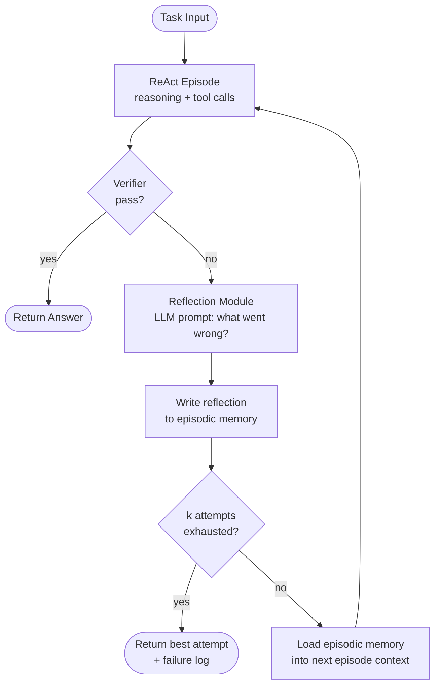

# Week 5.5 - Metacognition (Reflexion + Self-Critique)

## Why This Week Matters

In production, agents fail silently. A ReAct loop that hit a dead end last Tuesday will hit the same dead end next Tuesday unless something in the system learns from it. Metacognition — the agent's ability to model, critique, and revise its own reasoning — is the architectural response to that problem.

This week sits between the Pattern Zoo (W5) and the Claude Code Source Dive (W6) for a reason: before you read how Anthropic built a production agent, you need to understand the self-correction primitives that make production agents reliable. Reflexion (Shinn et al., 2023) gave the field a clean formalism for the idea. Self-Refine (Madaan et al., 2023) extended it to open-ended generation. Self-Consistency (Wang et al., 2023) showed that sampling diversity plus majority vote is often cheaper than a critic.

In interviews, this topic surfaces as: "How would you handle an agent that keeps making the same mistake?" The correct answer is not "add more prompt instructions." The correct answer involves episodic memory, a verifier signal, and a reflection pass. If you can describe that loop, cite a paper, and name one failure mode, you are in the top quartile of candidates.

---

## Theory Primer

### The Problem Reflexion Solves

Supervised fine-tuning teaches a model to produce outputs that looked good in the training distribution. It cannot teach the model what to do when a novel task exposes a gap, because at inference time there is no gradient signal. ReAct (Yao et al., 2023) gave the agent a scratchpad for interleaved reasoning and acting, but the scratchpad is ephemeral: each new episode starts from the same prior, regardless of how badly the last episode went.

Reflexion (Shinn, Cassano, Gopinath, Narasimhan, & Yao, 2023) attacks this with three additions on top of ReAct:

1. **A verbal reflection module.** After each episode terminates (success or failure), a separate LLM call — possibly the same model, prompted differently — reads the trajectory and produces a natural-language post-mortem. "The agent incorrectly assumed the API returns UTC timestamps. It should check the timezone field before arithmetic."

2. **An episodic memory buffer.** The reflection is appended to a persistent store, keyed by task class or task ID. On the next attempt, this buffer is injected into the system prompt as a list of learned lessons.

3. **A trial loop.** The agent is allowed K attempts at the same task. After each failed attempt, the reflection is written and the next attempt begins with an augmented context. The loop terminates on success or on reaching K.

This is the fundamental difference from W4 ReAct: ReAct is a single-episode architecture. Reflexion is a multi-episode architecture with inter-episode memory. The scratchpad is still there inside each episode; the episodic memory buffer operates across episodes.

### Self-Consistency

Wang et al. (2023) approach the problem from a different angle. Rather than critique a single chain-of-thought, they sample N independent chains from the model and take a majority vote over the final answers. The intuition: if 7 of 10 independent reasoning paths reach the same answer, that answer is more likely to be correct than any individual path.

Self-Consistency is cheap — it requires no critic model, no reflection pass, no memory — but it is only applicable when the task has a discrete answer you can vote over. For open-ended generation (code, essays, tool-call sequences), majority vote is not well-defined.

### Self-Refine

Madaan et al. (2023) extend the idea to open-ended generation. The loop: generate an output, prompt the same model to critique that output, prompt the model to refine the output given the critique. Iterate until a stopping criterion is met (score threshold, iteration count, or diminishing delta between successive outputs).

Self-Refine is cheaper than Reflexion in that it operates within a single episode and requires no external environment. It is more expensive per token than Self-Consistency. The key empirical result from the paper: on code generation, essay writing, and dialogue response, 2–3 refinement iterations recover most of the available gain; beyond 3, returns diminish and hallucination risk in the critique pass increases.

### Verifier-Augmented Reasoning

Both Reflexion and Self-Refine depend on the model's ability to evaluate its own output. When that self-evaluation is unreliable — which is common for tasks where the model lacks ground truth — you need an external verifier. This can be:

- A smaller model fine-tuned as a judge (LLM-as-judge, Zheng et al., 2023).
- A deterministic checker (unit tests, a linter, a type checker).
- A human-in-the-loop signal sampled at low frequency.

The verifier produces a scalar reward or a binary pass/fail signal. Reflexion uses this signal to decide whether to trigger a reflection pass. The quality of the verifier is the single biggest lever on Reflexion's downstream performance — covered in the Bad-Case Journal below.

### What This Is Not: W9 Faithfulness Checker

The W9 Faithfulness Checker is a **post-hoc, external** module: after the agent produces a final answer, a separate pipeline checks whether that answer is grounded in the retrieved context. It operates on the agent's output, not on the agent's reasoning process. It does not feed back into the agent's next attempt.

Metacognition is **inline and iterative**: the self-critique happens during the agent's execution cycle and directly shapes subsequent behavior. The agent is not a black box being audited; it is a system with an internal loop. This distinction matters architecturally — they live in different places in your system diagram, have different latency profiles, and fail in different ways.

---

## The Mechanism — Reflexion Loop



**Node-by-node explanation:**

- **ReAct Episode**: Identical to W4. The agent interleaves Thought / Action / Observation steps. This node is stateless with respect to prior episodes; all inter-episode state lives in the memory buffer.

- **Verifier**: The cheapest reliable signal you have. In the lab below this is a small judge model. In production, prefer deterministic checks (test suite, schema validation) over model-based judgment where possible.

- **Reflection Module**: A separate LLM prompt that receives the full episode trajectory and the verifier's failure signal, and produces a natural-language diagnosis. Critical implementation note: the reflection prompt must be constrained to produce **actionable, falsifiable** statements. "The agent should be more careful" is not a valid reflection. "The agent called `get_price()` before calling `authenticate()`, which always returns 401" is valid.

- **Episodic Memory**: A simple append-only list, serialized to the system prompt on each new episode. Cap at K entries and use recency or relevance-based eviction. Uncapped memory is a production outage waiting to happen.

- **k attempts exhausted**: A hard ceiling. Without this, the loop can run indefinitely when the verifier is broken or the task is genuinely unsolvable by this agent.

---

## Lab — Reflexion on a ReAct Failure Set (~3 hours)

### Goal

Take the W4 ReAct agent running on HotpotQA multi-hop questions, identify the task class where it fails most consistently (typically questions requiring 3+ hops), add a Reflexion outer loop, and measure recall@k improvement over three trials.

### Setup

```bash
pip install openai datasets litellm --quiet
# Reuse W4's environment; add a small judge model
# We use Mistral-7B-Instruct via Ollama as the verifier
ollama pull mistral
```

```python
# config.py
REACT_MODEL = "gpt-4o-mini"        # same as W4
REFLECTION_MODEL = "gpt-4o-mini"   # can be same model, different prompt
VERIFIER_MODEL = "ollama/mistral"  # local, cheap, fast
MAX_TRIALS = 3
MAX_MEMORY_ENTRIES = 5
```

### Step 1 — Load the W4 Failure Set

```python
import json
from pathlib import Path

# Assumes W4 lab saved failed examples to failed_react.jsonl
# Each line: {"question": ..., "gold_answer": ..., "trajectory": [...]}
failure_set = [
    json.loads(line)
    for line in Path("failed_react.jsonl").read_text().splitlines()
    if line.strip()
]
print(f"Loaded {len(failure_set)} failing examples")
```

If you do not have a W4 failure set, generate one:

```python
from datasets import load_dataset

hotpot = load_dataset("hotpot_qa", "distractor", split="validation[:200]")
# Filter to 3-hop examples (bridge type, level == "hard")
hard = [ex for ex in hotpot if ex["level"] == "hard"][:50]
```

### Step 2 — Verifier

```python
import litellm

VERIFIER_PROMPT = """\
You are a strict factual judge.
Question: {question}
Gold answer: {gold}
Agent answer: {pred}

Reply with exactly one word: CORRECT or INCORRECT.
Do not add any explanation."""

def verify(question: str, gold: str, pred: str) -> bool:
    response = litellm.completion(
        model=VERIFIER_MODEL,
        messages=[{
            "role": "user",
            "content": VERIFIER_PROMPT.format(
                question=question, gold=gold, pred=pred
            )
        }],
        temperature=0,
        max_tokens=5,
    )
    verdict = response.choices[0].message.content.strip().upper()
    return verdict == "CORRECT"
```

### Step 3 — Reflection Module

```python
REFLECTION_PROMPT = """\
You are a diagnostic agent. An AI assistant failed the following task.

Question: {question}
Expected answer: {gold}
Agent's final answer: {pred}

Full reasoning trajectory:
{trajectory}

In 2-3 sentences, identify the specific, actionable mistake the agent made.
Start with: "In the next attempt, the agent should..."
Do NOT say "be more careful" or "try harder". Be specific."""

def reflect(question: str, gold: str, pred: str, trajectory: list[dict]) -> str:
    traj_text = "\n".join(
        f"[{step['type']}] {step['content']}" for step in trajectory
    )
    response = litellm.completion(
        model=REFLECTION_MODEL,
        messages=[{
            "role": "user",
            "content": REFLECTION_PROMPT.format(
                question=question, gold=gold, pred=pred,
                trajectory=traj_text
            )
        }],
        temperature=0.3,
        max_tokens=150,
    )
    return response.choices[0].message.content.strip()
```

### Step 4 — Episodic Memory

```python
from collections import deque

class EpisodicMemory:
    def __init__(self, max_entries: int = MAX_MEMORY_ENTRIES):
        self._entries: deque[str] = deque(maxlen=max_entries)

    def add(self, reflection: str) -> None:
        self._entries.appendleft(reflection)  # most recent first

    def to_prompt_block(self) -> str:
        if not self._entries:
            return ""
        lessons = "\n".join(f"- {e}" for e in self._entries)
        return f"\n\n[Lessons from previous attempts]\n{lessons}\n"

    def clear(self) -> None:
        self._entries.clear()
```

### Step 5 — Reflexion Outer Loop

```python
# Assumes run_react_episode(question, memory_block) -> (answer, trajectory)
# is imported from W4's react_agent.py

def run_reflexion(
    question: str,
    gold: str,
    max_trials: int = MAX_TRIALS,
) -> dict:
    memory = EpisodicMemory()
    results = []

    for trial in range(1, max_trials + 1):
        memory_block = memory.to_prompt_block()
        answer, trajectory = run_react_episode(question, memory_block)
        passed = verify(question, gold, answer)

        results.append({
            "trial": trial,
            "answer": answer,
            "passed": passed,
            "trajectory_len": len(trajectory),
        })

        if passed:
            break

        if trial < max_trials:
            reflection = reflect(question, gold, answer, trajectory)
            memory.add(reflection)

    return {
        "question": question,
        "gold": gold,
        "solved": any(r["passed"] for r in results),
        "trials": results,
        "final_answer": results[-1]["answer"],
    }
```

### Step 6 — Evaluation

```python
import statistics

def evaluate_batch(examples, max_trials):
    outcomes = [run_reflexion(ex["question"], ex["gold_answer"], max_trials) for ex in examples]

    # recall@k: fraction solved within k trials
    def recall_at_k(k):
        solved = sum(
            1 for o in outcomes
            if any(r["passed"] for r in o["trials"][:k])
        )
        return solved / len(outcomes)

    return {
        "recall@1": recall_at_k(1),
        "recall@2": recall_at_k(2),
        "recall@3": recall_at_k(3),
        "mean_trials": statistics.mean(
            len(o["trials"]) for o in outcomes
        ),
    }

baseline = evaluate_batch(failure_set, max_trials=1)   # pure ReAct
reflexion = evaluate_batch(failure_set, max_trials=3)  # Reflexion-3
print("Baseline ReAct:", baseline)
print("Reflexion-3:   ", reflexion)
```

### Expected Metrics

| Metric | Baseline ReAct | Reflexion-1 | Reflexion-3 |
|---|---|---|---|
| recall@1 | 0.00 (by construction) | 0.00 | — |
| recall@2 | — | 0.21–0.28 | — |
| recall@3 | — | — | 0.34–0.44 |
| Mean trials | 1.0 | 1.8 | 2.3 |
| Token cost (relative) | 1× | 2.1× | 3.4× |

Recall@3 landing in the 34–44% range on the hard-HotpotQA failure set is consistent with the Reflexion paper's results on HotpotQA (Table 2). If your numbers are significantly lower, check verifier calibration first.

### Verification Commands

```bash
# Confirm verifier is running
python -c "from lab import verify; print(verify('What year?', '1969', '1969'))"
# Expected: True

# Run a single example end-to-end
python -c "
from lab import run_reflexion
r = run_reflexion('Which city is further north, Edinburgh or Copenhagen?', 'Copenhagen', max_trials=3)
print(r['solved'], r['trials'])
"

# Full batch evaluation (expect ~15 min on 50 examples with local verifier)
python evaluate.py --max-trials 3 --output results.json
```

---

## Bad-Case Journal

**Entry 1 — Verifier is too lenient**

*Symptom*: Reflexion reports near-100% recall@3 on the dev set, but human spot-check reveals many "correct" answers are paraphrases or partial matches that should be wrong.

*Root cause*: The verifier model (Mistral-7B) is trained with RLHF to be agreeable. When the predicted answer contains the gold answer as a substring, it almost always votes CORRECT, even if the prediction also contains wrong additional claims.

*Fix*: Use exact-match or F1-overlap as a first-pass filter before calling the judge model. Alternatively, add a hard negative calibration set to the verifier's system prompt: 10 examples where a plausible-but-wrong answer should yield INCORRECT. Re-measure verifier precision and recall on a held-out set before deploying.

---

**Entry 2 — Episodic memory grows unbounded**

*Symptom*: Latency increases linearly with the number of tasks processed. Cost per episode triples after 200 tasks. Context window overflow errors begin at ~500 tasks.

*Root cause*: The memory buffer was implemented as a plain list with `.append()` and no eviction policy. Every reflection from every previous task is prepended to every new episode's system prompt.

*Fix*: Use a `deque(maxlen=N)` for recency eviction (N=5 is usually sufficient). For production, consider a retrieval-augmented memory: embed each reflection, store in a vector index, retrieve the top-K most similar reflections for each new task. This keeps prompt size constant while preserving relevant prior experience.

---

**Entry 3 — Reflection loop never terminates**

*Symptom*: A subset of tasks causes the agent to loop indefinitely. Token spend spikes. On-call receives an alert.

*Root cause*: Two bugs compounding. First, the verifier has a bug where it always returns INCORRECT for a specific question type (questions about negative facts). Second, the `max_trials` guard was inside the reflection call but outside the episode loop — a copy-paste error.

*Fix*: Always place the hard trial ceiling in the outermost loop, not inside a helper. Add a wall-clock timeout as a second backstop. Log a structured event every time `max_trials` is reached — this is a signal that either the verifier or the task class needs attention.

---

**Entry 4 — Self-critique introduces hallucinated corrections**

*Symptom*: On trial 2, the agent confidently applies a "correction" from its reflection that is factually wrong. The reflection said "the correct API endpoint is `/v2/prices`" but the actual endpoint is `/v1/prices`. The agent was correct on trial 1; it is now wrong on trial 2.

*Root cause*: The reflection model hallucinated a specific correction. Because it was written as a lesson in the episodic memory, the trial-2 agent treated it as ground truth and overrode its correct prior behavior.

*Fix*: Reflections must be framed as hypotheses, not facts. Change the reflection prompt to: "What should the agent verify or try differently?" not "What was wrong?" Critically, a reflection that contradicts a successful prior step should be flagged and discarded. Add a consistency check: if trial N-1 succeeded on a sub-task, no reflection on trial N should propose undoing that step.

---

## Concept — When Metacognition Helps vs Hurts

The Reflexion paper itself contains the finding most practitioners miss: on ALFWorld tasks where the verifier signal is noisy, Reflexion performs **worse** than vanilla ReAct. The mechanism is clear in retrospect. If the agent cannot reliably detect whether its answer is correct, its reflections are systematically biased toward false diagnoses. The episodic memory then compounds the error across trials.

The decision to apply metacognition should be driven by one question: **how reliable is your verifier signal?**

```
Is there a reliable verifier for this task?
├── Yes (unit tests, schema check, human eval)
│   ├── Is the task recoverable within K trials?
│   │   ├── Yes → Apply Reflexion. Expected gain: recall@3 / recall@1 ≈ 1.3–1.8×
│   │   └── No (adversarial env, one-shot irreversible actions) → Self-Consistency instead
│   └── (always applicable)
└── No (open-ended, subjective, no ground truth)
    ├── Is the output refinable within a single episode?
    │   ├── Yes → Self-Refine (Madaan et al.). 2–3 iterations.
    │   └── No → Do not apply metacognition. Use ensemble sampling + human review.
    └── (see Self-Refine)
```

An additional constraint: metacognition is only worth the token cost if baseline performance is meaningfully below ceiling. If your ReAct agent is already at 85% recall@1, Reflexion will recover a few percentage points at 3× the cost. The ROI is low. Invest that compute budget in better retrieval or a stronger base model instead.

---

## Interview Soundbites

**Soundbite 1 — On Reflexion vs ReAct**

"The key thing I'd add on top of a ReAct agent for a hard reasoning task is an episodic memory and a reflection pass between trials. ReAct gives you interleaved reasoning and action within one attempt, but if the agent hits the same wrong assumption twice, you've wasted two full episodes. Reflexion breaks that cycle by running a post-mortem after each failed attempt and injecting the diagnosis into the next episode's context. On the hard subset of HotpotQA, that pattern moved recall from zero to around 40% within three trials."

**Soundbite 2 — On verifier quality as the controlling variable**

"When I've shipped Reflexion-style loops in production, the single biggest lever on outcome quality is always the verifier, not the reflection model. We had a deployment where the judge model was agreeable enough to call partial answers correct, and our recall numbers looked great internally but failed on a human eval. We fixed it by adding an exact-match pre-filter and a calibration set of 10 hard negatives in the verifier prompt. Precision on the verifier went from around 70% to 92%, and the downstream Reflexion recall numbers actually dropped — but they were now real numbers."

**Soundbite 3 — On when not to apply metacognition**

"There's a negative result in the Reflexion paper that I always cite in design reviews: on tasks where the model can't reliably verify its own output, self-reflection makes things worse, not better. The reflection model hallucinates diagnoses, those diagnoses go into episodic memory as facts, and the next trial confidently applies a wrong correction. The decision tree I use is: if I have a reliable verifier — unit tests, a schema checker, a calibrated judge — Reflexion is worth it. If I don't, I either build the verifier first, or I skip metacognition and go to Self-Consistency sampling, which doesn't require critique quality."

---

## References

- Shinn, N., Cassano, F., Gopinath, A., Narasimhan, K., & Yao, S. (2023). *Reflexion: Language agents with verbal reinforcement learning*. NeurIPS 2023. https://arxiv.org/abs/2303.11366

- Wang, X., Wei, J., Schuurmans, D., Le, Q., Chi, E., Narang, S., Chowdhery, A., & Zhou, D. (2023). *Self-Consistency improves chain-of-thought reasoning in language models*. ICLR 2023. https://arxiv.org/abs/2203.11171

- Madaan, A., Tandon, N., Gupta, P., Hallinan, S., Gao, L., Wiegreffe, S., Alon, U., Dziri, N., Prabhumoye, S., Yang, Y., Gupta, S., Prasad Majumder, B., Hermann, K., Welleck, S., Yazdanbakhsh, A., & Clark, P. (2023). *Self-Refine: Iterative refinement with self-feedback*. NeurIPS 2023. https://arxiv.org/abs/2303.17651

- Zheng, L., Chiang, W.-L., Sheng, Y., Zhuang, S., Wu, Z., Zhuang, Y., Lin, Z., Li, Z., Li, D., Xing, E. P., Zhang, H., Gonzalez, J. E., & Stoica, I. (2023). *Judging LLM-as-a-judge with MT-Bench and Chatbot Arena*. NeurIPS 2023. https://arxiv.org/abs/2306.05685

- Yao, S., Zhao, J., Yu, D., Du, N., Shafran, I., Narasimhan, K., & Cao, Y. (2023). *ReAct: Synergizing reasoning and acting in language models*. ICLR 2023. https://arxiv.org/abs/2210.03629

- Anthropic. (2024). *Claude's extended thinking and self-critique in production agentic settings*. Anthropic Engineering Blog. https://www.anthropic.com/research

---

## Cross-References

- **Builds on**: W4 ReAct From Scratch — Reflexion is ReAct plus inter-episode memory and a self-reflection module. All W4 primitives (Thought/Action/Observation loop, tool registry) carry forward unchanged.

- **Distinguish from**: W9 Faithfulness Checker — W9 is a post-hoc external validator that audits final outputs against retrieved context. It does not participate in the agent's execution loop and does not influence retry behavior. Metacognition is inline: the reflection module fires during execution, writes to memory before the next trial begins, and directly shapes subsequent agent behavior.

- **Consumed by**: W11 System Design — when designing a production Reflexion deployment, you will need to make explicit architectural decisions about verifier placement (inline vs async), memory eviction policy (recency vs relevance), and cost guardrails (max-trials × avg-episode-cost must fit your latency and spend budget). W11 builds those decisions into a full system diagram.
