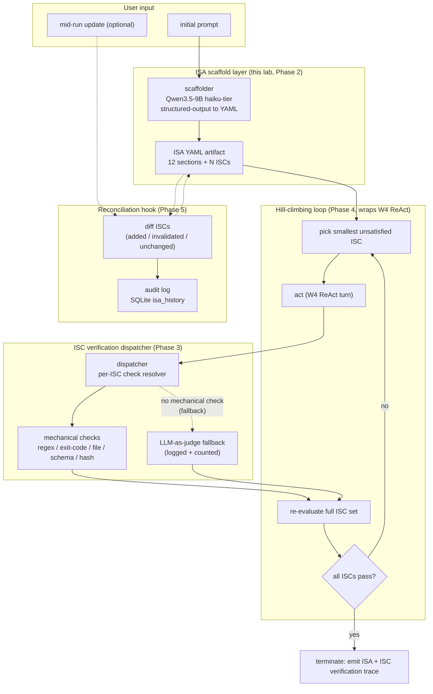

> **Status: SPEC DRAFT (2026-05-14).** This chapter is a planning skeleton produced from single-source convergence research on Personal_AI_Infrastructure v5.0.0 (ISA skill + ISC pattern). Phase Python blocks marked `TBD` are scoped but not yet written. Reviewer-pass before implementation. Spec source: PAI v5.0.0 release notes + Reflexion (arXiv:2303.11366) + Kent Beck TDD literature (2026-05-14).

## Exit Criteria

- [ ] `src/isa_schema.py` — Pydantic v2 model for the 12-section ISA artifact (Problem / Vision / Out-of-Scope / Constraints / Criteria / Test Strategy / Verification / etc.); YAML round-trip without information loss
- [ ] `src/isa_scaffold.py` — small-LLM (Qwen3.5-9B haiku-tier) ISA scaffolder that interviews the user prompt → emits draft ISA with enumerated ISCs (Ideal State Criteria) as discrete pass/fail items
- [ ] `src/isc_verify.py` — ISC verification dispatcher mapping each ISC to a mechanical check (regex match, file-exists, command exit code, JSON-schema validate, hash compare); falls back to LLM-as-judge ONLY when no mechanical check is feasible, and logs the fallback
- [ ] `src/hill_climb.py` — main loop integrating ISA + W4 ReAct: per turn, run an action, re-evaluate the full ISC set, terminate iff all ISCs pass; **agent terminates on ISC pass, NOT on a confidence-threshold guess** (this is the load-bearing invariant)
- [ ] `RESULTS.md` four-way bench: (a) W4 ReAct baseline (terminates on model's "I'm done" token), (b) W5.5 confidence-threshold termination, (c) ISA single-classifier mechanical verify, (d) ISA + reconciliation (mid-run user goal update). Measure: false-completion rate, mean-turns-to-terminate, ISC-coverage on a 15-task probe set with hand-curated ISA ground truth.

---

## 1. Why This Week Matters (~150 words — REQUIRED)

W4 ReAct built a loop that calls Think → Act → Observe until the model emits a `FINAL_ANSWER` token. The stop condition is the model's own opinion. W5.5 Metacognition tightened this with a confidence-threshold gate — "if the model's self-reported confidence is below 0.6, escalate; if above 0.85, terminate" — but confidence-threshold termination is still a model-judging-itself loop, and any deployment that has shipped Reflexion knows the model will happily declare done on a half-finished task. Daniel Miessler's PAI v5.0.0 ships a better primitive: the **Ideal State Artifact** (ISA), a structured 12-section document that serves simultaneously as the task spec AND the test harness. The criteria decompose into **ISCs** — discrete, mechanically-verifiable pass/fail items. The agent's main loop becomes "for each unsatisfied ISC, make progress; verify; mark done; repeat" — TDD for agent tasks. **The senior-engineer signal is: "my termination criterion is falsifiable. 'I think I'm done' is not a termination criterion; 'all 7 ISCs pass their verification check' is."** This chapter teaches the engineer to write that termination criterion mechanically, not lyrically.

---

## 2. Theory Primer (~1000 words — REQUIRED — OUTLINED, FULL TEXT IN ROUND 2)

### 2.1 The spec-as-test invariant

The ISA pattern collapses two artifacts most software pipelines keep separate: the spec ("what should this do") and the test ("does it do that"). Under classical TDD (Kent Beck, 2002), the test IS the executable spec — but agent systems regressed on this discipline by treating the user prompt as the spec and the agent's self-report as the verification. The ISA pattern restores the invariant: the spec is structured, the criteria are enumerated, and verification is mechanical wherever physically possible. Single load-bearing claim: **if the verification can be expressed as code, it MUST be code, not an LLM judge** — because LLM judges share failure modes with LLM executors, and you cannot use a biased instrument to verify an instrument with the same bias.

### 2.2 Five concepts to own before writing code

1. **ISC vs goal vs criterion** — a *goal* is what the user wanted ("build me a working CLI"); a *criterion* is a quality dimension ("the CLI handles errors gracefully"); an **ISC (Ideal State Criterion)** is a discrete, mechanically-checkable pass/fail item ("`./cli --bad-arg` exits with code 2 AND stderr matches `/Usage:/`"). ISCs are the atomic units of the loop. A criterion without a mechanical check is an unfinished ISC.

2. **Mechanical-verification preference over LLM-as-judge** — verifications form a hierarchy: (a) deterministic checks (regex, exit code, file hash, JSON schema, AST match) > (b) executable test runs (pytest, unit-test exit code) > (c) structured-output checks (parse-then-validate) > (d) LLM-as-judge with rubric. Rule of thumb: if you can write the check in 5 lines of Python, you must. LLM judges are the verification of last resort and MUST be logged when invoked, because their pass-rate is the variable you're tuning against.

3. **The hill-climbing loop pattern** — the agent's main loop is not "Think → Act → Observe → Maybe Stop". It is "for each unsatisfied ISC: pick the smallest one, make progress, re-verify, repeat". This is closer to gradient descent over a discrete fitness landscape than to free-form reasoning. The fitness function IS the count of passing ISCs. Hill-climbing terminates iff the fitness is at max (all-pass), not iff the agent feels good.

4. **ISA reconciliation when the user moves the goal** — real users update requirements mid-run. The naive loop ignores this and finishes against stale ISCs. The reconciliation hook re-runs the ISA scaffolder against the updated user input + existing ISA, produces a diff (ISCs added / ISCs invalidated / ISCs unchanged), and re-plans the hill-climbing loop against the new set. The diff IS the audit trail — "the user changed their mind at turn 7; here is what was already done and what got invalidated."

5. **The difference between "done" and "satisfied"** — *done* means "all ISCs pass right now". *Satisfied* means "all ISCs pass AND the user's higher-order Vision section is met". Done is mechanical; satisfied is a judgment call. The ISA pattern explicitly separates these so the loop can terminate on *done* and surface to the user for *satisfied* — instead of conflating them and getting stuck.

### 2.3 Papers + references to cite (TBD-fill in round 2)

- Beck, K. (2002). *Test-Driven Development: By Example.* Addison-Wesley. — Foundational text; ISA is TDD applied to agent tasks.
- Shinn et al. (2023). *Reflexion: Language Agents with Verbal Reinforcement Learning.* arXiv:2303.11366 — self-reflection loop; ISA pattern's mechanical-verification preference is a direct response to Reflexion's LLM-judge cost.
- Anthropic Engineering (2024). *Building Effective Agents.* — section on evaluation harnesses and clear stopping criteria.
- Yao et al. (2023). *ReAct: Synergizing Reasoning and Acting.* arXiv:2210.03629 — the loop the ISA pattern wraps around.
- Daniel Miessler (2024). *PAI v5.0.0 Release Notes — ISA skill.* — canonical implementation reference.

### 2.4 Distinguish-from box

- **ISA ≠ user prompt.** A user prompt is unstructured natural language; an ISA is a structured artifact with enumerable ISCs. The scaffolder is the bridge.
- **ISA ≠ confidence-threshold termination (W5.5).** W5.5 terminates when the model's self-reported confidence crosses a threshold — same circuit judging itself. ISA terminates when external mechanical checks pass — different circuit verifying the work.
- **ISA ≠ LLM-as-judge evaluation harness.** LLM-as-judge is a fallback inside the ISC verifier, not the primary pattern. The primary pattern is deterministic checks; LLM-as-judge is the last 10% when no mechanical check exists.
- **ISA ≠ planner output.** A planner (W4 plan-then-execute) decomposes the goal into steps; the ISA decomposes the goal into VERIFIABLE END STATES. Planner says "do these steps"; ISA says "these conditions must hold at the end". Orthogonal axes.

---

## 3. System Architecture (REQUIRED — Mermaid)

**Reading the diagram.** Solid edges are the hot loop: scaffolder → ISA → pick smallest unsatisfied ISC → act → verify → loop. Dashed edges are conditional: LLM-as-judge fallback fires only when no mechanical check exists; reconciliation fires only on mid-run user update. Termination is on the right-hand `Done` node; the agent does NOT have a self-judged exit path.

---

## 4. Lab Phases (REQUIRED — TBD code, scoped now, ~6 hours total)

### Phase 1 — ISA YAML schema + Pydantic model (~45 min)

Goal: encode the PAI 12-section ISA as a Pydantic v2 model with strict validation. YAML round-trip via PyYAML. Each ISC is a sub-model with `id`, `description`, `verification_type` (enum: `regex` | `exit_code` | `file_exists` | `json_schema` | `hash` | `command_output` | `llm_judge`), `verification_payload` (the specific check), and `status` (enum: `pending` | `passing` | `failing`).

- **TBD code** — `src/isa_schema.py` with `class ISA(BaseModel)`, `class ISC(BaseModel)`, `class VerificationType(StrEnum)`.
- **TBD verification** — round-trip a hand-written `examples/sample_isa.yaml` through `ISA.model_validate(yaml.safe_load(...))` → re-serialize → byte-equality on canonical form.
- **Per-block bundle** — architecture mermaid (YAML ↔ Pydantic ↔ Python dict), code, walkthrough (why Pydantic v2 over dataclasses: enum discrimination + JSON schema export), result, insight callout.

### Phase 2 — ISA scaffolding from user prompt (~1 hour)

Goal: prompt-engineer Qwen3.5-9B-haiku-tier to interview a user prompt and emit a populated ISA YAML. Critical sub-step: the scaffolder MUST decompose the Criteria section into discrete ISCs, each with a `verification_type` — if the scaffolder cannot propose a mechanical check, it must explicitly mark the ISC as `verification_type: llm_judge` (forcing the fallback path to be visible, not silent).

- **TBD code** — `src/isa_scaffold.py` with `scaffold_isa(user_prompt: str) -> ISA`.
- **TBD measurement** — on a 15-prompt probe set with hand-written ground-truth ISAs, measure (a) ISC enumeration recall (did the scaffolder catch every ground-truth ISC?), (b) verification-type accuracy (did it pick a mechanical type when possible?), (c) llm-judge fallback rate (how often did it cop out?).
- **Per-block bundle** — architecture mermaid (prompt → scaffolder LLM → ISA YAML), code (with the system prompt), walkthrough (why haiku-tier suffices: this is structured-output extraction, not reasoning), result, insight callout (the system prompt design IS the policy — show the prompt verbatim).

### Phase 3 — ISC verification dispatcher (~1.5 hours)

Goal: implement the dispatcher that takes an ISC and runs its verification. Mechanical-first: each `verification_type` has a pure-Python implementation. `llm_judge` is the last branch and logs every invocation to `verification_log` (SQLite) with the rubric used, so the engineer can audit "how much of my verification budget went to LLM fallback?".

- **TBD code** — `src/isc_verify.py` with `verify_isc(isc: ISC, run_artifacts: dict) -> VerificationResult`. Dispatcher pattern, one handler function per `VerificationType`.
- **TBD measurement** — on the 15-prompt probe set, measure mechanical-check coverage (% of ISCs verified without LLM-judge). Target ≥ 80% mechanical.
- **Per-block bundle** — architecture mermaid (ISC + artifacts → dispatcher → handler → VerificationResult), code, walkthrough (why dispatch-by-enum rather than polymorphism: keeps the code grep-able and the fallback path visible), result, insight callout (mechanical-check coverage is the load-bearing metric, not pass rate).

### Phase 4 — Hill-climbing loop integrated with W4 ReAct (~1.5 hours)

Goal: replace the W4 ReAct termination logic with the hill-climbing loop. Per turn: pick smallest unsatisfied ISC → invoke W4 `run_agent()` with the ISC as the focused sub-goal → re-evaluate the FULL ISC set (not just the targeted one — actions have side effects on other ISCs) → loop iff any ISC is still pending → terminate iff all pass.

- **TBD code** — `src/hill_climb.py` with `hill_climb(isa: ISA, max_turns: int) -> HillClimbResult`. Re-uses W4 `run_agent()` and W5.5 confidence-threshold ONLY as an early-warn signal (not as a terminator — the only terminator is all-pass).
- **TBD measurement** — on the 15-task probe set, compare against (a) W4 ReAct baseline (model self-terminates), (b) W5.5 confidence-threshold. Metrics: false-completion rate (declared done but ISCs fail external audit), mean-turns-to-terminate, total-token-cost.
- **Per-block bundle** — architecture mermaid (ISA → pick ISC → ReAct turn → re-verify → loop/terminate), code, walkthrough (why re-evaluate the FULL ISC set every turn: actions have side effects, marginal cost is small, silent regression is expensive), result, insight callout (this is gradient descent over a discrete fitness landscape).

### Phase 5 — Reconciliation hook for mid-run goal updates (~1 hour)

Goal: handle the user-changes-their-mind case. Mid-run user input triggers `reconcile_isa(current_isa, user_update) -> ISA_diff`. The diff is structured: added ISCs (new pending), invalidated ISCs (passing ISCs that no longer apply), unchanged ISCs. Append to `isa_history` SQLite table. The hill-climbing loop re-reads ISA after every reconciliation event, so the next turn plans against the new ISC set.

- **TBD code** — `src/reconcile.py` with `reconcile_isa()`, plus event hook in `hill_climb.py`.
- **TBD measurement** — on a 5-task scripted scenario (user updates goal at turn N), measure correct-reconciliation rate (did the diff correctly classify ISCs?) and re-planning latency.
- **Per-block bundle** — architecture mermaid (current_isa + user_update → reconciler LLM → diff → updated ISA + audit row), code, walkthrough (why the diff is the audit trail: every goal change is recoverable), result, insight callout (this is the missing piece in W5.5 — metacognition that survives user goal-drift).

---

## 5. (deprecated)

Walkthroughs live inline per the per-Python-block bundle in §4.

---

## 6. Bad-Case Journal (3-5 entries — TBD AFTER LAB RUN)

Pre-flight entries scoped from convergent failure modes in PAI v5.0.0 release notes + Reflexion paper §6 + Anthropic agents blog post §evaluation. Final entries populated post-implementation.

**Entry 1 (planned) — LLM-judge bias inflates "all pass" verdicts.**
*Scoped from:* Reflexion §6 (LLM-judge collusion when judge and actor share weights / family). Symptom: 100% ISC pass on llm_judge ISCs, 50% pass on mechanical ISCs — the gap IS the bias.

**Entry 2 (planned) — ISC under-specification leads to infinite hill-climbing.**
*Scoped from:* PAI v5.0.0 release notes warning on "ambiguous criteria". Symptom: an ISC's mechanical check passes after one action, but the spirit of the criterion is not met; agent loops forever or terminates prematurely.

**Entry 3 (planned) — Reconciliation race when user updates during a long turn.**
*Scoped from:* general agent-systems concurrency. Symptom: agent finishes a 90-second action against the OLD ISA; reconciliation event arrived 30 seconds in; verification runs against NEW ISA and silently passes the wrong artifact.

**Entry 4 (planned) — ISC verification cost dominates main work.**
*Scoped from:* Anthropic agents blog §evaluation cost. Symptom: re-verifying the full ISC set every turn (Phase 4 design) costs more tokens than the action itself; mitigation: incremental verification with cached results invalidated only on actions touching the relevant artifacts.

**Entry 5 (planned) — Ambiguous Vision→Criteria translation by the scaffolder.**
*Scoped from:* PAI v5.0.0 release notes example failures. Symptom: scaffolder produces ISCs that are vacuously true (e.g., `verification_type: regex, payload: ".*"` — matches anything); mitigation: scaffolder unit test that rejects trivially-passable verification payloads.

---

## 7. Interview Soundbites (2-3 entries — TBD AFTER LAB RUN)

Soundbites are written post-measurement so the numbers cited are real. Scoped topics, anchored on the "termination criteria" interview question:

- (a) "How does your agent know when it's done?" — anchor on Phase 4 four-way bench: ReAct self-terminate false-completion rate vs ISA all-pass false-completion rate. The senior answer is "my termination criterion is falsifiable, not felt".
- (b) "What's the difference between an evaluation harness and an agent loop?" — anchor on §2.1 spec-as-test invariant. The ISA pattern collapses the two; the soundbite explains why that's load-bearing.
- (c) "How do you handle a user changing their mind mid-task?" — anchor on Phase 5 reconciliation. The soundbite cites the audit-trail design: every goal change is a structured diff, not a vibes-based re-plan.

---

## 8. References (TBD-fill)

Same set as §2.3 once expanded. Format per vault conventions:
- **Author et al. (Year).** *Title.* Venue. arXiv link. One-line description.

Must include at least one production blog post or canonical implementation repo. Candidates:
- Daniel Miessler (2024). *PAI v5.0.0 Release Notes — ISA Skill.* https://github.com/danielmiessler/Personal_AI_Infrastructure/blob/main/Releases/v5.0.0/README.md — canonical implementation reference.
- Shinn et al. (2023). *Reflexion: Language Agents with Verbal Reinforcement Learning.* arXiv:2303.11366 — self-reflection prior art.
- Beck, K. (2002). *Test-Driven Development: By Example.* Addison-Wesley — the pattern ISA inherits from.
- Anthropic Engineering (2024). *Building Effective Agents.* Anthropic blog — production evaluation-harness discussion.
- Yao et al. (2023). *ReAct: Synergizing Reasoning and Acting in Language Models.* arXiv:2210.03629 — the loop ISA wraps.

---

## 9. Cross-References

- **Builds on:** [[Week 4 - ReAct From Scratch]] (the loop being wrapped; `run_agent()` is reused as the per-turn action); [[Week 5.5 - Metacognition]] (confidence-threshold gating is demoted from terminator to early-warn signal — ISA replaces it as the terminator).
- **Distinguish from:** confidence-threshold termination (W5.5) — same circuit judging itself; LLM-as-judge evaluation harnesses (the primary pattern is mechanical verification, LLM-judge is the last-10% fallback); planner output (W4 plan-then-execute) — planner decomposes the goal into STEPS, ISA decomposes the goal into END STATES.
- **Connects to:** [[Week 3.5.95 - Self-Observability]] (ISC pass/fail events feed the LEARNING / observability layer — every verification result is a structured row for offline analysis); [[Week 6.7 - Agent Skills]] (Agent Skills authoring discipline echoes the ISA pattern — a Skill with no acceptance test is a Skill that ships broken).
- **Foreshadows:** [[Week 12 - Capstone]] (every capstone component ships with an ISA; the capstone rubric IS an ISA over the entire program); [[Week 11 - System Design]] (production agent topologies surface ISCs as the audit-trail primary key).

---

## Resolved design decisions (locked 2026-05-14)

1. **Scope vs W5.5 overlap:** ✅ ship as 5-phase chapter. Verified 2026-05-14: side-by-side re-read of W5.5 §1 + W5.6 §1 confirms W5.5 retains the broader metacognition toolbox (Reflexion / Self-Refine / Self-Consistency + confidence calibration); W5.6 narrows to one termination-primitive variant (ISA). No obsolescence — clean hand-off. Forward link added to W5.5 §1.
2. **ISA model layer:** ✅ Pydantic v2 (free JSON schema export benefits scaffolder LLM system prompt).
3. **Scaffolder model:** ✅ haiku-tier (Qwen3.5-9B :8004). Re-evaluate after Phase 2 if ISC recall <80%.
4. **LLM-judge fallback rubric:** ✅ structured `{verdict: pass|fail, reason: str}`. Free-text rubrics correlate with judge bias per Reflexion §6.
5. **Reconciliation concurrency:** ✅ synchronous (avoids BCJ Entry 3 race condition). Note in §3 walkthrough.

---

*Spec drafted from single-source PAI v5.0.0 convergence research. Convergence finding: PAI's ISA skill is the missing termination-criterion layer in the open-source agent-systems literature; Reflexion and Anthropic's effective-agents blog both gesture at "clear stopping criteria" but stop short of a structured artifact. This chapter bets that the ISA pattern — TDD applied to agent tasks — is durable enough to be teachable as its own chapter, sandwiched between W5.5 (metacognition as self-awareness) and the W6.x tool/skill chapters that consume ISCs as their authoring discipline.*
