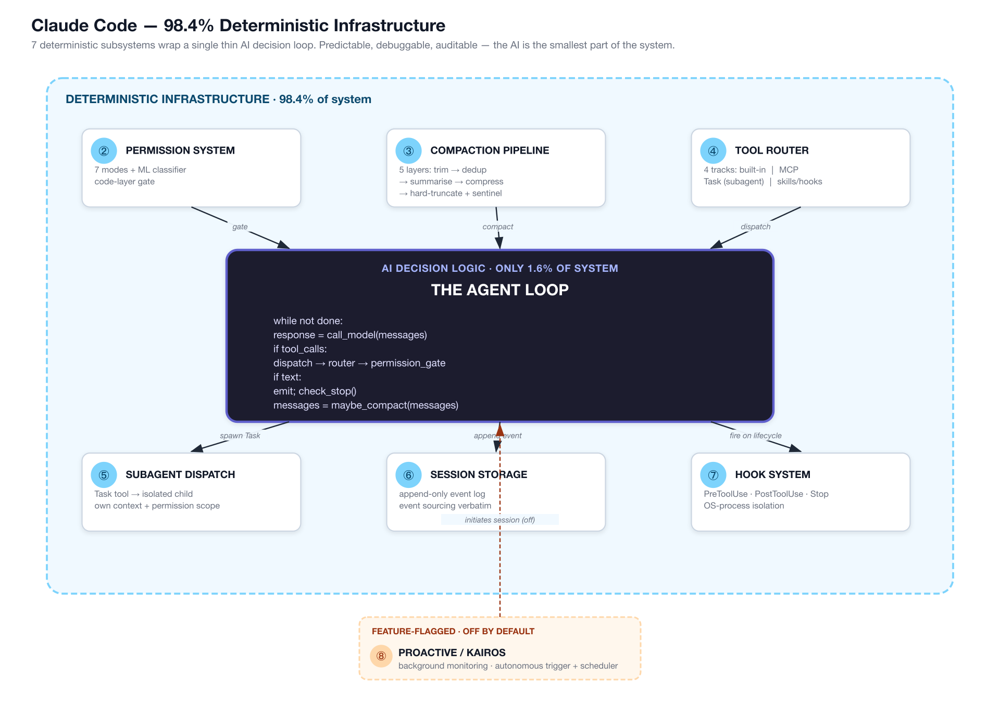

# Week 6 — Claude Code Source Dive

> Goal: Reverse-engineer the architecture of a production-grade agent from publicly available analyses of its source. Produce **two durable interview artifacts**: an Architecture Cheat Sheet and a "3 ideas I'd steal" write-up. Cold-whiteboard the agent loop + 3 subsystems in under 5 minutes by end of week.

**Exit criteria.**
- [ ] All 5 reading sources consumed; one key-takeaway note captured per source in `notes/`
- [ ] All 8 subsystem study sheets filled in (`notes/subsystem-01.md` through `notes/subsystem-08.md`)
- [ ] Architecture Cheat Sheet 1-pager committed to `lab-06-claude-code-map/ARCHITECTURE_CHEATSHEET.md`
- [ ] "3 design ideas I'd steal" write-up committed to `lab-06-claude-code-map/STEAL_IDEAS.md`
- [ ] `RESULTS.md` committed with personal notes, struggled spots, and a sentence on each subsystem in your own words
- [ ] Can whiteboard the agent loop + 3 subsystems in 5 minutes from memory (timed — use a real timer)
- [ ] 5 Anki cards created; 3 spoken answers recorded (see §Lock-in)

---

## Why This Week Matters

Weeks 1–5 built your conceptual toolkit: vectors, retrieval, reranking, memory, loops, patterns. You understand the pieces. But production agents are not modular demos. Claude Code is a shipped product serving thousands of users with billions of tokens, real-time latency budgets, and concurrent request handling that would fail instantly if any subsystem was wrong. This week forces you to read the architecture of a real system and ask: where is the complexity? Where are the failure modes? What details did the researchers gloss over that the engineers had to solve?

The interview signal is precise. A candidate who says "I know what ReAct is" sounds like they read a paper. A candidate who says "I reverse-engineered Claude Code's caching layer and it uses a three-tier prompt cache with hash-keyed invalidation; here's why that matters for multi-agent forking" sounds like they *understand* what production engineering means. This week is that difference.

By the end, you will own three artifacts: a one-page architecture cheat sheet you can whiteboard in 5 minutes from memory, a "3 design ideas I'd steal" document with concrete reasoning about why those ideas matter for *your* systems, and the mental model of how eight subsystems (request routing, context windowing, tool dispatch, cache invalidation, token budgeting, error handling, observability, state isolation) fit together into a coherent shipping vehicle. You will understand why Harness Engineering 101 emphasizes "infrastructure, not intelligence" — because Claude Code proves it.

---

## Theory Primer — Why This Week Is the Harness-Engineering Centerpiece

> **Why this matters:** Every prior week taught you *pieces* — loops, tools, memory, tracing. This week is where all of it is grounded in a single shipped production agent and a published book-length teardown of that agent. The curriculum has been claiming "the hard problem is the infrastructure, not the loop" for six weeks. Here is where that claim stops being an assertion and becomes a rigorously citeable architectural reading. Read this primer slowly. It is the philosophical spine of the whole course.

### Concept 1 — The 1.6% / 98.4% split: a production agent is mostly infrastructure, not AI

Chapter 1 of *Harness Engineering Book 1* is titled **「为什么需要 Harness Engineering」** (Why We Need Harness Engineering). Its opening move is to reject the word "agent" as marketing:

> **「一个只会输出文本的模型，出错时主要带来理解成本。一个能运行命令、写文件、访问网络、修改仓库的模型，出错后留下的是执行结果。」**
>
> *"A model that only outputs text, when it errs, mostly creates the cost of being misunderstood. A model that can run commands, write files, access the network, and modify repositories — when it errs, leaves behind execution results."*

That shift — from "the model said something wrong" to "the filesystem is now wrong, the process is now dead, the Git history is now corrupted" — is the reason production agents need a harness. The 2026 source-leak analyses (bits-bytes-nn, VILA-Lab, DEV.to) all converge on the same measurement: of the ~512,000 lines and ~1,900 files in Claude Code v2.1.88, roughly **1.6% is AI decision logic** (the loop that calls the model and parses the response) and **98.4% is deterministic infrastructure** (permission gates, compaction, tool routing, session storage, hook dispatch, subagent orchestration, error recovery, telemetry). Bk1's own framing of this ratio is characteristically blunt:

> **「模型只是 agent 里最会说话、也最不稳定的那个部件。」**
>
> *"The model is just the part of the agent that talks the most and is the most unstable."*

**Interview framing.** When someone asks you "how would you build a coding agent?" the wrong answer is "prompt the model and parse tool calls." The right answer: "The model call is about 1.6% of the work. The other 98.4% — permission classifier, compaction pipeline, tool router, session event log, hook system, subagent dispatch, recovery paths — is what actually ships. If you only study the AI, you'll never ship an agent. If you only study the harness, you can ship almost any model behind it." That sentence alone separates candidates who have shipped from candidates who have theorized.

### Concept 2 — The Query Loop is the heartbeat (not the model call)

Chapter 3 of Bk1 is named **「Query Loop：代理系统的心跳」** (Query Loop: the Heartbeat of an Agent System). The chapter's single most important structural claim is that **calling the model is one segment of the loop, not the loop itself**. A naive `while not done: response = model.call()` is a demo. A production heartbeat has to carry real cross-iteration state. Claude Code's `query.ts:268` bundles together, in a single durable `State` object, the following fields that survive across turns: `messages`, `toolUseContext`, `autoCompactTracking`, `maxOutputTokensRecoveryCount`, `hasAttemptedReactiveCompact`, `pendingToolUseSummary`, `turnCount`, `transition`. Bk1 §3 draws out the consequence:

> **「一个会话系统一旦这样设计，就等于正式承认：上一轮留下的问题会进入下一轮，系统必须有能力继续处理。」**
>
> *"Once a conversation system is designed this way, it is formally admitting: problems left over from the previous turn will enter the next turn, and the system must be able to continue handling them."*

A mature heartbeat also has to handle **interrupts** (user cancels mid-tool-call — the loop must emit a *synthetic* `tool_result` to close the causal ledger), **recovery** (prompt-too-long, max-output-tokens, hook blockage, streaming fallback each get an explicit branch), and **stop conditions that distinguish completion from failure**. Gerred's *Building an Agentic System* Book 1 makes the equivalent point from the other direction, in its chapter on Command Loops: a well-designed command loop is reactive, resumable, and separates "done" from "stuck" explicitly. Bk1 §3.9 compresses the principle: **「代理系统的核心能力，是维持可恢复的执行循环。」** *("The core capability of an agent system is to maintain a recoverable execution loop.")*

### Concept 3 — Context governance (上下文治理): context is a budget, not a bucket

Chapter 5 of Bk1 is titled **「上下文治理：Memory、CLAUDE.md 与 Compact 是预算制度」** (Context Governance: Memory, CLAUDE.md, and Compact as Budget Institutions). It opens by naming a common beginner mistake:

> **「上下文不是一个『存进去就算拥有』的仓库，它首先是一笔昂贵、易膨胀、还会自我污染的预算。」**
>
> *"Context is not a warehouse where 'storing it means owning it.' It is first and foremost an expensive, inflation-prone, self-polluting budget."*

Four sub-principles from the chapter are each interview-grade on their own:

- **§5.2 — CLAUDE.md separates long-term directives from turn-by-turn chat.** Project rules, user preferences, team conventions have lifespans measured in months; a user message has a lifespan of one turn. Mixing them is a common failure mode — the system oscillates between "re-inject everything every turn (wastes context)" and "rely on the model to remember (eventually fails)." The fix is a layered instruction source: managed memory, user memory, project memory, local memory, loaded by priority and directory distance.
- **§5.3 — MEMORY.md is an INDEX, not a diary.** Bk1 is explicit here: entrypoint files get loaded every turn, so they must stay small. Claude Code hard-codes `MAX_ENTRYPOINT_LINES = 200` and `MAX_ENTRYPOINT_BYTES = 25,000` with a `truncateEntrypointContent()` fallback. The principle: "Long-term memory must be split into *entrypoint* and *body*. Entrypoint does cheap addressing; body carries dense content. Merge them and the index degrades into an abandoned summary no one reads twice."
- **§5.5 — Auto-compact is budget governance, not aesthetics.** `getEffectiveContextWindowSize()` pre-reserves 20,000 tokens for summary output *before* counting usable window. An `AUTOCOMPACT_BUFFER_TOKENS = 13,000` buffer sits on top of that. The system also tracks `consecutiveFailures` and trips a circuit breaker at `MAX_CONSECUTIVE_AUTOCOMPACT_FAILURES = 3`. Bk1's voice: "You can fail — but not infinitely, without memory, at the user's expense."
- **§5.6 — `compactConversation()` must reconstruct CONTINUABLE state.** Compact is not "summarize the chat." It strips images and reinjected attachments first, summarises what remains, then *re-injects* the artifacts needed to keep working. The summary is judged by one criterion: can the next turn still make progress?

**Interview soundbite:** "Long-term instructions and turn-by-turn chat are different *lifecycles* — mixing them is the single most common context-management failure. Claude Code separates them into CLAUDE.md (directives), MEMORY.md (an index, not a body), session memory (a structured work journal), and compact (budget-governed reconstruction). Context is a budget, not a bucket."

### Concept 4 — Layered prompts + cache architecture: prompts are a constitution, not dialogue

Chapter 2 of Bk1 is titled **「Prompt 不是人格，Prompt 是控制平面」** (Prompt Is Not a Personality, Prompt Is a Control Plane). The chapter's opening shot:

> **「把 prompt 当成人设，是一种常见误会。」**
>
> *"Treating a prompt as a personality is a common misunderstanding."*

Three structural claims the chapter defends:

- **§2.3 — A prompt's value is in *priority*, not wording.** `buildEffectiveSystemPrompt()` at `systemPrompt.ts:28` orders prompt sources explicitly: override > coordinator > agent > custom > default, with `appendSystemPrompt` always concatenated at the end. There is no "one perfect prompt." There is a priority stack with layered overrides, and proactive mode specifically refuses to let an agent-prompt *replace* the default — it can only *append*. Bk1: "general institution plus role description — the role can add duties, but cannot overwrite the underlying rules."
- **§2.5 — The control plane must also consider cache and compute cost.** `systemPromptSections.ts:16` explicitly partitions sections into `systemPromptSection` (cacheable) and `DANGEROUS_uncachedSystemPromptSection` (cache-breaking). `resolveSystemPromptSections()` pulls from cache when it can; `clearSystemPromptSections()` resets after `/clear` or `/compact`. Bk1: "Once a system starts caring about which part of the prompt breaks the cache, it has already stopped treating prompts as copywriting. Copywriting optimizes expression; control planes optimize *governable, reusable, predictable* cost of behavior."
- **§2.7 — Prompts are closer to a constitution than lines of dialogue.** They define what the model is allowed to do, in what order, with what reporting obligations on failure — not what tone it speaks in.

**Interview-ready framing:** "Prompts aren't text — they're a priority stack with cache-compute tradeoffs baked in. The question 'what's the best prompt?' is already the wrong question; the right question is 'what's the layering and which sections break the cache?'"

### Concept 5 — Hooks and deterministic guardrails: System First, Model Second

The cover subtitle of *Harness Engineering Book 1* is **「先有规矩，再谈聪明」** — *"System First, Model Second."* The slogan compresses the whole book. Prompts persuade; hooks enforce. The enforcement surface in Claude Code is a three-lifecycle hook system: **PreToolUse** (gate a tool call before it runs), **PostToolUse** (format/lint/validate after), **Stop** (final verification at session end). Hooks run as **separate OS processes**, not in-process callbacks — a bug in a hook cannot corrupt the main process, and a hung hook cannot deadlock the agent. Gerred Bk1's chapters on *Permission Systems* and *Tool Extensibility* make the same architectural observation: permission decisions must live in **code**, not in prompt instructions, because a sufficiently confident model can talk its way past any prompt-level filter but cannot talk its way past a TypeScript function that returns `deny`.

Bk1 §4.7 names the highest-risk case directly in the section title: **「Bash 为什么永远比别的工具更可疑」** (Why Bash Is Always More Suspicious Than Any Other Tool). The argument: a `file-read` tool cannot accidentally kill a process; a `grep` tool cannot accidentally push code. Bash can do anything, so it must be treated as a special case with a dedicated `bashPermissions.ts` (~300 lines of shell-semantics, prefix matching, redirection handling, wrapper detection, subcommand-count caps) on top of the normal permission chain. The governing principle: **「高风险能力应该特殊对待」** — "high-risk capabilities deserve special treatment; treating Bash as just another tool is design laziness."

Anthropic's own "Building effective agents" post makes the complementary argument from the product side: the smallest deterministic primitive that solves the problem should be preferred over prompt-level cleverness, because deterministic primitives are observable, testable, and reviewable by humans — whereas prompt-level cleverness is none of those things. That is the real reason the hook system exists as a first-class subsystem rather than a nice-to-have plugin interface.

**Interview soundbite:** "Deterministic code paths beat prompt instructions for safety. A hook that runs as a separate process and returns `exit 2` is unconditional; a system-prompt line that says 'never run rm -rf' is a suggestion. Production harnesses are built out of the first kind."

---

> **Counter-thesis worth knowing — Pi (Zechner 2026, endorsed by Ronacher).** Claude Code maximizes infrastructure: 20+ extension surfaces (plugins, skills, hooks, MCP, subagents, slash commands). Pi is the philosophical opposite — 4 tools (Read/Write/Edit/Bash), the shortest system prompt of any production agent, no MCP, no plugin marketplace. Pi's thesis: *"if you want the agent to do something it doesn't do yet, you ask the agent to extend itself"* rather than install third-party extensions. Both work. Reading Pi's source alongside Claude Code's teaches the *spectrum* better than either alone — Claude Code is the maximalist limit, Pi is the minimalist limit, your production design lives somewhere on the line between them. Skim the Pi repo (small enough for one sitting) the week you do this dive.

> **Third position on the same spectrum — Hermes Agent (NousResearch, Feb 2026; 95.6k⭐ in 7 weeks).** Where Claude Code preinstalls extensions and Pi asks you to script them, Hermes Agent **learns its own extensions automatically** through a built-in "skill creation" loop — when it encounters a novel task, it generates and persists a skill, then improves that skill across subsequent uses. Add agent-curated memory ("nudge me to remember this") and cross-platform reach (Telegram / Discord / Slack / WhatsApp / Signal / CLI), and you have a runtime that plays in a different category than either Claude Code or Pi: the **self-improving autonomous agent** category, which barely existed as a production-grade thing before 2026. Trade-off: zero auditability of the learned skills versus Claude Code's hand-curated ones — you trust the loop or you don't. The three-way spectrum (Claude Code = curated, Pi = on-demand, Hermes = learned) is the cleanest taxonomy for thinking about agent extensibility in 2026; bring it to interviews. **Hands-on lab: [[Week 6.5 - Hermes Agent Hands-On]]** — a ~6–8 hour expansion week to actually run Hermes locally, observe its skill-creation loop, and audit a learned skill yourself.

---

### Concept 6 — PlugMem: task-agnostic agent memory (the automatic extreme)

Claude Code's CLAUDE.md / MEMORY.md / session memory subsystems are *hand-curated* memory — humans (and Claude itself) decide what to write down, where, in what format. PlugMem (2025) is the automatic extreme of the same problem space: a task-agnostic memory module with learned read/write heads, a vector-indexed memory bank, and automatic eviction policies. The agent never explicitly decides "remember this"; PlugMem's encoder routes salient context into the bank, and a retrieval head pulls relevant slices back when the query embedding matches.

The contrast is the lesson, not the choice. PlugMem's strength is that it requires zero per-task memory engineering — drop it into any agent and it works. Its weakness is the inverse: when something is in memory but the encoder didn't tag it as salient, you cannot fix the problem by editing a file. Claude Code's CLAUDE.md is the opposite: every entry is auditable and editable, but you pay engineering time to maintain it. The right production design almost always sits in between — *hand-curated stable memory* (CLAUDE.md, system prompts, tool schemas) plus *automatic episodic memory* (PlugMem-style, or Claude Code's session-level autocompact summaries) — retrieved together in the same context-assembly step.

PlugMem's deeper contribution is the framing: memory is not a feature of the model, it is an **explicit subsystem** that you design with the same rigor as the tool layer or the permission layer. That mirrors the Harness Engineering Bk1 Ch 5 thesis exactly — context governance is a budget problem, not a storage problem.

> **Interview soundbite:** "Claude Code's CLAUDE.md is hand-curated memory — auditable but expensive to maintain. PlugMem (2025) is the task-agnostic automatic extreme — zero per-task engineering but unfixable when retrieval misses. The right production design layers both: stable hand-curated memory plus automatic episodic memory, retrieved together. Both treat memory as an explicit subsystem with its own budget — not a feature of the model."

---

### Optional deep dives (for the curious — not required reading this week)

- **Harness Bk1 Ch 6 (Errors & Recovery)** — "prompt too long is a certain, periodic condition, not an exception." Errors live on the main path.
- **Harness Bk1 Ch 7 (Multi-Agent & Verification)** — forked agents must be cache-safe; verification must be an *independent* stage or "implementation complete" will impersonate "problem solved."
- **Harness Bk1 Ch 9 (Ten Principles)** — the whole book condensed. Read this last, after the chapters; it's the lens, not the introduction.
- **Gerred "Building an Agentic System" Bk 1** — *Command Loops*, *Permission Systems*, *Tool Extensibility*, *Streaming & Reactivity* chapters. Shorter and more pragmatic than Bk1; good as cross-checking material.
- **Source-leak analyses** — bits-bytes-nn (origin of the 1.6% number), VILA-Lab (the most systematic module breakdown), DEV.to (the clearest 3-subsystem treatment), engineerscodex (the most opinionated), claudefa.st (the most encyclopedic).
- **Anthropic — "Building effective agents"** — the post that named workflows-vs-agents as a distinction worth defending.

---
- **[Gulli *Agentic Design Patterns* Ch 8 — Memory Management]** — framework-agnostic treatment of memory; complements Harness Bk1 Ch 5 (context governance) and fills gaps the source-leak analyses don't cover. ~25 min
- **[Gulli *Agentic Design Patterns* Appendix E — AI Agents on the CLI]** — Claude Code is the reference CLI agent; this appendix puts it in a taxonomy with others. ~15 min

## Background — The March 2026 Source Exposure

In March 2026, the **Claude Code v2.1.88** npm package shipped with a **59.8 MB JavaScript sourcemap** that inadvertently exposed the full TypeScript source tree. Researchers and engineers immediately began cataloging it. The numbers that emerged:

- **~1,900 TypeScript source files**
- **~512,000 lines of code**
- Written in TypeScript, compiled to a single distributable JS bundle

Those numbers are the *what*. The *so what* is the ratio that came out of the analysis:

> **Only ~1.6% of the codebase is AI decision logic. The other 98.4% is deterministic infrastructure.**

Read that again, slowly, because it is the most important sentence in this entire week. The "AI" part — the loop that calls the model, parses the response, and decides what to do next — is roughly **8,000 lines of TypeScript**. The remaining **~504,000 lines** are permission gates, context compaction pipelines, tool routing tables, append-only session storage, hook dispatch, MCP adapters, subagent orchestration, error recovery, and telemetry.

> **What this means:** The hard problem in production agents is not the LLM call. Any junior engineer can write a `while True: call_llm()` loop in 30 lines. The hard problem is *everything around that call* — how you gate dangerous actions, how you keep context from blowing up, how you route between tool types, how you recover from partial failures, how you replay sessions for debugging. That is what 98.4% of Claude Code is.

> **Why this matters:** When an interviewer asks "how would you architect a production coding agent?" and you answer with "well, you prompt the model and parse the output," you sound like someone who has never shipped one. When you answer with "the model call is about 1.6% of the work; here are the eight subsystems that make up the other 98.4%," you sound like someone who has. The goal this week is to earn the second answer honestly.

> **Analogy (Infra):** Think about a Spark job. The transformation logic — the `df.groupBy().agg()` — is maybe 20 lines. What's the other 3,000 lines? Schema validation, partition pruning logic, retry semantics on transient S3 failures, dead-letter queue routing, checkpoint/restart, lineage metadata emission, SLA alerting. The computation is easy. The infrastructure around it is what you actually ship. Claude Code is the same shape, applied to an LLM loop instead of a dataframe.

### Ethics note — study-only, don't wholesale copy

The source exposure was unintentional. Anthropic has not open-sourced Claude Code. The community analyses described in Phase 1 are fair game to read — they are published, public commentary. Do **not** copy Claude Code source verbatim into your own projects, portfolio repos, or interviews. The value this week is in *understanding the architecture*, not in copy-pasting implementation. The ideas are the thing. Study them, internalize them, re-implement them from scratch in your own style.

---

## Goals and Exit Criteria

**One-sentence goal:** Produce two portable interview artifacts — one architecture cheat sheet and one "ideas I'd steal" write-up — while building enough mental model to whiteboard the system cold.

**Exit criteria (must hit all 7):**

1. All 5 reading sources consumed; one key-takeaway paragraph captured per source
2. All 8 subsystem study sheets filled in from your own notes and synthesis
3. Architecture Cheat Sheet 1-pager committed (the whiteboard artifact)
4. "3 design ideas I'd steal" write-up committed (the opinion artifact)
5. `RESULTS.md` committed with at least one "what surprised me" and one "what I'd change"
6. Timed whiteboard drill: agent loop + any 3 subsystems in ≤ 5 minutes, from memory
7. 5 Anki cards created; 3 spoken mock answers recorded

> **Interview angle:** Most candidates who interview for agent / LLM engineer roles can describe what a tool call is. Far fewer can describe *why* a production agent needs a permission classifier on top of tool calls, or how compaction prevents silent context loss. Those "why" answers are gated behind architectural understanding, which is what this week builds.

---

## Centerpiece Architecture Diagram

This is the diagram you will reproduce on a whiteboard. Study it until you can draw it from memory. The filled-in version in Phase 5 is your `ARCHITECTURE_CHEATSHEET.md`.



> *Diagram source: [`diagrams/week-6/gen_claude_code_arch.py`](https://github.com/shaneliuyx/agent-prep/blob/main/diagrams/week-6/gen_claude_code_arch.py) — regenerable Python script.*

> **What this means:** Every arrow pointing *into* the loop is a place where deterministic code constrains what the LLM can do. The permission gate, the compaction trigger, the tool router — these run before the loop acts on any model output. The arrows pointing *out* of the loop (session log, hooks, subagent dispatch) fire as consequences of loop decisions, also deterministically. The loop itself just decides; infrastructure executes and guards.

> **Analogy (Infra):** In a batch pipeline, the transformation (SQL) sits in the center. Around it: schema validation (pre-transform gate), the executor (router), the checkpoint writer (session log), the post-hook notifier, and the child-job launcher. The SQL is 1.6% of a well-engineered pipeline platform too.

---

## Phase 1 — Read Order (~4–5 hours total)

Read these five sources **in order**. They build on each other. For each, open `notes/reading-NN.md` and write: (a) one key architectural takeaway, (b) which subsystem(s) it best illuminates, (c) one sentence you'd use in an interview.

> **Why this matters:** Reading passively produces recognition. Active note-taking produces recall. The note is the forcing function, not a bureaucratic ritual.

---

### Source 1 — bits-bytes-nn: "Claude Code Architecture Analysis" (March 2026)

**Estimated read time:** 40–50 minutes (long post with diagrams)

**What to look for:**
- The overall system diagram — sketch it by hand in your notebook while reading; do not screenshot it
- The "1.6% vs 98.4%" framing — this post is where that number originated; internalize *how they measured it*
- The agent loop description — the `while` structure, the model call, the response parser, the tool dispatcher

**Key takeaway to capture:** The post's primary contribution is giving a *quantitative* frame ("only 1.6% is AI logic") to what is otherwise a qualitative intuition. The measurement method matters: they used the sourcemap to count files by directory and module name, classifying `agent/`, `brain/`, `loop/` as AI logic and everything else as infrastructure.

**Subsystems it best explains:** Agent loop (Subsystem 1), overall architectural proportions

> **Analogy (Infra):** The 1.6% / 98.4% split is structurally identical to what happens in a well-engineered data platform. The actual SQL transformation that computes `customer_lifetime_value` is 40 lines. The Terraform module wrapping it, the Argo Workflow scheduling it, the Great Expectations schema check gating it, the Slack alert firing on SLA breach — that's the other 98.4%. The engineers who get hired to *run* the platform, not just write the SQL, are the ones who understand all of it.

**Capture in `notes/reading-01.md`:**
```markdown
Source: bits-bytes-nn "Claude Code Architecture Analysis" (March 2026)
Key takeaway: [your words]
Best subsystems: [1, and overall]
Interview sentence: [your words]
What surprised me: [your words]
```

---

### Source 2 — VILA-Lab: "Dive into Claude Code" (GitHub)

**URL:** `github.com/VILA-Lab/Dive-into-Claude-Code`

**Estimated read time:** 60–75 minutes (multiple markdown files + diagrams)

**What to look for:**
- The systematic file-by-file module breakdown — this is the most granular public catalog of what lives where
- Diagrams of the permission system's decision tree
- The subagent dispatch mechanism — how `Task` tool invocations create isolated child processes

**Key takeaway to capture:** VILA-Lab's analysis is the most *systematic* of the five. Where bits-bytes-nn tells you the ratio, VILA-Lab shows you the directory structure and explains which module handles which concern. The permission system coverage is particularly detailed here.

**Subsystems it best explains:** Permission system (Subsystem 2), subagent dispatch (Subsystem 5), tool routing (Subsystem 4)

> **Steal-worthy idea:** VILA-Lab includes a diagram of how the permission classifier sits *between* the tool router and the actual tool executor — it is not a prompt-level filter, it is a code-level gate. The model cannot bypass it by being clever with its tool call. That architecture — classifier-as-code-gate, not classifier-as-prompt-instruction — is the thing to internalize.

**Capture in `notes/reading-02.md`:**
```markdown
Source: VILA-Lab Dive-into-Claude-Code (GitHub)
Key takeaway: [your words]
Best subsystems: [2, 4, 5]
Interview sentence: [your words]
Most useful diagram: [describe it in your own words — do not just copy it]
```

---

### Source 3 — DEV.to: "Architecture Explained: Agent Loop, Tool System, Permission Model"

**Estimated read time:** 25–30 minutes (focused post, no diagrams)

**What to look for:**
- The three-section structure maps directly to Subsystems 1, 4, and 2 in this runbook
- The description of how the agent loop handles tool-call responses vs text responses — they are parsed differently
- The "7 permission modes" list — memorize all 7 before moving on

**Key takeaway to capture:** This post is the best *concise* treatment of the three core subsystems. If you had to read only one source before a same-day interview, it would be this one. But it lacks the depth of VILA-Lab for subsystems 5–8.

**Subsystems it best explains:** Agent loop (1), tool routing (4), permission system (2)

**The 7 permission modes to memorize:**
1. `default` — prompts for every sensitive action
2. `acceptEdits` — auto-approves file edits, prompts for shell
3. `bypassPermissions` — skips all checks (dev/test only — dangerous)
4. `allowedTools` — whitelist by tool name
5. `disallowedTools` — blacklist by tool name
6. `autoApprove` — model-confidence threshold gates approval
7. `denyByDefault` — requires explicit allowlist; safe default for production

> **Interview angle:** "Can you name Claude Code's permission modes?" is a trivia question. The real question is: "Why does a production agent need *seven* permission modes instead of one yes/no flag?" The answer is that permission granularity is a UX and safety tradeoff space. `bypassPermissions` exists for CI/CD. `denyByDefault` exists for enterprise deployments. `autoApprove` exists for power users who trust the ML classifier. Seven modes is not over-engineering; it is the minimum viable surface for the use-case diversity of the product.

**Capture in `notes/reading-03.md`:**
```markdown
Source: DEV.to architecture explainer
Key takeaway: [your words]
Best subsystems: [1, 2, 4]
The 7 modes (from memory, not from the article): [fill in]
Interview sentence: [your words]
```

---

### Source 4 — engineerscodex Substack: "Diving into Claude Code's Source Code"

**Estimated read time:** 20–25 minutes

**What to look for:**
- The engineering-practice observations: code style, patterns used across the codebase, what the TypeScript architecture signals about the team's norms
- The observation about the append-only session storage design and *why* it makes sense from a reliability standpoint
- The hook system description — this post gives the clearest explanation of why hooks run as separate processes

**Key takeaway to capture:** engineerscodex is the most *opinionated* of the five sources. It doesn't just describe the architecture; it evaluates it. That is useful because it gives you vocabulary for the "what would you change" question interviewers love to ask.

**Subsystems it best explains:** Append-only session storage (6), hook system (7)

> **Analogy (Infra):** The hook system running as separate OS processes — not as in-process callbacks — is the same reason your CDC pipeline runs as a separate Flink job rather than as a trigger inside your transactional database. Isolation means a bug in the hook cannot corrupt the main process. A hung hook doesn't deadlock the agent. The architectural pattern is "sidecar" or "satellite process" and you have almost certainly shipped something like it.

**Capture in `notes/reading-04.md`:**
```markdown
Source: engineerscodex Substack
Key takeaway: [your words]
Best subsystems: [6, 7]
What engineerscodex would change (their opinion): [summarize]
What YOU would change (your opinion): [your words — this is interview gold]
Interview sentence: [your words]
```

---

### Source 5 — claudefa.st: "Source Leak: Everything Found"

**Estimated read time:** 20–30 minutes (catalog format — skim quickly, deep-read the PROACTIVE/KAIROS section)

**What to look for:**
- The feature flag catalog — particularly `PROACTIVE` and `KAIROS`, which enable an always-on autonomous background agent mode
- The 5-layer compaction pipeline listing — claudefa.st gives the most explicit layer names
- Any subsystems not covered by the first four sources

**Key takeaway to capture:** claudefa.st is the most *encyclopedic* but least analytical. Use it as a reference catalog to fill gaps in the other four sources. The PROACTIVE/KAIROS section is uniquely well-covered here and is the primary reason to read this source last (it makes more sense after you understand the baseline loop).

**Subsystems it best explains:** PROACTIVE/KAIROS feature flags (8), compaction pipeline (3)

> **What this means:** PROACTIVE/KAIROS is evidence that Anthropic already built the infrastructure for an always-on background agent — one that monitors your repo, catches regressions, files issues, proposes PRs, without being explicitly invoked. It exists behind feature flags because the UX and safety story is still being worked out, not because the architecture can't support it. This is a window into the near-term product trajectory.

**Capture in `notes/reading-05.md`:**
```markdown
Source: claudefa.st source-leak catalog
Key takeaway: [your words]
Best subsystems: [3, 8]
Feature flags found: [list]
Interview sentence: [your words]
What this signals about Anthropic's product roadmap: [your words]
```

---

## Phase 2 — Set Up Your Reading Notes Directory (~20 minutes)

Scaffold the lab directory. This week is reading-heavy, so the structure reflects that: mostly markdown note files, one small Python utility, and the two portfolio-facing artifacts.

```bash
mkdir -p ~/code/agent-prep/lab-06-claude-code-map/notes
cd ~/code/agent-prep/lab-06-claude-code-map

# Create the 8 subsystem stub files
for i in 01 02 03 04 05 06 07 08; do
  touch notes/subsystem-${i}.md
done

# Create the 5 reading note stub files
for i in 01 02 03 04 05; do
  touch notes/reading-${i}.md
done

# Create the two portfolio artifacts (empty stubs)
touch ARCHITECTURE_CHEATSHEET.md
touch STEAL_IDEAS.md
touch RESULTS.md
```

### Code walkthrough

| Chunk | What | Why |
|-------|------|-----|
| `for i in 01 02 03 04 05 06 07 08` | Pads to two digits (`01` not `1`) | Files sort lexicographically: `subsystem-08` sorts after `subsystem-01` correctly; `subsystem-8` would sort after `subsystem-17` incorrectly |
| `touch notes/subsystem-${i}.md` | Creates empty stubs, not content | You fill content from your own reading; pre-creating the files means you always have a place to put notes during reading, not just after |
| Separate `ARCHITECTURE_CHEATSHEET.md` and `STEAL_IDEAS.md` at root | Portfolio artifacts live at the repo root, notes in a subdirectory | The two root files are what you `git push` and link in your portfolio; the notes are working material |

> **Why:** Separating working notes from portfolio artifacts is the same discipline as separating raw layer from silver layer in a data lake. You don't expose your `bronze/` to stakeholders; you expose your `gold/` views. The cheat sheet and steal-ideas doc are your `gold/`.

**Common modifications:** If you want to track time-per-source, add a `notes/timing-log.md` stub and record start/end timestamps while reading.

Final directory layout:

```
lab-06-claude-code-map/
├── notes/
│   ├── reading-01.md          # bits-bytes-nn notes
│   ├── reading-02.md          # VILA-Lab notes
│   ├── reading-03.md          # DEV.to notes
│   ├── reading-04.md          # engineerscodex notes
│   ├── reading-05.md          # claudefa.st notes
│   ├── subsystem-01.md        # Agent loop
│   ├── subsystem-02.md        # Permission system
│   ├── subsystem-03.md        # Compaction pipeline
│   ├── subsystem-04.md        # Tool routing
│   ├── subsystem-05.md        # Subagent dispatch
│   ├── subsystem-06.md        # Append-only session storage
│   ├── subsystem-07.md        # Hook system
│   └── subsystem-08.md        # PROACTIVE / KAIROS flags
├── ARCHITECTURE_CHEATSHEET.md  # ← bring to interviews
├── STEAL_IDEAS.md              # ← your opinion artifact
└── RESULTS.md
```

---

## Phase 3 — Subsystems 1–4 Study Sheets (~3.5 hours)

For each subsystem, use the template in the corresponding `notes/subsystem-NN.md`. The filled-in examples below are your starting point — read the sources first, then revise with your own words. Each subsystem includes a **mini-diagram** to copy or adapt onto a whiteboard.

---

### Subsystem 1 — The Agent Loop

#### Mini-diagram

```
┌─────────────────────────────────────────────────────┐
│                   AGENT LOOP                        │
│                                                     │
│   ┌──────────────┐                                  │
│   │  call_model  │◄─────────── messages list        │
│   │  (messages)  │                                  │
│   └──────┬───────┘                                  │
│          │ response                                  │
│          ▼                                          │
│   ┌──────────────────────────┐                      │
│   │   parse response type    │                      │
│   └──┬────────────┬──────────┘                      │
│      │ tool_calls │ text_response                   │
│      ▼            ▼                                 │
│  dispatch      emit_to_user                         │
│  → router      check_stop ──► done=True             │
│  → gate                                             │
│  → execute                                          │
│  → append results                                   │
│      │                                              │
│      └──────────────────────────────────────────►   │
│                      maybe_compact(messages)        │
│                      (fires compaction pipeline)    │
└─────────────────────────────────────────────────────┘
```

**Study sheet for `notes/subsystem-01.md`:**

```markdown
# Subsystem 01 — The Agent Loop

## Problem it solves
The agent loop is the execution engine that turns a static LLM into a
dynamic, multi-step actor. Without a loop, you have a single-shot prompt
that either answers or doesn't. With a loop, the model can call a tool,
observe the result, call another tool, observe, and continue until the
task is done or a stopping condition fires.

## Core data structure / control flow
The loop is a `while` construct (approximately):

  while not done:
      response = call_model(messages)       # the 1.6%
      if response.has_tool_calls:
          results = dispatch_tools(         # → tool router (S4)
                        response.tool_calls,
                        permission_gate)    # → permission system (S2)
          messages.append(tool_results)
          session_log.append(tool_results)  # → session storage (S6)
          hooks.post_tool_use(results)      # → hook system (S7)
      elif response.is_text:
          emit_to_user(response.text)
          done = check_stop_condition(response)
      else:
          handle_unexpected(response)       # error recovery
      messages = maybe_compact(messages)    # → compaction pipeline (S3)

The loop itself is ~1.6% of LOC. Every function it calls is a separate
subsystem with its own file tree.

## Failure mode it prevents
Without an explicit loop, the model gives up after one pass. The loop
enables tool-use chains: the model can search, read a file, run a test,
observe the failure, patch the code, run the test again — all as one
"turn" from the user's perspective.

## What I'd steal
[your words]

## Interview soundbite
"The agent loop itself is about 1.6% of Claude Code's LOC. The rest is
everything around it — permission gates, compaction, tool routing,
session storage. Understanding that distribution is understanding
production agents."

## DE analogy
The Argo Workflow scheduler loop: while tasks_remaining: check_deps;
dispatch_ready_tasks; collect_results. The scheduler loop is a few hundred
lines. The operators, sensors, hooks, and retry logic are the other
100,000 lines.
```

> **Interview angle:** If an interviewer asks "what does an agent loop look like?" and you draw a simple box labeled "call LLM → parse → call tool → repeat," you pass. If you then point at the *edges* of that box and name each subsystem that handles each arrow — you stand out.

---

### Subsystem 2 — The Permission System (7 Modes + ML Classifier)

#### Mini-diagram

```
tool_call arrives
       │
       ▼
┌─────────────────────────────────────┐
│  LAYER 1 — Static Mode Check (O(1)) │
│                                     │
│  mode = session.permission_mode     │
│                                     │
│  bypassPermissions ──────────────► ALLOW (no further checks)
│  denyByDefault ──► not in allowlist? DENY
│  allowedTools ───► not in whitelist? DENY
│  disallowedTools ► in blacklist?     DENY
│  default ──────────────────────────► PROMPT USER
│  acceptEdits ──► shell call?         PROMPT USER
│               └► file edit?          ALLOW
│  autoApprove ──────────────────────► Layer 2
└────────────────────────┬────────────┘
                         │ (only autoApprove reaches here)
                         ▼
┌─────────────────────────────────────┐
│  LAYER 2 — ML Risk Classifier       │
│                                     │
│  score = classifier(               │
│    tool_name, tool_args, context)  │
│                                     │
│  score < threshold ────────────────► ALLOW
│  score ≥ threshold ────────────────► PROMPT USER
└─────────────────────────────────────┘
```

**Study sheet for `notes/subsystem-02.md`:**

```markdown
# Subsystem 02 — The Permission System

## Problem it solves
A coding agent with shell access can delete files, exfiltrate secrets,
install packages, or commit to the wrong branch. Without a permission
layer, every tool call is a trust-the-model moment. The permission system
turns "trust the model" into "verify at the code layer" — the model
cannot bypass it by being clever.

## Core data structure / control flow
Two-layer gate (see mini-diagram above).

Layer 1 — Mode check (O(1) lookup):
  7 modes: default, acceptEdits, bypassPermissions,
           allowedTools, disallowedTools, autoApprove, denyByDefault
  Most modes resolve in Layer 1 without ever touching the classifier.

Layer 2 — ML classifier (autoApprove mode only):
  score = risk_classifier(tool_name, tool_args, context)
  score < threshold → auto-approve
  score ≥ threshold → prompt user

The classifier is a fast, small, specialized model — not a full LLM
call. The two-layer design ensures the classifier is only invoked when
needed: the O(1) static check eliminates the vast majority of calls
before touching the classifier at all.

## Failure mode it prevents
Prompt injection via tool result: an adversarial document retrieved
during a file-read tool call tries to instruct the agent to run
`rm -rf` via the shell tool. The permission gate fires regardless of
what the model decided; a human confirmation is required for shell
commands above the risk threshold.

## What I'd steal
[your words — e.g., "the two-layer approach: cheap static mode check
first (no ML inference cost), classifier only when the mode requires it"]

## Interview soundbite
"Claude Code's permission system has two layers: a static mode check —
there are 7 configurable modes — and an ML risk classifier that only
fires in autoApprove mode. The classifier sits at the code layer, not
the prompt layer, so the model cannot reason its way past it."

## DE analogy
Data access RBAC: Layer 1 is your IAM role check (O(1) policy lookup),
Layer 2 is your fine-grained ABAC that inspects column-level sensitivity
tags. Checking IAM first avoids running the expensive ABAC logic for the
80% of requests that a simple role check would block anyway.
```

> **Steal-worthy idea:** The two-layer gate pattern — cheap static check first, expensive ML check only when the cheap check passes — is a latency optimization as much as an architecture decision. This is the same pattern as a bloom filter (cheap probabilistic check) in front of a disk read (expensive definitive check). Name that pattern explicitly in interviews.

---

### Subsystem 3 — The 5-Layer Compaction Pipeline

#### Mini-diagram

```
Context window approaching limit
              │
              ▼
┌─────────────────────────────────────────┐
│  LAYER 1 — Trim large tool outputs      │
│  File reads / shell output > budget     │
│  → truncate to N tokens + "[truncated]" │
│  Cost: cheap. Lossless for small files. │
└────────────────────────┬────────────────┘
                         │ still too long?
                         ▼
┌─────────────────────────────────────────┐
│  LAYER 2 — Deduplicate identical content│
│  Same file header read 5 times          │
│  → keep 1 copy + ref count             │
│  Cost: O(n) hash. Lossless.             │
└────────────────────────┬────────────────┘
                         │ still too long?
                         ▼
┌─────────────────────────────────────────┐
│  LAYER 3 — Summarise old tool exchanges │
│  Tool call + result pairs from N turns  │
│  ago → LLM-generated 1-para summary     │
│  Cost: one LLM call. Lossy but structured│
└────────────────────────┬────────────────┘
                         │ still too long?
                         ▼
┌─────────────────────────────────────────┐
│  LAYER 4 — Compress short turns         │
│  Adjacent short turns merged;           │
│  filler ("Got it", "Done") dropped      │
│  Cost: regex/heuristic. Near-lossless.  │
└────────────────────────┬────────────────┘
                         │ still too long?
                         ▼
┌─────────────────────────────────────────┐
│  LAYER 5 — Hard truncation + SENTINEL   │
│  Drop oldest messages                   │
│  Insert: "[context compacted —          │
│            N messages omitted]"         │
│  Cost: free. THE SENTINEL IS CRITICAL.  │
└─────────────────────────────────────────┘
```

**Study sheet for `notes/subsystem-03.md`:**

```markdown
# Subsystem 03 — The 5-Layer Compaction Pipeline

## Problem it solves
LLM context windows are finite. A long coding session accumulates tool
call results, file contents, error traces, and conversation history.
Without compaction, the agent either crashes (context overflow) or
silently degrades (early context gets pushed past the attention cutoff).
Compaction keeps the context window at a usable size by progressively
summarizing and pruning older content.

## Core data structure / control flow
5-stage pipeline (see mini-diagram above), triggered when
len(messages_tokens) > COMPACTION_THRESHOLD.

Ordered most-to-least conservative:
L1: trim large tool outputs to budget
L2: deduplicate identical content (content-addressed blocks)
L3: summarize old tool exchanges (LLM-generated, cached)
L4: compress short turns (merge/drop filler)
L5: hard truncation with "[context compacted — N messages omitted]" sentinel

The pipeline runs each layer in sequence until the context fits.
Typically only L1–L2 are needed for short sessions; L5 only fires
in very long sessions.

## Failure mode it prevents
Silent context amnesia: the model gives an answer that contradicts
something it said 50 turns ago because that turn was silently dropped
from the window. The sentinel on Layer 5 prevents silent drops — if
context was hard-truncated, the model is told explicitly.

## What I'd steal
[your words — e.g., "the sentinel on hard truncation. Most hand-rolled
agent loops trim silently and wonder why the model 'forgets' earlier
decisions. The sentinel turns a silent failure into a visible one."]

## Interview soundbite
"Claude Code's compaction pipeline has 5 layers, progressively more
aggressive. The critical detail is Layer 5's sentinel: it tells the
model explicitly that history was cut, turning a silent failure into
an explicit signal the model can reason about."

## DE analogy
Hot / warm / cold tiered storage: hot = recent turns at full fidelity
in the active context window, warm = summarized exchanges (lossy but
structured), cold = hard-truncated with a pointer. Eviction policy is
most-recent-first. The sentinel is the tombstone record your cold tier
writes when it archives a partition.
```

> **Analogy (Infra):** Every data warehouse engineer has seen the "hot / warm / cold" tiered storage pattern. The compaction pipeline is that exact pattern applied to an LLM context window. If you can make this analogy fluent in an interview, it shows architectural depth.

---

### Subsystem 4 — Tool Routing (4 Extension Tracks)

#### Mini-diagram

```
model emits tool_call { name: "X", args: {...} }
                │
                ▼
┌───────────────────────────────────────────────────┐
│              TOOL ROUTER                          │
│                                                   │
│  Precedence order (checked top-to-bottom):        │
│                                                   │
│  1. name == "Task"? ────────────────────────────► Track 3: SUBAGENT DISPATCH
│                                                   │         (spawn isolated child)
│  2. name in built_in_registry? ────────────────► Track 1: BUILT-IN TOOLS
│                                                   │         (ReadFile, WriteFile, Bash,
│                                                   │          Glob, Grep, …)
│  3. name in mcp_tool_registry? ────────────────► Track 2: MCP TOOL
│                                                   │         (JSON-RPC to MCP server)
│  4. name matches skill_pattern? ───────────────► Track 4a: SKILL
│     or hook trigger fires?      ───────────────► Track 4b: HOOK
│                                                   │         (side-effect, no model result)
│  5. unrecognized ───────────────────────────────► ERROR: unknown tool
└───────────────────────────────────────────────────┘
         │             │            │
         ▼             ▼            ▼
    PERMISSION      MCP SERVER   SUBAGENT
    GATE (S2)       (external)   DISPATCHER (S5)
```

**Study sheet for `notes/subsystem-04.md`:**

```markdown
# Subsystem 04 — Tool Routing

## Problem it solves
An agent needs to invoke many kinds of actions: built-in file reads,
external MCP servers, spawned child agents, skills (templated prompts),
and user-defined lifecycle hooks. Without a routing layer, every new
tool type requires modifying the core loop. The router decouples "what
the model asks for" from "how it gets executed."

## Core data structure / control flow
4-track dispatch (see mini-diagram above). Precedence order:
  Task → built-in → MCP → skill/hook → error

Track 1 — Built-in tools: ReadFile, WriteFile, Bash, Glob, Grep, …
  Hardcoded, lowest latency, no network. All go through S2.

Track 2 — MCP tools: discovered from config at session start.
  Router maintains registry: {tool_name: mcp_server_endpoint}.
  Calls go over JSON-RPC (stdio or HTTP).

Track 3 — Task tool (subagent): intercepted before permission check.
  Delegates to S5 (Subagent Dispatch). Does not go through S2
  in the same way — child gets its own permission scope.

Track 4 — Skills / Hooks: skills expand to prompt injections (no
  subprocess). Hooks fire as OS subprocesses but do not return
  tool results to the model (side effects only).

## Failure mode it prevents
Tool name collision: if a user defines an MCP tool with the same name
as a built-in tool, the precedence rules determine which wins
(built-in takes precedence). Without explicit routing logic, you get
undefined behavior — a user-supplied tool silently shadows a built-in,
which is a potential security vector.

## What I'd steal
[your words — e.g., "the four-track model with explicit precedence.
In my Week 7 harness I'll implement the same: built-in → MCP → subagent
→ skill, error on unrecognized."]

## Interview soundbite
"Claude Code's tool router has four tracks: built-in tools, MCP servers,
the subagent Task tool, and skills/hooks. Built-ins take precedence. MCP
is the third-party extension point. This separation means you can add
50 MCP tools without touching the core loop."

## DE analogy
A message bus topic router: messages go to one of several consumers
based on routing keys. Built-in = internal consumers (lowest latency).
MCP = external consumers over a protocol. Subagent = a topic that spawns
a new consumer group. Skills = a transform function, not a consumer.
```

> **Interview angle:** Interviewers at companies building agentic products will often ask "how do you manage tool extensibility?" The four-track answer is a concrete, architecture-level response. It shows you know the difference between protocol-level extensibility (MCP) and process-level extensibility (subagents), which most candidates conflate.

---

## Phase 4 — Subsystems 5–8 Study Sheets (~3.5 hours)

---

### Subsystem 5 — Subagent Dispatch (The Task Tool)

#### Mini-diagram

```
Parent agent loop
        │
        │ model emits Task tool call
        │ { description: "…", context: "…" }
        ▼
┌───────────────────────────────────────────┐
│         SUBAGENT DISPATCHER               │
│                                           │
│  1. Resolve permission scope              │
│     (inherit parent's or override)        │
│                                           │
│  2. Spawn child agent process             │
│     fresh context window = []             │
│     initial messages = [                  │
│       system_prompt,                      │
│       parent_passed_context  ← explicit   │
│     ]   (NOT parent's full history)       │
│                                           │
│  3. Child runs its own agent loop (S1)    │
│     with its own: S2, S3, S4, S6, S7     │
│                                           │
│  4. Child exits → return final_output     │
│     to parent as Task tool result         │
│                                           │
│  Multiple Tasks can run in parallel ──►   │
│  Parent loop awaits all before continuing │
└───────────────────────────────────────────┘
        │
        ▼
Parent receives Task result, appends to
its own messages list, continues loop
```

**Study sheet for `notes/subsystem-05.md`:**

```markdown
# Subsystem 05 — Subagent Dispatch

## Problem it solves
Complex tasks can be parallelized or isolated. A coding agent asked to
"refactor this module and write tests" could do both sequentially in one
context window, or spawn two child agents running in parallel with
smaller, focused context windows. The Task tool is the mechanism. It also
solves isolation: a subagent's tool calls, permission checks, and context
state are fully independent from the parent.

## Core data structure / control flow
See mini-diagram above.

Key design point: the child has NO access to the parent's message history
unless the parent explicitly passes it. Isolation prevents context bleed
and keeps the child's window small and focused.

Multiple Task calls in one model response = parallel children. Parent
awaits all before continuing.

## Failure mode it prevents
Context bleed: in a naive "just add a system prompt for each subtask"
approach, the full parent context (all prior tool results, entire
conversation) gets dumped into the child's context, wasting tokens and
potentially biasing the child. Isolated subagents prevent this.

## What I'd steal
[your words — e.g., "explicit context hand-off at spawn time: the parent
decides what to pass, not 'everything.' This is the minimal-necessary-
context principle for parallel agents."]

## Interview soundbite
"Claude Code's Task tool spawns a fully isolated child agent with its
own context window and permission scope. The parent passes only what
the child needs — no implicit context inheritance. This keeps child
context windows small and prevents context bleed."

## DE analogy
Spinning up a child Spark job from a driver: the driver submits a job
with specific input data — it doesn't send the driver's entire in-memory
state to the worker. The worker has its own memory space. Results come
back as a return value, not as a shared mutable object.
```

---

### Subsystem 6 — Append-Only Session Storage (Event Sourcing)

#### Mini-diagram

```
Every agent event:
user_message | model_response | tool_call | tool_result | error
                          │
                          ▼
┌─────────────────────────────────────────────────────────┐
│               SESSION EVENT LOG                         │
│        (append-only — NO UPDATE, NO DELETE)             │
│                                                         │
│  seq │ ts          │ event_type             │ payload   │
│  ────┼─────────────┼────────────────────────┼─────────  │
│   1  │ 10:00:01.2  │ user_message           │ {…}       │
│   2  │ 10:00:02.1  │ model_response         │ {…}       │
│   3  │ 10:00:02.8  │ tool_call              │ {…}       │
│   4  │ 10:00:03.4  │ tool_result            │ {…}       │
│   5  │ 10:00:05.1  │ compaction_checkpoint  │ {full     │
│      │             │                        │  snapshot}│ ◄── replay anchor
│   6  │ 10:00:06.0  │ model_response         │ {…}       │
│  …   │ …           │ …                      │ …         │
└─────────────────────────────────────────────────────────┘

RESUME: read from latest compaction_checkpoint forward
REPLAY: read from seq=1 for time-travel debugging
FORK:   read to seq=N, branch new session from that state
```

**Study sheet for `notes/subsystem-06.md`:**

```markdown
# Subsystem 06 — Append-Only Session Storage

## Problem it solves
Agent sessions can fail mid-execution. Without durable storage, the
session is lost. But naive "save current state" has a worse problem: if
you overwrite state and then crash during the overwrite, you corrupt the
record. Append-only storage solves this: every event is appended as a
new record. Nothing is ever mutated or deleted. Crash = replay from log.

## Core data structure / control flow
See mini-diagram above.

Event schema:
  { session_id, seq (monotonic int), timestamp, event_type, payload }

Special event type: compaction_checkpoint
  Stores a full context snapshot. Resume reads from latest checkpoint
  forward — no need to re-execute all tool calls from seq=0.

No UPDATE, no DELETE on this table. Ever.

## Failure mode it prevents
Corrupted session on crash: if you were writing a JSON blob and crashed
halfway through, the file is invalid. Append-only writes are atomic at
the OS level for single-page writes. An incomplete append means the last
record is malformed; you truncate to the last valid record and continue.

## What I'd steal
[your words — e.g., "the compaction_checkpoint event type. In my own
append-only log, I'll periodically write a full-context snapshot so
session resume doesn't require replaying 200 events."]

## Interview soundbite
"Claude Code uses append-only session storage — it's event sourcing
applied to an agent session. This gives you crash recovery, session
replay for debugging, and audit logs for free, from the same design
decision."

## DE analogy
This IS event sourcing, verbatim. Kafka + consumer group = the session
log + agent process. Flink savepoint = compaction_checkpoint event.
Consumer group reset to last committed offset = session resume.
```

> **Steal-worthy idea:** Event sourcing for agent sessions is almost universally under-used in hand-rolled agent projects. Most people store only the latest state (the current `messages` list). Storing the full event log costs a few KB per session but buys you crash recovery, replay, audit trails, and session forking. The cost is negligible. The upside is enormous. This is the single most steal-worthy idea from Claude Code's architecture.

---

### Subsystem 7 — The Hook System (PreToolUse, PostToolUse, Stop)

#### Mini-diagram

```
tool call lifecycle:

model decides to call Tool X
        │
        ▼
┌───────────────────────────┐
│   PreToolUse hook(s)      │  ← fires BEFORE execution
│   OS subprocess           │    can: validate args
│   input: tool_name, args  │          block the call
│   output: modified_args   │          add mandatory context
│        OR block + reason  │          emit telemetry
└──────────────┬────────────┘
               │ (if not blocked)
               ▼
┌───────────────────────────┐
│   TOOL EXECUTES           │
│   (built-in / MCP / etc.) │
└──────────────┬────────────┘
               │
               ▼
┌───────────────────────────┐
│   PostToolUse hook(s)     │  ← fires AFTER execution
│   OS subprocess           │    can: auto-format
│   input: name, args,      │          lint check
│          result           │          append metadata
│   output: modified_result │          emit telemetry
└──────────────┬────────────┘
               │
               ▼
        result returned to model

─ ─ ─ ─ ─ ─ ─ ─ ─ ─ ─ ─ ─ ─ ─ ─ ─ ─ ─ ─ ─ ─ ─

when agent loop reaches done=True:
        │
        ▼
┌───────────────────────────┐
│   Stop hook(s)            │  ← fires at session END
│   OS subprocess           │    can: run final tests
│   input: final messages,  │          require commit msg
│          exit_reason      │          validate invariants
│   output: allow_stop bool │
│   (can veto stop and      │
│    force another loop)    │
└───────────────────────────┘
```

**Study sheet for `notes/subsystem-07.md`:**

```markdown
# Subsystem 07 — The Hook System

## Problem it solves
You want to enforce invariants around tool calls without modifying the
agent loop: "always run prettier after any file write," "log every bash
command to an audit trail," "run a security scan before any shell
command." You could add these as system prompt instructions, but models
don't follow them 100% of the time. Hooks move these invariants into
deterministic code that fires regardless of what the model decides.

## Core data structure / control flow
Three hook points (see mini-diagram above):

PreToolUse: fires before execution. Input: tool_name, tool_input.
  Output: modified_input OR block. Runs as OS subprocess.

PostToolUse: fires after execution. Input: name, args, result.
  Output: modified_result. Runs as OS subprocess.

Stop: fires at session end. Input: final messages, exit_reason.
  Output: allow_stop bool. Can veto stop and force another loop iter.

Each hook = a user-supplied shell command.
Each hook runs as a SEPARATE OS PROCESS (not in-process callback).

## Failure mode it prevents
"Prompt instruction bypass": if you write "always run prettier after
editing files" in the system prompt, the model might skip it for reasons
that seem locally valid to it. A PostToolUse hook fires unconditionally
at the code layer — the model has no vote.

## What I'd steal
[your words — e.g., "the separate OS process for hook execution: a
badly written hook cannot corrupt the agent's memory, and a hung hook
cannot deadlock the loop — just timeout the subprocess."]

## Interview soundbite
"Claude Code's hook system has three insertion points: PreToolUse,
PostToolUse, and Stop. Each hook runs as a separate OS process. The
design principle: deterministic code guardrails are more reliable than
prompt instructions. You cannot prompt-inject your way past a
PreToolUse hook."

## DE analogy
Terraform pre/post-hooks: they fire at the infrastructure layer, not inside
the SQL. A buggy post-hook fails with a clear error; it doesn't corrupt
the model run. Same isolation guarantee.
```

> **Why this matters:** "How do you make an agent reliable in production?" is often answered with "better prompting." The hook system is the architectural answer. Saying "I move invariants from the prompt into code-layer hooks" is a senior answer. Saying "I would rewrite the system prompt more clearly" is a junior answer.

---

### Subsystem 8 — PROACTIVE / KAIROS Feature Flags

#### Mini-diagram

```
Standard (reactive) mode:
  user prompt ──► agent loop ──► response ──► done

─ ─ ─ ─ ─ ─ ─ ─ ─ ─ ─ ─ ─ ─ ─ ─ ─ ─ ─ ─ ─ ─ ─

PROACTIVE mode (feature flag: off by default):

┌─────────────────────────────────────────────────────┐
│              BACKGROUND MONITORING LOOP             │
│                                                     │
│  ┌──────────────────────────────────────────────┐   │
│  │  KAIROS SCHEDULER                            │   │
│  │  timing: every 5 min │ on commit │ on CI fail│   │
│  │  budget: max N sessions/hour                 │   │
│  │  backoff: if last session failed             │   │
│  └──────────────────┬───────────────────────────┘   │
│                     │ "time to check"                │
│                     ▼                               │
│  ┌──────────────────────────────────────────────┐   │
│  │  PROACTIVE TRIGGER EVALUATOR                 │   │
│  │  poll: git log, CI status, issue tracker,    │   │
│  │        file watcher, test results            │   │
│  │  evaluate: trigger_conditions[]              │   │
│  └──────────────────┬───────────────────────────┘   │
│                     │ condition fires                │
│                     ▼                               │
│  Spawn new agent session (via S5 Task dispatcher)   │
│  → session has full tool set                        │
│  → can file issues, open PRs, write files, run tests│
└─────────────────────────────────────────────────────┘
```

**Study sheet for `notes/subsystem-08.md`:**

```markdown
# Subsystem 08 — PROACTIVE / KAIROS Feature Flags

## Problem it solves
The standard Claude Code interaction model is reactive: user types a
command, agent responds, loop ends. PROACTIVE mode flips this: the
agent monitors its environment and autonomously initiates actions when
it detects a condition that warrants intervention — without being asked.
KAIROS ("right time" in Greek) is the scheduling/trigger layer.

## Core data structure / control flow
See mini-diagram above.

PROACTIVE flag: enables background monitoring loop.
  Polls configured event sources (git, CI, issue tracker, file watcher).
  Evaluates trigger conditions.
  If condition fires → spawn new agent session via S5.

KAIROS flag: the scheduler.
  Timing policies, resource budgets (max N sessions/hour), backoff.

Both flags are OFF by default. Infrastructure is fully built and
deployed; the UX and safety review is what's gating activation.

## Failure mode it prevents
The failure mode this *enables* (autonomous action without user request)
is the one that requires careful gating. The flags exist because the
infrastructure is production-ready but the safety/UX story is still
being validated. Standard phased rollout: ship infrastructure first,
gate activation on confidence.

## What I'd steal
[your words — e.g., "the separation of PROACTIVE (the what: monitor +
trigger) from KAIROS (the when/how-often: scheduler + budget). These are
two independent config surfaces so you can change scheduling policy
without touching trigger logic."]

## Interview soundbite
"Claude Code has feature-flagged infrastructure for PROACTIVE and
KAIROS — a background agent that monitors your repo and initiates
actions without being prompted. The infrastructure is in the binary;
the flags are off while the safety UX matures. It's a window into
where production coding agents are going in the next 12 months."

## DE analogy
Feature-flagging an always-on streaming pipeline alongside the existing
batch mode: build and deploy the real-time infrastructure, gate
activation until you've validated exactly-once guarantees and late-
arrival handling. The infrastructure ships first; confidence gates
the activation.
```

> **Interview angle:** "Where do you think coding agents are going in the next 2 years?" PROACTIVE/KAIROS is your concrete answer backed by evidence, not speculation. The infrastructure exists. The flag is off. That answer — drawing on primary architectural research — shows you have done more than read blog posts.

---

## Phase 5 — Produce Your Architecture Cheat Sheet (~1.5 hours)

This is the primary portfolio artifact for Week 6. One printed page, Markdown format, committed at `lab-06-claude-code-map/ARCHITECTURE_CHEATSHEET.md`. The template below is filled in — copy it, adjust with your own words where indicated.

**Goal:** Open this in an interview waiting room, review for 5 minutes, close it, whiteboard the system from memory.

```markdown
# Claude Code — Architecture Cheat Sheet
*v2.1.88 analysis, March 2026. 59.8 MB sourcemap, ~1,900 TS files, ~512K LOC.*

---

## The Headline Number

> Only **1.6%** of Claude Code is AI decision logic.
> **98.4%** is deterministic infrastructure.

The loop that calls the model ≈ 8,000 lines.
The infrastructure around it ≈ 504,000 lines.

---

## Architecture Diagram (draw this on the whiteboard)

```
╔══════════════════════════════════════════════════════════════════╗
║              DETERMINISTIC INFRASTRUCTURE (98.4%)               ║
║                                                                  ║
║  ┌─────────────┐   ┌──────────────────┐   ┌──────────────────┐  ║
║  │ ⑵PERMISSION │   │ ⑶COMPACTION      │   │ ⑷TOOL ROUTER    │  ║
║  │   SYSTEM    │   │   PIPELINE       │   │  4 tracks:       │  ║
║  │ 7 modes +   │   │  5 layers:       │   │  built-in        │  ║
║  │ ML classif. │   │  hot→warm→cold   │   │  MCP             │  ║
║  │ code-layer  │   │  + sentinel      │   │  subagent        │  ║
║  │ gate        │   │                  │   │  skill/hook      │  ║
║  └──────┬──────┘   └───────┬──────────┘   └──────┬───────────┘  ║
║         │                  │                     │              ║
║  ┌──────▼──────────────────▼─────────────────────▼───────────┐  ║
║  │                                                            │  ║
║  │           ⑴ THE AGENT LOOP  (~1.6% of LOC)               │  ║
║  │                                                            │  ║
║  │   while not done:                                          │  ║
║  │     response = call_model(messages)                        │  ║
║  │     if tool_calls: dispatch → router → permission_gate     │  ║
║  │     if text: emit_to_user; check_stop                      │  ║
║  │     messages = maybe_compact(messages)                     │  ║
║  │                                                            │  ║
║  └────────────────────────────────────────────────────────────┘  ║
║         │                  │                     │              ║
║  ┌──────▼──────┐   ┌───────▼──────────┐   ┌──────▼───────────┐  ║
║  │ ⑸SUBAGENT  │   │ ⑹APPEND-ONLY     │   │ ⑺HOOK SYSTEM    │  ║
║  │  DISPATCH   │   │  SESSION LOG     │   │ Pre│Post│Stop     │  ║
║  │ Task tool → │   │ event sourcing   │   │ OS-process       │  ║
║  │ isolated    │   │ crash recovery   │   │ isolation        │  ║
║  │ child +     │   │ replay           │   │ beats prompt     │  ║
║  │ own scope   │   │ audit trail      │   │ instructions     │  ║
║  └─────────────┘   └──────────────────┘   └──────────────────┘  ║
║                                                                  ║
║  ┌────────────────────────────────────────────────────────────┐  ║
║  │  ⑻ PROACTIVE / KAIROS  (feature-flagged, currently OFF)   │  ║
║  │  background monitoring + autonomous trigger + scheduler    │  ║
║  └────────────────────────────────────────────────────────────┘  ║
╚══════════════════════════════════════════════════════════════════╝
```

---

## 8 Subsystems — 1-line Each

| # | Subsystem | 1-line |
|---|-----------|--------|
| 1 | Agent loop | `while not done`: call model → dispatch → compact |
| 2 | Permission system | 7 modes + ML classifier; code-layer gate, not prompt instruction |
| 3 | Compaction pipeline | 5-layer hot/warm/cold; Layer 5 uses a sentinel (not silent truncation) |
| 4 | Tool routing | 4 tracks: built-in → MCP → Task → skills/hooks; explicit precedence |
| 5 | Subagent dispatch | Task tool spawns isolated child; parent controls exactly what child sees |
| 6 | Session storage | Append-only event log; replay = debugging superpower; fork any session |
| 7 | Hook system | PreToolUse / PostToolUse / Stop; OS-process isolation; deterministic |
| 8 | PROACTIVE/KAIROS | Always-on background agent behind flags; trigger + scheduler split |

---

## DE Analogies (use when the room is cloud infrastructure engineers)

| Subsystem | DE analogy |
|-----------|-----------|
| Agent loop | Argo Workflow scheduler loop |
| Permission system | IAM role check (L1) + ABAC column-level check (L2) |
| Compaction pipeline | Hot / warm / cold tiered storage with TTL eviction |
| Tool routing | Message bus topic router (exchange + consumer tracks) |
| Subagent dispatch | Child Spark job; driver passes only needed data, not its full state |
| Session storage | Kafka topic + Flink checkpoint — event sourcing, verbatim |
| Hook system | Terraform pre/post-hooks at infrastructure layer, not SQL layer |
| PROACTIVE/KAIROS | Feature-flagged always-on streaming pipeline |

---

## The 5-Minute Whiteboard Script

1. **(30 sec)** Draw the infrastructure ring + loop in the center. Say: "Only 1.6% is the loop."
2. **(60 sec)** Top row: permission system → compaction → tool router. One sentence each.
3. **(60 sec)** Bottom row: subagent dispatch → append-only session log → hook system. One sentence each.
4. **(60 sec)** PROACTIVE/KAIROS: "Always-on background agent behind feature flags. Infrastructure is live; UX/safety is the gate."
5. **(60 sec)** Tie together: "The design principle is: move guarantees from prompt instructions to code-layer infrastructure. That's the 98.4%."
```

---

## Phase 6 — "3 Design Ideas I'd Steal" Write-up (~1 hour)

This is the opinion artifact. It shows you evaluated the architecture, not just described it. Commit to `lab-06-claude-code-map/STEAL_IDEAS.md`.

For each: (a) the specific mechanism, (b) why it beats the obvious alternative, (c) how you would implement it.

---

**Idea A — Append-Only Event Log with Checkpoint Events**

> **(a) The mechanism.** Every agent event is appended to an immutable log. Checkpoints periodically write a full context snapshot so replay doesn't need to re-execute from event 0.
>
> **(b) Why it beats the alternative.** The obvious alternative is "store the current messages list in a JSON file and overwrite it on each turn." That gives you zero crash recovery (corrupt on mid-write crash), zero replay, zero audit trail, and no session forking. The append-only log gives you all four for the cost of a slightly more complex write path.
>
> **(c) How I'd implement it.** SQLite table: `CREATE TABLE events (session_id TEXT, seq INTEGER, event_type TEXT, payload TEXT, ts REAL, PRIMARY KEY (session_id, seq)) WITHOUT ROWID`. Never run DELETE or UPDATE. Add a `checkpoint` event that stores a JSON snapshot of the current messages list. On resume: `SELECT * FROM events WHERE session_id=? ORDER BY seq` and apply from the last checkpoint forward.

---

**Idea B — OS-Process Hooks for Invariants (not Prompt Instructions)**

> **(a) The mechanism.** PostToolUse hooks fire after every file write, running formatters and linters as OS subprocesses. User-configurable shell commands. The model cannot bypass them.
>
> **(b) Why it beats the alternative.** Writing "always run prettier after editing files" in the system prompt fails in adversarial conditions (prompt injection), in long sessions (instruction drifts past the attention window), and for statistical reasons (models comply ~95% of the time, not 100%). A PostToolUse hook fires 100% of the time. For hard invariants, 100% > 95%.
>
> **(c) How I'd implement it.** A `hooks` section in agent config. After each tool call, for each PostToolUse hook whose `matcher` regex matches the tool name: `subprocess.run(hook_command, env={**os.environ, "FILE_PATH": result.path}, timeout=30)`. If the subprocess exits non-zero, append stderr to the tool result as a warning before returning to the model.

---

**Idea C — Two-Layer Permission Gate (Static Mode + ML Classifier)**

> **(a) The mechanism.** Before executing any tool call, check static mode first (O(1) lookup). Only in `autoApprove` mode, run the ML risk classifier. Most calls are resolved by the static check without touching the classifier.
>
> **(b) Why it beats the alternative.** "Ask the model to assess risk as part of its reasoning" is slow (another model call), inconsistent (same call = different risk assessments depending on context), and bypassable (the model can reason its way to "this is fine"). A fast static gate + a specialized classifier is deterministic, fast, and not bypassable.
>
> **(c) How I'd implement it.** A `PermissionGate.check(tool_name, args, mode)` method that returns `{decision: allow|deny|prompt, reason: str}`. For `autoApprove` mode, call a local distilled ONNX classifier for binary risk scoring (fast, no LLM inference cost). Cache classifier results for identical `(tool_name, tool_args)` pairs within a session to eliminate redundant inference on repeated calls.

---

## RESULTS.md Template

```markdown
# Lab 06 — Claude Code Source Dive

**Date completed:** 2026-__-__

## Reading log

| Source | Time spent | Key takeaway (1 sentence) |
|--------|-----------|--------------------------|
| bits-bytes-nn | __ min | |
| VILA-Lab | __ min | |
| DEV.to explainer | __ min | |
| engineerscodex | __ min | |
| claudefa.st | __ min | |

## Subsystem checklist

- [ ] Subsystem 01 — Agent loop
- [ ] Subsystem 02 — Permission system
- [ ] Subsystem 03 — Compaction pipeline
- [ ] Subsystem 04 — Tool routing
- [ ] Subsystem 05 — Subagent dispatch
- [ ] Subsystem 06 — Append-only session storage
- [ ] Subsystem 07 — Hook system
- [ ] Subsystem 08 — PROACTIVE / KAIROS

## What surprised me

(1–2 paragraphs)

## What I'd change

(1–2 paragraphs — this becomes your "what would you change about a
system you admire" interview answer)

## Whiteboard drill log

- Attempt 1: __ min __ sec — what I missed: __
- Attempt 2: __ min __ sec — what I missed: __
- Attempt 3 (target ≤ 5 min): __ min __ sec

## DE analogies that clicked best

(List 2–3 that felt most natural for you personally — lead with these)

## Artifacts committed

- [ ] ARCHITECTURE_CHEATSHEET.md
- [ ] STEAL_IDEAS.md
- [ ] notes/subsystem-01.md through 08.md (all filled in)
- [ ] notes/reading-01.md through 05.md (all filled in)
```

---

## Lock-in — 5 Anki Cards + 3 Spoken Answers

### Anki Cards

**Card 1**
> Front: What percentage of Claude Code's ~512K LOC is AI decision logic?
> Back: ~1.6% (~8,000 lines). The other 98.4% is deterministic infrastructure: permission gates, compaction, tool routing, session storage, hooks, MCP adapters. The hard problem in production agents is not the loop — it is everything around it.

**Card 2**
> Front: Name Claude Code's 7 permission modes.
> Back: default, acceptEdits, bypassPermissions, allowedTools, disallowedTools, autoApprove, denyByDefault. The ML classifier only fires in autoApprove mode — this is the key latency optimization in the two-layer design.

**Card 3**
> Front: What are the 5 layers of Claude Code's context compaction pipeline? What makes Layer 5 different from naive truncation?
> Back: (1) Trim large tool outputs, (2) Deduplicate identical content, (3) Summarize old tool exchanges, (4) Compress short turns, (5) Hard truncation with sentinel. Layer 5 is different because it inserts an explicit "[context compacted — N messages omitted]" message — the model is told it's missing history, not silently blinded.

**Card 4**
> Front: Why does Claude Code use append-only session storage instead of mutable state? Name 4 benefits.
> Back: (1) Crash recovery — appends are atomic; overwrites can corrupt. (2) Session replay for debugging. (3) Audit trail for enterprise. (4) Session forking — branch at any turn. It is event sourcing applied to an agent session. Checkpoint events prevent full-replay cost on resume.

**Card 5**
> Front: What are the 3 hook points in Claude Code's hook system? Why does each hook run as a separate OS process?
> Back: PreToolUse (before: validate, block, modify args), PostToolUse (after: format, lint, log), Stop (session end: veto if invariants not met). OS process isolation: hook crash cannot corrupt agent memory; hook hang cannot deadlock the loop (just timeout the subprocess).

---

### 3 Spoken Mock Interview Questions

Record yourself answering each. Target: 90 seconds per answer. Listen back; note one thing to tighten.

---

**Q1: "Walk me through how you'd architect a production coding agent."**

> "I'd start from what Claude Code's architecture reveals — it's 512K lines of TypeScript and only 1.6% of that is AI logic. The loop that calls the model is maybe 8,000 lines. The other 98.4% is deterministic infrastructure, and I'd organize my architecture around the same eight subsystems.
>
> First, the agent loop: a `while not done` construct that calls the model, dispatches tool calls, and checks a stop condition. Simple in isolation. Then the eight things around it: a permission system with at minimum three modes — developer bypass, production auto-approve with ML risk scoring, and deny-by-default for untrusted environments. A context compaction pipeline that progressively summarizes before hard-truncating, with a sentinel message when truncation happens so the model knows it's missing history. A tool router with explicit tracks for built-ins, external MCP servers, and subagent task spawning. Append-only event log for session storage — crash recovery, replay, and audit trail for free. And lifecycle hooks running as OS subprocesses so a failing formatter can't crash the agent.
>
> The design principle tying it together: move guarantees from prompt instructions to code-layer infrastructure. Anything that needs to be 100% reliable should be in deterministic code, not in a system prompt the model might or might not follow."

---

**Q2: "How do you prevent a coding agent from doing something dangerous?"**

> "Two failure modes: the agent does something dangerous because you asked it to, and the agent does something dangerous because it was injected or confused into doing it. The permission system handles both.
>
> For the first: you need a layered model. A static mode check — which tool calls require confirmation, in O(1) — and an ML risk classifier for the ambiguous cases. Claude Code has 7 permission modes because production codebases have different risk tolerances. A CI/CD sandbox gets bypassPermissions; a machine with production credentials gets denyByDefault. Critically: these are code-layer gates, not prompt instructions. The model cannot reason its way past a code-level check.
>
> For injection: the PreToolUse hook fires regardless of what the model decided. If a retrieved document contains a prompt injection attempting to trigger a shell command, the hook can inspect and block the call before it executes. That's deterministic protection against injection-via-tool-result.
>
> Beyond prevention: append-only session logging gives full auditability. If something dangerous does happen, you can replay the session event by event and see exactly what sequence of tool calls led there. In enterprise contexts, auditability is often more valuable than perfect prevention — you need to be able to explain what happened."

---

**Q3: "How does your cloud infrastructure background apply to agent architecture?"**

> "Almost perfectly — the architectural patterns in production agents are the same ones I've been shipping in data pipelines, applied to a different runtime.
>
> The append-only session log in Claude Code is event sourcing, verbatim. I've built Kafka plus Flink pipelines with the same pattern: every event is immutable, you checkpoint state periodically, resume means replaying from the last checkpoint. The session log is a Kafka topic with one partition per session.
>
> The 5-layer context compaction pipeline maps directly to tiered storage: hot data is the recent context window, warm is the summarized older exchanges, cold is what got hard-truncated. I've designed tiered storage TTL eviction policies in data warehouses; the logic is identical.
>
> The permission system's two-layer design — cheap static mode check first, expensive ML classifier only when needed — is the bloom filter pattern in front of a disk read. I've used this in data quality pipelines.
>
> The hook system is Terraform pre/post-hooks. You move invariants from the transformation layer — the SQL or the prompt — to the infrastructure layer, where they fire deterministically.
>
> So when I look at a production agent architecture, I see a streaming event log, a tiered eviction system, an RBAC-style permission gate, and a hook-based sidecar pattern. These are not new concepts. They're cloud infrastructure applied to an LLM loop."

---

## Troubleshooting

| Symptom | Likely cause | Fix |
|---------|-------------|-----|
| Can't access the leaked source directly | The npm sourcemap was patched in versions after v2.1.88 | You don't need the raw source. All 5 analyses in Phase 1 are based on it. Read the analyses — architectural understanding transfers without the original TS. |
| bits-bytes-nn post is behind a paywall or taken down | Sites change | Try web.archive.org for the March 2026 snapshot. If unavailable, VILA-Lab + DEV.to together cover the same ground. Adjust reading notes accordingly. |
| Too much material to absorb in 6 hours | Common on the first pass | Triage ruthlessly. Priority: DEV.to (fastest, 3 core subsystems), engineerscodex (append-only + hooks, concise), VILA-Lab (fills gaps for permission + routing). bits-bytes-nn and claudefa.st are supplementary. If pressed, complete 2 subsystem study sheets per day over 4 days rather than all 8 in one sitting. Prioritize Subsystems 1, 6, and 7 first — they are the most steal-worthy and the most interview-likely. |
| Subsystem study sheets feel repetitive by subsystem 5 | Expected — the template forces reflection every time | Don't abbreviate the "what I'd steal" and "interview soundbite" rows. Those are the extractable value. The description rows can be brief; the synthesis rows cannot. |
| The 1.6% figure feels unverifiable | It is a community estimate, not an Anthropic official number | That's fine. Use it as a framing device, not a precise claim. "About 1–2% of the codebase is the LLM call and response parsing; the rest is infrastructure" is equally strong in interviews and more defensible if challenged. |
| Whiteboard drill keeps exceeding 5 minutes | Over-explaining each subsystem | Practice the one-liners from the cheat sheet's 8-subsystem table. The goal is to name all 8 and say one sentence each. Depth comes in follow-up questions. Time yourself strictly and cut ruthlessly after the 4-minute mark. |
| Unsure which 3 "steal-worthy ideas" to pick | Choice paralysis from 8 subsystems | Append-only session log + OS-process hooks + two-layer permission gate is the safe default set. All three are concretely implementable in Week 7–8 work and none require access to original source code. |
| Mini-diagrams not rendering in your notes app | App doesn't support Mermaid or box-drawing chars | Use the ASCII art versions (the `╔═══╗` style blocks) — they render everywhere, including plain terminals and printed pages. |

---

## What's Next

This week produces study sheets and cheat sheets — reference material. The next two weeks convert that reference material into code.

**Week 7** builds the tool harness that Claude Code's tool router implies: a production-grade Python harness with explicit routing, retry semantics, per-tool timeouts, and lifecycle hooks. You will implement the append-only session log from Subsystem 6 and the PreToolUse/PostToolUse hook pattern from Subsystem 7 as working code. The cheat sheet you produced this week is the spec; the harness is the implementation.

Open [[Week 7 - Tool Harness]] when `ARCHITECTURE_CHEATSHEET.md`, `STEAL_IDEAS.md`, and `RESULTS.md` are all committed and your whiteboard drill comes in under 5 minutes.

---

— end —


---

## §6.0 Foreword — Harness vs Intelligence (the organizing thesis)

> "Agency — the ability to perceive, reason, and act — comes from model training, not from external code orchestration. But a working agent product needs both the model and the harness."
> — `shareAI-lab/learn-claude-code`

Before reading the rest of this chapter, internalize the distinction. It changes what you look at when you read Claude Code's source.

### Two Sources of "Agent"

There are two non-overlapping skills in the field. They are routinely conflated.

**1. Training the model.** Adjust weights through RLHF, supervised fine-tuning, gradient updates on action-sequence data. This is what Anthropic, DeepMind, OpenAI do. The agent's intelligence is *learned* here, not coded later. Examples in history: DeepMind DQN (2013, Atari), OpenAI Five (2019, Dota 2 world champions 2-0), AlphaStar (2019, StarCraft II Grandmaster), Tencent Jueyu (2019, Honor of Kings). In each case, the agent IS the trained model. No scripted strategies. No decision trees. Self-play + gradient steps.

**2. Building the harness.** Write the code that gives a trained model an environment to operate in. Tools, knowledge, observation, action interfaces, permissions. This is what Claude Code is. This is what most production "agent engineers" actually do.

```
Harness = Tools + Knowledge + Observation + Action Interfaces + Permissions

  Tools:        file I/O, shell, network, database, browser
  Knowledge:    product docs, domain refs, API specs, style guides
  Observation:  git diff, error logs, browser state, sensor data
  Action:       CLI commands, API calls, UI interactions
  Permissions:  sandboxing, approval workflows, trust boundaries
```

The model decides. The harness executes. The model reasons. The harness provides context. **The model is the driver. The harness is the vehicle.**

### What Agent Engineering Is *Not*

The word "agent" has been hijacked by drag-and-drop workflow builders, no-code "AI agent" platforms, and prompt-chain orchestration libraries that wire LLM API calls together with if-else branches and node graphs.

These are not agents. They are Rube Goldberg machines — over-engineered, brittle pipelines of procedural rules with an LLM wedged in as a glorified text-completion node. They are GOFAI (Good Old-Fashioned AI) — the symbolic rule systems the field abandoned decades ago — spray-painted with an LLM veneer.

You cannot engineer your way to agency. Agency is learned, not programmed. If your "agent" is a deeply nested chain of if-else over LLM completions, you are not building an agent. You are building a brittle workflow with an LLM dependency.

### Why Claude Code Is the Right Source to Study

Claude Code is a masterclass in harness engineering specifically because of what it *doesn't* do. It does not try to be the agent. It does not impose rigid workflows. It does not second-guess Claude with elaborate decision trees. It provides tools, knowledge, context management, permission boundaries — then gets out of the way.

Stripped to essence, Claude Code is:

```
Claude Code = one agent loop
            + tools (bash, read, write, edit, glob, grep, browser…)
            + on-demand skill loading
            + context compression
            + subagent spawning
            + task system with dependency graph
            + team coordination with async mailboxes
            + worktree isolation for parallel execution
            + permission governance
```

Each component is a harness mechanism — a piece of the world built for the agent to inhabit. The agent itself is Claude, a model. The harness gives Claude hands, eyes, and a workspace.

### What This Means for the Rest of W6

Every section that follows reverse-engineers one harness mechanism. You are not learning how Claude reasons (that is a model-training topic outside this chapter). You are learning how Anthropic engineered the *world* in which Claude operates effectively.

The interview signal: candidates who conflate "building an agent" with "writing prompt-chain orchestration logic" are immediately distinguishable from candidates who can articulate the harness/intelligence split. Use the harness language. It is correct, it is precise, and it filters good engineers from prompt plumbers in 30 seconds of conversation.

### Universal Application

The patterns generalize beyond coding agents. A farm agent's harness is its sensor array, irrigation controls, and weather data feeds. A hotel agent's harness is its booking system, guest channels, and facility management APIs. The agent — the intelligence — is always the model. The harness changes per domain. The agent generalizes across them.

When you finish W6, you should be able to take any Claude Code mechanism (subagent isolation, on-demand skill loading, context compression) and re-implement it in a non-coding domain. That portability is the proof you've understood harness engineering, not just memorized Claude Code's specific architecture.


---

## Bad-Case Journal

**Entry 1 — Confused harness responsibility with model capability.**
*Symptom:* Engineer implements agent that calls a tool, gets an error, and expects the model to decide to retry. Retries happen inconsistently. Tool succeeds sometimes on retry, sometimes not. Engineer blames the model for "not being smart enough to retry."
*Root cause:* Harness does not implement retry logic. Model outputs `tool_call`, harness executes tool, but harness never checks whether error is transient and retryable. Model sees error in scratchpad but has no authority to control retry behavior — that is a harness responsibility, not a model decision.
*Fix:* Implement retry logic in the harness, not as a model prompt instruction. Define which errors are transient (network timeout, rate limit, temporary 503). Harness catches those, sleeps, and retries automatically before returning error to model. Model never sees transient errors. This is the harness/intelligence split: model decides what to do; harness handles the mechanical details of doing it safely.

**Tags:** #harness-vs-intelligence #error-handling #retry-logic #architecture

**Captured in curriculum at:** [[Week 6 - Claude Code Source Dive#Bad-Case Journal]]

---

**Entry 2 — Permission gates designed as an afterthought instead of structurally.**
*Symptom:* Agent system ships with basic auth (user can call agent). After 2 weeks, an untrusted user calls the agent with a tool that deletes files. Agent executes the delete. Data loss.
*Root cause:* Permission gates were added to UI ("show button only if user is admin") instead of being enforced at harness layer. Model was never prevented from calling tools it should not have access to — UI just hid the button. Harness accepted any tool call.
*Fix:* Permission gates must be in the harness, not the UI. Before executing any tool, check ACL: does this user have permission to call this tool in this context? Reject at harness layer before tool execution, not at UI layer. Model never sees tools it cannot access — they should not even be in the tool schema it receives.

**Tags:** #security #permissions #harness-responsibility #access-control

**Captured in curriculum at:** [[Week 6 - Claude Code Source Dive#Bad-Case Journal]]

---

**Entry 3 — Context window exhaustion because input pipeline did not compress.**
*Symptom:* Agent processes documents. User provides a 200KB PDF. Agent reads entire text into context. Model call fails: context window exceeded (200K tokens > 200K available).
*Root cause:* Input pipeline (harness) did not compress the document before passing to model. Assumed user input would be small. No truncation, no summarization, no chunking.
*Fix:* Harness must implement input compression *before* calling model. If user input exceeds 50% of available context, compress: summarize long documents, truncate with "...[X tokens omitted]", chunk into separate requests. Model should never receive input larger than it can handle. Compression is harness responsibility, not model responsibility.

**Tags:** #context-window #input-compression #harness-design #scalability

**Captured in curriculum at:** [[Week 6 - Claude Code Source Dive#Bad-Case Journal]]

---

**Entry 4 — Tool dispatch routing failed because tool schema was out of sync with implementation.**
*Symptom:* Tool schema says `read_file(path: str) → str`. Implementation is `read_file_handler(request: ReadFileRequest) → ReadFileResponse`. Model calls `read_file("/etc/passwd")`. Dispatcher looks for function `read_file`, can't find it, returns error. User sees failure.
*Root cause:* Tool schema (what model sees) and implementation (what harness executes) drifted. Schema was not generated from implementation; they were edited separately and fell out of sync.
*Fix:* Tool schema must be the single source of truth. Generate implementation stubs from schema, or generate schema from implementation via introspection. Never maintain them separately. Add a linter that checks every tool in schema has a matching handler in implementation before deploy.

**Tags:** #tool-dispatch #schema-sync #harness-contracts #consistency

**Captured in curriculum at:** [[Week 6 - Claude Code Source Dive#Bad-Case Journal]]

---

**Entry 5 — Cache invalidation logic failed because state mutation was not tracked.**
*Symptom:* Agent loads a prompt with cached prefix. Later, a tool modifies state that should invalidate the cache (e.g., a permission is revoked). But harness does not track that state change. Next model call reuses old cache — model still has permissions it should not have.
*Root cause:* Caching strategy (harness responsibility) did not define cache invalidation keys. What state changes invalidate the cache? Harness never specified. State mutation happened without triggering cache invalidation.
*Fix:* Before implementing caching, define cache invalidation explicitly: (a) what is the cache key? (b) what state mutations invalidate it? (c) which subsystem must broadcast "state changed" events? (d) how does the cache listener receive those events? Claude Code uses hash-based invalidation: when user permissions change, the session's cached prefix is invalidated. Harness tracks dependency: cache key includes permission hash. State change broadcasts event; cache listener watches for it.

**Tags:** #caching #cache-invalidation #state-tracking #consistency

**Captured in curriculum at:** [[Week 6 - Claude Code Source Dive#Bad-Case Journal]]

---

## Interview Soundbites

**Soundbite 1.** Claude Code's architecture makes the harness/intelligence distinction concrete and measurable. Of ~512,000 lines of TypeScript, roughly 1.6% is AI decision logic — the loop that calls the model and parses output. The other 98.4% is deterministic infrastructure: permission gates, compaction, tool routing, session storage, hooks, subagent dispatch. The model decides; the harness executes and guards. Candidates who conflate "building an agent" with "writing prompt chains" are immediately distinguishable from those who can name what the 98.4% does.

**Soundbite 2.** Claude Code loads skills on demand rather than prepending everything to the system prompt. Skills expand into prompt injections only when the tool router matches a call; hooks fire as OS subprocesses at tool-call boundaries. Always-on system prompts waste context on capabilities the current task never uses, break cache locality, inflate cost per turn. On-demand loading treats context as a budget — pay only for what you invoke, entrypoint stays small enough to cache stably.

**Soundbite 3.** The Task tool spawns a fully isolated child agent with fresh context window and own permission scope. Parent explicitly controls what context the child receives — no implicit inheritance of full message history. Context management as architecture: instead of one ballooning window accumulating every subtask's tool results, get N focused windows whose outputs return as compact tool results. Isolation also means a child crash or runaway compaction event cannot corrupt parent session.

---

## References

- **Anthropic (2024).** *Building effective agents.* Engineering blog, Sept 2024. Workflows-vs-agents distinction; smallest deterministic primitives.
- **bits-bytes-nn (2026).** *Claude Code Architecture Analysis.* March 2026. Origin of 1.6%/98.4% measurement.
- **VILA-Lab (2026).** *Dive-into-Claude-Code.* GitHub. Module-by-module breakdown; permission classifier decision tree.
- **DEV.to (2026).** *Architecture Explained: Agent Loop, Tool System, Permission Model.* Authoritative 7-permission-mode enumeration.
- **engineerscodex (2026).** *Diving into Claude Code's Source Code.* Substack. Why hooks run as separate OS processes; append-only session storage.
- **claudefa.st (2026).** *Source Leak: Everything Found.* PROACTIVE/KAIROS feature flags; 5-layer compaction pipeline.
- **shareAI-lab/learn-claude-code (2026).** GitHub. 12-session reverse-engineering. Source of harness-vs-intelligence framing.
- **Pi Agent (Zechner, 2026).** GitHub. Minimalist counterpoint — 4 tools, no MCP, shortest system prompt.

---

## Cross-References

- **Builds on:** W4 ReAct — Claude Code's query loop is a production-hardened ReAct. Observe-reason-act structure identical, but every loop edge replaced by a named subsystem (S2 gating action, S3 managing observation window, S6 recording trace).
- **Distinguish from:** Prompt-chain orchestration libraries (LangChain workflows, n8n, Flowise) — impose rigid if-else decision graphs over LLM completions, closer to symbolic rule systems. Claude Code deliberately avoids workflow structure; provides harness mechanisms, lets model decide sequence. Distinction: harness constrains *environment*, workflow libraries constrain *reasoning path*.
- **Connects to:** W6.5 Hermes (self-improving extreme: learned skills vs Claude Code's curated on-demand); W6.7 Authoring Agent Skills (writing skills that plug into the on-demand loading mechanism).
- **Foreshadows:** W7 Tool Harness (cheat sheet from W6 = spec; W7 implements append-only session log + PreToolUse/PostToolUse hooks as working Python); W11.5 Agent Security (permission classifier + hook-as-code-gate are security primitives W11.5 stress-tests); W11 System Design (8-subsystem architecture is reference design for capstone system design interview).
- **Cited by:** chapters that reference this chapter as a prerequisite or build-on; reverse links per Pattern 21 (Bidirectional Cross-Reference Invariant):
  - **W0.5**: LLM Internals — Claude Code's per-call internals (context-window, caching) are observable in the source
  - **W6.9**: Context Engineering — Claude Code's todo-list mechanism is one of the canonical context-management patterns
  - **W7.8**: Code-Agent Patterns — Claude Code's code-edit primitives (Edit, Write) are the canonical reference for code-agent tooling
