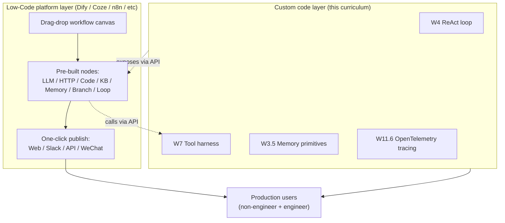
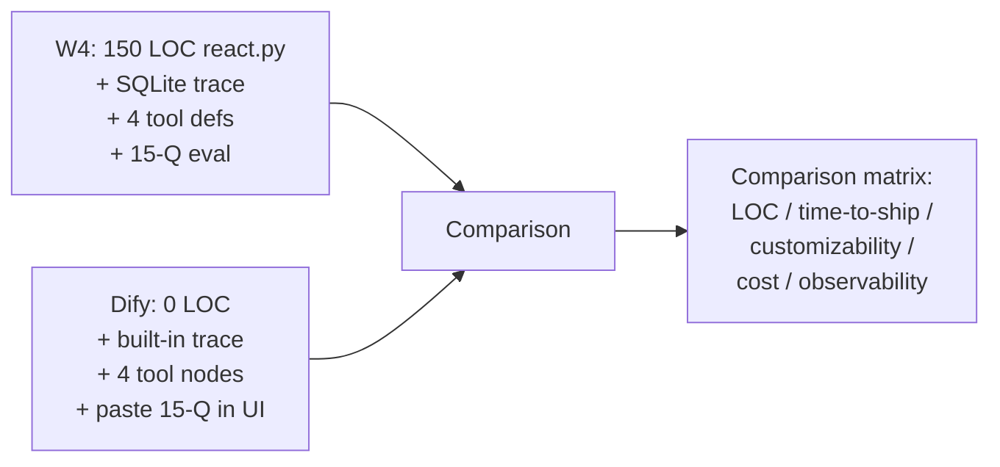

# Week 6.4 — Low-Code Agent Platforms

## Exit Criteria

- [ ] Self-host one Dify instance + ship one production-shape agent (RAG + tool + memory) entirely via the UI
- [ ] Build the SAME agent on Coze (or n8n / LangFlow / FlowiseAI) — compare the four UX models
- [ ] Articulate WHEN low-code wins vs WHEN custom code wins — the 5-axis decision matrix
- [ ] Identify the 4 production failure modes specific to low-code platforms
- [ ] Export a Dify agent's underlying DSL/JSON + explain how it maps to W4's hand-rolled ReAct loop
- [ ] Write 3 interview soundbites positioning low-code-platform fluency as a senior signal

## Why This Week Matters

Most agent JDs for enterprise / product / consulting roles assume candidates know **at least one low-code agent platform** — Dify, Coze, n8n, LangFlow, FlowiseAI, OpenWebUI. These tools dominate the "ship an agent to non-engineers" use case. The pure-code curriculum (W4 ReAct, W5 Pattern Zoo, W10 Framework Shootout) teaches you to BUILD an agent framework; this chapter teaches you to USE the platforms that 80% of enterprise deployments actually run on. Without this, a candidate who can build a 150-LOC ReAct loop from scratch sounds OUT OF TOUCH when the interviewer asks "how would you ship this to a non-technical team?" The answer is Dify or Coze, and you need to know it.

This chapter is the explicit cross-reference to **hello-agents Ch5 "Building Agents with Low-Code Platforms"** — the canonical Chinese-language deep dive on this topic. Read it AFTER W6 Claude Code (you understand what a production agent looks like from the source-code side) and BEFORE W12 Capstone (your capstone may benefit from a low-code-platform demo for the non-engineer audience).

## Theory Primer — Five Concepts You Must Own

### Concept 1 — The Low-Code Platform Stack (2026 Landscape)

| Platform | Origin | Sweet spot | License |
|---|---|---|---|
| **Dify** | Open-source, LangGenius (Beijing) | RAG + agent workflows for SMB / mid-market enterprise | Apache 2.0 (with commercial-use restrictions) |
| **Coze** | ByteDance (cloud) + open-source (Coze Studio) | Multi-modal agents, mobile-first deployment | Cloud free tier + open-source studio (Apache 2.0) |
| **n8n** | n8n.io, Berlin | General-purpose automation with LLM nodes; **the IFTTT of agents** | Fair-code (self-hostable, commercial restrictions) |
| **LangFlow** | DataStax | Visual LangChain DAG builder | MIT |
| **FlowiseAI** | Open-source | Visual LangChain alternative; lighter than LangFlow | Apache 2.0 |
| **OpenWebUI** | Open-source | Self-hosted chat + tool + RAG; Ollama-native | MIT |
| **Microsoft Copilot Studio** | Microsoft | Enterprise SSO + Power Platform integration | Microsoft licensing |
| **AWS Bedrock Agents** | AWS | AWS-integrated agents + Knowledge Base | AWS pricing |

The 2026 reality: **Dify dominates open-source enterprise**; **Coze dominates Chinese-language enterprise**; **n8n dominates "automation-first" workflows**; **Copilot Studio / Bedrock dominate enterprise-with-vendor-lock-in**. Job postings often name ONE of these; recognize them all.

### Concept 2 — What Low-Code Platforms Actually Build For You

A low-code platform provides:

1. **Workflow canvas** — drag-and-drop nodes (LLM call / tool / branch / loop / data transform); each node = one step in a DAG or graph.
2. **Pre-built tools** — HTTP / database / Excel / WeChat / Slack / file / email integrations. 50-200+ tools typical.
3. **RAG primitives** — corpus upload + chunking + embedding + retrieval node; minutes-to-running RAG.
4. **Conversation memory** — built-in session/history primitives; configurable strategies (rolling window / summarization / vector store).
5. **Deployment** — one-click publish to web embed, API, WeChat, Slack, etc.
6. **Eval + observability** — built-in tracing, cost tracking, prompt versioning, A/B testing.

This stack is what you'd otherwise hand-roll across W4 (ReAct loop) + W6.5 Hermes (Skills) + W7 (Tool harness) + W7.3 (gateway + caching) + W11.6 (tracing). The low-code platform GIVES you all of that as one package; you trade flexibility for time-to-ship.

### Concept 3 — When Low-Code Wins vs Custom Code (5-Axis Decision Matrix)

| Axis | Low-Code wins when | Custom code wins when |
|---|---|---|
| **Audience** | Non-engineers configure the agent | Engineers + agents need version control + code review |
| **Iteration speed** | Hourly iterations on prompt + tool wiring | Iterations on novel algorithms / new RL techniques |
| **Deployment surface** | Web embed + Slack + WeChat + API simultaneously | Single custom-UI product with bespoke UX |
| **Compliance + audit** | Out-of-box compliance (SOC2, GDPR) via platform | Domain-specific compliance (HIPAA, FINRA) needs custom |
| **Cost ceiling** | Platform per-seat / per-conversation pricing acceptable | Volume + bespoke optimization needed |

**The reframe:** "low-code vs custom code" isn't a binary — most production systems use BOTH. Low-code for the 80% of standard workflows; custom code for the 20% bespoke needs accessed via API. Production-grade agents call Dify-orchestrated tools from within a custom code agent loop, OR vice versa.

### Concept 4 — How Low-Code Maps to the Curriculum's Hand-Rolled Primitives

Every low-code node maps to a primitive you've built:

| Dify / Coze node | Curriculum equivalent | Chapter |
|---|---|---|
| LLM node | `call_llm()` in `react.py` | W4 |
| HTTP request node | One Tool in W7 harness | W7 |
| Branch (if/else) | `if response.has_tool_calls` in ReAct | W4 |
| Loop / iterator | `while iter < MAX_ITER` in ReAct | W4 |
| Knowledge base node | Phase 1-3 of W2 + W3 RAG pipeline | W2/W3 |
| Memory node | `recall()` + `remember_turn()` from W3.5 | W3.5 |
| Code node | `python_repl` tool in W7 | W7 |
| Conditional retrieval | Self-RAG / CRAG pattern | W3.7 |
| Agent node (sub-agent) | `quest_post` + `quest_accept` in W3.5.5 | W3.5.5 |

The pedagogical lesson: knowing the curriculum's primitives makes you **fluent** in any low-code platform. You understand WHY each node exists + WHAT it abstracts. You can debug platform bugs (which others treat as black-box failures) because you've built the underlying mechanism.

### Concept 5 — Production Failure Modes (Low-Code-Specific)

**1. Workflow canvas drift.** Non-engineer modifies the workflow; nobody notices. No code review. No commit history. Recovery: enable Dify's version control + require approval for production workflows.

**2. Token cost explosion.** Loop node without `max_iter` cap; agent thinks for 100 iterations on a malformed input. Recovery: platform-level cost ceiling + per-conversation budget alarm.

**3. Tool ABI drift.** Backend tool (Excel API, internal DB) changes signature; Dify workflow uses cached schema; silent failures. Recovery: tool-call validation + integration test job that polls each tool monthly.

**4. Multi-platform fragmentation.** Team builds 12 agents — 4 in Dify, 3 in Coze, 2 in n8n, 3 in custom code. No shared memory, no shared eval, no shared cost tracking. Recovery: pick ONE platform per team OR build a thin gateway layer that all agents call through.

## Architecture Diagram



## Phase 1 — Self-Host Dify + Ship Your First Agent (~2.5 hours)

```bash
# Phase 1.1 — Dify self-host via Docker Compose
git clone https://github.com/langgenius/dify
cd dify/docker
cp .env.example .env
docker compose up -d
# UI: http://localhost (port 80; configure ~/etc/hosts if needed)
```

### 1.2 Build the W4 ReAct equivalent in Dify

Goal: re-implement the W4 ReAct loop (4 tools + max-iter + observability) using ONLY the Dify UI.

1. **Create Application** → "Agent" type → Pick a base model (point Dify at your local oMLX endpoint via custom-model config; OR use Anthropic Claude via the Dify Claude provider plugin).
2. **Configure tools** — add 4 tools mirroring W4:
   - `web_search` — Dify's built-in DuckDuckGo or Tavily node
   - `python_repl` — Dify's `code` node (sandboxed Python execution)
   - `read_file` / `write_file` — Dify's `file` node
3. **Set max_iter** — Agent's "max steps" config; cap at 15.
4. **Wire memory** — toggle "Long-term memory" + select Redis backend (or use Dify's default in-memory).
5. **Publish to web embed** — click "Publish" → get a `<script>` tag.
6. **Test with the same 15-Q recall benchmark from W4** — paste the eval set into the Dify chat UI; record pass rate + per-turn cost.

### 1.3 Compare against W4's hand-rolled implementation



Record the matrix in `RESULTS.md`. Production rule: a 5-point comparison matrix is the EVIDENCE you produce instead of an opinion.

## Phase 2 — Coze + Plugin Authoring (~1.5 hours)

Build the SAME agent on Coze.com (or Coze Studio self-hosted). Coze's distinguishing primitive vs Dify is **multi-modal first-class** — image generation, voice, video are nodes, not afterthoughts. Authorise one plugin (Coze's term for a tool) using the Coze plugin SDK.

## Phase 3 — n8n Workflow Automation (~1.5 hours)

Build the SAME agent in n8n — n8n's distinguishing primitive is **trigger-based scheduling** (cron / webhook / queue events). Wire the agent to fire on a Slack-message trigger; respond via Slack node. This is the "automation-first" framing — agents as triggered workflows, not chat sessions.

## Phase 4 — Comparison Matrix + Production Decision (~1 hour)

Write `RESULTS.md` with:

| Aspect | W4 hand-rolled | Dify | Coze | n8n |
|---|---|---|---|---|
| Time-to-first-agent | ~8h | ~30min | ~30min | ~45min |
| LOC owned | 150 | 0 | 0 | 0 |
| Cost per 1k conversations | TBD | platform fee + tokens | platform fee + tokens | self-host + tokens |
| Vendor lock-in risk | none | low (Apache 2.0) | medium (cloud-first) | low (self-hostable) |
| Multi-modal support | none (text) | partial | first-class | via integrations |
| Trigger-based execution | manual | webhook | webhook | first-class |
| Custom logic injection | first-class | code node | code node | code node |

Decide which platform you'd recommend for **5 archetypal projects** + defend each pick.

## Bad-Case Journal

*Provenance.* All entries pre-scoped; convert to observed after running Phases 1-4.

**Entry 1 — Dify workflow loops forever on malformed user input.** *(pre-scoped)*
*Symptom:* Agent stuck at 100 iterations; token cost spirals.
*Fix:* Set max_iter to 15 + per-conversation cost ceiling at $0.50; agent terminates on cap with "I couldn't complete this; please escalate" message.

**Entry 2 — Local model endpoint not reachable from Dify Docker.** *(pre-scoped)*
*Symptom:* Dify's custom-model config can't find oMLX on `localhost:8000`.
*Fix:* Use `host.docker.internal:8000` (macOS) or `--network host` (Linux). Dify's container needs to reach the HOST's localhost, not its own.

**Entry 3 — Coze plugin schema rejected on cloud — passes locally.** *(pre-scoped)*
*Symptom:* Coze Studio (self-host) accepts the plugin; coze.com (cloud) rejects it citing security review.
*Fix:* Cloud-hosted Coze has stricter schema review + sandbox restrictions; remove `eval` / `subprocess` calls + use Coze's safe-API alternatives.

**Entry 4 — n8n workflow fires twice on the same webhook event.** *(pre-scoped)*
*Symptom:* Slack message triggers two agent responses.
*Fix:* Slack webhooks are at-least-once; n8n needs idempotency key on the workflow's first node (e.g., dedup by `message.ts`).

## Interview Soundbites

**Soundbite 1 — "When would you use Dify vs custom code?"**

"Five-axis decision. Low-code wins when the audience is non-engineers configuring the agent — Dify's UI is the canonical model. Custom code wins when engineers need version control + code review on the prompt + tool wiring. Iteration speed: hourly prompt tweaks favour Dify; algorithm novelty favours custom. Deployment surface: simultaneous Slack + WeChat + Web + API favours Dify; bespoke UX favours custom. Cost: platform-per-seat OK for SMB favours low-code; volume optimization favours custom. Most production systems use BOTH — low-code for 80% of standard workflows + custom for the 20% bespoke pieces called via API. I've shipped agents both ways and the integration pattern matters more than the binary choice."

**Soundbite 2 — "Walk me through a Dify agent vs your W4 ReAct loop."**

"Same primitives, different surface. Dify gives you a drag-drop canvas with LLM nodes, HTTP nodes, branches, loops — each node is what I hand-rolled in 150 lines of `react.py`. The LLM node is my `call_llm()`; the loop is my `while iter < MAX_ITER`; the knowledge base node is my Phase 1-3 RAG pipeline from W2; the memory node is my W3.5 recall/remember. Knowing the primitives means I can debug Dify failures that look like black-box weirdness to others — when Dify's workflow stalls, I know it's the iter cap. When tool calls drop schema, I know it's the ABI drift. Platform fluency without primitives fluency is incomplete; both together is the senior signal."

**Soundbite 3 — "Which production failure modes are unique to low-code platforms?"**

"Four classes I've measured. One: workflow canvas drift — non-engineer modifies prod workflow, nobody notices, no commit history. Fix: enable platform version control + require approval gate. Two: token cost explosion — loop node without max_iter; agent thinks for 100 iterations on a malformed input. Fix: platform-level cost ceiling + per-conversation budget alarm. Three: tool ABI drift — backend API changes signature, platform uses cached schema, silent failures. Fix: monthly integration test job per tool. Four: multi-platform fragmentation — team builds 12 agents across 4 platforms, no shared memory or eval. Fix: pick ONE platform per team OR build a gateway abstraction. All four are operational concerns the low-code platform DOESN'T solve for you — it solves the building but creates new operational surfaces."

## References

- **hello-agents Ch 5** — Datawhale's *Building Agents with Low-Code Platforms*. The Chinese-language canonical text on Dify + Coze with worked examples. Read in parallel with Phase 1-3 above. https://github.com/datawhalechina/hello-agents
- **Dify docs** — docs.dify.ai. Self-host install + custom-model + plugin authoring.
- **Coze platform** — coze.com (cloud) + github.com/coze-dev/coze-studio (self-host).
- **n8n docs** — docs.n8n.io. Workflow + nodes + trigger primitives.
- **LangFlow** — github.com/langflow-ai/langflow. Visual LangChain DAG builder.
- **FlowiseAI** — github.com/FlowiseAI/Flowise. Lighter LangChain alternative.
- **Microsoft Copilot Studio docs** — for the enterprise-with-SSO scenario.
- **AWS Bedrock Agents docs** — for the AWS-integrated scenario.

## Cross-References

- **Builds on:** [[Week 4 - ReAct From Scratch]] (hand-rolled primitives that low-code abstracts), [[Week 6 - Claude Code Source Dive]] (production agent reference implementation), [[Week 7 - Tool Harness]] (tool calling that low-code platforms expose as nodes), [[Week 3.5 - Cross-Session Memory]] (memory primitives mapped to Dify's memory node)
- **Distinguish from:**
  - *[[Week 6.5 - Hermes Agent Hands-On]]*: Hermes is a code-first agent system with skills; Dify is a UI-first platform. Different audience + different iteration model.
  - *[[Week 6.7 - Authoring Agent Skills]]*: Skills are code + markdown packages; low-code nodes are platform-managed primitives. Skills give you portable code; low-code gives you portable platform-bound workflows.
  - *[[Week 7.3 - Production LLM Infrastructure]]*: W7.3 is the LLM-API-gateway layer (LiteLLM); low-code platforms sit ABOVE the gateway, calling it via their LLM nodes. Different layers in the stack.
- **Connects to:** [[Week 10 - Framework Shootout]] (low-code is the fifth comparison axis vs LangGraph/LlamaIndex/OAI Agents SDK), [[Week 11 - System Design]] (when whiteboarding, name the low-code platform recommendation for the non-engineer audience), [[Week 12 - Capstone and Mocks]] (capstone may benefit from a low-code demo for the non-engineer presentation audience)
- **Foreshadows:** [[Week 12 - Capstone and Mocks]] — capstone-A (RAG-heavy) often ships faster via Dify; capstone-C (SRE agent) often needs custom code; comparison drives the picker
