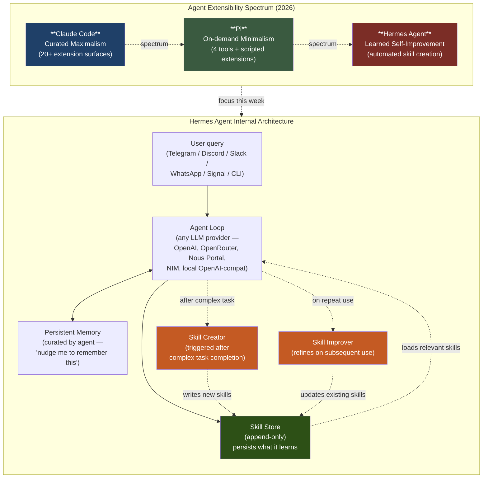

# Week 6.5 — Hermes Agent Hands-On

> Goal: Run Hermes Agent locally, observe its self-improving skill-creation loop, and complete the **Claude Code → Pi → Hermes** extensibility-spectrum comparison hands-on. Walk out able to defend the trade-off triangle (curated vs on-demand vs learned) with real observations, not just theory.

**Exit criteria.**
- [ ] Hermes Agent running locally, talking to your oMLX or vMLX endpoint
- [ ] Same canonical task executed in three agents: Claude Code, Pi, Hermes — comparison notes captured
- [ ] At least one skill **observed being created** by Hermes, then inspected on disk
- [ ] One learned skill **audited** — read the generated code, understand it, decide if you'd trust it in production
- [ ] `RESULTS.md` with a 3×3 comparison matrix (3 agents × 3 axes: extensibility, auditability, cost) + decision tree for "when would I ship which?"
- [ ] You can answer, out loud, in 60 seconds: "What is Hermes Agent's skill-creation loop, and what is its biggest production risk?"

---

## Why This Expansion Week Exists

Week 6's Claude Code source dive establishes the **maximalist limit** of the agent-extensibility spectrum: 20+ extension surfaces (plugins, skills, hooks, MCP, subagents). The Pi callout in Week 6 introduces the **minimalist limit**: 4 tools + agent self-extension on demand. Week 6.5 adds the **third position** that completes the taxonomy — Hermes Agent's **learned skill creation**, which neither pre-installs (like Claude Code) nor scripts on demand (like Pi) but instead **automatically generates, persists, and improves skills from experience**.

Reading about this is one thing; *observing it actually happen on your laptop* is another. The point of this week is not to ship Hermes — it's to internalize the trade-off triangle deeply enough that you can answer the recurring 2026 interview question "when would you choose a self-improving agent runtime?" with a real opinion grounded in real observation.

The week is **optional**: skip if your Q1 timeline is tight, revisit anytime in Q2 (per Appendix G's quarterly cadence map). It is **lighter than main weeks** — 6–8 hours rather than 12–15 — because it's primarily observation + reflection, not code-from-scratch implementation.

---

## Architecture — The Three-Position Extensibility Spectrum



**Reading the diagram:** the top half shows the three-position spectrum from Week 6's callouts. The bottom half zooms into Hermes specifically — the **two orange nodes** (Skill Creator + Skill Improver) are Hermes's defining contribution. Neither Claude Code nor Pi has anything analogous. The dashed "after complex task" trigger is the part you'll observe firing in Phase 3 of this lab.

---

## Theory Primer (~45 min)

> Three concepts. Lighter than main-week primers because the lab itself is the teacher this week; theory exists to frame what you'll see, not to substitute for it.

### Concept 1 — The Skill-Creation Loop: how Hermes turns experience into persistent capability

Claude Code's `~/.claude/skills/` directory is hand-curated — humans write `SKILL.md` files, claude reads them. Pi's extensions are scripted on demand within a session and may or may not persist depending on how you instruct it. Hermes Agent's **skill-creation loop runs autonomously**: when the agent completes a non-trivial task (heuristic: many tool calls, novel API surface, multi-step reasoning), a post-task hook fires that asks the agent itself to:

1. **Reflect** — what did I just do that's worth remembering as a reusable skill?
2. **Generalize** — strip the task-specific details, identify the reusable pattern
3. **Codify** — write the skill as executable code (typically Python) plus a description of when to invoke it
4. **Persist** — append the skill to the skill store, indexed by description embedding for later retrieval
5. **Improve** — on subsequent invocations of the same skill, refine the implementation if execution traces reveal weak points

The architecture is closest to a hand-rolled version of **Voyager** (Wang et al. 2023, the Minecraft agent that built its own skill library) generalized to arbitrary tool-using agents. The novelty in Hermes (Feb 2026) is the **production-grade scaffolding around the loop**: skill versioning, conflict resolution between similar skills, retrieval-time skill ranking, and the cross-platform front-ends (Telegram/Discord/Slack/WhatsApp/Signal) that turn it into something an end user can actually live with day-to-day.

> **Interview soundbite:** "Hermes implements the Voyager-style skill-learning loop — agent reflects after complex tasks, generalizes the pattern, writes executable code, persists it for retrieval. The novelty isn't the algorithm; it's that Hermes ships the scaffolding around it well enough that the loop runs unattended at production scale. Claude Code is curated, Pi is on-demand, Hermes is learned — and 'learned' is qualitatively different in what it enables and what it risks."

---

### Concept 2 — Auditability vs Autonomy: the trade-off you cannot escape

The defining strength of learned skills is also their defining weakness: **the agent generates code that no human reviewed before persistence.** When Claude Code reads a hand-curated skill from `~/.claude/skills/`, you can audit that file. When Pi scripts an extension on demand, you see it being scripted. When Hermes invokes a learned skill three weeks after creating it, you may have **never read the generating code at all**.

This is not a hypothetical concern. The 2026 production-agent failure modes that have surfaced in postmortems all share a common shape: a learned skill that worked fine for 100 invocations developed a subtle bug under edge-case input and silently produced wrong output until a human noticed. The auditability gap is real. Hermes mitigates it with skill versioning + retrieval logs + the ability to flag a skill for review, but the mitigation requires **operational discipline** — if no human ever runs the audit, the gap stays open.

The trade-off is workload-specific:

| Context | Recommendation |
|---|---|
| **Personal productivity, single user, low blast radius** | Hermes' autonomy is worth the audit gap. You'll fix bugs you encounter. |
| **Production system, multi-user, regulated industry** | Curated (Claude Code) or scripted-with-review (Pi) wins. Autonomous skill creation is a compliance liability. |
| **Internal tooling, technical audience, medium blast radius** | Hermes with **mandatory weekly audit ritual** of new skills — the operational discipline closes the gap if you actually do it. |

> **Interview soundbite:** "Hermes Agent's biggest production risk is the auditability gap — learned skills are code that no human reviewed before the agent invoked them. For personal productivity it's a fair trade. For regulated environments it's a compliance liability. The mitigation — versioning + audit logs + review queue — only works if the operational discipline is real, not aspirational. That's the Microsoft Agent Governance Toolkit conversation in concrete form."

---

### Concept 3 — The Cost Curve: $5 VPS to GPU cluster

Hermes Agent is deliberately designed to span the cost spectrum from "barely-running" to "production GPU cluster." That flexibility is itself an architectural choice worth understanding:

- **$5 VPS tier** — works because Hermes delegates inference to an external API (OpenRouter, Nous Portal, your local oMLX). The Hermes process itself does only orchestration + skill storage + I/O — minimal compute. This is the **commodity tier** that makes Hermes accessible to solo developers who can't afford GPU rentals.
- **Local oMLX/vMLX tier** — what you'll do this lab. Hermes orchestration runs on your laptop CPU, model inference on your Apple Silicon GPU. Zero cloud cost, full privacy.
- **Serverless tier** — Hermes idle costs nothing because it's just a Python process that wakes on incoming messages. Wakeup latency adds ~200ms to the first response in a cold session; cached for the rest.
- **GPU cluster tier** — for multi-user enterprise deployments. Hermes the runtime stays small; you scale by running more model-server replicas behind it.

The architectural lesson worth carrying forward: **separate orchestration from inference.** This is the same lesson Claude Code teaches (the agent is small, models are external). Frameworks that bundle inference and orchestration into a single binary lose this flexibility and can't span the cost curve. Hermes' design honors the separation; that's why it can run on a $5 VPS.

> **Interview soundbite:** "Hermes' cost-curve flexibility comes from a clean separation of orchestration and inference — the agent process is small, models are external. That's the same architectural lesson Claude Code teaches. Frameworks that bundle inference into the agent process can't span from $5 VPS to GPU cluster — they're locked at one tier. Worth knowing as a design principle even if you never deploy Hermes specifically."

---

### Companion Texts

- **[NousResearch/hermes-agent on GitHub](https://github.com/NousResearch/hermes-agent)** — primary source, MIT license, ~95.6k stars (Apr 2026)
- **[Hermes Agent — The Agent That Grows With You](https://hermes-agent.nousresearch.com/)** — official site with use-case demos
- **[awesome-hermes-agent (0xNyk)](https://github.com/0xNyk/awesome-hermes-agent)** — curated extensions catalog
- **[hermes-agent-orange-book (alchaincyf)](https://github.com/alchaincyf/hermes-agent-orange-book)** — Chinese-language deep-dive guide (中文版深度教程，从入门到精通)
- **[Voyager (Wang et al. 2023)](https://arxiv.org/abs/2305.16291)** — the original skill-learning Minecraft agent paper that Hermes generalizes; ~30 min read
- **Cross-curriculum**: revisit Week 6's Pi callout + Concept 1 (1.6%/98.4% split) before starting this lab — the spectrum framing is the prerequisite mental model

---

## Phase 1 — Install Hermes Agent (~30 min)

### 1.1 Lab scaffold

```bash
mkdir -p ~/code/agent-prep/lab-06.5-hermes-handson
cd ~/code/agent-prep/lab-06.5-hermes-handson
mkdir -p data observations skills_audit results
git init
```

### 1.2 Clone Hermes from GitHub

```bash
git clone https://github.com/NousResearch/hermes-agent.git
cd hermes-agent
```

> **Note on git config.** If `git clone` fails with SSH host-key errors, you've already fixed this in Week 0 Phase 8.5 troubleshooting (HTTPS rewrite + known_hosts). If you skipped that, jump back and run those two commands now.

### 1.3 Read the README + skim the source structure

```bash
cat README.md | head -100        # high-level overview
ls -la                            # repo structure
find . -name "*.py" -path "*/agent/*" | head -10    # core agent code locations
find . -name "skill*" -type d     # skill storage convention
```

**What to look for during the skim** (5–10 min):
- The agent loop entry point (likely `hermes/main.py` or `hermes/agent.py`)
- The skill-creation hook — search for "skill" + "create" or "generate" or "reflect"
- The persistence layer — where skills get written to disk
- The model-provider abstraction — how it routes between OpenAI/OpenRouter/Nous Portal/local

### 1.4 Install dependencies + configure for local oMLX

Hermes' README will have specific install instructions; the rough shape is:

```bash
# Activate your project venv
source ~/code/agent-prep/.venv/bin/activate

# Install Hermes
pip install -e .                  # if installable via pip
# OR
pip install -r requirements.txt   # if requirements-only

# Configure for local oMLX (OpenAI-compatible endpoint)
cat > .env <<'EOF'
HERMES_PROVIDER=openai
OPENAI_BASE_URL=http://127.0.0.1:8000/v1
OPENAI_API_KEY=Shane@7162
HERMES_DEFAULT_MODEL=Qwen3.6-35B-A3B-nvfp4
HERMES_SKILL_STORE_DIR=~/code/agent-prep/lab-06.5-hermes-handson/skills_audit
EOF
```

> **Provider configuration may differ** — read Hermes' actual config docs. The principle is the same: Hermes supports any OpenAI-compatible endpoint, your oMLX exposes one at `:8000`.

### 1.5 Smoke test

```bash
# Start Hermes in CLI mode (the simplest front-end)
hermes  # or `python -m hermes` depending on package layout

# At the Hermes prompt:
> Hello. What are you and what can you do?
```

Expected: a coherent self-introduction that names Hermes' capabilities (memory, skills, multi-platform), referencing the model you configured. If it errors connecting to the model server, check `OPENAI_BASE_URL` and verify oMLX is up: `curl -s http://127.0.0.1:8000/v1/models | jq '.data[].id'`.

---

## Phase 2 — The Three-Agent Comparison: Same Task, Three Runtimes (~2 hours)

The point of this phase is **observation, not benchmarking.** You're going to run the same task in Claude Code, Pi, and Hermes, then capture *how each one behaves differently*. The numerical results matter less than the qualitative pattern.

### 2.1 The canonical task

```
"Research the 2026 state of the Model Context Protocol (MCP) ecosystem.
Identify the top 3 production-grade MCP server implementations,
note one strength and one limitation of each, and produce a
structured summary I could send to a colleague."
```

This task is good for the comparison because it's:
- **Genuinely tool-using** (web search + reading + structured output)
- **Non-trivial enough** to plausibly trigger Hermes' skill-creation hook
- **Reproducible** — the answer should be similar across runtimes

### 2.2 Run in Claude Code

```bash
# Use your existing Claude Code session (or your `cl` alias for local-routing)
cl
> [paste the canonical task]
```

Capture (in `observations/run-claude-code.md`):
- How many turns/tool calls it took
- Which tools it used (Read, Write, Bash, MCP servers, web search, etc.)
- Whether it loaded any extensions or skills
- Final output (the structured summary)
- Subjective: did it feel curated? Did the model rely on pre-existing scaffolding?

### 2.3 Run in Pi

```bash
cd /path/to/pi-repo  # if you cloned it earlier from the Week 6 callout
python pi.py
> [paste the canonical task]
```

Capture (in `observations/run-pi.md`):
- Same fields as Claude Code
- Specifically: did Pi script any new extensions on demand for this task? If so, what?
- Subjective: did it feel minimal? Did the agent compose its own scaffolding from primitives?

### 2.4 Run in Hermes

```bash
cd ~/code/agent-prep/lab-06.5-hermes-handson/hermes-agent
hermes
> [paste the canonical task]
```

Capture (in `observations/run-hermes.md`):
- Same fields as the previous two
- **Specifically watch for skill creation.** After the task completes, did Hermes log a "creating new skill" or "persisting skill" message? Check the `skills_audit/` directory — was a new file written?
- Subjective: did it feel learned? Did the agent's behavior reveal that it was building reusable internal abstractions?

### 2.5 Compare and reflect (~30 min)

Open `observations/comparison.md`. Side-by-side table:

```markdown
| Dimension | Claude Code | Pi | Hermes |
|---|---|---|---|
| Total turns | | | |
| Tool calls | | | |
| New artifacts persisted | | | |
| Skill/extension created? | (rare — would be in `~/.claude/skills/`) | (yes if scripted, in session) | (yes — observe skill_audit/) |
| Output quality (1–5) | | | |
| Wall time | | | |
| Felt like... | curated assistant | composer of primitives | learner accumulating capability |
```

Three paragraphs of reflection: which runtime "felt right" for this task, and why? Note the felt-experience matters — it's the data point you can't get from reading.

---

## Phase 3 — Observe Skill Creation In the Wild (~1 hour)

If Phase 2's task didn't trigger Hermes' skill-creation loop (likely, depending on its trigger heuristics), construct a task specifically designed to fire it.

### 3.1 Design a skill-trigger-friendly task

Hermes' skill-creation hook fires after **complex multi-step tasks with reusable structure.** Examples that tend to trigger:

```
"For each of these 3 GitHub repositories (https://github.com/X, ...),
fetch the latest 5 commits, summarize the change pattern, and produce
a markdown report. Then save the report as 'repo-activity.md' in this directory."
```

The shape that triggers learning:
- A **batch operation** (3 repos = 3 iterations of similar work)
- **Multiple tools per iteration** (fetch, summarize, save)
- **Structured output** (markdown report = reusable template)

### 3.2 Run it and watch

```bash
hermes
> [paste the task]
# Watch verbose output for skill-creation messages
```

Hermes should — if its heuristic fires — log something like:

```
[skill_creator] Task complete. Reflecting on reusable pattern...
[skill_creator] Generalized: 'fetch-summarize-batch' (repos N → markdown report)
[skill_creator] Persisting skill to skills_audit/fetch_summarize_batch.py
[skill_creator] Indexed for retrieval (description embedding stored)
```

**If it doesn't fire**, that's data — Hermes' heuristic is conservative and didn't think the task was generalizable enough. Try a different task, or check Hermes' config for a `force_skill_creation` flag.

### 3.3 Inspect the persisted skill

```bash
ls -la skills_audit/
cat skills_audit/fetch_summarize_batch.py        # or whatever it was named
```

Capture observations in `observations/skill-inspection.md`:
- How many lines of code was the generated skill?
- Is it structured well? Does it have docstring, error handling, type hints?
- What model did Hermes use to generate it? (check the metadata if logged)
- **Most important question**: would you accept this as a PR from a junior engineer? Why or why not?

### 3.4 Re-invoke the skill, observe improvement

```bash
hermes
> "Use the fetch-summarize-batch skill on these new repos: [list]"
```

If Hermes detects the skill is applicable, it should retrieve and execute it without re-generating. Watch for:
- **Retrieval log** — "Skill 'fetch-summarize-batch' matched query, loading"
- **Improvement log** — if execution reveals a bug or weak point, "Skill refined; v2 persisted"

Capture: did the skill execute correctly? Did Hermes improve it? What changed in v2 vs v1 (if you can diff them)?

---

## Phase 4 — The Audit (~1.5 hours)

This is the phase that tests whether you actually believe the auditability concerns from Concept 2 — by trying to audit a learned skill yourself.

### 4.1 Pick a learned skill to audit thoroughly

Choose the most complex skill Hermes has generated so far (probably from Phase 3.2). Open it in your editor.

### 4.2 The audit checklist

Read the skill code and answer in `observations/audit-<skillname>.md`:

- **Correctness** — does it actually do what its description claims? Trace through manually.
- **Edge cases** — what happens with empty input? Malformed input? Auth failures? Rate limits? List the cases the code handles AND the cases it doesn't.
- **Security** — does it call `eval`/`exec` on untrusted strings? Construct shell commands by string concatenation? Read files outside its scope? Make network calls to unexpected hosts?
- **Idempotency** — if invoked twice with the same input, does it produce the same output without side-effect drift?
- **Error handling** — does it fail loudly on unrecoverable errors, or silently swallow them?
- **Dependencies** — does it import packages that aren't already in your venv? Does it assume external services are available?

Then make a **ship/no-ship/needs-revision verdict** with one sentence of reasoning.

### 4.3 Reflect on what the audit revealed

In `observations/audit-reflection.md`:

> If I shipped this Hermes deployment to a team of 10 engineers and the skills folder accumulated 50 learned skills over a quarter, how many would I want to audit before going to production? At what cadence? Who pays for that work? What's the dollar cost of skipping it (vs the dollar cost of doing it)?

This is the question that separates the "Hermes is amazing" demo reaction from the "Hermes is a production option" engineering reaction. The answer is workload-specific (Concept 2's table) but the *exercise of trying to answer it for your own project* is the learning outcome of this phase.

---

## Phase 5 — RESULTS.md and the Decision Tree (~1 hour)

Save as `results/RESULTS.md`. Required sections:

```markdown
# Lab 06.5 — Hermes Agent Hands-On

**Date:** 2026-MM-DD (week 6.5 of curriculum)
**Hermes version:** v$(git -C hermes-agent describe --tags --always)
**Model used:** [oMLX / vMLX model name]

## 1. Three-Agent Comparison Matrix

| Axis | Claude Code | Pi | Hermes |
|---|---|---|---|
| **Extensibility model** | Curated (hand-authored skills) | On-demand (scripted in session) | Learned (auto-generated + persisted) |
| **Auditability** | High (every skill is a reviewed file) | High (you see the script being written) | Low (skill code may never have been read) |
| **Cost ceiling** | Anthropic API costs | Same (one model) | $0 if local, scales to GPU cluster |
| **Cost floor** | Need a frontier model | Same | $5 VPS + cheap remote API |
| **Setup time** | Minutes | Minutes | ~30 min for first run |
| **Cross-platform UI** | CLI / VS Code | CLI | CLI + Telegram + Discord + Slack + WhatsApp + Signal |
| **Best fit** | Pro coding assistant | Solo dev minimalism | Personal productivity / accumulating capability |
| **Worst fit** | Disposable one-off tasks | Multi-user prod | Regulated environments without audit discipline |

## 2. Skill Inspection Findings

(Number of skills Hermes generated during this lab. Mean/max LOC. Subjective code quality. Audit verdicts.)

## 3. The Decision Tree (when would I ship which?)

```
New agent project starting today
│
├── Solo developer, personal productivity, willing to fix bugs as found?
│   └── Hermes Agent (autonomy is worth the audit gap at this scale)
│
├── Small team, internal tooling, can commit to weekly skill audits?
│   └── Hermes Agent + mandatory audit ritual
│
├── Production / multi-user / regulated?
│   ├── Pre-existing senior-eng-curated skills mostly cover the need? → Claude Code
│   └── Need maximal flexibility with code-level review on every extension? → Pi (+ explicit review gates)
│
└── Coding agent specifically (file-level work, sandboxed shell)?
    └── Claude Code (or Pi if minimalism matters more than features)
```

## 4. What I Learned That I Did Not Expect

(Free-form 2–3 paragraphs. Probably about the felt difference between curated/on-demand/learned, or about a specific surprise from the audit.)

## 5. Bad-case journal entry

(One incident from this lab worth remembering: a skill that was wrong, an integration that broke, a moment where the runtime did something surprising.)

## 6. Infra bridge

(How does this connect back to your Cloud Infra background? Hint: skill versioning + retrieval is essentially Terraform module management; auditability is essentially policy-as-code; the orchestration/inference separation is essentially Kubernetes' pod/container split. Pick one and write 3 sentences.)
```

---

## Lock-In (~45 min)

### Anki cards (5)

1. **What is Hermes Agent's defining contribution vs Claude Code and Pi?**
   → The skill-creation loop: agent reflects after complex tasks, generalizes the pattern, writes executable code, persists for retrieval. Claude Code = curated, Pi = on-demand, Hermes = learned.

2. **What is the biggest production risk of Hermes Agent?**
   → Auditability gap: learned skills are code that no human reviewed before invocation. Compliance liability in regulated environments unless an explicit weekly audit ritual catches new skills.

3. **Hermes' cost-curve flexibility comes from what architectural choice?**
   → Clean separation of orchestration (small, runs anywhere) from inference (any provider, scales independently). Allows $5 VPS to GPU cluster span.

4. **Voyager paper relevance to Hermes?**
   → Voyager (Wang 2023, Minecraft skill-learning agent) is the algorithmic ancestor. Hermes generalizes Voyager's skill-learning loop to arbitrary tool-using agents and adds production-grade scaffolding (versioning, retrieval, conflict resolution).

5. **The three-position extensibility spectrum (memorize for interviews)?**
   → Claude Code (curated maximalism, 20+ extension surfaces) → Pi (on-demand minimalism, 4 tools + scripted) → Hermes (learned automation, agent generates own skills). All three ship in 2026; choose based on workload + auditability needs.

### Spoken interview questions (3)

1. *"Tell me about a 2026 agent runtime that's not Claude Code or LangGraph."* (90-second Hermes Agent answer with the spectrum framing.)
2. *"How would you decide between a self-improving agent and one with curated skills?"* (Use Concept 2's workload-context table.)
3. *"What's your take on the auditability problem with learned-skill agents?"* (Honest framing: real concern, mitigation requires operational discipline, ship-decision is workload-specific.)

---

## Troubleshooting

| Symptom | Likely cause | Fix |
|---|---|---|
| `git clone` fails with SSH host-key error | Week 0 Phase 8.5 troubleshooting wasn't run | Apply the `ssh-keyscan` + `git config insteadOf` fix from Week 0 |
| Hermes errors connecting to model | `OPENAI_BASE_URL` mismatch or oMLX not running | `curl -s http://127.0.0.1:8000/v1/models` to verify oMLX; restart oMLX from menu bar if down |
| Hermes never triggers skill creation | Heuristic conservative; task too simple or too unique | Use Phase 3.1 batch-operation task pattern; check for a `--verbose` or `--force-skill-create` flag |
| Generated skill is broken / non-runnable | Model used was too small (haiku-tier) | Switch `HERMES_DEFAULT_MODEL` to opus-tier (`Qwen3.6-35B-A3B-nvfp4`); regenerate the skill |
| Multiple skills generated for similar tasks (no consolidation) | Hermes' conflict-resolution didn't merge them | Manually inspect skill descriptions; if true duplicates, delete the older one and keep the more general one |
| Audit reveals a security-risky skill | Generated code calls `eval` or builds shell commands by string concat | Delete the skill, file an issue against Hermes (this is a bug in their skill-creation prompt), document in your bad-case journal |
| Hermes consumes lots of disk/memory | Skill store grew unbounded | Set a max-skills cap in config; manually prune old/unused skills |
| You're not sure if the lab "worked" | Subjective lab — there's no green-light test | Did you produce all 5 RESULTS.md sections? If yes, it worked. The point is the observations, not a passing test |

---

## What's Next

Open [[Week 7 - Tool Harness]] when this lab's `RESULTS.md` is committed. The Hermes lessons connect directly to Week 7's MCP/permission/error-handling concepts — specifically the Pi counter-thesis callout and the Dependabot real-world-example callout in Week 7 will read with much more weight after you've watched Hermes generate its own skills.

> **Saturday Trend-Tracking note (Appendix G).** When you start the post-Week-12 ritual, Hermes Agent's GitHub releases page is one of the eight weekly sources to skim — the project is moving fast (1500+ commits in the first 7 weeks), and the 3-question triangulation filter will tell you when an update is worth a curriculum revisit. The likely revisit candidates are: changes to the skill-creation heuristic (updates Concept 1), changes to the audit/governance features (updates Concept 2), and new front-end integrations (interesting but Tier-2 mention only).

— end —


---

## Interview Soundbites

**Soundbite 1.** Hermes Agent's skill-creation loop is a generalization of the Voyager algorithm: after completing a complex multi-step task, the agent reflects on what it did, strips task-specific details to find the reusable pattern, writes executable Python, and persists it with an embedding index for retrieval. What separates this from a base model prompted to do the same is that the scaffolding runs unattended — skill versioning, conflict resolution between near-duplicate skills, and retrieval-time ranking are production-grade infrastructure, not demo glue. A base model can generate code on request; Hermes accumulates a library from experience.

**Soundbite 2.** Running Hermes locally means orchestration is just Python on your laptop CPU while inference goes to your MLX endpoint on Apple Silicon. Orchestration layer is small by design — separation of concerns lets you swap inference tiers without touching the agent. Practical trade-off: local MLX at haiku-equivalent tier produces weak skill code; lab troubleshooting table makes this explicit — switch to 35B-A3B model or learned skills arrive with missing error handling and no type hints. Inference latency adds up across multi-call skill-creation loop, so expect 30-90 extra seconds post-task when heuristic fires on batch operations.

**Soundbite 3.** Hermes earns its place for single-user personal productivity where accumulating capability over weeks matters and blast radius of a buggy learned skill is low — you'll notice and fix it. Frontier API models win wherever task is one-shot, latency-sensitive, or prompt envelope is unpredictable — instruction-following ceiling higher and you're not paying post-task reflection overhead. Hard line: regulated or multi-user production. Hermes' autonomy is a compliance liability there unless you enforce a weekly audit ritual with real teeth — operational discipline, not a technical guarantee. Workload-specific decision, not a capability race.

---

## References

- **Wang et al. (2023).** *Voyager: An Open-Ended Embodied Agent with LLMs.* arXiv:2305.16291. Algorithmic ancestor of Hermes' skill-creation loop.
- **NousResearch/hermes-agent.** GitHub, MIT license. ~95.6k stars (Apr 2026). Architecture, config schema, OpenAI-compatible provider abstraction.
- **Hermes Agent official site** — hermes-agent.nousresearch.com. Cross-platform front-end docs (Telegram, Discord, Slack, etc.).
- **0xNyk/awesome-hermes-agent.** Curated extensions catalog.
- **alchaincyf/hermes-agent-orange-book.** Chinese-language deep-dive.
- **Schick et al. (2023).** *Toolformer.* arXiv:2302.04761. Why fine-tuned models exhibit stronger tool-call reliability than instruction-tuned base.
- **Microsoft Agent Governance Toolkit (2026).** Compliance risk taxonomy for autonomous code generation.

---

## Cross-References

- **Builds on:** W0 Environment Setup (MLX endpoint, OpenAI-compatible config); W6 Claude Code Source Dive (curated-maximalism end of extensibility spectrum that W6.5 contrasts against); W4 ReAct (loop mechanics Hermes' skill-creation hook wraps around).
- **Distinguish from:** API-based frontier models (Claude, GPT-4) — Hermes trades lower instruction-following ceiling + higher setup friction for zero recurring inference cost + accumulating skill library; frontier APIs offer higher single-call quality + zero ops overhead but no cross-session learning + per-token billing compounding with multi-step loops. Also distinguish from Pi (W6 callout): Pi scripts extensions on demand within session and does not persist; Hermes persists autonomously across sessions.
- **Connects to:** W7 Tool Harness — MCP permission model + error handling read differently after watching Hermes generate skills that may lack error handling; W10 Framework Shootout — Hermes is one of the backends evaluated.
- **Foreshadows:** W11 System Design — local-first deployment with Hermes as inference-decoupled orchestration; cost-curve ($5 VPS to GPU cluster) maps to W11's multi-tenancy and scaling. W12 Capstone — auditability gap and decision tree for Hermes vs curated alternative are live design constraints.
