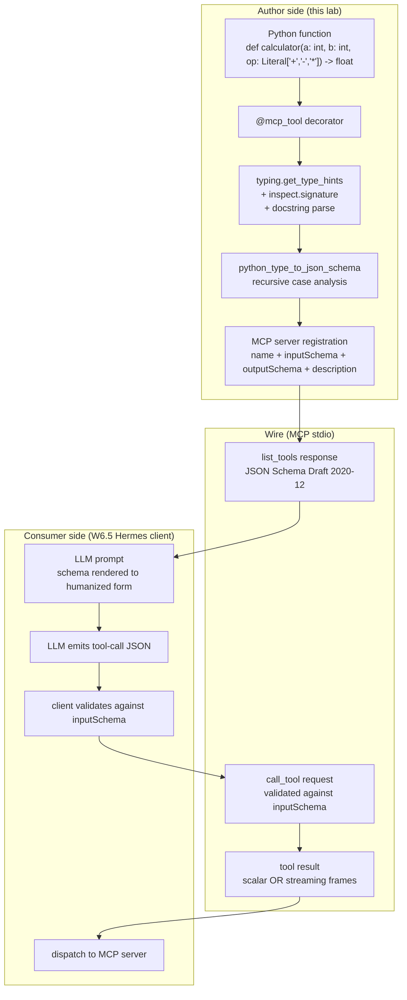

> **Status: SPEC DRAFT (2026-05-14).** This chapter is a planning skeleton produced from cross-repo convergence research (PraisonAI `function_to_mcp_schema` + AutoGPT typed Block I/O + agenticSeek `parse_agent_tasks` JSON-IPC contract). Phase Python blocks marked `TBD` are scoped but not yet written. Reviewer-pass before implementation. Spec source: research dossier on PraisonAI / AutoGPT / agenticSeek / MCP Python SDK + FastMCP (2026-05-14).

## Exit Criteria

- [ ] `src/schema_bridge.py` — `python_type_to_json_schema()` covering `Optional`, `Union`, `List`, `Dict`, `Tuple`, `Literal`, nested `BaseModel`; ported and extended from PraisonAI's ~100 LOC reference impl
- [ ] `src/mcp_tool_decorator.py` — `@mcp_tool` decorator that introspects type hints + docstring + return type → emits a valid MCP tool registration with **zero hand-written schema**. A Python function with 5 typed parameters becomes a valid MCP tool with zero hand-written schema (this is the load-bearing exit number).
- [ ] `src/mcp_server.py` — MCP stdio server exposing 5 example tools (`calculator`, `file_search`, `code_runner`, `web_fetch_mock`, `async_counter`); the last tool streams partial results via `AsyncGenerator`
- [ ] `tests/test_schema_bridge.py` — round-trip property test: 20 hand-written Python functions → derived schemas → JSON-Schema-Draft-2020-12 validator accepts; consumer LLM (W6.5 Hermes) emits tool-calls that validate against the schema 100% of the time
- [ ] `RESULTS.md` — comparison: hand-written MCP tool definition (lines of YAML/JSON) vs `@mcp_tool` derived (lines of Python). Measure: LOC savings, schema-drift rate over 10 hypothetical function-signature edits, p50 introspection latency.

---

## 1. Why This Week Matters (~150 words — REQUIRED)

W3.5.5 plugged the reader into the **consumer** side of MCP: a `GuildClient` that read lore + accepted quests from the guild MCP server. The reader saw MCP from the outside — JSON in, JSON out, the server was a black box. W6.5 then taught the LLM-side discipline: Hermes-style structured output, the model emits JSON the agent can dispatch on. **This week is the missing piece between the two: how a Python function on YOUR side of the wire becomes an MCP tool the LLM can call.** The boundary between an LLM and a tool is a schema, not a natural-language description; the cleanest way to ship a Python function as an MCP tool is to derive the schema from the function's type hints — single source of truth, zero drift between implementation and contract. **The senior-engineer signal is "I can talk about schema-as-contract, type-hint introspection rules, and why streaming-output tools need a different protocol than scalar-return ones"** — and the reader who can describe their `@mcp_tool` decorator's mapping rules, point at the `Optional[X] → X` drop and explain *why*, and demo a streaming-output tool over MCP, is the candidate who has actually built a tool platform, not just consumed one.

---

## 2. Theory Primer (~1000 words — REQUIRED — OUTLINED, FULL TEXT IN ROUND 2)

### 2.1 The schema-as-contract thesis

The MCP spec's load-bearing claim is that a tool is defined by its **JSON Schema**, not by its prose description. The description is for the LLM's prompt; the schema is what the runtime validates against. Get the schema wrong and the LLM emits well-formed-looking JSON that fails server-side validation; get the schema right and the description can drift — the runtime contract holds. This inverts the LangChain-era pattern where prose descriptions were the source of truth and schemas were derivative.

### 2.2 Five concepts to own before writing code

1. **Schema-as-contract.** JSON Schema (Draft 2020-12) is the wire format. `type`, `properties`, `required`, `enum`, nested `object`, `items` for arrays. The MCP server emits this; the MCP client validates incoming tool-calls against it; the LLM is prompted with a humanized rendering of it. Three layers, one canonical artifact.
2. **Type-hint introspection.** Python 3.11+ exposes runtime type metadata via `typing.get_type_hints(fn, include_extras=True)` and `typing.get_origin` / `typing.get_args`. The introspection is structural: `Optional[int]` is sugar for `Union[int, None]`, which `get_origin` reports as `typing.Union` with `get_args == (int, NoneType)`. Every schema-bridge library boils down to recursive case analysis over these primitives.
3. **Optional / Union / Generic mapping rules.** The non-trivial cases: `Optional[X] → schema(X)` with the field dropped from `required` (NOT a `Union` with `null`, by MCP convention); `Union[A, B, C] → {"oneOf": [schema(A), schema(B), schema(C)]}` (schema explodes proportionally); `List[X] → {"type": "array", "items": schema(X)}`; `Dict[str, X] → {"type": "object", "additionalProperties": schema(X)}`; `Tuple[A, B, C] → {"type": "array", "prefixItems": [...]}` (tuples become fixed-shape arrays in 2020-12). `Literal["a", "b"] → {"enum": ["a", "b"]}`. Nested `pydantic.BaseModel` recursively emits a sub-schema.
4. **Streaming via `AsyncGenerator` + content-type protocol.** A scalar tool returns once; a streaming tool yields N partial results. MCP supports this via a multi-frame response protocol — each yielded `BlockOutputEntry` (AutoGPT's term) becomes one frame on the wire, with a final terminator frame. The Python signature is `async def tool(...) -> AsyncGenerator[OutputT, None]`; the decorator detects `AsyncGenerator` in the return annotation and registers a streaming-capable tool instead of a scalar one.
5. **Schema versioning + backward-compat.** A tool's schema is part of its public contract. Adding a non-required field is safe; adding a required field is a breaking change for older consumers. Renaming a field is breaking. Changing `type: integer → type: number` is safe (widening); the reverse is breaking (narrowing). The mature pattern: version the tool name (`calculator_v2`) on breaking changes, keep `calculator_v1` registered for a deprecation window, surface a deprecation warning in the description string.

### 2.3 Papers + references to cite (TBD-fill in round 2)

- Anthropic. *Model Context Protocol Specification* (latest revision at time of writing). https://modelcontextprotocol.io/specification — canonical wire-format reference.
- JSON Schema. *Draft 2020-12 Core + Validation.* https://json-schema.org/draft/2020-12 — the schema dialect MCP uses; `prefixItems` for tuples, `oneOf` for unions, `enum` for literals.
- Pydantic 2.x docs, `TypeAdapter` section — the fast-path alternative to hand-rolled introspection; ~10× faster for hot-path tool registration on large schemas.
- FastMCP — `jlowin/fastmcp` — production-grade decorator-based MCP server framework; reference for ergonomics + edge-case handling.
- PraisonAI `mcp_utils.py` — `python_type_to_json_schema` + `function_to_mcp_schema`, ~100 LOC, the cleanest minimal reference impl.
- AutoGPT `backend/data/block.py` — typed Block I/O with `input_schema` / `output_schema` and `AsyncGenerator[BlockOutputEntry, None]`; the streaming pattern we port in Phase 5.
- agenticSeek `parse_agent_tasks` — JSON-IPC between agents; the consumer-side validation pattern that closes the loop.

### 2.4 Distinguish-from box

- **Schema bridge ≠ free-text tool descriptions.** Pre-MCP, the LangChain pattern was a Python docstring + a few example calls in the prompt. The LLM inferred shape from prose. Schema bridge replaces this with a deterministic JSON Schema derived from the function signature — the prose is for humans, the schema is for the runtime.
- **Schema bridge ≠ OpenAI function-calling format.** OpenAI's tool format is a subset of JSON Schema with specific extensions (`parameters` instead of `inputSchema`, no `outputSchema`, no streaming). Several open-source tools that "support OpenAI function calling" do NOT cover the MCP surface. We build for MCP and note the porting delta.
- **Schema bridge ≠ Pydantic models everywhere.** Pydantic `BaseModel` is one valid input type; plain `int`, `str`, `List[float]`, `Optional[Path]` are equally valid and far more ergonomic for one-off tools. The decorator handles both; do not force users into BaseModel-everywhere.
- **Streaming tools ≠ async tools.** All MCP tools can be `async def`; only those returning `AsyncGenerator[T, None]` are *streaming*. The decorator dispatches on return annotation, not on `async def` alone.

---

## 3. System Architecture (REQUIRED — Mermaid)

**Reading the diagram.** The author writes a typed Python function. The `@mcp_tool` decorator introspects it once at registration time and emits a JSON-Schema-Draft-2020-12 input+output schema. The MCP server publishes the schema via `list_tools`. The consumer LLM (Hermes from W6.5) sees the schema in its prompt, emits a tool-call, the client validates the call against the same schema, dispatches over MCP stdio, and the server returns either a scalar result or a stream of frames (for `AsyncGenerator` tools). One schema, three consumers (LLM prompt, client validator, server validator), zero drift.

---

## 4. Lab Phases (REQUIRED — TBD code, scoped now)

### Phase 1 — `python_type_to_json_schema` helper (~1 hour)

Goal: port PraisonAI's ~100-LOC introspection helper to `src/schema_bridge.py`, extend it for `Literal`, nested `pydantic.BaseModel`, and `Tuple` with `prefixItems`. Hand-write 20 type-hint test cases in `tests/test_schema_bridge.py` covering every branch.

- **TBD code** — `src/schema_bridge.py`, ~150 LOC after extensions.
- **TBD verification** — 20 round-trip tests pass; each derived schema validates a hand-crafted positive example and rejects a hand-crafted negative example.
- Pedagogical note: this is the boring, load-bearing step — the rest of the chapter rides on the correctness of this helper. Force the reader to write the negative-example tests; the positive-only tests pass by accident too often.

### Phase 2 — `@mcp_tool` decorator (~1.5 hours)

Goal: wrap `python_type_to_json_schema` in a decorator that introspects function signature + docstring + return annotation and registers the function with an in-memory MCP tool registry. Type hints → `inputSchema`; docstring → `description`; return type → `outputSchema`. Detect `AsyncGenerator` in the return annotation and tag the tool as `streaming: true` (used in Phase 5).

- **TBD code** — `src/mcp_tool_decorator.py`.
- **TBD verification** — registering a function with 5 typed parameters produces a valid MCP `Tool` object with zero hand-written schema (THE exit-criterion measurement).

### Phase 3 — MCP stdio server with 5 example tools (~1.5 hours)

Goal: build `src/mcp_server.py` using the official `mcp` Python SDK (same package as W3.5.5). Expose 5 tools, each demonstrating a different type-hint shape:

1. `calculator(a: int, b: int, op: Literal['+', '-', '*', '/']) -> float` — `Literal` → `enum`.
2. `file_search(query: str, paths: List[Path], case_sensitive: bool = False) -> List[FileMatch]` — nested BaseModel + default value → `required` drop.
3. `code_runner(code: str, language: Literal['python', 'bash'], timeout_s: Optional[int] = None) -> CodeResult` — `Optional` dropped from required.
4. `web_fetch_mock(url: HttpUrl, headers: Optional[Dict[str, str]] = None) -> WebFetchResult` — pydantic `HttpUrl` constrained-string + `Dict[str, X]`.
5. `async_counter(start: int, count: int) -> AsyncGenerator[int, None]` — streaming, used in Phase 5.

- **TBD code** — `src/mcp_server.py`.
- **TBD verification** — `mcp` CLI client lists 5 tools; each `inputSchema` validates a hand-crafted call payload.

### Phase 4 — Consumer test: wire a Hermes client through MCP (~1 hour)

Goal: write `tests/test_consumer_dispatch.py` that wires the W6.5 Hermes-style structured-output client (Qwen3.5-9B on `:8004` haiku-tier from W4) against the MCP server. For each of the 4 scalar tools, prompt the LLM with the schema, capture its tool-call JSON, validate it against the derived schema, and assert dispatch returns the expected result. 4 scalar tools × 3 prompts each = 12 round-trips.

- **TBD code** — `tests/test_consumer_dispatch.py`.
- **TBD measurement** — schema-validation pass rate (target: 100% of LLM-emitted tool-calls validate, given Hermes structured-output discipline from W6.5). Dispatch correctness rate (target: ≥ 11/12; allow one model miss).

### Phase 5 — Streaming-output extension (~1 hour)

Goal: extend `@mcp_tool` to detect `AsyncGenerator[T, None]` in the return annotation and register the tool as streaming. Port AutoGPT's `BlockOutputEntry` frame pattern. Exercise the `async_counter` tool end-to-end: server yields 10 partial integers over 5 seconds; client receives them as 10 frames + 1 terminator; consumer assertion validates frame ordering + final termination.

- **TBD code** — extension to `src/mcp_tool_decorator.py` + `src/mcp_streaming.py`.
- **TBD verification** — `async_counter` produces 10 partial frames in order; client receives all 10 before terminator; total wall time matches the 5-second yield cadence within tolerance.
- Reviewer-pass note: this phase is optional-ish. Decision needed on whether the streaming complexity justifies a full phase or just an aside under Phase 3.

---

## 5. (deprecated)

Walkthroughs live inline per the per-Python-block bundle in §4.

---

## 6. Bad-Case Journal (3-5 entries — TBD AFTER LAB RUN)

Pre-flight entries scoped from convergent failure modes in MCP / FastMCP / PraisonAI / AutoGPT issue trackers; final entries populated post-implementation.

**Entry 1 (planned) — `Optional[X]` schema emits `null` in `type` array instead of dropping field from `required`.**
*Scoped from:* PraisonAI mcp_utils issue thread + MCP spec ambiguity on `Optional` representation. Two conventions exist (`{"type": ["X", "null"]}` vs `{"type": "X"}` + dropped from `required`); MCP convention is the latter; getting it wrong silently breaks Claude Desktop's renderer.

**Entry 2 (planned) — `Union[A, B, C]` schema explodes; LLM picks the wrong branch.**
*Scoped from:* JSON-Schema `oneOf` discrimination edge cases. Without a `discriminator` field, the LLM can't tell which branch it's emitting and the validator can't either; both A and B may validate the same payload. Fix: add `Literal` discriminator field on each branch, or use Pydantic discriminated unions.

**Entry 3 (planned) — Missing docstring on parameter; LLM hallucinates the meaning.**
*Scoped from:* MCP spec doesn't require parameter descriptions, but the consumer LLM treats their absence as a hint to guess. The decorator should require docstring-parsed parameter descriptions and fail registration if any parameter lacks one.

**Entry 4 (planned) — Streaming-output tool deadlocks on consumer buffering.**
*Scoped from:* AutoGPT issue trackers + general async-generator gotchas. The MCP stdio transport is line-buffered; if the consumer doesn't read frames as they arrive, the server's `yield` blocks. Fix: client must consume frames in a dedicated task, not interleave with other LLM calls on the same coroutine.

**Entry 5 (planned) — Schema evolution: adding a required field breaks existing consumers.**
*Scoped from:* general API-versioning practice + the senior-eng signal in §2.2. Manifested as: prod consumer suddenly fails `inputSchema` validation after a server redeploy because a new required parameter appeared. Fix: never add required fields to an existing tool; version the tool name (`calculator_v2`), keep `calculator_v1` for a deprecation window.

---

## 7. Interview Soundbites (2-3 entries — TBD AFTER LAB RUN)

Soundbites are written post-measurement so the numbers cited are real. Scoped topics:

- (a) "How would you ship a Python function as a tool an LLM can call?" — anchor on the `@mcp_tool` decorator's measured LOC-savings vs hand-written MCP YAML; the senior beat is "the schema is derived, not hand-written, so there is no drift".
- (b) "What's the difference between an Optional parameter and a Union with null in JSON Schema?" — anchor on Entry 1 in §6, the MCP convention, and why getting it wrong silently breaks rendering.
- (c) "How does streaming work for an MCP tool?" — anchor on the Phase 5 result: `AsyncGenerator` → frame protocol → terminator, the consumer-buffering deadlock failure mode in Entry 4.

---

## 8. References (TBD-fill)

Same set as §2.3 once expanded. Format per vault conventions:
- **Author et al. (Year).** *Title.* Venue. arXiv link. One-line description.

Must include at least one production blog post or canonical implementation repo. Candidates:
- Anthropic. *Model Context Protocol Specification* (latest revision). https://modelcontextprotocol.io/specification
- JSON Schema. *Draft 2020-12 Core + Validation.* https://json-schema.org/draft/2020-12
- FastMCP — `jlowin/fastmcp` — production decorator-based MCP server framework
- PraisonAI `mcp_utils.py` — https://github.com/MervinPraison/PraisonAI/blob/main/src/praisonai-agents/praisonaiagents/mcp/mcp_utils.py (canonical ~100-LOC schema bridge)
- AutoGPT `backend/data/block.py` — https://github.com/Significant-Gravitas/AutoGPT/blob/master/autogpt_platform/backend/backend/data/block.py (streaming Block I/O reference)
- Pydantic 2.x `TypeAdapter` docs — fast-path schema generation

---

## 9. Cross-References

- **Builds on:** [[Week 3.5.5 - Multi-Agent Shared Memory]] (the reader has CONSUMED MCP via `GuildClient`; this chapter teaches the producer side); [[Week 6.5 - Hermes]] (structured-output discipline on the LLM side — the consumer of this chapter's schemas); [[Week 4 - ReAct From Scratch]] (fleet endpoint reuse for the Phase 4 consumer-dispatch test).
- **Distinguish from:** free-text tool descriptions (pre-MCP LangChain pattern); OpenAI function-calling format (subset of MCP, different envelope); Pydantic-everywhere (the decorator handles plain types too, do not force BaseModel); async tools (streaming is a subset).
- **Connects to:** [[Week 6.7 - Agent Skills]] (Skills package multiple `@mcp_tool`s into a deployable unit; this chapter is the per-tool primitive that W6.7 composes over); [[Week 5.5 - Metacognition]] (an agent introspecting its own tool catalog uses the same schema-as-contract discipline at a higher level).
- **Foreshadows:** [[Week 11 - System Design]] (production tool-deployment topology: schema registries, tool versioning, deprecation windows, multi-tenant MCP servers); [[Week 12 - Capstone]] (the capstone agent ships ≥ 5 first-party `@mcp_tool` tools end-to-end).

---

## Reviewer-pass questions (DELETE BEFORE COMMIT TO MAIN)

1. **Scope:** is 5 phases (~6 hours of lab work) the right size? Comparable to W4.5 (~6 hours), W3.5.8 (~6 hours). Default: yes.
2. **Pydantic `TypeAdapter` as fast path:** include in Phase 1 as an alternative impl (and benchmark the perf delta), or defer to a §2 aside? Default: aside in §2 + a single one-liner in `src/schema_bridge.py` that demonstrates the equivalence; full benchmark in `RESULTS.md` only.
3. **Streaming-output complexity (Phase 5):** worth a full ~1-hour phase, or fold into Phase 3 as a 15-min stretch goal? Default: keep as Phase 5 because the AutoGPT `BlockOutputEntry` pattern is independently load-bearing for W11 production-deployment discussion; readers who skip W11 can stop at Phase 4.
4. **Consumer test model choice:** Hermes on `:8004` haiku-tier (W4 fleet) or a cheap cloud Claude Haiku call for stronger structured-output discipline? Default: local Hermes (local-first discipline rule from CLAUDE.md); add an aside on what changes if the consumer is Claude.
5. **5 example tools (Phase 3):** are these the right 5? `code_runner` overlaps with W7 Tool Harness; consider swapping for a more distinctive one. Decision deferred to round-2 review against the W7 spec.

---

*Spec drafted from cross-repo convergence research (PraisonAI + AutoGPT + agenticSeek + MCP Python SDK + FastMCP). Convergence finding: 3/3 sampled producer-side MCP impls converge on "introspect type hints + docstring; emit JSON Schema; decorator-as-registration"; AutoGPT alone contributes the streaming-output `AsyncGenerator` pattern (deferred to Phase 5); agenticSeek's `parse_agent_tasks` validates the consumer-side closure of the loop (Phase 4).*
