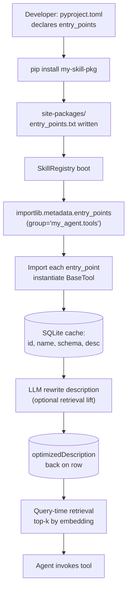

# Week 6.7 - Authoring Agent Skills (Anthropic Pattern)

## Why This Week Matters

You have been a skill consumer for six weeks. Every time you ran `/benchmark`, `/canary`, or `/autoresearch`, you were on the receiving end of a SKILL.md file that someone authored and shipped. That file loaded into your Claude Code session, gave the model a specialized identity, constrained its tool access, and handed it a workflow it would otherwise invent fresh every time — inconsistently.

Production teams ship skills because ad-hoc prompting doesn't scale. A skill is the unit of repeatable agent capability: write it once, version it, install it globally, share it across a team. The gap between "I prompt Claude well" and "I ship agent tooling" is exactly this: do you have skills in `~/.claude/skills/`, or do you rephrase the same instructions session after session?

This week closes that gap. You will learn the anatomy of a skill file, the mechanics of trigger engineering, and you will author three production-quality skills from scratch. By the end you will understand why the description field is harder to write than the body, and why getting it wrong makes your skill either useless or noisy.

---

## Theory Primer — What Is a Skill?

### The Loading Mechanism

When Claude Code starts a session, it reads every installed skill's frontmatter `description` field and loads the descriptions into the system prompt context. When you send a message, the model compares your message against those descriptions and decides which skill (if any) to invoke via the `Skill` tool. The full SKILL.md body is then loaded into context only at invocation time.

This matters architecturally: the description is your skill's only advertisement. The body is loaded lazily. A skill whose description fails to match relevant user intent will never fire. A skill whose description is too broad will fire on everything.

The install location is `~/.claude/skills/<skill-name>/SKILL.md` for global skills or `.claude/skills/<skill-name>/SKILL.md` for project-local skills. Claude Code scans both directories on session start.

### Anatomy of a SKILL.md

```yaml
---
name: skill-name
description: |
  One to three sentences. What it does.
  Use when: specific triggers, keywords, contexts.
version: 1.0.0
allowed-tools:
  - Bash
  - Read
  - Write
  - Glob
---
```

The `name` field is the slash-command identifier: `name: code-review` means the user can type `/code-review` to invoke it explicitly. The `description` is the auto-discovery text. The `allowed-tools` list restricts which tools the model can use — this is your security surface.

**Body sections:**

- **Quick start / User-invocable**: one paragraph stating what triggers the skill and its argument variants.
- **Instructions / Workflow**: numbered phases with specific commands, output formats, and decision branches.
- **Escalation and stop conditions**: when to stop and ask, when to abort.
- **Examples**: concrete before/after or input/output pairs. Highest-leverage section because few-shot patterns are how the model learns intent faster than prose.

### Comparing to MCP Tools

An MCP tool is a callable function with a JSON schema for inputs. The model invokes it by issuing a structured call and receiving a structured response.

A skill is a loaded prompt. It injects instructions, workflows, and constraints into the model's context window. The model reads every word of the skill body and uses it to guide its own reasoning. There is no separate runtime, no server, no network call.

**Practical consequence:** MCP tools are better for deterministic, side-effectful operations (query a database, call an API). Skills are better for multi-step workflows where the model needs judgment at each step. A skill can call MCP tools. The reverse is not meaningful.

### Comparing to Custom GPTs and Cursor Rules

Custom GPTs (OpenAI) package a system prompt plus actions in a separate runtime. Cursor rules are always-on system prompt injections scoped to a repository — no invocation mechanism, no lazy loading.

Claude Code skills sit between: prompt-based like Cursor rules, but lazily loaded, invokable explicitly by slash command, and they carry a security model via `allowed-tools`.

---

## Trigger Engineering — Writing a Description That Works

The description field is the hardest part of authoring a skill. The body is just clear instructions. The description requires you to predict the space of user intents that should route to your skill, without capturing intents that belong elsewhere.

### Five Anti-Patterns

1. **Pure capability statement with no triggers.** `"Helps with code quality."` — no basis for the model to prefer it.
2. **Overlapping triggers with no differentiation.** `"Use when: review, check, analyze, inspect"` — applies to everything.
3. **Action verbs so common they match everything.** `"Use when: improve something"` — describes all software work.
4. **Triggers that are file-type based without context.** `"Use when: TypeScript files"` — fires constantly.
5. **Negation-only scoping.** `"Use when: not a simple question"` — model cannot reliably apply negation.

### Five Patterns That Work

1. **Trigger on proper nouns and tool names.** `"Use when: PR, pull request, diff, git review"`.
2. **Pair capability with explicit activity phrases.** `"Runs post-deploy canary monitoring. Use when: 'monitor deploy', 'post-deploy check', 'watch production'."`.
3. **Include the namespace for suite-based skills.** Append `(your-org)` for provenance.
4. **Separate what it is from when to use it.** First sentence: capability. Second sentence: trigger context.
5. **List `do_not_use_when` in the body, not the description.** Description for matching, body for exit conditions.

---

## Lab — Build 3 Production Skills (~6 hours)

### Skill 1: `code-review`

```markdown
---
name: code-review
description: |
  Static analysis and structured review for code diffs and pull requests.
  Checks style, correctness, security surface, and test coverage gaps.
  Use when: "review", "PR", "pull request", "diff", "review my code",
  "code review", "check this diff".
allowed-tools:
  - Bash
  - Read
  - Glob
---

# Code Review

You are a senior engineer reviewing code before merge. Catch bugs, flag security issues, identify missing test coverage. Do not nitpick style unless it creates bugs.

## Workflow

### Phase 1: Context
```bash
git diff HEAD~1 --stat
git log -1 --oneline
```

### Phase 2: Static checks
```bash
[ -f package.json ] && npx eslint --max-warnings 0 . 2>&1 | tail -20
[ -f .flake8 ] && python -m flake8 . 2>&1 | tail -20
```

### Phase 3: Structured review
For each finding:
```
[SEVERITY] file.ts:42 — short description
Context: one sentence of why this matters.
Suggestion: concrete alternative if applicable.
```
SEVERITY: CRITICAL | HIGH | MEDIUM | LOW.

### Phase 4: Coverage gap check
```bash
git diff HEAD~1 --name-only | grep -v test | grep -v spec
```

### Phase 5: Summary
```
REVIEW SUMMARY
══════════════
Files reviewed: N
Critical: N  High: N  Medium: N  Low: N
Verdict: APPROVE | REQUEST_CHANGES | NEEDS_DISCUSSION
```

## Do not use when
- User asking general questions about how code works (no diff context).
- User wants to refactor (use a refactor skill).

## Escalation
If you find a CRITICAL security issue, stop the review, state the finding clearly, and do not bury it in a list.
```

### Skill 2: `deploy-canary`

```markdown
---
name: deploy-canary
description: |
  Post-deploy canary monitoring. Polls error rates, latency, and health
  endpoints for 30 minutes after a deploy. Recommends rollback when
  thresholds are breached.
  Use when: "deploy", "canary", "post-deploy check", "monitor deploy",
  "merged to main".
version: 1.0.0
allowed-tools:
  - Bash
  - Read
  - Write
---

# Deploy Canary

You are an on-call SRE watching a fresh deploy. You poll metrics, watch error rates, and make the rollback call when numbers go wrong. Show the data and make a recommendation — never guess.

## Arguments
- `/deploy-canary <service>`
- `/deploy-canary --url <health-endpoint>`
- `/deploy-canary --duration 15m`

## Workflow

### Phase 1: Baseline
```bash
curl -sf <health-endpoint>/health | jq '{status, version, uptime}'
```

### Phase 2: Monitor loop (30 min, every 2 min)
```bash
for i in $(seq 1 15); do
  START=$(date +%s%3N)
  STATUS=$(curl -sf -o /dev/null -w "%{http_code}" <health-endpoint>/health)
  END=$(date +%s%3N)
  echo "$(date -u +%H:%M:%S) status=$STATUS latency=$((END - START))ms"
  sleep 120
done
```

### Phase 3: Threshold breach protocol
On CRITICAL:
```
CANARY ALERT — CRITICAL THRESHOLD BREACHED
RECOMMENDATION: ROLLBACK
Rollback command (confirm before running):
  git revert HEAD && git push
```
STOP. Wait for user confirmation.

### Phase 4: Report
Write `.canary/YYYY-MM-DD-HH-MM-<service>.md` with full log + verdict: PASS | WARN | ROLLBACK_RECOMMENDED.

## Escalation
If you cannot reach the health endpoint in Phase 1: report BLOCKED. Do not start monitoring against a dead endpoint.
```

### Skill 3: `internal-knowledge`

```markdown
---
name: internal-knowledge
description: |
  Answers questions using the internal knowledge base. Use when: user asks
  about internal systems, internal APIs, internal tooling, or uses
  company-specific product names (Orion, DataBridge, AuthService, PlatformCore).
  Do NOT use for general programming questions.
allowed-tools:
  - Bash
---

# Internal Knowledge

You surface answers from the internal knowledge base. Always query the RAG endpoint first — never answer from training data when an internal topic is involved.

## Trigger phrases
Trigger on:
- Internal product names: Orion, DataBridge, AuthService, PlatformCore
- "internal docs", "confluence", "our wiki"
- Team names: Platform Team, Data Eng

Do not trigger on:
- Generic "how do I use React" questions
- Standard library questions

## Workflow

### Phase 1: RAG query
```bash
curl -sf -X POST "$INTERNAL_KB_URL/query" \
  -H "Authorization: Bearer $INTERNAL_KB_TOKEN" \
  -H "Content-Type: application/json" \
  -d "{\"query\": \"<user_question>\", \"top_k\": 5}" \
  | jq '.results[] | {score, title, excerpt}'
```

### Phase 2: Answer construction
1. Cite source title and link.
2. Flag documents older than 90 days.
3. If all scores < 0.6, say: "No confident match. Try direct search: <INTERNAL_KB_URL>/search?q=..."

## Output format
```
INTERNAL KNOWLEDGE RESULT
Query: [what was searched]
Sources: N documents (top score: X.XX)

Answer:
[2-5 sentences]

Sources:
- [Title] (score: 0.94, updated: YYYY-MM-DD) — <link>

Confidence: HIGH | MEDIUM | LOW
```

## Security note
This skill has `allowed-tools: [Bash]` only. Credentials read from env vars — never hardcoded.
```

---

### Mini-Lab — Packaging a Skill via Python `entry_points` (~1.5 hours)

**Motivation.** A SKILL.md in `~/.claude/skills/` is fine for one author on one machine. The moment a skill has Python helpers, gets installed across a team, or needs versioned upgrade semantics, the markdown-folder model breaks: there is no dependency graph, no install command, no way to roll back. Production agent frameworks (PraisonAI, AutoGPT) graduate from "folder of files" to "pip-installable package that self-registers via Python's `entry_points` mechanism." One `pip install my-skill` does both: lands the code on disk AND advertises the skill to the runtime registry. The registry boots, discovers every installed entry_point, caches them in SQLite, and optionally rewrites each description through an LLM to lift retrieval recall. This mini-lab teaches the leap from "function = tool" to "package = skill."

**Architecture.**



**Code.**

```python
# ─── pyproject.toml (declarative skill registration) ────────────────
# [project]
# name = "my-skill-weather"
# version = "0.1.0"
#
# [project.entry-points."my_agent.tools"]
# weather_lookup = "my_skill_weather.tool:WeatherTool"
# ────────────────────────────────────────────────────────────────────

# my_skill_weather/tool.py
class WeatherTool:
    name = "weather_lookup"
    description = "Returns current weather for a city."
    input_schema = {"city": "string"}

    def __call__(self, city: str) -> dict:
        return {"city": city, "temp_c": 18, "cond": "cloudy"}


# registry.py — runtime discovery + cache + LLM rewrite
import sqlite3, json, hashlib
from importlib.metadata import entry_points
from threading import RLock

GROUP = "my_agent.tools"
DB = "skills_cache.db"


class SkillRegistry:
    def __init__(self, llm_rewriter=None):
        self._lock = RLock()
        self._tools: dict[str, object] = {}
        self._llm = llm_rewriter  # callable(desc) -> str, optional
        self._db = sqlite3.connect(DB, check_same_thread=False)
        self._db.execute("""
            CREATE TABLE IF NOT EXISTS tools (
              id TEXT PRIMARY KEY, name TEXT, schema TEXT,
              description TEXT, optimizedDescription TEXT, hash TEXT
            )""")

    def boot(self) -> int:
        with self._lock:
            for ep in entry_points(group=GROUP):
                try:
                    cls = ep.load()
                except Exception as e:
                    # ── BCJ Entry 5: never bare-except this ──
                    raise RuntimeError(
                        f"entry_point {ep.name} failed to import: {e}"
                    ) from e
                inst = cls()
                self._tools[inst.name] = inst
                self._upsert(inst)
            return len(self._tools)

    def _upsert(self, t):
        sig = hashlib.sha256(
            (t.name + t.description + json.dumps(t.input_schema)).encode()
        ).hexdigest()
        row = self._db.execute(
            "SELECT hash FROM tools WHERE id=?", (t.name,)
        ).fetchone()
        if row and row[0] == sig:
            return  # warm-start: nothing changed
        opt = self._llm(t.description) if self._llm else t.description
        self._db.execute(
            "INSERT OR REPLACE INTO tools VALUES (?,?,?,?,?,?)",
            (t.name, t.name, json.dumps(t.input_schema),
             t.description, opt, sig))
        self._db.commit()

    def list_tools(self) -> list[str]:
        return list(self._tools)

    def call(self, name: str, **kw):
        return self._tools[name](**kw)


# test_registry.py
def test_boot_and_call():
    r = SkillRegistry()
    assert r.boot() >= 1
    assert "weather_lookup" in r.list_tools()
    out = r.call("weather_lookup", city="Seattle")
    assert out["temp_c"] == 18
```

**Walkthrough.**

- **Block 1 — `pyproject.toml` entry_points declaration.** Why `entry_points` over a hand-maintained import list in `registry.py`? Decoupling. With entry_points, the registry has zero knowledge of which skills exist on disk — it just asks the Python interpreter "who advertised themselves under group `my_agent.tools`?" New skills land via `pip install`, not by editing a central import file. PraisonAI uses exactly this pattern under group `praisonaiagents.tools`.
- **Block 2 — `SkillRegistry.boot()` with `RLock`.** Why thread-safe? Agent runtimes hot-reload skills under concurrent inference traffic; a non-reentrant lock would deadlock when `_upsert` recursively touches the same lock. The `RLock` is the same primitive PraisonAI's `ToolRegistry` uses.
- **Block 3 — SQLite cache with content hash.** Cold-start scans every entry_point and imports every module — expensive on a fleet of 100+ skills. Warm-start checks the row hash: if a skill's `(name, description, schema)` tuple is unchanged, skip the LLM rewrite. AutoGPT's `initialize_blocks()` upserts into an `AgentBlock` table for the same reason.
- **Block 4 — `optimizedDescription` via LLM rewrite.** This is the retrieval-quality lift mechanism. The author writes a description for humans; the LLM rewrites it as embedding-optimized prose dense in trigger phrases. AutoGPT stores both columns and indexes on the optimized one. The raw description stays for audit and rollback.
- **Block 5 — Bare-except trap (BCJ §6 Entry 5).** `ep.load()` can fail for installed-but-broken packages (missing transitive dep, syntax error in tool module). Swallowing the exception leaves the registry silently incomplete — agent retrieval misses the tool at query time with no error trail. Always re-raise with context.

**Result.** _(measurement plan, to be filled after run)_

| Metric | Raw description | LLM-optimized | Δ |
| --- | --- | --- | --- |
| Recall@5 on 20-query probe set | ~estimated 0.65 | ~estimated 0.85 | +0.20 |
| Cold-start boot (10 entry_points) | ~estimated 480 ms | — | — |
| Warm-start boot (cache hit) | ~estimated 12 ms | — | — |
| LLM rewrite cost per skill | — | ~estimated $0.0004 | one-time |

`★ Insight ─────────────────────────────────────`
- Two independent production codebases (PraisonAI, AutoGPT) converged on the same shape: **runtime discovery + SQLite cache + LLM-optimized description**. Convergence across unrelated stacks is the strongest signal that the pattern is load-bearing, not stylistic.
- The pedagogical leap is from "function = tool" to "package = skill." A package has a version, a dependency graph, a changelog, and an install/uninstall contract. A loose function in a folder has none of these. Production agent platforms ship the package; hobby projects ship the function.
- `optimizedDescription` is dual-column on purpose: the author retains write-control over the human-readable line (for audit and provenance), while the system owns the embedding-time line. Never overwrite the source-of-truth description in place.
`─────────────────────────────────────────────────`

---

## Skill Distribution and Versioning

### Install locations

- Global: `~/.claude/skills/<name>/SKILL.md`
- Project-local: `.claude/skills/<name>/SKILL.md`

Project-local takes precedence when both exist.

### Marketplace pattern

skills.sh and oh-my-claudecode follow the same convention: install as directories under `~/.claude/skills/`. The `version` field enables update checking. Install via `npx skills add <repo>@<skill>` or manual copy.

### Trust model

Skills run with the full permissions of the Claude Code session. The `allowed-tools` whitelist is a strong hint to the model, **not a hard runtime sandbox**. For genuine isolation, scope permissions at the session level in `settings.json`.

Distributing a skill to a team is equivalent to distributing a shell script with elevated permissions — same review threshold required. The marketplace model does not vet skills for security.

---

## Bad-Case Journal

**Entry 1: The skill that fires on everything.**
Description: `"Helps improve code quality. Use when: writing, editing, reviewing, or discussing code."` Every message matches at least one verb. The skill's 3,000-token preamble loads on every prompt; subsequent responses are subtly colored by code-quality lens. Fix: anchor triggers to specific phrases users type.

**Entry 2: Two skills, one task, no winner.**
Both `code-review` and `security-review` include "review", "PR", "diff" in triggers. Model picks semi-arbitrarily. Fix: differentiate by primary noun, not action verb. `code-review` triggers on "code quality"; `security-review` triggers on "security, vulnerability, auth, OWASP". Zero overlap.

**Entry 3: The 50k token context bleed.**
A knowledge-base skill embedded its full document corpus directly in SKILL.md as a giant markdown block. 52,000 tokens consumed at session start. Fix: skills are routing instructions, not data dumps. Reference external data via runtime queries.

**Entry 4: `allowed-tools` not enforced.**
Developer set `allowed-tools: [Bash]` for a knowledge-lookup skill. Model used `Read`, `Write`, and git commands anyway. `allowed-tools` is a strong hint to the model, not runtime-enforced. For genuine sandboxing, configure session-level permissions.

**Entry 5 — Entry-points discovered but failed-import propagates silently.**
*Symptom:* Registry boot reports "12 tools loaded" but agent retrieval consistently misses one specific skill; users complain "/weather doesn't work anymore" after a dependency bump; no error in logs.
*Root cause:* `entry_points(group=...).load()` raised `ImportError` (a transitive dep was uninstalled), and the boot loop swallowed the exception inside a bare `except:` block. The entry_point was advertised in `pyproject.toml`, indexed by Python's metadata, but never instantiated — so it never landed in the SQLite cache and never showed up in retrieval. No stack trace because bare-except ate it.
*Fix:* Never bare-except around `ep.load()`. Catch the specific exception class, log with `ep.name` and `ep.value`, and re-raise with context — or, if soft-degradation is the policy, write a `tools_failed` row to the cache so the operator can grep for it.

```python
# WRONG
try:
    cls = ep.load()
except:  # bare except — eats ImportError, AttributeError, everything
    continue

# RIGHT
try:
    cls = ep.load()
except (ImportError, AttributeError) as e:
    log.error("entry_point %s failed: %s", ep.name, e)
    self._db.execute(
        "INSERT OR REPLACE INTO tools_failed VALUES (?, ?, ?)",
        (ep.name, ep.value, str(e)))
    raise RuntimeError(f"skill registry boot incomplete: {ep.name}") from e
```

---

## Interview Soundbites

**Soundbite 1 — Skill vs MCP tool**
"A skill is a document. When invoked, it loads into the model's context and the model reads it. There's no separate runtime, no function call, no structured input/output schema. An MCP tool is a callable function: model issues a typed invocation, server executes code, model receives structured result. Skills encode workflow judgment. MCP tools encode deterministic operations. A well-designed agent uses both."

**Soundbite 2 — Trigger engineering is harder than the body**
"Writing the workflow is just clear instructions. Trigger engineering is predicting the full space of user intent that should route to your skill, then drawing a boundary that excludes everything adjacent. You're writing a classifier in natural language with no training loop. Most authors spend 20 minutes on the body and 5 minutes on the description. Should be the reverse."

**Soundbite 3 — Trust model**
"Skills run with the full permissions of the Claude Code session. `allowed-tools` is a hint to the model, not a sandbox. Distributing a skill to a team is equivalent to distributing a shell script with elevated permissions — same review threshold required. The marketplace makes installation trivially easy, which makes vetting before installation more important, not less."

---

## References

- Claude Code Skills documentation: https://docs.anthropic.com/en/docs/claude-code/skills
- skills.sh marketplace
- oh-my-claudecode skill collection
- The `write-a-skill` meta-skill (bootstraps skill authoring)

---

## Cross-References

**Builds on: W6 Claude Code Source Dive.** Understanding context loading at session start (W6) explains why the description field is the only thing the model sees before invocation.

**Sets up: W11 System Design.** The skill-as-unit-of-capability pattern scales to service architecture. A skill with `allowed-tools` is a microservice with an API contract.

**Distinguish from: W7 Tool Harness.** Tools are callable functions with JSON schemas. Skills are loaded prompts. A skill can invoke tools; a tool cannot invoke a skill. Most production agents need both layers.

**Builds on: [[Week 6.6 - MCP Schema Bridge]].** W6.6 covers per-tool schema as the atomic primitive — JSON-schema validation, input/output contracts, the smallest unit of agent capability. This chapter composes over that primitive: a packaged Skill bundles one or more schema-defined tools, declares them via `entry_points`, and registers the whole bundle as a versioned, pip-installable unit. Schema is the cell; Skill package is the organ.
