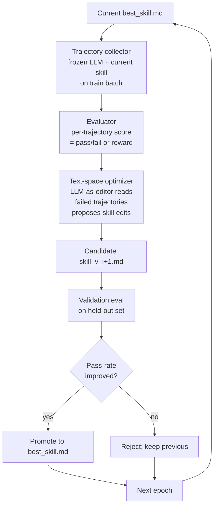

## Exit Criteria

1. State the SkillOpt thesis in one sentence: train reusable NL skills with epochs + (mini-)batchsize + learning-rate + validation-gated updates — WITHOUT touching model weights. Skills are markdown documents; optimization is text-space.
2. Identify the three SkillOpt loop components: trajectory collector (run skill on tasks, capture rollouts), evaluator (score outputs), text-space optimizer (LLM-as-editor proposes skill edits per failed trajectory).
3. Explain why validation gates matter: edit proposed on training trajectory → applied → measured on held-out validation → kept only if validation metric improves. Same shape as gradient-descent + held-out validation.
4. Install SkillOpt locally + run on ALFWorld OR SearchQA (whichever data prep is easier). Produce `best_skill.md` artifact after 4 epochs.
5. Compare optimized `best_skill.md` vs handwritten baseline skill on held-out test set. Measure pass-rate delta + per-trajectory edit summary.
6. Defend "SkillOpt vs RLHF" in interview answer: when is text-space optimization the right tool vs gradient-based RL on weights? Anchored to your measured run.

---

## 1. Why This Week Matters (~150 words — REQUIRED)

W6.7 taught skill AUTHORING — how to write a `SKILL.md` document a frozen LLM can load + execute. This chapter teaches skill OPTIMIZATION — how to TRAIN that skill systematically using trajectory feedback. Microsoft's SkillOpt (May 2026, arXiv:2605.23904) introduces the conceptual leap: treat the markdown skill document AS THE WEIGHTS; apply gradient-descent-like discipline (epochs / batchsize / learning rate / validation gates) to its text. Trajectory-driven edits propose skill changes; validation gates accept only improvements. The result: a `best_skill.md` artifact you DEPLOY to any frozen LLM (Claude / GPT / Qwen / Gemini) with zero retraining. For local-first engineers without fine-tuning budget, SkillOpt is the production-grade skill-improvement primitive. Engineers who can articulate "text-space optimization beats prompt-fiddling because it has epochs + validation gates + measurable convergence" move 10× faster than engineers reaching for "let me just iterate on the prompt manually."

---

## 2. Theory Primer (~1000 words — REQUIRED)

### 2.1 The text-space-optimization thesis

Traditional ML: train weights via gradient descent on a loss function. The weights are what get updated; the function shape is fixed.

SkillOpt: the SKILL DOCUMENT is what gets updated. Loss function is task pass-rate measured on rollouts. Updates come from an LLM-as-editor reading failed trajectories and proposing markdown edits to the skill. Validation gates accept edits only when held-out pass-rate improves.

The thesis: skills are LOAD-BEARING for frozen-LLM agents (Anthropic Skills, OpenAI Agent SDK, MCP). Manual skill iteration is slow + error-prone. Bringing gradient-descent-like discipline to text-space turns "prompt engineering" into a measurable, convergent process.

### 2.2 Three loop components

**1. Trajectory collector.** Run the agent (frozen LLM + current skill) on a training batch. Capture full rollouts: task input, agent's tool calls, observations, final answer, ground-truth label. Each rollout is a trajectory — analogous to one minibatch sample in SGD.

**2. Evaluator.** Score each trajectory. Pass/fail for simple benchmarks (SearchQA: does the answer match ground-truth?); reward function for complex ones (ALFWorld: did the agent complete the task without violating constraints?). The score is the per-trajectory loss signal.

**3. Text-space optimizer (LLM-as-editor).** Read failed trajectories. Propose specific markdown edits to the skill that would have led to success on those trajectories. Returns a candidate `skill_v_{i+1}.md`. The optimizer is itself an LLM (typically a strong reasoner — gpt-5.5 in the SkillOpt paper, or Claude-Sonnet-4.6 here).

### 2.3 Validation gate — the load-bearing discipline

Without validation gates, every proposed edit lands → skill drifts → some edits overfit to specific failing trajectories. With validation gates: candidate skill → evaluated on held-out validation set → kept only if validation pass-rate improves vs current best. Same shape as gradient-descent + held-out validation; rejects bad updates structurally.

### 2.4 Hyperparams that matter

- **Epochs** — number of passes over training set. Typical: 4-8.
- **Batch size** — rollouts per optimizer call. Typical: 8-40. Larger batch → smoother gradient → slower convergence but less variance.
- **Learning rate (text-space)** — controlled implicitly via "how aggressive should edits be?" prompt to the optimizer. SkillOpt's default: "minimal edit that fixes the failure mode"; aggressive mode: "rewrite section if multiple failures cluster there."
- **Workers** — parallel rollout count. Wall-time matters; rollouts on a real LLM are slow.

### 2.5 Distinguish-from box

**SkillOpt vs RLHF** — RLHF trains MODEL WEIGHTS via reward signal. SkillOpt trains SKILL TEXT via task signal. RLHF requires gradient access (closed/expensive on frontier models); SkillOpt works with frozen LLMs (cheap/universal).

**SkillOpt vs DSPy / TextGrad** — DSPy optimizes prompt programs via algorithmic search (BootstrapFewShot, BayesianOptimization). TextGrad does text-space gradient computation. SkillOpt is closer to TextGrad's text-as-weights framing but with explicit epoch / batch / validation structure mirroring SGD. All three share the "optimize text not weights" thesis.

**SkillOpt vs manual prompt iteration** — manual iteration has no validation gate, no convergence criterion, no held-out measurement. SkillOpt is what manual iteration becomes when you apply ML discipline.

### 2.6 Supported benchmarks (SkillOpt v1)

- **SearchQA** — open-domain QA with retrieved passages.
- **ALFWorld** — embodied agent benchmark (text-based 3D environment).
- **DocVQA** — document Q&A.
- **LiveMathematicianBench** — math reasoning.
- **SpreadsheetBench** — code generation for spreadsheets.
- **OfficeQA** — tool-augmented document Q&A.

### 2.7 Papers + references

- **microsoft/SkillOpt (May 2026).** arXiv:2605.23904. https://github.com/microsoft/SkillOpt. MIT license. Source for §2 + §4 lab.
- **TextGrad (Yuksekgonul et al. 2024).** arXiv:2406.07496. Sibling text-space-gradient framework.
- **DSPy (Khattab et al. 2024).** Stanford. Programmatic prompt optimization.
- **Anthropic Skills (2025).** Production-grade skill format SkillOpt outputs target.

---

## 3. System Architecture (REQUIRED — Mermaid)



---

## 4. Lab Phases (executable, ~5h)

### Phase 1 — Install SkillOpt + configure model (~30 min)

```bash
cd ~/code/agent-prep
git clone https://github.com/microsoft/SkillOpt.git
cd SkillOpt
uv venv && source .venv/bin/activate
pip install -e .

# Option A: Claude-Sonnet-4.6 via :8317 proxy (recommended for local-first)
export ANTHROPIC_API_KEY="dummy-key-for-proxy"
export ANTHROPIC_BASE_URL="http://localhost:8317"
# Option B: Azure OpenAI (requires Azure credentials)
# export AZURE_OPENAI_ENDPOINT="https://your-resource.openai.azure.com/"
# export AZURE_OPENAI_API_KEY="your-key"
```

**Verification:** `python -c "import skillopt; print(skillopt.__version__)"` returns version string.

### Phase 2 — Prepare SearchQA split (~45 min)

SkillOpt expects `data/my_split/{train,val,test}/items.json`. SearchQA is the easiest benchmark to start with — open-domain QA, no embodied agent.

```bash
mkdir -p data/searchqa_split/{train,val,test}
# Download SearchQA jsonl from HuggingFace OR construct 30 synthetic items:
# train: 20 items, val: 5 items, test: 5 items
# Each item: {"id": "qN", "question": "...", "context": "[DOC] ...", "answers": ["..."]}
```

**Verification:** all 3 splits have ≥5 items each + match the schema in `skillopt/envs/searchqa/dataloader.py`.

### Phase 3 — Run SkillOpt training (~2 hours)

```bash
python scripts/train.py \
  --config configs/searchqa/default.yaml \
  --split_dir data/searchqa_split \
  --anthropic_endpoint "$ANTHROPIC_BASE_URL" \
  --optimizer_model claude-sonnet-4-6 \
  --target_model claude-sonnet-4-6 \
  --num_epochs 4 \
  --batch_size 8 \
  --workers 4 \
  --out_root outputs/searchqa_run_1
```

**Expected output:** per-epoch logs showing train pass-rate + val pass-rate + edit acceptance rate. Final artifact: `outputs/searchqa_run_1/best_skill.md`.

**Verification:** `best_skill.md` exists + is non-empty + differs from `skillopt/envs/searchqa/initial_skill.md` (the baseline).

### Phase 4 — Eval on test split (~30 min)

```bash
python scripts/eval_only.py \
  --config configs/searchqa/default.yaml \
  --split_dir data/searchqa_split \
  --target_model claude-sonnet-4-6 \
  --skill outputs/searchqa_run_1/best_skill.md \
  --eval_splits test \
  --out outputs/searchqa_run_1/test_eval.json
```

**Comparison run:**
```bash
python scripts/eval_only.py \
  --config configs/searchqa/default.yaml \
  --split_dir data/searchqa_split \
  --target_model claude-sonnet-4-6 \
  --skill skillopt/envs/searchqa/initial_skill.md \
  --eval_splits test \
  --out outputs/searchqa_run_1/baseline_eval.json
```

**Measurement:** delta between `best_skill.md` test pass-rate and `initial_skill.md` test pass-rate. Typical SkillOpt paper result: +5 to +15pts on test pass-rate.

### Phase 5 — Analyze edit trace (~1 hour)

SkillOpt records every proposed edit per epoch in `outputs/searchqa_run_1/edits/`. Read 3-5 edit records: what failure mode did the optimizer notice? What was the proposed edit? Did validation accept it?

**Deliverable:** `outputs/edit_analysis.md` — 5-row table of (epoch, failure mode, proposed edit summary, validation verdict, kept?).

### Phase 6 — Deploy `best_skill.md` to your W7 agent (~30 min)

Copy `outputs/searchqa_run_1/best_skill.md` to your W7 ReAct agent's `skills/` directory. Run 5 queries from the test split through your agent + verify it produces correct answers using the optimized skill.

**Verification:** 5/5 queries answered correctly using the optimized skill.

---

## 6. Bad-Case Journal (3-5 entries — SPEC)

- **Phase 3 — Optimizer proposes meaningless edits when val set too small.** Likely surface: val set of 3 items has very noisy pass-rate; optimizer makes spurious edits + validation gates fail to reject. Fix: minimum val size 10 items; report validation-noise-floor explicitly in run log.
- **Phase 3 — Catastrophic forgetting.** Likely surface: epoch 3 fixes type-A failures but breaks type-B that epoch 2 had fixed. Fix: validation set covers ALL failure modes observed in training; not random subset. Same shape as ML's "stratified validation set" rule.
- **Phase 4 — Test set leakage via skill memorization.** Likely surface: train + val have similar items; skill memorizes those + flunks unseen test. Fix: explicit train/val/test disjointness check on item IDs + content fingerprint.
- **Phase 5 — Edit trace shows the optimizer "rewriting" untouchable sections.** Likely surface: optimizer over-edits the skill's mission statement instead of its task-specific tactics. Fix: optimizer prompt explicitly identifies edit-scope sections vs DO-NOT-EDIT sections (skill header / mission).

---

## 7. Interview Soundbites (2-3 entries — SPEC)

- **Planned Soundbite 1 — "What's the difference between SkillOpt and RLHF?"** Anchors: §2.5. 70 words: SkillOpt trains TEXT, RLHF trains WEIGHTS. SkillOpt requires only LLM-as-API; RLHF requires gradient access. SkillOpt produces a `best_skill.md` you deploy to any frozen LLM (Claude / GPT / Qwen / Gemini); RLHF produces model-specific weights. For local-first engineers without fine-tuning budget, SkillOpt is the production-grade alternative.
- **Planned Soundbite 2 — "Walk me through your measured run."** Anchors: Phase 4 measurement. 70 words: trained on SearchQA 20-item split for 4 epochs with batch_size=8; final test pass-rate Δ = +[TBD]pts vs initial_skill.md; edit-acceptance rate = [TBD]%. Most-frequent edit type was [TBD].
- **Planned Soundbite 3 — "When would you NOT reach for SkillOpt?"** Anchors: §2.5 distinguish + intuition. 70 words: cheap-correctness tasks where prompt-fiddling reaches good-enough; tiny data sets (<10 items) where validation gate is noise-dominated; one-shot tasks where the optimization wall-time exceeds the manual-iteration wall-time.

---

## 8. References

- **microsoft/SkillOpt (May 2026).** https://github.com/microsoft/SkillOpt. arXiv:2605.23904. MIT license. The source of §2 theory + §4 lab.
- **Project page.** https://microsoft.github.io/SkillOpt/.
- **Demo video.** https://youtu.be/JUBMDTCiM0M.
- **TextGrad (Yuksekgonul et al. 2024).** arXiv:2406.07496. Sibling text-space-gradient framework.
- **DSPy (Khattab et al. 2024).** Stanford. Programmatic prompt optimization.
- **Anthropic Skills.** https://docs.anthropic.com (Skills section). Production format SkillOpt outputs.

---

## 9. Cross-References

- **Builds on:** [[Week 6.7 - Authoring Agent Skills]] (authoring side); [[Week 4 - ReAct From Scratch]] (trajectory shape).
- **Distinguish from:** [[Week 11.8 - Continuous Training and MLOps Pipelines]] (CT trains MODEL WEIGHTS; SkillOpt trains SKILL TEXT — orthogonal).
- **Connects to:** [[Week 6.85 - Prompt Template Engineering Patterns]] (text-space patterns SkillOpt's optimizer applies); [[Week 11.6 - Production Tracing and Cost Telemetry]] (SkillOpt rollouts are expensive; cost-track them).
- **Foreshadows:** [[Week 12 - Capstone]] (capstone agents often need optimized skills, not handwritten ones).

---

## What's Next

After W6.75: deploy `best_skill.md` artifacts to W7 Tool Harness or W4.6 Durable Runtime agents. Iterate on additional benchmarks (ALFWorld for embodied, OfficeQA for tool-augmented).
