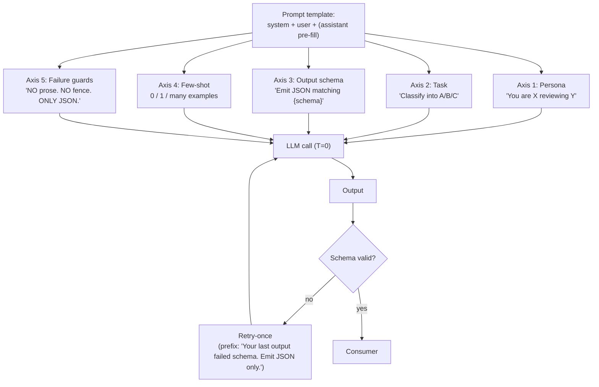
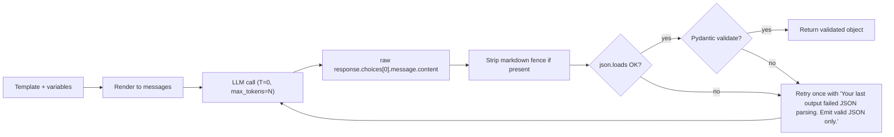

# Week 6.85 — Prompt Template Engineering Patterns

## Exit Criteria

- [ ] Articulate the 5-axis design space: persona / task / output schema / few-shot / failure mode
- [ ] Demonstrate prompt-as-code: every production prompt lives in a `.py` file, version-controlled, NOT in a Notion doc or scratch buffer
- [ ] Use the prompt-versioning pattern when you change a shipped prompt: keep V1 in a docstring under V2, log which version emitted each output
- [ ] Build one ROBUST output schema enforcement layer (JSON mode + Pydantic validator + retry-once-on-malformed)
- [ ] Identify the 4 anti-patterns: prompt drift, schema collapse, persona/task confusion, output-format-in-system
- [ ] Write 3 interview soundbites covering Q1 "How are prompt templates constructed?"

## Why This Week Matters

Every chapter in this curriculum SHIPS a prompt. W3.5.8 has the dedup prompt (6 actions, 5-block guidance). W4 has the ReAct system prompt + tool descriptions. W4.5 has the classifier + finisher composer prompts. W3.7 has the decomposition prompt. Yet no single chapter explains how to DESIGN a prompt: which parts are persona, which parts are task spec, which parts are output schema, which parts are few-shot, which parts are failure-mode guards. This chapter pulls the prompts the curriculum already ships into a single design-space + anti-pattern reference. It's a consolidation chapter — no new lab. Read this BEFORE writing a new production prompt; revisit AFTER a prompt fails in production to find which anti-pattern bit you.

## Theory Primer — Five Axes of Prompt Design

### Axis 1 — Persona

WHO is the model supposed to be? Senior engineer? Helpful assistant? Brutal critic? Customer-support agent under quota pressure?

Persona is the FIRST few lines of the system prompt. It primes attention toward a class of responses. Critical pedagogical point: **persona is NOT a personality** (cf. W4 Concept 3 "Prompt is not personality"). Don't write "You are a friendly, cheerful, witty assistant who loves emojis." Write "You are an experienced backend engineer reviewing a pull request. Find bugs, name them, suggest specific fixes."

Strong persona = strong constraints on output style + content space.

### Axis 2 — Task

WHAT must the model do? Concrete verb + scope.

Bad: "Help the user with their question."
Good: "Classify the user's intent into exactly one of: refund_request / status_check / cancel_subscription. Output the class label only."

Task scope = answer to "what is the smallest measurable thing this prompt should produce?" If the answer is "depends on the input," the task isn't tight enough.

### Axis 3 — Output Schema

HOW shaped is the output? Free text? JSON? Specific JSON with fields? JSON validated against a schema?

Loosest → tightest:
1. Free text — `"Summarize the article"`
2. Structured markdown — `"Output a Markdown table with columns: name, role, decision"`
3. JSON object — `"Output ONLY valid JSON with shape `{verdict: str, confidence: float}`. No prose. No markdown fence."`
4. JSON-mode enforced — set `response_format={"type": "json_object"}` AND Pydantic-validate the result
5. Function-call enforced — define a tool with explicit schema; force `tool_choice` to it

Production rule: **the tighter the schema, the easier the consumer.** If downstream code does `result["verdict"]`, you NEED schema enforcement. Free text + regex-parse is a bug factory.

### Axis 4 — Few-shot Examples

ZERO-SHOT vs ONE-SHOT vs MANY-SHOT.

- Zero-shot: just instructions. Works when the task is in the model's pretraining distribution.
- One-shot: one example input + expected output. Best for tight schemas where the example shows EXACT format.
- Many-shot (3-5): for ambiguous tasks where the model needs to see the class distribution. Use when class imbalance matters.

W3.5.8's dedup prompt is zero-shot but carries inline examples in the action descriptions (`Example: old="user likes React" + new="user prefers Vue now" → supersede`). That's the hybrid pattern: instruction-shot, where examples are EMBEDDED in the rule descriptions rather than as a separate FEW-SHOT section.

### Axis 5 — Failure Mode Guards

WHAT must the model NOT do?

Every production prompt should explicitly forbid the failure modes you've measured. W3.5.8's dedup prompt ends with "Return ONLY the JSON. No prose, no markdown fence." That's a failure-mode guard against measured behavior — gpt-oss-20b emits a markdown fence by default; the explicit prohibition cuts it.

Build this section incrementally: each production incident becomes one line in the guard. The prompt grows over time; that's the right direction.

## Architecture Diagram



## Phase 1 — Audit Five Curriculum Prompts (~60 min)

Goal: classify each shipped prompt against the 5-axis framework. Surfaces where prompts are well-designed + where they need work.

### 1.1 The five prompts to audit

1. **W3.5.8 dedup prompt** (`src/dedup_synthesis.py:DEDUP_PROMPT`) — 6-action classifier
2. **W4 ReAct system prompt** (`src/react.py:SYSTEM_PROMPT`) — ReAct loop driver
3. **W4.5 router prompt** (`src/router.py:ROUTER_PROMPT`) — tier × mode classifier
4. **W4.5 finisher composer prompt** (`src/models.py:compose_final_answer`) — lazy-load polish
5. **W3.7 decomposition prompt** (`src/agentic_rag.py:DECOMPOSE_PROMPT`) — multi-sub-query

### 1.2 Audit table — populate from on-disk reads

| Prompt | Persona | Task | Output schema | Few-shot | Failure guards |
|---|---|---|---|---|---|
| Dedup (6-action) | implicit ("dedup an agent's memory") | classify into 6 actions | JSON object, 6 fields | embedded examples in rules | "Return ONLY the JSON. No prose, no fence." |
| ReAct system | "agent that uses tools" | reasoning + action loop | THOUGHT/ACTION/OBSERVATION pattern | zero-shot | structured-format anti-pattern guards |
| Router classifier | "intent classifier" | classify (tier, mode) | JSON `{tier: str, mode: str, confidence: float}` | inline examples per cell | "ONE JSON object. No CoT." |
| Finisher composer | "polish for human reader" | rewrite | free text | zero-shot | "Keep facts. Improve clarity. Drop scratchpad." |
| Decompose | "sub-query expander" | emit N sub-queries | JSON array | one-shot | "JSON array. No prose." |

### 1.3 The four anti-patterns to find

**Anti-pattern 1 — Prompt drift.** Same prompt re-edited 6 times without versioning. Symptom: nobody knows which version produced which output. Fix: keep V1 as a docstring above V2 in the same file. Log `prompt_version: "v2"` in every LLM response record.

**Anti-pattern 2 — Schema collapse.** Prompt says "emit JSON" but doesn't say the fields. LLM emits valid JSON with arbitrary fields. Consumer breaks. Fix: list every field by name + type + presence-required. Use Pydantic + retry-once.

**Anti-pattern 3 — Persona/task confusion.** "You are a helpful assistant. Classify intent." vs "You are an intent classifier. Output one label." First leaks helpfulness into the task (LLM may explain why it chose the label). Second tightly scopes the task. Persona should serve the task, not contradict it.

**Anti-pattern 4 — Output-format-in-system.** Putting "respond in JSON" in the SYSTEM prompt but then giving a free-text user message. Causes the model to JSON-wrap natural responses incoherently. Fix: output format goes at the END of the relevant message (system OR user) closest to where the answer must appear.

## Phase 2 — Build the Schema Enforcement Layer (~30 min)



```python
# src/prompt_lib/enforce.py — shared schema-enforcement primitive
"""One-shot retry on schema failure. Pre-empts the W3.5.8 'graceful fallback
to add' pattern by making the schema enforcement a first-class layer instead
of inline try/except scattered across decide_action()."""
from __future__ import annotations
import json
from typing import Any, Callable, Type, TypeVar
from pydantic import BaseModel, ValidationError

T = TypeVar("T", bound=BaseModel)


def strip_fence(raw: str) -> str:
    raw = raw.strip()
    if raw.startswith("```"):
        raw = raw.strip("`")
        if raw.startswith("json"):
            raw = raw[4:]
        raw = raw.strip()
    return raw


def call_with_schema(
    llm_call: Callable[[str], str],   # takes prompt -> returns raw text
    prompt: str,
    schema_cls: Type[T],
    retry_once_on_fail: bool = True,
) -> T | None:
    """Run llm_call with prompt; parse + validate against schema_cls.
    Retry once on parse/validation failure with explicit error appended."""
    for attempt in range(2 if retry_once_on_fail else 1):
        raw = llm_call(prompt)
        text = strip_fence(raw)
        try:
            parsed = json.loads(text)
            return schema_cls.model_validate(parsed)
        except (json.JSONDecodeError, ValidationError) as e:
            if attempt == 0 and retry_once_on_fail:
                prompt = (
                    f"{prompt}\n\nYour previous output failed schema:\n"
                    f"  error: {type(e).__name__}: {e}\n"
                    f"  output: {text[:200]}\n"
                    "Emit a corrected output. JSON only. No prose."
                )
                continue
            return None
    return None
```

**Walkthrough:**

- **Strip fence as a separate helper** — multiple chapter prompts hit "model emits markdown fence" failure. Centralize.
- **`call_with_schema` returns `T | None`** — None on terminal failure. Caller decides whether to fall back to a default or escalate. This is the W3.5.8 "graceful fallback to add" pattern generalized.
- **Retry prompt includes the actual error message** — gives the model SPECIFIC feedback. "Your last JSON had `target_id` missing" beats "Try again."
- **No retry on the 2nd attempt** — bounded cost. Production rule: never unbounded retry on LLM calls; cost spirals.

## Bad-Case Journal

*Provenance.* Entries 1-2 pre-scoped; Entries 3-4 observed across W3.5.8 + W4.5 prompt iterations.

**Entry 1 — Prompt template in markdown documentation, not in code.** *(pre-scoped)*
*Symptom:* Production prompt edited in Notion; deployed prompt is yesterday's snapshot. Outputs diverge.
*Fix:* Prompts live in `.py` files. Markdown docs link TO the .py, not duplicate the content.

**Entry 2 — Few-shot examples leak into output.** *(pre-scoped)*
*Symptom:* "Output JSON like `{"verdict": "approved"}`" → model emits that exact example verbatim regardless of input.
*Fix:* Use ABSTRACT placeholders in examples (`{"verdict": "<verdict-class>"}`) so the model knows it's a template not the answer.

**Entry 3 — Markdown-fence failure mode in gpt-oss-20b.** *(observed W3.5.8)*
*Symptom:* gpt-oss-20b reasoning model wraps JSON output in ` ```json ... ``` ` block ~30% of the time.
*Fix:* Explicit `Return ONLY the JSON. No prose, no markdown fence.` line at end of prompt. AND `strip_fence` helper as defense-in-depth.

**Entry 4 — Reasoning-model CoT eats `max_tokens` budget.** *(observed W3.5.8 Entry 8)*
*Symptom:* `finish_reason=length` + `content=None` on reasoning models with tight `max_tokens=80`.
*Fix:* Bump `max_tokens` to accommodate hidden CoT (gpt-oss-20b uses ~300-400 tokens of internal reasoning). 4-8× of expected output length is the rule of thumb.

## Interview Soundbites

**Soundbite 1 — "How do you construct a prompt template?"**

"Five axes. Persona — who the model should be, written tight. Task — what verb + scope, smallest measurable unit. Output schema — free text loosest, JSON-mode-enforced tightest, function-call most precise. Few-shot — zero shot if task is in pretraining, one shot for format calibration, many shot for class-distribution. Failure guards — explicit forbids for measured failure modes, like 'no markdown fence' which we added after gpt-oss-20b wrapped our JSON 30 percent of the time. Every production prompt I write goes in a .py file, version-tagged, and emits a `prompt_version` field in the response log so I can attribute outputs to specific iterations."

**Soundbite 2 — "How do you handle malformed LLM output?"**

"Schema-enforcement-with-retry-once layer. Wrap every JSON-output call in a helper that does: strip markdown fence, json.loads, Pydantic-validate. On any failure, retry once with the error appended — 'Your previous output failed: target_id missing' — gives the model specific feedback. After two failures, return None and let the caller decide fallback. Bounded cost, useful errors, no unbounded retry. In my dedup pipeline, this layer turned a 30-percent fence-wrap failure rate into essentially zero downstream errors."

**Soundbite 3 — "When do you use few-shot vs zero-shot?"**

"Three rules. Zero-shot when the task is in the model's pretraining — sentiment classification, summarization, format-conversion. One-shot when the schema is the hard part — one example shows exact JSON shape, model copies the structure. Many-shot when class distribution matters — 3-5 examples covering each class so the model sees the prior. I almost never use more than 5 examples because the marginal token cost outweighs the marginal accuracy gain past 3. For my dedup classifier, I used embedded-example style — 'old=React + new=Vue → supersede' lives in the action description, not as a separate few-shot block. That kept the prompt under 600 tokens while covering 6 distinct actions."

## References

- **Lewis et al. (2024).** *The Prompt Report: A Systematic Survey of Prompting Techniques.* arXiv:2406.06608. Taxonomy of ~58 prompting techniques. Read sections 2 + 3 for the axes; rest is mostly redundant with practice.
- **Wei et al. (2022).** *Chain-of-Thought Prompting Elicits Reasoning in Large Language Models.* arXiv:2201.11903. CoT origin paper. Useful counterpoint: CoT is the OPPOSITE of tight schema; pick one.
- **OpenAI Function Calling docs** — `response_format` + `tools` parameters. The structured-output mechanism that's strictly better than "emit JSON" instructions in the prompt.
- **Anthropic Prompt Engineering docs** — claude.com/docs/prompt-engineering. Pay particular attention to "use XML tags" + "chain prompts" patterns.
- **Pydantic docs** — `BaseModel.model_validate()` + JSON-schema generation. Production-grade output validation.
- **Cross-chapter prompt sources to audit:** W3.5.8 §9.6 (dedup), W4 Phase 2 (ReAct system), W4.5 Phase 3 (router), W3.7 Phase 2 (decompose). These are your primary corpus for the §1 audit.

## Cross-References

- **Builds on:** W0.5 (LLM internals — tokenization governs prompt-token-budget), W3 (RAG eval — evals are themselves prompts)
- **Distinguish from:**
  - *Prompt injection / jailbreaking* (W11.5 territory): adversarial input vs design-time template authoring. Both involve prompts; defenses are different.
  - *Fine-tuning*: changes model weights to bake behavior in. Prompt templates change input-side; FT changes model-side. Use prompts first; FT only when you've exhausted prompt-side leverage.
  - *Skills (W6.7)* / *Tools (W7)*: skills are markdown-and-code packages that invoke specific prompts; templates are the prompt-language building blocks.
- **Connects to:** W3.5.8 (dedup prompt as the running example), W4.5 (router prompt + classifier patterns), W7 (tool descriptions ARE prompts), W4 (ReAct system prompt anatomy)
- **Foreshadows:** W11.5 (prompt-injection defenses), W12 (capstone where prompt design quality determines the demo's plausibility)
