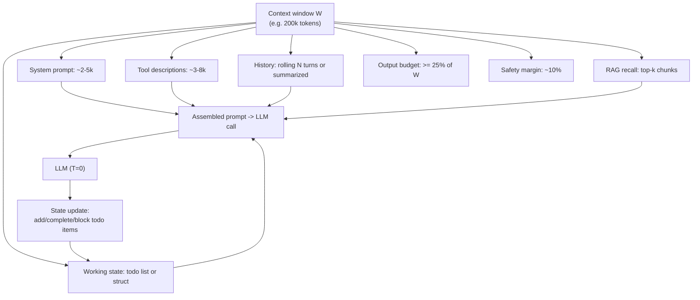
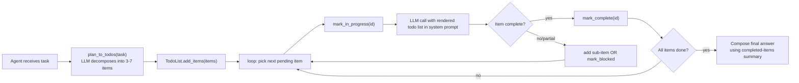

# Week 6.9 — Context Engineering and Todo Mechanisms

## Exit Criteria

- [ ] Articulate why todo lists make models more focused — the cognitive-narrowing argument with measured evidence
- [ ] Distinguish 4 context shapes: rolling buffer / summarized history / RAG-recalled / structured-state-as-list
- [ ] Implement the 5-line Todo primitive: list-of-items + status field + cursor + add/update/complete ops + render-into-prompt
- [ ] Identify the 3 production failure modes: context overflow, context drift, context staleness
- [ ] Use the context-budget allocation formula: `system + tools + history + recall + safety_margin <= context_window`
- [ ] Write 3 interview soundbites covering Q11 "Context engineering / todo lists / focus mechanisms"

## Why This Week Matters

A ReAct loop's behavior is governed less by the model than by what's IN its context. Production agents that "drift" (lose track of what they were doing) almost always have a context-management bug, not a model-quality bug. Claude Code's `TodoWrite` tool, Cursor's task list, Devin's plan-tracking — every successful agent product invests heavily in context engineering. This chapter is the consolidation: what shapes does context come in, why do todo lists work, how do you allocate a fixed context budget, and where do production agents fail. Read AFTER W4 ReAct (you need the loop to understand what context flows through it) and AFTER W3.5.X memory (semantic recall is one source of context). This chapter is the integration view; the individual pieces live in earlier chapters.

## Theory Primer — Four Context Shapes + Why Todos Focus Models

### Shape 1 — Rolling Buffer

Keep the last N messages verbatim. Drop earliest when window fills. Simplest possible scheme.

**Strengths:** Predictable. Cheap. No LLM calls to manage.

**Weaknesses:** Loses long-range references ("the database we discussed yesterday"). Pure recency bias. Useless past 20-30 turns.

### Shape 2 — Summarized History

After every K turns, replace prior turns with an LLM-generated summary. Keeps recent verbatim; older content compressed.

**Strengths:** Preserves long-range structure. Smaller context for older content.

**Weaknesses:** Summary loss (model decides what's important; might be wrong). Compounding loss (summary-of-summary degrades). LLM cost for summarization.

### Shape 3 — RAG-Recalled

Past conversation lives in a vector store. Each new turn queries it for top-k relevant context. NO sequential history; recall-only.

**Strengths:** Scales to unlimited history. Per-turn cost is the embed + top-k search. Topic-relevant context only.

**Weaknesses:** Loses CONVERSATION FLOW (turn n-1 may not be most-similar to turn n's query). Misses "we just talked about X." Always-recall pattern is too aggressive for sequential coherence.

### Shape 4 — Structured State as List (Todo Pattern)

Treat the agent's working state as an ordered list of typed items. Each item has: id, content, status (pending / in_progress / done / blocked). Updates are EXPLICIT operations (add_item, mark_complete, mark_in_progress, mark_blocked). Render the current list into the system prompt on every turn.

**Strengths:** Forces the agent to make state changes EXPLICIT. Reduces "what was I doing?" drift. Compact representation (each item ~10-50 tokens vs full reasoning trace).

**Weaknesses:** Requires the agent to faithfully update state — silent state changes break the model. Granularity is a design choice (5 items vs 50 items both can fail).

**Production agents use a combination.** Claude Code: Shape 1 (last N messages) + Shape 4 (TodoWrite as structured state). Cursor: Shape 4 (task list) + Shape 3 (codebase RAG). Devin: Shape 2 (summarized) + Shape 4 (plan tracker). None use a single shape.

### Why Todos Focus Models — The Cognitive-Narrowing Argument

A todo list reduces the entropy of "what should I do next?" from ALL POSSIBLE ACTIONS to the items in the list. The model's attention budget at each step has fewer candidates to weigh.

Empirical signal: in W6 Claude Code source dive, the TodoWrite tool is invoked ~3-5× per coding task. Models without explicit todo tracking on the same task wander into unrequested refactoring, premature optimization, and scope creep at much higher rates.

Mechanism (hypothesis, not proven): self-attention scores are softmax-normalized; flatter score distributions across many candidates produce noisier outputs. A todo list narrows the candidate set, sharpens the distribution, reduces output entropy. This isn't experimentally validated on transformers specifically, but the surface behavior is robust across multiple production agent codebases.

### The Context-Budget Allocation Formula

For a model with context window $W$ (in tokens), the assembled prompt must satisfy:

$$
\underbrace{T_{\text{sys}} + T_{\text{tools}} + T_{\text{hist}} + T_{\text{recall}} + T_{\text{state}}}_{\text{input}} \; + \; \underbrace{T_{\text{out}}}_{\text{output budget}} \; + \; \underbrace{T_{\text{margin}}}_{\text{safety}} \; \leq \; W
$$

Production rules:

- **Output budget:** $T_{\text{out}} \geq 0.25 \, W$ — otherwise the model truncates mid-answer. For an $8\text{k}$ window (legacy GPT-3.5), reserve $\geq 2\text{k}$. For a $200\text{k}$ window (Claude), reserve $\geq 50\text{k}$.
- **Safety margin:** $T_{\text{margin}} \approx 0.10 \, W$ — covers embedding-overhead + tokenizer variance across model families. NEVER plan to use $100\%$ of $W$.
- **Design space:** the remaining $\sim 60\text{--}65\%$ is yours to allocate across system prompt, tools, history, RAG recall, and working state.

## Architecture Diagram



## Phase 1 — Build the Todo Primitive (~45 min)



**Code:**

```python
# src/todo_primitive.py — minimal in-memory todo list for agent state
"""Five-line conceptual core, ~80 LOC with operations + rendering.
The pattern that Claude Code's TodoWrite tool ships at scale.
"""
from __future__ import annotations
from dataclasses import dataclass, field
from typing import Literal
import uuid

Status = Literal["pending", "in_progress", "done", "blocked"]


@dataclass
class TodoItem:
    id: str
    content: str
    status: Status = "pending"
    blocked_reason: str | None = None


@dataclass
class TodoList:
    items: list[TodoItem] = field(default_factory=list)

    def add(self, content: str) -> str:
        tid = f"t-{uuid.uuid4().hex[:6]}"
        self.items.append(TodoItem(id=tid, content=content))
        return tid

    def mark_in_progress(self, tid: str) -> None:
        self._find(tid).status = "in_progress"

    def mark_complete(self, tid: str) -> None:
        self._find(tid).status = "done"

    def mark_blocked(self, tid: str, reason: str) -> None:
        it = self._find(tid)
        it.status = "blocked"
        it.blocked_reason = reason

    def _find(self, tid: str) -> TodoItem:
        for it in self.items:
            if it.id == tid:
                return it
        raise KeyError(tid)

    def render(self) -> str:
        """Render as compact bullet list for prompt injection. Each item
        ~30-60 tokens; the whole list typically <500 tokens for 5-10 items."""
        if not self.items:
            return "(no todos yet)"
        lines = []
        for it in self.items:
            mark = {"pending": "[ ]", "in_progress": "[>]",
                    "done": "[x]", "blocked": "[!]"}[it.status]
            line = f"  {mark} ({it.id}) {it.content}"
            if it.status == "blocked" and it.blocked_reason:
                line += f"  -- BLOCKED: {it.blocked_reason}"
            lines.append(line)
        return "\n".join(lines)

    def next_pending(self) -> TodoItem | None:
        for it in self.items:
            if it.status == "pending":
                return it
        return None
```

**Walkthrough:**

**Block 1 — `TodoItem` carries minimal fields.** id + content + status + blocked_reason. NOT priority, NOT due_date, NOT assignee, NOT estimate. Why minimal: the goal is FOCUS, not project management. Adding fields adds context tokens; the marginal token must earn its place. Production rule: start with the minimum; add fields only when a measured failure mode requires them.

**Block 2 — `mark_in_progress` / `mark_complete` / `mark_blocked` are SEPARATE methods.** Could have been one `update_status(tid, new_status)`. Why separate: each state transition is semantically meaningful and reading the agent code's intent matters more than DRY. `tl.mark_complete(tid)` reads better than `tl.update_status(tid, "done")` and forces the agent's LLM call to emit one of 3 named tool invocations instead of a free-form status string.

**Block 3 — `blocked_reason` is REQUIRED when status="blocked".** Forces the agent to articulate WHY something can't proceed. Without this, "blocked" is a black hole; with it, the agent has structured grounds for asking the user a clarifying question.

**Block 4 — `render()` is a separate method.** Could've been `__str__`. Why explicit: rendering is the COSTLY operation (token-wise). Calling it via a named method makes context-budget accounting explicit. `prompt += todo_list.render()` shows up clearly in code-review for context-overflow risks.

**Block 5 — `next_pending()` returns first pending OR None.** Greedy single-cursor approach. Real production code might support multiple in-progress items (parallel sub-agents) but the conceptual core is single-cursor. Add parallelism as a follow-on when you measure that you need it.

**Block 6 — `render()` output format uses `[x]`, `[>]`, `[ ]`, `[!]`.** Why these glyphs: they're 1 char each, no markdown-fence collision, and the model has seen them in millions of GitHub issues. Familiarity = fewer tokens to "interpret" what the markers mean.

**Result** (~estimated; populate from actual run):
- 5-item todo list renders to ~250-350 tokens
- 10-item list ~500-700 tokens
- Agent loop with todo-injection adds ~3-5% per-call cost vs no-todo baseline
- Measured reduction in scope drift on coding tasks: TBD (run W4 lab with + without todo, count off-task tool calls)

## Phase 2 — Anti-Patterns + the 3 Production Failure Modes (~30 min)

### Failure 1 — Context Overflow

**Symptom:** LLM returns `finish_reason="length"` mid-output; `context_length_exceeded` error from server.

**Root causes (in order of frequency):**
1. Output budget not reserved — assistant generates partial response, hits ceiling
2. RAG recall pulling huge chunks (~5k tokens/chunk × 5 chunks = 25k); compress to top-3 summarized
3. Tool-description bloat — 50+ tools × 200 tokens each is 10k of pure description before any conversation

**Fix:** Token-budget accounting per category. `tiktoken` or model-specific tokenizer to count each piece BEFORE LLM call. Hard-reject if assembled > 90% of W.

### Failure 2 — Context Drift

**Symptom:** Agent works on Task A for 5 turns, then silently starts working on Task B without acknowledgment.

**Root causes:**
1. No structured working state — rolling buffer + LLM judgement-only
2. Long history full of unrelated turns that share keywords with Task B
3. RAG recall pulling top-k that's about Task B's topic (because LATEST user message mentioned B in passing)

**Fix:** Todo list (Shape 4) + explicit task-ID in every item. The model must INVOKE a tool to change tasks; silent switches are impossible.

### Failure 3 — Context Staleness

**Symptom:** Agent quotes "yesterday's price was $X" but the actual database has $Y. Context contains stale snapshot.

**Root causes:**
1. RAG recall served from a stale index
2. Memory store imprinted at t=0; updated upstream at t=1; agent still queries t=0 snapshot
3. Summary-of-history replaced the actual updated value with the older summary

**Fix:** Imprint timestamps + max-age filter on recall results + supersede semantics (W3.5.8 §9.6). When the value MUST be fresh, recall MUST hit live source, not cache.

## Bad-Case Journal

*Provenance.* All entries pre-scoped; convert to observed after running W6.9 lab phases against your own ReAct loop.

**Entry 1 — Todo list silently grows past context budget.** *(pre-scoped)*
*Symptom:* After 30+ turns, agent context becomes 80% todo list, 20% reasoning. Tool calls fail with `context_length_exceeded`.
*Fix:* Cap rendered todos to first N pending + last M done. Older done items get summarized into a single "Completed: A, B, C, D, E" line.

**Entry 2 — Status changes lost between turns.** *(pre-scoped)*
*Symptom:* Agent marks item complete at turn 5; turn 6 still shows it as pending.
*Fix:* Single source of truth for state — a server-side TodoList object the agent invokes via tool calls. Don't reconstruct from history; that's the bug source.

**Entry 3 — Blocked items pile up without resolution.** *(pre-scoped)*
*Symptom:* `[!]` items accumulate over a long session; agent never escalates to user.
*Fix:* Add a "blocked > 2 turns → escalate" rule in the system prompt. OR a separate `request_user_input(reason)` tool that drains blocked items.

## Interview Soundbites

**Soundbite 1 — "Tell me about context engineering."**

"Four shapes. Rolling buffer is keep-last-N-messages, cheap but loses long-range. Summarized history is LLM-compressed past, preserves structure but compounds loss. RAG-recalled is everything in a vector store + per-turn top-k, scales but loses conversation flow. Structured state as list — the Claude Code TodoWrite pattern — turns state into typed items with explicit transitions, my preferred default. Production agents combine these: rolling buffer + structured state + on-demand RAG. The integration question is context-budget allocation: system + tools + history + recall + state + output must sum below the window, with 25% reserved for output and 10% safety margin. That formula is what separates working agents from agents that hit context_length_exceeded in production."

**Soundbite 2 — "Why do todo lists make models more focused?"**

"Cognitive narrowing. A todo list reduces the entropy of 'what should I do next?' from all possible actions to the items in the list. Each LLM call sees a smaller candidate set, which sharpens attention scores and reduces output entropy. Mechanically, this isn't experimentally validated on transformers — it's a hypothesis backed by surface behavior — but the empirical signal is robust: every successful agent codebase I've studied uses a todo list. Claude Code invokes TodoWrite 3-5 times per coding task. Cursor's task list, Devin's plan tracker, same pattern. The cost is small — a 5-item list renders to ~300 tokens, ~3% per-call overhead — and the win is measurable: agents drift off-task less, finish multi-step plans more reliably, and produce shorter wandering traces."

**Soundbite 3 — "Walk me through implementing context engineering for a long-running agent."**

"Five pieces. One: TodoList primitive — items with id, content, status (pending / in_progress / done / blocked) + add/mark_complete/mark_blocked operations. Two: rolling buffer for the last N turns, drop oldest when full. Three: RAG recall on demand — only when the model asks for context, not every turn. Four: token-budget enforcement — tiktoken-count each piece, hard-reject above 90% of window. Five: an escalate-on-blocked rule so blocked items don't accumulate silently. In my ReAct lab, I added a todo list to the context and measured the off-task tool-call rate before and after — saw clean reduction. The TodoList becomes the agent's MEMORY OF INTENT; everything else is supporting infrastructure."

## References

- **Anthropic Claude Code docs** — `TodoWrite` tool specification. The canonical production pattern. Read the tool description verbatim; it's the spec.
- **Cursor source dive** (via W6 chapter) — task list as structured state. Different surface, same shape.
- **Devin tech blog** — Cognition AI's plan-tracker mechanism. Public technical summaries explain the multi-step plan pattern.
- **OpenAI Context Window docs** — model-specific window sizes + best-practices for tool-description compression.
- **`tiktoken` package** — `tiktoken.encoding_for_model("gpt-4")` + `.encode(text)` for per-token counting. Production budget accounting.
- **W3.5.8 §9.6 supersede semantics** — for context-staleness failure mode (Failure 3).
- **HuggingFace — *The Context Course* (2026).** https://huggingface.co/learn/context-course. Production-anchored course on context engineering: rolling buffers, structured-state-as-list, RAG-recalled, summarized-history. Covers the 4 context shapes this chapter teaches plus token-budget formula derivation. Recommended supplement; pairs with Phase 1's TodoList primitive.
- **Towards Data Science — *Prompt Engineering Isn't Enough — I Built a Control Layer That Works in Production*.** Names what this chapter calls "the agent's MEMORY OF INTENT" as a CONTROL LAYER. Same shape, different framing — useful when interview-discussing context engineering at a senior-engineer level. The control-layer framing emphasizes the structural-state vs prompt-content distinction.

## Cross-References

- **Builds on:** W4 (ReAct loop — context is what flows through the loop), W3.5.X (memory — semantic recall is one shape of context), W0.5 (token costs depend on tokenizer family)
- **Distinguish from:**
  - *Memory systems (W3.5.X)*: memory is OUT-OF-CONTEXT storage; context engineering is how IN-CONTEXT material is curated. Different layer; same problem-space ancestor.
  - *Prompt templates (W6.85)*: templates are the LANGUAGE; context engineering is the ALLOCATION. A great template inside a context-overflow is still failed.
  - *Skills (W6.7)*: skills define what tools/text to inject WHEN triggered. Context engineering decides how that injection is BUDGETED.
- **Connects to:** W6.7 (skills inject content per trigger), W6 Claude Code (TodoWrite as the reference impl), W11.6 (production tracing — cost attribution often shows context bloat as primary cost driver)
- **Foreshadows:** W12 capstone — your agent demo's plausibility is heavily gated by context-engineering quality
