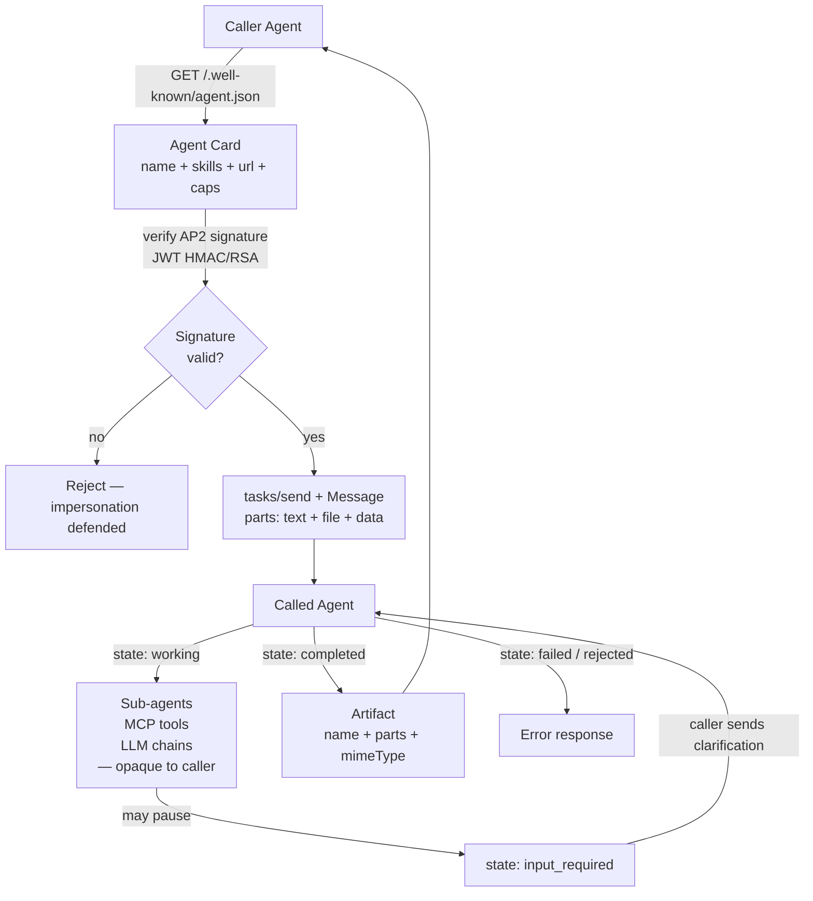

## Exit Criteria

1. State the one-sentence MCP-vs-A2A distinction: MCP is agent-to-tool with transparent tool calls; A2A is agent-to-agent with opaque inner reasoning.
2. Publish an Agent Card at `/.well-known/agent.json` with skills, endpoint, version, and capabilities — and explain why the well-known URL convention matters for discovery.
3. Walk the full Task lifecycle: `submitted → working → input_required → working → completed | failed | canceled | rejected`. Identify which transitions are caller-initiated vs callee-initiated.
4. Compose a Message with mixed Parts (text + file + data) and a typed Artifact output.
5. Implement (or sketch in spec form) the JSON-RPC over HTTP binding; explain when to use the gRPC binding instead.
6. Defend an A2A endpoint with signed Agent Cards (AP2 extension, September 2025); state what AP2 buys you that unsigned cards don't.
7. Articulate the opacity-preservation rationale: A2A enables competitors to collaborate without revealing internals — caller sees tasks + artifacts; callee's chain-of-thought / sub-agent delegation / tool calls stay hidden.
8. Cite the v1.0 milestone (April 2026, 150+ supporters including AWS / Cisco / Microsoft / Salesforce / SAP / ServiceNow) and the Linux Foundation governance transition (June 2025) — interview-grade context for "is this protocol production-ready."

---

## 1. Why This Week Matters (~150 words — REQUIRED)

MCP is agent-to-tool. A2A is agent-to-agent. Until 2025, agent-to-agent collaboration meant either (a) custom REST APIs that re-invented the lifecycle for every pairing, or (b) shared codebases forcing both agents onto the same framework. Google announced A2A in April 2025; it was donated to the Linux Foundation in June 2025, absorbed IBM's ACP in August 2025, shipped the AP2 (Agent Payments) extension in September 2025, and reached v1.0 in April 2026 with 150+ supporting organizations including AWS, Cisco, Microsoft, Salesforce, SAP, and ServiceNow. The protocol is now the production-grade answer to "how do two agents from different organizations collaborate without revealing internals." Engineers in 2026-2027 interviewing for Agent / LLM Engineer roles at any Fortune 500 organization need to know what A2A is, how its Task lifecycle differs from MCP's tool-call shape, and why opacity preservation matters when crossing organizational boundaries. This chapter is the foundation for any multi-agent system that needs cross-framework or cross-organization collaboration.

---

## 2. Theory Primer (~1000 words — REQUIRED — SPEC)

### 2.1 The opacity-preservation thesis

MCP exposes tool calls. Caller invokes `web_fetch(url)`; the LLM running the MCP server's tool sees the URL, fetches, returns. The caller's chain-of-thought and the tool's implementation are both transparent to the protocol — MCP doesn't hide anything; it's a transport for tool dispatch.

A2A is different. The caller delegates a TASK ("summarize this paper"). The called agent decides HOW: chains LLM calls, invokes its own MCP servers, delegates to sub-agents, runs its own tool layer. The caller never sees any of that — only the Task's state transitions and the final Artifact. This opacity is the load-bearing protocol design: it enables competitors to collaborate. A customer-service agent at company X can call a writer agent at company Y without revealing X's internal customer-service prompts, and without Y revealing its writer's training data or sub-agent topology.

### 2.2 Five concepts to own before writing code

1. **Agent Card.** Every A2A-compliant agent publishes a JSON document at `/.well-known/agent.json`. Contains: `schemaVersion`, `name`, `description`, `url` (the A2A endpoint), `version`, `skills` (list of named operations), and `capabilities` flags (`streaming`, `pushNotifications`). Discovery is URL-based — caller fetches the card, reads the skill list, picks one. Well-known URL convention is the same pattern as `robots.txt` and `openid-configuration` — operationally familiar to anyone who's worked on the web stack.

2. **Skill (the A2A analogue of MCP tool).** A named operation the agent supports. Has `id`, `name`, `description`, `inputModes` (`text`, `file`, `data` enumerated), `outputModes` (`text`, `artifact` enumerated). Skills are the unit of capability advertisement; tasks invoke a specific skill.

3. **Task lifecycle (8 states, 3 caller-initiated, 5 callee-initiated).** States: `submitted` (caller) → `working` (callee starts) → `input_required` (callee asks for more) → `working` (callee resumes after caller responds) → `completed` | `failed` | `canceled` (caller) | `rejected` (callee refuses). Caller initiates `submitted` and `canceled`. Callee owns all other transitions. Clients subscribe to state updates via SSE or poll.

4. **Message + Parts (the input shape).** A Message carries one or more Parts. Three Part types: `text` (plain content), `file` (base64 blob with `mimeType`), `data` (typed JSON payload for structured input). A single message can mix all three — e.g., text instruction + PDF file + JSON config object. This is the protocol's flexibility primitive; the called agent's skill defines which Part types it accepts.

5. **Artifact (the output shape).** Outputs are named, typed Artifacts, NOT raw strings. An Artifact has a `name`, a list of `parts`, and an optional `mimeType`. Multiple artifacts per task are allowed (e.g., a research task returns a `summary` artifact + a `citations` artifact). Artifacts can be streamed as chunks; caller accumulates.

### 2.3 Signed Agent Cards (AP2 extension, September 2025)

AP2 (Agent Payments) extends the base A2A protocol with cryptographic signatures on Agent Cards. A publisher signs its own card with a JWT (typically HMAC or RSA); consumers verify before trusting the card's contents. This prevents impersonation — a malicious party can't publish a card at a different URL claiming to be the legitimate agent. AP2 also enables payments — agents can verify they're paying the actual publisher, not a phishing intermediary. The signature buys you trust at the discovery layer; without it, A2A discovery has the same trust model as fetching a URL (i.e., none beyond DNS + TLS).

### 2.4 Two transport bindings

1. **JSON-RPC over HTTP** (default). POST to `/a2a` endpoint, optional SSE for streaming updates and intermediate Artifacts. Same shape as MCP's Streamable HTTP — POST for request/response, SSE for server-pushed state changes. This is the binding 95% of production deployments use.

2. **gRPC** (enterprise). For environments where gRPC is the standard service-to-service transport. Same logical message shape; different wire format. Use this when your organization already runs gRPC for service-mesh reasons; otherwise use JSON-RPC over HTTP.

Both bindings carry identical Task / Message / Artifact semantics — the choice is operational (existing infrastructure), not capability-driven.

### 2.5 MCP vs A2A — when to use which

| Dimension | MCP | A2A |
|---|---|---|
| Use case | Agent-to-tool | Agent-to-agent |
| Opacity | Transparent tool calls | Opaque inner reasoning |
| Typical caller | Agent runtime (a single agent's harness) | Another agent |
| State model | Tool-call result (request/response) | Task with lifecycle (state machine) |
| Authorization | OAuth 2.1 (Phase 13 #16) | JWT-signed Agent Cards (AP2) |
| Transport | stdio / Streamable HTTP | JSON-RPC over HTTP / gRPC |
| Discovery | Tool catalog from server | Agent Card at `/.well-known/agent.json` |
| Typical workload | "Fetch this URL", "Run this SQL" | "Summarize this paper", "Draft this contract" |

Use MCP when you want to invoke a specific tool with a specific output. Use A2A when you want to delegate a whole task to another agent that owns its execution. Many production systems use both — an agent uses MCP for its tool layer (invoking calculator, web_fetch, database) AND A2A for its collaboration layer (delegating "draft the response email" to a writer agent at a different organization).

### 2.6 Timeline + governance — interview-grade context

- **2025-04-09.** Google announces A2A.
- **2025-06-23.** Donated to Linux Foundation (cross-vendor governance).
- **2025-08.** Absorbs IBM's ACP (Agent Communication Protocol — IBM's competing draft).
- **2025-09.** AP2 (Agent Payments Protocol) extension ships — adds signed Agent Cards.
- **2026-04.** v1.0 released. 150+ supporting organizations: AWS, Cisco, Microsoft, Salesforce, SAP, ServiceNow, plus 144 others.

Why this matters: when interviewers ask "is this production-ready?", citing the governance transition + supporter count is the senior-engineer signal. The protocol's NOT a single-vendor effort; it has cross-organization buy-in.

### 2.7 Distinguish-from box

**A2A vs OpenAI Swarm / CrewAI / AutoGen** — those are multi-agent FRAMEWORKS (running multiple agents in a single process). A2A is a PROTOCOL (running agents in different processes / organizations, talking over HTTP). Same goal — multi-agent collaboration — at different scopes.

**A2A vs MCP** — MCP is agent-to-tool, transparent. A2A is agent-to-agent, opaque. Complementary, not competing.

**A2A vs WebHooks** — A2A has a typed task-lifecycle state machine. WebHooks are fire-and-forget. A2A buys you opacity-preserving multi-state interaction; WebHooks don't.

**A2A vs traditional REST API contracts** — REST has no lifecycle; each call is independent. A2A's Task is a stateful work item that can pause (`input_required`), resume, or be canceled. The state machine is the differentiator.

### 2.8 Papers + references — pointer list

- **Phase 13 lesson 19 (`rohitg00/ai-engineering-from-scratch`)** — source lesson; ~75 min original walkthrough.
- **A2A v1.0 announcement (April 2026)** — protocol spec + supporter list. Linux Foundation governance.
- **AP2 specification (September 2025)** — signed Agent Cards extension.
- **IBM ACP migration notes (August 2025)** — absorbed into A2A.

---

## 3. System Architecture (REQUIRED — Mermaid)

---

## 4. Lab Phases (REQUIRED — SPEC — code lands when lab runs)

### Phase 1 — Agent Card publication (~1 hour)

Goal: `code/agent_card.py` serves a static `/.well-known/agent.json` from a local HTTP server. Card declares 2 skills with input/output mode arrays + version + capabilities flags.

Verification: `curl http://localhost:8080/.well-known/agent.json` returns valid JSON matching the v1.0 schema. Use the A2A reference validator (if available) to lint the card.

### Phase 2 — JSON-RPC over HTTP task endpoint (~1.5 hours)

Goal: `code/a2a_server.py` exposes `POST /a2a` accepting `tasks/send` calls. Server implements the full lifecycle in-memory: state machine, message buffer, artifact accumulator. Initial implementation returns synchronous `completed` for simple text tasks.

Verification: `tasks/send` with a `text` Part triggers `submitted → working → completed`. Artifact returned in response. Idempotent on duplicate task ids.

### Phase 3 — Mixed Parts + input_required pause (~1.5 hours)

Goal: extend Phase 2 server to accept a message with text + file (base64 PDF) + data (target length config). Mid-task, server emits `input_required` asking caller for a clarification (e.g., "preferred citation style?"). Caller sends follow-up message; server resumes.

Verification: full lifecycle exercised. Trace shows `submitted → working → input_required → working → completed`. Artifact includes a `summary` text Part with content reflecting the clarification.

### Phase 4 — AP2 signed Agent Card (~1 hour)

Goal: sign the Phase 1 card with HMAC-SHA256 over canonical JSON (with stable key ordering). Verifier in Phase 2 rejects unsigned cards in strict mode. Mutated-card test (one byte flipped) MUST fail verification.

Verification: signed card passes verification; mutated card fails; unsigned card rejected in strict mode + accepted in compat mode (configurable).

### Phase 5 — Streaming artifacts via SSE (~1.5 hours)

Goal: extend Phase 3 server to stream artifacts in chunks via SSE. Caller subscribes via GET `/a2a/stream/:task_id`. Server emits 3 incremental artifact chunks; caller accumulates into the final artifact. Reconnect with `last-event-id` resumes from the last chunk.

Verification: caller sees 3 chunks arrive; midstream disconnect + reconnect with `last-event-id` resumes without duplication or gaps.

### Phase 6 — A2A-over-MCP comparison demo (~30 min reading + 30 min sketch)

Goal: pick an MCP server (e.g., the W6.6 Phase 3 example with 5 tools). Sketch (no full impl) how to wrap it as an A2A agent — each MCP tool becomes an A2A skill. Identify what opacity is lost in the wrapping (the caller now sees the MCP tool boundary even though A2A promised opacity).

Deliverable: a half-page design note in `outputs/a2a_over_mcp.md` answering: when does the wrapping make sense? When does it leak too much abstraction? Production rule: A2A is OPAQUE — wrapping an MCP server one-to-one defeats the protocol's whole-task-delegation promise.

---

## 5. (deprecated)

---

## 6. Bad-Case Journal (3-5 entries — SPEC — to be filled after lab run)

Candidate failure surfaces:

- **Phase 1 — Card schemaVersion mismatch.** Likely surface: writer ships card with `schemaVersion: "0.9"` (pre-v1.0 draft); v1.0 verifier rejects. Fix: bump to "1.0"; document the version-handshake convention.
- **Phase 2 — Task-id collision under concurrent submissions.** Likely surface: server uses timestamp-based task ids; two concurrent requests get the same id; second silently overwrites the first. Fix: cryptographic-random task ids (UUID4 or 128-bit hex) + collision-check on insert.
- **Phase 3 — input_required message loop.** Likely surface: caller's clarification reply doesn't transition back to `working`; server reads it as a new task submission. Fix: clarification messages include the original task id explicitly; server validates the message-vs-task association.
- **Phase 4 — Canonical JSON ordering instability across runtimes.** Likely surface: Python and JavaScript implementations canonicalize JSON differently (key order, whitespace, escape sequences); signed card verifies in one runtime, fails in the other. Fix: use [JCS — JSON Canonicalization Scheme, RFC 8785](https://www.rfc-editor.org/rfc/rfc8785) as the explicit canonicalization, not language-specific defaults.
- **Phase 5 — Streaming artifact reconstruction collapses on chunk reorder.** Likely surface: chunks arrive out of order under network jitter; accumulator concatenates blindly. Fix: each chunk carries a sequence number + length; accumulator sorts by sequence before concat.

---

## 7. Interview Soundbites (2-3 entries — SPEC — to be filled after lab run)

Candidates with anchors:

- **Planned Soundbite 1 — "What's the difference between MCP and A2A?"** Anchors: §2.5 table + opacity-preservation thesis. 70-word answer: "MCP is agent-to-tool, transparent. A2A is agent-to-agent, opaque. MCP gives me a tool dispatch primitive — caller sees the tool call. A2A gives me a task-delegation primitive — caller sees task state + final artifact, not the callee's internals. Many production systems use both: MCP for the tool layer, A2A for the collaboration layer. Choice is workload-driven."
- **Planned Soundbite 2 — "When would you reach for A2A over a custom REST contract?"** Anchors: §2.7 distinguish-from box. 70-word answer naming the typed task-lifecycle state machine + opacity + AP2-signed discovery as the three things REST doesn't give you.
- **Planned Soundbite 3 — "Why does A2A preserve opacity? Wouldn't transparent calls be easier to debug?"** Anchors: §2.1 opacity-preservation thesis + Linux-Foundation cross-vendor governance context. 70-word answer naming the load-bearing reason (cross-organization collaboration where revealing internals is a competitive disadvantage).

---

## 8. References

### Specs + canonical writing

- **A2A v1.0 announcement (Linux Foundation, April 2026).** https://a2aproject.org. Canonical protocol spec; 150+ supporting organizations. Use this when interview-arguing production-readiness.
- **A2A — Agent Card schema (`.well-known/agent.json`).** Reference schema as of v1.0.
- **AP2 — Agent Payments Protocol (September 2025).** Signed Agent Cards extension.

### Production blog posts + governance context

- **Google AI blog — A2A announcement (April 2025).** https://developers.googleblog.com. Original protocol announcement.
- **Linux Foundation — A2A governance transition (June 2025).** Cross-vendor stewardship; the move that signaled production-readiness.
- **IBM ACP migration notes (August 2025).** Documented how IBM's competing draft was absorbed.

### Source lessons

- **`rohitg00/ai-engineering-from-scratch` — Phase 13 lesson 19 (A2A Protocol).** https://github.com/rohitg00/ai-engineering-from-scratch/tree/main/phases/13-tools-and-protocols/19-a2a-protocol. The reference lesson this chapter lifts; ~75 min original walkthrough. This chapter extends with per-block walkthroughs, BCJ candidates, AP2 signing spec details, and the §2.5 MCP-vs-A2A decision matrix.

### Canonical reference implementations

- **A2A Python SDK (when released)** — first-party implementation; the SDK's task-lifecycle code is the reference shape.
- **A2A TypeScript SDK (when released)** — Node-side equivalent.
- **AP2 reference implementations** — JWT signing + canonical JSON verification.

### Related — JSON canonicalization

- **RFC 8785 — JSON Canonicalization Scheme (JCS).** https://www.rfc-editor.org/rfc/rfc8785. The right way to canonicalize JSON for cross-runtime signature verification. Avoid language-specific canonicalization defaults.

---

## 9. Cross-References

- **Builds on:** [[Week 6.5 - Hermes Agent Hands-On]] (MCP fundamentals — the sibling protocol; A2A reuses the JSON-RPC + SSE transport idioms); [[Week 6.6 - MCP Schema Bridge]] (tool schema patterns — Agent Card skills are the A2A analogue of MCP tool schemas); [[Week 3.5.5 - Multi-Agent Shared Knowledge]] (multi-agent intro at the queue/state axis; A2A is the protocol axis).
- **Distinguish from:** [[Week 6.65 - MCP Production Transports]] (sibling — MCP transport spec; A2A and MCP are complementary protocols, not competing); [[Week 3.5.5.5 - Multi-Agent Topology Patterns]] (topology patterns are SINGLE-PROCESS multi-agent shapes; A2A is the CROSS-PROCESS / CROSS-ORGANIZATION shape).
- **Connects to:** [[Week 11.5 - Agent Security]] (AP2 signed Agent Cards + JWT verification — security layer for A2A discovery); [[Week 11.55 - Content Provenance and AI Regulatory]] (Agent Card signing relates to content-provenance / model-card discipline at the protocol layer); [[Week 12 - Capstone]] (capstones with cross-organization collaboration need A2A; everything else can use MCP).
- **Foreshadows:** [[Week 11.6 - Production Tracing and Cost Telemetry]] (Task ids + state transitions are the natural OTel trace-correlation primitives — every state transition is a span; the artifact stream is the trace payload).

---

## What's Next

After W6.95: [[Week 7 - Tool Harness]] (tool harness running an agent that uses A2A for delegation); [[Week 11.55 - Content Provenance and AI Regulatory]] (the signing + governance discipline that AP2 inherits from the broader content-provenance discussion).
