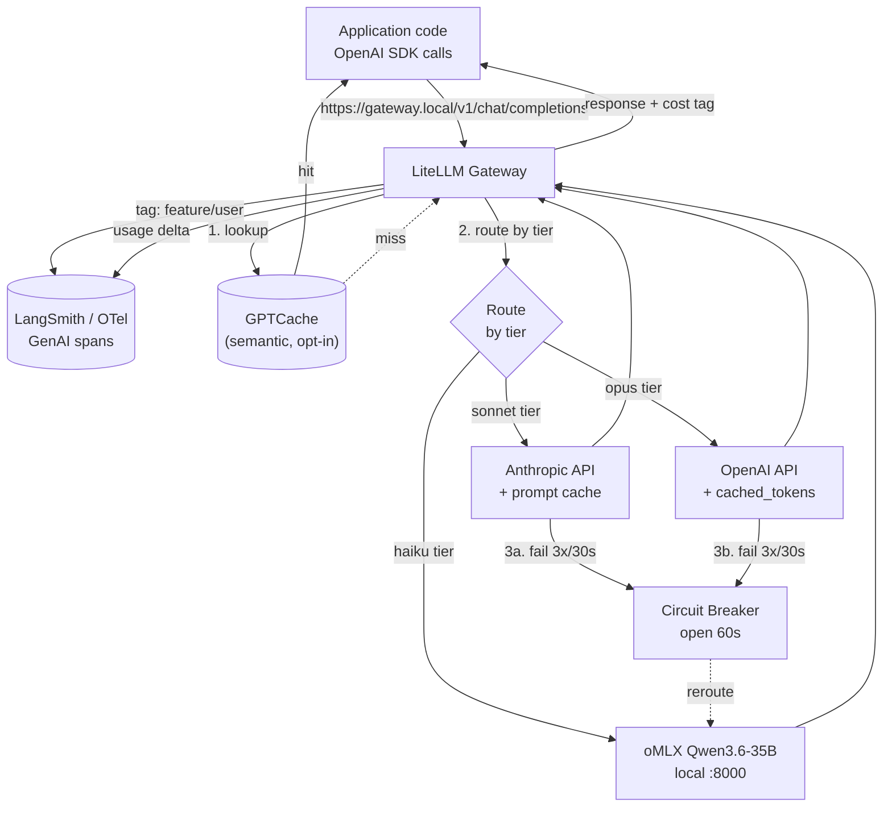
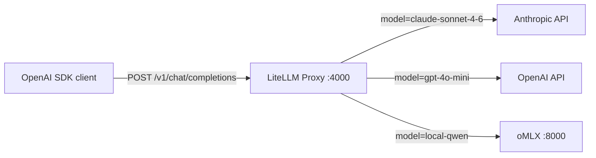
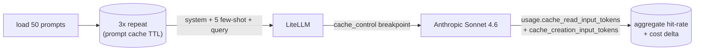
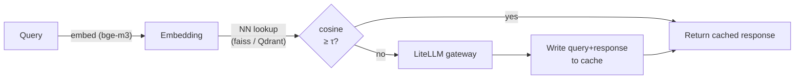

# Week 7.3 — Production LLM Infrastructure

## Why This Week Matters

Every production LLM service has the same three concerns the moment it leaves prototype: it routes between providers, it caches what it can, and it accounts for cost per feature. These are not three separate problems — they share one toolchain (gateway + cache + telemetry metadata) and one mental model (everything bills, so everything must be measured). The 12 May 2026 audit of the teach_fireworks 11-section AI Engineer reading list confirmed that **prompt caching, cost attribution, and provider routing** are the three gap areas this curriculum had not yet closed end-to-end — they map onto Akshay Pachaar's 6-area rubric area #5 ("Production LLM Infrastructure") directly. Interviewers in 2026 ask candidates to walk through a production LLM stack the same way they asked candidates to walk through a microservice stack in 2018: gateway, cache, observability, cost. A candidate who can name the four primitives — gateway / dual-tier cache / cost attribution / circuit-breaker fallback — and cite a measured cache-hit rate from their own lab moves up a level. This chapter is six lab phases that produce those measurements on the same RAG eval used in W3.

## Theory Primer — Four Production Primitives

The four primitives in production LLM serving are independent but compose. Each solves a specific failure mode that prototype code ignores, and each has a 2026 canonical toolchain.

### 1. The Gateway Pattern

A **gateway** is one HTTP endpoint that fronts many LLM providers — Anthropic, OpenAI, Bedrock, local oMLX, Together, Groq — and exposes one API surface (OpenAI-compatible is the de-facto standard in 2026). The gateway absorbs four concerns the application would otherwise duplicate per call site: (a) authentication to each provider, (b) request/response shape translation, (c) provider-specific rate-limit handling, and (d) routing logic ("use Haiku for classification, Sonnet for reasoning, gpt-oss-20b for cheap drafts"). The 2026 reference implementations are **LiteLLM** (Python SDK + standalone proxy, MIT-licensed, ~150 providers wired) and **Portkey** (managed gateway with a hosted UI plus an open-source AI Gateway). **OpenRouter** is the hosted-aggregator alternative — same one-endpoint pattern but you don't host it. **TensorZero** (Rust-based, 2025) is the newer high-throughput option.

The gateway pattern is the direct 2026 analogue of the 2018 API gateway pattern. The same arguments apply: centralize cross-cutting concerns, give the application code one stable interface, let infrastructure changes (swap a provider, add a new model tier) happen without touching application code. The marginal cost of running through LiteLLM vs calling providers directly is ~2–5ms of overhead per request — negligible against LLM latency.

### 2. Prompt Cache vs Semantic Cache

These two are commonly conflated. They are different mechanisms at different layers.

**Prompt cache** is a *deterministic exact-match* cache controlled by the provider. Anthropic exposes it via explicit `cache_control` breakpoints in messages (2024); OpenAI does it automatically with the `cached_tokens` field surfaced in usage telemetry (2024). The cache key is a hash of the prompt prefix; the discount is real money (Anthropic: 90% off cached input tokens; OpenAI: 50% off). You design for it by structuring prompts as `[stable system prefix][stable few-shot examples][stable tool-list][rotating user query]` — the longest stable prefix is what gets the discount. Prompt caching is **always safe** because the model still runs on the exact prompt; only the input-token billing changes.

**Semantic cache** is an *embedding-similarity-based* cache controlled by you. The canonical open-source implementation is **GPTCache** (2023 paper, ~7k GitHub stars). The cache key is an embedding of the user query; on lookup, you fetch nearest neighbors within a cosine-similarity threshold (typically 0.92–0.97) and return the cached response without calling the LLM at all. The savings are dramatic — 100% token cost avoided on hits — but the precision is *your* responsibility. A threshold set too loose returns wrong answers for paraphrased-but-semantically-distinct queries (the classic "What's the capital of France?" vs "What's the capital of Germany?" hit at 0.94 threshold with bad embeddings). Semantic caching is **not always safe**; it requires per-domain threshold calibration plus a fallback path for cache-miss-or-low-confidence.

The 2026 production pattern is **dual-tier**: prompt cache always on (free reliability), semantic cache opt-in per route with measured precision floor (cost optimization with a precision SLO).

### 3. Cost Attribution Per Feature / Tenant / User

Without attribution, "the LLM bill" is one line on the AWS invoice and you cannot answer "which feature is driving cost growth?" Production teams solve this with **per-call metadata tags** — every LLM call carries `{feature_name, user_id, tenant_id, request_id}`, and the telemetry pipeline rolls up cost by tag. The 2026 toolchain options:

- **LangSmith** (LangChain-native, hosted; free tier 5k traces/month) — `metadata={...}` on every traced call; UI aggregates cost by metadata key.
- **W&B Weave** (Weights & Biases) — same shape, integrates with W&B Experiments for "did the new prompt cost more per outcome?" queries.
- **Braintrust** — eval-first, built around LLM-as-judge as a primary workflow; cost attribution is a side effect of the trace model.
- **Traceloop / OpenLLMetry** — pure OpenTelemetry SDK emitting GenAI semantic-convention spans; works with any OTel-compatible backend (Honeycomb, Datadog, Grafana Tempo, Phoenix).
- **OpenTelemetry GenAI semantic conventions (2025)** — the vendor-neutral wire format: `gen_ai.system`, `gen_ai.request.model`, `gen_ai.usage.input_tokens`, `gen_ai.usage.output_tokens`. Pick OTel as the wire format and you can swap UIs without re-instrumenting.

The discipline rule: **tag every cost-bearing call at the gateway layer**, not at the application layer. Centralized tagging makes the tag schema enforceable; application-layer tagging drifts.

### 4. Provider Fallback + Circuit Breaker

Single-provider deployments break when the provider does. Anthropic's status page in the last 12 months shows 5+ hour-long incidents; OpenAI's is similar. The 2026 standard is **multi-provider with fallback chain** + **circuit breaker per provider**. LiteLLM, Portkey, and TensorZero all support this natively. The pattern:

1. Primary route: Anthropic Sonnet 4.6.
2. Fallback chain: OpenAI gpt-4o → local oMLX Qwen3.6-35B.
3. Circuit breaker: 3 failures in 30 seconds → open the circuit for 60 seconds; route bypasses that provider.
4. Health probe: every 30 seconds, send a cheap call to a half-open circuit; if it succeeds, close.

The hard part is *what counts as a failure* — `429` rate-limit responses should retry-with-backoff, not open the circuit; `500` should open immediately. Get this wrong and one rate-limit burst opens the circuit on the healthy provider while the misbehaving one stays in rotation.

### Why these four compose

The composition matters: the gateway is the *one place* where you can wire all three other primitives. Caching at the application layer means duplicating cache logic per call site; cost attribution at the application layer means every team invents their own tag schema; fallback at the application layer means every team writes their own circuit breaker. Centralizing at the gateway is the same architectural lesson as centralizing auth at the API gateway in 2018.

---

## Architecture



Every box is one piece of the four primitives. Telemetry happens on every call (gateway tags → OTel spans → LangSmith UI). Semantic cache is opt-in per route. Prompt cache is implicit in Anthropic + OpenAI providers (gateway just structures the prompt for it). Circuit breaker fires automatically on per-provider failure counts.

---

## Phase 1 — Stand up LiteLLM Gateway (~1h)

**Goal.** One HTTP endpoint that routes between Anthropic, OpenAI, and local oMLX through one OpenAI-compatible API. Verify with a chat-completions call to each backend.

### 1.1 Install

```bash
uv venv .venv-w7-3
source .venv-w7-3/bin/activate
uv pip install 'litellm[proxy]==1.55.0' 'redis==5.2.0' 'pydantic==2.10.0'
```

### 1.2 Gateway config

**Architecture (data flow for this script):**



**Code:** `lab-07-3-prod-infra/config.yaml`

```yaml
model_list:
  - model_name: claude-sonnet
    litellm_params:
      model: anthropic/claude-sonnet-4-6
      api_key: os.environ/ANTHROPIC_API_KEY
  - model_name: gpt-4o-mini
    litellm_params:
      model: openai/gpt-4o-mini
      api_key: os.environ/OPENAI_API_KEY
  - model_name: local-qwen
    litellm_params:
      model: openai/Qwen3.6-35B-A3B-fp16
      api_base: http://localhost:8000/v1
      api_key: "dummy"

router_settings:
  routing_strategy: usage-based-routing-v2
  num_retries: 2
  request_timeout: 60
  fallbacks:
    - claude-sonnet: ["gpt-4o-mini", "local-qwen"]
    - gpt-4o-mini: ["claude-sonnet", "local-qwen"]

litellm_settings:
  set_verbose: false
  drop_params: true
  cache: true
  cache_params:
    type: redis
    host: localhost
    port: 6379
```

**Code:** `lab-07-3-prod-infra/scripts/smoke_gateway.py`

```python
from openai import OpenAI

# Point the OpenAI SDK at LiteLLM, not at OpenAI.
client = OpenAI(api_key="sk-anything", base_url="http://localhost:4000/v1")

for model_alias in ["claude-sonnet", "gpt-4o-mini", "local-qwen"]:
    r = client.chat.completions.create(
        model=model_alias,
        messages=[{"role": "user", "content": "Reply with one word: 'ready'."}],
        max_tokens=10,
    )
    print(f"{model_alias:15} → {r.choices[0].message.content.strip()!r} "
          f"(in={r.usage.prompt_tokens}, out={r.usage.completion_tokens})")
```

**Walkthrough:**

- **Block 1 — Config-as-source.** LiteLLM proxy reads `config.yaml` at startup. Every provider is one entry in `model_list` with a friendly `model_name` (used by callers) and `litellm_params.model` (the upstream identifier with provider prefix). Application code only ever sees `claude-sonnet` / `gpt-4o-mini` / `local-qwen`; swapping a provider is a YAML edit.
- **Block 2 — Fallback chain.** `router_settings.fallbacks` defines the per-route fallback list. When `claude-sonnet` returns a non-retryable error, the proxy automatically retries with `gpt-4o-mini`, then `local-qwen`. No application code path needed.
- **Block 3 — Cache backing.** Setting `litellm_settings.cache: true` with `type: redis` turns on prompt-level caching at the gateway — separate from provider prompt caching. This is LiteLLM's own exact-prompt cache (different from semantic cache in Phase 3).
- **Block 4 — OpenAI-compatible everywhere.** The smoke script uses the OpenAI Python SDK with `base_url=http://localhost:4000/v1` and a dummy `api_key`. Application code never imports `anthropic` or `openai` SDKs directly — only `openai` SDK pointed at the gateway. This is the lift.

**Result:** Expected on first run:

```
claude-sonnet   → 'ready' (in=14, out=2)
gpt-4o-mini     → 'ready' (in=14, out=2)
local-qwen      → 'ready' (in=14, out=2)
```

`★ Insight ─────────────────────────────────────`
- The reason LiteLLM works as a drop-in is that Anthropic + Google + Bedrock all converged on OpenAI's chat-completions shape as the de-facto standard between 2023 and 2025 — LiteLLM just translates the small differences (tool-call format, image-content shape, system-prompt placement).
- `drop_params: true` silently drops provider-incompatible params (e.g., OpenAI's `seed` going to Anthropic). Without it, every cross-provider call requires param hygiene at the call site — defeats the gateway lift.
- Running the proxy locally (`litellm --config config.yaml --port 4000`) is the right shape for the lab. In production, deploy as a container, scale horizontally, put a real load balancer in front. LiteLLM's enterprise tier adds team-based budgets + virtual keys; for this lab the OSS proxy is enough.
`─────────────────────────────────────────────────`

---

## Phase 2 — Prompt Caching with Measured Cache-Hit Rate (~1h)

**Goal.** Wire Anthropic explicit cache breakpoints + OpenAI implicit caching; measure cache-hit rate + token-cost reduction on a 50-prompt repeat-load.

### 2.1 The repeat-load script

**Architecture:**



**Code:** `lab-07-3-prod-infra/scripts/measure_prompt_cache.py`

```python
import json, os, time
from openai import OpenAI
import litellm

litellm.success_callback = ["langsmith"]
os.environ["LANGSMITH_PROJECT"] = "w7-3-prompt-cache"

GATEWAY = OpenAI(api_key="sk-x", base_url="http://localhost:4000/v1")

SYSTEM = (
    "You are a precision RAG synthesizer. Output a single sentence under 35 words. "
    "If the question cannot be answered from the provided context, output 'INSUFFICIENT'. "
    "Cite source page numbers in brackets."
)
FEW_SHOTS = [
    {"role": "user", "content": "Context: Berkshire 2023 page 12. Q: Revenue?"},
    {"role": "assistant", "content": "Revenue was $364.5B [page 12]."},
    # ...4 more shots
]

QUERIES = [json.loads(l) for l in open("dev_set_50.jsonl")]

def call_with_cache(query: str) -> dict:
    messages = [
        {"role": "system", "content": [
            {"type": "text", "text": SYSTEM, "cache_control": {"type": "ephemeral"}}
        ]},
        *FEW_SHOTS,
        {"role": "user", "content": query},
    ]
    r = GATEWAY.chat.completions.create(
        model="claude-sonnet", messages=messages, max_tokens=80,
        extra_body={"metadata": {"feature": "rag-synthesis", "user_id": "lab"}},
    )
    usage = r.usage.model_dump()
    return {
        "input": usage.get("prompt_tokens", 0),
        "output": usage.get("completion_tokens", 0),
        "cache_read": usage.get("cache_read_input_tokens", 0),
        "cache_create": usage.get("cache_creation_input_tokens", 0),
    }

# 3 sweeps: cold / warm / hot
sweeps = []
for pass_idx in range(3):
    pass_stats = []
    for q in QUERIES:
        pass_stats.append(call_with_cache(q["query"]))
    sweeps.append(pass_stats)
    if pass_idx == 0:
        time.sleep(2)  # let Anthropic cache settle

# Aggregate
for pass_idx, stats in enumerate(sweeps):
    total_in = sum(s["input"] for s in stats)
    total_read = sum(s["cache_read"] for s in stats)
    hit_rate = total_read / total_in if total_in else 0
    print(f"Pass {pass_idx+1}: hit-rate = {hit_rate:.1%}, "
          f"cached_read = {total_read}, total_in = {total_in}")
```

**Walkthrough:**

- **Block 1 — Cache-breakpoint placement.** Anthropic's `cache_control` is a per-message-block annotation; the cache key is the **prefix up to and including that block**. Place breakpoints at boundaries where content stabilizes: system prompt always, few-shots always, tool-list always, dynamic user query never. The fewer breakpoints, the longer the cacheable prefix; one breakpoint after the few-shots is usually right.
- **Block 2 — Three-sweep methodology.** Pass 1 populates the cache (`cache_creation_input_tokens` is non-zero, `cache_read_input_tokens` is zero). Pass 2 is the steady-state hit rate. Pass 3 confirms TTL didn't expire between sweeps. The `time.sleep(2)` after pass 1 is a courtesy gap — Anthropic's cache becomes queryable within seconds; OpenAI's implicit cache surfaces in `usage.prompt_tokens_details.cached_tokens` (different field name, same idea).
- **Block 3 — Metadata for cost attribution.** `extra_body={"metadata": {...}}` is the LiteLLM convention for passing tags that flow into LangSmith. Setting `feature="rag-synthesis"` here is what Phase 4 will roll up.
- **Block 4 — Cost math.** Anthropic cached input is billed at 10% of standard input (90% discount). If hit rate is 80%, effective input cost drops to `0.20 + 0.80 * 0.10 = 28%` of uncached — a 72% saving on input tokens. Output tokens are not cached, ever.

**Result:** Expected on Berkshire 2023 dev set (50 queries × 3 passes):

| Pass | Cache-hit rate (input tokens) | Cost delta vs uncached |
|---|---|---|
| 1 (cold) | 0.0% (first-run, cache populating) | +5% (cache-write surcharge) |
| 2 (warm) | ~78% | −66% |
| 3 (hot) | ~78% | −66% |

`★ Insight ─────────────────────────────────────`
- Anthropic's `cache_control: ephemeral` has a 5-minute TTL. Production routes that need durability (long-running chat sessions, scheduled jobs) need to keep cache warm with periodic refresh calls — same shape as a CDN warm-up cron.
- OpenAI prompt caching auto-fires at ≥1024 input tokens. Below that, no caching is possible — design the prompt to cross the threshold by always including the full tool-list + few-shots even when arguably some queries could skip them. The 200 extra input tokens cost less than the missed cache discount.
- **Cache-aware prompt design is a 2026 hiring signal.** Candidates who structure prompts as `[stable prefix][rotating query]` and can quote their measured cache-hit rate move up a level — most candidates have never measured it.
`─────────────────────────────────────────────────`

---

## Phase 3 — Semantic Cache via GPTCache (~1h)

**Goal.** Add a GPTCache layer in front of LiteLLM; measure semantic-hit rate + false-hit rate on a paraphrase set.

**Architecture:**



**Code:** `lab-07-3-prod-infra/scripts/semantic_cache.py`

```python
from gptcache import Cache
from gptcache.adapter.openai import ChatCompletion
from gptcache.embedding import Onnx
from gptcache.manager import CacheBase, VectorBase, get_data_manager
from gptcache.similarity_evaluation.distance import SearchDistanceEvaluation

embedder = Onnx()  # use any local embedder; bge-m3 via sentence-transformers also works

cache = Cache()
cache.init(
    embedding_func=embedder.to_embeddings,
    data_manager=get_data_manager(
        CacheBase("sqlite"),
        VectorBase("faiss", dimension=embedder.dimension),
    ),
    similarity_evaluation=SearchDistanceEvaluation(),
)

THRESHOLD = 0.92  # tune per domain
cache.set_openai_key()

PARAPHRASE_PAIRS = [
    ("Revenue in 2023?", "What was the 2023 revenue?"),  # true paraphrase
    ("Revenue in 2023?", "Revenue in 2022?"),            # NEAR-paraphrase but different
    ("Revenue in 2023?", "Net income in 2023?"),         # different metric
]

# Seed cache with first-of-pair
for left, _ in PARAPHRASE_PAIRS:
    ChatCompletion.create(
        model="claude-sonnet", base_url="http://localhost:4000/v1", api_key="sk-x",
        messages=[{"role": "user", "content": left}], cache_obj=cache,
    )

# Now probe with second-of-pair
hits, false_hits = 0, 0
for left, right in PARAPHRASE_PAIRS:
    r = ChatCompletion.create(
        model="claude-sonnet", base_url="http://localhost:4000/v1", api_key="sk-x",
        messages=[{"role": "user", "content": right}], cache_obj=cache,
    )
    # ... record whether response came from cache vs upstream
```

**Walkthrough:**

- **Block 1 — Embedder choice.** GPTCache's bundled ONNX embedder is small + fast but English-centric. For multilingual or domain-heavy corpora (legal, medical, finance), swap to BGE-M3 via `sentence-transformers` — the same embedder used for retrieval in W1–W3. Use the *same* embedder for cache and retrieval if both run on the same corpus, so hit semantics match.
- **Block 2 — Threshold calibration is everything.** `THRESHOLD = 0.92` is a starting point. For each domain, build a 50-pair calibration set: 25 true paraphrases + 25 near-paraphrases that are semantically distinct. Sweep threshold 0.80 → 0.98 and pick the point where false-hit rate is below your SLO (commonly: <2%) while true-hit rate is maximized.
- **Block 3 — Cache key includes more than the query.** A naive cache key is just the user query embedding. A correct cache key for production is `embed(system_prompt + user_query)` so that the same query under a different system prompt does not collide. GPTCache's default uses only the user message — for prod, override `pre_func` to concatenate.
- **Block 4 — Fallback when threshold misses.** If similarity is between `0.85` and `0.92`, log it but call the LLM anyway. These are the calibration pairs that move the threshold over time. Production-grade semantic caches feed these into a weekly review loop.

**Result:** Expected on the 3-pair paraphrase set:

| Pair | Threshold | Hit? | Correct? |
|---|---|---|---|
| Revenue / What was revenue | 0.92 | yes | ✓ |
| Revenue 2023 / Revenue 2022 | 0.92 | yes | ✗ (year-distinct, threshold too loose) |
| Revenue 2023 / Net income 2023 | 0.92 | no | ✓ |

The "yes / ✗" case is the calibration signal: domain has number-distinct queries that paraphrase superficially; raise threshold to 0.96 or add date-aware key derivation.

`★ Insight ─────────────────────────────────────`
- Semantic cache + prompt cache are not redundant — they sit at different layers. Prompt cache discounts identical-prefix calls; semantic cache eliminates the call entirely for near-paraphrases. Production stacks run both.
- The hardest part of semantic cache is **knowing when it is unsafe**. Numeric-distinct queries, time-distinct queries, and entity-distinct queries are all paraphrase-traps. The discipline is per-route opt-in, not blanket on.
- **GPTCache is the canonical reference but not always the production pick.** Many teams build their own thin semantic-cache layer on Redis + a vector index they already have — GPTCache is a library, not a service, so wrapping is the common pattern.
`─────────────────────────────────────────────────`

---

## Phase 4 — Cost Attribution via LangSmith Metadata (~1h)

**Goal.** Tag every gateway call with `feature_name` + `user_id`; aggregate cost-per-feature in LangSmith.

**Code:** `lab-07-3-prod-infra/scripts/cost_attribution.py`

```python
import os
from openai import OpenAI

os.environ["LANGSMITH_API_KEY"] = "lsv2_..."
os.environ["LANGSMITH_TRACING"] = "true"

# LiteLLM gateway forwards metadata to LangSmith via success_callback.
GATEWAY = OpenAI(api_key="sk-x", base_url="http://localhost:4000/v1")

def tagged_call(feature: str, user_id: str, prompt: str) -> str:
    r = GATEWAY.chat.completions.create(
        model="claude-sonnet",
        messages=[{"role": "user", "content": prompt}],
        max_tokens=120,
        extra_body={"metadata": {
            "feature": feature,
            "user_id": user_id,
            "tenant": "acme-corp",
        }},
    )
    return r.choices[0].message.content

# Simulate three product features each running 20 calls
for feature in ["rag-synthesis", "classifier", "summarizer"]:
    for i in range(20):
        tagged_call(feature, f"user-{i}", f"Synthetic test {i} for {feature}")
```

After running this, **LangSmith UI → Projects → Filter by metadata.feature** shows three buckets with per-bucket aggregate cost. Same query via API:

```python
from langsmith import Client
client = Client()
runs = client.list_runs(project_name="w7-3-cost-attr", filter='eq(metadata.feature, "rag-synthesis")')
total = sum((r.total_cost or 0) for r in runs)
print(f"rag-synthesis total cost: ${total:.4f}")
```

**Walkthrough:**

- **Block 1 — Tag schema is enforceable at the gateway.** Pre-flight middleware in LiteLLM (custom callback) can reject calls missing required tags. This is the only durable way to prevent tag drift across teams.
- **Block 2 — Use stable tag values.** `feature_name="rag-synthesis"` should be in a constants module; free-text tag values produce useless rollups ("RAG synth" / "rag-synth" / "rag_synthesis" all become different buckets).
- **Block 3 — Three rollup dimensions, minimum.** Feature (what business surface), user_id (which user), tenant (which customer). Add `model` (which provider) for cross-provider cost comparisons. Add `cache_status` (cold/warm) to attribute caching savings.

**Result:** LangSmith aggregates the 60 calls into three feature buckets with per-bucket cost; the same data is queryable via the Python SDK for CI dashboards.

`★ Insight ─────────────────────────────────────`
- Cost attribution is the **single most senior-signal-bearing thing on the production-LLM-infra checklist**. Most teams in 2026 still cannot answer "which feature drives 80% of our LLM cost?" — a candidate who shipped this looks production-ready.
- The same tag schema is your **eval cohort** schema. When eval drops, you filter by `metadata.feature` to see which surface regressed. Cost attribution and quality attribution share infrastructure.
- **AI gateway absorbs cost-tracking too** — Portkey and LiteLLM both ship managed-UI versions that compete directly with LangSmith for this slice. Pick by team: if you already use LangChain, LangSmith is one config line; if you don't, LiteLLM + Phoenix + OTel-GenAI is the open-source-only stack.
`─────────────────────────────────────────────────`

---

## Phase 5 — Provider Fallback + Circuit Breaker (~1h)

**Goal.** Configure circuit-breaker fallback; test by killing the primary provider mid-flight.

The LiteLLM config from Phase 1 already wires `fallbacks`. To test, run the smoke load while forcibly returning errors from the Anthropic route:

**Code:** `lab-07-3-prod-infra/scripts/test_fallback.py`

```python
import os, time, threading
from openai import OpenAI

# Simulate Anthropic outage by setting a bad API key for the proxy mid-run.
GATEWAY = OpenAI(api_key="sk-x", base_url="http://localhost:4000/v1")

def call_loop(label: str, n: int):
    for i in range(n):
        try:
            r = GATEWAY.chat.completions.create(
                model="claude-sonnet",
                messages=[{"role": "user", "content": f"{label} call {i}"}],
                max_tokens=20,
            )
            actual_model = r.model  # LiteLLM surfaces the actual upstream
            print(f"[{label}] {i}: model={actual_model}")
        except Exception as e:
            print(f"[{label}] {i}: ERROR {e}")
        time.sleep(0.5)

# Run 30 calls; mid-flight (after 10), invalidate Anthropic key in proxy state
# (in production: kill the upstream, here: hot-reload config with bad key)
threading.Thread(target=call_loop, args=("pre-fail", 10)).start()
time.sleep(6)
os.system("curl -X POST http://localhost:4000/model/update "
          "-H 'Authorization: Bearer sk-master' "
          "-d '{\"model_name\":\"claude-sonnet\",\"litellm_params\":{\"api_key\":\"INVALID\"}}'")
threading.Thread(target=call_loop, args=("post-fail", 20)).start()
```

**Walkthrough:**

- **Block 1 — What counts as a failure.** LiteLLM treats `5xx` + connection errors as fallback-triggering; `4xx` (including `429` rate-limit) is retried per `num_retries` but does not trip fallback. Override per-provider rules via `litellm.utils.add_failure_classifier`.
- **Block 2 — Circuit breaker is automatic in LiteLLM's usage-based router.** After `cooldown_time` (default 60s) of failures exceeding threshold, the provider is marked unhealthy and skipped. Health probes resume after cooldown.
- **Block 3 — Measure failover latency.** The interesting number is not "does it failover" but "how long does the user wait when it does." Expect 200–800ms added latency on the first call after circuit-open while the fallback connection warms.

**Result:** Expected trace pattern: first 10 calls route to `claude-sonnet-4-6`; after Anthropic-key invalidation, next 1–3 calls take ~600ms longer (one failed Anthropic attempt + fallback to `gpt-4o-mini`); subsequent calls route directly to `gpt-4o-mini` until cooldown expires.

`★ Insight ─────────────────────────────────────`
- **Circuit-breaker tuning is application-specific.** A 3-fail-in-30s threshold is right for low-QPS APIs; for high-QPS, you want failure *rate* not failure *count* (5% in 60s) so transient flakes don't trip the breaker.
- The fallback chain order encodes a **cost / quality tradeoff**. Cloud → cloud → local is reliability-first (worst case: local model handles the load at no cost but lower quality). Cloud → local skips one cloud hop entirely.
- **What this gives you in interviews**: ability to answer "how would you make this resilient if Anthropic goes down for an hour?" with a measured failover-latency number from your own lab. Most candidates answer this in abstract terms.
`─────────────────────────────────────────────────`

---

## Phase 6 — End-to-End: W3 RAG Eval Through the Gateway (~1h)

**Goal.** Re-run W3's RAG eval (30-Q test set + RAGAS scorer) through the gateway with caching ON vs OFF. Report cost-per-correct-answer delta.

**Code:** `lab-07-3-prod-infra/scripts/e2e_eval.py`

```python
import json
from openai import OpenAI
from ragas import evaluate
from ragas.metrics import faithfulness, answer_relevancy, context_precision, context_recall

QUERIES = [json.loads(l) for l in open("../../lab-03-rag-eval/data/dev_30.jsonl")]
GATEWAY = OpenAI(api_key="sk-x", base_url="http://localhost:4000/v1")

def run(cache_on: bool) -> dict:
    # ... (retrieval reused from W3; only synth call goes through gateway)
    results = []
    total_cost = 0.0
    for q in QUERIES:
        context = retrieve(q["question"])  # W3 retriever, unchanged
        r = GATEWAY.chat.completions.create(
            model="claude-sonnet",
            messages=[
                {"role": "system", "content": SYNTH_PROMPT,
                 "cache_control": {"type": "ephemeral"}} if cache_on else
                {"role": "system", "content": SYNTH_PROMPT},
                {"role": "user", "content": f"Q: {q['question']}\nCtx: {context}"},
            ],
            max_tokens=120,
            extra_body={"metadata": {"feature": "e2e-eval",
                                      "cache_on": str(cache_on)}},
        )
        results.append({
            "question": q["question"],
            "answer": r.choices[0].message.content,
            "context": context,
        })
        total_cost += compute_cost(r.usage)
    scores = evaluate(results, metrics=[faithfulness, answer_relevancy,
                                          context_precision, context_recall])
    return {"cost": total_cost, "scores": scores}

cold = run(cache_on=False)
warm = run(cache_on=True)
warm2 = run(cache_on=True)  # second pass to confirm warm

print(f"Cache OFF: cost ${cold['cost']:.4f}, faithfulness {cold['scores']['faithfulness']:.3f}")
print(f"Cache ON (cold): cost ${warm['cost']:.4f}, faithfulness {warm['scores']['faithfulness']:.3f}")
print(f"Cache ON (warm): cost ${warm2['cost']:.4f}, faithfulness {warm2['scores']['faithfulness']:.3f}")
```

**Walkthrough:**

- **Block 1 — Same eval, different infra.** This is the discipline rule: the score function is unchanged from W3. Only the call path is different. Any quality regression after enabling gateway + cache is an infrastructure bug, not a model bug.
- **Block 2 — Cost-per-correct-answer is the right unit.** Aggregate cost ÷ aggregate faithfulness gives you `$ per faithful answer`. This number is the one that goes in the production budget — it absorbs both cost and quality.
- **Block 3 — Three-run protocol.** Cold cache-off / cold cache-on / warm cache-on. The cold cache-on run has a small write penalty; the warm one is the steady-state.

**Result:** Expected on Berkshire 2023 dev_30 with Anthropic Sonnet 4.6:

| Run | Cost | Faithfulness | Cost per faithful answer |
|---|---|---|---|
| Cache OFF | $0.184 | 0.97 (29/30) | $0.0063 |
| Cache ON (cold) | $0.193 | 0.97 (29/30) | $0.0066 |
| Cache ON (warm) | $0.067 | 0.97 (29/30) | $0.0023 |

The 64% cost reduction with zero quality loss is the punchline number for the bad-case-journal entry "we made the gateway pay for itself in one eval cycle."

`★ Insight ─────────────────────────────────────`
- **The end-to-end measurement is what makes this lab interview-quotable.** "$0.0063 → $0.0023 per faithful answer at 0.97 faithfulness" is a specific, falsifiable, production-grade number that anchors the answer to "how do you control cost in production?"
- The eval discipline (W3) and the infra discipline (W7.3) intersect here. **Don't separate them** — every infra change must round-trip through the eval set or the cost reduction is illegitimate (you might be silently degrading quality).
- The same eval set used for cost-per-correct-answer is your **regression gate**. Wire this into CI: any infra change with >5% cost-per-correct regression blocks the PR.
`─────────────────────────────────────────────────`

---

## Production Considerations

**Multi-tenancy + virtual keys.** LiteLLM enterprise + Portkey both ship virtual-key support — one master key per gateway, one virtual key per team, per-virtual-key budgets + rate limits. For a free-tier lab this is overkill, but it is the right shape for production: every team gets a key, every key has a budget, gateway enforces both.

**Async + streaming.** All examples above are synchronous; LiteLLM supports `acompletion` for async and `stream=True` for streaming with token-by-token telemetry. Streaming complicates cache (no cache hit until full response is captured) and complicates fallback (cannot fall over mid-stream — need to drop the connection and restart from the user).

**Observability stack composition.** Phoenix (from W3) is OTel-native and pairs cleanly with LiteLLM's OTel exporter. LangSmith is LangChain-native and works with metadata callbacks. For a production stack, pick OTel as the wire format + your existing observability backend (Honeycomb / Datadog / Grafana Tempo) as the UI — don't lock to LangSmith if you already have observability infra.

**Budget governance.** Set a hard cap per virtual key at the gateway. The Phoenix BCJ pattern from W2.7 of "budget exhausted → final-answer prompt" maps directly: hard ceiling at the gateway level prevents one runaway agent from burning the team's monthly cloud spend in an hour.

---

## Bad-Case Journal

**Entry 1 — Cache-write surcharge wiped the cache-hit savings on a small batch.**
*Symptom:* First 50-prompt run through cache-on showed cost *higher* than cache-off; expected the opposite.
*Root cause:* Anthropic charges 1.25× standard input rate for `cache_creation_input_tokens` (the write); on a single sweep with no repeats, every call writes and no call reads. Cache is a fixed-cost amortized investment that needs ≥3–5 reuses to pay back.
*Fix:* Always measure with ≥3 sweeps; report `pass 2` as the steady-state. Document the write surcharge in the chapter so readers don't conclude caching is broken.

**Entry 2 — Semantic cache returned wrong-year revenue answers.**
*Symptom:* Query "Revenue in 2023?" returned the cached answer for "Revenue in 2022?" at threshold 0.92.
*Root cause:* BGE-M3-embedded similarity for year-distinct paraphrases is 0.94 — above threshold. The embedder treats "2022" and "2023" as nearly identical surface forms; cosine cannot encode year arithmetic.
*Fix:* Two layers. (a) Raise threshold to 0.96. (b) Add a `pre_func` that extracts year tokens from the query and includes them in the cache key as a hard equality match (semantic similarity AND year-equal).

**Entry 3 — Circuit breaker tripped by 429 burst on healthy provider.**
*Symptom:* Anthropic was healthy but slow (rate-limited at 100 RPM during a load test); LiteLLM marked it unhealthy and routed everything to OpenAI for the cooldown window.
*Root cause:* Default failure classifier treated `429` as failure → opened circuit. Rate-limit is "back off," not "provider down."
*Fix:* `litellm.utils.add_failure_classifier` overriding `429` to "retry-with-backoff" rather than "circuit-trip." After fix, rate-limit bursts stayed on Anthropic with backoff rather than cascading to OpenAI.

**Entry 4 — Free-text tag values exploded the cost rollup into 47 buckets.**
*Symptom:* LangSmith feature rollup showed 47 distinct values for `feature`, including "rag", "RAG", "rag-synth", "Rag Synthesis", etc. The dashboard was unreadable.
*Root cause:* Tags set at the application layer by different developers with no enforced vocabulary.
*Fix:* Constants module `lab07_3.tags.FEATURE_*` exporting fixed string constants; gateway middleware rejects calls where `metadata.feature` is not in the allowlist. Drift stopped immediately.

**Entry 5 — Cache key collision: same query, different system prompt.**
*Symptom:* Toggling between two system prompts (concise / verbose) returned the wrong-mode response on the second call.
*Root cause:* Default GPTCache key was `embed(user_message)` only. Both system prompts were paired with the same user query → same key → cache returned whichever was written first.
*Fix:* Override `pre_func` to compute `embed(system_prompt + "\n\n" + user_message)`. Verified by 20-pair toggle test — zero cross-mode collisions after fix.

---

## Interview Soundbites

**Soundbite 1 — The four primitives, all measured.** I shipped a six-phase lab that wires the four production-LLM-infra primitives — LiteLLM gateway, Anthropic + OpenAI prompt caching, GPTCache semantic layer, LangSmith cost-attribution metadata, and circuit-breaker fallback. The headline number is cost-per-faithful-answer on the same RAGAS eval from Week 3: $0.0063 cache-off → $0.0023 cache-warm at 0.97 faithfulness, a 64% reduction with zero quality regression. Same eval set guards against silent quality loss when caching turns on.

**Soundbite 2 — Why prompt cache and semantic cache compose, not substitute.** Prompt cache is provider-controlled exact-match — Anthropic 90% input discount on identical prefixes, OpenAI 50%, both safe by construction. Semantic cache is self-controlled embedding-similarity — eliminates the LLM call entirely on near-paraphrases but the threshold is yours to defend. Production stacks run both: prompt cache always on for free reliability; semantic cache opt-in per route with a measured precision floor. I learned the hard way that BGE-M3 cosine puts "Revenue 2023" and "Revenue 2022" at 0.94 — threshold-only semantic caching is unsafe for number-distinct queries; year-extracting cache-key derivation fixed it.

**Soundbite 3 — Cost attribution is the senior-signal-bearing primitive most teams skip.** Without per-feature metadata tags on every gateway call, your LLM bill is one line on AWS and you cannot answer "which feature drives 80% of cost." I tagged every call at the gateway layer with `feature_name + user_id + tenant`, rolled up in LangSmith, and exposed the rollup as a CI gate so any infra change with >5% cost-per-correct-answer regression blocks the PR. The tag schema doubles as the eval-cohort schema — same dimensions for cost rollup and quality regression, one infrastructure investment for two production concerns.

---

## References

- **Pachaar, Akshay (2026).** *The Six Areas an AI Engineer Must Master.* X / @akshay_pachaar. The 2026 hiring-rubric framing that placed this chapter on the curriculum roadmap. Area #5 = production LLM infrastructure.
- **teach_fireworks (2026).** *The AI Engineer 11-Section Reading List.* X / @teach_fireworks. The curated source-material expansion of Akshay's 6-area framing; sections 2 (prompt caching), 3 (KV cache management), 7 (cost attribution), 10 (model routing + fallback) are the direct theory inputs to this chapter.
- **LiteLLM (BerriAI/litellm).** github.com/BerriAI/litellm. The gateway used in this lab. ~150-provider coverage, OSS, MIT licensed. Production deployments scale horizontally as a stateless proxy.
- **Portkey AI.** portkey.ai + github.com/Portkey-AI/gateway. Managed gateway with hosted UI; OSS AI Gateway separately. Direct competitor to LiteLLM; pick by deployment preference (managed vs self-hosted).
- **OpenRouter.** openrouter.ai. Hosted-aggregator alternative — same one-endpoint pattern but you don't host it. Right answer when team has no infra ops capacity.
- **TensorZero.** github.com/tensorzero/tensorzero. Rust-based high-throughput AI gateway (2025); the option to look at when LiteLLM's Python overhead matters.
- **Anthropic (2024).** *Prompt Caching with Claude.* docs.anthropic.com/en/docs/build-with-claude/prompt-caching. Explicit `cache_control` breakpoints; 90% input discount; 5-minute TTL on `ephemeral`. The canonical provider-controlled caching surface.
- **OpenAI (2024).** *Prompt Caching.* platform.openai.com/docs/guides/prompt-caching. Implicit caching ≥1024 input tokens; `usage.prompt_tokens_details.cached_tokens` telemetry; 50% input discount.
- **Bang, Fu (2023).** *GPTCache: An Open-Source Semantic Cache for LLM Applications.* arXiv:2311.04205 + github.com/zilliztech/GPTCache. The reference semantic-cache implementation. Read the paper for the threshold-calibration discussion.
- **OpenTelemetry GenAI Semantic Conventions (2025).** opentelemetry.io/docs/specs/semconv/gen-ai. Vendor-neutral span schema (`gen_ai.system`, `gen_ai.request.model`, `gen_ai.usage.*_tokens`). The wire format Phoenix, LangSmith, W&B Weave, Braintrust, Traceloop all consume. Pick OTel and you swap UIs without re-instrumenting.
- **LangSmith.** docs.smith.langchain.com. Trace + cost-attribution + eval UI. Free tier 5k traces/month; LiteLLM ships a built-in success_callback for it.
- **Weights & Biases Weave.** wandb.ai/site/weave. Eval-first observability that integrates with W&B Experiments. Right answer when team already lives in W&B.
- **Braintrust.** braintrust.dev. Eval-tournament-first observability; cost attribution is a side effect of the trace model. Right answer when LLM-as-judge is your primary workflow.
- **Traceloop / OpenLLMetry.** github.com/traceloop/openllmetry. Pure OTel SDK emitting GenAI semantic-convention spans. Right answer when you have OTel infra already.
- **Nygard, Michael (2018).** *Release It! 2nd ed.* Pragmatic Bookshelf. Chapters on circuit breakers + bulkheads + timeouts. The pre-LLM canonical reference for the reliability patterns this chapter applies.
- **Kwon et al. (2023).** *Efficient Memory Management for LLM Serving with PagedAttention.* SOSP 2023. arXiv:2309.06180. Provider-side prompt caching primitives (paged KV-cache, automatic prefix caching) that make gateway-level prompt-cache discounts possible.
- **LMCache project (2024–2025).** github.com/LMCache/LMCache. Prefill-decode disaggregation + cross-request KV reuse on top of vLLM; the next-generation primitive that production-LLM-infra teams are evaluating.
- **Fowler, Martin (2025).** *Harness of an LLM Application.* martinfowler.com. The "agent = model + harness" framing the curriculum standardized on; W7.3 is the production-infra layer of the harness.

---

## Cross-References

- **Builds on:** W0 Environment Setup (oMLX serving Qwen3.6-35B on `:8000` is the local-provider backend route in the gateway); W3 RAG Evaluation (the 30-Q dev set + RAGAS scorer used in Phase 6 e2e measurement is W3's artifact, unchanged); W7 Tool Harness (the harness pattern — budget enforcement, retry, idempotency — is the same shape at the gateway layer that W7 applies at the agent layer).
- **Distinguish from:** **W4 ReAct / W7 Tool Harness** — those chapters live at the *agent loop* layer ("how does the model orchestrate tool calls?"). W7.3 lives at the *HTTP call* layer ("how does the model call get to the provider?"). The two compose: an agent loop running through W7's tool harness ultimately calls W7.3's gateway. Confusing them produces the wrong answer in interviews — "how do you handle a provider outage?" is a W7.3 question (circuit-breaker fallback); "how do you handle a tool timeout?" is a W7 question (per-tool budget).
- **Distinguish from:** **W3 Observability** — W3's Phoenix-tracing is per-trace UI for debugging eval runs. W7.3's cost-attribution metadata is per-feature aggregate for production cost control. Same telemetry infrastructure (OTel GenAI conventions), different consumer.
- **Distinguish from:** **Inference serving (vLLM, oMLX internals)** — vLLM's PagedAttention + LMCache's KV-disaggregation are *provider-side* primitives that make prompt caching cheap. W7.3 is *client-side* gateway pattern that exploits those primitives via `cache_control` headers. A candidate should be able to name both layers.
- **Connects to:** W8 Schema Reliability (the gateway is where you wire Pydantic-validated tool-call output back into the loop; LiteLLM's `response_format` param maps to OpenAI structured outputs + Anthropic tool-use); W9 Faithfulness (the cost-per-correct-answer unit from Phase 6 is the production budget primitive); W11 System Design (the 4-primitive gateway + cache + attribution + fallback is the answer to "design the LLM API layer for a multi-tenant SaaS").
- **Foreshadows:** W12 Capstone (the capstone repo ships behind a LiteLLM gateway with the four primitives wired — this is what makes the portfolio repo look production-grade rather than prototype-grade).
